# 计算机网络基础：1：课程介绍与网络概述 🖥️

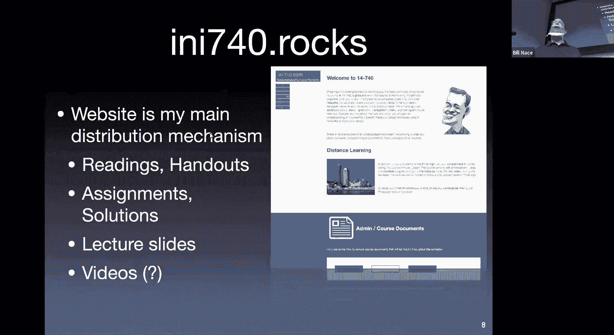

在本节课中，我们将学习课程的基本信息、政策，并初步了解计算机网络是什么，以及其核心组成部分——网络边缘与网络核心。

## 课程信息与政策 📋

课程网站是获取所有课程信息的主要平台。对于个人问题，例如对内容不理解、不清楚如何提交作业或找不到资料，请使用 Piazza 问答平台提问。所有学生都可以看到问题并进行回答，教授和助教也会提供解答，这确保了信息透明和高效率的沟通。

作业将通过 Gradescope 提交。完成实验或作业后，请在此平台上提交，助教将在此评分并提供详细的逐题反馈。你可以在此查看每项作业的最终得分和反馈。

课程使用一本非常优秀的教材，它解释清晰、可读性强。阅读时请积极思考其中的示例，以加深理解。除了教材，课程还会提供一些会议论文和 IETF 工程文章作为补充阅读材料。

以下是关于课程评分构成的详细说明：

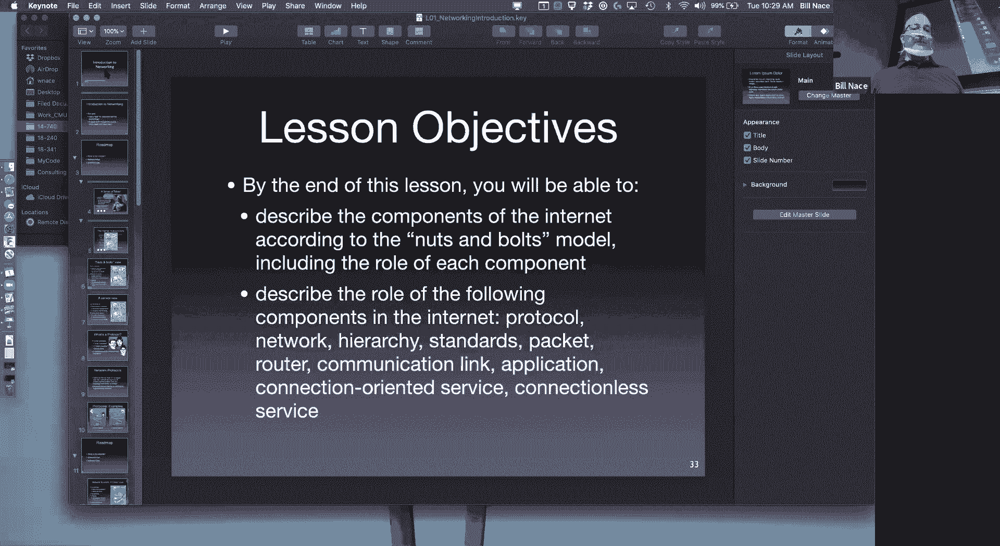

*   **作业 (40%)**：包括两次侧重于解题的作业和四次实验。实验将使用网络分析工具 Wireshark 来捕获和分析真实网络中的数据包，每次实验对应网络的一个不同层次。所有作业均为个人任务，需要提交报告。
*   **论文评述 (10%)**：本学期需要阅读8-9篇论文。对于每篇论文，你需要完成一份评述，内容包括：总结论文的核心贡献、列出三个最重要的观点，并提出两个可以在课堂上讨论的问题或评论。
*   **测验 (20%)**：在课程进行到约三分之一和三分之二时进行，内容不涵盖全部课程，只涉及自课程开始或上次测验以来的内容。
*   **期末考试 (25%)**：在期末考试期间进行，内容涵盖课程所有材料。
*   **课堂参与 (5%)**：这部分成绩旨在鼓励大家积极参与课堂互动，提出问题或发表评论。仅仅出席课堂是不够的。

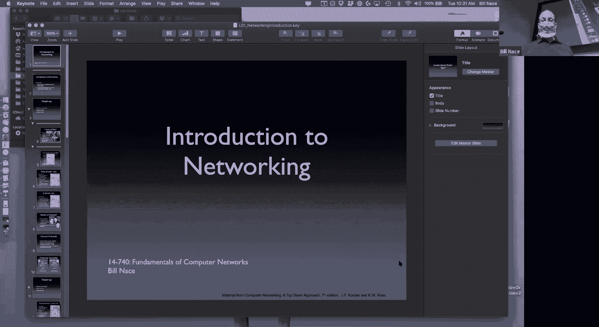

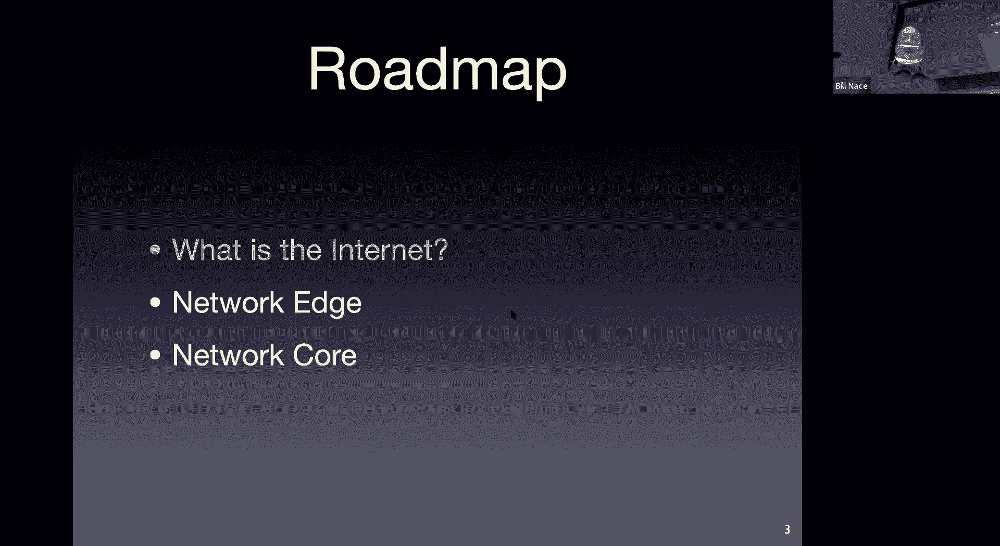

最终成绩将根据上述加权平均分，按标准分数线（如90%，80%，70%）划分等级。

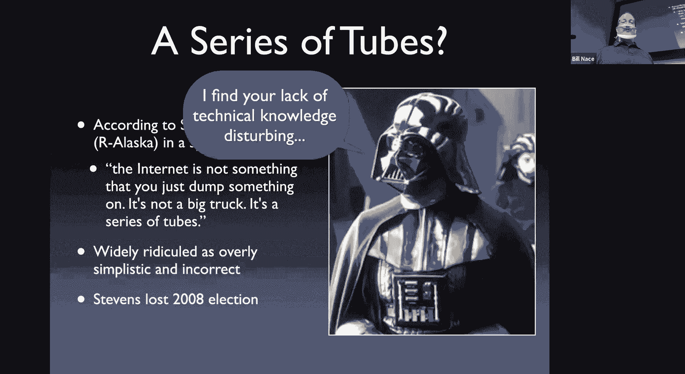

本课程是计算机网络的基础入门课程。如果你在本科阶段已经系统学习过网络协议栈、传输层协议或路由器工作原理，那么你应该选择更高级的课程（如14-756或14-746）。

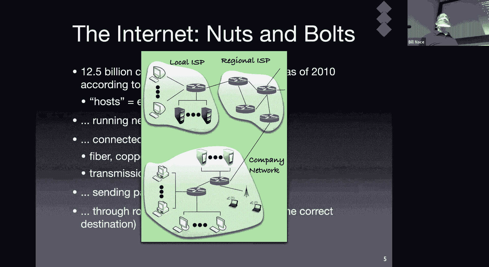

关于学术诚信，合作讨论是允许且鼓励的。例如，与同学讨论作业中不理解的概念是很好的学习方式。然而，直接交换答案、分工做题然后共享结果，或者集体推导答案后各自照抄，这些行为都是不被允许的。正确的做法是：通过讨论获得启发后，独立完成自己的作业。

以下是成功学习本课程的一些建议：

*   **参与课堂**：教授和课程设计能为学习增添价值。
*   **保持规律作息**：良好的时间管理有助于高效学习。
*   **寻求帮助**：教授和助教团队会通过 Piazza 和 office hours 提供帮助，遇到困难请及时沟通。

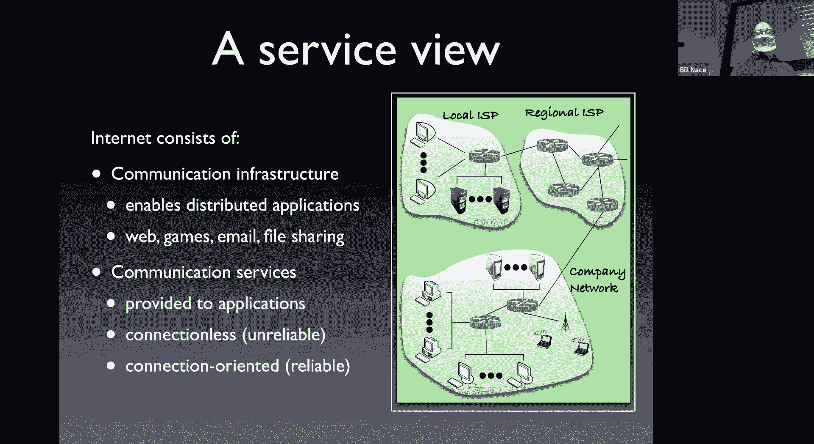

关于课程政策，作业必须在截止日期前提交，不接受迟交。对于寻求帮助，教授和助教都乐意解答。如果是关于作业评分的具体问题，联系负责评分的助教会更有效。Office hours 时间将很快公布在网站上。

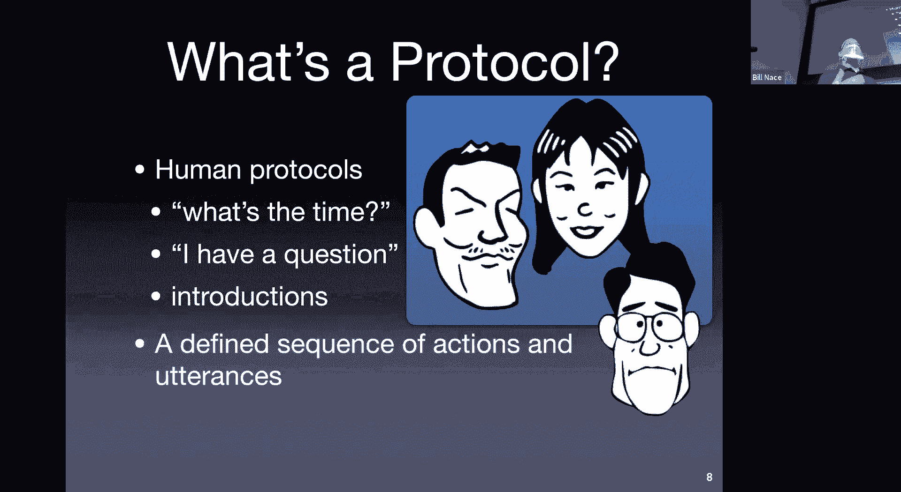

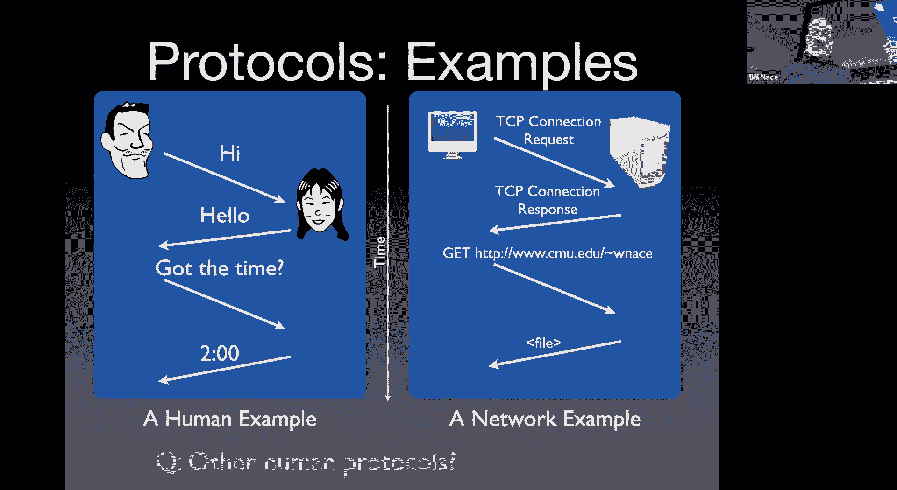

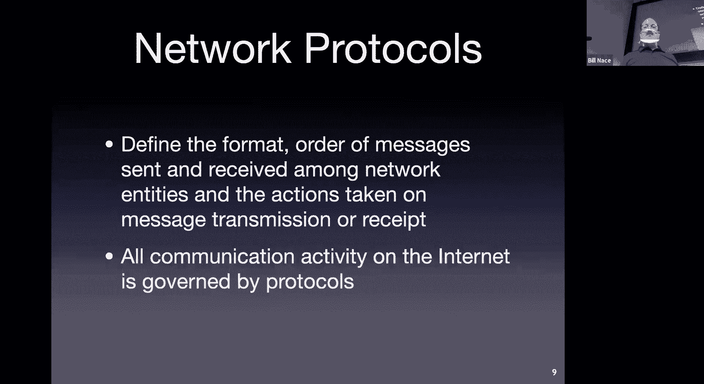

## 什么是互联网？🌐

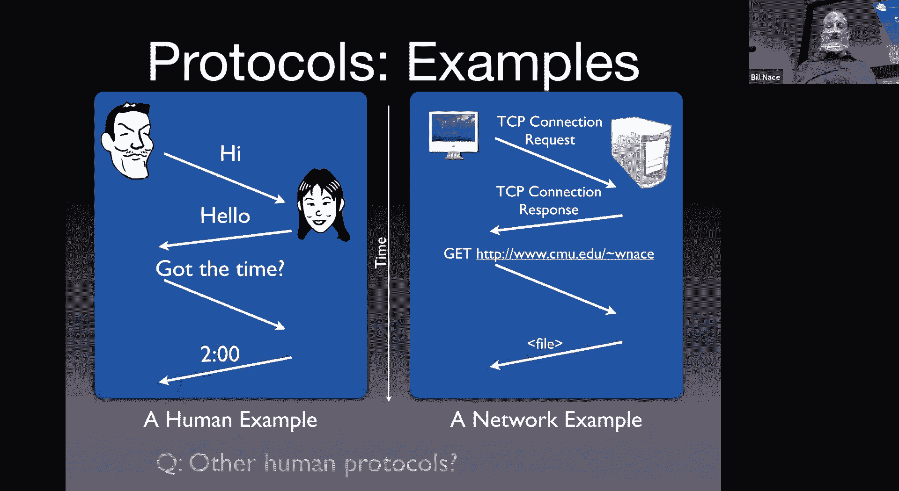

上一节我们介绍了课程的基本情况，本节中我们来看看一个根本性问题：互联网是什么？

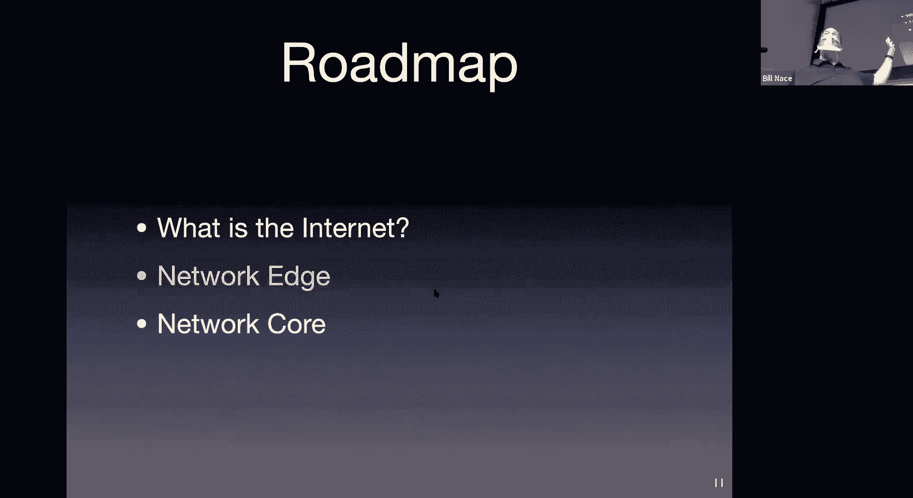

我们可以从两个角度来理解互联网。

**1. 具体构成视角**
互联网是由硬件、软件和协议构成的全球性网络。
*   **硬件**：包括数以百亿计的联网计算设备（主机）、各种通信链路（如光纤、Wi-Fi）以及用于转发数据的路由器。
*   **软件**：设备上运行的各种网络应用程序（如电子邮件、浏览器）。
*   **协议**：控制网络中信息收发的一系列规则和标准，例如 TCP、IP、HTTP、SMTP 等。协议定义了消息的格式、顺序和含义。
*   **组织**：互联网是众多独立网络的集合，没有单一的控制中心，其标准由互联网工程任务组（IETF）通过“请求评议”（RFC）文档制定。

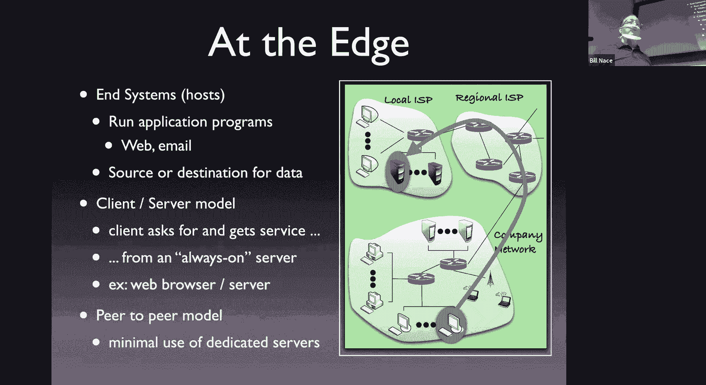

**2. 服务提供视角**
互联网是一种为应用程序提供通信服务的基础设施。
*   它使得运行在不同终端上的应用程序能够交换数据。
*   它主要提供两种服务：需要预先建立连接的**面向连接服务**（如 TCP，提供可靠性保证），和无需建立连接的**无连接服务**（如 UDP，不保证可靠性）。

网络协议类似于人类社会的礼仪。例如，询问时间需要遵循“打扰一下”、“请问几点了”、“谢谢”这样的消息交换顺序和格式。网络协议同样规定了计算机之间通信的消息格式、顺序和动作。

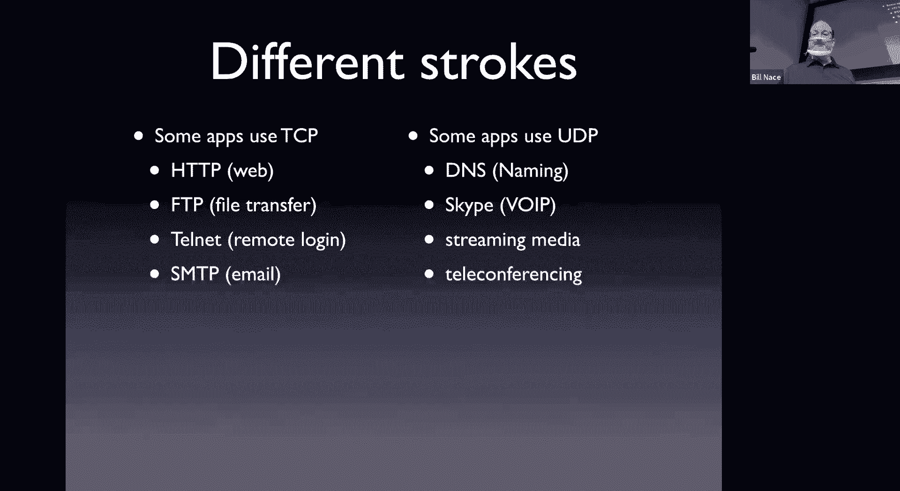

我们常用**时序图**来可视化协议交互过程。在时序图中，参与方沿垂直时间线排列，箭头表示消息的发送与接收，直观展示了协议中消息的交换顺序。

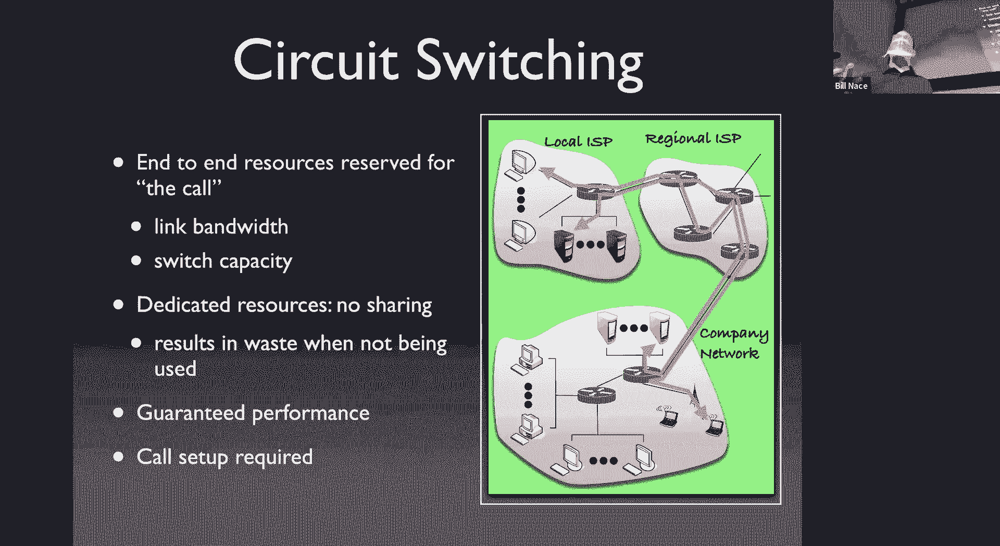

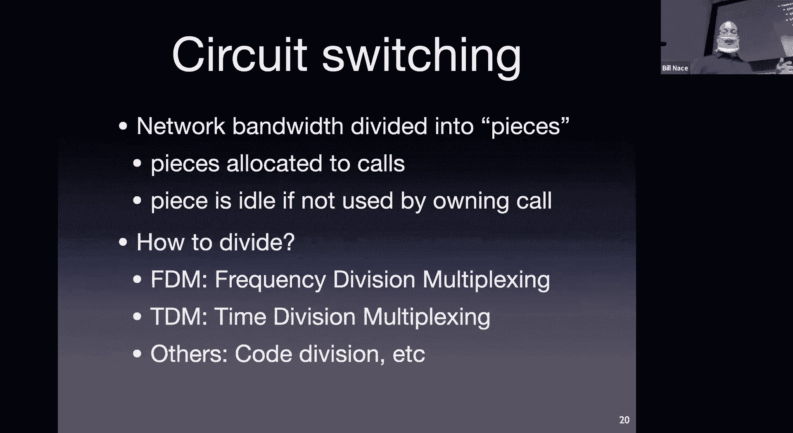

## 网络边缘与网络核心 ⚙️

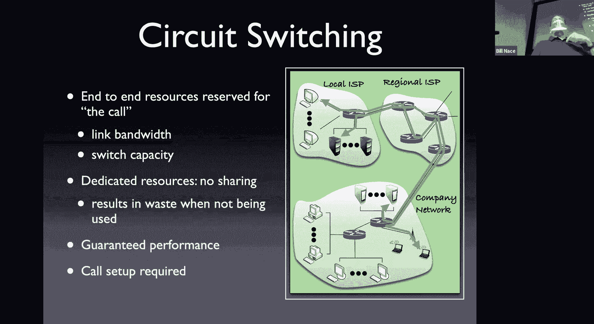

了解了互联网的概貌后，我们现在将其主要组成部分分为两大类：网络边缘和网络核心。

**网络边缘**指的是位于网络外围、运行应用程序的终端设备。它们可以是客户端（如你的笔记本电脑），也可以是服务器（如 Zoom 的服务器）。应用程序在此产生或消费网络数据。常见的计算模型包括客户端-服务器模型（如网页浏览）和对等网络模型（如某些文件共享应用）。

网络为边缘的应用程序提供通信服务。**面向连接服务**（如 TCP）在数据传输前需要进行“握手”以建立连接，提供可靠的数据传输。**无连接服务**（如 UDP）则直接发送数据，不保证可靠性，但开销更小。

**网络核心**是连接网络边缘的中间部分，主要由**路由器**构成。路由器是专用计算机，其核心任务是根据数据的目的地，通过复杂的互连链路将数据从源主机转发到目标主机。

数据在网络核心的传输主要有两种方式：电路交换和分组交换。

**电路交换**（如传统电话网络）在通信前需建立一条专用的端到端物理或逻辑电路。该电路在整个通信期间独占分配到的资源（如带宽），性能有保障。资源分配可通过**频分复用**（将总带宽划分为多个频段）或**时分复用**（将时间划分为固定时隙，轮流使用全部带宽）实现。

**分组交换**是现代互联网采用的方式。数据被分割成一个个**分组**。每个分组独立在网络中传输，共享链路资源。分组在路由器处需要被完整接收、存储，然后根据路由信息转发到下一跳，这被称为**存储转发**。由于资源是共享的，当多个分组竞争同一输出链路时，会产生**排队时延**和**拥塞**，这是一种**统计复用**。

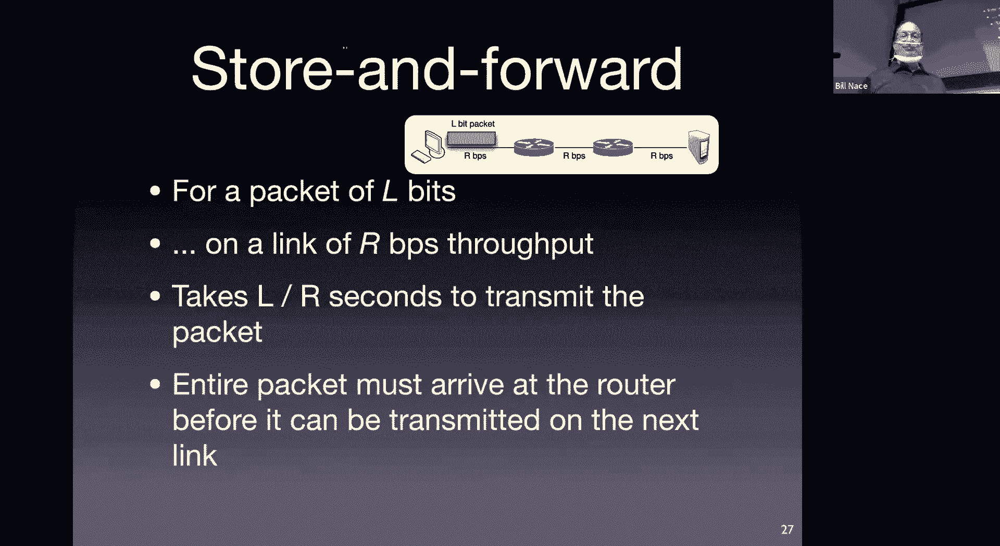

计算一个长度为 L 比特的分组通过一条传输速率为 R 比特/秒的链路所需的时间，公式为：
`传输时延 = L / R`

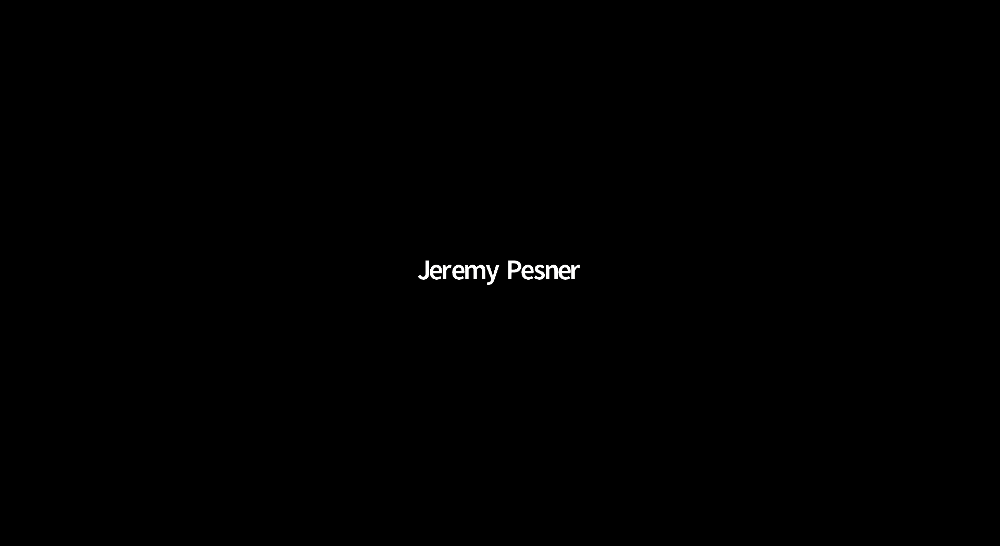

本节课中我们一起学习了课程的基本框架、互联网的定义与两种理解视角，并深入探讨了网络的两个关键部分：运行应用程序的网络边缘和负责数据转发的网络核心。我们还对比了过时的电路交换和现代主流的分组交换技术。在接下来的课程中，我们将对这些概念进行更细致的剖析。