# 卡耐基梅隆大学 14-740 计算机网络 Fundamentals of Computer Networks（Fall 2020） - P20：Lecture 20 Congestion Control The Router's View - ___main___ - BV1wT4y1A7cd

This is 147，40。I'm saying that in a very low voice， because it turns out。

One of the reasons I enjoyed being in economycon auditorium is that my wife actually teaches also from our home and on Tuesday mornings at this time。

 she actually has a class too。

So I'm trying to keep my voice down because she's asked me to and I know that won't last very long and then she'll get annoyed。

 but that's okay。We'll deal with it。Anyway。Those of you。

 hopefully nobody's in economy auditudorium today， I appreciate you all helping me out with this actually if you're in economy I hope it's by your own choice rather than the oh I forgot all about this。

Kind of choice。But yeah， we'll be basically for the rest of the year we'll be completely remote for our lectures。

So let's go ahead and get started。Today we're going to be still in the network today's our last。

Lecture in the network layer we're going to be looking at at things the router can do to manage congestion so I promised you way back when when we're talking about congestion control in tCP I said there's more coming and this is the more that is coming we have turns out some things the router can do to try to handle the congestion that's going on。

You did a paper review for today， only one more that's it for the rest of the class and that's late in the class that's the software defined networking paper so you'll be able to take a bit of a breather for this。

Got homework two， also that hopefully you are working on and lab3 will be posted。Pretty soon here。

But other than that。A little bit of a pause， a little bit of a chance to do some relaxing and take a breath for a little bit。

Okay， today we're going to talk about two things one is we're going to talk about the different。Ws。

or can handle the packets that are incoming and we call these queuing disciplines turns out there are different choices the router can make different algorithms that they can run when they're figuring out how to make choices about the packets that are coming in and then we'll talk about the content of the Floyd paper which was the randomly drop gateways。

Okay， so first off。Quuing right we've talked about queuing theory。

 we know queuing means to stand in a line， we know that queuing is not the favorite activity for us as humans and if packets had any animation to them any any thought processes I'm sure they wouldn't enjoy standing in line either on their behalf we humans who are sending the packets want things to get through the network as fast as possible we don't want our packets standing in line either。

But unfortunately they do and that's because of this queuing delay we talked we actually talked about this way back when like lecture two when we talked about the different delays that you would see in a network and queuing delay is one of the big ones and it's one of the。

Most variable of the the delays and so we'd like to find ways to keep it from getting too far out of control the。

Remember what's happening in the router is the packets are coming in from all of the different incoming wires and the routers making decisions based on the forwarding table to figure out where they should go and anytime you get a couple of packets aimed down the same outlet wire so here's link 42 is the wire leaving the router and you have a couple of packets that are headed that way。

When one is in the middle of transmission。You can't be sending another packet。

 you can only send one at a time， and so the others have to get put in a queue。

 they have to start waiting around for that one to head out。

Now it turns out that there are several choices the router can make about how that happens and those choices we call packet scheduling this is a choice of the packets that are available。

 so let's imagine you have five packets that are supposed to go out that wire 42。

Which of them do you decide to send next， which choice do you make， that's a scheduling choice。

There's also a drop policy choice that's a choice that happens when you don't have any space for another packet and so when all your memory full。

 if you have an incoming packet and no place to put it what do you do we call that the drop policy of the router that's another choice the router has to make。

And。Both of these choices are going to affect the they're not really going to affect the performance of the router too much the router is still going to be sending at top speed it's just sending different packets at top speed and so the effect will be seen on the particular packets that are being sent even though the router。

wonon't see a big difference one way or the other。So I have a couple different queuing algorithms to talk with you about today。

 five of them in fact， in various levels of detail。The first of these is PIFO， and this is the one。

You all know this is kind of the the normal progression of human life when we get into lines。

 those lines are oftentimes fiIO lines。And it's likely you were imagining that this is what happens in the routers all the time and that would not be entirely wrong。

It's what happens most of the time this is a very common scheme。

 this is basically packets coming in you see it in this picture I'm trying to show this idea that there's a cu in the router and a particular packet。

At the front of that queue will be the one that's being transmitted and anything else waiting for it just gets put in that queue。

 put in line one after the other as they go。And so that's kind of what I'm trying to show with this this blue box here being a packet that has arrived and this kind of area depicting how much memory there is for this cu with in this case three packets already in it and so this incoming packet just。

Joins the back of the queue。Know nothing about the the packet can make it special the routers choice so it's packet scheduling choice which of these four packets will get sent next its choice is。

Basically， just whichever one is the front of the queue will be the one that gets sent next。Okay。

 a couple things to note one of them is I'm showing this。With a single output。

 but we should recognize that the router is going to have many of these outputs and so there's going to be a queue at each of the outgoing space lines wires on the router okay。

 so if it has I've mentioned before， they often have many 48 wires going into this router。

48 wires that I can transmit packets on or that the router can transmit packets on。

 so 48 different cues where you would be putting packets in because it doesn't make sense to put one in line except for that particular link that you're actually sending it out。

Okay。And the router is able to do some like memory optimizations and things like that globally across all of the queuees。

 although we won't get into that too much。All right， so drop tail， this is a drop policy。

I said earlier that a drop policy is a choice that the router is making when it doesn't have memory。

So I'm showing in this case or'm trying to show that the space for our queue is full。

And this should really mean that the router has no additional memory to allocate here。

Maybe you there's a certain amount of space for each of the outgoing length or maybe there's just none left on the entire router。

So there's a queue， and in this case， it's full。Droptail is the common that's the one you would kind of imagine if a packet shows up to the queue and the queue is already full。

 you just throw that packet away， you drop it okay you。Remove it from memory。Okay。

 and that means that that packet will never get sent if it was important TCP would have been used and it'll be detected and all that kind of thing。

 but that's higher level decisions controlling this at the network layer at this particular router。

Nothing you can do， right， it's got to get dropped。Well。

 technically there is something you can do you could drop a different packet instead droptail doesn't so droptail is the choice that says when I have to drop a packet。

The packet that will be dropped is the incoming packet， the most recent packet that will happen。

As I said， it's kind of normal， this makes sense。To us as humans who stand in line a lot。

 but it's not the only choice it is however the most common choice In fact。

 fiIO combined with this droptail is by far the most common choice you'll see in actual internet routers and。

Yeah。especially among the kind of routers you and I have in our house like those $99 boxes we buy or that the cable company gives us。

 those things don't do anything special and so this is the easiest to code up。

 this is what's going on inside of them。It's also the easiest to control。

There's some issues with this though， maybe depends on how you look at it。

 one of them is the fact that there's no discrimination right you're just choosing whatever packet came in last。

And。And there's nothing to say that， you know， some packets should be chosen because they're more important or they're required more timely something or anything like thats just。

Whatever packet happens to come in， okay。We'll talk a little bit about how we may change this idea。

 but so far in the course， we really haven't talked about the idea that some packets might be more important。

Than other packets and how you figure out that importance and how that's decided as a tough choice。嗯。

Of course， using PIO and droptail means that we're kind of implicitly saying that our end hosts are using TCP probably or some other reliable transport why do I say that well first off if you're dropping packets。

You know that you。you're not providing any reliable service now the network is not intended to be reliable right the network is a best effort network it's doing its best and when a packet comes in and a queue is full it can't do any better okay。

But you know， we're basically saying if that packet had to be important。

 then somebody else has got to deal with the importance level and so that kind of means TCP is running。

Okay， it also means that all the packets are getting mixed together in this flow， in this queue。

 and so if somebody is being a little greedy and not paying attention to congestion control algorithms or something like that。

 there's no policing going on here。RightIt's that。knowThat flow will be overflowing the queue and yes。

 some of their packets may be dropped， but some of my packets will be too。

 and so I can be affected by somebody who's not behaving well。Let's see， so I'm sorry Albu Hadi。

 I didn't notice here。Here we go。Chaack question when it came in， so let me take a look。Yeah。

 so you were asking about when I was talking about the drop policies right and in this case drop tail would drop this one。

 but another policy might decide that there was a different packet to get dropped。Okay。

 so if I were to choose， you know， hey， here's a packet to throw away。Then that's a drop。

That's a drop policy that i'm choosing that one now what happens to the rest right do the rest slide forward well if my scheduling algorithm is a first in first out。

 then yes， they would all have to slide forward because the incoming one was not the first in。

Compared to any of these， so it's got to go at the end， okay。

But we'll see other policies that might drive a different decision there。Okay。So I'm not sure。

What you mean by fairness policy here in this next question？

If we start distinguishing which package to drop based on burstiness， et cetera。

 will that contradict the fairness policy， I'm not sure I understand that there is a fairness policy right it might contradict our。

Oh。Kind of standing our idea of what fair is we kind of want， hey everybody's packets should。

You should have a fair shot at router resources and that I guess does mean that if we're making choices we're going to decide one packet or another。

 but there's no like oh I can choose this fairness policy or that fairness policy right have to deal yeah right fairness is something we。

We look at a lot of times when we're looking at these algorithms and the choices they're making。

 we want them to be fair。But it's not like there's a。

Policy driving that or something we have an intention to be fair。Okay。Jeremy。

 will'll talk more about this， TCP does make that assumption。Right， TCP。

You using the receiver feedback to know if there is some congestion and so anytime you know if this packet gets dropped that TCP flow will do a couple things。

 one it' going totrain it's going to detect the loss because it has a timer going。Okay。

 and so it will retransmit to to take care of that one that was dropped， but you're right。

 it will also respond to that as if there was congestion。

Wwhich is probably the right thing to do look look at a queue right that thing right there it's full right so that's congestion so yes we would like TCP to notice that this thing dropped and to stop sending or to slow down the sending but let this router clear out this queue so it is reasonable to assume that and that's in fact the intention。

Okay， a different。Quuing strategy， a different choice you would make about or a choice that a router might make about how to choose which packet to send and's。

One of the it seems like this is the fundamental thing as soon as people get mad at PIFO and want something else。

 they say well some things are more important than others。

 we should have a priority right what shouldn't the important stuff go before the unimportant stuff and priority queuing is a reaction to that it's a way to to allow for some priority to make the important stuff not be waiting behind the less important stuff。

And so the idea here is I've broken my single queue now into several cues。 In this case。

 I've got three。With three different priorities on them right I have a high medium and low priority。

And you'll notice I have three packets in the high。

 I have a lot in the medium and five packets in the low priority cues。

And the idea is that when a packet comes in， we will put it in the queue。

That corresponds to its priority， and so I'm going to have to have some label or something on a packet to know what the priority is。

And then its priority will act in a PIO fashion， so if this if I have a packet coming in that is low priority。

 it will go at the back of the low Q and the low Q acts in PIO fashion。

 so of all the low priority packets the first one in is the first one to be sent。

The difference here of course， is I have these priorities and so the router as a whole is not acting as PIO right only each of the priority levels is acting PIFO。

The the router as a whole is working through all the high priority ones Every time it has to make a choice of which packet to send it's going to send the one with the highest priority of those available So in this case I have three high priority packets I'm going to send those one to three when those are done if the high priority queue is empty then we'll go to the medium queue and we'll send the first one at the front of the medium queue and work our way through all those and when we're done with the medium queue then we'll go to the low queue and make that happen so that's kind of the intention of this loopy thing I put in this picture right I'm looping here on a priority on a single queue I'm going to send everything out of this queue before I go on to the next queue。

Okay。嗯。So youho。If you have a single priority cu， that's the same as PFO， right。

 that's kind of like this one。Everything is the same priority right and so I'm tempted to use that line from the Incredibles about when everybody's special kind of think you look everybody's high priority right they all go in the same queue okay and so it only makes sense to do priority queuing if you have multiple priorities if you have something to make a decision based on。

Okay。There is a problem here。It dependss on how you look at it as still whether this is a problem。

 right， priority queuing oftentimes it's annoyed。Me it's the noise my innate sense of fairness also because I was in the military for many years where theres a lot of priority queuing going on and you know when you're the lieutenant。

 you get annoyed at the generals who always go first right and the problem is that the general's always going first means that you can get starved as a lieutenant right there's a it is possible that these low priority packets never get handled。

Okay， you can imagine I've got three high priority packets here that does not mean that this。

First low priority packet will be sent as soon as we send one， two。

 three high and then eight mediums， it's next up because during that time when you're sending these three highs and those eight mediums you can have other incoming packets that might go in the high queue and so they will step in front of you and go ahead and so it's possible that these low priority packets never get sent or takes a long time to send them we call that starvation。

Edtric， you get your hand up。Yeah， it was a question about like having three different priority cues so。

If so when we say that like we drop a packet when the cues are full。

 do each of the three cues have the same capacity in terms of like a memory allocation or is it one allocation for all of three？

No it's a great question and it's going show up in multiple places here because my picture kind of indicates that there is some memory set aside for high and medium and low and you have like the same amount of space for them that's typically not how you're going to manage this the router has a big pool of memory that it is using and there's no reason it can't use some of that memory for something else right so maybe maybe there's another entire link somewhere that has its own high medium and low。

Priority cues and nobody is sending anything out that link。

 I can steal some of that memory and bring it over and use it for these these particular packets。

Okay， and so usually it's not going to be as static as these pictures seem to indicate and so if you know like right now。

 if another medium comes in it looks from my picture like there's no memory space for it in the queue。

Okay， but that's an artifact of how I've drawn the pictures。

You would merely still take some of the memory that's not being used elsewhere and use it to store that packet。

Does it makes sense。Yeah， okay yeah， I was wondering because if if we did have static allocations then running out of memory for the medium one and dropping a low priority packet doesn't seem like it would solve that issue So that's right that's right you'd end up like dropping it It doesn't make right so first a couple things to remember one of them is that this is a scheduling algorithm Okay this is not a drop policy and so we can choose different drop policies。

Based on what's going on here。Typically that any policy we're going to choose is going to want to drop lower priority packets than higher priority right you'd never want to throw away a high priority packet if you have a low priority packet taking up space and you can recover that space from throwing that away。

So yeah。Gurishs got。Oh you've got the key point to all this。If we were in the classroom right now。

 I would ask anybody who would volunteer to let your packets get sent at low priority to raise your hand okay。

 and you know anybody out there who'd like to have all of your packets sent at low priority，Yeah。

 nobody right， we all want our thing to go high priority and so the question whenever you have a priority cu is how do you decide？

Okay， and。I point out on the slide that you could solve this through economics right this is how we solve many Qing problems through economics right anybody've been to Disneyland recently right you can stand in the long line or if you're willing to shell out some bucks they have a lot of different mechanisms for you to have I don't forget what they are you know fast passes or whatever that let you have some sort of priority right or you know at the airport you can。

Pay extra in terms of your loyalty and pass purchase decisions to become a frequent flyer and to be able to you know stand in get in the first boarding group queue instead of the second boarding group Q right that's how we normally solve these problems。

The issue here， however， is that the network is decentralized。And so there's no way。

No billing mechanism that is available that would let some network somewhere else。In the world。

 charge me for my packets。If I'm sending a packet and happens to go through a server into Tajikistan。

 I don't get a bill from a network in Tajikistan once a month saying， hey。

 we sent 14 of your packets， U owe 12 cents。I could imagine you paying money to your local ISP right and saying。

 oh yeah， sure， you know， Verizon I will I。At the。Instead of the slow plan or something and all my packets will be high priority instead of low priority。

The problem is that only holds through Verizon's network right as soon as Verizon passes my packet off to some other network it loses any special glamour that Verizon would have put on it or that I would have paid Verizon to put on it okay so there's no really good way and people have tried to figure this out for decades people love to make a business where we could find ways to get all the users to sign up for the gold plan but it just hasn't happened so we don't have a good way to do this we do have a couple of heuristics that sometimes run into priority queuing for instance there are some ways to look at particular packets and say oh this one is actually probably more important than another。

It tends to be things like， oh， BGP packets are important。

 right those are routing packets that are fundamental to the workings of the internet。

 those should go first。😡，Okay， and so that that sort of choice sometimes get made in terms of putting stuff into different cues and we'll talk a little bit more about network engineering when we get to software defined networking。

Within a network， it might be valuable for a particular network to make some decisions about how they'd like to run。

Flows through their particular routers and in that case then as Ro Ha has pointed out。

 the network administrator would have to be able to say。

 oh the packets coming from here and going to there are a higher priority then packets that intersect through there and so they somehow get set with a higher higher priority。

Okay， and Jeremy。It's the sort of thing that makes net neutrality people go crazy right because if and so part of me is glad that there is no chargeable。

 good chargeable mechanism in the internet to make this happen otherwise there will be backpart deals and you know Netflix would be able to pay Verizon to make sure Netflix traffic went into the high queue and you know we'd never have any other other company able to start streaming because you know they would wouldn't have the money to talk to Verizon。

To work with， you know， to be to negotiate as well as as Netflix would or something like that。

Abdul Hadi， you have your pan？Yeah， I was thinking that for example。

 if there's if I'm a server and I'm an application and I'm serving packets to my client。

 can't I like assign them priorities based on what I want to get done with first and what I want to get done with later？

And so we could maybe use the options field in the IP header or something like that to implement that。

 but won't that work。Well， so actually we have so let me answer the last part first。

 therere actually our label fields， we haven't talked about them much。

 but there's that TOS field in the IP header and that was the intention of that is to provide some differentiated service mechanism。

 the reason it hasn't taken off though is because of this decentralized idea。And that kind of。

 you're right that if。If the application was something that was intended to operate on a particular network。

嗯。And you had a way to communicate。Between the application and the network layer on the end hosts。

 right somehow you'd have to have your application able to set that value on packets on my computer admitted。

but even then， that meaning only has meaning in the networks that are willing to support it。Right。

 so a Verizon app on my。Maybe on my Verizon phone working on a Verizon network could set these values。

 but if those packets ever then headed off to some other network。

 the meaning of them would be lost entirely。And reply packets， of course。

 would not have that set unless they also happen to come from a Verizon phone with a Verizon app。

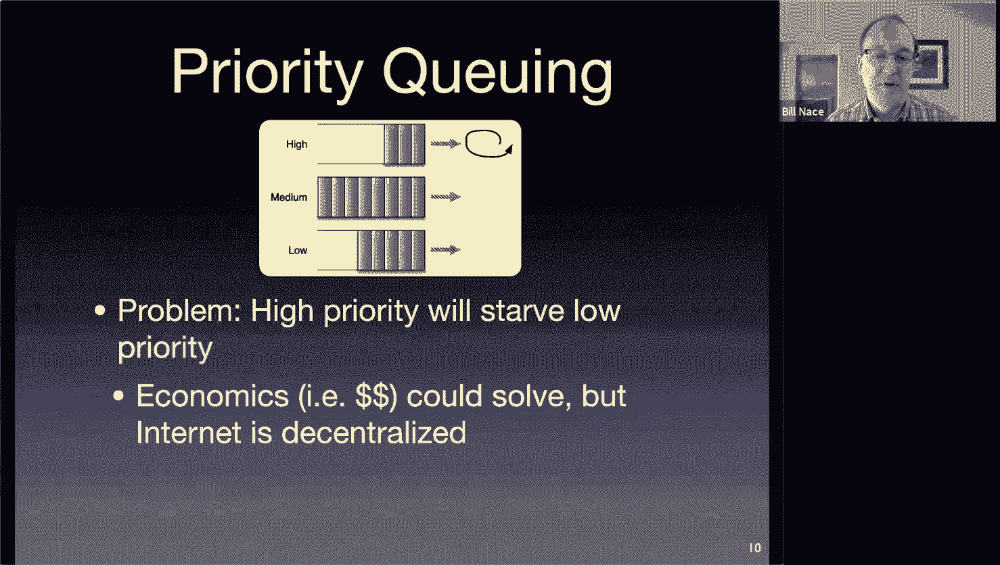

So， yeah。So another scheduling algorithm that is has a few less issues about choosing priorities is one that。

That basically says every flow ought to be the same。 Okay， so we'll have some you know， some。

Some fairness among flows， but we're not going to choose one flow as being more important than another and the idea here called round Robinqueuwing。

Is that each flow gets its own cue and now how do we define a flow？

Remember back to the net flow discussion we have a bunch of packets and we're trying to figure out does this packet in this packet have something to do with each other and we would do it based upon some of the fields in the headers right so we would be looking at things like destination IP address and port numbers and things like that to try to figure out if this packet and this packet belong in the same flow。

And so somehow we would have determined that that these are part of the same flow。

 and then we just would put them into their own queue。

Okay so in this case you see I have four active flows here and they have differing numbers of packets and the round Robinqueuing algorithm says let's choose one packet from the first flow and then go choose one packet from the next flow and then a packet from the third flow and then a packet from the fourth flow and then let's come back to the first that's what I'm trying to show with this arrow right we're not working through a single queue at a time。

 we're doing one thing from each and then going back around one thing from each queue。Okay。嗯。Again。

 this is a scheduling algorithm， so the questions I have here are drop policy related right flow two has a lot of packets in it。

Okay， so what happens？Do I， as we talked about earlier with the kind of static picture here。

 do I say， oh， you know， actually flow4 has plenty of memory。

 let's go ahead and take flow twos packets。And use memory that is shown in this picture for flow4 okay I could do that okay or I could just cap I should say。

 oh maybe I should have enough memory set aside so if flow four comes in with another seven packets it would only be fair for flow4 to be able to store those seven packets and so if I've taken that memory and given it to flow two that wouldn't be bad those are all drop policy questions。

Okay， and。I could argue either way right there are good things about about having the static picture and saying flow to is sending too many packets let me go ahead and not accept anymore okay and there are good things about oh we might as well accept them because we have memory for them I don't know what we're basically doing is trying to predict the future what activity will happen in flow for and maybe that memory would be needed and maybe。

When。Okay and this this quote here this last bullet multiple cues doesn't necessarily mean more wasted space that's trying to get to this point that Edric brought up about the the nature of the memory and whether it is allocated specifically to particular flows or not there's no reason that you you can't manage basically you know these values in the cues can be pointers basically to the actual packet sitting in some big。

You know big pool of memory across the entire router。Okay。There's an issue， though， right？

Flow2 looked like this。Being greedy， you'd sent more flowes than the other。

 more packets than the other。But it turns out all our packets don't have to be the same size。

And so it's here I've changed the picture slightly right and flow2 now has sent only a single packet。

But that packet is eight times the size of those packets that were previously there and under round Robbinqueuing。

Flow one will send a single packet and then flow two will send a single packet。

 which could be this huge thing。And then flow three and then flow four。

And that doesn't feel fair to us right because if that was sent as these eight different。Packets。

 we would have only sent one of them， okay， but if flow2 is sending bigger packets than anybody else。

 they get more bandwidth。Because the bandwidth is a per bit thing， not a per packet thing。Okay。Kyle。

 hang on a few slides， we'll get there， we will put priority and Rob Robin together in a minute。对。

Okay so how do we make this more fair how do we fact that not all packets are the same size that's the next algorithm the next scheduling mechanism that we would use to choose packets and it's called fairqueuing the idea is we want to deal with this problem whereby。

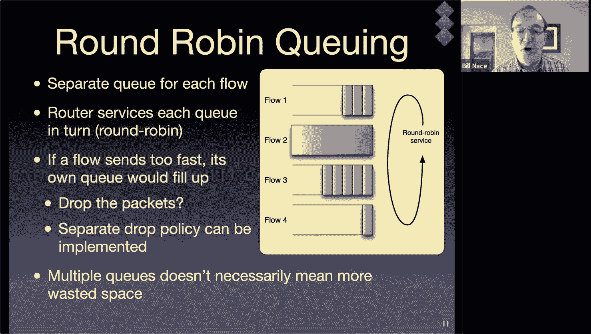

We're sending。Packets as a whole， but we want to allocate the amount of bandwidth to the bits in the packets。

 not to the packet themselves， and we want to make it so that you know here I've kind of rewritten the picture to show that we have in this case packets of different size。

If we did round Robin， I just choose， you know， packet of size five， packet of size 10。

 packet of size three， packet of size five packet and all of a sudden at this point in the flow。

 purple has gotten to send。15 units worth of。Of packets。Before green was it。Andend on both。

And that doesn't seem fair to us。Purple is using more bandwidth than green is just because purple is sending bigger packets。

Okay， and we don't want。You know， if the whole network worked that way。

 you might actually see applications being written to send， you know。

 let me collect and make sure my packets are as big as possible so that I can send the bits。

 what you want is applications to be sending amounts of data that make sense for what it's doing not to try to still you know get their fair share of bandwidth。

And so fair queuing is a slight change to。A round Robin algorithm where instead of just going one packet from each queue in order。

We're going to go as if we were sending a bit at a time。So you know， I can't do that。

 I can't send a bit of a packet and then a bit of a packet know， back and forth a bit of each。

 but I can kind of pretend that was。Okay， so the idea is if I were sending bid at a time， then。

I can calculate at what point in time I would be done sending this packet of size five。

It would take me five time units to get to that and it would take me then an additional three time units to get the second packet sent。

And so that second packet kind of finishes at time eight。

As opposed to this first packet that the purple one has， which would finish only at time 10。

And then time 15。 and so I'm going to use these finishing times。

To go ahead and make the choice about which packet it gets sent。

And that's going to allocate my bandwidth as if we were sending kind of bit by bit by bit and collect that up until we have enough。

Bit sent to go ahead and send the whole packet as a whole and so if my order is different you'll notice in the previous slide we went green then purple green purple right now we're doing green green purple。

And this means that， you know， the green was able to send eight and purple 10。

 and that's closer to being fair than five for green and 10 for purple。Okay。

Does that make sense to everybody？From a。Academic perspective。

 if i'm talking about algorithms and you know writing out conference papers and talking about you know who chooses which I can there are some kind of。

Academic names we put on on some characteristics of this so we measure the algorithms and it turns out actually a lot of our algorithms are what's known as work conserving。

Right so what you you don't want to waste work time that the router could be sending packets so almost because all of them we've talked about are work conserving in that they will send a packet if there's one anywhere to send。

Even I guess I should point out， I didn't when I was talking about Ron Robin。

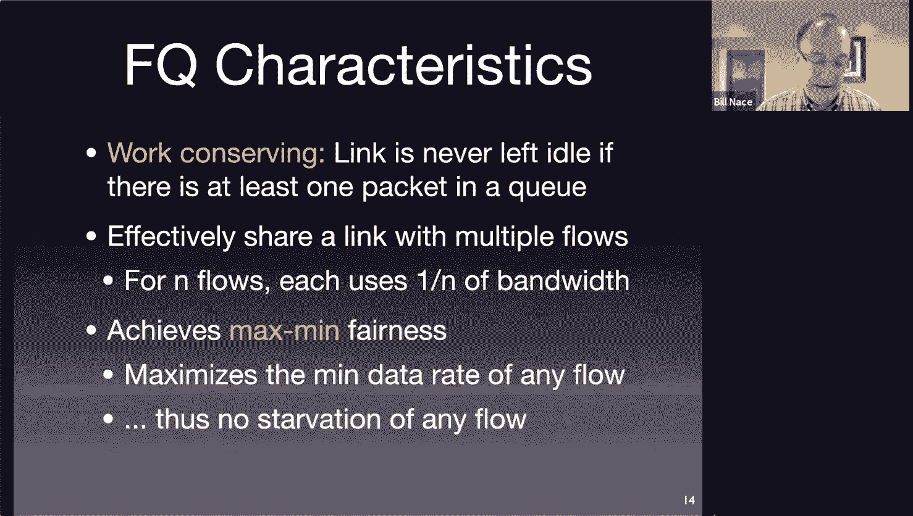

I send once I've sent one packet from each of these flows， the second time around flow4 is empty。

Okay， I don't sit around twiddling my thumbs。You know pretendending like well this is the time when I would be sending from F4 if they had one right instead we want the router to be work conserving so if there's nothing in a flow you just skip it and go back you know and go on so as long as there is a queuee to a packet to send from any queue we're going to send it okay that's what we mean by work conserving and all these algorithms are work conserving。

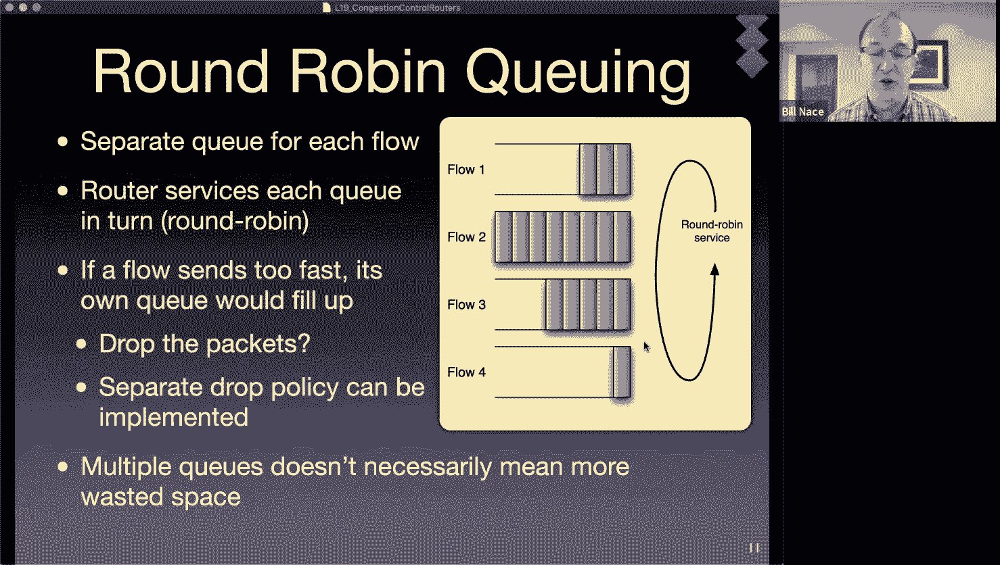

Okay。Fairqueuing goes beyond that， and it does a good job of sharing the bandwidth in the link。

As long as if there are multiple flows， then each flow is going to get its fair share of the bandwidth regardless of the packet size it's using。

Okay so it's going to get one in of the bandwidth。When measured over many packets。Okay。

And that's because the calculations of how to do fair queuing are based upon how many bits you're sending。

And so if you're sending more bits， you get， or you know， if everybody's sending bits。

 then everybody gets their fair share of the actual bandwidth。A。

Another word we use to describe these is max Min fairness。

Which fairqueuing achieves and it's a little bit weirder concept and I'm not sure my words here。

Describe it in a non confusing way， it maximizes the minimum data flow of any flow。

And the minimum data rate of any flow， what that means is if you look at an algorithm。

Let's take priority queuing， right？What is the minimum possible。Data rate of any of the flows。 Well。

 if， if we look at the low priority flow， low priority Q， the minimum data rate。

 it is possible to have a data rate as low。 Well， as0。 right you can have starvation。

 And so as long as。High priority packets are coming in。

 the low priority queue could get zero bandwidth。Okay so that's the minimum data rate it has。

And what you'd like is an algorithm that maximizes that minimum value。

 that's why we call this max min right I'd like that minimum value to be higher。

 I don't like zero as my potential data flow if things just happen to go badly。

Okay I'd like to get that number up a little bit more。Or how do I do that？Okay， well。Right。

Other algorithms like fairqueuing， fairqueuing is going to make sure that there's no way to starve you。

 even if some other flow is sending big packets。Right and so that you know you can do the proof and prove that there is no way to get the minimum level of service any higher you've maximized。

The worst case。So the worst case isn't as bad as it could be。Basically， in fact。

 the worst case is the best。It could be of all algorithms。

That's what we're saying with maximum fairness。There is another touch to this， my fifth。

Quuing algorithm that's when Kyle was mentioning earlier of let's add priority and fair queuing and and this is。

If you're going to do fairqueuing， weighted faire queuing is not that much of a difference。

The idea is that each of the cues is going to have its own weight assigned to it。

 its own priority and again。Where priority comes from is an interesting question。Okay。

 I'm saying here somebody manually configured it right or somehow you have some other signaling mechanism that says these packets are in this particular flow happen to be high priority。

Or maybe thered be GP packets， so therefore that flow is high priority。🤧And then。

What you do is when you're trying to do the calculations of finishing time for each packet。

 the finishing time， you can divide the finishing time by the priority。

 or you can multiply the number of bits you're allowed to send by your priority。

 either one would be the same。And that means that the flows that happen to have a higher weight end up sending more bits than the flows that have a lower weight。

And。Yeah， so this is a。A slight tweak to the scheduling algorithm。

 it is a useful tool when you do some things like you can some of the more complicated。

Reservation based schemes or things are trying to build what are called differentiated services architectures that that is systems that would allow for different priorities different quality of service is another term we use QOS that lets you assign different priorities to different flows and and actually be able to base。

Your reservation so in a reservation scheme， you would have you would be sending。

Signals to all the routers along a path ahead of time basically saying。

 I'd like to reserve some bandwidth and that would be giving flows with particular weights in each of those particular routers you're going to send through。

More complicated we don't talk about that much in this class。Advanced topic。Okay。

 any questions about any of those queuing disciplines， drop policies， anything like that？Alrighty。

 let's move on to the paper you read。嗯。This is， as mentioned our。

Because it's our last shot at thinking about congestion control。

 which we've spent a lot of time thinking about in terms of the endOSs and how TCP manages congestion control and how it can run different algorithms。

Those were easy to change and easy to instantiate it's a little bit harder when you're getting routers to do the same thing you if you have any widespread congestion control algorithm you want to incorporate。

 you need to change a lot of routers， which can be difficult C IPV6。

The other problem is that congestion control in like all the algorithms in TCP。Well。

 they're controlling their sending rates based upon what they measure or what they think is happening。

Okay， and so they do things like here's one of the strategies for all the load based。

Or loss based congestion control algorithms， you know when we saw some collisions happening or when we saw some loss happening。

 when we saw some three do backs or whatever signals that TCP was collecting。

That meant that the congestion was already starting to have an effect and so the TCP implementation would then pull back the congestion window。

 you'd slow down the rate at which you're sending。The packets and。

And hope to control congestion because of that and that means you kind of have to step your foot into the realm where there's actually congestion happening and you're actually seeing some loss occur before you can do anything about it。

And we had delay algorithms， by the way， that tried， did a good job actually of predicting it。

 they would measure the roundship times and see that the delays were increasing and say，ooh。

 looks like there's some congestion coming because of that。

The idea that we're going to talk about today is more of a。

 let's see if we can avoid the congestion a whole lot。In the first place， right。

 let's not get into that realm where we're dropping packets。

And we're going to do that based upon knowledge that the router has。

The individual router knows what's going on on a particular， well。

 remember also this is on a particular output link。So the router is going to look。

At an output link and say oh， that the cues are really long there there's a lot of packets being sent。

 that's congestion and it can do that based upon the state it sees at that instant going on in the network。

And so the idea is was your way to go ahead and use this？To tell the senders to slow down and this。

Its a very fundamental idea it's been tried over and over again。

 in fact there are other network technologies like deck bit you guys have probably never even heard of the digital equipment Corporation company that's sold many。

 many many mini computers ATM is different networking technology TCP actually has a thing called explicit congestion notification it's an option field in the TCP headers you that lets a router specify oh look that。

This particular segment saw some congestion and that would be mirrored by a TCP receiver when it sends the ax so that the sender would look at this and say。

 oh， there was congestion， let me slow down。So those ideas are all there have been tried。In general。

 it turns out the feedback based mechanisms that TCP uses tend to be good enough。

Rand Mer drop is another take on let's have the router actually make some changes and so it's a kind of cool algorithm and has seen applicability in the world。

 so let's go ahead and talk about it。All right， so red is random random early drop。

 it's a algorithm that's run at the router so that helps because the router actually knows its particular notification knows what's going on。

 knows what its state is。We're still going to kind of assume， in fact。

 we're going to for much of the discussion， we're going to assume that the packets are carrying TCP segments and so that TCP will be able to react to things properly。

And we call this an active queuee management scheme。

 it's because the router itself is actually trying to manage what's going on with the congestion at particular cues as opposed to if you don't do something like this。

 the router is more passive right the router is just kind of like well I'll take packets you know fill up my cue when my queuee gets full I'll drop a few。

 you know， it's not actively making decisions to try to avoid that situation。Okay。

 so it's going to randomly choose a packet， thus the R part of it its acronym。

 it's going to try to do this。Before the congestion really gets bad。

 that's actually the key point here is that the router because of its knowledge is trying to make predictions before the end hosts have time to make the predictions before they have the data they need or have actually seen the congestion so we're trying to be early on it and when we see the congestion we're going to inform the center by dropping random early drop I should also technically every time today when I say drop a packet。

Or markup packet the two。😡，As far as this algorithm or concerned are the same。

 the effects won't be the same if I drop a packet I'm actually throwing that data away。

 if I mark a packet， then I am doing the kind of early congestion notification techniques right I'm setting a bit in the TCP options field and expecting the end hosts the receiving host to send that back to the sender。

As far as this algorithm is concerned， either one would be fine。

And so we will use the term drop or mark independently through the rest of this conversation。

All right， so what are we trying to do here Well we're trying to。Well。

 it turns out there's this thing called persistent queuing delay。

What will happen as you have a bunch of routers sending packets around is that you end up with。

 you got a couple packets。In the queue and the queue isn't necessarily getting into congetion realms。

 but maybe it's just kind of hanging out holding a bunch of stuff we call that a persistent delay yeah I always have you know eight packets in the queue kind of thing。

And in those cases， it's nice to kind of shock the system a little bit get you know if you are if you have a persistent。

Delay。That means if you've already got always got eight packets in the queue。

 that means your incoming and outing averages are about the same， okay， so。

Woulddn't it be nice to have those averages but with zero packets in the queue and so oftentimes we kind of shock the system to make that happen so that we can clear out our queue。

And get back to about the same situation and some cases， that will mean that we're going to。

By being early， we're going to， yes， we'll drop a few packets。

 but that's better than what would happen if we didn't if we don'tt。

Do anything early and we run into congestion that means a lot of packets are going to get dropped so let's go ahead and keep that from happening。

What we're actually doing here， if you think back many lectures I showed a picture of a curve and we said we all agreed that there was some knee point in our network that we wanted to control around we wanted to make sure the network load was you know at some point where we got a lot of throughput but had very little delay and so what we're trying to do is do the control anytime we get beyond that knee let's bring it back below that knee that knee point。

We're also avoiding a couple things that we've talked about one of these briefly。

 but we haven't talked about the idea of global synchronization。

Think about a whole bunch of TCP flows that are running effectively along the same path。Okay， well。

 what happens with TCP TCP increases congestion window， increases congestion window keeps you know。

 increases the flow， increases the flow until there's a loss and when that loss happens。

 then you back off dramatically。Well， it turns out if you have a lot of flows going the same way。

 then you have a bunch of TCP senders that are all increasing their congestion window。

 all increasing their congestion window until some congestion happens and when that congestion happens。

 then basically everybody loses a packet。And therefore， all of the TCP。

Senders will detect that there was some loss they will all drop their congestion windows in half or back to slow start or whatever they'll all react similarly。

They'll back off， which is good， and that particular router will get out of the congestion situation。

But they're all kind of synchronized， so all of them are now backed off。

 so there's a bunch of bandwidth going to waste and then they all increase。

 all increase all increase together until they all cause a loss again。

We call this global synchronization okay and it leads to a lot of bandwidth being lost because everybody's backing off at the same time。

 it'd be nice to break those up so that you know， one was backing off。

And lowering the bandwidth and others were still able to make use of the bandwidth they had。

The other issue that a lot of times happens is a bias against bursty traffic。

 a lot of what we do tends to be very bursty， that is we have periods where we don't send many packets and then we suddenly do something and that sends a lot of packets。

And then we go back into a scenario where we're not sending very few of our applications actually are steadily sending X number of packets every second。

If that's their average。X packets per second very few applications will actually send x packets and then x packets and then x packets right a lot of them instead will send very low numbers very low numbers high number low number low number number right this is kind of how humans work with computers。

A lot of times the computer is waiting for us and when we do something。

Then all of a sudden it has to respond and it needs to respond by sending stuff to DNS servers and then to web servers and a bunch of requests to web servers and oh。

 I need a favorite con to go with that and I need the JavaScript file to go with that and we collect all that stuff。

And then the computer sits around rendering for the user waiting for the user to click another button。

And so it says bursty traffic， we don't want the bursts to be seen as the congestion and then a lot of packets to be dropped from the same flow because the same flow。

 even though it's average amount of bandwidth is low， it's。

Banddth usage for a small period of time is very high。

 we don't want lots and lots of its packets to get dropped because of that。

So here's the algorithm for red。Every time a packet comes in。

 you're going to basically run this code All right first thing you're going to do is calculate the average Q size。

 I guess I should point out this is done after we've done the forwarding so we know which link the packet is going to get sent out on and so we're all this everything I talk about in terms of Q sizes and which what to do with each Q that's on a per output link basis。

And so every one of those 48 wires connected to my router。

Would have an instance of this algorithm basically running on that output。

So I have a packet that is supposed to be sent out a particular link。

 let's go ahead and look at what the Q sizes are for that link and calculate some average number。

And then we're going to decide is this average number small medium or large， basically。

 is it small enough that we don't care if the Q size is small。

 that means there's no congestion happening， then adding this extra packet to the Q is okay。

 it's not going to cause a problem。If the。Average Q size is big。Okay。

 that means there is a problem and so what I wanted to do in that case is I want to drop that packet right I don't want to accept that packet into the queue and so I'm going to drop it or I'm going to mark depending on which way we're running this。

If it's in the middle though i'm going to well not too small and not too large what am I going to do I don't know we're going to basically roll some dice we're going to randomly decide should we drop this packet or not and so we're going to calculate some probability。

And we're going to choose a random number and if the random number is less than that probability then that packet lost and so we're going to drop it or market。

If its if the random number is above that probability。

 then we go ahead and add the packet to the queue。

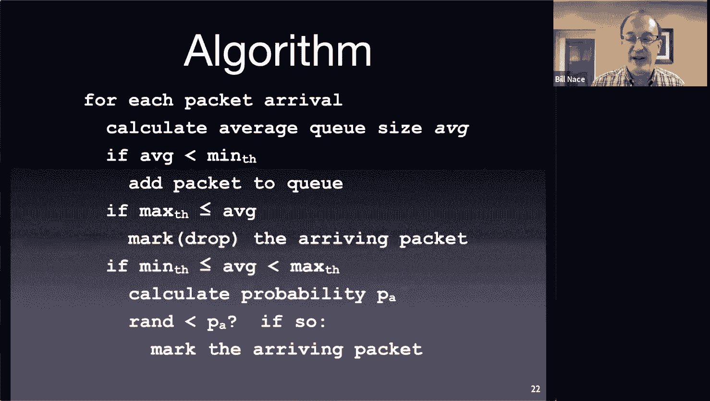

Okay， here's a kind of a graphical way of looking at it。

The packets coming in we choose we do the calculation， what's the Q length。

 is it small medium or large， if it's small we're going to go ahead and put the queue in the packet put the packet into the queue。

If the average is big， there's not enough space， we're going to drop the packet or mark the packet。

 but if it's in the middle， we might go one way we might go the other way and to decide that we're going to choose a probability and do a random number and decide which way we go。

And so Jake， you're right， every outgoing link has this picture on it。

ca it has its own separate queue right so the size of a Q you know I don't imagine something graphically imagine you're in the middle of of Wan Hall at some router right and you could send you have outgoing links that are going to Hammerlaag deporter to Baker you know to fine arts to UC it doesn't help if you know if you've got a bunch of packets going to the UC。

Then I don't care what the Q length is to the other directions。

So this is all happening per output out link。On our router。

And so that means that the Q lengths and computing are for the Q on that particular link and packet the Q I'm going to put the packet in。

Or drop the packet from that queue is on that particular link。Yeah， very important point。

All right so in this picture there are a couple of fuzzy ideas we haven't talked about right there's i'm computing something i'm calculating something i'm deciding you know is my average too big or too small how do we handle all those well those are the details。

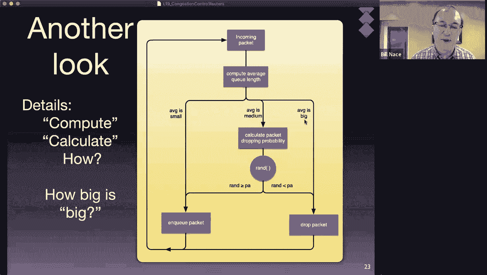

That come up in the paper。First off， average Q length， right you can look at the Q or the router。

 can look at the queue right now and say， oh， you know。

 there's 27 kilobytes worth of packets in the queue waiting to be sent。

Or whatever or there are 79 packets right it can it has the status。

 it can look at that cue and know what's the situation right now。Now it turns out。That data is very。

 very bursty， Okay， and so。We want to kind of smooth that out and get an average queue length。

 not just an instantaneous queue length。And so turns out Floyd uses this same technique。

 we've used it before。 Do you remember where we used the exponential weighted moving average？

When did we talk about that？Yeah， very， very true， Luke。

Back when we were estimating round trip times。All， we had values。

 we had these sample round trip times that were very bursty， very all over the place。

 and so we wanted to smooth them out。And so we went ahead and。And took the value coming in Okay。

 so the Q length is the instantaneous value， I multiply it by some parameter。

 I then add it to the old average。Multiply by  one minus that parameter。

 and that becomes our new average。And so I'll do this calculation， get an average Q length。Okay， and。

That is nice and smoothed out so that I'm not reacting to just kind of what you know oh look I just had four packets come in that happen to go out the same way that's a maybe a very short term event I may not want to react to that so quickly I want to react on if there is a steady increase in the number of packets on this particular outgoing link。

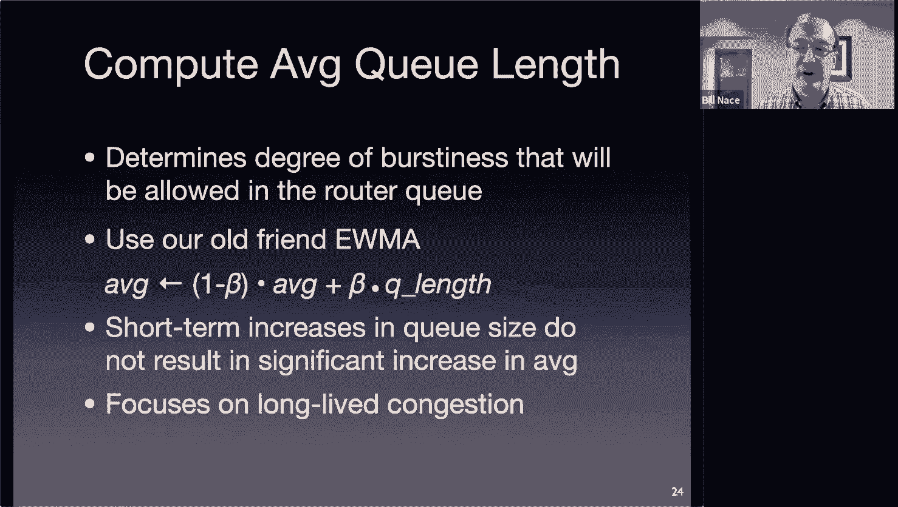

Here's the picture from the paper。Okay， and it's hard to see a little bit because there's a couple lines on here that are all drawn and black and very similar。

 Remember this is an 1993 paper we didn't have。You know color PDFs at the time so this is the Q length over some amount of time and you'll see this kind of up down bursty value。

 this one that's all over the place is the number of packets in the queue。

That's the instantaneous Q size， though。Okay， and so it's all over the place。

There is another line buried here that is this one。 This is the smoothed value。

 So if you take this bursty up down， up down， up down kind of thing and do the exponential weighted moving average。

 this is the moving average you seen， you'll notice it takes a while after it's been a lot of low traffic。

 it takes a while for that that exponential value to get anywhere。

Okay even though the instantaneous value was you know was way high， was over 30 packets at one point。

Exponential value hasn't grown。So fast， so it's nice and it is a very nicely smooth value。

And then there's also these two dotted lines here， the horizontal lines those tell us what the thresholds are we'll talk about those in a minute that lets us know whether this average size is low or medium in this middle area or if it were up here it's a high。

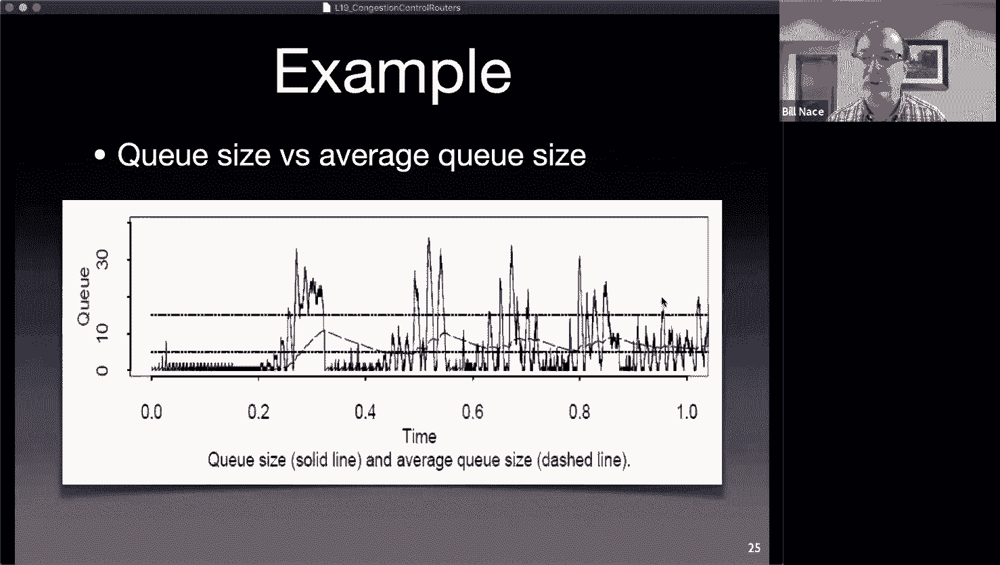

High threshold。Okay or high value above the threshold。All right。

I mentioned a minute ago thatre going to we're going to use the exponential weighted moving average because we'd like to smooth out these very bursty values。

系诶。That might seem weird right I'm actually talking about the advantages of having a router do congestion control because it knows the situation right now。

 so shouldn't we react to that congestion right now， shouldn't we be doing things。

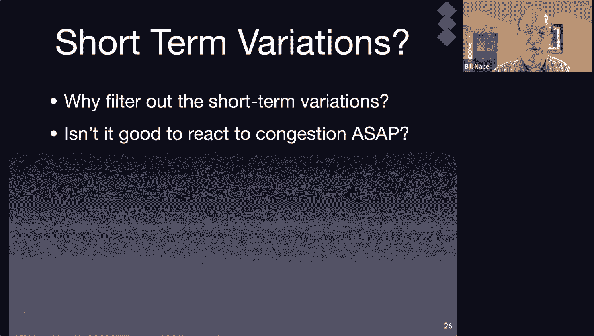

Look， I have a long queue length。But the exponential value， the moving average value is still low。

 still， it's like four packets in size， whereas my instantaneous Q size is above 30。

That sounds like congestion to me， shouldn't we react to that right now？

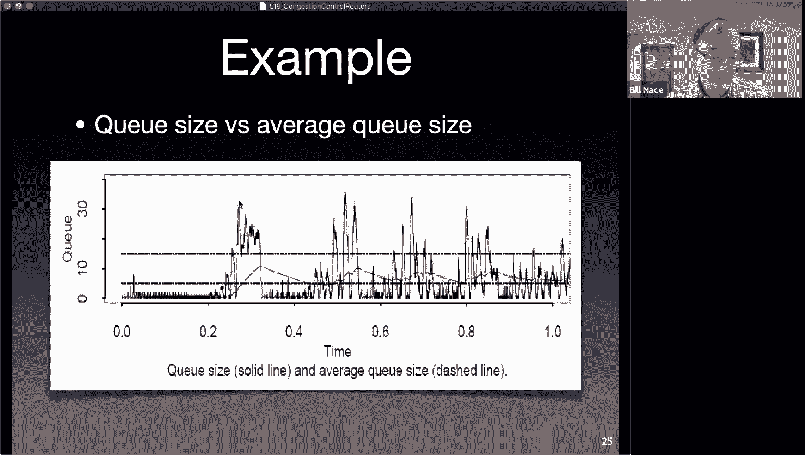

What do you guys think？Why do we smooth stuff out？Why did the paper say we smooth stuff out？Sure。

So againness you write， there's a burst there， right， that's the whole thing we're trying to do。His。

Yeah， is to manage this burst， right？To ignore a short term burst。嗯。Yeah， you got not very's precise。

 but we obviously were trying to avoid these outliers， I guess why is my question？

Dion says the short term burst isn't going to。Result may not result in a long term value。

 and that's true。We'd like it not to well why not react to that and right now kill some packets to make sure it doesn't。

The issue is one of the reaction time。嗯。If I do anything at the router。嗯。

It takes a hall for any sender to discover that。If I mark a packet。

 that marked packet has to go to a receiver and then travel back to the sender， if I drop a packet。

 then I have to wait for a timer to go off before anybody discovers this。

And so nobody can react as fast as the router could anyway。

So if I was signaling right away that there's some congestion。

Nobody can do anything about it right now and it might be that that would be an overreaction right it might be that this is some transient thing which we actually saw in that graph right we see here yes。

 there is a lot of congestion it's bursty。

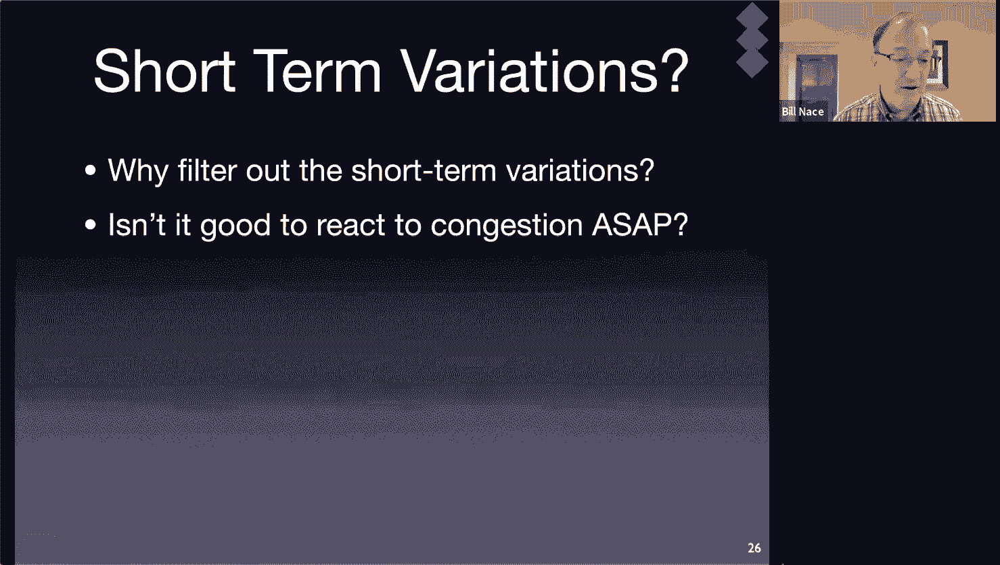

So it's transient and you in a very short period of time it's gone。

And so if we had done something to kill off a bunch of this， we would have created a bunch of loss。

And maybe it would have fixed itself anyway。

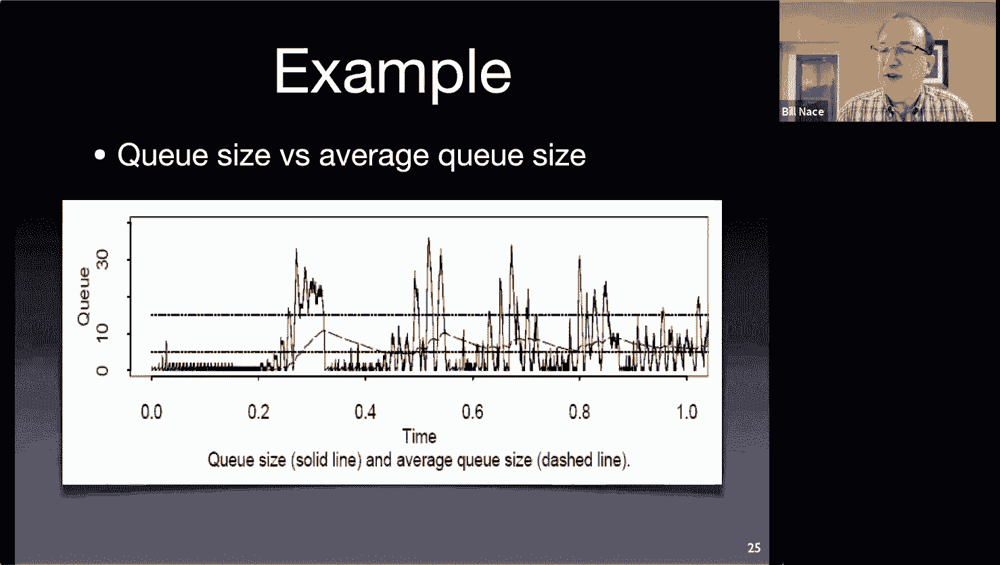

Okay， so' we can't send the signals quick enough。To get anybody to instantaneously respond anyway。

 so let's kind of hang back and allow ourselves to get a feel that this actually is long term congestion before we do too much reaction。

All right， next question in our from our picture graph a minute ago was how do we set these thresholds。

 we have to make this decision that there's some small number and some large number and Floyd in that graph showed these two horizontal lines。

Those were these thresholds that split the entire average queue length into small medium and large chunks。

OkayAnd so there is a minimum threshold， a maximum threshold。

That specify kind of I don't care below this I don't I do care and we'll always react above this and in between then there's some you know groupsop things are starting to get bad kind of situation。

How do you set those？Yeah， those you just choose right those are let's once again。

 we're going to kick it back into the network administrators world and say yeah。

 network administrators should somehow set these values。Okay。

 I'm sure somebody at some point in the last two years has said， oh。

 let's go ahead and run a machine learning algorithm on the router to find out what those thresholds should be。

 but you know， okay， you set some numbers。All right， next question， we have some probabilities。

 how do we calculate the probability of dropping the packet， should it just be a coin flip 50，50。

It could be。that's a random decision， but if you're doing that。

 then you're basically saying that anything， any situation where you're just barely into the middle territory is as bad as when you're just next to the the max threshold。

 you're basically saying everything in that middle range should be handled the same way。

And so the paper wants to be a little bit more informed and come up with a better idea。

The first step is to kind of look at what your average is compared to your thresholds and so this fraction here that we're calculating is is basically that it's determining what portion of the distance across the threshold so if you think of the the distance。

The number of packets from the minimum to the maximum。

I mean am I doing this the right way for you guys my pictures back from the minimum to the maximum value there's some distance okay and what we're going to do is we're going to say how far is the average away from the minimum compared to the entire distance that's what that fraction is。

Okay， am I close to the minimum or am I close to the maximum？

And we'll get a value between zero and one。You know in that range from minimum to maximum。

I'm going to then multiply that by well another parameter something called the max probability that we said okay just imagine oh we want the maximum probability to drop a packet to be 20% or something like that and so this probability sub B will be some value between zero and 20。

Depending upon how close the average is to either of those two thresholds。

The other thing Floyd didn't want to do was didn't want to drop a bunch in a row。

He's thinking that if。There's a bunch of packets in that were you know coming in one after another。

 there's a good possibility they're all from the same flow and so let's not drop。

Let's not choose to drop a bunch of those in a row。

 and so we're going to go ahead and take this probability we just calculated。

And and use this fraction to figure out if there are how long it's been since since we've job packets and so as count count is a number that is the。

Basically keeping track of how long it's been since you drop a packet and so count will you know be zero than one then two then three right as you go as you don't drop don't drop don't drop a packet and so that means PA will start low and get a little bit higher and then that's the actual drop probability you're going to roll some dice against you're going to decide oh you know this is 12%。

Let's come up with a random number， if it's less than 0。12， then we'll drop the packet。

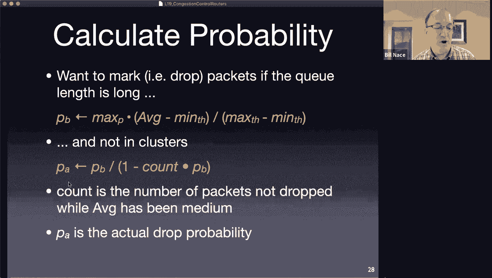

I've tried to draw this graph of the drop probability against the Q length here。

And so the way this works， if the Q length， if I'm sorry。

 if the average queue length is less than your minimum threshold。

 you're not going to drop the packet and so that means that there's a zero% chance of dropping the packet。

If the。Q length is greater than the maximum than you're always going to drop the packet。

 so that has a probability of one。You're going to drop the packet。

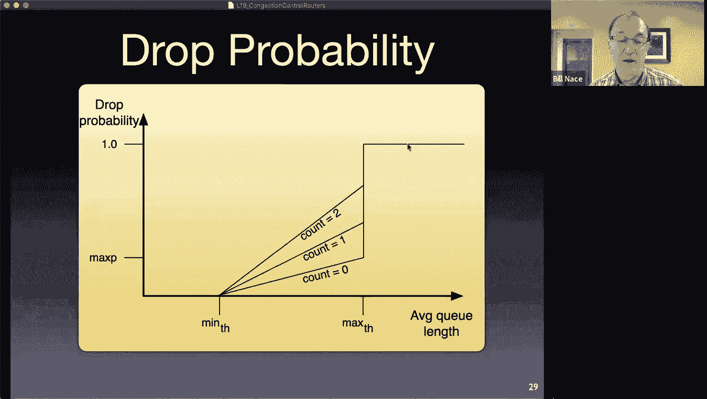

The if you look at these two pieces， this PB portion right。

 that's the portion that goes from zero at min threshold up to some probability set parameter called max P at the max threshold。

 and so that's this line。

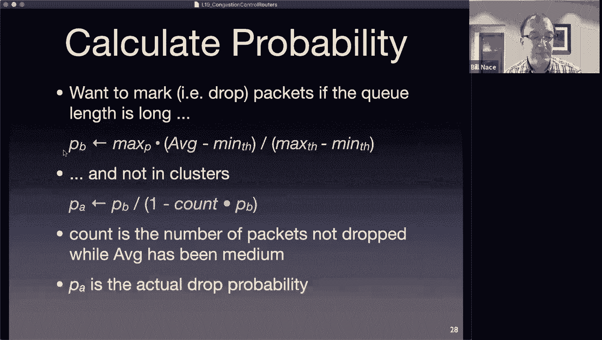

hi will effectively just increase if you haven't dropped anything in a while。Okay。

 so maybe this is a little dramatic。But。But this shows that if you know。IfIf the Q length is bigger。

 there's a higher probability， you're going to drop it and if it's been a while since you dropped one。

 there's a higher probability， you're going to drop this particular packet。

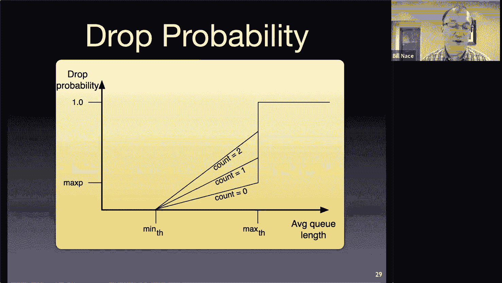

And then you roll some dice and decide whether it go， whether you drop that packet or not。Okay。

 so it makes sense that everybody kind of understand the process that's going to happen here what's what's going on with each packet coming in。

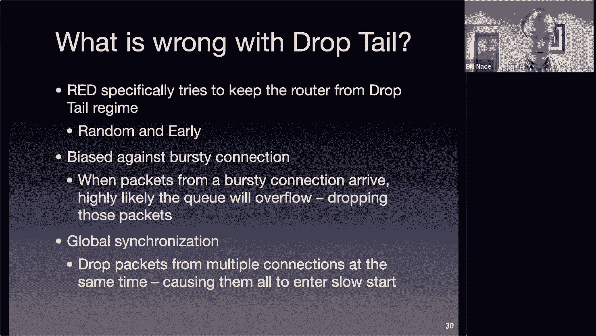

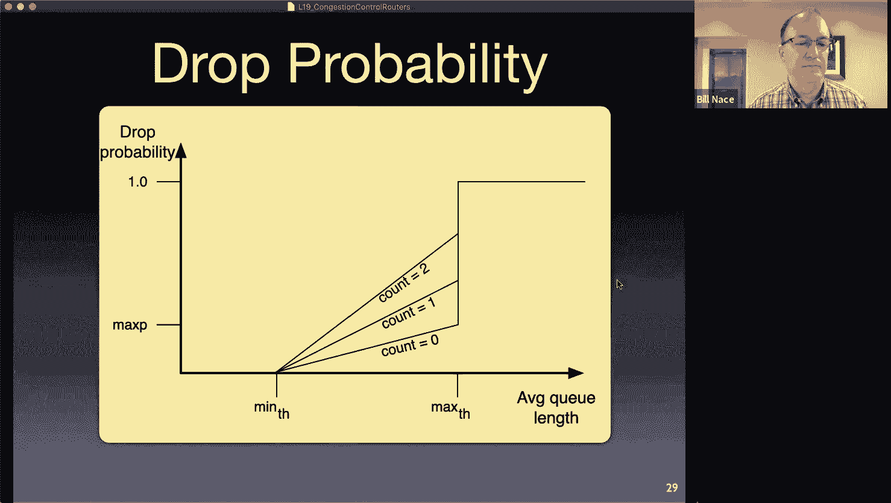

All right， so what's this do Certainly this is different from droptail right you're not dropping the packets when they come in and you don't have any space for them instead you're early dropping them you're dropping them because your Q lengths。

Are bad。Okay， it is also red is not biased against the bursty connection you're randomly dropping some stuff and so just because you are a bursty flow and you happened to throw a bunch of packets out it's。

Unlikely that all of your packets are going to get dropped or that many of your packets in your burst are going to drop okay。

 it also drops early to try to avoid this global synchronization problem。Your。Now if there are many。

 many TCP flows going through this router and out this particular link。

 you're just choosing some random packets and so they will distribute themselves across the different flows of packets going through that particular link and so the senders will get the signal that they need to back off but they will back off at different periods of time and so you don't have this everybody sees the congestion everybody goes back into slow start。

Nobody's sending in packets and the router then is wasting bandwidth。Is it fair？Well。

 if you're sending more packets， that means there's more dice being rolled for you and that means there's more chance you're going to be the one losing the packet。

 if you're only sending an occasional packet， then your chance of that being lost is well it's the same chance effectively as any packet but because the decision is being made on a packet by packet basis。

 those who send more packets will seem more loss。Now certainly we're not doing any kind of TCP police or flow management to you know。

To see if somebody's doing something bad， it's more of a， well。

 if you're sending a lot more if you're if you're not backing off if you're sending。呃。

Too many packets， then you're probably going to have more of them dropped。

 but there's nothing here that's going to be stopping you or choosing you as the bad flow。

 although you could implement some mechanisms to detect that。It does。

Require that the end hosts are going to react to this right if you're going to mark a packet or if you're going to drop a packet。

That's you know we're trying to send a signal to a sender and the sender could be ignoring that Okay now part of that。

I'm not sure they would ignore it just because it was red。

 but you might ignore it because you're sending a bunch of UDP packets and not TCP for instance。

 and in '93 it was pretty rare to send a whole bunch of UDP packets one after another and nowadays that might not be so rare in fact。

 we're sending a bunch of UDP packets back and forth to each other right now over Zoom。

There is some scaling issues that were。Detected when Floyd did the work he did。

 he did it on a fairly small network， actually did on a simulation of a small network and some people discovered when they actually implemented red at scale。

 the updates to the average Q length just weren't going fast enough and so I forget what SP is but there's another variant that is more oftenly implemented in large。

Large networks，' same idea as read， it's just changed some of the details about how the probabilities are chosen。

It is pretty common in most mono routers， if you buy a Cisco router。

 it is a flip of the switch to use red if you wanted to， and there are other versions of it out。

 of course anything that's been working since 1993 has had plenty of other research done on it since 1993 and so there are weighted reds or adaptive red versions as well。

 that you can find out there。All right， so that brings us。

Well does a couple things first off it brings us to the end of this look at how a router can make some decisions and be involved in the congestion control process。

Even though it's and it also showed you some of the complications there because you have to somehow communicate that there is congestion to the end hosts who can actually be the ones doing the real control that can actually stop sending stuff。

This lesson also brings us to the end of our understanding of the network layer on Thursday。

 we're going to dive down into the next layer， we're going to look at the link layer and start looking at how Ethernet。

Okay， so if there are no further questions， bid you all ado， have a great day。Bye拜。

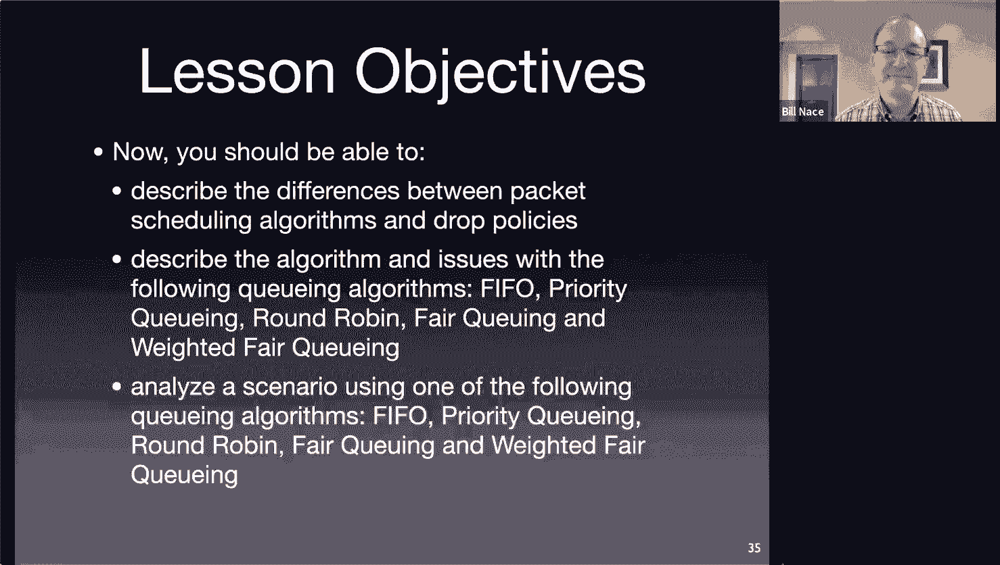

Oh Ganesh did not mention that today but I should have I will not be holding office hours today because I'm going to be grading something for a different class so if you want to talk to me send me email we can work that out。

Stephaos， I will get La3 out in the next couple of days。It's a bunch of stuff about the link layer。

 so in theory haven haven't taught you enough to do lab three anyway。

 but it will' get out there anyway。嗯。Oh， Dan waiteded fairqueuing。Drawbacks。WellI mean。

 it's an algorithm that does。It does what it's supposed to do。

 and so the issue is whether it fits the need you want。

And it does have that same problem of kind of how do you set the priorities。

 how do you decide you know， which flow is the one that should have a different weight than other flows。

But there's no。There's no huge performance gain performance problem or anything like that it's a fairly simple thing that's being done on packet by packet。

 so there is， as you mentioned， some cost to implementation in terms of know a little bit extra code making these choices。

 but I don't think there's any huge， huge problem with huge cost。嗯。Yeah。Ganessh。

 I don't think I agree that the computation is pretty heavy。

You have basically what you're doing is you you are doing one。On a per packet basis。

 one update to the Q average length so that's a one multiply by beta add multiply by one minus beta now that can be pretty simple if you've chosen beta to be a quarter or an eighth some nice power two so you're not actually multiplying things。

And then you're you know a couple lines of code to calculate a probability and choose a random number。

I wouldn't say it's heavy， I don't think it's an overwhelming amount of code to run。So。

 I don't think。Yeah。I wouldn't see it as a bad thing from that perspective。

Certainly not on this on the。Scale of some of the other mechanisms。

 so we talked about sending quench messages， for instance early on you know routers could send a message back to the source saying please stop that's a heavy mechanism right because you actually have to create a new message and go ahead and send it back。

嗯。So I'm not sure I agree that it is a。A heavy mechanism。Sure。I offhand。

 I don't recall the comments from the paper because it's been a year since I read it。

 sorry didn't read it last night。And so I don't know the implementation status of those。你好。

Hey hey right？I've gone through。

