# 计算机网络基础：20：拥塞控制 - 路由器的视角 👁️

在本节课中，我们将学习路由器如何通过管理队列和丢弃策略来参与网络拥塞控制。我们将探讨几种不同的队列调度算法，并深入理解随机早期检测算法的工作原理。

## 概述

之前我们讨论了TCP端到端的拥塞控制机制。本节我们将视角转向网络内部，看看路由器本身能做些什么来管理拥塞。路由器通过其队列调度和丢包策略，可以主动影响网络流量，避免或缓解拥塞。

## 队列调度与丢包策略

当多个数据包需要从同一个输出链路发送时，路由器必须决定发送顺序，这称为**包调度**。当路由器内存已满，无法容纳新到达的数据包时，它必须决定丢弃哪个包，这称为**丢包策略**。这些选择会影响不同数据流的性能。

以下是路由器可以采用的几种主要队列调度算法。

### 先进先出队列

这是最常见、最直观的队列方式，类似于人类排队。数据包按照到达顺序进入队列，也按照相同顺序被发送。

*   **调度方式**：队列最前面的数据包下一个被发送。
*   **特点**：实现简单，但所有数据包被同等对待，没有优先级区分。

### 优先级队列

为了解决某些数据包比另一些更重要的问题，路由器可以将队列分为多个优先级队列。

*   **工作方式**：数据包根据其优先级标签进入相应队列。路由器总是先发送高优先级队列中的所有数据包，只有当高优先级队列为空时，才处理中优先级队列，以此类推。
*   **优点**：可以确保重要流量（如路由协议BGP的数据包）获得低延迟。
*   **挑战**：如何确定和分配优先级是一个难题。低优先级流量可能因持续的高优先级流量而“饿死”。由于互联网的去中心化特性，很难建立一个全局、可计费的优先级体系。

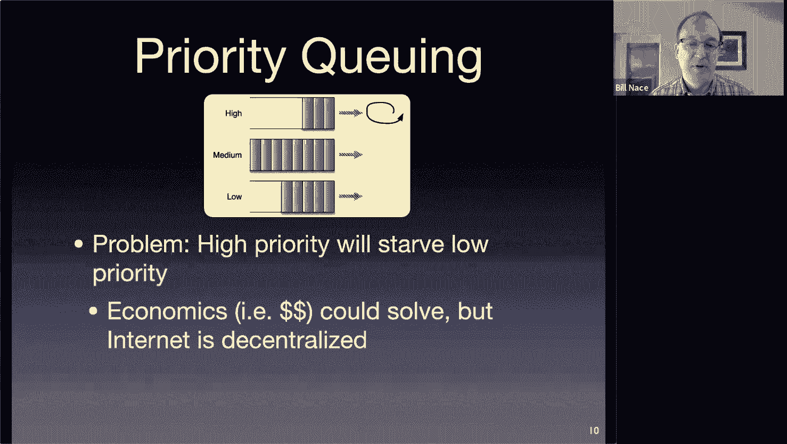

### 轮询队列

为了在多个数据流之间实现公平性，轮询队列为每个活跃的数据流维护一个独立的队列。

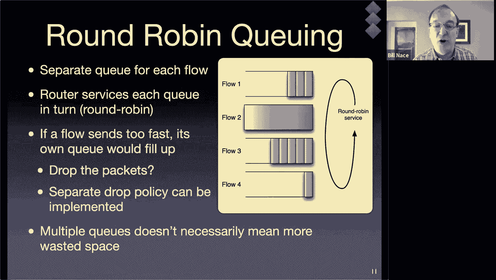

*   **工作方式**：路由器依次从每个非空队列中取出一个数据包进行发送，然后循环回到第一个队列。
*   **目标**：确保每个数据流都能获得发送机会。
*   **问题**：如果不同数据流发送的数据包大小不同，那么发送大包的数据流将占用更多带宽，这从比特级别的角度看并不公平。

### 公平队列

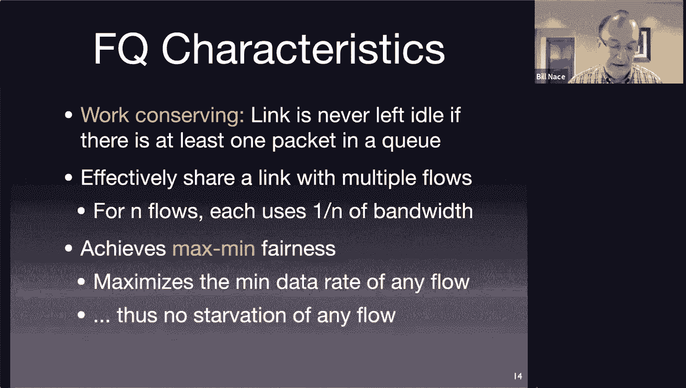

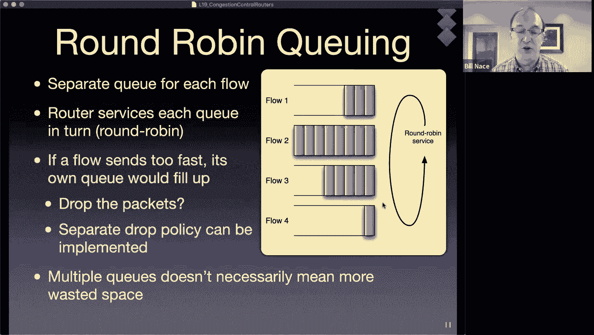

公平队列是对轮询队列的改进，旨在实现比特级别的公平性，而不仅仅是数据包数量的公平。

*   **核心思想**：模拟“逐比特轮询”的过程。路由器为每个数据包计算一个“虚拟完成时间”，这个时间是基于如果以逐比特交替发送的方式，该数据包何时能发送完毕。
*   **调度方式**：路由器总是选择虚拟完成时间最早的数据包进行发送。
*   **结果**：无论数据包大小如何，每个数据流长期来看都能获得大致相等的带宽份额。这种特性被称为**最大最小公平性**，它最大化了一个数据流所能获得的最小带宽。

### 加权公平队列

这是公平队列的扩展，允许为不同队列分配权重（即优先级）。

*   **工作方式**：在计算虚拟完成时间时，将数据包大小除以该流的权重。权重高的流，其数据包的虚拟完成时间会更早，从而获得更多带宽。
*   **应用**：可用于实现更复杂的服务质量或资源预留方案。

## 随机早期检测算法

上一节我们介绍了路由器管理队列的基本方法，本节我们来看看一种主动的拥塞控制机制：随机早期检测。

传统的TCP拥塞控制是反应式的，即在检测到丢包（表明已发生拥塞）后才降低发送速率。RED算法则允许路由器主动、提前地采取行动。

### RED算法原理

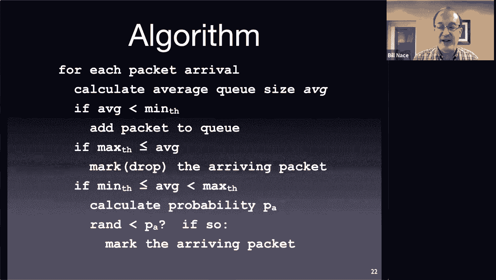

RED是一种**主动队列管理**方案。路由器监控每个输出队列的平均长度，并据此决定是否丢弃（或标记）新到达的数据包，从而在队列真正溢出之前向发送方发出拥塞信号。

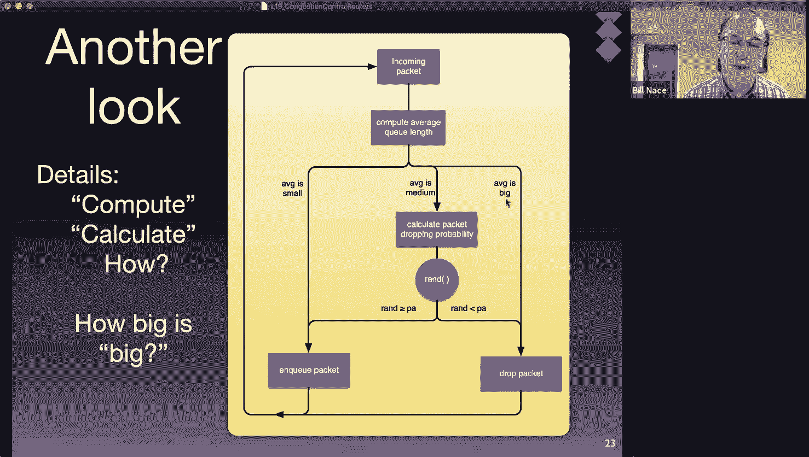

*   **随机**：随机选择数据包进行丢弃，避免针对突发流量或同步丢弃同一流的所有包。
*   **早期**：在队列完全填满之前就开始丢弃，旨在将队列长度控制在较低水平。
*   **目标**：避免全局同步（所有TCP流同时进入慢启动）、减少持久排队时延，并保持高吞吐量。

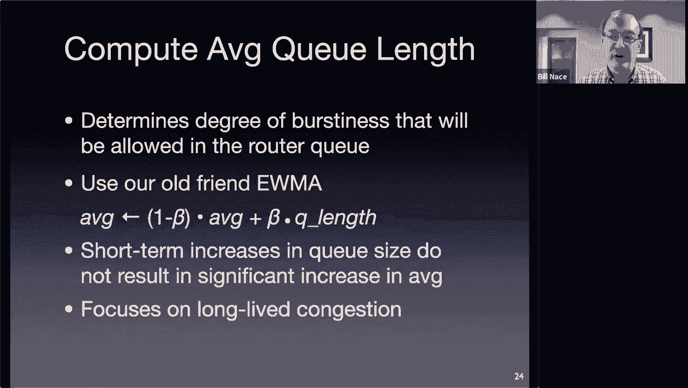

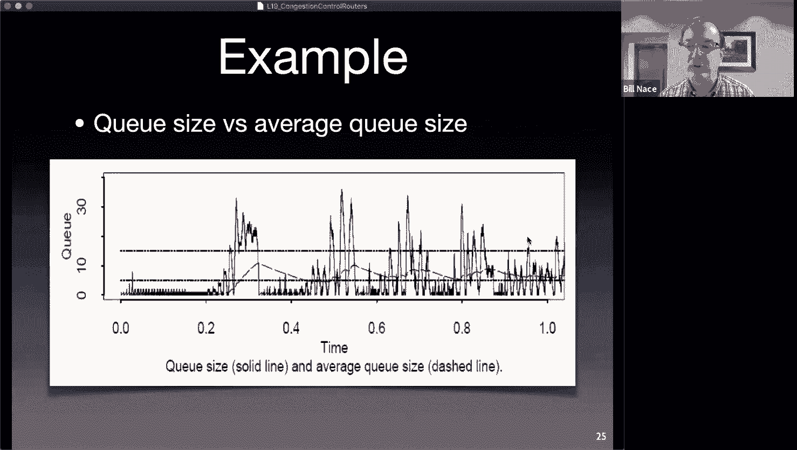

### RED算法工作流程

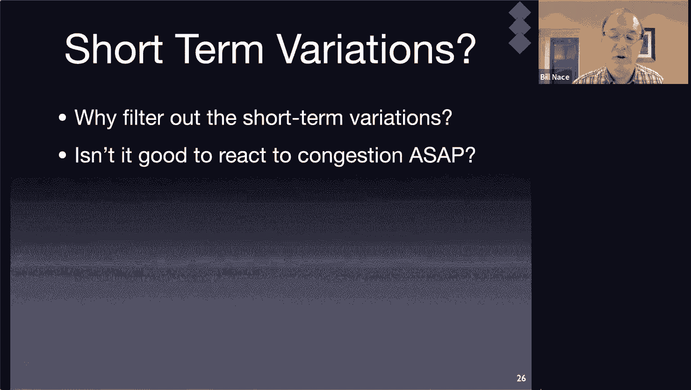

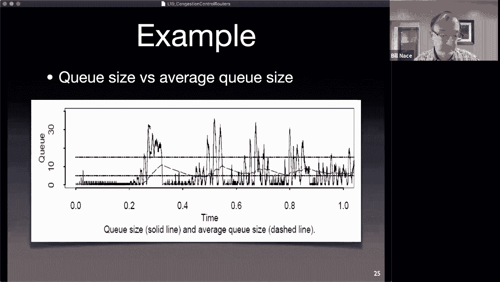

对于每个到达并确定输出端口的数据包，路由器执行以下步骤：

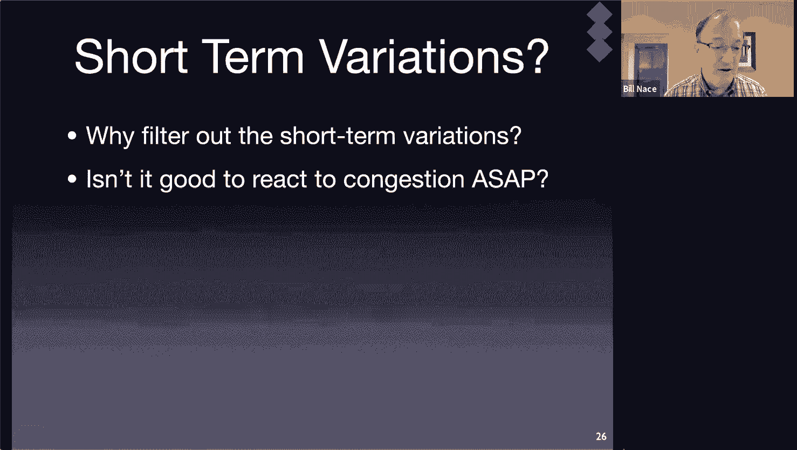

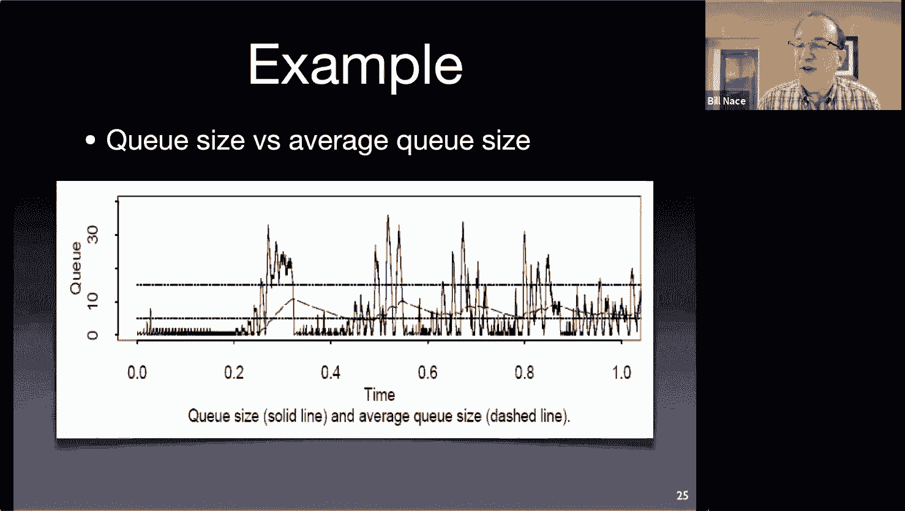

1.  **计算平均队列长度**：使用**指数加权移动平均**公式来平滑瞬时队列长度的波动，避免对短暂流量突发做出过激反应。
    *   公式：`avg = (1 - weight) * old_avg + weight * current_q_length`
2.  **与阈值比较**：设定最小阈值`min_th`和最大阈值`max_th`。
    *   如果 `avg < min_th`：队列空闲，**接纳**数据包。
    *   如果 `avg > max_th`：队列已满，**丢弃**数据包。
    *   如果 `min_th <= avg <= max_th`：进入随机丢弃区域。
3.  **计算丢弃概率**：在随机丢弃区域内，丢弃概率`Pb`随平均队列长度增加而线性增加。
    *   公式：`Pb = max_p * (avg - min_th) / (max_th - min_th)`
    *   其中`max_p`是最大丢弃概率参数。
4.  **最终丢弃决策**：为了避免连续丢弃同一流的数据包，实际丢弃概率`Pa`会随着自上次丢弃后的数据包数量`count`增加而提高。
    *   公式：`Pa = Pb / (1 - count * Pb)`
    *   生成一个随机数，如果小于`Pa`，则丢弃（或标记）该数据包；否则，将其加入队列。

### RED的优缺点与现状

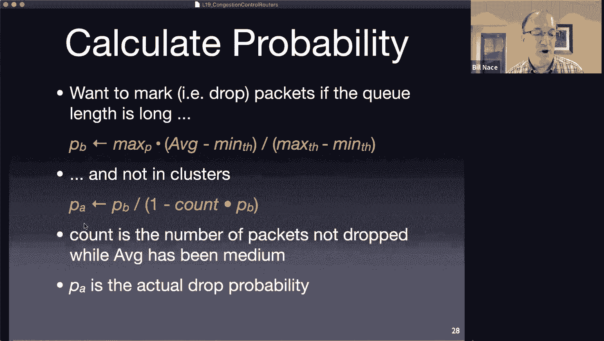

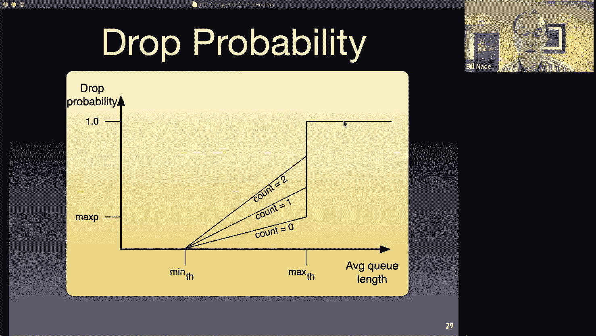

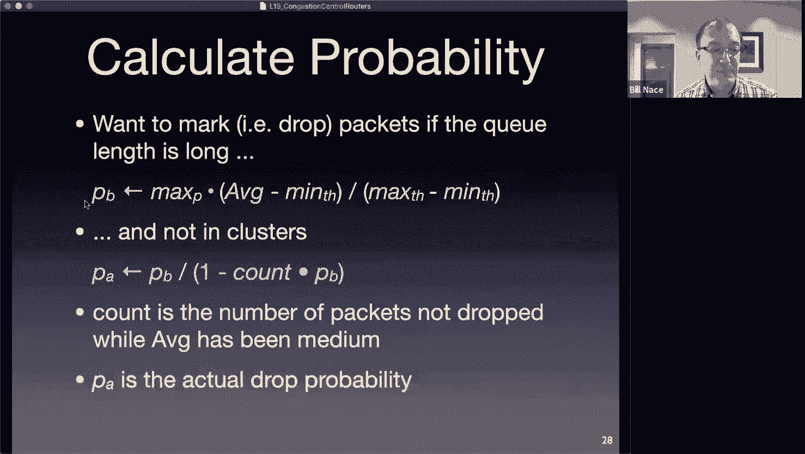

*   **优点**：
    *   提前控制拥塞，减少因队列满导致的尾部丢弃。
    *   打破TCP流的全局同步。
    *   对突发流量相对友好。
*   **挑战与现状**：
    *   需要正确设置多个参数（`min_th`, `max_th`, `weight`, `max_p`）。
    *   依赖终端主机（通常是TCP）对丢包做出响应。
    *   在大规模网络中，原始RED可能响应不够快，因此出现了如**WRED**、**ARED**等改进版本。
    *   在现代路由器（如思科）中，RED通常作为一个可配置选项提供。

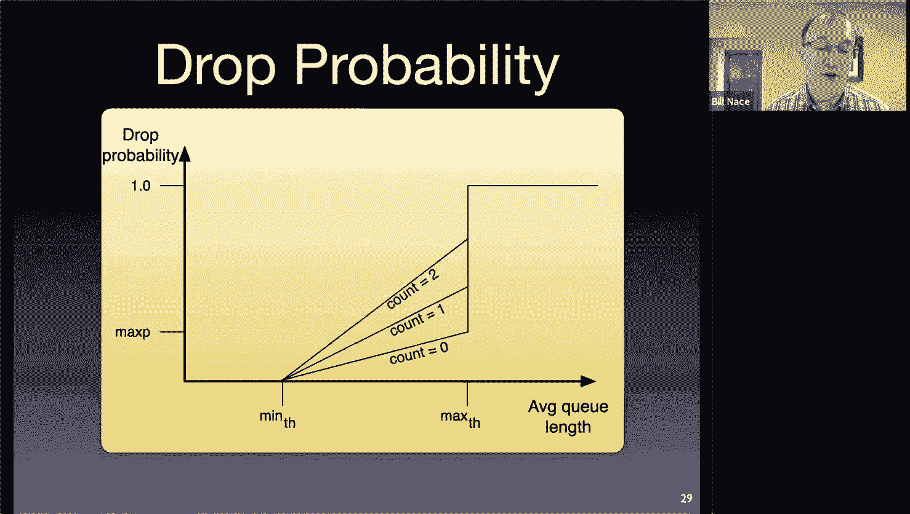

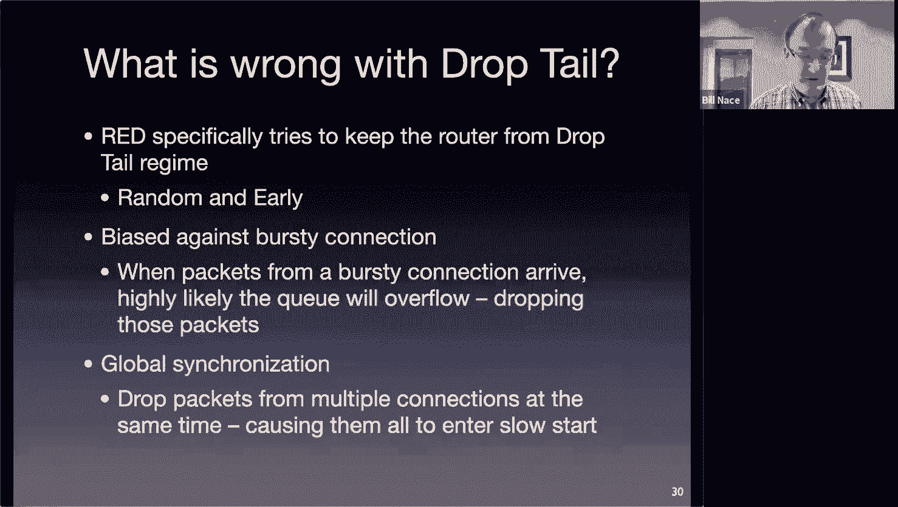

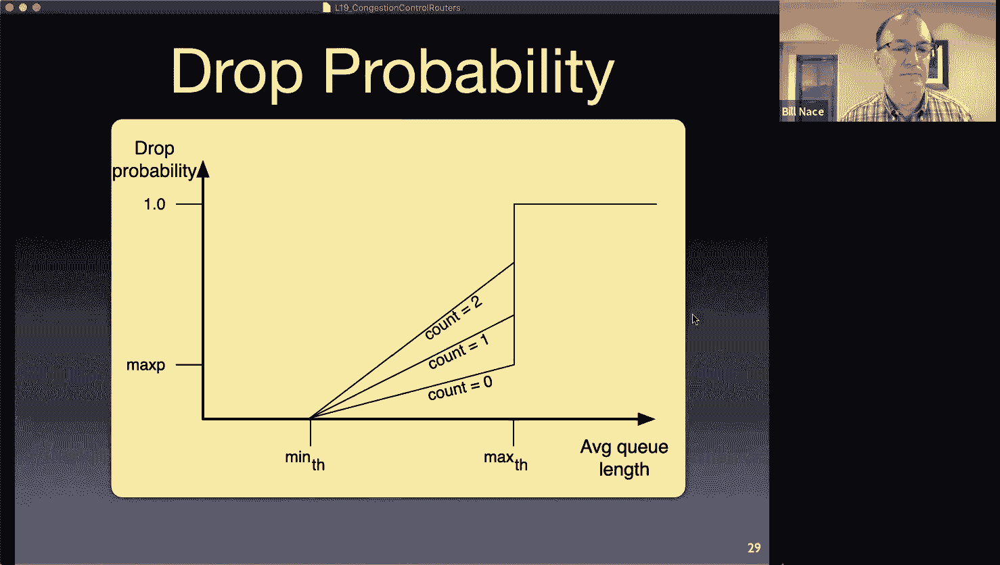

## 总结

本节课中，我们一起学习了路由器在拥塞控制中扮演的主动角色。

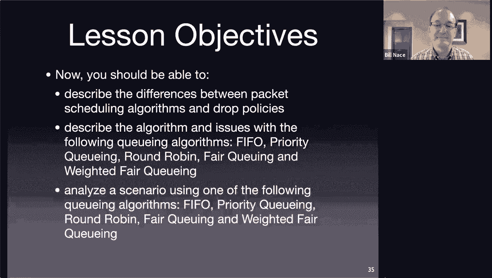

我们首先探讨了多种队列调度算法，从简单的FIFO到更公平的公平队列，理解了路由器如何通过调度决策影响流量。接着，我们深入研究了随机早期检测算法，看到了路由器如何通过监控队列状态并随机丢弃数据包，来提前向发送方发出拥塞信号，从而更有效地管理网络拥塞。

这些机制表明，通过在网络设备中实施智能策略，可以协同端到端的协议，共同构建一个更高效、更稳定的网络环境。