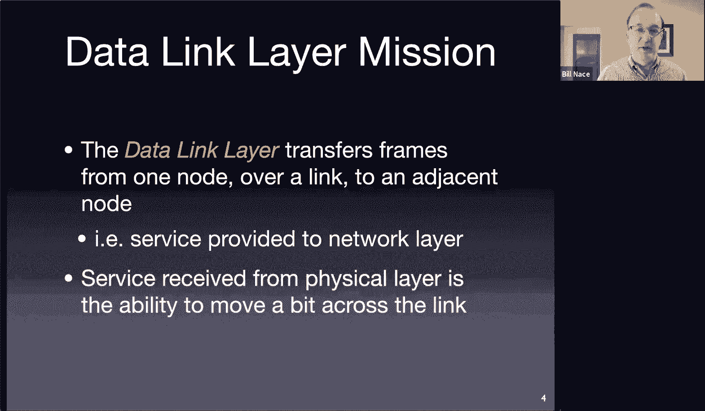
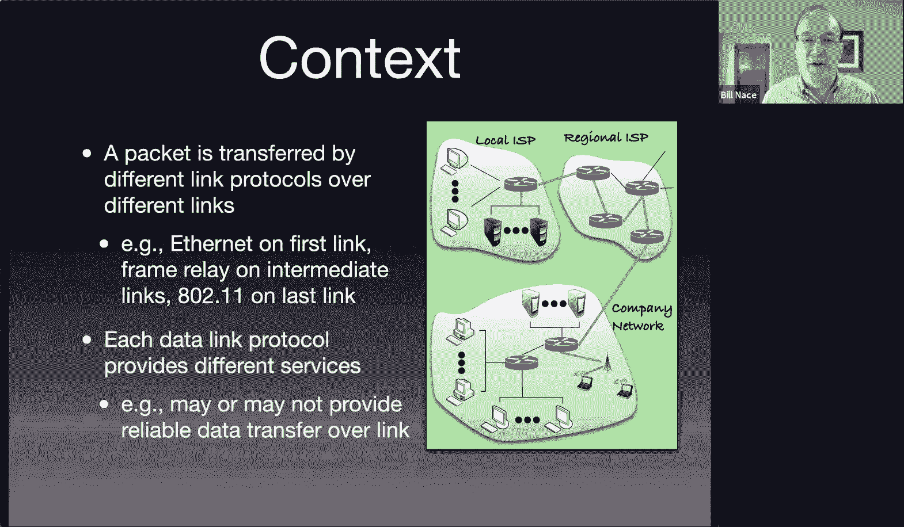
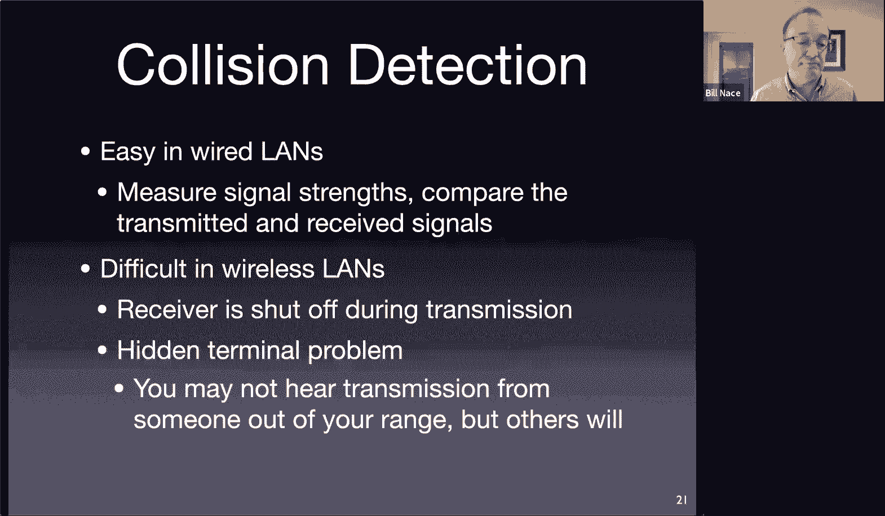
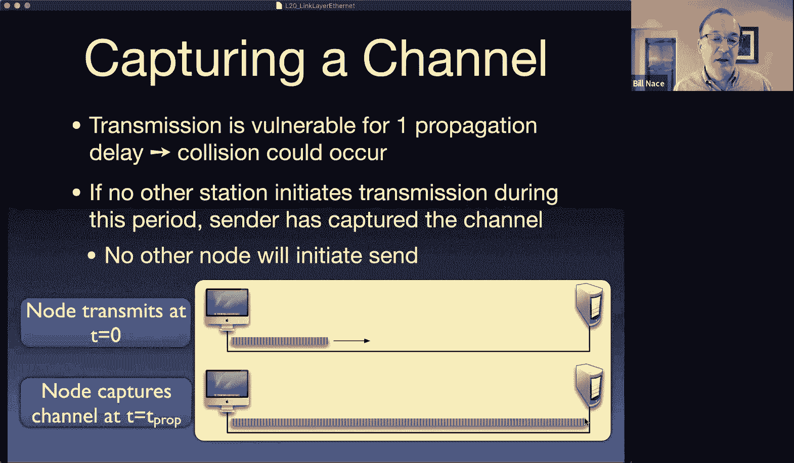
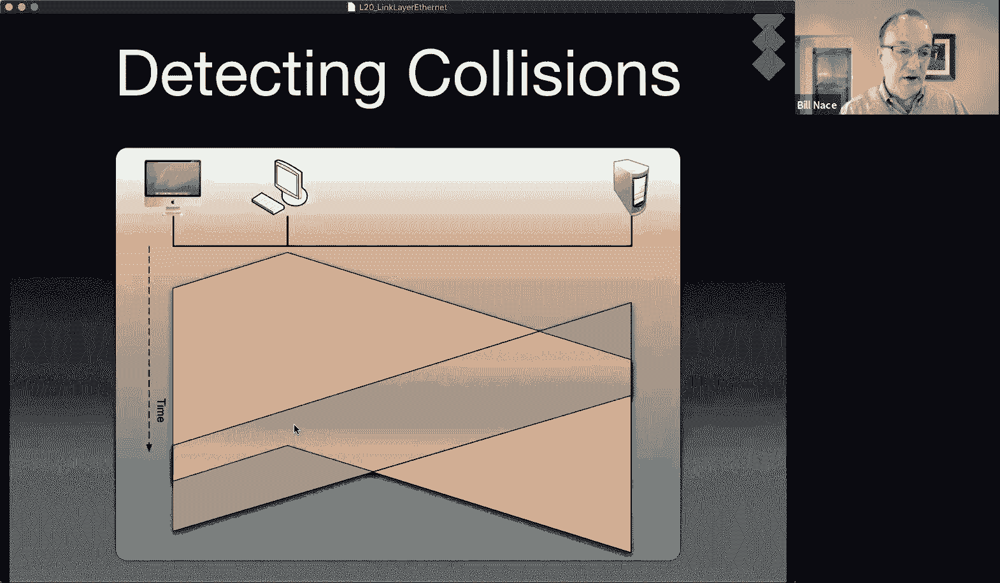
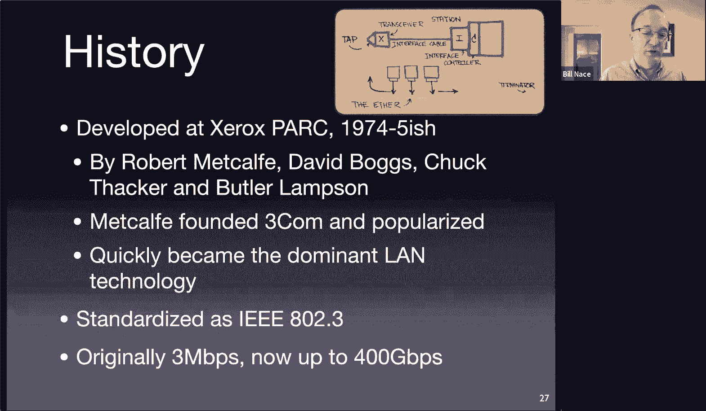
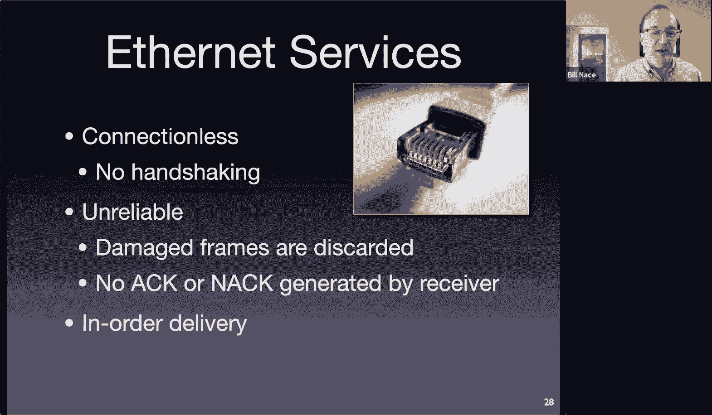
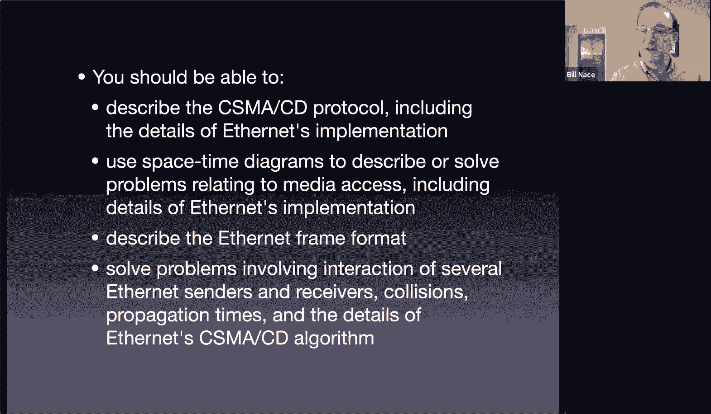
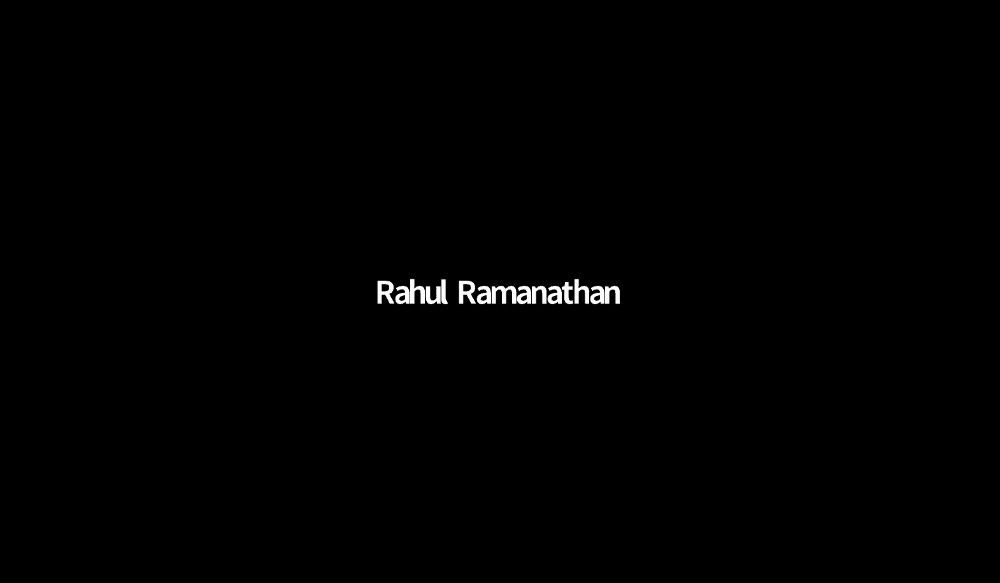

# 卡耐基梅隆大学 14-740 计算机网络 Fundamentals of Computer Networks（Fall 2020） - P21：Lecture 21 Link Layer; Ethernet - ___main___ - BV1wT4y1A7cd

嗯。This is 14，7，40。Welcome everybody， I'm so glad you're with me today today we're going to dive into a new network layer。

And hopefully learn a whole bunch of cool stuff。So。Let's get started。Because once again。

 I should thank everybody for allowing me to do this remotely as well， I appreciate that。嗯。

That's sensitivity， so thank you very much。So today we're going to dig into the network。

 we're done with the network layer now it's time to dig into the link layer of our network stack。

 so this is the next， this is the last layer we're going to talk about in this particular course。

Of course， there is another layer under this， the physical layer。

 but because it has a very different nature because it is very communication engineering oriented。

 we're not going to get to that one in this course。

A couple quick notes here first off notice on the schedule that there is no lecture next Tuesday where we basically are taking Thanksgiving off。

 especially this year with people traveling and whatnot so。I won't be here next Tuesday。

 so I don't know you can go ahead and spend the hour and a half meditating or go find something else to do。

Also want to point out it is US holiday next week Thanksgiving holiday one of my favorite holidays probably my favorite holiday of the year。

 it's a time that we set aside to say thanks for the things that we're grateful for and I am incredibly grateful for all of the blessings that have been given to me and I love a chance to。

Kind of formally set aside some time to think about that and to be grateful for all the many blessings I have even in a year like 2020 I have much to be thankful for and the fact that I have a chance to teach wonderful students like you is one of those things that I'm very grateful for so thank you for being part of that blessing for me。

Okay， so what we' going to do today as I've done with every layer we're going to spend a few minutes talking about kind of the theoretical nature。

 the the generalities of that particular layer so we'll do that first and we'll look at one of the kind of interesting things in fact some people when they put together networking stack pictures actually would have a second layer here for multiple black protocols。

And so， I'm。Many times traditionally in the internet stack。

 those are bundled into the data link layer， but there are other stacks onmo I'm thinking of a couple unmo。

Networking stacks where the medium access control is actually spelled out as a separate layer。

But we'll bundle it together， we'll talk a little bit about that and then we will get to the first of our link protocols。

 which is ethernet。Which is。There's fun technology。All right。

 so what's going on here at the data link layer， what are we trying to accomplish well？

Remember what the network layer needed from the data link layer。

 the network layer needed a way to move data from end hostst to router and router to router router to router hop by hop across the network and that's what the data link layer does it transfers its data。

From one node to another node。 which sounds a lot like what the network layer was doing， right。

 The network layer was transferring data from one node to another node。Except。InThat case。

 those were end hosts anywhere in the world。For the data link layer。

 the connection it's making is between adjacent hosts。

 so this is just the story of one hop in the overall transmission of data across the entire network。

 so we're getting it from from my computer to the access point that's on inside of the room here from that access point to router in the basement from that router to a router off in Verizon you know from hop to hop top each of those。

Is a different data link layer step。AndSo we're moving from one end of a cable to another or one radio signal wave antenna to antenna。

And of course， this is built upon the physical layer。

 the physical layer is going to give us the ability to move a single bit and so you can imagine。一。

Daator who has a frame's worth of data just calling the the physical layer and saying， hey。

 send a zero， hey， send a one， hey， send a zero， et cea。

Here's our picture that we've used throughout the course。

 this is our cartoon network and we see that these little purple lines here， these links。

 that's where the link layer exists on each of these is a separate。Linclair technology。

 linkair device。And on each of them， the link layer is transmitting。

It's data and remember every layer of the network has its own data type。

The thing it is actually transmitting。This is a frame right so the envelope if you think back to our demo at the beginning of the semester。

 the envelope that the link layer uses is a frame sized envelope that it puts information in。🎼And。

That information thing it is carrying in that envelope， of course。

 is the data it got from the network layer so it's a packet that's been put into this frame。

With some headers and whatnot to make sure it gets there correctly。The links。

 if you think about the travel of this data from an end host。

 let's pick one and you know here's a server somewhere in a server room。

That link connecting it to the router， its local first step router。

 that link may have one of a couple characteristics， this one's slightly different from this link。

Slightly different from that link， this link here， for instance， is one that is shared you can see。

Right here， you can see that the server is sending data to this router。

But it's doing it by putting it on a wire that is actually connected to other servers。

We're going to call that a broadcast link。Okay there's another one at the other end of this journey as well。

 you'll notice here's a wfi access point who is transmitting the frame by broadcasting it。

With electromagnetic spectrum sending that signal out and others could hear it。

We call those broadcast links because they're shared because many participants are involved。

 as opposed to some of these other kind of internal links I've drawn that are more point to point links that are connecting one sender to one receiver。

And so we'll see some。Differences in the。That have to be taken account of in the data link layer to make that happen。

Notice also these the routers have many links to them right each of the wires leaving it would be a link each of those wires。

Could be different link layer technologies as well。

 and it's worth noting that each of those links is going to be a subnet now subnet of course is a network layer concept。

But that maps to a particular link here at the data link layer。All right。

 so I've got a packet coming in from this server that's going to that laptop and that packet's going to get you know traveled。

 say over Ethernet here over maybe frame relay here。

 it'll travel over different link layers until it gets to this access point where it will travel via Wifi for this last link so it's very important to recognize that。

When put in context， there's a lot of different link layer technologies that are。

geting deployed each step of the way to send our packet from place to place so that packet becomes a frame which becomes a different frame on a different technology。

 a different frame here， etca， all the way until it gets to the end。

Now all these are different technologies， that means they were created to solve perhaps different problems。

And therefore they may have different services available， so it may be possible for instance。

 that some of these are reliable transfers at the link layer level， okay。

 not reliable in terms of TCP but reliable in getting it from a sender say this access point to the receiver this laptop okay so the link layer may also include other stuff。

So what happens in the link layer， what are the key responsibilities。

 the things it's going to have to do one of them of course， is actually。

Packing the data together into these frames。makingking the frame。

 sending it out and at the receiving side of course undoing all of that the frame itself has to have headers and whatnot much like we've seen with segments and with packets and those headers include a bunch of data that help to actually transmit the particular frame and so it's going to have for instance they will have a source and a destination address in the frame and peak to Wiifi they may have even more addresses as well。

Notice， by the way， that the addresses we're going to talk about are again。

The an address for the link layer and so there's an address mechanism here。

 much like there was a IP address at the network layer， much like the reports at the transport layer。

 much like there were domain names and whatnot at the application layer every layer has its own。

Its own addressing mechanism。The link there is going to have。

Addressing mechanism as well this one's a little bit more complicated and maybe in some ways similar to what goes on at the application layer because each technology can have its own or will have its own addressing schemes and so if you have a。

You know， a stanet frame that's being sent to over。Over some form of fiber optic。

 that addressing mechanism will be different from a Wifi addressing mechanism。

Something else the link layer has to do is manage link access so I mentioned a little bit before about these media access protocols that's what's going on here they。

hass to be some mechanism to allow a sender to have permission to transmit on on the link to send each individual frame now in a point to point channel this tends to be trivial。

People argue I've been involved with a protocol called point to point protocol was used for dial up way back in a day and it's a complex enough protocol right but。

And a lot of that involvess， you know， kind of negotiating endpoints。

 kind of getting both sides to agree that， oh， we're going to， you know。

 this is going to be our clock rate and we're going to use this this encryption scheme and things like that。

But in point to point links you only have two ends that are involved at all。

 and so a sender basically is asking， hey， can you hear me to a receiver？In the broadcast channels。

 the link access is a much more interesting problem and that's because it is a shared medium and you have to make sure you're basically negotiating on a frame by frame basis。

 whether it's okay to send that frame at this point in time or whether it will interfere with somebody else in the channel。

Other things that happen well we're going to send data and weve got to make sure that it gets received properly and so there will be some error detection mechanism that happens here in fact。

 you can argue that it is at the frame level where most of the errors are going to actually occur so in many situations it is not uncommon or some in some。

Links actually fairly common to have errors and so the receiver has to be able to look at the bits that were transmitted and see whether they look like they are the same bits I'm sorry the receiver will look at the bits in the frame that it got that it received and it wants to know are these the same bits that got transmitted or did a bit get flipped or did a series of bits get flipped or something like that？

And so there will have to be some mechanism we've seen check sums before， and that's the same idea。

 basically the Ste doing some math。Math to check it。

The mechanisms that are used at the data link layer tend to be slightly different than checksomes we'll talk about those in a minute。

Actually， in some。Some data link layers is not good enough just to know if there's been an error in some data link layers it's possible to actually correct an error and so and this is again of limited size。

 but if you have a single bit flipped or two adjacent bits flipped or something like that。

The math that is done and the redundant data that is sent is sufficient。

 usually meaning more math and more data such that the receiver is able to actually not only know that。

A bit in the frame got flipped， but to actually be able to identify which was the bit that got flipped and thus fix it。

That's more data， more math， and so only well be employed in data link layers where errors are very likely and perhaps in those where retransmission is costly。

Speaking of retransmission， yes， we do have some data link layers that actually have their own layer of reliable delivery Okay so this is。

Using all of the reliable data transport tools we've talked about earlier。

 it'll use receiver feedback and timeouts and retransmission and all that sort of stuff in order to make sure that the frame that is received is the hasn't been lost somewhere and make sure that it gets retransmitted if it's possible now this is a whether to employ reliable delivery is a interesting engineering tradeoff lot more work a lot more going on there and so if there's low chance that there's actually an error then it's unlikely that that data link layer is going to actually deploy so you'll see in fiber。

Cable oriented data link layers it's it's pretty rare to have any reliable delivery mechanisms that doesn't mean there aren't any errors it just means that if an error is detected the frame is discarded and that means it's up to upper layer protocols to retransmit if they want to。

So the frame will get thrown away with the idea that if this was important data。

 then the sender would have put it in a TCP stream and the loss of this frame will be detected and the retransmission will occur。

Interesting， by the way， that retransmission or that loss looks like congestion now， of course。

 to TCP， but that's a different point。I mean， in other data link layers。

 especially wireless ones' this is a critical component。

 and that's because the errors are so common in when you' broadcast。Sure magnetic spec。

Of other signals and lots of other noise， you have a lot of errors。

And you don't want to throw away that many frames， otherwise you trigger way too many upper level retransmissions。

 and so the reliable data is done at the data link layer。

We've been tossing around this term for a while so and we've said it comes from the datalink layer so it's worth examining and that's this maximum transmission unit。

 this MTU term， this is the number of bytes that the frame is actually able to carry so this is the payload size of the particular frame and of course this will be a different number depending on the technology that is used right so when a bunch of engineers get together and decide they're going to create a new data link layer technology they have ideas about how this is going to work and they have limits that they're pushing to figure out how much data they can actually transmit and so the max transmission unit。

Ends up being a characteristic of whatever data link layer specification is created。

 and this number will be different， of course， for different technologies。

And that's one of the fun parts then at the upper layers is having to deal with the variations in MTU and so we have things like fragmentation that are caused by that but here at the data link layer we just have hey。

 you know my frame in my new technology is only able to carry 120 bytes。Because if I had 130。

 maybe my errors go up or if I have 130， then my very clever schemes don't work。

And the upper layers just have to deal with that so this this is a number that this is where this number comes from。

I do want to point out that we're going to talk about Ethernet and Wifi。

Which are the lions share of today's data link layers。

 but there are many others that are put together， I've listed three of them here just to point out that they have differing frame sizes。

 which means different MTU values and notice some of them like frame relay and FDDI。

 it's actually a configurable size， depending upon things like how faster actually using on that particular installation。

IAnd how far it's going to travel。I mentioned earlier that this multiple access protocol is an interesting。

Affect an interesting result of the fact that we have two different kinds of links。

 we have some of them that are these point to point links okay that have nobody involved other than a sender and a receiver and to get bidirectional communication you actually have a separate link for the you know I can send to you on one link you would need a separate link to come back to me。

嗯。These。Are a lot easier to handle because we're just talking send receiver and there are lots of examples of this so a couple of examples are ethernet。

Let's say more modern ethernet， faster ethernet requires that all of the links be point to point to go between。

You know， some ethernet center and the switch， they all require a switch at fast ethernet speeds。嗯。

See， Kyle is asking about， you， we've tossed around 1500 it is MT toU and it's a very common number and that's ethernet size as we'll see today。

Gives us a 1500 byte mU wireless is a little bigger， but generally。

There's no point in sending a larger wifi frame and because you're going to end up one ether at very quickly and so even in a wfi scenario 1500 is。

Considered the max usable or max real MTU and so yeah that's where those numbers come from。

That we've been tossing around。Another example of a point to point link that is managed by a point to point protocol is dialup connections and those were actually using the telephone network to communicate to from a device on a center to a device at the receiver。

 those devices were called modems and this protocol did all this stuff to kind of start up this point to point mechanism。

The other types of length are these broadcast ones where you're sharing the medium and we'll talk about Ethernet in terms of the traditional ethernet today。

 and that is a shared wire experience where all of the computers could be connected on the same wire and therefore any transmission can be heard by anybody as well as the Wi-fi connections that we see today。

 the fact that many of you are probably using at the moment。

 those are shared experiences also your broadcasting and so we need some protocol to manage that that protocol is called a Mac protocol。

 multiple access control or media access control protocol。And that's a protocol。

That basically just answers the question， do I have permission to send this frame right now？

When we look at the entirety of everybody else that is also connected to this link。

We want to make sure that what we're trying to avoid is a thing called a collision。

 which is when two nodes send their frames in such a way that it's possible that those frames overlap when they get to a receiver so that some receiver is trying to listen to both of them at once and that's a problem。

 electromagnetic spectrum is an additive media， that means that if you send one signal and another signal。

And they both hit an antenna at the same time that antenna will receive the sum of those signals。

And so much like sums in math， if I just told you the sum of two values is 14。

 you don't know what those two values are and there's no way you can do any math to figure it out from that one data point right。

 two variables one equation that you've known that was a problem since sixth grade algebra okay。

So we need to avoid this kind of collision so that we can guarantee that the receivers can understand those frames and so we have to have this protocol to make it happen。

And the fun part about this， fun is definitely an error quotes is that this is a distributed。

Decision making protocol， all of the nodes in my。In my data link。

 there's no other way to communicate about stuff you can't like send a message somehow magically to say。

 okay， you're you know， I'm going to send a message now could I have permission to send。

Without sending that message on the same channel that you're trying to manage。OkaySo these are。

 you have to be clever about these sorts of protocols and it's a little bit difficult。

For us to understand them at first blush， because we see everything that's going on。

 we can draw pictures to show， oh， this guy's going to send now and this guy's going to send now and we see that because we have this kind of God's eye view of what's going on。

But the nodes themselves can't see that， the nodes themselves don't have the overall picture and because they they have to communicate just through this the channel。

 which is the same channel they're trying to arbitrate access to in the first place。There are many。

 many Mac protocols and I'm just going to。Break them into three chunks and say some of them are channel partitioning protocols and there's a vast number of those some of them take turns and some of them are random access i'm not saying necessarily judgments about one versus the other in many cases you choose which one you're going to use as an engineering choice based on things like the scenario you're deploying and so for instance。

 if you're in an automotive situation that's a very different world from the you know。

Carrying laptops around coffee shops kind of world。

 and so it may make sense for the protocols to be different because of them。

So the first set of protocols， I would split into a chunk called channel partitioning。

And the idea here is that we're going to somehow take the resources of the entire channel。

We're going to chop them into pieces and we're going to give each node one of the pieces。

Now those pieces can be created by， for instance， chopping them temporarily by giving each， you know。

 having time slots and saying you have， you know， one， you know。

 one10th of the time slots and you have one we'll take all of time chopping into 10 pieces and each of the10 of us get one of those pieces。

I showed a picture way back when like lecture two of how you could split it up also by frequency。

So you could take some frequency bandwidth and chop that into different spectrum channels and just say。

 okay， you know the 10 participants here each will have one/10th of the bandwidth to use。However。

 that splitting happens each of the participants in the data link layer。

Have a guaranteed piece of the network resources that they can use whenever they want to use it。

OkaySo that's a nice thing you're guaranteed that if you have a message to send。

 you can send it immediately on your n of the channel and you're going to get one nth of it so you R over N where R is the total resources the bandwidth and we split it among the end participants here and everybody gets an end。

A couple interesting problems here oh i've kind of glossed over the whole issue of how you figure out what n is and what happens when somebody leaves or enters the channel the bigger。

Worry is is wastage， however， this can be very inefficient because your this guarantee means that anytime a participant doesn't use their resources。

 nobody else can if i'm guaranteed to have this at all times there's no mechanism for somebody else to come in and scoop it up when i'm not using it。

Because they don't know I'm not using it and so and I could instantly decide I need to use it again and since I'm guaranteed to have my share。

 that's the way it goes。嗯。Will is asking about form of partitioning and so I'm guessing you mean things like time plots versus frequency versus code。

 those are all going to be determined by the communication engineers who decide how this channel is going to work and so those are engineering choices that are going to be put in place based upon the usage scenarios and the technology being used and so there's not a particular one is better than the other。

In general， some of it will be one is better than the other because there's already chips built for it or something like that。

 but you can make this work equally well with time slots or frequency division or code division。

 any of them will work。All right， so the next big。Scheme。For a family of。Access protocols。

Would be taking turns and this at first blush sounds very much like。The channel partitioning。

The idea is we're going to。We're going to split up time。

And each person's going to get a piece of time to use。

The only difference here is there's no guarantees and。When you。

Aren't using your time then it just moves to the next person。

 the next one around so you can imagine if I have 10 participants somehow we're going to have everybody just line up and take turns and so you know purse node zero sends if he's got data to send then node one sends if he's got data to send then node two etc ce And if node3 does not have data to send。

 This is the the thing that makes this attractive。 if node3 does not have data to send。

Then node3 doesn't waste any bandwidth。 There's no guarantee that you will always have X amount of a bandwidth or or over n amount of bandwidth。

And that's because that we're reducing wastage your guarantee is that。One。

 you know you're going to eventually get your turn and when you get your turn you can transmit what you need and so if you have a lot to send。

 you take longer turns than if you have little to send。

Now the actual mechanism for taking the turns varies， sometimes it's a polling protocol。

 so for instance in Bluetooth。TheThere will be a master who is。

Elected for for the channel and that master node basically sends messages to each of the participants so the master will send a message saying okay node zero if you have anything to send it's your turn okay node one if you have anything to send it's your turn and the nodes will know go ahead and use the bandwidth and then they'll reply back I'm done。

And the master will then go on to the next one。There are also token passing mechanisms and in this case you don't have to elect any leader in the channel instead there is this frame that travels from participant to participant to participant and so what you do is you arrange everybody when you arrange all the nodes in specific order so that node zero knows that when node zero is done using the channel。

 node zero sends this token this particular frame sends it to node one and node one when it gets that token then kind of wakes up and says。

 oh great I now can use the channel I have a bunch of messages to send let me send them。

Let me take my turn and then when node two is done node two will send the token on to node3 and if node3 doesn't have anything to send。

 then node three will just transfer the token。The node4。Et cetera， so this is。

wa most famously done by IBM in 802。5， the token Ring standard that was the main competition for Ethernet back in the day。

 obviously we know now that Ethernet turned out to work better。

 some for technical reasons and some for business reasons。Jeremy， the token is a special frame。

 it has a special pattern and basically has bits in it that say， oh， this is the token thing。Okay。

Dion has nailed one of the difficulties of the token ring and actually from the Bluetooth as well。

 and that is this configuration and knowing what order everybody's in and if you are a new participant knowing where you will sit in the ring of nodes。

And also knowing what happens when somebody departs。So yeah。

 there is some some extra work there that I'm not really going into detail on。

 but it will have to happen。It's also important to point out one of the challenges is failures right so if there's a polling protocol for instance and the master fails then all of a sudden nobody gets to send any data because the masters never telling anybody it's their turn and likewise in the token ring it is possible for a node to crash while it holds the token and in that case the token disappears and so you have to have some token recovery protocols and the problem there is occasionally those protocols will fail and now you have two tokens running around the running around the ring so there's some interesting distributed systems challenges to each of these protocols。

The third major category of Mac protocols is random access and this one for many years was just kind of dismissed what would happen is engineers would say okay well token rings a mess and we don't like to do the wastage that happens from channel partitioning。

 what would happen if the node just sent the frame if you had a frame to send and that's basically what goes on here。

 every node sits around if they have data to send， then they get the full bandwidth of the channel and they use it。

In the hopes that nobody else is using it at the same time。 And that's as far as for many years。

 things got because somebody would say， what happens if another node tries to transmit at the same time。

That would lead to a collision that would directly mean that two nodes both are going ahead and sending it at the same time。

And and a couple of pre protocols to that。Showed that you could actually engineer around all those problems and so the idea is you yes the collisions will happen you can avoid the collisions which we'll talk about when we get to wifi because that's the mechanism used there or you just go ahead and send and then detect a collision and if a collision happened then you have to retransmit and so those are。

Random access mechanisms that will make this actually work so that you can actually just go ahead and if you have data to send don't have to wait till it's your turn you just send it and or under channel partitioning if you have data to send。

You know channel partitioning scheme， you have a guarantee that you can go ahead and send it。

 the problem is you're sending it one end to the bandwidth。

So here's the sketch scheme of how the this will work for collision detection， so CSMACD。

 big acronym， bunch of letters there。This is a random access。Protocol。

 it's the CS stands for Carer S。In a communication engineering mechanism。

 the carrier signal is the sine wave that is at the center of the actual spectrum channel and if you want to know if anybody is sending anything。

 you can use the filter to detect if that frequency exists or not， which is wise so it's。

A communications engineer term。Carrier sense for basically just listening。So before a node transmits。

 it's going to go ahead and listen， it's going to go ahead and see if anybody else is transmitting。

It is multiple access， great， that's what we want， we want a multiple access protocol to allow us to share this broadcast medium。

And then this one is collision detection， basically this means。As you're sending your frame。

 you also are listening to the signal that exists。So the idea is you know。

 if I send a bit zero into the electromagnetic spectrum and。I then say wait a minute。

 let me see what's out there and you then go ahead and detect what signal is in the electromagnetic spectrum and if that's not a zero。

 say it's a one， then you know that somebody else is transmitting at the same time and then you know。

 oh， I have just detected a collision， then I have to recover and deal with it。And of course。

 Ethernet is where collision detection really became famous。

 even though there were some prior protocols as well。Okay， so you're going to you're going to listen。

 care your sense before you transmit if you find it idle。

 you're going to go ahead and just send your data' random access。

 you're going to say oh great I get to use all the bandwidth， let me go ahead and send my frame。

Obviously， if you hear somebody else sending， you're not going to send right this is。

One of the interesting issues with this is this is kind of how humans work。If we gather in a group。

And you hear somebody else talking， even though you have something to say you don't talk。

 you don't interrupt them。Most people don't right instead you wait until you have finished hearing their signal before you send your own signal and that's basically what's going on here the time scales are different so some of the you got to be a little careful with some of the intuition。

And then as you're transmitting， you do this collision detection， you see， oh， is somebody's。

 is there a collision is somebody else？Colliding with me and if there is you immediately shut up okay you abort the transmission immediately to make sure that。

There's no reason to send more bits because you have a collision anyway。

 so let's not waste any bandwidth。🤧嗯。I should point out this collision detection。

Is not complicated if there's a wire。So something like Ethernet， this works beautifully。

 you're transmitting on a wire， and what you do is you have an amplifier that sends your signal and you have a return path with a circuit that looks at the signal that's actually on the wire。

And again， the wire is going to be an additive environment where any sending signals get added together and so if I sent out you know a signal that's supposed to be at five volts and I receive a signal that is at 10 volts。

I said， oh， something's going wrong， I can go ahead and abort that transmission I've detected the collision。

In Wi， it's a much more difficult scenario and there are two problems there we'll talk more about this next time when we talk about WiF。

嗯。The the real overriding problem is that in wireless。

Because the way the power is dissipated when you transmit a signal。

 you're sending a bunch of power out of an antenna and that power gets dissipated through all space。

And it。That means that a send a receiver。 if a receiving antenna is very far away。

 it's actually receiving a very small， very tiny percentage of the actual transmitted power。

And that means attached to that receiving antenna， there needs to be a very delicate。

 very sensitive bit of electronic circuitry， an amplifier that will take that incoming signal and amplify it by huge numbers huge gain you want to be able to detect very small amounts of power and then。

Amplify it so your' receiving circuitry knows that this is a1 or a zero。Okay。

 that seems like it all makes sense the problem is if I send a transmission out an antenna。

And I have a receiving antenna right next to it， in fact， in most installations。

 the sending antenna and the receiving antenna are the same antenna if the receiver were to receive all of the power that's being transmitted。

 it would destroy this very sensitive receiver。And so in wireless。

Whenever you transmit you have to actually shut down your receiver so you are actually talking without hearing when you're doing wireless and that means that detecting a collision is more complicated because you have no way to sense the actual the actual medium。

There also is a hidden terminal problem， which means it's possible that some。

Participants in the data link layer are receiving a transmission and you're not。

 we'll talk more about that again in the WiF lecture。

 that would mean it would be impossible to detect a collision from a transmitter that's too far away for you to hear it。

All right， so what do we mean？How does this work， I'm going to start sending a signal。

And when I send that signal， it propagates through the transmission media。

 and so here I have a sender that is sending a signal with a bunch of ones and zeros。

One of the problems， intuitive problems with us as humans thinking about this is we think about this as speaking。

 and it turns out for most the speaking we do the speed of this transmission is so fast that it's hard to get collision scenarios working。

But so that's why it's important to think about this if i'm transmitting something。

 I'm transmitting those bits and those bits are propagating down the wire at。At I mean。

 it's a fast speed， but the speed at which other participants in the channel are working。

 they could also be sending a signal。However， when I've sent enough bits and enough time has gone by。

 that propagation will have gone all the way down the channel。

 and at this point I can be guaranteed that nobody else can start transmitting。if this。

So let's take a look at the two scenarios here on the top， if the receiver， the guy on the right。

 had something to transmit， he'd go through the carrier sense and he'd listen， oh， no signal。

 I can start transmitting。However， on the bottom， he can't because the carrier sense。

he would be hearing this message that's already on the channel。 And so therefore， he wouldn't send。

 And so we'd say that this。The sender after propagation delay amount of time has actually captured the channel and nobody else can send at that point。

Gets a little bit more complicated， and so we use a tool called a space time diagram to illustrate more of what's going on here。

The idea is that， and this is kind of like the sequence diagrams we've been showing all semester except we're trying to put more specificity on it。

all semester long， we've been drawing these arrows that just kind of go down to say that know。

 I send a message from here it goes to there。Now we've got to be very careful about the timing and the distance that those messages are traveling and so we've put together pictures like this。

 this is a spacetime diagram where much like my sequence diagrams time goes down okay so this up here will be at the beginning of time and down at the bottom of the page is later on in the day。

And then on the X axis， I actually have the space， the position of everybody in the channel。

And you'll see here this。This salmon colored Chevron thing。

 This is trying to show that I have a host in the。Middle of the channel who's transmitting。

 And so immediately we see a difference between the sequence diagrams because we rarely had somebody in the middle of the channel and when I transmit this the。

The signal gets broadcast all along the wire， but it takes a while for it to go and so the slope of this upper part of my Cheevron。

Is the actual transmission， I'm sorry， propagation speed through my channel。

And so this is showing that that first bit I send is take is arriving at different location。

 so here's a location this X axis is X point is a location that signal is arriving here at this point that y。

Point is the actual time at which that bit would get there and my message is now not just a single arrow because i'm sending many bits and I want to keep track of all of them and so this is showing that this guy in the middle at this time starts sending a message。

And at this point in time， end sending the message。

And that first bit propagates to locations at these times。

 and the last bit of my message propagates to locations at these times。Does that make sense？

So the actual message transmission time you can see in the graph here is this amount of time that that's the actual。

You know， I got to send。800 bytes， this is the amount of time it takes to send those 800 bytes。

I'm sorry， Kyle， I see your message now in chat。So the answer is it depends on the protocol okay the concept of capturing the link would mean that hey I've got the link to do with whatever I want most protocols like Ethernet allow you to only send a single frame at a time and so when you're done with one frame you give up to allow other people a chance to jump in and send their frames in other protocols they'd say hey。

 go ahead and send everything you got we've already gone through the process of allowing you to have access to the channel go for it there are limits because you don't want to starve other people out and things like that。

So here's another spacetime diagram and in this one I'm just showing。

 I want to point out one of the main things these are really useful for is to deal with the ideas of multiple transmitters sending messages at various times。

So I've taken the picture from the previous spacetime diagram。

 and I've added in the the situation where this guy on the right also decides to send a message。 Now。

 you' notice he starts at this time here， which is。

Look at that it's two third of the way through the time that the middle host is sending。Okay。

 well this。You might say wait a minute， how can he do that right somebody else is using the channel and this this gets to the crux of the matter the。

Machine on the right doesn't know it until that message is actually propagated。

 So it's not until this point in time that the， the first bit of that message gets to。

To this right hand host and so up until that point the channel is not captured and so the right hand host is able to start sending his purple message。

And he's got its own message length， which will propagate at this speed through the wire and get to every place at those points in time。

Now notice this leads to a bad situation， the two signals are overlapping here。

 which means that if you were。At any point and time， in this。Purple orangeG mix here。

 you'd be hearing both of the messages at once。 So for instance。

 the scenario for the guy on the right is that he's going to start sending his message and then here about halfway through。

 he's going to start hearing the salmon colored signals and that's going to mix and he's going to detect that there's a collision He won't know it until this point in time。

 but he will eventually know it。so sorry， so this area here indicates the collisions。Okay， now。

 and it's helpful because it points out that at different places in。The channel。

 if you had a host here， for instance， right， he's going to detect a collision at a different time than either of the senders。

Okay。Sruer is asking about can't you transmit and receive it at the same time and the issue is you can't right I've got a single channel here and so when sending a message I'm listening for these collisions and the anybody else sending a message that I would normally want to receive is going to collide with my message。

Okay， so。So you're not going to be able to handle that and you're asking about kind of the receiver being enabled that's a kind of configuration aspect。

 we're assuming that anybody sitting on this wire is active and booted up and listening for stuff as it goes on。

Okay。By the way。Did this sender in the middle notice there was a collision。Turns out he can't， okay。

 yes， Moz is getting this point directly， excellent。

The original host doesn't know there's a collision。

The only place that collisions happen are in this right hand third of the wire at only the times that are indicated by this space。

So that's the only places the signals actually overlap and collide。

Okay so this is kind of like you know， throwing rocks into a pond at different places in the pond。

 the waves only interfere with each other in certain positions on the pond and it may be different points in time that the points where the rocks were hit the pond actually see the waves from the other transmitter。

 the other。Rock。And so for instance， this guy here doesn't know that there was a collision at all。

 from his perspective， he sent a message and then later on he received a message。

Or he sent a frame and got a frame。And so that means we want to be careful right we don't want to allow that scenario we want to make sure that that sender knows there's a collision somewhere in the wire。

 knows that he did not successfully capture the channel so that he knows to retransmit and so the way to make that happen is to require the transmitter sorry to require the transmitter to actually send bits for some length of time so we'll see this that frames have a minimum transmit time and the idea is that that will allow for this guy to still be working on the frame at the point in time when the collision shows up so that he knows。

This frame did not actually go through。Okay， he knows as he's sending it oops，' there's a problem。

 there was a collision， I will abort that transmission and I will go ahead and retransmit it at some some time in the future。

Okay， so。This is one aspect that looks a little weird is very important for this this also by the way。

 means that the there are going to be limits on the size of the channel。If you look in Ethernet。

 there's a limit。100 meters， 300 meters I forget how long。

 you know there's like the maximum amount of length you're allowed to go and it actually depends on the speed of the signal and that's because if I were to move this right hand host over to the right a little bit further。

 then this collision would not occur。Okay。I actually worked my first introduction to Ethernet was back in the 90s when I was at the Air Force Academy and I was managing a small network of sun systems and the building manager had strung Ethernet throughout the entire academic building which was huge and I was connecting to it and I remember him kind of chaling and like oh yeah the spec says you can only go to 100 meters but I actually ran this wire everywhere we've got you know a kilometer of wire on this length to cover the entire building and at that point in time I thought oh that was clever of you I didn't know there was even a limit kind of thing because I didn't know much about Ethernet and it was only later on that I discovered this issue and I wonder how often there were networking problems in that building especially as more and more I was one of the first computer people to connect to the network as more and more and more people came online and as more and more people。

Startted sending email and things， I wondered how many TCP retransmissions were being caused because collisions were not detected because this was a very long wire much longer than it should have been。

系。Okay， I see some other questions in chat and I'm going to hit all of them here when we talk about the particulars of the Ethernet specification。

 so if I can put you off for a couple slides we'll get to it very quickly。All right。

 so Ethernet is a particular data link。Protocol， a daily link technology it was it's been around for a long time and it has。

In the last， let's say 15 years or so become really the dominant force， maybe 20 years。

 there really is very few other choices。For general purpose networking technology。

 because it's so handy it works so well。In wired scenarios。It was developed at Xerox Park。

 this is the Palo Alto Research Center， the Xerox， which was headquartered on the East Coast established。

On the West Coast and fascinating history， they invented a whole bunch of cool things。

 laser printers， goUies， all kinds of stuff， and Xerox mostly failed to take advantage of them because Xerox thought that it was a document copying company。

 not a information processing company。But anyway， these four guys invented this and then got frustrated because the executives at Xerox did not want to actually make products out of it。

 and so Bob Metcalf went off and created his own company called3com and。

Worked very hard to build these devices to sell them and as they got sold he was able to make them cheaper and cheaper and faster and faster and they have since taken over and become。

 as I mentioned， the dominant land technology originally these were scoped at one3 megabits per second。

And now we have a recent standard。I'd say 2018 or so。

 we have a 400 gigabit per second standard and we're looking at 800 gigabit and 1。

2 terabit per second。Connections coming in the next。

Couple of years so that's actually pretty spectacular to see a technology see a design have that kind of dynamic range be able to perform well。

And keep performing well as it increases， which is testament to good design。

The ethernet spec itself means is a connectionless mechanism， so there's no handhaking。

 no reliability put in it， it is literally get a frame from one end of the wire to another end of the wire if there's a bit error that happens。

Well， it turns out bit errors aren't that common， and so it's not worth doing reliability checking or any sort of that thing。

You are guaranteed in order delivery there's no way since and actually it's pretty typical at link layer you're on one end of a wire to another end of the wire。

 there's no internal devices that would reorder your frames or anything like that and so。

You send frame ABC， they will get received in order as ABC。

 there's no chance to get C before B or anything like that。

Originally it was very common to have a wire just kind of strung in a that became what called the bus topology and this was the scenario I was discussing a minute ago about the Air Force Academy。

 there was a wire strung around the building and then if you happened to buy a computer for your office。

 you would then just go ahead and make a connection from that computer into a thing called a vampire tap you would just connect into that shared wire and this meant easy connections it also meant everybody saw every message。

Okay， and that's pretty common， especially at these low speeds。Modern， fast internet fast ethernet。

 that's not the case quite so much， which we'll talk about in a couple lessons。

There also are other devices so you don't it quickly became common not to have the cable and tell you know some secretary when they've just bought a computer that they have to crawl into the ceiling and make this diamond tap instead they create a boxes where the bus was kind of buried in the box and you would just go ahead and connect your ethernet cable to that box call this a hub and also we have switching mechanisms where there's no longer internal to it a shared bus instead there's a highspe fabric that does some massaging of the frames again we'll talk about this we'll talk about devices in a future lecture。

The spec itself delivers bits in a particular format。Like every protocol we've seen so far。

 this is again， a fixed field format。With a bunch of fields in it and so there are。

With six different fields to the frame， not particularly complicated。

The first one is called the preamble and I got to admit or I got to point out this sometimes is included in the frame or not included in the frame so you have to be very careful about the context when you read some document that's talking about an ethernet frame this is a very important part of the signal that is sent this is a particular pattern it is eight bytes long where the first seven bytes are a repeating 1010 and the last byte has these two ones in it that's how the receiver knows that were done with the preamble。

And this is all used。Kind of at the physical layer to look at these。

 the signals coming in and kind of get your the internal clock set。

So a receiver knows oh this is a you know 10 gigabit per second ethernet so I know what the bit length should be for each bit。

 I don't know the phase I don't know when it starts and so this pattern with this 101010 is used to get the clocks synchronized。

The next two fields are addresses， destination address and a source address。

 just as we've seen with most of the protocols so far and as we've seen with every layer。

This layer has its own addressing scheme and in fact each technology has its own addressing scheme in Ethernet。

 the addresses are six byte values。That are guaranteed to be globally unique。

The idea is the first three bytes。A values that are given to a particular manufacturer and so if you are three comm you go and you you actually buy a number from the ethernet consortium and that number is a3 byte value and then you are required as a manufacturer of ethernet devices to make sure that。

The remaining three bytes are unique， and so you just sequentially you know all zeros， one，2，3。

 et cetera。 these at times have been used as。Unique identifiers and you got to be careful to not really identifiers because you can change them it's very common these days if you know you know how to open the system preference pane on your laptop you can go in and say oh I have a different ethernet value and that by the way has meant that it's not nearly as valuable to do that it used to be you know there was like software tied to these particular values so that you couldn't pirate it and things like that。

There is a broadcast address as well， all ones that lets you send out a message to everybody on your frame we'll talk more about that when we talk about ARP next lesson。

The type field is a two byte field， this tells you what tells a receiver。啊。

What the tip of the payload is so basically you'll want this acts like the upper layer protocol field in a IP packet。

 for instance， the receiver has to know who do I hand this data to and today the values that go here are typically IP or aRP。

Again， we'll talk about what ARP is in next lesson。The data field itself is this is the packet。

 this is the thing we're sending for the network layer right this is the data value that goes there and so this is going to be well there's a minimum size and a maximum size。

so it's got to be at least 46 bytes now if you have an internet packet that is smaller。

 which is possible， then that'll just get padted out okay they'll have some extra value。

Is stuck on the end。But 1，500 is the max transmission unit for Ethernet。

And this is where it comes from， you cannot hold more than 1500 bytes in the data portion of the Athernet frame。

And finally look at this， this is the first time we've seen a protocol like this。

 there's another field following the payload， this is the CRC field。

 the cyclic redundancy check field， this is the error detection field for this particular data linklay。

 it will check it will detect that there's an error， it will not correct。Okay， and there。

This is not a check some。 it's not doing adding things up。

 it's a slightly more complicated mechanism。From an understanding perspective。

 it still detects single bit errors， it actually detects more than that。

But it's really easy to implement in hardware， which is why it's used here at the data link layer we're very worried about how this gets put together in hardware and the idea and the reason it's put at the end of the frame is that this cyclic redundancy check is going to be math based upon all the values that have come before except the preamble okay and so we're going to be looking at the destination address bits one at a time。

And doing this this math， the math turns out to just be some X or gateates and flip flos。

 so it's not super complicated at a hardware level， but we're looking at each bit as we see it。

To compute this CRC。Now， since the CRC is here in the trailer instead of the header。

 that means that you can actually transmit the bits。Okay， so you can。Look at these bits。

 do the CRC math and transmit it， look at the next bit CRC math transmitted right and so the CRC is being calculated as you're actually transmitting bits and then when you're done transmitting the data frame you just transmit the CRC。

 no big deal。Okay， you just transmit those values had the CRC been a field in the header like we saw with check sums。

 that would mean that the hardware would have to look at all of the bits to compute the CRC but then have that value as part of the header when you're actually transmitting the bits and that's more complicated。

Okay。So if you look at the whole thing， there is a minimum size， why is there a minimum size。

 oh that helps us manage the detection of collisions as we saw previously。

 we want to have a minimum size， we want to know when you're sending the 64 bytes and by the end of sending them you want to know whether you collid it or not。

嗯。Be careful Also， I mentioned earlier that some people count preamble and sometimes don't。

 So I'm being very explicit here， the minimum size。

Of the address type data and CRC total is 64 bytes。

Plus a preamble you'll always have to have a preamble okay。

 so I think of it as a 72 byte minimum size， but you will see people say oh yeah。

 minimum size for ethernet is 64 bytes okay that's because they are neglecting the preamble they're not thinking about that as part of the frame。

The maximum size， similarly 1500 bytes for data， 66，2 and 4。

 1518 bytes total plus the preamble now this。There's no technical reason。

 actually there is a slight hardware technical reason about clocks， but other than that。

 you could make the data frame as big as you want。嗯。

Your Bob Metcalf when you're setting up this specification。

 they chose this number because it works well to minimize wait times to get performance through you you know in a store and forward network that it's important to chop stuff in a small chunks you don't want to have this be two megabytes in size in a single frame otherwise you're actually going to lose。

Performance as you send it from hop to hop to hop， and so those are the decisions that went into making 1500 bytes be the size。

All right， so how does this actually get sent I mentioned earlier that we use a carrier sense multiple access collision detection protocol to do the multiple access to get access to the media。

So how does this actually work in Ethernet and what are some of those details？

So first off Ethernet of course， is going to put together frame okay。

 it's going to you know have gotten an IP packet from the network layer。

 the network layer will have said you know hey send this somewhere。Now the network。

 let's see so as we're putting this frame together。

 we know our source address and put that in the frame。

An interesting aspect of this that I find fascinating is， of course。

 the network layer knows where we want to send it。By IP address。Okay， and。

This is the data link layer， we don't use IP addresses。

 and so we have to have an address conversion mechanism。

We've seen this before right we saw DNS needed a protocol to convert address a application layer address into a transport and a network layer address we're seeing the same thing here we're going to have to have a mechanism and that mechanism is called ARP the address resolution protocol which we will talk in more detail about in a coming lecture for today ARP takes an IP address and gives me the Mac address that works for that so we're going to use aRP to figure out the destination address。

We've got the data field， we just then create the frame。Second thing you do， care your sense。

And so you have to listen first。The rule is you listen for 96 bit times。

 so this is the detail about how long do you listen？What's a bit time Well。

 in the standard they're going to say， oh， this is a three megabit per second ethernet。

 and so therefore each bit takes this amount of time to send。Okay。

 and so I'm glossing over that today。 So I'm not going to have different numbers for different specifications。

 Instead， we're just going to say however long it takes to send 96 Bs。

 So if you're on a 10 mebit per second ethernet at。

That would mean if you flip that megabit into how long each one takes， you get 0。

1 microseconds for each， I'm going to wait 96 of 0。1 microseconds， so I'm going to wait 9。

6 microseconds to see if I hear anything。If you don't hear anything， great。

 proceed to step two transmit the frame。Okay， however， if you do hear something。

 you have to just stop， okay， and not transmit your frame。 You have to wait。

Until that previous frame is done， and actually you need to wait not just until it's done。

 you have to wait 96 bit times after。Now Sder saying， hey， where did 96 come from？

I don't know the analysis。 Okay， I'm going to assume that Bob Metcalf and buddies。

Looked at this and figured out this is the right number right if we wait if it was you know two bit times it's possible we might not hear anything because maybe there's some error or noise or something in the channel if we wait 10000 bit times then we're always waiting we're never sending right so there's some form of you know some some tradeoff that went into coming up with that value and I don't know the analysis behind it。

Else in '96 is a not too difficult number for hardware to handle。All right。

 so then if we got through step two， that means the channel is idle。

 we can go ahead and send right now this is collision detection so we're going to send and as we send each bit。

 we're going to also listen， we're going to detect what the cable value is to say， hey。

 I sent a one is there a one on the cable， hey， I sent a zero。

 is there a zero on the cable and if you ever detect something that's not what you sent that means there's a collision。

If you get to the end of your frame and have not detected a collision great。

 at that point you're done， you know your frame has been transmitted and it will not collide with anybody else because of the minimum frame size。

 we know if anybody else sent at any point in time， we would have seen a collision。

If you do see a collision then you immediately abort because you don't want to waste bandwidth。

 so there's no point in sending more bits if you see a collision。And actually okay。

 you do send some more bits except those bits are now a thing called a jam signal。

 there's a particular 48 bit pattern that is intended to be the signal that would not be made up of ones and zeros normally and so anybody seeing that knows there was a collision knows there was a jam。

All right， step three had two possibilities， right， one was you're done。Or one is a collision。

 if this is the collision scenario， now you're step four。

And what you do is you exponentially back off I'm sure you've run into this situation before where you're in some conversation right and there's a lull in the talking and then you start to say something at the same time your buddy starts to say something and you both recognize that you were going to say something and so you both stop。

And then you both start again， right and？You know and collide again。

 this exponential back off is supposed to add a random element to this in the hopes that you actually do not recollide with somebody you just collided with so the idea is and so it's a back off to make that happen you're going to back off a random amount of time。

 it's also exponential if you run into lots of collisions before you're going to be willing to wait longer and longer and longer because you know that there are a lot of other participants in this and you have to be able to spread those participants over a longer period of time。

So that's the exponential pattern here。So if there's a collision。

 you're going to wait amount of time and that amount of time is specified is actually there's a slotting mechanism for that random amount of time。

So the way this works is you're going to count the number of collisions you've had in a row so the first time you have a collision then that's your first collision M becomes n so it becomes one so you're going to count oh I've had two collisions in a row I've had three collisions in a row if things are really bad I've had 10 collisions in a row if it gets worse than that you don't go beyond 10。

You then choose a random value from。The range of the two to the M possible values。 Okay。

 so if this is your first collision， M is one， you choose either0 or2 to the one is 2 minus1 is1 you choose。

Franandom。There's Buora one。If this is your second lesion， m is two， then you choose zero， one。

 two or three。Okay this is your third zero through seven， etc ceter。

 okay and so you're going to choose a random value from this and you're going to take that random value multiply it by 512 and that's the number of bit times you're going to going to wait and you basically wait that amount of time and then go back to trying to transmit which means you have to start with carrier sense again。

And then there is in the spec I love this it is possible just to give up after 16 collisions you just say not happening today and i'm just going to not send my frame I'll report back an error message back to。

Back to the network layer。All right， so sorry went a little bit long here。

 I have three questions that just kind of illustrate some of this。Okay。

10 megabit per second right that means 0。1 microsecond bit time if there's a collision。

 what's the maximum amount of time you could wait？Okay。And the weather day。

Go ahead and work these out or just give you the questions。Anybody？Want to take a shot at this。No。

 okay， didn't think so。What turns out the maximum random number you can choose would be if M is 10。

There's no， even if you have 11， 12， 13 collisions in a row。

 you never choose a number bigger than 10， so the maximum random number k would be 102 to the 10th minus1。

 which is 1023。Multiply that by 512 bit times do the math， turns out it's about 50 milliseconds。

Which is in computer terms， a long time to wait。But then again。

 if you've had this number of collisions， there's probably a lot of other players there that you'd like to get out of the way so you can send your frame。

Next question I had was a multi participant scenario。

 let's imagine that these I have two hosts on a segment somewhere and I want to know how far apart can they be that this protocol would still guarantee that there was some collision detection happening。

Okay。This is the kind of math that you would go into to figure out that the maximum cable length is 100 meters。

 for instance。So the worst case scenario would be that use a sends a frame， okay。

 and that frame transmits down the channel and just before the channel is。

B start to send a frame Okay， so one bit time before a's signal gets to B， B transmits his frame。

B's frame now has to travel back to a okay and if a is going to detect it as a collision。

 B's signal has to get there while a is still transmitting so this is a。

Computation of the relationship between the size of the channel and the number of bits in your message。

So for this。For this to be a problem。We'd be asking how quick can A be done sending a frame and it turns out minimum frame size 72 bytes that 576 bits。

That means that。And I'm doing a little bit of funny math here。

 I'm actually specifying a distance in time。I could specify what the propagation rate is down that wire and then all our calculations would have to be multiplied by that rate instead I'm removing that I'm factoring that out and just thinking about it in terms of the amount of bit times so my length is now measured in the amount of bit times it would take a bit to travel that distance okay so yeah I'm just factoring out that propagation rate so we have a little bit less math。

So I'm saying if the separation between them is the amount of time it would take for S bits to travel down that wire。

 then that means B will start sending at that point and at two times that point a must still be sending。

Okay， so that means that my separation。Has to be less than， well，576 Bs is the amount of。

Bits in a minimum frame， I can't be done yet， so I have to subtract one from that。😡。

And then I have divide that by two to allow for the signal to travelov down one way and come back the other way。

 and the math works out to be 28 microseconds or so。By the way。

 here is the space time diagram you would have put together to solve this right i'm basically saying a is at one end of the wire starts transmitting the bits just before the bits get to B B starts sending his message。

B will see the collision quickly and convert to a jam signal。

 we're not so much worried about that we're worried about this first bit that is transmitted and that first bit will travel back and we want there to still be at least one bit that a is sending so that a can detect that there was a collision。

Okay。啊。Okay。No。And I have in the slides， I have a third question。That I inadvertently didn't。In god。

so I have a third question here。That I should share with you。

That basically is about the back off algorithm that's basically saying， hey， you know。

 what if there's a collision， what， you know， and in the collision A shows random number zero。

 B shows random number one， what does that mean for B in terms of retransmittting the frame？

And here's my solution as I worked out all the details， keeping track of who was doing what。

 you know， they're both sending at the same time when they see the collision， when the jam happens。

 all that kind of stuff and。Im。Recommend you slow down the video and take a look at this slide。

And this one here， which show my answer working out that you know， it will take 13。

000 bit times before B will have worked through his wait time。

And the transmission of the previous and be able to start sending his previously collided。

Signal okay， so you should be able to work through all the details given the algorithm we just talked about okay。

All right， I apologize for keeping you a couple minutes late。

 we've learned a lot about the datalink layer， we've learned a lot about Ethernet and how it works。

 we've learned about different kinds of media access control protocols as well。

 and I apologize to everybody who was asking chat messages I'm hoping that that Rahul got to all of them。

I don't know Raahhul， is there anything that I need to address here？

I think I got most of them I'm not sure if I myself missed a couple in between there were there was a time where there were a lot of people asking questions okay。

😊，Let's see so okay， I'll so。See later everybody if you want to hang around。

 I'll answer more chat questions or take a look at those as we go so have a great day have a fantastic Thanksgiving everybody。

And thank you for being great students。Oh， I just got a question yeah now I remembered Gnesh had asked。

😊，Is it possible that multiple jam signals lead to more collisions occurring？😡，嗯。

So so basically somebody， you have a jam signal and somebody else collides with the jam signal， sure。

 that can happen。Yeah， because。You can imagineSo imagine the scenario where A and B are on one end of a link and C is down further away。

 right A and B can detect a collision between them fairly quickly and start sending jam signals。

But it takes a while for that to transmit to the other side to see。

And C can go ahead and start transmitting and collide with those。With those as well， so yeah。

 things can get pretty messed up。The guarantee is that even though they get messed up C will know that there was a jam C will know there was a collision A and B will know because anything C sends will will still be going on before they've been able to carry your sense again and so。

Any。Any frame that collides will be known by everybody to have collided。So yeah。

 that's kind of the whole point of all of that。Said all of them？Gnesh， good， excellent。

And Rahuul， thank you very much for your work as well。嗯。Gnesh。

 I'm not sure I understand your question。 The arc included in the error check。咁。

This is the CRC error check， but I'm not sure what Arc means。OK嗯。Oh， no。

 the CRC is the error checking value。And so you don't use the CRC to calculate the CRC。Instead。

 use all the other values to calculate a4 byte。Cickical redundancy check value。

And then it gets transmitted。actually， on the receiver's side， the receiver is going to do math。

 including the CRC and then be able to look at the results and know whether the math was correct or not。

Okay， so it is different from check some。 it's similar because it's still。

 let's do some math and all the values and send。The result of that math。

And the receiver then does math and all the values。

 and it somehow has a way to compare it to that check sum value。But yeah。

 the techniques are different to make it happen。Yeah， so yeah on the sender side。

 when you're calculating a check sum， you don't include the check sum in the checkum value。

 right you calculate a bunch of stuff。And the result is a check some。And on the receiver side。

 you add up a bunch of stuff and either check it against a check sum or add it and include the check some。

To find。Expected value， so very similar to how that works。All right， awesome。

Have a great Thanksgiving everybody， See you later Raahhul。Y， see you later， Profess， Oh。

 did David get in touch with you？About T。Oh yeah， yeah， I did see the email， but yeah。

 I haven't gotten around to。😊，Talking to Professor David yet Okay yeah you've been a fantastic T and so I think you'd do great for him as well and he's this is his first first semester so he could probably use all the help he could get。

Yeahd be great is it so if you're interested in Tang please please hook up with them。

Yeah Ill I'll definitely consider it I was just sort of hoping to get my own course schedule for next semester sorted first before I think about this you going to figure out what life is going to be like。

😊，Yeah， well， you might， you might reach out to him and say， hey， I'm interested， but you know。

 you need to know I haven't quite figured out whether I'll have time or not。Yeah， okay。

 that's actually a good idea。 That makes sense。All right， have a great。

Have have a fantastic Thanksgiving I'll see you tomorrow， Pro。

