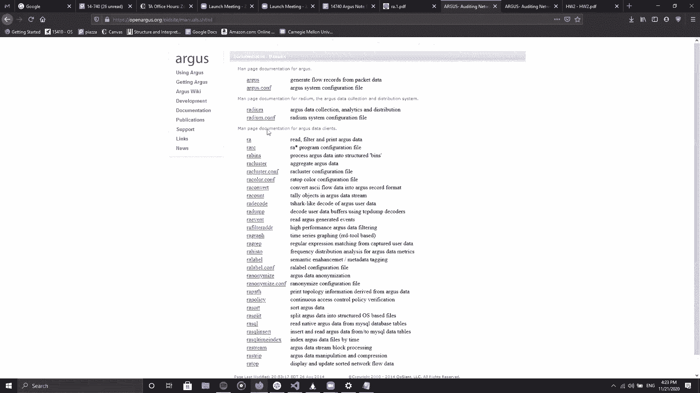

# 卡耐基梅隆大学 14-740 计算机网络 Fundamentals of Computer Networks（Fall 2020） - P22：Lecture 22 HW #2 Review Session - ___main___ - BV1wT4y1A7cd

Yeah。Okay， cool， so。Have all of you had a chance to look over a homework to yet？To anyone， Okay。

 so some else。A little bit just the fast。Okay， I mean that's fine that's fine like we didn't we're not actually expecting you to have done the homework already because well for obvious reasons。

But yeah as long as you know the name of the tool and sort of the high level objective of the homework。

 I think we're good。O。呃。So I think the first question I have to ask， like。

 do you guys have any doubts like just by reading like the handle itself or like any doubts I came to you guys mind something？

Yeah， or maybe any trouble you faced with your setup。I don't know if you've done it yet。

 but you're supposed to basically use the Unix and machines and。Because basically the data set。

 as well as the tools are on AFS， so。Any trouble in that if you guys have tried that out。I mean， yes。

 no vote is fine。 don't actually have to。Okay。Yeah， I mean。

 I don't expect anybody to have faced major issues， but yeah。

 as long as you have access to the data set and you're able to run。

At least you know RA dash dash help that should be fine at least we know your commands are working and your data set is available to you that's good。

Cool， I think then Ro， we can dive into it。Cool， so then let's go into that Then。 Okay。

 so the first thing I'll share is the document or the note sheet that we have prepared for you guys。

And then we'll basically go over that one by one。Give you like a few useful tips as well。

 to solve the homework。Just give me a moment to like open the actualcho homework page。O。Okay。

 so I've posted the link to the note sheet in the chat， let me if all of you can access it。

We get the request access to get to it Oh yeah， I。 that's weird I's say that people in Carnegie Mel should be able to view it。

Give me a second let me qualify permissions for this。好好的。Oh no， it says only people added can open。

 we have to change the link to Carnegie Mellon， I think that should be done now。一啊啊S有点多分对啊。Yeah。

 I can get I'm in and out so。awesomewesome。You guys can't Yeah。

 I can see a flood of people on the document so we could。Cool， okay。Okay。

 so we've given you a list of useful links towards the end of the page and towards the end of the note。

The ones marked with the three asterisks are like are the most important links and those would be your primary friends。

So if you go like if you like can navigate to the manuals page， which is like I guess link three。

This should be our primary source of reference whenever you are stuck so ideal the entire homework should be you could be you can solve it with just the commands mentioned in the homework in the handout which is RARA bins RA cluster RASR and this document should provide you like with the complete detailed documentation of all the different options flags and stuff that you would want to use。

呃。So we are actually not going to give you solutions to any of the questions and we are not doing a run through of the questions in this session。

嗯。So this document， we prepared it with some of the useful flags and like a basic description to what they are。

 but I can't stress this enough， this is not a replacement to the actual man and document pages。

 you definitely need to go through them to gain like a complete understanding of what you would need to do。

So I we will， I guess do us a couple of demo questions， I guess， not demo questions， I guess。

 demo commands to demonstrate some of the filters and。

Basically piping and chaining command for guess。收。You will definitely need to write the output to a file。

 so I guess that's on the second page of the node sheet so you can use like the output operator to write to a text file to a CSV and any file format and then you can use that to analyze your output and。

Chaining commands is also something that you will definitely need to do with the pipe operator。

 so I guess we can just give a demonstration of that。Okay。

 so do you guys like going through this document is anything？That you guys want to ask。

 straight up from this before we dive into the demos。So yeah。

 I think Ro already mentioned that the useful links are at the bottom and we've sort of marked with like a triple asterisk couple of links and these are ones that we personally found to be like extremely useful so even if you don't get the chance to go through every single link over there。

 we would highly recommend that at least the ones that weve explicitly marked。

 These are ones that you should go through because they do have some solve examples for basic commands。

That even， you know， we found useful while tackling this homework。

Okay so just give a moment to get my shell and everything up。じ点だ。

Yeah so for people who haven't actually had a chance to look at the homework yet。

 you'll basically be using this tool called AGUS， which is networkflow capturing and processing tool in this homework though you won't be actually doing any capturing the dataset is already available to you you'll only be using the Ar client tools in order to sort of pass process and understand。

What's going on in the flows， All of this will be done on。Your Uni dot Andrew machines。

 the same ones that you use in Home one。Except youll actually have to do a couple extra steps in order to get access to the data as well as the Ars client tools on AFS。

That's all you mentioned in the homework handout， so just mentioning this in case you haven't had a chance to look at it yet。

Okay， cool， so in that case， let me just share my screen。嗯。すけども。

Okay， so。So yeah ideal really you should do it on Andrew machines just as Raoul pointed out。

 so when you log into Andrew machines this is like the standard template of what you will see this photo0 is something that's similar that I have made but yeah this is like your standard this thing please keep it in your private directories so that it's accessibility to you。

For me， I've created like a new directory and I'm doing all the work inside that。Okay。

 so let's start。

So let me just demonstrate some of the users who may have to export partagon because it's a new session Thank you for reminding me。

あ呀。

嗯。Okay啊。

So my screen is visible to everyone， though right？I can。 yeah， okay， good。So that O minus L0。Okay。

 so。So this is like a very simple example of like how I'm using RA to filter out I'm not added any filter expressions and basically this would just print out the entire file L0 is basically like a label option which I've mentioned here as well so you can provide it as L0 biscuit for the label at the top L1 for a label after each entry and two and three and so on so just let demonstrate all the differences for you guys so for L3 it like labels through every three entries and so on。

And you get piped basically the output of this to another command such has head and its isprinting up the first。

I have some entries of it and you can even give account for it so minus7。Then then。Entries。呃。

 let's say那个拖地。过れ。So if you guys haven't actually had a chance to go through the data。

 this or like the actual file， this is basically what the data would contain。

Yeah this should actually look very similar to the net flow lecture that you guys had where the professor describe what actually constitutes of a flow and。

The kind of the seven fields that are used in order to categorize a bunch of packets together into a flow。

 so this should sort of link towards that aspect of the lecture。O。后。So any any doubts until now。

 is everyone following both。Okay， cool， I guess everythings fine。

So okay so then let me just go so just before we go ahead we just have a question in the chat so yeah basically the L stands for label and the0123 are basically various levels of labeling so when you give an L0 is going label your columns only at sort of the top of the file L1 means label every single line L2 means label every alternate line L3 means every third line and so on and so forth like。

Like that I don't think the ones beyond that are supported。 I just saw I've only seen0，12，3。 So yeah。

 I mean， yeah， I mean， you can try it out and experiment it yourself Yeah and zero is gonna be the most common that you want to use anyway。

 correct so when you like add the screenshots to your homework。

 you would want to label the output as well so you can use L0 for that。啊，酷呃，ok。

So let's move on ahead， So I've added like a sample example here。

 which is like a snippet from the second link， this is something that you may definitely want to go through before you get started just so that you can see the different examples。

Of what each command does， so they select the basic and idly RA RA bins are cluster count sought。

These are like the main commands you would actually be using for the entire homework。

So I would definitely suggest you to go through these links and check out the basic examples for all of them and also。

The documentation again。And the documentation， of course。

 you definitely I would have to go through that as well。So。

See what else can be demonstrated right now。So let's look over some of the basic flags and fields that would point that you would definitely need。

So as you can see here， like all of the ports are named by a service like STVP。And stuff。

 So while you're trying to analyze them， you may actually need the port numbers。

 So minus n is like a useful flag that does that that does that。 So， I mean。

 this gives us difference with minus n。 And we can see what that does。

So you can see that now it's converted all of them to domain that basically port 53s now。

 which is your DNS correct and shouldp game 80， so yeah。

 it converts all of the what to call characterizeized services to the actual port numbers。嗯。

Let's we can look at minus a also for this exact command because aggregate is something you will require。

Yes。Yeah as well。Oh we filter it out the head it gets filtered at the bottom。Oh。

 I should probably a good count on this。Okay， no that's fine， I mean。

 we still got it correct yeah substance are like aggregate statistics as well in the end with the minus a flag。

So yeah this is gonna to be something useful to figure out how many records your filter is actually given back to you because these data sets are huge so manual counting is not an option here yeah and so the entire RA suite follows the basic flags that RA provides so even RA bins RA account RA cluster they all follow the same flag and options that RA supports so let me just open the RA documentation page。

You you mind showing that last command real quick， I just want to run it real fast。

 the one you just did。

Yeah yeah， that's one run of my science see would。So yeah。

 it's basically like if you run with the minus a flag at the end of your just saying come on。

 it'll just print aggregate statistics。All right， thanks。

So。So this page over here， the manual page is as I mentioned earlier as well。

 is your primary go to source for any doubts or anything where you may be stuck an opening and if you click on them you can see that this provides like a very detailed man page。

 I mean I found this more I found actually better than going to the main page on the shell。

So yeah， as you can see， this gives you like all the possible options that RA supports and we have highlighted a a few important ones them which you might most likely use over here。

 but yeah do definitely consult this for the entire set of flags and options that you may definitely will use。

So your homework I guess so yeah and actually talking about this man page。

 there is one section which I absolutely loved， which is the filter expressions one it comes just after the options this is something that you will want to refer to it comes even lower it's after all the options。

UTYeah filter expressions So this is something you're going to be extensively using in almost every question and we highly recommend that you so the basic way to approach this homework is don't actually look at the question see what it requires then come look at the man page for the corresponding commands that's going to be very time consuming and you may not even end up with the right answer So I would first say go through the man page itself get a feel of what filter expressions are and their power and what they can do after that maybe go try tackling the question。

So just okay so while we are on the topic of filter expressions。

 let me give you a demo of using one of these。 So let's say we are trying to find out all TCB protocols right So right now you can see that this contains a various mix of various protocols like ICMP and all of that So okay so let's try to filter out something other than T because TB seems to be like seems to be a large one let's just filter ICM maybe yeah so ICM So minus and so let me just scroll up a bit give you like the original syntax。

 So it's RA followed by the options followed by the filter expression。

So minus ICMP I can see so as you can see it's only printing out ICMP records， nothing else。

So you can even chain filter expressions So now let's say you want to do ICMP of particular port。

 so let's say 1，4，6，0，5 as the destination port。Or yeah。So， and。Deport let's like。

 let's take just copy somethingD port， I think。Yeah。Oh I think it's DSST spaceport。it's。

 that's not it。 total records one。 No， we did get total records one。Why did it not though。

Let me type。到你什个。啊，特别的钱。thinkク。John was daughter figure。 doesn't feel。Yeah， I mean， yeah。

 it's something I guess you will have to experiment and try out for yourself， I guess over time。

But yeah you can chain your filter expressions like this so it's ICMP and like whatever filter expression you type it goes on like that so if you want to filter for like a specific host you can go with that as well。

Or let's say you want to check something。Let's say， DCP。And。4 80。

So you can see now you've got total records 8544， so these are all TCB connections that are running on port80。

So if you didn't figure out already， these are like all HtTP connectionss。

 so this is like a quick way for you to find that out。Any doubts？On this， like， is this all clear。

You actually， yeah， I think it's pretty clear。 But at the bottom， when you do the aggregate， can you。

 what is。Man records and far records。You happen to know what those are？Like totally me。No， actually。

 I guess even I have to consult the documentation for that。

 so let's see let's see if we can try to find out what that means。

Yeah。

That's all。哦。嗯。A规定。不知道。

So。嗯。嗯。Oh， I guess we probably forgot to give you a disclaimer before we started that， yeah。

 I was thinking of the same thing right that。😊，That we actually have not done this homework because this homework is not there when we took the course。

 so we are also trying to figure it out as we go along just as you guys。

So do bear with us if you do not know all the answers at this point。Yeah。

 I mean we're practically you except we've sort of tackled this maybe two weeks earlier than you that's pretty much about it。

 but yeah August is a relatively new tool to us also so yeah。Just not like curiosity， I mean。

 I kind of look at I ski through all the questions and like conceptually。

 they're not like super tough or anything right， But I guess since you guys kind of went through the homework。

 how would you gauge it compared to like the first one as far as like a time commitment。

 I guess as a time commitment， I would actually say this is。

There's going to be a little bit more of work because like the first one had pretty standard commands like dig and stuff。

 but the second homework it actually requires a lot of effort from your side to go through documentation and learn the tool it's not something that you can wing in the last minute that I can say for sure。

は。My close my shall I mistake。あのな。🎼Yeah， so wait， to go back to the previous question that you had about。

🎼TheEx， Yeah， the export。Oh yeah， every time you open your shell。

 you will have to run the export command as well unless you modify your bashRC file。Okay。

 so sure we do we have permissions to modify byRC， I think okay， check Okay。

 so to answer your question about total man records and far records。

 I guess I'm not particularly sure about it right now， so I will。I guess do come back it actually。

 if it still persists and I'll look into it further after this session as well。Yeah， I mean， I。

 I was trying to look at it as well to try to find stuff。 and there's like。

I it was hard to find anything on it。 So I don't know if it's that it like it probably isn't that useful。

 but it would just be nice to。If there is somewhere where it tells you just to know so that way。

 in case if it's useful， we can。 Yeah， I should make use of it but。どかに。Okay。

 so now let's see that so right now， clearly like browsing through your shell is not like an ideal scenario。

 right？So what you can do is you can output it to a file， so let's say output dot text。

And then you should have it as that so that rim。And then you have the text file。

 which you can download to your local system for further analysis。

And so what extract etctera as well， you can even output it to a CSV file and bear that this that this is a hint that you will at some point in the homework be required to do that。

I think the hand itself gave them that link， so oh yeah， the hand does specify that quite。😊。

Yeah， so where is that。Yes，Okay。

Cool， then let's go over something else on the document。

So let's try to run an RA sort function or RA cluster function。Okay。

 I need to come up with something that doesn't directly address one of the questions in the homework as well。

Oh。So what do we， what can we cluster around， Raul any suggestions， What do we cluster on。I mean。

 okay， I was going to say we can bin on maybe byte count or something， but。Okay。

 you want to cluster it on。Lets just cluster on I this or something。 Just。 Okay， yeah。

 that well that works。 So it's what source source right， or I think it's S did。 Yeah， S I yes。

Actually leave it target cluster minus R C。No。the expert R minus m so minus M is the second useful flag that we should probably divert your attention to。

 This is something you should definitely look so let me get it to the man documentation for it and let's see what we can do with that。

呃，那 is the。Is it specific to add story？Yeah， here we go， agregation objects。

Throughout the entire homework you would be required to like aggregate objects because I mean it's such a huge file containing like I guess insane amount insane amount of flows but more than that youd basically sometimes want to analyze only one specific aspect of it like maybe you want to only analyze the traffic for a single host or you're only interested in one sort of protocol so in that case this will be very useful correct so let's you want to aggregate it or like cluster based on the protocol or a specific source port destination port and stuff like that then this is the first place that you should come and refer definitely go through all the options there are quite a few number of options that you will find useful so let's just try to find it on let's say basically host right now so。

That's do we see that here As。 yeah， So let's go back。

Specify on S。Other， okay， and another useful flag is right now。 So we have like what1，2，3，4，5，6，7，8。

9，10 columns， right， So let's say you really don't want to analyze all of that So you can put minus S。

 and that basically like just outputs those specific columns to you So you can let's say you just want to see the so sadder DR。

sport。The他的。Report。Great。すろ？So as you can see right now it。It we call。

 it doesn't print out the other columns because these are the output columns that we provided to it。

And as you can see this clustered all of the entire traffics， the entire traffic。

 and this is your entire unique set of source hosts that the entire I guess network flow has。

Are there any doubts， is this clear？Okay， so I guess everyone is following me to now， that's fine。

Cool，O。So let's check out something else in the Noheet then let's see what else can be show。

Yeah so minus S as I mentioned can be used to dis display letter fields minus t is definitely something you will look at but I don't think we'll get into it much today。

 it's used in specified time range fields if you need to do time based analysis minus W can be used to output to our file and this is basically output S so let I can go through that。

So， minus W minus。So minus w can be used to output to any specific file if you don't want to use like the other this operator or something。

 and when it's chain commands， you may be required to specify a TD in and then。

You can chain like another command， so let me like try， let me display one of those commands。

 I guess。So let's say you are trying to filter out。Let's pick up， okay， this specific host， right。So。

 are minus R C D X。嗯。マイナ。hos。So this basically just gives us all the entries that contains this as a host。

And。Now we chain it。🎼，ItsMy bads， right。And we chain it to， let's say， R to。呃。Y is R and。呃，7我打。か。

Watch we got the same protocol box。Okay， so。Yeah， so I guess creating them on the fly is not a very great option。

But this is ideally the syntax that you would use if you had something valid that you were trying to search for right now just came up with something on the fly so as you can see there was nothing for it。

But yeah， so this is how you would change different commands， so like RA。

 RA sort or RA account as well。Is there any doubts about how you would change commands？

I think we've already put this in the document right。

 but the minus w minus before the pipe is going to be really useful when you're trying to redirect them in sort of the August record format itself。

个人。Okay， so let me see what else is useful。I don't think we need to actually demonstrate RA bins itself。

 but yeah we'll just mention it just because。Yeah， our bins basically just specifies like it sets it into separate bins and the way you can split it。

 it has separate options， which I guess you can consult the main page for that。Yeah。

 we provided like some sample of same commands that we demonstrated here as well。

What else can we go through is anything else key， I mean， yeah it's。

 it's really difficult going through examples of the commands。

Without actually directly tackling the questions。 So correct， I mean， yeah。

 we we were not allowed to give you the answers or even go directly into the questions。

 which is why we like trying to come up with something that's not be apart from that。

So check it out but yeah， I mean， like I really can't stress this enough。

 the man pages are your best friend for this homework。

And if not we are we do old we are still holding officers do pop up Yeah I mean。

 I think actually Piazza also would be a great resource in this just you know。

 if you post public questions about you know how do you use this particular filter or you know this particular command line option seems to be giving me an error so has anybody else faced this issue so you could you guys could actually pull your knowledge about Ars on Piazza itself。

Coect so another key this thing that I can probably point your attention towards is the minus M mode operation this is something you might probably want to experiment for yourself and look at it These are quite useful so yeah do go around and definitely look at this you will definitely find various users for this value or like going throughout your homework or something。

呃。

Yeah， I guess I don't have anything else other that demo for you today。 I guess， Yeah， that's true。

 I think， yeah， the probably， I mean。

How do I put this。The reason I if you guys remember the reason I said before that， okay。

 don't actually look at the question and then read the map page to figure out the answer is because if you try to tackle the question in that way。

 you're going to get terribly struck on question nine。

I don't know if you can just assure them that。诶也。This is probably professorssor is his favorite question。

 find something interesting。 be creative。 So you， you will actually need to know the tool decently well。

 at least。😊，In order to tackle question nine because that is probably the it is the question with the most weighttage right yeah yeah so you have to demonstrate some use of the tool in a way that has not been tackled by the previous questions and that will require some knowledge and research from the main pages。

Co I mean， I mean， this is like quite a useful tool right network flows or something that even beyond this class at some point you may be required to analyze and think and August seems like a quite useful tool to do that。

 So yeah yeah now that I think about it I mean for people who are probably in the first semester and you're planning to take network security next semester your first homework which is the firewall is going be based on analyzing flows So yeahep。

Correct， yeah。 So definitely worth the investment going through it。 Yeah， I guess。

 I guess the document has been made put on the chat。 will'll also post the link to it on Piazza。

 as well as the recording for this session。 Are there any doubts that we can answer before we。

I guess you would put it in。Yeah， once again， sorry if you guys came in expecting a detailed review as massive as the quizzes。

 but obviously because this is just a small homework compared to the quiz。

We didn't actually cover a lot of material and more than that this homework actually requires a lot of effort from your side in exploring we just want to just you know sort of give you a starter sort of boost on familiarizing yourself with what the tool itself is。

Yan。Yeah， as I， like， we can't directly address a lot of things without actually going into some of the of how you would solve some of the questions。

 So yeah， I guess officers would be the more ideal place to discuss some things in more detail。 Yeah。

 I have a question。 real quick about office hours。 Are you gonna have office hours during the break。

That is a good question。 Do we have officers during the break， I mean。

 I had no intention of canceling them， but I'll actually have to take a look at university policy Now that you mentioned it。

 whether we're allowed to have sessions during the break。 Yeah， just because yeah。

 that would obviously like that's the majority of。😊。

Yeah we'll be working on the homework because I just didn't know if I'd be able to like stop by and ask because yeah。

 I'll probably be mostly working on it from like Tuesday slash Wednesday throughout the rest of the week and yeah。

 I just wanted to make sure。If I need office hours if I can swing by whatever yeah yeah that makes sense actually yeah thanks for bringing this to our notice'll I mean we'll obviously check in and see whether we're allowed to hold office but I think if the university allows us。

 there should be no change definitely hold our office yeah。😊，Cool， again。

 I've already updated the Piazza post to have the link for this particular document that we shared with you so that you can come back and refererate time and again in case you've closed that browser tab。

 which I don't think you guys ever do， but yeah。Cool。

 and we'll also post the recording link as well so then you can even check up the recording later if you guess when to some yeah I'll actually go ahead and stop the recording right now in case people want to ask questions and they don't want to be recorded so。

