# 卡耐基梅隆大学 14-740 计算机网络 Fundamentals of Computer Networks（Fall 2020） - P23：Lecture 23  Link Layer Devices - ___main___ - BV1wT4y1A7cd

This is 14740。 welcome everybody to another wonderful day of networking。

 I'm very glad you're here with me today。Here in Pittsburgh。

 it is snowing our first substantial snow of the year。

 which is kind of exciting and also portends like the beginning of winter。

 which is not my favorite Pittsburgh season， but it's okay it's a good day out there。

 those of you who have departed Pittsburgh and gone on over the Thanksgiving weekend to go to other cool stuff in other places。

 maybe happier said to have gotten away from the snow， who knows。

I hope you all had a wonderful Thanksgiving， I hope you all are had a chance to relax and refresh a little bit and recharge those batteries and hopefully you were with people you love and people who love you be nice if they were the same people。

U。All right， but here we are getting ready to go back into computer networks and learn a bunch more over the next couple weeks。

Let me ask a special request here for those of you who can turn on your videos。

 I'd appreciate it right now I've got this sea of you know letters and avatars I'm looking at it's a little hard to make a human connection when you know I'm basically teaching in my kitchen so if you are willing to I'd appreciate having a couple human faces out there that I can。

Teach to and so that I can kind of get a feelinging whether i'm you know hitting the mark or not as we go I'd appreciate it very much thank you thank you。

If you if you can't， no big deal， no big deal， some of your classmates are， and I appreciate those。

All right， so let's move into today's material， some cool stuff today。

We have an extension or kind of next step in our understanding of what's going on at the link layer。

And we're going to be covering two big concepts that are that are happening in the link layer before we do that。

 though， let me quickly just mention that we have a final coming up and just so you know。

A little bit about it what's going on it's been published'm I'm sure you've known the date and time for a while because the schedule has been out for a couple weeks and I know typically students are much faster than professors at figuring out when the finals are。

But we've got it fairly early， it's Tuesday of the finals week， early in the morning， 830 to 1120。诶。

Don't know how much trouble that's going to be for people in other time zones。

I'm not sure I can do a whole lot about that but。Well， if it is a huge issue for you。

 let me know and we'll see if we can see what's possible。

we will be executing this the same way we've done with the quizzes， it'll be on canvas。

 we'll have zoom open for questions and announcements and stuff like that。

It is a comprehensive final exam that means that it covers everything from the entire course。

 it is also the one place where I have the opportunity to ask questions that connect ideas that say。

 you know hey， this thing's going on at the application layer you know what's the effect of that at the transport layer kind of questions that I could not do on previous tests？

But so it's the whole enilada sort of thing the learning objectives list is posted and I continue to believe that's a good way to study。

I've also seen an announcement or a request a posting on Piazza asking for a study group to get together。

 I think that's a fantastic way to study this material。

 having somebody else ask you questions and you are forced to produce the knowledge。

Just like you're going do on the test is extremely good practice for what you're going to do on the test and so is much better than like。

Watching all the please please do not plan on blitzing through all the videos again and rewatching all of that that that's just。

It's too depressing to think about。But and if you have any questions， of course， as you prepare。

 please post them to the piazza or come to office hours or find a way to ask us so we can help Piazto。

 okay？All right， into today's material， as I mentioned before we have these two topics to consider last time we learned about what the idea of the link layer is and how the link layer connects。

TheBasically the computers that are on the same wire or wire is kind of you know sometimes a little bit theoretical like in the case of WiF。

 but these are the direct connections that are being made hop by hop by hop as our packets at the network layer are traveling across the entire globe。

They're traveling across many different hops， each of which is a lake layerair。

We also looked at ethernet， which is an extremely good example of a。

🤧Link layer protocol and we learned about a bunch of the pieces of how it works。

 and that hopefully has given us the right perspective on how our frames are going to be transmitted through this data link layer。

We're going to talk about address resolution protocol today。

 which is a protocol which assists with that as well as the interesting world of how to connect stuff up。

So let's get into this first topic， the address resolution protocol or ARP ARP。

Now this is another one of those really interesting protocols。

That is necessary because each of the layers of the network stack has its own sense of addressing。

And so when you traverse the layer， you need to have a way to convert these addresses。

 so when the network layer takes a packet and hands it down to the data link layer and says。

 please deliver this packet。Well， the next question is where's it going to right please deliver this to where now the network layer has an IP address in mind and it says hey here's because that's what the network layer is working with。

 here's the IP address of where I want this data to go。

And then the data link layer looks at that and says，hu， that's an IP address。

 those aren't useful to me。At the data link layer， we need to do some conversion and we need to take that thing and make it into an address that is useful at the link layer make it into the media access control address that is being used at that layer。

So how do we do that， Well， that's the mission of Ap。Okay。

And we've seen this before right we've seen so DNS is the other really good example of a protocol whose reason to be its mission is to do this translation in that case DNS。

Was converting domain names to IP addresses？It's just one layer address to another layer address。

And DNS did that by sending these requests， basically shouting out into the world and say， hey。

 does anybody know？www。cmu。edu do you certainly know what the IP address is for that and some server somewhere would would handle it。

And that's kind of what's going on with ARP ARP is going to again shout out into the world and say。

 hey does anybody know this IP address， I'd like to know what it Ethernet its Mac address is anybody know it。

So in that sense， it's a request reply kind of protocol。ARP does not require servers。

 though doesn't require the hierarchy that we had in DNS， in fact。

 it's of a good deal simpler than DNS。😡，No you know， recursive or iterative navigation concepts。

 you know， no need for route servers and registrars and all that sort of stuff。

And that's mainly because of the scope。In DNS， the domain name that was being requested could be any domain name in existence。

And that meant that we needed a globally distributed database of the answers for those。

 so we had to be able to potentially look up any domain name ever in existence。

ArRP doesn't have that problem。ARP is a link layer protocol， and that means its scope is constrained。

To that link， to the computers that happen to be connected to the same wire or in the same radio space。

And so the only possible questions that are being asked are what is the IP address for some computer that is on this link。

 and that means we don't need big servers or anything to be able to answer that question。

 in fact we're going to have the computer who knows the computer who has that IP address answer that question。

All right， so what is ap， it's another one these fundamental foundational protocols that's been around forever。

RfC 8263 digits right so it's a you know way back when not too long after the RFCs for TCP。

 for instance。The idea is that it's going to be used。But well hopefully by any was kind of the idea。

 any network layer converting to any data link layer。

 mostly we're going to see it used today of the network layer that is in use of course。

 is IPV4 mostly some IPV6 and so we need to translate those addresses into well mostly ethernet and Wifi because those are the commonly used。

Data link layers， certainly they're not the only。Okay， and so other mappings are possible。

 other addresses can be used in this place。Interestingly。

 IPV6 does not use ARP IPV6 came up with their own protocol called neighborigh Discovery protocol。

 which does similar things， has a little better encryption support。

 has some additional stuff you can do with that protocol。

So we won't worry about too much about exactly how NDP works。All right， so what is art？

We're not going to go into all the details about bid formats and stuff like that for our purposes。

 it is important to recognize that the protocol has basically four fields and there's an ethernet an IP address。

For the sender and the target。So the and that' that's all you need for this and so the aRP。

Message protocol， you can imagine having I could draw one of those box pictures with four boxes in it basically ethernet address。

 IP address， Ethernet address， IP address for sender and destination。

The destination is not who you're sending it to the destination is probably better called the target。

 this is the question you're asking， this is the you I have a frame that I'd like to send to this IP address。

 therefore I need to know which IP address matches this Ethernet address and so that's the question we're asking。

TheRP packet， the ARP data structure with these four fields then gets put into a frame。

 so if we're using Ethernet it'll go into an ethernet frame we're using Wifi。

 it'll be the payload of a wfi frame。嗯。That frame then gets broadcast out to everybody on the wire。

 everybody in a datalink layer， and so basically blasting this out shouting down the wire。

 hey does anybody know what Mac address this particular IPHS goes to okay and yes Abdul Hadi I'm using Ethernet and Mac address back and forth and they are synonymous technically you can use other data link layers and so when I say Ethernet address？

I should also be saying well you know wfi address or whatever other data link layer address you're talking about and so yeah Mac address。

 Ethernet address， same thing。Okay， so we put this request together， we send it out。

And we get some answers back hopefully。As with everything computer engineers do when you do some work and you expect perhaps sometime in the future。

To need to answer the same question again， we save a copy of it。 And so in ap。

 there is a thing called the ap table。 So this is going to be built in to every。

Every ethernet every data link layer is going to have this table in it and this is the table of the answers they've come up with what what IP address ethernet Mac addresses。

What pairings do we know about and so those get put into this table。

And that means if I ever have to send a frame to the same IP address。

 I can look up the answer in this table。 So this is just a cached。

Place to put all the answers for the questions we've gotten previously and that means that for future requests。

 if the network layer hands us another packet to put into a frame to send to a particular IP address we look in this table we say oh have I ever looked this up before。

 oh yeah， I know that that IP address matches this Mac address so let me use that destination in the frame to actually send this packet to。

Okay， of course， if it's not in this table， that's when we actually have to do an aP request to get the answer back。

Okay。嗯。Well， I'm not quite sure I understand your question。

 do you mean if a computer has multiple interfaces on it？Like a router would have。Yeah。

 so in the case we you have multiple interfaces like a router。

You actually have multiple data link layers。Okay， and so I guess think of this ap table as being part of a particular data link layer and so if you have if you have a router that has two ethernet。

Links that's connected to， they would each have their own a because。

They don't need to answer questions from one。Data link layer about addresses on the other data link layer。

 because nobody on that。Data link layer would be at the data link layer sending data。

From one to the other。Okay。And Ter， you're correct， right？

Cashching only works if you're ever going to use the answer in the future and it turns out for ARP you always use the answer you've seen in the future or not always。

 but very， very commonly we'll see an example in a minute why that is so and especially for some of the targets we use like every packet goes to the gateway router and so aRP is going to have that answer。

And it's going to save us a huge amount of our request。

 so this is not something that happens for every frame we send。

We hope that it is something that is done。Fairly rarely。Okay。

Okay so here's an example of how this would work on a very small link right here I've got a small subnet。

 a small land that has four interfaces on it I have in this case I have three。Host machines。

 three end hosts and a router and they're connected and I'm showing below them IP addresses and Mac addresses for each those of those interfaces and so imagine that the computer there's an application here on host one that is trying to send data to an application on host three。

Okay and so of course they've set up a maybe they're set up TCP between them or something like that and the data link the network layer then needs to you know send the packet from here to there。

And the network layer will know what IP address post three is。

Because he used DNS to answer that right that was a you know application layer said， oh。

 I need to send this to host three。Whereer is host three and used DNS to come up with this IP address。

The network layer is now handing a packet。Here in host one。

 the network layer is handing a packet to the data link layer and saying。

 please send the data that's in this packet to 10。0。0。87。

And if host one has never sent anything to host three before。

 that means that IPHS will not be in its aRP table， and so it will need to use ARP。

To find out what is this this address I'm looking for and so it'll put together in our request。

 it'll have， as I mentioned， four fields in it right so it has you know， here's my IP address， 100。0。

42。 Here's my ethernet address。I'm looking for IP address。87。

And I'd like to know the Ethernet address for that anybody out there know。Okay。

 and then that gets broadcast it gets sent to。The broadcast。Ethernet address， which is all ones。

Which means that every interface on this link。We'll get that frame and look at it。😡，Okay， and so。

For instance， in host2， that frame is received。It is recognized the type field has ap in it and so it's recognized oh。

 this is an aRP packet let's take a look and so the aRP code。

 the ap module that's in the ethernet layer on host2 looks at it and says hey this is not me I don't know who dot 87 is because I'm dot 19 so I'm not going to answer and same thing happens over on the router right the router says oh I'm dot1 not dot 87 I'm not going to answer。

But host three gets this。So host three also receives the broadcast and the art module in Ho three looks at it and says。

 oh。You want to know who do87 is and that's me。Host3 knows that he is died 87。

 and so he can answer the question。 He can reply。 and so he'll send back。Another frame。

 he'll send back and say， oh， you know I。You know here's an ap response to an ap question and in this case you know this is the sender that's me and here's my Mac address。

 this is the answer to the question you were looking for。And you know this is who you were。

 so I'll send the art back to you。Okay and when that gets back to host one。

 host one will look at that frame， oh it's an aRP type。

 the ap module will look at it and say okay this is the answer to that question we had。

 we now know the Mac address for dot87 we'll put that in our aRP table and the frame that was being sent to dot87 I now can actually fill out all the fields I can construct a proper ethernet frame and send it to host3 well technically send it to you know AB colon B。

That then will' go up the to the network layer to the application layer on Ho three。

 so it don't make sense。This is the reason we don't need DNS root servers and registrars and all that stuff。

Every time you ask a question。When host one asked who is this IP address？By kind of construction。

 the respondent is on this link。The only possible questions host one would ever want to know are these four IP addresses。

Okay， because at the data link layer， we never send anything anywhere but on this link。Okay。

Ali will' talk about switches in a minute， so hold that's the second half of the lecture。

 so we'll get to that okay。All right now。I just said we never send anything to an IP address that's not in this link。

😡，And you might have said， wait a minute， we always send stuff to places that are not in our local link right now。

 you and I on Zoom are communicating， even though we're not on the same local link。

So you got to be careful about the context of what I said I said at the link layer。

 we're never sending frames to any IP address that is not in our particular link。

 so the link layer never goes anywhere but these four addresses in this example。

If I am sending a packet to your computer and we're not on the same link。Well。

 that means I actually am not going to send a frame to you。

 I'm going to send a frame to the router that connects my link。To the rest of the world。

Okay that's what's happening at the link layer， right single hop， the router。

 the network layer at the router will then figure out how to move that to another link。

And send it out on that link。So from the link Blaer perspective。

 we're never going to send a packet to any but these four IP addresses。So how does that happen now。

 if host one actually is trying to send to some other place that's not on this。This link。

 So let's imagine there's a host for somewhere。 It's on a different subnet， which means this router。

Is going to have to forward that packet。To some other data link there。So how' does that work， Okay。

 well host one the application host one will know that it wants to send to host four。

 it'll use DNS to look up host four。Okay， it'll discover， hey， here's some IP address。

And the network layer will look at this IP address and know， because the network layer knows the。

 we call the net mask， it knows the prefix of the subnet it's connected to and it'll say。

 wait a minute， my prefix is 100 you know 10000 slash 24， something like that。

And I'll say that this IP address is not in my prefix。Okay， therefore。

 I know the network layer knows that this packet needs to go outside of。Of my subnet。

And so when we hand this to the data link layer。We tell the data link layer， hey。

 please send this packet。😡，And the packet has the IP address of the final destination in it。

Please hand this packet。To the gateway router to our default gateways。

 which is the router we're connected to。😡，Okay， so in this case。

 and remember that's information we know from DHcP。

We were told when we configured who our default router is， so the IP address of this router。

 the dot1 address is known to the network layer and the network layer knows the subnet mask so it knows that the packet has to leave this。

This subnet。And so host one will。At the data link layer， be told to send the packet to。

The IP address 10。0。0。1。Okay。How do we find out the Mac address of that the network layer only gave us the IP address。

 the data link layer needs to figure out the Mac address of the router so we can send the frame to this particular interface of the router。

 How do we figure that out。We use ap。We go ahead and send out a broadcast an art message saying， hey。

 does anybody know the Mac address for 10。0。0。1？And this router will get actually everybody will get that host two and three will ignore it。

The router will say， oh， that's me， I can answer that question。And we'll send back an a response。

With this Mac address。By the way， that。We mentioned a minute ago these are very cashable right every time host one wants to send a packet anywhere not on the its own link。

 which is probably most of the time。We're going to be sending to this IP address to that Mac address。

And so that's going to be very cashable。 going to go in the a table。

 We're only going to have to look that up once。🤧嗯。ARP also gets used， we call it grartuitous。

 gets used。In ways when we don't really have a question to ask。

 but we're instead kind of making announcements。And so you'll see the reference to gratuitous aps happening and basically what you're doing is you're sending an announcement you're saying。

 hey everybody， just to tell you this IP address matches this Mac address。And that's commonly done。

 for instance， when you join a network。Right， so you know I。

In the before times I would wander into a coffee shop and open my laptop。

 and I would type in a Wifi password to join that network。And when I did。

 I would go ahead and my laptop would go ahead and send a gratuitous arp message。

Just to tell everybody mostly to tell the access point I'm connected to。

 here's what my IP address mapping to my Mac address is。Okay。And we do that， for instance。

 we want to make sure because I probably got the same IP address that's。

 you know that guy who just bought the coffee in the doughut and left a few minutes ago was using。

 I'd like to clear out any stale data I don't want his Ethernet address。

To still be used on that network， so I'll send out this gratuitous arc message that will overrite。

That value in everybody's a table。There are other cases for this。

 a very common one is if you have high availability replicated servers。

 so the idea is I have some data， you know， like my corporate database or something。

 and I don't ever want it to go down。But computers do crash。

 so you make you put two servers next to each other and you set up a protocol so that any updates to one database get mirrored onto the other server。

And we call this high availability servers， the idea is then that if the main guy crashes。

 the backup guy can just take over because he's got all the data。And that's fine。

 except he's got a different。Mac address because he's a different computer。

But he wants to everybody who's communicating with the original IP address to now come to the live computer。

 not the crashed computer， and so a gratuitous arc will be used to basically say， hey。

 you guys were sending to this Ethernet address now send all traffic for that IP address to this。

New address instead， so it makes sense。Sorry， I've been ignoring。Chat for a while。

 let me see who we are。Deion is asking about mesh networks。

 so a mesh network is where you actually have a bunch of routers that are working together and passing information so they're going to need to be a little bit more complicated than a standard router and。

So a lot of times the decision about the first router is still something that has to be made。

And depending on protocols right so there are a lot of very different protocols for this like XB or something like that。

 they have their own routing choice built in because the idea is you have these small computers that are moving around all the time and need to act as routers for each other so there's a lot of complications there that are not that I'm not going to go into here because they're not。

Good say they're not general purpose kind of thing。

 but they would be specific to that kind of network。

Austin's asking about a table entries and how long they last。

 they get timed out after a while and it's a network administrator function。

 think you know 30 minutes to 60 minutes kind of kind of timeframes。嗯。

Jake is asking about the next slide， is it easy to spoof the Mac address？

mLet's see actually he's asking about the Mac address and yes。

You can go into system preferences on your computer and you can type in a new Mac address and you will now be that Mac address and presumably。

It tried this， but I would guess that as soon as I type in a new address that my laptop sends out a gratuitous arp。

Message that would announce that new Mac address for my IP address。You said the wordpoof。

 so I jumped to the next slide。Just to point out。No security behind this。Okay。

 the a frames themselves， there's no。No encryption， no hashing， no authentication to it。

 anything like that， it's just bits of data。Which means that it's commonly。

Used in some sorts of malicious attacks。So just like the scenario I mentioned a minute ago about a backup server taking over the traffic that was originally going to a primary server that's crashed。

 I can do the same thing in a network。So I can still go ahead and tell everybody else that your IP address is now mapped to my Ethernet address。

And they're going to start sending stuff to me。And so yeah。

 it's very possible to take over somebody else's traffic and now the challenge there is you have to be on the same link。

Right， so right now， you know。You're sitting， you know， I don't know where you are。

 you're in Silicon Valley right now on some link， I can't spoof your address。

Because my ap is a data link layer thing， I can't get to your data link to send that ap。Okay。

 so it is a that is one savings grace right if you want to you know。

 maliciously take over my computer in my house， you have to come to my house to do it。Okay。But yeah。

 it's one of the issues and that's one of the reasons I think NDP is taking over for IPV6 because it has some more security elements to。

It's also designed to be proxed， so there are cases where you want to have。

you don't want your frame to pop up to the network layer at each device and then pop back down and so you can put a bunch of links together we'll talk a little bit about this in a minute。

That will appear to the。data link layer and that means that you have to be able to send all aP stuff to someplace else for answers。

 even though it's not on in your own broadcast region， we'll see some of that in a minute。

Also commonly used in data center networks。Okay， any questions about ARP that I didn't cover？嗯。

Oh good， looks like you are。Of course you guys love security。

 you're all into all the security stuff about ARP。嗯。Okay， Jake， I'm going。

Jump on your question if two devices have the same aRP on the link。

I'm going to point that out because。You're using network terms。

 but I'm not sure you mean what you say you mean Ap is a protocol。

Right and so computers don't have the same ap， they might have the same Mac address。

 that's probably what you meant。Okay， so yeah， if they have the same Mac address on the link。

 that's a pain in the neck。It's uncommon now but。Yeah。

 think about what would happen if you and I are both on the same link and both have the same Mac address。

 that means anything sent to either of us is going both of our computers are going to look at that frame that is sent and decide it's for us。

Okay， so anything sent to your computer， my computer will think it should be looking at anything sent to me。

 your computer will think it should be looking at and that's not too terrible。

Except that we will then both be replying to it okay and that gets very confusing for whoever is sending this traffic because they're now getting two responses to stuff one of us is for instance saying you know like TCP reset I've never heard of you go away and the other is sending actual data and so that is a real pain in the neck。

I think we do reverse ap in the labs， not going to talk about it today。Treer， yes。

 Mac addresseses were designed to be unique。Okay， that they went to some trouble to make sure not only unique in the data link。

But unique globally。Okay so in theory， my Mac address is the only I'm the only computer in the world using the Ethernet address that I happen to be using right now。

But they are changeable， so it's possible to change it and mostly changing it won't cause any damage because if I change it to some other address。

 the chance of that address being on my link is pretty low。Really， all we need is we need unique。

 not globally， but in the length for these purposes。So， yeah。嗯。All right， next topic。

We've been talking about connecting stuff。Through the entire course right， that's kind， I mean。

 that's what computer networks are。 There're ways to connect things。 and it turns out。

The concept of connecting things and how you do it is a little bit different right we talked about for instance how businesses connect using an IXP you know way back in like lecture four or something like that。

And we're going to do it again today， we're going to talk about connections。

 but now we're talking about how you actually connect stuff up at the data link layer right what does it mean to be connected and how might we do that in different ways at the data link layer。

And actually， I'm going to peek down into the fiscal layer as well first。

 just to give us a sense of what's different。If I connect to computers at the physical layer。

 what does that mean well the physical layer is the layer where we're talking about the electromagnetic waves that are traveling down some wire or from antenna to antenna。

 and that's all it is is some physical wave some wave traveling through the electromagnetic spectrum。

And so if I'm going to connect to computers。What it really mean is let me connect a wire between them or let me get them close enough so that the antenna sending an electromagnetic wave from one can get to the other。

And occasionally I want to expand that or change that a little bit。

 and so it's possible to do that it's possible， for instance， to take a signal。

 an electromagnetic wave， a sine wave that's on let's say a wire and maybe I need to use a thing called a repeater。

So a repeater is something that is used if you need to extend the range of a physical connection。

And the idea is that this is a circuits layer concept。

 we're going to build an amplifier that will take this sine wave coming in and you multiply its size by 100 and send it out the other side okay so you get a tiny little wave coming in into an amplifier and a big wave leaving。

Why would you do this Well this is a range extension device so this for instance imagine。

Imagine oceanic cables right there's a fiber optic cable underneath the Pacific Ocean and it is not true that you know in Los Angeles you can send just a really tremendously huge electromagnetic wave that will travel down that entire cable and pop out in Tokyo and still be readable。

The problem is that as you send these electromagnetic waves。

 they degrade as they and they get noise added to them and they you know they're just not as as big when they get not as much power when you get to the other end and so there are stations across the Pacific Ocean where repeaters are built into the circuit where you have an amplifier that will take in microvolts and make it into volts again。

And that's what a repeater does。A hub。Is another device， it's a box you can buy。

That allows you to plug cables into it。In this case， it's a way to plug a lot of cables into it。

 so maybe you'll take four or eight cables and you plug it into a box called a hub。

And the hub then has electronics in it to make sure that any electromagnetic wave that comes in on any one of the wires gets sent out to all the other wires。

Sounds I don't know kind of like a routerish sort of thing right a box with lots of wires yeah the only difference is you're at the physical layer and so this device is just looking at you know here's this sine wave coming in on wire number three and we're going to amplify that we're going to transmit that same sine wave out wire number one two and four。

Okay。And so that lets you build。A network。That has these physical connections that are easier than just stringing direct wires。

So here's an example of a hub in use so a hub is you know this is a box it's a hub it has this is。

F lengths is a very small hub。嗯。And you plug these cables into it。

 these are all ethernet cables right and anything sent in on one of the cables gets connected to the other that what that does is it allows me to build a network very easily。

It allows me to take a bunch of end hosts and just plug them all into this hub。

And now they're all connected。Okay this is a very easy thing I mentioned in a last lecture about using vampire taps in the CoX cable that was。

It's a similar way it's making them all on the same cable。

 but this is easy right you just plug into a box， you know， your kid can do that no big deal right。

And what this means is any bit coming into the hub from one from this computer on the right。

 any signal coming in there gets sent out to all the others and so everybody sees all of the electromagnetic waves developed by anybody okay and because it's physical layer that's all it does okay it doesn't understand things like what a frame is because it's a physical layer device。

Okay all it knows is this electromagnet wave。Occasionally you would get hubs that actually did a little bit of collision detection and it would be able to say。

 oh， I see a wave coming in wire two and a wave coming in wire four at the same time。

 we're going to send out a jam signal so that's。A little bit into the the layer two into the data link layer。

 but in general， no understanding the protocol。

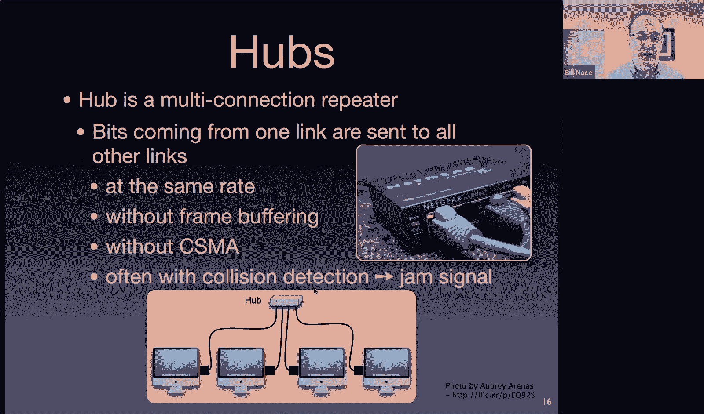

But's still very useful。So here's how I would， for instance， connect a whole bunch of computers。

Into a hub turns out you can take the anything。Connected into the hub and connected into another hub all you're doing is you're saying all these three wires are now the same wire as this one right and now all four of those wires will all have exactly the same signals on it and I can connect it into this hub and you know so now all these computers I have what nine computers here。

All of them will be seeing exactly the same signals to each other。

Now this was commonly used we see it for architectural reasons a lot right this is you know this is the computer lab on the first floor where I have all the computers and I plug it into this hub so they can be connected together and this is the computer lab on the second floor and this is the computer lab on the third floor and then you just run a wire into some cabinet where a hub connects them all together。

Okay。And so this is a way to make a data link layer fairly easily with these hubs。

Now there are problems with hubs， okay hubs are not， I mean。

 they're great because they let you connect networks easily。

 but it does mean that any signal sent anywhere is heard everywhere。Okay what do I mean by that well。

 if these two computers over here on the right actually send at the same time and cause a collision。

That collision gets sent out to everybody。Okay， so everybody hears that。You may be saying。

 of course they're all in the same wire， they would all see the same collision， I'm going to say yes。

In a future slide though we're going to fix this okay。Another problem。

I just bought my nice shiny new computer that has a faster ethernet on it。 Okay。

 I paid extra for super fast ethernet and I plug it into this hub。And unfortunately。

 now I have to be working at the same rate as everybody else。

Okay so everybody on this entire network is going to have to have the same ethernet transmission rate and so my shiny new ethernet connection。

 I will have wasted that money。that's because I'm now sending these electromagnetic signals that the other guys don't understand。

Okay。And I do mention here that there are restrictions you may recall from our last discussion there was a restriction of how long a cable could be to connect Ethernet because we had to be able to hear all the collisions。

 there's the same sort of restriction here we've done nothing to extend that and there are limits on how far the cable can be to get into each hub and how many hubs there are and how many tiers and all that kind of stuff all for the same reason we've got to make sure that any collision on the wire gets heard by everybody。

Before the sender is done。Transmitting that message so he knows that there's been a collision。Okay。

 should I once again have skipped out on the chat so。嗯。So， let me see。Okay。

 so there's some question about hubs and like this picture doesn't exist anymore。Yeah， part of that。

 I guess， is Flickr is no longer there。So one issue is it's hard to buy a hub these days。

The difference between a hub and the box we're going to talk about in a minute got so infiniteally small and most people wanted that other box anyway and so they became cheaper to create than the hub and eventually the hub just went out of business so you cannot go down to Best Bu and say I want a hub or if you do。

Well， I'm being charitable to Best Bu if you go into Best Bu and say I want a hub。

 the guy there is going to say we don't know what that is。

 but because they don't know much about networking。

 but if you find somebody there who knows networking they'll say， oh。

 here's a switch and we'll hand you a switch instead， we'll talk about switches in a minute。

Both of which are different from routers， so Abdhadi is saying。I have a router in my house。

 not a switch， yeah， we'll get there， hang on。Okay。嗯。Jeremy's got the point right。

 routers are network level devices， they route packets。Okay， hubs are physical layer。

So all they do is they take a waveform and transform the waveform。Okay， or convert the waveform。

Kyle will talk about wireless next time， I think， or maybe the time after that。

 and we do have some of the same issues with those。嗯。

Gnesh is asking saying wait a minute I said we do this for architecture reasons what we're doing is the point we're doing is we're connecting a bunch of computers right that's what we want is an interconnection and the hubs let us do that conveniently let us for instance change a computer and the connection it has to the network without having to do anything extraordinary in terms of like soldering wires together or stuff like that okay and the point here at the physical layer is that you're gonna to have a lot of redundant signals it's not forwarding yet you're just going to have lots of the signals from everywhere heard by everybody but that's what you want you want to interconnect everybody here I have nine computers that are now interconnected that's the point I can build a network with these things。

If I'm willing to move up to the data link layer。😡，That means my devices now have to be smarter。

 they can't just be amplifiers， they have to be amplifiers。

And circuit stuff that understands the protocol and so I actually need ethernet。

Protocol devices in my in my next layer layer box， okay。

 but doing that means that I can make a more efficient network and I can do more things with it。嗯。

So this box， the layer two box is called a switch normally you'll see bridge used more kind of like in standards。

 if you read RFCs and things like that， you'll see people talking about a bridge that's the same thing as a switch okay that's the layer two box。

And。Interestingly， I don't understand it you'll occasionally see people saying oh yeah。

 this is a layer two switch Okay well a switch is a layer two device， it's a data link layer device。

 so it's a very redundant message when you say that occasionally you'll hear people say layer three switch。

And many times when they do that， they're talking about a router Okay。

 there's a this is another one that's asterisk cases let's just。Switches layer two， routers。

 layer three。Switchches or data link。

Okay， so the idea now is to switch， it's another， it's a box with a bunch of connections。

 bunch of wires coming out of it， it lets me build a network。

It lets me connect all these computers together okay by plugging into， you know here's。

A switch you guys can check out the links， see if it's actually true。

And the idea now is that we're dealing with layer two things and so the switch understands what a frame is。

 so when a signal comes in this wire， it's going to get decoded as an ethernet frame and then we can do computation on the data that's in the ethernet frame。

Because it's a data link device it understands the protocol。

 and so it can do things like make sure that the frame only goes out the wires that are towards the destination。

Because it can read the destination， it understands the protocol and so it knows what the destination is this hub we had a minute ago。

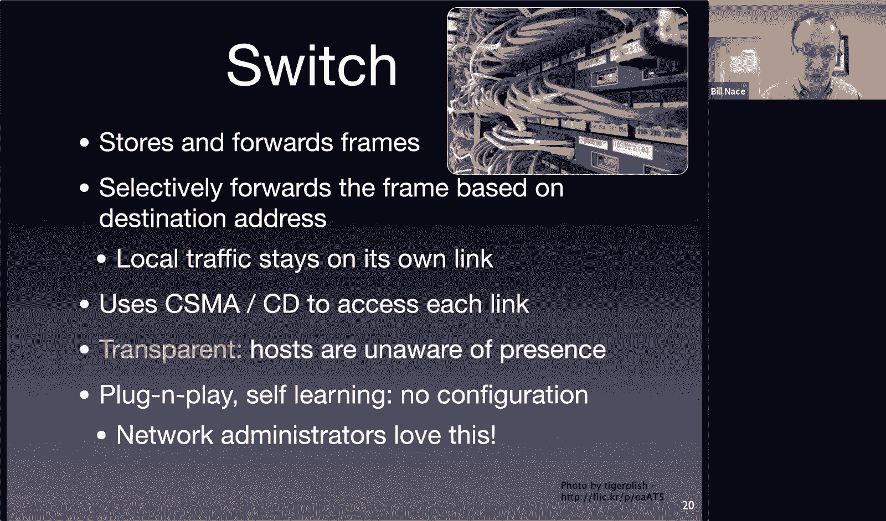

It was looking at sine waves going back and forth， it didn't know that there was a destination address in there because it didn't understand the protocol。

😡。

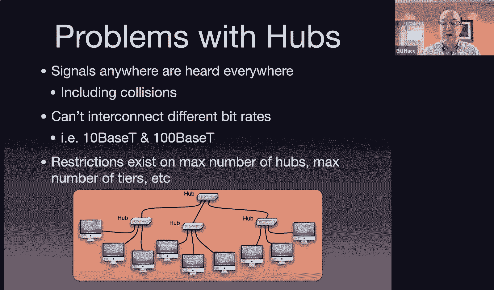

Layer two， data link layer device a switch， understands a protocol， it sees the signal come in。

 decodedes and says， oh， this is an ethernet frame and this is the destination address and so I can make decisions based on that。

嗯。It also handles things like the actual access protocols。

 the media access stuff about collision detection we talked about last time that's handled on each link independently so each one of these wires。

Can have collisions on it and will have the same sort of back off mechanisms that are working independently on each of those wires。

Switchches turn out to be transparent， which。The the network administrators love right you plug this box in and you do not have to go around to every computer and。

And do anything to those computers， you just plug the computers in from the computer's perspective。

There's just connected to a wire right the computer doesn't know that there's anything different about the fact that this wire is on you know connected to a switch or it's connected to a hub that sends the signal to everybody okay don't have to do anything on the host which is fantastic and we'll see some of this plug the self-learning stuff in a minute that means that the administration of a switch is remarkably easy。

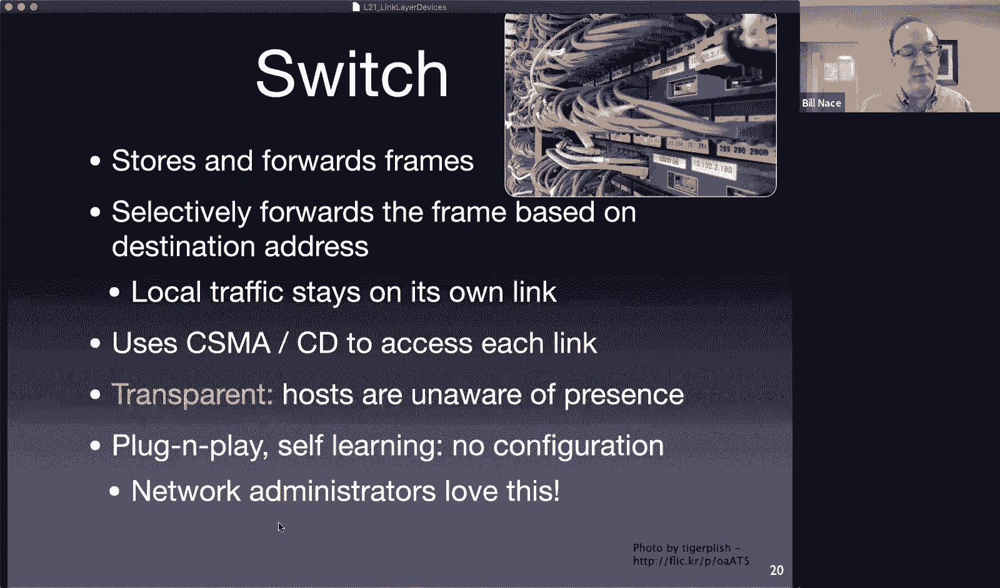

Okay， so here's my previous picture， except the only thing I've done is I've changed one box。

 this box at the center is no longer a hub， it's now a switch。

And I've done that to point out that the switch is going to。

going to actually create some nice efficiencies for us。

 it's going to filter out the packets so when a or filter the frame。Ooh。

 I actually should pack it there， I meant frame。A switch is going to filter the frames it sees coming in。

 so if somebody here on the side sends a frame that gets to the switch。

The switch can look at the address and figure out oh。

 is that address on this cluster over here on the right。

 and if so I don't need to forward it if its if I know that addresses here in the center。

 then that frame only gets forwarded to the center and these guys here on the left never see it never get collisions because of it。

And that means these yellow areas are known as collision domains。

Because a collision only happens there if these guys here on the right send a frame at the same time and collide with each other。

The computers in the other collision domains don't see the collision。

Because this switch only is transmitting stuff on each of these wires using CSMAC CDD and so。

If there's some stuff going on over here， well that's a collision。

 so we're not going to actually even receive it here at the switch。

 we're not going to think of it as a good frame because it got collided with and so there's no forwarding of that that means these computers in the other collision domains don't see those frames at all。

And that means that you've reduced the number of computers you can potentially collide with if this computer on the left and this computer on the right start sending a frame at the same instant。

They're not going to collide。They will instead get received by the switch。

And the switch will then retransmit them， but the switch will retransmit them。

After know listening for a carrier waiting 96 bit times， you know。

 all that kind of stuff because it knows what the protocol is。

Switchches also are not so one thing you might have looked at that picture and you say。

 well wait a minute that switch is doing a lot of work。

 isn't that going to become a bottleneck and is's not okay the bottleneck the switch is constructed usually。

To allow traffic on any of the connections with the incoming and the forwarding to be done in a very highs speed fashion so that you can actually get traffic flowing from different sources to different destinations at the same time and there's a fabric in the switch that's going to allow these connections to go through at the same time and not then become a bottleneck a performance bottleneck at all okay。

The other cool thing it does is allows for heterogeneous links。

So in the previous when we were talking about hubs， I said， hey。

 if I bought a new computer that had a faster ethernet。

 it was completely worthless and I wasted my money， that's no longer true here。

If I buy a new computer， let's say I bought a prime is my new computer and I bring it in and it's faster。

As long as the switch has the same capacity， that means the switch is able to talk to a prime at the higher transmission speed。

Okay， even though。ABC， B prime and C prime can't talk at the higher transmission speed。 It's okay。

 The switch will talk to them at the slow speed。 Itll send the frames at the lower speed to each of them。

 it'll send the frames at the high speed to a prime。

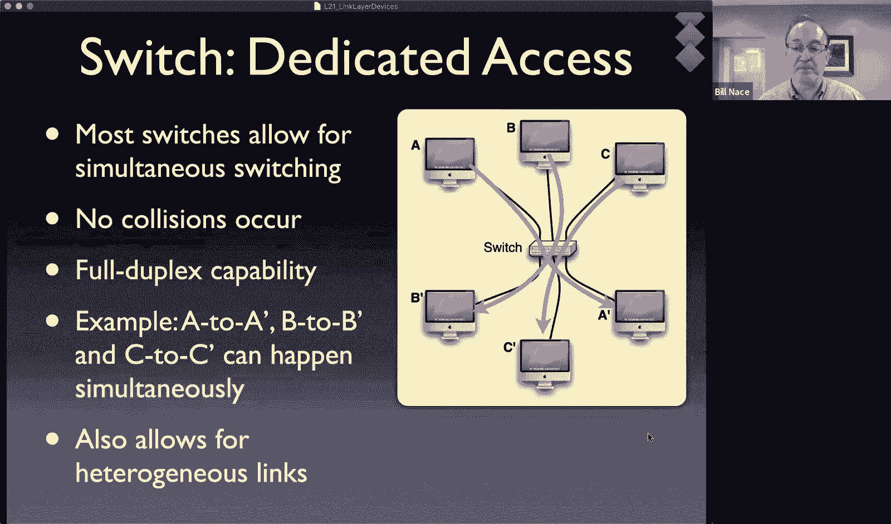

Haven't wasted a moment， it's good。All right， so let's look at a little bit at this job the switch has to do。

 which is a forwarding one。嗯。Yeah。Okay， Ash will'll get to that one in a minute as well。嗯。Okay。

 so imagine I have one of the computers over here in this collision domain here on the left sends a frame。

And that frame is destined for this host over here on the right。

That frame is going to come into the switch， and the switch。Knows what it is， it receives the frame。

 it looks at it as an ethernet frame， it looks at the destination address。Okay， and。

Needs to be able to send it out on this wire because that's where it goes to get to no A。

And that looks a lot like what we saw with routers right Rors did the same thing。

 Rors took a packet coming in on one wire， looked at the destination address in the packet。

 looked it up in a forwarding table to figure out which。Twitch direction。

 which of the many outgoing wires that packet should be sent on？

lookss like the same thing right how is this different from a router which oh my goodness we want it to be different because routers tended to be expensive complicated things right routers ran BGP and ran complicated protocols to build those forwarding tables。

Turns out the switch has a much easier job again。Because its scope is so limited。

 The switch doesn't need to know every single Mac address in the entire world and how to get to it。

The switch only needs to know about the Mac addresses， about the those addresses of the。

Computers directly connected to it in the same data link。Okay， so it makes it a lot easier。In fact。

 the switch it's so easy， we don't really need a protocol for this the switch is actually just going to learn stuff。

 they're going to build a forwarding table。Just by caching stuff they've seen before。

So this forwarding table looks has a very similar structure to the forwarding table we dealt with at the network layer right the forwarding table at the network layer had you know prefixed destination prefix range and links to it right and so each row of that table basically said if an IPHS is in this range send it out that link。

We're going to do the same thing here we're going to have each row of our table have a Mac address so we're not going to be dealing with ranges we're actually going to be specific to particular address。

This are is on this link， which wire leaving the switch。

And we put a timestamp on here because we're going to actually go ahead and these are cash things we learn。

We're then going to want to delete them after a while。

 so we're going to use this timestamp to let them sta out after a little bit。Now， in a router。

We used a complicated routing protocol to figure out how to fill that forwarding table in。

In switches， we don't have a routing protocol switches do it all via self learning。Basically。

 what happens is anytime a frame comes in on a link。

 that's information that the switch is going to use to build this table， what information。

I have a source address in that frame。And now the switch knows that the source address is on the length that this frame just came in on。

Okay， so if a frame comes in from host A on wire 42。We know host A is down wire 42， and so we put。

Host A's Mac address in the table with link 42 with wire 42， and then we now know， hey。

 I can send stuff to them directly。Okay。Here's actually。

The pseudo code for the self learning that's going on in the switch。Basically。

 every time a frame comes in， that's a learning opportunity Okay。

 so we're going to try to learn from it， we still have to do the forwarding of that frame though。

So when the switch comes in， so I have I'm sorry， when a frame comes into the switch。

 I've got some frame I'm calling it F and it came in on a particular link。

 I keep track of which link it comes in on。I look in the frame for the destination address right in the frame field in the header。

 there's a field for a destination address， and I look it up in my forwarding table。Okay。

That would have been filled in if any traffic ever came from that address in the past。😡，You know。

 30 minutes or whatever。So if I know where that forwarding address is， okay。

 so if if I find it in the table。I would know the link of the destination because that's the thing in the table。

 that's this link in the table。Right， I look up， you know， host A's address。 Oh， it's on link 42。

 Okay， so link 42 is my link output link。 If that link is the same as the input link。

 So if this frame。Going to host A。Came in on link 42。Then we're done Okay。

 we just drop the frame why， well， if the sender and the receiver are on the same link。

 then the receiver already heard it。And there's no reason to。

Forward the frame back out the same link。That'll just confuse things。Okay， so instead。

 if those length are the same， the destination has already gotten the frame。

 so no need to retransmit it。Otherwise， I'm going to send it out。

 so this frame came in on 42 the output。Link we looked up is link 19 I'm going to go ahead and forward the frame out link 19 I'm going to use all of CSMACD right listen first you know wait 96 bit times all that kind of stuff you know collisions back off all that when we send it out because we're level to data link layer device we know how all that works。

Okay， the other possibility is I looked up this destination address and it wasn't in my table。Okay。

 it's being sent to a new computer right， new computer just showed up on my network。

Never heard of them before or whatever， haven't heard from them in a while。

 so maybe their entries in the forwarding table timed out。If that's the case。

We're going to just send this on all of the links that we're connected to except the input link so。

It's kind of like we're flooding it， we're sending to everybody except that we don't need to send it on the link it came in on。

Because if the destination was down that link， then they would have heard it already。Okay。

 so we're going to go and send it to every other。Lnk around and it'll get to them。

We just will not have learned where that is。Okay， now this is going to this learning process。

 I'm going to go ahead and forward stuff。Presumably the destination is going to want to apply okay and when it does I will have learned where that destination address is。

 I'll put it in the table right and that learning as as transmission happens between the senders and receivers on the network the switch eventually fills in the forwarding table eventually we get them all okay and we're done。

Well we're done for a while， they do time out and often， you know， and that timeout is necessary。

Because they may disappear right and there's no way for your laptop before it leaves to kind of nudge the switch and say。

 hey switch by the way， you know my owner has done drinking his coffee and we're leaving for the day you can take us out of that forwarding table that doesn't happen。

So instead。After 30 minutes， we haven't seen any traffic from that address。

 we take them out of the forwarding table。Okay。We do do stuff like you update things immediately。

If the link， if the frame mad used to be on link 19 now it's on 42， just go ahead and change the。

The address， you know， don't update and don't wait for that oldlin to time out， things like that。

Obvious useful optimizations as well。Does this make sense？

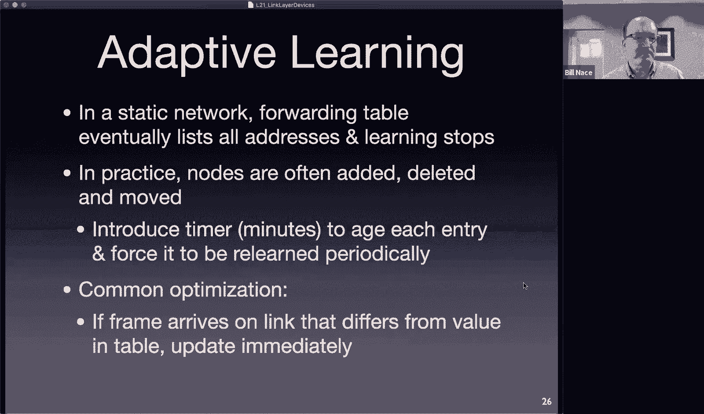

Okay， somebody asked a minute ago， Ganehe asked about， hey， what happens if you have loops？

And you'll notice the picture I showed did not have any loops deliberately okay。

The problem with a loop is， so here I have a bunch of networks connected with switches that have loops。

 and the problem with a loop is that this router will hear about the same address from multiple sides。

Okay， there's an address so you know let's mention an address here right we can hear about it this way if it gets you know something is broadcast and flooded we'll hear about it over here。

 but'll also oh hear about it here and so this router up here will hear the same address coming in different sides。

won't know what to do about it things become a mess okay and we actually lead to things called broadcast storms which are as bad as you hear them that means that our frames will end up going round and round and round a loop and never end up stopping and just keep forwarding and forwarding and forwarding and that's bad of course。

So what do we do about it？You could just say， okay， don't have any loops， right。

 The problem is these loops are actually useful。 Okay， the intention of this loop is if there's some。

 you know， I now have multiple ways to get the connections around my network if a particular switch fails。

If something happens a cable breaks， I now have other ways that my network will keep working and I'd like it to keep working until I can get a technician down there to swap out a switch or discover and fix the cable brake。

Okay， so I like these redundant paths except that they bring my network down so what do we do about that Well we create what's known as the Spning trade。

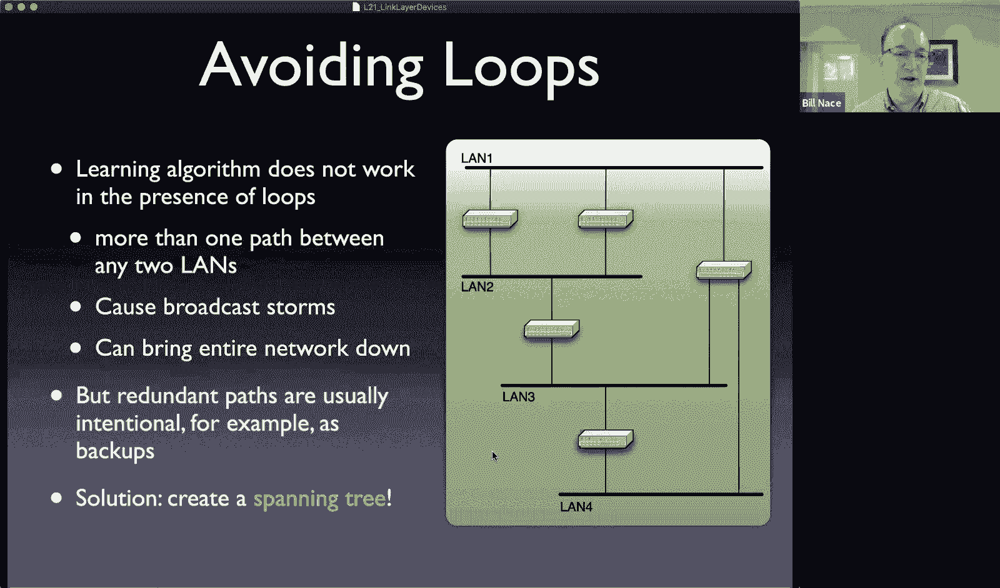

A spanning tree is a subset of a graph right a graph is this data structure that models just things that are connected in whatever way they want to be connected right and so this is a graph I'm showing you here of the switches and the ways they're connected and it's a graph meaning that there can be loops right there can be multiple connections between particular devices for instance。

 these two switches have two different connections between them。

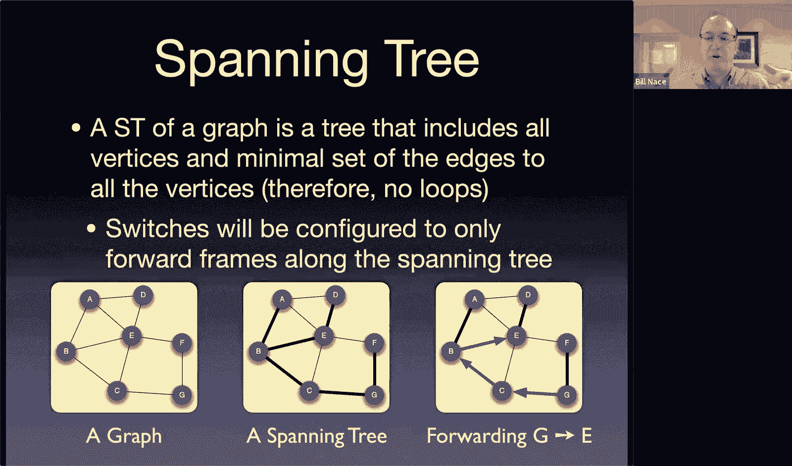

That's fine in a graph。What I want is a tree， a tree is a structure that has no loops。Okay。

 and what I want to do is take the graph and put a tree on top of it。

Okay we call this a spanning tree， we want the tree to reach all of the nodes of my graph。

 but I want it to be a tree， so I'm going to take out some of the links of the graph until I'm left with no more loops I'm left with the tree and so here's the idea I've got some graph right I put a spanning tree on it so these darker connections are on the graph using the connections that are found in the graph just not using all of them。

And then the idea is when you're forwarding on this network。

 the switches are going to know the spanning tree and only use the connections that are part this of the spanning tree。

 so for instance， if no G is sending something to E instead of sending well it' send it to C because C is on the spanning tree。

C actually has a direct connection to E。But C is not going to use that because it knows that's not part of the spanning tree instead we're going to go back to B and then over to E。

To only use that。And Strresh has。alreadyy answered my next question basically， and that is。

 you know we've seen this before， right we've done spanning trees。Okay。

 and we did the spanning trees when we were doing Dyster's algorithm， right。

 the link state algorithms。Constructed a shortest path tree， which is basically a spanning tree。

It has some particularities right， the shortest pass tree used edge weights that you know the spinning tree might or might not use。

 the shortest pass tree also had a particular route to it。

The tree was rooted at the router that was running the algorithm because that router needed to know how to get to every place else。

The spanning tree。Doesn't have a particular root， we're going to pick a root from the graph that's available there。

So how do we do this， well we've got a protocol to make it work， the spanning tree protocol。嗯。

It is a subset of the so IE 802 is the standard that is all these networking protocols。

 Wifi and ethernet are both subsets of the 802 working group and the dot1D is the same people。

 so the spanning Street protocol is part of that suite of protocols。🤧。

It will construct a graph with edge weights that are defined in the standard。

 basically on the data rate， the interface of them。Okay。

The algorithm itself runs through a couple of steps first thing you do is you pick some switch somewhere that's going to be the root of the tree。

Okay now it doesn't really matter how this is done except that every switch has to be able to figure out which one it is and so it's it's an election process and basically what it does is it looks at some unique number that every switch has and choose is based on who has the highest or lowest in this case。

 the lowest。And it turns out every switch has a Mac address。

And so we'll use the lowest Mac address of the actually the switch has Mac addresses for each link for each port。

 we're going to choose the lowest of them and then of all the switches in my network whoever has the lowest Mac address will be the root of the tree。

Then we're going to go through， yes， it does handle switch failure。Okay， so you'll。

It's kind it's automated so you run this protocol and it' will come up with an answer if there's a switch failure。

 then you run the protocol again and it' will come up with a different answer。Okay。

 and so in that sense。The protocol can be used to handle switch failure。Okay。

 once I know the root of the tree， then each switch goes ahead and figures out which root。

I'm sorry which port on that switch is closest to the root， so of the many ways out of each switch。

 which one has the least cost path back to the root？Okay。

so basically each switch is figuring out which port should it send traffic on to get to the route。

Okay， and then you go through each。Each land link。Okay。

 and figure out of the switches that are connected to that land link。

 which one has the least cost path to root。 And that means that everybody that's going to use that。

That link now knows the least cost way to get off of that link to a particular switch。

That then has designated has roots ports going back to the root。

And then you basically don't use any of the other ports on any of the switches and you built yourself。

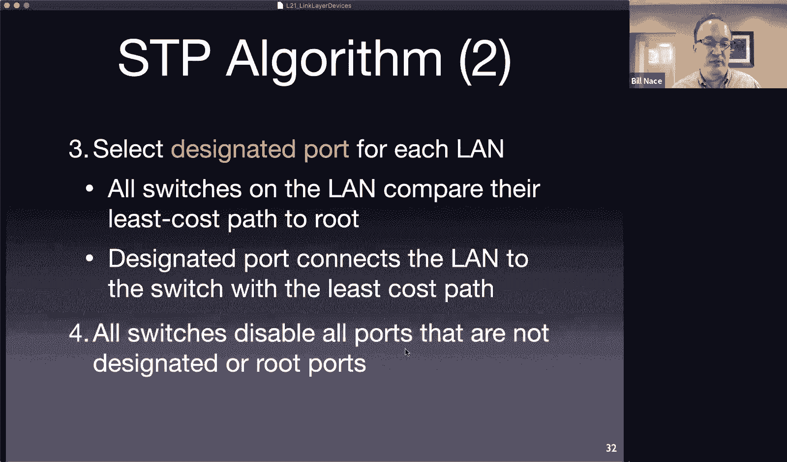

A tree。So here's my example back to the picture I showed a minute ago。I have five switches。

I have four land lengths， one of them is fast， the other is all slow。Okay。

 no particular priority and we're just going to use one， two， three， four。

 five as the Mac address numbers。Okay， just our unique numbers。Just for simplicity。So step one。

 which switch is the root， oh， number one is the root， okay， because one is the lowest number。

That's also its Mac address turned out to be lowest， it ends up being chosen as the root switch。

Now every for step two， each of the switches has to look at all their connections。

 in this case two or three connections and figure out which of the ports on that switch has the cheapest route back to the root。

Okay， because I should be using the word route， the cheapest route back to the root。

And so for instance， switch number two is directly connected to the root switch through two different routes。

 through two different lands。Right but one of them is one gigabit and one of them is 100 megait。

 so it's going to choose the one gigabit side， it's going to prefer that for all its traffic。Okay。

 same as switch4 switch4 has a quick way to get to the。To the root switch。

 it also has several slow routes， several slow paths back to the switch。

 so it's going to just choose the fast one。Switch three has a direct but slow and a slow plus a fast。

 so the slow is going to win。And switch5 has lots of different choices， it has two slows。

 it has a slow and a fast and it has a slow and a fast it's going to choose this particular one to go back。

Okay， so now each switch has。A root port， which it knows so basically the idea is if a switch had traffic that needed to get forwarded to the root switch。

 it would know how to do it， it would know which of the ports to send that traffic out。

The next question is on each land。So now I have four lands I have to make this decision for。Which。

Which of the so kind of imagine if there were traffic in the land， it's little weird。

 how would it decide which of the paths off of the land that it should go to？Okay， and so。

We find the fastest way for each land so if land one and land two are directly connected to the roots that's obvious which way to get there land three could go through switch3 or through switch4 or through switch5。

 the quickest way is going to be through switch4 because this land one is the fastest。

 so that's going to be our designated port。And land four has two choices， right， one is slow。

 slow and the other is goes to fast， so we're going to choose the fast one。

Now I have a bunch of root ports， a bunch of designated ports， and I turn off all the others。

 so I've dotted line everything that is not an R or a D。

And you'll see now we have built ourselves a tree。There are no loops in this， you know。

 I used to have a loop here， but I broke the loop by turning off this port on this switch。

And that means I no longer have that loop。Okay， I used to have a loop here， but I broke it。

all my loops have been broken by this protocol。

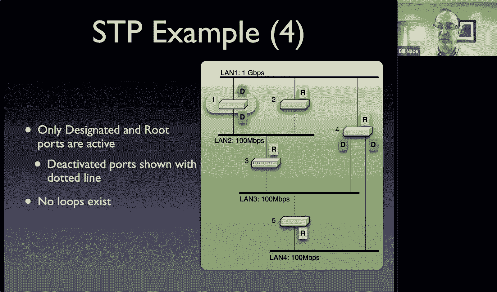

Okay， now。

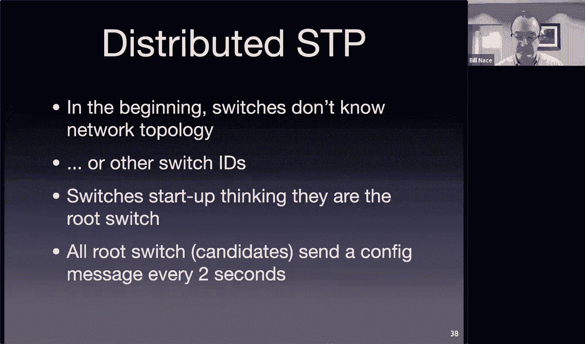

Dan， why is the left port on Sw4 this one here， why is that one a D？

So that D came because land3 decided that it was faster to send traffic through Sw 4。

 where it could go onto the fast land than through switch3。

 where it would then go through a slow land to get to the route。Or I guess through switch5。

 which is a slow plus a fast land to get to the root。

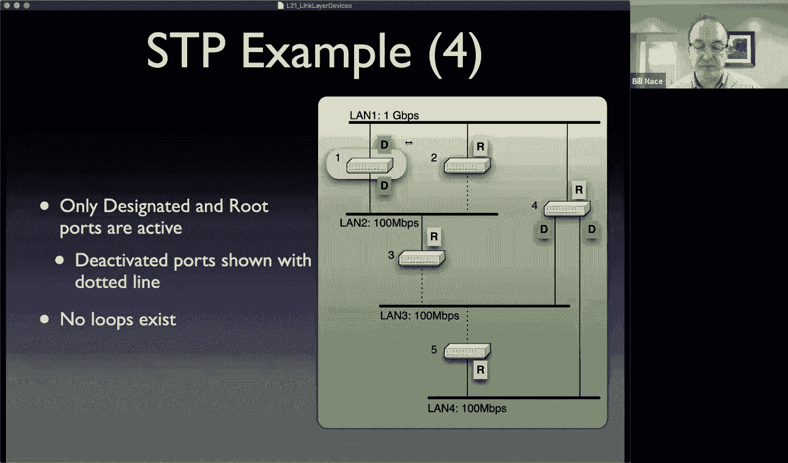

Now I always got。It's right on the mark with this question。

We looking at this picture can make all these decisions right we can look at this picture and say。

 oh yeah， it's obvious that this is the designated port for land three because of all these connections。

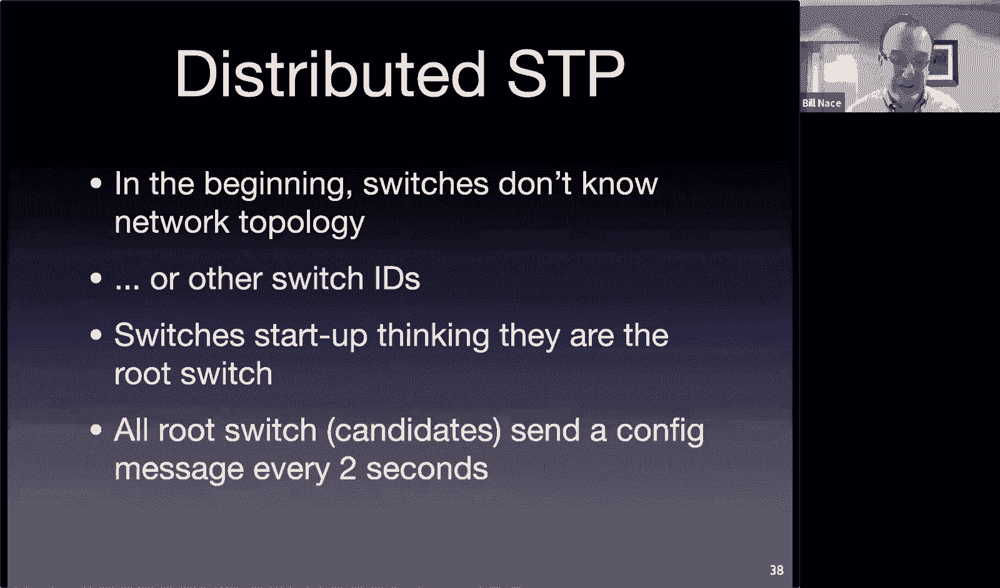

The problem is this is a distributed protocol， we want the switches to be making these decisions okay and so how does that happen？

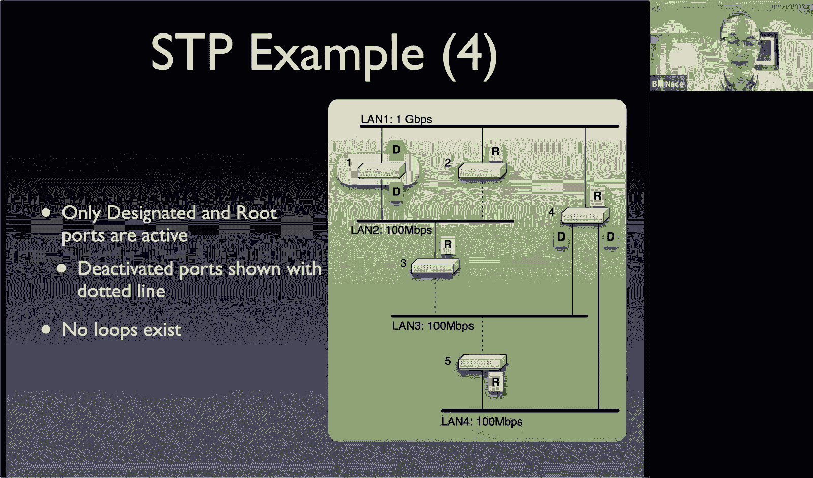

Well。The switches don't know anything about this network topology。

 so they're going to have to communicate with each other and send messages around to each other to try to figure out what this。

This network topology looks like okay so it's got to be a distributed spanning tree protocol not just a spanning tree protocol what we've talked about on previous slides is a spanning tree protocol that somebody who has all the information could execute。

The way the distributed version works is the switch when it boots up， basically it thinks， oh。

 I must be the root switch because I don't know about any other switches out there。

And it sends a configuration message out each of its ports。

And that configuration message has the information about it and what the ports are and the speed of those ports so that anybody。

 any other switches that it's connected to can find out this information and。

The configuration message that gets sent then gets received elsewhere and has enough information for other switches to learn things from you。

Okay， so for instance， this message called a BPPDU has things like the sender's priority and identifier。

Well， a receiving switch who booted up thinking it was the root can look at a BPpDU that comes in。

That tells about that some other switch somewhere sent and it can compare， it can say okay。

 I know what my priority is， I know what my idea is and this message comes in telling me that there's some other switch with another priority and another ID I can decide oh。

 he wins right he has a lower ID and priority than me therefore I'll shut up okay and after a couple of rounds of this。

Only the root ever is sending these messages out。Okay。

And so that's how you choose the root for this particular protocol。ok。Okay。

 so today we've learned a few things， few additional nuggets that we need to know about our。Sorry。

 Kyle yes， Kyle's asking about these BPPDs and what happens to them， I'm sorry， yes。

 they do get forwarded from place to place。Okay， and so the that means。They get。

 I guess they get forwarded if they're a better。A lower。Ler ID， therefore higher priority， I'm sorry。

 the the ones that beat the local switch get forwarded so eventually all the switches are only forwarding the BPp tos that come from the root。

And they get forwarded out the route or they come in on the root ports and that's how you figure out which one the route port is and you shut off the others and communicated everybody on the land you forwarded it to here's it。

 and so they can decide then which is the designated port for that land。

And so that's how those decisions are made。Okay。All right， so done for today， a few more details。

 Now we kind of have the infrastructure pieces to get our data links working properly， right。

 we know like。For an ethernet protocol， for instance。

 how the actual protocol works and then today's information about Aps and interconnections allowed us to now understand how to actually build networks at this layer。

 how you could build a switch network。So we could build and connect a bunch of computers at the data link layer using switches。

 obviously at some point we're going to want to connect a router into this to get these messages out to the internet as a whole。

 but I can connect switches to switches and build these networks that will link together at the data link layer a bunch of hosts。

 which is great。We know how to use ARP to allow the host then to send packets in the frames they send。

 they can actually translate an IP address into a dataly clear address and figure out how to send that。

 get that to the right other。Me of this particular network。All right， sounds good， any questions？

We will see you then on Thursday and we'll talk a little bit more about other things you can do at the network layer。

 I think that's virtualization on。Trsty right， there's a wireless oh yeah。

 virtualization coming up next， soll we'll learn how to make our data link act like other things。

 okay？Until then， have a wonderful day， everybody。Hope you're having a good time。

 we'll see you later。Goodbye。Professor excuse me。Good， Winry。

Would you mind repeating the time for our final exam on the first few slides。

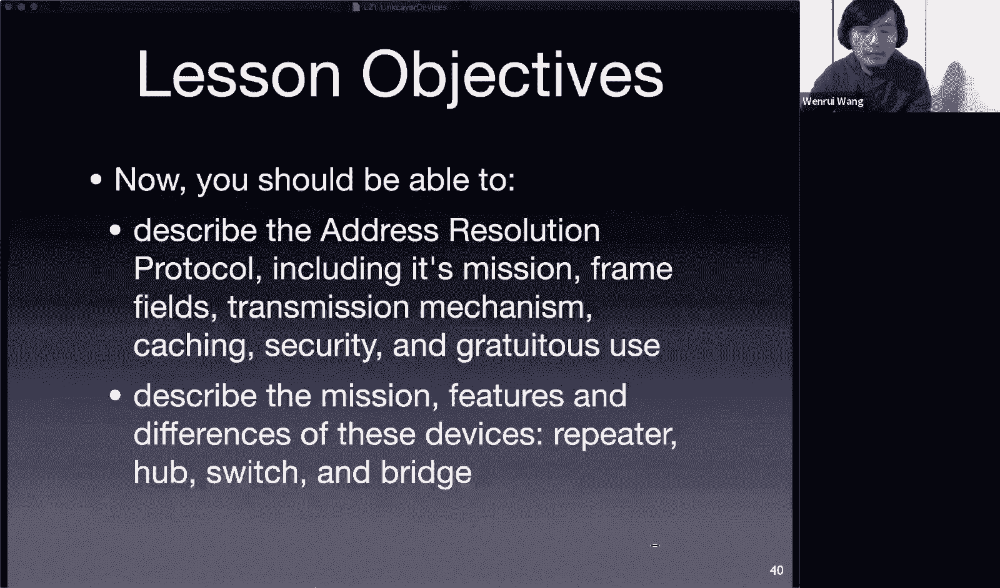

Sure， if what the final exam。Tuesday， 15th December。Is it in the morning or？OkayOh， you're right。

 the slide says PM， it is in the morning。 It's a 30 AM Okay。

 say 30 AM same is same on the same as the file on the。Yeah， yeah， sorry， thank you。

 I'll I'll switch the， I'll change the slides。Allright， no mind。 we won't see the time on our size。

I'm sure you all have seen the schedule， you know it anyway。

 so and I'll try to I will be mentioning that several times in time to come。

C you。