# 计算机网络基础：23：链路层设备 🔗

在本节课中，我们将学习链路层的两个核心概念：地址解析协议（ARP）和链路层连接设备（如集线器与交换机）。我们将了解ARP如何将网络层地址转换为链路层地址，以及如何使用集线器和交换机在物理层和数据链路层连接设备。

---

## 地址解析协议（ARP） 🧩

上一节我们介绍了以太网作为链路层协议的工作原理。本节中，我们来看看当网络层需要将数据包发送到特定IP地址时，如何确定对应的链路层（如MAC）地址。这就是ARP的使命。

ARP是一个请求-应答协议，用于将网络层地址（如IPv4地址）解析为链路层地址（如以太网MAC地址）。其工作原理是：当主机需要知道某个IP地址对应的MAC地址时，它会向本地网络广播一个ARP请求。拥有该IP地址的主机会用其MAC地址进行应答。

### ARP的核心机制

以下是ARP工作流程的关键步骤：

1.  **构建ARP请求**：发送主机创建一个ARP数据包，其中包含：
    *   **发送方IP地址** 和 **发送方MAC地址**
    *   **目标IP地址**（即要查询的地址）
    *   **目标MAC地址**字段为空（等待填充）
2.  **广播请求**：将该ARP数据包封装在链路层帧（如以太网帧）中，并将帧的目的地址设置为广播地址（如 `FF:FF:FF:FF:FF:FF`），发送到本地网络。
3.  **接收与应答**：网络上的所有主机都会收到该广播帧。只有IP地址与请求中目标IP地址匹配的主机会处理该请求，并构建一个ARP应答包，其中包含自己的MAC地址。
4.  **单播应答**：应答主机将ARP应答包单播发送回请求主机。
5.  **更新ARP缓存**：请求主机收到应答后，将 `IP地址 -> MAC地址` 的映射关系存储在本地的 **ARP缓存表** 中。后续发送到同一IP地址的帧可以直接使用缓存中的MAC地址，无需再次广播查询。

ARP缓存条目会在一段时间（如30-60分钟）后过期，以应对网络拓扑的变化。

### ARP的应用场景

ARP不仅用于常规的地址解析，还有以下用途：
*   **发送到其他网络**：当主机需要发送数据包到一个不在本地子网的IP地址时，网络层会指示链路层将帧发送到**默认网关**（路由器）。此时，主机需要使用ARP来查询网关路由器接口的MAC地址。
*   **无偿ARP**：主机在加入网络或更换IP地址时，会主动广播一个ARP声明，告知网络其IP与MAC地址的映射关系。这有助于更新其他主机的ARP缓存，防止地址冲突，也用于高可用服务器切换等场景。

### ARP的安全考虑

ARP协议本身没有认证机制，因此容易受到**ARP欺骗**攻击。恶意主机可以发送伪造的ARP应答，声称自己是某个IP地址的拥有者，从而截获发往该IP的流量。由于ARP工作在链路层，此类攻击通常局限于同一本地网络内。

---

## 链路层连接设备 🔌

了解了如何解析地址后，我们来看看如何实际地将设备连接起来构成网络。连接可以在不同的网络层次进行，其功能和复杂度各不相同。

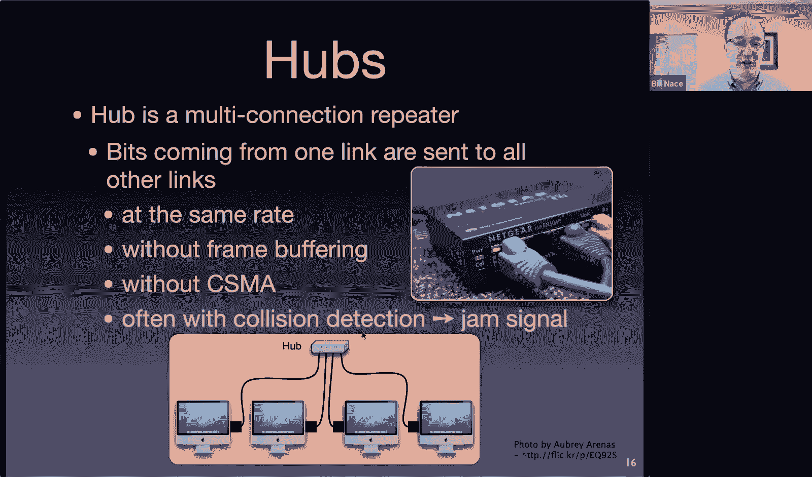

### 物理层设备：中继器与集线器

在物理层连接设备，意味着直接处理电磁信号。

*   **中继器**：用于扩展信号的传输距离。它接收衰减的信号，将其放大后重新发送出去。例如，海底光缆中的中继器可以确保信号跨越海洋。
*   **集线器**：一个多端口的盒子，任何端口收到的电信号都会被复制并发送到所有其他端口。它本质上创造了一个共享的“总线”，所有连接设备都处于同一个**冲突域**和**广播域**。
    *   **优点**：连接简单，即插即用。
    *   **缺点**：
        1.  所有设备共享带宽，且速度必须一致（无法混合不同速率的网卡）。
        2.  任何两台设备同时发送数据都会产生冲突，且冲突会影响所有设备。
        3.  存在电缆长度和集线器级联数量的限制，以确保冲突能被检测到。

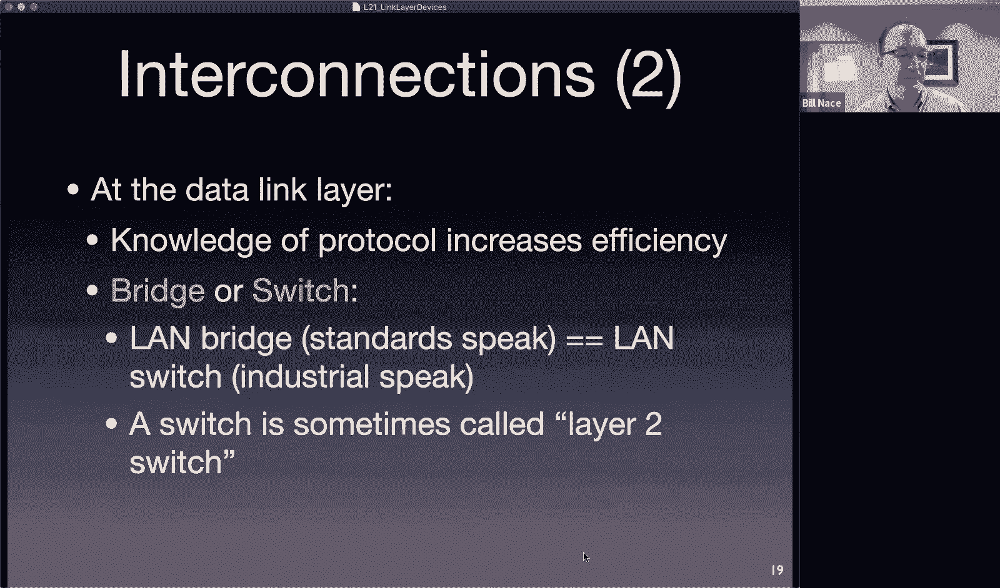

### 数据链路层设备：交换机 🖧

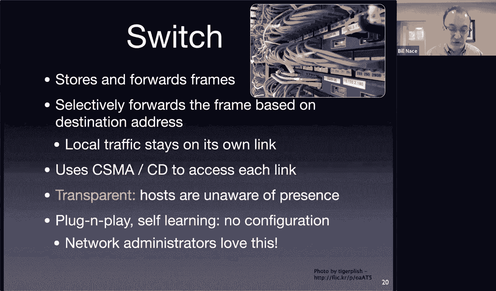

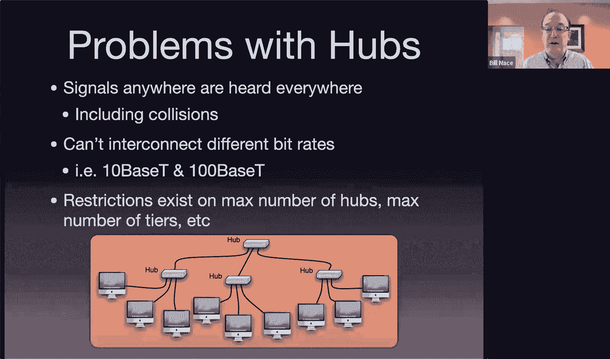

交换机工作在数据链路层，比集线器更智能。它能够理解链路层帧的格式（如以太网帧头），并根据帧中的目的MAC地址进行转发。

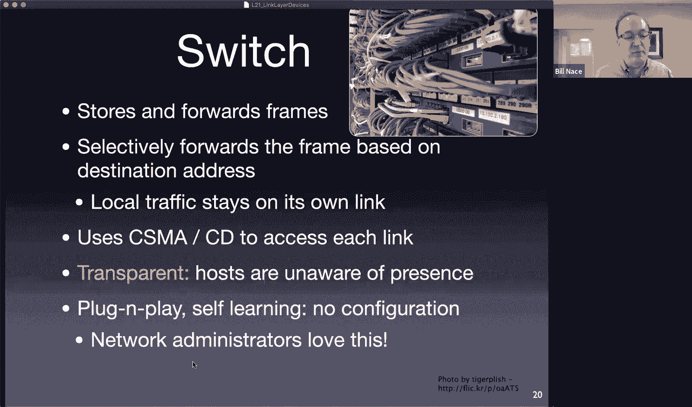

#### 交换机的工作原理

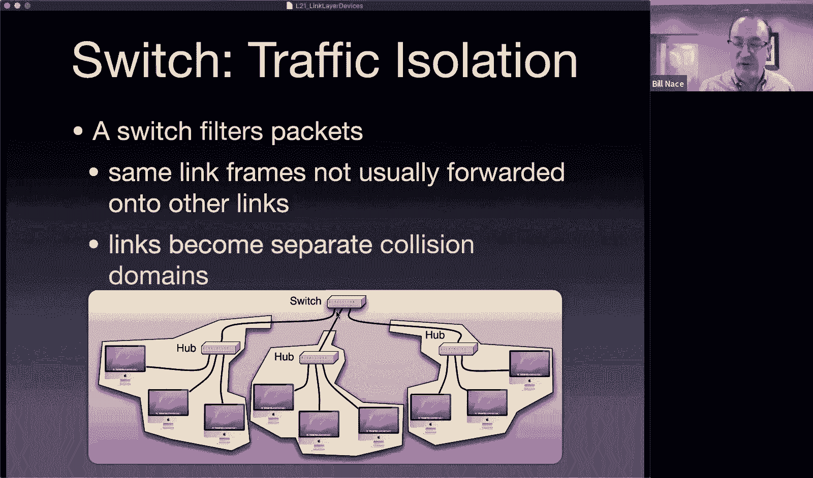

交换机的核心是一个**转发表**，记录了 `MAC地址 -> 端口` 的映射关系。这个表通过 **自学习** 机制建立：

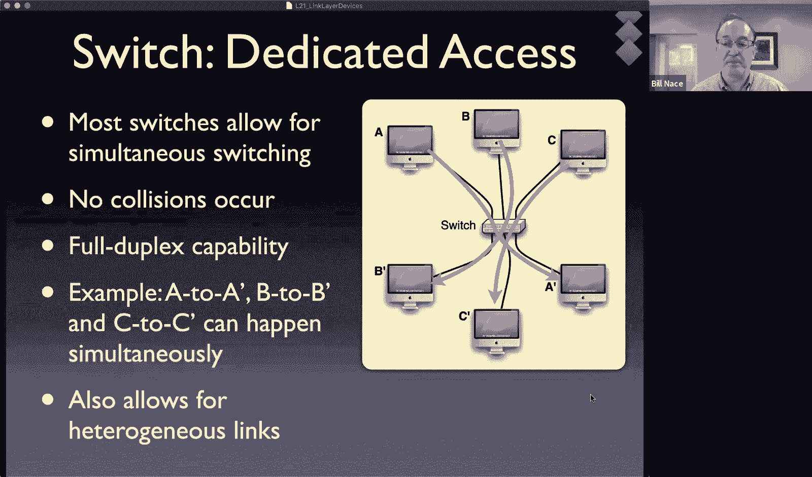

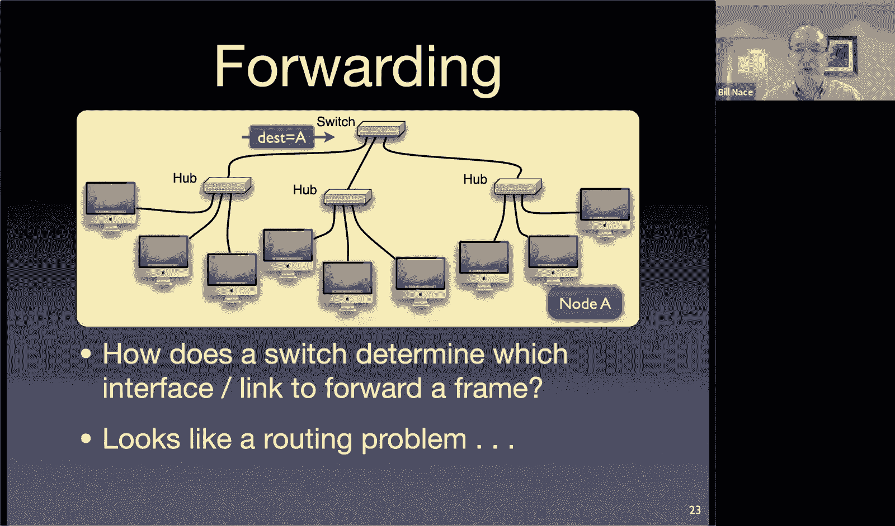

1.  **学习**：当交换机从某个端口收到一个帧时，它会检查帧的**源MAC地址**，并将 `该地址 -> 该端口` 的映射记录到转发表中，同时刷新时间戳。
2.  **转发**：交换机检查帧的**目的MAC地址**，并在转发表中查找：
    *   **已知单播**：如果找到对应端口，且该端口不是接收端口，则只将帧从该端口转发出去。
    *   **未知单播**：如果未找到，则向**除接收端口外的所有端口**泛洪该帧（广播域内）。
    *   **广播/组播**：通常也会进行泛洪。
3.  **过滤**：如果目的MAC地址对应的端口就是帧的接收端口，说明发送者和接收者在同一网段，帧已被目标接收，交换机则丢弃该帧，避免冗余。

#### 交换机的优势

与集线器相比，交换机带来了巨大改进：
*   **隔离冲突域**：交换机的每个端口都是一个独立的冲突域。端口间的通信不会相互干扰，极大地提升了网络效率和并行通信能力。
*   **支持异构链路**：不同端口可以连接不同速率（如10Mbps、1Gbps）的设备，交换机负责速率适配。
*   **更高的安全性**：帧不会被无脑广播到所有设备，减少了被窃听的风险。

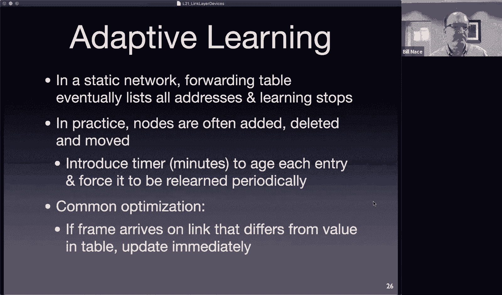

#### 生成树协议（STP）

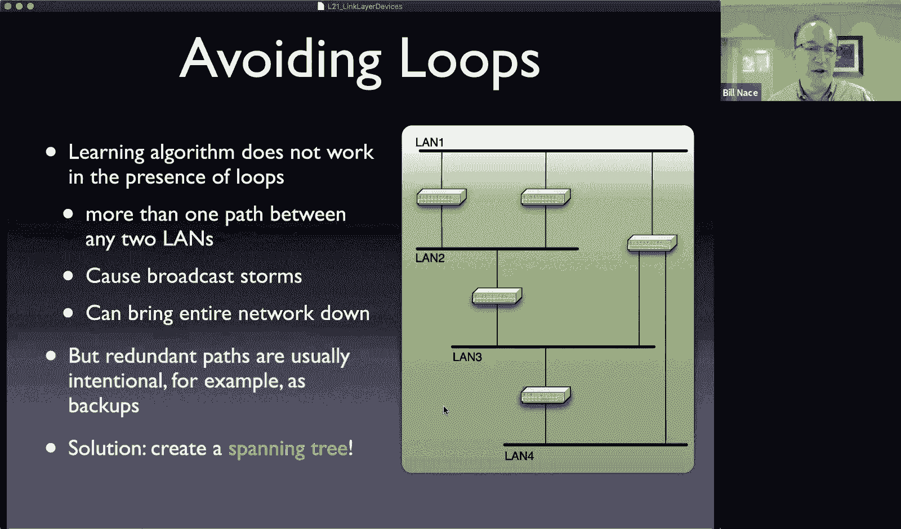

在复杂的网络中用交换机互连时，可能会形成物理环路。环路会导致：
1.  **广播风暴**：广播帧在环路中无限循环，耗尽网络资源。
2.  **MAC地址表不稳定**：同一MAC地址从不同端口被学习，导致转发表频繁抖动。

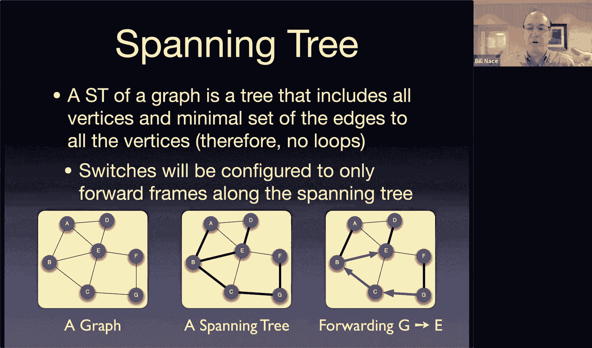

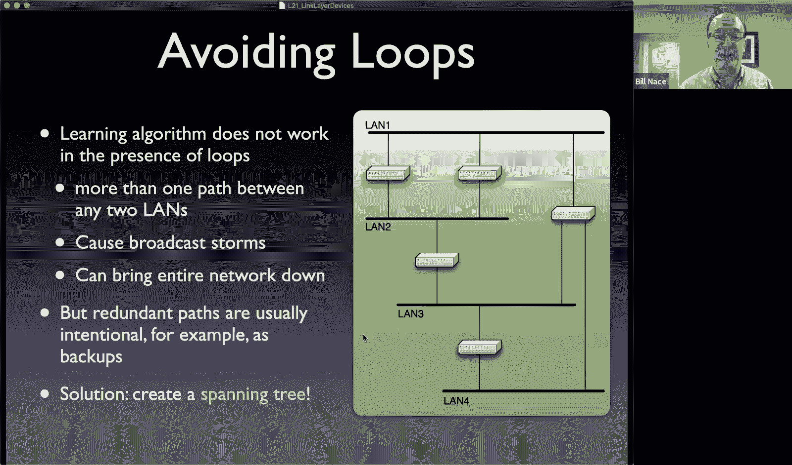

为了解决环路问题同时保留冗余路径的可靠性，交换机运行 **生成树协议**。STP的目标是在存在环路的网络拓扑中，通过阻塞特定端口，逻辑上修剪出一棵无环的“树”。

**STP工作简述**：
1.  **选举根桥**：所有交换机中Bridge ID（由优先级和MAC地址组成）最小的成为根交换机。
2.  **确定根端口**：每个非根交换机选择到根桥“成本”最低的端口作为根端口。
3.  **确定指定端口**：在每个网段上，选择到根桥“成本”最低的交换机端口作为该网段的指定端口，负责转发流量。
4.  **阻塞备用端口**：既不是根端口也不是指定端口的端口将被置为**阻塞状态**，不转发用户数据帧，从而打破所有环路。

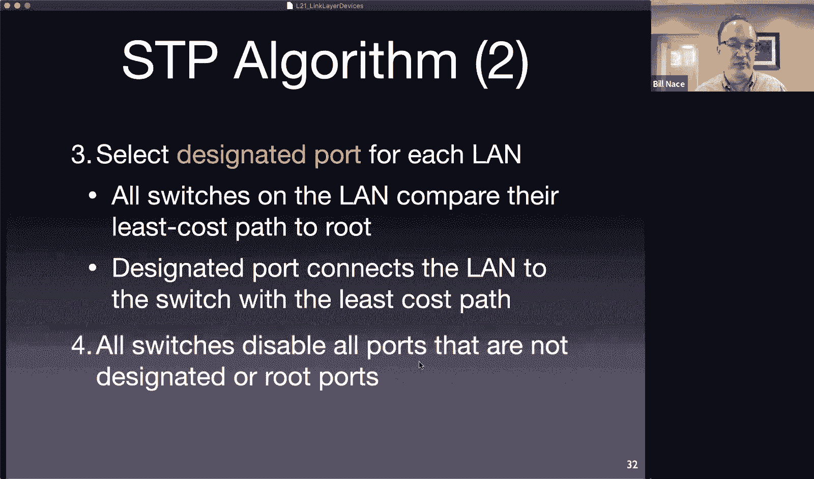

当活动链路故障时，STP会重新计算，激活备用路径，实现网络自愈。

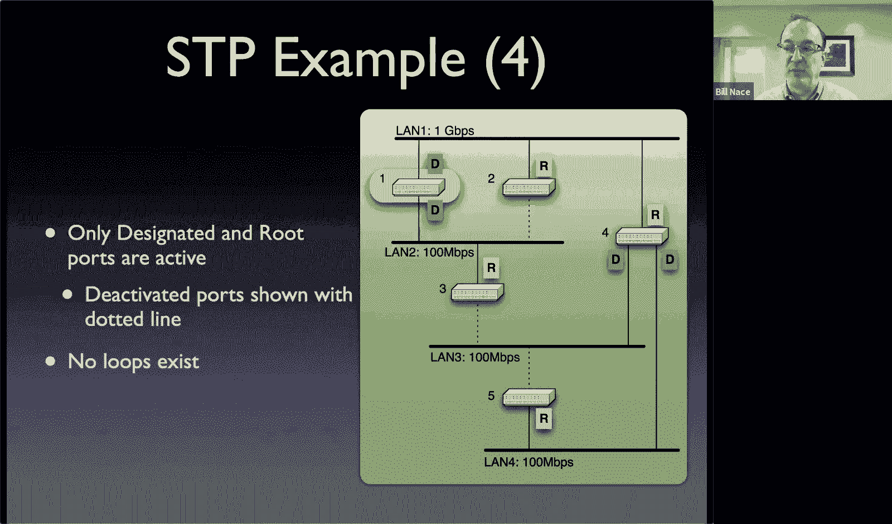

---

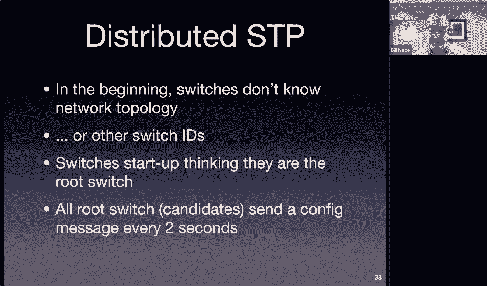

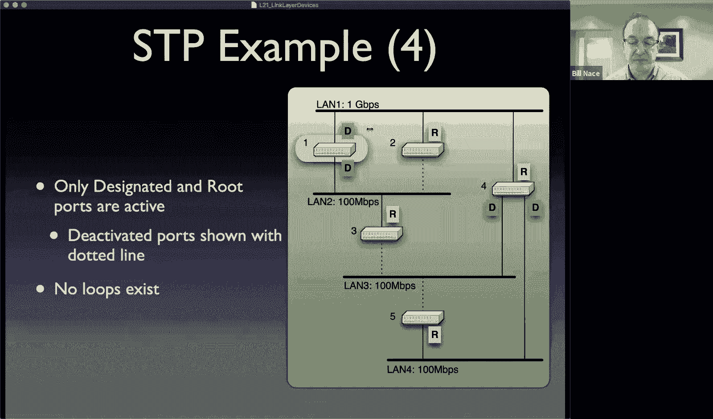

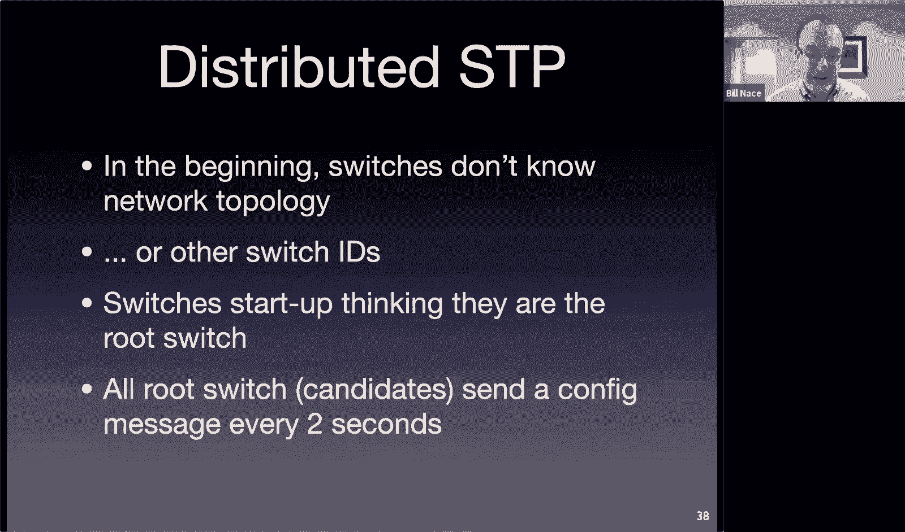

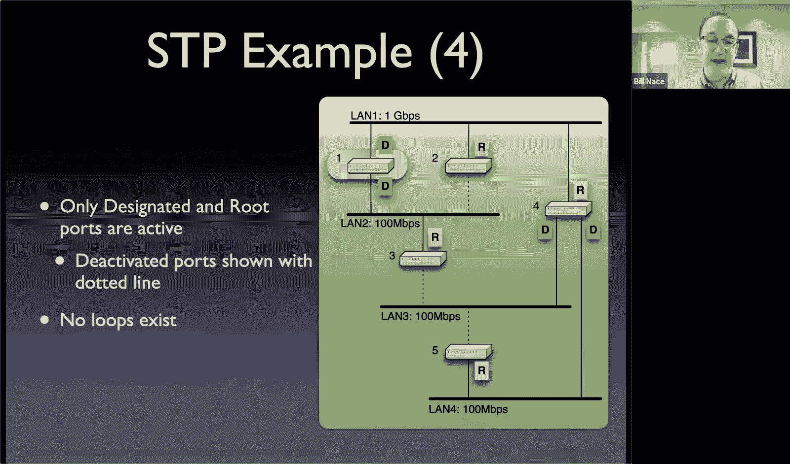

## 总结 📚

本节课中我们一起学习了链路层的两个关键部分：
1.  **地址解析协议（ARP）**：它充当了网络层和链路层之间的“翻译官”，通过查询和缓存机制，将IP地址动态映射为MAC地址，使得数据帧能够在本地网络中准确投递。
2.  **链路层连接设备**：我们比较了物理层的**集线器**和数据链路层的**交换机**。集线器简单但效率低下，创建了共享的冲突域；而交换机则智能得多，它通过自学习建立转发表、隔离冲突域、支持高速异构连接，并通过**生成树协议**管理网络拓扑，防止环路，是现代局域网构建的核心设备。

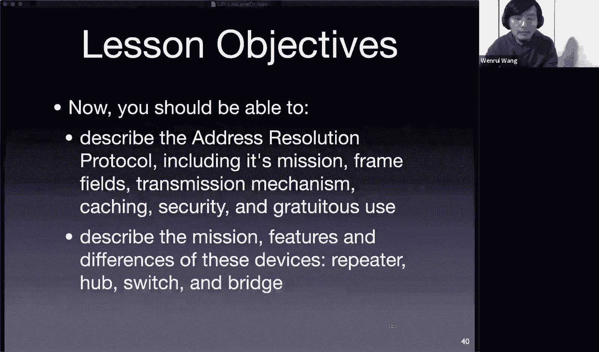

掌握ARP和交换机的工作原理，是理解局域网如何高效、可靠运行的基础。下一节，我们将探讨网络虚拟化等更高级的链路层技术。