# 卡耐基梅隆大学 14-740 计算机网络 Fundamentals of Computer Networks（Fall 2020） - P24：Lecture 24 Virtual Link Layer - ___main___ - BV1wT4y1A7cd

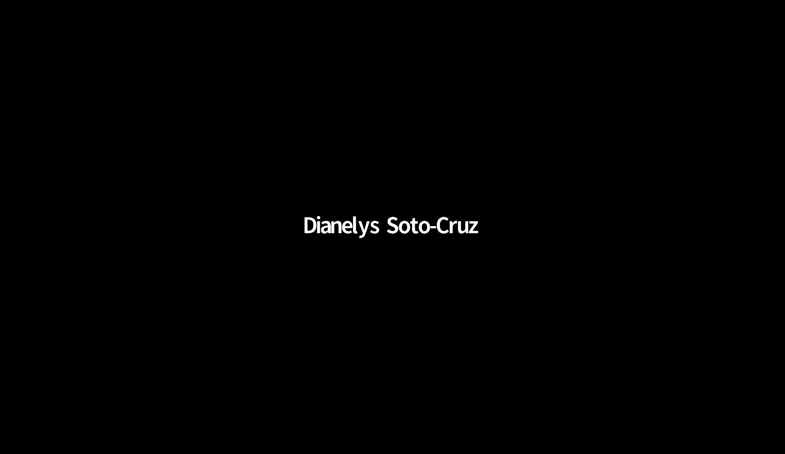

This is 147，40。Welcome everybody， I am so glad you're with me this morning。

 another beautiful day outside I was remarking yesterday in my classes that I love the combination of blue skies and snow。

😊，And that in Pittsburgh that's a rare combination to get together and we're blessed with the second day of this so once again i'm back to my theory that the weather is actually listening to me and likes it when I say nice things about it so I'm taking full credit for blue skies again today。

Which is great。Today we're going to well we're going to delve into a little bit of interesting stuff that happens at the link layer when you stop worrying quite so much about it being nothing more than just a cable or set of antennas connecting you to other things and so we can do some interesting stuff and so I'm calling this the virtual link layer。

And weve got to be a little careful about that word virtual。

 let's see it tossed on in a couple different ways， but yeah。

 let's do some cool stuff with the link layer。Short bit of administration first right this lecture and two more so only three left total one assignment left so lab three is due in a little over a week that's an exercise using wire shark to examine what's going on at the link layer that one's not too extravagant shouldn't take you too long but please don't leave it till the last minute。

I do know that your last week or two of classes is normally full of bunches of other classes that have lots of projects and stuff。

Good a little light on you this time of year。The final exam coming up scheduled for 15 December and my slides are correct today that it is actually in the a。

 not the PMm on that date。And。I put down these numbers for the types of problems I have。

 these are the numbers from last year's final。I have not yet written this year's final。

 so I don't know exactly what those numbers would would look like， but。

Yeah I read exams and they end up looking like exams that I wrote and so it's likely it'll be something like this with some you know some true false。

 some short answers， some multiple choice， and then some long answers where I ask you to explain something。

 work something out， you know some interesting scenario I want you to analyze something like that。

If you have any。Questions about anything we can do to help you with the final exam please let us know and we'll do that and Austin yes。

 there will be a final exam review session I just don't know when it is and not sure the TAs know that there will be one yet。

 but there will be a final review session。There will not be a practice exam or paper I actually think those are。

Are detrimental to your study i'd much rather you be studying based on the the less objectives those are the things your're。

I'm going to be asking about anyway。Okay。All right， on to some molecular。Yeah。

 Will this is a really good question， I wish I had a better answer for you on this one。

If you're looking to do practice problems， there are problems at the end of the chapter in the book。

But I don't have like some big well of questions that you can go look at somewhere。

And you may find some of those online the danger there。

 be careful because some of those will be testing like if you go into like a Cisco certification kind of group and asking about questions。

 many times those are their network questions， but they've got a different focus because they're looking。

 you know， at people who need to be able to diagnose。

You router logs and be able to manage those and things like that so。Yeah。

 I don't have a good answer actually the best answer I have for this is form a study group and make up questions that you ask somebody else because that way you know that those are relevant to stuff going on in the class and that actually match the less objectives。

Yeah， sorry。嗯。Okay， on to today， I've got a couple topics to talk about the first one is to use this word virtual。

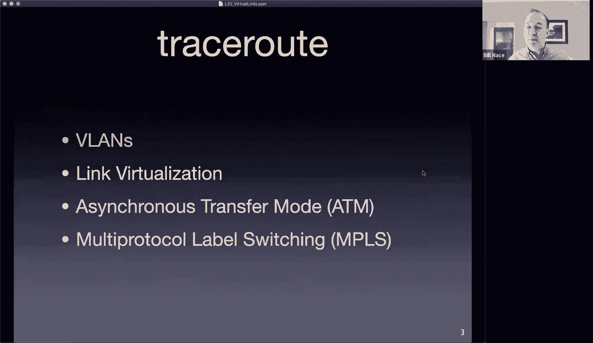

To make something called a virtual land Okay so a land， of course。

 is a a name for the network that is formed with a single link。Okay， so in Ethernet land。

 something like that。And we're not going to try to make that virtual。

 we're going to try to make that extend beyond the extent of just a single wire or something like this。

I showed you I showed you part of this picture last time I showed you the switch and the hubs and all that sort of stuff and I filled in some motivations right maybe we have each of these domains。

 each of these hubs serving a different maybe department。

 something like that different group and then the switch used to connect all that together。

And then of course your traffic probably doesn't just want to travel within these departments right it is true that ECE professors occasionally need to talk to somebody other than the CF or the INI department right we want to get out to the world as well。

 and so that switch is going to be connected to a router and that router connected off to the Internet and other stuff right？

嗯。So。One question a network administrator might ask is。

 is there a reason that I actually have to have these four boxes could I just use a single one and certainly we could just have one big switch right？

And that would be great in that case I would remove the hubs from this picture。

 I would have to run wires back to the switch from every place so that might be an architectural nightmare depending upon the geographic location of each of those hubs and how that's working。

On the other hand， remember， this is link layer stuff， so these can't be too far apart。

There is a limit to the geography there because。Of that fundamental limit for how big the link layer a particular link layer can be。

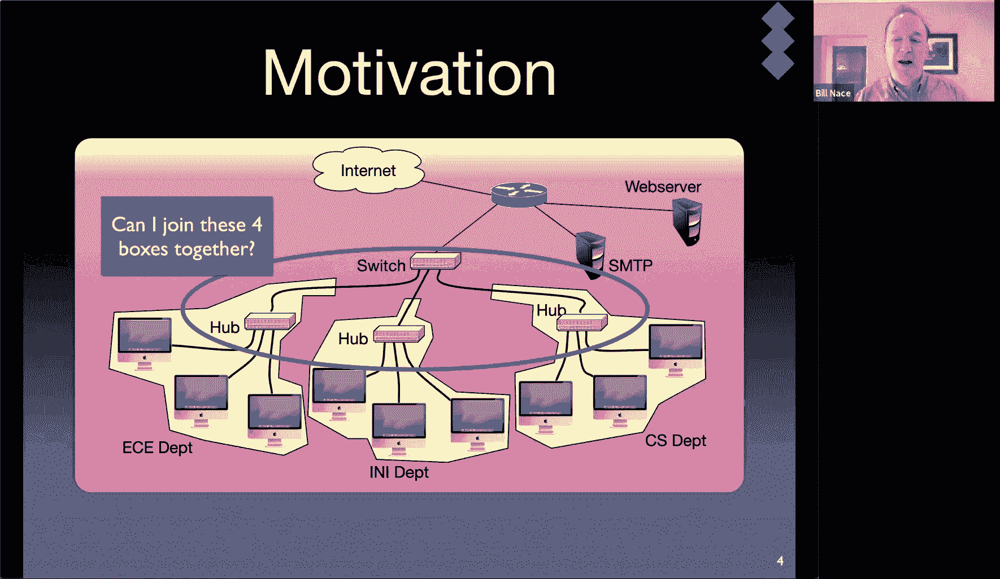

And so it's probably not too big a deal to run them all to the same box。However。

 there are some benefits that we get here in terms of where the traffic is moving and who can talk to who and management and things like that。

And so this。First step， the virtual land is a way to take the these link layer connections that are being made and。

Coes them into one unit， one box that will manage all those that will still make it act like it is separate lands and so that will maintain separations that you want to have while still being physically connected together。

Okay， so let me make sure we understand what we're doing here。

 We've got a bunch of computers that had been in their own little clusters。

 And now I want to allow those to be connected together。But I don't want to put a router in。

 I don't want to provide a layer three connection， I'd like to make it a layer two connection between them。

And so and that's what we're doing here we're creating a layer to connection among different layer twos already that are there we call this a virtual land。

And here's one way that this is commonly created， we call it a port based land。

 and it's created by adding a little special sauce to what's going on in the switch。

And so in the switch， you have a way to specify that certain ports。

 so remember our switch is basically a box。With lots of wires coming in it were those reports。Okay。

 and we're going to be able to specify certain of those ports。

And and say these particular ports all belong to the same virtual land， right。

 They all act all these computers。 I'm showing here what seven computers all connected to the same switch。

So technically， they all are in the same data length connection。But I want to make virtual lands。

 so I want to make it look like the connections on half of the box are their own land。

Versus the connections on the other box that is a different land。

 So I want to make this single switch act as if it actually was too separate。Data link connections。

And I do that by just specifying that certain ports in this case。

 I've split it left half right half because it makes the picture look pretty。

A network administrator would be able to log in to this switch and specify and say， oh。

 import number six should belong to the ECE department or the INI department。Okay。Now。

What we've done here is we've created two virtual lands right so the ECE department is its own virtual land。

 the INI department is its own virtual land。Okay， and that means that they can communicate as if they were their own data link connection。

 So this computer here on the left in the EC department。

 if it sends a frame that is destined for this。Third computer over。

That will be received as if they were on the same land， as if they were on the same。

Direct connection as if they were connected to the same switch， Oh。

 they' are connected to the same switch。so nothing much is going to change for this communication from port 13 to port 16 ditto on the right side right if the computer at port 23 wants to talk to the to the computer port 11 and send a frame there。

 it acts exactly as if they were connected to the same switch。The difference， however。

 is that now I have an opportunity to do some separation。

I can actually make it so that the connection between the computer at 23 and the connection at 16。

 even though you're switched into the same box， you have wires into the same switch。

 the network administrator has said those are two different virtual lands。

which means they act as if they weren't actually connected to the same box。

The connection between 23 and 16。Not on the same connection， not seeing each other's traffic。

 not colliding with each other because they now act as if they are on separate networks。Okay。Now。

 why would I do this， okay， this is I think。One of Jeremy's questions here right well I'm sorry let me back up and get to Abdul Hadi's question。

How does the the network administrator administers the virtual lands by actually logging into the switch okay。

 and there will be a console you know terminal operator you type in commands to basically define。

Define a structure called a virtual land and it'll have some land ID number。

I think they call groups in many switches and then you would assign particular ports， you'd say， oh。

 port number two。I would like to assign that to be in virtual land group， purple， whatever。

And so there's some command line interface that you type into that and make it all happen。嗯。

Jeremy so this is interesting Jeremy's asking why would I do this， what's the point。

 It seems like extra work for a network administrator Okay。

 and all I've done is I have restricted the capability of my switch if every wooden was just plugged into a normal switch without VLs。

 then these guys would be able to talk to each other right a frame sent from 23 would be able to go to 16 because they're on the same data link connection。

Okay。That also means。They can collide with each other as if they were on the same connection。

 That also mean， well， we're using a switch。 Theyre actually in different collision domains。

 So that's not so much of a。A worry， what is a worry， though。

 is that they will see each other's traffic。So a frame sent from 23 into the switch that is destined for 16。

 if the switch knows where that post is， then that traffic would only get forwarded out port 16。

 but if not it gets flooded to everybody。RightAnd so there is this opportunity now for the secret plans of INI that are being communicated to be leaked out to people in the ECE department that you might somebody might not want them to get to or something like that there are some other kind of administrative connections it's nice to be able to separate some traffic administratively to be able to。

 oh yeah， this is all the stuff going to our servers something right and I like to keep that traffic separate from you know traffic doing some other detail okay。

嗯。And Jeremy Jeremy's like， okay， sure sounds great， why not just use two switches。 Yeah。

 this is virtual right， We're actually making this one box pretend to be two boxes。😊，Okay。

 to pretend to be two switches and the。Benefits we get are pretty much all administrative sorts of things imagine the INI department hires this professor right all the all the network administrator has to do is go in and type something in the CI and all of a sudden port 18 is now connected to the INIs。

Virtual land and。And therefore now separate it out at the touch of a button。

 which is a little bit easier。嗯。Okay， one thing to recognize we're pretending these are two bit different switches in the same box right How are that we going to get them to communicate together。

 I just said that we're not going to have frames from an I and I computer get。

Floodded out to somebody on the EC side， but what if this computer at 23 actually wants to send a frame whose destination is this computer on port 16？

If they were all the same switch box。If they're all the same land， then that would be trivial。

Data link layers do right， but now that I've separated them into these two virtual switches。

 these two virtual lands。What happens？If I send a frame from 23 whose destination is 16。

Will the switch just make it go over there？Will says no， of course not。Will。

 is that based upon my facial expressions and your suspicion that I wouldn't be asking the question if it was easy？

嗯。Or is that based on technical？Data yeah okay good you've come to be suspicious at the right time。

 so that's good。Let me ask you a bunch of people saying no right and look there there's Stehanos and several of you are using the right word right。

 if you want to move traffic from one data link layer to another data link layer。

 how does that happen？Okay。😊，That doesn't happen with a switch。That is a layer three。

 a network layer operation。And so we need a router involved。And so just like if these two。

Different Vlands were connected to two different switches。

 which is what we are virtually pretending they are。

Traffic on one of them that wants to go to the other needs to pop up to the network layer to find a router somewhere okay now。

You can see the immediate benefit here i'm sure of burying a router inside the switch and that's very commonly done Okay in fact you'll see people advertising things that are called layer three switches okay because。

And immediately your brain should be like what layer three is network layer and switches network are datalink layer devices。

 how could there be a layer three switch what they really mean is it's a switch with VLN capability and inside the box there is also router capability so it will actually route between the different VLs that are available there。

Okay。

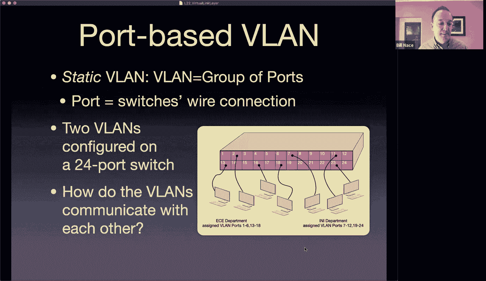

All right， something else we can do interestingly with VLNs。

 another reason that administrators like to use this is that it is possible to actually connect switches together and move traffic around in these VLs。

Just like you can connect switches together normally。

 so I can extend the limits of my land of my data link connection by connecting switch to switch。

Okay， and those since their switch is connected， the frames will get transmitted， the switches。

Actually don't really know that they're connected to another switch。

 they just know there's a lot of traffic， a lot of frames coming in from many different sources。Okay。

 much like if all of those sources happen to be connected just to the wire。Okay。

We can do the same thing with VLs， so I'm showing a picture here where I may have one VL capable switch connected to another VL capable switch using the same static port。

Mapping mechanism。And you'll notice I can make connections here， right， so I have this。

The switch from the last picture that had E C， E on one side and I and I on the other side。

 And I have another switch。 had， that lets me。Add in some more ports that are IN I and and EC E。

 And all I need to do is just make a connection between an I I port on one switch and an IN I port on the other switch。

 And now those two。Separate v lands。Separate switched connections are now connected。

 So now port 7 on this switch on the right and port 7 on the switch on the left actually are connected in the same V land because this switch sees all of this traffic as being in the I and Ivy land and。

If it sees traffic for a frame it doesn't know about， we'll flood it down this wire。

And to the switch on the right， that just looks like incoming traffic that it will manage knowing。

 oh， this came in on port number one。Port number one is the IN IVL。

 let me go ahead and see if I can forward that to port6 or7。Okay， so yeah。

 port one and five connected to 12 and 17 over here， as Bailey mentioneds， acts as bridges。

They connect these different。Connections together i'm sorry we got to be careful about our terminology right bridge is also used as a so bridge as a metaphor of connecting two things it acts like that bridge is also another term for a switch。

Right， it's the the。The kind of standards version of of switch。 So I mean。

 the metaphorical connection between a bunch of。You know。

 computers in one community on one side of a river and。

The connection to the computers in a similar community on the other side of the river。Okay。

Now this works okay here， I've got small switches， a couple different VLs。

 what would happen if this was a 96 qua switch with eight different VLs connected to it and this was another big switch with eight different VLs or the same eight VLs you wanted to have connected together。

That would mean you'd have to run eight wires and use up eight ports on each of your switches to do that connecting。

 right？And and that doesn't sound great。 So let's not do that。 Instead， let's go ahead and。

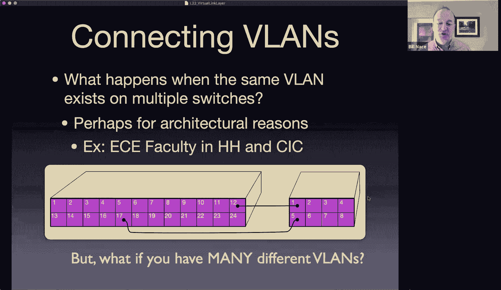

Let's just be able to specify that one of the ports on my switch。

Is a trunk connection a trunk is a term from telecommunications from the phone system way back when a trunk line was a line that connects many different wires together and carries all of the signals down a single wire。

 a single connected， maybe a bundle of wires， something like that。

we're doing the same thing here between these two switches now instead of having two wires。

 I have just one。Doesn't sound like a big deal here in this small picture， but you can imagine。

E different vLs or many v lands you don't want to have to run eight wires。

 I just have to run one wire and。Now this switch's capability is upgraded so that the network administrator can specify port number 12 is a trunk line。

Okay and this switch over here port number five is a trunk line and what that means is that that is a shared connection。

 so when anything gets flooded for instance， when a frame here on the II side。

We don't know its destination or you know its destination is not one of the ports that we have on the switch。

 then that frame gets flooded down the trunk line wire to the other side same with ECE right if if computer 18 sends a frame。

That this switch doesn't know about， itll send it it'll flood it out the trunk line out 12。

 even though both INI and ECE traffic now are going down that trunk line。Obviously。

 after the traffic flows back and forth over the trunk line。

 this switch will actually know and understand in its forwarding table， it will know， oh。

 you this computer over here， this ECE department computer that's connected to port2。

The switch on the left will now understand that that traffic originated down the trunk line 12 and so it will know to forward it out trunk line 12 and so it will actually specify port 12 in the forwarding table that it maintains in the switch and so it can learn where things are。

 it just learns that there you there's a bunch of computers down this trunk line。But I have kind of。

Patched over one of the problems here。 right， S is no problem this。For instance。

 the switch on the left， if it needs to forward frames， it can forward them out the trunk line fine。

Okay， it can know， oh， this needs to get sent over there and it can know that oh。

 this traffic happens to be ECE or this happens to be INI， it still goes down the trunk line。

 no big deal。The problem is on the receiver side。So that traffic coming down this trunk line to the switch on the right。

 the switch on the right will get a frame and it doesn't know which virtual land that frame is part of。

Okay， it can't know just by looking at the frame， is this INI or ECE traffic？

And it needs to because it needs to know， for instance。

 should I flood this frame into the pink or the purple switches there？Okay。So what do we do？🤧Okay。

 well， we go ahead and patch up the protocol。

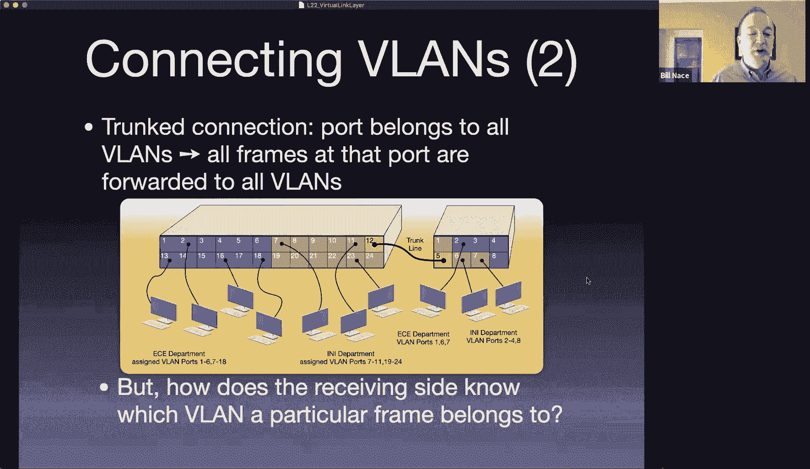

There is an extension to the ethernet protocol。To make to allow this to happen， it's 802。1 Q。

The fact they're running letters in there means the 802 working group has lots of different standards check it out the Wikipedia page lists all of them and there are many it's a very long list of all the different groups in it。

80211 was Wifi， you know， 8023 is ethernet， 802。1 Q tagged ethernet。

The idea is we want to be able to add some extra information to an ethernet frame and most particularly the real。

The most common use case is we want to be able to put in a VLAN number。

 technically you can do other stuff with it and in data center networks that is sometimes done to put in things that aren't quite VLAN numbers。

 but other labels in there。It's a very small label， it's a four byte extension。

And we're going to take those four bytes that's this tag piece and we're just going to insert it into the ethernet frame so the ethernet frame as you know from or as I hope you remember from before Thanksgiving included these fields right there was a preamble there were two addresseses there was a type field。

And then your data and and your CRC， okay， we're going to go ahead and insert another field there for this frame and that's a four byte。

Chrunk。You have to be careful because the receiver who's receiving these bits needs to be able to look here and figure out whether this frame is tagged or not。

😡，Okay and so you can't just look at bits and know which box they're in you're going to look at those bits and see what that is and normally the receiver would be looking at those bits that are in the type field right this little pink section was a two byte type field and they'd be looking for things like oh is this an arc frame or is this an IP a frame contain I'm sorry is does this frame contain an ap。

呃。Query or does it contain an IP packet， for instance， or other odd things？嗯。

And so this VLN tag that's been added。The first two Bs basically just specify This is a tag。 Okay。

 so that number 8，1，0，0 is a 2 byte value that specifies that it's not anything else。 It's not ap。

 It's not。You know， IP， those those bys there mean， oh， this is a VL tag。And then the next two bytes。

Is the actual label， the actual identifier that says， oh， this is ECE or this is INI。Okay。

And so when you're sending when that switch on the left was sending traffic。

 it would have to insert this tag， it would know， well。

 know 8100 obviously because it's putting in a tag。

 it would know what two bytes meant ECE and so it would use those two bytes。

And then it would send the frame。嗯。And because this frame has a new tag that does mean the CRC value will be different than it would have been previously because the contents are different so that' that's good。

 this is generally not a big deal your hardware is handling the CRC anyway and so you may not even have generated a CRC frame or CRC yet depending。

So no big deal。Okay， so it all make sense now the receiver can receive these bits in this frame can look at this well。

 the look at what they think is the type field and it actually has an 8100 in it and they'll say， oh。

 this is a tagged frame。Let me look at the next two bytes。To figure out which frame this is part of。

Okay， and then。That receiving switch will usually pull the the VN tag out because it's done its job It now knows this is an ECE frame。

 and then it will just go ahead and recreate the previous。The original frame without the tag in it。

 that it will then send to everybody in the ECE mid land or it will send it will look up in the the。

In the forwarding table for the ECEv land。Does it all make sense？Oh， good question。呃。

If you have separate VLs， then things like STP， do you remember what STP was？哎。

That was the shortest path。Tree that we were creating that was used to make sure there weren't any loops in our。

In our network in our land and yeah， so those were things that were done at the data link layer and so if you have separate VLs that you've put together。

 you're pretending those are separate lands anyway and so anything you did to manage the land originally you're going to have to redo now at the virtual land level to make that work out。

Okay， good question。All right。So VLNs are cool， this is by the way I'm just touching in to give you an idea of what you can do here。

 if you have more interest in this， go talk to some of the Siss adminds in I know the guys in ECE are great。

 they're using VLNs for a bunch of stuff to manage the ECE network。

And they can talk until your eyes glaze over about how they've used。

VLs in real world systems to solve real real world problems。

Another use of the wordb virtual that gets kind of thrown around here and。

Sometimes people will call these virtual lands as well， I'm going to call link virtualization。

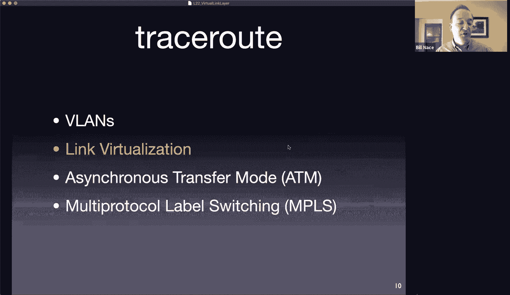

Yeah。And it gets back to this idea that a link really isn't what we think a link is Okay。

 it can be so much more we started off with this picture way back at the beginning of the data link layer series of lectures I showed you this picture and I said。

 oh yeah， these purple things are links right these purple things connect a router。

To a bunch of computers maybe over sharedhared ethernet cable right maybe there's a link that is a fiber optic cable connecting to routers you know maybe there's a link that is you know connecting an access point to a network right these are all just you know these point to point links or these broadcast links it's all very easy and simple right。

And then we went a little bit further， I don't know if you noticed。

 but then the next lecture where we talked about all the switches and boxes。

 actually drew this picture right had which had a bunch of different linkss on it right each of these is a separate land running you know this is running ethernet at one speed that's running ethernet at another。

And we're using these switches to kind of。To tap them all together。Now I have a frame coming from。

 let's say there's a computer hanging on this land here。

 that frame can be sent around and distributed by these switches to another computer sitting somewhere else。

That is not on the same wire。Okay， but。All of that stuff in that picture looks to the computers as if they were directly connected。

So this whole picture there， which has four different lands， five switches， right， all of that。

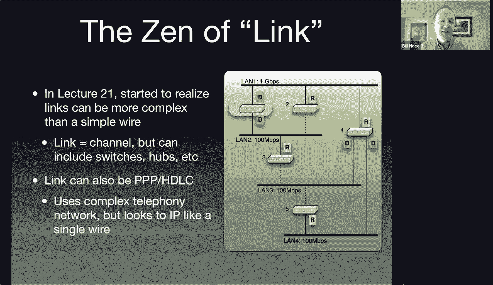

Actually looks just like a link。Right， looks like。

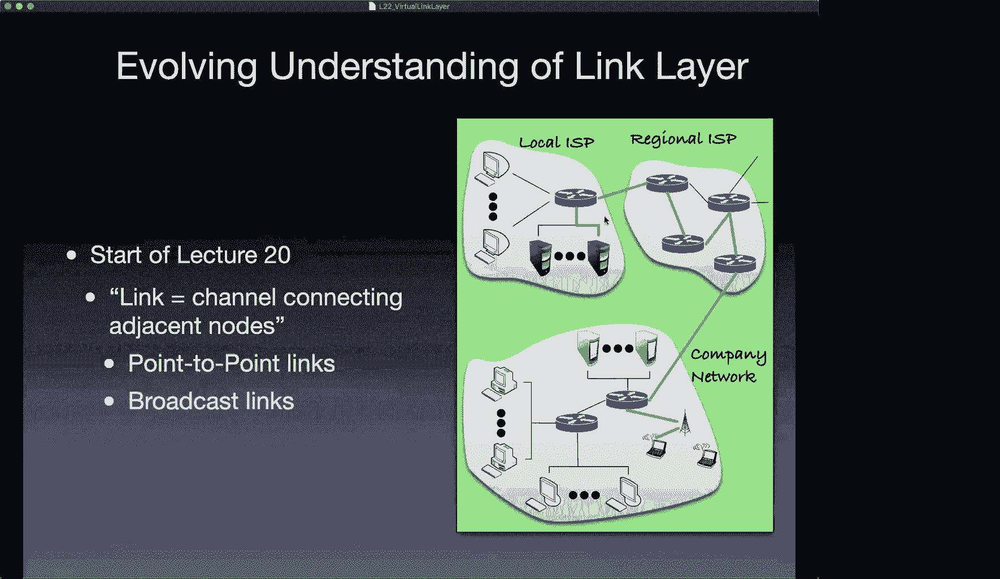

That's this link right here in my picture。Okay， even though it's got a bunch of boxes and a bunch of different wires connected to it。

H，Maybe link means more than just wire connecting things。Here's another example。

You guys probably don't remember this， but I certainly do back in the day。

 so here's a back in the day so I should get out my suspenders and back in the day。

When we were running the internet。You know， wayay back when when things like email were new concepts。

 yeah， back in the late 80s， early 90s， whenever I wanted to connect to the Internet from my house。

 how did I do that， Did I have a cable modem， Nope this hadn't been invented yet。You know。

 did I have fiber optic cable to my house， I just dreamed of it， no， I did have a connection。

 a communication connection to my house， and it was called a telephone and that was before telephones were carried around in our pocket instead we had a telephone in our house that was connected to the wall by a wire。

Okay，And I would use that connection。To dial in so I would my computer had a thing called a modem on it that would allow it to use the telephone network to transmit one and0 bits over it。

 And so I would dial into Aol or whoever my ISP was at the moment I would annoy everybody else in my house because nobody else could use the phone when I was on the Internet。

 And I was also paying a huge amount of money per minute to use the internet Okay so literally I would set aside some time like okay。

 I'm gonna go on the Internet right now and I would list out the the things I intended to do on the Internet and I'd go and I'd like the very first thing I'd do is start downloading my email and while I was downloading my email I you know go look at this three websites I had specified and sometimes I'd just grab screen captures of them and then as quick as possible。

 I would disconnect from the network because I was paying per minute。Yeah。嗯。What was I doing there。

 what was my link to the network？My computer was linked to the network。

Well not with a wire right my computer was actually using the telephone system to connect to my ISP who had a modem bank somewhere right there's a building somewhere you know maybe far away from me。

 I don't even know exactly where it was actually I know you would pick an ISP that had phone numbers that were local。

Weren't also paying long distance charges to get on the internet。Yeah。

 it used to be we'd pay extra money to make longer phone calls than shorter。

So I knew it was somewhere， you， within my state or within my county， but I didn't know where it was。

That connection between my computer and my ISPs computer， that was a data link layer connection。

I was going from my computer to a modem that would be connected to a router at that internet service provider。

And so from my perspective and from the perspective of the Internet service provider。

 it was as if we had a single wire between us。Okay。Did we actually have a single wire between us？ No。

 if you talked to a telephone engineer， they would be insulted by the idea that all there was was a wire between my house and。

 you know this modem bank in you know， Central Maryland somewhere。

What was actually going on there they would talk about， oh yeah。

 we've got switching centers and local switches and relays that do this and that and the other thing。

 right they were running a network。The telephone network connected all the people around。

But I saw that network as just a single wire。

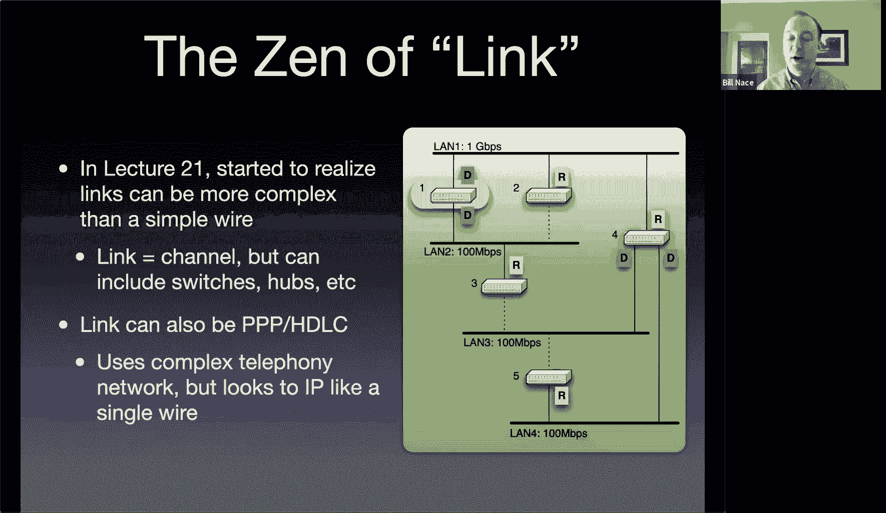

That's the idea of this。This idea that we can virtualize a link。Okay and we could make， in this case。

 I was making an entire network， I was making telephony network act as if it was a single link between us。

And you can do this。In very interesting forms to solve some very interesting problems。

So here's our regular know five layer cake that we know and love， and we're here at the link layer。

And so that means the network layer is giving a packet to the link layer and saying， hey。

 please put this in a frame and get it to the next router。Okay， well。

 it could be that the get it to the next router is actually handled by some other networking technology by the phone company。

 for instance。Or as I'm going to show you in this example by an entirely different networking technology。

So for instance， that might be an ATM network。ATTM in this case does not mean the money machine that you get cash out of right ATM is a different networking thing that is in many ways similar to IP in that it is a network scheme。

 but it's its own technology with its own routers， its own standards its own pieces that all make it fit together and it is very different from TCPIP。

But because we have this nice layered architecture， I can do this。

 I can actually take a network packet and transmit it across some other networking space。

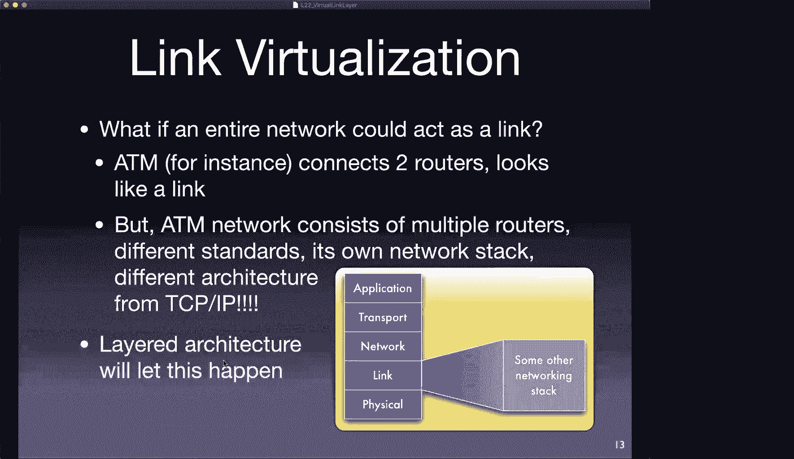

So here's。Of how that might work and why I might want to work it that way， so i'm going to give you。

Short little tiny introduction to ATM， the asynchronous transfer mode。

Networking stack not so much that I want you to become an ATM expert ATM is a fairly obsolete technology at this point and you're not going to go out and like you know get a job and and be like oh I know ATM and you're not going to have a recruiter say oh you know ATM we definitely will give you an extra $20。

000 a year okay。So what is ATM ATM was this networking standard that was put together in late 80s that was the idea was you wanted to be able to send video across a network along with realtime audio that goes with it be able to add text and images I mean who would ever want to actually do that right does anybody actually send video and and audio across the network。

The idea was that you would have businesses that would want to do this and you could make a multimedia center in their business and sell them this equipment so that their executives could talk to executives on the other coast or whatever。

And so this was definitely a telephony thing over long distances。And to make that work。

They wanted to be have an extremely low jitter right that means they didn't want that buffering and delay problems that we talked about with IP back when we talked about TCP right we wanted to actually be able to guarantee some bandwidth and have some circuit that was established through which we would be sending all the data for our video and our audio and would have a reasonable expectation that those packets would get through the network。

With about the same amount of time delay for each one of them so that you wouldn't have a loss or something like that causing you a long delay。

It is a connection oriented network that was how they would guarantee the bandwidth that was happening。

One of the reasons it eventually died off is because of that guarantee meant you weren't using the bandwidth Quint all the time。

 and so there was some wastage there， and so ATM turned out to be more expensive than other technologies like IP。

ATTM had a stack to it as well， it had this network layer that they called the ATM layer for it that worked like the network layer。

 it was responsible for getting a packet well it called them cells instead a packets was responsible for getting a cell from one end of this circuit to another end of the circuit。

The cell itself was tiny by internet standards by IP standards。

 and part of that though was it meant that we could use a store and forward network in a very reliable。

 very deterministic fashion， and so you didn't have the kind of congestion problems that we have in our networks。

So we're sending these very small cells， 48 bytes each with a five byte header。

That 48 bytes is an interesting story， 48 is a weird number， it's not a power of two and。

It turns out that this standard， the ATM standard was developed。

By taking technology that was common in Europe and technology that was common in America and combining them。

 but the problem was both of those technologies had grown up on their own and people were actually selling routers in the US and in Europe andt that was proprietary。

And one， I don't remember who used 32 and who used 64 bytes。

 but they were different and when they got to the negotiating table to create this standard。

 neither side wanted to allow the other guys to use their size because they knew that if you know like oh we're using 32 bytes if we agree on 64。

 then those guys are going to have like a year head start while we have to reengineer all of our equipment and so they both decided to compromise by making both sides re-engineer all their equipment and go with 48 bytes instead。

Below the ATM layer is a fiscal layer。ATM was famous for early use of fiber and so it had。

Pty good I mean it was trying to do high bandwidth stuff for businesses that could pay for it and so fiber was very even though expensive was a good possibility。

 they also had copper wire as well and this physical layer managed the bit transitions and new you know how to create the right electromagnetic cells going down each of them and they would keep a constant flow of cells going even if you didn't have any and that meant that the receiver's clocks were synchronized to the senders and stuff like that so from a communications engineering perspective physical layer worked out pretty well。

Up on top the A AAL layer， the adaptation layer that was kind of like our transport layer ATM is the network layer where you have packets being routed around AAL and there were several different versions much like we have several different transport protocols was responsible for taking the application data chopping it up into pieces reassembling it at the other side。

And。Depending upon which type， which protocol you were using for this。

 you could get constant bit rate or variable bit rate or several different types of those。

 or you could just say I'm going to send data gras。Because I don't need the constant， you know。

 I'm not a video app， so I don't need them constantly， but I want to be able to send some datagrams。

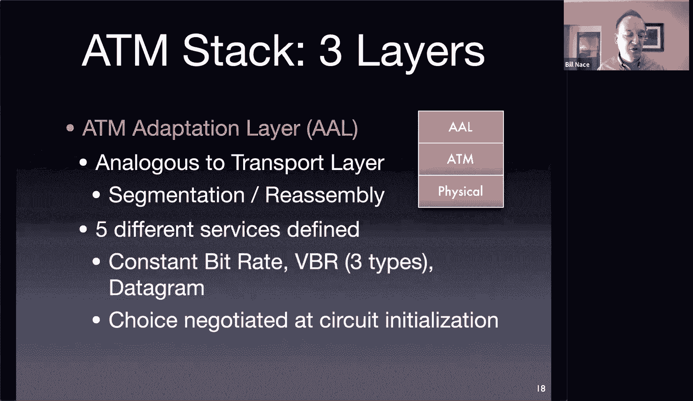

All right， so why is again？Cool， different， right， Yay， I IP is not the only possibility， right。

 It's just the one we've come to be common。 So there are other networking standards。 Let's imagine。

Now getting back to the link virtualization idea， let's imagine that you were a small secluded country and you had developed ATM and built out an ATM network all across this place okay and all of a sudden you know it's 1856 and the internet black ships show up and they say hey IP is the way to go。

But we've spent millions。Billions of yen building an ATM network right that has routers everywhere and has you know fiber optic cables and we're all happy with and we're making money with it and I don't want to just rip all that out and have to buy a whole bunch of IP routers and hire a bunch of foreigners who you know to teach us how IP works and all that kind of stuff。

 I don't want to do that。Instead， you can actually use this virtualization idea right so the way it works is I've got my ATM network。

And I want to connect to the internet at some well defined places。

 and so we'll just go ahead and put in some routers， let's call them border routers。

OkayThey're the border of my network， those network， those routers will all connect to internet。

Which means that we'll get internet packets coming into the router。

And those internet packets need to get distributed throughout our network。

 and so what we'll do is we'll at each point of we'll create ATM connections。

Between each of our point of presences in our internal ATM network and we'll use ATM to deliver those IP packets。

Okay， and that means that our network then。Will be IP。Compatible。

 I guess it will allow computers to connect at our point of presences and send IP packets。

The connection between any one of these routers and any other router， though。

 is actually traveling over ATM。And we be seen as if there's just this link between the routers。

Ive virtualized my ATM network to make this happen。

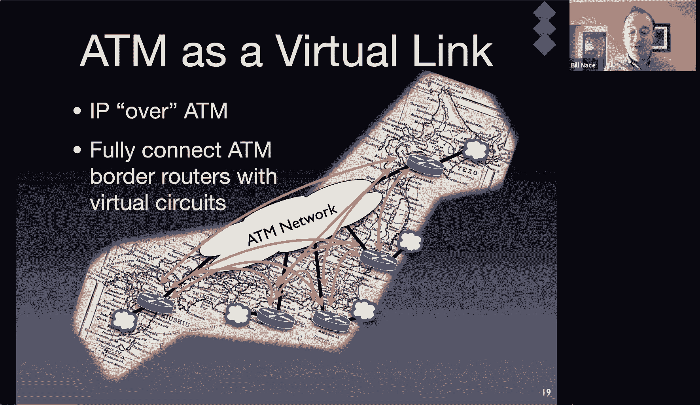

So how's this actually going to work， right Kyle's got。Initial problem right off the bat， right？

48 byte cells right， what happens if I get a packet coming in that's bigger than that。Well。

 here's the journey， here's what's going to happen。嗯。I've got a regular five stack。IP network。

That is connecting to one of my border routers。Okay， at that border router。

 that border router is going to have to be slightly schizophrenic okay it's going to have to be able to connect to IP on one link。

And it'll connect to this other link on the inside。

 but that other link is this weird ATM thing that we're virtualizing it。Okay。

So a packet it'll come in to this border router。The packet will have an IP address in it right how do we convert that IP address into a link layer address？

turns out we do that all the time， we have a protocol called ARP that does that。

 there is an aRP like version that for ATM that will come up with the virtual circuit identifier that matches that IP address。

Okay。Then the network will go ahead and well it'll already have a circuit set here that says that AA will negotiate a circuit setup。

 but that will have been done previously when we made these links between all of our point of presences。

 so we'll already have a virtual circuit connected between where we want to go and our destination。

We'll go ahead and take that AAL， that adaptation layer will adapt the incoming IPP packet by chopping it up into cells。

And I use the word fragmented here， I'd like to point out this is not an IP fragmentation， Okay。

 this is a data link layer fragmentation that's going on。And so the IP packet will get chopped up。

Even the header bits will get put into a cell， you know。

 the whole packet will just get chopped up into 48 byte chunks。Put into cells。Okay， and then。

That thing is now ready to travel across the ATM network we have that we have virtualized。Okay。

 so it will go down into that network， it will go across the interior of my ATM network from ATM router to ATM router to ATM router。

Which are all in this virtual circuit Okay， until it gets to a point of presence somewhere。

 which is another one of these schizophrenic border routers。

The adaptation layer on that router will take these cells that are coming in。

 reconstruct the original IP packet， and handed to the network layer and say， hey。

 here's a packet that I just got across this single link from this other， this router。

 this border router over here handed me a packet， and I got you the packet even though that got you the packet involved chopping up in a cells。

😡，Transmiting across many routers and getting it back to this border router。

 and then it continues its journey on as an IP packet。From IP's perspective， you know。

 I got this this packet in， I just have this wire from this router to that router。

That transmitted that packet just fine。Okay。From ATM's perspective。

 it did a lot of work to make that happen because it had to you know go from interior router to interior router until it could be reassembled。

Kyle's actually asking about what happens if the IP packet has a don't fragment bit set。

 and this is actually going to force fragmentation。But that's a different thing。

 right the actual MU of this link is not 48 bytes。Okay， the adaptation layer can take you know。

 full packet， whatever it size in， take 150 bytes， and transmit it across this wire。

 it just happens to do it in a whole bunch of cells。Okay。

 so it's kind of it's taking on the fragmentation job and not forcing the network to do that。

 so it will not be IP fragmented at all。

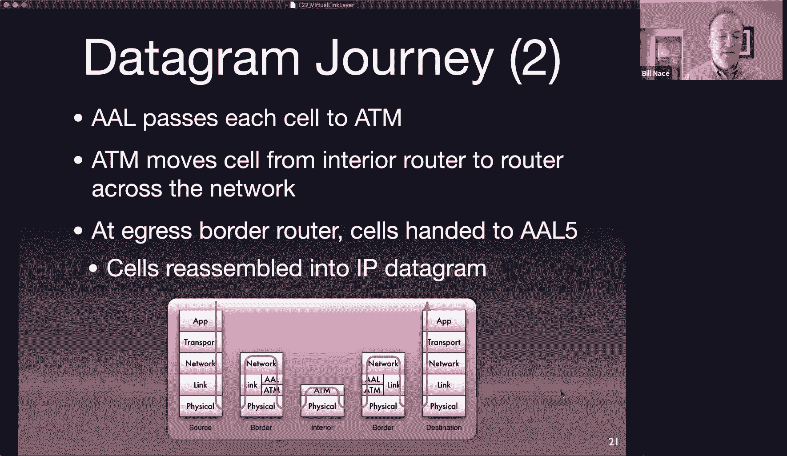

I've made this example showing ATM。But you could use any networking technology you wanted， okay。

 there's lots and lots of different data link layer technologies。

Some of them are just data link layers， some of them are full networking layers。

 full networking things that act a little different I went through the RF list and I basically did a Gr on IP over star right let me know any RF that is about putting internet protocol on some other link layer。

 many of which are going to be virtualized other kinds of networks and I came up with this huge list。

OkayI'm sure if I looked around and was carefully went through the list of RCs I find some others Okay。

 it turns out you can use。canUse IP over IP if you want to。

 which is what is often done for encryption and tunneling reasons。Okay。

And deionologists note that two of these RFCs were written on April Fool's Day。Okay。

Another more serious。Look at virtualization， something that we actually do do a lot these days is another technology that I love called NPLS。

MPLX is well we'll get into all the details before we dig into it we need to make sure we all understand what's going on here and so I'm going to show this picture。

 which is probably the most important single slide of the entire course。

Because this is what's happening to your data as it travels through the network。

With all the layers and so this slide shows what's going on layer by layer by layer of the network。

so I want to start at the bottom or not quite the bottom let's start at the datalink layer and look at an ethernet frame right and you know ethernet frames we've talked about this right it's got a preamble it's got two addresses it's got a type it's got a data field that might be very long this kind of breakage indicates that this could be you know these we know the scale right these are you know that's two bytes right there I don't want to give you an indication that data is only that big it could be 1500 bytes。

Which wouldn't fit on the slide and then there's the CRC。Question is。What's in the data field？

What is that？Yeah， question for you guys， and you should know this what's in an Ethernet frame。

Yeah an IP packet right that's what's in there there are some other pot it could be an aRP okay you know whatever right but it's our network packet and for us most of the time that's an IP packet。

And we know what that IP packet looks like right it has a header。

 it has you know header length destination addresses， you know all kinds of stuff flags。

 you know don't fragment me things， all that is in the header。And then there's a payload right。

 what's in that payload。This should be getting easier for you what's in the payload of an IP packet。

Yeah it's a segment of some sort right it's some transport layer protocol segment in this case I've drawn it as TCP could be UDP could be other transport protocols of course right and that transport protocol has。

A header that's got， you know source port， destination port， it's got， you know。Sequence numbers。

 acknowledgement numbers， you know。All kinds of flags， all that sort of stuff。And some data。

What's in that data？Yeah you're getting the idea now right that's a message right that's an application message of some form i've shown it as an hTP request could be whatever protocol you know could be dNS。

Well， couldn't because it's a CPp segment， but you know。Whatever， whatever we want right is in there。

 This is the idea of encapsulation。Right we're going to and this I tried to show way back to the beginning of the course with those envelopes right where did that demo where we put things inside envelopes inside envelopes inside envelopes right each of these things is an envelope of some slightly different form we have messages。

 segments， packets and frames。Each of them carrying data each with different writing on the envelope to make it get delivered properly。

Okay why am I pointing this out Well a couple of reasons one is。

When we're talking about the link layer and virtualization of the link layer。

 I just need to get this data somewhere， right this data that's been given to me。

 I need to do whatever the data link layer will do to make that happen。But also， I wanted to。

Ask ourselves。Can we do other stuff other than。These particular protocols。And the answer is， yeah。

 as long as you're careful， you can muck around with these a little bit and add some extra data in some certain places。

We're going to call this extra data a label。And network managers。Network administrators。

 network engineers often would like to。To put labels on packets as they flow through their network。

Because that lets them do some work。At one point。For instance。

 to do the forwarding lookups and then you can put a label in the packet and then use that label to get the packet across your network without ever having to do that big work again。

 without having to do an address lookup， for instance， or whatever you're trying to accomplish。

The key， though， is we have to be careful with this encapsulation scheme of where we put the label。

If we put the label in the wrong place， we're going to mess up。

The the technology that's already in place right so if I were to put a label between the preamble and the destination address。

Okay， I could do that， but it would require me changing every ethernet adapter。😡。

Buying equipment that had ethernet with label in a particular place sort of thing， okay。

 and I'd have to work out all that technology and make sure that that could be made to work。Okay。

 and so we we're not going to put it there instead we're going to， well。

 if we put it here at the beginning of the payload。That becomes easier。😡。

Okay I can put a label there kind of like we did with the VLN。

I can put a label there and pretty much do whatever I want。

As long as I take it off before I give it to someone who wouldn't understand the label。

And so that's this idea of MPLS， multiple multi protocol label switching。

So the idea is I want to be able to put this label in there。To manage stuff， right。

 And I can make that label fit。The needs of my network， I'd like it to be， for instance。

 something that doesn't have to do this very complex。

Very maybe complex is a wrong word because it it's simple to do。

 but it's hard to be performant when you have to do this table lookup at every router for where the packet is being forwarded and deal with things like longest matching prefix rules and stuff like that right that can be more complicated so instead let's put this label there and that label can be a fixed size and and can be tailored to our particular network as well。

And so MPLS does this NPLS goes ahead and allows us to put another header in between the ethernet header and the IP header in some sense we're adding another layer to the stack between the network layer and the data link layer。

 we're adding an MPLS layer there that's going to allow us to put these labels in and manage them and use them。

The header itself has the label which is 20 bits long。

 in some cases that's going to be plenty of data if I have a network with only 12 point of presences I don't actually need all all that I just need to be able to count to 12 but this lets me count to 20 in that label which so this is considered to be good enough for most uses。

There is yet again a traffic class right this is that priority thing we've seen show up here and there right it's that type of service field that you might want。

And in some sense it's a little odd that this is a separate field。

 you could just say these are some bits that are part of the label。

 the first X bits of the label is a priority， but these are set aside separately to have a three bit priority code on top of that。

There is a single bit here called Bo of Sta。And that's but。

That will be set to a one if there are no further MPLS headers following。

It turns out you can actually。Why add one MPLS header if you can add more so if you needed more than 20 bits of label or you wanted some hierarchy of labels managed within your network somehow。

 you could do this and you just have a bunch of MPLS headers one after the other and this S bit would tell you when you're done or I guess it would tell you whether there's another MPLS header following you or not。

And then there's a time to live field。Interesting， why time to live， well。

 anything I do in my network should manipulate the TTL field as if we actually were working through all the routers in an IP fashion。

Okay，And so each one of those would have decremented the time to live。

And we don't want to go messing in the IP header。We just want to be。

Be routing through my network now just using the MPLs headers。And so to make that happen。

 the TTL has been promoted to be part of the MPLS header。

So when you add this MPLS header the first time you copy the TTL value out of the IP header and put it here。

And then every MPLS router decrements that。And then when you are。Taking this IP。

 the MPS header off and recreating the IP header kind of maybe at the other side of your network to pass it on。

 you take the TTL value that now has been decremented by a couple of steps and you copy that back into the IP header。

Does it make sense？

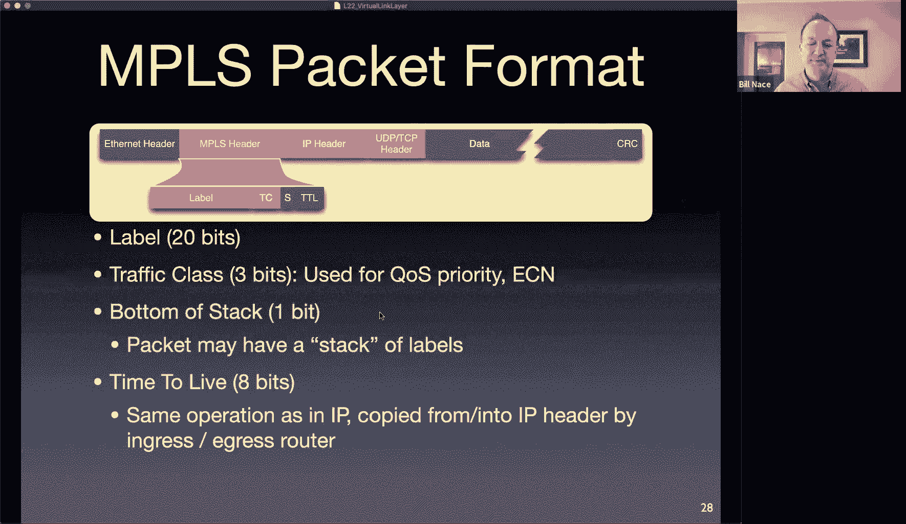

嗯。All right， so now I have a network that is no longer an IP network。

 I am not using routers that are operating on IP headers。

 I'm using routers that are operating on MPLS headers。so those routers are going to be different。

 I have two different kinds， one is called a label switch router and another is called the label edge router。

I think switch router is weird in this case because it's。It's not a switch， right。

 but that just means it's in the inside of the network。

And it's going to be operating just by looking at these NLs headers to figure out where the next destination is。

The edge of network， of course， those guys have to be that kind of schizophrenic。IP on one side。

 MLs on the other， and so need to be able to translate between an incoming IP packet。

To add anmpLS header to send something into the network or when receiving an MPLS header to be able to rip it off and recreate the IP packet to send out into the broader IP network。

Okay， so that's the reason there is this distinction between these two kinds of routers。

 the ones at the edge and the ones internal to the network。

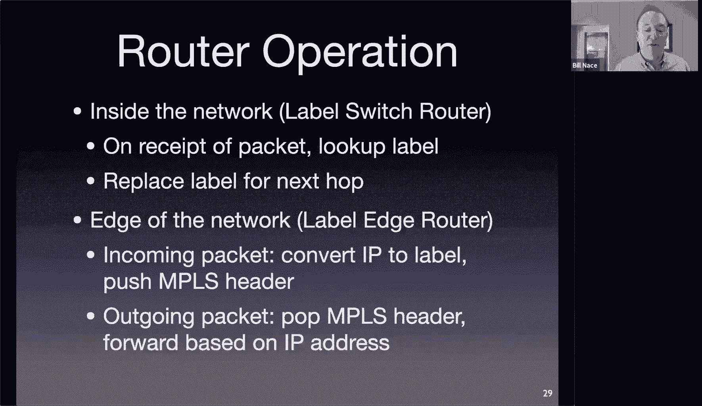

The routing itself。Is done using these labels and using more of a virtual circuit kind of interpretation of the labels So the the canonical the typical fashion。

You can technically use the label for whatever you want。

 but here this is a common use is this kind of MPLS routing。

 this is like the default routing and it acts like the virtual circuit network routing we talked about at the beginning of the network layer when we talked briefly about how those routes would happen。

And so in those cases， you have this label that's put on the。

On to the header of the packet that you're using to do the routing。

And that label is a is an agreement between adjacent routers it's not a globally chosen route label that is used everywhere it's just an agreement between。

Two of the routers， and so that label value will get rewritten at each step。So in this case。

 for instance， I might have this header with this。Forwarding table and you'll notice the forwarding table has a different structure。

 it's not just address and output link。Now it is keeping track of the label and where。

The label on the packet coming in and figuring out from there what the label should be rewritten to and which outgoing link it should have so if you have a packet coming in to this particular router that is destined for a or B you would put a value on it。

So this is the outgoing label that you're going to put on the MLs。Header。

And then this is the outgoing interface so I could put a 10 on it and send it out wire number zero。

 or I could put an8 on it and send it out wire1 if I were trying to get to destination A。

Let's say put a 10 on it and send it out。At interface zero。This router here， R 5， when it gets that。

 would look at it and say， oh， that label is 10 coming in。

 Let me rewrite that to a 6 and send it out this interface 1。

 I have to rewrite it to a new number that has been agreed upon between router R 5 and R 6。

And that number happens to be a six so that router six， when it gets that will say， oh。

 this is coming in with a six on it， that must mean it goes out interface zero， its destination is a。

Okay。嗯。So Dan's got a good question saying， hey。I thought we were trying to get rid of table lookups。

We can't get rid of them entirely， what we can do is make them much more efficient。Okay。

 so now we're the label lookup is a fewer number of bits and it is this very straightforward lookup of 20 bits that has been。

Agreed upon as the value between these adjacent routers and so generally these tables are going to be shorter I don't have to mess on with longest prefixed matching rules anything like that I just。

It's a very simple let me look up these 20 bits and。And。

Redo the copy so yeah I can't get rid of a table lookup because they do have multiple destinations it could possibly go to。

Though we've made it a lot more efficient。Okay。嗯。Kyle the labels themselves the choice between them has has to be something that these routers will agree upon ahead of time and so normally there is a protocol an reservation protocol that will when you set up these circuits will go ahead and。

You know the two routers it will go find a route through the network and make sure the routers along it agree to provide access through them and the routers then will make this agreement so there's another protocol that handles putting all these values into the forwarding tables at the start there's got to be if we got it for free then nobody would do BGP routing right that'd be too easy otherwise。

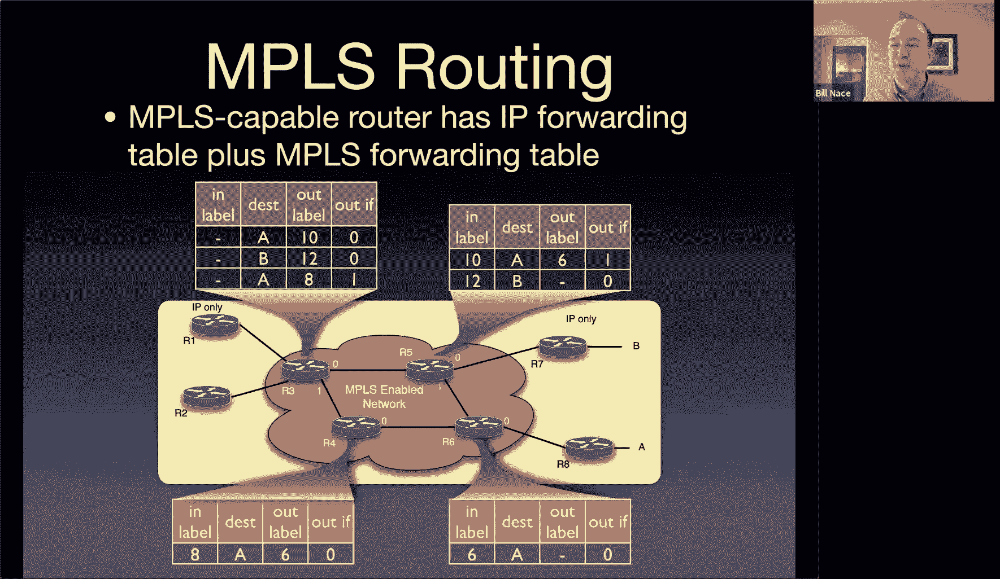

Okay， so the big gain here， of course， is that the forwarding process only looks at the IP and only has to do that fairly expensive。

Lookup once when it comes into the network， and now I can potentially send my packet across a dozen routers doing a much cheaper MPLS lookup。

Oh yeah I do have the note here right so this is Kyle's question the forwarding table got filled by using this reservation protocol which is cleverly called RSVP dashte is the traffic engineering version of that there also is a label distribution protocol that does a similar thing that gets the values out across the network。

And just to make things more complicated， we're going to talk about software to find networking next week。

 which allows you to。Kind of like run programs and figure out what these values should be at the different routers along the way。

We'll get to that。嗯。The other real advantage here is that we break away from this model of IP where there is a single best route to get from source to destination。

If you think back to Dkester's algorithm， to BGP， how they all work。

We're deciding ahead of time that all of the traffic for this particular destination should travel down this particular route。

And。Sometimes that's not what we want to do as a traffic engineer in a ISP。

 I oftentimes would like to load balance my network， and so I'd like to actually be able to say。

 you know I'd like half of the traffic to go down this route and the other half to go down this route。

Okay， and you can't do that with IP。😡，But you could with MPLs。

You could actually specify any route when it comes into your network。And you do the lookup。

 you could at that point in time， specify。With the entire knowledge of how that should go through your network。

 we call this source forwarding。Okay at the source it's chosen what the path should be to make that happen okay and that's a useful thing from a traffic engineering perspective being able to set up multiple paths can be great。

 you can have different weird policy rules making all that work whatever you need。

You can make it happen with Ms so we get a lot more flexibility in。In MLS。

 NLS doesn't specify how the label has to be used， it just specifies a mechanism to put labels on packets and then you get to do what you need with it。

And I think that's cool that extra flexibility lets you do some pretty cool other stuff so Schraer yes。

 you could choose the paths dynamically you could load to balance them so that's not something that we typically do。

We normally have metrics in our protocols that are fairly static that are not computed based upon this second amount of congestion。

 but are more computed based upon some value that a network administrator assigned and if the network administrator sees a problem。

The network administrator will go tweak these values to get different things happening。

 but you could with MLs actually be choosing them much more dynamically。You could， for instance。

 a common thing you want to do is have a backup link。

So I have a very expensive transit link that you know I don't want the traffic to go down as long as this really cheap peering link is available what happens if that peering link breaks oh now I can instantly have my traffic fail over because the labels then can now mean go that way and so of go through through to my peer。

You can build virtual private networks， so this is another use of that virtual word if be careful about and some people call these VLs。

 by the way， you can see these being advertised this way a virtual private network is where traffic is actually segmented in my network and kept disjoint from the other traffic so that we can be very isolated and so you can provide extra privacy and you can you can actually do things like encryptpt data from one point through a bunch of routers to where it will be decrypted and so we call that tunneling and so that you could guarantee that you know for instance。

At Carney Melon， we have a campus in Silicon Valley and we have a campus in Pittsburgh we could guarantee that traffic。

That is to a CMU address is not seen outside of CMU。

 even though it has to travel across an ISP to get across the country to Silicon Valley。

 we would have this virtual private network built up to make that happen。

And other cool stuff you can do。I think MPLS is a great tool it's got a lot of flexibility to it and it's one of those places if I were looking for you know PhD topic to think about Im not sure I would be researching MPLS itself。

 but I could easily see whatever experiments I was trying to run being greatly enhanced by being able to use MPLS to label my data for instance。

 as it's traveling through networks be able to keep track of of those pieces and so that's why I bring it up here I think it's a very useful technology that you should be aware of and who knows maybe you would。

Be able to use it to solve some problems in the future。

That brings us to the end of today's discussion， we use the word virtual a couple times I hope that doesn't get too confusing to you。

That again is the nature of how computer networking field is works out we use the same words over and over again and virtual is one of those just like port and Pierre and whatnot but you should understand a little bit about this idea that a。

A link at the data link layer maybe more than just a single cable connecting one computer to a router somewhere can be all kinds of interesting stuff。

 okay？With that， I hope you have a wonderful day。I say thank you to you and wish you a good day。

Bye bye， everybody。

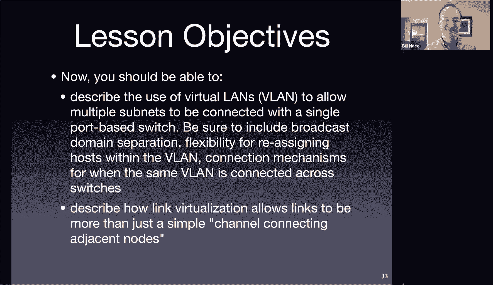