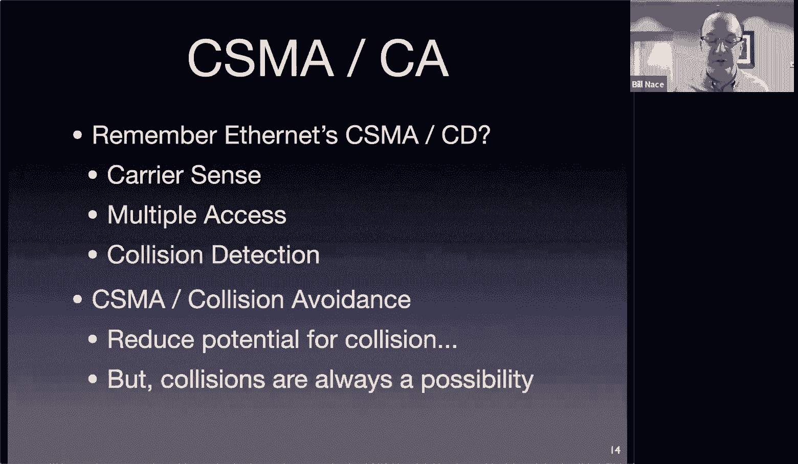

# 卡耐基梅隆大学 14-740 计算机网络 Fundamentals of Computer Networks（Fall 2020） - P25：Lecture 25 Wireless Networks - ___main___ - BV1wT4y1A7cd

This is 14740。Welcome everybody， I am very glad that you're with me today。😊，Before we get started。

 I have one note to make， I hope it doesn't come to it doesn't disturb things。

 but it turns out my house right now has no heat， my boiler is not working。

And so it is possible that I'm going to get interrupted when a heating guy shows up today well see I normally would not want that to actually interrupt the flow of the class。

 but it's cold in my house right now and I don't want him to say well I try to connect I'll talk to you again tomorrow or anything like that so I apologize ahead of time if I suddenly say hold on a minute and mute myself and run away from the screen to you know let him into the basement or something like that I hope you understand。

As well。Okay， so where are we？We're getting towards the end of the course。

 you know that there's not much left not much to talk about it's today and one more meeting time。

And then we've got a final， in fact。Exactly one week from this moment。

 we will all be in the middle of dealing with that final。Get your studying done。Please ask us。

 reach out to us if there's anything that's confusing， if there's anything you'd like to discuss。

 post something on Piazza office hours， feel free to send us some email， whatever needs to happen。

Jeremy's asking a really good question in fact it' will take a moment here to actually basically say hey。

 is there anybody out there that would like to connect with Jeremy I know he's been asking several times about it。

 I am all in favor of study groups I think they are one of the most effective ways to study for any topic。

They they allow you to teach the material to someone else。

 which is actually the best way to learn it one of the big benefits I get out of being a professor and teaching stuff is that I get to learn it really well and you know you can。

You know you understand it when you can actually teach it and make it work for someone else and so I would recommend so anybody else want to join join in something like this。

So I see a couple of you， I guess that's actually one of you in the chat window。

Saying yes there you go will as well come on the rest of you get involved this is a great way to actually study so we've got some some movement here to you guys I don't mind if somebody wants to specify a time and a zoom location。

RightRight here right now， let's go ahead and get something scheduled， I think that'd be great。

Anybody want to propose the time？Jeremy， what time this weekend works for you？Okay。

 Will's got something at two on Sunday。Great， oh， is that the link that will。

 is that the one that was on piazza？Why don't you go ahead and repost that to piazza and it looks like you have some people who are。

Sufficiently scared of the final who may join you this time。And that， I think would be fantastic。U。

I have posted the study guide on the website thats。

The list of all of the lesson objectives and it's basically just the combination of all of them from before the first quiz before the second quiz and after the second quiz so every lecture from the entire semester is concatenated into and that big list。

And。And Ganesssh is asking if there's a sample final exam or something like that and I do not have a sample final exam to give you。

 I actually don't think that's a great way to prepare for the final one the issues is it tends to give students a false sense of security if you look at that exam and you say oh。

 I now can answer all of these questions and those are pretty much the questions that are guaranteed that I'm not going to ask you。

m so I I and actually there's a fair amount of educational research behind not doing that。

 which is why I give you the study guide that's a list technically I mean specifically that is a list of the things i'm going to ask you I will not ask you any question that is not on that list。

嗯。And I haven't yet written the final， but I will sit down probably starting this evening and just you know pick some things from the list and the list says。

 you know you should be able to do X and so I will write a question about that specifically。Me here。

 there will be a TA led review session。And I don't remember row hit we have。

APoing on piazza about that or not I was just making the post Oh okay itll be open next minutes Yeah fantastic。

 so yes， there will be a review session this weekend let's try to make it not at the same time that this study group is not Sunday at too its on Saturday I think we'll get every read for Saturday yeah。

Okay， on Saturday review session， excellent。Dion's asking about the so the time limit is basically the entire the entire final exam session time and。

I'm going to there will be some additional material in there some more questions than you've seen in the quiz but not a huge amount once again I'm not trying to make this a time crunch for anybody。

So it may be one and a half to two times the number of questions you had on a quiz。

And you have twice as much time， I think， for the actual final。そう。All right。

Also just to quick point out， lab3 is doing Sunday。

 lab3 includes the opportunity to get some extra credit and that extra credit is for helping me improve the course you will be asked for every course to complete a FCE a faculty course evaluation。

And those turn out to be really valuable information that I use to try to improve the course and especially in this time when I'm doing stuff remotely and you know I look。

for ways to improve it because I now have to present the course in different ways than we've done in the past and so I really really could use your suggestions and your critiques of this。

This has happened， excuse me。Yeah。嗰个你水。Okay， John， thanks so much。你 to吧。Great。

 I have a heating guy coming， sorry about that。I was talking about the FCEs and the fact that I would very much like your critical information about the course and the FCEs are one of those you know one through five to degree disagree kind of scales and that's great but a lot of times the numbers don't help me a whole lot it's okay。

 I guess the numbers went down you know 0。2 this year from last year。

What do I do with that information it's much more important that you in a comment tell me that oh this thing is annoying I wish you wouldn't do it or this thing wasn't scheduled well or please make sure to whatever it is。

I very much value that information and what I'm going to do with lab three is give you bonus points for providing me with that information。

嗯。So。I ask you very much to fill out those FCEs to give me useful comments。

 tell me why you didn't give me a five tell me the thing specifically if you can that would help me improve so that in the future I can make the course better so that's part of lab3 please make sure you have taken a look at that before you fill out your FCs so that you can fill out your FCs in the way that I'm asking and so that you can get the points then for lab 3 I shouldn't need to say this but just to be explicit I am not asking you to give me fives okay I'm not trying to bribe you to increase my score what I'm trying to do is bribe you to give me the information so that I can improve the course and。

I guess and get better scores out of semesters to come， okay？All right。

 on with today's actual material， today we're going to look at something which is pretty fantastic and that is the wireless networks and how they work。

This is a data link layer thing。Wireless networks also have a lot of effects of the physical layer that bleeds into how the actual data link layer works。

 so we'll talk about some of those interesting challenges and why we like them。

All right， so you guys have。Basically grown up with wfi being an available technology and you've seen it a lot and you may not。

Spend a whole lot of time thinking about how great it is。

 but it's fantastic to be able to carry devices around in our pockets or in our wrists to have a laptop that you can carry know back in the day that you could go to the coffee shop with that you could move around and that's fantastic to have that kind of access to have those mechanisms that would let you make that connection even without actually having a real cable which is great unfortunately it's a little bit more difficult。

 the point of here boss here thinks it's easy to make a wireless network it turns out it's harder to make a wireless network because you have to do all the things to fake the cables that aren't there。

So what we're going to see is the fact that we're using radio waves to actually communicate our data around and we're going to be talking today about it in an infrastructure mode where there are access points you talk to and that is the most common way of connecting to wfi I'm going to show it。

With this picture today， and it looks a little weird， so let me describe what's going on here。

We have in some access point， this little green， I don't know。

 angel looking figure that you know has these these waves radiating out fer it that's supposed to illustrate an access point。

Normally at this point of the lecture I would point to the wall of the lecture room we were in and say see that thing over on the wall that's an access point you guys know what they are you've seen them around you have one in your apartment or home right now i'm pretty sure。

That's the place where the connection comes in and converts everything to radio with this antenna。

And of course， that radio wave is communicating to the antenna that you have built into your laptop now gone are the days used to be that you actually could get laptops with little antennas sticking up out of them。

 but luckily the electrical engineers got involved and they've built the antenna into the laptop so that it doesn't look intrusive it's buried behind the display panel or something like that。

But I'm showing it here because I want us to think about the fact that we have an antenna in our laptop or whatever device that is receiving those radio waves from the access point and and replying and sending their own waves so that's you know you see these little circular waves that's to show that there's this electromagnetic spectrum。

Wave， this electromagnetic wave that is traveling from point to point to make the communication happen。

There is a range to this we'll talk about it in a minute but the power output of the axis point can only be received at some distance。

 so as you get further and further and further from that axis point your antenna will pick up less and less and less of the actual wave of the power that is in that electromagnetic wave and so I tried to show you this on the slide with kind of darker blue in the center fading out to a you know a paler blue。

 but then there is some some range， some distance beyond which you will not be able to effectively pick up that axis points signal you'll get too much noise to be able to extract it meaningfully。

嗯。This access point is is called is known in the standard as a thing called a basic service set this I'm sorry。

 this access point and the the。The other devices that it's communicating to in basically this circle thing is called a BSS。

 a basic service set， and we'll see in a minute why we have a term like or why we had to invent a term like that and can't just say。

 oh yeah， this is the data link connection。Amit asking about collisions and yes。

 collisions can happen and in fact collisions in WiF are a little bit harder to deal with。

 so that's one additional challenge and we'll be talking about that at some length in a few minutes。

嗯。And I see the question about homework one， I will release thequeuing theory answers。

Posting something on Piazza will remind me if you want， if I forget about it， which might be likely。

Yeah， I can't get you those answers。Okay this access point and the basic service set is a datalink layer piece right that's why we're talking about it here it's working at the data link layer it has the things that datalink layer has it's connecting devices directly okay laptop to laptop or laptop out to well that's part of the interesting thing this access point is going to be connected now to other devices to get out to the internet shouldn't surprise you right this whole course has been about how things connect to other things the access point is going to be able to communicate over radio to everything in the base service set。

But then it's going to need to somehow connect out to the internet and it's going to do that by having some sort of wire out to a router and the router then of course。

 goes on to get the packets out to other places in the internet。

Now you may be looking at thistan saying wait a minute， you know when I moved into my apartment。

 I went down to Best Buy and I bought a w-fi box and I did not have to connect I did not have to have a separate router。

 and for many of us， especially consumer grade devices。

 the access point is actually built into the same box that there is a router。

 but you can still think of that single box as having the functionality of an access point that manages the antennas and all of the stuff we're going to talk about today。

 as well as the functionality of a router which does the network layer conversions and and figures out how to route stuff usually it's a fairly simple job because you don't only have a couple of actual connections。

 usually two connections to deal with。It's this is the point where I can show why we need a term like BSS。

And that's because this base service set is the。Radio portion of the data link layer connection here。

 but it's not the same thing as the subnet or the LA that we have been talking about at the data link layer it's almost there but it's not entirely right and can anybody tell me what what else we need to add to the BSS to actually get the entire subnet included。

I mean， it should be obvious you look at this picture。The BSS plus what else is a subnet？Carartik。

 yes， thank you for falling into my trap。 That router there。Remember。

 a router is not part of a single subnet， a router actually connects lots of subnets together。

And so there is part of the router that is part of the subnet。

 but it is only the interface that deals with this particular wire right so the the。

Data link connection to this router。😡，Plus the BSS， when all included that becomes the actual subnet。

 that becomes the land， that becomes all of the network layer devices that have the same net mask or their same prefix。

Great。

One other reason that that is there is because it is common to connect multiple access points。

So the BSS from each of those connected together at the data link layer， perhaps。

With a switch to build a larger subnet so now my subnet includes two access points and all the computers connected to each of those access points。

Plus， the interface connected there at the router。嗯。At this point in the lecture， in normal times。

 I would point to a couple of access points we have on the wall。And say this is commonly done。

 not you know not in my house or your apartment， this is done at kind of enterprise level where you get higher quality access points。

And then you string them together to make a single subnet by putting switches in with the sign kind of mechanism。

 and that's exactly how many of the access points are connected around our campus。Sort of f。

Partially for architectural reasons， a lot of times we have rooms where we want to have multiple access points and partially for management reasons。

 it's easier to manage a network like that with some switches there instead of throwing everything in and connecting it to routers and having to deal now with different prefixes for each particular section of maybe the same room and things like that。

I mentioned earlier that wfi is great because it has this connection and lets us you know have a laptop in the coffee shop sort of thing。

 it has a bunch of challenges we're going to see and those challenges。

Mainly fall into two categories。The first one we're not going to talk about a whole lot today。

It's a mobility issue， and that is the fact that you can move your computer around and in the process。

 end up being on different subnets。Okay so you could take your laptop。

In the middle of streaming the crown on Netflix and you could wander into a different room somewhere and now suddenly need to be connected to a different access point。

Which might actually move you into a different subnet， depending upon what's happening。

 And the challenge there is that。You end up changing IP addresses when you move into a new subnet。嗯。

And it's not a trouble for you as a laptop you。Your laptop will go ahead and use DHCP to get a new IP address。

 your laptop can then go ahead and send data out to you know wherever you'd like to have it。

The problem is on the other end， you were in the middle of connecting to a Netflix server。

 for instance， and you had a TCP connection and that Netflix server was sending you segments to your old IP address and you have no way to communicate the fact。

To that network F server that you have changed your IP address。

You can't change your IP address and still keep a TCP connection open is the real challenge there are mobility solutions for this they tend to be kind of hacky and your textbook covers and there's a decent section about IP mobility in that。

嗯。So just be aware that that is one of the big questions。In chat。

 what happens when we have wireless and wired connections from the same router？嗯。

Not sure I entirely understand the question。Shoot， excusee me again， sorry。Yeah。Oh， next speaking。

Okay， I'm gonna meet you down at the garage。Round so， okay， thanks。Okay。

 I apologize but I actually have a heater guy here to look at my heater so we're going to take like a two or three minute break while I let him into the house and show him what's going on Okay please excuse me i'm sorry。

I'm back。So sorry about that， my apologies。So where were we we had a question。Wow， you guys just。

I like it， I leave and you just dump questions in chat that's fantastic I should have learned that earlier。

Left more often， so I'm backling Josh events's question。

WWhenho have a wired wireless and wired connection。From the same router。 So you mean if this laptop。

Was connected to the router with a wire。But also had this。Wireless connection in that case。

 those would be separate subnets， the wired connection here would form one subnet。

And that would be between an ethernet interface on the router and an ethernet interface on your laptop。

If you were connecting across the wire and wireless， you would have two separate interfaces。

 two separate link layer connections， and your operating system。

You'd have to do some magic if you wanted to use both at the same time from your operating system and some operating systems will let you bond those into one connection to be able to get more bandwidth and things like that so that is possible。

 but those would be separate subnets。嗯。Yowe is asking is the access point like a hub the access point is like a hub in that it connects a lot of devices remember the hub was a physical layer connection and so that case it is very different from a hub the access point is a data link layer device。

As we will see， it has to understand a lot of the data link layer protocol。But it can take a frame。

 so the access point will allow communications between this laptop and this laptop。

 and it will do that by sending frames back and forth between them。Okay。Kyle， yes。

 if you have separate frequency bands， those end up being different BSSs。嗯。

Different data link layer connections。Me here in the Netflix example， yeah。

 Netflix servers are smart enough to figure this out and know how to fingerprint you and do more work so that when you do break that TCP connection and reconnect。

 it's going to want to know， oh， who is this new computer， oh， that's me here's computer。

 let me go ahead and offer him the same state I had a minute ago which was halfway through this particular show。

There there is a mechanism called IP mobility that would allow a device to communicate back， it is。

 I think， uncommonly used because it's more it's easier。

 especially in this server based scenario where you have a Netflix server that is able to keep track of where you are because you have an account and it wants to be able to charge you money and things like that and so is going to want you to authenticate anyway。

 and so when you move over to a new internet IPH it's going to want you to reauthentate and so it's not going to try to maintain the same TCP connection。

 which is what the IP mobility spec is letting this happen。嗯。Carartik is asking about cookies。

 cookies are a application layer thing in your browser and Netflix does use the cookie to figure out who you are and allow you to not have to put in a new password because it can look at that data that's in the cookie to say okay。

 only Cartik would know this particular data so we'll go ahead and resend stuff to them。

And Austin is asking if multiple bSss can have so we're not going to talk a whole lot about the SSIs those are a network identifier mechanism that。

Makes it easy for us as humans to deal with the network and yes you can label those whatever you want there is an underlying network identifier that's a little bit more complicated we'll see some of that when we get to the actual frame in Wifi in a few minutes。

， okay， I think I'm caught up。嗯。Okay， so we were talking about these challenges。

And I had mentioned the mobility challenge of your IP address changing。

We're going to talk mostly today about the actual link layer connection challenges that come because of the characteristics of the radio waves that we are actually using to communicate。

Those wireless links are dominated by the fact that they're sending radio and the communication engineers have come up with this equation。

 it's called the freeze space equation named after。

I thought for a while it was the free space equation because things are going through free space。

 but no， it's named after an engineer or physicist named Frieze。Can't remember。

 but basically it is letting you know how much power a receiving antenna would actually get and it's equal to the power that the transmitting antenna would send out。

Multiplied by this factor， which is antenna gains at the transmitter and receiver。

 the wavelength of the signal you're sending。Divided by four pi r squared。

 that's the part I want you to focus on。F pi R squared is the surface area of a sphere。

And what's happening when you transmit power from an antenna is all of that power is being distributed。

Across a sphere at the receiving antenna's direct distance。

 and that means that as the sphere gets bigger and bigger。

 that original amount of power that's being transmitted needs to get distributed over a larger and larger surface area and so as R increases the received power is decreased quite severely。

Okay， and。Typically， this means that you're going to be receiving an amount of power that is。

 you know， thousands or millionsths of the transmitted amount of power。

OkayAnd if R is of any distance whatsoever。Space agencies deal with us all the time because R is really。

 really， really big for them。Luckily， we're able to build。Receives。

 the actual circuitry that connects to the antenna。

 we're able to build those receivers that are very good at receiving just a tiny amount of power and being able to convert that back into the ones and zeros of the actual bits we're sending。

That means that we end up having transmitters where the circuitry is designed to amplify the signal and get a lot of power sent out an antenna。

 and we have receivers that are very good at getting just tiny amounts of power and doing something with them。

If you put those two devices right next to each other。

Maybe even sharing the same antenna like is happening on your laptop。

 then we have a problem because the power that gets transmitted is way too much power and if that amount of power went into the receiver it would burn the receiver out because the receiver is very。

 very， very sensitive。And so that means that we actually build our devices so that when you are transmitting。

 you shut off the receiver， you physically disconnect it or electrically disconnect it from the antenna in order to preserve it in order to keep it from destroying itself。

And that we're going to see is a problem in a minute because that means we cannot detect collisions normally。

 we can't actually listen to what's going on during the time that we're transmitting。

Completely because we're using wireless， we're using radio waves to send this out。Okay。

Let me catch up on the chat here again Stephanos is asking about directional transmitters yes。

 that's all in this gain function a parabolic antenna has a gain that is much higher maybe like you know1 thousand00 or 5000 compared to a a dipole antenna you know the antenna you。

used to be able to say you'd see on your car or TV。

 but you know basically just the stick of metal in the ground kind of antenna。

 that has a gain of I think it's 1。6 and that's all compared to a completely omnidirectional antenna。

Not too worried about it in our case， we will get some directionality of it， but what this。

4 pi R squared thing is really the dominating part of that entire equation。嗯。え？And looks like。Okay。

So Austinus's asking if he could destroy his laptop by just setting it really。

 really close to his router to the access point when he's sending。

I dont have to believe that this has been worked out so it would actually be okay at distances that are this far。

 but not distances that are directly on the same ship。

I don't know if you want to try it and let me know whether it works， yeah。嗯。

Nikil is saying hey couldn't we just have a link there。

 couldn't we just agree how much power to send actually we do there are limits on how much power you're allowed to transmit that are based upon the vector allocations that countries governmental agencies specify and those get baked into the actual standard themselves and baked into the equations of what's going on and how the physical layer is actually constructed。

So yeah， there are those kind of limits put into that。Okay。

 other problems we have turns out when you send these electromagnetic signals through the air。

 there's noise in the air as well， there's noise on wires right so ethernet has a noise problem it just turns out that that noise problem is so much tinier。

On wires than it is on radio waves， radio waves are going through the same electromagnetic spectrum as everything else。

 they're bouncing in weird ways， you're near an airport where they're running radars that bleed over into your spectrum or somebody turns on a microwave or you just have the background noise of the universe showing up as noise in your in your signal and that means our bit error rate is much higher for wireless length than you see in cables or fiber optic that error rate can be modulated bit it's a function here of a couple of things the modulation scheme is one of them how you actually send the bits how long the bit is for for instance。

 if you send a lot of power for a long time then it takes a lot of noise to actually change that bit value and so that's buried in this modulation scheme signal to noise ratio bunch of。

Other communication engineering sorts of things lead to a bit error rate that we see at our data link layer。

And。For wireless a bit error rate of the way we specify a bit error rate is 10 to some power。

 basically 10 to the minus4。Or 10 to the minus6 that that would mean that every bit you send has a one in。

10000 or one in a million chance of actually being received incorrectly Okay。

 that doesn't sound like much， right it's okay， it's only one in 10000。Until you start to think。

 how many bits am I actually sending？Right， a single frame can have。Well， a single frame can have 10。

000 bits in it。Okay， and so that means that if every one of them is rolling at。A one in 10。

000 chance of an error， you're likely to have an error in every frame， which is huge。Okay。

 even 10 to the minus6 is a lot of errors to have to deal with。Jeremy， the noise on wires。

 we tend to think of noise as random stuff that happens and so if there's somebody else on the wire sending you like when we have Ethernet。

Two different communicators we normally don't think of that as noise。

 we think of that as some other packet that we or some other frame that we're colliding with noise is things it literally is just the background static of the universe that happens to show up and it is a random process that will you know add a couple volts to a signal here or subtract a couple volts from a signal there。

嗯。Yeah， and it just happens to be a lot worse in in wireless because you're kind of open to more noise when you're sending with radio。

Other issues， multipath effects can be a problem。Turns out when you send the signals。

 you're sending them kind of everywhere and they bounce around a lot。

 And that means a receiver somewhere can。Can pick up the original signal。

 but also it can pick up these reflections， these echoes of the original signal so I have a picture here imagining we were back on campus and we're trying to send you know a signal from here in front of CFA down to Hamlaag right and we have a line of sight path that our signal will travel。

But also it will travel and balance off of other buildings。

And that means that the router is going to see the sum of all of these。

 It's going to see the original signal， but it's also going to see the original signal just a couple of nanoseconds later than the original and maybe a couple copies of that that get kind of。

Mixed in and maybe at smaller values and so you get this what shows up as noise。

 although it's it's actually very correlated to the original signal and that's the key the signal processing people can remove a lot of that because they know it looks like the same thing just later and they can correlate that to what they're seeing。

But that's going to be a problem， especially in urban environments。

 especially in places where you have a lot of chances for things to bounce around。

Here's another one， we call this the hidden terminal problem and this one's going to be key to a lot of the things the wfi standard has as a way to overcome this。

I'm showing here two different hosts in a BSS and so notice that I have this reddish circle in the background that is the range limit of the access point。

But here I'm also showing the range limits of the individual laptop radios as well。

Now this is going to work every each of these laptops is within range of the access point so their circle overlaps the access point on both of them。

 that means they can send to the access point， the access point can hear them。

They can receive the signal because they're within the red circle。

 they can receive signals from the access point， so this all looks like it's working perfectly。

The problem is that these two computers cannot hear each other。

 they are hidden from each other and in then the name here these are terminal pieces of equipment because they are terminal place for a signal to finish and so these terminals are hidden from each other。

 they're too far away from each other they just can't can't hear each other okay and so this is going to be another reason for instance。

 that our collision detection is problematic because they couldn't hear a signal that's colliding with their signal because they're out of range of that other terminal。

Now you might look at this and say， well that's obvious Bill you've skewed the problem by making the blue circles smaller than the red one。

 let's just make the blue circles bigger okay well that does mean we're going to end up sending more power than we need to because really the laptop only has to send enough power to get to the access point。

But you're right， we could perhaps solve this problem by。

Making the range bigger of each of these blue circles。

 in fact you'd have to make those circles such that their radius was equal to the diameter of the red one。

But even then we would not have solved the problem。

Because it's possible that there is something else in the way of these two right these two could each be talking theis point。

 but maybe there's a wall between them。That is going to occlude the signal from each other no matter how much power we're sending。

Okay， and that obstacle would keep them hidden from each other。

 even though they can still talk to the access point。

So this is a fact of life we're not going to get around this by throwing power at it Okay。

 we're going to end up having collisions because。Each of the terminals is hidden from each other。

Now I want to bring up another problem that's often cited as kind of a similar problem and most of that's because the name is similar right there's another problem called the exposed terminal problem。

I don't think it's all that similar because it it shows up in different kinds of networks so so far we've been talking about wfi networks that have an access point and everybody communicates to that access point the exposed terminal problem shows up in networks where that's not true where you have an ad hoc network or a mesh network where there's no access point and frames are transmitted by some routing mechanism within the network from。

You know， node to node to node throughout that network。In these cases。

 you could have a situation where。Two devices have stuff to send。

 So here I have a would like to send some information to a prime and B would like to send a frame to B prime。

嗯。But they don't and that's because they're within range of each other and so a hears B sending or B hears a sending。

 whichever they're close enough that they both hear each other's transmissions and so they will decide not to transmit even though they could。

the receivers are out of range of each other and so even if A and B transmitted at exactly the same time。

 yes， those frames would collide with each other at A and B。

 but they would not collide at a prime and B prime because a prime is out of range of B and would not hear B's colliding signal and vice versa with B prime and A。

I pointed out it's the sort of thing that， you know。

 a recruiter will ask you about the hidden terminal and the exposed terminal problems。

So you ought to know about it， but recognize that it is。

A problem for a different network and we're not going to have to deal with it too much。

Bailey's saying， hey， couldn't we just add something to the protocol so that they could tell each other who can hear what and who's where and you could somehow get the information about the fact that there's an obstacle between us or not to each other and it's an interesting question and there is some research that has happened on that one of the fundamental problems though。

 is that that communication of topology has to occur over the same network you're using。

Right so if I let's go back to the hidden terminal problem。

 if I wanted to communicate information from these two laptops to let them know。

You know hey you guys are too far apart increase your power so that you can hear each other or something like that I have to do that over the same network using the same communication mechanisms to make that happen and that communication mechanism would run into hidden terminal problems and so yeah it'd be nice to be able to send that information around but like many distributed systems problems。

They're distributed and they're hard。

Okay， so now let's look at a particular protocol that's going to help us overcome some of these wireless challenges let's look at CSsmaA。

CA。Okay， oh Stephan us is saying well just have the access point to it you're right so that's that's going to help us solve a lot of these problems is that the access point is heard by everybody。

To answer Bailey's question， though， the terminals are going to have to communicate something to let the access point know where they are。

 to know what information to actually do the communicating on。Okay。

 so I still think we have a problem。

Okay， CSmaA CA sounds a lot like another acronym we heard a few lessons ago。

 which was CSM CD that was Ether Nes。Protocol now remember it was the protocol that solved the media access problem that allowed multiple participants in the data link layer to communicate at the same time。

And know that it was okay to send my message over this shared in Ether danceance case。

 a shared cable， we're going to have the same situation， I have a shared BSS。

 I have a shared space that I'm sending signals in and I need to get access to it I need you know when I want to send a frame I need to somehow know that I'm allowed to use that shared space or to know that I have to wait and let somebody else go ahead。

The pieces of this protocol are similar in some respects to ethernets right ethernets was carrier sense。

 listen before you send multipleaxs that's the problem we're trying to solve and that was a collision detection algorithm that would go ahead and send the frame and then listen as you sent so that you would know whether there was a collision or not。

In Wifi， I can't do that last part， I can't do collision detection。

 so we're going to do collision avoidance。It's going to。

Try to make sure we don't run into collisions in the first place。But it's still not a guarantee。

 okay collisions will still happen， we just try to reduce the chance that they're going to happen quite a bit through this protocol。

So it has a lot of the same pieces right first the first thing you do before you send a frame is you listen remember in Ethernet we listen for 96 bit times we're listening for an amount of time here that time is known as dis in in Wifi this is an acronym it's actually a nested acronym it stands for DCF Interframe spacing where DCF is the。

Distributed control function or something like that who cares it's an acronym for an amount of time depending upon which version of wfi you're using。

 this just means something like 50 microseconds。So you're going to wait for some amount of time。

And if you hear anything happening during that time， well， the rule here is if you hear anything。

 then you start an exponential back off process。Okay， you。

 that was the roll a random number and wait around。

 you do that immediately here in Wifi if you hear anybody else sending。On the other hand。

 if you don't hear anybody else during that diff's amount of time。

 then you go ahead and transmit your frame Now another difference shows up here in Ethernet you've transmitted the frame and you listened for a collision and if you heard a collision you immediately abortted。

We can't do that here， remember that we have this problem with the receiver shut off。

So we transmit the entire frame without having the opportunity to listen to find out if there was a collision。

So how do we find out if there's a collision， well once you've sent your entire frame。

 you turn your receiver back on and you listen and you should get an acknowledgement frame。

And if you get that acknowledgement frame coming in。

 you know you sent your frame properly because somebody else received it。

 if you don't get that acknowledgement， then you say， oh， there must have been a collision。

 let me go into exponential back off。Now， immediately you should be looking into saying。

 what an acknowledgement frame， what's going on with that， where' does that come from？

Yeah， so the acknowledgement frame is there because well here's a scenario here's my sequence diagram in this case I have a sender here on the left。

 I have a sender on the right and I have an access point in the middle。

This guy on the left waiteded around di's amount of time and then transmitted his frame and I'm showing the transmission of the frame not being a single arrow。

 but we're using kindness spacetime graph terminology here to show that I start sending the frame here and it takes me a while until I actually end sending that frame and those bits。

All travel at the same speed across my BSS to get to the access point。

 who hears the first bit here and hear's the last bit at this point in time。

Now you can also see the problem is that I have another。Sender。Okay。

 this guy is sending he waited diff's amount of time also he didn't hear anything。

 he went ahead and transmitted， okay， and we show up。

 there's a collision there Okay now why didn't this guy on the right hear the transmission from the left。

Well， it could be that there's a hidden terminal problem right it could be that they are out of range of each other and so there's no way for him to have heard it to start with it also could be the same problem we had in ethernet。

The channel has not been captured yet。And so even though this guy started sending earlier。

 that his signal has not propagated all the way to the receiver here on the right。

 and so the guy on the right started out sending before he heard anything。Okay。

 and so now I have a collision here。The in this case。

 the access point knows there's a collision right， The access point is hearing two signals that are starting to merge together and the。

Physical layer can go ahead and say this is not a single transmission。

 this is actually a couple of signals mixing together to give me。Sine waves。

 electromagnetic spectrum that should not occur。Okay。🤧Yeah。And so in this case。

 there's not can be an acknowledgement。If the guy on the right did not transmit。

 here's the scenario we want to have I have the guy on the left waiting di amount of time sending his entire frame。

 then the access point goes ahead and transmits back an acknowledgement acknowledgecknowledments's a very small frame it's just basically a yes。

 I got that sort of sort of transmission。It is also sent following the rules。

Except the access point can break one of them， he doesn't have to wait around a diffs amount of time。

 he waits around a sifts amount of time， its just another number。

 this is the short interframed spacing and is usually about a fifth of the amount of time of a diffs。

Okay the。Okay， Emmet says， wait a minute， this acknowledgement is actually going over here to the guy on the right。

Why is the guy on the right getting the acknowledgement right what's he going to he didn't send anything。

 why is he getting an acknowledgement well the issue is this is sent out into the BSS and so everybody in the BS is going to get this acknowledgement。

The acknowledgement does have an identifier in it so that the guy on the right。

Can look at this and know that it's not for him， but the guy on the left looks at it and says。

 oh this has my address on it， therefore I know this was an acknowledgecment for my frame。

 therefore I know I didn't collide。Okay。Shrieeder it's。So。

When we send these bits at the fiscal layer， they are particular sine wave patterns and when they collide with each other。

 those sine waves add to each other and so you get and that some of those two signals is a sine wave that is not a valid one or zero pattern and。

You can filter those out at the physical layer。

All right， so if we had a collision or if we heard somebody else。

transmitransmitting during our carrier sense amount of time we're going to go into exponential back off this is what we did with with ethernet as well right remember we you know chose a random K where K started out being from zero or one。

 but maybe then went you know if you have more collisions it got to a bigger range that you could be choosing these random numbers from。

So you're going to do a similar process if you've had a lot of collisions and a lot of reason to back off。

 you're going to be choosing random numbers from a bigger range。Just the same sort of thing。

The difference， however， is how you use that number in Ethernet you'd say， okay。

 you know I rolled a random two， okay， I multiply that by 512 that means I need to back off 10。

24 bit times or whatever okay and you just sit around and you wait you count down that amount of time and then you're done you start transmitting again。

And that works fine for Ethernet， but it's one of those interesting things where this is a follow on protocol right this protocol was developed in the 90s。

 whereas Ethernet was developed in the late 70s， early 80s。

And so there's been some some learning and the Wifi guys said you know that that algorithm from Ethernet works fairly well。

 except we'd like to add on a little bit instead of just letting you count down。Just blindly。

 you know， oh， I now need to wait 10，24 bit time。 So let me just go ahead and do nothing other than wait。

10，24 bit times。In Wifi， you actually continue monitoring。The channel， okay。

 and you only count down during those times when nothing is going on on the channel。So if you choose。

 you know， let's say you have 1024 bit times， you need to count down。

You can only count down if nobody else is using the channel， if somebody else sends a frame。

 you wait。And you know， I started 1024， I managed to count down to 800 and then I heard some other frame on the channel。

I don't count down to 799， I stay at 800， 800， 800，800 as long as I'm hearing traffic on the channel。

Okay。When I finally get down to zero， then I can go ahead and transmit。

The issue that we're trying to get around is what we don't want to have is we don't want to have multiple senders。

Whose counters expire in the middle of somebody else's frame and therefore are just waiting around till the end of that frame。

 and then they jump on the wire and start transmitting。Okay， and so that's what would happen if。

If you were using regular ethernet rules， that happens fairly often。

When you have many transmitters when you've got five or six。

Hosts that are all trying to transmit at the same time， you'll have。

A couple of of those hosts in collision mode counting down and they end up finishing their countdown while some other frame is transmitting。

 So in this case， this green one is the frame that was going on earlier and when it's done actually during its transmission under ethernet both of these end hosts would have finished their countdown And so they're both waiting around they're just saying。

 okay as soon as I stop hearing something then I can jump on the wire and what happens is they jump on the wire and they collide with somebody else who's jumping on the wire And so this change to the rules where you're not counting down。

When you're hearing stuff means that you spread out multiple collliiders more so that you don't have this situation where they're both recolliding by jumping on the channel at the same time。

嗯。Ebieth is pointing out that it is possible to have not gotten your acknowledgement to think you have a collision。

 not just because you actually collided， but because your frame got there with some bit damage and so that's true。

 here in this picture， I should have pointed out， this acknowledgement gets sent only if there's no collision and only if there's no bit error。

Okay， and so it's possible that there was a bit error in this frame。

And that's the reason for not getting an acknowledgement and the question is well。

 shouldn't we take that into account as well？

The protocol doesn't。The protocol will mean that the sender sees both of those failures as the same thing。

系。嗯。Yeah， Bay， you're right。嗯。This is something we discovered with Ethernet。Right。

 Ethernet is a great protocol works really well until you have too many。

Transmitterters at this who want to send at the same time when you start to load up a an ethernet。

segmenteg and you get， you know， a desire for 90% of the bandwidth to be used。

Spread across multiple transmitters then you start getting a lot of collisions and the efficiency of transmission really goes down luckily that often doesn't happen because we tend to be bursty communicators and so we kind of spread some of that out and the same things going to happen here in Wifi if I have a desire of five networks five laptops to each use a fifth of the bandwidth they're going to have a lot of collisions。

And that's not going to be good it's even worse in some situations where you have synchronized stuff going on and so Ethernet is not used in automobiles。

 for instance， because in automobiles you have a lot of devices that all want to fire at the same time based on you know how the engine is actually situated and so when you have top dead center of some valves you know a bunch of stuff wants to happen and all those signals would collide with each other so yeah。

It's the nature of the network we have。嗯。So will yes。

 it is possible to have multiple collisions right it's always possible that you choose the same random number and you see the same。

The same process is hitting you。But the idea is we want to spread this out a little bit more。

 we want to get better at it。But yes， you you can go through multiple rounds of collision and remember if you do the protocol。

Your second collision or third collision， now you're choosing random numbers from our larger set and so the chance of having to count down exactly the same amount of time as whoever you're colliding with is reduced for that very reason。

嗯。I tried to show this back off and I'm not sure I was too successful but I tried to show it with this picture that's more of a conventional waveform。

 so time here is running along the X axis and I'm showing that if I tried to transmit。

I would wait di's amount of time and I'd need it to be clear for that amount of time and then I could start transmitting or if somebody else if this is somebody else's frame that shows up。

 okay。Then I'm going to have to wait around and go into exponential back off because I heard that。

OkayAnd when I stop hearing them， I have to wait an amount of time before I start counting down again。

 and so this pinkish region is supposed to show this countdown process where I'm counting down my timer each of these slot times that I have until eventually I would finish decrementing that back off and hopefully be able to transmit if no other frame has shown up in that point in time。

 but if they do if another frame does show up， then I stop decrementing my back off。

And I wait until that frame has gone on and now I'm back over here what's going on on the right hand side。

 you know， when that frame is done， then I wait around di's amount of time and start backing start decrementing again。

Okay。Hope that's a little helpful。

All right， now this collision avoidance thing that we've is part of our title。

 we haven't talked about that at all。The way we do collision avoidance is to actually go ahead and try to reserve the channel to go ahead and say。

 hey， guys， I have something I'd like to send。Please shut up for a minute and let me send it。And now。

The interesting thing about that， of course， is the communication about the fact that I would like to reserve the channel has to go across the channel。

And that communication can collide with stuff。So how does this work？

Let's say I have a frame I'd like to send okay what I do is instead of sending the frame。

 I still follow all of the rules for access okay， I do carry your sense for an amount of time if I don't hear anything then I start transmitting this request to send frame an RTS frame I send that to the access point。

And now， recognize that other。Other terminals， other laptops in this B， S。

 S may not have heard my request to send。Okay that's why I'm sending it to the access point。

The access point。We'll look at that request and。Look at whether there are other requests outstanding or whatever。

 and it will eventually decide okay， now is time for Bill's laptop to transmit。

The access point will go ahead and send out a permission slip for me， this is a clear to send frame。

 a CTS frame that clear to send frame tells my laptop yep you wanted a reservation you now have a reservation you can go ahead and send and the key here is that the clear to send frame being sent by the access point will be heard by everybody。

And so everybody will shut up and let me send my frame。

 even if those other laptops were not able to hear my request。😡，Okay。

The actual request includes a number I'm basically saying I want to send a frame。

I'd like this amount of time for reservation and you only reserve it for a single frame。

 you don't say hey， I'd like it for the next 15 minutes because I have you know a very important homework to submit or something like that。

 you only do it for a single frame at a time but you specify is this a short frame or a long frame。

 how much time do I actually need when I send this request so I'm basically saying hey in my request。

 hey I'd like to use the channel， I'd like everybody else to shut up and I'd like it to happen so that I can send a thousand bytes of data for instance？

The request to send and clear to send themselves are very small frames， they're still frames。Okay。

They still use all of the access mechanisms of the protocol to make this work。

 they still can collide with other stuff。Okay， they still use bandwidth。So they are overhead。

 they are delay。Okay。But if I'm trying to send a long frame， they're definitely worth it。

And I'm going to go ahead and pay those costs of trying to reserve the frame and waiting around to get an acknowledgement that I can have the channel for myself。

Because then。Because it's worth it， hang on， sorry。Building here。OK。咁家俾友。还有广告。Okay。就是啊。Yeah。

 you hit the box， get the anchor those close。Thanks。Yeah。All right。

 I'm so sorry that I have that delay， hopefully my boiler is now working and I'll have heat in my house。

Which would be a good thing。Okay， sorry， where were we？Did I catch up on。

 let's see you guys once again have put a bunch of chat questions while I was gone， that's great。嗯。

Let's see， so we were talking about this reservation process， sending an RTF that says， hey。

 I'd like to reserve for an amount of time。Getting a clear to send back from the access point。

 everybody hears that clear to send and so everybody shuts up for an amount of time。Let's see。

Stepha us asked， is it possible to reserve for an infinite amount of time and it is not the the you actually saying this X amount of time？

In that in that reservation request and the clear asend tells everybody what that amount of time is。

嗯。So。Okay， looks like。

Okay， looks like you guys have dug into it， which is fantastic。

Here's kind of my illustration of how this would work with some more sequence diagrams。

TheThe transmitter on the left wants to reserve the channel because he's at a long data frame to send so he sends the request to send again。

That request to send is a frame， and so it has to abide by the rules you have to wait di amount of time you could back off or collide in this case。

 I'm showing everything's fine。 he transmits the request The access point responds with a clear to send。

Okay， I believe the clear to send also access and acknowledgement for that dis。

 I'm sorry for that request to send， so you don't need a separate acknowledgement。

I don't know what happens if you have a longer clear ascent or longer wait before that clear decent。

嗯。Once you once we've received the clear descendend。

 then we can go ahead and actually transmit you'll notice interestingly you don't have to wait as long。

 you wait the short amount of time after a clear descendend before you can go ahead and transmit your frame this clear descend was heard by everybody and so this laptop on the right also sees that clear descendend。

Detects the duration value in that field and knows that it has to defer。

 It has to wait this amount of time before it's allowed to send。

 I'm showing here that know after the frame， there's going to be acknowledgement and that。

That acknowledgement happens to show up about the time that the reservation。嗯。Expires。

Which is mostly going to be true， but the the。The guy here on the right is not deferring until he hears an acknowledgement。

 he's deferring the amount of time that was transmitted in the clear descent just so happens if things are tuned well。

 those are going to both expire about the same time。

Okay。So we' kind of understand the process now we can we can now access this channel。

 we now can do it with while avoiding collisions， I can't entirely get rid of collisions。

 but I'm paying。

嗯。I'm paying the overhead of sending these RTSs and getting these CTSs。

 I'm paying that overhead in order to reduce the ability in order to avoid any collisions that would happen during this amount of time。

Jake， yep， once again we're expecting everybody else to pay attention to the rules。

 on the other hand， this is a little bit less like the prisoner's dilemma because the guy here on the right。

 if he's ignoring the clear descend， then he knows he is deliberately making a collision。

Okay so if the guy on the right was to transmit by ignoring the clear descend。

 he's not getting any additional benefit for himself out of it。

 he's not going to get any extra bandwidth he's just going to be denying bandwidth to others。

 so a malicious actor may do this to create a denial of service scenario。

 but it's not the prisoner's dilemma that you're actually going to break the rules for your own benefit sort of situation。

But yeah， you could ignore the rules if you want。

So。Yeah。This process this protocol， the CSM CAA is part of all of the wfi protocols and there are a lot of those so you probably have a feel for this the 80211 is the wF standard。

802 is the data link group at IEE that makes datalink standards like Ethernet。

They made the wfi and I'm showing you here a selection of some of the changes that have happened through the years。

 not that I want you to memorize the difference between 80211 A and B or anything like that。

 but to give you a feel for the fact that this is a technology that people want to go faster that people are expending significant efforts in improving and we've seen over the last couple of decades some of those improvements。

So it started out in 1997 when the standard came into being。

 probably about the same time many of you came into being and at that point it it was revolutionary。

 I was there， I remember this is fantastic that you could have wfi networks happening that were there's still a little expensive。

 I thought you know two megabits per second was fantastic， it was great。2。

4 gigahertz is the actual spectrum that was being used， it turns out that is an unlicensed。

 it's a part of the spectrum that was set aside by governmental agencies to be used without a license。

Other spectrum areas you need a license that for instance ham radio operators。

 amateur radio guys need to get a license in order to be able to transmit on those bands。

 radio stations have to get a governmental license to use the particular spectrums they're using this particular piece of the spectrum was available for unlicensed use as long as you weren't transmitting too much power and so that was fantastic it was an experimental area that was used and Wi-fi came out of it。

A couple years later。A and B show up these are two variants I thought this was interesting they pushed the standard in two different ways because it was this tradeoff if you go at a higher frequency you can send more data okay you're basically sending the data faster and so it makes sense that you're going to get more bandwidth through that and so you can get 54 mebits per second if you use the a version of the standard unfortunately5 gigahHz is means that your range is going to be shorter it doesn't transmit as far you remember that freeze range equation had a lambda in it at a wavelength portion of that and so that means that a range is going to be limited。

It turns out it was about 50 feet， which is considered a little on the short side。

You know many people's homes are larger than 50 feet right and so this wasn't seen as a really great commercial variant that you would sell to many people and so the standards organization said well we can do the same kinds of things but at the same frequency band which will give us a longer range。

 we just can't get the frequency out of it， we can't get the throughput。

So it ends up being an 11 mebit per second standard。

 but going greater range and this is the version that generally took off I remember seeing dot a deployed when I was at the Air Force Academy teaching there。

 the Air Force decided， hey， we can spend some money。To put some more antennas around。

 we now need them every 50 feet instead of every 150 feet。

 but we get more bandwidth and so that's worth it。As time goes on we get new versions the G version now is going faster and uses the frequency that goes longer which was great a couple years later we get a version with MImo this is multiple input multiple output has basically multiple two or four antennas that let you extend the range and go faster and this is the story we get through the years we get versions that are going faster and faster with different different values of this。

We get into different spectrum areas， so 60 gigahertz spectrum， it's a really big frequency。

This is actually seen as maybe a benefit， something that was not appreciated early on is that sometimes you actually want to have a BSS that does not penetrate through your walls。

 any of you who have lived in an apartment building with lots of others around you may recognize that it would be nice if all those other people had w-fi that did not penetrate the walls of your apartment because then you don't have to share the spectrum with them。

And so in some cases that's a great thing let's go ahead and do this in other cases。

 maybe it's not great okay yeah 60 gigahertz basically doesn't leave the room that the antenna is in。

which means you need more of these around right if I was going to put this in my house instead of having you know just one wfi access point I might need eight so maybe this doesn't make sense for my house。

Maybe it makes sense though， if I'm in an apartment building。

To put two of them in studio apartments or something like that。嗯。

Y it turns out whether or not a particular frequency penetrates a wall or goes through some material is a strange relationship based upon the material properties。

 it's not necessarily true that a larger frequency will or will not go through particular materials。

 it just so happens that the 60 gigahertz doesn't go through sheet rock and plaster that we normally make walls out of。

And by the way， this has continued。 we've got another new version and actually Wifi has decided to change how they count so they're not putting letters after them anymore they're like。

Type five or type six variant now。I got sick of making slides to point out all those features。

 I just wanted you to get the feeling that yes， the networks are progressing。

 the standards are getting better and better and better， which is fantastic for all of us。

NowWifi also is defined to operate in a couple different modes。

 we've been talking about infrastructure mode today which has that access point that you connect to it is possible to use Wifi in ad hoc mode where you don't have an access point and you just have laptops that talk to each other and the key there is that the laptops can receive a frame and forward that frame on to somewhere else。

Without needing an access point themselves， so you could build a network with a series of laptops and get framed from one to the other to the other through that network。

It's also sometimes used in point to point mode where you actually get a very directional antenna。

 I had a student back in Colorado in the early days who managed to get wfi from about two miles away because he was he lived close enough to a an outlet mall that had free wfi and back in the day was cheap enough for him to steal it from them rather than。

W I was expensive enough， it was better for him to steal it from them。Thatday is not such a big deal。

Wifi。came of age in the 90s and of course that means people kind of were thinking about security when they put together the protocol and it included a security standard called web was easily broken。

 it is not a good standard never， ever， ever used a device that uses a web as its only security mechanism it's been replaced by WPA two threes coming which are much stronger and。

Much， much more suited for modern usage， so those are fine。

The actual format of what's going on， we have a wF frame that looks like this once again we've got a bunch of header fields。

 we have some data that is being transmitted and we have a CRC at the end， much like others。

Unlike pretty much every protocol we've talked about this entire semester。

 every other protocol has had a source address and a destination address。80211 has， look。

 there's Nas one， two， three， and four， there are four different addresses in the actual frame header。

 which is a lot。Adddres  one is the destination iss going to address 2 is the source。

Ads3 is a way to communicate to an access point， you're going to send a frame to the access point。

 but you're going to tell the access point hey， please to actually send this over to that gateway router and so that's what that's used for and Ads4 is actually used when you're doing that forwarding process in ad hoc mode that I mentioned earlier。

Here's the picture of using。The third address in infrastructure mode。

So assume you're trying to send a transmission out to the internet so you have this frame。

And you're going to send the frame to the access point。The X point is a data link layer device。

 okay it's not a router， so it's going to receive your frame。

But before this gets to the network layer， it that frame has the data in the frame has to get moved over to the router。

 which is a network layer device。Okay， and so that。

Forwarding mechanism has to happen over a different data link standard。

And so the way this works is the frame that you transmit has。

Your address and the access point address。You're sending it to because that's the source and destination of the actual frame。

But really your destination is the default gateway。

is the interface on this router where you'd like to get your packet into the network。Okay。

 and so you put in addressure3， you put that default network。Default gateway address。

And then when the access point gets the frame， it takes the data out of the packet and constructs an ethernet frame。

And it knows who to send that to because you told it， you said， hey。

 send this to the default gateway。And it knows how to make that happen。

How to forward that and so we need to be able to have a third address for this process。

Let's see that's the address portions of the frame what's left there's a frame control up front we'll talk about that in a minute there's a lot of little bits in there there's a duration this is the value that we were talking about a few minutes ago when we were reserving the channel this is how long you want to reserve the channel for。

There is a sequence control field， this is basically a sequence number， yes。

 it turns out we're going to do reliable data transfer at the Wifi level we'll talk more about that in that slide or two。

 gives us the reliability we want。Sorry， Jeremy， I'll finish。Very rapidly。

 I actually thought this was going to be a short lecture today。

The data field itself needs to be able to hold everything you'd put in an ethernet frame。

 technically you can go up to 2304 bytes， it has a larger m toU but we typically don't actually use it because we know that it's going to have to get put immediately into an ethernet frame to go elsewhere and then there's the CRC behind us to do the error detection。

Inside the framed control field， just a bunch of bits that do a bunch of little flagggy things。

The protocol version， that's which wfi you're using， what type of frame you're talking about。

 whether or nots this is going to or from the access point， there's a fragmentation possibility。

 so you have bits that would let you fragment a frame。

 this is not a network fragmentation at the IP layer， this is fragmentation of a frame。

 which is going to be important。It's interesting in a high noise environment if you're going to have a lot of errors then the chance of a large frame getting transmitted properly is low if you break that into several smaller frames。

 each of them on a bit by bit level has the same possibility of an error。

 but if there is a bit flipped，You now only need to retransmit a smaller frame。

 and so if there's a high bit error scenario going on if you're detecting a lot of errors。

 the access point will actually tell everybody， hey。

 you should start fragmenting your frames making them smaller or it'll go ahead and fragment them itself。

Other stuff it can do， there's a power management mechanism， you can actually have an access point。

 you can tell the access point， hey， I'm going to go to sleep for a very short period of time。

 I'm going to turn off my w-fi to save power and you for the next like10 milliseconds or so I'm going to not be communicating with this wfi connection。

 please hold any frames that are coming to me， don't try to send them to me I'm just going to be asleep。

And that saves a lot of power， especially in mobile devices on phones and things like that。

 the display is the number one power draw and Wifi is number two。

 and you want to save all the battery you can。The access point can also tell everybody to slow down if you slow the transmission rate。

 that means each bit is being sent for longer， there's more power behind each bit and so you can actually overcome。

Bit errors by slowing the transmission rate and so that access point will tell everybody to make that happen。

嗯。And finally， I just want to point out that I've touched on Wi-fi and how important it is。

 but there's a huge world here right there are cellular networks we haven't talked about。

 they actually have to handle the mobile users problem much more than than other scenarios you actually have like people traveling on trains or cars at high speed off and have to change access points often if they're kind of mesh networks。

 wireless sensor networks or networks where you have massive numbers of sensors that are sending data that they're collecting usually in the very low power battery sensitive scenario and also personal networks like Bluetooth and I just want to point out this is registration time if you are interested in w-fi at all。

 we have lots and lots and lots of interesting courses around that go into more detail here。

And with that， we're done。啊。Take a look at the last objectives I apologize that we went long today we will definitely not go long on Thursday that one's a short lecture and hopefully i'll have heat in my house and not have to run off and talk to other people thank you so much for putting up with me as I do both of those go long and and had to disappear to take phone calls and whatnot I appreciate that but I now have heat in my house i'm a happier happier person Thank you all very much。

Have a great day。

拜拜。