# 卡耐基梅隆大学 14-740 计算机网络 Fundamentals of Computer Networks（Fall 2020） - P26：Lecture 26 Software Defined Networking - ___main___ - BV1wT4y1A7cd

Thank you， Austin。All right， a couple of notes as we finish up our time together， of course。

 thanks very much for。Being good students for doing things like nudging the professor to get the recordings up and things like that。

 I appreciate all your help there。It's been a a。Good semester in difficult situations。

 And I wish I had had the opportunity to see you guys and。You know。

 get to know you a little bit more face to face instead of just， you know。

Letters and avatars on my Zoom screen。Yeah， oh well， the times we live in。

After today there's only a couple things left right there's a lab three that you should be accomplishing by Sunday night。

I recall correctly。And then there's the final exam， which is coming up Tuesday。

 I still have not finished writing it。 so this is still my best guess based on。

Last year's exam of kind of what the formattti sorts of things would be。It is a closed book event。

 it will be held on canvas。You won't need a calculator if there is our calculations， they will be。

 you know divide this number by 10 kinds of calculations and stuff you can do very， very simply。

If there are any queuing theory questions that would require an equation sheet。

 I'll provide you the same equation sheet that would have been provided for a quiz one that the basic standard equation sheet。

All right， any questions about？Got the exam。Or anything？Okay， let's get started then。嗯。

You read kind of the foundational paper on software defined networking from 2008。

 and it was a paper that。Was narrowly tailored to a particular situation。

 but was responding to something that many people felt was happening in the network and that was that。

The network had become osified it， become this big monolithic structure。

That you couldn't really do much to change you could you could kind of tweak it here and there a little bit。

 but it was really hard to do basic experiments it was hard to do meaningful research and a lot of times that research。

When it was done， was done on simulations。That because of their scale couldn't。

coCoulddn't really find the right characteristics of the overall network and sometimes had different effects so we mentioned this for instance。

 in the red gateway lecture that the red values and the red algorithms had been based upon simulation that was run in a research lab and then when everybody started actually putting it into practice discovered that the scale of the network meant that the timing loops were a little bit off and things like that and that that's the situation you're going to be at when you know it's really really difficult to simulate。

And internet without actually just running it on an internet， there's just so much， so many things。

 so many pieces that are really hard to change。Now in other fields。

 an opening of the protocols and an opening set of standards allows lots of players to have a way to get into the system and mess around with it and improve it and experiment with it and stuff like that。

 and in fact， if you do any looking back into the late '80s， early '90s。

 you'll recognize some of this from the openness wars of operating systems and computer hardware software systems that was going on at that time。

And the issue is if you have this， if you have a way to actually。Interact with a system that is。

Maybe not the actual proprietary mechanisms that are going on。

 but that is a virtualized interface to them。That。Allows other entities other than just the company running the thing to go and experiment and change。

 and that oftentimes。sometimes the company that's running things doesn't like that because that will force them to change and oftentimes force them to bring products to market they didn't want to or weren't ready to。

 and oftentimes they lose money in the process， but it does provide a much better environment for everybody else because everybody has much more improved product and much more improved cheaper pricing。

 things like that。Now you might look at this and say wait a minute。

 we actually have a bunch of open standards right isn't the network made up of a whole bunch of RFCs that we can go read that we can go implement ourselves。

 that we can go build upon and that's a pretty good argument because you can right if if you want to know how HtTP works if you want to implement your own version of it if you want to mess around with it。

Yeah， it's there， you can go ahead and do that。The problem is that there are a couple pieces that are really critical to operation of the network。

 especially at the scale end of things that are not open and that's the insides of the routers and the switches themselves。

Now we know。What protocols run on those switches and routers。

 but we can't get we have no way to influence the actual operation of those devices because they are proprietary boxes。

And any。Any knobs that are there to allow you to tweak their operation are knobs that are provided by the vendor。

And are done in a proprietary way。You know two people who have paid $25。

000 license fees or something like that， and it's just not a really great way。

 especially for as your paper argued for network research happening in。

In university labs all around the world。Remember this picture of when we talked about routing？

WeWe said that we're talking about rip at the time， one of the the internal gateway protocols。

 and I pointed out that。Rip was operating by sending messages over UDP to other。Roututer elements。

And we said， wait a minute， UDP is a transport protocol and isn't routing this thing going on in the network layer。

This is a good example of what I'm talking about with these internal interfaces， yes。

 we can understand the R protocol and we can understand what bits go into these messages and so when the UDP messages is sent out on the network we understand how that works and we can understand how the application is used to talk to the applications at other routers。

But this part here is all proprietary。 How does the routed information then make it into that forwarding table。

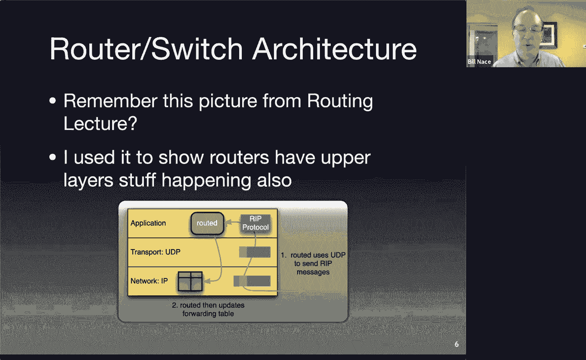

I could redraw the stack slightly differently from the perspective of the router itself。

I can say that we have an application like route D。

Which is running on on an operating system yeah remember the routers are basically big computers。

 they're specialized computers， they do things very in very special ways。

 but they run their own operating system。And Cisco or Juniper or whatever company is responsible for creating this operating system and building it in a way that all of the applications can run on that hardware。

And by the way， when I say application here， I mean the things that a router needs to do。

 routing is a big one of them， okay but you may have other things you want to have happen on there and those all become applications。

 so for instance we talk about network monitoring。You'd have an application that would respond to SMTP requests to be able to pull information from the actual router and send them back somewhere right that would be an application running here and so you have many of those。

Based upon how you want to control the router， what you want the router to be able to do。

Basically any RFC protocol that has to be implemented would get implemented as an application。

Those applications run on the operating system， as I mentioned。

 the operating system of course is running on hardware， there are CPUs in the router。

 but more importantly for what we're talking about here is the interface to the actual forwarding table。

 the actual hardware that is going on to do a lot of the lookup portion of that longest prefix matching rule。

And this all this stuff is not open I'm not there's no way that I could， for instance。

 decide that I'd like to change how the operating system works and you know let me let me just load up Linux on this thing right you can't do that。

It is very tightly tied to the particular hardware that is running there and you have no access to any of it。

Cisco is not going to let you have access either。Okay or any big company。

 they're not going to just say oh sure， go ahead and load up whatever operating system you want。

 oh you like my competitor's operating system better sure run it on our hardware that's not ever going to happen。

系い。That's their value proposition is being able to get these applications running on that hardware。

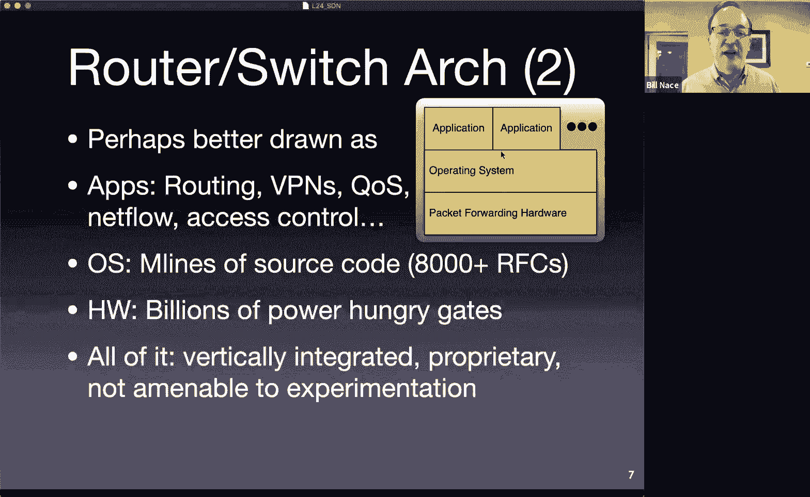

All right， so let's step back a second and think about the functions we're looking at。

That are happening at the the network layer in the router。

 remember we split it into a control plane operations and data plane operations we basically said there is the routing stuff that has to happen。

 There's the routing algorithm， you know running OSPF。BGP， whatever。

 the actual computation of routes， that's the control plane stuff。

That's the complex machinery that's there to figure out how to which。

Roouts actually get propagated into the forwarding table。

And the forwarding table is the part of the data plane that， of course。

 is just the the process that happens when a packet shows up and we need to figure out which direction it goes that's the。

That's the forwarding piece。嗯。Stehanos is pointing out that there is an open operating system for routers。

 open WRT is out there， and I've messed around with it， it's great。

 put it on the router in your house you can do other cool stuff。嗯。

Recognize thats not that's something that's going to be able to be run on your $100 links this box in your your house。

 it's not something that you're going to be able to get running on a Cisco router that costs a quarter of a million dollars and is routing in the center of the internet。

Okay， and so yeah， you're'm I'm trying to think more of the big skill networks if I were doing research。

You know， on and trying to simulate the network with a bunch of little links as boxes I'd have the same scale problem that you know of small simulations as well。

 so yeah good idea。对呀。Okay， so what's SDN doing SDN， as you read in the paper。

 is trying to put a standardized。Interface between the control and the data planes in。

The routers and switches that make up the network with the idea that we could then use software to define how that data plane works。

And then if that's a standardized interface， you could change the software side of it without having to change the hardware to match up with it and that would allow you to write different software to allow you to add new features。

It would allow the kind of institutional research that the paper described to actually occur。The yes。

 and as Cardik is pointing out。I don't want to make it sound like Cisco has this closed business monopoly and doesn't do anything other than charge for big money right they they are a company that provides support and does a whole bunch of other things that you're not going to you know。

嗯。The reason people pay a quarter of a million dollars for Cisco router is oftentimes more than just the actual hardware they're buying。

 and Carik's pointing out that there's a lot of official support for Cisco' is really fantastic about chasing down any possible protocol that anybody would ever want to use on the network and implementing it and stuff like that。

Okay。So how does this work in SDM？re going to we're going to deliberately break apart this data plane in this control plane the data plane is going to remain proprietary and is going to remain kind of hardware focused。

It doesn't have to be， but we think of it as the hardware that does the forwarding。

So there's this thing called TcaM， Ternary content addressable memory that are actually hardware devices that commonly make up the expensive high speed routers。

These are the pieces that are doing this look up and match and addressable memory is one where you can provide some of the data and it will find the itll basically search through memory very quickly and find。

The rest of that row that matches that data， which sounds like exactly what we want with a prefix lookup。

It's  ternary content addressable memory because you want。To be looking up。Rs that match zero ones。

 as well as some don't cares at the end for the the prefix part。 you know。

 you only care that the first 21 bits of a of a prefix match that sort of thing。 So you have this。

Very specialized memory in many high speed routers。

And that's because these guys are in the center of the network and they need to be going full blast right they need to be running at high speed。

And that's because they have lots of wires coming in and each of those wire is going very fast has a very high bandwidth to it and that means that you need to be able to forward and manage the switching fabric。

That will handle any of the packets or frames coming in on any of the inputs， doing these lookups。

 getting them passed out to an output really quickly。

SDN abstracts all that SDN says we don't care too much about exactly how it works What we want is we want something that acts like a flow table that that does this forwarding thing。

But maybe on a few extra fields， right the forwarding。

We've done so far on routers and switches has been to look up an IP address。

We kind of like to extend that a little bit， we'd like to make it into looking up some data about the flow。

 not just。An individual packet Okay， so remember our discussion about net flow way back when we said a flow basically a bunch of pieces in the header and if they match between a couple of packets。

Or frames， then we're going to say those packets or frames all belong to the same flow。

We'd like to abstract that idea into the data plane。

The control plane then is going to be able to direct the data plane。

And fill in the values that are in the flow that will basically say this。

 these particular values for I。Address those values define a flow and we're going to choose an action to happen if a particular packet or frame comes in and matches those values and thus we believe it is part of this flow。

Then we want to。To specify what happens to that packet， that's the action part Okay。

 and the action can be a couple things you could specify。Oh。

 that packet just needs to be forwarded out on a particular wire that's the basic regular thing that a router does or switch right it takes a packet or frame coming in。

 looks at the address and says， oh， this should go you know this should be forwarded out a particular output。

So that action makes perfect sense， that's pretty normal。

Another action that the control plane might want to be able to do is to be able to say。

Send that packet over to a controller。Okay don't forward it down wire 17。

 but instead encapsulate it in a message and send that message off to a controller basically saying。

 hey， look， here's a packet that matches that row。This is typically something you would do for the first packet of a flow the first time you see a packet come in with particular characteristics。

 you'd send it off to a controller where some software would be able to look at that packet and be able to make some decisions。

And do something with it， or as you saw in the paper。

 that was the way you would do experimental processing。

If you saw a packet that had a characteristics was tagged as。

 this is part of Bill Nace's research traffic， then you send it off to the controller and the controller runs some software to figure out what to do with it runs Bill Nce's new algorithm on that to figure out what to do。

Other actions you could do， you could rewrite the header you could put in rules that basically say。

We want that packet to get sent out on a different interface。

 but we want it to be sent out with different values right we want it to be sent out with a different IP address and different port numbers or things like that and that sounds a lot like network address translation and that's exactly why you would have it here。

You could also say， oh， let's go ahead and drop that packet。

Maybe this is a defense mechanism against something that we have previously determined to be malicious flows。

So oh， that is part of a Ddos attack。That packet should not get forwarded anymore。

 please just immediately drop it。And we haven't seen this before。

 our routers have never been actively throwing away packets。

 they've always done it because they've run out of space。As a last resort。

 this is actually much more proactive， this is saying， oh， we'd like to kill this right away。

I guess red is an example of a little bit proactive dropping of packets。

 but here you could actually say anything that matches this flow， just drop it。

Final action that you could specify is you could specify that you don't want to do anything strange and wonderful to this packet you just want to do what normally would have happened before the SDN days that's the legacy forwarding pipeline right that's just you know do whatever do the old thing on that packet and that's there。

To make people more comfortable with the idea of SDN that lets you slowly move SDN into an organization so that you still have the you can you can put SDN routers。

And switches。On a not actually throw switch to make them do SDN， you can say it's okay。

 we're just putting this here and we're going to experiment on some of them we're going to use them maybe only for experimental processing right and everything else will be handled exactly as it used to be in the old legacy way。

So the idea is you're going to have this flow table。

That's going to have fields that will match things up and then the control plane will have specified an action for that particular flow。

And these are some of the example actions that would。

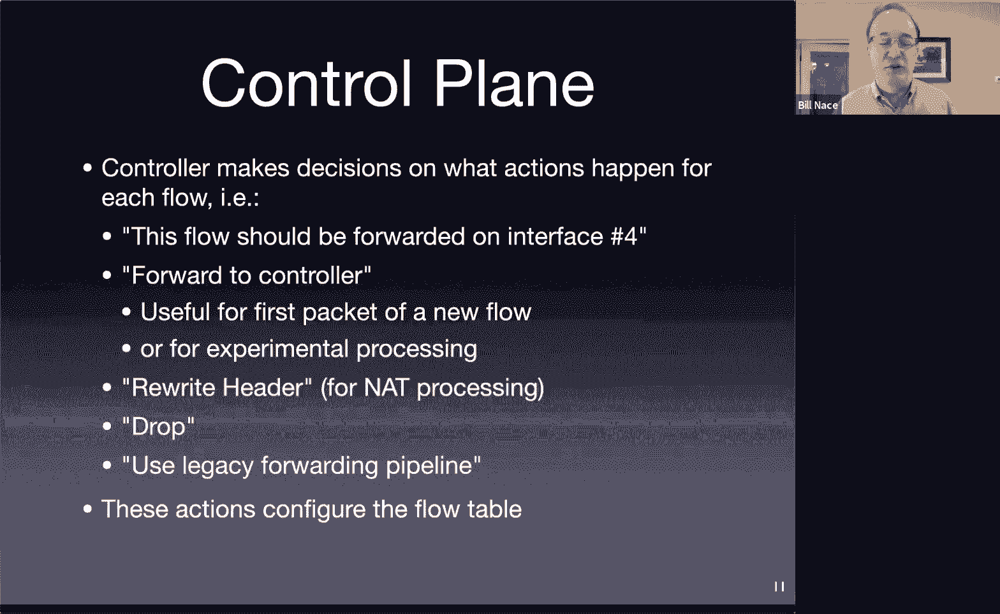

Would take place does it make sense？So my vision， the way I think of this is I now have a router or switch。

 I'm showing it as a router here。It's a box。And inside it， I have these two pieces。

 these two components have been pulled apart。One of them is the data plane and the data plane is actually controlling the connections。

 that's where the packets come in on particular wires and go out on particular other wires。

And then the controller sends commands， it's controlling。

 it controls the data plane by sending commands that basically say things like， you know， oh。

 if the IPH matches this。And the TC port matches that， then send it out on a particular interface。

That sounds exactly like forwarding。That's what routers do pre SDN。

Except for this TCP port number thing。Right routers up until this point have only been looking at the destination IP address and matching that up to figure out what prefix it goes with。

Now， because we're dealing with flows and not just packets。

We're looking at more information and trying to match up more stuff across these packets。

 and so we will look into things that are higher layer pieces of data that are encapsulated in the IP packet to make these decisions to find out whether they're part of a certain flow or not。

Right I'd send you here's another command， if this is going to that's Google's public IP address and the port is DNS。

 then we know that happens to be outwire7。Go ahead and forward it there。

And maybe we want to say anything else。Any other packet you see that is not already in your forwarding table。

Please send it to the controller and the controller then could run some software。

To decide what should happen to it。And。Implement the right things in the data plane to make that happen。

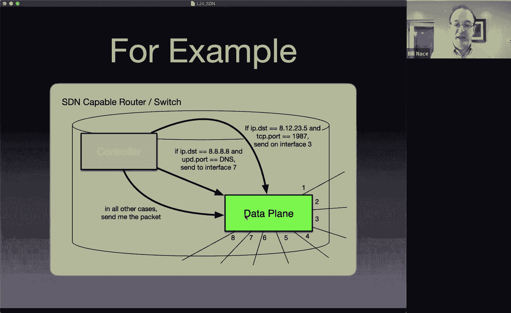

So here's another way of thinking about it a little bit more detail， maybe on the data plane right。

 the controller is still this component that is。Fillling out the data plane。

 the data planes flow table， and this is an example。

It's a little bit more complicated than this there usually is a multilevel flow table structure。

 but we can think about it as just a simple single table that allows for wildcard and the idea is I'd have this table with columns for lots of things like what interface did something come in on what wired to come into the router on。

Is there a VLAN identifier， is there a source and destination address for IP what's the protocol upper layer protocol going to be is it UDP or TCP？

If it is UDP or TCP， can I look at the ports and figure out what to do with those。

 these are all the values that I'm going to look at on multiple packets coming into my router to decide whether they belong to the same flow or not。

And if they have these matches， so if they all have have come in on this wire。

 have this source address， this data destination address， et cetera。

 and by the way the asterisk here is a wild card， meaning I don't care not looking at VLN IDs。

If all that matches， then send this out on。On interface number three on wire number three， okay？

And also there often are some statistics columns let's keep track of how many packets came in and matched this particular row or how many bytes total were in the packets that match this row。

 so some statistical columns as well。And you can imagine this table generally would have many rows to it。

 not just the three that are here， I've specified a couple of them。Okay。

 and then at the bottom I have kind of the default， right？

If it hasn't matched anything already and anything else， go ahead and send it to the controller。

And the controller will take care of figuring this out。Okay。Sorry。

 I've been skipping the chat for a while， let me take a look back here what has been asked。

So Ali's asking whether SDN applications are going to。Become more prominent than traditional network。

And that's going to be a hard one to figure out how to answer because there are lots of boxes around that are just going to remain non SDN compliant things if you look at all the routers in the world that would include the router in my basement and there's no way that I'm going to be running any SDN things on that。

UmI mean or maybe I would because I'm crazy and and think and understand networks， but you know。

 most people wouldn't。I think SDN applications are being implemented in a lot of different situations where they are particularly targeted at making particular networks more performant we'll talk about a couple of examples of that coming up。

嗯。Abijiith says， hey， couldn't we just， I think you're saying we could simulate a big network if we just had a bunch of white box switches and that's true。

 but we would need lots of them。Right， you。The number of switches you would need to get a good scale factor would be way more than。

You we。Seeum you would need to be running a huge data center somewhere with nothing but switches in it to do this mimicking。

 so I think the scale wouldn't work out。嗯。Yeah， so Dion's wondering what happens to the packets in this situation where we send it to the controller。

We send the packet to the controller and the controller looks at it and says， oh。Hey。

 this IP address， I want it to travel through my network in this particular way。

And it will respond to that by filling stuff into these flow tables。

 we'll see this in more detail in a minute。So if we saw this new thing we say， oh。

 new route here and I need this particular flow table to respond to it by sending it out， you know。

 wire seven。Then we'd go ahead and put that into the flow table。In the particular data plane devices。

And then you take the original packet， you don't just want to throw that away。

 you then take that original packet and send it back to that device， that switch。

 who then will have some will know what to do with it so they'll have a new row in their table。Jake。

 yeah we're going to get to the we're going to get。

 I think next slide or two we'll get to breaking this controller out right now right now I'm showing it as if a router has these two devices in it。

These two components。🤧Okay。And in a minute we're going to we're going to。Make that not so true。

The third part I want to point out， there actually is a third component here we got to be careful of。

 I have the flow table， I have the controller that is calculating the values to go in that flow table。

The third component is the actual protocol。 Those two have to be able to talk to each other。

 And this is that open interface we want to have。 We want to have。

A protocol that anybody can can send values to this。This data plane component。

To fill in that table without necessarily having to know the details of exactly how this particular piece of hardware works。

😡，And so that SDN protocol that becomes that open interface that we talked about that lets a controller talk to a device。

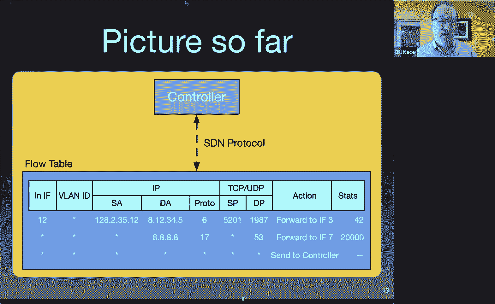

All right， so now I've got。So far， one router controller， data plane protocol between them。

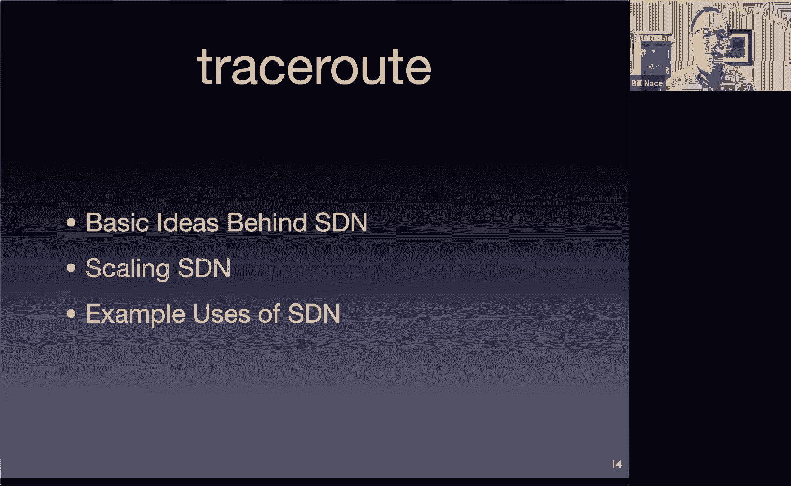

We'd like to go ahead then and and recognize that that SDN protocol allows us to move the controller somewhere else right I can now take that controller and put it in a different box。

And what I need to do then is I just need a way to get the message to the data plane device。

That will carry that protocol for me and yes I'd like it to be a secure channel because we don't want anybody able to just send SDN protocol messages to our devices。

 but we want now to be able to break out the controller and put it somewhere else from the actual switch。

Okay， does that makes sense。I haven't made nothing huge here， I've just said， oh。

 once I have a protocol between two components， it doesn't really matter too much where those components are as long as I have a way to carry those messages that are in that protocol。

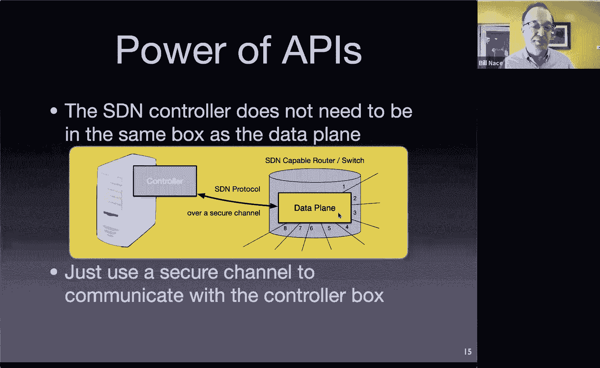

And once I can do this， then I can do this， this is really what we're going for right what I'd really like to have is a single controller that can control a lot of switches。

In my network。Okay， and and what that lets me do is now。Make calculations。

That are about all of the devices in my network so the idea is if I have this single place where the software is running to make these flow decisions。

 then when a new packet shows up if a packet comes into this router down here。

 this router is going to follow that send to controller action and send a message back to the domain controller and say hey。

 I just saw this new packet what do I do with it。That controller then can say， oh。

 we have some new traffic here from this IPHS going to that IPHS and looking at all the characteristics of that traffic of that particular packet and then be able to actually implement actions for that flow across my entire network。

So instead of just having a single switch make the decision of oh。

 which direction should this packet go， the domain controller could say， oh。

 I want it to flow in a particular way across my network and right now I can react to that by putting flow entries in all of those flow tables so that that packet will travel across the route。

 I want it to。

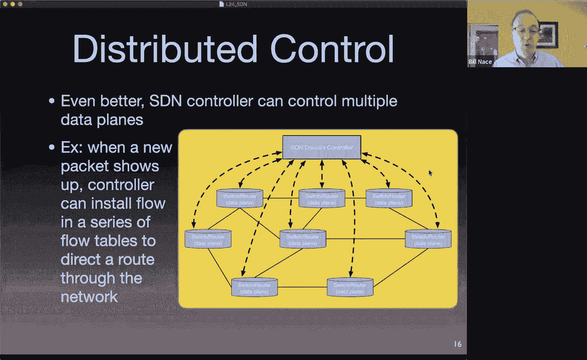

Okay。What we've done by this is we've taken something that is traditionally distributed control and we've made it centralized。

If you think about it。All of the routing algorithms are distributed algorithms。

 they're making these decisions about how packets should flow through a network。

 but they're doing it in a distributed fashion and it's great。

 it's fantastic that that has worked out， it's actually pretty amazing when you get something distributed to work out because it's a much harder problem to solve than a centralized problem。

The issue though， is that that has been really hard to deal with and hard to tweak and hard to manage。

And so if we instead have a central place that is making that decision and controlling all the pieces。

Now， we get to。Have kind of an overall network view when we make these decisions。

And and those decisions， of course can be made by software running in that domain controller This is what traffic engineers have wanted for decades right a traffic engineer somebody running the operation of a network will look at traffic flowing through it and say oh。

 I have a particular link over here that's not being used much and have a link over here that's being used too heavily。

 I would like to move some of that traffic from here to there。And that's the centralized view。

 the centralized vision of what we want to have happen。

 the problem has been a network engineer now has to find a way to tweak metrics on individual routers so that the routers when they run the routing algorithm will decide on their own that some of the traffic from here should run over there。

And so it's a very indirect way of getting the control the routers to do what you want it to do now with SDN you have a centralized control mechanism right you can actually say oh look there's too much traffic running here。

 let me install some of those flow table entries over here instead and just move the traffic。Okay。

 and we don't have to guess。If I if I change that metric， you know。

 if I change the local prep from 300 to 310， will that move enough traffic over there， you know。

 you don't have to you don't have to be。you don't you are controlling the thing you want to control。

 not first or second or third order operations away from it。Okay。And so this is what， you know。

 this is one of the reasons network control guys are like， yes SDN is great。

 we should we should definitely do this。Okay， let's see again in chat， I got away from this。Yes。

 you got you are right anytime something is centralized remember there are two issues there。

 you now have a central point of failure right and you have a central bottleneck performance bottleneck both of those are going to have to be dealt with oh and yeah Cartik sees the performance implications of that we'll get there hang on。

Sva is wondering how many switches can a controller talk to so it's going to be a performance issue it'll depend upon you know how beefy is the CPU in this particular controller and you know how。

You know， how many entities can it actually effectively manage is going to be a performance issue？嗯。

The controller switch connection， we'll get to that。

 it's a logical dotted lines here running over the fiscal real wires that are actually existing。嗯。

Yes， the analysis and has the other aspect that I said performance is going to depend on how beefy the CPU is here。

 it will also depend upon the topology of the network。

 how many flows you're actually trying to control at what granularity you're trying to control them。

 a bunch of other things like that。嗯。And Srieeder， the answer is carefully。

Controller and network will recover from a failure very carefully。Yeah。

 these are all good engineering questions about this idea that is as yet just an idea we have on some slides。

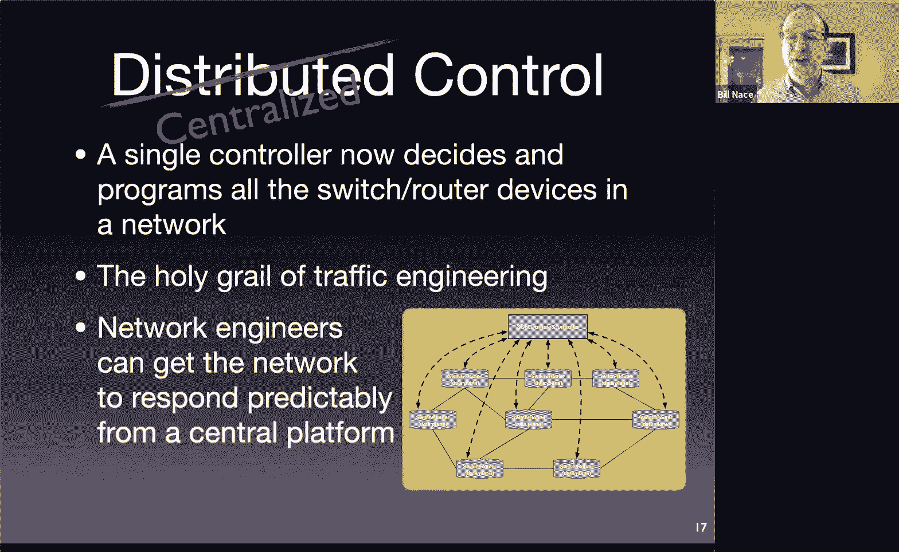

Okay， so one of them was asked about the logical physical connection。

 I do want to point out that the messages。We don't actually have dotted wires through the air for these messages to travel on the messages have to travel through the network as well okay that's one one of the interesting challenges you have here and it gets back we saw this with BGP right way back when we said hey these BGP messages how do we send how do we decide where they go oh they go places that are decided by the routing algorithms themselves right and we're doing the same thing right I have routing control messages that will be sent from switches and routers that have to have routing information in them to get them to the controller so obviously。

Getting a network off its feet is not just you know plugging in a bunch of switches and routers and flip and turning the power onto them right you do the network engineers and administrators have to manage that and make sure that。

The right default routes are configured into a device before it's as part of the bring up process to make that all work。

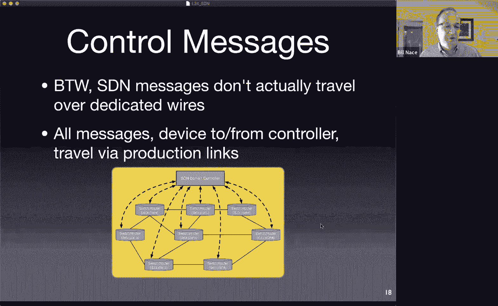

As far as performance is concerned， the answer to some of the questions here in terms of you know how many can we control and how big can it be。

 it turns out。If you have too big a network， you can go ahead and split dip your network into pieces。

 we call them domains， software defined find network domains。And a controller manages a domain。

And if your network is。Big enough and you need multiple domains。

 it turns out there is a way to get multiple domain controllers working and then they can pass information back and forth between each other。

This is also used the slide doesn't show it， but this is also used for backup mechanisms。

 so of course anytime you have aized device running you're worried about what happens if it goes down if it becomes the essential。

Point of failure that would be bad and so you would have a backup controller running as well and you would need to be able to pass information from controller to controller。

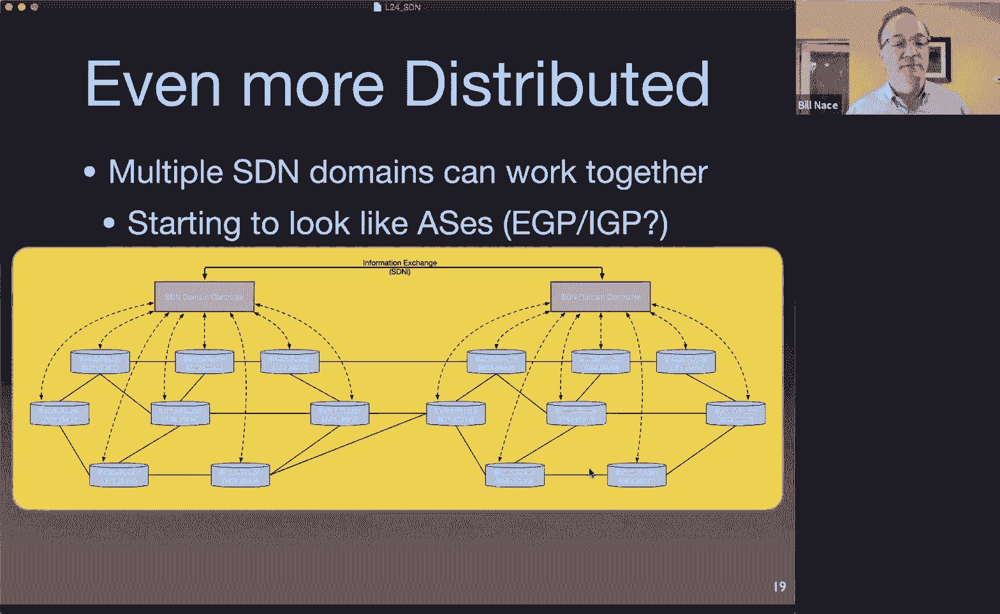

And so there is an information exchange mechanism it's called SDNI and it's a。

It's basically an interface between the domains that。Because it will also be a standard interface。

 the idea is you could run domain controllers from different companies that are actually running slightly differently。

 but they could exchange things。Like they can tell each other what their network topology is oh yeah my connection to you is over these three wires you should know about that you can send events so if you know something has happened or is going to happen。

 you can go ahead and communicate that to the domains around you。

Other things you might want as well like infrastructure status。嗯。

Banddth requirements for if you were running something that had a guaranteed bandwidth mechanism through there stuff like that。

All right， do we like SDN or hate it， well it has good things and it has bad things。

It certainly gives us this desire for。Flexibility to be able to experiment。

 to be able to do more than just run。The standard routing protocols。嗯。

And should I should add to this list it fulfills the desire for centralization also that that desire to be able to have one place making decisions about everything in theory the switches and routers then can be cheaper right because they're not worried about。

Making all these decisions， they become the pure forwarding device that all it does is you know take in packets。

 match them against the flow table， follow the right action。

I'm a little skeptical of that claim because you still have to provide the legacy action。

You still have to be able to do everything if the action is legacy。

 so it sounds to me like you've actually added another layer of cost on top of what had been there as a switch。

 so maybe it's not as cheap as it possibly could have could be if it were able to get rid of that legacy stuff。

I don't know。The cons。So there's there may be some increased latency。

 one of the things this network now。In terms of forwarding the network is now reactive instead of proactive。

 what do I mean by that？The network now， because it has this mechanism to send a packet back to the controller。

 when it sees a new packet come in， it doesn't know what to do with that right away。Whereas pre SDN。

 every router has to know what to do with a packet headed for any IP address。

That's already baked into the routing algorithm and the mechanisms to fulfill that forwarding table。

 so even if a router has never seen a packet in its life。

A non routing packet you know the routing algorithms would have populated the forwarding table completely so that it could handle any packet that shows up now with SDN when a packet shows up the router doesn't know what to do with it。

 it sends it off to a controller who runs some software and then puts the route through the network。

To handle that packet。That may be worth it right it may be great because now the packet is going to follow the optimized route through the entire network。

And respond to all the network engineering things that are going on。

But it will be an increased latency and if I was sending out a bunch of single packet flows that would probably be a bad thing。

We've talked a little bit about the controller being a single point of failure so you have to engineer around that you have to back up so you have to to be able to handle a failover scenario it is a single point of security break in right now it's you know pre SDN。

Getting things to taking full control of somebody's network would mean breaking into every router in the network。

 and now I just need to break into a single controller to make things go crazy。

With the actions given it's hard to see how you would do broadcast and multicast you'd have to。

To work out some of that。And there's also an interesting race condition you have to engineer around。

When you're installing a new route。That means you have a new packet that's shown up for a new flow presumably there are other packets right behind it also for that flow and there's going to be this latency of okay。

 I send this off to the controller right and it might be the first three or four or five packets of a particular flow all get sent off to the controller before the controller can get back and install a route on that into that data plane device。

But you also have the scenario where the controller now wants to talk to seven different routers across the network to be able to set up a particular path and it might not get all of them installed at the right time and so you may get。

Packets that get halfway through the network。And and a new direction just hasn't gotten to that particular router in time。

 and so managing that startup of putting a new flow into place can be kind of interesting from an engineering perspective。

Okay。Kyle asks， are control messages on the production network just because this is at scale？Yeah。

 so I guess。In these slides I showed you， I did say that was the way it's done。

 right that these dotted lines don't travel over special wires。 You， of course。

 could install a special。You know special links if you wanted to to make that happen routers have lots of open ports and depending upon the capabilities of your network you could design it so that those were individual wires now if you're doing something across country that。

For your network because you' you know big your Verizon or whatever。

 that's probably a lot of wires that don't make sense to lease just to be able to send SDN messages over them since you already have wires in your network that are available for those so。

Engineering choice as you build your network。嗯。Do I think Cisco routers at main internet hubs have SDN capabilities。

 this is an interesting question。The question behind your question is。

What do the big router companies think about SDN because it's almost explicitly aimed at their business？

Right and。They have turns out they have at least they seem like they're embracing it they have a public face that says oh yeah this is great we love to help the networks get better I don't know what's happening in the boardroom whether there are people grinding their teeth as they as they say that。

But they are seeing that their customers want this and so they're putting it into their routers。嗯。

Will is pointing out that the race condition I specified that I mentioned here。

He says oh it's not a big deal， that's why you've got TCP right if a packet gets dropped because of that race condition it'll be eventually retransmitted and that's true。

What I'm worried about is。You now have this controller。😡。

That is getting flooded with messages about this new flow。

And it it's getting those because the packet just hasn't or the flow hasn't been installed everywhere。

And so you get a lot more traffic back to the controller that I think isn't completely obvious from how the protocol should be working out and so yeah it's going to work itself out and hopefully you don't drop any packets。

嗯。What if you do TCP' handle it， hopefully。All right， some examples。

 why would you want to use SDN you saw in the paper。

This idea that we want to be able to do research on networks and it's tough to do。

Which is true now I think by the way SDti and guys were brilliant to propose it this way they were basically saying hey。

 we just want something to help our job be a little bit easier right be able to do better research we're not actually trying to take down the router business as it stands or anything like that right they're saying hey we have a problem。

I'd like to be able to run an experiment on a real network。

 not on a stack of switches that I have in my lab。🤧嗯。And my university owns a network。

And I'd like to just be able to run my experimental traffic on that network。Alongside real traffic。

 that's really the benefit。 I'd like this to be。Something that is more real world and has more fidelity to it because there's real components and real devices and real delays。

 not just kind of numbers I made up as I simulated something。The problem is。

There's no way I can convince anybody who runs a real network to let my code run on their routers。

Because they envision that any bug I make。or any bug that my grad students don't program well or something like that is going to take down the all of the production traffic and all of a sudden they're going to have to explain to the university president that the reason nobody's got an email for three days is because they let Bill Nace's code run on their routers。

So they're not willing to take that risk and I don't blame them at all。So instead。

 let me build this system， let me have this system that will allow me to isolate my traffic from the production traffic。

And still have this fall through， we still have this legacy。Pipeline that will forward the data。

Just the way it normally would， and so we're basically saying if we have these devices here。

 we can separate out the experimental traffic because that will have its own port number or its own IP range or some characteristic about those flows that will specify that this is Bill Nay's traffic。

And so that will get separated out from all of the other campus traffic and then my algorithm will handle my traffic and not touch anybody else's traffic。

And so that would let me， for instance。Let me go ahead and come up with new routing algorithms。

Okay and and my controllers will all run my own algorithm to handle those right maybe I wanted to here's another example。

 maybe I want to build a peer to peer network algorithm that allows the controller itself to operate as a peer in the network and to be able to do content search and things like that Okay no reason I couldn't。

As an SDN application， that application would be getting packets from the flow that have been send to controller and then I can you know I can look up。

 I can look at that packet and say， oh yeah， this is a peer to peer message asking for this particular song。

 let me see who has it。All that's the sort of thing you could run with SDN。

 not just new routing algorithms。

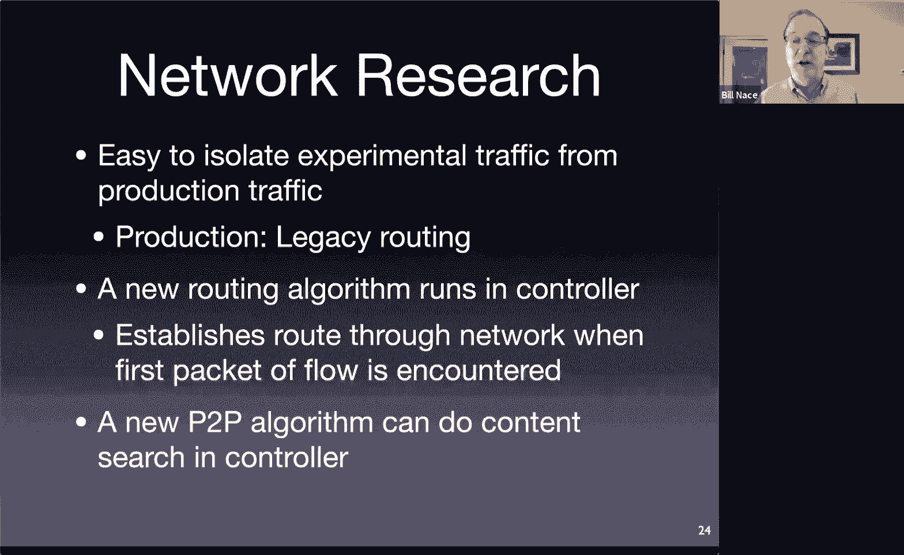

Here's a picture that I stole from the paper that shows that we want to run some experiment。

OkayAnd that that new experiment is going to be， you know， maybe very difficult to run。

 maybe there's it's very processing heavy。Okay and I can actually get it running off of the switch I can actually have something so net fPG is this another university research coalition project that was doing network research using field programmable Gatorways using customly。

Customizable hardware to run these algorithms。 And the idea is that you know。

 traffic that goes from one place to another the。The SDN switch could go ahead and send that traffic off to this specialized hardware that I have sitting in my lab that's running my whatever my algorithm is right intrusion detection or something。

Before it forwards stuff on， so this can become some intrusion detection device it's running very complicated machine learning algorithms to you know do yada yada。

 whatever， right？And I can make that happen but I can actually throw as much hardware as I want at it to make that actually operate as part of my research experiment。

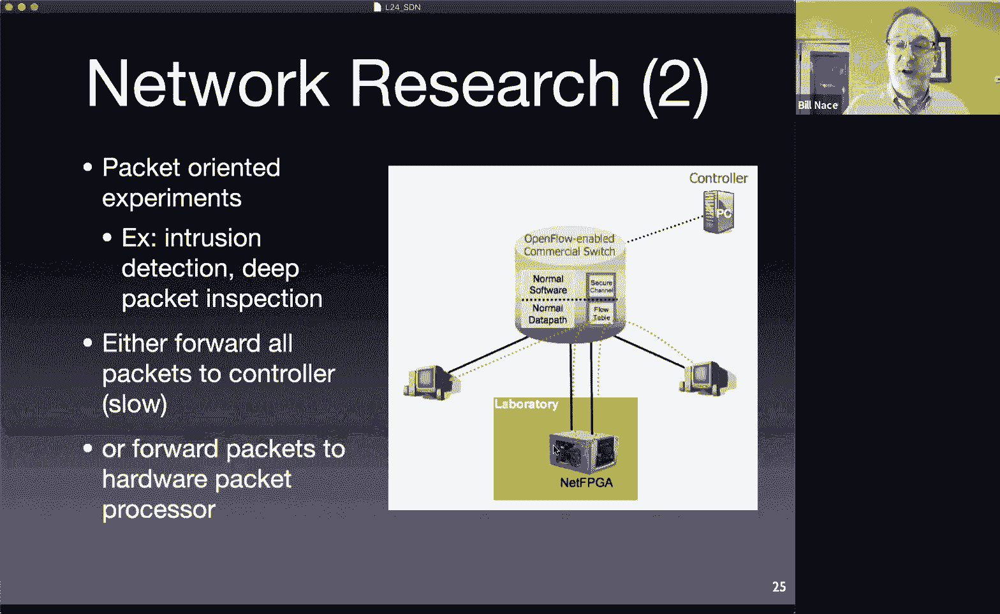

Other places it's shown up。嗯。These are kind of like the sales view of SDn right oh yeah the cellular industry would love it right cellular in 3G networks and beyond have now been iified right they actually run with internet protocol。

Using internet protocol devices。Those don't actually fit the cellular industry all that well。

 the cellular industry has made it work。But if。If it was natural to make it work on IP that's what they would have come up with the start。

 but they didn't， they had their own protocols and their own ideas and a lot of those were based upon mobility issues and based upon payment issues being able to actually track and build customers for all of their usage N IP isn't ideal for that but it's really hard to change so once the cellular network has IP routers in it。

They're kind of stuck if they want to add a new application on until SDN comes along right SDN lets me run my new application on the controller and so that would let me solve。

Some problem in the cellular industry to make that work out。ISSP should love SDN， right？

ISSPs have an interesting problem， and that is that there's a lot more traffic flowing。Through them。

 okay， the growth rate is I don't know，404050% maybe。

I've seen various numbers used for that there's a lot more traffic coming in year over year over year。

But our bills haven't gone up and I'm still paying， you know。

 100 bucks a month or whatever for my my network that I've been paying for a decade for two decades almost probably。

Right if traffic is really going up that much， you would think that my bill would go up that much。

 but it's not partially because the customers won't stand for it。

 we won't pay an extra 40% per year to that bill and so the networks have to find ways to make it cheaper per packet to flow through the network。

And one of the troubles is they're all using the same equipment。

 so there's no way for them to get extra value by providing me a special service that their customer their competitors can't provide。

Until SDN comes along， SDN lets them run the same routers as everybody else。

 but now they could offer me some new thing。Okay， which apparently is new streaming services because that's what everybody wants is to be paying $10 a month for 15 different streaming servers services。

 but you know， they could add whatever。Whatever feature thing they could sell to me now into that equipment because they can write an SDN application to make it happen。

Data centers are actually where this really took off， there's a really good paper from Google。

That showed up。I don't know， I want to say 2010， maybe 2011。

 not too long after the open flow paper you read。And it talks about how Google used SDN。

To make the connections between their data centers。

 they have a lot of these data centers that are have a bunch of traffic and actually this slide talks about using SDN in the data center which is another good opportunity a good place to make that happen the paper I'm describing was actually between data centers where traditionally over those long hauls they were only able to get about 30% of the bandwidth they were paying for out of those links and partially that's just because the way those links are designed and implemented but they were actually able to use SDN to do some very interesting traffic engineering work with nice descriptions of the traffic engineering algorithms in the paper and they were able to crank that up to a close to 100% utilization。

Without， you know， so they were paying for 100% but only using 30%。

 which is pretty typical apparently and now of a sudden by using SDN they are able to pay for 100% and use 100% and so in effect their bill went down by you know over a factor three。

And that paper is one of the things that really spurred SDN when people read that and said， oh。

 there's something to this SDN thing， you can actually make significant changes in your network。

Using SDN that will for instance， translate into real money saved that's when things really got。

Got exciting and people started taking it seriously， I think。

I'll post that paper on the website if you're interested in reading about it。Okay。

 a few minutes early， I'm making up for last lesson where I went a little bit long。

So basically we've talked about SDN and you should understand。You know， kind of these pieces。

 how it sort of works， definitely you should understand how a flow table operates and the idea of matching elements in a flow to an action and knowing what those actions are。

 understanding the idea of a controller where some software is going to be looking at this。

packack it that gets sent to it and be able to run software to make decisions that will allow it to control an entire network from a central point that's really the key to SDn is this this network wide view that we can get and maintain so that we can do interesting things through。

To the traffic through through our networks。嗯。Let's see if I caught up on chat， I have not。嗯。

Itmanci's asking about security。🤧。Yeah， so。There are a couple issues here with security I mentioned dropping a packet and that's a response to something you believe is malicious traffic but you're saying hey these devices these controllers now are places I have to protect if somebody were able to break into them they could really mess up things and that is completely true right if somebody can break into your controller they own the entire network right they get to put flow entries wherever they want。

 they get to do whatever they want to that traffic and so you know all of the Facebook logins packets could come you know not to Facebook but to your computer so you could record those values before you send them on or whatever right yes that's a bad thing and so。

Well， you know。That bad thing still existed pre SDN。Before SDN。

 the same thing happened if anybody broke into a router。

That's kind of the holy grail of many security flaws is if I could get into a router。

 I could do stuff and so the routers are fairly well protected。嗯。And so I'd like to think the。

The controllers are fairly well protected as well I don't know i'm not a security guy I know many of you are or will be security guys and gals so that would be an interesting thing to look into is is。

How easy that is to do。嗯。Is production traffic may affect the performance？Oh， so。Ming you。

 you're right。Production traffic may affect the performance of an experimental traffic that's running on the same because you're using the same wires。

But that's kind of the point if I'm running research I'd very much like my network traffic to be affected by the production traffic in the same way that it would be if it were deployed so that that affects my research maybe that's what I'm trying to measure right or maybe I just want to make sure that my algorithm would work at scale and so that's one of the reasons that we want to be able to run it on an SDN network。

 which is a real network with real traffic as opposed to a bunch of simulators back in our lab somewhere but yes it will affect it。

😡，Emmet's asking about SDN and MPLS。And that's an interesting combination。

Let me think about that mLs is putting a label。On each frame。And that frame is then being used。

By the MPLs。Switch routers to move that frame through the network。

So what if those MPLS switch routers also had an SDN component to it？

I'm going to guess it could be made to work and that you'd want to have the label now as a value in the flow table。

That the but I don't know if it actually is so open flow defines what the structure of the flow tables can be and defines the values that can go and be held and be matched against and I don't know whether mS labels are one of them or not so that's a really interesting question and。

I'd have to look into that。Luke， I don't know whether CMU allows has SDN on the production network。

 another really good question I'm sure part of that because I don't run a research group if I had a research group doing some network stuff and so somebody like Peter Steen Kisty or young Kim may know more about that。

 but it feels like it certainly should be possible and I'd like to think，CMU。

 since we do so much good network research， probably is involved in it， but I don't know for sure。嗯。

Deanion， you're right， I'm not sure what you'd get out of MPLs and Open flow。

But it does kind of feel like you would so there are situations， for instance， where you're。

You want to introduce SDN into a network， but you want to do it router by router and not try to replace the entire network at once and so you will have situations where you need to have these guys。

you know cooperate in routing traffic around and that's the scenario where i'm guessing it might make sense to have MPLS as part of that I don't know for sure I have read an interesting paper about like how many SDN capable routers you need as a fraction of your entire router network to do interesting stuff and it turns out you do not need 100% right you can do a cool control of your network with like 10% with the routers actually SDN capable if they're set in the right place。

So yeah。All right， I think I have finally caught up on the chat。Which means we're done。

 it means we have been through an entire course， an entire semester of learning about computer networks you now have。

A foundational understanding of networks， you know where to start in your other interesting learning about computer networks because of course we're nowhere near able to offer a comprehensive course on networks i'm not even sure what that would mean in terms of comprehensive it's a really big interesting field doing a lot of really big interesting work and continuing to grow in really big interesting ways but now hopefully you have the tools to help you understand how networks operate and be able to communicate about them understanding things like the importance of the layered architecture as well as many of the fundamental protocols about how everything operates which is fantastic that's what the whole course was about and I hope you have found some value in this as well。

It's always enjoyable for me to teach this material。

 I hope it's enjoyable for you to learn it it certainly has been great having you in class I wish I'd had more chance to you get to know you who face to face certainly I'm around if you ever ever want to talk to me at anything in the future。

 you know you're my students， you're my students forever。

 you know come come back and tell me something interesting you've done 10 years after you graduate I love to see you again。

Okay， it's been fantastic knowing you all。Good luck on the final we'll see you on Tuesday for that study well if you need anything in terms of you know。

 you don't understand some material or。Or have some questions。

 please post them on piazza or hit me or when the Ts up at office hours。

 we will have office hours extending up until through the weekend。

And go to the review session this weekend as well， okay？Goodbye everybody。

 I now need to declare that this has been 14740。Thank you all。

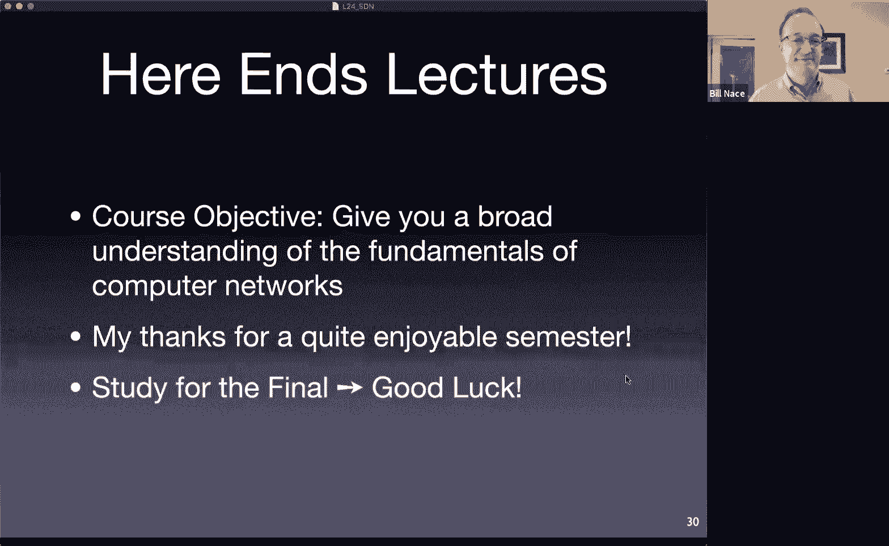

Bye， bye， thanks everybody。