# 卡耐基梅隆大学 14-740 计算机网络 Fundamentals of Computer Networks（Fall 2020） - P2：Lecture 2 Architecture - ___main___ - BV1wT4y1A7cd

All right。Ma'am go on， Okay， excellent。All right。So a couple things happen one is you've turned in your first paper review hopefully that means you read your first paper for the class and hopefully you enjoyed it it's a fairly decent read I think it's certainly kind of from the early days of computer networking papers and things can be a little bit more relaxed and also David Clark was basically anything he writes somebody's going to publish so that worked out well so hopefully you enjoyed it and you wrote a paper review and I'd like to talk a few minutes about paper reviews and the paper review process and what it might look like and things like that so。

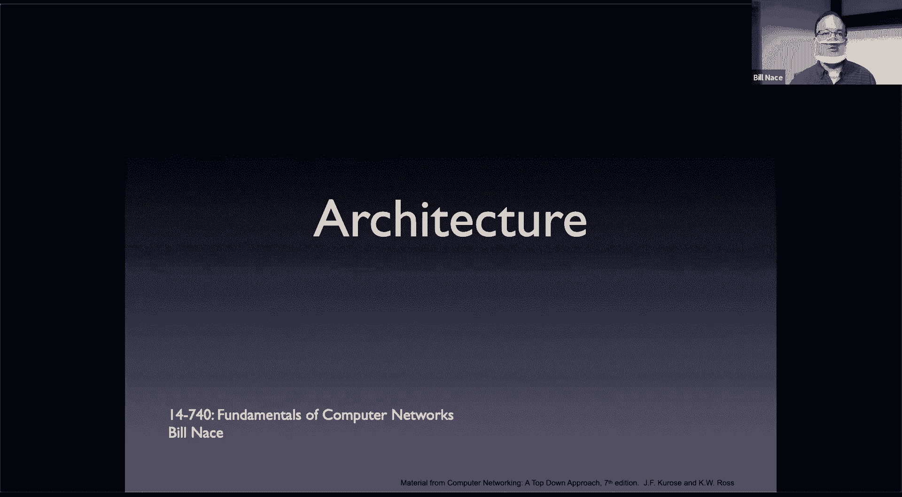

This is my paper review of this paper okay， and so a couple things I want to point out one is I've got a contribution statement that like I said to you guys。

 it starts off with the contribution of this paper right let's make it a bold statement。

 this is why this paper is important， this is why Professor Nace made you read the paper。

Okay that's you know this paper has that contribution。

 others don't you should be looking anytime you have to read a paper。

 you should be wondering that why am I reading this。

 what is the contribution of that paper and so I wrote it there I try to make that single sentence short and snappy you don't want to know go too long you want to be able to figure out whether you need to reread this paper or which paper this is if you're referring to this paper of you later。

My three important points， those are things you might not have written the same thing I did。

 that's not what I'm getting at， this is not a key that you have to somehow magically divine what I'm thinking in my head and write down the same thing as me。

Okay， instead， you need to find important points in the paper that you could reasonably defend defend as this really is important。

 right， There's a lot of things that are said in the paper。 You just have to make it look like。

You read the paper and that you found the important things instead of just kind of randomly picking a paragraph somewhere and describing what's in that paragraph。

 Okay， And then I have a couple of questions or comments。 I have。

 I have a question and a comment Okay， and the intention there is those are things that you could reasonably asking class right。

 You would not be embarrassed if you said， wait a minute， you know。

 military purposes why didn't I have， you know， have security more in it。

 a really good question about how the network was designed， especially from today's perspective。Okay。

 and so nobody would fault you for standing up the class and asking that question。诶都不见。

I also includebl enough bibliographic information that I could find this paper。

 or presumably if I'm writing my own paper that's going to cite this， I don't have to do any work。😔。

It's all here already I don't have to go figure out and where did that paper come from what did I do with it I want to point out this is a particular format for bibliography。

Okay this is the one I happen to use it's called BT。

 it integrates nicely if you're writing papers and lette。But it's not the only one out there。Okay。

 and you， I'm not forcing you to write it in bit tech。I'm making it easy for you though。

 because the bib tech is actually on the website。And so if you want to just take that and copy it into this into your paper review file。

 okay， that would be really easy。

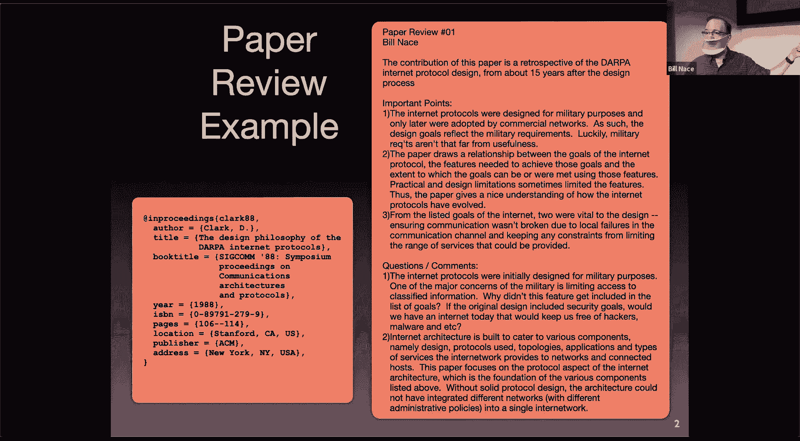

Let me talk a minute about the why we're doing paper reviews。Obviously。

 I have some papers that I think are important for you to read and the paper review。

 maybe it's a little bit of a blunt instrument， it's a way for me to get you to read them and even better get you to read them before class instead of like the night before the exam or something like that okay and also to include questions so maybe we could have a discussion you could ask that question so you're already ready to go for this paper。

I also want to bring this to mind and have you think about it。

 you are starting off your career as a grad student。😔，And who knows where that's going to go。

 I'm guessing that some of you will go on to PhD worthy careers and do great stuff。And it's worth。

 I think， thinking about how you want to handle papers。😡。

Okay so I have told you before I was a grad student here at Carnegie Mellon and I actually came in as a grad student。

 I showed up at the end of May， I showed up early and spent all summer working here。

 mostly reading papers getting right， which is what most grad students do a lot of and I spent the summer doing a bunch of that and I would read a paper and say。

 oh this is great， this was back before。We were able to get too many of them online。

 so many of them were papers that I'd copied out of the library or gotten the journal from the library and read it。

And after two or three of my said to myself。I should be taking notes on this stuff right it's not all going to stick in my head。

 and so I started taking notes on the sides of the paper。And then after a couple more， I said。

 you know， I should make these notes a little bit easier to find。

I should say more about what's going on in the paper。

 so I started stapling an index card to the top of the paper， okay， and I put my notes on that。

By the end of the summer， I'd read you know， a good six inches worth of papers， probably。

 and I was ready to start working on my own first paper。And that's when I ran into trouble。

 because I found that when I was writing that paper。

I had to almost reread all those other papers to find， you know。

 I was like I know there was a paragraph about this somewhere and then I was the archaeologist who had to dig through that stack of paper to find it again。

😔，And I quickly learned that's a bad idea and so one of my less obvious purposes with the paper reviews is to have you think about how you want to operate with your knowledge。

 you're going to be reading papers to learn things。And some of that will stick in your head。

The stuff that doesn't and especially the stuff that you're going to need to cite later which needs to be precise you got to make sure you don't trust your head for which paper this clo came from or where did this idea first show up do not do that you need to have your citations precise and you're going want to look those up and so you need a process to make this happen so I think it's important that you think about how to store the knowledge you're getting some little go in your head but some of it needs to be in notes。

And how to search it， how do you find it later on？Okay。

 imagine you've been five years as a PhD student， maybe less。

 hopefully right you read a lot of papers and you're writing your thesis okay。

 you do not want to be in the situation of now looking at a three foot stack of paper。And saying。

 I know there was that experiment about X and the need to talk about it for a patient half in my thesis。

😔，Let me go find it somehow， you want to be able to easily find it so you should have a process for that。

And here's the process that I came up with that I worked well for me and I've used it since and it still works well for me。

😔，I'm not saying this should be your process。I'm just pointing it out as a process。

 the sort of things you should think about。Every paper I read， I make sure I get a PDF off。Okay。

 and that PDF goes into a folder in my home directory called Papers and I name it the last name of the first author and the year and yes。

 you'll notice with like some of my papers I have a Y2k problem I should be using four digits and it's okay。

 I doubt that I will be around writing papers when that becomes a problem。I then write a review， yes。

 I do the same thing that you did last night when reading Clark 88。

 I do the same thing for the papers I read and I put the review in a subdirecty of that papers folderer called reviews right。

And every review actually shows up as a bibT file。Okay， so I name my reviews the same paper name。

 so Clark88。 divivt。And in that file， I have the bibT citation okay。

 and so these files can be read by Lite when I'm creating my paper and it'll do the bibliographies for me and I don't have to worry about does that thing get underlined or italicized or all that stuff？

I go ahead I write a contribution statement， this paper is important because。

I do specify some important points。This is my notes。 This is the stuff I got when I read the paper。

I try to grab the abstract。Okay， usually I'm not going to retype it， especially these days。

 I can just copy， paste the abstract and put it in there。Okay。

 and then I say why I read this paper in 14740 because F A4 me right thats you know， that's the why。

Then that sits in a file， and this file is easily searchable， right This is text stuff。

If I remember years from now， oh yeah， I was in that advanced operating systems class and there was this great paper and I don't remember which one it is。

 I can do word search right and find advanced operating systems class。

 which probably would be the end of this saying I read this because I was in the advanced operating systems class。

Okay I can also look for you of all the papers on software defined networking because somewhere in that contribution statement。

 the important points are the abstract， I'm going to have the key letters of software defined networking。

So this becomes a way to help me find the knowledge。😡，That I've already stored somewhere。

This is the key， and I hope this was true for you。 I hope this was not a lengthy exercise。

If it takes you an hour to read the paper and then an hour to make a paper review。

 you're never going to make the paper review。😡，Unless if you awake more disciplined than I。Okay。

 so this has got to be quick for me。It should take a couple minutes when I'm done。Okay。

 so that this is a quick process that I will actually follow and it turns out it's worked for me。

 I still follow it 20 years later。喂。Remember， I'm not saying you have to do all this stuff。

I'm saying you have to do some of it， you have to create a file that has some form of bibliographic citation that has a contribution statement that has some important points。

 that's what I'm saying you have to do。Okay， I'm asking you to do that in part。

 to kickstar your own process so that you can think about how do I want to store this knowledge。

 Maybe there's， you know， a note taking app that works really well for you。 Fastic。

 Put all your stuff in that note taking app。😊，And just put it somewhere。

Have a process that will work for you。Okay。Any questions about the paper review？All right。

Before we get to today， you may recall we didn't quite finish things up last lesson。😔。

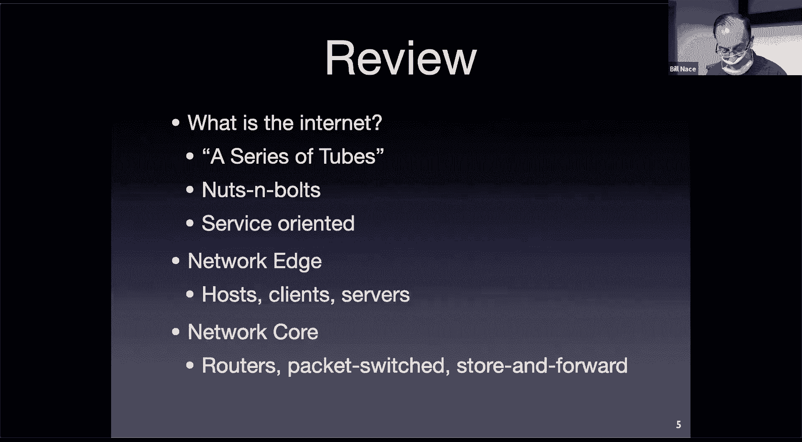

So let's go ahead and。Finish up， we had a couple more slides。To handle here。 And so。

On the wrong screen， of course。So we were talking about our networks。

And some broad ideas about networks。 And we have gotten to this idea of packet switch networks。

And we said that packet switch networks did not have any guarantees of bandwidth。

 so they did not use frequency division or time division multiplexing to split things up because they weren't able to guarantee that。

We you to see the slide on the Zoom meeting。Because I haven't shared him yet。Instead。

Packet switching uses a technique called statistical multiplexing， which basically means。

When stuff gets to a router， it sends them as it can。

And there's no guarantees of who gets exactly how much bandwidth。

 there are statistical guarantees that you can make about， well。

 on average you're going to have this much bandwidth assuming these things about the others who are competing for that same bandwidth。

Okay so you get the router sending the packets in some form。Usually as fairly as it can。

 we'll talk about some specifics there as the course goes on。Okay。

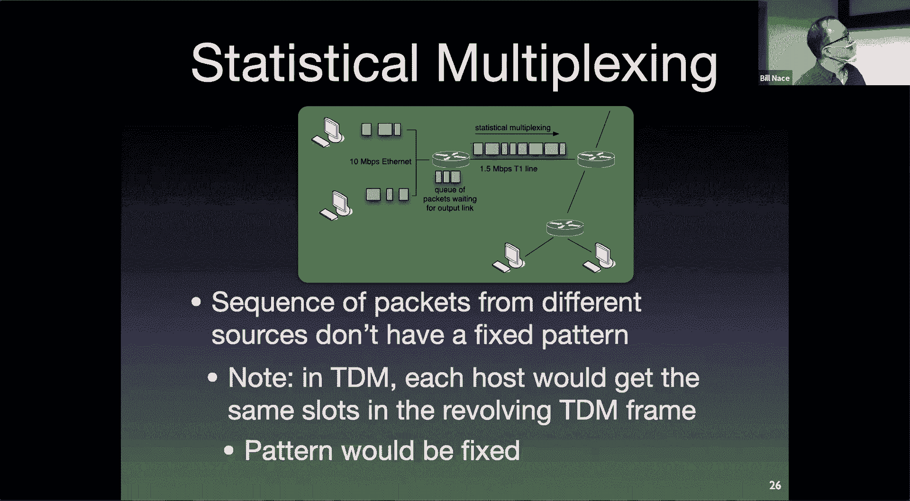

好去。Something else I mentioned about packet switch networks is that they are store and forward networks。

Okay， so when the packet is sent down a wire。When it is received at the router。

 the entire packet has to be received at the router。Okay。

 the router cannot take any action on that package until it gets the whole thing。

So until the packet has been stored at that router， the router then processes it。

 it looks for errors in it， for instance， which involves a little bit of math。

 it then may do other things one of the things it has to do is look up the address and figure out where it should go。

And so it then has to。Remember that our routers are not as simple as I've shown here right I'm showing a router with two wires on it probably have many more。

 so the many decisions about where that packet should go。

 it has to figure out which one should you know which direction is the quickest path to get this packet to its destination。

So it has to store the packet and do some work on it before it can forward it。So in this case。

 I'm going to be able to send that packet， which has L bits in it。Down a length。

 which has our bandwidth in L over R seconds。 But that's the amount of time it will take for the first half。

When the router stores it and then forwards it， it's going to take L over R again for that next top。

嗯。And so here's a numerical example to think about this。

 let's imagine once again I've chosen some numbers so that things will work out with minimal math。😔。

Let's say I have a 7。5 mega bit file remember all of our network transmissions are measured in bits per second。

 so let's just start with how many bits are in the file， not how many bytes。

Seven and half megabit file， and I want to send it from the left computer to the right computer。

 those are the end posts。At the edge of my network。

 I want to send it through those two routers that are the core of my network。

All the lengths are one and half megabits per second。I'm saying let's ignore a couple things。

 we'll talk more in a few minutes about what those things are that we're ignoring here。😔。

And let's just say we send this as a single packet， what's the math workout to be？Okay。

 so how long will it take for the end host to put the packet onto the wire。

 Ill take L over our amount of time right， what is L。没有。One of the two numbers， right。

7 and a half megabits。 right， What is R。1。5 megabits per second right cancel out some units and you end up with five seconds。

 it takes five seconds to put that packet onto the wire， okay。

Turns out there are three hops in my network so that that forwarding process has to happen three times。

Okay， so we will forward it to the first router， the first router will forward it to the second router。

 the second router will then forward it to the destination hostse total of 15 seconds。Makes sense。

Simple ma。 Yeah， except。This looks really bad。Okay。

 what do you think iss 7 and a half megabits a big file？No， it's a tiny file。 right。

 I'm sure you have pictures of your cat that are way bigger than that。Okay。

 so why should it take 15 seconds to get down this small network。And what's even worse？

What happens if there are four hops？Or five hops or six hops。对。

What's happening to my time as I add extra hop。申。seconds each one， right， L over R for each one。

Aren't we assuming that the whole file should basically go to one half should complete one half before it could be sent to the other half？

Well remember we have a store and forward network so that has to happen there's no way for me to send a packet such that the packet will start being transmitted down the second hop before his finish being received Yes。

 but this is a whole marked that factory cover around this then hu it doesn't have to be sent in a single packet。

Maybe this is what you're getting at， right。Let's imagine that instead I take myself and a half meggabit file and I break it up into chunks Okay I'm going to break it up into 5000 chunks。

 sounds like a lot。Again， make the math work out nicely。I'm gonna break it into 5000 packets。

Seven and a half megabits divided by 5，000 is 1500 bits each。

Whi is a reasonable size for packet we'll discover how long will it take now to forward one of those packets？

What have I done to the time to forward it。Still L over R。R is the same， but L is different now。

 right。So instead of L being seven and a half megabits， L is now 1，500 bits。

So I can send that whole thing in a millisecond。And that packet will act the same way it's got to go over three  hops。

So that's going to be a millisecond for each of those hops。 the network is still sting forward。Still。

 every router has to receive the entire packet before it sends it。Okay。

 but now the packages just smaller。So it's going to take three milliseconds for my first packet to get received at the end host。

Okay， I still have 4999 other packets to send， right？

The key here is what's going on with that second packet？哎。

That second packet is able to be transmitted before this first packet reaches the endpost。

As soon as the first packet gets to the router。The first router will start transmitting that first packet。

 but at the same time the end host can start transmitting the second packet。喂。

And so what we end up doing is overlapping some of our time。Okay， we can think about this as。

The first pack it's going to get to the end at 3 milliseconds。

The second packet's going to show up with the end post at the destination host。1 millisecond later。

 right。Because when it when this first packet gets received at the destination host。

 the second packet has just been received by that second router。

And so all we need to do is transmit another L over R1 millisecond to get that second packet received destination post。

 so it's going to show up at the fourth millisecond。

And the third packet is going to show up at the fifth millisecond。I have 4999 to go。

 so the whole file is going to take the amount of time for that first packet to get received three milliseconds and then the remaining 4999 packets are going to come in one millisecond each later。

And so if I do that math。5。002 seconds。Much， much better than 15 seconds， What't you say。

But it gets even better。What happens now if there are four hops instead there are three hops？😔。

What happens to that number if I add morehawks？one more millisecond。Okay， much better， right？

If I sense the whole thing as one packet， it was taking an extra five seconds per hop。

 now it's taking a millisecond per hop。OkayThis works out really well。

 this is why we break big stuff into little packets to send it because the store and forward nature of our network means we get this kind of improvement and that improvement keeps going as and lets us build a bigger and bigger network without slowing things down tremendously。

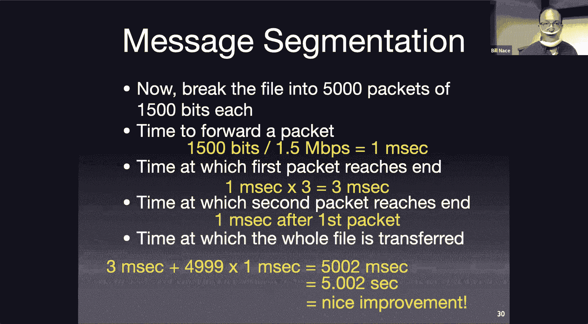

Fantastic idea。So packet switching versus circuit switching。

Circuit switching gives every user a guarantee of bandwidth， which sounds great。

Except from the network operator's perspective， it's not so great。

let's imagine I have a bunch of users here I have some number of users connected to a network。

 and they are all sharing the network bandwidth leaving that router。

That's just the way this has been built。 They've got to share it somehow。

 They can share it either by circuit switching or packet switching。

 If they share it by circuit switching， each of them is going to get a guarantee。Okay。

 so let's imagine they take 100 kilobits per second each。

That means I can support 10 users because I have one megabit per second on that link。

And everybody needs 100 kilobits per second， so I can support 10 users。

I can guarantee bandwidth to 10 users。But it turns out most of what we do does not require that bandwidth all the time。

 We do a lot of things that are very bursty。How often is your computer waiting for you to send an email？

Okay， versus actually sending emails。It takes you a lot longer to compose email than send it。

And so that。Guaranteed， yes， when I didn need been with。

 I want a guarantee I want my 100 kilobits for a second。

 but I'm not used all the time that means I'm going to be wasting a lot of that bandwidth。

And in circuit switching， there's nothing you can do about that because you've guaranteed it。

 you can't give that bandwidth to somebody else， you can't support an 11th user。😔。

Even though a lot of the time， none of those users is going to be using all of bandwidth。

Because you guaranteed it， it might happen that they all ask for their full bandwidth at the same time you have to be able to provide。

In fact it's switching， that's not true。And packet switching when one person is not using the bandwidth。

Since there's no guarantee， others can use it。 so you can actually support more users。

 And I'm going to ask you in。In your homework to be able to justify this answer。嗯。

Turns out if you do the math in this scenario， the chance that more than 10 users want to use the network。

Alright， so I why 10。 Well， because I can only support 10 actual transmitting at the same time。

It turns out that the probability for a number even as high as 40 users is really low。

If I have 40 users， each of which are only using the network 10% of the time。

The chance that I will overwhelm that network is less than 0。1%。Which is pretty good。Okay。

 and so that's the case for why packet switching as a win。Okay。嗯。Yes， it's a win。

 we do have to recognize that there are costs。😡，packet switching is great in this world for everybody。

😊，Isn't using a guaranteed amount of bandwidth all the time in other situations。

 maybe that would not be the case。There are other places where maybe it makes more sense to have a circuits which no。

The issue， though， the ugly part of packet switching is this congestion。

 It is possible right 01% of the time there will be 40 users who， I'm sorry。

 there will be 11 users who want to use the network at the same time。 and when that happens。

That bandwidth cannot be allocated to all of them at the same time and so somebodys can end up waiting。

 we call that congestion and that will lead to delay and packet loss。

 which we will examine in today's lecture in a few minutes。All right。

 this brings us to the end of yes， last times last lecture。

 I want to point out that I specify lesson objectives for each of your lectures。

And I placed them here in the slides。 I placed them on the website。

 and I placed them in a study guide for the quiz。 This is basically me telling you。

Here's a way to check， did you learn the things I wanting you to learn today？Okay， well。

 this is me telling you from this lecture， you should have learned how to think about the network in terms of nuts and bolts。

That model we had about what the pieces are， right。

 You should be able to describe what a protocol is and how it's used in the Internet and all these other words。

 Okay， You should be able to identify things that are in the edge and things that are in the core。

Okay， so I'm basically telling you here's what you would have learned。

This becomes especially important to you because this is what I'm going to ask you questions about for the quiz okay I'm literally telling you what is on the quiz when I sit down to write the quiz I will choose some of these less objectives and then I will write it like oh。

 I should ask the students to identify the network components that belong to the core in the edge。

Okay， how am I going to write that question， Well let's have a multiple choices question。

 chooseose the things that are in the core。解啊。So this is telling you what's going to be on the quiz。

 so。Useful information you might want to think about。Okay。Yeah。All right。

 let's get on to the next lecture。嗯。Thank you soon taking。Yeah。嗯算个。Yeah。嗯有。All right， we good。Ex。

Okay， so today a couple things to talk about one is I mentioned delay and loss that are caused by packet switch networks。

 I think it's fair that we spend some time looking at where the delays come from and what the losses are。

 and then I want to talk about the architecture of the network this is a big idea about how to coordinate how the pieces of a network go together and there's a particular model we will learn about as well。

So first off， delay and loss。What happens to our packets and why don't they end up at our destination instantaneously？

This process I showed you a picture very similar to this a few minutes ago where we had some end host sending packets and they hit some router。

And in the picture I showed you a minute ago， I said， you。

 some of those will end up having to sit in a queue and wait while others are being transmitted。

That was a little bit simplistic。Instead， I want to point out that there are basically four different things that go on in that router that will delay your packet that will take up time。

Okay so we need to figure out what's going on with each of those four operations at that router。

So the first one is， so I'm going to think about it in terms of as the packet gets to the router。

 what's the router got to do the first thing is the router is going to do some processing。

 it's going to take some CPU cycles， It's going to do some math， it's going to do some computation。

 Much of this is accelerated by hardware， but it still takes time to go ahead and look at that packet and process it。

And so there are two main things we're going to do here。

 there are other pieces that may or may not come in in terms of how you are managing your network。

 but specifically you always have to check for bit errors。You got to pack it in。Maybe along the way。

 you， some of those bits ran into， some other network noise。

 something going on and a bit got flipped。That would be bad。

 We don't want to be trusting the bits that are in our packet if they have been manipulated or。

Manipulated sound bad if they have been somehow changed by the environment or I guess by some external actor。

 right， So we want to look at this bit to make sure they're the same。

 So there's a little bit of math we do call it check some or a sick with redundancy check to make sure that the bits。

With high likelihood have not been modified at all。

The other thing we have to do is we have to look at the packet and figure out which of the many output wires。

😡，This particular packet' going to go down。Okay， remember our router has 96 wires out of it。

 I was I'm showing two on this slide right it's got to choose some particular place。

 so it's got to look at the packet and say， oh， this packet is going to South Dakota and South Dakota is out wire number 14 and so we'll put it in。

We'll specify this has got to go out on wire number 14。

So that's what's going on with this first step， the processing， like I said there maybe other things。

 maybe it's been set up to do deep packet inspection and you know the NSA is looking at them or things like that。

 whatever that would all come under CPU cycles that take up time in the route。

Second thing that's going to happen now that we know the packet is going to North Dakota。

There may be other packets that are going to North Dakota， I know， shopper， right？But。

If there are other packets going there， then this packet's going to have to wait。😡，Okay。

 so that means that there is some congestion at this router and we're going to have to put it in a queue。

So the router is going to have memory that it can allocate to each of the outbound wires。

And it will put the packet in that memory。To store them long enough for them to wait until it's their turn to be sent。

So we're going to end up with a queuee， some kind of buffer， some kind of line for the packets。

And after some amount of time， the packet will get to the front of that line。

That amount of time is this queuing delay。Okay， and so this may。

 maybe it's nothing because maybe nobody else wants to go to North Dakota or maybe it's a lot because all of a sudden everybody wants to go to North Dakota。

Third thing is。We then when the packety gets to the front of this queuee， we start transmitting it。

Well， it turns out。Take so while the transmit this by the way。

 is the L over R we've been talking about。😡，R is the bandwidth of the length that is a restraint。

Because of the technology of that link， so for instance， if this is an ethernet connection。

The ethernet standard says that it takes so long to form each bit。

And so when you were transmitting the packet。You have to create the correct waveform。😡。

And the circuitry that is in the Eent card will take a certain amount of time to create that bandwidth。

To be able to send a zero or a1。So that's the bandwidth， that's the R part。

That's a per bit amount of time and then there is the packet length we do that for， you know， hey。

 I've got 1500 bits。Therefore， it takes this amount of time to transmit。That， that signal。Okay。嗯。

That gets it out of this router。But now we've got to figure out how long it will take to get into the similar position where we started this analysis。

 and that would be such that the next router down。😔，Is able to start up。

And pick up with its own processing。Well， that means that our packet actually has to propagate。

 It has to travel down the wire。From one router to the other。Okay。

 this sounds a little bit like transmission。But it's not the transmission time。

 that transmission bandwidth is based on the specification of that technology。 this is ethernet。

 therefore it goes at this bandwidth。The propagation time is more dependent upon the length。

 the distance that we're traveling。 You can think of this。You know。

 I could have a short ethernet cable or a long ethernet cable。

And it would take different amount of time to get from one end of that table to the other。

 even though it's being sent at infinitenet speeds。So when you buy the new fancy。

 40 gigabit per second ethernet connector。It doesn't get it down the wire faster。

 it just puts the bits on the wire， they still have to travel down the wire Now they tend to travel fast。

😡，Okay so the speed at which you can propagate again it depends on the technology and what's going on with there。

 but usually you get you know things like some significant fraction of the speed of light and in fact some of our connectors are actually lasers going down by rocky cables and you're getting it's actually like traveling so it's pretty good so this is pretty fast but it's still takes a little bit of time and so the math here is basically you know your distance equals great times time how long is it going to take is dependent upon how far you have to travel。

 and divide that by the speed you're traveling and that will give you the amount of time that it will take to get down the water。

Proropagation delay different from transmission delay。

Now all four of those things then connect together。

 you add them together to figure out how long it will take to get your packet through each node through each router。

 you can call this the nodal delay and it's the sum of those four numbers that we've given you。Okay。

 it's the transmission， the processing delay。Usually this is not long。

 routers are fast computers and they have a lot of hardware support so that they actually do that processing really quickly。

A couple think seconds。The queuing delay can be the most significant feature here so depending upon you know if you're on the Apple campus and everybody's playing fortnite at the same time。

 you know that means all of the packets are going down the same wire there's going to be a lot of congestion that can take a while so that a while being milliseconds right but from a computer's perspective that's a long time。

The transmission delay， that's a technology based thing depends upon or using 10 megabit per second or 100 megabit per second Ethernet。

And so that's something that you can speed up by getting faster length。

And it's also something that means that the technology increases as we go through times。

 such that that number goes up pretty well， actually does better than Moore's law。

And then the propagation delay is effectively dependent upon how far you're sending the signal。Okay。

 what that that distance is， Yes， it depends on your propagation speed also。

 but those are all going to be。You know， a quarter to。9 C or so。

 so it's going to matter more if I'm sending that you know， to a low earth orbit satellite。

 for instance， that's a long distance versus across the room E。

For the queue delay that0 to a few mill a few millisecond depending on。helping the queue and the rot。

So the question is what is the factor that drives the queuing delay to be zero to some number of milliseconds and it is the amount of congestion in that queuee。

 this is how many packets are ahead of you。Okay， so if you show up and you know。

 there are 20 packets in front of you， it's going to take more time than if there's only two packets。

And it also will depend on the size of those packets and things like that follow so so that's the case like the router。

哦哦。I can't accept anymore。 Does that mean like the axone is unbound or？ToNext slide。

 I'm going to just having。You can， but then you increase the loss， that means we'll see them in fact。

Might as well head there。Sorry， everyone once's in the while my computer is flacky。嗯。

So let me jump to packet loss and we'll come back to that slide。

So the routers have a limited amount of memory。And so if that queue gets too big and holds too many packets in it。

 that's where we get lost。Basically， a packet shows up and there is no room in the end and you know no place to put it。

 the router has no choice but to throw it away。Okay， actually。

 it has no choice other than to throw some packet away。Okay， in most situations。

 it's going to be the one that just showed up and we'll talk more about that as well Okay， so yes。

 there is some limit。 Now in recent years， I should point out memorys gotten really cheap and so routers tend to have big memory and that causes another problem called buffer bat where packets just。

It would be better to drop a few and clean out the queue。

 but now there's enough memory to keep a lot of packets around and so you always have a long queue to go through。

It's a different situation， we won't talk about it much in this class， advanced networks says though。

All right， I skipped over this slide a minute ago。This is。

Another way of thinking about the queuing delay and what's going on with it。

So the idea is that the packets are arriving， they're coming in and we are servicing them。 They're。

 we're getting rid of them as fast as we can。TheAs fast as we can， though。

 is limited by that bandwidth。 That's the L over R problem。 How fast。

 how long does it take to transmit each of those。And so if I think about what's going on with。

The the packet's coming in and think about， well， let's make's I don't know exactly when a packet is going to show up。

But I can' measure long term averages， I can say that， oh， you know it it's Sunday night。

 everybody's watching Game of Thrones or something， and so there's going to be lots of packets。

I can make those kind of statements。 And so that's what this lambda number is。

 That's a long term average of the arrival rate。 How many packets are showing up。

We multiply that by the L over R。😡，Of how fast we can service these things。

To get a number we call traffic intensity。And I've roughly drawn this nice graph over there that you'll notice has very few units on it。

 This is a lot of hand waving。嗯。Delay is the Y axis and traffic intensity is X axis。

 And it's intended to tell you that。Bad things happen。

When that traffic intensity number gets too big。Okay so certainly if the traffic intensity gets greater than one。

 that means more packets are showing up than you are able to get rid of。

Okay this is not a good situation， you're actually being told to do more work than you're able to do。

And so there's nothing that could happen other than the work pile up and pile up and not get done。

So that's going to mean a really long delay for those packets。

Because many of them are never ever going to get service。So we' got to be less than one。

 but it turns out that we really want to be。Way less than one。Okay， because you might say， oh。

 we'll let you know， I might as well work as hard as I can， let me get packets coming in。

 we'll service them as fast as we can， so therefore I should be able to you know。

 Lambo El O bra should be close to one right， No， it turns out because this is an average and we'll talk about this more when we do killinging theory。

 it turns out that you get this asymptotic relationship。Such that you get a really big delay。

 even though mathematically you would think that you'd be able to keep up with it。

 but the random nature when they show up means you're going to get bursts and then never be able to recover from those bursts。

Okay， and so long delay。 And so you really do want your。Your。

Your capacity to do work to be well beyond the average amount of work。😡，Okay。Okay。

These are all theoretical ideass what if we wanted to know what's actually going on in our network could we measure it The network is a very。

 very dynamic place， especially over long chunks， many hops kind of distances big paths but we can take a look at what's going on we have a tool called tracer route but you'll be using a lot many of you probably have used it here before it is actually a tool that does measurements that lets you know on a hop by hop basis between your computer and some destination tells us you what the delays are how long does it actually take to get hop to hop to hop all the way to my destination。

And it does this fairly simple algorithm。Basically once to check how long does it take to get to the first router。

 how long the second， how long to the third， how long to the fourth？嗯。

And so what it's going to do is it's going to send some probe packets。😡，Okay， I'm saying three here。

 that's the default number。 You can tell it to send more。

 It's going to send these packets such that they are headed for the destination。

 but then we're going to。Ask the I router so we're going to say， okay。

 how long does it take to get five steps down this path， hey router number five。

 would you go ahead and send me back a notification that you got this packet？Okay。

 and I can time from the amount of time from when I sent the probe to when that router replied to me。

 and I can tell you how long that is。 so that's the amount of delay it would take in this particular instance to get to the fifth router and。

OkayRight， so good questions all。

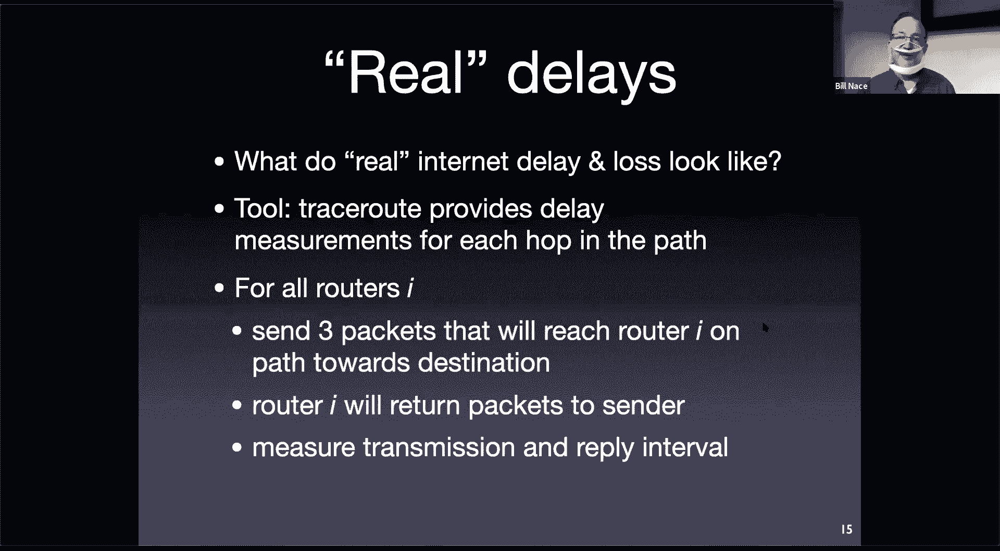

This， so。Remember the network is very dynamic， and so the thing you measure at one instant may not be true an instant later。

OkayAnd so things like your question about the route。

 we imagine that I send this probe to a router and it's going to reply to me and we imagine that therefore。

 you know probably half of that time is the amount time it takes to get there and half back。

 but I don't know that。I also don't know that the router didn't take a while before it replied to me。

But these are the sort of numbers we come up with and certainly as you go further and further through the network。

 you're going ascend to the second router in the third router。

 it gets more and more likely that the dynamic nature of the network means that it's possible that I sent a packet down one route and it returns through another。

It's also possible， by the way， that the packets going through that third router actually did not go through the second router。

Okay， so I'm showing it here on this slide is if they're all going down the same way。

 the network is very dynamic。So we only get average kind of。Field goody sort of numbers。

 they're not numbers that you can calculate to the ninth decimal place sort of numbers。

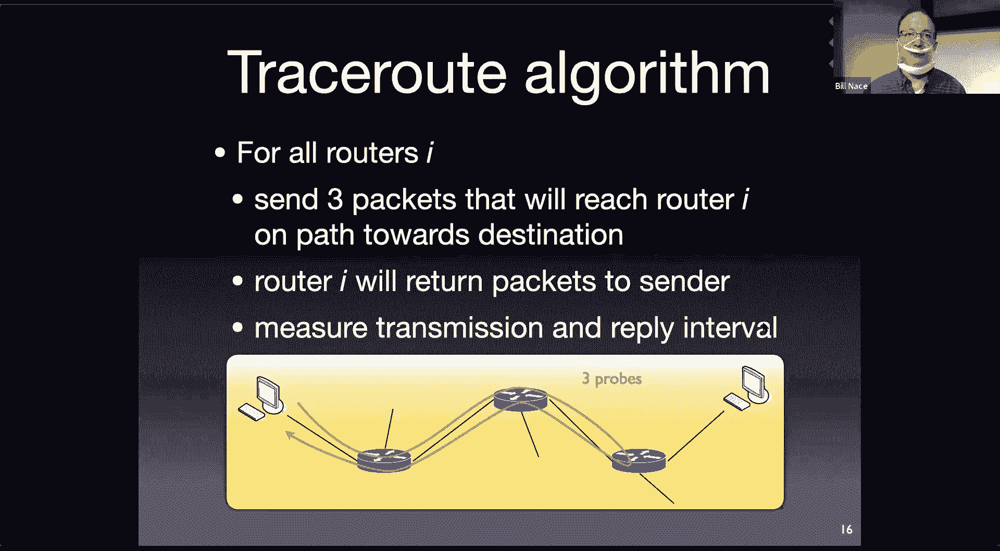

Here's an example， I ran this trace route from my office to a web server in Japan that was we used to have students in Japan in this course。

 and so this is a web server in Co Japan。And so I did that by typing trace route and then a destination。

 www。suj。jp。And it spits out this text， it says， okay。

 you wanted to do a trace route to that destination， here's the IP address。

We're going to cap it at 64 hops， so if it takes longer than that。

 we're going to give up and we're going to send out small packets。

 40 bytes at a time and then it goes and lists a whole bunch of different places。Okay。

 so you can immediately see it took 24 hops to get to Japan。

The first hop was to a destination called HH130 router。Okay。I have to look at that and guess。

 I'm going to look at that and say HH130 that probably means it's in Hamly Hall somewhere since my office is in the hammerly Hall that makes sense。

 it's some router， there's the IPH address。Okay， and then。We get some measurement numbers。

The first measurement number you should always ignore。

That's because it takes a while to like load the networking stack out of virtual memory into the cache and get things running properly on the computer and get kind of the setup working properly okay and so youll almost always see a really big number and then some smaller ones。

Okay，Because the second third time thing， you know， the skids were already greased。

 so it goes out and comes back。We're talking。382 microseconds doesn't sound like very long， right？

This is the total of those four numbers。Yes， someone a decently fast network。

ProThis also means that router probably is not busy， so I don't know when I ran this。

 but you know if this could have been some Sunday night when nobody else is in hammers like Hall or something like that。

We don't know our second third one， though， slightly shorter， 378 microseconds。

 I would say that's indistinguishable from the second measurement。Okay， do not look at that and say。

 oh， it goes faster。You know， five， five microseconds don't， you know。

 that's way beyond the precision of this measurement。Other stuff we notice， let's see。

 well the second one goes to some pod A in Wan Hall router somewhere probably the third one gives me these asterisks。

Okay， and those asterisk mean that we sent out a packet and did not get a response。

Usually this is because the router decided not to send anything。

We're relying on the goodness of those routers to actually reply to us and that one probably didn't。

 it could also be that my packet got lost。But especially if it happened three times on just one router。

 much more likely that somebody configure that router not to reply。And unfortunately。

 more and more cisadmins are doing that because they think that what we're doing is has security implications。

 they are wrong， but they still do it。If we keep looking at these。

 we'll notice that there's a point where we go from。You know， eight milliseconds to 67 milliseconds。

There at。The 12th to the 13th step。 What's going on there。 Well。

 if you look at the names of the routers， we can kind of figure out， right， The 12th one is。

 something that's numbers， numbers， something， something NBA  O2。

 that's probably North Virginia O2 in the US on this network， whereas the 13th one is something。

 something， something。LS and， probably Los Angeles。we are guessing based upon names of stuff。Okay。

 and we could if we wanted to hunt down more information about where those are。

 we may or may not be able to get it， but it looks to me like that's the transplantal link。

It goes to some router in Virginia。 and then there's a cross country single link。

Single fiber optic cable， single， you know， whatever， maybe it's a satellite link who knows。

 but that's the one that suddenly takes。From 8 milliseconds up to 67 milliseconds。

 so it about 60 milliseconds to get across the country。Okay， if we look a little bit further。

 we get another one of these cup hops later where we go from 67 milliseconds up to 177 milliseconds。

 another big jump and they hint。Is that we're now on line 15， probably in Osaka， Osaka， Japan。系。对。

This one is also fun， you'll see this occasional look at line 19， 19 lists or an IP address。

It says 187 milliseconds， 118 milliseconds， and then it lists another IP address。

And says 176 milliseconds， 172 milliseconds。What's going on there， for some reason。

 the 19th pop got a reply from a different router。Not sure why it could be that the 18thr or the 19th router just failed。

😡，so the network sent me to a different router。Remember also that what's going on with this algorithm。

 it could also be that the path veered at that point in time because we're doing these sequentially after I had established talking to the router in step 19。

 then all of a sudden router number five started sending things down a different path and I'm still just counting 19 hops and I just get to a different answer。

so it's not necessarily happening over there， it could be somewhere along the path as we do this。

 but that's how it shows that you got a different response from a different router。

And here we are finally after 24 hops， we're in Japan at our destination， 175 milliseconds。

To get from my computer in Hammerchai Hall to Japan。Okay。Kind of cool when you think about it。

It's a lot of hops， 24  hops to get there。that means at least 24 routers are working together to get my packet。

From here to there also means。The timing is so much bigger， three orders of magnitude。

This is one of the kind of cool things about networking is that it works well at small scale and at large scale。

There are a lot of systems， in fact， most engineered systems don't cover three orders of magnitude very well。

 right？Okay think about your car right you normally， well， I can drive it five miles an hour okay。

 but I can't also have the same car travel at 5000 miles per hour。😔。

so most systems won't do that our network is doing fine at three orders of magnitude dynamic range。

散le。Excuse me way， if you're going to be done much with trace route。

 I recommend some improvements MTR is pretty good。Because it the standard trace route does these sequentially and once or I guess three probes per。

router。 And then you're done。 MR continuously sends them out to all of the routers along the way。

 And so you end up with a。I don't know a better feel for the entire system as it's going。

 I also like the stats better， I've been told if you're on Windows there's a version called win MPR。

I dont know do you figure about that。Okay。🤧。All right， how。How did this network come about though？

We've got to network with three orders of magnitude dynamic range and these routers working and everything。

 the fact that we can get a packet from。The Japan is pretty amazing， it's a complex thing。

There's a lot of moving parts。Okay， a lot of them are the components。

 the nuts and bolts of my system。Right，There are a lot of routers out there。

 We're gonna to learn later on。 There are close to 800000 big steel routers in the in the world。

 not counting the little guys in your apartment。Okay， there are lots of protocols that are being run。

 people want to run all kinds of applications， somehow it still all works。Even more important。

 there are many different peoples who are part of the network。😡，Many players。

 we don't have one corporation or one government entity that is providing the network and doing it。

 however， it thinks the network should run。Instead。

 Carnegie Mellon has its own IT group that runs its own network and figures out how that should operate best for Carnegie Mellon itself as an organization。

And so if you think about it， that's astonishing that we have。Many different players。

All of whom still kind of get along well enough。To make this all work。How do you do that？

How do you organize a network， how do you put it all together we have to be careful when we think about this because we are sitting with hindsight seeing that there is a global network that works。

😔，David Clark， years ago， was not in such a good situation。He was trying to make a network。

But he knew and he knew there were all these complexities， he had to figure out how to。

 and how do we actually organize it， how do we put all the pieces together so that they will flow nicely。

How do you manage this network and。Construct it properly， that's an architectural question。

This is the architecture is how you put components together to solve some problem we think about the word in terms of building buildings。

 how do you put stairways and hallways and rooms and windows and roofs together to build a building。

We're doing the same thing with the network， how do we put routers and organizations and all those pieces together somehow with some protocol glue and a little you know many applications such that it all works that's the architectural question that we're going to examine today we're going to see the solution that that was proposed and it worked we have to be careful because sometimes we look at this and we say well this is obviously how you build a network。

But remember， we're doing that with the hindsight and the knowledge that this network can be built。

The architecture that was used。😡，Is a layered architecture so again， didn't have to be this way。

 it was decided that this would be the way though that they would try and it worked and it has worked beautifully ever since。

😡，A layered architecture is one particular way to arrange the components of your system。

When you're taking these pieces of the network and putting them together。

And I guess architecture also has to figure out what the pieces should be， what they are。

 a layered architecture takes these pieces and puts them in layers and stacks them one on top of the other。

And the key to。The layering is that each layer is going to be designed such。

That it provides a service to the layer above it。Okay， so that blue layer down at the bottom。

Provides some service， it provides blueness to the layer above it。😡，Okay so green。

 when it needs some blue， it can go to the layer below it and get some blue okay and then it will use that blue with whatever protocols it has to run or whatever computations it needs。

 it will use that blue to create the service that the layer above it needs。

But it doesn't give the blue to the layer bug。 It gives reading because it's a green layer。

And so its job is to provide whatever service it does to the layer of up。

And if these are constructed well， it will use the blue to make the green that the red needs。

And the red， of course， will use that green to do whatever it has to do。Okay。

 so if you designed them well， then they fit together nicely。

Each of the layers is going to run some protocols or something to。

Do to be able to come up with its its greenness， there will be a green protocol that somehow gets executed to make that green out of blue。

There's also a nice interface between them。 somehow you have to decide how exactly does green ask for more blueness？

Okay what's that interface like and so some of those are going to be here's an application programming interface。

 these are the actual function calls that you would make to get that service from the layer below and so in building a network in this way。

 you can't just say oh， we're going to use the layered architecture that's it。

You then have to define what pieces go in each layer。 What things should be in the blue。

 What responsibilities does green have。But blue doesn't。

And how is dream going to be able to fulfill those responsibilities based upon the things the services it can get from the layer below？

Now this layering works out pretty well， it is certainly you need some way of breaking up a big complex thing into smaller pieces this is。

 by the way， what engineers always do， right？We always take a big problem that's really going to be meaty and great and we're going to solve all the world's problems with it and what we do is we break it into chunks。

And we solve each of those chunks。 The question is， how do you break it into chunks。

 What chunks come out of it， That's the architectural question。

 So we got to have something that's not monolithic。

 We have to have some way of understanding the components easily。

 We got to make sure that the layers are constructed properly so that they fit together and so that they can have a protocol to do their job to be able to generate whatever service they need。

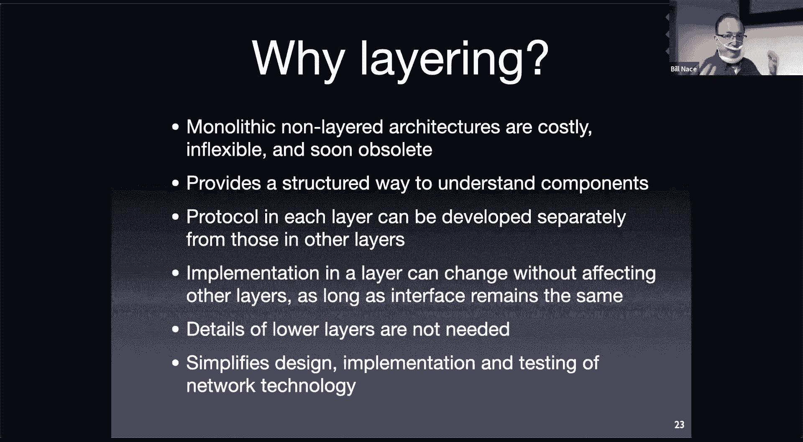

嗯。

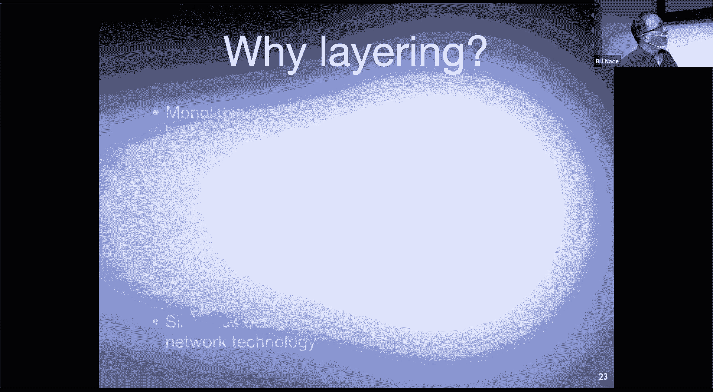

In general， what we've done is we've come up with some way to take a really complex job and break it up in week。

 sorry， I'm not taking credit for this right the founding fathers of the internet figured out a way to take the complex tasks that are there and break them up into manageable people pieces by using this layered network architecture。

Now there are some issues that people would say there are problems with， often you'll see people say。

 well， one of the problems with layered architecture is that you end up doing the same thing in each layer。

And in the network stack， they often cite reliability。Will'll say， you know。

 the link layer already does reliability and you know you're also getting reliability to the transport layer。

 and that's a duplication。I don't think that's a really good argument because the kinds of reliability you're getting are different at the different layers。

 we will talk about that when we get into those layers， but there may be。

 so depending on the layered architecture you use， if you don't do a good job of designing the architecture。

 you may have some duplication where everybody has to do the same kind of stuff as it goes。

U and up and enough。One other aspect that。That can be laid at the feet of a layered architecture is that sometimes you have information in some layer that you want and you can't get to it。

It may be that red needs something about blue and needs to know that。

Okay and this may be a problem with how you put the architecture together。 Maybe you should say。

 well， why does red need to know that， shouldn't red be able to get away without it。

 shouldn't it be designed to be abstracted away so it doesn't need that information。

 but maybe you do have situations and there actually is one in our network that is a。

I'll agree to that one， it would be nice if some information from the data link layer was available to the transport layer。

 but oh well。We'll talk about that one as well。All right。

 so that has been an argument that we should do。This layering architecture， that the network。

 if you're going to take this complex network and break it up， let's go ahead and do it in layers。

The next question is， okay， what's in each layer how that work and so we're going to look at a particular model of that。

 a particular layered architecture called the open systemss Interconnect model that was developed by the International Standard organization so sometimes called the ISO OSI model looks like they were really into palindromes。

It's interesting because that's a common model and one of the reasons I'm teaching it to you is that every network engineer knows it。

And so we use it to communicate， even though it never really got deployed。

And the reason it didn't get deployed， because this standards。Organization started in 1978。

That was when， at that point it had become obvious that different organizations。

 IBM had a networking mechanism and other companies had networking mechanisms。

 but they couldn't work together。And IBM didn't want anybody else to work together。

 they wanted you to get rid of that other companies's computers and buy IBM computers。

and so I sort of stepped in as oh well we can develop some standards to make this all work and so they started working on that and then TPIP got deployed and kind of took the whole world over and so this work。

Nobody ever built this。But we all use it to talk about networks and understand the networks。😔。

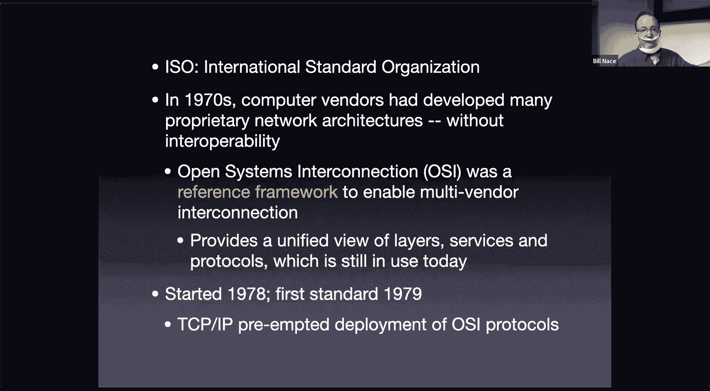

So here's the model that's sometimes called the seven layer cake because there's seven layers to this。

I'm showing you this picture where the stacks on the sides on the left and right those are end postss so I have some sender and some destination over there and in the middle I have a couple of routers。

 the routers don't need the top couple layers and so they're small length these lines here at the bottom would be physical connection so this is the actual wire or Wifi or whatever that connects and endpost to that first router。

And then inside the end hostst we have all these layers， we have physical data link network。

 all these layers that go together to make this work out。

And so what you end up doing is having the physical layer talk to the physical layer。 So you know。

 there are some signals that have to travel。 That layer has a protocol to talk to the other router to be able to communicate。

And then it provides that service to the layer above it。

 so beta link layer now can talk to the next router over by using the physical layer below it。

And this just keeps going up and up the stack until at the very top， you have your application。

All right I have my fortnite client who's talking to a fortnight server somewhere。Okay。

 using this whole staff， even though it doesn't have to worry about what's going on。

 it just needs to know that it can use the services of the layer below it to make that happen。

And it almost feels like there's some connection directly between those。

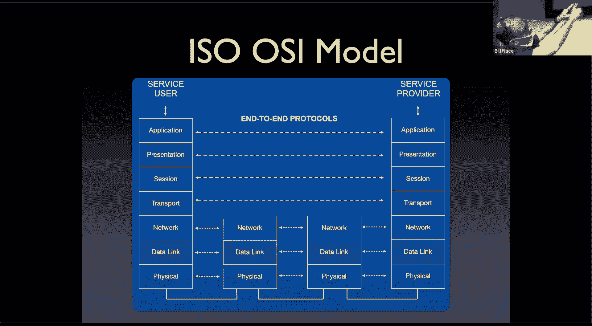

I'm going to start at the bottom and talk about each of these layers。😔。

Remember the course is actually going to go from top down。

 but for today I'm going to start at the bottom and build up these layers and just give us a little feel for what goes on in each layer So the first layer is the fiscal layer。

Its mission is to transfer bits from one end of a length to another so a couple things to notice here first off。

 every layer has a mission okay， and you should be able to say this is what this layer does okay what its job is so its job is to transfer bits。

From one end of a wire to the other end of a wire or whatever that link is。Second thing。

 every layer is going to have its own data type， its own thing that it's sending。

 so the fiscal layer worries about bits。And。There's a lot that goes on in the fiscal layer。

 the fiscal layer we're not going to talk about much in this class。

 but it's a very electrical engineering heavy layer and it's one of the reasons we don't talk about it's very different from the more computer engineering other layers of the network stack this is where we're worried about what the waveform is going to look like as it travels through the electromagnetic spectrum down a wire through a fiber optic cable across from antenna to antenna from radios。

How do we create that electromagnetic wave， how do we understand it when we get it at the receiving antenna and get it rid of all the noise that was there and things like that。

 so very much electrical computer communication engineering sort of topic。

And it's the standard is going to depend on lots of physical things because this is where you actually do some physical connection to something so we all kind you know what an internet cable looks like in that little jackie thing that plugs in that's part of the standard somebody had to sit down and say okay it's got to be you know this big and that big and this is how springy that spring clip that always breaks off is and things like that Okay so that's what's bound up in the physical way。

The layer above that， So the service the physical layer provides is transferring bits from one end of a wire to another end of the wire。

 The data link layer uses that service to provide its mission of transferring a frame。Notice again。

 a different piece of data， a different data type， it will transfer a frame across the direct connection between two computers。

So if the fiscal layer is worried about single bits。

 the data link layer is now worried about lots of bits， so here's 1500 bits in a frame。

Let's make sure to get it from Bill's computer to that wfi adapter on the wall， Okay。

 that's what the data link layer's job is。It's going to build the frame with some extra information in it to make it be able to do its job。

 stuff like addresses and error correction things， stuff like that。

 and then it will go ahead and transmit the frame。It may discover the frame got lost and retransmitted or things like that。

 there's much that can go on here。 It's not just taking the frame and asking the physical layer to send each of 1。

500 bits。It'll do that， but there is more stuff involved in getting the link started and things like that。

One of the significant things that the data link layer does。

That is kind of more protocolish than just sending bit by bit by bit is there has to be some way in shared data link environments。

Like Wifi here in this auditorium where I have lots of people competing with me to send frames to that access point on the wall。

 There has to be some way for the data link layer to figure out it's okay for me to send my frame or not。

Okay， am I going to step on a frame you're sending or not and what happens if I do we call this media access and there's a protocol built into the data link layer。

😔，That works that out and figures out how do we share this appropriate but how do we make sure that I can go ahead and send my frame and that I am assured that it actually got somewhere and so that I can go send the next one。

😔，And so， this protocol will go ahead and have some form to be able to。

 maybe we willll all take turns somehow。 my turn to send， I will go ahead and send my frame。

All right， the network layer then exists on top of the data link layer。

 The network layer's job is to get the packet。Da a datata type is called a packet。

 its job is to get that packet from any computer to any other computer。

This almost sounds like the datalink layer's job， right the data link layer's job was to get a frame。

From one computer to another computer， but those two computers had to be connected。

By the Wifi link or the Internetthernet cable。now we're saying the network can get a packet from any computer in the world to any other computer in the world。

OkayNow clearly it's going to use the data link layer services to do this。

 it's going to use the wfi to get the packet from my computer to the first top router。

 it's then going to use Ethernet to get from the first top router to the second hop router。

 it's then going to use fiber optic to get from the second top router to the third hop router etc ce。

 each of those is a different data link layer。The network layer is going to put those together and it's going to figure out these are the 28 routers we have to go through to get my packet from here to Japan。

That's the data link layers job。 I'm sorry。 That's the network layers job connecting my computer to any other computer in the world。

 This is by far the most complex layer。 This is the part that。

Has the most troubles because it's a distributed system problem。

 Every router in the world has to kind of agree。This is the path that package should take to get from Bill's computer to Japan。

Okay， so they they're going to have to communicate amongst each other to come up with that understanding。

 okay， really complex， really fascinating layer， a lot of cool stuff going on。

🤧The layer above that is called the transport layer， the transport layer job is to send segments。

From。Any end host to any other end host， and in the process。

 connect the applications running on those hosts。This again sounds kind of like the layer below right the network layer got packets from any computer to any other computer。

The transport layer is going to get a segment from any application。To any other application。

So obviously， it's going to use the network layer to get it from my computer to some computer in Japan。

😡，And then the transport layer here and in Japan will connect。

My Zoom application to a Zoom server or whatever， the actually applications run。ok。

You'll notice that the transport layer is not actually， it's using the network layer。

 it doesn't have to actually communicate router router router。

 and that's why we normally skip over the routers in the middle。Yes。

 the packets will go through those routers， but the transport layer doesn't really know about where the routers are and what's going along with them。

🤧The transport layer store we have these different services we talked about these last time。

 there is a reliable connection oriented service。There is a best effort delivery， connection。

 less service。And technically， there are other transport layer protocols as well。

 but we often think of just these two。Sure。Above the transport layer。

 there are a couple other layers in our model。 There's a session layer， and a presentation layer。

And it turns out both of those are better implemented in the actual application。

If you want some session to handle logins and things like that， you do that in your application。

 you don't have the network do that for you if you want your data to be presented in some way that it doesn't matter what machine you're running on。

 you use Unicode in your in your application instead。

 So those are things that are found into the applications and so we typically ignore them。

So those are two layers from the seven layer cake we don't use instead we just hop up the application and say oh。

 that's where we actually get our network service right， that's where I get my email。

Transmitted when my email client needs to talk to an email server。That's where those live。

 And they will use the transport layer to make that connection to send the message they want to send from one to the other。

 And so we're going to end up with this five layer cake。

That we're going to talk about for the rest of the semester。

 we're going to think about networks in this model。

Which is handy because pretty much every network engineer thinks about the networks in this model。

 and so that means you can talk to other people well and you can say， oh。

 this is a layer free device and they know what you're talking about because they know this model。

Okay so very important you understand that model as well。Any questions on that？

Here's your last objectives for today， I'd recommend again that you go through and take a look and make sure you actually can do all these things if you can't。

Ask me now， ask me on piyazza。Okay， come to office hours。 Let's figure it out， okay。Already then， oh。

 on So we。So the original reason about that this whole sort of like cake set got but was like implemented was to sort of reduce the amount of like periodability like in these sort of like low over players。

 And then I was like， would it be correct to think that this sort of like proprietarys that sort of got pushed up into the application there in this bottom there is not standard。

So I'm not sure I'd agree that it was to reduce variability unless I'm maybe don't understand what mean by variability。

 I think it was more of us。Implementation that's。Yeah， yeah。

 so I guess one of the advantages of having this model is you then can of having a layered architecture is that in theory you can pull out an implementation of a particular layer and insert another one okay and so for instance。

 we do that at the data layer and link all the time I had a wfi from here to there right I could also just run a cable from here to there and have ethernet between them and I've just swapped out that layer。

Okay， and so depending on where you are proprietaryily， you know。

 you can still sell ethernet equipment or token ring network equipment。

Be part of the data link layer as long as you can fulfill the protocols that are available。Okay。

Some of those layers， by the way， harder to pull up than others were having a real trouble pulling up the IPV4 version of the network layer and putting in IPV6。

 but we'll get there eventually maybe。The questions meanoo onooI apologize I I should have repeated that question。

 Sp Young was wondering kind of how the layers work in terms of the corporations that were involved and this idea that ISO was trying to standardize corporate behavior and how those did。

Good a。Sorry， thank you for letting me know。Just somebody on Zoom， yell repeat the question。

 and I will repeat it。Okay Alrighty then so all you in zoom land。

 I hope you have a wonderful day I'll see you next Tuesday we'll pick pick this conversation up have a great weekend have a good。

😊，Labor Day well three a weekend well。You guys in the in the audience， thank you for showing up。

 Thanks for providing in the audience。 We'll see you as well。 Have a great weekend there。😊，Bye拜。好。

Sure。讲都其实 o k 。like step 23 has like both we all longer links is than the actual step to see in YouTube。

嗯。嗯。Yeah。Shot。This one if you look at all of them are shorter right so remember what's happening here trace Ro is measuring a probe and that one for some reason that one took 192 milliseconds to get to the 23rd hop and then come back。

And then after that came back， then it sent the 24th probe out。

 and so something happened in the weather of the internet to make that one go faster。Okay。

 and so that's the way you have to be thinking when you look at this is realizing， oh。

 network's really dynamic， you know， stuff happens。

And so very much I'm in of the opinion that these are order of magnitude sort of answers right and oftentimes more interesting where they go than how long it takes to get there。

 things like that， I've had a lot of funland tracer route when I'm traveling and like oh I'm in Shanghai。

 I wonder you know what the route is know does it go down to Singapore first you know who knows right and you can get a feel for some of that but at no point should you be like oh you know it's 183。

011 milliseconds you know you know they should probably just report that as 180 milliseconds？对。Yeah。

 sir。I got like clear my first。Howre when they。Does pasts yeah。Just that routeNo。

 we'll talk more about this with Tra Ro but。When you're sending。

 you don't actually send it to the third router。Because you don't know what the third router is。

 The network layer knows what the third layer is。 So all these packets are actually being sent to Japan。

But we're saying， hey， after one hop， could you just drop this packet and give me a reply and there's a way to do that in the protocol okay。

 and so at no point do you say， oh， I'd like to send it to pod， I， CIH， whatever。Okay。

 and so we're all going that way， and that's why maybe some of these come up because some the network changed and they ended up going down a different path。

And we don't know。对啊。All right， have a great day everybody， see you later。

