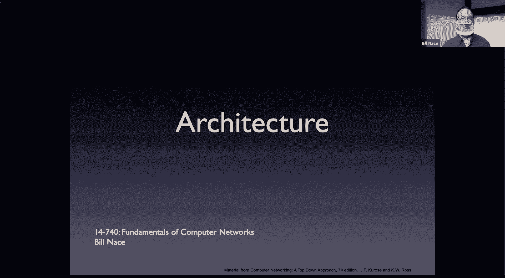
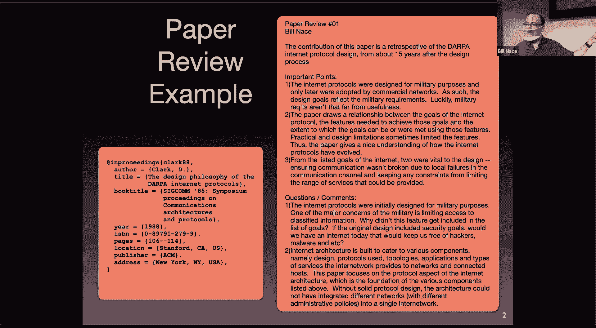
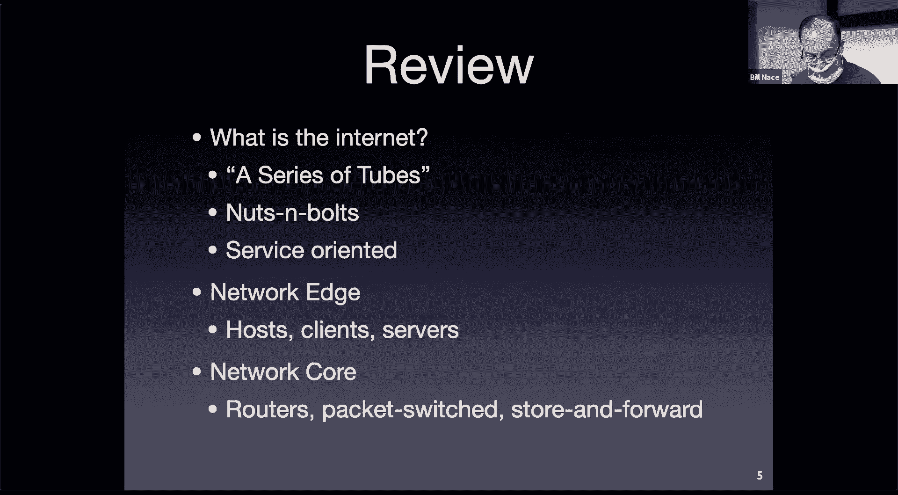
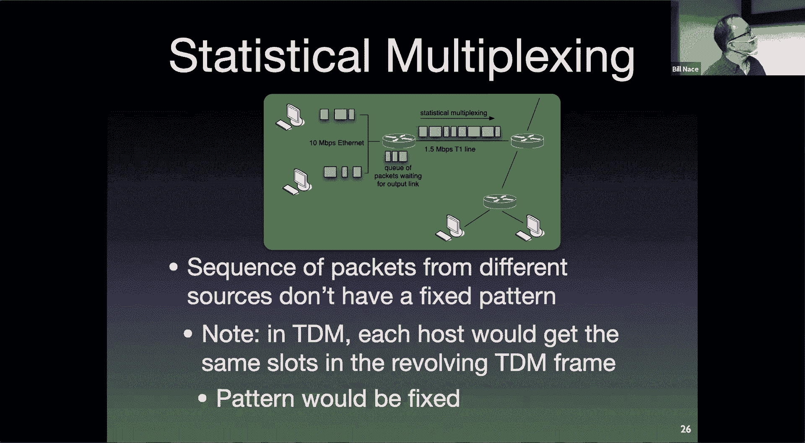
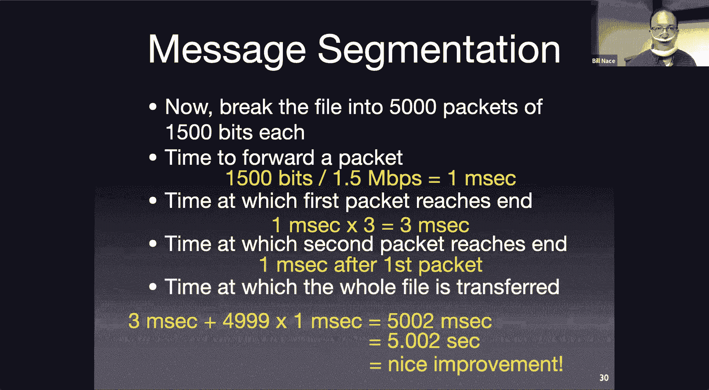
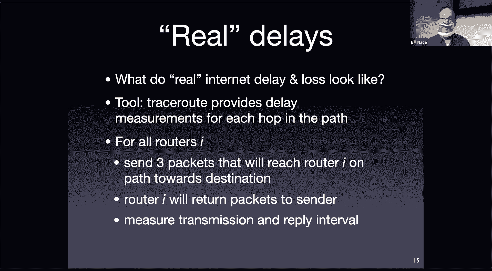
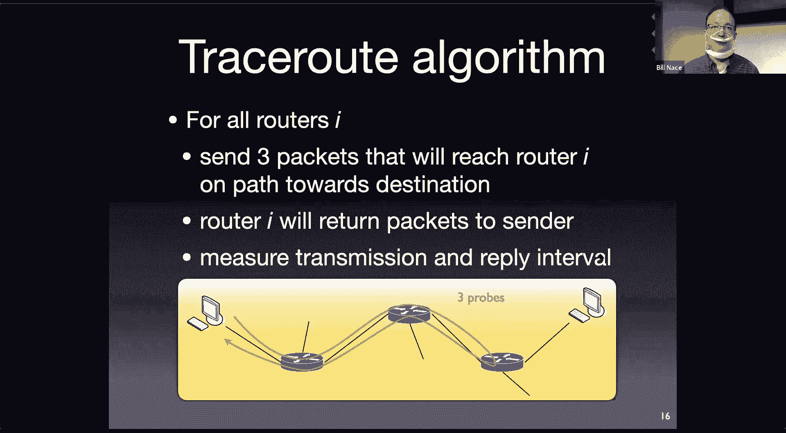
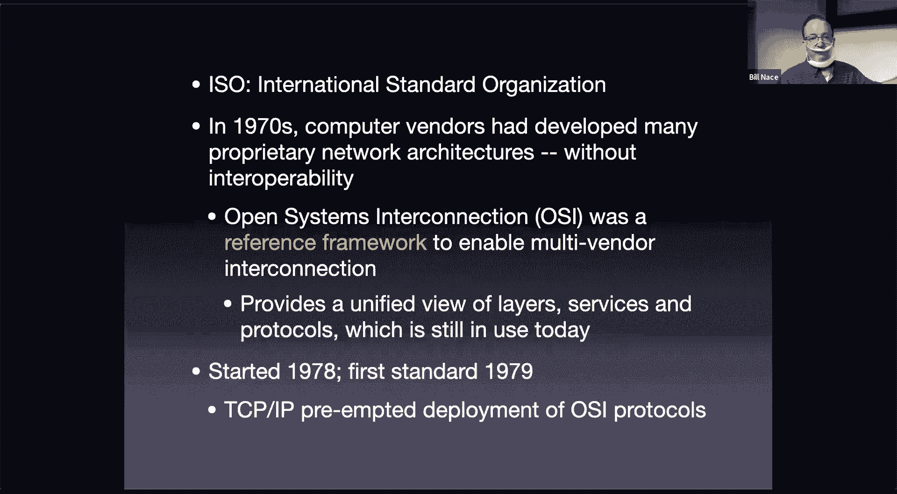
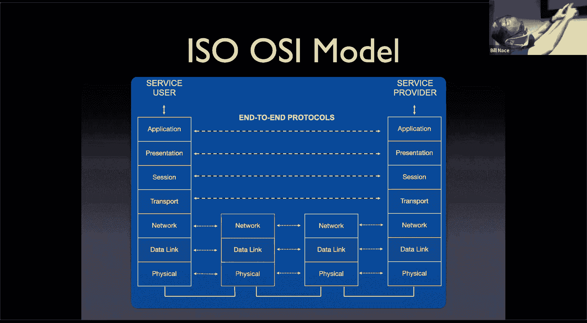
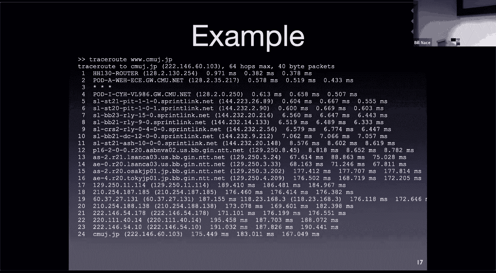

# 计算机网络基础：2：网络架构

## 概述
在本节课中，我们将学习网络延迟与丢包的原因，并深入探讨计算机网络的分层架构模型。我们将了解数据包在网络中传输时经历的四种延迟，并学习如何使用`traceroute`工具进行测量。最后，我们将介绍OSI七层模型和实际使用的五层TCP/IP模型，理解每一层的职责和它们如何协同工作。

---

## 论文评述流程说明

上一节我们介绍了课程的基本情况，本节中我们来看看论文评述的具体要求和目的。

你们已经提交了第一篇论文评述。这意味着你们阅读了课程的第一篇论文。希望你们喜欢它。这是一篇相当不错的早期计算机网络论文。David Clark撰写的任何文章都有人发表。

这是我的论文评述。我想指出几点。

首先，我写了一个贡献声明。贡献声明以粗体开头，说明这篇论文为何重要，以及为何要阅读它。每当你阅读一篇论文时，都应该思考“我为什么要读这篇论文？它的贡献是什么？”。

其次，我列出了三个重要观点。这些观点不要求与我的完全一致。关键是你需要找到论文中合理的、可以辩护为真正重要的观点。这能表明你认真阅读了论文，而不是随机选取段落进行描述。

然后，我提出了一两个问题或评论。这些是可以在课堂上合理提出的问题。例如，从今天的视角看，关于网络设计的安全性问题就是一个很好的提问。

我还包含了足够的参考文献信息，以便日后查找或引用这篇论文时无需额外工作。我使用了BibTeX格式，它方便集成到论文写作中。课程网站上提供了BibTeX条目，你们可以复制使用。

---

## 进行论文评述的原因

以下是进行论文评述的原因。

显然，我认为有些论文对你们很重要。论文评述是一种直接的方式，能促使你们阅读这些论文，尤其是在课前阅读，而不是等到考试前夜。同时，提出问题有助于课堂讨论。

我也希望你们思考这个问题：你们正开启研究生生涯。有些人可能会继续攻读博士学位。思考如何处理论文是值得的。

我曾在卡内基梅隆大学读研。我花了很多时间阅读论文。起初，我在论文边缘做笔记。后来，我开始在论文顶部钉上索引卡来记录笔记。但当我开始撰写自己的第一篇论文时，我发现自己几乎需要重读所有论文来查找某个观点。这很糟糕。

论文评述的一个不太明显的目的，是让你们思考如何管理知识。你们将通过阅读论文来学习。有些知识会记住，但那些需要精确引用的内容不能只靠记忆。你们需要一个流程来存储和检索这些知识。

想象一下，作为博士生读了五年论文后撰写毕业论文，你绝不希望面对一堆论文却找不到需要引用的实验数据。你们应该建立一个易于检索知识的流程。

---

## 我个人的论文管理流程

以下是我个人总结并沿用至今的流程。这只是一个例子，你们应该思考适合自己的流程。

我阅读的每一篇论文，都会确保获取PDF版本。PDF保存在名为“Papers”的文件夹中，并以第一作者的姓氏和年份命名（例如 `Clark88.pdf`）。

然后，我会撰写一篇评述，就像你们昨晚为Clark 88论文做的那样。评述保存在“Papers”文件夹下的“reviews”子目录中。每个评述都是一个BibTeX文件（例如 `Clark88.bib`）。

在这个文件中，包含BibTeX引用、贡献声明、重要观点。我通常会复制粘贴论文摘要。然后注明阅读原因（例如“为14-740课程阅读”）。

这些文本文件易于搜索。如果多年后我想起在高级操作系统课上学过一篇好论文，我可以通过关键词搜索找到它。我也可以搜索所有关于软件定义网络的论文，因为在贡献声明、重要观点或摘要中会包含相关关键词。

关键在于，这个过程必须快捷。如果读论文花一小时，写评述再花一小时，你们可能就不会坚持写评述了。这应该是一个几分钟就能完成的快速流程。这个流程对我很有效，我已经坚持了20年。

记住，我不是要求你们完全照做。我要求你们必须完成的部分是：创建一个包含参考文献引用、贡献声明和重要观点的文件。我要求你们这样做，部分是为了启动你们自己的知识管理流程。也许有更适合你们的笔记应用。关键是建立一个对你们有效的流程。

关于论文评述有任何问题吗？

---

## 回顾与继续：分组交换网络

在我们开始今天的内容之前，记得上节课我们没有完全结束。让我们先完成剩下的部分。

我们讨论了网络和一些基本概念。我们讲到了分组交换网络的概念。

我们说分组交换网络不提供带宽保证。它们不使用频分复用或时分复用技术来分配资源，因为它们无法提供保证。

分组交换使用一种称为**统计复用**的技术。这意味着当数据包到达路由器时，路由器会尽其所能发送它们。没有关于谁能获得多少带宽的精确保证，只能做出基于统计的保证（例如，在假设其他竞争用户行为的前提下，平均能获得多少带宽）。

路由器通常尽可能公平地发送数据包。我们将在课程后续讨论具体细节。

---

## 存储转发网络与传输时间

分组交换网络也是**存储转发**网络。

当一个数据包通过线路发送，并在路由器被接收时，**整个数据包必须被路由器完全接收**。路由器在处理该数据包之前，必须存储它。

路由器会检查错误（这涉及一些计算），并查找地址以决定数据包的去向。路由器通常有多个输出接口，它需要决定数据包应通过哪个接口发送，以及到达目的地的最快路径。

因此，路由器必须先存储数据包并对其进行处理，然后才能转发。假设数据包长度为 **L** 比特，链路带宽为 **R** bps。那么，将数据包完全发送到链路上需要 **L/R** 秒。路由器存储后转发到下一跳，又需要 **L/R** 秒。

让我们看一个数值例子。

假设我有一个 **7.5 Mb** 的文件（网络传输以比特每秒衡量）。我想将它从左边的计算机发送到右边的计算机，中间经过两个路由器作为网络核心。

所有链路的带宽都是 **1.5 Mbps**。我们暂时忽略其他因素。

如果我们将其作为**单个数据包**发送，时间是多少？

将数据包放到链路上需要 **L/R** 时间。L = 7.5 Mb， R = 1.5 Mbps。计算得出需要 **5** 秒。

网络中有三跳（源主机->路由器1， 路由器1->路由器2， 路由器2->目的主机）。每次转发都需要 **L/R** 时间。因此总时间为 **3 * 5秒 = 15秒**。

这看起来非常糟糕。7.5 Mb并不是一个大文件。如果跳数增加，时间会线性增加，每跳增加5秒。

---

## 分组传输的优势

我们假设整个文件必须在一个数据包完全发送后才能开始发送下一个。但这是存储转发网络的要求吗？数据包在第二跳开始传输之前，必须先在路由器完全接收。

解决方法是：**不需要将整个文件作为一个数据包发送**。

假设我将7.5 Mb文件分割成5000个数据块（即数据包）。每个数据包大小为 **1500比特**（这是一个合理的数据包大小）。

现在，发送一个数据包的时间是多少？仍然是 **L/R**，但L现在是1500比特，R是1.5 Mbps。计算得出需要 **1毫秒**。

这个数据包同样需要经过三跳，所以单个数据包端到端延迟是 **3毫秒**。

关键点在于：**第二个数据包可以在第一个数据包到达目的主机之前就开始传输**。

当第一个数据包到达第一个路由器时，路由器开始转发它。同时，源主机可以开始发送第二个数据包。这样，时间就重叠了。

第一个数据包在3毫秒时到达目的主机。
第二个数据包将在第4毫秒到达（因为当第一个数据包到达时，第二个数据包刚到达第二个路由器，只需再传输1毫秒）。
第三个数据包在第5毫秒到达。

以此类推。总共有5000个数据包。整个文件的传输时间是：第一个数据包的端到端时间（3毫秒），加上剩余4999个数据包各1毫秒的间隔时间。

总时间 ≈ **3毫秒 + 4999 * 1毫秒 ≈ 5.002秒**。这比15秒好得多。

如果跳数增加到4跳呢？总时间只会增加大约1毫秒（因为每个数据包每跳增加1毫秒传输时间），而不是像单一大包那样每跳增加5秒。

这就是为什么我们将大数据分割成小数据包进行传输。存储转发的特性使得我们能够获得这种性能提升，让我们可以构建更大规模的网络而不会导致速度急剧下降。

---

## 分组交换 vs. 电路交换

电路交换为每个用户提供带宽保证，这听起来很好。

但从网络运营商的角度看，这并不理想。假设有一组用户共享一个路由器的出口带宽。他们可以通过电路交换或分组交换来共享。

如果使用电路交换，每个用户获得固定保证（例如每人100 Kbps）。如果链路总带宽为1 Mbps，那么最多只能支持 **10个用户**，因为需要保证每个人的带宽。

但我们的网络活动通常具有突发性。例如，你撰写电子邮件的时间远长于发送它的时间。这意味着，大部分时间里，保证的带宽被浪费了。在电路交换中，你无法将空闲带宽分配给其他用户，因此无法支持第11个用户。

在分组交换中，由于没有硬性保证，当一个用户不使用带宽时，其他用户可以使用它。因此，实际上可以支持更多用户。

在这个场景中，假设每个用户只有10%的时间活跃使用网络。通过计算可以得出，即使支持**40个用户**，所有用户同时需要网络的概率也低于**0.1%**。这相当不错。

这就是分组交换的优势所在。当然，它也有代价。

分组交换的弊端在于**拥塞**。有0.1%的概率，可能会出现超过10个用户同时需要网络的情况。当这种情况发生时，带宽无法同时满足所有人，有些用户的数据包必须等待。这会导致**延迟**和**丢包**。我们将在今天的课程中探讨这些。

---

## 上节课学习目标回顾

我为每节课都设定了学习目标，并放在幻灯片、网站和测验学习指南中。这是检查你是否掌握了本节课要点的方法。

从上一讲中，你应该学会：
*   如何从“螺母与螺栓”的角度思考网络（即网络组件）。
*   能够描述什么是协议及其在互联网中的应用。
*   能够区分网络边缘和网络核心的设备。

这很重要，因为测验题目将基于这些学习目标来设计。

---

## 网络延迟的四种类型

现在，让我们开始今天的主要内容。首先讨论分组交换网络引起的延迟和丢包。

数据包为什么不能瞬间到达目的地？在路由器中，有四种主要操作会导致数据包延迟。

我们需要分析数据包到达路由器后经历的这四个阶段。

**1. 处理延迟**
路由器需要进行一些处理：消耗CPU周期进行计算。许多操作由硬件加速，但仍需时间。主要任务包括：
*   **检错**：使用校验和或循环冗余校验等技术，确保比特在传输过程中未被改变。
*   **查找输出接口**：路由器有多个输出接口（例如96个）。它需要查看数据包头部信息，决定数据包应从哪个接口发出（例如，“这个数据包要去南达科他州，走14号接口”）。

此外，可能还有其他处理（如深度包检测）。这些都计入处理延迟。

**2. 排队延迟**
确定数据包要去的接口（例如“北达科他州”）后，可能已有其他数据包也要去往同一接口。这意味着路由器处发生了**拥塞**，当前数据包必须**等待**。

路由器为每个输出接口分配了内存（缓冲区）来存储等待发送的数据包。数据包进入队列，排队等待轮到它被发送。从进入队列到开始传输的这段时间就是**排队延迟**。

排队延迟可能为零（如果无其他数据包竞争），也可能很长（如果突然有很多数据包涌向同一接口）。

**3. 传输延迟**
当数据包到达队列头部时，路由器开始将其比特流发送到链路上。这就是我们一直讨论的 **L/R**。
*   **R（带宽）** 由链路技术决定（例如，以太网标准规定了形成每个比特所需的时间）。
*   **L（数据包长度）** 是数据包的比特数（例如1500比特）。

传输延迟就是将L个比特推到链路上所需的时间。

**4. 传播延迟**
数据包离开路由器后，需要沿物理链路传播到下一个路由器。这与传输延迟不同。
*   **传输延迟**取决于链路技术和数据包大小（将比特推入链路的时间）。
*   **传播延迟**取决于**链路的物理长度（距离）**和信号在介质中的传播速度。

例如，你可以有短以太网线或长以太网线。即使以相同的“以太网速度”发送，信号穿过长电缆所需时间也更长。传播速度通常是光速的很大比例（例如在光纤中）。传播延迟的计算公式是：**距离 / 传播速度**。

**总延迟（节点延迟）** 是这四种延迟之和：**节点延迟 = 处理延迟 + 排队延迟 + 传输延迟 + 传播延迟**。

*   **处理延迟**：通常很短（微秒级）。路由器是高性能专用设备。
*   **排队延迟**：变化最大，可以从0到数毫秒，取决于队列中的拥塞程度（即你前面有多少数据包）。
*   **传输延迟**：由技术决定。随着技术发展（如从10 Mbps到100 Mbps以太网），该延迟显著降低。
*   **传播延迟**：取决于距离。跨房间很短，到低轨道卫星则很长。

---

## 数据包丢失

路由器内存有限。如果队列变得太大，无法容纳更多数据包，就会发生**丢包**。通常，路由器会丢弃新到达的数据包（尽管也有其他策略）。

近年来内存变得廉价，路由器拥有大容量内存，这导致了另一个问题——“缓冲区膨胀”：队列总是很长，数据包经历长时间排队。有时，丢弃一些数据包以清空队列反而更好。这是高级网络课程的话题。

---

## 排队延迟与流量强度

另一种理解排队延迟的方式是考虑流量强度。

数据包以一定速率到达（λ，长期平均到达率，单位：数据包/秒）。路由器以服务速率μ（单位：数据包/秒）处理它们。服务速率μ与传输延迟相关，μ ≈ R/L。

**流量强度**定义为：**流量强度 = λ / μ = λ * (L/R)**。

下图（示意性图表，Y轴为延迟，X轴为流量强度）表明，当流量强度过大时，会发生糟糕的情况。

如果**流量强度 > 1**，意味着数据包到达速率超过处理速率，工作会不断堆积，延迟将变得非常长（许多数据包可能永远得不到服务）。

即使**流量强度接近但小于1**，由于到达的随机性（突发流量），延迟也会急剧增长（呈现渐近关系）。因此，你希望系统的处理能力**远高于**平均工作量。

---

## 测量网络：Traceroute

网络是动态的，尤其是在长距离多跳路径上。我们可以使用 **`traceroute`** 工具进行测量。许多同学可能用过它。

`traceroute` 可以测量从你的计算机到某个目的地之间，每一跳的延迟。它采用简单的算法：探测到达第一跳、第二跳、第三跳……所需的时间。

它通过发送**探测数据包**来实现。默认发送3个探测包。它发送目的地为目标地址的数据包，但设置一个“生存时间”字段，要求第N跳的路由器在收到数据包后向源主机发送一个通知（ICMP超时消息）。通过测量从发送探测包到收到回复的时间，可以估算到第N跳的延迟。

需要注意的是，网络是动态的。此时测量的结果下一刻可能就变了。我们假设往返时间的一半是去的延迟，但路由器回复本身也可能有延迟。随着跳数增加，数据包去和回的路径也可能不同。甚至探测第N跳的数据包可能没有经过第N-1跳（因为路径动态变化）。因此，我们得到的是平均意义上的近似值。

---

## Traceroute 实例分析

这是一个从我办公室到日本某Web服务器的 `traceroute` 输出示例（之前有日本学生时使用的服务器）。命令是：`traceroute www.sfc.keio.ac.jp`。

输出显示，到日本需要 **24跳**。
*   第一跳是 `HH130-router`，很可能在Hamerschlag Hall（我办公室所在楼），延迟约382微秒。**第一次测量值通常较大**，因为需要将网络栈加载到缓存等，后续测量（378微秒）更准确，两者差异在测量误差内。
*   第二跳是 `POD-A-WAN-HALL` 路由器。
*   第三跳显示为星号（`*`），表示没有收到回复。通常是因为路由器被配置为不回复此类探测（出于错误的安全考虑）。
*   在第12跳到第13跳之间，延迟从约8毫秒跃升至67毫秒。查看路由器名称，第12跳可能在弗吉尼亚州（`NV-A-O2`），第13跳可能在洛杉矶（`LA`）。这很可能是横跨美国的链路。
*   在第15跳左右，延迟从67毫秒跃升至177毫秒，路由器名称显示在大阪（`Osaka`）。这很可能是跨太平洋的链路。
*   第19跳显示了一个有趣现象：它列出了两个不同的IP地址和延迟值（187ms和176ms）。这可能是因为路径在探测过程中发生了变化，或者第19跳路由器故障，网络将流量导向了另一台路由器。
*   最终，经过24跳到达日本目的地，延迟约175毫秒。

这很酷：24跳意味着至少24台路由器协同工作，将我的数据包送到日本。延迟跨越了三个数量级（从微秒到百毫秒）。网络系统的一个奇妙之处在于，它能在小规模和大规模下都良好工作，拥有很大的动态范围。大多数工程系统（如汽车）无法在三个数量级的速度范围内都运行良好。

如果你经常使用 `traceroute`，我推荐改进工具 **`mtr`**。标准 `traceroute` 是顺序发送探测包，而 `mtr` 持续向路径上所有路由器发送探测，能更好地反映网络整体状况。Windows上也有 `WinMTR`。

---

## 网络架构：分层模型

如此复杂的网络是如何构建的？有大量移动部件：路由器、协议、应用程序。更重要的是，涉及许多不同的参与者（运营商、机构），没有单一的公司或政府实体控制整个网络。例如，卡内基梅隆大学有自己的IT部门管理自己的网络。

这么多不同的参与者如何协同工作？如何组织网络，将所有部件整合在一起？这是一个**架构**问题。

架构是关于如何将组件组合起来解决问题。就像建筑学组合楼梯、走廊、房间来建造大楼一样，我们需要用协议和应用程序将路由器、组织等组合起来，这就是网络架构。

采用的架构是**分层架构**。分层架构是组织系统组件的一种特定方式。

分层架构将组件放入不同的层，并堆叠起来。关键在于：**每一层都为其上层提供服务**。

底层的蓝色层提供“蓝色”服务。绿色的上一层需要“蓝色”时，就向它请求。绿色层使用蓝色服务，通过