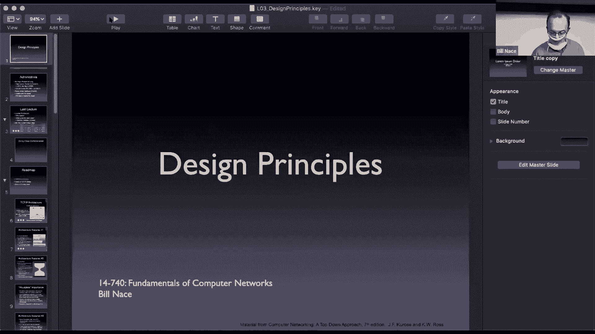
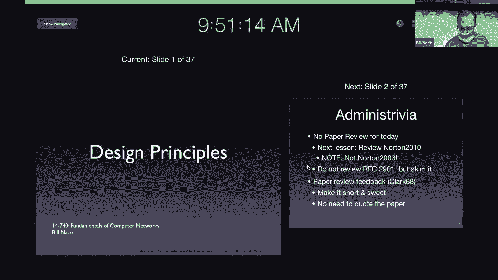
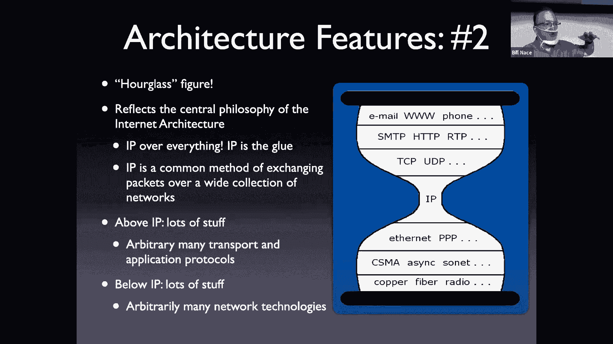
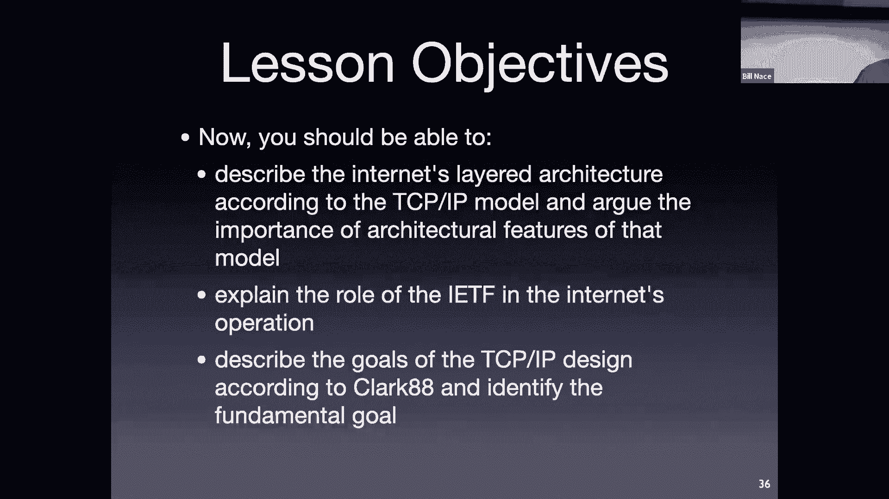

# 卡耐基梅隆大学 14-740 计算机网络 Fundamentals of Computer Networks（Fall 2020） - P3：Lecture 3 Design Principles - ___main___ - BV1wT4y1A7cd

Oh。Yeah。对。

This is 1474 welcome everybody， we're getting a slightly larger crowd in the economy every time it seems。

This is good。We aren't yet anywhere near our capacity limits。 So I'm not doing any of the formal。

Pooning kind of mechanisms that I think I'm supposed to to ensure that we don't overflow capacity。

 we'll see what happens as time goes on。So welcome to our second week of classes。

 hopefully you all had a。Relaxing long weekend and we're able to get away from class a little bit and do some other cool stuff。

 You know， I got my lawn mode， things like that。😊，But here we are。On lecture three。

 so let's go ahead and get started。没有。

So a good one， aren't？All right， so today we're going to take another look kind of at the big scope of things last lecture we talked about the actual architecture and today we're going to look at some of the principles that went into designing the internet and making it what we know and love today before we get into that i've got a couple of administrative points to work on。

First off， I hope nobody worried about a paper review for the salttzer paper that was assigned as reading。

 but not assigned as a paper review， but I would like to mention that there is a paper review due for next time。

It's not quite a。A conference paper。But it it's labeled Norton 2010。

 and I want to point out in particular， there also is a Norton 2003 in on the website。

 you'll be reading it later， make sure you get the correct one for your paper review。

It's about peering， yes， yes。嗯。I also have asked you to take a look at an RFC and I chose this almost at random。

 the point is not for you to understand all the material in that。

The point is for you to understand what an RFC looks like and recognize that it is something that you should not be scared of if I mention it in class and say。

 oh yeah， this was standardized in some RFC， you can go read those those are incredibly readable documents。

 especially I've done my share of reading standards documents。There are plenty of them in the world。

 the RFCs tend to be the most readable of all they're very accessible。

 and so if you want to know the details of you know how TCP manages the timers。

It's there in the RFCs and you can go read it and so this one is a is an overview RFC。

But I'd just like you to open it up， look at the kind of the structure， what it looks like。

 maybe read a couple paragraphs here and there， you will not be tested on the details of this particular RFC。

Okay。Your paper view for Clark 88 has been graded mostly so true all all yeah has been graded so go take a look on you can look at your grade。

Which I'm not sure I don't think I've linked back to Canvas yet。

 but it's on grade scope and you should be going there anyway if you have questions about why you got that particular grade。

 that's where the TAs will be providing feedback to you。And so go take a look there at。

Not only what your score is。But take a look at the feedback you're going to be putting in lots of paper reviews in this class。

 it would be nice for you to know what is being expected so that next time you can do it properly。

I want to make a couple of points based on what we saw。

 one is remember the paper review is supposed to be short and sweet we're not grading you in quantity。

 In fact， I think a three page paper review。Is way too much。

We're not taking points off for being too long， although it may come out in other ways。But certainly。

 this should be something that is， you know。Half a page to a page length kind of thing okay。

 don don't go overboard。Also， you're talking about a paper that you know which paper you're dealing with。

 there's no need to quote it。Okay， you can say， you know， this topic was discussed sort of things。

 but there's absolutely no reason to throw a paragraph from the paper into the paper review。

Unless if you're trying to make it look longer。And the previous point says that's not a good idea anyway。

 so don't do that， okay？Any questions about the paper review itself？

Yes I should actually be paying attention to have a chat window open so I can ignore chat deliberately。

嗯。Allright。Yeah。So last time we were looking at the。The layers of the architecture。

 I'm trying to see what it meant for there something to be a layered architecture。

 why the layering works for networks and what each piece actually has。

 we talked about the seven layer cake model and we decided we didn't like two of the layers so we're going to have five layers to the layer cake that we think about。

And I showed you this picture。RightAnd this is。It's really key。

 it's hard to overstate how important this model is in networking。

Everybody thinks about it and uses it and makes decisions based upon this model。

 so understanding how it works。Is actually incredibly important and yet pictures like this oftentimes don't help and they obscure and they're like。

 what are these arrows going， you know， how did the arrows go from one end to the other end and what does that mean。

 things like that。NowTitionally in this class， this has been the point where we've had a class demonstration that I've labeled the Dorkkey class demonstration。

 where I would actually bring eight people from the audience up to play the different layers and。

Actually work out how messages get transformed through the staff。

I couldn't figure out how to do that in a CoVId social distancing fashion。

 And I was actually had trouble。 I couldn't even dig up the videos from last year to to do that for you。

 So I'm going to play the Dorky class demonstration today， and I'm going to do all parts of it。Okay。

 so we'll see how this goes。So normally what I would do is I'd bring students up and I'd hang these big signs around them and say you know that they're the application layer or the transport layer or something like that。

 so we're going to have to imagine that I make different people like one for each of my personalities or something like that and I'm going to start off。

With。Let's go ahead and bring up this picture for this。

 I'm going to start off with the application layer and we're going to send a message in a particular message I have。

 let's imagine I am tweeting out this particular message。Okay and so that means on my computer。

 I would have an application that wants network resources。

 and so therefore it is in the application layer， it would be， for instance， a Twitter client。

Where I have typed this message in， and what I want to do is transform this message and get this message delivered to a server at Twitter's corporation or under Twitter's control that can do something with this message。

Okay， so that's the entire point of this。This network operation is to move this message from my client application on my laptop over to a server application on some server in a data center somewhere。

Guys， we want to get this communication going。And so what the application layer does it says it takes this message right this is a message at this point。

 it is some data that the application layer wants to transform and the application layer would basically hand this off to the transport layer。

OkayAnd so and the application layer would tell the transport layer say hey。

 here is a message that I would like you to send for me and I would like you to get this to the Twitter server computer that's the hardware version of where it's supposed to go。

 but also I will tell you I want it to go to the Twitter server app so there's some application running on Twitter server。

 that's where this message is supposed to go。From the applications perspective。

 from me as a Twitter client。I imagine that this message just gets delivered somehow。 right。

 I hand it off the transport layer。 The transport layer， you makes it across the Internet somehow。

 I don't care。Right， I just want this application to eventually end up。

On this server given to the server app。That's kind of what that top arrow means in this picture。

From the application perspective， it's like the messages just are going from application to application。

Does make sense。Of course， there is no way to just。

You magically make this message appear somewhere else。

 so we need to use the services of the layered architecture。

 the services below so the application is going to ask the transport layer to do this for it。

 the transport layer is going to make it appear as if this message just magically got transported to a server somewhere and handed off to a server app。

S good。All right， so what happens with the transport layer。

 I'm now the transport layer on the sender， I have been handed this message。

And I've been told that this message needs to go to a particular destination。So what do I do， Well。

 I make this into a segment。 What is a segment， A segment is a particular data structure that the transport layer uses。

And I'm going to represent that by this business size envelope。

The transport layer is going to send segments。Segments are well defined。

 They are of this size or smaller。 Okay， they have particular writing on them。

That is in transport level language。Okay，And so we're going to take this message that was handed to us by the application layer and we're going to put it into a segment。

If we're going to create a segment out of it to send the message now immediately we see we have a problem。

Our message is too big， it will not fit in a single segment。

So one of the things the transport layer does。It has scissors。

It will take our message and it will go ahead and chop it。😡。

Into pieces that are small enough to fit in segments。Okay， so it will take。

Piece of the message and itll put it into a segment。Now， that segment holds that data fine。😡。

That segment also has what's known as a header。Which is some space to write some data on。

 so I'm going to represent that by writing on the actual envelope here。And the things I would write。

 I would say， for instance， that this is going。I need to give it some destination。

 I'll say this is going to the Twitter app。On the Twitter server。Okay。

 so I that's information I was given。From the。From the application layer it was given those pieces。

 and those are going to be important to get this segment delivered to the right place。

The other thing I have to do is have to keep track of which this is I've put my message into parts。

 and so we're going to end up sending multiple segments。

 and so I will say that this is number one of two。Also on the actual segment。Okay。

I'm going to do the same thing， of course。For my second piece of the message。

 that also goes into a segment。I create a segment out of that and I say two。

And this is number two of two。So I put my address on here as well as the numbering system。Okay。

 so a couple things that the transport layer has to do， the transport layer creates segments。Okay。

 in order to do that， it will chop apart the message we get。

 there are a couple other things that the transport layer does that we'll be talking about in a week or two as well。

And now these then get handed to the network layer。😡，Okay， the network layer below us。

Is going to give us the service of getting this to the server computer。Okay。

 the actual hardware thing。 And so we're going to hand these to the network layer。

 We typically do them one at a time。 of course we'll say hey， network layer here take this thing。

 get it to the Twitter server right and then the transport layer will then repeat that with the second segment。

 hey network layer， please get this to the Twitter server。

And at that point the network layer the transport layer on the sending machine is done Any questions so far about what's happening？

So I want是。So。W says give the second to the server as opposed to getting the entire application。

Yeah so the network layer's mission is to move data from any hardware host to any other hardware host so you're right。

 this gets a little confusing because I have a Twitter app and a Twitter server right and so there's an application running on a server right there we're going to tell the network layer we're not going to tell the network layer anything about the application。

😡，We're going to tell the network layer， please get it to that hardware over there。😡，啊，没有。Yeah。

 we'll deal with that in a minute when it gets the other side， but basically you know。

 the network layer there on the far right， when it gets the data。

 it will pass to the transport layer to， hey， I got this for you， you should do something with it。

And the transport layer then will its job will be to get it to the right application。

Do we have a question winner Oh I'm sorry I forgot to repeat the question the question was about this confusion of what the mission is and how that aligns with the fact that I have an application and a server。

Okay and in my example， I'm naming them the Twitter server and the Twitter application and so that can get a little confusing keep in mind there applications are the software running on the servers which are hardware。

Lese for this。This context。Okay。All right， so now I'm the network layer。

The network layer got handed this segment said， hey， please deliver this to some computer。

The network layer does not deal in segments。The network layer takes this segment and puts it into a packet。

This is a packet。Okay， it's different sizes， it's designed such that the segment will fit inside it。

Okay， we'll learn later about some fragmentation if it doesn't。

 so the network layer is going to take this。The segment put it into a packet。And， again。

The packet includes some header information that the network needs to get it to the right place。Okay。

 for us today， that is merely a hardware destination。Yeah。

So I'm going to put onto the packet enough information for the network layer to get it to its destination。

 in this case， just the hardware。Location， so we're going to do that for each of the segments that come in this segment also goes into。

A packet。That packet also marked with a。Yeah。With a destination。Okay。因为他可不要。嗯。

A packet will only contain a single segment right， see one segment fits in here。

 there's no space for anything else。Okay， the network。

Layer doesn't bother with noticing that these are going to the same place and trying to combine them it's going to assume that the transport layer has has already done the job of cutting them up into segments and done that well enough that these will each fit into a packet and there won't be any room in the packet for anything else。

😡，Okay， so the network player is not going to bother trying to combine them or anything like that。

The question is are the packets dynamically sized， yes they are。

 the packet will be some set of header space， whatever we need here。

 plus as many bytes as necessary to fit a segment， so if you give me a small segment。

 then I'm going to end up with a smaller packet。Then if the transport layer had given me a large segment。

Yes， and that's true for segments as well。 segmentsments can be of various sizes。

 They all have a maximum length。And then some amount of header space to to for all this writing things So there's kind of a minimum minimum maximum so is the reason for like the change to segments to packets its that for the header information because it goes to hardware or otherwise like what's the reason for it and so the question is。

Why am I making such a big deal about segments being different from packets？close enough， yeah。

 these are different things。 The format is very different and who owns it and thinks about and uses it as very different。

 and mostly a segment has to fit inside a packet。And so they can't be the same thing。

If one has to go inside the other that it won't do， I can't put a packet in a packet。That way。

 and I don't need to because the way the network is structured。

At this point I guess I should point out I am more pedantic than some about this difference。

 I think it is very important to know that a segment is different from a packet。You will read。

And here people using the word packet for all of this。Okay， and so in those cases。

 you need to be able to distinguish the context。And realize， oh， somebody is saying。

 that's a wfi packet。And you in your brain， you should be saying， oh， wait a minute。

Bnas told me that's a bad thing to think， Wifi is a data link thing， that should be a Wifi frame。

Not a wfi packet， but many people are very loose about the terms。Okay。

 I think they're important because there are different things。Dealt with by different groups。因下全十吧分钟。

は。So the， it's not so much that we're trying。Well， I guess the advantage is if I had a fixed size packet。

 then I would always have to send， let's say， 1，500 bytes。Okay。

 and that would mean that if the segment that was given to me was small was representing a single keyboard press and had a single character in it。

 then I would have to end up sending more data than necessary。

And so because we sometimes want to send a lot and sometimes want to send small。

 we go ahead and allow ourselves to have variable size segments and packets。Okay。All right。

 so the network layer。So far this seems very much like the transport layer right the transport layer took something。

 put it in an envelope wrote on the envelope， the network layer took something。

 put it in an envelope wrote on the envelope， but now the network layer has to do its hard job。

 which is figure out how to get this somewhere。OkayAnd so the network layer is going to look at this packet that's come in and have to figure out which of the possibly many connections that we're connected to should this get sent down now from an end host。

 this typically is very simple right my laptop is only connected via wfi to that w-fi access point on the wall so the network layer in my laptop doesn't have to do a whole lot of work it's got to figure out should this stay on this laptop because it's possible to send this packet to another application running on this laptop。

Happens sometimes。Okay， but most of it's just going to be， oh， this is for the outside world。

 let me send it that way。哎。And that may be what's happening here on the end。 right。

 That network layer will send the packet。To the wfi access point on the wall。

 which acts kind of like a router， which will vent， oh。

 that guy then has a harder job right because that guy is going to have more choices。Okay。

Maybe they're simple， I don't know the layout of the topology of this room， but at some point。

 we're going to get to routers in the middle of an internet。That have a much harder choice to make。

Okay，And what they're going to do is they're going to have this address table。

This address table will have appeared。Not quite by magic。

 will have appeared through running some protocols and communicating with the routers around it to decide which of the many wires that router is connected to should。

Packets be sent to in order to get to a particular destination。

So the table inside each router is a table of destinations。😡。

And the outgoing link that they should be sent on Okay so in this case I've got a pretty simple router right this one's just got a couple of different wires leaving it and we're only worried about a couple of addresses for a real world router in the middle of the internet that might have1 hundred or so wires leaving it。

Okay， it will actually know be able to look up any address of any computer in the entire world。

And figure out， oh， this is the Twitter computer here。This is the wire it should be leaving on。Okay。

 in our case， it would be you some router has a connection to things on the right and the things up and left and down and over there。

 in this case we're going to take the packet that comes in and we're going to look at the packet and packet it says it's going through the Twitter server。

 we're going to look that address up in this table and say， oh。

 this needs to get sent out the wire to my left。Okay， so out to the left， we're going to send this。

Now how do we send this？Once the network layer has decided that this packet needs to go out a particular wire。

 it's going to hand it off to the data link layer that's in charge of that particular wire。

That particular wire could have any kind of technological means of transmitting bits right。

 it could be ethernet， it could be Wifi， it could be satellite communications or fiber optics。

 or there are many， many choices here each of those data link layers works a little bit different。

But they all are going to take this packet that's given to them by the network layer and provide the service of connecting it to the next computer line。

Okay so for us now now I'm going to be the data link layer。

 on the data link layer on some router somewhere， I've just been handed this packet and told to get it to the other end of the physical connection I have。

So I'm going to take this packet and I'm going to make it into a frame。This is a frame。

 frame is bigger， a frame encapsulates my packet。 I can put my packet into the frame。

And then the frame provides space for me to write some stuff on it to help me communicate this。

Down the wire。 And what that is is going to vary。 A Wifi frame looks different from an ethernet frame looks different from a bi optic frame。

One of the things that's going to be very important that we will usually want to do at the data link layer is to make sure that this data gets received properly。

And so the data link layer sender。We'll usually do some math。Okay。

 look over all the bits that are in this frame and come up with something we call a check some or a cyclic redundancy check some some value based upon that map and I have a hard time doing math on。

Thiss gel atoms here。 So I'm going to imagine that the math I gave when I looked at this frame told me what color it was。

 right So right now， as a sender， I would look at this frame I've constructed and I would say， oh。

 this thing is white。Okay， that's the math I do would come up with the answer white。

 this thing is white。And then I would take this and I would send it。Down the wire through the ether。

Up to a satellite， whatever， however we're getting this somewhere， I would take this。

 and I would send it。Now， this， unfortunately， I can't show you this is I in some ways。

 the best part of this Dorky demonstration is that we would pull out。

Two cups on a string to be our physical layer okay we would hand this down to the physical layer and we would actually connect this to the string and move it down from one side to the other really hard for me to show that as a single person up here so you're going to have to use your imagination I'm handing this down to the physical layer the physical layer is creating the electromagnetic waves that will take this entire frame and send it down to the other end of the wire。

So now on'm the data link layer on the receiving site， the fiscal layer has just handed me this。

And said， hey， here's a frame for you， what should you want to do with this？Well。

 we're going to check the math。 We're going to do the same kind of math over the entire contents of this frame。

And in this case， we're going to say， oh， the math tells me。

 what does the math tell me it tells me that this is white。

And I'll look and see in the frame it's written what color it should be。😡，It's quite， therefore。

 this is a good brain。Okay， now。The back on the sending side， I still have one more packet to send。

The the sender。Side data length layer， we'll go ahead and create a frame， do the same kind of math。

 Oh， look at this， this is also white。We'll put it onto the wire， that's the physical layer。

 transmit it to the receiver。The receiver getting this would do the same math。

 and if I looked at this and decided that this was red。

 that means something happened to the bits in transit。Because the math tells me it's red。

 but it's written that it should be white。Okay， then。That means a bit got flipped somehow。

 Something damaged us。 Okay， so there was some noise in the electromagnetic spectrum。

 Something happened。 The thing got truncated， not all the bits got here。 Who knows。

If it turns out to be read。We can't accept this as a good frame and depending upon the data link layer。

 we could either have it be retransmitted。Until we get one that looks white or other data link layers just start away。

Okay， but we can't take one that the math shows that they're bits flipped and give it to the network layer。

As if it were a good， a good packet。Okay。Does make sense。

The data link layer on the receiving side then gets this thing。It gets a frame。Takes the。

The data out of the frame decapsulates it and ends up with a packet。Okay。

 the data linklay doesn't know what this is， can't read this doesn't do anything with it other than hand it up to network layer and say。

 hey， network layer， I got something you should look at。😡，The network layer looks at this and says。

 oh， this packet， which I now understand， the network layer can read this。And say， oh。

 this is going to the Twitter server。And depending upon where we are in our picture。

 maybe we have just been received at another router and that router will again look up Twitter server。

 figure out which direction it goes。Send it to the data link layer who puts it in another frame and transmits it to the next layer。

Let to the next by next top。Or it could be that we're now finally at the very left hand side of this picture。

Yeah。You're right。At which case this has been delivered。The network layer will say， oh。

 Twitter server， that's me。I don't have to do anything with this。 I don't have to forward it anymore。

 All I have to do is take。The content of my packet out and give it to the transport layer。Okay。

Of course， this continues with our other frame as well。The frame comes in。

 in this case we do the math who says white， it is white。We've gotten this correctly。

 the data link layer pulls this out， this is some data， let's give it to the network layer。

The network player says， oh， this packet， I understand this packet。

It's going to the Twitter server and that's me， therefore it's where it should be。

 let's take our segment out。And give it to the transport layer。Does all make sense。

The transport layer has gotten these two segments。That have been candid by the network layer。

Thanks sure we understand the context。 We're now at the destination machine。And the transport layer。

 I am now the transport layer， the transport layer has just been handed a segment。Okay。

The transport layer is going to look at this and say， oh， okay， I have a segment。I know segments。

 I can read this and oh， this is number two of two。Okay， what can we do with this at this point？

Can I give this to the application？Clearly， I can't do of the segments to the application。

 Could I take the data out of it and give the data to the application。这有点。Yes。

 I'm on the end server there in Twitter's data center。Can I give this to the application？

But it would be out of order， the application would not be able to read this。😡。

This is not the order the bits were sent to me。😡，So the transport layer is not going to do。 It says。

 look， number two of two， And I haven't gotten number one of two yet。So let's set this aside。

 let's just put this in a little buffer somewhere and wait。Okay， not do anything with that yet。

A minute later， hopefully， the network layer hands us another segment。And in this case， we say， oh。

 number one of two， number two of two， these go together。Okay， I now can take the data out of them。

This is the number one of two。 This is the number two of two。Right， iss this a message。No。

 this is not yet a message。This is the data from two segments。But they're separate。

So one of the things the transport layer does。it has tape。

It will take these different segments that have been sent and it will put them back together。

So we'll go ahead and take。Take those individual pieces of data。

Tappe them back together to make a message out of it。

And now we can take this message and give it to the application layer。Edric。

the transfer they by summary。The segment so that you can get your。To segment messages。

Different to separate lesson。Yeah， so we'll talk more about this when we get to transport layer。

 let's just for now assume that there will be a different set of numbers coming in for each of our applications。

Okay。Now the application is going to have to deal with， it got a message， got another message。

 got a different message and being able to separate those and know what to do with them。

The transport layer1。Noow whether this is the whole thing or not， it'll just say， hey。

 here's some data for you。I guess the question is my。From the transport。

What is it something that Okay and I apologize to people in Zoom I once again have forgotten ver repeat the question the question is how the receiving transport layer is getting all these segments coming in one after another that we're putting together into messages is there anything that keeps the transport layer from putting the next segment on the bottom of this right if I got number a third segments？

And attached it to this and gave it to the application that might be different somehow than this two segment case。

And the answer is no， the transport layer doesn't know about any message boundaries。

 it just knows I'm receiving all this data， one chunk of data， second chunk of data。

 I know I got them in the correct order， and I'll give them to the application in the order they were received。

😡，Okay，The application is going to have to figure out of these bunches of segments it's getting。

Which ones are different tweaks， for instance， and so it will have to put some structure around this data to understand those pieces。

系。I a question two different time。你是。Right okay， so back on the transmitting side。

 right the application handed some data down to the transport layer。

And the transport layer decided to cut this into two pieces。

 it could have cut it into three or four or five segments。Right， and so the question is。Who decides？

Does the application get to say or does the operating system what's called the recognize that the transport and network layer are both in the operating system data link layers。

 probably some drivers and some hardware on the machine so the answer is the。

Mostly the transport layer decides how to cut it up。😡。

Now there are a couple of things you can do if for instance。

 you don't want the transport layer to like wait around to get more data to fill out a segment。

 which the transport layer might want to do。Okay， and that's not good for a real time application and so there are ways to tell the transport layer。

 hey， as soon as I give you some data， send it out。Okay， so that if I send some small data。

 it'll go as a single piece， but in general， the transport layer looks at this data and decides how to chop it up。

And normally， it。Chps it by filling as big a segment as it can out of each piece of data。

There's one piece we haven't covered yet。Okay and that is， again， for context。

 I'm the transport layer on the receiving machine。 I've been handed this message。

 I've been handed these two segments that put together into a message。

And I want to hand it to the application layer。But there are multiple applications running on this machine or could be。

😡，Certainly your laptop has multiple network using applications on it at any point in time。

So the transport layer， when it gets a message， has to know who to send this to and luckily on our segment。

We had a destination， and that destination was an application。

We said please give this message to the Twitter application running on Twitter server it's on Twitter server now。

 so effectively the transport layer is going to look around and say， hey。

 any application here wants some data for Twitter app。Sort of。可的。It will know， oh。

 that particular application of the 10 applications that are running on this computer is the Twitter app。

 Let me give it to that application instead of to the web server application or the email server application that's running on the same hardware。

Okay， so another important piece is the transport layer test。家做发三。Okay。

So the first question does only the datalink layer check if there's a mistake， no。

 the datalink layer always has to， the transport layer often does as well。

 we'll talk about we talked about this briefly when we said there are connection oriented and connection less transport layers。

And the connection oriented transport layer， PCP will also do reliable data transport so it will actually check that the data was there properly。

And that is a check over the entire stream of data， the even the connection list， however。

 does a check over the bits that are in the particular application， a particular segment as well。嗯。

And the other question for each network node， so the routers。IAssuming when it receives the packet。

 does it re encapsulate the data with new headers or simply forward the packet it receives。

 So the situation is， I'm a router， and I just got this packet。Okay。

 what do I do with it Okay well typically the way the router works is it actually cuts the packet when it comes in because some of this is the payload and some of it is header and some of the data some of the things in the header have to change but the payload doesn't and so usually there in the router architectures usually there are two streams one of which is a control stream handling the headers and then it will put that back into a new packet when it leaves so you can imagine as if the packet actually changes。

Like we would take the segment out of the packet and put the segment into a different packet as it goes through the route。

Okay。Another question， what are the benefits of redundant checks in the transport layer？

We'll talk about that in a minute that was one of the key points of the assaulttzer paper today was about where do you do some of these checking things。

I guess I might as well talk about it now in the salttzer paper。

 there's a really good example of a theoretical application called a careful file transfer that points out that even if you do the checking at the data link layer。

That is a network level check。I'm sorry that is a check of network operations that's happening so the data link layer is guaranteeing that the bits that were sent are the same as the bits that were received。

But if you look at this thing as an entire flow from end to end。

 there's also stuff in the router itself that can screw up。

OkayAnd so a transport layer check actually is checking the entire stream as opposed to the data link layer。

 which is just checking the sending to receiving points in this So if you think about kind of in our picture the data link layer makes sure that the arrows are all correct。

But inside the boxes， things can screw up and there's an awesome example in the salttzer paper of a router at MIT that had a bug in it。

 and every once in a while， every couple million data transfers， it would transpose two bytes。

And apparently and so that was happening in the memory buffers of the router so the fact that things were protected at the datalink layer did not help protect against that and after moving source code for their operating system back and forth a whole bunch of times。

 they found they had too many errors in it， and they actually had to go back and look at printouts to calls it the ultimate error checking。

Which is kind of。So that's the advantage of an end to end check。Okay， so at this point。Hopefully。

 my demonstration has given you a little bit more insight into this picture。Right。

 if you think about those arrows。If you think about what the application is imagining。

 the application basically said， hey， here's a message and I just need to get it to that other application。

 that other piece of software running over there。And that's what I mean by that arrow taking a message to connect to applications。

Now of course， that arrow didn't actually exist right there。

 that arrow was implemented by the transport layer。That took individual segments。

C the segments and got the segments to send between ends。 In fact， we had to send two segments。

Between the transport layer， sender and receiver in order to get our message through。Okay。

 in order to provide that service to the application layer。But again。

 the transport layer is basically saying this is a segment I created and I'm going to give it to that other transport piece of software running on the end host who's going to decode it。

Of course there's no arrow there， instead we hand it to the network layer and the network layer puts it in packets。

And sends a packet from。End hosts to router to router to end host。

Getting it from any computer in the world to any other computer in the world。😡，And of course。

 the network layer actually doesn't send it from endhost to router。

 instead it gives it to the data link layer。That makes a frame out of it。

And connects from one end of the wire to the other end of the wire。For a single hop。And of course。

 the data link layer isn't actually transferring a frame。

 the data link layer is asking the physical layer to transfer each of the individual bits in the frame。

 which are sent one by one across this wire。F optctic cable or whatever the media is。Yeah。

Hopefully that gives you a little bit more insight into this。

As you go you know over the next couple days hopefully this becomes more and more intuitive to you if you do have any questions or you find this is still confusing to you。

 please talk to us because this is the model we're going to hang stuff on for the rest of the semester。

Okay。Thus， ended。The Dorky class demonstration， I'll let you decide if this is worse or better。

More or less dorky than having six students up here with signs hanging around their necks。Okay。Today。

 let's talk a little bit about the design decisions that went into the creation of these protocols。

This is often called the TCP IP architecture， in fact I just recently read that it was originally called the IP TCP architecture。

 which just。feels weird to hear it that way， but of course this is the TCP IP architecture in the context of all of the layers。

 including datalink application layers。This is a blown up picture of the different layers and tries to put some particular names on some of the players in the actual architecture stack。

Okay， so in this case， I've got this connection of lots of different applications up top。Okay。

 some of them， I've got web and mail and DNS and Zoom， basically up across the top， Okay， and they。

Use transport layer and they can use different transport layer pieces。

To decide whether they would like to have a reliable service， for instance。

 to get all their data there reliably， or whether using some datagram service。

 the user Datagram service just sends each chunk of data， sends each segment。

Without any need to set up connections， but also without any reliability。

And there are other choices here as well on the transport layer。

The next layer down is the internet protocol， the network layer。The network layer。😡。

Does it best to get the data from any computer to any other computer， we call this best effort。😡。

It's not actually guaranteeing that any particular packet will get delivered。😡。

But it will do the best it can。And so overall， it's going to do。Pretty good statistically over many。

 many packets， but you can't guarantee I can't say that this particular packet will get delivered properly to the other end。

Okay，And then that， of course，s。That of course connects at the data link layer to a whole bunch of different network technologies。

They have different ways of connecting and sending data from。

 I think of it as one end of a wire to another end where the wire could be a real wire or could be a radio link or a light link。

哎。So that's kind of the way these layers are put together。

And there's some features that come out of this。 I know a lot of people say， wait a minute。

 These layers seem kind of burdensome。 Do I always need to。

Send data from layer to layer to layer to layer， and technically you don't have to。

So there's nothing keeping you from writing an application that just talks directly to Ethernet。Okay。

 there's nothing keeping you from writing an application that sends raw IP packets。

That you construct。喂。Most applications of network applications are going to use TCP or UDP or some other transport layer。

 but there's nothing keeping you from that， you don't have to。Now recognize if you do that。

 you may give up some services from those layers。RightIf you're writing raw I packets and connecting directly to I。

Then you can't expect to get reliable data transfer。Unless if you write it yourself。

 which you may want to。Okay， but you skip TCP so you don't get any of TCP's features。

I have actually written applications that use Ethernet directly。Right。

I've done that because I've been in the lab and I've got a board of some sort that has an internet connector to it。

 and I want to get data in and out of it。😡，And so I run some program on my laptop that connects to that board。

 I'm connecting directly to the data link layer， and in the process I'm giving up anything that the network layer would get to give me。

So it means that my code can only work when directly connected to a board。

I cannot run my code and expect to connect it across the network to that piece of hardware somewhere else。

Because I've skipped the network layer。喂。But there's nobody keeping you， there's no police that say。

 oh， this is illegal， you haven't done all the letters。讲这么关。You are unlikely to want to bypas。else。

Yeah， if you want to get internet global networking。

 then you certainly can't skip the IP layer to make that happen and with UDP there's really no reason to go directly to IP UDP is such a thin layer that provides a couple of useful services you might as well do it。

Okay， but there's nothing keeping you from skipping if you wanted to。没有。All right。

 something else to notice is we have diversity at the top and diversity at the bottom。

It's designed this way。 you want to be able to connect lots of different applications。

 you want to be able to use lots of different technologies。

To get your data moving around but they're in the middle。You don't have a whole lot of choice。

That middle layer， the network layer， has been carefully chosen to be the glue。

 it's got just the right things to allow the top stuff to connect to the bottom stuff。Okay。

 you don't get choices there。

嗯。So this does what it's supposed to do， right， It connects， you know。

 these higher level applications to lower level stuff。 It's great。 It all works well。

 We're thankful for it。😊，Until we want to change it， One of the problems we have that we've。

Realized over the last 25 to 30 years we've been trying to change from IT version4 to version 6。

Is because that's the glue that everybody uses。 If you want to change it。

 you have to get everybody to change。And so that has been incredibly difficult。

Something else you ought to know about this architecture is who's managing it。

 who's in charge of it we've mentioned the Internet engineering task Force the IETF before。

 this is the group that standardizes all of these protocols。

 they're the ones who figure out oh yeah we need to have IP version6 and here's what that will look like and all the techniques and the specificities about how that will work。

They're the ones who will hash out details of a new specification。嗯。I got to admit。

 I love these guys as a standards group。They tend to be people who are passionate about the networking technology。

 not lawyers from companies who want some marketing advantage。

And so they tend to form these working groups very。Very informally。

 they collect into groups that are working on particular topics。

 they usually hash them out beat them up over email distribution lists。

Three times a year they get together in meetings。嗯。

When there are two independent implementations of two different people write the code for that protocol and those two different pieces of code actually communicate properly。

 then they say， hey， that's pretty good。In fact， their watchword is they work on rough consensus and running code。

They don't worry about kings and voting and things like that， they say， hey。

 we've got some code working and most of us sort of agree to it， then let's make it a standard。

Now that standard is usually in a thing called a request for comment or RFC。

 you'll read one for next lesson， or you'll skim one for next lesson。

And there are a wide variety of things that go into RFcs。 Okay。

 there are strict standards about some protocol that are detailing what every bit should be that gets sent down the wire。

There are experimental protocols， things that never actually see the light of day okay there's an example check out 1149 and I'd like to point out if you want to look up an RF。

 it's really easy IETF。org right so internetengering task force is an organization。

org/ RFf/ RFf and a number okay I actually have a text macro on my computer so I can just say RF and a number and it goes to that URL and let me read it。

Okay， so they're very accessible， very easy to get。 You don't have to， you know。

 pay IEE money or anything like that to to get to look at the standard。Okay。

So the RFCs end up being wide mostly their standard。

 but some of them are comments on this is a historical understanding of why we used to do it that way。

 and somebody's written that out as an RFC。可以。All right， so now let's let's take a look at。

And the paper you read for last time actually， a do a little catching up here。

 The Clark 88 paper was about the。The design of the Internet and kind of the philosophies in the ways that that was put together was written in 1988。

You may recognize that that is after RF the TCP and IP protocols were actually implemented and in use。

Okay， so this is definitely a retrospective looking back。🤧。And it's saying， you know， I was there。

 I was a member of this and this is what's going on， this is important stuff。Okay。

 here's the motivation。 here's how we decided things。And in the paper， he's listing a bunch of goals。

 He's saying， hey， yeah， this was the most important。 And these other things were also important。

 And that thing didn't make the list， basically。It's important also to recognize these are you'll notice from the title these are the DARPA Internet protocols right DARPA was an organization in the United States military that was in charge of advanced research and they're the ones who funded this research the research was actually done by mostly academics at universities including Carnegie Mellon。

But DARPA was the funding agency that was giving money and giving overall guidance so that research work done in one place matched up with research work done in another。

And that meant， by the way， that they' were trying to solve problems for the US government。

Not really with the intent of building the kind of worldwide。

Internet that we have today that everybody's using for Netflix and eBay and things like that。

At that point in time， because everybody was getting funded by the same funding organization。

 because there was a small group of academics that kind of hang out and had to work with each other。

 that meant that there was a shared vision， everybody kind of agreed this is where we were going。

And they're basically just wanting to get these computers hooked together so they could transfer data back and forth as well as run their own applications and so part of the funding included。

 oh， I think we should build an email client。And so you'd have some professor， you know。

 basically some grad student somewhere whose job was to build an email client as part of all this。

Okay， and then that application would get handed out to everybody else。

 everybody else would run it on their machines if they could。

 and the protocols would work out to send the email。Notice not many companies， in fact。

 no company involved in this， no commercial entity other than an academic organization。

Also no thought for trustworthiness， so it basically assumed， hey we're you know。

 we're in this together， in fact， some of the early versions didn't even have passwords on things so you could no problem looking at each other's files in that file transfer protocol sort of thing。

Here's the fundamental goal。 This is the thing David Clark says。They live or die on。

 This is what it was all about。 It was about interconnecting existing networks。

They're not creating networks。😡，From the ground up， they've already got networks。

This is the 70s and 80s， networking has been around since the 50s。Okay， as soon as。

Computer scientists built two computers。 What do they want to do。

 They want to connect them and have them talk to each other。So it's been around for a while。

And there are a bunch of organizations that have networks， in fact， in the US government。

 there are a bunch of different organizations that have networks that don't work together。

And so that's why we have these existing networks and the goal is to get them to be able to connect and do stuff Okay so one way to think about this is the Army。

 the Navy and the Air Force all have their own networks and now DARPpo wants to make sure that they can all talk to each other。

Okay， so that they can send messages from one computer to another。

Even if they're on these different networks， so that they can coordinate whatever the military has to coordinate。

They were using technology that had been around， so they were building on a previous project called APE that had basically proven that packet switching works。

That you can do store and forward networks with packet switching。

And you would connect networks with these gateways。

 and so that's the procedure that we're going to use and so you'll often see the word gateway used as a connecting device。

Now in 2020， we call these things routers。Okay but we'll occasionally see the gateway word pop up in various protocols and whatnot。

 and when that happens you have to kind of mentally do the mapping and say oh yeah。

 gateway means router。There are a bunch of other goals as well。

And David Clark makes it very clear that these are secondary level goals。

 if they had solved all of this and not been able to do this one， it would have been a failure。Okay。

 if they do this and mostly get some of these handled， that's okay。

 And it's basically the status of what what they got done。 So these are the goals they wanted to。

 to have。 They wanted to be robust。 They wanted multiple data link layer devices。

 They wanted multiple services。 Okay， They wanted to be able to。

Work in the environment they had of multiple networks。Et cetera， et cetera。

So let's take a look at a few of these。So this is the top level secondary goal。

They wanted it to be robust， they wanted if there's a failure， they wanted that not to cause trouble。

One of the things they're recognizing here is they're building a system with lots of parts。

And as you build system with lots of parts， there's a very high chance that some part somewhere is broken。

Right， anybodybody want to bet。Right now that somewhere on the network。

 there's a computer that's broken or router that's down。Okay。Yeah， it's。I don't know where it is。

 but I will guarantee somewhere theres a router that is rebooting at this very instant。Okay。

 and that's pretty much guaranteed because we've got 800，000 routers in the world。so yes。

 one of them is rebooting right now。 And so therefore。

 the architecture that David Clark was building needs to recognize this。

If it only works when everything is working properly， it's not going to work very often。

 So what do you do if there is a failure？This is an issue basically with replicating the state of what was going on。

 If you're in the middle of transferring some data from Nho A to Nho B。

 and there's a failure somewhere。Okay。Well， if there's a computer that crashes。

 what does the computers do well？They will eventually reboot。 The question is， what do we do about。

About making everything right until that computer reboots or once it reboots。

 trying to make sure that the conversation we were having， that data transfer can still go on。

So basically， we have some state， we need to keep track of well。

 what data has been transferred and what has it We're not actually saying that we need to keep track of the data as it's transferred。

Okay， but we need to know， you know， did segment one get there， How about segment two。

 is that delivered？That's what we're talking about when we're talking about the state of a conversation。

We saw earlier we're sending segments。From one place to another。Which of the segments got there。

 Which didn't， with pieces happen。 And there are a couple of choices you can make。

One is also pretty logical right number one here is we'll say。

 I've got this network and it's the network that's failing。

So the network should provide as a service the robustness right。

 the network should make sure that when it fails， it is able to recover properly。OkayAnd to do that。

 that means the network itself， the routers that make up the network。

 should be keeping track of the state of this conversation。

Okay approach number two says wait a minute， we don't have to do that Okay， instead。

 if we just put the state at the endhos， let's let the sender and the receiver keep track of where they are。

Okay， and you kind of say， wait a minute， it's the network that's failing。

 why should those guys have to do it？So basically two approaches here。

The approaches are all about where does the state get stored， what's happening to it。

 and it's possible to do number one， in fact， we build lots of distributed systems that do this。

Many of our distributed systems have some replication going on and there's some kind of leader election。

 so you know who's in charge of choosing where the replicas go and things like that。

 distributed systems are all about that sort or that is at least a big chunk。

 let's say approximately a third of the problems that distributed systems have to deal with。

It's possible to build these algorithms。😡，But what it means is we now have to synchronize that。

The data about the state。Can't be kept on a router that would crash and be central to that conversation。

 So if the conversation is going through a bunch of routers。

And you're worried about any of those routers crashing。

 you need to make sure that the state of that conversation is kept at some other router somewhere else。

OkayAnd so now you have to have some synchronization protocol that will make sure that as the conversation progresses。

 this data at some other router is kept up to date。And that turns out to be doable but complicated。

Approach number two actually has， it's almost cheating， it's got this like oh， right。

Kind of aspect to it。 We call that fate sharing。The idea is that yes。

 there are a bunch of routers that are handling this conversation。But really， the， the。

People who care about the conversation are the end hosts。Okay。

 and if you stored state at the end hosts instead of in the routers in the middle。Well。

 then that means you are vulnerable if either of the end host crashes。

If a router in the middle crashes it's not a problem because the end hosts have all the data they need to get around it。

But if an end ho crashes， that's a problem because that's where your data。

 where the state of the conversation is keptped。Now the point here about bait sharing is。Well， yeah。

 but if they crash， then they probably don't care about the conversation anymore。

That's called fate sharing， their fate is bound up with the fate of the actual conversation。嗯。

I think it's， I don't know， I've heard it in other context。

 but that's because the two words make sense fate and sharing and you can put them together in this sense。

You what you just mentioned。对人你。完 was。Why was what？You you mentionedが見。他に定要。W。Oh， approach one。

 so the question is， why bother with approach one if you know about approach two。

 approach one was actually considered， but well， let me say engineers or engineers right you're building a network。

And you start to say， well， let me protect my network。Okay。

 and so you're thinking about things in the network anyway， and you know how to solve the problem。

 it just is complicated， right？Engineers often will say， it's complicated， but I could do it。

 you know， it'll be great， I'll have job security， know we'll build this complicated thing。

And Salaltzer in his papers is basically saying， wait a minute， you don't have to do that。Okay。

 and I'm just pointing that out now here。So this means this is the approach that's actually taken with。

With TCPIP and our current network。We use the stateless core， that means the routers。

We call them dumb routers， we don't mean to be insulting。Okay。

 what we mean is the routers themselves don't have to keep track of all this information。

Okay so from some one sense， it is an elegant approach。

 an elegant solution that engineers would like because they're being lazy and saying I don't have to build that stuff。

 we're not going to so the routers are stateless。They just send packets back and forth right each packet gets sent。

 there's no information in this about this is number one of two or two of two or anything like that。

 they just send the packets back and forth。And it's also worth pointing out， as I do here。

 there's another archaic word kind of like I said gateateway is an old word for router Datagram is an old word for。

As well， so when you hear that this is a datagram network。Basically。

 it's a network that sends packets around without having to be keep the state of all of。Okay。嗯。啊。

All right， so when I say dumb routers。Again， not being insulting。

 just what it means is we've got routers that are tuned for one thing and one thing only right what you want your router to be able to do。

Is route， you want them to take packets and forward them as fast as possible。 Don't spend time。

Trying to synchronize state with other routers and do any of that kind of stuff because that would slow down the delivery of my packets and what I want is I want fast packet delivery get those things moving as fast as possible that's what the router is supposed to do Anything else is just getting in the way of that。

If you you then put the intelligence in the end hosts right my laptop is now the intelligent device it's keeping track of the state of the conversation and it will keep track of a lot of other things。

 We'll see when we learn PCP， what's going on there that there's a lot of state to keep track of as we try to determine what congestion boundaries are and things like that。

Next lecture， we'll talk a little bit about how some of this is changing and some of the internals of the network。

Are getting smarter and smarter，'re moving away from the dumb router idea。All right。

 next on the list of features requirements was that there would be different types of service。

Originally， the design of the network was going to give you bulk transfer of data。

And that was the network was going to optimize that， we call that TCP today。

 is going to give you bulk reliable transfer of data， and it would do this by， well。

 it would have a lot of algorithms that would optimize knowing how fast we could send stuff。

It would also keep track and look for problems， look for losses that happen and if there was a packet that got lost somewhere。

 maybe because some data link layer did the math and said this is actually red and so we've got to throw this frame away if they throw that frame away then the packet that's inside it disappears。

And in that case， TCP will discover that loss occurred and retransmit。

 it we go ahead and just send that segment again， oh， segment 50 never got there。

 let's resend segment 50。And that's what TCP is doing。The problem is。

 and luckily they ran this experiment when they were developing these protocols。

 some applications don't want you to retransmit segment 50。Okay。

 there are applications that would prefer for it to stay lost。Then to retransmit。

 And the problem is this。In order to detect that we should retransmit segment 50。

 we have to keep track of which segments we've gotten and there needs to be some acknowledgements sent back of those so that the sender knows whether segment 50 got there or not。

And if it did get there， then it doesn't have to retransmit。 but if it didn't get there。

 then we'll go ahead and send it again。On the receiving side。

 if I've gotten segments up to 49 but have not gotten segment 50。

 we would then be waiting around for segment 50 to get retransmitted。And effectively。

 we are delaying giving this data to the application because we want this missing segment to come in。

 and there are some applications that that delay is deadly for。Mostly things like Zoom。

Things that are streaming services， okay， audio conferencing was the one that was picked up on back in the day。

 they were trying to build an audio conferencing application。

 but anytime there was a segment at lost， the audio on the receiver would just stop until that audio data could be retransmitted。

嗯。And that's not what you want to do。 right， You would much rather lose that。

Segment and get the segment after it and just kind of can we can do algorithms on on the receiving host to kind of fill in that blank space。

 you either replay the sound you just played for the frame for the segment before it or you do some other kind of interpolation。

 but that's better than waiting around and not having any data at all until something gets retransmitted。

Okay， and so。We need to have different types of service， and in fact。

 this was the decision to actually break TCP into its own layer。

So that you could substitute so you could have something other than TCP there。Okay。

And so this turns out to be a really good idea。 Thank goodness， because otherwise。

 we would not have UDP and other transport layer protocols that we have today。

 And when that means some applications， Netflix would just suck all the time。

 It would constantly be buffering anytime there was a loss。Okay。Instead of。

Throwing away the fact that that data hasn't gotten here and moving on。

We wanted distributed management。So this is back to Army Navy Air Force all have their separate networks。

 you have to distribute didn't have to， it was a very wise decision to distribute that management。

Which I find remarkable many times the solution in the military is you choose one you say， okay。

 we'll all use the Air Force's network style， Navy and army you lose。

 you guys have to buy all new networking equipment and do the thing the way the Air Force does it。

Okay， that's not what happened here。😡，DARPA was smart enough to say there's no way we're going to get these other you know we can't choose a winner among the Army Navy Air Force and get the other two to buy their stuff let's just go ahead and build it so that we could administer it differently so that。

Air Force can administer their network， Navy can administer their network， oh， and by the way。

 we've got these academics and all these。Research universities that also have their different networks。

 we're not going to get them to throw it out and change it will let them all administer it themselves。

And we'll build in some protocols that will allow them to communicate about how things should be set up。

 Okay， and those protocols， we'll talk about some of those protocols that that let the different organizations work together。

 Originally， there was a bunch of， you know， the way you。

Ched the routing between organizations was you sent a network administrator around each machine to individually type stuff in and that's not good。

Nowadays we have a protocol called the border Gateway protocol， there's that gateway word again。

Right。And that helps us communicate among big networks the information that is needed to do to make routing decisions to be able to get stuff from who's connected to who sorts of information。

This is still not a completely solved problem， I mean it works。

 but there's lots of kind of issues and niggling questions off in the corners that happen for instance there's a thing called route hijacking border gateway protocol basically works by you announced to neighboring networks and you say yes I can connect to somewhere and every once in a while somebody screws that up or sometimes deliberately sends an announcement message and says。

 hey， if you want to get to Facebook send your data to me。

And if you can convince some router to accept that announcement。

 then all of a sudden any traffic going through that router that's intended for Facebook will come to you。

you can do whatever nefarious things you want to with it。There was also accounting。

 you'll notice it was way down the list。Okay， accounting means let's figure out who should pay money to who for network usage。

Okay， and。Really， at that point， nobody paid a whole lot of attention to it。

 basically the military was paying all the bills。And so it didn't much matter whether。

 you know Carnegie Mellon needed to get paid by some other network that it was connecting to because both were getting paid by DARPA anyway。

 there are some core grain tools that we use that we have relied on for a long time。

 they typically are measurement tools that tells you， okay， well。

 how many bits have you actually sent to that。to that neighbor or how many packets have you sent to that neighbor and then there are other tools that get built upon those to help us look at flows of traffic and figure out who it should get paid for for what there's a lot more research that can be done here I think to make this a little bit more robust。

Okay， quickly then let's talk about this end to end argument that shows up in the Saltzer paper that I ask you to read。

 this is Saltzer， you'll notice David Clark， somebody we know is also in here turns out Salalter is the PhD advisor for David Clark。

And Saltzer， by the way， was one of Claude Shannon's students， so nice。Nice genealogy there。

 Saltzer paper discusses what is compton be known as the end to end argument that basically says if you can implement a function at the application layer。

Now notice that application layer is going to be on the end hosts。

 so basically saying if you can move something out of the network。

 out of the core of the network to the ends of the network。

 then you should probably do it instead of implementing it in the lower layers like the network or datalink layers。

The idea is here you're trying to eliminate any kind of duplication across the layers。

 you don't want one layer to do something， and then another layer needs to undo that or do something of its own to take advantage of it。

The other thing that was recognized here is that innovation is much， much easier at the end host。

If I want to run some software in the network， it's much easier if all I have to do is install it on my laptop and maybe your laptop to allow us to experiment this way if I need to get software changes to every router that a packet will travel through。

 that's a much harder thing to do。Okay， and so if we can innovate at the edges。

 we should probably do that。There's also a reliability argument there。

 If we can move functionality to the edges， then that means the core is easier and simpler。

Those routers are not doing other things then， and as I said a minute ago。

 what you want to do is you want the routers to send packets。

 you want that to happen as fast as possible。And so by moving functionality out of the routers。

 you're speeding that up。There is an exception。 That's a performance optimization thing。

 It's possible that。Some lower layer， it's possible that some function will work really well if implemented at some lower layer and the example I show here is wireless networks that have a very high loss rate。

 they usually have to actually implement some reliability。

 otherwise that you end up with too many retransmissions from frames that go lost holding packets you want。

Saler points out this is a really， really complex decision you should be very careful about this trade off。

嗯。We've talked today about the design of the network and how it was put together and the decisions。

 the goals that were made there， if we were doing it again today， would we still do it that way？

Would we still use the same goals all over the place， so might be changed， for instance。

 accountability， I think is a more important thing now than it used to be。

 and so we might spend some more time there。David Clark actually wrote a paper 15 years later in 2002。

 it's a very famous paper called Tssle in Cyberspace， which is basically he's saying things changed。

Back in '88， it was this nice wonderful Eden world where everybody had a shared vision and nobody was breaking into each other's computers and now things are different he says those old principles may not apply。

 he says different stakeholders have adverse interests。

Each buy to favor their particular positions right so instead of having a shared vision， we now have。

 you know we have different companies that in some cases want to take over the internet for their own use。

Facebook or other nefarious or other commercial interests as well。

Also we end up moving away from the Dung core， we end up with other devices in the center that do more work。

 we have applications that are much more demanding。

 it's hard know I doubt if anybody in 1988 would have imagined our use of social media these days or I guess people you did imagine。

 but you knew it was impossible to actually deliver video on demand the way we do。

We've also got huge numbers of end hosts that we didn't have back then okay you know I'm carrying a couple myself。

 you guys probably are all carrying a couple your home。

 you know my home has 53 devices last second it， okay， you know。

 there's just unimaginable numbers of end hosts。So things are changing a bunch。

 We're also seeing the networks trying to distinguish themselves by adding extra features to their core so that they can sell and charge more money。

And the users come backing David Clark's Day， everybody connected to the network。

had a compd degree or you know was really close to somebody who did and so nowadays you want to have a lot of people who want to use the network but don't have any idea what a packet it is or what a router would be。

 which is much different。The routers themselves getting much smarter。

 we're adding a bunch of acronyms to them we'll talk about quality service sum we'll talk a lot about software defined networking where you actually are programming the protocols and how the router is actually working and we're adding in a bunch of things like I mentioned accounting a few times we're adding that into the routers to keep track of what's going on。

Okay， apologize for running over。We're at the end of the lecture though。

 so we've got a couple less objectives to hope you will read and understand。

 make sure you know any last questions。好好，那。computer was a question asking that a network。哦，但是。呃，太看。

Okay， so the question is about fragmentation and whether the network layer just lives up to the segments that are given to it by the transport layer。

 mostly the transport layer is going to actually try hard to create segments of the right size so that when they get put in packets。

 the network layer can transmit them well。There are some situations though where the packet as it travels through the network needs to get broken apart as well。

 we call that IP fragmentation， we'll learn about that when we get to the network layer and so if we don't like for that to happen。

 but there is a facility to actually break a packet into several packets。And thus， of course。

 the data in them means that the segment actually will travel over several packets。Okay。

Allrighty then thank you very much everybody， we'll see you on Thursday， have a great day。

 don't forget to do your paper reviews， etc ceter。😊，All right。Bye， bye， everybody。My， thank you。

Bye bye。

不是。Yeah。哦知道。