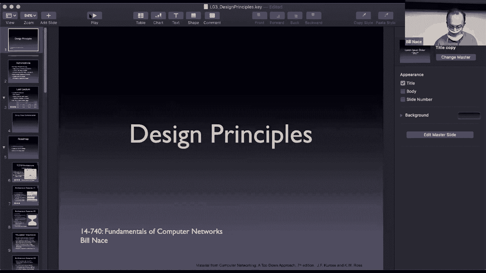
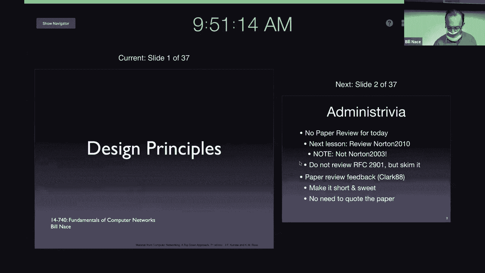
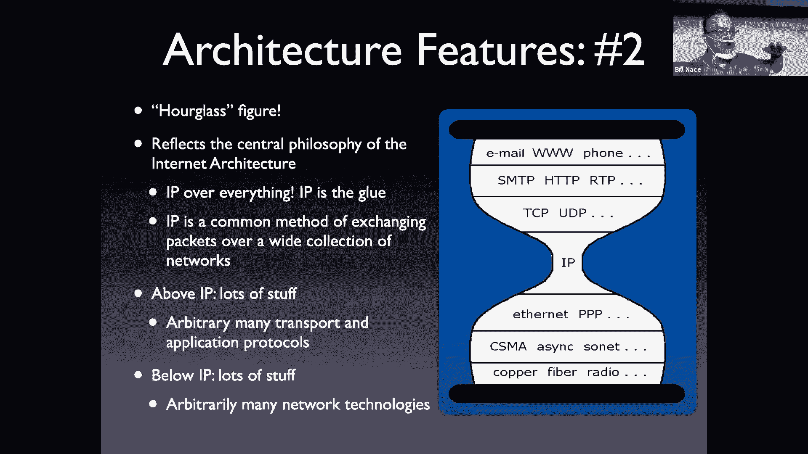
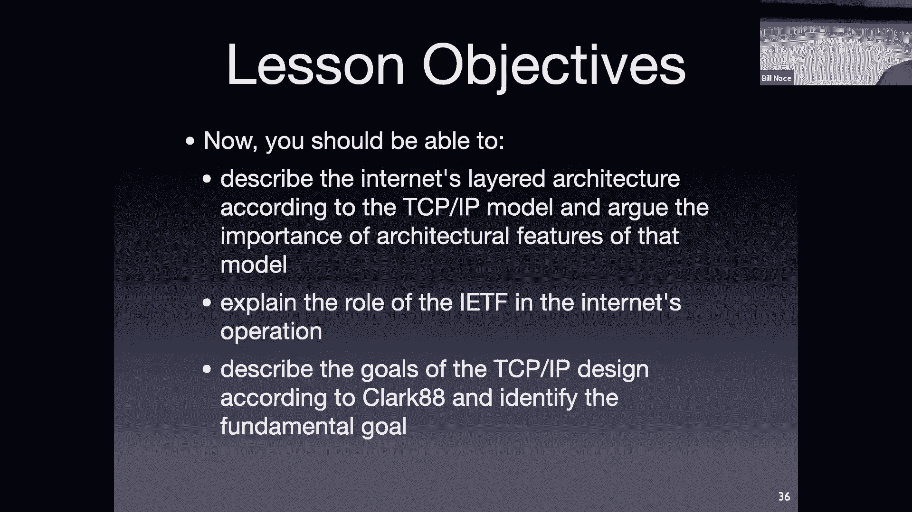

# 计算机网络基础：3：设计原则

## 概述
在本节课中，我们将学习互联网的设计原则。我们将回顾网络的分层架构，并通过一个详细的示例来理解数据如何在各层之间传递。接着，我们将探讨构建互联网时遵循的核心设计理念，包括“端到端原则”和“命运共享”等关键概念。

---

## 回顾分层架构
上一节我们介绍了网络的分层架构模型。这个模型是理解网络通信的基础。为了更清晰地理解数据如何在各层间流动，我们将通过一个发送推文的示例来演示整个过程。

以下是数据从发送端应用层到接收端应用层的传递步骤：

1.  **应用层**：发送端的推特客户端生成一条消息“Hello World!”。应用层将此消息交给传输层，并指定目标（推特服务器上的推特应用）。
2.  **传输层**：传输层将消息分割成适合传输的**段**。例如，将“Hello World!”分成“Hello ”和“World!”两段。它为每个段添加头部信息，包括目标应用和序号（如“1/2”、“2/2”）。
3.  **网络层**：网络层将每个**段**封装成**包**。它在包的头部写入目标主机的硬件地址（如推特服务器的IP地址），以便在网络中路由。
4.  **数据链路层**：数据链路层将**包**封装成**帧**，以便在物理链路上传输（如Wi-Fi或以太网）。它计算校验和（例如，通过算法得出帧“颜色”为白色），并将帧交给物理层。
5.  **物理层**：物理层将帧转换为电磁信号，通过物理介质（如网线、无线电波）发送出去。
6.  **接收端处理**：在接收端（推特服务器），过程反向进行：
    *   物理层接收信号，重建为帧。
    *   数据链路层检查帧的校验和（计算帧“颜色”是否为白色），确认无误后提取出包，交给网络层。
    *   网络层检查包的目标地址，确认是本机后，提取出段，交给传输层。
    *   传输层根据段的序号（1/2, 2/2）将数据重新组装成完整的消息“Hello World!”，并根据头部信息将其递交给正确的应用（推特服务器应用）。

这个演示说明了分层架构如何通过各层的协作，最终实现端到端的应用间通信。

---

## 互联网的设计目标与原则
理解了数据流之后，我们来看看构建互联网时遵循的设计哲学。这些原则深刻影响了TCP/IP协议族的形态。

### 核心目标：互联现有网络
互联网设计的根本目标是**互联已有的、异构的网络**（如军方的不同网络、各大学的网络），而不是从头创建一个全新的统一网络。这一目标决定了其架构必须足够灵活和包容。

### 关键设计原则
以下是实现核心目标过程中形成的一些关键原则：

*   **命运共享与无状态核心**：这是关于网络可靠性的设计选择。与其在网络内部的路由器上维护通信状态（哪种方法复杂且脆弱），不如将状态（如哪些数据包已确认接收）保存在通信的**终端主机**上。这样，即使中间的路由器出现故障，只要终端主机还在运行，通信就能恢复。这被称为“命运共享”，同时保持了网络核心（路由器）的简单和高效。
*   **支持多种服务类型**：网络需要支持不同类型的应用。例如，文件传输需要**可靠、有序**的数据交付（由TCP提供），而音视频流则能容忍少量丢失，但**不能接受重传带来的延迟**（由UDP提供）。因此，传输层被设计为可插拔的，允许不同协议共存。
*   **分布式管理**：互联网由众多独立管理的网络（自治系统）组成。没有单一中央机构控制所有路由。网络间通过协议（如边界网关协议BGP）交换路由信息，实现全球互联。这种设计赋予了互联网强大的扩展性和韧性。
*   **端到端原则**：这一由Saltzer等人提出的著名论点指出，某些功能（如可靠传输、加密）如果在应用层实现就足够了，那么最好将其放在终端主机上，而不是在网络内部的底层（如链路层或网络层）实现。这避免了功能重复，简化了网络核心，并更利于创新（因为更新终端软件比升级所有路由器容易得多）。当然，出于性能优化考虑（如在丢包率高的无线链路上进行链路层重传），也存在例外。

---

## 总结
本节课我们一起学习了互联网的设计原则。我们通过一个端到端的数据传输示例，巩固了对分层架构的理解。随后，我们探讨了互联网设计的核心目标——互联异构网络，并深入分析了由此衍生出的关键原则：**命运共享**保持了网络核心的简单；**支持多种服务类型**催生了TCP和UDP；**分布式管理**实现了网络的规模扩展；而**端到端原则**则在功能放置上提供了重要的设计指南。这些原则共同塑造了当今互联网强大、灵活且可扩展的架构基础。