# 卡耐基梅隆大学 14-740 计算机网络 Fundamentals of Computer Networks（Fall 2020） - P4：Lecture 4 ISPs, Backbones and Peering - ___main___ - BV1wT4y1A7cd

This is 14740。 Wee everybody。 welcome， welcome。Hope you're having a great week。

Hope things are going well for you。 I hope you're in the mood to learn more about networks and the businesses that。

Create our networks and bring our packets from wherever they need to be to us because that is the mission of today's lesson。

Yeah。Let me share my slides。And we can get started。

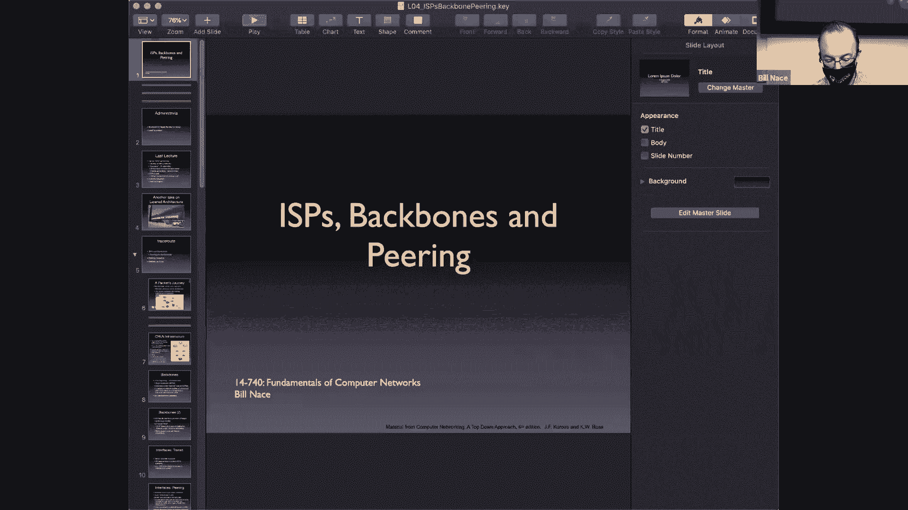

Well this all works out Okay， great。

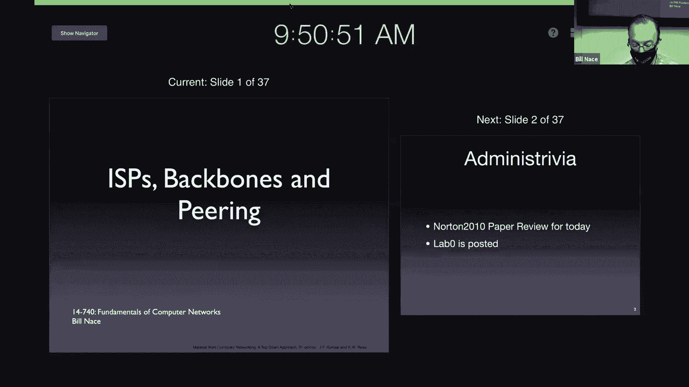

对。Excellent， so we're going to learn about kind of the business side of networks today。

This is one of those things that many times you don't pick up and if you're just looking into technical details of you know。

 layer on layer on layer of how our networks work， but turns out to be important to getting our information actually delivered to us properly。

And the way they evolve and the way they operate has some effects on what goes on and what sort of network technologies get deployed and things like that so a bunch of interesting stuff today before we get there just a little bit of administrative stuff you did a paper review for today hopefully was the correct Norton paper I also want to point out that lab zero is actually now officially posted I made a mistake when I set up the website this semester and I left all the labs and homeworks posted so if you had downloaded it and started done it hopefully it didn't start on it but actually it's not a disaster if you didn't it didn't change much。

But if you had， I want to point out that now the official version is up on the website。

 so you can now get started on Lab zero， which is do Rohi。Yes， do in two weeks or so。

 I think take look at the schedule。没有。All right， last time in addition to having a。

A weird demonstration with envelopes and， and whatnot。

 We also talked a lot about the architecture of the Internet and how the layering works and some of the important features of。

Of how the network gets deployed， including things like the internet engineering taskask Force。

Which is the standards organization that puts it all together。

We finished up where we also discussed along the way the David Clark paper and the different goals of the network。

 as well as the salttzer paper that talked about the proposed end to end argument。Which by the way。

 is an argument， I've heard people use it to try to shut down conversations say well。

 the end end argument wouldn't do that it's just an argument right It doesn't mean that salttz are。

Was always right in fact， in the paper he talks a lot about the careful engineering decisions that one has to make to weigh these decisions about where functionality goes。

I wanted。

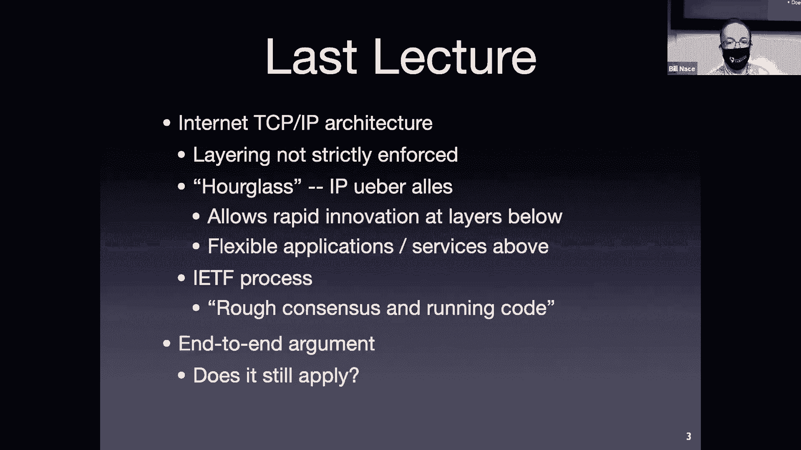

To show you a picture I took also。This is a picture， it doesn't look like much。

 it looks like I took a picture of a parking lot and I apologize for the poor quality of it。

 I was down in the strip district in Pittsburgh one Saturday morning。

 and I'm just driving along and my wife thought I has suddenly become a lunatic and lost my mind because I I was at a stoplight。

 turned out to turn green but I jumped out of the car， fumbled with my camera， no no。

 I didn't mean to open the photos app but give me a camera。

 give me the camera so that I could take this picture。

And she just thought I was out of my mind and the guy behind me was honking at me。

 I'm sure he thought I was out of my mind too because I wanted a picture of a train。

So this is a train and。As you know， trains are an integral part of our transportation system。

 they allow you to move large amounts of freight at very cheap rates， in other countries。

 they actually move passengers around very cheaply as well。

 unfortunately we've lost that capability here in the US。

But but that's what I'm showing here so I'm showing a train who's moving stuff around now trains move lots of things。

Right if you are down at you know waterfront pretty much anytime I want to get out of the waterfront。

 there's a train coming by stopping traffic and that train will have。Coal in it。

 it'll have cars on it， it'll have whatever box cars that I can't see inside and I don't know what's on them。

Trains move freight and do so fairly cheaply。But they only do it between certain points。Okay。

 they only can go where the train tracks are。And so if there are not train tracks。

 then you have to find some other way to move the freight。

 And that's what I'm showing in this picture because。This picture has the truck trailers。😡。

That also carry freight。But they've been put on this train。

Now trucking is another transportation mechanism we have， of course。

 that allows you to move freight around as well， it's not as cheap as a train if you think about pounds you have to move per mile。

 trains turn out to be the cheapest。I think。There's certainly， I don't know about barges。

 maybe that's cheaper， but trains are much much cheaper than trucks。

But trains have the disadvantage that don't go everywhere。

 whereas trucks will basically go everywhere。Okay， and so if you have a bunch of。

Of material you need to move somewhere， you may put it in a truck。 So let's imagine， you know。

 I'm in Indiana。ThatThe small city in Pennsylvania， not the state'。I'm sorry， Jonestown。

 let's say I'm in Jonestown， which is， I don't know。80 miles to the east of Pittsburgh。

 and I have a company。This is you。The United thinging company。

 because I make things and I want to sell them to customers around the world。

I have to somehow get them to market。And maybe there's no train that runs near me。

 And so what I do is I put my thing。The items I have constructed， I put them in a truck。

And I pay the trucking company， I say， okay， here's some money。

 get my things from here to wherever else they need to travel to。

The trucking company may actually find it cheaper， especially if I'm going long distance。

 rather than taking that truck and hiring a driver to drive it across country。

 let's say I want to send it to Denver， Colorado。Rather than actually paying somebody to drive that truck to Colorado。

 they may just pay somebody to drive that truck to Pittsburgh。And here in Pittsburgh。

 where we have trains。They put the trailer of the truck onto a train。

And then the train takes the truck to Denver。Okay， at which point maybe the trucking company then takes their truck。

 drives it to the exact location I need it， and they have fulfilled my contract。

That's a layered architecture。That's I as the manufacturer in the United Things company。

 I don't actually even know whether my parts went on a train or not。

I could probably ask if I wanted to， okay， but I don't care。

 I'm just basically paying somebody and they put things in a truck and it disappears from my view。

And then at some point， the trucking company takes advantage of the service of the next layer down of the layered architecture。

The train is a layer of this architecture， which provides the service of moving stuff long distance very cheaply。

Does that makes sense， do you see the layers there？嗯。

But the thing that excited me about this picture， why I jumped out of a car and took it。

Is because there's a third layer here。Who owns。Those trailers。

UPS right the logo on the side of those trailers is from UPS UPS is not a trucking company。

UPS is another company that moves stuff around。They end up being another layer in this layered architecture right because inside the truck there are boxes and where did those boxes come from that came from you and me we put。

You know， Christmas gifts for grandma in a box and we carried it down to the UPS store or had the UPS guy come and pick them up。

Okay， and from our perspective， now we're a layer above that right。

 we are asking for service from UPS and the service we ask for is move this box。

 the small amount of material from my house to grandma's house。Okay， and UPS， of course。

 we don't care that it goes in a truck， we don't care that it ends up on a train。

 Those are lower layers of the architecture that we don't even notice。But UPS。

 in order to optimize its efficiency， it is providing the service of moving small boxes from lots of people's houses to lots of other people's houses。

And so what it does is it collects them all together in one place。Puts it into， I don't know。

 do you want to call that a packet？Puts all of our boxes into a bigger box。Takes that box。

 drives it part of the way whereupon it gets on a train to go the further distance。

We have a layered architecture here。Okay， and actually once you start looking for layered architectures。

 once you think about them a little bit， you'll find them all over the place。

Definitely in the transportation system。So that's why I jumped out of my car and looked like a lunatic。

And had a guy behind me honking at me so that I could get this cruy picture one Saturday morning down in the strip district。

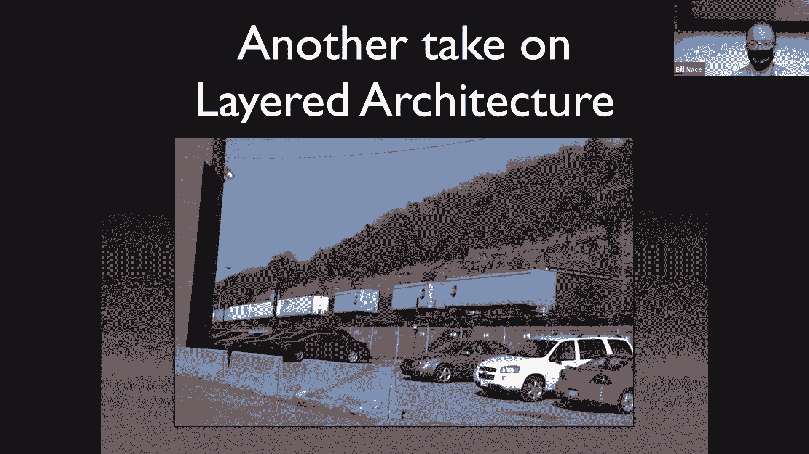

All right， on to more material。Let's talk about businesses。

 let's talk about internet service providers and backbones。

What we're trying to do is take the knowledge you have now about how。

Packets move through the network right now， you should have this view。

That when an end hostst sends a packet， it goes into the network where a bunch of routers move it hop by hop from your end host to the destination end host。

So that's one kind of fact you have about how packages move。

 You have another fact we talked about last time。 What was the fundamental goal that David Clark pointed out in the paper。

The fundamental goal of the internet。是。To connect existing networks。

To take networks that were already there， what's in that network， oh。

 it's a bunch of routers and we're going to take that network and we're going to interconnect it with another network。

 bunch of routers。Okay， so actually your view of how the packet gets from one place to another is that it does travel from router to router to router。

But each of those routers is ownedd by a different company。

By a different network to cut network together。And so your packet will travel。

Across maybe five routers in one company and then hop over to another company where it's going to travel across seven more。

And it will go from company to company to company to the end hosts。And in each company。

That is a network of a bunch of routers。So today we're going to talk about how the companies get together and work。

I'm going to start off。Up at the beginning for us here in this room at least。

 and that's on CMU's network， so I think we might as well understand a little bit about what happens。

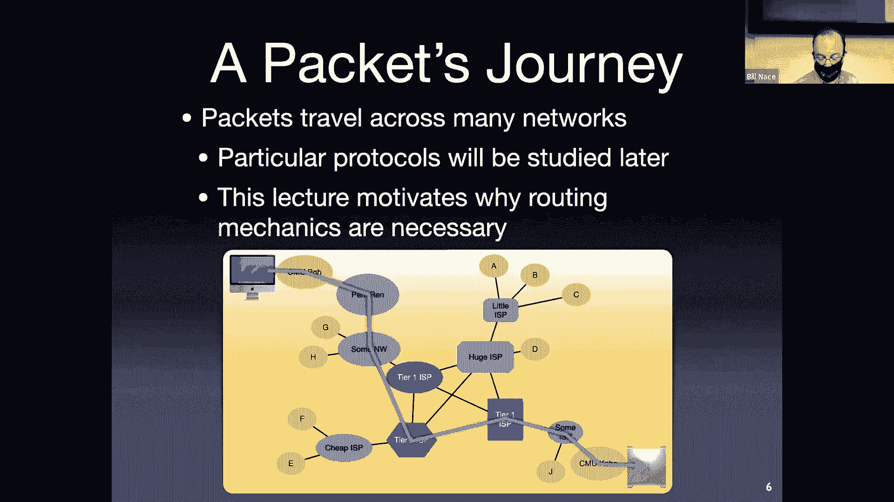

At CMU now CMU， of course， we run our own network。Right now， you and I。

Those of you here in economy are in the red cloud down at the bottom。

There's a bunch of internal stuff right my packet is going to an access point over there in the wall。

 I don't know what happens to it after this。Okay， there are probably several switches and routers connecting that point。

To the border of CMU's network。And at that border there are these four routers。

 this is a very standard configuration， you take four routers and you cross connect them。

And the idea is if any one of those routers is to crash， there's a path around us。Okay。

 so our packets inside our four reasons that we will learn later are going to end up going to one of those two routers on the bottom。

And then there's a choice depending upon which one is working or not。

 of which of the routers there at that dividing line that our packet will travel to。

And then it's connected to the great outside， the great world。

 it's interconnected with other networks。And in our case。

 we're interconnected with three different networks。

The main interconnection is that one in the middle to Pittsburgh Supercomputer Center， PSC。

It's an internet to site。Whi is a research network that is funded by the US。 government。

And we have very good connections to that1010 gigabits per second connections out to Pittsburgh Supercomputer Center。

 which， as you can guess is in Pittsburgh。Okay， and those。

 I guess I should point out those two the actually the routers we have here are。

They're kind of big our routers， they're not the router you would go down to Best Bu and pay 100 bucks for okay。

 these are enterprise level networks。Network equipment。They are from Cisco， 6500。

Models 65 yes 6500 versions you know we I don't know how expensive they are。

 but they're in the tens of thousands of dollars range for each of those and they are。

Designed to go fast， they have a lot of hardware to help them move packets quickly around。对。

And so they will take our packets and probably today all many of my packets are traveling out of Carnegie Mellon。

Across one of those two routers， they're， by the way， in different places。

 okay one of thems in S Hall ones in Ste House， that's just in case S Hall burns down someday。Okay。

 we don't want all of our connection to the internet to burn down when that happens。

And if St Hall ever burns down， I have an alibi， it's not me， okay？You'll notice， though。

 at each of those points there's a。Different choice that could be made。 Most of our packets， yeah。

' going to go off to Pitsburgh Supercomputer Center For one， that is the fast link。

 That's where we'd like most of the traffic to travel。But again， redundancy is important。

 What happens if something cuts through one of those fiber cables right What happens if。

You know you know， there's some street work somewhere and somebody with a backhoe happens to cut one of those cables。

We don't want all of our traffic to suddenly stop。And so that's where the two connections on the side come from。

 those are redundancy links to two different networks。The Pennsylvania Penn Renaissance。

Network Penren。Is a network that's run that connects a bunch of the educational institutions in Pennsylvania paid for by Pennsylvania state taxes to allow education to connect to the internet and apparently we pay about $40。

000 per year to help maintain that for our connection to them $40，000 sounds like a lot of money。

 I like to think of it as about three quarters of an undergrad tuition。

 okay so when you talk about these numbers you talk about it in terms of student tuition values。

And we also then pay to two other， we pay some to Pittsburgh Supercomputer Center。

 we also pay to level three， which is a commercial company。Okay。

 we pay approximately one grad student to each one of those。Okay。

 and they provide good connectivity as well as this redundancy link。

 so there are choices when your packet leaves to you which way it's going to go。

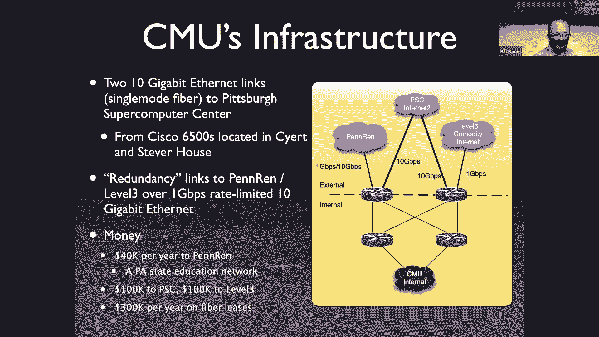

Now this has evolved in the beginning back in the 1980s。U until the early 90s。

 there was a single backbone。Instead of having lots of different companies and choices about who you would connect to。

If you were on the internet at that time， you were connected to a network that was run by the National Science Foundation。

And so it's known as NSFNe。And。That grew up out of the DARPA experiment okay so DARPA started building this network connected a bunch of colleges together and then DARPA said。

 hey， we are an advanced research project agency and now that everybody meaning all of the academics at universities mainly now that everybody's on the Internet it's no longer advanced so they gave it to the National Science Foundation to run。

And the National Science Foundation basically was paying for researchers at universities anyway。

 through grants， and so they built this network to allow those researchers to connect。

 to carry on the work that was starting with our internet。

As a backbone network that meant there were basically no conflicts。And no choices。

 you would connect to NSFNe or not。And so。You know， there wasn't any， any decision making about it。

 there weren't any， you know this company fighting against that company sort of things and everybody that was connected to NSFNe got connected to everybody else。

 no connection problems。But after a while， National Science Foundation looked around and said， gosh。

 there are these other companies that would be happy to run the networks。

 we should get out of the backbone business。We are a government entity。

 we're not really supposed to be competing with commercial entities。

 so let's go ahead and transfer this technology。Which in government， research and technology worlds。

 technology transfer is a great thing。You take something that taxpayers are paying for and you make some companies do it and those companies get paid instead by the people who want that thing instead of forcing all taxpayers to pay for it。

Okay so that's a good thing that that got transferred。

 but it does not mean that we don't have a single entity anymore that is providing all of that connectivity we have many entities that are competing for that。

 but we still expect。But when I send a packet， that packet can go anywhere in the internet。

Without having any connectivity trouble， there's no kind of like oh。

 you're not part of the correct organization or you're not paying enough money to the right people to get your packet to someplace。

 we expect that our packets when they travel will go anywhere that we have global connectivity。

Now there are two ways that connectivity works， and I'm calling this an interface。

This is a business interface now， not a technology interface。 We're going to talk about interfaces。

For much of this course， where we're talking about how this thing connects to that thing and usually it's a。

 oh， we have a fiber optic link that will connect them or we have an ethernet cable that will connect them and it's a physical technology thing。

Today's lesson is about businesses， though， this is a business connection between two companies。

And one， so there are a couple ways that two companies can get together and decide to exchange packets。

The first one and the most obvious one is called transit。Okay， this is what you do， right。

 you pay a company to move your packets for you。Yes， it's a strict。

There's a company who's providing the service。There's a customer that's you or some other business。

And you pay them money and they will allow you to connect to their network and they will move your packets for you。

And you can pay them。More money， maybe to get more service right， if you want faster interconnects。

 you go find a grad student and give them to level 3 and you now have。You know you paid $100。

000 and you get really， really fast connectivity or like you and me probably can't afford that so we're happy。

To pay Verizon a monthly chunk and they take their packets around， that's called transit。

There's a transit relationship。Between customer and provider。

 and that's the one that you probably know that makes sense， everybody's doing that right。No。

 it turns out there's another interface that's important。And that's a peering interface。

 Now before we get into what peering means。😡，I want to give you a warning。

We're going to see this a lot， by the way， in this course。Turns out people， technologists。

 use the same words to mean different things。Okay， and so we have to always be cognizant of the context of how that word is used to make sure we're not getting things too confused。

And I'm warning you here because peer is one of those words。😡。

We're going to run across in this course in four different forms。Okay， so fort， well。

 two of them almost mean the same thing。But but basically we're going to see the word peer PEER used to mean different things。

😡，Okay， and this is very confusing。For the initiate who is just starting to learn networks。

but we'll also see port is another one that's used all the time for different things okay peer。

 in fact today。Sorry， today we're going to cover two of those。

 we're going to use the word peer twice in this lecture to mean different things。Okay。

 so I'm sorry it works out that way。The problem is you basically have。

People at different layers of the network stack who are solving problems who think of things using concepts。

That are anthropomorphifies or real word concepts and they say， oh， it works just like。

Just like a port hole works on a boat and so therefore we use the port for something at one layer and something else at a different layer。

 same with peer okay peer is a word that comes from before networking。

 but we use it here because we're talking about equals right peers you know your peers are other students here at Carnegie Mel people who are you know roughly you're equal or your similar status。

Okay， you can use the English use peer in their government as well， peer is a well known word。

And we're using it here because these companies are kind of equals。

OkayThere's no power differential with a transit relationship。

 there's a power differential right one， the company is the one who has the power to move your packets。

And so you overcome that power differential by giving them money。Okay， with peering。

 that's not the case。 you no longer have。Only one side who can do things now with peers。

You're roughly equal。 You have two companies。Both of whom can move packets。

OkayAnd so they come into a peering relationship。Because they have packages that they would like to transfer to the other company。

 and that company has packages they would like to transfer back to the first company。

And so that's where kind of this equivalence relationship comes from I have two organizations I have company A and company B company a has。

Usually customers who are creating packets that need to go to the customers of Company B。Okay。

 and company B is similar， has customers who want to send packets to company A。

And so rather than getting into a relationship where one pays money to the other。

Both of them could argue， you know， well， you need to pay me money and you need to pay me money。

OkayAnd it basically becomes offsetting penalties。okay， yeah you're right， we could give you $10。

000 a month and you could give us $10，000 back and in the process all we would have done is made money for our accountants。

Okay， the the money would just travel back so basically they want to say let's come up with a relationship where we don't shift money back and forth。

 where we don't have to have a transit relationship。

 we have a peering relationship because we're kind of equals。Okay。

 and so I will send you packets and you send me packets and no money changes hands。Okay。

This will work as long as both companies are sending roughly the same amount of packets。In fact。

 the rule of thumb is a factor of four。As long as however many packets I send you。

 you send me somewhere between a quarter of that number and four times that number。Okay。

 if you're outside that range， then somebody needs to pay money becomes a transit。Relationship。喂。

And so peering is we're just going to get these two companies to exchange traffic。

They're just going to give traffic to each other， but no money Trans was。

Packets go one way and money goes the other。Pering is a packets go both ways。

 no money goes anywhere sort of relationship。诶。And so what ends up happening is the Internet service providers。

 the networks。Have kind of organized themselves。Into these tiers and so we talk about a tier one Internet service provider。

Okay，8。Youre doing this right yeah， Tier one Internet service provider。

 a tier one Internet service provider is one of the big guys in some company in some area。Okay。

 the idea is they will charge transit for lots and lots and lots of customers。

 so they're mainly just。Big gorilla Internet service provider and they are known as the tier ones。

 the top guys。Here in the US， who are some of our tier one。ISPs or T down in AG and G。Yes。

 Verizon and AT&T are definitely in that list。 There are others oftentimes you haven't heard of these right level three century link。

 some other ones， oftentimes they you don't hear about them because they're not coming to us for money。

Instead， they are connecting like level three connects CMU。Right， and so they are。

 they're focusing on the enterprise market， not the customers。 How about other countries。

 I'm sure we have students from India who are。住院。诶我哋诶。Okay， you've listed a bunch that I didn't list。

 I know of Taka I don't know much about Indian telecommunications， sorry Alliance digital。Alliance。

 okay， yeah， this is not an exhaustive list， right， there are big guy companies。Around。China。嗯。

Trying to tell Tom， yeah。A bunch of others to start with China， I know China， Unicom， China Mobile。

 some of those we think of as maybe cell phone companies。Okay remember。

 cell phone is an end host device these days。It's basically a computer connected to the internet。

All right， so yes， these are the big companies。You do have to be a little careful， though， Okay。

 Tier one。Here's the actual definition of a tier one。 It's not。

 They make more money or spend more marketing dollars to get you to know about them。

 A tier 1 provider。Peierers with every other tier one company in its region。OkaySo within the US。

 AT&T's Verizon， is it going to be sprint or I don't know？The big guys all peer with each other。

 they have so many customers that it doesn't make sense for AT&T and Verizon to trade money。😡。

Instead， they trade traffic back and forth。And so they peer with each other。

Now they don't necessarily I don't know， but you Tata probably does not appear with China telecom because they probably don't have a whole lot of traffic going to each other。

Okay they may not even connect to each other I don't know is this why is this sort of part of what's led to sort of the the local monopolies of big telcos where you you know there's less competition in a given region and is this part of the reasons for that？

It is related so the question is you know a lot of places like the US have monopoly companies or a few。

 maybe it's a duoppoly or something like that， how did that happen right and there is some of that pressure here okay we'll talk in a minute about tier2s and what happens to them。

I firmly believe， however， that a lot of the monopoly or duopolis landscape we have today is due to regulation and how governments have responded。

 in many cases， for instance， governments have been lobbied by these guys to make it hard for anybody else to start a company or come into the region。

And so that helps create or maintain a monopoly when that happens。So I。

I think I was starting to say that we do need to be careful。

 companies like to say that they are a tier one company。Okay。

 because it means oh I'm the big guy right， nobody wants to say， oh yeah， I'm not the greatest。Right。

 and so you'll find。Companies that probably are not tier one companies saying they are。

 but for marketing reasons or reasons like that。By the way， if you go to some of these companies。

 you can find out what their networks are kind of like and see most of these companies will have a network map。

 this is the network map for level three。

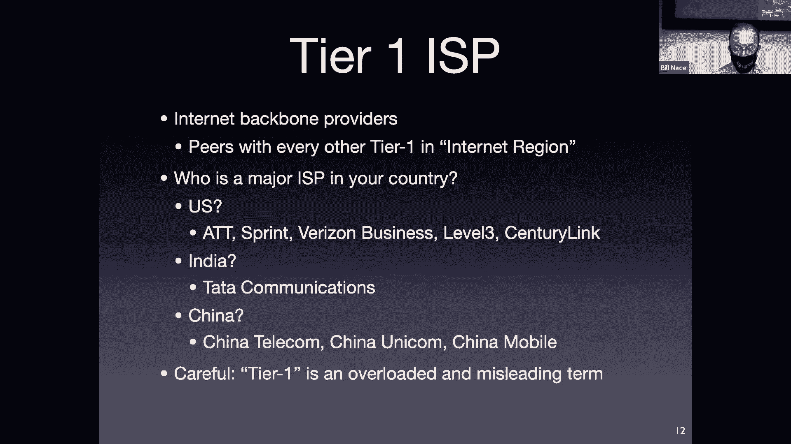

And you can see it's all like， here's this geographic thing with a bunch of lines and connections that show where they have a presence。

And so you'll see level three is big time east coast of the US， but also has some。

Some tentacles going elsewhere right， they have some links in Europe。

 they have do have links to the west coast of the US。But you'll also notice they aren't everywhere。

All right， so tier one does not mean that they。Go everywhere。

Ter one means they're big enough that they peer with others。

 so if you need to get your packet off of level three to somewhere else。

Level three will connect to other networks remember fundamental goal of the internet。

But they just do it without passing money back and forth。Right。I also like this one by the way。

 I've included a photo from the same website that is levell three's Network Op Center。

 just want to point out that if you're running a network like this， yes。

 you probably need a way to control it。To make sure you can detect if there's bad events somewhere and handle them。

 And so most。Big ISPs have a network operation center that looks something like this。Okay。

Which I find interesting one of my first jobs in the Air Force was building command centers。

 it'll look like this。Okay and because they're doing basically the same job they all have the set of clocks for every time zone around because it's too difficult to subtract three to figure out what climate is somewhere else apparently they all also have these big screens around the wall that show maps you know in the Air Force it was big maps that show airplanes going places。

And then they have a bunch of computers and people you'll notice those people are never looking at the clocks or the maps on the wall。

 okay the clocks and the maps on the wall are for visitors so that visitors say oh。

 this is an important place， the people down there are doing their work with telephones with individual computers and they're noticing if something's going wrong what should happen and how to take care of。

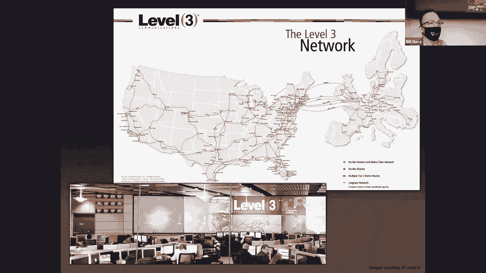

哎。Here's another right， this is Verizon。Vorizon global Network。

 right you'll notice we're trying to push this idea that we're everywhere。Okay。

 even though clearly they can't actually be everywhere。

And they will have to peer with others to get your packet somewhere we're going to from a marketing perspective say we're global。

 we can get everywhere。And you'll notice they do have links all over the place。And by the way。

 this does not mean necessarily that they own those links。Okay。

 it means they have a lease to use those links and so a lot of times especially the undersea cables are owned by some company。

They built the cable， and then they leased that cable to Verizon。To actually send traffic down。

So lots of different interesting relationships here。Here's another one。

 this is Taon discover the world's largest global footprint。Again， pushing the idea。

 my company can get you anywhere， even though it definitely isn't true。Right。But yeah。

 here's our picture， if you look carefully， many of those links are the same ones on the Verizon page。

Okay that's because that undersea cable， when you lease it， you don't lease it exclusively。

You say yes， I need this much bandwidth and the undersea cable company will say， okay。

 we'll give you that much bandwidth。Out of this big chunk of bandwidth we have。

 and we're going to sell the other pieces to your competitors。

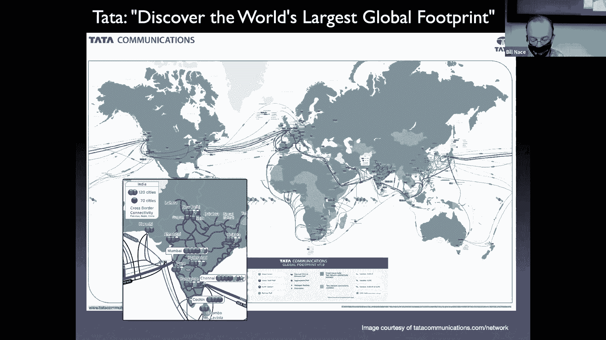

The tier one company has a lot of high speed lengths。

They pay a lot of money to get good connectivity， to get good equipment in place。Okay。

 so they're going to operate， for instance。This is actually a couple years old when I learned level three was running 40 gigabit per second and probably at 100 gigabit per second right now。

 DwDM dense wavelength division， multiplexing networks。Okay。

 that basically means they have fiber optic cables and they have lots of different channels。

 each of which is a different wavelength of light， that's why they're called wavelength division multiplexing。

嗯。And that lets them pump lots and lots of bits down those connect。

They pay a lot of money for routers， Cisco has routers that cost a quarter of a million dollars。

That's because these guys will buy them。系。They also tend to have way more bandwidth than they need。😡。

Which seems counterintuitive， right， but for these networks live and die based on very few networking events。

If your company is having trouble because。Verizon is dropping a lot of your packets。

 You're going to go to a competitor。And so it turns out to be cheaper for them to over provision to have three times the bandwidth they actually need。

They'll pay money to do that because it helps them retain customers or get customers from their other competitors who don't have that much bandwidth。

Okay。And so they'll have very low delay lengths， very low loss sort of length。The tier one companies。

We said the kind of the definitionally， they are。Peering with other tier1 networks in their region。

Okay， so Verizon A& T peering together， that means they're going to be connected to each other to make that happen。

They're also connected to oh， guess what， if there's a tier one， yes， there is a tier two as well。

 we'll talk about them in a minute。Okay， so there will be a bunch of tier two networks that connect to these guys。

Okay。They are very vertically integrated right a tier one company。

 you know Verizon does not just sell moving packets from place to place。

 they're also going to sell all kinds of services， some of them are weird things at least for network company to do like video on demand or something like that。

 but also from a vertically integrated perspective。

 they will also sell things that help you manage your own network。

So that if you are a tier2 internet service provider。

 your job is a little bit easier if you come to Verizon than if you go to AT&T。that's why they。

Add those sorts of services。Ter one networks don't pay anybody else， I guess they pay for。

For all that connectivity， they pay Cisco for equipment。That sort of thing。

 but there's in this relationship when we're talking about internet service providers other networks pay tier ones tier ones don't pay anybody else。

 they're peering with each other。To provide global connectivity。

And peering is a relationship where you do not pass money back and forth。

And then they have a transit relationship。With tier2s。

 that's how they get their money Tier two networks pay them money to connect。

So I probably mentioned this。Questions for today。 why do they need to peer with each other。

 Why your tier ones peer with every other tier one in their。In there。Internet region。Anybody， zoom。

 anybody？Why does AT&T need to peer with Verorizon？Like you。对个。这个。Okay。

 so your point is a little bit more technological than I was looking at where you're saying oh the packets may have to flow back and forth and so no point in that。

对。Yeah， there's the key and that is the actual reach of the group right none of those tier ones I showed could actually get a packet to every place in the world。

So they rely on other tier one companies for connectivity to other places。Okay。

 and so that makes the internet this network of networks that we see because of this tier one networks。

 tier one companies have what we call a restrictive peering policy。

That is they do not actually like to peer with others。

 they will only peer with another tier one who gives them something， who gives them connectivity。😡。

To more of the world， if somebody else comes to them and says， hey， I am you know。

 I have my own network in Pennsylvania that you know。

 covers these areas and I'd like to appear with you that tier ones are going to laugh at them。Okay。

 I'm going say no， you want me more than I want you， therefore you need to。

 you you build with your tiny little Pennsylvania network。You don't have global connectivity。

 so you need to connect to the tier1。So we're not going to appear with you。

 we be glad to take your money in transit。But we're not going to appear with you anybody else other than some other tier one。

Is a customer for a tier one company so they don't want to peer with them。

 they want to take money from them。So there's no incentive there。All right， that was tier one。

There are also tier  two companies， tier  two internet service providers。

A tier 2 internet service provider is also a network。It's also a company that has routers。

 network engineers， a network operation center， all that sort of thing。

They just don't have the reach of a tier1， and so they're not able to force the others to peer with them。

😡，Okay instead to get global connectivity， they have to be a customer of a tier one。😡。

Even though they are running their own network。It's just not big enough。

And doesn't have enough customers and enough traffic for the tier one to feel compelled to peer with them。

So they end up being a customer of the tier one， so they have a transit relationship with the tier one。

Internet service provider， they will pay money。To AT&T and AT&T will move their packets around the world。

Okay， now they still make money。And they do that because they have their own customers right they have found some way of collecting Bill's Pennsylvania network company has somehow found a bunch of customers who will connect to my network。

It'll provide the traffic that makes it sense for me to pay money to a tier one and so I will have gotten all those customers we say they provide the customers to the network right basically that means there's a bunch of traffic coming from the tier two customers that needs to to travel out to the world。

 that means all those customers pay money to the tier2 that's how the tier two survives。

They have more money coming in from customers than they have to pay to the tier one for transit。喂。

Now， that seems very obvious， tier ones and tier2s。Per ones peer with each other。

Tier ones provide transit to the tier twos。系。Turns out the tier twos have a little bit of power of themselves and they do this by peering with each other。

Okay， they can find some other company。And connect with them peering wise。Okay， and again， that's a。

That's a not a transit relationship so no money passes forth just traffic passes between them and so we end up with a here's my slightly different picture right where I have in blue a bunch of tier one internet service providers that are peered with each other so have've got little you know black lines there showing some of the connectivity and each of those blue guys has。

Some okay， often many tier two Internet service providers that are connected to them。

Okay but also the tier twos get together as well， and so you'll notice there on the right I have a yellow line between two tier 2 ISPs。

And that line is a peering relationship。Okay， basically you've got two companies。

 Joe's Pennsylvania Network and Bill's Pennsylvania network。Have gotten together and said，ooh。

 we should peer with each other。 I have a bunch of traffic for you。

 You have a bunch of traffic for me。 Let's connect together。Yeah。Alright， so couple questions。

 then this one should be obvious， right， Why do the tier2s need to pay。The tier ones for transit。

Why does bills？Small Pennsylvania network company。Need to go to AT&T and give them transit dollars。

不跟你个签字。Yeah， I need to provide that connectivity， my customers from my tier two customers expect to be able to connect to the world or they wouldn't come to me。

So in order to connect to the world， I have to find a tier one。😡，And connect to them。

And pay them transit， make that work。哦。Okay， so now you're kind of in the head of a tier two Internet service provider company。

You are， youve found a bunch of customers and they're paying you。

 so you have a transit relationship with them。OkayIn order to provide your customers with connectivity。

 you have to buy transit from a tier one。So now you're in the right place to answer this question。

Why do the tier twos peer with each other？Two slides ago， I told you that they do。But why？

What did they get out of a peering relationship？So here I am Bill's small Pennsylvania network。

I go find Joe's small Pennsylvania network and I say， hey， we should peer together。

 what's the motivation there？反正反这个。佢啲你嘅个。系佢都好。I'm sorry， how does peering make sense in that case？

上就是。不。Yeah， so。So the point made is a good one right the answer is that the tier two companies peer with each other。

Because they're going to lower their costs， right they're sending traffic to each other。

If they did not peer， what would have to happen to that traffic？

That traffic would have to go to a tier one。All right， so all the traffic。

All the customers of Bill's network。Who want to send stuff to Joe's network。 If I was not peering。

 all that traffic would have to go to my tier 1。Okay， and then possibly over to Joe's tier one。

 those could be different。Okay， and then to。Down to Joe's network。And in the process。

 what would have happened， oh， I would have had to pay transit on that。Okay。

 because I now would have more bandwidth going to my tier one and Joe would have to pay transit。

As well。Okay， so huge， huge reason for this is a money reason， a financial reason。Okay。

 I'm going to save money or any tier two is going to save money。By peering with other tier2s。

 because that removes traffic that they would have to send to the tier ones。

Which they would have to pay transit for okay so now I can have smaller bandwidth to tier one I have a smaller bill each month to them。

Also， I end up improving the performance。If you think about what's happening to those packets from my customers to Joe's customers。

 both of us being tier twos。Those packets are being directly connected instead of going up to a tier one over maybe to some other tier one。

Then down the Joe， right now， I've got a direct connection over to him。

 And so in from that perspective， the actual performance of those packets can go faster。

 and we do care about that。 The Tier  two networks do care about the performance。

Because that's one of the things they sell to their customers if I have slow perform if some customers having a you know slow packet day。

 they may go to my competitor。嗯。Tier one companies we said， have a restrictive peering policy。

Alright， they don't appear with anybody unless they're forced to。

And they're only forced usually to peer with other tier one companies。

Tier two companies have what we call an open peering policy。Appearing saves them money。

Peering gives better performance to their customers， and so they would like to peer。

 They will peer with anybody。For whom they can or anyone that it makes sense to appear with。Now。

 this doesn't mean that every tier two company wants to appear with every other tier two company in the world。

Because there are costs associated with peering， there are clear benefits right the benefits we just talked about right less traffic to my tier1。

 better performance， those are the benefits。But we have to weigh those benefits against the costs if I'm going to connect with somebody else。

 there is a management cost。We do have to get lawyers together there will be a legal agreement drawn up right there is some。

Some management that's going to have to go on to make this happen。

There's also a cost of the equipment， somehow we have to get a connectivity between my network and their network。

Okay， we don't just magically make that happen， but have to somehow string a cable between us or lease a line or find some way to connect the to companies。

And so these two costs have to be weighed against that benefit。

In the paper Norton calls this like the peering break even point something like that right there is a point at which there's enough traffic for this to make sense if you don't have that much traffic。

 then the costs outweigh the benefits。But once you cross that peering breakeven point， then yeah。

 let's peer with anybody who wants we're saving money， fantastic。Does this make sense？

Tier one companies， tier two companies。Okay。There are others in the mix， I to point out。

 these are the customers， basically the content providers。

There are many companies that are not internet service providers that are on the internet。

Ca these the content providers， you know them because you know you go to their websites or you use their apps or things like that right and there are two categories of these。

There are some of them that are content providers。 That's what they do， right， They are。

 they put out you know blogs， and they。They run some interesting websites。Okay。

 they have gaming apps you use。 That's their job。They are not network people。

And so for their perspective， they're perfectly willing to just pay the bill every month。

 they'll complain about it because they don't like paying it。Okay who likes paying bills？

But they see that as a cost of business Oh yeah， I got to pay this tier two network company that I'm connected to I got to pay them a monthly bill Otherwise nobody can get to my stock。

Okay that's the category A。These guys don't want to be doing anything with networks because they're you know。

 they're writers or game designers or something like that， not network engineers。

There's another category of content provider， however， this category B。

 we call them the sophisticated large scale players that almost sounds derogatory to category A。

 and it shouldn't be。OkayCatery A is making money doing their thing， it's fine。Right。

But some companies do have some network expertise。And they do want to get involved in lowering their costs。

 and they do want to kind of run their own network。And so it may not be their main thing。Okay。

 maybe their main thing is you know， running a search engine or selling ads to social media people or something。

Okay， but as a result of that， they often have the sort of engineers who can do this sort of work。

And they can realize， oh， we could save money by peering with people also。

We had the expertise to buy a router and connect it to that company and thus peer with them。

And we have enough traffic that that company will once appear with us。

And so they also tend to have an open peering policy。

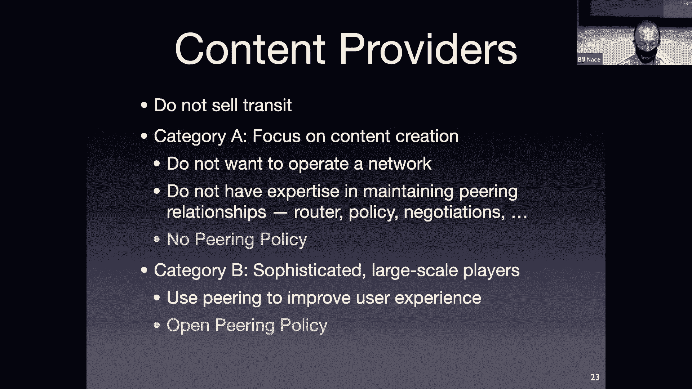

So you end up kind of with this hierarchy。Okay， you bet the tier one guys up top， right。

 they're peering with each other。Within their region， they do not pay transit to anybody。

You've got a tier two layer， right those guys aren't big enough。

To get the tier one to peer with them so they have to pay transit to them。

 but they would like to hang out with each other， though they would like to save their money by peering with each other。

And then at this bottom level are the content producers。Companies， universities。

Some of whom will have the expertise to peer either with each other or more likely with a tier2 ISP。

And others are just content to do what they want to do with it。involvess making content。Oo。

 homomorphism。 I use content and content。It same sense， awesome。

I do want to point out this is a model right it's not always this clear cut you start asking wait a minute。

 where's that company， you know， this particular company actually has all its servers in a data center of some other company。

 does that mean they are sophisticated or not？That's not the point。

The point is we have this hierarchy， this model， we can talk about things and help understand how transit works and how peering works and things like that。

And yes， there are plenty of exceptions。Any model is a bunch of abstractions。

 and it doesn't always fit the real world exactly。And that's true here， as well。

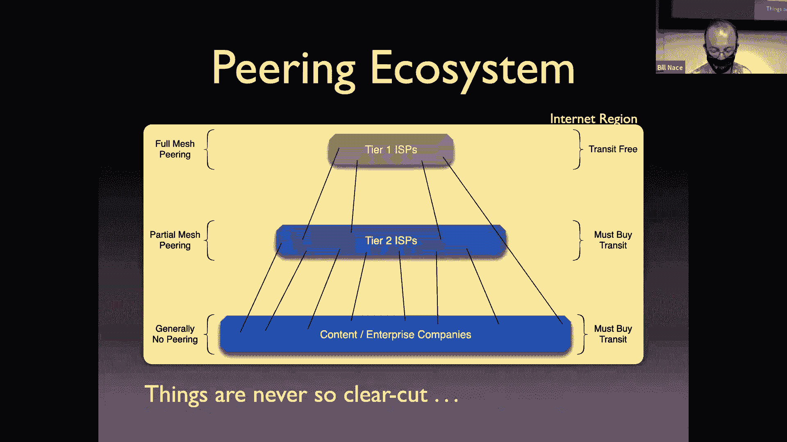

In the paper you read， there were a few comments about how hearing has changed。

What the network landscape has been like over the last couple decades and it's been kind of interesting we had you know the backbone。

 the NSF net go away in。91 or 92， something like that early 90s。In the 90s， then late 90s。

 we had bunches of companies doing internet things。

 basically any company that had internet in their word or did internet things automatically had their stock jump huge amounts and that went on up until we had a bubble that burst。

At the millennium， basically。And that economic collapse。

Meant a bunch of things for one many of those companies now had laid fiber all around the country and all around the world and then they went out of business and so other companies were able to swoop in and buy that fiber very cheaply or buy the equipment there was a bunch of routers on on the market and you couldn't quite go to eBay and buy quarter a million dollar routers cheap but it was almost like that。

And so there's a lot of stuff that venture capitalists had basically paid for。In the 1990s。

That went into the networking world in 200020 2003。Okay。

As well as we've also seen the amount of traffic growing hugely。

It got blamed in the paper on things like peer to peer file sharing， ohh， by the way， peer to peer。

 that's a third use of the word peer。Okay， that doesn't mean anything about companies。

When we talk we'll talk about peer to peer file sharing in a couple lessons。

One of the other things that's happened a lot though is networks have gotten faster and cheaper。

 easier to run， it's a technology world and technology tends to grow exponentially and so that means the cost of running a network。

Per bit scent has fallen dramatically。Exponentially， in fact。And so here's a graph showing。Prices。

 transit prices that were being charged， and if you look back on that。

 can you imagine in 1998 paying $1200 per megabyte per second？

So that's a monthly cost you would have paid。Per megabit per second。

 how many megabits per second do you generate？I don't know。 I was downloading。Iow 13。7 last night。

 that's 13 gigabytes。Okay， that's a lot of $1，200 I would have had to spend。Okay well， luckily。

 maybe in 1998。Nobody was downloading Giab bite of anything。And so what we've seen is。

The demand has gone up， hugely。We're using the networks way more than we were。

 but the price for each of the bits we're sending has gone down hugely。

This graph makes it look bad for the tier1 ISP， it looks like oh。

They're not able to make much money now because their prices。

 the price they could charge others for transit has dropped by a couple orders of magnitude。该。

Nobody is really crying because AT&T is going out of business， are we？

I meanThey're doing just fine and that's because the actual demand has been going up faster than the transit prices have been falling。

有。Lots of content companies now are appearing。Right we have this showing this was not happening so much in 2000。

 but now we have a lot of these big companies that are running their own networks。

 running their own data centers， and so they're more able more capable of peering with either each other or with。

The tier2 ISPs。And of course， that means less money for tier one， right。

 the more peering that happens， the less transit has to get paid to tier ones。

 and that sounds bad as well for tier ones。Again。This is offset by other factors。

 we're not crying for AT&T or for any of the tier ones。Okay。

Does this all make sense from a business perspective。

 how the different businesses would interact and work with each other？And the in this。

You know this again it's a model of how businesses work there's no peering police that are going to show up and say oh you're sending five times as much data as them you now have to pay transit or something like that okay and all this is you know。

Is tangled up in the individual agreements between each of the businesses this is just kind of the broad stroke of how things generally go。

Okay。I'd like to move on then to another topic， which is closely related。

And that's how we actually make the physical connections。

We have a bunch of these companies now that want to connect right somehow company A is going to be a client。

 a customer of a tier one， that means they need to pay transit， how's that going to happen？

The paying the money is the easy part how do they actually get connected so that their packets send someplace and that's this interconnection question。

 how do we actually get two networks to connect together？

We will learn more of the details of why this works。When we start talking about routing。

 which is a network layer phenomenon。Okay， but for today。

 we're going to think about the physical connection， just how does company A and company B。

Get a wire basically connecting a router in company A to a router in company B。

 and there are a couple of choices。诶。The first， oh no， look at that peering。

 this is the second use of the word appearing， this is different from the peering I just talked about a minute ago。

Okay and so this is trouble， I'm sorry about this， you're going to have to pick it up out of context。

You're going to have to see the word peering and ask。

 is this a question about businesses and how businesses get have business relationships。

 or is this a question about how the businesses connect to each other。

 how this router gets connected to that router？系。This is the second case okay。

 how does a router get connected to a router we call this public peering and the idea is instead of running a cable between company A and company B。

 and then also running a cable between company A and company C， company A and company D。

 instead of doing all of that，We have some point， some place in the middle where everybody meets。

Okay this is a public peering spot you come to this。

Spot and now you have the opportunity to connect to anybody else that has also come to that spot。

Okay， so that's。It's a public space， a space where。

Lots of different companies can get together to join together， so we call this public peering。

This started in 1991， there was the commercial internet exchange， was the first of these operations。

 it was in California and basically it was a room with a router， a single router。

 okay now remember what our view of a router is， a router is a box the lots and lots of wires go into。

And it is able to take packets from one wire and send it out and any the others。

That's exactly what we need here right we need to connect a bunch of companies。

 we'll get a router and run a wire to each of the different companies effectively。And that works。

 That's effect。 That's what this is。 This is a this commercial internet exchange point meant that any company that was connected into that router could peer or connect。

With any of the other companies that were also connected into that router。Okay。

 seems reasonable this is， by the way， this is a useful service。Okay。

 that's why it's say commercial internet exchange they're actually charging money to connect up to this router and so and companies would gladly pay that money because that just made it easier I run one cable and I get to connect to 100 different companies sure sign me up。

Way cheaper than running 100 cables each of those companies。

The idea had expanded after a couple of years， there were a bunch of these and we stopped calling them CIX as we call them the network access points。

And at that point in time， there were four of them。San Francisco， Chicago， New York and D， so spread。

Sort of around the country。but also in places where you had a bunch of companies that wanted to connect。

就这意没。And to each other。We've started calling them IXPs， internet exchange points。

Okay and they are exploding there' are a lot more of them than there're used to be and that makes sense we now have more companies who have networks who want to peer with each other so there's more demand for IXBs and so there are a bunch more of them。

Okay， now one of the issues I point out here at the bottom。

 if every company is connecting in a single router and that router crashes， now you're in trouble。

Okay because now a minute ago， company A said this is great。

 one cable and I get to connect to 100 companies。If that routeder crashes， though， now it's bad。

Because one cable now is disconnected from 100 companies。And at one point， that was bad。

And so we end up with this black box that I actually showed part of that a picture we saw 10 15 slides ago looked like this when I was talking about tier two companies peering with each other here I've dropped out the tier twos and I just point out。

There are connections， there are direct connections between some of those blue boxes。

Those guys are connecting themselves， we'll talk about how that's happening in a minute。

But then we also have some of them that are going to this IXP。

 which is sometimes called a meet me room。And therefore， they are connected to each other。Okay。

 so the three blue boxes that actually I'm sorry， all four of them go into that。 So all four of them。

Can therefore， connect。To any of the others through that meat Mi room。

What do they look like here's some pictures from one of them this is in Los Angeles there's a meet me room。

 an IXP called one Wilshire， it's basically a floor of a big skyscraper okay it's building if you look inside it is cables everywhere。

Its no longer a single router。 This one has at the time of the article。

 which was two years ago that I'm taking these pictures from。

 There were 216 different companies that came into this single room， the single meet me room。

And so the company that runs this IXP has a bunch of routers and they have the people who know how to。

 you know they're stringing cable and they know which cable is which and so that they're able to manage all that well。

 and then they can easily light up any connection between any company and any other company。Oh。

 for a fee， obviously， they will take money to let company A suddenly say， oh。

 we now need to peer with company Q。Please flip the switch and make that happen and they will flip the switch and charge you more money for that。

quest啊 yes系咁睇啲好都几多咩。えそ。ててい。So the question is， are these also the places where intercontinental cables would connect？

And。I don't know that specifically， I don't see why you wouldn't。I mean， there's no technical reason。

That any particular cable would or would not come into here。

 and it seems to me those are prime candidates。Since you the inter cables are a rare resource。

And therefore， many companies get connected to them。so it makes sense that they would。

 but I don't know for sure that any of them in particular do。It's a really interesting question。Okay。

 so this is public pairing， we call it public。Because 216 companies。

 they can just connect with each other very easily in this spot， kind of like a public meeting area。

 it is possible also to privately peer。

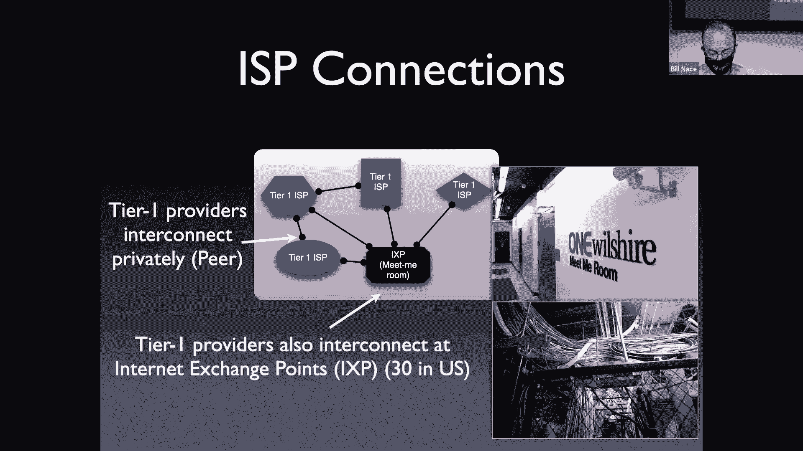

Ply peering just means there's some connection that's not at an IXP。

There's nothing keeping company A and B from somehow connecting their networks from running a cable。

 more often leasing a cable， you'll find some company that has bought up a bunch of that dark fiber from the internet。

Telecom bus or something like that， and theyll be leasing it out and you say。

 oh you know that please connect both of us and we'll pay you a monthly fee to make that happen。

somehow we run a cable between them， the two。Okay， and。

It's not necessarily that this is better than public peering。

 it is just another option that networks can use if they have。Their own reasons to make it happen。

And some of that just may be cost。If you have two companies that are sitting right next to each other。

 it may be cheaper to lease a cable or string a cable between those two companies than to send all your packets down to LA and then back to the meet room。

Or there may be other business reasons， right， maybe， oh。

 we have top secret communications between these two companies and we really are paranoid and want to make sure that no other company has access to those bits。

For instance， or something like that。There may be other reasons to do this。嗯。

There also is no requirement that you do one or the other。so companies could choose to say， oh。

 I'm going to connect to these four companies。At an IXP。

 and I'm also going to privately connect to these other three。

Because the decision making is on a relationship by relationship basis， a case by case basis。

It's not like you have to decide， the CEO doesn't have to stand up and say， oh。

 we will only do public peering or we will only do private peering。

It's what makes sense for each particular interconnection。哦。

There's another player here we haven't paid much attention to and that is the non network connectors Okay。

 how do normal people normal companies normal you and me。

 how do we connect into the networks Well the Internet service providers want us to connect to them and so they provide things called point of presence。

Or PPs Okay these are spots in their network where they can connect to things So for instance。

 Verizon when I。Caed them up and spent a lot of time on hold and asked to give them money。

They were able to send a truck out to connect me up and that connection went from my house。

Presumably to someplace in the neighborhood where there is a point of presence。

Where the they are able to easily connect me into the network。

We call that a pop or point of presence。Okay， just some place。

 physical geographical location where you can connect that。And networks， of course。

 will do any combination of these whatever makes sense， public peering， private peering。

Using the pops that are available all because they're making decisions to run their networks and their companies。

 however， their network in their company needs to be run。

OkayThere's no standard saying you have to do it one way or another。

It's very much a business decision by business decision sort of situation。Along these lines。

 by the way， I found this interesting graphic， this again is a couple years old， but I liked it。

 this is Facebook。

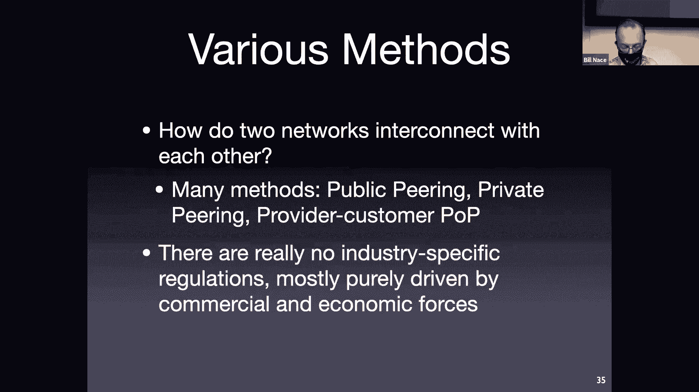

And shows a graph of how Facebook connects to other places。

And actually it's a little bit abstracted we will talk about autonomous system numbers in a little bit and so this is looking at Facebook's。

Autonomous system。That doesn't quite match its own network， but it's sort of like that。

 And it's showing how that connects to other players。 And you can see。

They have three main connectivity points。Okay， and all of those are internet exchange places。

And so they have a bunch of cables that are connecting them to Germany， Sweden and Japan。

And then they have a bunch of little connections that aren't as obvious in here to other companies。

 maybe the ones they're pairing with。Okay， probably there are some， you know， at some point。

 Facebook probably connects to some tier one companies。Company or companies Okay。

 and so those are probably some of those small ones。In there that looks small， but actually。

None of these are done by we're not ranking how much actual traffic flows on them。

We're just saying these are connectivity points。Okay， and。You can there is a graph of these。

 I mean this is the network is basically a graph， this is a representation of that a way of looking at that and you can see some interesting things like some other companies。

 some other networks that are in this interconnected network of networks that is the internet。

看 of coolhu。

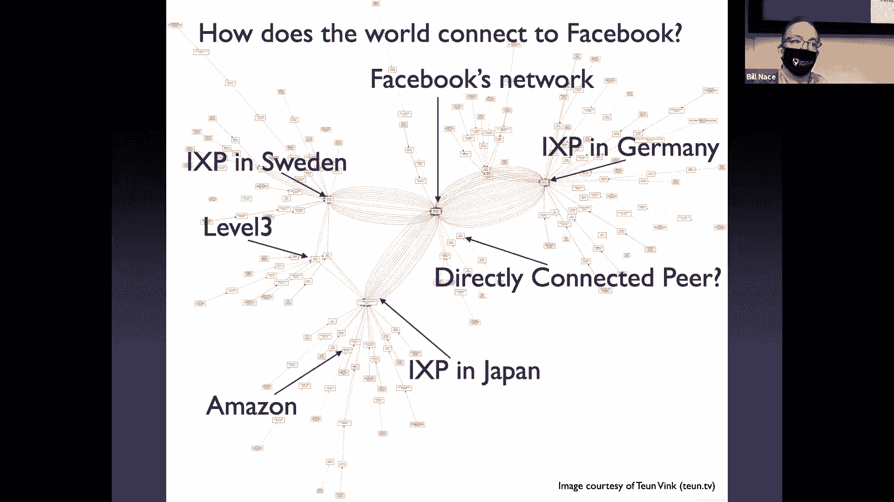

All right， we're at the end of today， any questions on these interesting business relationships we have between the different companies that run the networks？

That make up our internet world。Hopefully you can do all these things at this point， if not。

 come ask the skaazza， come see us at office hours。We could on the chat all right。

Thank you very much everybody， we'll see you next week， bye bye。Thank you。 Bye bye， bye。

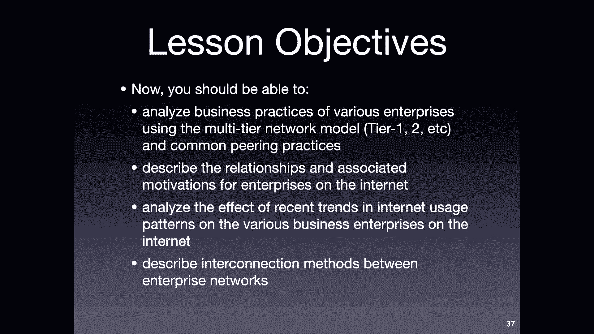

。Yeah。8。