# 卡耐基梅隆大学 14-740 计算机网络：4：ISP、骨干网与对等互联

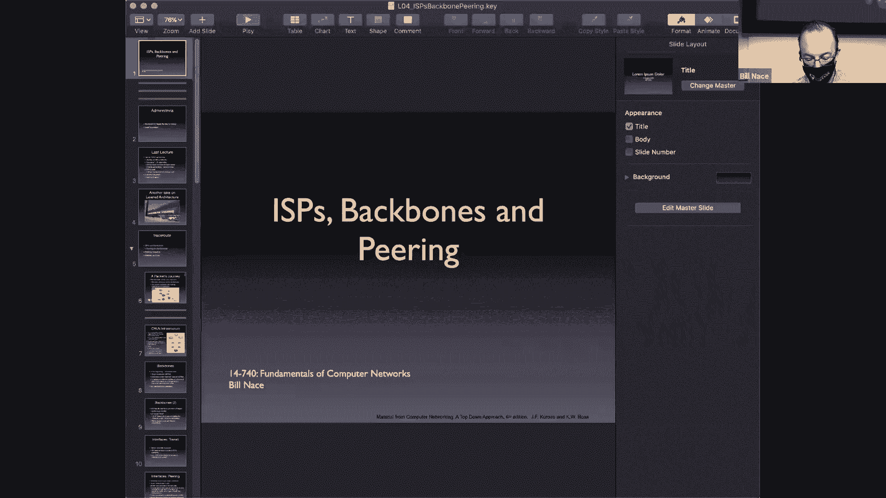

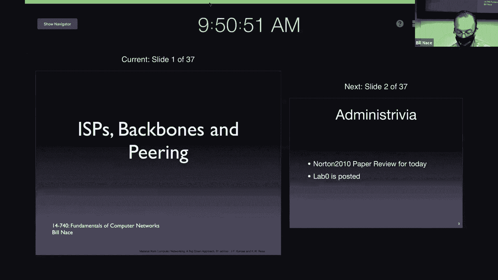

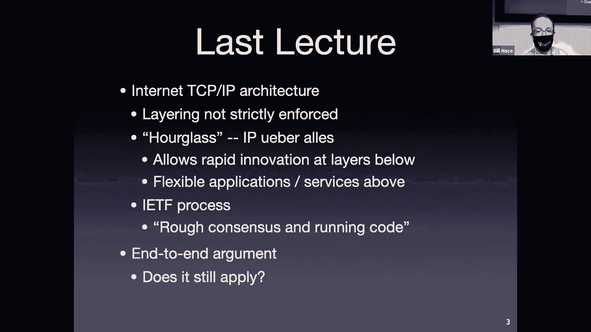

在本节课中，我们将学习互联网的商业层面，了解互联网服务提供商、骨干网以及它们之间如何通过“传输”和“对等互联”等商业关系连接起来，共同构成我们每天使用的全球互联网。

上一节我们介绍了互联网的分层架构和设计目标。本节中，我们来看看构成互联网的各个商业实体是如何组织和交互的。

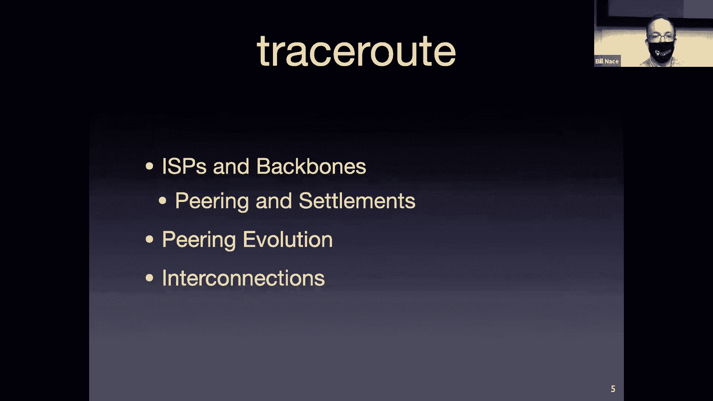

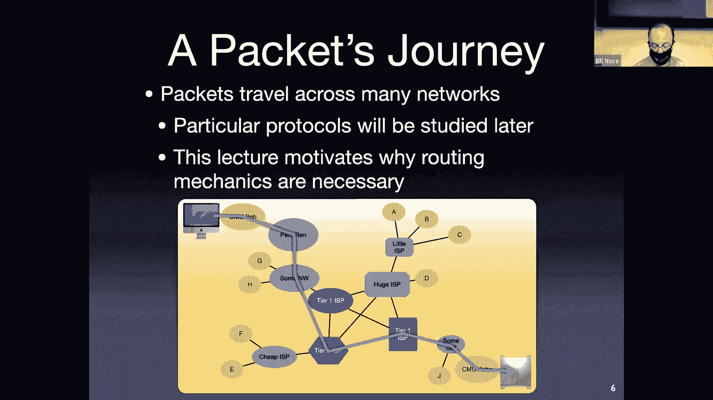

## 互联网的层级结构

互联网并非由单一实体运营，而是由众多独立的网络（称为自治系统）相互连接而成。这些网络的所有者就是互联网服务提供商。它们主要分为几个层级。

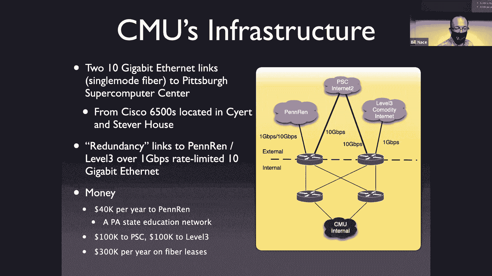

以下是主要的ISP层级：

*   **一级ISP**：它们是最大的网络运营商，拥有广泛的国际或区域覆盖。一级ISP的关键特征是：它们**与同一区域内的所有其他一级ISP建立对等互联关系**，且不向任何其他网络支付传输费用。例如美国的AT&T、Verizon等。
*   **二级ISP**：它们是规模较小的区域性或国家级网络运营商。二级ISP通常**需要向一级ISP购买传输服务**以获得全球连通性。同时，为了节省成本和提升性能，它们会积极地**与其他二级ISP或大型内容提供商建立对等互联**。
*   **内容提供商**：这类公司（如谷歌、Facebook）主要生产内容或服务，而非运营网络。其中，规模大、技术能力强的公司（“复杂的大型参与者”）会建立自己的网络并积极与其他网络对等互联，以降低成本和改善用户体验。规模较小的公司则通常直接向ISP购买连接服务。

## 商业关系：传输与对等互联

网络之间通过两种主要的商业接口进行连接。

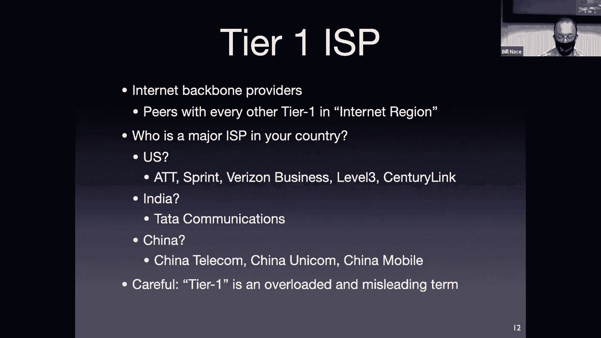

### 传输关系

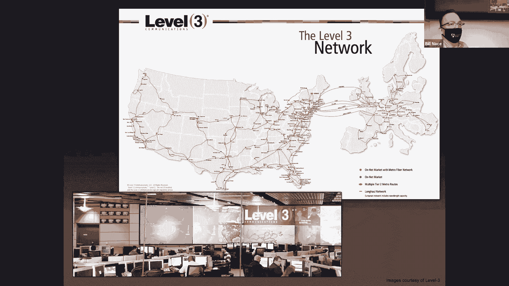

这是一种客户-提供商关系。客户（如二级ISP、企业、家庭用户）向提供商（如一级ISP）支付费用，以换取将其数据包传输到互联网任何地方的服务。公式可以简单表示为：
`客户支付金钱 -> 提供商传输数据包`

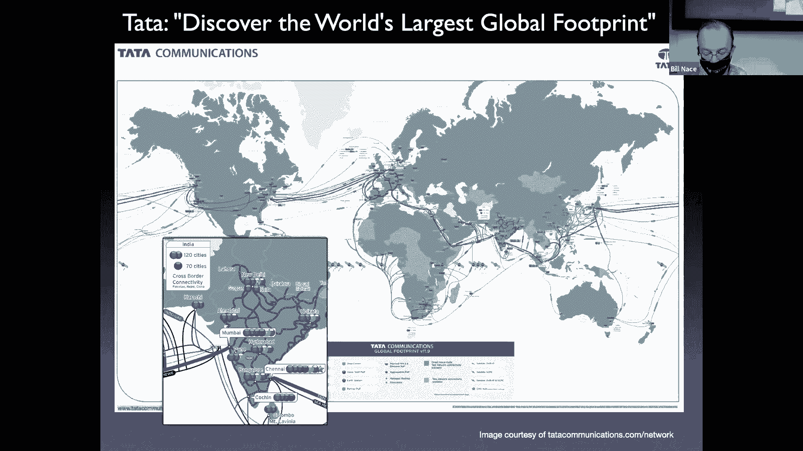

### 对等互联关系

这是一种大致平等的互惠关系。当两个网络之间交换的流量大致平衡时（经验法则是流量比例在1:4到4:1之间），它们会选择对等互联。在这种关系下，双方互相传递流量，但**没有金钱交易**。公式可以表示为：
`网络A发送流量给网络B` <-> `网络B发送流量给网络A`，且 `金钱交换 = 0`

对等互联能显著降低双方的运营成本（避免向上级ISP支付传输费），并通常能提高互访流量的性能。

## 物理连接方式：如何实现互联

网络之间除了商业协议，还需要物理连接。主要有两种方式。

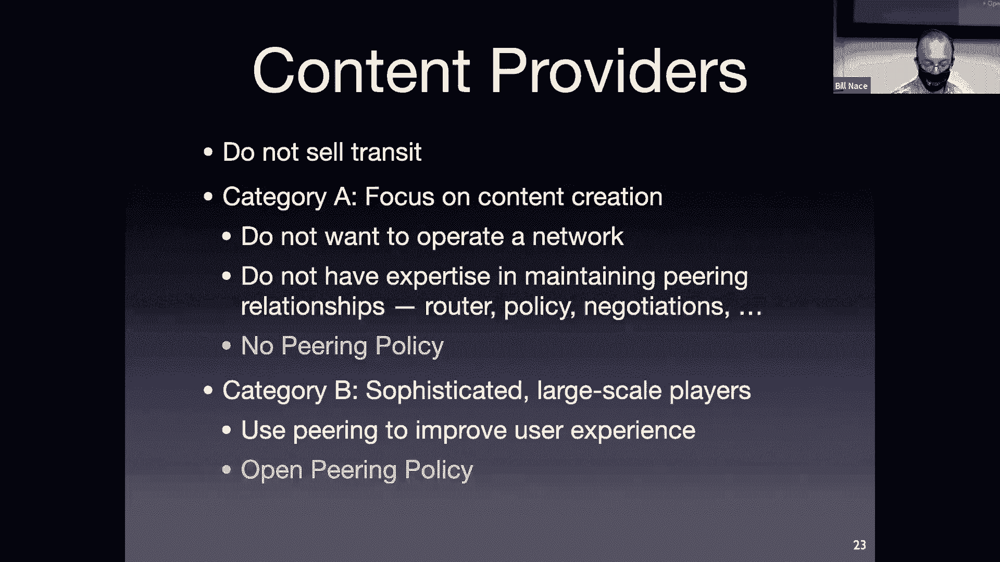

以下是两种主要的物理互联方式：

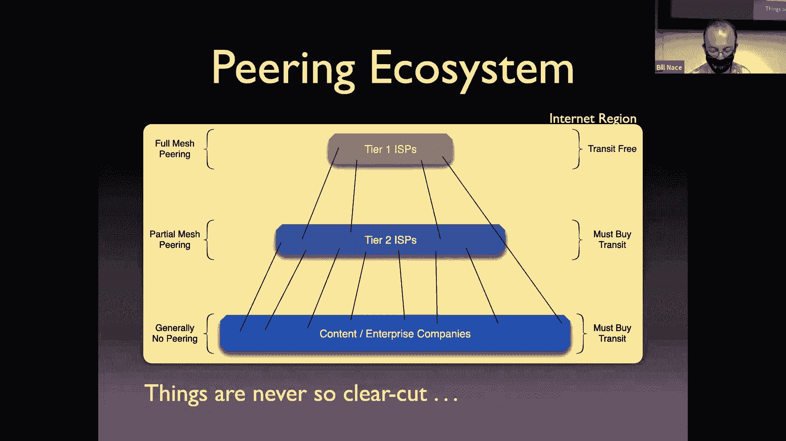

*   **公共对等互联**：通过**互联网交换点**实现。IXP是一个中立的物理场所，多家网络运营商在此放置路由器并相互连接。任何接入IXP的网络都可以方便地与同样接入该IXP的其他网络建立对等互联。这就像是一个“网络集市”。
*   **私有对等互联**：两个网络通过租赁或铺设专线直接连接，不经过IXP。这种方式可能出于成本（如双方地理位置很近）、安全或性能控制等考虑。

网络通常会混合使用公共对等互联、私有对等互联以及通过**接入点**（POP，网络服务提供商设置的本地接入设施）连接终端用户，以最优化其网络运营。

## 市场演变与趋势

互联网的商业格局一直在演变。自20世纪90年代初美国国家科学基金会网络（NSFNET）商业化以来，传输价格随着技术进步和规模效应急剧下降。同时，流量需求（尤其是视频和大型内容提供商产生的流量）爆炸式增长。

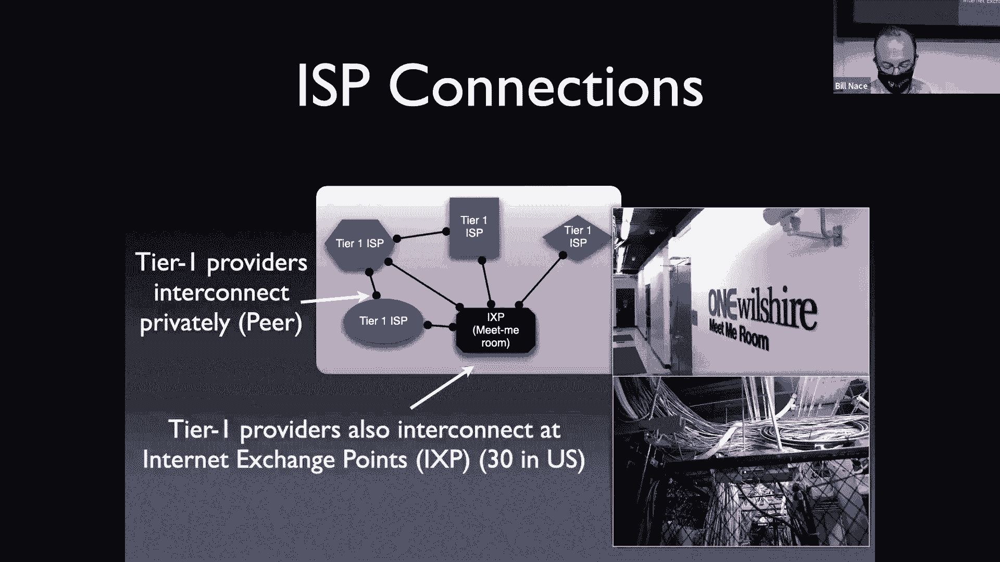

一个重要趋势是，大型内容提供商越来越多地建立自己的网络并广泛参与对等互联，这减少了对传统一级ISP传输服务的依赖，改变了流量和资金的流动模式。

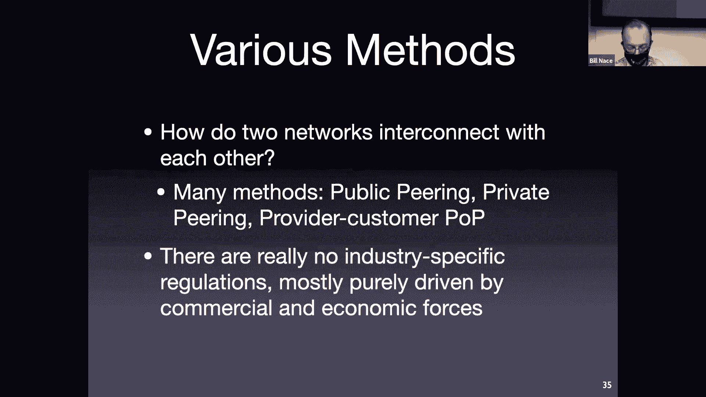

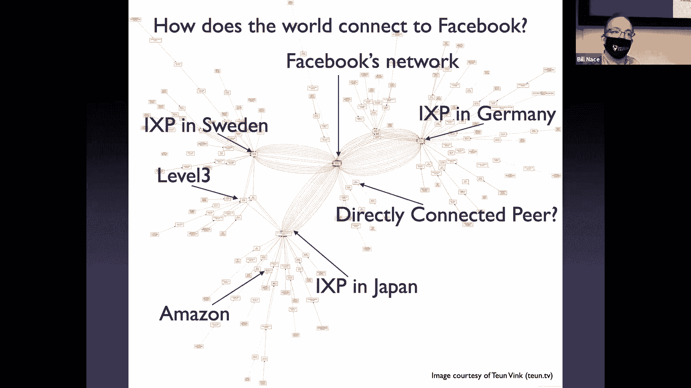

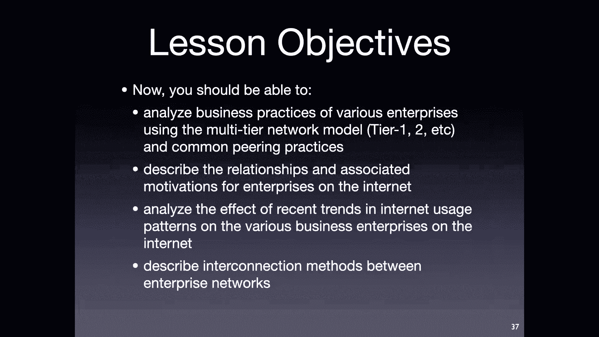

本节课中我们一起学习了互联网背后的商业生态。我们了解了构成互联网骨干的一级和二级ISP，以及连接它们的两种核心商业关系（传输和对等互联）。我们还探讨了这些网络如何通过IXP或私有线路进行物理连接。理解这些商业动态对于全面认识互联网如何运作、为何以当前形式演化至关重要。