# 卡耐基梅隆大学 14-740 计算机网络 Fundamentals of Computer Networks（Fall 2020） - P5：Lecture 5 The Application Layer -- HTTP - ___main___ - BV1wT4y1A7cd

Okay， thank you， Carartik。🤧All right， you're on it。Okay。A coupleup things before we start。

 one is a note to you just hopefully you're keeping up with the schedule anyway and you know this。

 but you have a lab that is due in a week。So next Tuesday you should have completed La zero。

 La zero is all about using Wire Shark to examine some very simple protocols and mostly getting you familiar with how wire shark works。

I also want to point out next time there's a review of the mocaitrus paper I think this is great paper mocaittris is the guy who invented the domain name system and made it all work and。

And so it's nice to hear from his own mouth what he did and what he thought was was going with it so definitely hopefully that's a fun read for。

Hopefully it's fun， but at the very least it should be a very informative read about how the domain name system works。

And finally， another warning。If you look a little further into the future。

 you'll notice that we have a quiz coming up two weeks from today， we'll be having a quiz。

Now normally the quizzes are in person events and obviously we can't do that this year and so I haven't quite figured out exactly how this is going to work and so。

Be flexible， right， We'll see what happens。 I'd like to find a way that does not require us to be。

Yeah in person at all。Generally my quizzes are actually general， always in the past。

 the quizzes have been designed to be closed book and probably this one would be as well， but again。

 haven't completed the design of it also typically they are designed to be done in 45 minutes。

They generally have a lot of writing to them， however。

 and I recognize that many of you English is not your first language for some of you。

 it's not even your second and。And I don't want that to be a disadvantage to you I'm trying to figure out what you actually know not figure out what you can't you know are having trouble writing writing or things like that。

 so generally I try for them not to be time crunchches and so I usually would design them in such a way that I think a fluent reader of English who knew what they were doing could get it done in 45 minutes and then I would give you the entire class period for it。

Probably will do something like that as well。Typically there have been a few multiple choice questions and then a bunch of short answers and a couple of kind of workout sorts of situations again。

 haven it designed it more details to come。would like to point out just make sure you understand the scope of this quiz it'll cover everything up to that lecture。

 so that's the 29th we will have on the Thursday previously just completed thequeuing theory lecture。

And so that means all of that material is ready to go。If you are having any troubles at all。

You know please let us help you out， come talk to TA， come talk to me during my office hours。

 and we'll be glad to try to get you on track， okay？Last lecture， we。嗯。

When Jeremyerem's asking about organizing a study group， yeah。

 I think study groups are a fantastic mechanism， in fact， let me mention something really quickly。

I've had a bunch of students in the past who on the first quiz or they'll come to me after the first quiz and I'll say。

 I didn't do well on your quiz， I'm not sure why and we'll start examining it and I'll discover that their study mechanism was to look through the slides。

Okay， and they would kind of look at the slides and say， oh。

 this one is about you know ISPs and I understand what an IXP is and things like that and that would you know and they they got to the point where they felt very comfortable looking at the slides and thinking about the topics that were on the slides。

And therefore thought they knew the material。The trouble is。

 what they had trained themselves to do was to recognize knowledge。

They were looking at a slide and they were seeing stuff printed there and they were saying， oh。

 I must understand this because I know what this means。😡，And I don't write quizzes like that。

 I don't give you a slide and say， do you know this， That's not what the the quiz is。

 The quiz is the other way around， right， The quiz is asking a question。

 and you have to produce the knowledge。 So's like you have to write the slide for that question。

And that's not what many students train themselves to do。Okay。

 so instead of looking at the slides and saying， do I know this。

 first off you have lesson objectives and so I would highly recommend you look at the lesson objective and ask yourself can I do this and prove to yourself that you can do that and as Jeremy points out in his desire for a study group。

One of the great things about a study group is you get in a situation where you are asked questions。

 somebody in the group will drill you and say， hey， can you tell me what an IXP is？And you're not。

 you're not being asked， can you recognize the slide， you are being asked， here's a question。

 and you have to produce the knowledge。To create that answer。

 which is just what you will do in the quiz。 And so having way to。

To train yourself to practice the same things that you'll do on the quiz is a better way of getting a good score on the quiz so i'm thumbs up with Jeremy study groups are fantastic can you make an can you give an example of the types of questions or just a question you might ask so we can get a clear sense of what that distinction you were just talking about sure here's the。

Let's see， how do I do this in this。Oops， I'm not screen sharing anymore， am I？Okay。

 so Jeremy is asking。What kind of question might I ask， so here's a question I might ask。

What's the mission of the application layer notice the lesson objective describe the mission of the application layer okay I might ask you what data types does the application layer use or I might make it a multiple choice question。

Of packet， frame， message， and segment， which one is used by the application layer。

I might ask you in the HtTP protocol， how is connection management handled？

And what headers are used to specify it？Or something like that okay。

 if you're looking for examples of things I will ask you。

 the lesson objectives should be your guide because this is how I create a quiz。

 I go to the lesson objectives and then I write the quiz from these lesson objectives。Okay。All right。

 so。Oh， I didn't share that shoot it was such a great point and I wasn't sharing the screen man。

 zoom okay。All right onto real technical material last time we looked at how businesses interact and how they work together to take their networks and interconnect them which is the main goal of of the internet and so today now it is time to dig in and start our journey through the technical content through the different layers and how they work and so we're going to start off as I do with every layer we're going to do this over and over again in this course i'm going to talk about the theory behind the layer what the layer is trying to accomplish how it accomplishes it and then we're going to look at a couple of specific protocols in this case we'll look at htTP today。

And which is one of the foremost application protocols that's ever used。

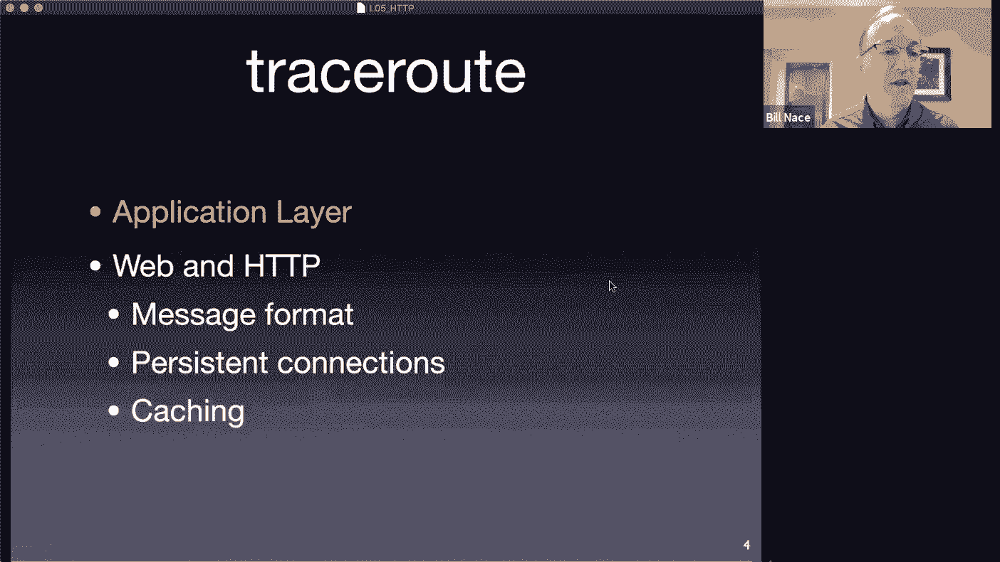

All right， so what's going on in the application layer。

 I showed you this picture a couple lessons ago and I said this shows you you know here are applications and they connect to transport layer stuff and you know I showed you basically the whole stack。

And in this application layer， I've got lots and lots of different applications that。

All want network services。Right。And so what we're going to do for the application layer is we get to ignore everything below us。

or almost everything below us right we do have to use the services of the transport layer to do whatever we want to do and so we will see a couple instances today where knowledge of what's going on with those particular protocols can be helpful。

Okay， but for our purposes。We don't need to know all the details what we need to know is kind of what they're doing and how the service what affect the services have on the performance we get or whatever features we want at the application layer and so as an application developer you have to ask yourself what transport layer protocols do I want to use and of course to make that decision you need to know something about them so we might say oh TCP gives me reliable transport I should use that or UDP is a lot simpler because it's not doing the transport setup so let's use that or something like that。

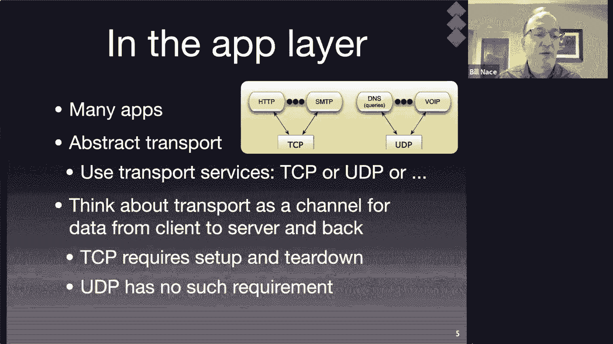

Now what do I mean by that well here's the example and this will get a lot clearer when we look into the transport layer and figure out what's going on。

 but if I were at the application layer to request，A TCP connection。

 and I've said several times in the course that TCP is a connection oriented protocol。

Which means it has some overhead to set up that connection to make sure both sides are using the same understanding of the state of the connection。

嗯。What happens is there is a additional round trip of messages that go back and forth。

 So here's a sequence diagram。 remember the sequence diagrams show。

Two or more participants who are communicating through time， so time is going down the page here。

And we send messages， so a client for instance， wanting to set up a TCP connection with the server would first have to send a message that basically is a pretty pleased may I connect to you message。

And if the server accepts， which means the server is actually running the protocol we want and isn't overburdened and decides he likes this client。

 whatever his reasons are， the server can accept or reject if the server accepts。

 he does that by sending a message back。And then the client gets to do what wants to do and so in this case let's request a file。

 the server will then send the file， I'm showing this is a big arrow because probably that's a lot more data getting transferred。

Okay， and then when we're done， we say， oh， okay， I got everything and we do that by again sending a message and the server says。

 okay， got it all。And so there's this extra overhead。

 there's these extra messages that have to go back and forth。To make this all work。

 we'll learn more about it when we get into TCP。

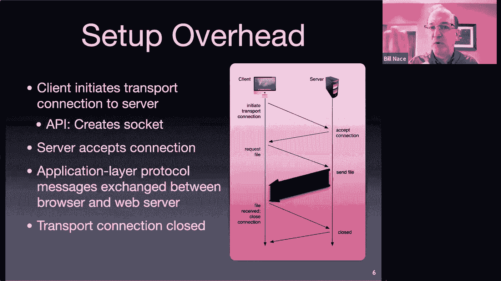

After the quiz。So what's going on in the application layer。The application La mission。

 the thing it does， okay， I'm going to use the word mission for all of the layers throughout the course。

And what I mean by that is why do we have this layer，s what's its job， what's it doing。

 what does it do， what's its mission？The application layer's mission is to provide access to network resources to allow us to write programs that can use the network that get bandwidth from the network when we communicate。

 that allow us to transport our message from place to place。

Every layer also has an addressing mechanism， this is how you discuss。

 talk about the target of your communications。And in the application layer。

 this one is pretty wide open。We're going to talk a lot about domain names and URLs because we're talking about HTTP today and we're talking about DNS next time。

But you should know that there are lots of different addressing mechanisms because。

What we're doing is we're getting an application to be able to describe another application that's running somewhere。

And so that addressing very often is very application specific。And so。

URls and domain names are kind of generic addressing mechanisms。

But your TikTook handle or your Twitter handle or your Facebook name or whatever。

 those also turn out to be addresses at the application layer Okay， because they're the way that。

Our TikTok client identifies who they are to a TikTok server， for instance。

 they're the way that the TikTok server knows that， oh。

 this data needs to go to this particular other。Instance of the TikTok application that's running somewhere。

And so that dot is very significant on this line where I'm saying there's many。

 many more different types of addresses。Each layer also has its own data type。

I tried to illustrate this with the different size envelopes during the demo that we did last week。

The data is going to be different at each layer and for the application the data is pretty wide open The data type is we call it a message we say applications send messages to each other and those messages conform to whatever protocol is being used So if you're writing。

A network layer application， you're going to be specifying this is what my message format looks like because this is the data that my application needs to get from one machine to another。

If I'm writing a game， for instance， my message might have things like， you know。

Just you know created spell in this direction， you know the target is that and that is the data format of that particular message。

But we're sending messages between application and application。Okay， so。

Our overview of the application layer is pretty thin because there aren't a whole lot of。

Things that bind us aren't things that you must do。

Let's then take a look at our first major protocol， and that's HTTP。

 the hypertext transfer protocol that is designed as you can expect to transfer hypertext。

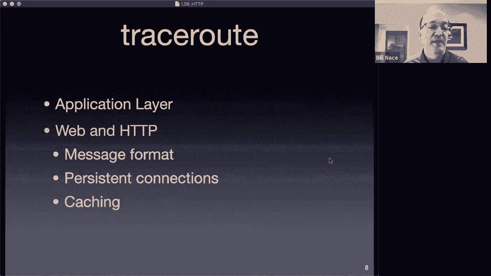

Nowve noticed I've pointed out that we're going to have these acronyms for a lot of things。

Networking is a field that is overwhelmingly acronym like and this is one of the things that originally put me off when I was working with networks and I thought it was made it complicated and burdensome and I recognized that having lots of these acronyms and throwing just around TCP a few times in UDP in my description a few minutes ago。

Theres just a bunch of these acronyms around I don't know what to do about that。

 but hopefully as we talk about them you'll get more familiar with them and you'll then start to be able to to parse and understand at the very base level let me point out that most of the acronyms that end with the letter P are some form of protocol so HtTP。

That's because we acroronnymize。We make part of the acronym， the word protocol。

 and so we end up with a P at the end of a TCP， UDP。HtTP， right？

I mean so that may help a little bit as you're trying to。

Take in all these acronyms and and use them Okay， so you you actually use HtTP all the time。

It was designed as a way to get the data for web applications to operate and so hypertext transfer that was because the hypertext。

 the thing that is a web page needs to get transferred from machine to machine。It is a request reply。

Protocol， which means we have a message that asks a question and then we have a message that has the answer to that question。

That and so there by that nature， there ends up being kind of a client server model that was part of the web from the beginning。

 but。It's kind of buried in the protocol now because there is this request reply model of communication。

The client that's your browser right asks a question like do you have this web page， the server。

 which is some machine running somewhere today it's most likely in a data center somewhere。

Repllies with a response， which is， yes， here's that file。 Let me。

 let me put it into this protocol that will then transfer this。

This thing no longer does it have to be hypertext okay I guess never did it have to be。

 but when HTP first came out that was what it was used for。

 it's such a useful protocol though that it's used all over the place to moved data from one place to another。

It is ubiquitous in operating systems， you can get it running on little microcontrollers。

 it runs on supercomputers， doesn't matter what operating system you're using or how it works。

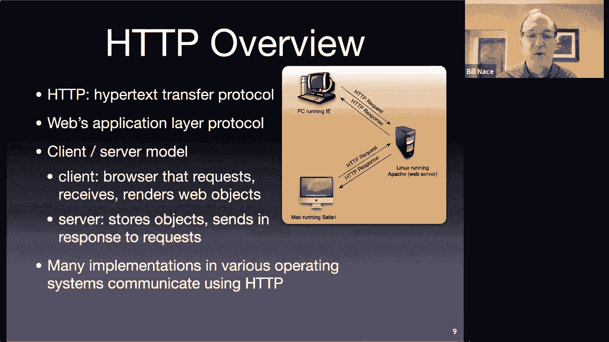

Now HTTV first came out as the web was beginning right this is in some ways even more important than the HTML that what is the document format that we know for the web。

 that's the file format for web objects。Or for one type of web object。So in the late 80s。

 Tim Burns Lee， who's now serve B Lee to UN I， was working on this way of moving。

Documentation around from computer to computer and he came up with HTP as part of that he said oh。

 I need a way to mark up my documents so let me design HTML and then he had oh I need a way to have the communicated between clients and servers。

 let me design HTTP as part of that。And HdP。Kind of formally hit the ground in 93。

When HtTP version 1。0 came out。1。0。Was not really a standards document so there is an RFC for it remember RFCs are there request for comments those are the standards documents of the web and RFC 1945 describes kind of how HTTP was working although frankly the source code for HTTP became the first real standards document and people ported that and figured out how it was working。

It was not a perfect protocol， it did what it was supposed to do and did move documents back and forth。

But it had no way to control caches， and we'll talk a little bit about how it used TCP in ways that were not optimal。

In the late 90s， a new version came out version 1。1。

 and this is kind of an interesting situation because 1。 one。

Was moving into an area which had become very popular by then the web had taken off There were web servers on all sorts of different platforms。

 many， many different operating systems were supporting。Different versions of the web servers。

 different companies were selling web servers and selling clients or mostly giving away clients in order to sell the servers。

And it turns out backwards compatibility became a big deal。 What do we mean by that， Well。

 if I have a client that is using a different version of。The protocol from the server。

 you want those two to still be able to communicate to some degree。

 And so one do one couldn't just change everything。If it did。

 then the clients that already existed could not talk to the servers that。Were available。Ravi， okay。

 everybody， but Ravi can hear me？Okay， good， I'm sorry， Robvi。But glad it's much not everyone。嗯。

So by dealing with backward compatibility， they had to be able to let the large majority of servers。

 the large quantity of servers that were in existence talk to new clients and the same way。

 large body of existing clients had to be able to talk to new servers。1。

1 was a much improved spec that overcame some of the problems in 1。0。

And it survived for almost two decades， there is a 2。0 version， there's HTTP2 that was approved。

 it's been five years ago， it's picked up， I say slow adoption rate。

 but that's just in comparison to how fast 1。1 showed up。

And what it does is it focuses on optimizing how the actual data is。Move back and forth in systems。

And there's some words here about things it does that you may or may not understand we'll talk a little bit about server push。

But we're not going to talk about 2。0 much today， and that's because it's really hard to teach。

Because it violates a lot of the layered architecture。

 it does things in order to make sure that the TCP and lower layers can operate better on the data and that means it's deliberately doing things that are the job of the transport layer and below and we haven't learned what the transport layer and below do so it's not really a good thing to talk about it now。

We may focus， we may come back to this later on in the course， though。

So today we're going to focus on 1。1。Okay， so that the message itself。

 I guess I should point out any protocol。Which we have。

 which involves communication between a sender and a receiver。

 means that some bits are going to be sent from the sender to the receiver。And therefore。

 we need to be very careful about the format of those bits。

 we need to know if I want to take my message and put it into this format， how do I do it？😡。

And on the receiving side， I now have a bunch of bits。

 how do I look at those bits and interpret them to make sure I understand what the message was supposed to be and so every protocol has message format。

As a primary or very important aspect of that protocol。

 making sure that you can translate into and out of the actual bits that are going to go across the wire is going to be very important。

And HttP's format。It includes two different types of messages there are requests and replies。

 as I mentioned earlier， there's a client who asks questions and a server who answers them。

And the format for each of those has to be formally specified that you have to have。

You can't just say， well， you should put this information into the message。

 you have to say exactly how it gets transformed into the bits。

And most RFCs use a formal notation called Baus Now form named after two very famous computer scientists。

As a formal language to describe the actual message。

Adul Hadi is asking can a server request things too， a server can。

 but then it becomes a client in the mechanism。You know， for instance。

 you could imagine a server I ask a question of a server and the server therefore。

Needs to find an answer somehow， it could go off and query a database and it typically wouldn't。

 but it could use HTP to make that happen。嗯。But that's not so typically you know when my web browser talks to a web server。

 the server does not send me requests。The client sends requests to the server and the server responds to them。

and that's mostly because the way that model of communication works out。

 we don't need to have the server asking us stuff。We just when we need something。

 we ask the server for it。Okay， so I'm going to show you some pieces of Backus now format and I'm not asking you to become backus now experts。

 I'm just I want to give you a feel for how this backus now and this formal notation looks as we put together this。

This message format。So an HP message is either a request a response。

 I've said that here in English words。And it might be possible for somebody to misinterpret them。

 and so in Baus now there's a formal way of saying and a message is equal to a request or a response and so that vertical bar is the backACus now operator meaning or。

Now this has just kicked the can down the road a little bit as you're trying to put together a message because you don't know what a request looks like or what a response looks like so you look further down the page of the RFC and there's a description you'll say oh request and response messages are made up of stuff and it turns out both of them are very similar and so there's a thing called a generic message requests and response。

In this language， become a specialization of a generic message。But both of them have a start line。

 so there's going to be some line of text that begins things followed by some headers。

Followed by blanklein。Followed by an optional message body。Again。

 this is English description and you would have lots of questions if you tried to write code based on these paragraphs here。

So instead we have backACus now format that in a more formal notation is able to say a generic message。

 a request or response message is a start line。Okay， again。

 we're kicking the can down the road a little bit， what's a start line we'd have we'll see what that looks like。

In some other back now notation。In fact， is right here start line what that is。

 but for now a generic message is a start line followed by， and then this asterisk means。

Zero or more of these things。So zero or more。Well， it's in parentheses now parentheses are also part of Baus now and lets us group things。

 so zero or more of a message header followed by a curlph。C， Cfa， what's a CRLF。Anybody know。

It's a new line。Yes， Cartik and Bailey。Carriage return line feed that's what happens when you hit the return key on your keyboard and you go back to the beginning of the line this is basically saying you can write a message header and then you have to as a way of distinguishing it from the next thing that follows you have to have a line a carriage return line feed you have to have one of those return things。

And so having zero or more of these means I could have three message headers。And in each case。

 I'll have a message header followed by a carriage return line feed message header。

 carriage return line feed messageer character return line feed。

 so this is basically backca now saying put each message header on its own line。

Followed by another character turn line feed， so that means the message the last message header。

Would have a character turn line feed。 Okay， and now I have another one。 So this is a blank line。

And then followed by the message body and the message body is in square brackets。

 square brackets are back is now format for optional。

 you do not actually have to have a message body if you don't want。And so then you look up， okay。

 what's a start line， well the start line is a request line or a status line。The request， then， is a。

Is a generic message that's been specialized because it has a request line at the front。

And it turns out we want to know more about these headers。

 some of them come from a there's basically a bunch of different headers。

 some of them are called general headers because they can be in requests or responses。

 some of them are only request headers， some of them are things called entity headers etc。

 so this is kind of just the specialization of what's a request look like it looks very much like that generic message。

With some extra boundaries on it。What are the headers well the headers actually provide some information about the request for the response right i'm asking you something and this isn't really the question but there's some more information about it right so maybe I want to know something about the date or time of a request or a date or time of the object I'm asking for maybe I'd like to pass along some information about my application。

Or maybe I'd like to know something about the server。

 and so those that those things get put into some of these headers。We mentioned caching control。

And and how you know 1。0 did not wasn't really amenable to caching and there's so in order to make it amenable 1。

1 added some more headers that would allow you to pass information about whether you're allowed to cache this object and for how long and things like that。

In total， in the 1。1 spec， there are 46 different headers。Okay。

 so it's a bunch of them and if you were implementing a browser。

 you'd have to know what all of them did and you'd have to be able to make messages that have those headers in them and you'd have to be able to respond to messages that have those headers in them。

There is one of them that's special， and that is the host header。

 the host header is required on all requests。And that's actually a change to 1。

 one because the way servers were used had changed。Prior to1 dot one。

When you made a request to a web server， it was assumed that the web server had all of the web files for a website。

And so when you asked for index。htm， it was obvious what you were looking for because there would only be the one index HTML for this particular website。

In the intervening years。This idea of hosting companies popped up and the idea that you'd have a server that is a physical machine that was hosting multiple websites。

In 1。0 that meant you had to actually have multiple IP addresses and you had to have multiple web server instances。

 actually the application running one per website， and so that got really complicated for a hosting web service so now that we have a host。

Header here。We can talk to a particular web server and that web server can actually be serving data on many different websites and the host is saying。

 oh， I'm actually interested in you know this particular website， which may be one of many that you。

 the web server， happen to be handling。The request line。

 the thing at the top of the request again back to now format says， oh。

 that's a method followed by Sp， any idea what a SP is？The fact that it's capitalized is a hint。

Yeah Stephanno that's right that's a space okay again we need a formal definition and actually in the language there is a you know。

 it does say here's what a CRLF is and here's what a space is here are the bits you would use for each of those。

Then there's a request URI， URI is a fancy term for the thing we think of as a URL。

Not quite but close enough for today's discussion。Followed by another space。

 followed by the HTTP version， followed by Care return linefe。What's a method， oh。

 a method is one of the words options or get or had or post。

 and here because these are in double quotes， that means you need the actual characters OPT IONS。

To mean options， et cetera。And the whole language then is done this way。

 there are a couple pages of Fus now format that would let you as an implementer know oh。

 this is exactly what these bits mean in this message or vice versa。

 here's how I actually create the method。StephahanTce， I think is a later edition。actually。

 I'm not entirely sure about that。have looked up。So here's an example right so i've described the back now format for one of them let's actually see one and see what it look how it maps to what we know so far about that format so here i'm sending a request and the request has this is the request line the first line is this thing method space method is get there's the space here's the UI。

Which looks like part of a URL that we're looking for， followed by space， followed by my version。

 this is an HTTP1。1 request。Followed by carriage turn line feed and then a bunch of headers and each of the headers is。

 you know here's the header， character turn line feed， another header， character turn line feed。

 etc cea， header， carriage return turn line feed。And then another carriage return line feed that makes for blank space。

 and then I've got no message body because that's optional， we're done。Okay。

 so this is a request I'm saying， hey。Hey， web server， I believe you serve the cmu。edu website。

And I would like a web object which is known as images slash logos。htm now this。

Traditionally we've thought of it as a file and this is the like the path to the file doesn't have to be that way。

 but often is。Okay， and of course， if you buy something on Amazon。

 the URIs we're using have all kinds of crazy numbers and letters and query description things in them。

 and so these can be more complicated than just looks like a file path。

I mentioned that there are several different request methods and so we should talk briefly about what each of them does get is a very is probably the most common one。

 this is asking hey web server， I'd like to get this object， I'd like to have a copy of this object。

嗯。And you know， and I specify， in this case， I'm looking for the logos。

htl file you know that that you told me you keep in an images directory or something like that。

The headers can modify this method。 Okay， so the method is get。

 I would like to get an object from you。In the headers。

 there's ways to make it a conditional get to be like， well， maybe I want this。

And so there's an if modified sense and an if match header。

Maybe a couple more that let you say I'd like to get this thing。

 but only if it's updated right so if modified S means you know I have a copy from yesterday。

Of that file of that web object， and if it's changed， I'd like a new version， but if it hasn't。

 it's cool， I already got a copy。1。1 also allowed for partial get。

 this is probably the update that has had the most impact on the world。Because previous to this。

 you would ask for a web object and you would have to get the whole thing I either knew。

I don't ask for it and I don't get any of it or I got， you know here's the whole cat video， whatever。

 the whole thing。A partial get lets me specify， I like it from Bte number X to Bte number Y。

And this lets us do things like create Netflix and streaming services where the web object itself is huge。

But I'd like to be able to scrub back and forth。We don't want to be watching。

Ted Laso and be halfway through and you know the person you're watching with says。

 wait a minute I missed that while I was in the bathroom， can you go back 30 seconds？

And in going back 30 seconds we'd have to do a request and get the whole episode again from the website。

 we want to be able to request and say oh， we actually want from you know the bite that was 30 seconds ago to this point and so yeah。

 technology can have real impact on everybody's lives， yeah great。

Head is a method that willll is basically asking about。Sorry， I'm missing part of the chat。I'm sorry。

Stteafness are。Okay， never mind looks like re taken care of it Okay so head is another method that lets me ask for metadata about something so it's kind of like a directory lookup I'd like to know something about this web object I'd like to know what headers you would give me if I asked for it but I don't actually need it。

There are options， there is an option request method that lets me ask， hey server， are you a 1。

0 server or you 1。1 server， things like that。And there's post post lets you go the other way so get ask for data to come from the server post allows me to provide some data to give to the server。

 so for instance， if I have created my TikTok video and I would like to send it to the server we would post that right or you know here's my Gmail that I have just typed a new email message and I need to transfer that data to the web server that would be put into a post。

Into an HGP request。But the request is to post this data。And so here's another example of。

 but this time it's of a response。So we' made a request we say， hey， I'd like to get that thing。

 I get a response coming back， their response is the same as。Our generic message。

 but it has a different start line。Remember the start line was different for requests and responses。

 a status line is not method space UI， et cetera， a status line that comes back in the response is the HTTP version followed by space followed by status code。

 followed by space。Followed by a reason phrase， Kur turn linefe。I love this。

 the engineers who put this together were human and knew the people who read these are human and so in this thing they include a status code it's kind of like an error code。

But you know， error code warning code or good thing code so the status code just tells you。

 did your request make sense and I'm able to serve it？And instead of just giving you the number。

 they also tell you what it means。Now what it means we could all look it up， it's defined in the RFC。

 okay， status code 200 means okay。😡，That's what there's a table in the RFC that tells us that。

But that's annoying to have to always look it up and yeah， you'd remember what 200 is。

 but you might not remember what a 302 is。Okay， and so having a short phrase that kind of nudges your memory。

 I think is fantastic about that， even though from a engineering perspective it means we actually have to transfer more bits。

 these bits are redundant because they mean the same thing as the status quo。But I like it。

And so an example has HtTP 1。1， so this is coming from a 1。1 server。It has status code 200。

 which means okay， which means hey， we did it， you asked for something here it is。

 your request was all good。Here are a bunch of header lines that tell us we're going to close this connection now。

 here's the date that we're actually doing this yeah the date that we're doing this here's information about the server。

 here's the date about the file okay so the object I'm giving you was last modified at this time it's 6821 bytes long and it is here's the MIme type for it which specifies the bits I'm giving you are of this format in this case it's a HTML file。

Which is specifying text as opposed to an image JpeEG file， for instance。

 or a video movie file or something like that。Followed by that blank line that comes after the headers and then all of the data。

 here's the actual HTML of the web object。We're specifying。Makes sense。

What are the status quo where did you mentioned mind type was that in the head or somewhere don yeah。

 so this content type thing， there's another whole working group and another whole RFc that has come up with ways of defining。

You know， these bits may be in these different formats， how do we tell you what the format is？

And so text slash HTML is a mime type。That's okay。Yeah， it turns out。Standards have layers too。

 there's standard for stuff in standards。Okay， the status code itself is just a number and there are a couple dozen different possible status codes。

They are categorized in。Increasing order of badness。

And so you start off with things that start with one， the 100s are not a big deal。

 those are all just informational just saying hey yeah， we're good。

 the 200s it turns out you can get a correct answer in several different ways and so there are 200 is okay and there's some others。

300s are slightly bad they're saying hey， you know you asked for something but it turns out you didn't ask for quite correctly。

 maybe you need to go talk to a different server to get it or you need to ask for it in a different way and so。

I can't tell you the answer， but I can give you some hints as how to ask for the answer。

The 400s mean there's a mistake， and this is where we start to assign blame。

400s are a problem on the client side。Okay， you ask for it poorly or something like that。

 the 500s are server errors okay the problem is on the server side， yep， you ask for it correctly。

 I can't do it for you。It's500s。

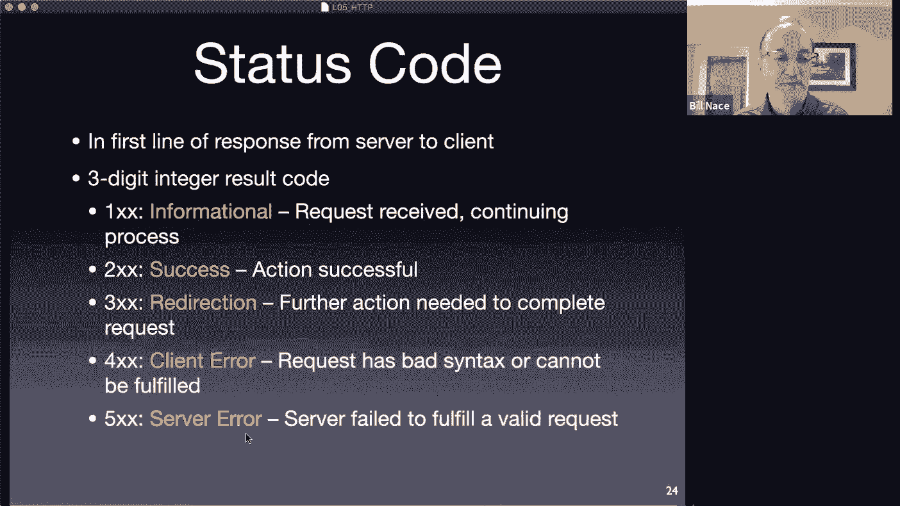

So here are some examples we've talked about okay before 200 happens luckily almost all the time right yes。

 I got your data， I got your request， I can help you with it。

 here's what you asked for right 200 perfectly great。

301 that's one of those redirection ones I know what you're asking for， but we moved it。

Right you're asking for it， you know using I don't know the old name of our company。

 but we got acquired and so now we went through and renamed everything I can tell you what the new location is and there's a header a location header that would be like。

This is almost frustrating right why don't you know what I'm asking for you know where it is。

 why don't you just give it to me？Instead， we want to tell the client so the client knows to update any information it might have。

 so it isn't always asking for the wrong thing。You probably have seen 404s before when you mistype something in a URL。

 you end up with， I don't know， I can't find that thing you asked for。

And so 400s are client errors because you asked for it incorrectly。500。

So one example is there's a server problem and the problem is the server isn't good enough had。

HtTP2 request， but I'm a 1。1 server， so I can't understand anything beyond the fact that you asked for something HtP2 question I've seen 404s in the context of going have I typed the URL incorrectly but the information is just so long on the server it's a dead page so why is it still considered a client error it's a dead page because what you asked for doesn't exist。

Right so it's a dead link you yes， you at one time in the past that that thing was there okay in this case。

And this is often the case， you know， when like， you know。

 somebody just stops updating their blog or deletes their blog or takes out that website information。

 they're not nice enough to leave behind the breadcrumbs that would let the server know where the new information is if it's just a dead link。

Then the files just gone away。 We don't know how to get。

You know it's not like we can find an archive somewhere and so the thing you are asking for is indistinguishable from a URL that you mistyped the server doesn't know the difference。

Between something that used to be good and something that's just been wrong forever。

 does that makes sense。Yes， it does thank you， all right。

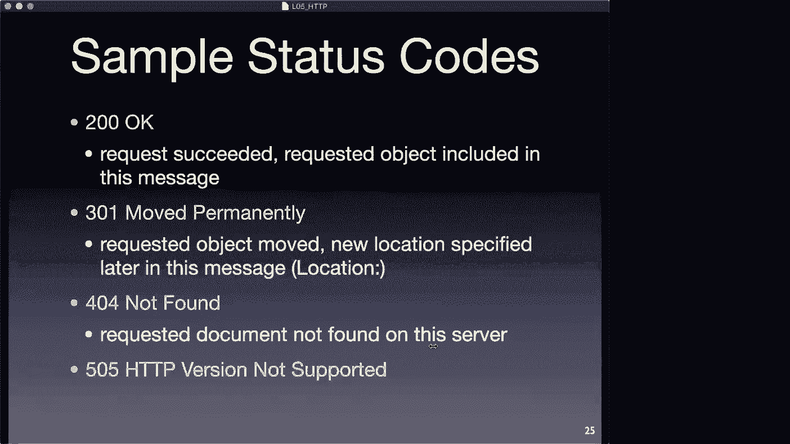

And I like to collect pictures of cool stuff and I think these are great and I'd love to have you know a license plate that basically says you can't find me here and I'd love for like。

You know， when the police uses automatic license plate trackers。

 it'd be awesome if this one would actually send a 404 message。

But I doubt that it does。All right， so when I ask for something。

 let me say I go to some website and say hey Google give me index with HTML。

 so index with HTML is the default kind of。Top starting page for a website。Okay。

 let me have that thing what i'm asking for is the HTML the。

And HTML is a text based format that is the markup of the contents。

So it will have you here's the text in it so the the words down here donate to help refugees and migrants and urgenty that will be part of the the HTML because that's a little bit of the content and then there's stuff around it to say oh this should be centered it should be in this font。

 it should be whatever。Okay， and maybe it will specify oh you should put a particular image here right there's a logo file that at one time was in a gIF or GIF I won't get into that argument file。

And basically， the HTML will specify put that image right here。Okay。

 and that's all the stuff that's in HTML okay not we're not going to teach HTML or anything like that you'll see a little bit of in the lab it's okay。

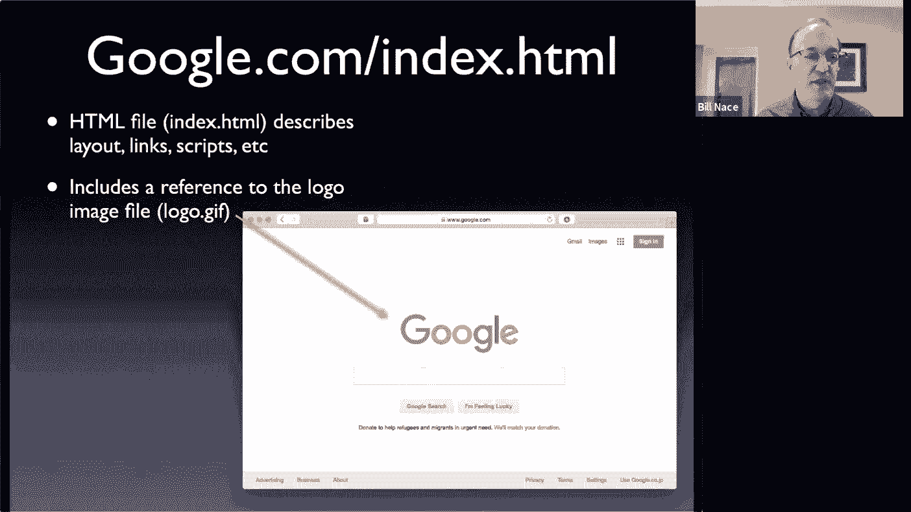

All right， so if I was going to ask Google。For its index do H file。

 So here is how I would do that right， I'm going to put together a request message get， Here's my UI。

 which is the index H。 I'm version 1。 one。 you know the host I'm talking about is Google com。

My blank line， there's my request。Am I going to get the logo file？As well。

 since the logo file is part of what I need to render this thing。No。

 you would because you didn't ask for it。That's right， I asked for index on H。

 I did not ask for logo。 Jeff or GF。so I'm not going to get it。

 I'm just going to get what I asks for。Every time you request something。

 you're asking for a single object。😡，That object is an HTML file or an image file or a movie file or a CSS file or whatever。

Javascript， right I'm asking for a single thing and I'm going to get a single thing。

OkayNow this is one of the things that the 2。0 version of HTQP has transformed。

 and that is that when I ask for something， the server is allowed to send me stuff that I didn't ask for。

Under 1。1， I ask for something the server can give me that will hopefully give me that thing if it can。

But it won't give me anything else。HDP2 the server can say wait me you just asked for the homepage I know in a minute you're going to ask me for the logo so let me just go ahead and send it to you we call that server push。

We don't have that in 1。1。Yeah， so each request asks for a single object。Okay that object， of course。

 will often have links to other things。Okay， so Yahooe， no， if I ask for the HTML thing。

 I get the HTML thing。And。Then when I get that I then parse it and the browser starts looking through and says oh here's a CSS file here's a JavaScript file I need and it then creates more HTTP requests to go get each of those there's no mechanism to bundle a whole bunch into like some web archive format thingy and send us here's everything you need for a website。

😡，OkayThe idea is you ask for something， we give you that thing， if you want more。

 you can always ask for more。Okay， and the advantage is。

It may be that I don't need everything I actually have that JavaScript file already。

So I don't want you to send it to me again， it's been cached in my browser cache。😡。

So let me just get the things I'm asking for。All right， so this。

Can lead to some interesting behavior and so。There's some connection management issues。

 the way that HTTP uses TCP that originally were not optimized and one of the stories of HTTP is we've done more to make HTTP work well with TCP。

You're going to learn TCP in a couple weeks， okay？TCP is a transport protocol that is really good。

 it's actually brilliantly good at moving mass amounts of data through the network。

 and it does lots of things to optimize for when you need to send lots of data through the network。

The problem is some of those actively work against short requests or requests for little amounts of data。

 for instance， one of the things it does for collision control。

 we'll talk about this again one of the things TCP deliberately does is it slows things down at the beginning。

 it actually sends slower than it could until it has a good understanding of what the network will handle because it doesn't want to overwhelm some router somewhere and bury it in a bunch of requests。

And so if you're sending a short amount of data， that means you're not using the bandwidth efficiently。

Also you have this back and forth thing right we've talked a little bit about this。

 let's say I want to get the front page of CMU's website。So I put together my HP request。

 but before I send that with TCP， I have to open a TCP connection to the server and so that that's that picture I showed you way back at the beginning where the client sends a。

You mother， may I sort of request， hey， server， please may I connect to you。Okay。

 and the web server then。Responds with another message back the other way yes。

 you may connect to me and at that point there's now this connection and so now the client is allowed to send data the client then actually sends the HtTP request for index。

 HTML the server gets the request it goes and finds that file which it's very good at it puts it into a response message here you go Hp1。

1 to 100 okay here's the competitors here's the data all that gets sent back。The server then is done。

 right， you ask for something。We responded， we're going to close up that TCP connection。

The browser now has the HTML for CMUs。Front page and if any of you have looked at that recently。

 you know there's more stuff going on。The browser is immediately going to start looking through that HTML and making a list of all of the other stuff we have to get。

 ohh， there's pictures of alumni and pictures of students in masks around campus and there's JavaScript to make things slide back and forth and transform。

Let's go get all that stuff。Okay and every time you go get that stuff。

 you start back with step one mother may I can I please connect you。

 yes you can let me have that JavaScript file here's that JavaScript file we close the connection。

Okay， oh now I need the CSS file， hey mother may I please connect to you， yes you may okay。

 and so we spend a lot of time opening and closing these connections。Okay。

 because we're asking for short stuff， usually。

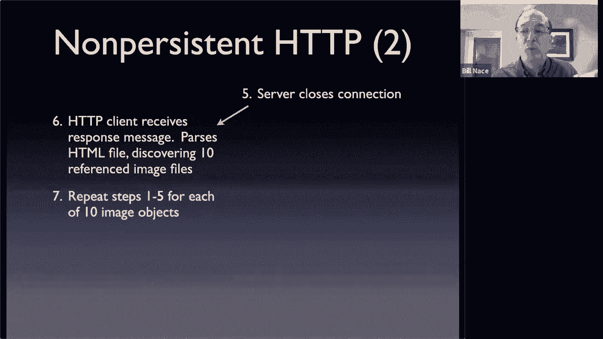

And so if I look at this from a modeling perspective， we can count the time yes。

 you could use a stopwatch， okay， to know exactly how much time it is。

 but that would vary depending on network conditions and where you are versus the server and so we abstract it a little bit we often measure things in round trip times。

And so our calculation is going to have a two round trip times。

 one round trip time is the time when I send a message and I get a response where I say， hey。

 can I connect to you， yes you can。Hey， can I have this file， yes， here it is。😡，Okay。

 and one round trip time to get the start of the file and because we sometimes ask for small files and sometimes ask for big files。

 then the transmission time will also add to this as a kind of a variable。

And so that means every time I open a TCP connection。

It takes two roundship times plus transmission time before I have my data and can start using it now yes。

 there's another round trip time here at the end， but I'm going to ignore that from a performance modeling perspective because that's just cleanup yes that has to happen but at this point after two roundship times and a transmission time I now have my data and so I can start rendering it。

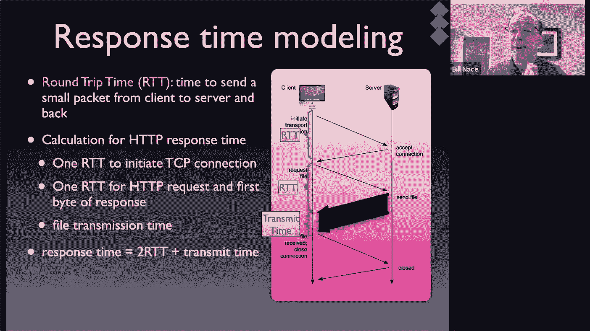

Okay。So this is problematic two round trip times plus transmission time for each object I need Okay。

 for each of the pictures on my website for each of those。Many， many， many JavaScript。

Things that we have out there and no， I'm not saying runship time is constant， in fact。

 it never will be completely constant。Okay it can be very dynamic we're just kind of abstractly modeling it here's a way of comparing。

 even though i'm not comparing down to the seconds。I'm comparing to be able to say， oh。

 this one looks better because it has more round trip times or less transmission times or whatever。

Round trip times， I guess I should。I don't know if this is obvious。

 but I should point out the round trip time is usually orders of magnitude more than the CPU time that it's going to take to render things。

 stuff like that。The round trip time is really the painful part， and so we're counting those。

And that's part of what the user sees that。In fact。

 it used to be this is a kudgen story right back in the day right back in the day the network was slow enough that you would actually see the pictures as they were being rendered you could see them being drawn kind of line by line in the web browser as they came in and know because the network was。

Much slower than it is today。And so you actually felt that latency。

We don't feel that so much these days， things have been optimized quite a bit。

So the problem here is that TCP。Is optimized but it's optimized per connection right every connection will do the best it can to transport large amounts of data down that connection。

 but there's no sense of kind of optimizing cross many connections and so you are paying for stuff you're starting up you're sending these messages back and forth。

You're in a slow start phase where you're deliberately not using all the bandwidth。

 you're slowly increasing the amount of bandwidth you use all sorts of stuff that you're paying and oftentimes for the HTP connections we have I'm asking for the index file right that's just you know a couple kilobytes in size。

Okay， and so that goes into like three or four TCP segments。

And so we never get anywhere close to the optimization level before。

It's done and we close that connection。

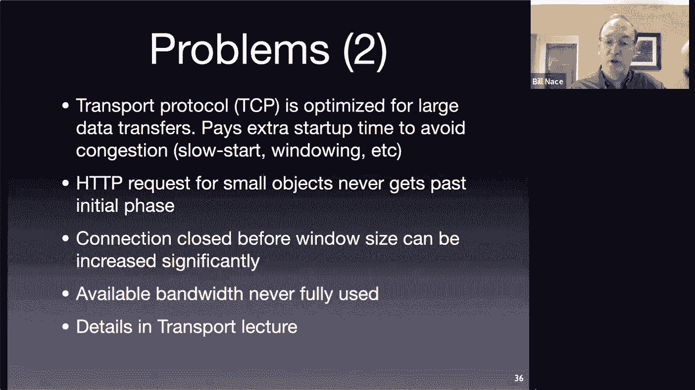

We'll learn more about this when we get to transport。Another issue， you know I go to Reddit。

 I load this up I in creating this picture for the user， we've sent lots and lots of requests。

 we've gotten lots and lots of responses for each of these files。

 each of these tiny little pictures and you know these little images that show up all those are separate transactions with the browser。

 you all that kind of stuff， the fe icon that goes in the browser。

 all that stuff is a bunch of communication back and forth and back and forth。

And you know what happens right as soon as I type Reddit in you know and ask for all this stuff that's when my boss comes in the room and so I have to like close this out quickly or I decide。

 oh yeah， I've already been to Reddit this morning I should actually get some work done。

And you close this out。And in doing so， you've actually paid all the costs at the beginning to get this thing。

 and so when you abort those requests， everything goes， you know， you throw all that work away。

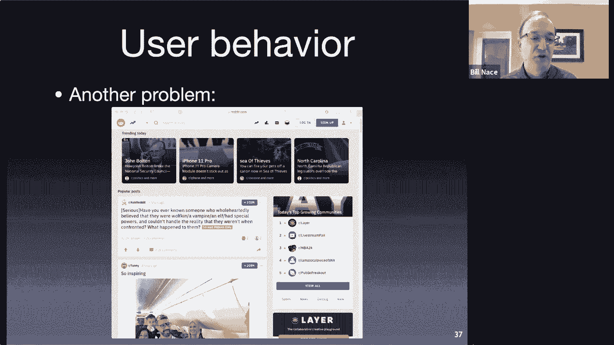

Now。🤧。嗯。Computer engineers have the superpower that they deploy whenever they run into。

Issues of CPU performance or things not happening fast enough and that superpower is parallelism。

Okay， and。This is what originally happened， I said， oh。

 my browser is not loading stuff fast enough down a single TCP connection。

I'm going to just open multiple TCP connections。 So now instead of loading all of that web page and allowing the browser to have a single connection to the server。

 I'm going to open four of them at once。 I'm going to load four of my pictures at once instead of one。

Okay， that turned out to be a really bad idea actually it was great idea。

 it sold a lot of web servers and web browsers at the beginning。

 especially in the day when you were watching the pictures load as your page loaded。

Okay because all of a sudden now oh look， I remember this day right。

 Mozilla got updated and I was like， oh great look at this now instead of a single picture loading。

 four of them are loading at the same time it it's going so much faster。

 it actually wasn't going faster at all In fact， those four connections were competing with each other for network resources and actually slowing things down。

😊，But because it looked to me like four pictures are loading at once。

 it looked like we're going faster。Okay。So instead， HTTP in version 1。

1 added what we know is connection management， added the idea that you can have a persistent HTTP connection。

So the actual problem here isn't that we don't have enough connections or something like that。

 the problem is。I'm throwing the connection away after I paid all the startup costs after I have the may I connect to you。

 yes， round trip done and after I have done slow start， right？When I get my response。

 I throw all that work away。So instead HtP1 at1 says let's keep that around。

 let's make it persistent so the connection is persistent， we'll leave the connection open。

If we ask for this to happen and then when I need to make my next request I just use the same TCP connection there's no need to once again mother may I connect to you yes you can it's already there let's go ahead and open it up。

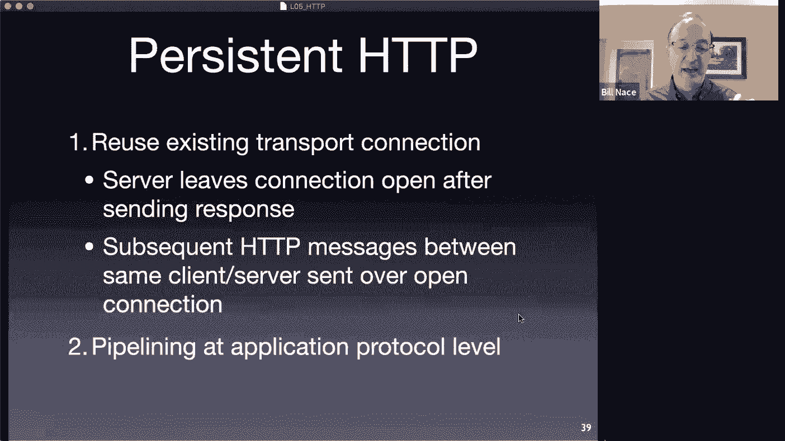

Okay， and so this is what it looks like in a persistent connection。

We still have to open the TCP connection， may I connect to you， yes you may。

 so there's one round trip to do that。Now I can request my object， hey， can I have index do HTML。

 Sure， here's index。 HTML。Okay， and now oh let me look through that oh I'm going to need a css file hey can I have cU。

css here yes you can oh I'm going to need an image can I have that image here。

May I have that image yes you can。So we're going to need a round trip time to start up。

And then we need a roundship time for each request every time I make a request。

 may I have that thing， yes， you can， may have another thing， yes you can。And so I have。

 this is way better， right？A couple slides ago， every request required two round trips plus transport time。

Now I can make a whole bunch of requests， each of which needs around trip time。

But instead of each of them also needing another round trip time each。

 I have this one request to open the connection that I'm amortizing over many， many。

 many individual HTTP requests。And we can go better。Because now I can。

Another thing that computer engineers always do whenever they have the opportunity。

 let's overlap operations， let's actually pipeline things。

Let me go ahead and I know I need three things from you。So I'm going to open the connection， hey。

 can I connect to you， yes you can。And now let me just ask， hey。

 can I have this and while you're at it I want that and also I need this other thing。

 so you send all three of the requests。And the server sends you each response as it goes。

OkayYou don't have to wait around to get the first response， this first picture here said。

 let's wait around until I get my first response handled before I ask my second。Here。

 I'm just going to go ahead and say， hey， here's my entire laundry list。I need milk， eggs。

 and butter， instead of I need milk。Once I get the milk let me ask for eggs。

 let me go ahead and just get all this at once。Now one caveat。

 oftentimes this first request is for an HTML page。So when I go ask for index。 Hmo， at that point。

 I don't know that I need a whole bunch of pictures。

So oftentimes I'll have let me have that HTML page and once I parse that HTML page now I know I need a whole bunch of things and so at this point in time。

Now I'd fire off requests for 10 images in five JavaScript files。

But I can overlap all those if I like。

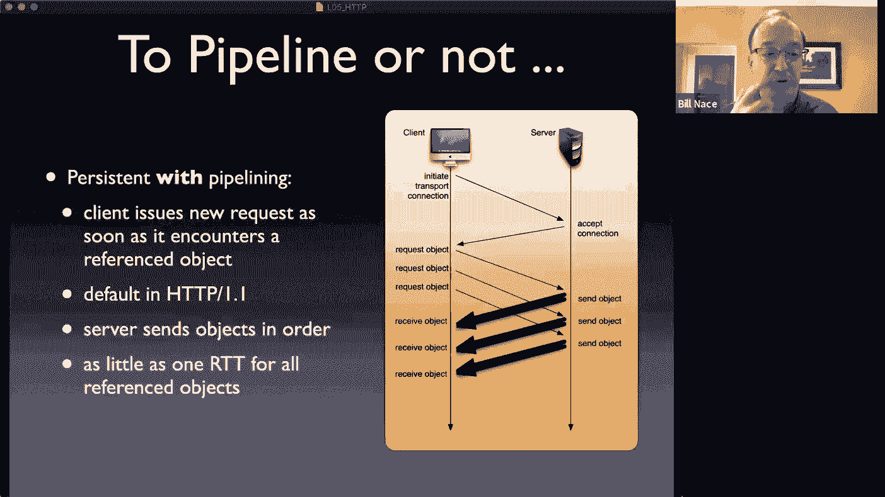

🤧。Huge advantages right don't do set up and tear down the seat the server loves it because it doesn't have to manage all those set up and tear down in all that state。

I'm using the TCP connection。In the optimized state now I can actually。

By sending all my data down the same connection， let that。

Let TCP actually optimize that actual transaction， and so that's going to。

Use the connection quite well。

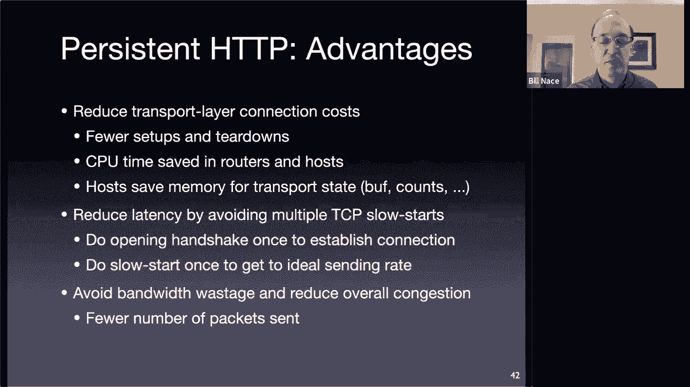

All right， a couple minutes left to talk about caching。

 which is something else that was improved in 1。1。This is another one of those superpower things。

 right？Computer engineers do this all the time if。If I do a bunch of work。And I get an answer。

Let me save that answer somewhere so that if I ever need to do that work again。

 I don't have to actually do the work， I just look up the answer。😡，Okay so we do this you know oh。

 memory accesses are expensive， so once I go off to memory in my computer architecture。

 let me get the results I get back from memory and put them into a cache right our CPUs have usually they have many layers of caches。

They are a mechanism to improve performance by letting us。

Use work I've done in the past if it's reasonable I'll be doing that work again and so a web proxy is a cash mechanism that does the same thing。

So the proxy is a server somewhere that usually is specific to a network。

 so let's say Carnegie Mellon will have this proxy server and the idea is that within the network。

I may have many clients that are going to ask for the same thing。

Maybe all of these clients are going off to CNN to see what the news is and so they're making the same request。

 they're saying hey CNN or hey， you know hey， Wall Street Journal。

 I'd like to see the front page of the Wall Street Journal today and that's the request。

And so those requests flow through the proxy server， the proxy server makes the request of。

 you know it'll go off and actually go to where the data actually as we call that the origin server。

 it'll go to Wall Street Journal and talk to the web server to get the actual front page and it'll pass that along to whoever asked for it。

 but it'll save a copy。So that if later on there's another request for the front page of the Wall Street Journal。

 we don't have to go talk to the Wall Street Journal anymore， we can just give them that data。Okay。

 and if there's， you know， if this request comes in the proxy server。Looks up and says。

 do I have this and if so let me just give it to you。

 otherwise I'll go talk to some origin server to get it for you。

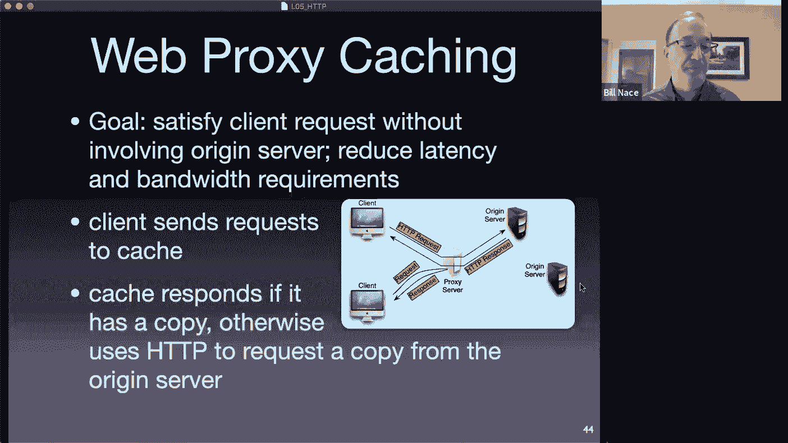

Now whenever you cache something you have to worry about consistency。

 you've made multiple copies of something， what happens if the copies are different and for us that happens because the Wall Street Journal has decided there's breaking news。

Maybe not Wall Street Journal， but the newspaper has decided there's breaking news。

 we need to change what the web page looks like。Okay。

 and so now what's at the origin server is different from what the proxy server has and so this was the problem with caching under 1。

0 there was no way to communicate these things there was no way to ask。

You know that has the front page been updated again。

 you know should I get a new copy is the copy I have good and so headers were added to the protocol to allow us to specify the expiration of the data so when you go to Wall Street Journal and get that that web object。

You can say， and how long will this be good for is this good for an hour or for a day or for a week。

 how long can I keep this in my cash？And。That means that any request that come in while this data has not expired。

 I don't have to talk to you at all you've basically guaranteed that this data will be good for a week。

And so I can keep it for a week and respond to requests for a week。After a week， this data is stale。

 doesn't mean it's changed， it just means maybe I ought to go check again。

And so we'd wanted to be able to know when it's expired we'd also like to have ways to ask is this thing still valid okay I have this copy that's dated at this point in time。

 is it fresh or is it stale。Okay， now。HttP protocol allows you to ask these questions it doesn't have policy right there's a bunch of cash policies like。

YouIf I if the cache is full I need to throw something away which one do I throw away the protocol is not going to specify that all the protocol has allowed you to do is ask these questions and get the data about the freshness and about the expiration date of our particular objects。

Okay， the the。Designer of the cache， whoever wrote the cash code is the one who has to answer the policy questions like。

You know， which object do we evict or you know how do I decide？

should I decide based on popularity or not？You know， quit how to replace something。

And so there is this expires header or there's a cache control header that let you lets the server specify。

 and so oftentimes in fact I would be surprised if Wall Street Journal wanted their stuff cached。

 okay normally they're going to say， oh， max age equals zero， please do not cache this at all。

OkayI do you know why a newspaper would tell you it did not want stuff cacheed because theyre are constantly updating content。

So that's one of them right they probably are updating content often， but they could say half hour。

 right？😡，Yeah it's the ad revenue okay they want to be able to prove that their stuff gets read and the only way for them to do it is to or the they have found many ways to do it because they're tracking us all the time in very privacy invasive ways but from this conversation the way to do it is to have your web server count how many connections it's had and then you can go to the ad sales guys and say。

 hey our web server had you know 27 million connections yesterday increase our ad price sort of thing is that true for most guys you think that we could just refresh the browser over and over again and you know get to get a rack up quote unquote you take views？

Yeah， so。There's there's a bunch of behaviors that will push that one way or the other right i'm sure that they also probably are doing things like unique IP addresses so if you happen to have a friend you who works in marketing at a newspaper and you want to increase their ad sales by just hitting refresh over and over and over again they're probably going to say oh yeah those all came from from your your particular connection so those don't count so that's why we do unique users per month and metrics like that。

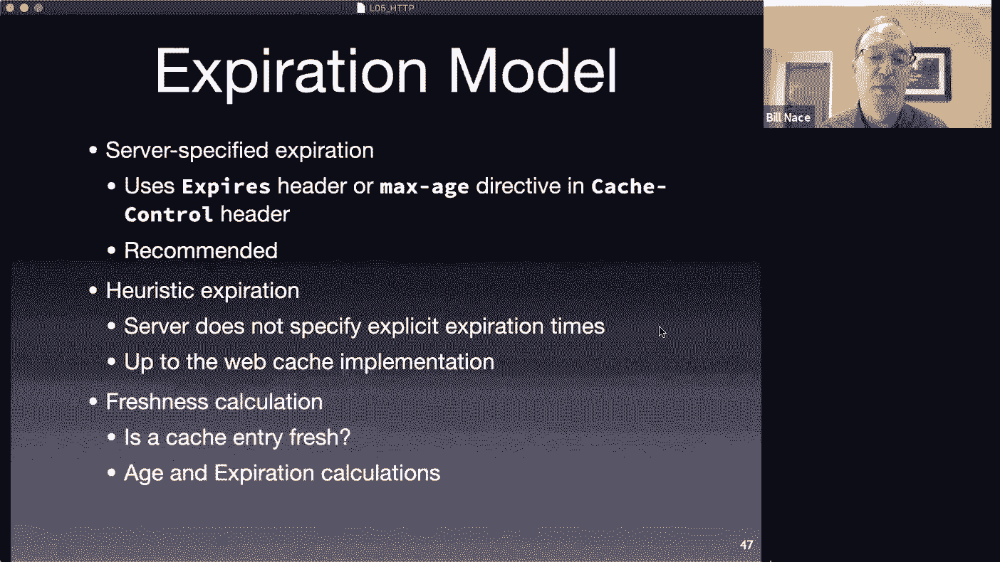

嗯。Validation is done by asking questions so this is when the cash wants to know it says hey。

 I have this thing is it still good and what we do is there's an if modified sense header that makes our gets conditional I talked about this a little bit earlier and I can say hey。

 I've got the copy from yesterday。I'm going to send a get message。

 but I'll tell you I have a copy since yesterday， and so if it hasn't been modified。

 then you get back a 304 not modified message that does not contain the data。

 it's just a very short header as opposed to if the object has been modified then you get a 200 and the new data with it。

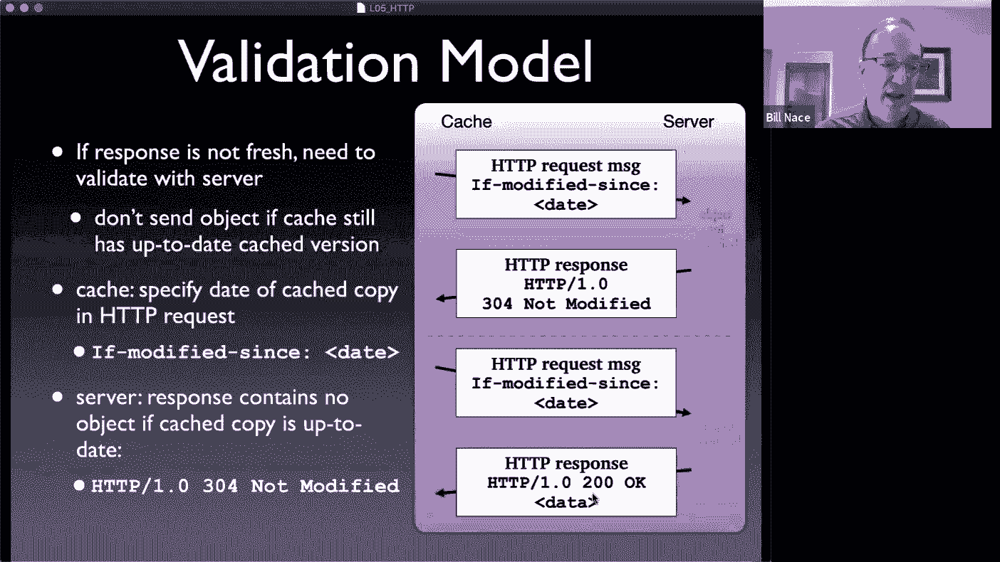

Okay。So last question then will be done for the day， I've talked a little bit about web proxies。

 which are a server that would be stuck somewhere， let's say CMU has a web proxy server that works as a cache turns out your browser also has a cache so if you refresh a web page you know it may be that not all of that gets refresh because your web browser has decided。

 oh， I have a copy of that JavaScript file， let me just use that。Okay， is so。

Is the web proxy better than your browser cache？Austin， yes， the browser is closer to the browser。

 it's in the browser。Doesn't necessarily mean it's better or worse。

Stepha knows any cash should result in less traffic， so that's good。So Dion is on something。

 the proxy can serve multiple browsers， the proxy is better。

Because it's at CMU and so it's able to serve everybody at CMU that asks the same question， Okay。

 the browser cache is on your browser。So it can't help if Don asks the question。

 my browser cache is not going to respond。😡，It helps me if I ask for the same thing over and over。

 it's already there， okay， but the one at CMU is going to make sure that only one request to New York Times leaves CMU every day and then every other request for the New York Times stays within CMU's network。

😡，Okay， and so that lets it respond to other clients that are in the same network on the other hand。

So the answer is yes and no。The browser cache is better because it can actually respond to stuff if the network is down or not working and it's actually better for you okay so Austin or whoever that was was correct in that the browser cache is closer to you and so the browser cache is better for you because now you don't have to go talk to us CMU proxy to get an answer to your question it's right in the browser。

No network traffic needed。So it depends。

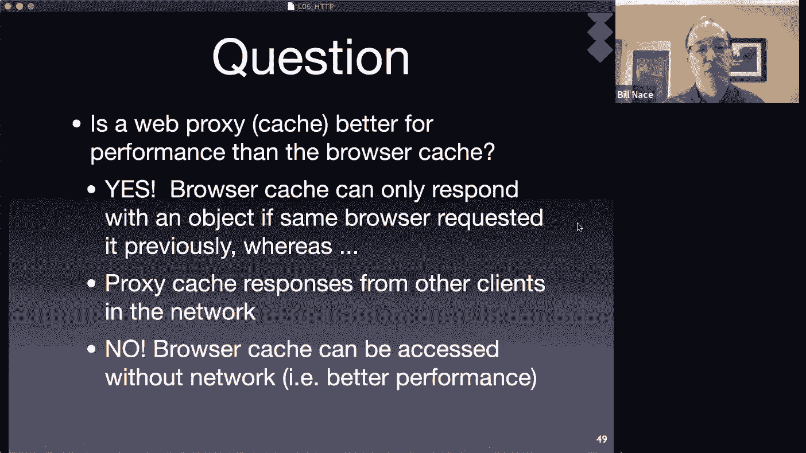

All right， and here's our lesson objectives for today with that， we're done with our first。Protocol。

 we're not done with the layer， okay we're going to keep talking about application stuff for a while。

😡，But we've had our first look at a protocol in the application layer and dug into this is probably the most popular。

 I know we'll talk about DNS next time， which is another very commonly used protocol in the application layer as well。

Until then， hope you guys have a great couple days， we'll see you next time。Goodbye。Bye bye。

e晚 thank you。Yeah， good luck if you're going to TOC。Go get a job， get an internship。

Profesor I have a question。哥也许。I'm I saying there'。Yeah， I have a question I said。

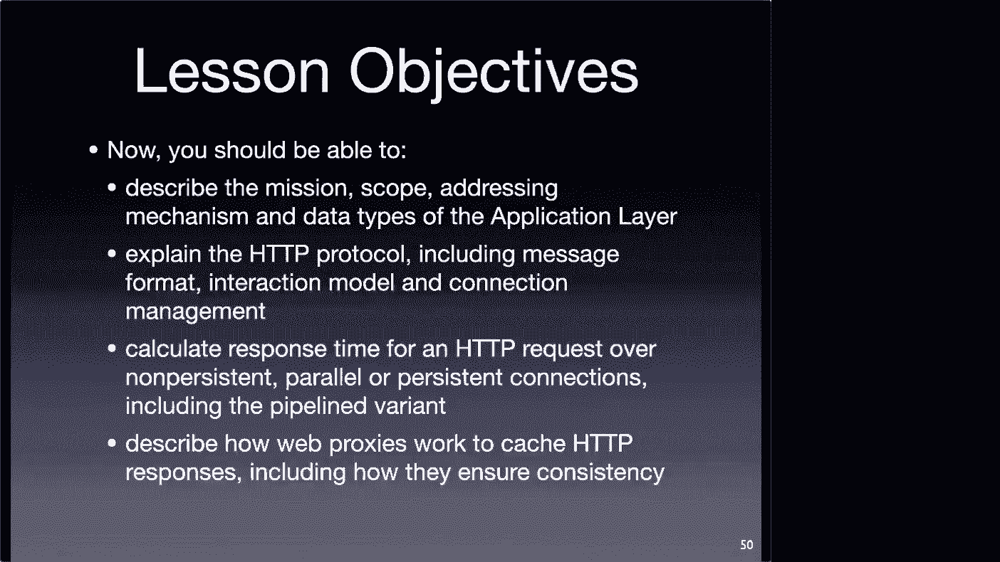

So does each computation node like routers in the network has a cash implemented。

Or it's only happened on Web proxy or browsers。 No， yeah， the routers won't have a cache in them。

 in fact。You may recall that the router is a in the pictures I showed actually didn't have any transportation or application layer in them。

 and so that meant the router was just sending packets around so it doesn't even look in theory。

 the routers don't look in the packet to find what the contents are to know that it's an HTTP request。

Okay so in a pure network they would not get involved at all。

 the proxy then is a special server that is put somewhere in the network by the network administrators and they make sure that all the HTTP traffic has to travel through it and that particular proxy now actually has transport and application layer to make this all happen。

Okay， yeah， but not all the routers are doing this just it would be a specific machine that the network administrators have put in place。

Thank you very much， sure。Hey， Jeremy did you have any further questions about administrative stuff or did answer them I think let's see I will。

 I mean the only challenge is so I thank you for asking， by the way。

 this is helpful that let's see fills office hours and your office hours for that matter。

Sorry'm sorry， your office hours are fine so the point is those office hours。

 I have class my I have class from 320 to well。It's a mini， so we'll be over halfway of the semester。

 but the point is for Bills Al I have a class that almost entirely conflicts with that。

 So if I needed to ask him about something else I could。I could set up a different time。Of course。

Yeah， I mean， it may be more， so if you have a general， you know。

 how do web proxies work kind of question？I would I would say especially in your case。

 probably easier to go to a TA during their office hours。

 but certainly you're welcome you know to do that， but that's going to require a email to me。

 hey Bill， can we set up something and a me back you know how's Thursday at two and you know it's not you know that kind of stuff so from a scheduling perspective it just may be easier to go to TA but certainly if you have a specific thing you want to ask me actually。

Anytime， if you want to talk to me， I'd certainly be happy to talk to you。

Okay thanks yeah okay since I just got on so now i'm just like kind of running through all the stuff I had missed before Okay okay all right so I think that's good I mean i've glimpsed over the Wi sha lab I haven't started it yet but it shouldn't take too long I don't thinks no it's a it's a two hours to sit down and actually do it sort of thing fantastic Okay thanks very much thanks for asking your question about the study groups I think。

As I mentioned， I really think that's a powerful way to study yeah， I mean。

 normally I guess we'd be talking in class with those student， but if there's like some mechanism。

 maybe I guess I guess I'm close on Piazza or something to try and get some attention but yes yes certainly welcome to I actually I got an email last night that I haven't really responded to or really even read fully about somebody on campus who's saying that there's been a request for a study group in74 I don't know if that was you they may have some way of setting something up so I will hopefully today get to my enormous email inbox and maybe we'll have a piazza post about that as well Okay I mean I didn't send you anything but I'm gonna make a piazza post or write about this right now Yeah sure go for it okay thanks very much Bill certainly。

没，拜拜。

