# 计算机网络基础：5：应用层 -- HTTP


在本节课中，我们将要学习计算机网络体系结构中的应用层，并深入探讨一个核心协议：超文本传输协议（HTTP）。我们将了解应用层的使命、HTTP协议的基本工作原理、消息格式、连接管理以及缓存机制。

## 课程概述与提醒

在开始技术内容之前，有几个事项需要提醒大家。

*   **实验截止日期**：Lab 0 将于一周后（下周二）截止。该实验主要关于使用 Wireshark 分析简单协议，帮助大家熟悉 Wireshark 工具。
*   **阅读材料**：下次课程将回顾 Mockapetris 关于域名系统的论文，这是一篇了解 DNS 工作原理的必读材料。
*   **即将到来的测验**：两周后我们将进行一次测验。由于无法线下进行，具体形式仍在设计中。测验将涵盖截至“排队论”讲座的所有内容。如果遇到任何困难，请及时联系助教或我。

上一节我们介绍了课程安排，本节中我们来看看有效的学习方法。


关于学习，我想强调一点：仅仅浏览幻灯片并“识别”知识点是不够的。测验要求你“生成”知识，即根据问题组织答案。因此，更有效的学习方法是主动回忆和应用知识。

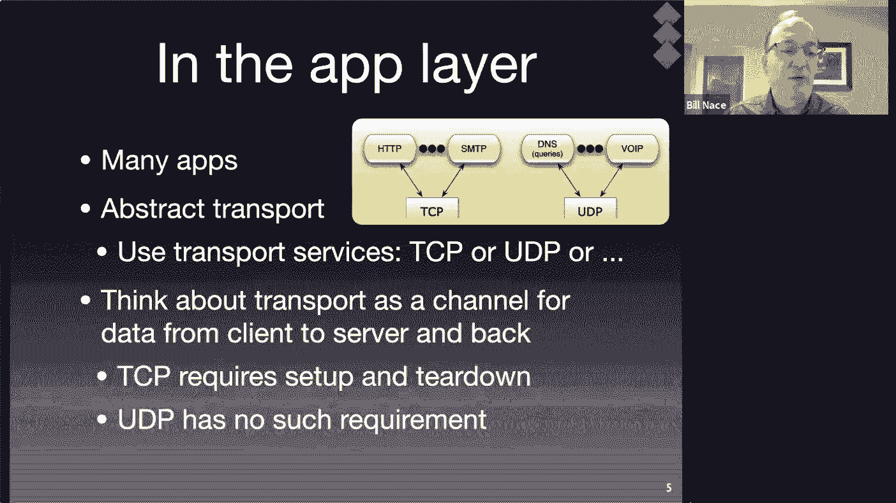

以下是几种有效的学习方法：
*   **利用课程目标**：针对每个课程目标，自问是否能解释或实现它。
*   **组建学习小组**：在小组中互相提问和解答，模拟测验环境。例如，可以提问：“应用层的使命是什么？”或“在HTTP协议中，使用哪种数据单元？”

## 应用层概述

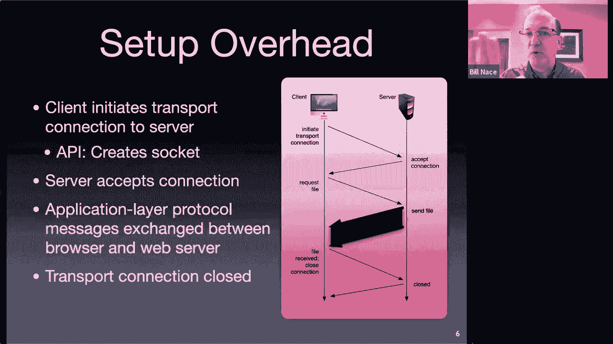

上一讲我们探讨了网络互联，现在开始深入技术层面，从应用层开始我们的旅程。我们将遵循一个固定模式：首先理解该层的理论和使命，然后研究具体协议。

那么，应用层在做什么呢？如下图所示，应用层包含了大量需要网络服务的应用程序。作为应用层，我们可以忽略下层的大部分细节，但需要利用传输层提供的服务。因此，应用开发者需要根据需求（如是否需要可靠传输）选择合适的传输层协议（如TCP或UDP）。

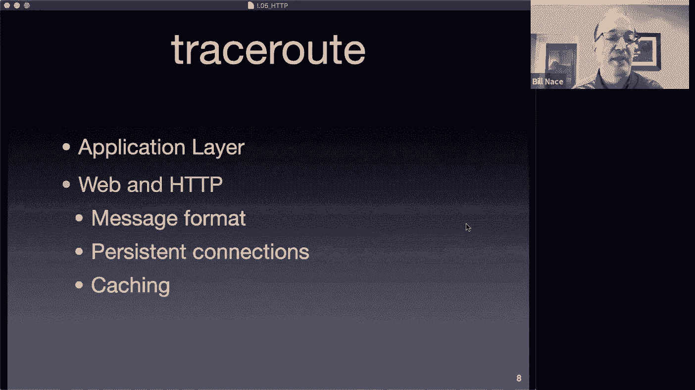


为了更具体地理解选择不同协议的影响，我们来看一个例子。TCP是面向连接的协议，建立连接需要额外的开销。

下图展示了一个序列图，描述了建立TCP连接、请求文件、传输数据和关闭连接的过程。可以看到，在真正传输数据之前，客户端和服务器需要额外往返一次以建立连接（SYN, SYN-ACK）。这增加了一个往返时间（RTT）的延迟。

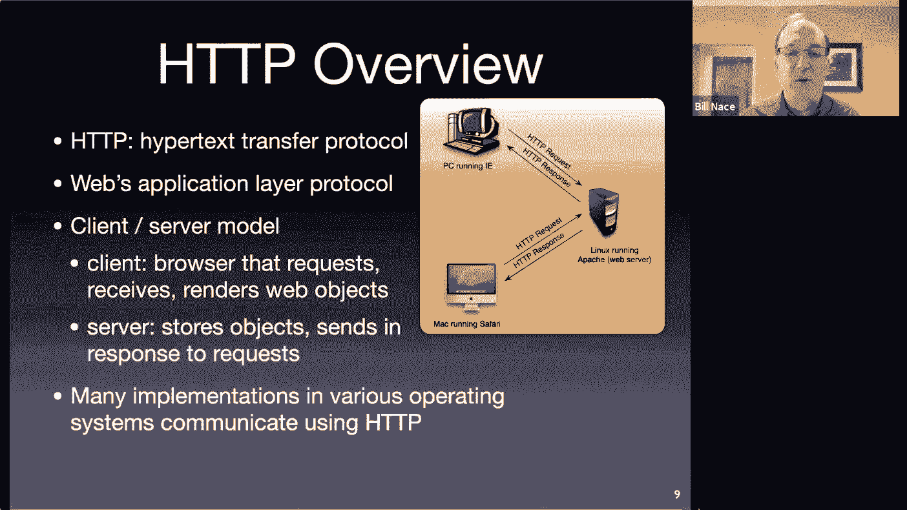


### 应用层的使命与特性

现在，让我们正式定义应用层。

*   **使命**：应用层的使命是**提供对网络资源的访问**，允许我们编写能够利用网络带宽、跨地点传输消息的程序。
*   **寻址机制**：应用层需要一种方式来标识通信目标。虽然域名和URL是通用机制，但许多应用有自己特定的地址，如社交媒体账号、游戏内ID等。
*   **数据类型**：应用层交换的数据单元称为**消息**。消息的格式完全由具体应用协议定义，内容可以是任何应用需要的数据，例如网页请求、游戏状态更新等。

## HTTP协议详解

了解了应用层的基础后，我们来看一个最重要的应用层协议：HTTP。

### HTTP简介与发展

HTTP（HyperText Transfer Protocol）设计用于传输超文本，是万维网的基础。它是一种**请求-应答**协议，遵循客户端-服务器模型：客户端（如浏览器）发出请求，服务器返回响应。

网络领域充满缩写。一个有用的规律是：许多以“P”结尾的缩写代表“协议”，如TCP、UDP、HTTP。

HTTP无处不在，从操作系统到微型控制器再到超级计算机都在使用。

HTTP的发展历程如下：
*   **HTTP/1.0 (1993)**：初始版本，功能基本，但缺乏缓存控制，TCP使用方式不优。
*   **HTTP/1.1 (1990年代末)**：重大改进版本。由于Web已非常普及，此版本必须考虑**向后兼容性**。它增加了持久连接、更好的缓存控制等特性，并存活了近二十年。
*   **HTTP/2 (2015年批准)**：专注于优化数据传输效率，例如支持**服务器推送**。但它为了性能优化，在一定程度上违反了严格的分层架构原则（涉足了传输层的职责），因此我们本节课主要关注HTTP/1.1。

### HTTP消息格式

任何通信协议都需要严格定义消息格式，以便发送方编码和接收方解码。HTTP使用一种称为**巴科斯-诺尔范式（BNF）** 的形式化语言来描述其消息格式。

HTTP消息分为两种：**请求**和**响应**。

一个通用的HTTP消息结构如下（BNF描述）：
```
generic-message = start-line
                  *( message-header CRLF )
                  CRLF
                  [ message-body ]
```
*   `start-line`：起始行，对于请求和响应不同。
*   `*( message-header CRLF )`：零个或多个消息头，每个后面跟着回车换行符（CRLF）。
*   `CRLF`：一个空行，用于分隔消息头和消息体。
*   `[ message-body ]`：可选的消息体。

#### HTTP请求

请求消息是通用消息的一种特化，其起始行是**请求行**。

请求行的BNF格式为：
```
Request-Line = Method SP Request-URI SP HTTP-Version CRLF
```
*   `Method`：请求方法，如GET、POST。
*   `SP`：空格。
*   `Request-URI`：请求的资源标识符，通常是我们看到的URL的一部分。
*   `HTTP-Version`：协议版本，如HTTP/1.1。

HTTP/1.1 定义了数十种消息头。其中，**Host头是所有请求必须包含的**，这使得一台物理服务器可以托管多个网站（虚拟主机）。

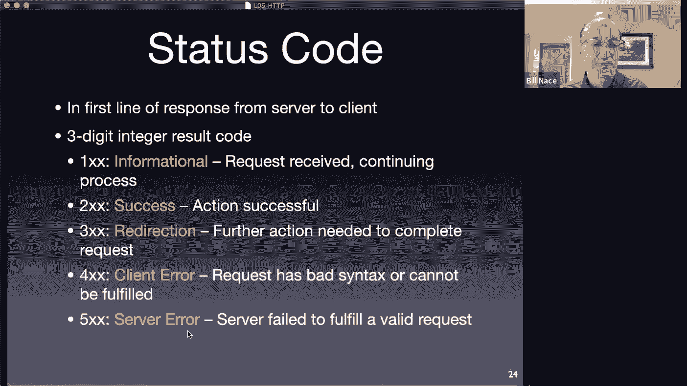

以下是一个HTTP请求的示例：
```
GET /images/logos.htm HTTP/1.1
Host: www.cmu.edu
User-Agent: Mozilla/5.0
... (其他头部)
```
*   第一行是请求行：方法为`GET`，请求URI为`/images/logos.htm`，版本为`HTTP/1.1`。
*   后续每行是一个消息头。
*   最后有一个空行，由于这个请求没有消息体（例如上传数据），所以到此结束。

主要的请求方法包括：
*   **GET**：请求获取指定资源。可以通过条件头部（如`If-Modified-Since`）实现**条件GET**，或通过`Range`头部实现**部分GET**（用于视频流等）。
*   **HEAD**：与GET类似，但只请求资源的元数据（头部），不返回消息体。
*   **POST**：向服务器提交数据（如表单内容、上传文件）。
*   **OPTIONS**：询问服务器支持的功能。

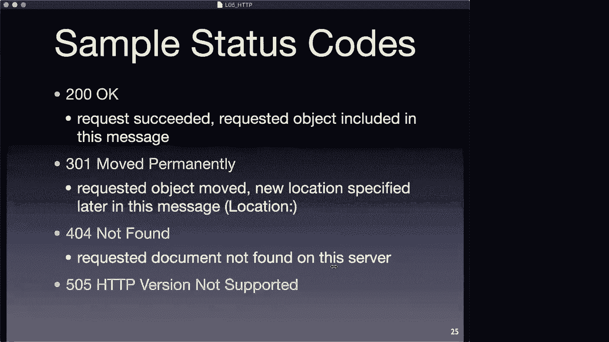


#### HTTP响应


响应消息的起始行是**状态行**。

状态行的BNF格式为：
```
Status-Line = HTTP-Version SP Status-Code SP Reason-Phrase CRLF
```
*   `Status-Code`：三位数的状态码，表示请求结果。
*   `Reason-Phrase`：状态码的简短文字描述，便于人类理解。

以下是一个HTTP响应的示例：
```
HTTP/1.1 200 OK
Connection: close
Date: Tue, 22 Sep 2020 04:15:03 GMT
Server: Apache
Last-Modified: Mon, 21 Sep 2020 12:28:53 GMT
Content-Length: 6821
Content-Type: text/html

<!DOCTYPE html>
<html>
... (HTML内容)
</html>
```
*   第一行是状态行：版本`HTTP/1.1`，状态码`200`，原因短语`OK`。
*   后续是各种响应头，包含了服务器信息、内容类型（`Content-Type`）、内容长度（`Content-Length`）等。
*   空行之后是消息体，即请求的HTML文档内容。

状态码分类：
*   **1xx (信息)**：临时响应，表示请求已被接收，继续处理。
*   **2xx (成功)**：请求已成功处理。例如：**200 OK**。
*   **3xx (重定向)**：需要客户端进一步操作以完成请求。例如：**301 Moved Permanently**。
*   **4xx (客户端错误)**：请求包含错误或无法完成。例如：**404 Not Found**（请求的资源不存在）。
*   **5xx (服务器错误)**：服务器处理请求时出错。例如：**500 Internal Server Error**。

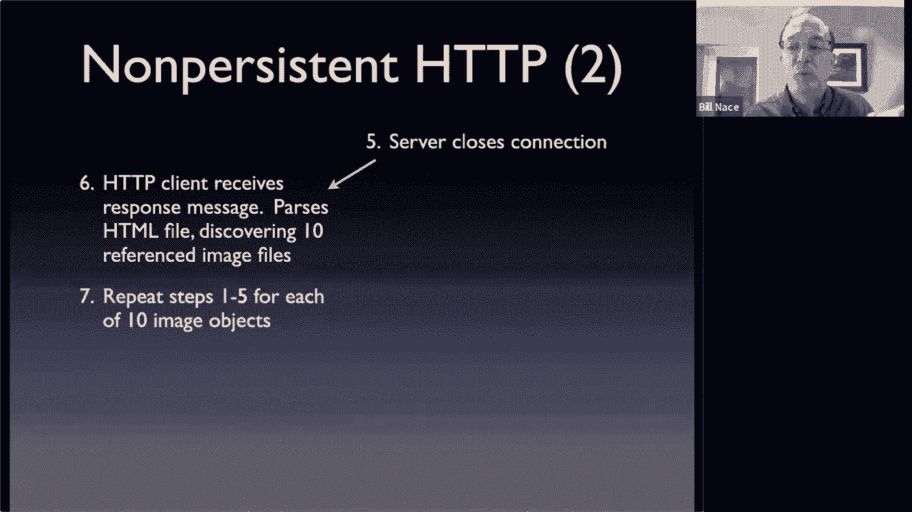

### HTTP连接管理与性能

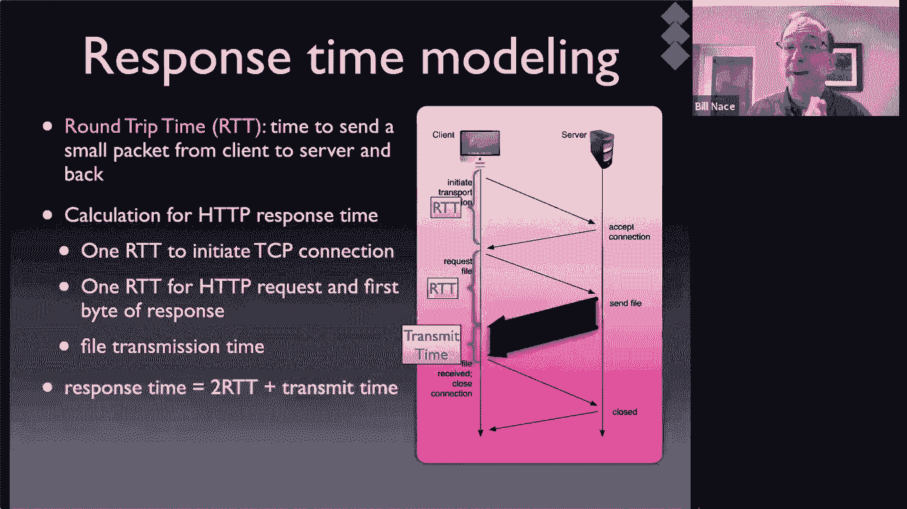

一个关键概念是：**每个HTTP请求只获取一个对象**（一个HTML文件、一张图片、一个CSS文件等）。浏览器在解析HTML时，会发现其中引用的其他资源（如图片、脚本），然后为每一个资源发起新的HTTP请求。

在HTTP/1.0中，每个请求都使用独立的TCP连接。这导致了一系列性能问题：
1.  **连接建立开销**：每个TCP连接都需要“三次握手”，增加了一个RTT的延迟。
2.  **TCP慢启动**：TCP为了不拥塞网络，在连接初期会缓慢增加发送速率。对于传输小文件（如网页上的许多小图标），连接可能在达到高速传输前就关闭了，无法充分利用带宽。
3.  **串行请求**：浏览器通常需要等待上一个请求的响应到达后，才能发起对下一个资源的请求（因为需要解析HTML才知道还需要什么）。

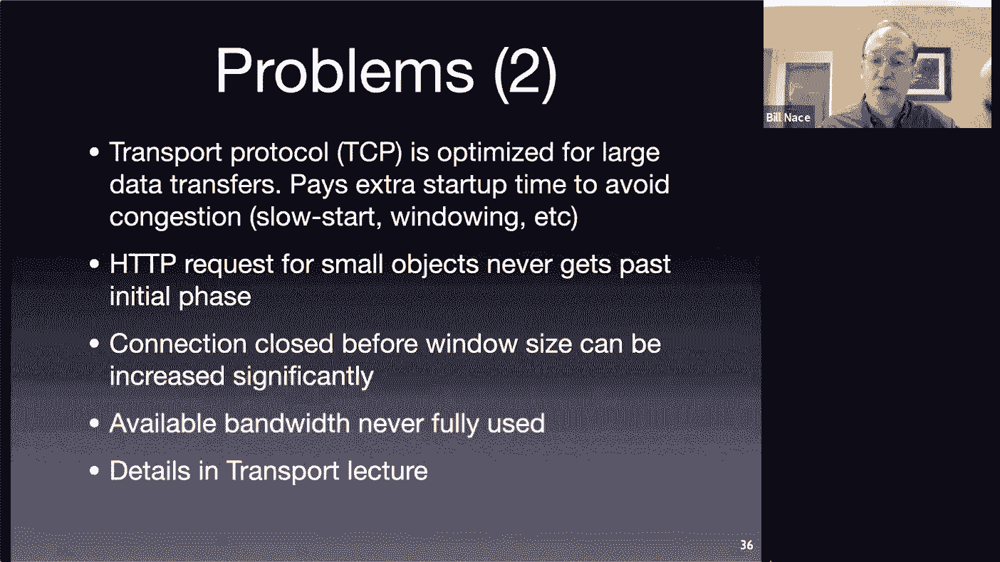

因此，获取一个包含多个资源的页面总时间可能很长，模型化为：`总时间 ≈ 对象数量 × (2个RTT + 传输时间)`。

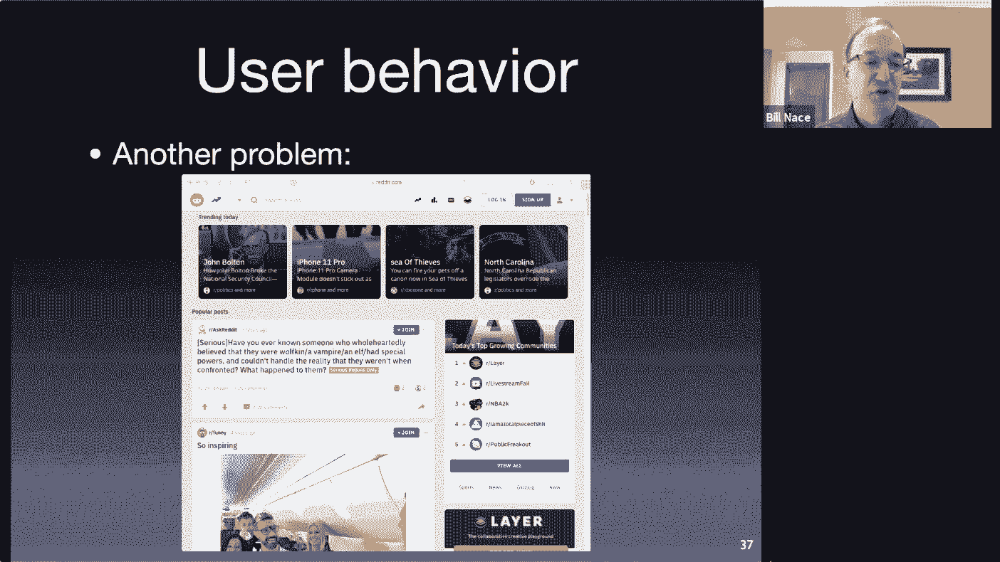

为了解决这个问题，工程师们尝试了并行连接（同时打开多个TCP连接），但这可能导致连接间竞争资源，反而降低整体效率。

HTTP/1.1引入了**持久连接**作为解决方案。在持久连接中，TCP连接在完成一次请求-响应后不会立即关闭，而是保持打开状态，用于后续的多个请求。

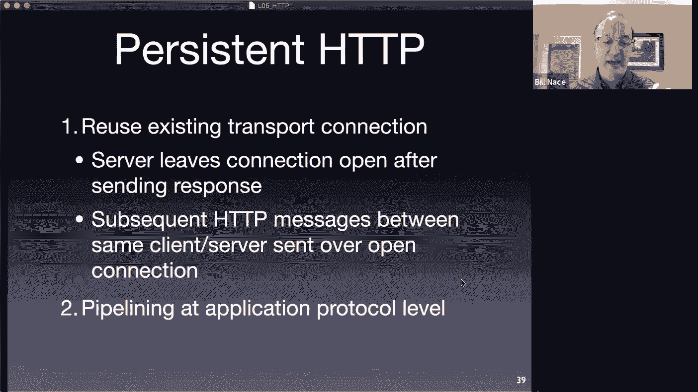


这带来了巨大好处：
*   **消除重复握手**：只需在第一个请求时建立一次TCP连接。
*   **避免慢启动惩罚**：同一个连接可以持续使用，TCP的拥塞控制窗口可以保持较大值，提高后续请求的传输速度。
*   **支持管道化**：客户端可以连续发送多个请求，而无需等待每个响应，服务器按顺序返回响应。这进一步减少了等待时间。

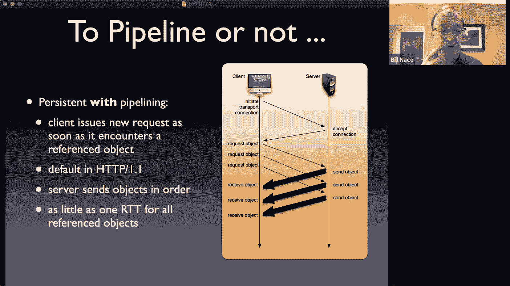

优化后的模型变为：`总时间 ≈ 1个RTT（建立连接） + 对象数量 × (1个RTT + 传输时间)`，性能显著提升。

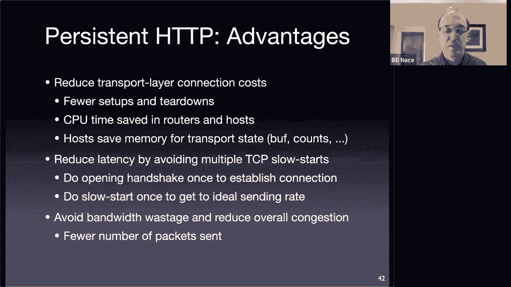

### HTTP缓存

缓存是计算机系统中提升性能的通用策略：将之前计算或获取的结果保存起来，下次需要时直接使用，避免重复工作。

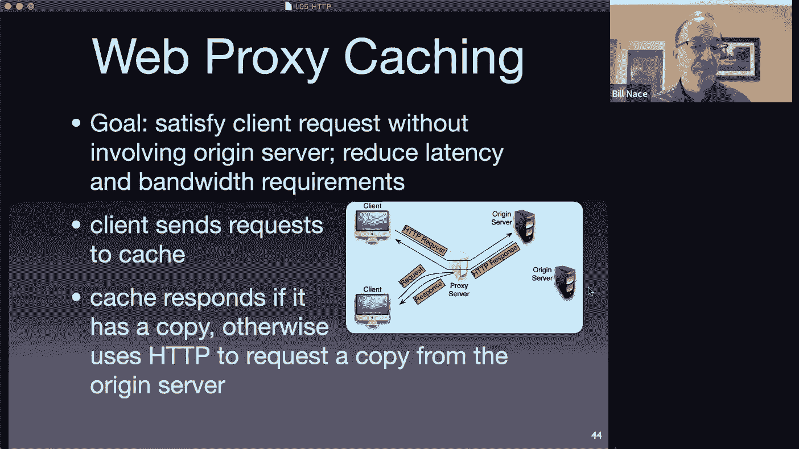

HTTP缓存主要有两种位置：
1.  **私有缓存**：位于客户端，如**浏览器缓存**。只服务于单个用户。
2.  **共享缓存**：位于网络中，如**代理服务器缓存**。可以服务于同一网络内的多个用户（例如，大学校园网内的所有用户）。

缓存的关键问题是**一致性**：当原始服务器上的资源更新后，如何保证缓存中的副本不会过时？

HTTP/1.1通过一系列头部来控制缓存：
*   **过期模型**：服务器可以通过`Expires`或`Cache-Control: max-age=`头部指定资源的有效期。在有效期内，缓存可以直接使用副本，无需联系服务器。
*   **验证模型**：当缓存副本过期后，缓存可以向服务器**验证**其是否仍有效。通过发送一个包含`If-Modified-Since`或`If-None-Match`头部的**条件GET请求**。如果资源未改变，服务器返回`304 Not Modified`（无消息体）；如果已改变，则返回`200 OK`和新资源。

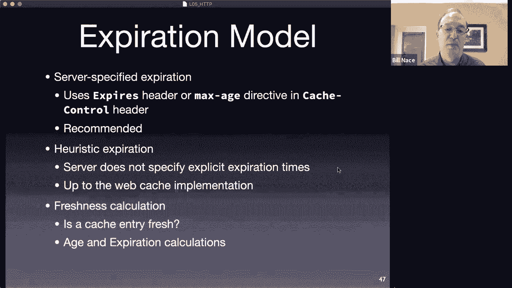

缓存策略（如缓存空间满时替换哪个项目）由缓存实现者决定，HTTP协议只提供了验证和过期机制。

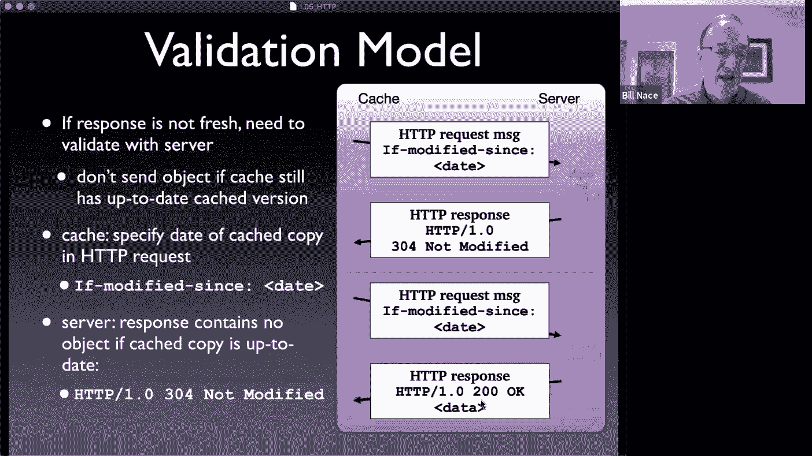

关于浏览器缓存和代理缓存的比较：
*   **浏览器缓存**：离用户更近，响应速度最快，甚至可以在离线时提供资源。但只能服务于单个用户。
*   **代理缓存**：可以服务于大量用户，减少从内部网络到外部网络的重复流量，节省带宽并提升整体访问速度。但响应速度通常比浏览器缓存慢。

## 总结

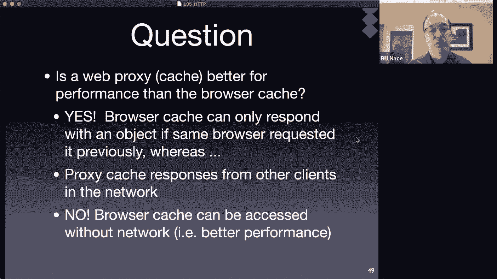

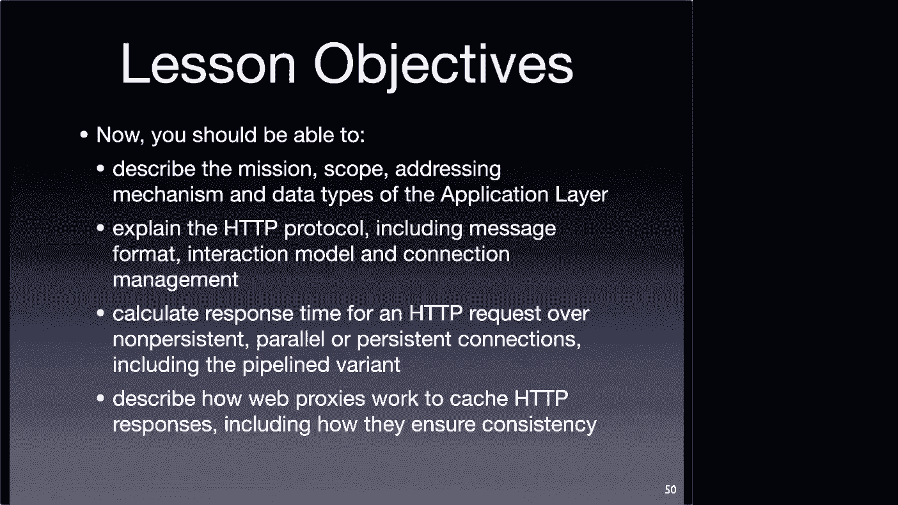

本节课中我们一起学习了计算机网络应用层的基础知识，并深入剖析了HTTP协议。

我们首先明确了应用层的使命是提供网络资源访问，并使用消息进行通信。接着，我们聚焦于HTTP协议，了解了其请求-应答模型、消息格式（包括请求行、状态行、头部、消息体）、常见的请求方法（GET、POST等）和状态码分类。

然后，我们探讨了HTTP的性能问题及其解决方案：从HTTP/1.0的短连接导致的性能低下，到HTTP/1.1引入的持久连接和管道化技术，显著减少了延迟。最后，我们学习了HTTP缓存机制，包括缓存的位置（浏览器、代理）以及通过过期和验证头部来保证缓存一致性的方法。


HTTP作为万维网的基石，其设计演进体现了在网络约束下不断优化性能的工程思想。下一讲，我们将继续探索应用层的另一个核心协议：域名系统（DNS）。