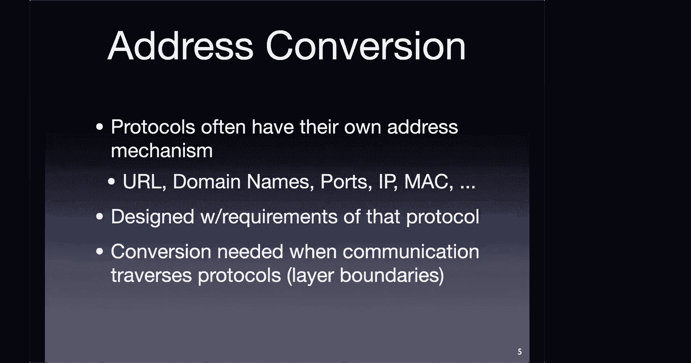
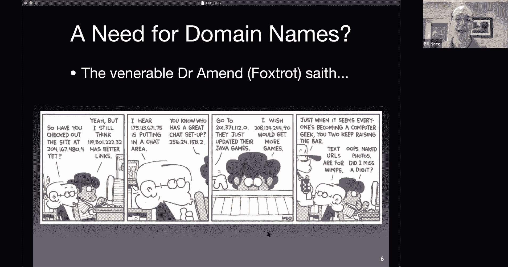
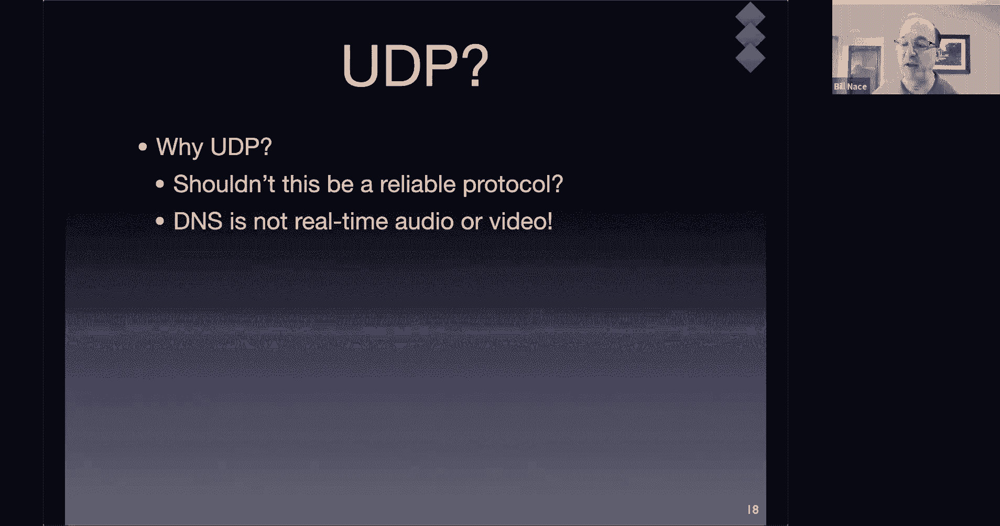

# 卡耐基梅隆大学 14-740 计算机网络 Fundamentals of Computer Networks（Fall 2020） - P6：Lecture 6 Domain Name System - ___main___ - BV1wT4y1A7cd

All right， thanks， Kdick。All right。Homework one will be posted hopefully today it is a。

An opportunity for you to use some different networking tools， things like Traro。

 which we've already talked about and Dig， which uses DNS that we're talking about today and a few other tools。

 mostly to give you a chance to see how to explore the network and what you can do with them。Also。

 these are the kind of tools that。Any network engineer should use and understand pretty well and certainly if you were。

You knowIf you were in a network job or interviewing for a network job。

 these are the sorts of things that you would be expected to already know and to be able to use。

 but they're also just kind of useful diagnostic tools to figure out。

 you know did I manage to get the coffee shop wfi working， yes。

Once when someday we are allowed back into coffee shops to use their wfi you know。

Just be able to check out what's going on and things like that。

 There are a couple of questions at the end that are also。More homeworky sorts of workout。

Do some calculation sorts of questions as well。I always have students who look at this and realize。

 oh， I don't know how to answer， you know， especially I think the last question。And that's right。

 you won't know because we're going to talk about that later thats so if you look at something it doesn't make any sense for you。

 just be patient， you can do the other problems， we'll get to all that material。Okay。

 I pointed out now a because I'm going to post it today， but also。

There is a period coming where we have a lot going on where we have a lab do and a quiz do and a you know all sorts of stuff。

 so take a look at the schedule and manage your time well。

Last time we were talking sorry a question about that， given all those things。

Do you have a sense of like how long each should be taking and then in the rough neighborhood so I get a sense of how to prioritize how to make sure we stay on top of everything。

Sure。是的。The homework is a。About the size of the labs。

 it is an endeavor that you it's not something you can pencil whip out in 15 minutes。

 but it's also not something that' should be sucking up。You know， more than。

I don't know want to say two hours， maybe two， three hours sorts of time。Okay， thanks。

 I mean that sounds like true you said the same thing about La zero， is that also true of lab one？

Yes， it is Okay they're all none of them should be multi day efforts， that's for sure Thank you。

 That's good context Yeah， yeah。All right here we are we're in the application layer we have understood that the application layer's mission is to allow us to get to the network and run a program that will use the network resources and we talked about HTTP last time that's an interesting one because that normally in each of the layers you're just kind of abstracting what's going on below you you know that the here I am in the application layer I have some data that I need to get from the program running on my computer to the program running on that computer over there and the transport layer will do that for me。

 that's going to be its mission is to connect applications together。And you would think， okay。

 that's good， I'll just give it to the transport layer and let it go and a lot of times that's true。

But as we saw last time， having some knowledge about what's going on in the layer below you can help you when you try to optimize。

So the transport layer without optimization will get your data from your application to that application over there。

😡，But if you understand it a little bit better you can make it go better and do better for you and that was for instance the whole thing with the pipelining and the persistence connections and things like that。

 if we understand what's going on at the transport layer。

 we know that it's better to keep these persistent connections open and be able to reuse them。Today。

 we're going to talk about another application protocol， one that。

is part of the glue that lets the applications actually operate well so we'll talk about what's going on with that。

 this is the domain name system which is as you read in Maccapittrirus there's a lot going on with it and hopefully this one tends to be a long lecture。

 hopefully we'll get to content distribution networks today as well and see how we can actually help distribute our data around。

DNS is the first of an example of an address conversion protocol we're going to see another one of these coming up later on in the semester。

And what I mean by that is let's recognize that each of the layers and technically the protocols running in each of the layers has its own form of addresses。

 and so here are some of them， URLs， which we talked about last time for HtTP domain names which we'll talk about a lot today。

 ports are transport layer addressing mechanism， IP in the network layer has some IP addresses。

 Ethernet Mac and Wifi Mac， our example of data link layer addresses， their addresses everywhere。

And the addresses are designed， how you work with them。

 what the bits are and what the bits mean in an address。That's designed to work with that protocol。

So the people who are putting together ethernet， for instance。

 have reasons for why the address works the way it does。

 how many bits it is and you know if there are some of the bits actually are tell you what company is made that adapter and things like that those are design decisions that are made。

When that protocol is being put together。There's no sense of a universal address here and so that means oftentimes we're going to need a way to translate to be able to take an address from one layer and when our data travels down to the next layer we have to somehow do some conversion on that and that's what's going to happen with DNS today so can you clarify what you meant about a universal address or lack of one。

Yeah， there's no。So I guess the cross side of that is we have many addresses right we don't have a single address that does everything for everything。

And part of that is because each layer is addressing different things。RightAt the transport layer。

 it's going to need to address applications whereas。IP is going to have to address computers。

And so there's no one number that would say， oh， this is you know。

 the identifier for an application running on that computer， whatever。Got it， Yeah。

 so so in other words， that each letter had its own address because they are addressing different things and and because they were still designed independently。

 yeah yeah。Yeah。Also， there's another thing in the application layer， it's helpful。

That our addresses。Be usable by humans。So here's a fun cartoon Foxtrot。

 we've got the two nerd kids in it who are sitting around。You know talking。

 so have you checked out the site at 204。167。480。4 yet？

You know that's an IP address he's using and so he's kind of playing a round of layers here as well that we should recognize。

And when it comes to the punchline， it's over here， it's basically saying， text URLs are for wimps。

We want to use numbers instead and that of course is not true for normal for humans and in fact we would have trouble using IP addresses alone for a variety of reasons that we will learn as we become better network engineers right also I do think it's cool that obviously the cartoonist。

Understood how IP addresses are put together because none of these are actually valid。

 you didn't want to like be specifying a particular address that would then get somebody in trouble。

这个。So if we're using these addresseses as humans。We often call them names in that case。

 we say this name for the thing is something that humans can easily use and that name identifies some entity that we are talking about。

 oftentimes， for instance， people also have names names。Are human readable。

 they're things that I mean we can read you know in that last cartoon we could read the numbers what I mean is they are values that are part of the human language that we can easily interpret and understand。

Sometimes the formatting is important， so for instance we can put together name and when we do we often say you know this is the title。

 you know， Professor Bill Nayce that is， here's the title piece of it。

 here's the first name piece but here's the family name piece of it。

 of course in different cultures we may switch some parts of that around。

 so the formatting that how you put together that name is important as as are all kinds of identifiers。

Names though often are not unique。😡，I'm sure there are other Bill Ns in the world， in fact。

I had like six of them at family reunions because Bill was a common name in my family and so my grandfather and I have two uncles who are all named Bill。

So they're definitely not unique。Maybe unique in a certain area right oftentimes parents don't name their kids with the same first name because that would be crazy to have two kids to both have the same name。

 although I once called for service cross cell phone and ran into a lady who when I asked for her son Ryan got confused because she had named her other son Brian。

 and I figure if you call your kids Ryan and Brian。

 you're basically just asking for a lifetime of explaining that to strangers。

The issue though is names are easy for humans to use。

 but they're a little complicated for computers to use computers prefer just straight numbers we often call these identifiers versus names a name is a string it takes up more space and memory in order to compare it we have to do some sort of string compare mechanism and that doesn't even get into things like oh is that string comparison dealing with cases。

 is it dealing with casefolding in a unicode sense or not you know all that kind of stuff computers would just prefer here's a number that I can use。

The domain names we use that we're used to www。google。com is a domain name that cmu。

edu is a domain name those are names are human readable their strings right those need to be translated those are an address at the application layer。

 we need to translate it into something else。And so what we do is we have an application that will。

Basically send a request to a DNS server and say hey CMU。edduu， who is that this is the name。

 what's the address for CMU。edduu and that server will respond and say oh yeah， here's the address。

Yeah。I forget what it is offhand。That turns out to we think it's easy。

 we're going to talk about some of the complications that come along with this however。

 but in our mind we can think of this protocol as being a request response protocol we saw this with HTTP as well very very common model of computation won't be the last time we see it let me ask a server a question。

 let me get a response so you where is this URL or I'm sorry where is this domain name here's the IP address for that。

So that's the kind of overview where we're going today， the DNS。

Specifically has a bunch of pieces to it， in fact， DNS itself。Its kind of one of those。

Words that mean slightly different things depending on your context。

 and so there are at least three of them that we're going to have to juggle today whenever we say DNS。

So DNS is a service that provides this mechanism。Almost directory it's almost like you're looking up phone numbers back when we used to do that it we're giving names and getting addresses and that's the service that runs is the domain name system or sometimess called the domain name service。

Because of this， it does this translation for us。DNS can also refer to the data that is used to answer those questions。

 which turns out to be this。Very interesting distributed database system。

 It is by far the most common distributed database in the world。It's。

So the picture I showed you on the previous slide was just there is a server that knows the answer。

Turns out there's enough data here and it changes rapidly enough and we need to have answers from all over the place so it needs to be distributed and so there is a system of those servers。

 which we call name servers， a system that works together to answer your questions。

 so there's not just a single server that has all the answers it is this collection of quite a few different name servers that are distributed all around the world managed by thousands of different organizations and thousands of different people。

DNS also refers to the particular protocol we use when we make that request。

 so when we send the message where is CMu。edu to a DNS name server。

 we are using the DNS protocol to make that happen the protocol of course involves the bits in the message and how the message is put together and how it is transmitted and what's done with it。

Okay， so a couple different。Different terms that we have to kind of think about。

 they're very related terms， unlike peer peering and peering that we talked about last time。

 DNS all refers to the same thing but different aspects of it different facets of the same thing。嗯。

Oh and yeah there's a good question chat domain name versus URL， what is that？

This is one where you can go down a long ratd hole where people are trying to be very specific about it。

The domain name is part of the URL that specifies the domain or the computers where you are trying to get at something。

 but the URL itself has more than just a domain name in it。

 it often also has you know slash something， slash something else slash query slashcoma you know all that other stuff there。

 so the URL is the whole thing， there are other pieces to it。

 and so there is there's a structure where some parts that are called URLI but yeah the domain name is which computer are we talking about portion of it。

Okay。DNS has been around for a long time because the need for this sort of stuff is。Is very useful。

And I guess this。Ties in nicelyr to Jeremy's question why in the 80s did we need DNS that was before the web happened turns out the internet and the web are different things right the web is a series of web servers that run using the internet to connect things。

 but there are other services that are around where you would want to be able to identify other machines and talk to computers in different organizations and so DNS served that purpose of being able to identify computers in other organizations and other places in the internet which happened before there was the web so when the web came along and the URL scheme was being devised DNS already existed because it had been around since the early 80s and been in use with all those other protocols that to you all our ancient history things like net groups and gopher and ways and RF FTP servers and things like that。

M capittrirus is the guy who wrote the paper， I'm sorry。

 the guy who wrote the paper that you read last night is the guy who invented DNS and he wrote wrote it up in RFC 1034 and 1035。

 he described how RF I'm sorry， how the DNS system would all work and made the standards。

And it's really taken off since then， if you look at this。

 the original 1034 RFc is only 53 pages long。Okay， and so the concept itself is fairly simple and the 1035 is the implementation RFC。

 so combined of course， there're more than 53 pages。

But in the years since we've got an additional 223。Other RFCs okay。

 so there's an awful lot going on in here to make DNS work in different situations。

 a lot of these are the DNF sex stuff that is trying to make it secure so that you can't have a malicious actor step in the middle so that when you ask you know where is Facebook and they give you their computer instead of a Facebook server。

That would be a bad thing and so there's a lot of work in in standardizing a security mechanism for TNS as well we won't talk about that today。

But just recognize that DNS is a still a growing concern。

 it's not technically a solved problem and part of that's because it's being applied in many new fields to do new things。

DNS。I guess alluding to that right DNS does many things its core mission， of course。

 is this mapping of domain name to IP address so I ask， you know where is。Well， you know。

 some domain name www。ini。cuu。edu is a domain name。And I would ask。For the IPH。

 and I would be given a reply of here is the actual numbers for that machine。

Buttianus does other things too， one is it allows for a mechanism to alias the names。

Alias is another word for nickname。So a nickname is a nickname， yeah。

My formal name is William for instance， but I much prefer the term Bill。

 which you can see as my alias as my nickname and we have the same thing with domain names。

 you're allowed to have multiple different names for the same machine for whatever reason you like maybe it's just I prefer Bill than William or you know maybe I'll take up an alias because I don't want people to be able to find me and I'll pick a new name or something like that。

We do the same thing with computers and we call them we say that there are aliases and canonical names。

 so William is my canonical name my real name， my official name。

 my formal name and Bill is an alias we do the same thing with the computers so it turns out。

If you are trying to get to CMU's website。The real name for that website is wwwcmuprodvip。anw。cu。edu。

that's a mouthful right， aren't you glad that we're able to just say， oh yeah， that's actually www。

su。edu。OkayNow you can still use that， you can type that stuff that whole thing into a browser。

 and you will get CMU's website。Okay。嗯。It's a real machine name。 In fact。

 that is the real machine name。But obviously we want something shorter。

 we want something people remember， we want something that we can more easily put on marketing material to send out to future applicants and things like that。

 and so we'd like to have a shorter name now this name I'm sure has reasons。Okay。

 I'm sure that the people that are running the network you know that this is maybe this is a production machine instead of a development machine or maybe and VIP。

 maybe this is in their very important。Persons， they're very important pile of computers or who knows？

Okay。That's a canonical name and that's the real thing that they chose， okay。

 and they're able to use DNS to get shorter names as well， okay。嗯。Are canonical names unique。 Yes。

 yes， there， in fact。I'm going to guess that the domain name is going always going to be unique。

I mean 95% positive with that answer。嗯。Whether it's a canonical name or an alias。That's not true， no。

 there are cases right， there are cases where you have like a backup machine will have the same the same name。

As well， so not quite unique。Other stuff。In fact， the whole idea of， in fact。

 you read it in Macittris， the idea of DNS was that it was supposed to be this distributed database system that would be used for not just domain names。

 but for other things as well。The other things as well mostly turned into email。

It turns out that the DNS contains the name of the computer that you should contact in an organization if you have email for anybody in that organization。

 so you can look that up separately in DNS。And that's just one of what was expected to be many， many。

 many different services so that you would have a way to look up。

you know maybe a Facebook name for your friend by doing a DNS query that turns out that's not how you do it these days。

 but DNS was designed with that sort of flexibility in mind。And we。

It turns out that mail servers also get alias and so when you send email to somebody this this email address。

something at Andrewrew。cu。edu。The male clients that are trying to deliver that mail two mail servers who try to deliver that mail want to be able to look at this and figure out which computer do I contact and so they want to know who is Andrew。

Thats you got you and more specifically， what is the mail server at。Atandrew。sumu。

edu that we can contact to deliver this mail。And again， there's some ayingling on。

 there are many different choices。We actually have seven computers called Andrew Dash MX。

 MX stands for Ma Exchange。Dash zero or one or two。Oh wait minute， no。

 this is six different machines at 010203 up to through 06。andrew。su。

edu and so technically you could send me email at wnace@andrewmx05。andrew。su。

edu and it would get to me。OkayThe cmu。edu addresses。Actually， that's a separate set of addresses。

 you might think， well， if it's at CMU if it's W CMUu， that's the same as WN Andrew。

Turns out they're separate systems and the CMU EduU addresses are handled at a slightly different set of computers as well。

Jeremy's asking why is the Andrew here， there's some history there。

 I'm not sure I know the whole history of how that happened and why。But yeah。

 as as student and faculty and staff at CMU， you get it at Andrew address and then you have to go off and。

Request and get the CMU version of that as well， I don't know why those are separate。

Other things that happen as part of DNS load distribution is built into the protocols as well。

 you are required in an organization if you're going to run a DNS name server。

 you're required to actually run multiple name servers you have to have at least two oftentimes big organizations will have more than two。

And the idea is that we want the requests， we may have many。

 many computers in the world who want to know how to deliver mail to cU at the same time。

 and we'd like to kind of balance that out among the machines now there's no the protocol doesn't have a。

Precise load balancing algorithm。😡，Basically it just says there's going to be these lists of addresses for things so when you're trying to contact a mail server at CMU turns out there are many of them and the DNS name server will just rotate that list and so if you ask for if you try to send email to somebody you'll be told oh yeah there's you know this MX dash0 zeros then 01234 and the next person to request will be told oh yeah there's01020304 and 00 and so those get rotated around and different people get lists in different orders。

And that way， they have some some understanding of the multiple choices available and the load gets spread out among the different machines if I sent out a list。

Even if I sent out a list but didn't rotate it， everybody would just pick the top thing on the list。

And so that one machine would get pounded instead of having the load spread everywhere。

 and so the DNS server itself will go ahead and rotate the list whenever it responds to a query about that。

All right， so now let's talk about the actual protocol behind DNS what bits do we send if we would like to know how to map some address into some IP address or something else？

As we mentioned before， this is a very simple query and reply mechanism， let me ask a question。

 let me get a response back。The query and the response use effectively the same format。

We saw in HTTP that the format for the request and reply were similar。

 but they were not actually the same， for instance they had different status lines to them。

 although they could use similar headers。Right that that sort of thing so similar but not exactly the same here。

 there's a one bit difference between what there's actually a bit that says is this a query or not and the rest of the actual format is the same。

The DNS messages are sent using UDP so there's a choice of what transport protocol there is uses port 53 there are a few other transmissions that happen so this UDP 53 thing is the most common is the let me ask a question get a response thing there are places where name servers need to talk to each other and they need to for instance deliver their the records of the entire zone from one computer to another and you can ask for that using DNS that goes over TCP because that record is a very large bundle of data and needs to be delivered reliably。

And you can actually ask for it。For a question using TCP if you like。

 and the reason you do that is because the answer may be longer than will actually fit in。

In the UDP packet。Now， first thing when I say this is running over UDP。

We haven't looked at what TCP and UDP are， but you should know by now that TCP is the reliable one and UDP is the not reliable one。

And so it seems like if I'm asking for。These sorts of records。

 I would like a reliable protocol right and DNS is definitely different from the examples we have of other protocols。

We talked a little bit about why delay was a problem in audio and visual。

delivery systems and why it would be better just to drop stuff than to delay and wait for a retransmission。

 it doesn't feel like DNS fits in that same mold。So what do you think， why UDP？

I think this is one of the most interesting design decisions。Perhaps of the entire network stack。

This is because maybe probably this is the most popular or the most overuse protocol。

 arguably so because of which if if we make it TCP， then it might end up clogging the network so。

So I think Ktik， you're making a bandwidth argument， right， You're saying UDP uses less bandwidth。

 and that's true。Because from what you understand so far。

 TCP requires that setup and requires a couple extra messages to go back and forth。

And it's true that UDP doesn't need that， and so therefore UDP is a little bit more efficient。

So that's a true statement。However， it is rarely the actual reason for why an application designer would choose UDP versus TCP。

 usually the characteristics。Are far more important。😡，So for instance， with HTP。

 the designers chose to use TCP and get reliable transmission because they needed the reliability。

It wasn't that they had extra bandwidth to spare and were like， sure。

 let's go ahead and use a couple extra messages。It was because they wanted that reliability for their data。

 they were going to be sending many， many segments back and forth。

 they didn't want any of them dropped or duplicated or anything like that okay。

So yours is often the answer students will give when I ask a TCP versus UDP question。

 and I just want to make sure you understand that's usually not the motivation。

It's a byproduct sort of thing。Okay， so anybody understand got an idea for a motivation of why UDP versus TCP？

You get， can you say why availability？

What do you mean by that？