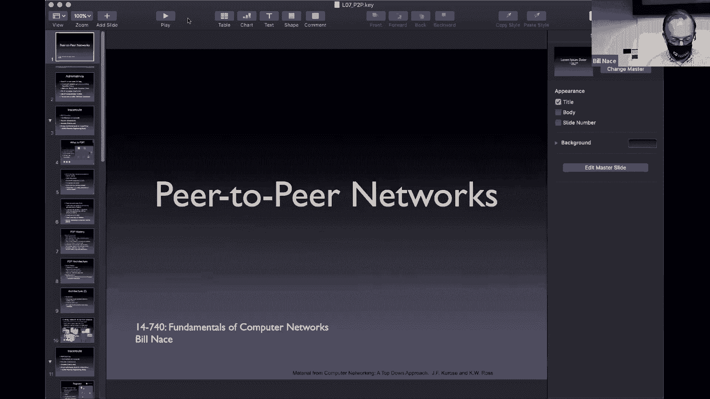
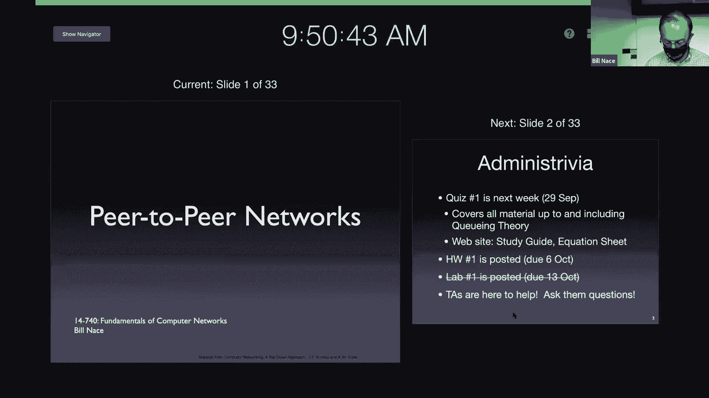
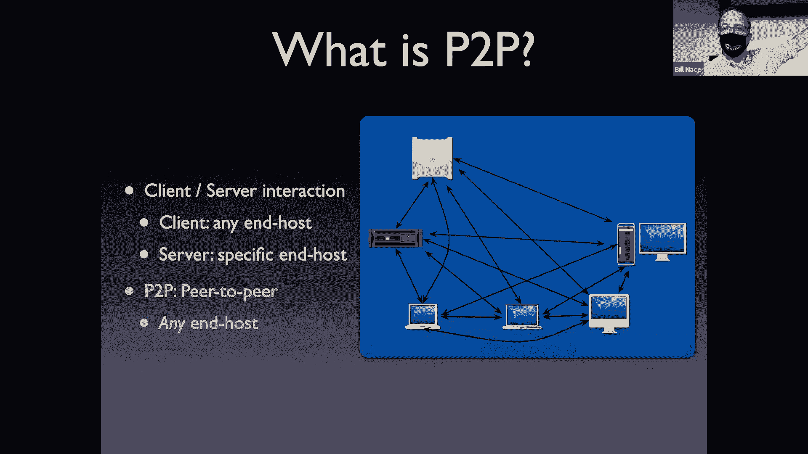
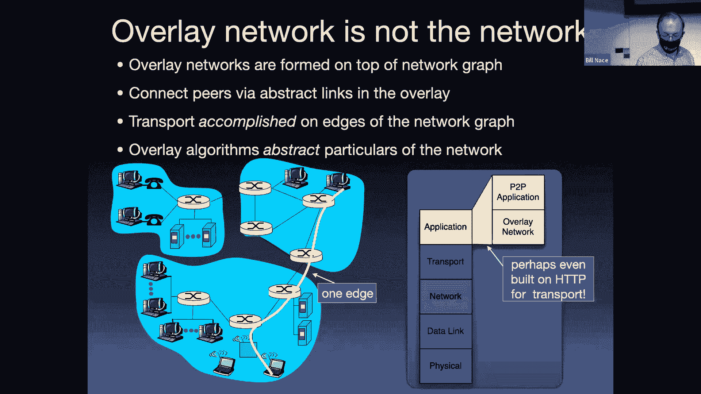
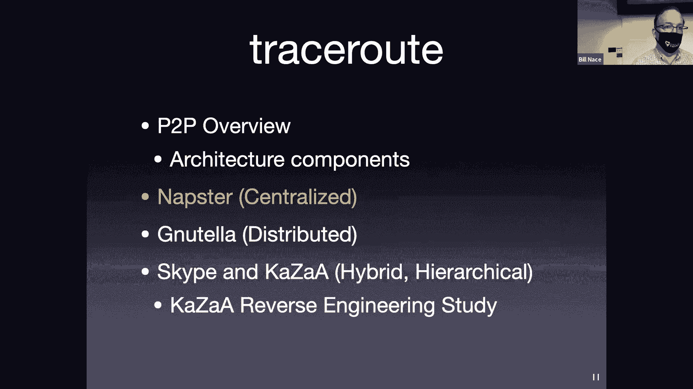
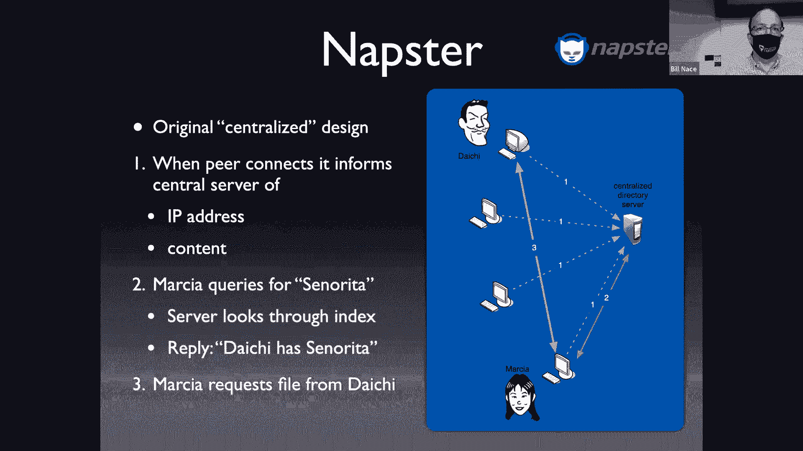
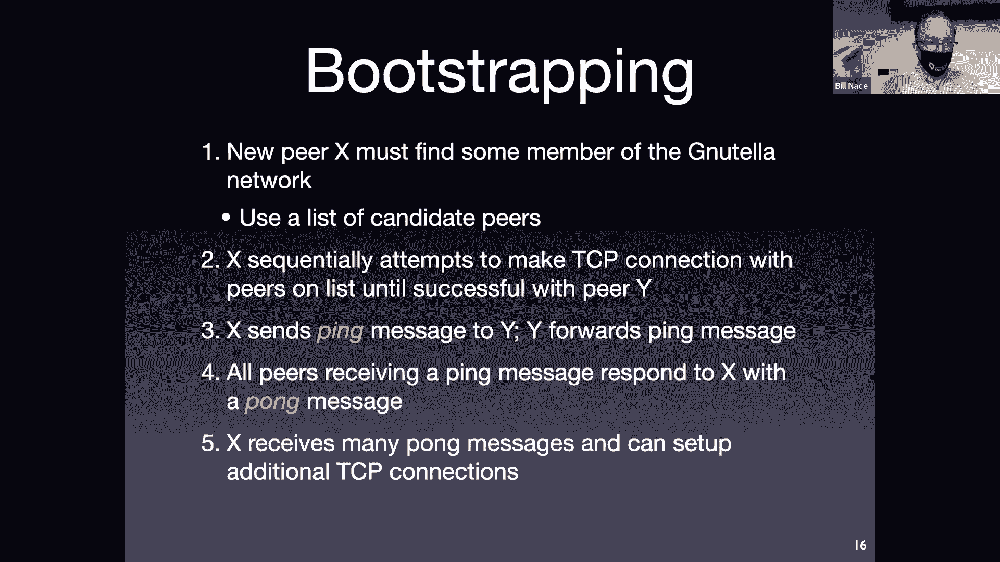
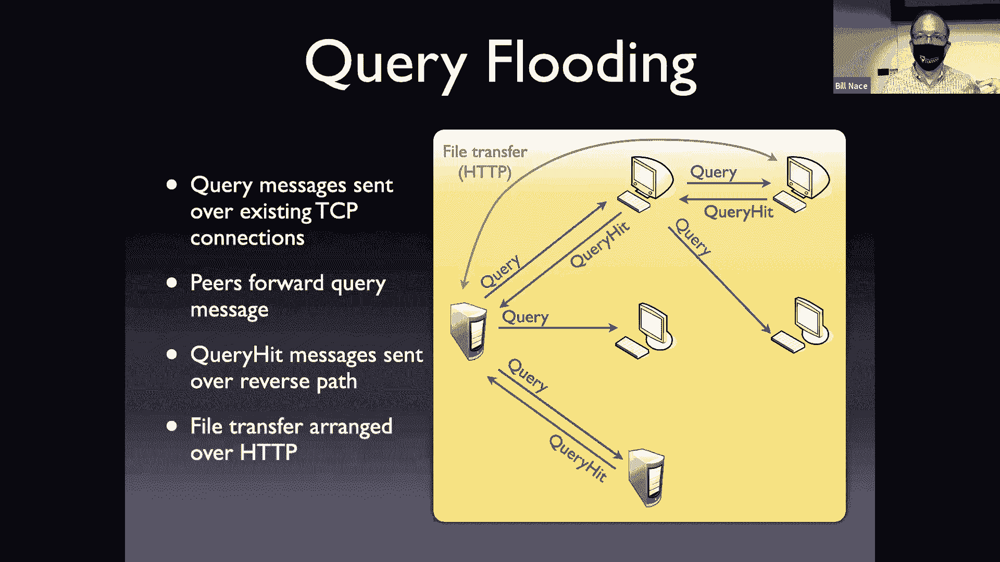
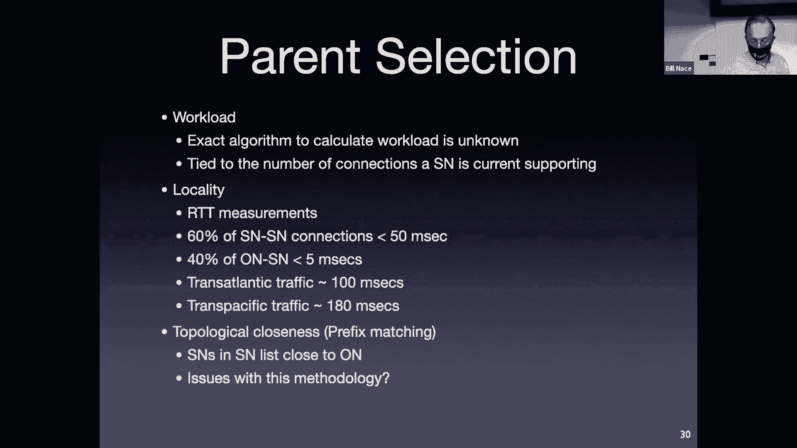
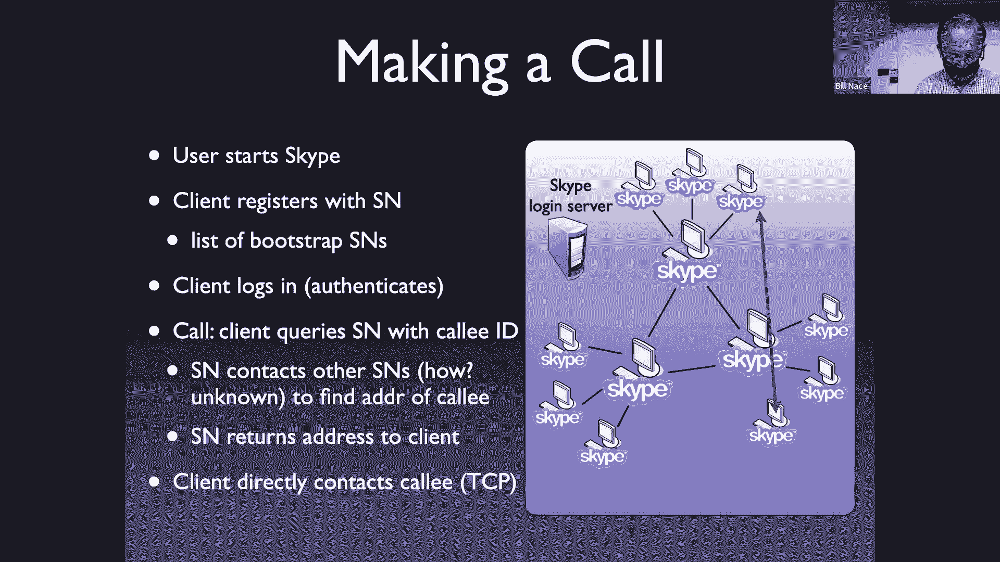

# 卡耐基梅隆大学 14-740 计算机网络 Fundamentals of Computer Networks（Fall 2020） - P7：Lecture 7 Peer to Peer Networking - ___main___ - BV1wT4y1A7cd

This is 14740， welcome everybody。Welcome， yes， for vacuum economy with we have a new record we have nine students in here。

 fantastic welcome， God you're able to join me。Today。

 we're going to be talking about peer to peer networks。You get this fired up。

Yeah。

没。Okay， Ro， Does that look shared correctly， All right。And recorders。这Exllent。All right。

 so we're going to be talking about peer to peer networks。

A large class of application domain or application layer projects。

 applications run here that communicate a little bit differently。

 so that's the context for today's discussion。Couple administrative things before we get started。讲晚。

嗯。You all are looking forward to a quiz in a week right， yeah me too。😊。

Which means I have to get started writing it。The the quiz is going to be held entirely remotely so the nine of you who are here don't show up next Tuesday here Okay we're going to be doing it I think we're going to be doing it as on canvas as a canvas quiz。

嗯。Like say， have not yet worked out all the details， pay attention to Piazza。

 we'll be getting some more information to you about exactly what happens with the quiz。

There may be parts of this that would require you to work out something or draw something on paper and that。

I believe is going to require you to be able to upload something to gradeScope so you might be careful make sure you have a mechanism to take something that's on a piece of paper and make it into a PDF so that you can upload it the gradescope if you got a scanner or a phone app or something like that that will make that work for you or if you have a mechanism to just draw you know if you've got an iPad with a pencil and you can draw and create the PDF directly make sure you have some mechanism like that if you don't let me know we'll see what we can work out for you okay that quiz will cover all the material in the course including today and including Thursday's lecture。

 Thursday's lecture on queuing period。Okay， so everything up that you will have seen by the time of that quiz including readings。

 including the lab everything at that point okay there is a study guide on the website the study guide is effectively the list of all the lesson objectives I've been showing you them at the end of each lecture there been you know that last slide or two basically say now you should be able to do X Y and Z。

Well， as I write the quiz this week， I'm going to look through those so I'm going to say， oh。

 I told the students that I'd be able to do X。Let's ask them to do X。

And so I feel those are the best way to study for this course is to make sure you understand those and make sure you can do what I've asked you to do。

Okay， so don't go memorizing all the slides， in fact， please don't memorize anything effectively。

I said make sure you understand and know things。I also will be giving you an equation sheet at this point in time an equation sheet feels weird for this class because we've had like I mean what equations have we had we've had L over R you know we've had a D over S but that's about it that's going to change dramatically next lecture when we talk about Q and theory and there are a bunch of crazy looking equations with a lot of weird Greek symbols in them I will give you those equations I'm showing you on the website。

That equation sheet will be available to you during the quiz。ok。Other than that。

 the quiz will be closed book。对。Homework one is also posted。

 hopefully you've had chance to see that and are working on that one that one is doing a couple weeks6 of October lab one was supposed to be posted by now。

 I apologize that it didn't I'm in the process of trying to move the website over to an unencrypted host。

So that all those connections and the HtTPS redirects would not happen for you。

 I hope to get that done today， I'll go ahead and get lab one posted for that as quickly as possible。

And then the Ts are very helpful， but you guys have been ignoring them and they're feeling lonely so go to office hours ask some questions。

 especially as you get ready for the quiz next week and there will be a review session。

Sometime probably this weekend or Monday we't haven't yet set the time for that as well thatll be。

They'll be on some Saturday or something。嗯。All right。

 so today we're going to look at peer to peer networks and we're going to talk about them in general what they do。

And then we're going to step through three different generations of peer to peer networks。

 the kind of early days of networks where they were。Kind of simple to understand and easy to handle。

 There's some exciting stuff that happens after this， but it gets。I mean。

 the lecture goes on too long to get into that if you end up in a distributed systems course you hopefully would learn about some of these other more modern mechanisms for doing peer to period networking that I apologize。

 I'd love to teach， but we just have no place to fit it in a foundations course。

So what is this idea of peer to peer networking well so far we've talked about a couple systems that use what we say is the client server model of computation or model of communication right the idea is you have a web client you know on on your phone on your laptop。

And that client requests information from some web server。 This is client server communication。

so I've got some server somewhere back up in the corner is the server that everybody's talking to and his job is to have all the answers all the time we saw the same model with DNS although slightly change because instead of having one server there was a hierarchy of name servers that would answer your question。

 but effectively you're doing the same thing， I've got a client。

 I need to know what this domain name would map into。

 let me ask you question from some server and that server will give me an answer。

Per to peer networking kind of blows that model out and brings in a hot new model where you have no server instead all of the computers。

 all of the peers are able to communicate directly with each other and so from a，In many ways。

 this is a nice model because you don't have to pay for a server。

 you don't have to have all the answers in one place。

And those are some of the things that have driven peer to peer networking。I want to point out。

Remember， I warned you about this。We're using the word peer。

 which we've already used for two different concepts， so this is the third concept so far。

 and we're only in lecture six。😔，For the word pure。This has nothing to do with ISP's peering。

 has nothing to do with public peering at an IXB， this is an entirely new word。😔。

Even though it's spelled exactly the same as those other versions。

Okay so for today we talk about peer， meaning any computer。

 any one of those computers there is a peer to all the others。

So why do we do this this peer to peer networking thing well。

 usually it's because there's something that the peers have that it's easiest to provide if you give it directly from the peers。

So the classic example is the peers have hard drive space。

 this was in especially in early days of peer to peer networking。

It was extremely expensive to provide a server that could store all this information。

But the collection of all of the peers together in the network had no trouble storing that。

Because each peer was willing to carve off some small amount of hard drive space and leave it sitting to be used by the network。

That same idea can exist with other sorts of resources right so it's possible， for instance。

 in a torrent stream what we're doing is we are actually getting bandwidth that all of the different peers have and using it so instead of。

Having a single server that then would need to be able to serve out terabytes of data across a network connection。

 you can distribute that to many， many peers， each of which has a fair amount of upload bandwidth that they typically aren't using all that much。

If you think about your apartment， you pay Verizon or Comcast or whateverever。

 so much money per month for X bits per second of upload and you probably are not using anywhere near that amount of upload。

So let's go ahead and capture that bandwidth and allow it to be used。Other ones， computational power。

 right， how many of you are using your laptops right now at 100%， I'm going guess nobody。

Okay we like especially we geeks， we like to think about like yo yeah。

 I'm using every bit of power out of my laptop and that happens occasionally。

 but most of the time the laptop is bored sitting there saying hey， dude， come on， type something。

 move that mouse so I want to respond to you。😊，And so that computational power we could somehow extract and use。

Across all these peers。Anonymity is one of the dark sides of peer career networking。If you have many。

 many peers out there， then you kind of hide who you are。

 and so a zombie botnet works this way where instead of doing bad things from my laptop。

 which is easily traceable， let me get an army of peers and have them all do the bad things and then it's hard to find out who I am。

Also。Edgeness is one of them kind of being near each other and having a low latency connection to other peers can be a resource that we're trying to manage。

And so if you do this properly， you can get the content you're trying to deliver to be near to peers so that when they ask for it。

 they don't have to go。Across the world to your location here in Pittsburgh where all your content is。

 instead they can find some of that content closer to them so they get a lower latency connection to that content。

Now， one thing to remember is that you're gathering these resources from the peers。And。

the peers are running you know they're running on my laptop on your laptop and you haven't signed up。

 you haven't promised to provide those all the time Okay so you're pretty fickle you can for instance。

 decide， oh， it's time to go to bed， let me turn off my laptop right oh you know' I'm done with this app I never want to do it again let me throw it away and poof all those resources that were being stored on my laptop disappear。

Okay， and those are things that the peer to peer network has to deal with has to be able to manage and still provide service。

Sometimes it gets even worse， right？It is possible in many cases， to actually change the client。

So that maybe I'm cheating， maybe I'm not actually providing the hard drive space or the bandwidth or whatever that I was supposed to。

But I still get to reap the benefits of being part of the peer of peer network。

 And so the algorithms that run the network are going to have to detect this and make sure that there's some nudge or push。

So that you will not cheat and this can be particularly difficult because oftentimes the clients are actually open source code I don't even have to reverse engineer much in order to find out that。

 oh yeah let's just not call that subroutine that asks how much how much discharge space do I have or let me change the protocol so I just never report back that I'm done or things like that。

And so despite all of that， you still have to have a peer to peer network that's providing everything。

Now peer to peer networks have been around for a while， actually if you look back， in fact。

 your knowledge of DNS， we can look at that and kind of sayoo that feels a little bit like a peerto peer network。

 I have all these name servers and they're talking to other name servers right to get answers and that kind of feels a little peerto peer network you like。

But， really。Perioered peer networks really kicked off in the late 90s。

 I would actually point to this particular year 1999 as the time when it made sense to be part of a peer peer network now know for most of you。

 this is history when you were not part of the computing world back for many of you you weren part of the world at this point。

 but let me tell you what life was like in 1998 and how that changed in 1999。In 1998。

 in order for me to connect to the internet， which I love doing。

I had lots of things I wanted to do on the internet， but I did that through a dial up modem。

And actually in my house， I had two phone lines that I had installed so that I could use the internet and not that was before cell phones。

 that was when my house had a phone and people actually called it。

And I didn't want to monopolize that when I was on the internet。I was also paying per hour。

 effectively per minute for being on the internet and it was a measurable amount， right yes。

 you pay X amount per month。Right， but I was paying like $10 an hour to be on the Internet。 Okay。

 And so that meant I was very focused on what I wanted to do。 I would literally write a list of， oh。

 let me grab my email， let me go to this website。 Let me plug into this form and answer this question and I'd be like。

 okay， I'm gonna connect， go。 and I would do this stuff as fast as possible。

 I would download my email without even reading it， right， And then as soon as possible。

 I would disconnect。And then I would go through and sit and let me read that email。

 let me compose all my replies， and then let me go connect again for just a minute and a half again。

😔，And that made sense because of the large cost。So if you at that point in 1998 came to me and said hey Bill。

 would you be willing to leave your computer， didn't even have a laptop at that point。

 would you be willing to leave your computer connected 247 so that other people in the world could come to your laptop and take music files off it。

 I would have said no way， I'm not rich enough to provide that service to everybody in the world。

 but in 1999 all of a sudden things changed， we got DSL we got cable modems。Okay。

 and those were always on connections。And they were transformative to us， all of a sudden。

 you know the things that you take for granted just appeared and it was like in 1998。

 there was no way I would go on the internet to look up a phone number。

I had a phone book to do that and it was free to look through that book but to look up a phone number for someplace or to find out whether the post office was open till 6 or 7 pm。

 those were questions you answered in non internetnety ways。Okay，1999。

 that changed because now I have this cable modem connection。 and now I'm connected all the time。

 I'm not using a phone line into my house。 Okay， I'm using another wire that comes into my house。

 and so。Then it sort of makes sense， Sure， I'm connected 24。

7 in order to allow other people to come and collect a music file from my computer。

 all it requires is for me to leave my computer on。And that provide， yes。

 that's a little bit of electricity， but it's no big deal。And so all of a sudden yes。

 we can have peer to peer networks and they pop up quickly。

 in fact the music example is probably where that starts because that's Naster which you may have heard of that was the first generation of a peer to peer networks right hey here's a bunch of people want to share music。

Here's a company that will do it for you。We'll talk then about a second and third generation。

 each generation is responding to the problems of the generation before and solving those in different ways。

And so we'll， we'll walk through the news generation。

 We'll walk through the first and second generation。 The third generation is kind of。

Where there gets to be some research involved and the third generation we have actual systems where you know people have spent years figuring out。

 oh， this is the best way to organize all the peers together。

That's where things get a little bit more complicated ato pasting court and unfortunately that's where we don't have time to discuss them in this lecture。

 so we'll get through the first two generations。Yeah。

When you're putting together your peer to peer network， one of the big questions you ask yourself。

 actually any system you build is kind of okay， what's the architecture I'm going to have for this。

 how am I going to organize the pieces of my system。And for peer to peer network。

 that is things like。Where is that content going to be now I will admit you know a couple slides ago I said there are lots of reasons。

 lots of things you can do in a peer to your network。And then mostly for the rest of the class。

 we're going to talk about the first one， we're going to say oh file sharing because that is the most common and easiest to understand example。

 but everything we're talking about could be。Could be shoe horned into these other systems as well。

 So if you are sharing CPU cycles， you have to figure out know， how do I get the。

The right program to them to execute and things like that。

 but we're just going to simplify things and talk about file sharing for the rest of the class。

And so you're going to ask yourself as you're building your peer to peer network。

My network is going to hold millions and millions of files， how are people going to hold them。

 how are they going to find them？What's the mechanism to actually look up and discover that Dion has the file on his computer that I want to go get？

Okay， and so I'm going to have to answer questions about how the data about those files is shared that we call that metadata right the data about the data。

How do I share that and how do I search it and how do I figure out what's going on with it？

There's also a signaling protocol I have to be able to send messages from peer to peer right and that's kind of for us today that's exciting part right that's the use of the network to actually communicate among the different computers among the different peers How do we do that What does those messages look like What is the protocol is a protocol encrypted。

Is it going to run over HtPS or we going to just send， here's my message， let me send it。

 what's that going to look like？And then file transfer is going to be a big part of this once I found。

The the peer that has the information I want once I've communicated to them to say hey。

 I'd like to get this from you do you still have it once I've gotten that now I need to set up a mechanism to actually do the sharing of the content how do I get that from you and what's that going to look like。

Turns out we have this nice protocol and in fact we use this a lot for peer to peer file sharing。

 we use HDP， let me go ahead and request something from you。

That's exactly what HTTP is about let me request this thing and let you send that file of content to me。

And now the only odd thing about this is now we have peers who are answering questions instead of servers。

So this means that your laptop， if you're part of a peer to peer network， has to be able to reply。

 has to be able to create the reply HTP message， which is not something you normally do。😔。

Because your laptop is not running a web server and so you have to be able to handle the other side of that。

 not a huge deal， but it is one of the key differences between client server communication and peer to Care network。

Now something to remember throughout this discussion in peer to peer networking。

 we're going to draw pictures and we're going to say things about communication between different peers and we're going to draw it like this peer is a dot in some graph and communicating to this peer and we're going to draw a line between them。

Of course， we don't have a separate network that directly connects them。

We're going to be using the network we have to do all the communication。😡，And so。

WhatThat mechanism that we put together where peers are communicating to each other。

 we call that the overlay network。😡，Okay， that is a network。

 that is you can draw the graph of who is communicating to who， and in fact。

 that makes your life easier as a peer to peer architect。To be thinking in that overlay network。😡。

But at all times， you need to recognize that that overlay is actually communicating using the regular network。

And so if I have a couple of peers。That I'm drawing the line between。

 I need to recognize that I do not have a direct connection between them。

 the connection from that peerer talking to that peer。

 which in the overlay network looks just like a straight line between two dots。

That will actually be running over all of the routers， all of the separate networks in the internet。

All of that structure that we have will be used to move the message from one peer to another。

 even though。In the peer to peer world， we're thinking about it as a direct connection。

Another way to state the same thing is to look at it from our layers perspective。

The thing we're building， the peer to peer network actually is an application layer thing。

So it all exists in the application layer。Okay。But usually I have a couple pieces of it。

 usually I have some code that is going to manage the overlay network and be able to do things like discover that there is a peer somewhere and figure out how that peer joins into the network and talks to other peers and who it decides it can talk to and things like that and so that kind of becomes its own separate layer that's managing the overlay network。

And then you have on top of that the actual application。Here's the actual code that is saying。

 you know， I would like to get a file for Meed computer， how does that happen？Well。

 the overlay network would then take those commands from the application and make them happen in the peer to peer network。

 but of course they're going to have to use the transport layer。

To actually do that connection between my computeredx， which of course。

 uses the network layer to move that packet from my computer toed across all the routers of the network。

 et cea。Okay， so we should never forget that there's all this other stuff going on down below and in fact。

 maybe I've added a couple other layers in there because maybe I'm using HPP， maybe I'm using TLs。

To do the encryption， right， I may have other protocols in that stack as well。

Okay， so let's take a look at where things started in 1999。 This is Naster。 Okay， and notice。

 first thing I'm going to do is I'm going to draw a network of peers connecting。

Of course this is the overlay network I'm going to say， oh I've got。A couple of these computers。

 so in this case I have four peers on the left side of my picture。Okay， and。Wait a minute。

 Professor Nicece， you told me that there was no server in here。

 but it turns out in the first version of peer peer networking。

This is centralized peer to peer networks， which sounds like an oxymoron。

There is a server that Naster is running。That centralizes things。

 And everybody has to talk to that server。But the server is not providing the content。

 The server is actually there。To provide the directory for that content。😡，Okay， so what would happen？

 Well， when you log in， when any peer logs in to Naster。

 When you start up the Naster application on your computer。

It goes and sends a message to that server and says， oh， I'm here。I'm Bill Nace。

 you this is my login task word， all those authentication details。

 and here's a list of the files I have on my computer。

And so that server now maintains that information， that directory of which files are on which computers so that when somebody else asks for it。

So when Marcia down at the bottom is looking for a particular song。

 she sends a message to this central computer。And says， hey， I'm looking for Seorita。

 Can I get a copy of that。Okay， and that central computer。This is the big difference。

 right in a client server system， the central computer would have the song and give it to her。

But Naapster said， wella， we can't afford that much。That much hard drive drive space。

 We can't afford that much bandwidth。 Instead， we're just going tell you， hey， Marsha。

 go off and talk to Daicci。He's got a copy of it， We know that because he logged in a few minutes ago and gave us a list of all the songs he has。

 go talk to him。And that's the point where the peer to peer networking happens。😡。

Because now Marcia sends day to a message directly and says， hey， I like the song that you have。

 I'm part of I'm sending you a signaling message that's in the Naster protocol so that you can understand it。

And that message says， hey， I'd like a copy of this file， can I have it？

And Daicci would go ahead and then respond directly with that file。

 so that's the part that's peer to peer about this。Okay， so we do yes。

 we do have a centralized server， that part doesn't feel it's still plant server computing。

 but the actual transfer of the data。

Is so yeah that we've got decentralized with this decentralized stuff Now。

 the centralized part turned out to be a problem and。For multiple reasons。

 and so it got solved and created。Forced into a distributed system and it turns out the first two on this list are almost always reasons to make something decentralized。

 to build the distributed system。It turns out anytime there is something in one place。

That place is now a point of failure。If you only have one server with your data on it and that server crashes。

Which happens？All right， computers crash， we know that。So when it crashes。

 then nobody can get to that information。Get same with Naapster。If the central server crashes。

 then nobody can log in and nobody can get can have their queries about where files are responded to now of course。

Napster didn't have just a single computer running to make that happen。

 they were popular enough they needed lots and lots of servers to make it happen。

 but they still had those all， they were under Naster's control。A second problem。

Performance bottleneck， if you have all your data in one place。

 then when everybody tries to access it， that place gets overwhelmed。

 Maybe the server gets overwhelmed and just can't respond to all the requests。

 or maybe there's so much bandwidth。There's only so much bandwidth and there is so much request for that bandwidth from the many clients and peers who are asking for it that you overwhelm the networks coming into your building or your location。

And so that's another reason to distribute your system is to be able to move away to other places。

To get those。Those servers closer to your clients so they get a smaller round trip time and also to be able to get it on multiple CPUs。

 on multiple networks。So that you don't have those bottlenecks。

Naxster also ran into the problem that they were a single point of lawsuit。

OkayThey were a single company， a single place， and so of course the music industry didn't like the fact that people were not buying CDs。

I know it's hard to imagine a time when we used to get our music on these little plastic discs。Okay。

 but it happened。And the music industry who was selling us those plastic discs。

 they objected to Nater， they sued it and lost and sued and lost and sued and lost。

 but eventually they sued and won Okay and they were able to say， hey， you're。Yeah。

 you're not pirating the material， but you're helping the people who are pirating it。

And so Na Store was eventually sued out of business。And so nowadays。

 at some point Best Buy owned Naapster right and now I believe Rpssoy has a streaming service called Naapster。

 I haven't checked recently to find out if it's still going。

But it seems like everybody has to have a streaming music service and so they do as well called Masterster。

Yeah。All right， so along comes the next version， Naapsters now dead or dying right。

 it's certainly having its trouble and it's clear that there are going to be issues there and so along comes Nutella and Nutello was built quickly。

In response to what was happening with Aster， Naster was built by a bunch of。

Network engineers and grad students who saw what was happening in Aster。

 but still wanted to be able to share music。And I guess I should point out， and other things。

 I'm saying music here， right， we're sharing files， many of them can be perfectly legal things。

 many of them are problematic from an intellectual property perspective。

I'm not making a judgment call there one way or the other。

But the people who were watching Naapster said oh， we want Naster service， we want that to go on。

 but obviously we don't want to get sued， but we like to build some a system and so they built a system called Nutella and because they were watching Naapster they said。

 oh， we need to be decentralized we can't be all in you know the jurisdiction of the Massachusetts district courts。

Right because then we can get sued out of existence instead let's be decent let's be everywhere。

 let's be lots of people， not a single company， so it's hard to sue okay and that meant we can't have a single central directory anymore。

So that part of the system that looked nonpe to us now Nutella is saying that part has to be peered as well。

 that has to be part of the peer to peer network， you have to instead of going to a central server to find your content。

 you have to ask the network， the peer to peer network for it and the peer to peer network has to be able to handle that as well。

And so。This means that in the decentralization system， when you join the Nutella network。

 the Nutella network will has to organize you and figure out where you are that part of Nutella is not。

Not super well thought out you just kind of join whoever you know about and become their peers。

 whether or not you're located at the right place in the network。

And then when you want to find some content， you ask your neighbors。

 you ask the peers you know about， we call this flooding， we'll talk about this in a minute。

 you send a query into the network to all your peers to say， hey， do you have that thing？

It turns out it's fully anonymous， okay， you're running this。Code on a computer。

 you don't have to log in。 There's no authentication steps。So nobody knows exactly who you are。

 they do know your IP address。Because you have to if you're going to send messages in the internet。

That message is going to end up being an IP packet。

 which is going to come from your computer and you're going to want people to be able to apply to it。

And so therefore you have to have a good IP address。ThereSo they will know your IP address。

 but that's all they're pretty much going to know about you。NTella also interestingly。

 is a public domain protocol， the signaling protocol itself is public domain is open source。

 and so it turns out there are lots of different clients that get built on top of the NuTla network that are using the NuTella network and the NuTella protocols but are able to do different things in different ways with different user interfaces。

And one of the big fun problems you have when you start up。

A peer to peer network without any centralized system that is fully distributed。

Is we call it the bootstrapping problem。 It's that how do you find people in the network。

Before you find the network。😡，So if I'm going to join a peer to peer network。

 that means I need to know some of the computers that are in the network。

Once I have connected to one of them， then life gets easier because that computer in the network。

 that peer that I've connected to can tell me other information。😡。

so once I have somebody in the network， that somebody can introduce me to their peers and the other information they know and thus broaden what I know about it。

Okay， but how do I find out about that first guy， How do I find that first peer。Yeah。

 that's the bootstrapping problem。In Nutella， it's solved and in many cases it's solved this way where you have some list。

 you start off with some knowledge and that comes to you when you download the client。

So when you download， you say， hey， I want to get Nuello， let me download that， you're going to have。

 oh， here's 100 peers of the network that are listed there。

OkayAnd so what you're going to do when you start up and want to join the network is you're going to go through that list。

And you're just going to try to connect to them。You're going to use the transport layer to make that happen you're going to use the network stacks we know and in fact for Nu tell it was TCP so you may recall from the HTP lecture that that。

Communication starts off with a， please， may I connect you message that the client sends and then the server responds with a yes。

 you can connect to me。And so in Nutello， what you do is you send out those。

 mayy I connect to you messages。And hopefully somebody answers。

Now there's no guarantee anybody's going to answer because everybody on that list could have deleted the software could happen to just have their computer off right now so you can't connect to them。

😔，But if the list is long enough， then there's a good probability， you're going to hit somebody。

And if not， then you could probably go to the same website where you downloaded the client and download a new list of other people in the network。

And so we'll call this。Sorry， interest good。佢 just你水多嘅。因为知道我。

So the question is how does the list get generated right？

So it depends I don't actually know particularly how Nutella does it。

 There's kind of a couple of options one is。You can find volunteers who are real advocates for Nutla and want it to go on and who promise that they will leave their computers on and be part of that list。

We call these rendezvous piers， okay， they're kind of established places you can go。

So that's one possibility other possibilities are if you've ever used the network before。

 yesterday when you were using Nutella， you were connected to a bunch of fears。

 let's just use those people that we were connected to already。Okay， or it could be that。

The you know， the website。Just randomly scrapes a bunch of people that it happens to know because it is part of the network and it can find a bunch of them and grab them。

 I don't know how that was handled， but they're。Many options for getting this。

 this knowledge to each client， yes sir。So in。And我 program。So the question is。

 where do we get the client program from？If say what。M that eight years should related。Yeah。

I guess I'm not sure I understood the second part of that。

 the first part is you know you just get the software however you normally look。

 obviously you don't go a bus buy and buy it in a box。Okay which happened at that point in time。

 but you know this is there are websites around for this you can pick it up I don't know I don't recall whether there was a Nutella。

 org or something that you could get it at， but it was a fairly。

Common all your freeware sites and download sites would provide。

Does that answer your question or did you have a start？で sayえあ。Thank you。你 friend细觉。And呢个。Yes。

 so the question is。With multiple people downloading the。

The the software do you want them all to end up with the same list of peers or not Ily。

 it would be great if everybody had different lists is what you don't want to do you'd like to。

 you'd like everybody to know about neighbors in the overlay network。Who are all different。

 you don't want everybody connecting to my computer because that gets us back to the centralized problems。

And so I don't know how you how Nutella managed this。

 it does seem that it would make more sense to find a way to rotate through。

But you still have to find a way to rotate through but still provide some sense that that list is going to have a candidate that's still up and running and can be connected to it。

😔，I have a question。Okay。Yeah， so what once you've connected then to one of the people on these list。

 you send a message to them， unfortunately message is called ping okay， this is again。

 another use of the word there's a protocol， the ping protocol， this is not the ping protocol。

 this is a ping message in the Nutella protocol。Okay， and you would send a ping message。

That would basically say hey， this is me， you know this is an identifier news for me。

 I'd like to be your neighbor in the overlay network and you'd get a pong message back if there was a connection that you could establish with that their computer and that pg message would say sure I'll be your neighbor we can be part of this network and at this point in time you now have established that link you now have two dots on the overlay map with a line between them。

And in that graph， it says these peers now our neighbors are connected to each other。嗯。Now。

 of course， you're going through this list。In general， you want to be part of a network。

 not just connected to a single neighbor， and so you go through the list。

 you try to connect to everybody， it would be great if you connected to everybody and you want to find ways to find others to connect to as well。

 not that you want to have hundreds of thousands of connections open that is difficult to maintain because each one of those would need some information about them and you'd use a lot of memory handling all those。

But you would like to have some number that you connect to that would be different from everybody else so that your network is not just everybody connecting to a few small computers。

I mentioned a few minutes ago query flooding， this is the how do I find some material on the on this peer to peer network？

And so what you do if you are the guy here on the left and you are desirous of a certain piece of。

A certain file， you would send out a query message again。

 this is a message in the Nutella protocol part of the signaling protocol that's set up and say， oh。

 I would like to know， do you have this particular file， that's the query。Okay。

 now how you describe that file， of course。You would depend。 You'd have to have fields for。

 I would like， you know， a music file by this artist。 It's called this name， something like that。

And that query message when you send it off to all of your neighbors。

 so in this case I have a computer on the left that has three neighbors in the peer to peer network and each of those neighbors then would send this message would forward the message onto to their neighbors okay。

 I'm only showing that for the guy at the top because the picture gets messy otherwise。

So he's sending it to his neighbors， presumably the others also have neighbors they send it to and their neighbors send it to their neighbors。

 et cetera。And when a computer gets this query message and discovers that it is for a piece of data they have。

 like oh， you're looking for Seurita， yeah， I've got Seorita， sure， I've got that。

 then that computer would send back a query hit message。Okay， and so it would say， oh yeah。

 I've got it， it would send it back the same path it came from。

So I'd send it to the peer that sent me the query， and then that peer would forward it on until it gets back to the originate。

At this point， the originator hopefully has a couple of query hit messages and can make a decision。

Okay， who among these would I like to actually download the file from？

Maybe it's the first one you get。 Maybe you can have some sense of localness。

Who's close to me or bandwidth or something like that at that point though you just arrange a direct file transfer you go ahead and say oh。

 let me get to you so obviously that query hit message had to have the IP address of the computer that is responding that has the material you go ahead and just send a HTTP get request。

To that particular computer who will give you the file。

Okay。Now， this is。That was the original version， and that worked for a very short time。

Probably some of you， as I described it immediately said， wait a minute。

 it gets forwarded to all your neighbors and then all your neighbors neighbors and all the neighbors neighbors neighbors。

 and there are a couple of issues with that as the network gets bigger。

So as you get more and more and more peers。Now each peer is receiving query messages。

From everybody in the network。😡，And that's fine when you have five computers in the network。

 but maybe not fine when you have 5，000 or 500，000 or more。And so。

In addition to the protocol was quickly added， that limited the scope of the query flood。Okay。

And so that said， we don't actually want this message to go everywhere。 Also。

 there was a problem that。You would have peers that were peers or I'm sorry neighbors of neighbors of neighbors that were back to the neighbor of the original and so you'd end up with these cycles。

And the messages would just go around and round and round and round and round。

And so the limited scope query flooding was added as a mechanism to make sure that we can deal with the scale as well as kill out any messages that go on loops and we'll see this solution in other places in the network where we have similar problems。

So， the。What happened was the query message had a field added to it， hey， it called peer count。

And you'd start off with some number like I'd say， okay。

 I'm going to put pure count4 in there and the client software would decide what that value would be to start with。

😔，And then when I send it to my neighbors， they're going to forward it to their neighbors。

 but before they do they're going to decrement that field by one。Okay。

 so they're going to subtract one and send it on。And ever。

 if any peer gets a query message where the peer count is zero。

 can't remember whether before after you decrement it it zero， then you don't forward it。😡。

You just you kind of run out of the peer count and you're done。Okay。

 and that means that if I have a loop， I can only go on the loop so many times before the network before that message is killed。

Okay so that solves that it also means that you don't get query messages from everybody in the network。

Right， you only get them from。From。Peers who are less than this number of hops away from you in the network。

Okay， so here's an example I'm you know， I'm going to send my message， of course。

 I'd send it with a pure kind of three， but it gets forwarded to pure kind of2。

That guy is going to send it off with a pure Catholic one。It'sco questions about this。

If Pe count is for to start， how many peers does your message get to when you send out that method？

The query。Anybody？Not even in chat， Oh， there we go。Yeah， so I can't give you a direct number， right。

 It depends as the answer。Okay， I know how， how deep in the network it can go。

But if I'm talking to one neighbor who has。20 neighbors。 that's different from if my neighbor has 10。

Neighbors。And so coming up with the direct number is difficult and depends a lot on the architecture of the network and how you happen to be connected and because Nutella is very unstructured。

 the graph of the overlay depends entirely and who you connected to at the beginning。because of that。

 it's really hard to come up with a direct number about this。I chatOkay。嗯。So actually the。

 I think the entire new teleparticle was done over TCP。

 I think the idea was you wanted to have a connection with somebody so that you knew they were part of the overlay and also you get the I guess you're doing file transfer over a different connection anyway。

嗯。I would guess there were some reliability concerns there as well， but I don't know for sure。So。

It's a solution now scalable， I said previously that without limited scope query flooding。

 it was not scalable because everybody got every message。Is this one more scalable？Effectively。

 I'm asking if you increase more peers in the network， do you get more messages？Okay。

 everybody's quiet today。Okay， yeah， it turns out it's not very scalable， as you add more nodes。

 you still get more your message。Growth increases。Because in the network as you add in Nutla。

 as you add more nodes， those nodes are not structured in any particular way。

 so it's more likely that neighbors are going to have more neighbors。

And so they would then send the queries to more their neighbors。 It's still not too much our problem。

 Okay， but it does mean that， you know， that how long it will take。

To get this message looked at by everybody varies depending upon what the structure of that network looks like in point。

Did。話しですど。嗯。So yes you're right， this does depend the scalability question depends entirely on I'm not going to say the network technologyology。

 I'll say the overlay topology。😡，hich neighbors are connected to whom so you could imagine if for some reason everybody in all 50。

000 people connected to Deion first as a neighbor， then that's a very interesting overlay topology graph and this isn't going to work because everybody's going to send the query to Deion who's going to then send it to everybody else。

Okay so that doesn't work， but Nutello was kind of relying on the fact that everybody just kind of。

Not quite randomly but connected to people without any structure。

 and so you'd have a graph that just didn't have any of those kind of particular pathological problems。

😔，嗯。So， yeah。When I search for something， am I guaranteed to get it in Nat。

NoI'm assuming somebody that it exists in somewhere in the network。

I had a couple people shake no in here and nobody's brave enough to say why though， apparently， sir。

哦你我家。哎不分。Yeah， I've now limited Im sorry the answer was correct。

 I've now limited the number of peers that I'm going to contact with this query and so whether or not I actually get。

To whoever contains that depends entirely on the probability that one of those computers has that material。

Okay， so if I'm searching you know Senurita as a popular song。

 it's likely that if I do a limited search query plot and I hit。

 let's say I'm to hit 2000 peers with that query， it's likely one of those 2000 has the file I'm looking for。

Okay， but if I'm a fan of something obscure， I don't know。

 Bolivian opera right if I love Bolivion opera and I'm looking for a particular Bolivion opera song。

 okay now it's unlikely that anybody in that scope has that file and so even if it exists。

There may be maybe there's one other Bolivian opera fan in the Nuella network at that point in time and he's the only one who actually has his files。

 I would have to have him within the scope within the four peer count hops away from me in order to get to that now yes。

 I could crank up the peer count there's a limit to how far that can be be counted and a lot of times。

That was one of those cheating things that people would do and so many other clients would refuse to answer or you know if I got a peer count that was 200 we'd just go ahead and send it off with a peer count of three right things like that is a way to fight that but yeah this is a fundamental problem This is sometimes called the needle and the haystack problem so first of off I got to make sure everybody understands my analogy right a haystack。

Is a stack of hay， hay being the thing you feed to horses and cows that you cut on a farm and if you have a big stack of hay somewhere。

Okay， well， we in America have this expression， we say that that search is as difficult as finding a needle。

 right the little implement you seww with in that haystack。Right， and。

We're assuming you don't come to the problem with a big electromagnet to just pull the needle out。

 but if you have to search through for something very rare in a haystack。

 then it's a hard search to find So if I'm a bo opera fan， I'm looking for a needle in a haystack。

However， if I'm looking for a popular song， then what I'm searching for is hey in the Haystack。

And so as long as I'm searching for hay， this works， if I'm searching for needle。

 then I'm in trouble， this does not work。And we need a better structure for that。

That's what I just said， right， we're not ever guaranteed to find the object， even if it exists。

If it's a needle and it's more than four peer count away from us。

 we're not going to be able to find that。At all。All right。

 so kind of in response to some of those issues and with another couple of years time behind it and a couple of brilliant network engineers。

 we come to the next generation。Of our peer to peer networks， which is Kazza。

 This is the paper you read for today。Talked about Kazza。

 which is another kind of peer to peer network。In this case。

 the network is designed to help with this search problem。

And it is designed by structuring the network sum。OkaySo instead of just having random peers connect to random other peers based on what list you got or who you were connected to last time。

This time there is。Some structure to it and the structure is hierarchical that shouldn't be surprising to you either。

Whenever a computer engineer faces a scale problem。One of the first tools we pull out is this。

 I call it superpower we have， one of the first superpowers we will apply is hierarchy。

If you think about other problems we have solved this way。

 in fact we talked about one last time right I've got a whole lot of domain names and I've got to be able to search through them right so what do we do oh。

 you know root layer servers， top level domain etc cetera。

 we build a hierarchy of places to hold that content。

And that lets us search for the thing we're looking in a structured fashion such that we can ignore large parts of the search space。

You know at steps through this hierarchy。And so because I did this exactly， and it did。

 it actually has a two layer hierarchy。Okay， in general， something like the DNS。

Herarchy was as many layers as you want。 in this case， there are only two。

And so we have super nodes and ordinary nodes。And that gives us this higher ordinary nodes connect to a super node。

Super nodes then connect to other super nodes。And they each take on slightly different roles and that helps to manage the search process。

And so we end up with， look at this， another overlay graph。

Where we have a bunch of dots connected by lines and we see this structure， right， the big circles。

 those are the super nodes。Okay， and each super node is connected to each other。

 you'll see in this case I've got four super nodes。

You'll notice they're not all connected to each other。

 right each super nodeode is just connected to some subnet of the other super nodes。

And then they each have their own cluster of ordinary nodes， the little dots。

That are connected to them。Now， how did we then use this structure？Well。

 the super nodes are responsible for keeping track of all the content that the ordinary nodes have。

 so when the ordinary nodes join this network and are associated with a super node。

 they communicate about the content that is on each of those ordinary nodes。And to now。

 if I'm searching for something， I ask a super node and that super node automatically。

Breaks the problem for me because it knows with one question。

Whether or not that content exists on itself plus all of its ordinary nodes。

 so that entire cluster I can search with a single request。😔，So this how works mean Ca there is a。

A hashing mechanism so that we identify files instead of by attributes like who the singer was。

 somehow I have to come up with this hash and there is descriptive material about that as well。

And then when I want to search for something。I don't ask any super node instead I ask my super node。

Okay so I I as an ordinary peer and connected to a particular super node， let me send the request。

 let me send the query to that super node， say， hey， I'm looking for X， looking for this thing。

And the super node may know immediately that either it has it or one of the other ordinary nodes in its cluster has that。

😡，That particular file I'm looking for。If not。Then the super node takes over the query。

 kind of like recursive DNS， right， the super node。

 then we'd go and talk to other super nodes on my behalf and say， hey， we're looking for this file。

I don't have it in my cluster， do you have it in your cluster？😡。

And each of those requests is then because it's being sent to a supernode。

Is actually searching through many， many peers。In fact。

 the entire cluster of all the peers that are connected to that particular supern。

Then you would get some responses， you would choose， oh yeah， you know again。

 let me go and directly connect to that particular peer that I've just been told has my file and let's go ahead and get it you'll notice also I say in this case you get responses。

I didn't mention this too much when we talked about the query flooding originally。

 in many peer to peer networks， it's desirable that when I search for something。

 I get multiple responses。😔，Because of the fickle nature of the clients。

 I don't want to go through a search， discover who is the peer that has it and then discover I can't connect to them either because they won't let me or they've just turned themselves off or they've just crashed or something like that and so here again it's nice to get multiple answers from。

😔，Multiple super nodes passing through my super nodeode or my super node telling me about multiple of the other ordinary nodes in my cluster who happen to have this material。

Now you read the paper that was a measurement study， it was looking at Kazar。

And because Kza was created in a proprietary fashion。

 the Kazza engineers decided they didn't want the world to be able to duplicate their network。

 they wanted to run a peer to peer network and。If you wanted access to that you would use the client they created to have access to it。

 so they encrypted a bunch of stuff and there were a lot of details then about we don't know what's going on because we can't read the source code and so the paper you read was trying to reverse engineer trying to look at that network and see what was going on and had some questions right？

We know there's this hierarchical structure。 What's the structure， What is the structure like。

 how many ordinary nodes are there per super node。That's an interesting question that would change and I'm sure that the designers of Kar had to mess around with this。

 That's one of those things that if you're building a peer of peer network， you have to answer it。

You have to have a system for selecting some of the computers to be super nodes and ordering nodes。

 so you have to figure out where's the dial on that and so this paper is trying to understand where did they decide was right the right ratio。

How do they connect to each other， how do super nodes talk to each other and do they all mesh together or do they each connect to some fraction。

 what is that fraction？How does an ordinary node choose a super node to connect to this is kind of related to the bootstrapping problem when I'm starting up as part of my network。

So I have choices， how do I and if I get multiple responses from several different super nodes。

 how do I decide which one I want to connect to to which cluster I'd like to be a part of？嗯。

There were some randomization important numbers and how it deals with network edges translation。

 we will talk about NA devices when we talk about the network layer。

The authors of the paper who are doing this reverse engineering study were able to create code that would pretend to be part of Pi。

 and then they could use that as a way to connect to the network and instrument in different ways Okay so they they ran this at。

At their university and then at I love this a broadband residential network。

 anybody want to bet that that was like the grad students apartment？😊，I'm sure that's what that was。

 was like， oh， I ran it on campus and I ran it at home。And they discovered a few things， right。

 They discovered that， well， it looks like each super node。

Connects to somewhere between 40 and 50 other super nodees。Okay。

And so and discovered it was very dynamic。All who connects to whom and how that's going on？

Discovered that the number of ordinary nodes that each super nodeode connects to varies。

Okay so they got different numbers running on campus than they did at their home network。

 I don't remember any details from the paper that discussed why that might be。

 but I can speculate that perhaps the network conditions are very different in one place versus the other and thus the peer to peerer network probably responds to that I'm going to guess that the bandwidth for instance。

 and maybe the responsiveness of the network is better on campus。

than at somebody's dorm or apartment building， and so the networks going to respond to that and we see that in these numbers。

 basically twice as many ordinary nodes per super node on campus。

And they used the number of they said， okay， if there are  three million peers in the network。

 it appears that there are 25 using these fractions you can work out there're somewhere between 25。

000 and 40，000 super nodes。Which turns out to be each supernode is very。

 very sparsely connected to other super nodees。Okay。

 so each super node is going to connect to less than a percent of the other super nodes。I mean。

 that means when you're querying something， your super node knows， you know。

 may have to go look for if I'm looking for that Bulgarian opera。

Right it's going to be unlikely that any of the computers in my cluster have it and so my super node is going to have to go looked for it for me and that may not pay off very well。

 there may have to be multiple levels of that because of this sparse connection。

There's a bunch of unanswered questions right you know that I think the paper should have。

When I read the paper， I said，hu， a couple of times and it was about things like this， right？

Residential access network， What's it like， right if it's。You know， two blocks away from campus。

 maybe that's not enough geographical。Variation going on and maybe that would be nice to know that maybe maybe it is maybe that was like you know on campus and then when I went a vacation back home on the other side of the country you know I tried it there I don't know the study was I thought fairly short six hours on two different days right maybe they picked bad days I don't know you'll discover we'll read a couple other network papers where the research takes place over much longer timeframes。

it's typical in many research network papers for you to discover that， oh。

 we ran this experiment for two years， you know on every continent but Antarctic and connected to you know 100 million different places。

 that's often the kind of scale you need to get for good network papers I'm not sure six hours。

Really is representative of the dynamic nature of our internet。

Also this 3 million peers number that appears to be very important for their calculations。

 not sure where that came from that may be from a Kazab press release or something like that。

 don't know。They discovered that the network is very dynamic。

Many times you connect to a super node if I'm sorry。

 your ordinary node peer connects to a super node for a half hour or so。

And then it goes shuffles somewhere else， super nodes connect to each other for on average 11 minutes。

 although there are very long tails。So for instance。

 a third of each of those connections lasted less than 30 seconds。And now。

 that could have been a super node。Kind of you know connecting and dumping some data right let me connect to you as a super node let me tell you here's the list of files that I'm able to get to and then I'm going to disconnect and go talk to somebody else so you now have that data you can contact me if you need any of those those particular files。

 things like that。Or maybe it wasn't file content， maybe it was network structure data。

 Let me tell you about other super nodes that exist in the network so that if I crash that information will live on。

Okay。SoAndm wondering where it。Yeah， so a couple things so the signaling protocol is encrypted。

 that's why we have this this whole thing the actual transfer data is not so when I when I go get that song that is not encrypted。

嗯。One thing to remember， this paper is looking at stuff that happened a couple decades ago and if you may not remember it。

 but it turns out that at the time encryption was not so easy as it is today。

 okay certificates were expensive， things the actual encryption Act took a large percentage of CPU power and so the decision not to encrypt something was considered a good engineering decision。

 if you can find things that didn't need to be encrypted。

And so maybe the file contents don't need to be encrypted because we're not too worried about people snooping on those and they're not going to learn they will learn that yes。

 they like Bulgarian opera， but that's not much of a blackmail offense。

Maybe depending on your view of opera right so I'm not sure that needed to be now if I was doing it today。

 encryption is like easier and cheaper in terms of CPU power and so we're kind of in a world of well。

 why not encryption。My ask again， we don't know what。嗯。

So they showed some nice pictures and graphs and stuff talking about the dynamics that are going on。

And I just want to point out that they came up with a couple of interesting numbers from this graph。

 but there were， I think， some really interesting kind of staircases that show that something interesting happens at these particular points。

So if you're looking at a cumulative distribution， this is something to know if you are managing statistics and doing your own research or reading papers。

 you'll notice for instance， at the what is eight minute time。

 all of a sudden we go from I mean it's not a huge stair step。

 but there is from 72% to 78% of my connections lasted about eight minutes。

That seems to indicate that something interesting happens at eight minutes and those are some of the points at which if I was doing this research I would say。

hu， let me go look at that and see if I can figure out what happens at those points and why I don't have this a nice smooth。

Distribution。The research also found a bunch of things about the the selection of of a super node。

 so when you become a peer in the network you have to。

Connect and make a connection to a particular supern， how do you do that？Okay。

 the exact algorithms unknown， right， but as with a lot of this。

 they're trying to reverse engineer things。嗯。It appeared from the paper。

 they said it looked like you would get information from the super node about how many other super node。

 I'm sorry， how many other ordinary nodes。It was connecting too。

So if you happen to connect to a super node， that super node could say， oh， I'm busy。

 go pick somebody else。Based on the number of。Ordinary nodes it was connecting。

There also is the possibility and this seems to make a lot of sense if I was building a network。

 I would want my ordinary nodes to be connected to a super node that they can communicate with quickly and so I'd want to be able to choose a super node。

That I would do some round trip time measurements you know when I sent that request。

 can I join the network， are you a supernova， that kind of information。

 I could do the round trip time measurements。To see whether this particular peer happens to be close to me or far away from me and probably you want to make that decision and they were able to in the measurement study find out that a lot of the connections have very small round of times so that's probably。

And for scale， I'm putting some numbers in there that。You know。

 100 milliseconds to get across the Atlantic we can do that quicker today。

 but this is a couple decades ago so for scale you know。Yes， you probably do not want。

A super node that is on the other side of an ocean from you， you'd like to get to them quickly。

You could also do topological closeness。And so this refers to the idea that if I'm connecting to some other computer。

It may be hard to tell where are they right and that's kind of what I'm trying to do with these round trip times。

😡，If I'm connecting to somebody who has a low round trip time。

 I'm basically saying this person is close to me， they're closer than across an ocean。

 I can also make the same determinations if I look at the IP addresses。

We will learn when we get to the network layer that all of the computers in a network or certain subgroup of a network。

Have I P addresses that look similar。In fact， they have I P addresses that the first。

Some number of bits happen to be the same。Okay， so out of a 32 bit address it might be that the first 20 to 24 bits are the same and so you could look at that and say。

 oh this person is in my network or not my network if my prefix matches their prefix。

If the first number of bits in my address match， the first number of bits in their address。

 then they're probably in my network， it would be a great advantage to be connected to somebody that is inside my network versus outside and so let me go ahead and make that choice。

Now Qazar turns out the same guys who founded Kazar， they sold it and went off and made Skype。

And so it shouldn't be too surprising that at least in its initial incarnations。

Skype also used a lot of this kind of technology。And so Skype used。

 we all know Skype today as you know an alternative to Zoom right it's a way to video chat Skype originally came up for audio calls as a way to make a voiceover IP call somewhere。

And then of course， stuff got added through the years so that it has you know。

 chat windows and all kinds of weird effects on the videos and stuff like that。

The protocol for Skype was also proprietary encrypted and thus' hard to reverse engineer every once in a while somebody would come out with a。

 I have discovered the keys to their encryption sort of message and I will tell you you know next month pay me until then sort of things and nobody ever actually came up with the right keys。

But it did use a hierarchical overlay so the same sort of thing when you logged into Skype you would get associated with a particular super node or you'd become a supern in this peer to peer network now of course you Skype wants to control who logs in and so they actually do have a centralized login server that you would connect to first that would。

Well， that turns out to be a place where they can introduce you to the network。

So you don't have the same kind of bootstrapping problem， you have this login server you go talk to。

 and then you discover， oh， I'm now part of the Skype network with a whole bunch of different Skype peers。

And then that network got used， it was always used originally to find the destination for your call。

It would also sometimes used to actually route the data for the call but the idea is you'd start up Skype you would register with the login server。

 you'd get introduced to a super node and become part of the network。Right， so that at this point。

 you have the network structure all working。The hierarchy， you're part of that。

 right And then when you want to make a call， now you have to discover you have a Skype Id。

That is effectively a application layer address and I'd like to find the computer where that exists and we then query the network to make this happen so this is an example I'm showing of how we can use the peer to peer networks。

For something other than just music sharing file sharing things right I'm trying to find， oh。

 I want to talk to this particular Skype I there are many， many computers that have that Skype I and。

The Skype company doesn't want to have a centralized server that it has to keep up to date as people log in。

 log out as people move their laptop from their office to the coffee shop down the street back in the days when we could do that you know。

 that kind of mobility means you have to keep track of that。

 So instead they've got this period peer network to help us find it so。

I want to find a particular Skype ID， I ask my super nodeote， hey， I want to connect to the Skype ID。

 we're doing a content search。Based on that Skype ID D okay and of course。

 then the super node may end up having to talk to other super nodes。

To help find that or maybe I got lucky and the Skype ID is in my own cluster。嗯。

That address eventually gets back to me。Back to the peer originating the phone call。

 And then I can directly connect with。With the colleague call I'm the caller yeah。

 I can directly connect with the colleague over TCP or as I mentioned there had been measured cases where。

For reasons that were speculative that the actual data for that call would go from computer to computer through the network。

That actual routing is one of the things that a lot of people might not like。

 and so it's probably why we don't use it all the time。

What every phone call is going through my computer。So。Alright， so today。

 we learned a lot of things about peer peer networks。

 We learned about a couple different versions of networks。 I mean we saw how the changes。

 the problems that were affecting one generation of peer peer networks was then addressed in immediately following。

Generations and this has continued of course， right the hiericalical nature of Ca is not the end of time we've had several generations since then of different kind of peer to peer networks showing up solving different problems in different and often very interesting ways and。

Wet this cool network technology helping to support and supply all of these applications。Alright。

 any questions。The chat。老是打 or。Yes， so bit torrent is it a really interesting one it has a very different structure bit torrent creates the actual torrent。

The the group of。Appears that have different parts of a file。

 and it downloads the chunks from each of those separately。

And so it has a very different structure to any of the ones we've talked about so far partial because it's trying to solve different problems。

As you'd expect， and of course， Bitorrent has gone through several generations as well as it's had to add features like magnetized toent filess and things like that。

To make those all work out。 So it has。It has a peer peer network to help you find。

The group of computers that have your files as well as it forms the little peer to peer networks around each of the files being shared。

So yeah， very interesting structure。I think the book has a discussion a bit torrent。

In it in the picture section as well， you want to know more about it。Okay。Alrighty。

 then I will see you on Thursday for discussion ofqueuing theory。Bring your math hats to put on。

 there's more math in there than the rest of the course put together。All right， don't be scared。

 though，Okay， have a good day until then， bye bye。Yeah。

Yeah。对。