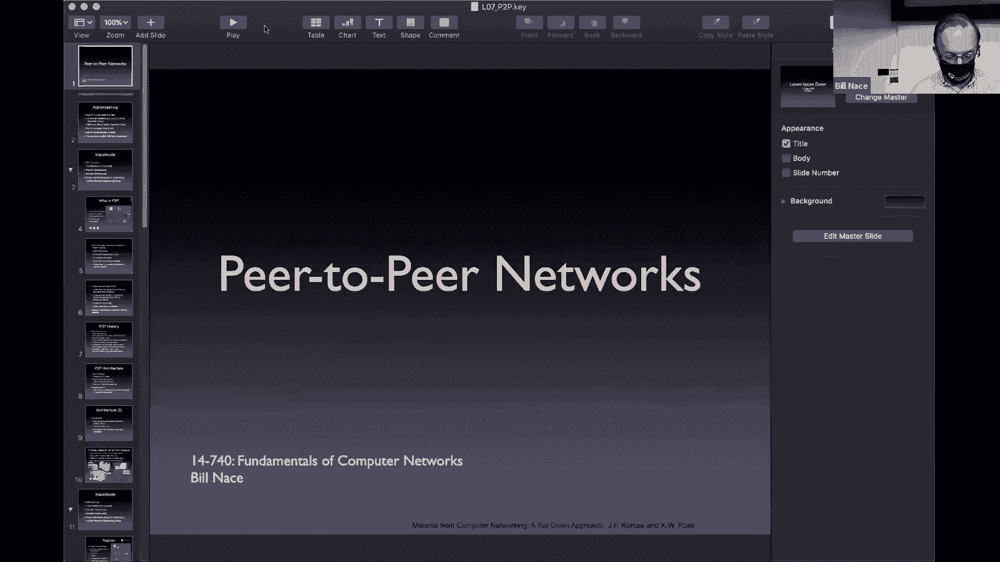
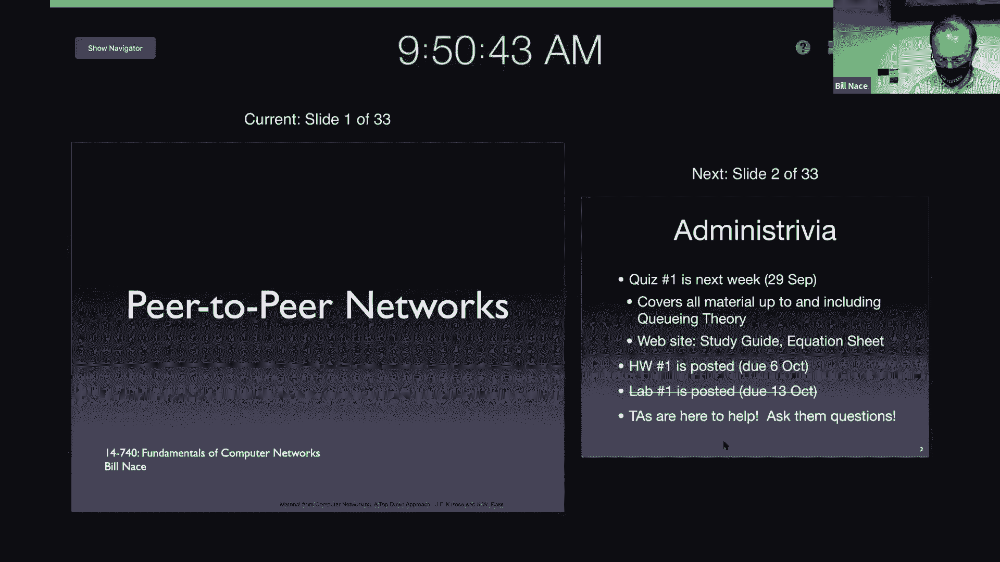
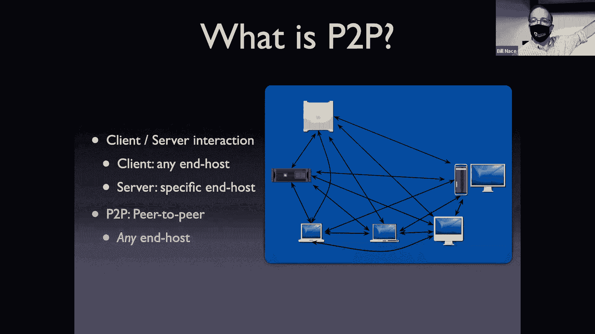
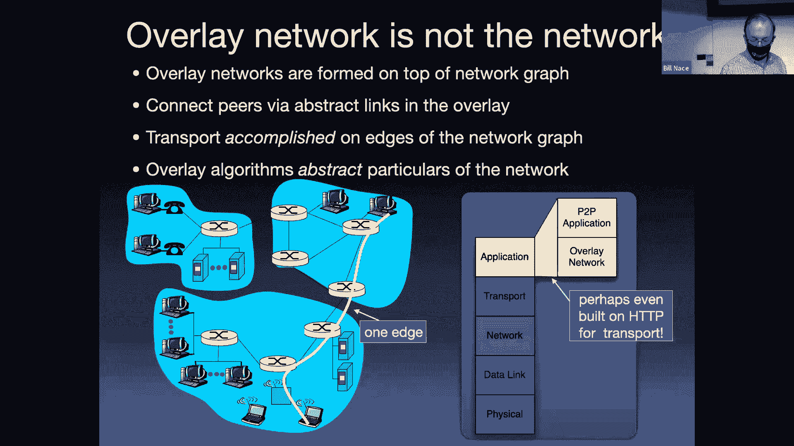
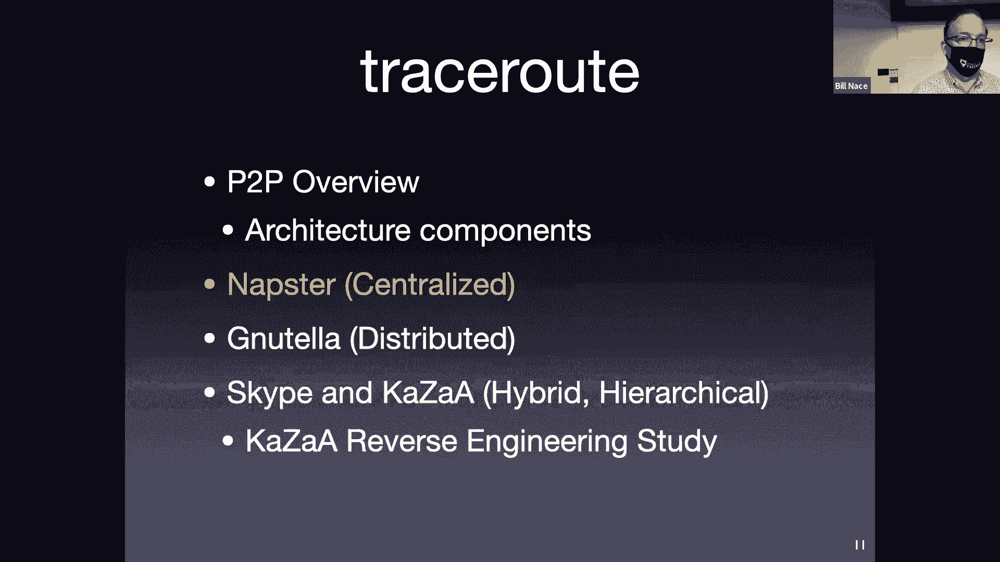
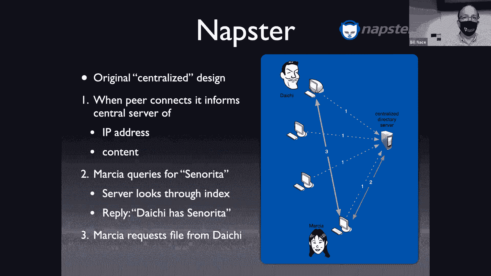
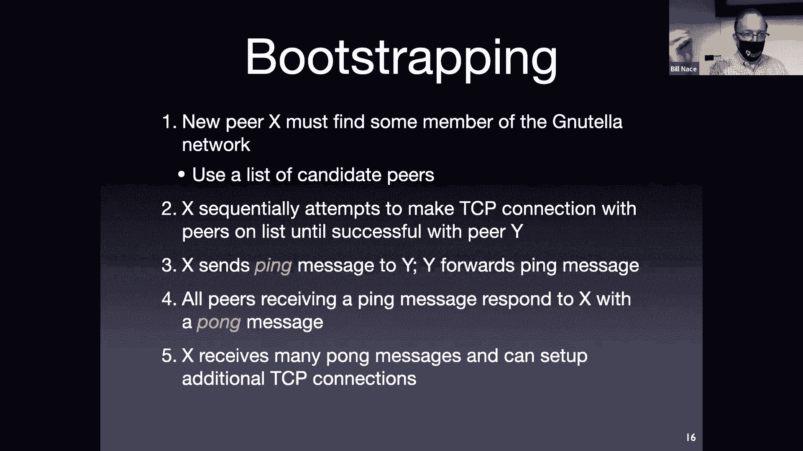
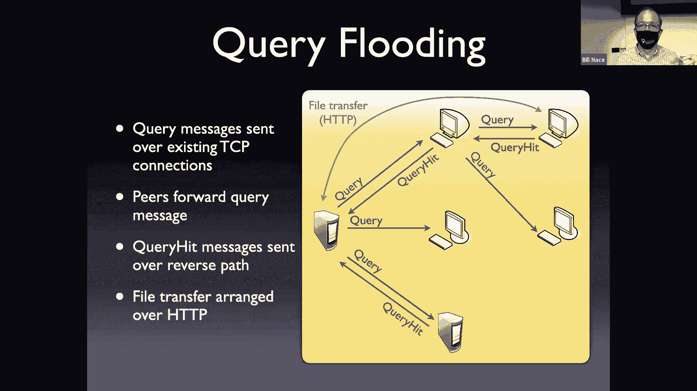
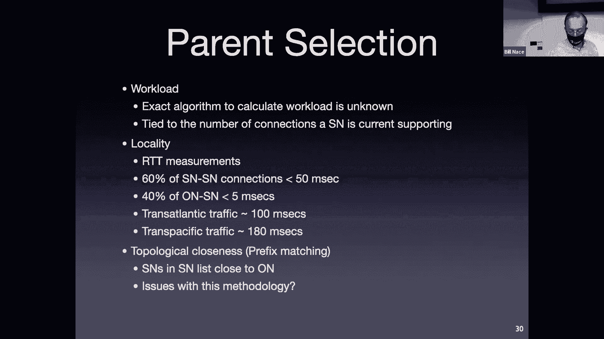
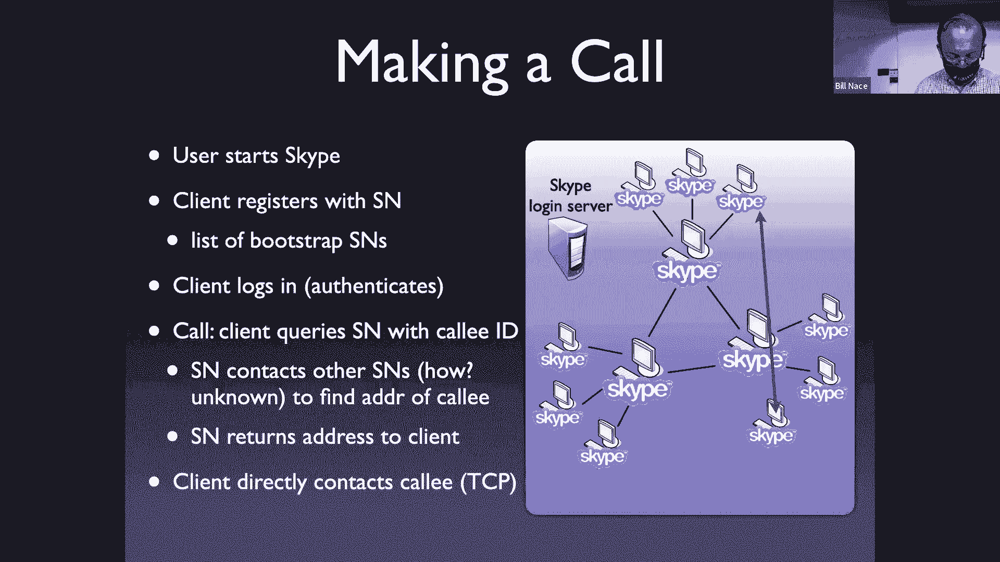

# 计算机网络基础：7：对等网络 (P2P) 🖥️

在本节课中，我们将要学习对等网络的基本概念、工作原理以及其发展历程。我们将从早期的集中式对等网络开始，逐步探讨其向分布式和结构化网络演化的过程，并分析每种架构的优缺点。

## 概述

对等网络是一种应用层网络架构，其中所有参与节点（称为“对等体”）可以直接相互通信和共享资源，而无需依赖中心服务器。这与我们之前讨论的客户端-服务器模型有显著不同。对等网络常用于文件共享、内容分发、分布式计算等场景。

## 什么是P2P网络？

到目前为止，我们讨论的系统大多使用客户端-服务器通信模型。例如，Web客户端向Web服务器请求信息，DNS客户端向域名服务器查询记录。在对等网络中，没有中心服务器。所有计算机（对等体）都能直接相互通信。

**核心概念**：在P2P网络中，每个节点既是资源的消费者，也是资源的提供者。

这种模型的优势在于无需支付和维护中心服务器的成本，并且可以利用大量对等体的闲置资源（如存储空间、带宽、计算能力）。

> **注意**：这里的“对等体”一词与之前课程中提到的ISP对等或公共对等点概念无关，这是该词的第三种用法。

## 为何使用P2P网络？

对等网络通常用于利用对等体自身拥有的资源。以下是几个主要原因：

以下是P2P网络的一些典型应用场景：

*   **文件共享**：对等体贡献出部分硬盘空间，共同存储海量文件。
*   **带宽共享**：利用众多对等体的上传带宽来分发内容，减轻单一服务器的压力。
*   **计算资源共享**：利用对等体闲置的计算能力进行分布式计算。
*   **匿名性**：通过众多对等体转发请求和响应，可以隐藏用户的真实身份（这也可能被用于恶意目的，如僵尸网络）。
*   **边缘性/低延迟**：将内容存储或缓存在靠近用户的对等体上，可以降低访问延迟。

然而，P2P网络也面临挑战：对等体可能随时加入或离开网络（称为“流失”），资源可能变得不可用。此外，一些对等体可能“作弊”，即享受服务但不贡献资源，网络协议需要设计机制来检测和抑制这种行为。

## P2P网络架构的关键问题

在设计P2P网络时，需要考虑几个关键问题：

1.  **数据放置**：数百万个文件如何在对等体之间存储和分布？
2.  **数据发现（元数据管理）**：如何查找和发现哪个对等体拥有我想要的文件？
3.  **信令协议**：对等体之间如何发送消息进行通信？协议格式是什么？是否加密？
4.  **文件传输**：找到拥有文件的对等体后，如何建立机制来实际传输文件内容？

文件传输通常使用现有协议，如HTTP。这意味着对等体需要能够像服务器一样响应HTTP请求，这是P2P与纯客户端-服务器模型的一个关键区别。

## 覆盖网络的概念

在讨论P2P网络时，我们通常会绘制一个图，其中节点代表对等体，连线代表它们之间的通信关系。这个逻辑上的通信结构被称为**覆盖网络**。

**重要提示**：覆盖网络是逻辑上的。实际的通信仍然需要通过底层的互联网基础设施（路由器、链路等）进行。从分层角度看，P2P网络是应用层协议，它利用传输层（如TCP）和网络层（IP）来实现覆盖网络中的逻辑连接。

---

上一节我们介绍了P2P网络的基本概念和挑战，本节中我们来看看P2P网络的具体发展历程，从第一代集中式架构开始。

## 第一代：集中式对等网络 (Napster) 🎵

Napster（1999年）是第一代P2P网络的代表。它引入了一个关键创新：**集中式目录，分散式数据传输**。

**工作原理**：
1.  对等体启动Napster客户端时，会连接到一个**中心目录服务器**，并上报自己拥有的文件列表。
2.  当用户A想搜索文件时，向中心服务器发送查询。
3.  中心服务器检索目录，返回拥有该文件的对等体（例如用户B）的地址。
4.  用户A根据返回的地址，**直接**与用户B建立连接，并使用类似HTTP的协议下载文件。

**优点**：搜索效率高，因为所有元数据（文件位置信息）集中在服务器。
**缺点**：存在单点故障、性能瓶颈和法律风险。中心服务器成为系统的脆弱点和攻击目标，Napster最终也因此被起诉而关闭。

---

集中式架构的缺陷促使了下一代完全分布式P2P网络的出现。

## 第二代：非结构化对等网络 (Gnutella) 🌐

Gnutella的设计目标是完全去中心化，以规避Napster面临的法律和单点故障问题。在Gnutella网络中，**目录功能也由对等体自身完成**。

### 引导问题

在一个完全分布式的网络中，新节点如何发现并加入网络？这被称为“引导问题”。Gnutella的解决方案是：客户端软件在下载时内置一个初始对等体列表。新节点启动后，尝试连接列表中的对等体，直到成功加入网络。

### 查询泛洪

Gnutella使用“查询泛洪”机制来搜索文件：

1.  搜索者向其所有邻居对等体发送一个查询消息。
2.  每个收到查询的对等体检查自己是否有该文件。如果有，则沿着原路径返回一个“查询命中”消息。
3.  同时，该对等体（除非达到限制）会将查询消息转发给它的所有邻居（除了发送者）。
4.  这个过程像洪水一样在网络中扩散。

为了控制泛洪的范围和避免环路，Gnutella引入了**有限范围查询泛洪**。查询消息带有一个 `TTL`（生存时间）字段，每经过一跳就减1，当`TTL`减为0时，不再转发。

**优点**：完全分布式，无中心点，抗打击能力强。
**缺点**：
*   **可扩展性差**：随着网络规模增大，泛洪消息会消耗大量网络带宽和节点资源。
*   **搜索不保证成功**：如果目标文件只在距离搜索者`TTL`跳数范围之外的对等体上，则无法找到。这被称为“大海捞针”问题。

---

非结构化网络的搜索效率问题催生了需要更智能结构的下一代P2P网络。

## 第三代：结构化（分层）对等网络 (KaZaA) 🏗️

KaZaA引入了**层次化结构**来解决搜索效率问题，这是工程师面对规模问题时常用的“超级武器”。

**网络结构**：
*   **超级节点**：能力较强（带宽高、在线稳定）的对等体，负责维护元数据和路由。
*   **普通节点**：能力较弱的对等体，连接到某个超级节点，构成一个集群。

**工作原理**：
1.  普通节点加入时，连接到某个超级节点，并上报其文件列表。
2.  当普通节点A搜索文件时，向其连接的超级节点S1发送查询。
3.  S1先在本地集群（包括它自己和其下属的普通节点）中查找。
4.  如果未找到，S1代表A向其他超级节点转发查询。
5.  其他超级节点在其各自集群中查找并回复。
6.  A从返回的多个结果中选择一个源，直接建立连接下载文件。

**优点**：
*   **搜索效率高**：一次查询可以搜索整个集群。
*   **可扩展性好**：层次结构限制了查询消息的传播范围。
*   **利用了网络异构性**：让能力强的节点承担更多责任。

**相关研究**：你阅读的论文对KaZaA网络进行了测量研究，试图逆向工程其协议。研究发现网络动态性很强（连接持续时间短），超级节点间连接稀疏，普通节点倾向于选择延迟较低的超级节点进行连接。

### Skype：P2P在VoIP中的应用

KaZaA的创始团队后来开发了Skype。早期Skype也使用了类似的层次化P2P网络来维护用户在线状态和协助呼叫建立，但包含一个中心化的登录服务器用于身份认证。

**工作流程**：
1.  用户通过中心登录服务器认证。
2.  登录服务器引导用户加入一个P2P覆盖网络（可能成为超级节点或普通节点）。
3.  当用户A呼叫用户B时，A通过P2P网络查询B的当前IP地址（基于B的Skype ID）。
4.  查询到地址后，A与B建立直接的音频/视频流连接（有时数据也可能通过P2P网络中转）。

---

## 总结

本节课中我们一起学习了对等网络的发展与演化：

1.  **第一代（Napster）**：集中式目录，分散式传输。解决了资源发现问题，但存在中心化缺陷。
2.  **第二代（Gnutella）**：完全分布式，使用查询泛洪。解决了单点问题，但搜索效率低，可扩展性差。
3.  **第三代（KaZaA）**：结构化分层网络，引入超级节点。平衡了效率与去中心化，更好地适应了网络规模。

P2P网络的核心思想是利用边缘设备的闲置资源，通过巧妙的覆盖网络组织方式和协议设计，实现高效、鲁棒的资源共享。这种模式深刻影响了文件共享、内容分发和实时通信等应用的发展。BitTorrent等更现代的P2P协议在此基础上又有新的创新，例如将文件分片并从多个对等体并行下载，进一步提升了性能。