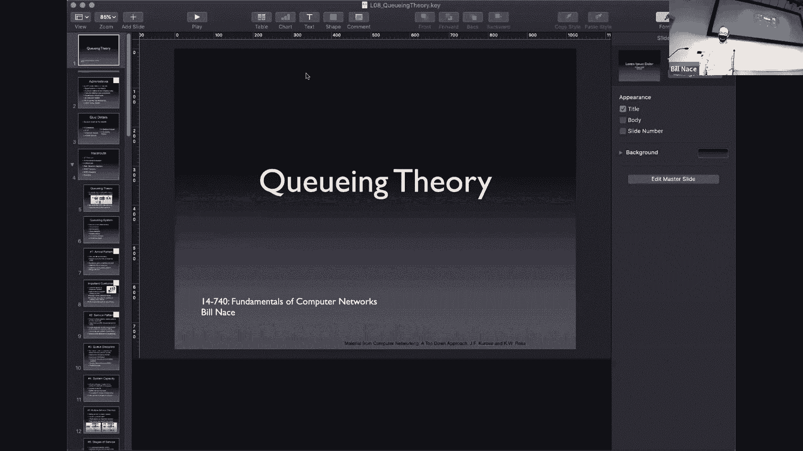
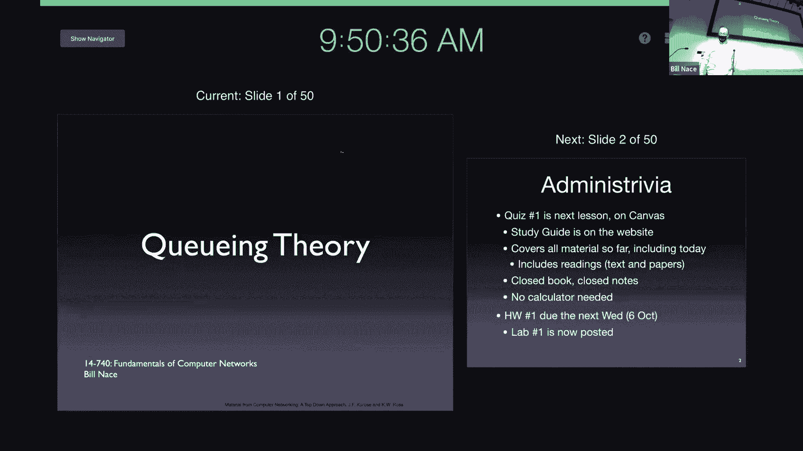
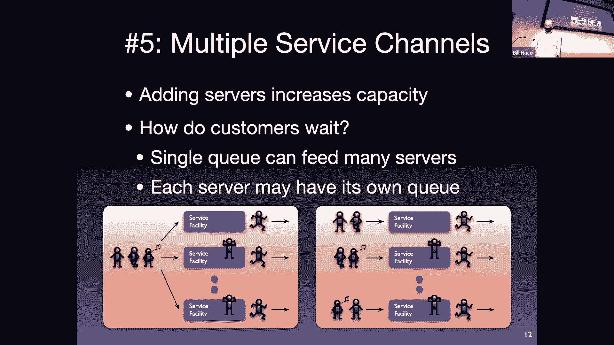
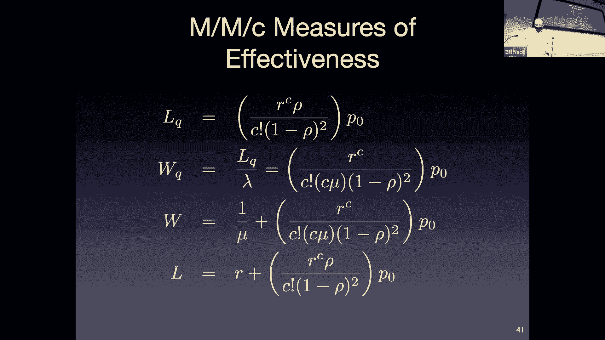

# 卡耐基梅隆大学 14-740 计算机网络 Fundamentals of Computer Networks（Fall 2020） - P8：Lecture 8 Queueing Theory - ___main___ - BV1wT4y1A7cd

This is 14740， welcome everybody。Today we're going to tackle a fairly interesting and somewhat challenging topic。

That is queuing theory is。By far， the most math heavy。

Of the bits of content we have for the entire semester。

嗯。This has， I don't know， more math than， yeah it's just。So， I。

I hope that doesn't scare anybody okay it's not difficult math。

 we do have some big sigmas and pies and a couple probability things here and there。And。

What I'm not trying to do is I'm not trying to make you into queing theory experts who can you know go。

You earn a living doing queuing theory somewhere， but I just want to introduce you to this topic because it is a very important tool in the network engineers toolkit as you are constructing systems or analyzing systems or trying to figure out what the performance of a network system is going to be definitely but also this is useful tool in lots of other analysis places when you're trying to figure out other parts of your system will your operating system be able to handle loads and things like that and so an introduction。

 I almost said gentle introduction but it probably isn't gentle based on the amount of math we have here。

A couple of administrative points before we get started， one of them is。

I hope you know by now that next lesson is going to be the quiz okay the quiz will be delivered on Canva so those of you here in economy don't show up here next time I guess you could you could sit here and work through the exam if you wanted to but I won't be here I'll be on zoom so if you have any questions you can ask during the quiz。

But you know， basically go to someplace comfortable， get very relaxed。

Be in a state of mind that will help you with that quiz。Okay。

There is a study guide on the website now that study guide you should have seen all the content in that before because it is literally just the last couple slides of every lecture where I talk about the lesson objectives for that lesson。

And I have combined them all together in chronological order right and then you this is basically a list of what I think you ought to be able to do。

The quiz itself will cover queuing theory so everything up to and including today everything you have heard in this course is fair game that does include material。

I think it would be fair game， although probably a little bit weird to ask you questions about your wire shark I certainly am not going to ask you with's this button or what's that。

 but I could conceive of a question relating to that somehow certainly the readings are fair game now。

I also recognize that you read a lot of papers and there's a lot of stuff in there and I'm not going to go in and ask you for some little detail I'm not going to say you know in the Kazza study figure four had this graph you know was a 。

2 or 。7 at the top of that graph。I would consider that too minute a detail to worry about。However。

 if there's some topic in the paper， let's say you out of an eight or 10 page paper。

 if there's a topic that covers a page。😡，Where the author is describing something， if there's。

 you know that like figure two of the paper that talks about the architecture for the entire system。

 I think some of those are fair game sorts of questions。

 the sort of thing that if you read the paper you really should not have missed。

That particular piece and the sort of thing you you。

You might not have chosen it as an important point。

 but a lot of students in the class would have chosen as an important point to discuss。

The book the quiz itself is closed book close notes。

 you will be able to use the equation sheet that covers all the equations we have today you'll notice in today's lesson objectives one of the lesson objectives is says the student at this point should be able to not memorize all the equations okay I don't want you to memorize and that's a pointless exercise in memize memorization what I want you to be able to do is you have that reference sheet next to you be able to apply the appropriate equation pick out the appropriate equation。

 understand the terminology behind the equations okay。If you're doing math。

 no calculators can be required， I will have chosen numbers nicely so that you're dividing by 10 or multiplying by four sorts of things。

 you will not have to do long division or anything like that okay。

I also want to point out that we do have a couple other things in the mix that are coming up。

 there's a homework that's due the time after the quiz， I said Wednesday here didn't like wow。

 do Thursday。I hope the date is right Thursday，6 October。

Whatever it's in the schedule on the website and also want to point out that I did post lab one。

 we got the encryption worked out or actually the lack of encryption worked out so that you should be able to watch the traffic to and from the website properly now without any HCtTPS redirects and stuff like that so please go handle。

 go get working on that lab。I left the quiz details this is actually not accurate I've not finished writing the quiz for this year。

 these are the numbers from last year for this quiz and。I wrote that quiz， I'm going to write this。

From a multiple answer。 And then there were fair number of。Short answer right。

 an answer requiring a couple words to maybe a sentence or cell。

 and those are often you know described this concept sort of thing。

 what's the difference between this concept and that concept？I would like to point out， and in fact。

 on the quiz， I specify a word length， okay， when we did quizzes on paper。

 I would give you some space and say you can't write anything out of here。

What I'm trying to do is make it easy for you okay I don't want when I ask a question about X。

 I don't want you to tell me everything you know about X。😡，Okay。

 I want you to answer the question I asked。And if you tell me everything about X。

 then that's an indication to me that you don't know the answer and you're just kind of spewing as much stuff as you can。

Okay， so。Wow， okay， what happened there。こ家だろ。Okay，' see I see it。 I'm presuming Zoom still sees it。

 is that true。Okay， somebody's having fun with her。🤧With their big screen， I guess， okay。

So the point there is you will see limits that say oh。

 we're only going to grade the first 30 words of your answer。

 what I'm trying to do is tell you just write a sentence there okay in those cases what I've done is I've taken my answer and I've doubled it and then rounded is somewhere near so if it took me eight words to answer the question and the answer key。

 I'm going to say your answer should be 15 words or less。Okay。

 because I don't want you to tell me everything you know about X。Just answer the question。

 same with medium answers， and we did have one Q and theory question last time。All right。

 so what are we going to talk about today， we're going to talk about this idea of queuing theory and we're going to see some ways two main ways that it gets applied to some of the systems we have。

Nowqueuing theory itself， the optional readings are not， no， they're optional right。

 so it wouldn't be fair for me to assume that everybody had read it。对。🤧All right。

 so queuing theory is this tool that's come up that was developed。

Out of a lot of operations research concepts， building industrial systems and figuring out how to make those work and how to manage businesses at scale。

 and it turns out it's exactly the right math for networks as well because what those systems have and have been able to abstract about behavior we also have in terms of packets showing up at routers and things like that。

Soqueuing theory is all about a process where there's some queuing what that means is you have some use the queuing theory terminology occasionally I'll dive into you'll find me using networking terminology。

 but what you have is you have some customers showing up somewhere at some service facility that has a limited capability to service those customers。

And so the customers， when they show up。Only a certain number of them can actually go into the service facility if there's somebody already in the service facility。

 then that customer has to wait and when they wait they get in a line and that is a queue。

 so that's where the queuing theory term comes from。

And so then those customers will arrive will go into the queue after some amount of time of waiting。

 they will go into the service facility， get serviced and then they're done， they leave。Okay， and。

You know some of the customers in real life can you be discouraged and leave and there's some other kind of paths through this。

 but in general we have some items showing up。Getting processed in in turn by some facility that has a certain capability and then leaving okay and。

You probably can see this description and automatically think like oh that's the grocery store right I'm standing in line waiting for the cashier at the grocery store or the teller at the bank or the barber。

 you know there's lots of places in your life where you run into these queuing theory streams where this math all works。

But technically the math was developed know to help out like steel mills figure out how much steel should show up so the customers don't have to be people it could be you know tons of coal coming into one end of the factory and the factory has a certain capability that's the service facility you know and we want to know how much steel can go out and we want to know how big the pile of coal can be or should be outside of the factory for us doing networking this is often packets showing up at a router okay they show up the router has a certain capability to manage them and then they leave。

And we can do this math to figure out， Oh， how big should that Q be。

 How many packets should I be able to handle。How much memory will my router need？

The queuing system itself， we found kind of six characteristics that we have to think about when we're looking at these systems。

 and so we'll look at these six things in general。The first is the arrival pattern。

How is it that our customers show up and well it turns out the interesting part about this and the reason we need this math is because customers show up whenever customers want to show up packets come to routers。

 whenever packets want well we're anthropomorphizing the packets。

 whenever the users want to send packets to a router。

There's no schedule or pattern or something like that it's just kind of like oh randomly they're going to show up so we say that they're stochastic。

And we can't tell you exactly when a particular customer is going to show up。

But we can describe the probability density function， that's what I mean by PDF， not the file format。

The probability density function， So oh， that's probably a word you haven't heard since your probability class right you may have gone through some therapy to try to forget that。

Yeah， we have some way of describing the distribution and saying。

 I don't know that you X customer will show up at Y time。But I do know that on average， you know。

 some number are going to show up。 and I can usually measure that。

 It's one of the nice things about this pattern is you can station somebody with a stopwatch outside of the grocery store。

 know， that guy with the clipboard there。's he's counting how many customers are showing up in what amount of time。

And he's not saying， you know， customers showed up at exactly， you know， Seven，47 AM。

 He's saying that， oh， you know， over this 30 minute period that I measured， we had，57 customers。

 and that's this kind of average。Okay， so this is something we can measure。

Sometimes the customers show up in a bulk right occasionally the 61C drives up right in front of the right aid and all of a sudden you have a bunch more customers showing up and if that's something you worry about turns out queuing theory can specify that。

 but then you need to be able to know on average what's the bulk size like and how often do those bulks show up。

We say that the arrival pattern is stationary if it doesn't change with time now from a philosophical perspective。

 every arrival pattern changes with time。Before that steel factory was there。

 the arrival pattern was very different than after the steel factory was there。

RightAnd so over extremely long periods of time， nothing is purely stationary。

 but we say a pattern is stationary if you know we're not going to worry about those startup and end times we're going to say oh。

 like in the middle of the day， this is what we care about， this is what the pattern looks like。Okay。

 if， you know， once my network is up and running， this is what these patterns look like， not a。

 you know， we。From the time before the company existed sort of patterns， right。Yeah， no pattern is。

Is actually truly stationary， but most of them are mostly stationary。

 and it helps us make a lot of simplifications in the math。

 and that actually leads to answers that aren't too far off what they would be if we。

Didude more complicated math about that。Nowqueuing theory also manages to think about customer behavior that's not normal。

 oftentimes， well it depends on the system we're dealing with in our networks。

 we don't have customers with will of their own。And so some of this doesn't apply to networking。

 but in queuing theory， we have customers， I'm sure you're like this， right？

You sometimes show up at the barbershop。And you're like， oh， there's already 27 people in here。

 that's going to be a long wait for me， I'm just going to close the door and walk away and go get coffee instead right we say that you have balked when that happens。

Okay。We also have a reneging process is where okay， you've gone into the barbershop。

 you've sat there for 20 minutes， you've noticed that the line hasn't really moved and you've decided that you know Joeill Lasso is on and you've got to leave right now and so you've been there for a while。

 but you've then depart。And I don't know how many of you do this。

 I do it all the time right I jockey for a position， you go to the grocery store。

 I don't know about you guys I shop a lot with my wife， right we always get in different lines。

And then we stand in those lines for a while until we get closer and we're like， oh。

 she's beating me， let me go change and be in her line or something like that that sort of behavior。

we don't see that one too much in networking， I should point out that some of these we do see right depends on what you're measuring if you're looking at what's going on with a firewall。

 for instance。You can model some of that behavior of individual packets coming in as oh。

 the firewall threw this one away and so that means it entered my system。

But it never made it to the router in the back and so it's kind of like it stood in line of while and then reneged sort of behavior。

The second characteristic to talk about is the service pattern Okay so now we know what the customers are doing。

 what's the facility doing， what is our router capable of doing Okay and again this tends to be stochastic。

Some packets we're able to work hard on， some we aren't。

 some require more garbage collection and memory management than others。

Some require more work or less work。And so therefore。

 I can't say this is the number of CPU cycles my router is going to spend。But I can say on average。

 this is what's going to happen。And this again is generally an easy thing to measure right we get somebody with a stopwatch who's actually looking now not at the customers coming into the barber shop but the actual barbers right and measuring oh you know that haircut took eight minutes and this one took 12 minutes and then you know over the day coming up with some sort of average for that and so again we'll be talking about probability distribution functions。

Not peer schedules。Sometimes the service pattern， we said state dependent。

Okay that means that the state of the system for a queuing system is considered to be the number of customers that are there。

Okay， so if a service pattern is state dependent， that means the actual number depends on how many customers there are。

And so you see this occasionally with。You knowThe new trainee at the you know who gets really flustered when there's lots of people watching and waiting right or other sorts of behaviors where maybe you know maybe a server would say。

 oh you know look I see there's a lot of customers waiting and line out in the foer at my restaurant so let me move let me get these tables bust really quickly so that we can move more people in here and they're reacting to the number of people that are there and so those are state dependent servers。

Usually， our service。Probability distribution functions are state independent。

 does it matter how many people are there。🤧Services can also be stationary or nons stationary。

 remember this was the whether they changed through time。

Where the patterns depend on what time of day it is。Yeah。The queuing discipline itself。

 we're used to going and seeing a line and you stand at the back of the line and you exit the queue from the front of the line。

 that's a first in， first out line。But those aren't always what we see sometimes you have last come first serve。

We know this in computer systems as a stack。Where the last thing to show up is the first thing that we're actually going to service。

 those sometimes are useful in inventory control or other sorts of places。

Maybe you randomly choose something like that and there of course are different priority schemes。

 we will actually talk about priority routing in a future lecture where some packets like oh。

 you know this is the data that the general has it should go first over top of those corporals sort of system。

There may or may not be physical limitations to the cues。There's always， in real life。

 fiscal limitations to the cues。Okay， but。Impmosing those changes the math and makes some of the analysis more difficult。

 and so oftentimes we will ignore that。All， we'll say， oh， I'm not going to worry about it too much。

 okay？But in other cases， we do need to make sure we understand this。

 and so maybe we're worried about how much buffer system capacity there is。Right， this is。You know。

 how big can the queue get。So in my router there technically is right in fact that may be what I'm doing the analysis to figure out will it be okay if I have X amount of memory to store the waitinging packets or not？

Okay again， this is one that's oftentimes ignored because the math gets more complicated and sometimes it matters and sometimes it doesn't so as aqueuing theorist you you would have to know when to do the math and when not to。

P。It's possible that having multiple service channels is a good idea。

 And so this is all gets around the idea of whether。

I like to think about it as are you in a grocery store or are you in a bank right there are different kind of models for how you get to the service channels you have so。

Here I have instead of having a single teller and you know all the people at the bank in that line are serviced by that single teller。

 maybe I have multiple tellers at the bank， of course you get in one line and then when you get to the front of the line you go to whichever teller is open。

Okay， that's kind of。In fact， we're going to see this more and more in computing systems because this is typically what happens I got multiple cores in my router。

Okay， I'm just going to have a list of incoming routes and you know when you get to the front。

 get you get handled。But there may be some capacity in terms of the service。

More complicated systems also will have multiple stages of service。

So what that means is you have a queue and a service facility。

 but that's not the only thing you're analyzing， you're analyzing some other Q and service facility in combination with this。

So we may see it in our network systems because packets come into the data center right and then they go through a firewall。

 which is a queue and a service facility and then they get passed over to a load balancer。

 which is a queue and a service facility and then they get to a web server and then there's a back in database as well or whatever right and analyzing each of them individually isn't really what I care about what I care about is the service that the whole data center is providing。

so that becomes a multistage system my example here is one I think I was annoyed with the doctor's office when I was writing these slides because you go to the doctor's office。

 you sit in the waiting room and then the receptionist says， okay。

 please come up and you fill out this clipboard worth of information and then go sit in the waiting room again and then the nurse comes out and she you know asks to take your blood pressure and then you go sit in the waiting room again okay and that becomes a multist queuing system eventually you get to wait for the doctor to show up and then the doctor service is you。

So these six characteristics were early on recognized to be important。

Because how they are how each of them is chosen。And how the system is being built that will use each of those these different characteristics means that the math is slightly different。

And I like to think about this in the queuing theory textbook form。

RightWhat we're doing today is basically chapter one of aqueuing theory textbook chapter two picks up particular situations。

 says， oh， what happens if we have you know different kinds of arrival patterns。

 what happens if you know if we've got random in one way versus another and chapter three is a different type of arrival pattern and chapter four is a different and each one of them comes up with some equations that are useful okay。

Nott organized that back in 1953。Gu named Kendall came up with a notation。

 a way to be able to specify。Because at that point。

queuing theory was getting big and unwieldy and there were bunches of equations。

But you had to know which situations the equations were appropriate for。OkayAnd he said， you know。

 we've got these characteristics。 Let's put them together in a nice， easy to specify form。

And we're going to just call it with an A， then a slash， then a B， then a slash。Then an x。

 and sometimes a slash Y and even less frequently a slash is Z。Okay。

This notation specifies that that first position， the A position in this notation tells you about the arrival of the customers。

Okay， what's that Pdf like。Okay， is it Well， there's some choices if it's。Exponential or Markovviian。

 That's where the M comes from。We say， oh， this is a Markov process。

And with exponential distributed in arrival times， that's an M。Okay， but if it's a different one。

 if it's deterministic， if you know that a customer is showing up every 10 seconds， exactly。Okay。

 then you'd write a D there or and there are other choices。

And then you already slash and then you say， okay， how about the service facility， how do they work。

 What's their PDF look like I it exponential， is it deterministic。And same sort of thing。Okay。

 and then you have a slash。The X is for the number of servers you have。

How many of these service facilities do you have that are working in parallel， You have one。

 you have two。Do you have an incident number， turns out there's math for that too。

Oftentimes you stop there， okay， so it's very common to have M slash M slash1， for instance。To say。

 oh this you know the customers coming in and the service。

 both of them have no memory and they're not state dependent and so they're Mark Coby and and so we specify them that way。

 but occasionally then I want to go on and add on a max capacity how big is my cue。

 how many customers can fit or how many packets can fit into that memory。

 or maybe I want to change the queing discipline， maybe instead of first and first out it's last in first out or random or something like that。

Okay， and so what we end up with are。These kindled notations for differentqueuing systems。And really。

 what we're doing is we're。Going to associate different mathematical equations and analysis techniques for each of these。

OkaySo that's really what's important is you want to know which chapter of the textbook to open up to。

Okay，And so for instance， oh， Gs are complicated。OkayG means I don't know。

 I have made no assumptions about how the customers show up or how the service is handled。Okay。

 it's not that in real life， we look at something and we say， oh。

 this system is operating under a general。Princiipple， okay。Instead。

 it deals with the equations we're able to use if I've made no assumptions about how customers show up or how many servers I have or anything like that。

 then I can say， oh， this is a general system。So I have G G1。

 we're actually going to develop some of these equations very shortly。

 A G G1 system doesn't make assumptions。About how customers show up or how service is done。

 it does specify that there's a single server。And that means that any equation we come up with as we derive that is applicable in general。

 can be used on any queuing system that only has one server， or GGC， I would be able to specify。

 I've done the math and the equations have a C in it and so if I have 57 servers。

 I just plug the number 57 in wherever the C is。Okay。

Ms would be Marovian in those cases I've made an assumption。

 okay I'm using something about the math that means that this applies only in situations where customers show up with exponentially distributed inter arrival times。

So it makes sense， and that basically tells you， okay。

 which chapter of the textbook do I go to to get the equations and the techniques to help me analyze this sort of system。

And given a particular system， you can open up to the MMm， you know， or whatever M。

 then Erlang slash slash C system and use that math， or you can use all the math that's in the GGC。

Chapter， because your system also those equations apply as well， so makes sense。Okay。All right。

 so that's kind of where we're going with queing theory， let's actually dig in and see some of it。

First thing we'd want to do is we'd want to analyze some performance。

 actually it's mostly what we want to do here， so we're going to start working some math and so that means we need to have some variables to deal with some parameters and so let's pull out some Greek letters。

Quuing theory uses Lambda as the symbol for the average arrival rate for the customers。And so again。

 this is an easily measurable parameter， you have a stopwatch somewhere you you're looking at the customers showing up this is on average。

 remember the customers show up as they like sarcastically。

This is the number of customers or packets you're going to have coming into the system per second。

So that's dealing with the input of the customers mu is dealing with how fast we can handle these。

 what's the service rate look like okay on average。

 how many packets per second is my CPU capable of handling？Okay，And so that that again。

 a measurable technique， let's get out the stopwatches。And figure out what that number is。

 on average。Or maybe what the probability distribution function looks like。嗯。But then， you know。

 that's mut。C is the number of servers that again fairly standard， right should be easily measurable。

 you built the system， you should know how many parallel tracks there are that can handle customers at the same time。

All right so given those parameters and we will get more， don't worry。

 our first equation is this one we're going to define a thing called traffic intensity I give you a little taste of this a couple lectures ago or pointed out that this number we don't want to get it too close to one this talks about the ratio between incoming work and outgoing work。

Okay， so we're going to take the Lambda， which is the number of customers arriving per second。

And we're going to divide that by mu， which is the number of customers that can be serviced per second。

 But thats mu is a number that's based upon each server。 And so if I have more servers。

 I can do more work。 And so。I get lambda over。 oh， turns out this is my favorite equation in the world。

 I think。Okay， why。The traffic intensity is Lambda。Overs mu。Yeah， that's right。

 we have our ownqueuing theory equation， MIT doesn't have an equation like this。Okay。

 Lambda over see you。Is the traffic intensity， also known as rub？

This number is unitless and it's just this ratio， how much work coming in versus work going out。Okay。

 I also like that。 C mu。Is like how much work can be done， right， Our heart really is in the work。

When row is greater than one， when the traffic intensity is greater than one。

 that means you've got more work。Coming in， then you're able to do。Okay， and that's bad。

It's going to stack up， I know this it feels like that the 12th week of a semester more work coming in than leaving and you don't want your system to do that。

 you want to do something to manage that system so that you can actually accomplish the work。

Turns out when Roe is one， you're still in trouble。remember。

 these are random distributions of stuff and。If the input can be random。

 sometimes you're not going to have any customers showing up at all。

 and then if if it's perfectly balanced with the amount of work you can do， that means that。

You that no work to do is going to at some point mean that there's more work than you can handle and that effectively builds up and means that your cues get full and never actually are able to it feels like you should be able to handle that but you can't what you want is a row less than one and usually we want it。

You'd like it far less than one， although that means you're。

You're spending more for equipment than you necessarily need。All right， more。More equations N。

Is the number of customers that you have at a particular time。

 so I'm showing that is n with T as an input to that function。Okay， this is。

this is something that's hard to measure， it's hard to figure out what that actual function is for the number of customers you would have at any point in time。

There is an n sub queue to tell you how many customers are in the queue and an Ns of S for how many are being serviced at any point in time。

It's basically our system has a queue， has place for people to wait and it has a place for customers to be serviced。

 and so we like to know what those numbers are and the total number is going to be the sum of NQ and S。

Now what we can more likely measure is not what the actual function is。

 but what the characteristics that function are， so what's the average。

 what's the expected number that you're going to have in the system at any point in time。

 so what's expected value of n。Okay， we're going to call that L。

And I'm going to do this several times today I apologize they didn't ask me when they came up with these terms okay L doesn't seem to make a whole lot of sense for me for the average number of customers in the system but that's what's used that's expected value of the number that are in the system。

 how do you figure out the expected value or the average。

 how do you average all these oh that's easy we know how to do that from our probability class what we do is we count well how many customers are there times the probability of that situation happening。

Okay， so P sub n is going to be the probability that I have n customers right。

 So P sub5 is the probability that I have five customers。Okay。

 so I'm going to take that piece of five and I'm going to multiply it by five。Okay。

 and I'm going to add that to the probability of six customers times six and probability of seven。

 times seven， et cetera， right that's pretty much the definition of expected value when I add that from zero to infinity。

Okay。I can also do that for the number that are in the Q。

 this one makes a little bit more sense to me， I like L here。

 the length of the Q sort of makes sense there and maybe that's where it started and so L has to be for the entire the length of the system feels a little weird。

Okay， so now we're trying to figure out what the expected value is for the number that are in the queue。

And the equation gets a little bit more complicated。Well。

 if I have some number of customers in the system。What that means is I'm going to have as many in service as possible。

 and then the leftovers are in the queue。So if I have a system with C servers。

Imagine I have 10 servers。Then if I have eight customers in the system。

 I will have zero in the queue right because those eight will be being handled by the servers。

And so that's why I have to take the number in the system and subtract out the number of servers actually have and minus C。

Okay， and then that's the value that I'm going to multiply by the probability of there being that many customers in the system。

 So， you know， if I have a 10 server system。Then I only want to then I don't worry about the situation where I have less than 10 customers because all those will be in service。

 none will be in the queue。And so I'm going to add up from C plus one。From 10 plus one， what happens。

 five 11 customers， Okay， well 5，11 customers， then I'm going to add up 11 minus 10。

 I'm going to say there's one in the Q times the probability therere being 11 customers。

And just keep doing that up to infinity。Makes sense。So I told you this map wasn't too hard。This。

 by the way， makes us think a little bit about what's happening to the customers showing up and how to measure this and so。

Remember a guy with a stopwatch who's measuring these customers coming in。

 what he's doing is he's measuring the inter arrival time。

He's saying this packet showed up at time X and the next packet showed up at x plus some amount。

 that amount is the enter arrival time， the amount of time between the arrivals of each of my customers or packets or whatever。

Okay， and so you can draw like this time arrow of what's happening when right when customer end shows up。

Well， that customer is going to have to wait in the queue until the customer before him departs。

 this is kind of assuming a one service system。Right and so you're going to be in the Q for T subq amount of time that's and the N there says this is the arrival time or inter time the time between that we're in the queue right and then you're going to go into service。

For some amount of time S， that's the service time。Okay， and。And then you're going to depart。

So when the customer before you has left， then you go into service and after X amount of time you're gone。

Okay， this tells us that the total amount of time we're spent in the system。

Is equal to total the amount of time you're in the queue plus your service time again I got to apologize I probably would have made that T of s okay but this is what we've got s is the service time。

Okay， that equation should be really obvious apart from knowing which variable means what？All right。

 along comes our first really substantial result， okay little's law named after a queuing theorist named little is a way is a is an equation that lets us specify a relationship between the number of customers you have and the time they have to wait。

该。Some of this feels intuitive to us。Okay， that if there are lots of customers。

 you're going to have to wait longer。Basically。And little was able to specify this in this famous law。

Not easy to prove。Okay， but he's the guy that managed to prove that this is going to happen。

 even though it's very intuitive to us。All right， so what did we got now we're worried about time。

So previously we had Ts， inter arrival times， time in queue， S is the service time。

I would like to go ahead and find some expected values for those I'd like to know what the average times are and so we're going to pull out W another letter of the alphabet to specify the average waiting time that you're going to be in the queue that's the expected value of the time in the queue。

The W without the Q is the average time here in the system as a whole。

 that's expected value of T so T and TQ are these ones we got on the previous page。Right嗯。And。

By the way， you might immediately say， wait a minute， that's my T and my TQ， what happened to S。

what's that one there and it turns out the expected value vast we've already dealt with。

 we already have something for that。The expected time that you're going to spend in service is actually the inverse of the service rate。

Make sense。The time you spend the services， how many customers per second？Get serviced。

The expected value of the time that you would spend would be the inverse of that how many seconds per customer basically okay and we have mu。

 which was the parameter from a couple slide before that told us the service rate so one over mu is the average waiting service time。

Exspeced value of S and so littles slot。Is this relationship， it says， oh， look。L， what was L。

 L was the number of the average number of customers in the system。

He says that's equal to the arrival rate。Lambda。How fast are the customer showing up。Times W。

 this expected value， this average waiting time in the system。Okay。

And so that that's that intuitive feeling we have， right， if you have more customers showing up。

And they each spend a long time in the system。 That means the queue is going to be long。

 You're going to have a lot of waiting right， That means the number in the system is going to be long。

You can do this， by the way， you can apply little's law just to the queue if you want。Okay。

 to say the number， the length of the Q is equal to lambda times the amount of time you wait in the Q as well。

Now， the cool thing about this equation is you can then take it and apply it to。

The expected value T equal the expected value t subq plus expected value S。

 where does that come from， well that was previous page right t equals Tq plus S。

 I just took the expected value of the entire thing。And then fill in the pieces right。

 expected value of T is actually w expected value of Tq is actually w is sub Q and the expected value of s as I mentioned a minute ago is the inverse of mu。

Now that equation and Little's law means that if you know Lambda and mu， mu shows up in there。

 Lambda in Little's law， if you know both of those numbers， both of which are easy to measure。

 and so you're probably going to know those numbers。And then you know one of those， right。

 if you know the number on average， how many customers are in the system or how long they spend in the system。

 it turns out you can do the math to get all the others。Okay。

 so this is a way of fairly quickly getting overall parameters for how long people are waiting。

How long packets are waiting， how many packets I'm going to have in my queue， those sorts of things。

All right。Expected value of the number in service。Okay， well。If you're in service。

 so the number in service， number of customers in service is equal to the number that are in the system minus the number that are in the queue。

Okay。Now you may be looking there saying， wait a minute。

 if I have a server wouldn't expected value of the number of customers in service be one， no。

 not always because you may have times where you have no customers in the system and therefore nobody's being serviced。

Okay。Or if you have multiple servers， it may be that not all of the servers are being used because you don't I have 10 servers。

 but only eight customers。That means on average， the number in service is not going to be 10 all the time。

Okay I can use the little sl， right， L equals lambda W right， L Q equals lambda W Q。

Waiting time minus waiting in the Q is equal to service time， which is。One over mu。

 one over the service rate。So we're going to define R as being this lambda over mu value because it shows up all over the place。

Okay， and that is the expected number。Of customers that are being serviced at any point in time。

All right， so if I take this understanding and want to do a little bit more math。

I'm going to make an assumption here， right， I'm going to say what happens when I have a single server？

I notice I just made an assumption， therefore。The equations that follow only apply。

To G slash G slash1 systems。Little's law， I didn't make any such assumptions， right。

 so it applies to all systems。Right。Okay， so this one now G slash G slash1。In that situation。

 I can look and say， oh， the average number of in that case。

 I know that the expected value of number and service is equal to this row。

 this traffic intensity value we used earlier， right because R is1 over mu。

 remember rh was1 over C mu， if C is1， they're the same。

So now with my expected value for number and service， Well。

 that's the link the number total minus the number in the Q right。

 The number total is on average once again， I'm doing the。The expected value formula。 Okay。

 what's n times the probability of N。 I'm actually going to do that from 0 to infinity。

And then I'm showing it here from one to infinity， because it turns out， well。

 I'm going to need it in a minute。But it turns out the zero term is always zero。

Because how do I average that out， I average it out as zero times the probability they're being zero Okay。

 so that term ends up being zero so I can just count from one to infinity。And then since I have one。

System one server， the numbers in the queue is a probability of， well。

 this is the same equation we saw a minute ago that you all agreed to。

Here with n minus C in this situation， C is1。Right， so n minus1 times。Probability of n。Okay。

 and in this case， the the probably n times pns， you can factor out of the second equation and you just end up with。

Adding up the probabilities。From one to infinity of there being that number of customers。

 So what's a probability that there's one customer plus the probability there's two customers。

 plus the probability， there's three customers。That should make perfect sense to us， right。

 What's the probability or what's the average we're going to of there being effectively more than one customer or one or more customers in the system。

Because single server system one of them would be in the server that's happening and so I end up with one minus the probability of zero of there being zero customers。

Because all my probabilities have to add up the one。Professor。

 could you please explain how What else can I do， Let's say that。 I have。A bunch of servers。 Okay。

 so I have g slash g slash C。 I'm not going to know what my lambdas and my muse look like and things like that。

 I'm just going to say。I have multiple systems， I want to know the probability that any particular server is busy okay so this told me on average。

 how many customers are in the service bay in bottom one if there's only one server here I'm wanting to know。

 okay， if I have multiple servers， how often is each server busy and maybe that will tell me whether that server is overloaded or whether I've bought too big a server。

 that kind of thing， let me scale out those servers。

So at Fety State we know R is equal to the expected value of Ns since all my servers we assume are identical。

 the math gets a lot more difficult if you have。Fast server， slow server kind of situations。

 So so far they're all identical。 So we just take the amount of work that's being done divided by C。

 and that's a probability that a particular server is busy。Okay， R is lambover mu。

Row is Landover CMU， and so a little bit of manipulation lets you know that this probability is equal to your traffic intensity。

Whi kind of makes sense if you're really busy that busyness is spread over all your servers。

 so the probability that any server is busy is going to be pretty high。Yeah。Okay。

 I don't have chat app。 I could get chat up。srry。嗯。嗯。How did we arrive at one minus？P0 previous。

 so I'm assuming that's previous slide。One minus p0， so if you agree to the last step。

 if I'm adding up all the probability there being one customer plus the probability there being two customers plus probability of being three customers。

That's a situation where all the probabilities have to equal one right。

 I don't have any situation that is not one where I have some number of customers。

And so if I'm adding them all up from one to infinity。

That's equal to one minus the one that I didn't add in， which is probability of being zero。Okay。

 so maybe you would agree if I reformulated that last piece and said that sum of all the probabilities from one to infinity。

 plus the probabilitybabil is there're being zero。That should equal one， and then I just slid。

The probability of being zero to the other side。Okay。

 so here's like the equation sheet that we've gotten so far okay we've got a bunch of equations starting with you know our M oversU。

 yay， our great equation， Littles law， a bunch of other equations we've gotten and then down at the bottom we have two equations that I'm pointing out are GG1 equations。

😊，Because these I made an assumption on， I said， what happens if there's a single server？

And so you cannot apply those if you have four servers。Okay， because that's a GG4 system。

all the others are completely general， you can apply them whether you have one server or four servers。

没有。All right， next step up is to use another tool so that I can make my analysis a little bit more specific。

 we call this a rate transition diagram and it's a way of describing these systems which we call birth death processes。

These are Markov chains where you have。On and some stochastic process that is generating new customers and some。

Process that is removing customers and we're a little bit morbid to call that birth and death right it's not that we're taking customers out and shooting them we're actually servicing them and then they leave the system。

Markov chains are。These interesting。Analytic tools where you specify states of your system and for us。

 the states are the number of customers we have and then we。

Specify the transitions between these states。And figure out what the rates are for us to be able to move from one state to another。

Okay， and so， for instance， if I have a birth， if I'm in some state and I have a birth。

 I would move to the next state state of having one more。 So if I'm。

 if I have five customers and another customer shows up， Okay， we now have six customers。

 I've moved to a different state。If I have six customers and one of them leaves。

 then I'm going to move to state five。Okay。So I'm going to be moving between states based on how many customers I have。

 and that's going to let me draw these rate transition diagrams。

They're basically a state diagram where it says zero one， two， three， four。

 that's how many customers I have。And so if I have zero customers and a customer shows up。

 I'm going to move to state one， what's the rate at which a customer shows up？That's on the arrow。

 I specify lambmbda zero， that is the rate that if I have zero customers， you know。

 kind of what's the probability that I'm going to have another customer show up。Okay。

 so those are those are random variables or the rate of random variables is lambda zero。

 lambda1 lambda  two， those are arrival rates。And the muse， mu1， mu2， mu3。

 those are the service rates。And I specified them with sub。呃。

Subscripts to them because they can be different values。In general， they could be different。

Right and so we want' to be able to analyze those， but for our purposes。

 I think you mentioned before we're assuming a uniform arrival rate get there I'm going to write some equations that we call flow balance equations and the idea is this my system is in steady state。

Which means that the probability of being in any state doesn't change through time。😡。

We don't have a situation where we have。Clustering， and as we go more and more and more。

 we drive ourselves towards state 2， right， That would mean we after a while would always have two customers there。

 Okay， ours our stationary systems。 So that means the probability of having two customers at the beginning is gonna to be the same as the probability of having two customers later on。

Okay so if it's in steady state， that means that the flow into and out of these states has to be equal。

All right， the probability of having two stays the same。

And that means that the arrivals into state2 happen as often as the departures from state to。

 what are those arrivals and departures well。To get into state 2。Actually。

 I wrote the equation with the departures first， didn't I the departures out of a particular state are well two different ways of departing right I can get another customer which would move me to another state right if I'm in state two and another customer arrives。

 I moved to state three。Or I could move out of state2。By servicing the customer。

 and now I only have one in the system。Okay， so I end up with。

Lambda for a particular state plus mu for a particular state。 Those are the arrows leaving a state。

Okay， both of them have this particular state number subs on them。

That's going to be equal to the arrows coming into the states， the rate at which， oh。

 I was in state one and another customer showed up or I was in state three and we serviced one。Okay。

 and so the arrow is coming in， that's lambda from the state minus1。And mu from the state plus one。

And then the Ps are the probability that I'm in any particular state right。

 the probability Im in state two， probability I'm in state one and。An arrival happens。

 a probability in state three and a service happens。Okay。Unfortunately。

 and this is a fairly nice equation to look at。 But I do have this discontinuity。

 I have to worry about right State 0 is handled differently because it doesn't have a state -1。

 There's no chance for us to have negative customers in our system。Okay。

 so we have to deal with that one as a separate situation now I'm going to rewrite these equations Okay。

 I'm going to write the bottom one in terms of p0， the probability of there being zero okay I'm going to write the top one in terms of n plus one。

Actually， yeah， and plus one。Okay， and so I'm just going to move some terms around。And。Yeah。

 we have a derivation Okay in general， I don't like teaching derivations I don't think you should memorize derivations I'm doing this though。

 just to kind of show you how you know this is what the textbook and queuing theory looks like as we come up with these different equations and it's not anything to be super scared of Okay。

 it's a little bit of math。There's a lot of creek numbers and subscripts that's the part that's maybe a little intimidating。

 but it will handle it。Those first two equations up there。

 the probability of there're being n plus one and the probability that they're being one。

 those are rewrites of the equations on the previous page。

 all I've done is I've done algebra to get the PN plus1 and the P1 by themselves okay。

If I know what P1 is。And I know an equation for n plus one， then I can calculate P2。

 the probability of being two customers in the system， right？Sure。

 I just take P1 and I plug it into the top equation right And after a slight amount of algebra。

 I end up with this equation。 P2 is equal to lambda1。

Times lambda zero divided by mu to mu1 times the probability of being zero customers in the system。

Okay， and I could do that again， right， That's P2。 it's P3。 Well， I take that equation。

 I plug it back into that top equation。And after a little bit of work。

 I'm going to get lambda two times lamb to 1 times lambda to zero。Divided by mu3， mu2 mu1。

 And so you're probably seeing a pattern here。 This is inductive reasoning。 We're going to say， oh。

 well that then。know let me go ahead and just extend that。

 that means that the probability of their being in。

 but we' know the probability of there being 147 customers in my system。Okay。

 I now I'm an equation for that。 I would have lambda146 times lambda 140。5ive。

 all the way down to lambda0， divided by all the muse。And so we express that just with this big pie。

 right the big pi is the same as the big sigmma except we're multiplying instead of adding。

A question about all this。Okay， it turns out we're going to then apply this idea and that equation to MM1 systems。

These are very common systems and even if they're not exactly your system。

 oftentimes from aqueuing theory perspective， we say， oh。

 I could do the simple math and come up with an answer that's within a half a percent or I can do the hard math and make it happen exactly okay depends on who's paying and how they're paying as to which way you go on that one right？

So for a MM1 system。Those are exponentially distributed。

 that means there's no the time at which a customer shows up is independent of the inter arrivalrial time of the customer before them。

So this means we're not all getting off the bus at the same time。

 it just means I randomly walked into the bank。Because I had a need to go into the bank。

 it didn't depend upon there being others who also had a need to go to the bank at that point in time and a lot of systems are like this。

Right。The way the reason the math is easier is because that means that all my Lambdas and all my mus are the same。

 so again I'm drawing my flow balance equations off of this Markov chain but you'll notice I have no subscripts anymore because it doesn't matter whether there are three or four or five customers in the system。

 the chance of there being a new customer shows up is independent of that。

That's what I'm looking for and that's oftentimes what we have， right you know？这一个。

I'm guessing this slide right？Of we get for P doesn't involve any。Or used to like right。して。

That's correct， well the one above。Right to the left of， yeah。いこや。

Because first I can seem like if you're in a state that right minute， you could end up in this data。

Do you think that eventually it would matter that at some point I had 57 customers in here to where he had done？

6 it would matter know。The ones above。 What's my intuitive feel for that， I guess。嗯。Yeah。

 I don't have any， any real good and。Intuition for that other than recognizing that all these probabilities are going to be linked up。

 they all got to add to one and so in some sense being able to chop out half of them and focus。

On on one section。Since all of the add up to one， maybe I get to ignore the other part。

 that doesn't feel like a super intuitive and satisfying answer to me。

But it's the best I got at the moment。Other than that， I'll just say， oh， math。

Does a question about what mean this one。U。So the assumptions are that this is a state diagram。

 right， and that it is this stationary system。So that the probabilities of being in one state don't change and in this case that the in arrival times are independent and so that that means all my rates of births and deaths。

Are all the same。That the averages are the same。They're not linked to each other。Okay。

 so now I can do similar math。Okay， I could go through and write the equations。

I could go through and do this same inductive。Proof that or not quite proof Inductive derivation I did a minute ago。

 or I could just look at this and I say， oh， this equation has lambda， you know，3， lambda 2。

 lambda 1， lambda 0， but all those are the same。So I don't need that anymore。

 instead it's lambda lambda lambda lambda divided by mu mu muum muu。Okay。

 it doesn't matter which one they are。 And so that means now。My equation just got a lot simpler。

 right now， instead of having a product of a whole bunch of different lambdas and mus。

 I have a product of a whole bunch of the same lambda and mu。

Which means I can just take the same lambda Mm and raise it to the end power。

So that's going to simplify a bunch of stuff。This is kind of cool。

 this means if I want to know what the probability of there being 57 customers in my system。

 that equation tells me。I pull out the stopwatch， figure out what Lada is， figure out what mu is。

Okay， take lambda over mu， raise it to the what that say 57th power， okay， and then。哦。

I actually have to multiply it by the probability of being zero customers in the system。

And I don't know that yet。Okay， and that's a harder thing to measure。

So instead we're going to pull out some analytics and some math and figure that out。

 what we're going to do is we're going to say， oh， all these probabilities have to add to one。

All right， so I'm going to take from n to infinity， all my probabilities add them together。

 and I have an equation now for what piece of n is。All right。

 so I'm going to take that equation from the previous page， plug it in here。

So P sub n is p0 times lamb over mu raised theM power。P0 is a constant。Okay。

 so I get to pull that out of this sum now I just need to raise。

 I'm going to remember that lambda over mu is equal to row word're in an MM1 system so。

It's actually lambda over CMU， but C is a1。So I'm going to just。

To help me keep the Greek letters down， I'm going to make it row to the nth power。

And you might have seen this before。 This is when you're adding up a bunch of。Vue the power。

 This is the typical you know， what is one half plus one quarter plus one8 plus 1，16th kind of thing。

 and as long as。That's a fractional value。 It actually adds up to something， right。

 An infinite number of those will actually add up to to one over the whatever the probability is。

 And since we're talking about traffic systems that we hope we' not blown up。

 we know that row is less than one。And so that means that that piece is one over1 minus rh。

 which I plug back in up there and I end up with my result， which is。

The probability of their being zero customers is equal to one minus my traffic intensity。

Which sort of makes sense， right， traffic intensity says I'm really busy or not busy。Okay。

 if I'm really busy， then Roe is close to one， then the chance of they're being zero customers is really close to zero。

Cool， so now I know what P0 is， let me plug that back into my previous equation。

Right I had p of n equals P0 times lamb over mu raised the n power right and now I get the probability of being any。

Particular number of customers is equal to one minus my traffic intensity times my traffic intensity to that power。

Okay， so now I can calculate， this is fantastic。 This lets me know。

 lets me actually be able to calculate what's the probability that I have some number of customers。😊。

And it turns out from that， we can then extend this to a bunch of other。

Similar maths to get what we call the measures of effectiveness now i'm trying to analyze my system let me go ahead and see how that works and so for instance。

 I want to know what L is L was the number of customers in the entire system technically the expected value of that right on average how many customers do I have in the entire system。

Well， that's going to be。And times the probability they're being that number。Expected valued， right。

 And so let's go ahead and add that up from0 to infinity。 Okay， now I know what。

I have an equation for PN that I can plug in there。

And that was one minus row times rh to the n power。 The one minus row is a constant we can pull out。

 Now I have this， Okay， this is almost like somebody's getting back at me like， okay， smart guy。

 you knew what this one is right， This one， if I add this one up from zero infinity。

 Now what happens if we just multiply， we put another n in there And that one's a little bit harder to do basically。

Well， basically， you go find your math textbook and you open it up and you say， okay。

 what is that that sum and。A little bit math later and you're left with a fairly elegant equation okay on average。

 the number of customers in your system is equal to lambda。

 the rate at which they're arriving divided by mu minus lambda。

 the difference between how fast you serve them and how fast they show up。Okay， kind of cool。

 And you can do similar equations to get， like I said， we call this the measures of effectiveness。

s like there are a bunch of charts On average， How many are in the queue。😊，On average。

 how many are in the Q， if the Q is empty， I'm sorry， if the Q is not empty， right。

 What's the average， if the queue is empty on average， there're 0 in the Q。 Okay， if it's not empty。

 So this is kind of like on average， you know， how big should my memory be。

For the the buffer for my router Okay to hold the packets in。 Well， what's on average if I have。

To store something， how big is that going to be？Don't use that， remember that's an average。

 you want to have more than on average amount of memory。

W is the waiting time right how long on average， how long are you in the system on average。

 how long do you spend in the queue look at the equations there on the right are actually fairly elegant right they're very easy to calculate and come up with and that's kind of the power of this QN theory。

I can get useful values， Use measures。By bringing out my stopwatch， measuring lambmbdas and mus。

 and then plugging them into some fairly simple equations。Just kind of cool。Edric。

That is correct right yeah， we assume that the traffic that this that you aren't in trouble。

 okay which is probably a good enough equation。Yeah。Assumption。🤧。And Jeremy。

 I saw your chat question， yes， so queuing theory assumes that all of the servers are all identical。

Okay， remember the mu and La does have non identical systems。

 you can still do it with queuing theory， but now you have to have a multi stage system and you have to be able to know。

On average， how many customers go to the fast system versus the slow system and it becomes a multi stage queuing system。

To get to these really elegant equations， by the way。

 we made an assumption and that was that C was one， we had one server。

Oftentimes we want to have multiple servers so this is in the textbook right now you know chapter three。

 the next chapter what happens if I have more than one server what do I do Those are MMC systems right I have some number of servers we're going to use the C for that。

 but other than that things are still pretty similar。The Lambda。

 the rate at which customers show up is still the same， it's still an independent random value。

 so I can still use Lambda for that。However， my service rate is now different。Okay。

 each individual server is still working at the same rate。 But now I have multiple servers。

 and I have to be able to handle that。 So that means I'm going。If all my servers are in play。

 then my service rate is actually CMU， I'm actually able to get all of the servers each working at mu amount of work。

Okay， if I have less than that。Then I don't actually have a seen you amount of work。

 I only have the number amount of work of the servers that are in play。

And so my rate transition diagram is a little bit different， I still have a bunch of states。

And the probability of each of those and the arrival rates are still all lambda。

But the departure rates， you notice are now different， right。

 The departure rate out of state  one is mu， The departure rate out of state 2 is two times mu because I had two servers each being able to do mu amount of work basically。

 And so they get rid of customers twice as fast as if you only have one。

And that keeps going up until you hit C servers。Okay， you'd have three mu， four mu， five mu。

 but at some point you hit the number of servers you have and from then on out。

 the departure rate is just C mu。Okay， if you have 10 servers and 14 and you're in state 14 because you have 14 customers。

You're still only able to get 10 servers employed doing anything。

And then I can't believe I said that this was a similar derivation it is the process is very similar right we go through the same kind of flow balance equations and we rewrite them and stuff。

 the derivations just look uglier okay even though they're following the same process and it's because of this discontinuity。

Okay， and the balance works differently on one side of the discontinuity versus the other right。

 so the flow equation you have at C plus5 is different from the equation you have at state two。

And so you're you're going to have this kind of discontinuity in your equations and because the the service。

Youve got the one mu two mu three mu going on， you end up with stuff like you'll notice C factorial shows up on the bottom of that second equation。

Because we're adding up the amount of work that's being done for all of them kind of things。

 and so the equations look a lot uglier and frankly。

 the derivations are uglier even though it follows the same sort of process。Okay。Yeah， I don't like。

 I don't much like derivations。 I really don't like ugly derivations。

 So instead I'm just going to say here are the equations。

That are kind of like at the end of the chapter， let's go ahead and just use them。

So if you have an MMC system。You can plug numbers into there， right。

 You can measure your lambda is amused you know what C is。Right。

 so you can plug this in or maybe you're trying to figure out what C should be， okay， plug in nine。

 plug in 10， see what happens to。To your waiting times and things like that。Okay。

 so not quite as elegant equations， but at least we have equations now that will let us analyze those sorts of systems。

Okay， I have a couple of examples in here。Typically when I give this lecture I then work out these examples on a document camera I discovered today when I showed up that I don't have a document camera okay so I can like I can wave a solution in front of you but I don't think that's going to be all that useful so let me just go ahead and step through some of the examples and talk about them and I will post the solutions up on the website for you to see my workout stuff and。

You can ask questions and Pis if you need。So this first example just says， hey。

 I'm using my stopwatch， I have measured seven customers coming into a system with one server。

And here are the values right so the first customer shows up at time two， I'm sorry。

 this is the inter arrival time。First customer show up at time 0 right， and takes。

Two time units before the next customer shows up。Okay。

 so time the interri time between them is this first column。Okay。

 the service time for them is the bottom one。 So the first customer shows up at time 0。

There doesn't have to wait， immediately goes into service once one time unit later is gone。Okay。

 time two， the next customer shows up， takes three time units for service。Right， time3， the。

Third customer shows up okay at that point it's going to have to wait because this guy is in service and so kind of managing all this we end up kind of having to keep track of okay。

 at any point in time who's in the queue and who's not in the queue and how long is that queue and so that's kind of the point of this question you end up with you know I've got inputs and outputs and then let's figure out at each of those times how many customers are in service and how many are in the queue。

And from that， we then can calculate what。You know。

 what our landism views are and from that we can figure out measures of effectiveness。

For this system。Would I be able to use a law like little's law。

 Littles law is a general purpose equation， right。So I guess obviously that one would work。

Completely， could I use a G G1 equation？For this system。Okay， sure， it has one server。 Okay。

 so that one would work fine。 How about an M1 equation， Would that work。是。没。Well， yeah。

 so if you wanted to use an MM1 equation， you would have to look at these interrival times and be able to prove that they are independent of each other okay。

 and I've made no such statements and I'm not sure from our math whether we could actually do that or not。

 so you could not use an NM1 equation， at least without some more work。Okay。

And you don't have to to solve this。 This is mostly。

Bookkeeping to figure out what the length of the queue is at any point in time。

 and then you can average that over the entire time span of the scenario to figure out what your actual averages are。

Okay， I have another couple examples in here I see I'm out of time。

 so I'm not going to worry about them too much if you have questions ask them on piazza。But yeah。

 these are the kinds of sort of things I think you ought to be able to do on a homework。I， recognize。

Please don't be too worried about the quiz， I certainly am not going to do this to you on the quiz。

Okay because it's not that I'm a nice guy， I don't want to grade a problem that you guys have had to do this on okay maybe I'm a nice guy also so don't get too overhomed with and worried about queuing theory stuff I mostly want you'd be able to pick out it'd be nice if you knew what the parameters were So if I talked about something your lambda is for you knew what that meant okay and some the equations and being able to understand which equations would apply Okay I'm mostly not worried I'm gonna to give you the equation so giving you a problem where you know plug in numbers into an equation come up with answer is not all that interesting it's more which equation did you pick and why and is it a good pick those sorts of things okay。

All right。okay， there will be a review session that the Ts will be holding on Sunday at 4 PM。Okay。

 on do we have a zoom for that or。Go to Piazza， there'll be something then to specify。

 come with questions。Okay， this is a great time to ask I didn't understand that thing in lecture5。

 you know， can you explain it to me sort of thing Okay， also。

 we'll be paying special attention to piazza If you do have questions， please post them there。

Please yeah， prepare for this thing do well it'd be great Okay。

 so I will say goodbye I will not see you on Tuesday。

 I will be in a zoom meeting which I guess I'll be in this zoom at the time so that you can come here and ask questions if you are。

Taking the quiz and having issues with it。Okay。All right。

 and I guess there's the possibility I would need to make an announcement during the quiz if I discovered that I wrote a problem incorrectly or had a weird interpretation。

 so pay attention to Piazza during the quiz。嗯。All right。Have a great weekend， everybody。

I'll see you in a week。Allright， bye bye。

Yeah。Oh。