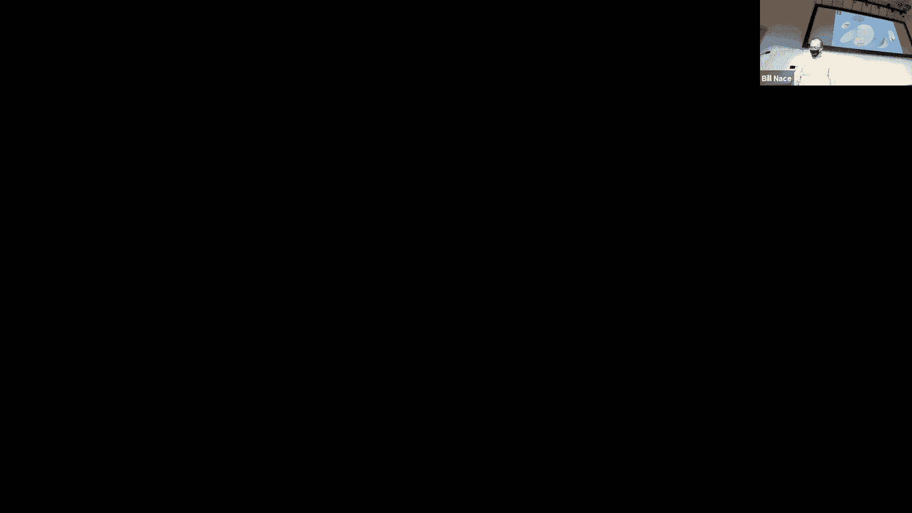
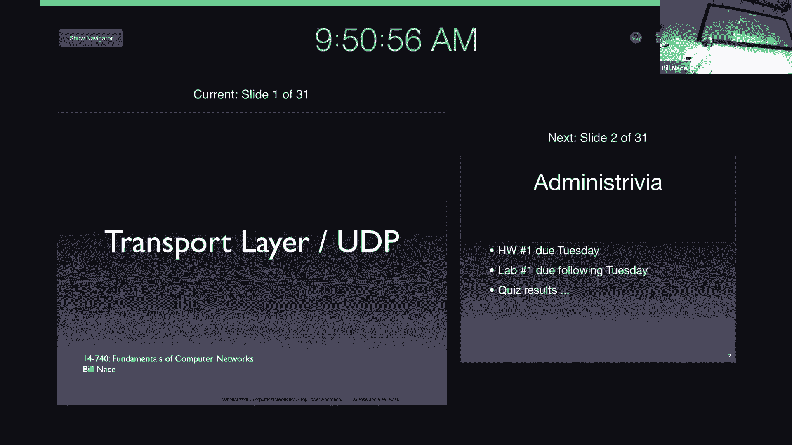
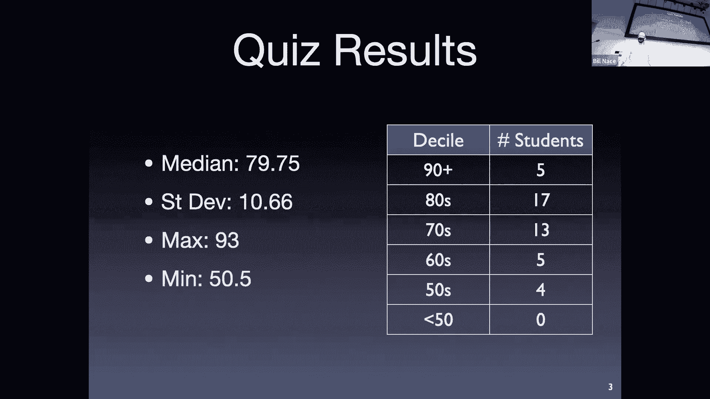
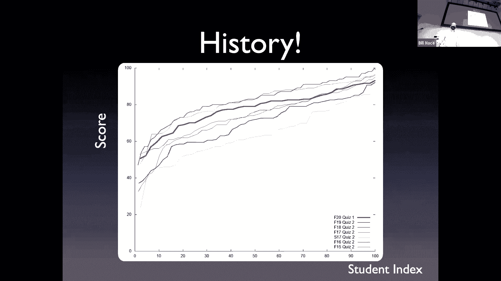
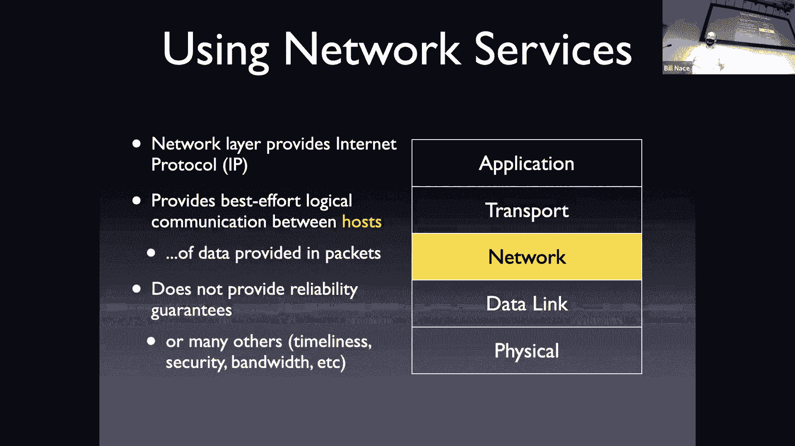
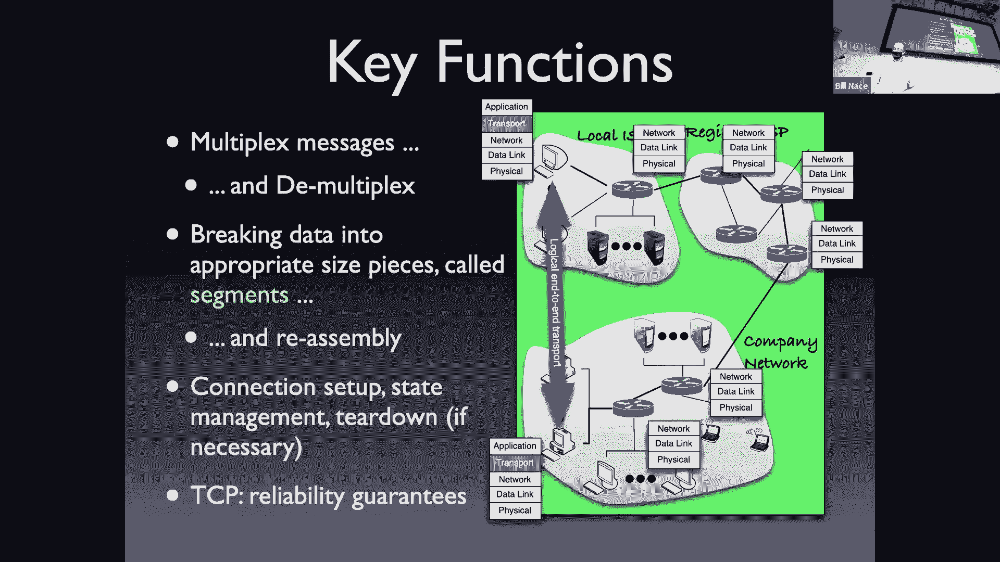
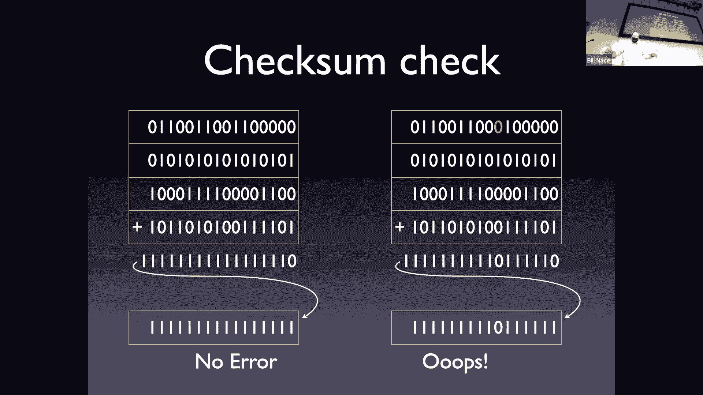
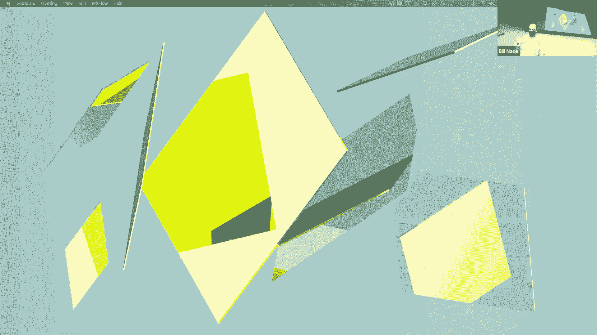
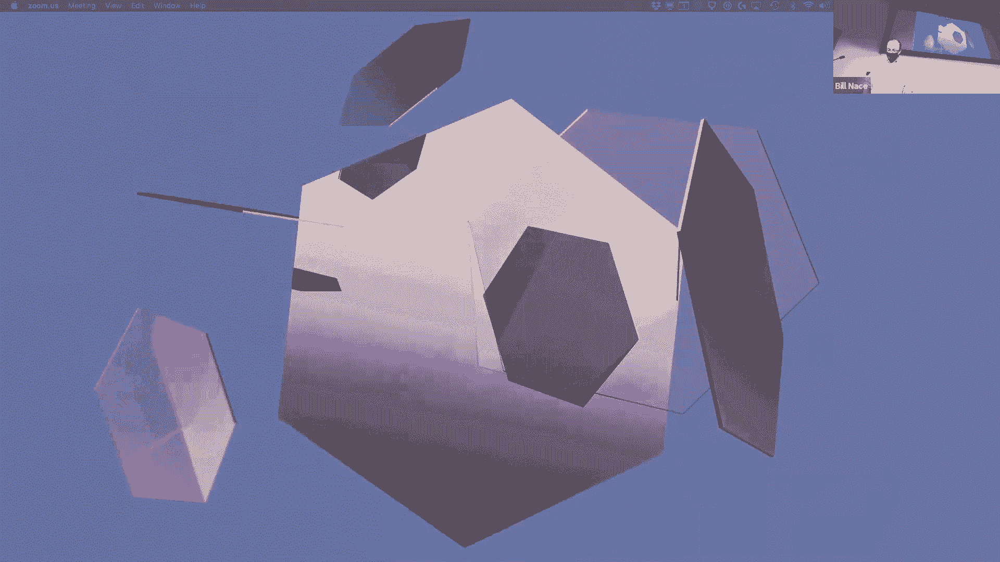

# 卡耐基梅隆大学 14-740 计算机网络 Fundamentals of Computer Networks（Fall 2020） - P9：Lecture 9 The Transport Layer; UDP - ___main___ - BV1wT4y1A7cd

This is 14740， welcome everybody。Guess what， we finished a layer，'m so proud of you。

 we're done with the application layer， also done with a quiz。

Now it's time to move into the transport layer， which will be our target today。

Before we get started with that。

Let me。Com慢中。嗯。对个对个对。

All right， so before we go into the transport layer。

coupleuple things we ought to take a look at one is you've got a couple of things coming due in the fairly near future nothing。

Today or anything like that， but you got a homework coming up Tuesday。And then。

Because I got something， we're not going to have class next Thursday and the lab will be due the following Tuesday。

 so kind of。The next two times we meet， you will have something to have just turned in。

 so beware of that。We went through quiz， which worked better than I expected。

 Canvas actually didn't fall over or anything like that and seemed to be reasonably good。

 at least as far as I could tell if any of you had particular。

Problems or particular things that made the quiz hard to take or something like that。

 I'd appreciate any of that kind of feedback since I wasn't on the other side of it。

 So I don't know what your experience was like。 And if there's anything I can do to to fix that。

 I'd like to。 So please let me know if， if anything came up that you thought could be improved about the quiz taking experience。

We're going to do it again， so it would be a little bit to your benefit and I'd love to try to help out and make that experience better better for you。

The quiz has， so this experience seemed to be okay for everybody。

 we actually had a fairly high median for the quiz 79% and people did pretty well this I think is the first time I've ever put a zero on the bottom of that chart there。

 which is fantastic， just missed it 50。5 was our minimum。

Now these are good statistics I'm sure you see this a lot in many quizzes you're given you know what's the average things like that I think these are are good but don't tell the whole story and so for my own benefit I usually go a little further anyway and so I'm going to share those with you so one of the things I do is I don't like this kind of chart histogram thing because I don't think it gives me enough information and so instead I want to be able to see what everybody's grade looks like not just you know the 17 people in the 80s that they all get 80。

1 you know or they all 89 who knows right that obscures that data。

So what I do is I actually graph out everybody's score。I'm going I draw this line。

What I do is I sort everybody so all all of your scores show up here you are an individual dot on this graph somewhere I the x axis is it's basically your your position in that that sorted list of all the grades I scale it to zero to 100 just so I can compare classm class size is big or small it doesn't obscure anything and then your scores is on the Y axis okay so I can look at this and I can say you know I can actually。

You know here's the median right there you know that grade we have that's the median right there and I can see more detail about what's going on。

 I can you know get a feel for what you know what trouble looks like for some people and things like that。

And so I present this to you as well。 Actually， this is where it really comes in handy for me as I can compare semester to semester to semester。

 So you guys are that red thick line。Okay， and。The past couple semesters taking the quiz are those other lines there。

 and so you're doing okay， which is pretty good you're kind of in the ballpark and actually the tail end looks like we've been doing very well。

 which is I think very good。

Yeah。Please。Don't just say okay， I'm happy with my score and move on okay please take a look at your quiz I normally would be encouraging you to go pick it up。

 but of course we're not doing that go back to Canva， please take a look at what happened。

 what you did wrong things that know mistakes you made and try to learn from those so that hopefully you learn the concept。

RightThis is that feedback loop that is so important for learning I've told you you got some you know you did not answer this question properly。

 go back and think about it， think about why you got that one wrong。

 what is it about your understanding of that concept that's wrong or maybe it was how you took the quiz。

 maybe you didn't understand what I was asking or you didn't express it well or you weren't able to access that knowledge。

 maybe you can look at it now and say of course I knew you know how DNS messaging works and the order of transmission I don't know why I didn't show that during a quiz。

Those I think are really good learning experiences。And they are more helpful。

 the quicker you get to it。 Okay， if you can go look at your quiz today， that's。

 that's why we grade them as quickly as we can。 We want to get this information to you。

While your remembrance of what your experience during the quiz is still pretty good。

 so you can you can actually look at a problem you did poorly on and hopefully remember back。

To two days ago， when you were actually answering that question and be able to say， oh。

 I remember what my mindset was， no wonder I didn't do well on that question。And that feedback loop。

 I think is really important， not only for cementing your knowledge of networking material。

 but also to help you in the test taking process and learn better ways to answer questions in the future。

 okay？So please do that， of course the other reason you want to do that is if you find a mistake。

 we'd like to fix it。Okay， in 14740。Regrade requests are risk free Okay。

 I'm not going to threaten you that I'm going to regrade the entire test or anything like that I don't like bradiding anyway。

 so there's no reason I would do extra of it。If we made a mistake。

 I want to fix it Okay I want you to have been graded properly and so if we did something wrong。

 please point it out to us Okay， make a private post on piazza tell us what you think。

We did wrong and we'll be glad to take a look at it， okay。

It's not a guarantee you'll get points back， but it is a guarantee we will look at it。

And per course policy， you have a week to do that。Another reason to go look at your exam or your quiz quickly。

 okay？All right， today we dig into the next layer down。 We've done the application layer。

RightNow it's time to see how the services that the application layer was depending on are made manifest in the transport layer。

 So we're going to spend a little of time。With transport layer in general。

 and then we will look at one particular protocol， kind of the easy protocol for the transport layer。

So the transport layers mission is to do this connection right the application layer asked us to to get a message from an application running on one computer to an application running on another computer and the transport layer is going to do that that's the mission is to make this connection。

Between these two applications。Okay now I call it the logical connection because obviously there's no direct wire or something like that in general between these applications。

 so it's a logical connection between these applications that's running on you know again my little picture of the internet。

 my little cartoon view between you two particular computers， edge computers。

Right and hosts would sometimes call them， those guys are going to send data and want to be the receiver of data。

 and so the transport layer is going do that connection to make that already happen。Now， of course。

 the transport layer isn't going to do all that on its own right the transport layer is going to make use of the layer below it。

And the services that are provided， the layer below the transport layer is the network layer。

And the network layer is responsible for connecting hosts。

So the network layer is going to make sure that any data I want to send。From my app to that app。

 the network layer will get it from my computer to that computer。😡。

OkayAnd there will be transport layer code running on my computer that will the application will call。

 the application will say， hey， I've got a message for you， here's an HTTP message。

Please send it to that application。And the software on my computer and the transport layer will hand that data to the network layer and say。

 hey， network layer， please get it to that computer。

Not to the application on that computer just to that computer。

 and the network layer will make sure the data gets over to that computer where it will be handed off to transport layer code over there。

 and that transport layer code is responsible for getting it to the right application。

So what do we have to do in the transport layer to do our job to get this this logical connection going Well we're going to end up doing a couple of big key functions。

😡，Things that any transport layer， no matter what protocol you want to do， pretty much have to do。

One of them is we have to be able to multiplex and demx messages。Okay。

 that means that I'm going to have lots of applications running on my laptop and all of them want to send stuff。

And so the transport layer is going to be getting messages from all of them。Okay。

 and so those all kind of funnel into。One transport layer chunk of code。And then as a receiver。

 the network layer is going to give us data for the many applications that are running on our laptop。

 and so we need to demplex that so that we can arrange to get them to the right application。

The transport layer is also responsible for taking messages from the application layer that can be of any size。

Did we have a size limit when we talked about HTTP responses or requests， no。

 they could be as big as we wanted。Right so if somebody has。Has a video we want to watch right。

 We've found some cool thing about Capys on YouTube and we're watching those videos right so that we can feel good about ourselves or who knows right That is a huge chunk of data。

😊，And the transport layer is going to take that single message and have to break it up into pieces。

OkaySo these pieces are going to be sized properly to run on the network。

So we call the segmentation of our data。And we're breaking it up into these pieces now you may recall that the transport layers data type is a segment。

 so we're going to break it up into segments， each of which will will be dealt with individually。

Yeah。Now also some transport layer protocols will do more okay， so in particular'm looking at TCP。

But some protocols will want to give me some reliability guarantees or something like that。

There are other transport protocols as well and so there may be something like some connection set up in tear down that happened in TCP we've all we've seen a little bit of this before this is the please may I connect to you yes you may sort of set of segments that get sent back and forth。

Before we actually start transmitting any data， that doesn't always happen。But in some cases。

 that's going to be a key fact function and managing that connection is going to be a key function of the transport layer。

So let's take a look at these first off is this multiplexing idea I showed you， don't jump too fast。

I showed you this picture。 No， I didn't。Okay， sorry about that。

 This is a slight modification of a picture I showed you earlier。Previous。

 I showed you this picture when we're talking about the layering。😊，Of the network architecture。

 and in each end it just had application layer on top of a transport layer。Okay。

 here we are in the transport layer and it turns out that picture is an abstraction and it's not quite right。

And so we have to recognize that we are likely running multiple network applications on the same hardware at the same time right I'm gonna I would bet good money that there's nobody in here who's only running a single you know whose Zoom is the only application that're running on their computing device okay there are other services。

 you know some of them obvious because you' you you're typing into Google Doc right now taking notes。

Some of them less obvious because you've got some weird service that's keeping time or something else on your computer that every once in a while needs to use the network to do that。

Okay， so we're going to have multiple applications on each end as a sender and a receiver。Okay。

 and so our transport layer has to be able to deal with this idea that there's going to be multiple applications asking me to send data and I'm going to receive data that has to be transmitted to the multiple applications we're connected to。

 so we call this multiplexing and de multiplexing。That means I need to be able to keep track of which application is which I have to have some way of。

Labeling them or numbering them。I'm going to have to have an addressing mechanism for applications。

And so that we can say this data goes to the box on the right instead of the box on the left。

So I need to have that addressing mode。The addressing mechanism that is used in most transport protocols again。

I guess I should say briefly here， when we look at the transport layer。

 there are two big gorillas in the room， TCP and UDP and。

We have to be careful to remember that there are others。Okay。

TCP and UDP are not the only transport protocols out there。

 okay there are others that serve us well to do things like transport real time data and can provide other services。

We're not going to talk in detail about any of those partially because。

There are a lot of them solving individual problems。

 and so you would want to learn about them when you understand that problem。

And also because it's a market share issue， TCP and UDP are 99。

999% of the segments sent in the internet。Okay so they definitely are the big gurillas。

 they're not the only ones though。Okay， so I'm。Probably going to occasionally say that back and forth。

The the addressing method that has been used in TCP and in UDP in our two big gorillas is this idea of port numbers。

 other transport protocols might use different schemes。Okay。

And I should point out these are different solutions for UDP and TCP。

 They just happen to look identical。There's no technical reason that port numbers for both of these protocols are called port numbers。

Or that look the same or that are numbered or anything like that okay the only real reason is because the guys who came up with TCP were also the people used doing UDP at the same time and they said。

This idea is working， let's use it。Okay。So the port number is a number that's going to address an application。

It is a， well， in these cases it's a 16 bit unsigned number， so that tells us it has a range。

 it can go from zero to 64，000 and so on， right？And some of those numbers are set aside for well known services。

 we actually call them the well known port numbers and those are for things like oh。

 your web browser or your web server is probably。Better term a web server has certain port numbers for encrypted and unencrypted connections to it that are well known that we use and we'll see why we need that in a little bit and those tend to be those are the small numbers in the set and then anybody else who needs one some of them at different times will be know other number numbers which are fairly large。

These numbers are managed by a group called the Internet assigneds Number Authority。Okay。

 there's actually a group that does this that basically sells numbers， which is a great business。

you can get into that。And it's their job to make sure that nobody else uses a port number that's a well known port number because that's going to confuse the transport layer。

If you had another application that was using the same port number as a web server。

 then the transport layer would have would be delivering the wrong kind of data to the wrong。

To the wrong application。Okay。You may know some of these port numbers。

 you may have seen some of these before you know port 80 is for HtTP you might or may not know that you can find lists like this all over the place Ina you know since they're running this right it's their responsibility to manage the numbers they're really the right place to go if you want to know you know what is port 237。

a TCP port 237 let's go look it up there but you can find other lists out there as well and this is one of my pet peeves about those many of those lists。

 many of those lists are indexed by the port number。Okay， and they'll say， oh， port 80 is well。

 for TCP， it's this and for port 80， UDP， it's this。

And that kind of conflates these two ideas and makes it look like the port numbers are the same。

Somehow， instead they should be like this， here's how TCP decided to assign its numbers and here's how UDP decided to assign their numbers。

Okay they could have been different right UDP could have decided to use 32 bit numbers and to make them ASI values。

Okay， they just happen to use the same same ones and so if you put the list together you're missing out on that point。

 did you have a question？哦。Like PCP。so the question is， does that mean there's no conflict？

Between a TCP and a UDP value， and it is true， there is no conflict。嗯。

What's happening is you can think of it like you have two different pieces of code running as the transport layer on your machine。

 one for UDP and one for TCP。Okay， and so the network layer when it receives a packet is going to look at it and say oh。

 is this a UDP or is this a TCP or some other protocol。

 let me give it to the right transport layer software okay。

 and then that transport layer software does whatever it wants to do。

And so UDP will look at those numbers。And say， oh， this is port 5，20。

 It doesn't know anything about a TCP number because it's a different chunk of code。

That's really the key that I'm driving towards with this whole point。Okay。

 and a lot of people end up conflating those and thinking。That there would be some conflict。

 but once you understand that these are two separate protocols running completely separately。

 where all details can be completely different。You recognize that。

 of course there wouldn't be a conflict。Because these are two separate chunks of code。哦， question。

All right， so a socket， we're not going to talk a whole lot about sockets， Sockets are the API。

 I'm sorry， presume the question was what's the difference between port numbers and sockets？

Socket is the API that many programmers use to talk to the transport layer。

So when you write your application layer code。There's this library called the Socket Library that you use。

And you it's very much it's actually designed to kind of mimic the file system interface so you use the same calls you open a file descriptor with a socket layer。

 and that file descriptor then becomes the communication point that your application uses to talk to the transport layer。

Okay， that's from a programming perspective， what's going on。OkayAnd and that's because that's that。

That API。In theory， we could have a completely different API。

 right There's no reason you can't send a TCP segment。Skipping sockets altogether。

 it just so happens that that's a very common library for this communication。And Ed。

 did you have a question？I'm writing the levels and implement the SS pipeline to reach the PG。

Abuing packet the when it's not necessarily for that so yeah so the question is about so Edric has the malicious mind who's wondering if he can abuse this and see if he could send stuff to a port that wasn't intended for that port okay and the answer is yes。

 you could send something to a port。Recognize that what happens when you do that is that the network layer and the transport layer are going to take your data and deliver it to this application。

Okay， and so the web server， if you send something to port 80。

 there's nothing keeping you from creating a segment that has any data you want in it。

 go into port 80 okay and therefore anybody who writes a web server would be a fool to actually think that that data has some meaning in it just because it happened to show up and so they're going to have to parse that carefully and make sure that that is a well constructed。

Pie of data in our case we know that should be an HTTP request a response and so if you sent some other data。

 if you sent your email to port 80。The web server was going to look at this and say。

 I don't know what to do with this。 This doesn't have a。You know， the status line， the headers。

 the format that we expect， and so it would throw it out。Yeah。应该80号。Okay， what's。Sorry， I don't have。

I can do this。嗯。Yeah。Yeah。Okay， so the question on Zoom is about Aana specifying TCP and UDP well known port numbers。

So because TCP and UDP are different protocols， Aana does need to know when you go to Aana and say。

 I want to have a port number。They're going to want to know which list to pull it from。

 and you're going to know that because you have created the application。

And you are using one protocol or the other or a third right and so you will go to Diana and say I am building an application that uses TCP and I would like a port number for it and Iana will say sure you know here have 926 or whatever。

OkayAnd they'll put it in that particular list， so yes， these are different different lists。

 different management structures。So Jeremy's asking what about it is possible you can specify in many applications。

 you can specify your important number okay I don't know if you know it。

 you can write in the address bar of your browser， you can write you know www dot。

I and I sudden 40 rocks。I think it's colon and then some number right and that number becomes the port number you're sending that data to。

You can do that all you want， recognize that that won't go to the web server at the place you're looking for unless you've done something special ahead of time so one of the times we often use this is when we're doing some programming on our own we'll run a web server you know on a machine something or we'll do something and we you know I got my flat server running at port 8080 or something and then as a developer I need to remember to send stuff to 8080 because I also have a regular web server running on that machine。

so those are the cases where we want to。Recognize you know。

 you can put whatever number in the port number you want that doesn't mean it's going to in fact that。

Means it's going to get delivered to whoever happens to be looking for that。

And if nobody's looking for the number you chose， then your data is just going to get thrown away。对。

So the port numbers， we have this binding process when in your code。You specify， oh。

 I'd like to use2 TCP and I'd like to have this port number and we call this binding。

 you're going to your application has to somehow get attached to this number so that the transport layer knows。

 oh， this number goes with your code。And we call that binding and you would， you know。

 if you're a web server， you would bind port 80 because that's the the port you have。

That's a sign to you that your data should be arriving on。Okay， in many cases。

 your application uses an ephemeral port， which means I don't know what the number is。

 I just want a port number。 Give me a port number。 And the transport layer will say， oh， well。

 I don't have anybody at the moment who is using a particular number， and they'll assign one to you。

And next time you run the application， you may get a different number from the transport layer。Okay。

 and so oftentimes if you play like land games a lot of times， you got to like， oh， my but。

 I got to connect to my buddy and he's got to tell me what what IP address and what port number。Okay。

 because he's gotten one of these ephemeral port numbers when he ran his the game on his computer， E。

对面诶系。我我。Thisisting on one quarter。Yeah， so the transport so think about what you're saying there right the transport layer is going to get data and it's going to look in the port number field of that data and have to know which application it goes to so the transport layer。

I can sorry once again， for Zoom people， Edric is asking， do these port numbers have to be unique？

Right， and。And I'm saying yes， they have to be unique because the transport layer has to。

 when it gets data， know which single application to deliver this data to。

 and that means the transport layer is going to be careful about the port numbers it gives to anybody。

If somebody tries to bind to a port number， go ahead， try it on your laptop。

 if you're running a web server and you try to bind to port 80， okay you're going to get a failure。

 it's going to get an error message because that port number is already in use。So yes。

 there is going to be a unique mapping but we should be careful that mapping is a mapping at runtime。

And so if you shut down your computer and come back tomorrow and start stuff up， you。

 your software may end up with a different mapping。But at any point in time， yes。

 it's a unique macro。Follow。II don't really know what。But you have multiple browsers running。

On your computer， are they both down？Okay so Ed's saying well I can run multiple browsers right I can run Chrome and I can run Safari on my laptop you know what's going on there what's going on is the port 80 the wellknown port is used for the web server and we use it so that when you first connect you know how to get data somewhere。

So when I first send data to that web server， I send it to port 80， okay？

The browser we use doesn't actually send from port 80 okay。

 this is a destination of a web server somewhere。Okay， so I'm going to start up my browser。

 It's going to。Want to send a message。To port 80， send a segment to port 80。

 it will bind to an ephemeral port on my side as the sender。Okay。

 and it'll be sending from port 2047， and that will get sent to port 80 at my destination。

And now we have communication because that side will find out it needs to reply to me at 2047 if I start up another browser。

 it' will get a different ephemeral court to use。对个。It'll become a little bit more clear。

B through some。Yeah。All right， so that's the addressing requirement that is there because we have multiple applications running on each of these computers。

 the second main thing that transport layer has to do is segmentation。Segmentation is easy。

 I just have to take a lot of data and chop it up into pieces。Okay。

 and so I'm going to you know be handed a message， let's say I got handed 5。

472 bytes as an HtTP request from the application layer。Okay， well。

 it turns out that's too big to fit in a single segment。Okay， for now。

 you're going to have to take my。My word for it that there's going to be some limit to how big the segments are。

 And let's for now， just pretend it's about 1，500 bytes。

We'll learn where some of this comes from later on。

That means my message is too big to fit in a segment so I have to chop it up in a bunch of segments and I'm sure you can almost see the code in your head as you you take this big thing and you chop it into well I'm going to chop it into 1500 bytes because that's my limit so I'm going to take 1500 bytes off the front and then the next 1500。

 the next 1500 and then whatever's left。And so I'll end up making four segments。

 each of those segments will be sent individually。Each of these segments will be sent as a segment。

 so that means you remember our demo， it'll get put in an envelope。

And that envelope is now a segment that envelope has places to write more information。

 that's a header， and so each segment is going to get a little bit of additional data on the front of it。

 which for instance， includes the port number， the address of the application we're sending this to。

 as well as some other information that the transport layer needs to do its protocol job。

And then each of those is a segment and gets sent out。

Now some of you are looking saying oh but that's extra data right wouldn't be better to send it as one big message with just one header on it。

 remember what we talked about way back like lesson two or three for a store and forward network。

 we actually get a lot more performance by chopping up big messages into little so that those little the individual segments can be pipeline through our network。

Okay， so it's okay that we're going to add that overhead。Most of the time。

 if I'm sending one bite in each segment， then yeah。

 that's probably a lot of overhead and I might try to avoid that。But in general， it's not。Okay。

 so these are the things that。Segmenting， addressing multiplexing v multiplex。

 and these are things that。Our general ideas in the transport layer。

they're not unique to any particular protocol。So you now know the transport layer。

 Let's then look at a couple of the protocols in the transport layer。

 And today we're going to look at the easy one。Because it'll fill out the rest of today's time and then we'll get to the hard one。

 which takes， I think is four or five lectures total to cover TCP。So UDP。

 the user datagram protocol so first off datagram right Datagram is that。

Archaic word that I've told you basically means packet。Okay。

 and so what we have is we have a protocol that takes the packet and makes it available for user use。

So user that is your programmer or that your application can now access the packets themselves。

The network layer， data structure。Without too much trouble， and that's the whole point of the UDP。

 it is a very bare bones， no frills transport layer。OkayIt is effectively just giving us access。

To the actual packets that are going to be sent out。

Okay so we're going to make segments in the UDP segments things。

Each of which is going to basically become a packet。

So let's see what do we got we've got a three digit RF 768 okay you don't need to remember the number。

 but because it's three digits that should tell you this is an oldietime RF right this is this is a fundamental protocol it's been around a while because because of its age its purpose what is it trying to do well it's not going to do anything that the network doesn't already do if what it is doing is giving us access to the packets at the network layer。

Then we live with packets at the network layer。That means that we get the same services that the network layer gives us。

 which is。No reliability， okay， the network will do its best。😡，To get our data。

To where it's supposed to go。 But that's all。 And if it happens to get lost along the way。

No guarantees right， you can't go back and say， hey， you know， I paid for better service。

 I should get better service here。Okay， stuff is lost， is lost。OkayIt is connectionless。

 there's no need， so it's not that this is a great feature。

It's more that there's no need for any connection， and this is more in contrast to TCP。

 which does require handhaking and coordination and management of state。

That requires some setup and things like that UDP doesn't UDP is very simple。

 it's just send it last it。So we're basically going to take some data。

We're going to UDP is going to put in a very small header on front of it。

Send it to network layer network layer is going to blast it out it's going to get to where it's supposed to get or not and that's。

Effectively， all there are just a couple tiny little services that UDP gives us。All right。

 and so knowing that。I can now tell you my UDP joke。Okay， which is。

 Id love to tell you you need a P joke。But I'm not sure you'd get it。Yeah。All right。

So why do we have UDP what's its purpose mostly its purpose is it's very simple。

 there's no maintenance if all you want is some access to network services。

 then this gives it to you。Okay the segment header ends up being very small。

 there's not a whole lot of information we need to write on the envelope so there's not a whole lot of additional overhead there's no congestion control that's again in contrast to TCP which we're going to spend at least two lectures。

Looking at congestion control mechanisms for our network。

 none of that happens okay that means you can blast away as fast as you want with UDP you can just keep sending as fast as you want again not usually a feature most people aren't saying oh I love to cause havoc in the network let me throw a bunch of UDP segments out there。

Okay， more that's in contrast to anything else。The real why of using UDP is。

Is because the reliability requirements I have for my application would not be served by TCP。

If you think back to the David Clark paper， this was one of the discussions he had in there where he pointed out that at one point they believed that TCP and IP could be a single protocol there's no need for a separate transport layer and network layer。

 let's just have the network layer。And then they did an experiment with voice communication。

 audio transmission across the internet， and they realized。Luckily， that。The services。

 the TCP like services that were given actually were not useful okay。

 and the reliability that TCP was doing a lot of work to try to obtain。

Actually was bad for that kind of application。TCP's reliability guarantee， it says in TCP。

 you know if you open up the read the user agreement， it says we will get you your segment there。

Okay， in TCP， TCP will， if it detects your segment is lost， it will retransmit it。

So it'll send it and now what it does。It sends exact same data to the exact same host。

That's its reliability guarantee。And those audio applications didn't want that。They said。

 wait a minute， you're actually going to introduce delay。

Okay you're going to wait and not deliver any of my data until you have retransmitted that loss segment。

And I'd rather you threw that away。I would rather have loss than have the delay that comes with it。

There are other applications， DNS， for instance， uses UDP because they don't like that TCP reliability guarantee either。

They still want reliability， DNS still wants your message to get through。Okay。

 but if you make a request to a name server and there's no reply， DNS says。I have a better idea。

Do not retransmit that same request to that same name server， I have a list of reundant name servers。

It would make more sense to retransmit that same data to a different name server。So of course。

 DNS has to program that。In order to gain that reliability。

 that becomes part of the code in the application。Okay。

UDP exists so that we have access to other opportunities。

 other ways around the reliability guarantees that TCP gives us。

 and that's why you're never going to find somebody and you say， oh。

 you know hey TikTok I see you wrote your code and you did this Why did you use UDP I don't know that TikTok uses UDP whatever application right you're never going to find somebody say。

 oh yeah we use UDP because the segment header is small or we use UDP because there's no setup for connection。

Those are true statements。Okay but usually the reason you use UP is because of whether you have different reliability guarantees。

Or not， then TCP would give you。请。Because of that， we often see UDPs for streaming media。

Zoom is using UDP right now to send my data from camera and microphones to your laptops。

That's because the delay is worse than a loss right and other applications as well。

 DNS is probably the until COVID DNS was the biggest user of UDP， I don't know if that's still true。

But with so many streaming things going on。All right， so what does the UDP protocol look like， Oh。

 look at this boxes right， Once again， I have a format。

That is part of the protocol every protocol we're going to have to have a format for our message so we understand how to put the bits together to send our the information we want to send and from here on out。

 except for HtTP， all the protocols we have， I think for the entire course are fixed format ones where I have boxes of certain sizes。

And so I have a block to 16 bits wide for your source port number。

I have a box to 16 bits wide for the destination port number。Okay。

 those are those addressing things we talked about previously。 so this is what I mean。

You could imagine as a UDP designer back in the 70s。

 you could imagine that you might want something other than 16 bit numbers there right you could have had a string right you could write web server is my destination port。

Okay， but we didn't instead we have a 16 bit place in the protocol to put a port number。

So those are pretty easy there's a length field， 16 bits as well。

Every time you see a length descriptor in any protocol， and you often will。

There are two questions you have to ask yourself。Because you'll get different answers with different protocols。

The first one is length of what？And the answers can be length of my header。

Length of my payload or length of the entire thing that is hetero or plus payload。Okay。

 so here we see length。As one of the fields in our protocol。

 the length is the length of the entire segment that is。Header plus data， plus payload。Okay。

 so that's the first question。The second question you have to ask yourself is what is it measured in？

Okay， and right now you're looking at a slide that says it's measured in bytes。

And you may be wondering， well， of course， it's measuring bys。

 isn't that how we always measure the size of。Of data values that we put places。

 and I'm here to tell you， no， we're going to see some other examples， some other， in fact。

 some weird examples in different protocols through the semester。Okay， we're going to see。

Multi bite words as our unit of count。 we're going to see， in fact， large multi bitete words。

 We're going to see 8 by chunks as our unit of length。And so we always。

 in order to understand that field， we need to know， what are we counting and what are the units？

And then finally， there is a check some。Okay， the checksome is the 16 bit number there。🤧Check some。

 What's it for well。Its goal is to allow us to detect if there are any errors。😡，Specifically。

 the destination is going to detect when it receives this segment。

 it's going to be able to look at this checkum and figure out whether any bits got flipped as it traveled through the network。

So it's a detection mechanism。F flip bits in this case。

There is an RFC that specifies exactly how this should be implemented and the implementation is chosen as one that's easy to run in software。

Okay， and so that's fine because our destination host is going to be you know。

 a computer laptop that needs to run some software to be able to do this checking。Yes sir。

so the question is， okay， what happens if there's an error， what happens if it is flipped。

 the destination receives this， looks at the check some and says， oh， there's an error here。

 what does it do， it has no choice。Okay， all it can do is throw it away。

 It cannot trust any part of the data it receives。Okay we'll see in a minute when we look at this you it's not that we can look at it and say oh the error is in the length field so we can fix that up or anything like that。

 we don't know where the error is could be in the address field and the port number right that would be very bad because I would end up we'd give it to the wrong application so instead you just throw away can't do anything else。

Okay。And you're right， UDP， I throw it away， it's not going to get retransmitted， it's lost。

So that's going to be a source of loss of these segments is a bit error is going to lead to some sort of source of problem。

Notice that this is an end to end detection of bid errors right the checkum is done as math at the sender on the data that is being sent。

On the segment， the whole thing as it's being sent。

 and the receiver is doing math on the entire segment that was received to figure out if there are problems。

So we don't know where the problem might have shown up if there is an error。

 okay but the guarantee is an end to end one here and remember back to the salttzer paper and the end to end discussion that covers not just each individual data link but also like the software and hardware and each router as our segment got transmitted throughout the network。

嗯。So how do we do this well on the sender side， the algorithm basically breaks down to。

Take a look at all of the words in the segment， look at them as 16 bit words。Okay。

 and just add them up some check some。 we're going to add。The sum of all of these things。Now。

 this is a。Fixed 16 B addd。Which means that we may have results when we add two 16 bit numbers together。

 we may have numbers that are bigger than 16 bits right and we call that a carry out。

We've got an extra bit， we not a 17 bit answer， what do we do with that extra bit？

Okay for the check some algorithm， you basically wrap that bit around to the least significant position and add it in。

 keep adding it。Okay。And then when you have this sum。

 when you have computed the sum of all the values in the entire segment。What do you do， well。

 you take the complement of it。Compment is a funky word that basically just means flip the bits if it was a zero。

 make it a one， if it was a one， make it a zero。Okay， flip all those bits。

And that's the value that you fill in that space in the header。Okay。

 so we're going to add up everything， we're going to source port number。

 destination port number length。Just add them up obviously at that point we don't have a check some so we don't do there。

 but we go on to the data first 16 bits of data add it second 16 bits of data add it you keep going until you're done。

Flip all the bits， put the answer into that check some field。And then you send that segment。

On the receiver side， when the receiver gets a segment。

 it needs to verify that there were no bits the got flipped along the way。

And so it has to do some math。Okay now。It could do the same sort of math right it could take the source port number destination port number。

 add it to the length， add it to the data 16 bits by 16 bits and then at the end compare if I take this sum oh yeah flip the bits if I take this recalculated check some I could compare it to。

To check something that got sent and see if they're the same that would work。That's fine， okay。

However， the way this works out and the reason it's designed this way and the reason the bits are flipped。

 that lets us actually at the receiver just add up all the bits。Okay。

 let me add up the source port number， the destination port number， the length。

 let me add the check sum， just keep adding everything， including the check sum。

Do the same wrapping around。And the result should be all ones。Okay， the result should be。

YouWhat is effectively a negative one value， you're adding everything up coming up with negative one。

对。So that that tends to be a little bit easier than adding up a bunch of stuff and then doing this comparison at the end。

 so okay great， my result is supposed to be all once。Here's an example of how it would happen。

 let's imagine in this case I have an extremely short segment right I have just three。

 16 bit words I'm sending。😊，Okay， and so yeah， source port destination port length are in there somewhere。

OkayI'm taking these 16 bit values and I add them up。

OkaySo I take the first two over there in the top right， I add up zero plus one is one。

Z plus zero is zero，0 plus one is one， et cetera， I keep going。

 this is two bit math but it shouldn't， I mean， it uses the same rules you live learning in kindergarten for base 10 math。

Okay， if you ever get one plus one is two， you can't write it two so you have to carry one into the next column。

And I'm going to end up with this value， which is still a 16 bit number。

I'm going to take that number and I'm going to add the third。16 bit word of my message to that right。

 so now I'm1 plus zero is 1，0 plus zero is0，1 plus one is see there we go one plus one is0。

Carry one into next column that carry plus 0 plus 1 and 0。Okay， so I end up with this at this point。

 I now have a 17 bit number。 and so that one has to get added in。To what I have here。

 and so I end up with that 16 bit pattern， 01，0，0，1，0， etc cetera。

That's the sum of all the 16 bit words in my entire segment。And then flip all the bits。

And so I end up with10，11， instead of 0100 starting out， I have 1011 because I flipped all the bits。

That value now gets put into the checkum field of my segment。And I send to the other side。

The entire segment， including that checks some value。And so the receiver is going to check this。

 the receiver is not going to get four 16 bit words， right the three we start off as our message。

The receiver is going to get those， but he's also going to get this check some。

So it's going to end up with four， 16 bit words。That we then add together。Okay。

And I've done it as a single step now， instead of individual。

Binary operations so0 plus1 plus 0 plus1 is a zero。Okay， carry the one。

 one plus zero is zero is zero is one。And I end up with an extra one， which I add in。

 so I end up with all ones。That means there's no error。嗯。But if there was an error。

 so I have chosen mostly at random a single bit to flip。

 I could have chosen any of the 16 bits in any of those four words。

so I could have chosen any of those that I want， I happen to choose that pink one up top and I flipped it。

 so if you look over you'll see that that bit was a one， I have made it a zero。

 the pink zero up there。And now when I do the math。I do not end up with all one。

And so therefore I would be able to detect and I'd be able to say， oh。

 there was an error here in this segment。Question in the back。Yes， excellent， thank you。

 what if there were two bits flipped？You will see people who will tell you that the checkum algorithm does not detect two bits flipped。

Right。But now you and I understand the algorithm， if I flipped a second bit there so if instead of that pink one being the only zero in there that I flipped。

 let's imagine that I also flipped on the fourth word down the first bit as a one。

Let's imagine I flipped that also。would I end up as a result？Would it end up with all ones？No。

 I'd have two places with zeros in it。I think， right？So you still can detect twobit errors。😡。

Sometimes right so you ask the question， clearly you have a scenario in mind。What's your scenario？

没有完。Okay， so you're flipping the last bit， the least significant bit of the first two words。yeah。

 so that's the situation that it will not detect。Because that's kind of like。

 it's offsetting penalties， right， I would， I would， instead of adding 0，1，0，1， I would add 1，0，0，1。

 and I'd end up with the same answer。All right， so yes， check some has limits。Okay。

 check some will detect any single bit that's flipped。

And it will detect some twobit situations that are flipped。Okay， not all。Okay， but some。嗯。

What do you think good enough， clearly those who designed unDP looked at this and said， good enough。

As with lots of engineering， this is a trade off。You can do a better job。 You can detect more errors。

😡，There are coding schemes that would allow you to detect more errors。😡，Okay。However， to do that。

 you would end up paying two costs。Okay one of them is you would end up having to send more data in our case。

 we send a single 16 bit word no matter how big the segment is。Okay。

 so our cost is 16 bits to get this error detection happening。

If I wanted to be able to detect two bit errors， I would end up sending more data。😡，And secondly。

 I would have an algorithm that would require more performance cycles。Addition is pretty easy。Okay。

 so having to add， make one ad for every 16 bit value in my entire segment， that's pretty cheap。Okay。

If you wanted to detect more， you'd have to do more okay and so that's the trade off that the designers of UDP had。

They said， you know。How often do multiple bits get flipped。

 they probably did some experiments and had some some guesses as to that。

 there's actually some interesting math you can do。Okay。

 to get a feel for where your errors can show up， they probably ask themselves。

What kind of errors do we see in the network， it turns out most of the errors are bursty。

And so if you're going to have a bunch of bits get flipped。

 then they're probably all in the same word。Okay， so we'd want to be able to detect those as well。

 so you go through that analysis and the designers of UDP said this is good enough。Okay。

 it's not perfect， but it's good enough。Okay， and further。

If you have a situation where you don't think this is good enough。

 you're always welcome to in your data that you're sending， do more of that。That error detection。

Okay， so you can go ahead and have your own error detection algorithm on the data in the payload of the UDP segment。

Okay， if you wish。And it turns out to be good enough， I have heard people go back and forth on this。

 I do know designers of long lived algorithms。If you're going to have a connection that is open for weeks and you're going to send a lot of data down it。

 you're going to recognize that some of that's going to get through the checkum algorithm。

Just because you're sending so much data and there's a probability that the error is going to check some process is going to fail and it's going to let faulty data through。

In that scenario， you add more reliability on top of that。Okay。33手示的哪边？就是。看快。Okay。

 so Kik says I was supposed to receive a packet。Cararcticum， guessing you mean segment。

You're supposed to receive a segment and recognize that the length field。Right。

 is one of the pieces in here， right， and the length field。

Is being transmitted and the length field could be wrong， okay and yes， that could happen。

So I send out 42 bytes in my data field， which gets added with the bytes of my header to come up with my length field。

 when the receiver gets it， they look at it and they say， oh， the length is 1017 bytes。Okay。

 because of it got flipped。In transmission is that a bad prop situation。

 certainly that's a bad situation right the receiver is going to be very confused and actually going to get my real data plus a bunch of junk data from out of the memory of the computer。

Okay， which probably isn't good。Okay now the real question is。

 is this going to happen and the answer is well， remember the length field is also part of the calculation for checkum。

And so if there's a bit error in the length field， it will be get caught by the checkone algorithm。

Okay， and there and therefore， that change from 42 to。Whatever I said， right？

That would confuse us instead we detect that as an error and we throw the segment away。

Does it makes sense， Verick。So yes， it could happen。

And the checkum situation will handle that just like there could be a bit error in the source port in the destination port。

 there could be a bit error in the checkum itself。That's why all of those are included in the math at the other end。

Okay。That true。身证对。佢先佢。一个。咁呢啲细剧啲都嘅上去。And the second。就可以得注费。A是必项规定。それも。If we check in there。

And because of that area， length is something that's like。Large。

 iss it possible that throwing the away that Eric happy。mother。

So Edric is worried that that we might have an error that would cause us not just to throw away this segment。

 but other segments in the connection that are following okay and I would like to point out in UDP I don't have a connection there's actually no relationship between the order of segments we get or anything like that where each segment is handled individually。

Okay， so if I have an error in one segment， I throw it away。Okay。

 that's not going to affect whether I throw away the segment behind it or not Okay now what you may be thinking is。

 oh， but my application data now has a hole in it。Right。

 let's imagine that I sent that I asked UDP to send out you know， a video that has。You know。

 lots and lots of data in it， and now that middle trunk is missing。Okay， because that。

Particular segment had an error in it and got thrown away。Is that a problem， yes。

 that's a problem okay， and if you think it's a problem in your application。

 then you should not use UDP。Because you used a protocol that provided you no guarantees。

And so therefore， you have to be willing to accept the fact that your application data may have a hole in it。

Now you can accept that a couple ways， one is you put in your own handling of that application data and you end up putting your own like little header piece inside each of the segments that get sent so that you end up being able to notice that that one's missing and you'll be able to you know。

 send a message back and say， please retransmit that or something。

AndOr you have a scenario where who cares？Maybe I'm streaming data over Zoom。

 we're streaming a whole bunch of data and if a chunk gets missing。well， zoom just。

Stalls for a second shows you the same frame of video twice。Okay， and you， as the user。

 probably just look at that and say， oh， that's Zoom being Zoom。Because that's how it's built。

Is that a satisfying answer？有没有问题。In throwing the away inherent segment。

 is it possible to throw away。Different segment as well。When that's like related to that。

Let's say that length was correct。 There's only like a five。

Like a segment but that 0 away all I see so you're imagining that these are stacked in memory somehow and on the receiver side and therefore when I and so I don't know that there's a boundary between segments。

 And so if my length is。Wrong， I might end up trusting that length value for how much data to throw away。

so a couple things recognize that if I have to throw away the segment。

 I can't trust the length for anything， it could be that I don't know where the error is。

 so I can't look at that and say oh， I know this is a bad segment and I know it is 47 bytes long so therefore I will throw away 47 bytes。

Okay。That also is not a problem because we're going to end up knowing what the segment boundaries are okay the network layer when it receives a packet is going to pull our segment out of that packet and that's one bundle of things that it will give to the transport layer so the transport layer on side its software is basically getting these interrupts from the network layer each one of which is an individual segment and so it already knows what the boundaries are for and has to because it。

That's now what it has to check some over。So it has to know where to stop that process。对。O，这个。7。はこと。

Oh yes， so that in UDP， I didn't explicitly say this， but in UDP。

 the segments may end up being out of order at the other end。And again， you have to not care。

If you're going to use UDP。Yeah， the network is， we'll do its best。But in the network。

 packets get lost。Packets get duplicated and packets get put out of order。Okay。

 and that means in UDP， our segments can get lost。Our segments can end up duplicated。

 our segments can end up out of order， our segments can have bit errors also because the network has bit errors in it。

Okay， and of all of those。Single bit errors are the only thing that UDP is going to protect us against。

 So if you， if you think it's a bad idea that you get multiple versions of your data at the receiver。

Then you need to either detect it yourself or use two TCP。Okay。Okay。Alrighty then。

Here we are at the end of our first。Transport layer and just a few things you should be able to do right so the first of these objectives comes from that the the theory of the transport layer right these are the things the transport layer has to be able to do。

The next two come from our understanding of UDP， right。

 So you should be able to explain why one would use UDP what the disadvantages are， right， And。

 for instance， your data may end up being out of order。

You have to deal with it right and whether that's a good thing or not and you should understand the checkum calculation algorithm and be able to perform it obviously I'm not going to say here are 172 bytes in the segment。

 please do a check sum on them。Please do it by hand or anything like that。

 but you should at the level we have here you know。You should be able to do that math。Sort of thing。

 okay。Any other questions？All right， lots good questions today。 great， thank you very much。

 I will see you next week with your homework having just been completed right everybody have a great weekend。

😊。

Bye拜e，我事听。H。

。

Yeah。