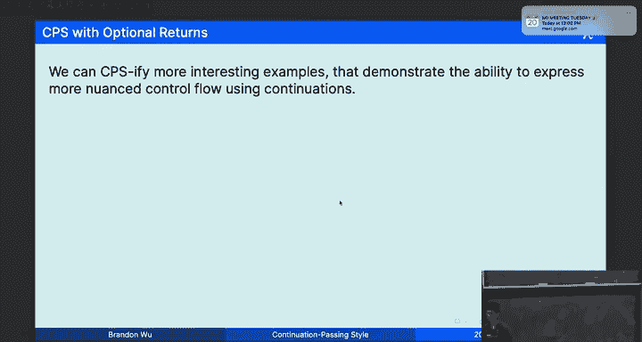
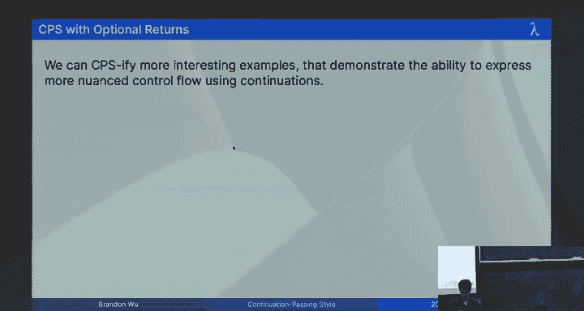
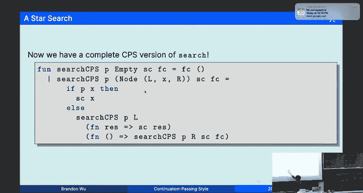
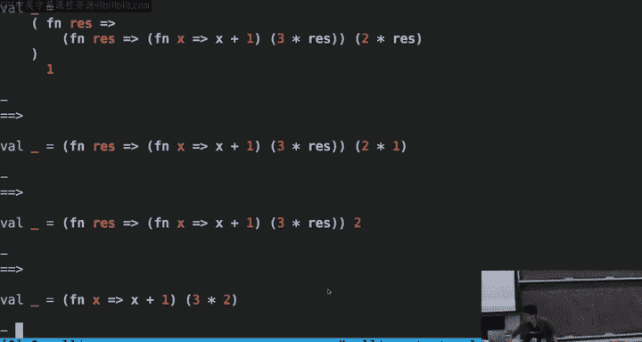

# 函数式编程：11：续延传递风格 (Continuation-Passing Style)

在本节课中，我们将学习一种称为“续延传递风格”的编程技术。我们将了解什么是续延，如何将普通函数转换为CPS风格，以及这种转换对程序控制流和尾递归的影响。通过本教程，你将能够理解并手动进行简单的CPS转换。

## 概述：从管道操作到显式控制流

上一节我们介绍了高阶函数和管道操作符。管道操作符（`|>`）允许我们以更线性的方式组织计算，例如 `x |> g |> f` 比 `f (g x)` 更易读。

然而，当我们需要多次使用同一个中间结果时，管道写法会变得笨拙。例如，计算一个字符串列表（代表数字）的平均值：

```sml
(* 原始写法，需要lambda来绑定列表以便复用 *)
["1", "2", "3"]
  |> map Int.fromString
  |> (fn l => (foldr op+ 0 (Option.valOf l)) div (length l))
```

这种写法不够“显式”，因为操作的顺序依赖于我们对SML求值顺序的理解。我们希望每一步操作都清晰明了地写在单独一行。

我们可以通过引入显式的lambda表达式来改进：

```sml
["1", "2", "3"]
  |> (fn l1 => map Int.fromString l1)
  |> (fn l2 => map Option.valOf l2)
  |> (fn l  => foldr op+ 0 l)
  |> (fn sum => length ["1", "2", "3"])
  |> (fn len => sum div len)
```

现在，每个操作都在单独一行，并且中间结果都被显式命名。但这样写非常冗长。

## 核心概念：什么是续延 (Continuation)？

一个“续延”本质上是一个函数，它告诉你“接下来该做什么”。它代表了计算剩余的部分。

在代码中，续延就是一个额外的函数参数（通常命名为 `k`），原函数不再直接返回结果，而是将结果“传递”给这个续延函数。

**公式**：对于一个类型为 `t1 -> t2` 的函数 `f`，其CPS版本 `f_cps` 的类型变为 `t1 -> (t2 -> 'a) -> 'a`。它接受一个原始参数和一个续延 `k`（类型为 `t2 -> 'a`），并承诺会调用 `k` 于其结果之上。

**代码示例**：加法函数的普通版本与CPS版本。
```sml
(* 普通版本 *)
fun add x y = x + y
(* CPS版本 *)
fun add_cps x y k = k (x + y)
```
CPS版本 `add_cps` 接受参数 `x`, `y` 和续延 `k`，它计算 `x+y`，然后将结果传递给 `k`。

## 从管道到“酷”函数 (Cool Functions)

上一节我们通过管道和lambda实现了显式控制流。我们可以进一步消除管道，将“接下来要做的事”（即lambda）直接作为参数传递给前一个操作。我们称这样的函数为“酷”函数。

**规则**：一个“酷”函数接受一个续延 `k` 作为额外参数，并保证将其计算结果传递给 `k`。

之前计算平均值的例子可以重写为使用“酷”函数的形式：
```sml
map_cool Int.fromString ["1","2","3"] (fn l2 =>
  map_cool Option.valOf l2 (fn l =>
    foldr_cool op+ 0 l (fn sum =>
      length_cool ["1","2","3"] (fn len =>
        (sum div len)))))
```
其中，每个 `_cool` 函数都遵循 `f_cool ... k = k (f ...)` 的约定。通过引用透明性，可以证明这与之前的管道lambda版本等价。

## 为何需要CPS？尾递归的挑战

你可能会问，为什么不直接用 `let ... in ... end` 绑定中间值？那样可读性更好。
```sml
let
  val l1 = ["1","2","3"]
  val l2 = map Int.fromString l1
  val l  = map Option.valOf l2
  val sum = foldr op+ 0 l
  val len = length l1
in
  sum div len
end
```
对于简单的顺序计算，这确实很好。但问题出现在**递归函数**中。

考虑阶乘函数：
```sml
fun fact n =
  let val rec_res = fact (n-1)
      val res = n * rec_res
  in
      res
  end
```
这种写法**不是尾递归**的！因为在递归调用 `fact (n-1)` 之后，我们还需要执行乘法操作。这会导致栈空间随着递归深度线性增长，效率低下。

我们希望有一种系统化的方法，能为任何函数（包括递归函数）生成尾递归版本。这就是CPS风格的核心目标之一。

## CPS三原则

一个真正的CPS风格函数必须满足以下三个原则：
1.  **酷原则**：它接受一个续延 `k` 作为参数。
2.  **尾调用原则**：所有对自身（递归）或其他CPS函数的调用都必须是**尾调用**（即该调用是函数体最后执行的操作）。
3.  **续延尾调用原则**：续延 `k` 只能在尾调用位置被调用。

满足这三点的函数，其所有递归都将是尾递归，从而可以被编译器优化为循环，避免栈溢出。

## CPS转换实战：阶乘函数

让我们将普通的阶乘函数转换为CPS风格。

**原始函数**：
```sml
fun fact 0 = 1
  | fact n = n * fact (n-1)
```

**转换步骤**：
1.  **添加续延参数**：函数类型从 `int -> int` 变为 `int -> (int -> 'a) -> 'a`。
2.  **履行约定**：在所有原本返回结果的地方，改为调用续延 `k`。
3.  **处理递归调用**：将递归调用 `fact (n-1)` 替换为一个“占位符”，然后将整个剩余计算包装成一个新的续延，传递给递归调用。

**CPS版本**：
```sml
fun fact_cps 0 k = k 1
  | fact_cps n k = fact_cps (n-1) (fn rec_res => k (n * rec_res))
```





**关键理解**：`fn rec_res => k (n * rec_res)` 这个续延就是一个“待办事项清单”。递归过程不是在“计算后记住要做什么”（非尾递归），而是“提前写下接下来所有要做的事”（尾递归）。递归调用 `fact_cps` 的唯一任务就是带着这个越来越长的“待办事项清单”继续深入。当到达基础情况（`n=0`）时，我们开始逐项执行这个清单。

**执行追踪**（以 `fact_cps 3 (fn x => x)` 为例）：
1.  `fact_cps 3 k0` 调用 `fact_cps 2 (fn r1 => k0 (3 * r1))`。新续延 `k1 = fn r1 => k0 (3 * r1)`。
2.  `fact_cps 2 k1` 调用 `fact_cps 1 (fn r2 => k1 (2 * r2))`。新续延 `k2 = fn r2 => k1 (2 * r2)`。
3.  `fact_cps 1 k2` 调用 `fact_cps 0 (fn r3 => k2 (1 * r3))`。新续延 `k3 = fn r3 => k2 (1 * r3)`。
4.  `fact_cps 0 k3` 调用 `k3 1`。
5.  展开 `k3`：`(fn r3 => k2 (1 * r3)) 1` => `k2 (1 * 1)` => `k2 1`。
6.  展开 `k2`：`(fn r2 => k1 (2 * r2)) 1` => `k1 (2 * 1)` => `k1 2`。
7.  展开 `k1`：`(fn r1 => k0 (3 * r1)) 2` => `k0 (3 * 2)` => `k0 6`。
8.  最终 `k0` 是初始续延 `(fn x => x)`，得到结果 `6`。

可以看到，递归调用是尾调用，所有计算都通过续延的构建和消解来完成。

## 处理可选类型：成功与失败续延

对于返回 `option` 类型的函数，CPS转换略有不同。因为结果可能成功（`SOME v`）或失败（`NONE`），所以我们使用两个续延：成功续延和失败续延。

**原始函数**（在树中查找满足谓词p的第一个元素）：
```sml
datatype 'a tree = Empty | Node of 'a tree * 'a * 'a tree
fun search p Empty = NONE
  | search p (Node(l, x, r)) =
      if p x then SOME x
      else case search p l of
              SOME y => SOME y
            | NONE => search p r
```

**CPS版本**：
类型从 `('a -> bool) -> 'a tree -> 'a option` 变为 `('a -> bool) -> 'a tree -> ('a -> 'b) -> (unit -> 'b) -> 'b`。
```sml
fun search_cps p Empty succ fail = fail ()
  | search_cps p (Node(l, x, r)) succ fail =
      if p x then succ x
      else
        search_cps p l succ (fn () => search_cps p r succ fail)
```

**转换要点**：
*   原返回 `NONE` 处，改为调用失败续延 `fail ()`。
*   原返回 `SOME v` 处，改为调用成功续延 `succ v`。
*   在原 `case ... of` 进行分派处，将两个分支的逻辑分别转化为新的成功/失败续延，并传递给递归调用。



**自定义行为**：CPS风格的强大之处在于，我们可以轻松定制成功或失败时的行为。
```sml
search_cps (fn x => x mod 2 = 0) myTree
           (fn res => "Found: " ^ Int.toString res) (* 成功续延 *)
           (fn () => "Did not find")                (* 失败续延 *)
```

## 总结

本节课我们一起学习了续延传递风格。
*   **续延**是一个代表“接下来做什么”的函数参数。
*   **CPS转换**是一种将普通函数重写为总是接受一个续延参数，并通过尾调用传递结果的机械过程。
*   **核心目的**是实现尾递归，优化控制流，并允许调用者自定义计算完成后的行为。
*   **转换规则**包括：添加续延参数、将返回值替换为续延调用、将递归调用后的处理逻辑包装成新的续延。
*   对于返回 `option` 的类型，我们使用两个续延（成功/失败）来处理不同的结果分支。



虽然手写CPS代码通常可读性不佳，但理解其原理对于掌握函数式编程的控制流、实现编译器优化（如尾调用优化）以及理解某些高级编程模式至关重要。它是一种强大的理论工具和编译技术。