# 函数式编程：12：异常处理 😊

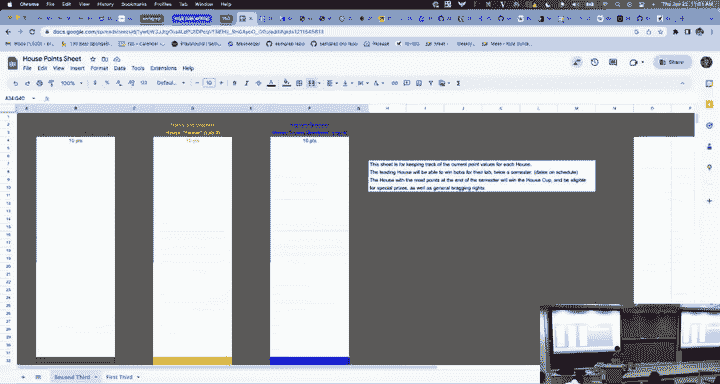

在本节课中，我们将学习SML中的异常处理机制。我们将了解什么是异常、如何引发和处理异常、如何自定义异常，以及异常如何影响程序的控制流。通过本课，你将掌握在函数式编程中安全、有效地使用异常的方法。

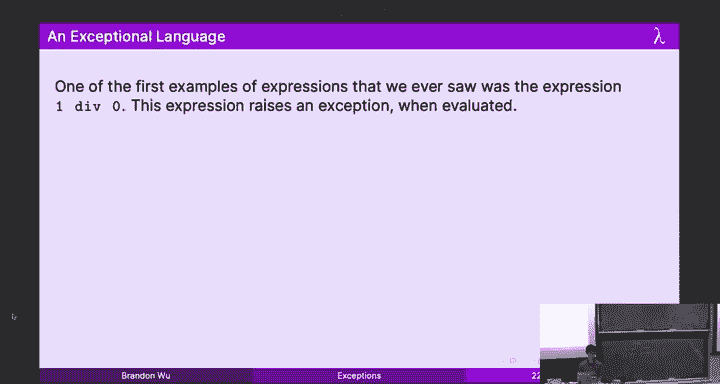

---

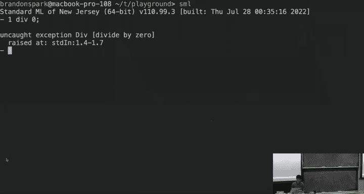

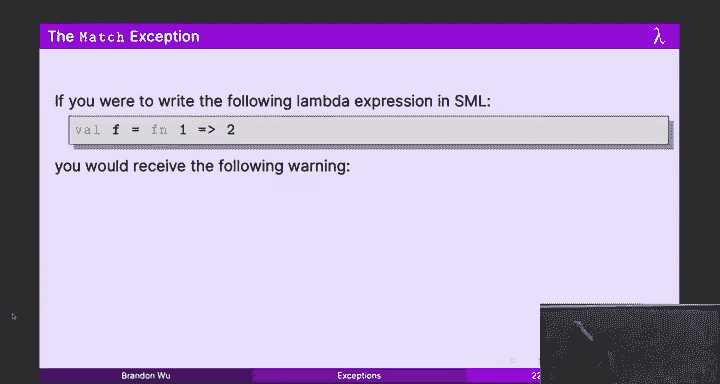

## 什么是异常？ 🤔

上一节我们介绍了表达式的不同行为。本节中我们来看看第三种行为：引发异常。

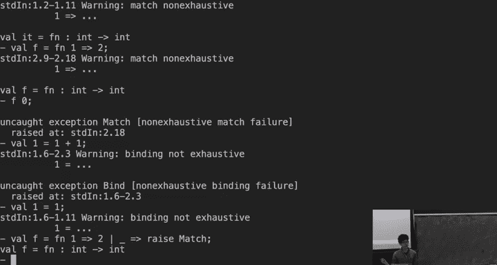

在SML中，表达式有三种可能的行为：
1.  求值为一个**值**。
2.  **无限循环**。
3.  **引发一个异常**。

例如，表达式 `1 div 0` 不会求值，也不会无限循环，而是会引发一个名为 `Div` 的异常。异常为我们提供了一种便捷的“逃生舱口”，当无法返回一个合理的值时（例如除以零），程序可以中止当前计算。

除了 `Div`，SML中还有其他内置异常，例如：
*   **`Match`**：当进行非穷举的模式匹配时引发。
    ```sml
    (* 这个函数只匹配输入为1的情况 *)
    val f = fn 1 => 2
    (* f 2 会引发 Match 异常 *)
    ```
*   **`Bind`**：当绑定尝试失败时引发。
    ```sml
    (* 尝试将值2与模式1匹配，失败并引发Bind异常 *)
    val 1 = 1 + 1
    ```

从概念上讲，一个非穷举匹配函数 `fn 1 => 2` 可以看作是 `fn 1 => 2 | _ => raise Match` 的简化形式。

---

## 使用异常 🛠️

我们已经看到内置函数如何引发异常。现在，让我们看看如何在代码中主动引发和处理异常。

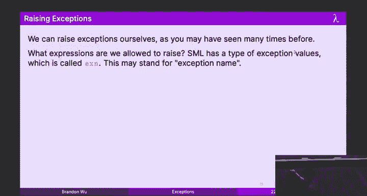


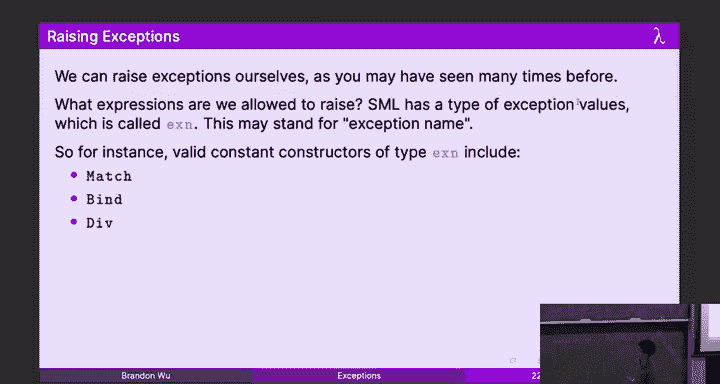

### 引发异常

我们可以使用 `raise` 关键字来引发一个异常。异常本身是 `exn` 类型的值。
```sml
raise Div
```
`raise e` 表达式的类型是任意的（多态类型 `'a`），因为它永远不会正常返回一个值，所以类型系统允许它适配任何上下文所需的类型。

### 处理异常

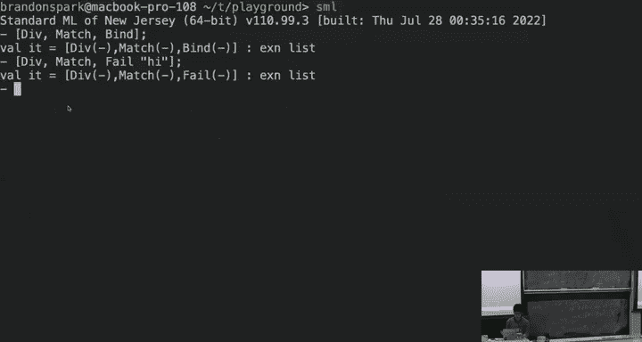

为了从异常中恢复，我们使用 `handle` 构造。它的语法类似于 `case` 表达式。

以下是 `handle` 的一般形式：
```sml
e handle p1 => e1 | p2 => e2 | ... | pn => en
```
*   `e` 是可能引发异常的表达式。
*   每个 `pi => ei` 是一个处理分支，`pi` 是 `exn` 类型的模式，`ei` 是处理表达式。
*   **关键规则**：表达式 `e` 和所有处理分支 `ei` 必须具有相同的类型。这是为了保证无论是否发生异常，整个表达式的类型都是一致的。

**异常传播**：如果表达式 `e` 引发了一个异常，并且该异常与某个处理分支 `pi` 匹配，则整个 `handle` 表达式的值就是对应的 `ei` 的值。如果没有匹配的分支，异常会继续向外层传播。

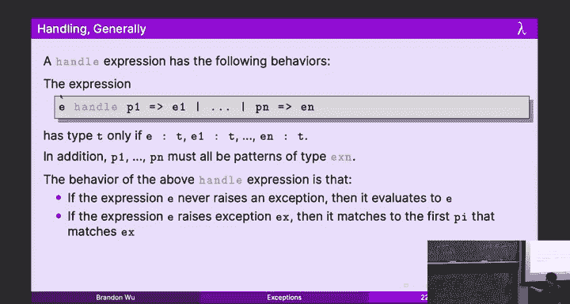

让我们看一个例子，它安全地计算列表的平均值，并在列表为空时给出友好提示：
```sml
fun averageGrade (L: int list) : string =
    let
        val avg = (foldl (op +) 0 L) div (length L)
    in
        "Your grade is " ^ Int.toString avg
    end
    handle Div => "Error: no grades found"
```
*   如果列表 `L` 非空，计算正常进行。
*   如果 `L` 为空，`length L` 为0，导致 `div` 操作引发 `Div` 异常。
*   `handle` 捕获 `Div` 异常，并返回一个错误信息字符串。

### 异常与选项类型的对比

我们之前学过 `option` 类型（`SOME v` 或 `NONE`），它也可以表示可能失败的计算。例如，可以定义一个安全的除法函数：
```sml
fun safeDiv (m: int, n: int) : int option =
    if n = 0 then NONE else SOME (m div n)
```
使用 `option` 类型是更可取的做法，因为它将可能的失败**显式地**体现在了类型签名中。调用者**必须**通过模式匹配来处理 `NONE` 的情况，这保证了安全性。

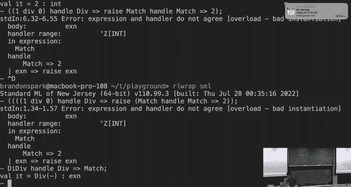

相比之下，像 `div` 这样的函数，其类型 `int * int -> int` 完全没有提示它可能引发异常，这对调用者是不透明的，容易导致未处理的崩溃。

**那么，为什么还需要异常？**
有时，我们非常确信某些错误情况（如前置条件）几乎不会发生，为它们编写处理代码显得冗长且不必要。异常提供了一种“快速失败”的机制。然而，**必须谨慎使用这种“信任”**，因为现实中“不可能”的情况时常发生。

**经验法则**：
*   优先使用 `option`（或后续会学的 `Result`）类型来显式处理错误。
*   仅在错误非常罕见，且作为“不可恢复的程序错误”时，考虑使用异常。
*   **绝对不要**使用通配符捕获所有异常（`handle _ => ...`），这会隐藏你未曾预料的错误，使得调试极其困难。

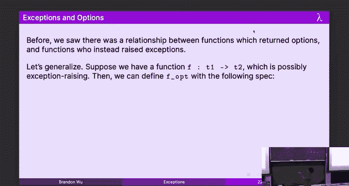

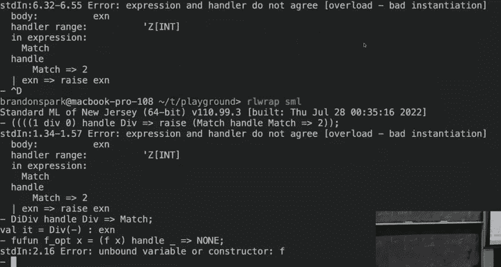

---

## 自定义异常 🎨

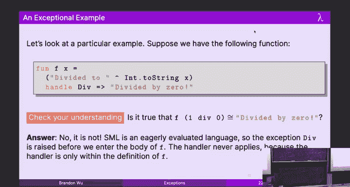

上一节我们使用了内置异常。本节中我们来看看如何创建自己的异常类型，以便更精确地描述错误。

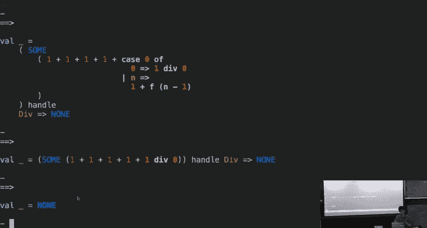

SML中的 `exn` 类型是**可扩展的**。这意味着我们可以在程序任何地方声明新的异常构造器。
```sml
exception FactorialNegative
```
现在，`FactorialNegative` 就成了一个类型为 `exn` 的新异常值。我们可以在阶乘函数中使用它：
```sml
fun fact_exn (n: int) : int =
    if n < 0 then raise FactorialNegative
    else if n = 0 then 1
    else n * fact_exn (n - 1)
```
自定义异常的好处是：
1.  **描述性**：异常名称（如 `FactorialNegative`）清晰表达了错误性质。
2.  **可精确匹配**：在 `handle` 中可以精确捕获这个异常，而不会意外捕获到其他无关的异常。
3.  **可携带数据**：异常可以携带额外的信息。
    ```sml
    exception Error of string
    fun runProcess (thunk: unit -> string) : string =
        thunk () handle Error msg => "Error: " ^ msg
    ```
    在上例中，`runProcess` 函数会运行一个可能引发 `Error` 异常的函数。如果发生异常，它会将异常携带的字符串信息整合到返回结果中。

---

## 异常控制流 🌀

我们已经看到异常可以用于错误处理。本节中我们来看看如何（谨慎地）利用异常来实现非局部的控制流，这被称为**异常处理风格**。

考虑一个在树中查找满足谓词 `p` 的第一个元素的函数。我们可以定义两种版本：

1.  **选项类型风格**：返回 `'a option`，找到返回 `SOME x`，未找到返回 `NONE`。
2.  **异常处理风格**：定义一个“未找到”异常，找到时返回值，未找到时引发异常。

以下是异常处理风格的示例：
```sml
exception NotFound
fun search_ehs (p: 'a -> bool, t: 'a tree) : 'a =
    case t of
        Leaf => raise NotFound
      | Node (l, x, r) =>
          if p x then x
          else (search_ehs (p, l) handle NotFound => search_ehs (p, r))
```
在这个实现中：
*   如果当前节点满足条件，直接返回值 `x`。
*   如果不满足，则递归查找左子树。
*   如果左子树引发了 `NotFound` 异常（意味着左子树中没找到），`handle` 会捕获它，并转而查找右子树。
*   如果左右子树都没找到，异常会最终传播出去。

**与续延传递风格对比**：这种利用异常“跳转”到备用计算路径的方式，在概念上与续延传递风格有相似之处，都是对控制流的显式操作。但异常风格更不透明，也更危险。

**重要警告**：这种将异常作为正常控制流机制的做法（EHS）通常是一个**坏主意**。原因如下：
*   **不可见性**：函数的类型签名 (`'a -> bool * 'a tree -> 'a`) 没有揭示它可能引发 `NotFound` 异常。调用者必须依赖文档或阅读源码才能知道需要处理它。
*   **调试困难**：异常导致的非局部跳转使得程序执行流程难以跟踪。
*   **破坏等式推理**：在纯函数式代码中，我们通常可以自由重组表达式。但异常会破坏这种性质，因为 `raise e1 + raise e2` 和 `raise e2 + raise e1` 会引发不同的异常。

因此，**异常应主要用于真正的、非常规的“错误”情况，而非作为常规的数据返回机制**。`option` 类型或类似的模式才是更安全、更清晰的选择。

---

## 总结 📚

本节课中我们一起学习了SML中的异常处理。
*   我们首先了解了异常的三种行为，以及内置的 `Div`、`Match`、`Bind` 异常。
*   接着，我们学习了如何使用 `raise` 引发异常，以及如何使用 `handle` 捕获和处理异常，并理解了异常传播的规则。
*   然后，我们探讨了自定义异常的优势和创建方法，它能让错误信息更精确。
*   最后，我们审视了“异常处理风格”这种利用异常进行控制流的模式，并强调了其潜在的危险性，建议在绝大多数情况下优先使用像 `option` 这样将错误显式化的类型。


核心要点是：**异常是强大的工具，但应谨慎使用。优先使用类型系统来强制错误处理（如 `option`），将异常留给那些真正例外、不可恢复的情况。** 这将帮助你编写出更健壮、更易维护的代码。