# 函数式编程：15：函子（Functors）📦


在本节课中，我们将学习如何通过**函子（Functors）** 来模块化我们的代码。函子是对上一讲中模块概念的扩展，它允许我们编写依赖于其他模块的代码。我们将从一个简单的字典（Dictionary）实现开始，逐步探索如何构建一个支持任意键类型的、安全的、可复用的多态字典库。

---

## 概述

我们将从实现一个简单的字符串字典开始，然后尝试将其泛化为多态字典。在此过程中，我们会遇到几个问题，例如如何保证比较函数的一致性。最终，我们将引入**类型类（Type Classes）** 和**函子（Functors）** 的概念，它们能帮助我们优雅地解决这些问题，实现类型安全且高度可复用的代码。

---

## 字符串字典的实现

首先，我们定义一个字符串字典的签名（Signature）。签名就像模块的“类型”，它规定了模块必须提供的接口。

```sml
signature STR_DICT =
sig
  type key = string
  type 'a t
  val empty : 'a t
  val insert : key * 'a * 'a t -> 'a t
  val lookup : key * 'a t -> 'a option
end
```
这个签名 `STR_DICT` 规定：
*   `key` 类型被具体指定为 `string`。
*   `'a t` 是一个抽象的字典类型，其值类型为 `'a`。
*   必须提供三个操作：创建空字典的 `empty`、插入键值对的 `insert` 和查找键的 `lookup`。

接下来，我们用一个简单的列表结构来实现这个签名。

```sml
structure StrDict :> STR_DICT =
struct
  type key = string
  type 'a t = (key * 'a) list
  val empty = []
  fun insert (k, v, l) = (k, v) :: l
  fun lookup (k, []) = NONE
    | lookup (k, (k', v)::xs) =
        if k = k' then SOME v else lookup (k, xs)
end
```
这个实现非常简单：字典就是一个 `(key * 'a) list`。插入操作直接在列表头部添加新对，查找操作则线性遍历列表。这种实现的查找时间复杂度是 **O(n)**，效率不高。

上一节我们介绍了基础的字符串字典实现，本节中我们来看看如何用更高效的数据结构——二叉搜索树（BST）来实现它。

## 使用二叉搜索树改进

为了提高效率，我们可以使用二叉搜索树来存储键值对。假设树是平衡的（具体平衡方法将在后续课程讨论），查找和插入的时间复杂度可以降至 **O(log n)**。

我们需要修改实现，将内部类型从列表改为树。以下是关键的变化部分：

```sml
structure StrDictTree :> STR_DICT =
struct
  type key = string
  datatype 'a t = Empty | Node of 'a t * (key * 'a) * 'a t

  val empty = Empty

  fun insert (k, v, Empty) = Node(Empty, (k, v), Empty)
    | insert (k, v, Node(L, (k', v'), R)) =
        case String.compare(k, k') of
             EQUAL => Node(L, (k, v), R)
           | LESS  => Node(insert(k, v, L), (k', v'), R)
           | GREATER => Node(L, (k', v'), insert(k, v, R))

  fun lookup (k, Empty) = NONE
    | lookup (k, Node(L, (k', v'), R)) =
        case String.compare(k, k') of
             EQUAL => SOME v'
           | LESS  => lookup (k, L)
           | GREATER => lookup (k, R)
end
```
这个实现的核心逻辑是：根据键的比较结果，递归地在左子树或右子树中进行操作。虽然效率提升了，但我们的字典仍然被限制为只能使用 `string` 类型的键。

---

## 迈向多态字典：第一次尝试

我们希望字典的键可以是任意类型，而不仅仅是字符串。为此，我们需要一个比较函数来指导二叉搜索树的构建。首先，我们修改签名，使其接受两个类型参数：一个用于键（`'k`），一个用于值（`'v`）。

```sml
signature POLY_DICT_V1 =
sig
  type ('k, 'v) t
  val empty : ('k, 'v) t
  val insert : 'k * 'v * ('k, 'v) t -> ('k, 'v) t
  val lookup : 'k * ('k, 'v) t -> 'v option
end
```
注意，键的类型 `'k` 现在是完全抽象的，签名中没有规定如何比较它们。

为了实现这个签名，我们必须将比较函数作为参数传递给 `insert` 和 `lookup` 等每个操作。

```sml
structure PolyDictV1 :> POLY_DICT_V1 =
struct
  datatype ('k, 'v) t = Empty | Node of ('k, 'v) t * ('k * 'v) * ('k, 'v) t
  val empty = Empty
  fun insert (cmp, k, v, Empty) = Node(Empty, (k, v), Empty)
    | insert (cmp, k, v, Node(L, (k', v'), R)) =
        case cmp(k, k') of
             EQUAL => Node(L, (k, v), R)
           | LESS  => Node(insert(cmp, k, v, L), (k', v'), R)
           | GREATER => Node(L, (k', v'), insert(cmp, k, v, R))
  fun lookup (cmp, k, Empty) = NONE
    | lookup (cmp, k, Node(L, (k', v'), R)) =
        case cmp(k, k') of
             EQUAL => SOME v'
           | LESS  => lookup (cmp, k, L)
           | GREATER => lookup (cmp, k, R)
end
```
这个实现存在一个严重问题：**使用者必须在每次调用 `insert` 或 `lookup` 时都传入正确的比较函数**。这很容易出错，如果混用了不同的比较函数（例如，有时用标准字符串比较，有时用“猪拉丁语”字符串比较），会导致字典行为异常，破坏其不变性。

---

## 引入类型类（Type Classes）

为了解决上述问题，我们需要一种方法来将比较函数与字典实例**静态地**绑定在一起。这就是**类型类（Type Class）** 的概念。一个类型类定义了一组类型必须支持的操作。

例如，我们可以定义一个 `ORD` 类型类，它表示“可比较的类型”：

```sml
signature ORD =
sig
  type t
  val compare : t * t -> order
end
```
任何具有一个类型 `t` 和一个 `t * t -> order` 比较函数的结构，都可以作为 `ORD` 的实例。

以下是几个 `ORD` 的实例：

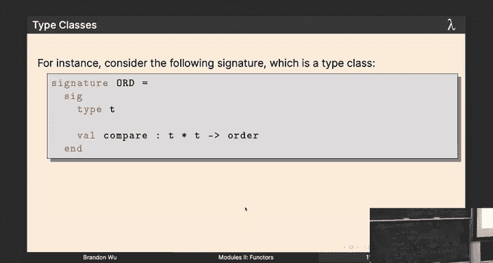

```sml
(* 字符串的标准比较 *)
structure StringOrd : ORD =
struct
  type t = string
  val compare = String.compare
end

(* 整数的标准比较 *)
structure IntOrd : ORD =
struct
  type t = int
  val compare = Int.compare
end

(* 使用“猪拉丁语”规则的字符串比较 *)
fun pigLatinCompare (s1, s2) = ...
structure PigLatinOrd : ORD =
struct
  type t = string
  val compare = pigLatinCompare
end
```
注意，`StringOrd` 和 `PigLatinOrd` 虽然内部类型 `t` 都是 `string`，但使用了不同的比较函数，它们是 `ORD` 的两个不同实例。

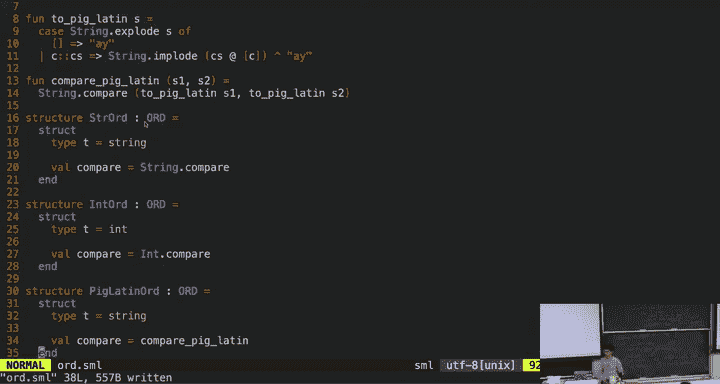

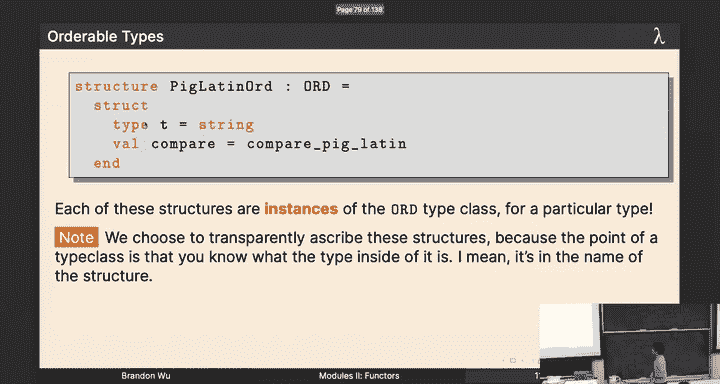

---

## 结合类型类的字典签名

现在，我们修改字典的签名，要求使用者必须提供一个 `ORD` 实例来定义键的类型和比较方式。

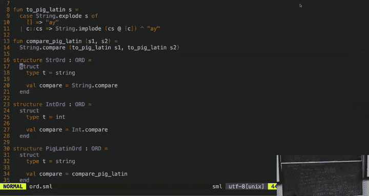

```sml
signature POLY_DICT =
sig
  structure Key : ORD
  type 'v t
  val empty : 'v t
  val insert : Key.t * 'v * 'v t -> 'v t
  val lookup : Key.t * 'v t -> 'v option
end
```
这个签名表示：要有一个字典，你必须先给我一个 `Key` 结构，它告诉我键的类型 `Key.t` 以及如何比较它们 `Key.compare`。然后，我的字典值类型是 `'v`。

我们可以为字符串键实现这个签名：


```sml
structure StrDictTC :> POLY_DICT where type Key.t = string =
struct
  structure Key = StringOrd (* 使用字符串类型类 *)
  datatype 'v t = Empty | Node of 'v t * (Key.t * 'v) * 'v t
  val empty = Empty
  fun insert (k, v, Empty) = Node(Empty, (k, v), Empty)
    | insert (k, v, Node(L, (k', v'), R)) =
        case Key.compare(k, k') of
             EQUAL => Node(L, (k, v), R)
           | LESS  => Node(insert(k, v, L), (k', v'), R)
           | GREATER => Node(L, (k', v'), insert(k, v, R))
  fun lookup (k, Empty) = NONE
    | lookup (k, Node(L, (k', v'), R)) =
        case Key.compare(k, k') of
             EQUAL => SOME v'
           | LESS  => lookup (k, L)
           | GREATER => lookup (k, R)
end
```
这里的关键是 `where type` 子句，它执行了**选择性透明（Selective Transparency）**。虽然整个结构对 `POLY_DICT` 签名是**不透明（Opaque）** 的（隐藏了 `'v t` 的具体实现），但我们明确指定了 `Key.t` 就是 `string`，让外部使用者知道键的类型。这样，编译器就能进行类型检查，我们可以安全地使用 `StrDictTC.insert("hello", 42, ...)` 这样的代码。

然而，这个方案还有一个缺陷：如果我们想要一个整数键的字典，就必须把上面的代码几乎完全复制一遍，只把 `structure Key = StringOrd` 改成 `structure Key = IntOrd`。这违反了代码复用的原则。

---

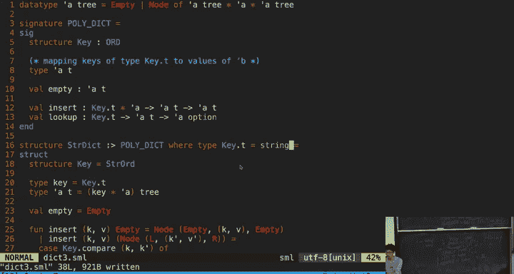

## 最终方案：函子（Functors）

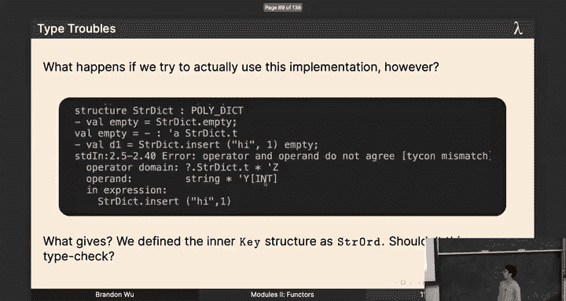

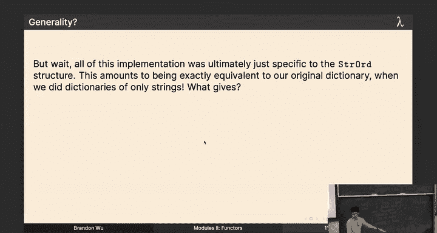

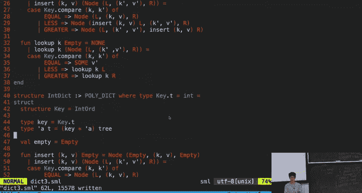

函子（Functors）是 SML 中用于模块参数化的功能。**你可以把函子看作是一个“函数”，它接收模块作为参数，并返回一个新的模块**。这正是我们需要的：一个能根据给定的 `ORD` 实例，“生成”对应字典的工厂。

以下是字典函子的定义：

```sml
functor MakeDict (Key : ORD) :> POLY_DICT where type Key.t = Key.t =
struct
  structure Key = Key (* 参数 Key 成为内部结构 *)
  datatype 'v t = Empty | Node of 'v t * (Key.t * 'v) * 'v t
  val empty = Empty
  fun insert (k, v, Empty) = Node(Empty, (k, v), Empty)
    | insert (k, v, Node(L, (k', v'), R)) =
        case Key.compare(k, k') of
             EQUAL => Node(L, (k, v), R)
           | LESS  => Node(insert(k, v, L), (k', v'), R)
           | GREATER => Node(L, (k', v'), insert(k, v, R))
  fun lookup (k, Empty) = NONE
    | lookup (k, Node(L, (k', v'), R)) =
        case Key.compare(k, k') of
             EQUAL => SOME v'
           | LESS  => lookup (k, L)
           | GREATER => lookup (k, R)
end
```
`MakeDict` 是一个函子，它接受一个满足 `ORD` 签名的模块 `Key` 作为参数。在函子体内，我们直接使用传入的 `Key.compare` 函数。返回的模块满足 `POLY_DICT` 签名，并且其 `Key.t` 类型与传入的 `Key.t` 一致。

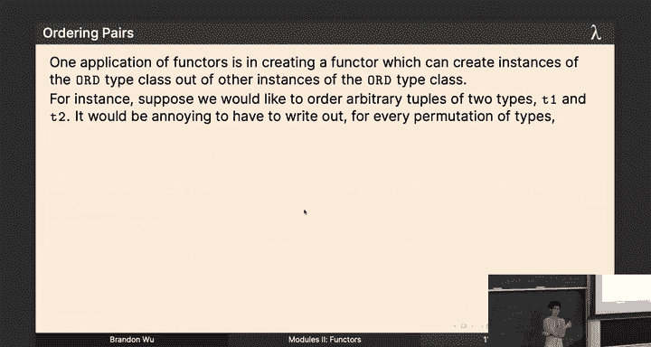

现在，我们可以轻松地创建各种类型的字典，而无需复制代码：

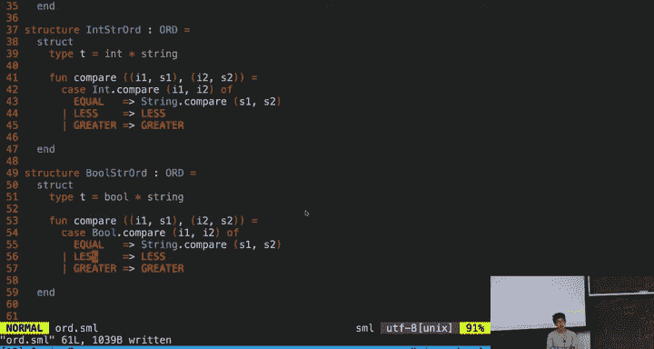

```sml
structure IntDict = MakeDict(IntOrd)
structure StringDict = MakeDict(StringOrd)
structure PigLatinDict = MakeDict(PigLatinOrd)

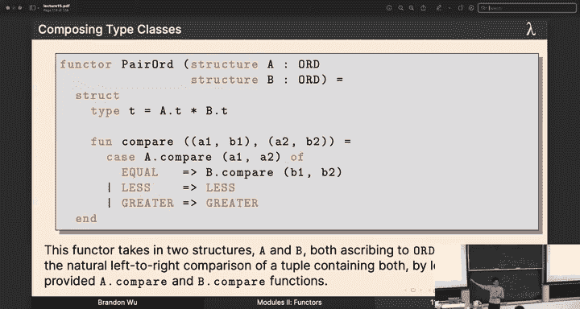

val d1 = IntDict.insert(1, "one", IntDict.empty)
val d2 = StringDict.insert("hello", 42, StringDict.empty)
```
`IntDict`、`StringDict` 和 `PigLatinDict` 是三个完全独立、类型安全的字典模块。编译器会确保你不会错误地在 `StringDict` 上使用 `PigLatinOrd` 的比较逻辑，因为比较函数已经通过函子应用被静态地绑定到了每个具体的字典模块中。

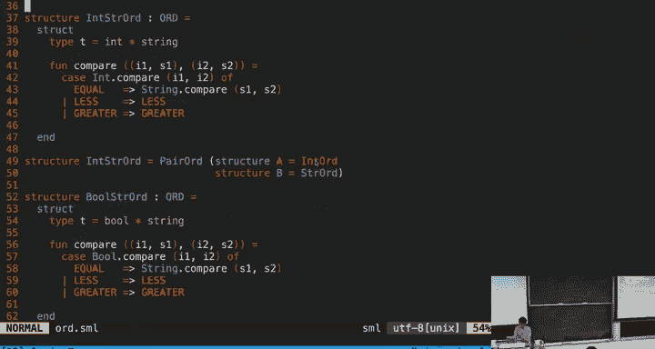

---

## 函子的强大之处：组合类型类

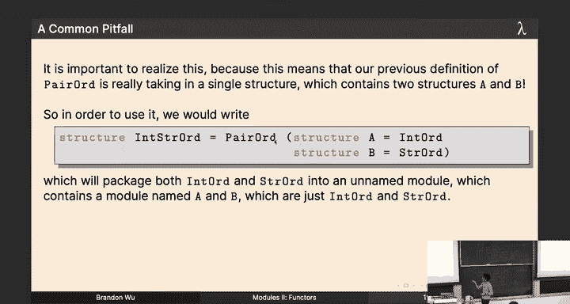

函子的威力不仅限于创建基础类型的字典。我们可以编写更高级的函子来组合类型类。例如，创建一个用于比较二元组的函子：

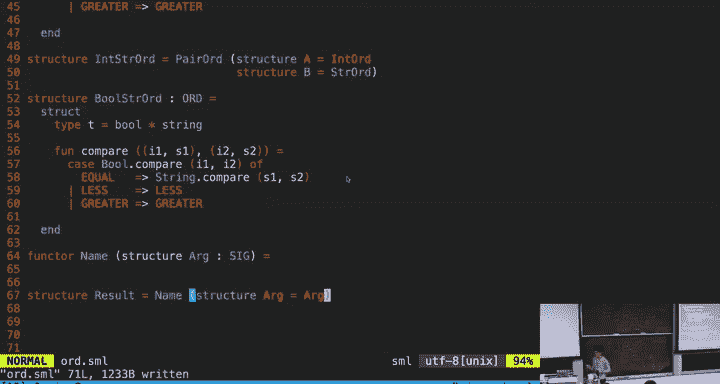

```sml
functor PairOrd (A : ORD) (B : ORD) : ORD =
struct
  type t = A.t * B.t
  fun compare ((a1, b1), (a2, b2)) =
      case A.compare(a1, a2) of
           EQUAL => B.compare(b1, b2)
         | ord => ord
end
```
这个 `PairOrd` 函子接受两个 `ORD` 实例 `A` 和 `B`，返回一个新的 `ORD` 实例，其类型 `t` 是 `A.t * B.t`，比较规则是先比较第一个元素，如果相等再比较第二个元素。

然后，我们可以轻松地创建用于 `(int * string)` 对等复杂键的字典：

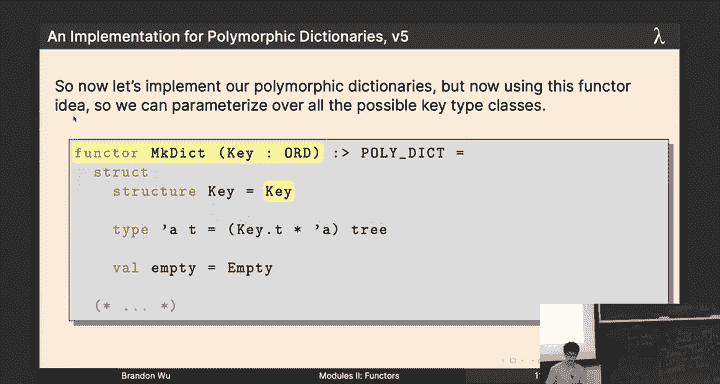

```sml
structure IntStringOrd = PairOrd(IntOrd)(StringOrd)
structure IntStringDict = MakeDict(IntStringOrd)
```
通过函子的组合，我们实现了高度的代码复用和类型安全。

---

## 总结

本节课中我们一起学习了：
1.  **字典的演进**：从简单的字符串列表字典，到二叉搜索树字典，再到支持任意键类型的多态字典。
2.  **核心问题**：在多态字典中，如何保证与字典实例关联的比较函数始终一致，避免运行时错误。
3.  **类型类（Type Classes）**：通过 `ORD` 这样的签名，定义了一组类型所需支持的操作（如比较），为类型赋予“能力”。
4.  **函子（Functors）**：作为模块级别的函数，函子接收一个或多个模块作为参数，并返回一个新模块。我们使用 `MakeDict` 函子，根据不同的 `ORD` 实例，动态生成类型安全且高效的多态字典模块。
5.  **代码复用与安全**：通过函子，我们避免了为每种键类型复制粘贴代码，同时利用 SML 的类型系统在编译期就保证了比较逻辑的一致性，实现了优雅的模块化设计。

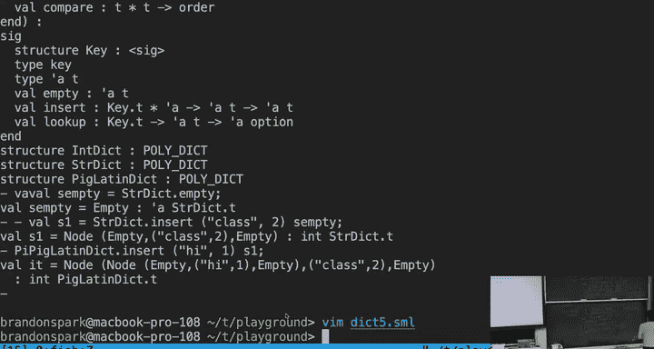

函子是将参数化多态提升到模块层次的重要工具，它允许我们构建高度可配置、可复用且类型安全的软件组件。