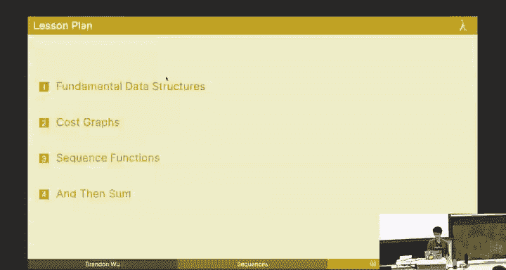
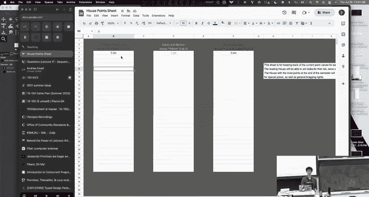

# CMU《函数式编程｜15-150 Functional Programming, Fall 2023》中英字幕（deepseek - P17：-17-17. Sequences _ - GPT中英字幕课程资源 - BV12VChY2EF4

So we're going be talking about sequences today， we're gonna to be talking about brand new content stuff you've never seen before because we are moving on from the second third of the course。

 you had your second midterm and we will be grading that imminently and then should have that back to you relatively soon thank you all for your participation with what's been happening with the fire alarm and so on and so forth because that was it's been a stressful few days for me forch sure but we made it through most of us worth noting that still not everybody has taken the exam so don't go around openly discussing what was on it all right。

But sequences are kind of cool and we'll see why I won't spoil it yet， all right。So here's your code。

 all right。So sequences are going to be a different kind of data structure and they're going to admit a kind of interesting cost model。

 we're going to see how we can sort of think about doing certain operations in a cooler way and how we can do it in a faster way。

 also worth noting that we are now in the third third。

 I believe I will send out a poll tonight to a blue team who won the second third unfortunately。

Wch。I would have break it if I could， All right， cool so fundamental data structures anyways。

 I previously said to you something like there are three fundamental or there are only a few fundamental data structures in computer science haven't really looked at so far in this course but you know you have your arrays and when an array is is really it's just a container that has a fixed number of elements where each element can be mutated so I can have it an element where I have two in the second index or the third entry and then I can later you go and erase it and revise it with three and so on and so forth okay and if I wanted to a longer array I'd have to make a new array right my array has a very fixed like which is different fundamentally different than the list because we know that lists you can cons onto the front for very cheap and you just kind of still have the same list。

 but plus the first thing on the front okay。😊，嗯。So we haven't really talked about arrays。

 but that changes today because some of you will be like， oh。

 you can't do o of one constant time indexing and a functional language。 think again。

 all right so that's what we we'll be doing today So arrays are sort of characterized by their ability to do this constant time indexing and usually we think about arrays in the context of lower I'll say lower level languages languages that are closer to see more imperative features right because mutability kind of comes。

In the package for an array， Okay， but we can actually still do that kind of thing here in a functional setting。

 because constant time access is cool。 But let's get the mutability。

 So we're going to be introducing sequences， which are like arrays， but there。😊。

Imutable arrays we still maintain the property that you should not be able to change an array without creating a new array okay。

😡，Al right， so sequences are an immutable data structure that have a fixed size where every element inside has the same type in the same respect as a list does and we can index in constant time to any given element at any position and we also have the same property that if I did an out of Browns access I'd get like an exception or something if I tried to index into this with 9000 know that would be kind of silly and the compiler will yell on me or not the compiler but the runtime will yell on me。

😊，And our key is that we're going to be able to make it immutable if we change an element of this sequence。

 we're going to make a brand new sequence now might seem like kind of cost prohibitive to you right it's kind of silly。

 but we're going to find that actually for most operations we're interested in doing this will still maintain good performance for certain applications whereas being slower problems there will be advantages and disadvantages to working with sequences there's a reason why we didn't start with that at first okay but I want you to know that this is very much a tradeoff okay we use lists for some things and sequences for some other thing。

😡，Okay， and for the purposes of sequences， like think about them as a race。

 just a raise that you cannot mutate， okay， at least underlyingly when you when you have to reason about how much it costs or what the runtime model is。

 think about them sort of as a race， okay。は。But there's a good question which are how are sequences actually implemented。

 where can you see the code for that and the answer is it's a secret。😡，And I'm not joking。

For the purposes of this class we are literally not going to show you any of the underlying code that underlyinglies sequences because it's a secret and in particular what it is is it's an abstract type we're gonna to be using the module system in this case this is an application of modules where we're not going to know what the underlying type really is a sequence is an abstract type that you know conceptually looks like an array but we can't really do anything with under the hood that means that there are certain things we lose we can't pattern match we can't interact with sequences in any way that isn't in the sequence library。

 the module that I'm going to show you next and we have a very large sequences library that's linked online on our 150 website and also it'll be the next few slides so if you ever are interested in what functions are there we're going to run through some of them in this lecture but also you can go find it online but the key thing to takeaway here is that sequences are an abstract type you have no idea what's going on behind the interface。

 but that's a good thing。All right。So this is our sequence signature。

 a sequence is a signature which is implemented by a particular library we're giving you。

 but there's a type alpha T， which is the type of sequences that store elements of type alpha。

 you have an exception range which might be raise if you try to do something like an outof bounds access。

 but we have certain operations， we can construct a sequence， we can construct the empty sequence。

 we can construct a singleleton， we can do some other things too。

 we can turn a list into a sequence and I'll talk about this tabulate thing in a second。

But beyond that， we also have a bunch of other destructors and modifier methods such as these ones。😡。

So as I promised we have nth， so I'm going to point out a few that are interesting。

 but we have nth which lets you take a sequence and index into it in constant time， we have length。😊。

We can turn it into a list， we can check for quality， we can check if a sequence is empty。

And we can do some simple operations on it too like reversing a sequence， appending two sequences。

 so on and so forth Okay， so like you should read this and feel pretty comforted because we're home because this is basically what we can already do on list plus or minus a few things。

So all of the things that we can normally do on the list are still pretty accessible to sequences。

 it's just that they're going to have different cost balance。

 nothing that we can do with the lists cannot be done with nothing we can do with sequences cannot be done with lists and vice vera。

 but the cost will be different for certain operations and that's what the focus is here。😡。

And then finally we have a few more， we have like a bunch of hos here。

 we have filter and map and reducing and this is really small text， so don't worry about it。

But honestly like there's still more I cut out some of them。

 so refers to the sequence library for more yeah。😡。

We'll get to explaining what reduces for us and then we'll talk about it yeah reduces something new that you haven't seen before。

 but yes， that's probably the most interesting one on that page， I think。

And there's a few other things so check the check the sequences library if you're ever confused。

 but words this is what we're working with， pretty much just the same sort of containers。

 same thing as list okay。All right。That's a lot I had to describe to you what some of these did but there's no description thankfully online on the sequenceences library there is a description of each function and its runtime costs。

 so if you're doing your homework and you don't know what something costs。

 you have to actually go back to the sequences reference on the 150 site and then reference that okay。

😡，And I already said this， but the main thing that we get from sequences。Is they are very parallel。

 They are very parallel friendly lists are not。 Okay， it is。

 it is impossible for me to write a function on a list that goes and visits every element and has。

Better than O of n span right does that make sense to everyone like if I want to do things in parallel。

 I can't if I have a list， I got to if I have x cons xs。

 I have to look at x before I look at x's right and so on and so forth。

 So sequences offer us as constant time access， which means that I can do everything individually on certain elements in the sequence。

😡，At the same time， if I have n processors， I can do on all n elements of the sequence simultaneously。

 That's the main thing that we get out of sequences。 Okay。

 sequences are for parallel operations Ls are for。Pretty much everything else。All right。

 and I'll tell you for instance， we can do sec do map F within constant time if we know that f is a constant time function so that's one thing that we can do right。

😊，Okay， and I already told you that we can do constant time access for sequences。

 which you should know is different than O of I we usually have to access the Ih element。

 because remember， I think someone actually ask us about this on Pi or something。

 but if you want to do list to end， it's implemented exactly how you think it is like you you have the end。

😡，And you have N X con axis。And then you decrement n by one and then you go to x's and you recur and then when you're zero。

 I'm not going to write the function out， but you got the idea right no magic sequences are a little magic because they're like arrays you can do this constant timing exit。

 but only a little bit oh w okay I had that yeah so this is how you'd implement n but O of n work O of n span or O of I rather right so。

😊，Sequences we're going to be able to do length in constant time as well as doing all the other parallel friendly operations it's worth noting that length and constant time is like not necessarily something that comes straight out of it being parallel friendly like that's just effective sequences we can do length fast whereas length on a list is again O event。

😡，That's just something worth remembering。Okay。There are advantages and sequences I said there are also disadvantages it turns out the same advantage of sequences is also its disadvantage for working with lists what do I do I case on a list nil or cons right I parse it I look at exactly what it is but a sequence is an abstract type I can't do that so to write this code to write something that checks whether it's empty or otherwise you know cons and then does one or two for a sequence I have to write this。

😡，This should look very familiar to you if you remember lecture 4。😡。

I case on the length of the sequence， if it's zero， I do the one thing， this is bothering me up。😡。

Do the one thing and otherwise I let x and x's be the n at zero。

 and then I drop the first and I get the tail yeah。😡。

No the this is exhausted there's only one in here three time permitting would be we don't case on like at all there's a different way to do this。

 but the point stands to like this is the most obvious way to do it。😡。

The canonical way to do it is slightly different。I'll show you if we have time at the end of the lecture。

 but yeah， we don't have to do this， but my point is like you're tempted to do this like you can't pattern match at all。

😡，So we're going to work on that and we'll try to do a little bit better， okay。😡，Yeah， oh yeah。

 A mentioned this is disgusting。 Okay， this is disgusting。 Let's try to do better。 let's do better。

 Alright， cool， Okay， so the other disadvantage being that they're designed with parallelism in mind。

 meaning that certain sequential operations are really fin slow。 That means， for instance。

 if I wanted to do X cons Xs to an X I'm already holding， that's constant time。

 I told you we we're familiar with that。 But to do cons on a sequence， if I want to do this。

 the equivalent of that， I have to make a brand new gosh started sequence。

 So this is an O of n cost to cons。😊，Which is pretty hefty， okay。

 that means if you want to do a sequence of coning。

You really are better off using a list instead of a sequence sequences are good when our priori。

 you know exactly how long the sequence needs to be， okay。So yeah， so cons is expensive， yeah。

 you need to make a brand new sequence， is there a question on this？😊，I hear hear your confusion。

 not your disappointment， but maybe but。Okay， I'm disappointed too。

So this is what we're going to be working with here， okay？😡。

Sequences for parallel operations list for sequential cons is expensive。

 that's all you need to know from the section。And usually when we're working with sequences。

 we're going to be using a particular kind of syntapse。

 so if I want you to denote you know this sequence that visually， pictorially you denote like this。😡。

I would use this notation in math。😡，Where we use these angle brackets。

Okay so this is just how we choose to denote them in math because it's kind of a pain because otherwise we don't really know how to write it out in text and then for instance we might sort okay。

 so we might write that See dot map F on this sequence right here has this cost where I maximize my X over all things in the sequence。

 the work of that oh that should actually be the span sorry。😡，Has the span of the maximumim here。

So the maximum cost to do this max this map is the maximum cost of any given f to any given element right this should be span and then we would result in this sequence so we're kind of mixing code to math here because we'll use this for a specification okay。

😊，嗯。But before I can really show you how we use sequences。

 I got to tell you about some of the more fundamental operations that we use in sequences and before I do that I need to tell you about how to think about it。

 so we're going to talk about costt graph。😡，Okay， any questions on this first part on sequences as a whole of this idea of sequences before we move on to cost graphs。

 which are cool and fun。All right， sounds good。嗯。I'm tired I had a pro exam this morning。 Okay。

 so we use cost graphs to kind of visually think about what a sequence is doing。

 what some operations are doing。 Cost graphs are not exclusive The sequences。

 It's that they are really helpful for thinking about it。

 So a cost graph is sort of going be similar to the same task dependency graphs I showed you earlier。

 It's going to illustrate the sequential dependencies and the parallel dependencies between certain operations。

 Okay， it'll tell us where we can do parallelism。So for instance。

 here are the three key things you need to know about。😡，Sequences。

 and I'm not going to draw it on the board， I guess because it's right there but。

I can compose these cost graphs with certain primitives。 I have sequential composition。

 and I have parallel composition。 And also as my like base case。

 I have nodes that denote the computation of something。 Okay， so we know。

 we use this node to denote the computation of the function F on some argument。 Okay。

 it's not relevant to this example。 So for instance。

 if I wanted to say that I have some cost where my cost is the cost of this graph。

 and then sequentially doing this。 that's the 1 I would use。

 Or if I wanted to say that my cost was the maximum among this cost in this cost。

 then I would use parallel composition， right， sort of the similar thing as in the task dependency graph。

 when we say this。😊，This， you know。This。And maybe we have some weights on the edges in this case。

 we don't have weights on our edges， we just have edges thatote that get us to nodes that do， okay。

So we are saying that cost graphs are inductively defined by these three constructs just by repeating these three things over and over again we can get every cost graph ever okay and analysis of these cost graphs is exactly how we're going to be thinking about the cost here it's going to play into our into this lecture again that think about things in terms of the picture cost has a picture all right。

😡，So another thing worth noting that cost graphs I haven't put the arrows on it。

 but they implicitly all go from top to bottom okay I was too lazy to put the arrows on there so we'll view them as directed going down and every graph has a source in a sink。

 the source of this guy is the source of this guy。😡，The sink of this guy or rather， okay。

 the source of this entire thing is the source of the graph 2 and the sink of this entire thing is the sink of graph1。

And then the sources and sync of this are just these two blue dots。

And the sources and sync of this guy are just that note itself。

 this is worth noting because when we put graphs together。

 their sources in the sinks are where they line up。 So if I put， you know。If I this。

Where this is the sink of one。And this where this is a source of another。

The way that we do this sequential operation thing is that we take this sink in the source and we just。

Put them together。Okay， so that's the only reason why we have that notion here， okay。All right。

 any questions on the basics of cost graphs before we get into examples？と。All right。

 so I already told you this， but it's also worth noting there's this term called fork and join。

 fork join parallelism， it's a big thing a CMU， but the idea is simply that when you see a cost graph that looks like this。

 I go out。😡，I do something， and I go back in， we call this like a fork join diagram。 we fork here。😡。

We fork into two branching paths that might be done by two different processors for instance。

 and then we join here and this is pretty much how relike parallelism works too sometimes you need to synchronize for two operations to finish so this is where that synchronization happens we wait until one of these is done or rather both these are done and then we combine。

😡，嘅。Right。So I can mix and match them as I said， we can put together these diagrams。

 these base diagrams and produce every graph ever， so for instance。

 if I wanted a cost graph of one plus two quantity times3 plus4 quantity，😡。

This is what it would look like I start at my source Okay I have to have a source。

 I have to start at the blue dot basically okay and then what happens I know that I can do both of these in parallel。

 Well what's the cost graph of both of these individually， What's the cost graph of one plus two。😡。

Well one plus two is just the operation plus I don't really have to do anything else there's no operation here no operation here I just have values so this guy is plus the purple node plus and so is that guy because that's3 plus4 right？

😡，But then once I'm done with that I have to collect these results。

 I can't do this asterisk this times until I'm done with both of these。

 so I lead in with an edge to my asterisk node where I perform the multiplication and that's where I join right I fork to go and look at each of these left hand side and right hand side and then I join when I get the results okay fork join parallelism。

😡，Right。And then note that also each of these has a constant time cost。

 so if I wanted to I could also replace the computation nodes by what I call a cost node。

 which is where I annotate it with the work span。So if I wanted to do that here。

 like look at this we have plus plus in times， you could replace it by an equivalent cost graph where now instead of plus plus in times because I don't really care about the specific computation。

 I care about how much it costed so I get three nodes where each one is constant work constant span because addition and multiplication or constant work in constant span if you're ECE I don't want to hear it right so。

😡，Now we just have now we can very easily see that if I take the work of this graph which is the area。

 this is constant and if I take the span of this graph it's again constant so I say that I would say that like reasoning about cost graphs。

 the way you should do it is you write out the one that has the computation nodes。

 replace it with cost nodes and then some。😡，Eithle of the area。For the work？

Or the depth or the span okay， this again， there's a recurring theme remember that area is the work and then depth is the span。

 right？个。Area of the graph area as in like the sum of everything。

 I'm using area to tend to note like the sum of every node。 Yeah， sorry。

 at least that's like conceptually how I think。ok， fair enough。Cool， so yeah。

 so I guess I went into more detail about it here。 but that's exactly what I just said。

 If I wanted to have something like an O of N operation in work， but an O of N span also。

 this is actually just like you could think of this as basically syntactic sugar honestly for something which looks like this。

 know O of N many blue dots， this is an O of N work right because you have to march on and you sum all the blue dots and you get n of them but the span is also O of N because I need to go through all of them to reach the bottom Okay so this would be the cost node associated to this little。

😊，Comput subgraph or cost graph Okay， I should say all right so it's like worth noting though you don't need these computation nodes。

 it's just like better in terms of like your reasoning because you know you kind of get the point that like this is what it is right it's just a linked list space okay but for the cost graph so it's worth noting that this is kind of like a translation into the cost node diagram we could do the same thing for the parallel case。

😊，So it's technically true that for fork joint parallelism， you always have exactly two things。

 you have a left and a right right so if I wanted to I could draw out something like let's go left。😡。

And then this guy is going to go left and right again。

This guy's going to go left and right and what do you know， it looks like a lengthlet actually。

 and maybe they you know all eventually join back。This would even be not even work because you'd have to join back like。

With two， and then you join this back again， so you say like this。😡。

And then you join this back eventually as well。RightDo you see what I'm doing here I'm kind of saying like this is a parallel thing where the right hand side can be parallel and that right hand side can be parallel but the thing is like if you think about it everything here can just be done in parallel and eventually they'll join and it'll be like all of them coming together and that's not too big of a cost so we prefer to write something like this。

What you see on the board right now is the de sugared version of this or the rather the sugared version of this。

 right， instead of drawing this out like gross dependency thing out， I'm going to write。

 Let's just assume it can be an array。 The for can can be for any arbitrary number of graphs， yeah。

Yeah， I suppose I action mean this， Yeah， I no， I guess I guess I do action mean this。

Which is only when I was thinking of the case so if the case where you have a binary operator like you do need to wait for both of those values。

 but I was actually in the case where you have like a tuple of like n things and yeah this would actually be the true picture in which case we could safely do this kind of like so I guess actually let's just take it as a primitive that we can do this kind of an splitting in general and's get rid of the binary case I think you can reeriveve with the binary like I don't think you ever need tabs strictly binary but' let's yeah let's take this as a primitive point。

I't think terribly part about that that was in the previous slides as well。The binary yes， but yes。

 okay。But yeah assuming that we have this not an an binary case or assuming we have the energy binary case。

 this is just and many parallel composed graphs so we do them all in parallel and we join eventually and then we can also say that this is the same as this node where we have O of n work because I have to visit every node and then o of one spanm because I join them all together in one step right rather you know my height is one basically okay so that's how we think of it if each of these graphs is constant。

😡，This is not the case if each of these graphs were to be like o n squared， does everyone see that？

Like it's。Constant depth in terms of the graph， but each graph might itself be very large Okay that's worth noting here okay。

 so only each of these are constant cost nodes， but now we can think of terms of the green instead of like t sugarening to all of these giant graphs yeah。

😊，And that's pretty much everything about cost graphs。

 where's going to apply this knowledge for the rest of the lecture okay。😡，嗯。

It's conceptually interesting to think about these， but sort of like what Steven just said。

It doesn't matter the actual encoding， like if you're approximately correct， okay。

 maybe that one was actually more more worrying。 but like if you're approximately correct， like。

 for instance， I don't really care about this。次はです。What do you have like？

This like sometimes I will dejugger this to that because this is a constant number of edges and this is a constant number of  edges So for instance。

 stuff like that like sort of like what we were talking about with the binding notation。

 which never came up again like people had a lot of questions about that。

 And then after the lecture I kind of reflected on the fact that like yeah this is never going to come up again This is almost like you know this is conceptually interesting to get you thinking about it in the right way but don't stress too much about this syntax okay。

😊，All right。Now let's talk about sequence functions， any last questions on cost graphs？不。

Chris time camely， you'll never guess why this is the passcode also a punk fact the reason why， okay。

 well， the real reason why I picked the title side that I did。

 which was like some yellow and blue lines that going like this。😡，It's because they're parallel。Yeah。

You try you try asking a generative AI to come up with a picture for sequences， Okay。

 like there' you don't have a lot of options， Okay， I have to work in the abstract。Alright。

So let's talk about some sequence functions Well， you know if you're a sequence enjoyer name every sequence function ever。

 that would take a really long time because that would take like three hours so I'm going name some of the sequence functions and maybe tell you about some of the things they do but it turns out for this class you're only going to need like less than a third of the sequence functions I feel like so you'll be fine。

😡，Okay。So I don't have enough time to go through all of them with you so I won't but a lot of the sequence functions are derivable in terms of the others。

 meaning that in terms of getting you thinking about the cost model correctly。

 which is all I care about okay I care about you thinking about the cost way more than about the specific things they do all I need to do is tell you about some core sequence operators okay and then you'll understand the whole library so some interesting functions we'll be looking at or this tabulate thing map filter reduce and a few other things so this reduced thing comes up again and then I'll also talk a little bit about some other ones。

😡，And then for the rest of this lecture， I'm going to be making reference to things as if we're inside of See okay instead of writing seek dot seekq。

 I'll just write alpha Seeq instead of writing sec do map I'll write map okay there will be almost no discussion I'm pretty sure of like list map okay so don't get confused it's called map in this lecture。

 but that's okay we're in a self-con unit there different namespace entirely。😊，All right。Okay。

 let's talk first about this one called Tulate has anyone seen the list signature in the SNLJ website or whatever the SNL website and then saw a list tabulate。

😡，Yeah so this is that but what tabulate does is given a function that tells you what element to produce for any integer。

 then we're just going to produce it for a given range from zero to n you know not inclusive on the top bound as per usual right so in particular tabulate fN gives me f0 through fN minus1 as a sequence using this left angle right angle bracket notation that we've been talking about that's what tabulate does and it exists for lists but it's kind of rubbish because like the list one is you could do it recursively and it has a terrible parallel span right so we can do better than that what's that。

😊，It's on the homework of in their mind， it's on the homework， but you know， as a terrible spanm。

 yeah。Let's do a not inclusive on this bound， sorry yep， thank you， thank you for thatette。Good one。

Numbers are hard， you know， actually， I think numbers are some of the least interesting things in the world。

 I'll be open about this。 Like numbers are so uninteresting。 You have no idea。

 one time I had a job interview and they were like。

 can you make a bank account that gets N every single day and then decrements by K every day。

 And it was crazy And it was like it was the least interesting problem that could have possibly given me And the crazy thing is that it was I did it in SML。

 So it was like。😊，It was so boring， anyways。No， not at all。

This was Jane Street It was such a it was the boringest question I've ever received in my life。

 I'm so glad I don't work there I'm perfectly fine to say this on the recording like I don't care。

 I don't care I'm so glad you have no idea Okay anyways。

 See to the tabulate Fn x goes to xN is going be this right zero through n minus1 All right yeah。😊。

Yeah so map needs something to take in at first you could think of this as a map on you know this already you could reerriiveve in terms of that I guess but like this is strictly more general because you could produce literally anything from just an index and you don't need to take in like a previous element that was already there so map and tabulate feel very similar though in this respect and in fact I think I'm going to explicitly address this in like two slides。

😡，Okay， so the cost graph for tabulary and this is the thing you should remember。

 remember the picture， Okay， this is what it's going to be。

 It's the parallel n composition of all of these calls to F on various indices。

 I do them all in parallel every single one of these operations is done at theoretically the same time All right so I can paralyze all of them。

 so that means that if I had a constant function F。😡。

Sta tabulate F of n is O of n work because you know I have to visit each of these nodes。

 but O of one span and that's pretty darn cool when our alternative we've been working with all semester has been O of n span right so this means that again like this kind of idea is if you are kind of building this dynamically like you don't know how many elements are going to be in it if you cons onto the front you know n times that's going to be O of n work O of n span chart but if if you know this ahead of time then you can get the O of one span but only if you know already how many elements are going to be in the sequence so it's kind of this different use cases here okay。

😊，Okay， so this is much more much improved and we you know what happens under the hood maybe you can think of still behind your abstraction is you know we create a new sequence and then we just fill in the boxes and each of the boxes can be filled in independently of each other okay that's all that's happening all right。

😊，Any questions on this？个。All right as promised， one of the most interesting things about sequences is that we can do n in constant time so that means that if I do n right here I'm taken a sequence and a integer and then you know my requires is gonna be true because I'm also describing what happens if it's out of bounds so I get back in alpha because it's the Ih element of S unless it's you know too long or it's negative in which case we're going to raise that exception range I talked about earlier I don't actually know range tendly takes in the string I don't know what string it raises width it doesn't really matter just don't do that there's no reason for you to that's not true that's not true but yeah so raises range。

And the cost graph just looks like this one step all we do is one thing。

 you can't paralyze it if it's constant time， you have to do the work anyways。

 so this is going to be an 80 bitty cost graph for n all right and this is just generally what we're going to see for a few fundamental operations。

 but end being a constant time is kind of the interesting thing。😡，Similarly。

 I said we have length in O1 organ span and the only reason why that's possible okay is the fact that we store the length of the sequence with the sequence。

 okay the sequence has its length inside of it， so we just go and query that really fast because that length will stay the same for the duration of that sequence's life。

😡，So length takes in a C， gives us an inch and gives us this n， all right。😊。

And the cost graph looks the same constant the time， okay。

Right I'm just moving on quickly from this because I don't think it's very interesting and then finally we have map。

 well not finally， but we have map， as we said earlier。

 which looks very similar to tabulate in the sense that like map F on this sequence。

 you know just evaluate the same length sequence where I apply F to each element same as the list equivalent but it has an identical cost graph to tabulate because actually we can define map in terms of tabulate we don't need to have a separate map。

 in fact on the inside， what the sequence library is going to do is instead of writing like know some homegrown map it's going to use tabulate that's what's gonna to happen so I didn't need to show you this but I could have told you it was the same but I'll do it anyway。

 so for instance， map on a sequence could be implemented this way。😊，Instead of doing like you know。

 anything else， I tabulate where at each index， I simply apply f to the n element of the original sequence。

 right so you know。😡，Like a picture。If I am mapping this sequence right here。😡。

What I'm going to do right away is I'm going to tabulate and what tabulate does is tabulate makes a new sequence of the same length。

😡，And then I say what at each index， what should I put in it and what do I put。

 well I put F applied to whatever was here。😡，And here I put in whatever F was applied at that index。

 so on and so forth。😡，This is what it looks like right but it turns out that like you know I can I can access this in constant time so that's the that's the idea okay so we can make this in the same cost profile using tabla and N where we have。

😊，This。And the reason why this cost graph is going to look a little bit different。

 so I would say this is the cost graph of that function I showed you just now this function and here's why。

 right？😡，If I wanted to analyze the cost of that function as just showed you。

 well I need to use the knowledge of tabulate， so in particular we said what？😡，We said。Tabulate。

FN I goes to。And F applied。And。S I。I think I always get this backwards for whatever and okay？

So in order to analyze the cost of this I just use the cost graph for tabbuy but this is now the question what is the cost of this guy so in order to produce a cost graph for taby I need to produce a subcos graph for this function I gave it so I need a cost graph for applying n to something and then applying F to something well remember the cost graph for n looks like this。

😡，And the cost graph for F， well。It's going to be the computation node of F。

 I don't actually know how much this costs， it's variable in F， okay。😡，And what do I do。

 I string them together。So。I get this and this is my cost of my let's say F prime。

 the F prime that I use in the same cost graph I showed you earlier。

 I'm going to go back all the way。 this one we're going substitute for these Does that make sense for everyone。

 I know I'm using F twice here， but this is this is the cost graph that represents the cost of this function。

😡，Does that make sense for everyone？Yes。I think it's an argument to tabulate。Oh， sorry to map no。

 okay， yeah， so okay， oh did I did I leave the NM und？😊，My bad， my bad yeah。

 so you do use length and then you'd have a constant。

 so let's go here and then you would basically do this and then additional edge here。

Does that make sense at the very beginning， yeah sorry， thank you for that。😊。

But also like if you wanted to think about the analysis of the graph。

 you could contract that if you wanted if you thought it because it's a equivalent at the end of the day。

 but yeah I could do that the way note that I've also contracted another graph edge here because I started running out of room on the slide。

 but like theoretically you'd want one for the n and then one for F。😊。

But I also just contracted it here because I didn't really care， so it's fine。

Because you're sequentially composing this and then also sequentially composing just F。

But I don't actually if you if you werent to do that， I don't think anyone would care Okay。

 the point is that we have this cost graph and there's an extra thing on it for the end we do is that clear to everyone。

And you know， the link。Cool okay， this is our cost graph for tabulate and so there's just the key theme here is how do we think about the cost graph when we sort of compose these functions when this guy has something and it just means that we replace the old the old F node with whatever this cost graph is okay that's a general theme we'll see another example at the end of this class。

😡，O。😊，So map same cost， okay， if I had a constant time function， I promise you constant time span。

 right same deal。😊，All right。And that's this is basically exactly what I just said， right？Okay。

 the next most interesting thing we can do is we can fold on a sequence。😡，But folding。

 if you remember what folding means， right， actually let's。Let's do it out， shall we。

 So if I had a list of like elements， let's call it。😡，X1 through Xn， like a list， okay？X 2。

Would someone like to tell me if I did old L？F on thisvol also with Z。What would this be。

 like what would the expression be that this would be essentially equivalent to？

How do we typically write this， it's going to be a bunch of nested F， so I'll give you a hint， okay？

😊，Well like， what should I put here？Where this is the most XN。It's actually going to be x1。

X1 comma Z， and then here we go。Right， exactly。Y， okay， so we do this and if you get the point。

 we're going to eventually come out here and do f of x sub n comma do da dot。😡，Yeah。😊。

But computing this is really fri and sequential right because I literally because F is general。

 I have no idea what this is unless I already know this and so on and so forth right so like I cannot compute this expression unless I know everything on the inside。

 which is like potentially end many things which is very quickly a data dependency I have a data dependency here that's exactly what this is so what we're going to find is that for folding that sequence if I were to do this。

 I'm giving you an analogy for why I shouldn't do this。😡，For this case。

Why this is why I shouldn't fold like a list on a sequence because we're going to have easily O of n span at least depending on what the function that I folded with it is。

 okay， but I'm going to introduce that linear dependency， which is really bad。😡。

But we can do something a little bit better， right。

 we can do something a little bit better and this is going to be。

 and this is exactly everything I just said。😡，How can we do this for a sequence。

 how can we fold on a sequence in a way where I get rid of this dependency and I no longer have to deal with On span。

😡，Well， we're not going to be able to get rid of it entirely， but let's change the problem statement。

 let's do this thing where you know， there's kind of this this idea of we can either。

To do something better， we can either weaken the spec。

Or we can strengthen the impulse with the same spec。I briefly talked about this。

 but basically like if I want to make my function do cooler stuff， do more stuff。

 I can either you know have less expectations for what it should do。

 which is you know the easy way out okay I have less expectations or I can just put in some elbow grease and implement it in a nicer way this is in a case of weakness specification。

😡，Reduce is not going to be exactly the same specification we're going to impose a constraint on the function F that's past 10 and I' talk about this in a second Okay so here's the idea for I'm just standing you up for the future。

 let's look at the concrete example so let's suppose I had this collection of things。😡，当 we啊。

So Hol on， here's here's the point。 If I were summing all the elements in the list。

 If I were summing and many things should it have O span and the question ends up being no。

 it doesn't need to have O span。 So okay， here we go。 That's the exactly I wanted。

 Suppose I have this list of numbers All right， all of them through 8。If I wanted to add this。

 if you wanted to see me add this， and I'm running very low on chuck。😡，I could。I could。

I could do this and I could make you watch me do this for the next little bit， I could like this。

 basically。😡，You know well yes， there's like like this okay， I could very well do this all right。

 and in fact， if you look at the slides ahead， this is exactly what I'm going to do。

 but I'm not going to do on the board。😡，This is what it could look like。😡。

We march forward and we do it from left to right， this is what Mgan does， this is what bold does。😡。

How exhausting is that， Oh my God， you know， my computer is doing at the end of the day。

 But I'm exhausted by proxy， by knowing my computer my dola。 Okay， so like， let's not do that。 Okay。

 does anyone see a better solution here。 Like， can we。

 can we do something better than sequentially marching from left to right。What do you think merging？

唔使。Okay， that's also true。 That's， that's the smartest thing。 But I think did I say I。😊。

Pretend we're not privy to the yeah， there's a closed form。

 but pretend we're not actually privy to the close form here or the actual contents of the list。

Use comm， not quite comm here， yes， one of them， yes。Make it parallel， yeah， okay。

 he already got the idea， which was reduced， but yes， sure。

Let's give the perspective of the switch what if instead we computed the sum of this guy which is implicitly this big nested pares。

 what if instead we did this？😡，B。那 quick。我。All right， this thing， what if we did that？Well， then。

Surprise， surprise， this is going to admit a better span right and in particular it's going to look like this boom。

 boom。Small change I put in the parents， but now everything is different。 Okay， parentheses matter。

 Allright， so in this case， what I can do is I can do each of these in parallel。

 So I do the one plus two the 3 plus4， the 5 plus6 and the 7 plus8。

 All these happen in parallel as I kind of alluded to you right and so then we can do these in parallel。

 And it's going turn out we only need to do three steps as opposed to7 Okay and it turns out that you know。

😊，In a closed firm way， okay， we're doing the logarithm of the number of operations we used to have to do。

 okay？But here， but okay。And that works out very well for us here， but can we do this？😡，In general。

 and the answer， as you can tell， I'm alluding to is going to be no。

 because let's just work through it， okay。For lists， you know， all we can do is this thing。

 we can only do this marching forward because we don't have access to this ability to look at like everything at the end。

 but for sequences we can reprintthesize okay but also。😡，What if I wanted to do this？Let's try it。

 let's parentthesize it， let's do it。1 minus-2， minus-3 minus-4。What do I get， Well I get minus1？

inus -1。Equals zero。Does that seem right to everyone cool， whip out your calculators。

 this isn't quite right all right， because what this is going to be is one mine I don't want to write it up。

 but like1 minus2 is like。😊，If。我来。I don't know to say that， I don't know to say that Okay。

 so what might this two what's her name actually don't say that don't say that。

One minus I was thinking we to make it funny okay I'm being heckled1 minus-2 minus-1 minus-3 minus-4 minus-4 minus-8 right okay I did the math three this is minus8 right I think but this was zero。

😡，Wrong result right so what happened here if I wanted to march forward with fold。

 as my understand I'm right I'm wrong， you're right。All right， yeah， you know。

 whatever Wait is that not right either I see what happens， Sorry， my bad。Let's do this。

Look at that minus10， crazy， okay。Yeah you know， I didn't get a whole lot of sleep this week Okay so anyway what we see here is that if we march forward。

 we're gonna get minus-10 here with the0 minus and if we were to associate these in a certain way。

 you know this is not quite right for what we should do。

 we should have the zero minus in front but trust me that if we try to do the parentheses trick here you know like0 minus is also it would still be zero So like we got an issue here All right so what do we do instead Well。

 let's not do that， What's the problem What did I miss what big honk and math fact am I missing here。

Associivity， Associivity is what I was missing。Also， key fact。If it's not the same I don early care。

 the point is thats not it not it's not minus10 is my point all right key fact for you。

 addition is not the same as subtraction all right in particular。😊。

Addition is associative subtraction is not。 So okay， let's talk about this in general。

 So associivity， what happens is if I have a binary operation like let's call it circle was a question。

Okay， if I have some operation like this。This is my binary operation okay， or let's take do x。

 all right， y circle is z and it's binary， so I have to choose a way to prem。

 I can do it this way or I can do it。😡，This way， right， one of those two things is my interpretation。

😡，Associative means that both of these are the same thing okay always it means if I have a list of these things and they're all separated by the same binary operation。

 I can put friends wherever I please and it' will be okay right so as long as it's syntactically well formed but I can put friends wherever as long as I don't permute the order permeing the orders un allowed that's commuticivity yeah。

😡，We'll still have a fold down for sequences， it's just that it we'll have a bad span。Yeah。

 but you can still do it with with reduce as long as you maintain this invariant okay so youre you don't have to use fold reduces more particular than fold。

 the fold is more general， right。😡，But associivity is the real big deal here okay so you know we can put the pre wherever and that's basically what I'm just saying here and reduce is going to make use of this idea so let let me roll back the clip okay I showed you that with addition we have this associivity property which means we can insert friends which means what which means we can do things in a different order in a parallel friendly way so all I'm saying is that to do this reduce thing which is going to do this pairing algorithm much like I just showed you with the addition trace all we're going to mandate is you need an associative F。

😡，Reduce requires an associative function F， al right。Here's our our spec。Now。

 because it's sosociative， it actually constrains the type2， okay。

 you can't do this and then output like a different type because you might you can't pair it up properly okay but the point is that fixing an alpha。

 I'm going to have a function that takes in two alphas and produces an alpha。

 that's my associative function F。😡，A base case okay and a sequence and this is actually going to be equivalent to fold R given this Z given G with this reduced function okay I guess I motivate this with fold L。

 but it'll actually be equivalent to fold R we keep this base case at the right。

 but the difference between what you saw earlier but reduce one is reduce one doesn't have this。😡。

But it requires that the sequence be not empty because， for instance， okay。

 if I didn't give you a base case， what would you give me back on this， right？😡，You wouldn't know。

 you couldn't possibly produce any arbitrary alpha for an alpha sequence if I told you I wanted you to reduce with this without a base case。

 does that make sense for everyone？😡，Yeah， so reduce one simply says now you must have at least one element。

 but also I don't need to give the basic case， that's the only reason why it's here， okay。😡。

But reduce is going to mandate this total and associivity property of the function， all right？😡。

And it's implemented spiritually the same way I just showed you with addition。

 what it's going to do is it's going to pair up everything that it can and then you know like around Robin it's going to just make everything go pairing up again and again and again until we reach the end and if you have kind of a conceptual notion of what that means it means logarithm expand right for a constant function。

😡，Yeah。Yeah， actually I don I don't really know what a brown robin is I said it because it felt semantically right。

 but I think it would be a bracket as long， yeah， you're right， not this kind of bracket。😊，系有。

You know， actually this is like the last bag， this is like I need to buy more。

This is the last four high shoes， do people want to like earn these last three high shoes into the four high shoes in the last like 20 minutes？

I'll treat that as a challenge to you， okay， so what's the cross graph look like it's going to look like this guy。

😊，动。😡，So what we do is we parallel n wayss and out of each of these guys。

 you can think of each of these blue dots as actually like the element at that index okay we take all of these elements and we just pair them up via our function G and I actually left it out here but Z is chilling somewhere to the right okay and it doesn't need to be a perfect bracket like reduce kind of as smart and it knows how to pair things in a way that eventually will get to this case okay and you can think of it like it doesn't need to be a fair bracket not everyone needs to go through the same number of rounds because it's going to be in the neighborhood of logarithmic okay sort of like the red black treatment thing。

😊，OkayBut does this make sense to everyone， I'm doing a bracket and I pair everyone up。😡，All right。

 and if you're unlucky in this is gym class， maybe you don't get picked and your' Z at the end。

 but that's sign too， Okay， you'll get there eventually。

So that's reduce and this is going to admit if you count up everything， okay， well actually。

 can someone tell me why or what the work for this should be in terms of callistgy？😡。

Sttly in terms of calls to G， how many calls to G are there？What do you likeか。

In the neighborhood end right yeah yeah yeah and let's let's work through why that is right so at this first level there's going to be like what n number two right roughly N number two。

And then each time we're going to， yeah。😡，That's also true yeah yeah。

 but also yeah that's a good point but also another thing is like this is the same as the workspan thing we've been seeing all semester。

 which is well not all semester， but like we're dividing by two each time。

 which means that when we sum them all up it'll be the same as the in the neighborhood as the biggest one so N over two and number four and over eight down to one or two or whatever。

😊，This sum is in the neighborhood of O Okay it's bounded by N All right so that's why we know this is still going be work in On。

 but span is going to be logarithmic right because I divide by two that many times this is just a different presentation of the same kind of stuff you've been seeing last semester which is like trees that are like dividing by two and splitting or combining right right。

😡，I guess they kind of reverse reverse in a sense。And it might look scary。

 but again this is just the divine and conquer algorithm if you can kind of intuitively think about it。

 I'm not asking you to implement reduce and it turns out like if your operations is associatedsoci。

 like it literally doesn't matter how the brackets happen。

 it just matters that like it'll be equivalent to doing the fold just that it'll be faster to do so in terms of the spec in terms of using reduce just remember it's always equivalent to fold R here's all you need to remember。

😡，O。Okay so I already gave you all this justification。

 but yeah for addition O and work log end span not bad when addition unfold is O end span and remember log is practically constant for all intents and purposes。

 so this is truly pretty good。😡，Okay， yeah， that was the end of reduced any questions on that？😊。

Before I finish and go to filter。系。All right， I like filtering， let's do filter。

 this is filter on sequences， it looks pretty much exactly the same but instead of lists we have See okay。

 but how is it implemented？😊，And you might naively think。

 if I ask you to come up with the class span right now and probably I should have done that。

 you might think oh and work both one spam。😡，It's not going to be true。

Why it comes out to the same thing I told you at the beginninging of lecture。

 which is just that the bad thing about sequences is it's kind of hard if you don't know how long your sequence is going to be a priori okay if I have an arbitrary predicate P on a sequence。

 I have no idea until I actually go and do it how many things are going to be in the sequence that means I can't magically you know make my sequence of the perfect length。

😡，And then put everything I want into it， right I have to kind of use a little bit of communication to form this sequence。

😡，The actual implementation of filter relies on a kind of technique that you will learn in 15 to 10 if you take 152 10。

 so I will tell you the cost bound， but I will tell you how you can think about it。

 but it's not going to work exactly okay。😊，So。Here's what we're going to do。 Okay。

 the implementation is subtle， so I'm going to tell you it'll be O of end work and O of log n span。

 All right， that's what I'll tell you and I'll also tell you that。😡。

It's going to look something like this okay， this is going to be how you can think of the pseudocode it's not actually implemented like this because this has the wrong work bound okay？

😡，But you can intuitively， well， this is not ask you what happens。

 but you can think of it as mapping to none or sum depending on if it satisfies P。

 or actually alternatively， actually better would have been to say a maps X。😡，Maps2。

The empty sequence。Or the sequence containing X。Depending on if it satisfies P， okay。

 and then we bracket it out， we reduce with append， we append everything together。

 And if you think about it， if we do that， right， the only things in the resulting sequence should be stuff that satisfied P right because we killed everything that didn't satisfy P。

So that should make sense as to why it works This is not what happens because this will actually have too bad of a work I don't think I mentioned but Seeta append is like lit okay so this is not going to work out I believe this span will be like。

Yeah， bad， like yeah。enloggan i think yeah and log啊啊。But this is why the span is log okay。

 this is the intuition for why the span is logarithmic。

 there's still like a kind of reducingy thing going on， but yeah for all kinds of purposes。

 trust me it has this work in span。All right。Yeah， yeah。Yeah。

 because because specifically because you're doing this reducing。

 you're doing this reducing and a pen has an ovenov or oval ones then。

If everything remained in the list， you'd still have to pair them up pair wise yeah yeah yeah and also it depends on the cost of your function F yeah but yeah so this is just the flavor for why the Spanish logarithmic is down to reduction down to reduce right and that's all I'm going to tell you about it okay take 15 to 10 for more all right。

😊，Allright， cool。Those are the main weird sequence functions in terms of their runtime there's a lot of other sequence functions out there。

 but most of them do not actually matter in terms of their runtime because you can derive it in terms of others there's a few I didn't tell you about like append is linear for instance that's like something you should think about you could rerive in terms of tabulate too actually that's a good exercise but your Ts will go over all of this with you in lab tomorrow that're going to go more in depth onto all the costs of each of these functions yeah。

都不。Reuce filter and length。Yeah， yes， I believe that's correct。 Yeah， those functions。

 and then a few more might be show up tomorrow， okay。

And that's all we're going to need to get going with programming with sequences okay I'm sure the ideas are racing around your head now but when we are dealing with bulk operations on data。

 that's where sequences shine when I have to like map a bunch of stuff What if I can map everything in parallel What if I could filter logarithmically what if I could reduce all of that data it's really really useful so spreadsheets for instance are like a very functional idea and they would benefit a lot from this over like list okay。

And I'll leave it to you why spreadsheets are a functional idea。Okay。

 any other questions on these sequence functions before I go to a motivating use case？

And then finish off the lecture。Cool，Okay， y'all are full of no questions today。All right。

 and then some so let's talk about if we want to do sum everything in a 2D matrix。

 so you know I'm sure you're familiar with the idea of like a 2D list or I guess。😡。

I guess 2D mates no it's not matrices can be like multidimensional， but the point is like a 2D list。

 okay， like an array， like a matrix， okay。Or a2D or right rather right let's think about summing all those entries。

 So what do I mean by that， I mean if I have。😡，This M by n thing， So M here。

And here and I've got a bunch of friin entries everywhere here， Okay。

 I want to take the sum of everything in here， produce the final sum， right？😡，And if you think about。

 you know， the work， okay， yeah， we got to do， we got to do everything right。

 we got to do M times n because I have to sum everything， I have to visit everything。

But we don't need to be constrained if this were a list of lists right think about a list of lists。

 so basically that what that means is that。😡，This will be a list。And then this will be a list。

And so on and so forth， this will be a list。When I fold to do this I want to use a fold on each of these inter lists I can't go forward to here without having to visit here as well okay so my span is bottlenecked by this O of M still all right by the fact I have to visit all of these and it's also bottlenecked by the fact I have to visit each list element individually right so bad bad span right？

😡，But what if instead we had， I'm sure you。You know， can get the idea， but。

It's going to look like this。😡，It's going to be a sequence。Of sequences。

Which is n by n in size again M it's a sequence of length M where each element in this sequence is a sequence of length n。

😡，Does that make sense， as everyone see pictorially like if you put this here and there。

 it would like read as literal Mac， okay？I just indented it。So let's do some matrix。

 which is of type inch seek seek to ink， right I take in a 2D sequence of integers all right。😡。

Here's how we can do it。It's just that code， what I do I define sum to be reduction via opt plus with a base case of 0 on S。

😡，Then I map some and then I sum。😡，How does that work， let me give you a picture， all right。

So this code here is going to be witnessed by this picture right if I have birds of this this 2D array。

 this matrix what I'm going to do is I'm going to go and I'm going to reduce across each entry that is to say each row。

 each inner sequence so I pair them up in these pars you know this is a concrete example but it could be as long as you like。

😡，And I get this right， and now I'm done with my map。

 I've now mapped some across each row and I get this。😡，And then finally。

 I sum across each of these by usingR again， and you know the benefits of reduce on three elements is pretty low。

 but you get the point that this parenten stuff would keep going， all right。😡。

That's the picture of what the code I just showed you was doing let's think about the cost because the real challenge here with the sequences is like。

😡，Less programming more， okay， well， I mean， not to say there aren't interesting programming questions。

 but like analysis of why the thing you programmed has the right bound is the bigger deal okay？😡。

Here's what the cost graph looks like Okay and you should think about this because I basically stuck the cost graph for map and I joined it together with sum。

 Okay I mapped where each of my entries here is sum of R sub I where R sub I is the I row one index for whatever reason Okay I decided actually I should do R sub n whatever point is the or n of n many such and many such rows and I sum all of them and then what do I do I join all of them together via my sum operation yet again okay。

😡，Has everyone agree with me that this is what the cost graph approximately looks like？Cool。

 well then let's do it so I have N calls or sorry， I have M calls from M away， should this be M。Yes。

 it should be， I'm sorry， yeah， yeah yeah。Yeah， each of these R sub I is n in length。

 and then there should be M of them， my bad。😡，And then we sell all these， okay。

What's the cost of this stuff？So we're going to employ the same technique that I did earlier this lecture where I take the cost of each of these and I substitute the purple nodes by the green nodes。

 I substitute the cost nodes for the computation nodes。😡。

So all of the sums in this graph are not made equal right in particular。

 these sums are not the same as this sum， why？😡，Because each of the inner sums are on the I throw。

 which has n elements， okay each of those inner a subbi is n elements long。

 so it has via reduction via constant time addition O of and work in O of log n span right that's what we said earlier。

😡，But the outersome。Has a sequence that's n entries long， right because。

After I collect all these sums， this guy is still M long。Okay， so then when I reduce across this。

 my cost is now O of M work and O of log M span。😡，So if I know and I'm going to show you this。

 it's as simple as looking at the individual nodes and then summing them。

 so given that information I can substitute for all the nodes， so let's do it。😡，That's it。

I look at the sums of R sub I and I replace it by something which was O of n and work and O of log n in span。

 each of them， and there's M， many of those I didn't specify in the drawing but there's n many of them。

 and then they feed into this sequential node that has O of M work and O of log ns span。😡。

How many calls are there to this guy， this screen node？M many right， so okay。

 so let's let's do the work right so how many so okay， what's my work then， what's my work？😡。

MN plus O of M so M because n is not zero Okay， the long time won't matter if if is if n was0。

 but it'll be O of MN work I don't actually have。😊，I don't feel a need to write this down anyway。

 okay O of M and work， what about the span， what's the longest path？😡，What do I do。

 there's only like all these paths look the same。Lo n plus log n， I have to do both。This is a okay。😡。

What happens here is that because these paths are connected by sequential composition。

 I have to do both。So my bound is going to be in terms of both if n were small。

 it'd be in terms of M， if n were small be in terms of n， in a particular like asymptotically。

 it's both okay o of n log n plus o of log M does answer your question。😡。

You can define the smaller one in terms of two times log。If M were really small。

 but the problem is that like when Emmin and are completely like varying。

 like they both might be huge。😡，Right。Yeah。AsAsymptically， like when Emine and are both unbounded。

 like we have to kick and combo。Sure， yeah。Sure， okay。

 I want to write it as plus because I like that better。So yeah， O of N times O of n plus O of N。

 which is O of N N work and then span longest path is the sum Sure， the math depending， but yeah。

 both can still grow right， I see your point Sure And I guess that makes sense because also like。

 you know， when we do span when we do recurrences and we have like。😊，Or rather than we。

 when we have these span currencies， and we have like S of。Rather。

 I'm thinking the case where you do the maximum， they're different。Like， W of。F1， W of F2。有其他大问题。

嘅 o k 。Let's write it as plus Sam confusedfuse on this？😡。

So I I think the main thing that's important here is just that we find the cost node， replace it。

 and then you can just go and add some of the nodes find along the path that's the main idea here okay and this will get more complicated。

 especially when you are dealing with functions that are not necessarily constant time so for instance in this function here the one that we wrote。

😡，This operationally passed to map is no longer constant time。

 so the main way that we deal with that is you can't just say oh yeah seek。

map has work of O of n and span of0 of1 no because that's assuming a constant time operation so how we deal with these other kinds of nodes is that we just replace which is akin to basically composition like multiply basically we multiply by n all right but the picture。

😡，Looks like this， right？And that's summing the matrix。Okay。

 and then you know we could be cute about it and we can say this was it。

 but this would be helpful if if our call to some matrix was subservient to like a bigger computation like what if we mapped with some matrix all right now you get this nested picture right you can visualize it on your own time and yeah we would have like and more of these right。

😊，But that's all， this is an exten， it's a composable process。

 I can continue doing this however long I like。😡，Right and I didn't put pauses on this。

 but okay that's fine sequences are useful and I think there's three main reasons for why so one I'm showing you abstraction in the sense that I'm not showing you other things I'm not showing you the implementation you shouldn't have to think about the implementation。

😊，Think about the brackets。Think about the brackets and like a little bit think about the array。

 Well the quotation marks the array。 All right， it's it's in the mascot suit。

 You don't know if it's an array or not， but like it probably is， you know， like。Additionally。

 if you had something in your head we're like oh man， we're using these linked lists。

 functional programming can't do constant time access， you're wrong。

 you're wrong all right without needing to compromise immutability and I realized I didn'ttivate that a whole bunch but I' motivated immutability a lot this semester okay。

Imutability is better， we can keep immutability and also have the benefits of arrays okay and then also I can think about span in a more nuanced way all right if you liked this lecture and if you liked this sequence's homework。

 this is essentially all two tenants。😊，This is210 of this lecture like 13 times all right。

 but they're not as like nice to work with as lists。

 lists are kind of the bread and butter of any functional programmer， but again。

 use the tools you have， use the tools you need All right， we can make our own tools。😊，Thank you。😊。

All right， yeah， that's that's it， I finished seven minutes early。

 but I don't really have much else to say unless people have questions。

All right， dismissed mess。