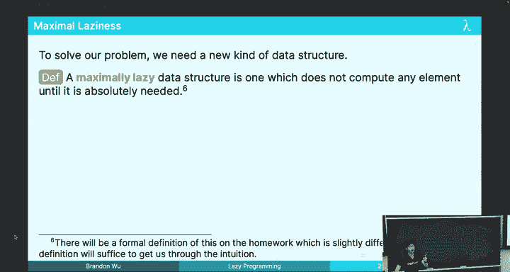
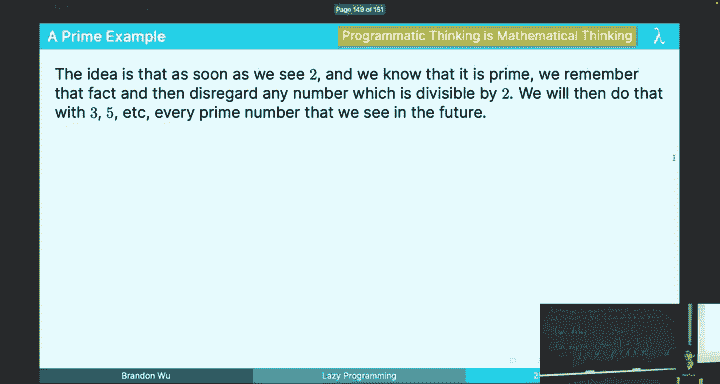

# 函数式编程：18：惰性编程 🦥

在本节课中，我们将要学习惰性求值（Lazy Evaluation）的概念，了解其与急切求值（Eager Evaluation）的区别，并探索如何在SML中模拟惰性行为。我们将重点介绍惰性列表（Lazy Lists）和流（Streams）这两种数据结构，它们允许我们处理潜在的无限序列，而无需预先计算所有元素。最后，我们会通过一个生成所有质数的炫酷例子来展示惰性编程的强大能力。

## 惰性求值 vs. 急切求值

上一节我们介绍了课程的整体安排，本节中我们来看看惰性求值的基本概念。

在标准的SML（急切求值）中，当我们绑定一个变量时，会立即计算其表达式的值。例如：
```sml
val x = 1 div 0
```
这行代码会立即引发 `Div` 异常，因为 `div 0` 被急切地求值了。

然而，在惰性求值语言中，表达式只有在**其值被真正需要时**才会被计算。这意味着，如果我们只关心一个元组的第一个元素，那么第二个元素中的计算（即使是除以零）可能永远不会发生。这可以避免不必要的计算，有时能显著提升性能。

急切求值的核心规则是：**变量被绑定到值**。
惰性求值的核心规则是：**变量被绑定到表达式**。

这种区别带来了一个关键优势：在惰性语言中，像 `val x = <巨型表达式>` 这样的绑定是常数时间操作，因为表达式本身被存储起来，但并未计算。

## 惰性的利弊权衡

上一节我们看到了惰性求值如何避免不必要的工作，本节中我们来权衡其利弊。

惰性求值的主要好处是效率。例如，对一个很长的列表使用 `map` 函数，如果之后只取前几个元素，那么惰性求值可以避免对整个列表应用函数。

然而，惰性求值也带来了显著缺点：**不可预测性**。在惰性语言中，当你获得一个数据（如一个整数列表）时，你实际上得到的是**一系列尚未执行的计算**。这些计算可能包含异常、无限循环或耗时操作。问题在于，这些“定时炸弹”只会在你尝试使用（即“强制求值”）列表中的某个元素时才会爆发。这给程序调试、性能分析和API设计带来了巨大困难。

因此，一个更好的设计原则是：**让有争议的语言特性成为可选项，而非默认项**。这正是我们将在SML中采取的策略——模拟惰性，而不是默认使用它。

## 在SML中模拟惰性：Thunk

上一节我们讨论了完全惰性语言的潜在问题，本节中我们来看看如何在急切的SML中有选择地实现惰性。

关键在于利用**函数**。在SML中，函数体在函数被调用前不会求值。因此，我们可以将任何表达式 `e` 包装在一个不接受实际参数（或接受 `unit`）的函数中，从而“暂停”它的计算。

这种包装后的函数被称为 **Thunk**（或**挂起**，suspension）。其类型为 `unit -> t`。

我们可以创建一个模块来规范地表示惰性值：

```sml
signature LAZY =
sig
  type 'a t
  val delay : (unit -> 'a) -> 'a t
  val force : 'a t -> 'a
end

structure Lazy :> LAZY =
struct
  type 'a t = unit -> 'a
  fun delay f = f
  fun force t = t ()
end
```
用户通过 `Lazy.delay` 创建一个惰性值，通过 `Lazy.force` 来强制求值。类型 `'a Lazy.t` 在代码中清晰地标记了哪些值是惰性的。

## 无限数据结构：惰性列表

上一节我们学会了如何创建单个惰性值，本节中我们将其应用于数据结构，创建可以表示无限序列的惰性列表。



首先，我们定义惰性列表的类型。一个惰性列表要么是空的，要么是一个头元素加上一个**表示剩余列表的Thunk**。
```sml
datatype 'a llist = Nil | Cons of 'a * (unit -> 'a llist)
```
注意，`Cons` 的第二个分量是一个函数（Thunk），而不是直接的 `'a llist`。这意味着我们只需要知道**如何生成**列表的剩余部分，而不需要立即生成它。


例如，我们可以用这个类型表示所有自然数：
```sml
fun nats_from n = Cons (n, fn () => nats_from (n+1))
val all_nats = nats_from 0
```
`all_nats` 并不会导致无限循环，因为它只生成了第一个元素 `0` 和一个知道如何生成后续元素的函数。只有当我们强制求值那个Thunk时，计算才会继续进行。

## 最大化惰性：流（Streams）

上一节介绍的惰性列表还有一个问题：即使你不想查看第一个元素，在构造 `Cons` 时，头元素也已经被计算出来了。这还不够“懒”。

我们想要一种**最大化惰性**的数据结构：**不计算任何元素，直到明确表达需要它的意图**。这就是**流（Stream）**。

流的定义使用相互递归的类型：
```sml
datatype 'a front = Nil | Cons of 'a * 'a stream
and 'a stream = Stream of (unit -> 'a front)
```
概念上：
*   **`'a stream`**：一个被延迟的 `front`。你无权查看其元素。
*   **`'a front`**：一个被暴露的 `stream`。你可以查看其第一个元素（`Cons`）或知道它为空（`Nil`）。

我们通过两个关键函数与之交互：
```sml
(* 将一个生成 front 的 thunk 包装成 stream *)
fun delay f = Stream f
(* 将一个 stream 解包，暴露其 front，表达查看意图 *)
fun expose (Stream f) = f ()
```
`delay` 和 `expose` 在代码中清晰地标记了惰性求值的边界。

以下是使用流定义自然数和映射函数的例子：
```sml
(* 生成从n开始的自然数流 *)
fun nats n = delay (fn () => nats_front n)
and nats_front n = Cons (n, nats (n+1))

(* 流的映射函数 *)
fun map f str = delay (fn () => map_front f (expose str))
and map_front f Nil = Nil
  | map_front f (Cons (x, rest)) = Cons (f x, map f rest)
```
注意 `map` 的实现：它先 `delay`，然后在内部的 thunk 中才 `expose` 输入流。这意味着仅仅调用 `map` 不会触发任何计算，只有对结果流调用 `expose` 时，计算才会发生。这实现了我们想要的“最大化惰性”。

## 应用实例：筛法求质数

最后，让我们看一个能体现流之优雅的强大例子：用埃拉托斯特尼筛法生成所有质数。

思路是：从自然数流开始，取出第一个数 `p`（它一定是质数），然后过滤掉流中所有能被 `p` 整除的数，对剩余流递归地进行筛法。

```sml
fun divisible_by x y = (y mod x = 0)

fun sieve s = delay (fn () => sieve_front (expose s))
and sieve_front Nil = Nil
  | sieve_front (Cons (x, xs)) =
      Cons (x, sieve (filter (not o (divisible_by x)) xs))

(* 从2开始的自然数流 *)
val naturals = nats 2
(* 所有质数的流 *)
val primes = sieve naturals
```
这段代码简洁地生成了一个包含所有质数的、惰性的无限流。它展示了如何通过组合高阶函数（`filter`）和惰性流来声明式地表达复杂的算法。

## 总结 🎯

本节课中我们一起学习了惰性编程的核心思想。我们对比了急切求值与惰性求值，认识到完全惰性可能带来的不可预测性问题。因此，我们在SML中采用了通过Thunk和抽象数据类型来**有选择地模拟惰性**的策略。



我们重点掌握了两种表示无限序列的数据结构：
1.  **惰性列表**：其尾部是一个Thunk，允许我们逐步生成序列。
2.  **流**：一种最大化惰性的结构，通过相互递归的 `stream` 和 `front` 类型，确保只有在明确调用 `expose` 时才会计算元素。

我们还学习了为这些结构编写函数（如 `map`, `append`, `filter`）的模式，通常涉及相互递归的、分别处理 `stream` 和 `front` 的函数。最后，通过埃拉托斯特尼筛法生成质数流的例子，我们见证了惰性编程在表达无限数据结构和算法方面的强大与优雅。