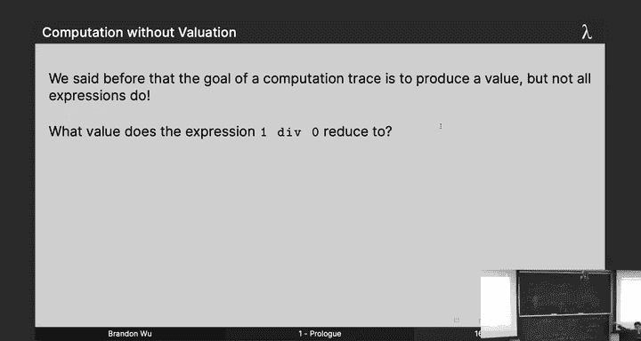
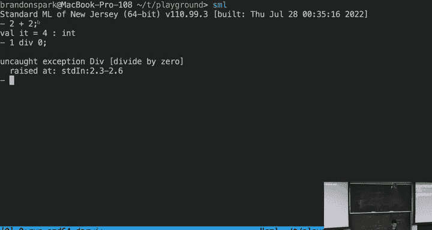
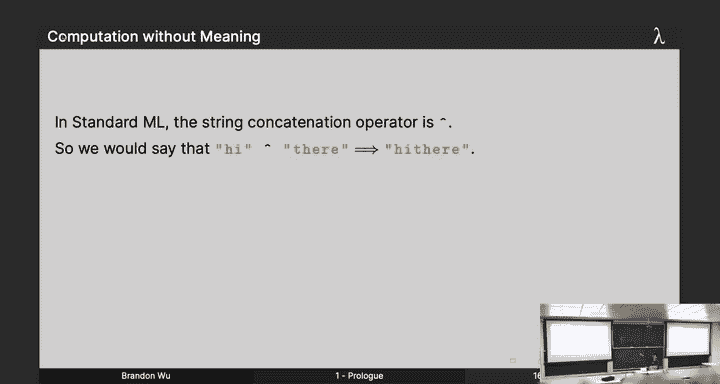
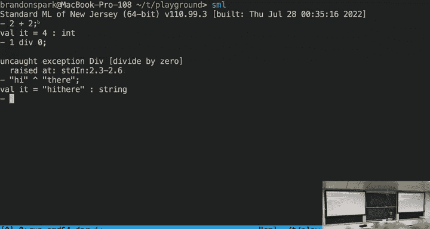
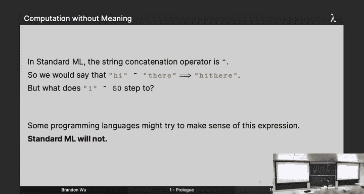
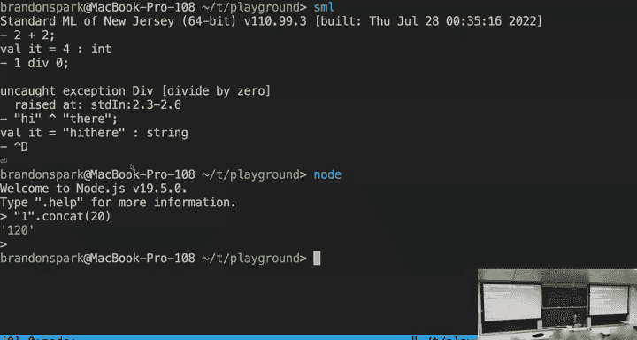
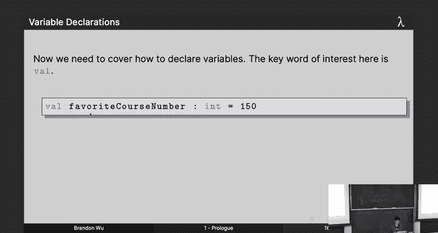
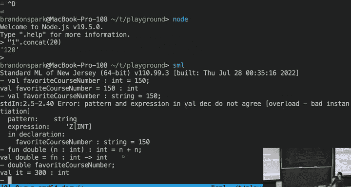
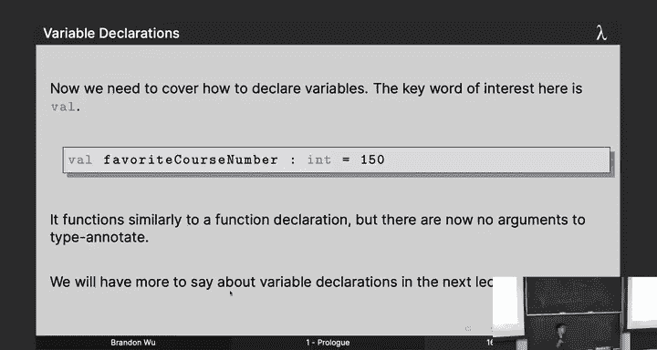

# CMU《函数式编程｜15-150 Functional Programming, Fall 2023》中英字幕（deepseek - P1：-01-1. Prologue _ - GPT中英字幕课程资源 - BV12VChY2EF4

All right。Were to get started welcome welcome everyone welcome to 15150 for the summer 23 semester so glad y'all could join us I hope you enjoyed that little C shanty it's a traditional Scandinavian folk song so anyways as the states werere here to learn functional programming My name is Brandon I'm gonna to be your instructor for the semester hopefully everyone who should be here should be here you found the lecture room all right I left some notes on piazza but you're all here so it should be good anyway。

So let's get started here before we start I'm going to have to get started with some administrativeista I have to tell you some logistics all right and I know everyone loves the logistics so let's make it quick and snap so here's a lesson plan for today we're going to be talking about a little bit of administrative stuff I'm going to talk a little bit about the philosophy of this thing called functional programming I'm going to tell you about some things that are kind of fundamental to doing functional programming called types expressions and values。

😊，And then we'll kind of talk about how we can actually program in standard ML the language that we will be using this semester with declarations。

So and Svia， I'm going to talk about myself for a little bit but hi， my name is Brandon。

 I graduated last year with a degree in computer science from CMU， I'm an alum。

 I work as a full-time software engineer for a company called SeGp doing program analysis and I do functional programming。

 which puts me in a pretty cool position where I can tell you that as someone who does this for a living this is really important stuff and I cannot stress to you like how lucky I feel to be able to say that because when I was sitting in your chairs。

 you know five years ago， four years ago， I was thinking okay this professor who's never programmed anything in his life other than like whatever it is a professors to you all day。

 he's telling me oh this is like important stuff， no this is actually really。

 really critical for you depending on what you want to do。So I'm a full time software engineer。

 raise your hands if you have aspirations of being a software engineer。Okay。

 that' that's a lot of you， some of you aren't proud to say it， but I see it in your eyes。

 but that's fine because I can tell you that right now you got to pay attention because this is this is what's up。

 all right？Okay， and then notes to I am not a professor， I don't have a PhD， I'm not a professor。

 I'm technically a visiting lecturer， you can call me instructor or you can call me my name which is Brandon。

 which would be preferred to be honest， but yes， that's the idea of that slide。😡。

Here's our course staff when I was so I T for this class for three years when I was an undergrad and I always loved it when the professors put my name up on the first slide。

 I did better， I put their faces up there you're welcome those are my TAs right there two of them。

 everyone clap room。So that's me， that's my little mug I've also surrounded on both sides by my excellent head Ts Nancy and Soia Nancy S right there and I also have six other Ts。

 Caaz Dea， Caroline， Steven Brandon and Michael you'll note that one of my Ts names is Brandon you can call me Brandon you can also call him Brandon just figure it out all right because it will get confusing I expect all right just don't call me Professor Wu and don't call me Mr。

 Wu that's my father。Actually， my father's professor buttu。

 it's it's the long term anyway and also give a Hanford Dave who's in the back recording this。

Can do it with that， Dave， all right， thank you， thank you。 all right， let's move on so。😊。

I gotta tell you about some course logistics you're here。

 you want to grade cool I'm not super inclined towards that but I gotta tell you some things so you have to be graded。

 I got to give you homework in particular the Ts will give you homework you'll have a homework every single week now this is a 12 week semester with a week's break in between for what is supposed to be a 14 week course that means that we have to kind of condense we have to condense our material by a little bit but not by a lot which means that some weeks will be a little bit stranger than others because we have to play around holidays we have to get through some material that we wouldn't otherwise be able to do if we only had homework to every Tuesday so the way this works out is that our schedule has two homeworks to or rather it has one homework to that can be on Tuesdays or Thursdays depending on the week I posted a handy dandy little colorful spreadsheet on piazza that you should take a look at because that is how youre going to know what is coming up there's also a nice's a nice schedule。

That's posted on the 150 website and there's a link to that here as well other than that you're going to turn in your assignments via grade scope。

 you're going to receive your assignments via canvas and you're going to ask questions on Piazza you can ask anything you can ask my favorite color you can ask my middle name。

 you can ask my favorite programming paradigm spoiler alert for what that might be if you were not in any of these。

😊，Please let us know， let me know， talk to me after class because。

I will not be able to communicate with you it's going to be a black hole from here on out most communication will be on piazza so make sure you're checking that fairly often。

 fairly regularly。😡，Okay and then the course website is hyperlinked there and that has I will post my slides there I will you can see a copy of the course policy which TAs will go over with you in lab tomorrow and then there's other handy information you might want to see at the website there。

 any questions on this。😊，过， okay。So the schedule I'm going to briefly go over this because your TAs will also talk about this。

 but it's linked here， it's also on piazza it's color coded by what's going to happen this semester so the blue slots are going to be lectures we always have lectures on Tuesdays and Thursdays with the exception of this one down here because of Independence Day because the Americans decided they had to be free and then also we have homeworks do homework will be do by the see these yellow ones which can occur on a Tuesday and Thursday I have a laserzer pointer and also there's。

😊，Homemark coming me out on the pink dates I don't need to go through every single one of these but just know that this is volatile sometimes it's on a Tuesday sometimes Thursday sometimes Friday so make sure you're checking this early and often okay。

😡，And then you also have midterms。Sorry。Okay。And we'll move on。Okay。

Next thing your favorite thing I gotta talk about is grading which my lucky T is get to do so the grading policy is going to be a choose your own adventure if that's not a dated reference by now。

 but basically there are two tracks for grading that you get to choose and I will send out a poll at the end of this week so you can you can express your preference so basically how this works is that there's a lecture track and a homework track。

😊，Now the whole lecture track is for students who want to be able to earn three points by showing up the lecture 3% of your grade will be by just showing up but that will be taken out of your homework grade which will otherwise be 42% on this track on the homework track it means that you don't want to be graded on your lecture attendance maybe or your night owl and you're only awake from the hours of midnight to 8 a I don't know if you don't want that then homework will count for 45% of your total grade and you will not be graded on lecture attendance at all and I will send out a form at the end of the week so that you can determine which one of those you would rather be in。

😡，And that will be on Piazza after the first week， okay， any questions on that？😊。

To further make it clear to you I am expressing the percentage of your grade via stripes of phnum so percentage via percentage of farnum this is lecture track so you know most of this is your homework and you also have this little yellow band here near his chin which is going to be lecture attendance all right and then midterm is 10% midterm two is 15% and the final is 20% so these go up in score quite a bit so midterm one will be forgiving and then the final will be worth a fifth of your grade okay it's worth noting that。

😊，As a class 150 starts off as kind of like a gradual curve we're gonna start slow because I'm trying to introduce you this stuff you've never seen before but this will ramp up by like week five it's going to be a lot more difficult than it was in the first week so be worried of that and be prepared if you're cruising through the first week you don't like plan a trip to Lo Pser or something and then expect to be okay you can go to Los I'm gonna stop you and then finally here's the homework track so if you look at the difference the yellow band your chin has gone away that's the only difference so this will be 45% of your grade as homework。

😊，Many questions on this？Great， super servant。Cool okay but also summer is a time for fun I think and this is fun so I have my handy dandy little landda hat here and which I got from a career event in San Francisco but this is not just a land hat it is a sorting hat because you all are being sorted into houses Allah hogwarts or Harry Potter every one of you has been sorted into one of three labs that is headed by two or three Ts depending and your lab is able to earn points over the course of the semester by doing certain actions you can earn points via asking good questions on piazza giving good answers on piazza。

😊，And answering questions during lecture and you can't gamify any of these because I'm the end all be all and if I see you like posting 5 billion questions on Piazza。

 I'm liable to do worse things and not give you points so twice a semester to incentivize you twice a semester on certain dates in the schedule the house with the largest amount of points will win free boba for their entire class。

😊，As well as have an end of surprise end of year of surprise for whoever wins the house Cup so you should end there'll be candy and stuff too I don't know high choose you know so keep that in mind。

 you earn points as individuals but you also earn points as a house So it's in your interest to get to know the people in your lab to get to know your Ts who will be your mascots through this process and to to get competitive because you know free Bu but who doesn't love that。

😊，And yes， like Harry Potter， I mentioned that。And tomorrow in lab you're going to choose a name for your house my first order of business in terms of points is that the house who picks the best name by my criteria will get the first 15 points。

 so it's a competition already。😊，Think about it， think about it。

 you'll have a better idea of what to pick online at the end of the election okay。😊。

Any questions on this？I can pretty much do whatever I want。

 I have no there's no co instructor's just me， so cool。😊，Active learning research shows。

 And now a handy thing about that is if you say research shows as a general life rule。

 no one will question you。 So research shows it's better to learn by exercising your mind actively rather than just passively sitting there and and learning。

 Okay， if you want to do like a lap around the room right now while I' lecturing， Like feel free。

 don't actually do that。 So to that end， we're going to have holding this to that end。

 we're going to have in class exercises that are quizzes。😊，Quzzes during class。

 but before you get all angry on me， you will not be graded on these quizzes。

 They will not be for a grade。 The Ts will will you know evaluate them for points。

 but they won't be entered into your final grade。 the Ts will strictly use it to ascertain like how well you're doing and what they might need to do during the lab tomorrow like if you got a bunch of types questions wrong maybe they'll focus more on that tomorrow。

 but also the other component of this。I that these quizzes are a whole house effort you can earn points as a house individually by doing the three things I said earlier。

 but every house will take these quizzes together as 20 people now you're not allowed to give each other answers and we will be listening so please don't do that but you can kind of like discuss with each other the methodology and how to solve the problems and each lecture the house who wins the quiz will be the vi for that lecture and earn points so not only can you earn as individuals you are tested essentially together every single lecture twice a week okay so it's in your interest to get to know the people in your lab in your house and to help them and to make sure everyone's on the same page when you take one of these quizzes right。

😡，And also it'll be how you how I gauge lecture attendance as well so don't skip out on these and't and don't there'll probably be like a passcode or something to determine whether or not you're actually in lab don't in lecture don't give it to your friends just life's too short this is a summer class come on all。

Yeah， yeah， so it's a whole house effort to win the House competition and in particular the house quizzes every single week。

😊，Cool。Wellness I realize this is stretching on kind of lung。

 but I gotta talk about all these things and also it's important So wellness if you didn't have a parental figure who told you this when you were young。

 I'm telling this right now your health is important just letting you know all right it means。😊。

I heard someone say something， but anyways， the things you're learning are important yes。

 I do think that everything that I'm going to teach you is important。

 but also what's important is sleeping more than four hours a night。

 eating food okay or otherwise if you're compromising your health for this class something is wrong talk to me okay I'm not here to try and make you not eat all right that would SES admin would not be happy about me for that one so things that are required sleeping is one。

Eating is one。For some people， socializing is one， unless you're a hermit。

 raise your hand if you're a hermit。Okay， some people on the back raising hand it's fine。

 you get a candy for raising hand anyways。😊，You know， too late。 so you got to do these things。

 So please do it。 Okay， don't compromise on these things just for， just for 150， right。

 because that signal something else is wrong， maybe with like planning or your schedule or maybe some other extraneous factors in your life。

 I can be flexible when I need to， okay。😊，I can't do the splits。

 but like like in a different way yeah and also paying taxes is required things that are not required are not doing any of these four things。

 especially the last one if you're not paying your taxes because of me I。😡。

I I'm going to be in trouble， so don't do that， please。Especially the last one yeah。

The funniest thing is that you can see the footnote at the very beginning of the slide。

 so you just like spend your whole time like thinking like what was the footnote going to be about about this don't don't not do it？

😊，Please， Jesus。O。Take care of yourself if you're having trouble talk to me。

 talk to TA that you trust either of those things and if it's something real real serious。

 talk to counseling， talk to CAs， okay， you can go to this website。

 they know what to do than more than I do， but also I'm free to help you if it's something within my power all right？

I'm trying to teach you，m not trying to ruin your life contrary to popular belief， so don't let me。

 all right， so if you're struggling talk to me， let's come up with a plan。

 I want everyone to come out of this class。Winning， I want everyone to come out this class passing。

 hopefully， but also by learning something， okay， but I got to make sure that you're at the right place。

 all right？😡，Yeah， I I was going to say something else oh yeah you might think， oh yeah Brandon。

 you're just saying this because you're paid to say this and you're correct about that。

 but also I'll tell you this I am paid very， very little to be I paid I'm a software engineer I am paid so unbelievably little to be here if I was doing this just because I had to I wouldn't do it at all all right the fact I'm saying this now means I actually do care about this so please take care of yourself right this comes up this is important。

😊，系。Okay， does anyone have any further questions on anything administrative。

 anything they talked about in the past YaA 15 minutes？😊，Pity。

 the first one has a question what we've gotten candy。Okay， cool， so let's do this。

So I'm here to teach you this thing called functionalal programming and raise your hand if you know what that is already。

😡，Nice okay， it's okay if you don't， a lot of you don't。

 because this is kind of a level playingground we're starting at a place where really nobody knows what's going on。

And that's okay， but it's a little different than raise your hand if you took 112。Yeah。

 so a lot of you， a lot of you learned programming from 112 right and you probably didn't really know much about programming before。

 but the way to think about programming right is oh I'm putting magic script into a box and then it that's what I want it to do I don't really have to tell you much other than that but whenm when I'm motivating this functional programming thing when I'm teaching you this functional programming thing I kind of have to think a little bit more about okay like why right like you already know how to put the magic script in a box but。

The reason why we're doing this is that there's better ways of doing it。

 there's better ways of thinking about it and what I'm going to tell you in this section is kind of why you should care。

 why functional programming is really， really important for your careers for becoming better computer scientists for becoming better programmers okay so。

😡，おがありませ。What the hell is functional programming？I probably shouldn't be asking you that question because I'm the instructor but I'll ask you anyways what is functional programming。

 I don't know let's figure it out okay before we can proceed with the details let's talk about what it is so but before I can answer this question for you I want to ask the question。

😊，What is programming？I don't mean like an abstract philosophical sense。

 I mean what is programming I gave you one definition shoving magic script in a box and making it do what you want I think we can do better than that so let's try so what's programming it's the act of instructing a computer。

😡，how to achieve some kind of operation you're trying to tell the computer how to do something and you're instructing it。

 but instructing is the magic word here because instruction is just a communicative act。

 I'm your instructor I'm communicating with you so what I want you to think about is the active programming is not a black box when you write code you are communicating with the computer I don't I don't mean in some like hippie abstract you're comm with the computer kind of sense I mean literally you are communicating with the computer。

😡，Okay， and with all communication there's good communication and there's bad communication that's why relationship coaches exist right like there are better ways of improving our ability to communicate and so what I want to teach you is that。

😊，O。this geez functional programming we're going to think of that our first cut will be that it is an improvement an improvement on our ability to communicate as programmers both to the computer and also to people reading our code to people who might be us later on reading our code okay because the first step is to figure out what's possible right which is programming the second step is to figure out how to do it well I'm here to teach you how to program well you already know how to program let's figure out how to do it better right。

😊，So。Before I can answer this question for you of functional programming。

 let's talk about the goal here， what do I want programming to be what should it be before we can kind of talk about functional programming and how it achieves that ideally good programming should be descriptive and whenever I think about this I think of this old paper written by this pioneer in the field of computer science called Edgar Dyictra you might have heard of him maybe he came up in 112 or something Edgar Dictra real smart guy but he wrote this paper called goto statement considered harmful this phrase has been named to death you see stuff like you know for loop considered harmful global warming considered harmful but the idea is just that there were these things called go to statements who's familiar with that。

Cool all right so go to statements basically mean this is a C++ code but don't worry about it The idea is that we have these things called labels on every single instruction this is labeled first and at any point I can say you know in a normal program we use go line by line and we say do this you know do that do that do that but at any point a go to statement can say drop what you're doing roll on the ground and then go to wherever I said to go to so here go to first says stop what you're doing go here。

😊，And then this one says stop what you're doing go here and this one says stop what you're doing go here and you could put them anywhere and old programming used to be full of these things because it's all they knew this is like the 1970s whatever like they were still we were recently graduating from punch cards okay they didn't really know how to program better and so the phrase spaghetti code I'm sure all of you know about this is where it comes from because look look at these arrows that are pointing everywhere you get like tangled up in a mess where if you tried to trace what you were doing in a program you'd say okay I start here I do this I do this oh if this is true then I go here and then oh this is true so I got to go back and then oh now it's not true so now I got to go here and then here and then oh now I got to go back it's a mess it's a gigantic mess and and the programmers' back in the day improved upon this by coming up with things like wire loops like four loops like conditionals because we had a more structured way of programming we wanted to do it but do it better。

That's kind of the mantra for today， do it， right， but do it better and not sponsored by NeA I promise。

😡，We want to do things in a better way， so we wanted to make descriptive code code that is easy to read that will clearly communicate what it does and I'm going to posit to you that that's precisely what functional programming will be able to do for you。

😡，Because the first thing you should think about is readable code。

 especially if you want to like write code for a living， okay。

 so that's really the most important thing。but also good programming should be modular this is a really easy word to throw around okay everything should be modular。

 but I'm sure you've heard it， but common or distinctc logic should be separated if I'm writing an application to order a pizza I should probably have different logic for like if they picking out what I want to put on the pizza the various toppings you know putting pizza into the oven delivering the pizza to wherever it needs to go these are all unrelated things so I don't want to see a 300 line function where all these things are mixed and matched together and I can't read it right so code should be modular I'm sure you know that but another factor that goes into modularity。

Is that you should be able to think about one area of your code without needing to concern yourself with what happens elsewhere。

I don't know if you've written code that does this。

 but I've written code that does this I was running a C program for an internship once and then I made one change on line5 in file A and then suddenly I was getting a set call on line 300 in file B What the hell happened I don't know because I can't think about everything so densely intertwined entangled that I can't think about one area of the code without need to concern myself with everything that happened everywhere else。

 That's not modular， let's see opposite and I don't want that because how am I supposed to navigate in a code base how am I supposed to contribute to a project over the course of510 years。

 I'm really heavily leaning into the software engineering thing because I know it's kind of important to some of you but like。

This is what you should be thinking about you're not when you're writing code。

 you're not just writing code for yourself， you're writing code for other people。

 but also not just other people， you're writing it for future versions of yourself。

 how many of you have written code and then come back to it in like a week and you're like。

 who wrote this？😡，Who wrote some Gremlin took my computer and put it under my name and then hit you know Col W。

 and it wasn't me， but you did。So that's why code needs to be descriptive， it needs to be modular。

 it needs to be。😡，Maintainable。Okay， so maintainability goes hand in hand with both of these things。

 modularity， and what's the other one descriptive， right？😊。

But programs should be written with future maintainability in mind when you're writing code you're not just writing code right you're writing code that needs to be iterated on and improved it's a dynamic process as a software engineer what do I do all day。

 I spend 5% of my day writing code I spend 95% of my day thinking at my desk okay that's what I do I think about how to architect my code so that namely you know the person in charge of the project doesn't say hey。

 well tell us this and what's going on and also so that I can read it later on right that's the most important thing so it's like you're writing code that extends into the future really like like 10 versions of your same code so functional programming。

😡，Its going to help us in this respect。All right。But yes。

 if you write it expressively and with future maintainability in mind， that's A okay， all right？

Any questions on these three things that programming should be descriptive， modular or maintainable？

Quite bunch aren't you？He weren't quiet when I was giving up the candy， just saying， all right。So。

I want to answer the question for you， what is functional programming， I'm still not going。

 I'm going to tell you about what's not functional programming and maybe in like 30 minutes will come around to the functional programming thing so。

😡，What is not functional programming well let's take a look at an example of code written in Python and it's okay if you don't know Python because it's just pseudocode I've got a variable it's called count。

 it's zero， I've got a function called increment that accesses it as a global and it just increments count whenever it's called and then returns count。

😊，给。😊，I got a question for you。What is calling the function increment return， a quiz？Who's got it？

Yeah。Count plus one， well， what's count count isn't down count straight。

 give me a give me an answer of a number。That's as good as like that's as good as you can get。 Okay。

 anyone else want to try yeah。All right you gave me the answer I wanted to hear。

 so I'm going to give you canddy， great。One great exactly right， I have another question for you。

 what does calling the increment function return？😡，All right， you're going to。

 you'll get it sures this will stop you so I'm going to give you candy too。

There we go two and then I got another question for you what is the in now I'm with that bit so the answer is it depends I see even was getting to it it depends I don't know what increment returns on the first call to be one on the second call it's going to be two the truth is it depends it depends on how many times I call the increment function prior to the latest time okay it'll just be that number。

😡，This is what we call state， not like the political boundaries like the state like mutability like what your computer is looking at in the background it's kind of secret stash and that's what you should think about it what state is is your computer has like a sack and it's like a goblin under a bridge and you hand things and it retreats underneath the bridge and it like rummages around its sack and then eventually it produces you one and then you ask for increment again and then it goes it think for a little bit and it reaches into its sack and it pulls out too but like you are not privy all the time to what's in the sack you don't always get to see what's going on。

😡，State basically means that you cannot trust computations because it might depend on everything that's happened before。

😡，So you understand what this expression， what this function call returns。

 you have to know everything that's happened in the entire history of the program up until you called it that's really really too much because by the way we're human we have a finite amount of memory a finite amount of space in our brains so as our human little software engineers you know writing code I only want to think about stuff I can fit in my little human brain and if I'm working on a web app that's like been running for like the past 228 hours I don't have time to read through all the logs I don't have time to think about all these things I want to be able to reason about my code in a better way so this state thing is no bueno as they say all right。

😡，Suppose you're chef， here's an analogy for you， suppose you're a chef at a five star restaurant who here likes to cook。

You， what's your name？Okay， let me give you candy。Baically。

 so imagine that youre you're a chef at a five star restaurant around like okay and then she says。

 day， I want I want like a part of spaghetti right now， right？😡。

Imperative means not functional basically for our purposes right if I say imperative I mean not functional an imperative program is like a fully stocked kitchen。

 but there are no rules there's like a single area in the back in the kitchen with all of the pots and pans and the ingredients and everyone just goes to the back there to try and get what they can and there's a bunch of chefs and there's no rules all the chefs。

 all the cooks can do whatever they want and they can mess with each other because you know if it says I want to pause spaghetti so like I say okay I get the pot from the back I get some water I boil it up and I leave it there and that's something I realize my crreme rele is going going boil or whatever it is that crremebrole does so I go back to and I come back to my pot pot of pasta and it's full of marineinath sauce。

Some other cook just decided to take my pot and then put something else in it。

 and I have real control of that。 It depends on discipline。

 the cooks need to make sure that they don't mess with each other。😡，But if they do。

 then the kitchen is ruined。A functional program is different because it's like a kitchen where every cook has their own counter。

 has their own pots and pans has their own ingredients。

 their own allussplicice and sage and sron and whatever and they only interact when theyve finished something there's like a little like slot in the wall and then once you finish your marineininais sauce wherever you' side it over to the next cook and that's the only time they ever see each other they're not very social okay。

😊，Every cook only interacts when they share something that they've finished。

That means that a cook cannot possibly mess up another cook's cooking because everyone gets to do their own thing。

This is the analogy by which i'm going to talk about functional programs。

 you might see this is an analogy for also parallelism okay when running programs at the same time。

 functional programs are safe because they can't mess with each other because at the end of the day they avoid this thing called Sa。

😊，And I'll tell you a little bit about why that is in a second。

The imperative program is faster at the risk of salmonella。

 but you I don't really want to go to a restaurant that's renowned for giving me marinara sauce when I wanted like a pot of pasta。

 right？😡，By analogy， I think about that。 We don't want。 We don't want to have salmonella。 All right。

 this third everyone， at least someone。I will periodically drink water。

 this is one of the things you have to do as well。Keep that in mind。All right。

So two ways of programming， right， we got imperatively， we got functionally。In an imperative program。

 computation is by modifying the computer's state， basically like you hit the computer in the head a bunch of times so you get to change this mind about whatever it's thinking and eventually it spits out an answer to you all right and you just have to keep doing that until you get the answer you want。

 but it's possible that something else might mess with it。😡。

Functionally programming is like we say that computation is by reduction of expressions to values and I haven't defined any of those for you yet。

 but I will in a hot second here okay。So in an imperative program we have something like this this colon equals assignment operator it's the old old school way of doing assignment basically so I say x is equal to two I change the world。

 I force the world to be one in which x is two and then I go and I evaluate x plus x and I get。😡，Or。

 right？I' going to have to change the world to do that in a functional program， this is imperfect。

 but I'll do for now， we just do two plus two， we see two plus two and we reduce it to four because two is two is two。

 two is two and then two does not interfere with two， right？😡，You might not see the difference。

 but the difference is that。When I change the world to one where x plus x is equal to four。

 something might go and mess with that， nothing stops me from changing the world so that I can then do my own thing and then someone else comes along and they sweep the world up from under my feet and they change it entirely to something else。

 one more x is a00 or x is not a number or x is you know whatever s overflow happens。😡。

Nothing stops that from happening， nothing stops me from doing that。

There's not necessarily a malicious actor。 I'm not talking about getting hacked。 I'm talking about。

Making mistakes。And making mistakes is also called， by the way。

 writing bugs because everyone writes bugs， so the person who's coming here to change the world on you underneath their feet。

 by the way， oftentimes is yourself。😡，Now it's almost like functional programming really the thesis here is I'm trying to give you a self defense course against yourself okay I'm trying to protect you from yourself because you're going to make mistakes I make mistakes everyone does so let's let's not make mistakes let's not write bugs。

😊，So in a functional program I just have two plus two， I can't change it on myself later。

 I can't make that mistake， the program prohibits me from doing that and we'll talk about why that is in the next lecture a little bit okay。

😡，Two and two are disjoint， two and two are completely unrelated， two is who is who is who is two。

 two is just two。😡，However。What's not quote from everything everywhere just be a rock I don't know two is two you know sure in Stful programs I said this earlier。

 but to understand what a Stful program does you have to know everything that's happened up until that point you have to know the entire history that's too much for me I'm lazy I want to take the easy way out let's take the easy way out lazy that's something you'll learn later Okay so that's the the analogy Any questions on this。

😊，Yeah。😊，稍微我多一次。Thank you。Aship。O nice。What's the dishon？没开始。嗯。Yeah， so I'm not pay to say this。

 but I'm not afraid。There are some there are some I will say that like functional programming came later as like a refinement of our ability to do programming imperative programming was all the world new at the beginning right and there are definitely applications if you're writing an operating system if you're working on embedded code like code that runs on like a microprocessor you probably want low level code that runs fast that runs portable that doesn't take up a whole lot of memory so C as a language for instance as an imperative language all in that category but the thing is that like you're compromising safety for ability to write C you're going to make a mistake you're going to you know。

😊，Alllocate memory and then forget to free it and if you haven't taken 122， don't worry about it but。

You're going to make a mistake， so there's reasons okay。

 I would say writing an operating system is the most feasible one to me。

 or if you're writing code that makes a rocket going to space maybe， but'm a good question。

 I'm not paid by big functional beaker I promise。Yeah， you're good， what's your name？Nice to right。

Finally， finally， yeah yeah， we're 34 minutes in the lecture， let's talk about it。

 what's functional programming， What is this thing so functional programming avoids the modification of state I don't want to change the world。

😊，Don't call me on that I don't want to change the world。

 I don't want to have to change everything around me and then have to be swept from underneath my feet later on at such a pain I'm going make a mistake so don't do it there's no sack there's no troll hiding under the bridge。

And I can't really motivate this to you with a specific example until next lecture。

 but we'll talk about the main difference on how why there is a state in a second okay。😡。

So here's some definitions for us if you were taking notes before or you weren't taking notes before。

 maybe now you start。😡，嗯。That's supposed to be blue actually one way to read my slides is that generally there will be like a secondary color that goes with the slide and then anything that's like a vocabulary word or something you're not liable have seen before it will be in blue that's not in blue but it should be okay so we say that a function is pure and yes that is a technical definition I'm not I'm not making that up。

😊，A function is pure if it behaves the same as like a mathematical function in a mathematical function。

 sine of pi is。😡，W one of zero or one I don't know which but it's one of those and it never changes it's never different sine of pi is sine of pi is sine of pi I don't have to think about anything。

 I don't have to think about anything lying in the background。

 any state when I evaluate signine of pi a pure function behaves the same a pure function does not have any what we call side effects side effects are basically interacting with an outside world that can change on you。

😡，For instance， the real world， so like reading from a file is a side effect。

 printing out to the real world is a side effect， but we want to stay inside of our like little mathematical model of programming because things are a lot nicer when you get to say there okay and a pure function always returns these same outputs given the same inputs that means that if I have。

😡，How tomorrow Ch， nice five F of two。😊，F of two is always F of2 doesn't Yeah， you can't really see。

 sorry， it's fine。 It doesn't really matter if I have F of2。

 it's always going to be the same as F of2， no matter where I am F of。😡。

the function F applied to the value2， and I'll define those for unE。So。

I don't have to think about any working state behind behind the board okay everything is as I imagine it nothing can change the world underneath me and cause this to be different because something might do that with the function that returns。

 I showed you earlier x is equal to  two and then we did X plus X if I had a function that return that I might assign it at a later time and I mess with it。

😡，So this is always going to be true so pure functions are going to be the way to go and we're going to be writing pure functions in one fifth feet we're going to be writing functions that always return the same outputs given the same inputs which is going to give us really nice properties for reasoning about our code we'll see and that's also like a next lecture thing。

😊，And let me motivate to this to see you a little bit more a lot of program oh sorry a lot of problems in computer science are pure that means that if I give it the same input I get the same output suppose I'm trying to find the shortest path through a graph that doesn't change on maybe there's multiple of them but that's not going to change still if I'm trying to find the n prime number well here's my conjecture to you write this sound the end prime number will probably always be the n prime number okay that's not going to change and then the same way if I'm compressing a file according to some fixed algorithm okay if I give it the same file I'm going to get the same compressed file same bits and bytes same everything okay it doesn't matter。

😡，So the question then becomes。If I'm solving all these problems that are themselves pure。

 why should I do it with impure components， why should I introduce state when this problem didn't need any state right I don't need to have any world that's being changed and I realize I'm talking a little abstractly but bear with me here okay so。

😡，An important motivation we're dealing with here is we shouldn't introduce state when it's not necessary when I don't need to be impure don't do it it's like you know that thing where like if you have a gear and you have another gear they like spin together like they can spin together basically right and I wanted to make a bigger gear like I might string together a bunch of gears and get like extra motion or however that works right it's kind of like if you wanted to make a gear and instead of putting a bunch of gears together you put together a bunch of triangles like。

😡，Yeah， you could do it， it won't be a very good gear。

 but why introduce something that's different as a component to your bigger thing if if they change together nicely so my analogy to you obviously don't if when you're making a gear making a gear out of gears okay。

😡，That's a little abstract。All right。So I've had three theses for you。

 which probably also you should write down， but they're going to characterize what I'm talking about in this class and they're going to come up a lot of times they're going to come up over and over again。

 okay。😊，And this will be recurring themme， so the first one， not to keep you in suspse。

Maybe it will or longer， Oh yeah what。Excellent question。

 we call them observationally pure function the thing is like behind the scenes。

 every computer runs on bits and bytes and by the way。

 in case you didn't know every computer exists in the real world。😊。

That means that certain things can happen there's a whole field of computer science dedicated to like dealing with error correcting codes。

 like if radiation comes and flips a bit in your computer。Sorry。

 I can't stop you from living in the real world。But we can reason about it and as if we。

 as if we don't， if that makes sense， like an observationally pure function， what you're describing。

 suppose I have some say in inside my function， if I don't know from the outside。

 if I can never know from the outside。It doesn't really matter to me。

This is the difference between implementation and abstraction of interfaces we'll explore this more in eight weeks。

 what's your name？😊，Great question。Good question， okay。

Any other questions here to delay the suspense？And lets just take your trip to the waterfront。系嗯。

The first one， recursive problems， recursive solutions。

 how many of you a lot of you took on 1 12 there's like a recursion section right like a whole week for it。

 yeah raise your hand if you really loved that。Oh， we're in trouble， all right。Every function。

 pretty much every single function you write in 150 is going to be recursive。😡。

We are recursion heavy， but it's fine， it's not a bogeyman。

 it's okay recursion is your friend because it turns out a lot of actually。

 I have a whole slide for this， but a lot of problems are nicely solved with concursion。😡。

And we're going to see that。A lot of problems are I'll see you in the slide okay。

 the second one programmatic thinking is mathematical thinking before computer scientists or computer scientists。

😊，They were bacteria in the ocean。 But after that， they were。

Mathematicians and computer scientists were mathematicians and you should know this because you're taking CSS CMU。

 we're our department's full mathematicians right we're a very theoretical school。😡。

Math is the language of solving problems okay， what do software engineers do they solve problems。

 okay， put some two and two together。😡，Literally I guess it's math right math is math is math programmatic thinking is just mathematical thinking and if you do think about things via a mathematical lens。

 you get so many benefits out of it and I keep talking about there's a whole slide for this I shouldn't be yeah and the last thesis will be types guide structure okay have any of you never programmed a language other than Python。

😊，Thank God。 Okay， some of you know types great， Okay。

 all of you should know types cool types got of structure。 I'm not going to explain that one。

 We're going to wait for it， okay。😊，Copy this sound if you haven' already， but we' can talk about it。

 so these three theses will come up over and over and over again。

Almost every function will be recursive， I said that already。

 but also a lot of computer science problems tend to lend themselves to a recursive formulation and if you represent a problem recursively。

 you solve it recursively， it's head entails yin and yang okay lists are recursive。😊。

Trees are recursive， all you know trees okay other important data data structures in computer science are naturally recursive。

 which means they are natural you do interesting things on them naturally by recursion okay recursion is your friend here so don't be afraid of it it won't bite you it's an abstract concept。

😡，Also programmatic thinking is mathematical thinking so I said the whole spielel about how programmers were mathematicians first。

 but if you if you think mathematically you can use tools for math to help you and there's a lot of those so。

😊，In a functional program we have IE expressions， we have stuff like you know two plus2 this by the way in the programming language we're using called SL this is valid code okay well it's part of valid code it looks like math it is math。

 this exists in most programming languages but the framework by which you view SML programs is that you'll view them as mathematical expressions and then you can reason about them using mathematical principles I won't expand on that more for now but basically the idea is that if we analyze our code mathematically we can think about things like time complexity。

😊，Which I'm sure you're all familiar with， they go， but also parallel time complexity。

 how fast does my code run when it runs in parallel Okay。

 we can also reason about program correctness is my code correct you know so many times I bet you thought。

😊，This this code is right or why am I getting an error， the code is wrong。

 The compiler is wrong and it never was it never once was And if it was once I applaud you。

 that's impressive actually， but we want a reason of our code's correctness We want to proof we want to proof of our programss correctness and what do mathematicians love。

 they love proofs right。😡，So functional programs are really easy to prove correct and it turns out that when you introduce state。

 it becomes really， really hard to prove things okay， there's a lot of research on this。😊，嗯。

I'm not just trying to teach you how to write code。

 I'm trying to teach you how to write correct code if you're writing just code and it's not correct。

 what did you write you wasted your time okay so let's not waste our time。😡，Now。

 that's not paid for by big functional。Proofs of correctness。 There's a whole actually。

 there's a professor who used to be at of me。 I think he's gone now。

 His whole thing was like logically proving that like code is correct for purposes of like aviation like like airplanes because guess what you don't want guess when you don't want a bug when you're writing code for like air traffic controllers determining the paths of airplanes in the sky Now I'm not asking you to write code that makes airplanes fly if you did I wouldn't step inside that airplane。

 but if you did。😊，あほ。It's a classic joke， it's an engineering joke， anyways。

 I'll link it after this class。😊，We're not going to do that the stakes aren so high， okay， but。😊。

Iliana has this thing he says where he's like oh I'm raising you to be the computer scientist to operate you know like hospitals and if you write a blog you might cause someone to die and I don't want to be responsible for that that's a lot of pressure I'm not going to say that okay I just want you to write correct code that's it all right just do it you'll make me happy and yourself happy just do it。

😊，Still not paid for winiking right types guide structure， you're familiar with types a little bit。😡。

I said that programming is this like explanatory communicative process。

 the process of programming is communication between myself， between future me。

 between other people working on the same project and between the computer。😡。

Tips are the language by which you do this。😡，How many of you have built a booth？Shut up。

 how many of you are whoops？Should have no notifications on but that's fine how many of you are familiar with the concept of booth？

😊，Okay close enough you build you build a small structure right but like okay。

 if I show up to midway and I have like a plank of wood and I say all right brought I'm ready to go and I put it down like I nail it down twice and then someonerink me another piece of wood and they ask how big does it need to be and I say I don't know big enough to fit next to this thing。

Spring Partval committee is not going to approve my booth okay it's going to fall down it's going to kill someone all right no pressure the point is that when I'm writing code I should architect it in my mind。

 if not。😡，Basically on paper， okay， prior to building the code but building the structure I need to plan things。

 I need a blueprint， I need to be able to scope out everything I'm going to do That's what types are types are a specification types are。

😡，Oh Im hang functional programming places emphasis on types。

 which are how you mold out what your program should do when I know the type of something I know approximately what it does types are a way of kind of seeing into the future。

So in addition， when I functions myself， okay， I have a function that takes in a certain type and it returns a certain type。

😊，That's an API that's like a library that other people are using I want to make sure that my APIs。

 my input outputs are clear to myself and also the people using my code okay because otherwise someone's going to do something wrong。

 they're going to violate my preconditions and they're going to get unexpected behavior because we didn't agree on what the program should do you know I expected to he gave me a string bad things happen then so when when I'm thinking about my types first my interfaces are clean and I know how to use my code and other people know how to use my code and I can't use my code wrong。

Self defense， defense against yourself。All right， we're 40 minutes and yeah， okay， pound。

 we're going to take a five minute break， do whatever you got to do。Sutter in， it's about time。

It's no meeting Tuesday。At my company。It's worth noting by the way。

 when I said I'm a full-time software engineer， I mean I'm still a fulltime software engineer。

 I'm currently still working that job， so I have office hours。

 but I'll be in my office most of the time doing that so come by during if you're going to combine my office try to do so during my instructor age time it's on the website does that have any questions about the whole last part that they won't really want to hear before we dive in because it was a lot。

😡，Yeah。Yes， I will， yes。I'll give， I'll give the hi for that one。CoOkay， let's get started。

 let's talk about some abstract or not abstract concrete please finally okay types expressions and values are the the building blocks of SmL they're the fundamental units you need to know about standard ML the language we're going to be working in I will also call SML the shorter way of saying。

😊，So yeah， we'll be using that language in this class and the mantra you should keep in your head is that in standardel computation is evaluation and I'll tell you about what that means in the second ti。

😡，Evaluating what so the idea is that in SML we have expressions， expressions are examples of things。

 we have like two plus three。😊，It's an expression， we have four times five。

And then also 150 is an expression， these are all examples of expressions。😊。

And the way that we do things in SL is we're trying to evaluate。

We're trying to evaluate them to values。These may or may not evaluate to a value so when we evaluate an expression we take a simple rewriting step。

 we simplify it by a singular step， we try to simplify it to value so for instance。

 two plus three here。😡，Is an expression， and I would say this thing evaluates what does it evaluate to。

 does anyone a hazard to guess？What does  two plus three evaluate to？

P on the state actually doesn't it actually doesn't in this case， so we say。😊。

Evaluates to five this is syntax it's notation E an eye out in your 150 templates that we will be handing out the log tech templates you will have to logte some things in this class this will be。

😡，Backlash steps。2。So， we don't even know how to make the symbol， we've already alienlias it for you。

 you're welcome。And so this is notation we're saying taking a simple singular rewriting step。

 we step it to five all right， this has got turned around so values include these things values are all so these are expressions。

😡，We also have values。And examples of values are like。The integer 2， the string high。😡。

And the bullolean true。are all examples of values okay what is a value a value is a final answer I can't simplify it anymore what is two two is two that you could go backwards and say two is one plus one but I wouldn't be doing you any good right that wouldn't be simplify it so all thoses convertverge to the same location that is a value al right so I have that two plus three will go to the value5 and at this point I can't simplify it anymore I just can't so therefore it's a value yeah。

😡，哦。What possess you to ask that question so standard ML？It does not stand for machine learning。

The ML stands for。Metta language。😡，The reason why was because SL was originally， was that？

Facebookace， oh， no。我就是。What am I going do with you？

SML was originally invented for the purpose of like writing proofs about like mapping or code so meta in SML SMmL is very good at things like analyzing programs actually that's what I do for my day job I write code that thinks about code so this is a pretty killer app for functional programming we're going have a special topics lecture at the end of the semester about program analysis which is what I do which is pretty cool but yes we have expressions and we have value。

😡，And so we apply simplifying rules to things like two plus three times four。

 so the thing is if I have an expression。Like two plus three times four。

 I'm going to try and evaluate it， okay， and we know that taking one singular step。😡。

Is going to simplify it。😡，To what two what's in the parentheses first I'm going to go left to right here Okay。

 if I take one step here， I can simplify this， so I'm going to say。😡。

This steps2 or reduces two is another thing we'll say。Five times four。

But this itself is not yet a value it's not yet a final answer okay and by analogy like like I'll say if I was asking you for the fourth prime number。

 okay it would not be a satisfying answer if you told me the fourth prime number or better yet if you told me the fourth prime number plus one minus one right that would be a pretty silly thing to do so a value is a satisfying answer it's a final answer I can't simplify。

😡，So five times four。😊，Evaluate620 okay so we took two steps to get from2 plus 3 quantity times4 to 20 and this is what SML will do what I'm telling you right now is this is what SML will actually do with your code。

 it'll try to evaluate it in this manner。😡，We also have some other syntax we're using。This means。

Try use this， but I don't want to confuse you like this symbol means。😡，A single step。

 a single simplifying step。😡，And then this one， which is this and then a asterisk at the top。

 you can do it via like a cart， and then I'm an asterisk in late。Sorry。

 if this is hard to see equals。Any number。Of steps， usually， usually it'll be until termination。😡。

So we'll say that like two plus three quantity times four。We see that this arrowero star steps to 20。

😡，After taking an unlimited number of steps， like or we have two steps。

 but like this is just our shorthand for it because sometimes we don't have time to write out all of these。

 I'll just say Aerostar 20。And in particular， if an expression evaluates to a value。

 so let's say we have an expression E。😊，And this evaluates。To value。B。

 then I'm going to give you a shorthand where I say。😡，一。😊，Hook right arrow， this is called B。

Okay so write this one down El this is just all notation。

 it's notation we're going to be using about because we're going to be thinking mathematically about our code。

 which means we need mathematical notation to deal with our code so this is code and this code E。

 this expression like two plus2 or two plus3 quantity times4 evaluates to the value V。😊，系。Yeah。

Substitute the hook for the arrow with the star。 So it would technically be correct to say something like。

Two plus three， one me timess four。It would technically be correct to say that this is true。

But it would not be correct to say this。Because that's not a value， right？

This is more particular for what you want to say， which is like， oh， this thing goes to a value。

We call this a computation trace and I'm totally going off memory here not my slides。

 but yeah so that's all the things I was supposed to talk about we call this a computation trace this thing right here。

😊，This is the computation trace of the expression 2 plus3 quantity Ts 4。😡。

And the goal is that when we compute， when I apply my simplifyiming rules to this guy。

 I want to eventually produce a value。😡，But as God would have it。

 it is not the case that all computation choicess produce the value I'm trying， we're trying。

 but it doesn't always happen。m so in this case， it does。

 but not all expressions do because we have expressions like。😡，One divs zero。

What value does this reduce you？

You might guess based on the fact I just said not all computation traces evaluate values。

 in fact it does not right what happens in standard Neel when we evaluate this， actually。

 let me show you some code here。So you'll be using a terminal。

 you'll be using a computer and on the AFS Android machines。

 you'll write something like SMMLNJ to enter the SMLNJ Reple。

 which is a loop that accepts input like the Python Reple on my machine is SML but I think on the Android machines it's SML NJ。

😊，standardardL of New Jersey okay this is the interactive loop in which you can try out Sl expressions and see what happens okay we were talking about two plus two so i'm going to put a semicolon here to indicate to the repple that I'm inputting something and what we're going to get I'm going to make this a little bigger and what we're going to get is for。

😊，Don't worry too much about。This。This syntax here。

 this is just like what the repple returns to you the idea is that it's saying hey。

 you gave me two plus two I gave you back for that's what it evaluates to that's the value that it produced Okay and if I write something like。

1 div zero let's see what happens Well oh my God I didn't get a value back because it didn't say vow what happened was an exception was raised because by the way division is not defined on zero it's a partial function it's not defined there so what SNL's division operator does which is named div is that it will just raise an exception on you there is no value produced。

😡。

If we go back to the slides， there is no such value， we'll get an exception。😊。

There are three possible things and this is a fact， this is a promise to you every single SL program。

 every single S expression can only do one of three things。😡，At the end of the day。

 it's going to reduce to a value like 2 plus 3 quantity times 4 reduced to 20。😡。

Or it's going to raise an exception like one de0 did。😡，Or unfortunately， it's going to loop forever。

Sometimes our programs loop forever， usually we don't mean from too。Okay， but unfortunately。

 that's something that you can do when you have unlimited power to type your magic script into your computer yeah。

咁我写。Is the steps to character're going to be the same as like？Sorry。

 I believe it's not exactly the same I usually use like。Back slash right arrow personally。

It might even be long right arrow。I don't know， but yeah。

 it's something similar probably do you can see you happen to know？Long right arrow。

 a long right arrow， it's longer than the ordinary right arrow。Who would a guess？Yeah。

 but you shouldn't have to worry too much about this thing specifically because you should always be able to use S。

不 yeah，O， good question。嗯。Any other questions on reducing to a value。

 raising an exception and looping forever？This is the point where people usually have a law。

Have objections。Oh， yes。Go some expressions。Values or expressions yes。

 we'll cover the more of this in lab tomorrow。嗯。Okay。

 I'll also tell you the string contamination operator is carrot， oh sorry myself。😡，嗯对。

Yeah you can kind of think that looping forever is in kind of a weird spot where you can think of it as a side effect but'm a for our intensive purposes we're not we're going to be working with code that doesn't raise exceptions for now and we're also going to try and work with code that doesn't loop forever so just think about the values for now but yeah it's it's yeah it's kind of a side effect yeah good question though that's a really question。

😊，Okay， so the shrink concatenation operator is this carrot thing， so if I get high conca there。

 I get high there with no space between。😊。

This is not super important to write down you can try this out at home also I think I'm running well on time。

But what does this expression set to， strain one can cat number 50， what do you think？😡。

What should this reduce you？150 times that's an interesting one， that's an interesting one， Okay。

 any other guesses？Yeah。不是。比是可以。Yeah， okay， that's one。 Okay， yeah。Raises an exception， okay。

 all good， all good guesses， cool。😊，In SML， the thing is， okay， the thing is。

 if you're trying to concatenate the string one to the number 50。😡，Why are you doing that？😡。

You probably didn't mean to do that and if you are meaning to do that don't just don't do that So if this does happen ever though you probably made a mistake and mistakes are bugs don't do them。

 but if you do we want to make sure that we can recover because programmers do make mistakes so an SML。

😡，We're going to decline to try， we're not even going to evaluate the expression。

 so instead of producing a value like you who said or raising inception。

 we're never even going to let the program run before anything happens with our future site we're going to say。

 hey you've got you've got nonsense here what is this I'm not even going to try with you it's like a parental figure watching over your toys because you don't get to play with the programming language if you're going to write stuff like this。

😡。

Some programming languages try to make sense of it。😡，There's。Javascript， for example。

 if I did something like1。comcat 20。😡，I would actually get the string 120。

OhLike why I probably didn't mean to do that and now I'm going to get a mistake somewhere else in my program this is such a mistake so。

😡，SNL is statically typed， we're going to try to avoid that by not allowing it to happen。

A type is a specification of what a piece of code can do。So I'm going to erase some of this。

When I have a type it's like I a future site it's like I'm going to know everything that that program can do in the future a piece of code of type int if it returns anything must return int so we say stuff like notation equal in T。

😡，Its is。Has type T。And we have examples like one is upt int。😡，Hi。I it tape string？True is a tablepo。

😡，OkayThese are all examples of expressions that have types。😊。

And I know that if something has a type， then if it produces a value， for instance。

 an inch must produce something， a program of type int must produce an int。

 a program of type string must produce a string if it produces anything at all because it might loop forever。

 can't I can't prevent that。😡，But what about the runtime behavior of this guy one can cat 50 I don't know I don't know what to do。

 I don't know whether or not this should return a string or like a or like a list I think what someone said like like what should I return I don't know so it doesn't have a type it's ill typed we' not even going to try with you okay。

😡，And ill type programs do not run so we're going to go through a typing trace how does SML know the type of an expression well it follows simple rules so for instance if I have。

😡，A typing rule like this， the typing rule for plus is that two expressions plus each other only has type int so E1 plus e2 is a type int only if E1 is a type int and also E2 is a type int I'm just saying that if I'm adding two ins I only get an int back okay and that goes both ways actually what if I wanted to take the expression like this。

😡，2 plus three。Hypothesis。It's probably a type end， right， but I've got two subcomp。

 I've got this guy plus this guy。😡，So I got to apply my rule。

 I got to check plus only this thing only has type endt if these two have type int。

 so here's the question， is one of type int？😡，Yes， it does。

 so that's good right it's a value I can clearly see it has type in and the SNL knows that too what about two plus three？

😊，Is this true， well this depends we're using a typing rule， it only has type in。

 if this has type end and this has type end。😡，And then so we got to figure out， okay。

 is it true that two has said tape int， yes， it is， so we're good。😊。

And is it true that three has taped in， yes， it's true， great， we're good。

This is a very mechanical process it's very boring。

 but this is what SL' is doing the type checker is doing this literally on your code so what i'm trying to show you is that it's a programmatic dumb process but these are the rules by which it's figuring out whether or not your code is well typed and it can always do this it can always figure out whether or not it has a good has a type and we call that a well type expression so this is a。

😡，A well tapd expression。对。😊，哦，系。Use if I saw that。Okay。

 so this is the trace okay what about what about strain one care at 50 well okay I'm going to tell you something else there's another another typing rule for strain concateation E1 can cat。

😊，E2 is of type string only if E1 is of type string and also E2 is of type string right so our hypothesis is we want to say that。

😡，Yeah， string one。Here at 50。Is a fifth string。But by our rule。

 because this thing takes into two inputs。😡，I only notice if I know that string one。😡。

Is a tape string？Which it is， right because it's a string。So we're good there。But also。

 if I know that 50 the integer is a type string， would anyone like to hazard a guess as to whether or not 50 the number is of type string？

It's not it's just not， so this is rejected， we say ill tight。😡，And so this code never runs。

 the thing is when I did this analysis on the code， I never had to run the code。

 I never had to actually try， I don't have to try， I never try because I know that it's going to end up with nonsense because it did not obey the rules of string concatenation。

😡，ok。😊，嗯。So that's our trace。Okay SML is statically typed I've already emphasize this to you but ill-typed programs never run。

 they never ever run， you can't say something like an illtype expression raises an exception and ill-typed expression loopops forever those are not true because an ill-typed expression never runs okay the type checker will look at your code and before it lets you into the playground and lets you run the code it will say no you've got an illtype expression okay and this applies to the whole program no part of the program will run if a single part of it is ill-typed okay。

😡，All right， the sound premise。Bilate programs。😡，Do not run everyone say it with me ill typed programs do not run。

 they do not if you say something like this expression is ill typed so raises an exception。

 I will be sad and they will be sad。Do not run。Okay。

 I have a little bit of time to show you real fast some things， I'm going to go back here。😡。

So declarations， I showed you a lot of theory， I showed you types。

 I showed you expressions and values， I didn't show you actually how to program an SML like something that's kind of important is you probably want variables right you probably want functions and if you have those things and you're ready to go。

😡，So。This is a function。😡，It's comprised of five parts， we have the fun keyword here。

 which is how we know that we're writing a function。

 we have double which is the name of the function。😡，We have n。

 which is the argument that's taking in because it's a function and also it evaluates n plus n and these other two things in here are type annotations it's saying this is what the type is。

😊，So n is of type int we're saying that the input must be of type int and then we're saying that the output must be of type int as well okay so these are the the different parts to a function you'll notice that it looks like a mathematical equation you know like if I wrote like something like。

😊，F of x。Equals。Sign of sign of X。This is a mathematical definition， so is that？😡。

It's just a function， it's just a mathematical function。And this one in particular doubles its input。

 okay？😊，I'm going to show you some last things and these slides will be posted so don't worry about it if you didn't get time to copy it all down。

 sorry I see someone。😊，We applied functions， that means that we use them in other programming languages。

 we might write something like double。😡，Of two。In SL， we don't have to write the parentheses。

 we're going to replace this。And then we're going to put a space here function application is by well called juxupposition。

 I put the function space the argument or the。Function space， the argument， okay。

 we call that function application， and that's just stepping into the definition of our function。😊。

So double two this thing right here。😡，Steps 2。We're actually substitute two plus two。

if we go back to the definition double up there。Substit two plus two right because I substitute in two for the n and then that evaluates to。

Or， right？系了。😊，系。I've got some stuff on typing for functions here， I think I'm going to skip it。

 but basically some things I'll tell you about it is the function double has said in to int it's not because of the annotations I put through like if I had written this instead if I had written double takes an end of type int。

😊，Returns the string and it's equal to n plus n， like it doesn't have type into to string right because it returns n plus n and by our typing rules。

 we know that if n has type in，😡，This must also be an int。

 is that clear to everyone right so it doesn't make sense to say this is tight strain？😡。

The way that this works is that SNL will look like it won't look at your type annotations。

 it'll figure out the type of everything， and then it'll check。

 is that consistent with your annotations？😡，In this case。

 it's going to look at your code and it'll be like， oh， if I take an n of type int。

 they have that n plus n by by typing rules， that must be a type int。😊，But you said string。

You said strengths， that's a problem， ill typed。😡，Itll type program never runs。So don't do that。

When you write when you write something in your code it should be true so it's kind of checking it's almost like a comment。

 it's like comment run returns an int but you say comment returns the string we're actually checking the documentation for you so types are documentation right types guide structure。

 this is a common theme。😡，I'm on a sad time here。So that's basically everything I just said。

And finally， I'm going to tell you that you can declare variables and you'll do this tomorrowlin lab。

😡，We use the Valky word and we say the name of the variable。😡。

We do colon and then we say the type of the variable。And we say what it is。

So this would declare a variable called F Co number。

 which would be the integer 150 if I said colon strength。

 that would also be ill typed and you get a complaint actually we can try it out。😡。

So like let's do SML， about favorite course number。Up type nt equals 150。Which says it's good， cool。

 but what if I said that it's a type string？Ah this is a fairly arcane error message。

 but what it's saying is it's saying type error， bad things happened you put the wrong type basically。

😡，But we can try again， so if I said N of type int。😊，Equals n plus n。That I could say。

This thing didn't run， by the way， so this declaration still exists。

The variable the course number in particular still exists。So I'm going to double it。Take it。

 keep it or doub and give it to the next person， and then I get 300。😡。

Yeah Jesus Christ things have to do to communicate with okay， we get 300 we get 300。

 which is here's a data reference for you it's a great movie but we get 300 all right。

 so there we go that's what we get。😊。

多。So it's like a punction declaration， but there are no arguments to type annotate， okay。

 simple enough。😊，Um，I will take any questions on this at the end of class。

 but I have the last thing to say to you because I know we're like pretty much at time。对。So。

We went through a lot， it's okay if you feel like your brain just went through a meat grinder， okay。

 that happens to me sometimes not the meat grinder part but。😊。

I want to emphasize to you that this is important okay， what you're learning today。

 what you'll see in lab tomorrow is going to shape the rest of the semester， okay？😊。

I talked about what functional programming is I tried， but I couldn't get to all of it。

 there's a lot of stuff to say there。Functional programming is a lot of things。It's a paradigm。

It's a style， it's a habit， it's an art， but it's also a mindset。😡。

Functional programming is not the act of writing down code， it's how you think about your code。😡。

So that leads me to this next thing I'm going to say。

 which is that all programming is functional programming doesn't matter what project you're doing。

 doesn't matter what paradigm doesn't matter what language you're using， so some of you might say。

 hey， I'm never going to use standard De Mel again in my life and that very well might be true for a lot of you。

😡，But it doesn't matter because the ideas you get out of this class are the important ones。

 it's what you're going to take with you for the rest of your time as programmers。

 as computer scientists。I love functional programming， I really do。

But but the things you're going to see in this class are going to be things you've never seen。

 things you've never done， and it might be tedious， it might seem unimportant。😡。

You're going to succeed。And you'll fail and you'll struggle， but you're going to learn。

And that's the important part。Because all that I'm asking。

 all that my Ts are asking of you is your trust because we know where this ends and we know where we're going。

😡，嗯。I love functional programming。But I'm not expecting you to okay I'm not even expecting you to like functional programming if everything I said today didn't resonate with you。

 you could go out this like I have no idea what Brandon was saying like I hope you knew what was saying。

 but if you didn't agree with it， that's perfectly fine， That is totally fine。

But all I'm asking is that you learn okay you see functional language features used in almost every mainstream language nowadays Rus has an extremely complex type system straight out of PL research。

 you see Typescript as a variant of JavaScript being used more and more you see type checkers for Python being used in production code nowadays you see algebraic data types in almost every programming language and if you don't know what that is that's okay because you will at the end of this course。

😡，A lot of you will never use SNL again， but that's okay because these ideas are overreaching， right。

 look at where you're sitting。😡，You are at Carnegie Mellon。

 literally the best inst for computer science in the world。

A lot of universities don't even teach functional programming at all。

 but that's not a bad thing because we're ahead and they're catching up okay and that's where we're going here so I'm for the last time this lecture I'm going to say for a third I'm going to say it for a final time I love functional programming but you don't have to I'm not asking you to love functional programming I am asking for the opportunity to change your life。

😡，And I do believe that's where we're going。Welcome to 15150， welcome to the rest of your life。

 Class Smith， I'll see you in lecture Thursday， have a good lab tomorrow。

