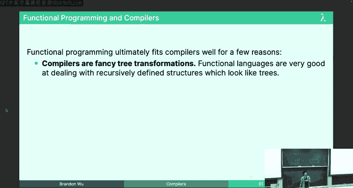
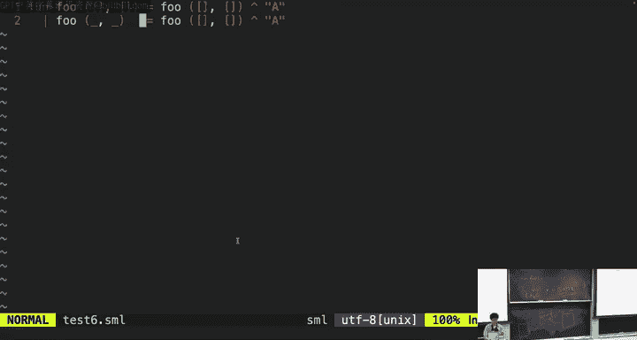

# 函数式编程：P20：编译器

## 概述
在本节课中，我们将要学习编译器的基本概念、历史背景以及其核心工作原理。我们将从编程语言的历史讲起，逐步深入到编译器如何将高级语言代码转换为计算机可以执行的机器代码，并探讨函数式编程在编译器设计中的优势。

## 编程语言的历史 📜

在遥远的过去，编程语言并不存在。人们最初使用穿孔卡片来控制织布机等简单机器，这可以被视为编程的早期雏形。后来，Ada Lovelace和Charles Babbage设计了分析机，被认为是第一台通用计算机的雏形。

到了19世纪末，Herman Hollerith发明了使用穿孔卡片进行数据处理的机器，并创立了制表机器公司，后来发展成为IBM。Conrad Zuse随后发明了Z3，这是一台可编程的电子计算机，但仍然使用穿孔卡片。

早期的程序员需要手动在卡片上打孔来编写程序。如果出现一个拼写错误，就必须从头开始。他们需要排队等待运行程序，如果卡片掉落，程序就会丢失。在那个时代，编程语言仍然不是真实存在的。

## 汇编语言的出现 💻

到了20世纪40年代，人们开始使用汇编语言编写程序。汇编语言是一种低级语言，计算机只能理解由0和1组成的机器码，而汇编语言是机器码的一种人类可读的表示形式。

然而，编写汇编语言程序需要极大的智力投入。程序员必须时刻关注程序的整个状态，任何错误的假设都可能导致无法挽回的错误。尽管如此，编程语言仍然不是真实存在的。

## 编译器的诞生 🎉

在20世纪50年代，John W. Backus在IBM工作，他对汇编语言的繁琐感到不满。他提出了一个想法：是否可以有一个程序，能够将人类可读的编程语言代码转换为汇编语言？

他称之为Fortran。到50年代末，他与一个才华横溢的团队一起，实现了一个能够做到这一点的程序。这就是第一个Fortran编译器。从此，编程语言成为了现实。

## 编译器与解释器 🔄

编译器是一个将数据从一种形式转换为另一种形式的程序。通常，编译器将用编程语言编写的文本转换为某种计算机的汇编语言或机器语言。

例如，你们本学期一直在使用的SML/NJ就是一个编译器，它将SML程序文本转换为可以在你计算机上运行的机器码。

另一个相关的概念是解释器。解释器读取你的代码并直接执行它，不一定需要显式地将其翻译成其他形式。SML/NJ的REPL（交互式环境）也是一个解释器。

我们可以用SML类型签名来描述这些概念：
*   `compile` 是一个 `string -> string` 类型的函数。它接受SML文本并输出汇编代码。
*   `run` 是一个 `string -> unit` 类型的函数。它接受汇编语言文本并直接执行。
*   `interpret` 是一个 `string -> unit` 类型的函数。它接受SML文本并直接执行。

理想情况下，解释应该等价于编译后运行：`interpret = run o compile`。

## 自举：用语言实现自身 🚀

一个有趣的概念是，可以用一种编程语言来实现该语言自身的编译器。例如，SML/NJ编译器是用SML编写的，Python的PyPy实现是用Python编写的，Ruby编译器是用Ruby编写的。

这是如何实现的呢？我们需要区分“实现编译器”和“使用编译器”。

首先，编程语言是一个概念。在John Backus实现Fortran之前，他脑海中已经有了Fortran的语法，但没有计算机能理解Fortran。

当时我们有汇编语言。用汇编语言，我们可以编写任何函数，包括一个能将Fortran代码转换为汇编的 `compile_fortran` 函数。

一旦我们用汇编语言编写了 `compile_fortran`，计算机就能理解Fortran了。现在，Fortran成为了现实。

既然计算机能理解Fortran，我们就可以用Fortran编写任何程序，包括用Fortran重写 `compile_fortran`。

这个过程被称为“自举”。在实践中，你首先需要用另一种语言（如汇编或C）实现一个基础版本的编译器，然后使用这个编译器来编译用目标语言编写的、更完整或更优化的编译器版本。

## 编译器实现步骤 🛠️

大多数编译器都具有相同的结构，包含多个处理阶段。我们将以实现一个SML编译器为例，用伪代码进行说明。

以下是编译器的主要阶段：
1.  **词法分析**：将源代码字符串转换为有意义的词法单元列表。
2.  **语法分析**：将词法单元列表转换为抽象语法树。
3.  **中间代码生成与优化**：将AST转换为一种类似汇编但更抽象的中间表示，并在此进行大量优化。
4.  **代码生成**：将优化后的中间表示转换为目标机器的真实汇编代码。

### 1. 词法分析
词法分析器读取源代码字符串，并将其分解为一系列“词法单元”。这类似于阅读英文时，我们按单词而不是单个字母来理解。

例如，对于SML代码 `val x = 2 - 1`，词法分析会将其转换为一个Token列表：`[VAL, ID(“x”), EQUALS, INT(2), MINUS, INT(1)]`。

在SML中，我们可以用一个大的数据类型来定义Token：
```sml
datatype token = VAL
               | FUN
               | TYPE
               | ID of string
               | INT of int
               | PLUS
               | MINUS
               | EQUALS
               | ...
```
词法分析的结果就是一个 `token list`。

### 2. 语法分析与抽象语法树
程序本质上是递归定义的，这使得它们非常适合用递归数据类型来表示。我们使用抽象语法树来捕获程序的结构，而忽略像括号这样的具体语法细节。

例如，表达式 `(1 - 2) + 3` 对应的AST中，`-` 是 `1` 和 `2` 的父节点（因为减法优先级更高），`+` 是 `(1-2)` 和 `3` 的父节点。

对于SML程序，我们可以定义AST的数据类型：
```sml
datatype exp = Int of int
             | Id of string
             | Plus of exp * exp
             | Minus of exp * exp
             ...

datatype pat = ...
datatype decl = ValDecl of pat * exp
              | FunDecl of string * pat list * exp
              ...
```
语法分析器（解析器）的工作就是将Token列表转换为这样的AST。通常使用“递归下降”解析法，为每种语法结构（`exp`, `pat`, `decl`）编写一个解析函数。

例如，解析 `val` 声明的函数可能如下所示：
```sml
fun parseDecl (ts: token list) : decl * token list =
    case ts of
      VAL :: ts' => let val (p, ts'') = parsePat ts'
                        val (EQUALS, ts''') = expect (EQUALS, ts'')
                        val (e, ts'''') = parseExp ts'''
                    in (ValDecl(p, e), ts'''') end
      | ...
```
每个解析函数都“消耗”掉一部分Token，返回解析出的AST节点和剩余的Token列表，供后续解析使用。

### 3. 在AST上进行操作
一旦我们有了AST，就可以在其上执行各种有趣的操作，因为AST摆脱了具体语法的束缚。

**类型检查**：类型检查本质上是在AST上运行的递归函数。例如，对于加法表达式 `Plus(e1, e2)` 的类型检查规则是：如果 `e1` 的类型是 `int`，且 `e2` 的类型是 `int`，那么 `Plus(e1, e2)` 的类型也是 `int`。
```sml
fun typeOf (e: exp) : ty =
    case e of
      Int _ => IntTy
      | Plus(e1, e2) => (case (typeOf e1, typeOf e2) of
                           (IntTy, IntTy) => IntTy
                         | ...)
      ...
```

**优化 - 常量折叠**：编译器可以进行优化，例如将 `2 - 1` 在编译时计算为 `1`。这可以通过在AST上递归实现的转换函数来完成。
```sml
fun constFold (e: exp) : exp =
    case e of
      Plus(Int i1, Int i2) => Int (i1 + i2)
      | Minus(Int i1, Int i2) => Int (i1 - i2)
      | Div(Int i1, Int i2) => if i2 <> 0 then Int (i1 div i2) else Div(Int i1, Int i2)
      | Plus(e1, e2) => Plus(constFold e1, constFold e2)
      ... (* 对其他构造也递归调用 constFold *)
```
需要注意的是，优化必须保持程序行为不变。例如，除以零的操作应该在运行时崩溃，而不是在编译时。

### 4. 中间代码生成与控制流图
在优化阶段，我们通常会将AST转换为一种更接近汇编、但不受实际机器限制的“抽象汇编”或“中间表示”。在这种表示中，我们假设有无限多个临时变量（称为 `temps`），并且指令是线性的、无嵌套的。

例如，函数 `def f(x, y, z): return x + y + z` 可能被转换为：
```
t1 = y + z
t2 = x + t1
return t2
```

为了处理条件分支和循环，我们引入“基本块”和“控制流图”的概念。一个基本块是一串顺序执行、没有跳入或跳出的直线代码。控制流图则由这些基本块以及它们之间的跳转边组成。

CFG对于优化至关重要，因为它让我们能够分析程序执行的所有可能路径。例如，它可以帮助我们判断一个计算（如 `20 * n`）是否可以安全地移出循环（循环不变代码外提），而不会改变程序行为或引入不必要的计算（例如，如果循环可能根本不执行）。

优化可以分为两类：
*   **局部优化**：在单个基本块内进行的优化，如常量折叠。
*   **全局优化**：需要分析整个控制流图的优化，如死代码消除、无用变量删除等。

### 5. 寄存器分配与代码生成
在最终生成真实汇编代码之前，我们需要解决“寄存器分配”问题。抽象汇编假设有无限个临时变量，但真实的CPU只有数量有限的、速度极快的存储单元，称为寄存器。

寄存器分配问题可以类比为：你有一个生日派对，只有8个座位，但你有很多朋友。每个朋友只能在特定的时间段参加。你需要安排一个时间表，让尽可能多的朋友在他们在场的时间段内都有座位坐，同时避免让彼此讨厌的人坐在一起。这是一个NP难问题，通常通过图着色等算法来近似解决。

如果变量太多，寄存器放不下，一些变量就必须被“溢出”到速度慢得多的主内存中。

## 为什么函数式编程适合编写编译器？🌟

以下是几个关键原因：
1.  **编译器即树变换**：编译器的核心工作就是对AST进行一系列变换。函数式编程擅长处理和变换递归数据结构（如树）。
2.  **正确性至关重要**：编译器绝不能出错。函数式编程强调不可变性、纯函数和强大的类型系统（如代数数据类型、模式匹配），这些特性通过编译器的强制检查，极大地帮助开发者编写出更正确、更可靠的代码。
3.  **确定性**：对于相同的输入程序，编译器应该始终产生相同的输出。函数式编程的纯函数特性天然保证了这一点，避免了因可变状态引入的非确定性。
4.  **语言爱好者的社区**：许多函数式编程的研究者和实践者本身就是编程语言爱好者，这使得函数式编程社区与编译器编写社区有很高的重合度。

相比之下，用C++等命令式语言编写编译器，开发者需要手动管理许多细节，更容易引入错误。



## 总结
本节课我们一起探索了编译器的世界。我们从编程语言和编译器的历史讲起，理解了编译器如何将高级语言代码转化为机器可执行的指令。我们深入了解了编译器的几个关键阶段：词法分析、语法分析（生成AST）、在AST上进行类型检查和优化、生成中间表示与控制流图、以及最终的寄存器分配和代码生成。

我们还探讨了“自举”的概念，以及为什么函数式编程在编译器设计领域如此强大和受欢迎——主要归功于其对树形结构的天然亲和力、对正确性的内在支持以及确定性。



希望这节课能让你对每天使用的工具（编译器）有更深入的了解，并体会到函数式编程在解决复杂系统问题时的优雅与力量。