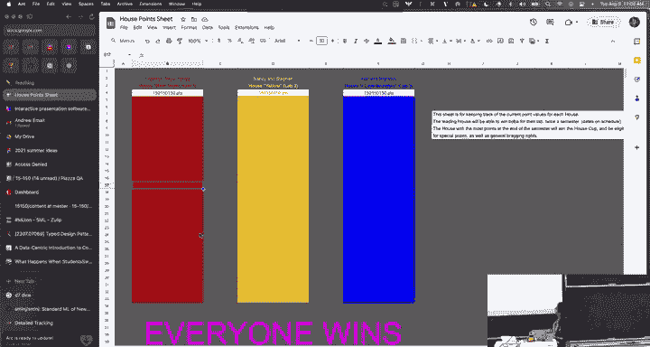
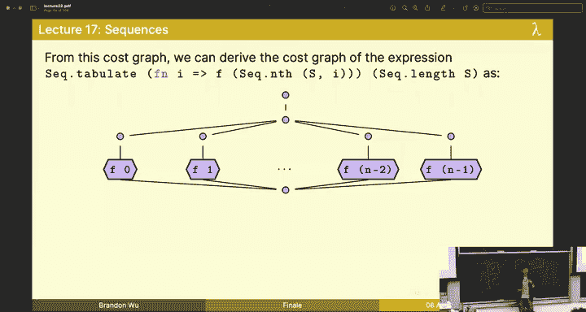
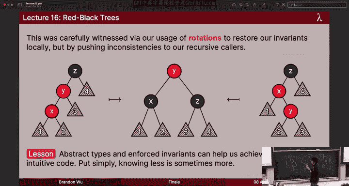
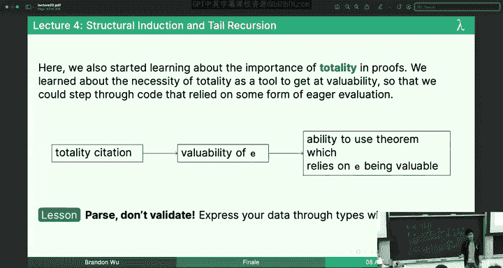
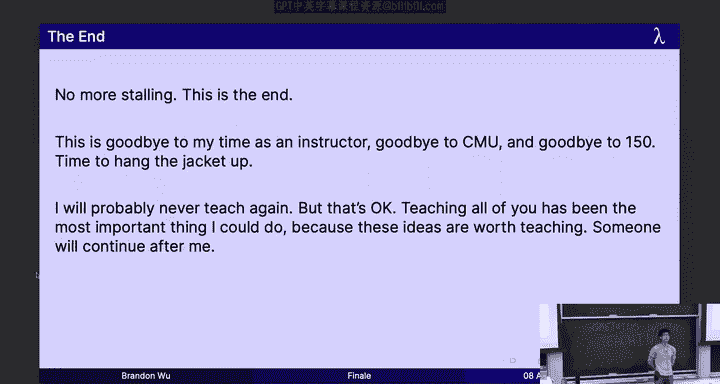

# CMU《函数式编程｜15-150 Functional Programming, Fall 2023》中英字幕（deepseek - P22：-22-22. Finale _ - GPT中英字幕课程资源 - BV12VChY2EF4

Welcome to the final lecture everyone， this is my last lecture。

 one thing I have to get across to you before we start is something I know you're all very。

 very excited for which is the House points and as it turns out。😊，Everyone wins Oh。

 you're all winners。Oh my god， Craig is all of you managed get 150150，150 points unheard of。

 can I tell you in the whole history of teaching this course all of the other times I've taught this course。

 nobody has ever gotten that many points it's a vacuously true statement Leave me alone。

Okay。why rope。Let's get started West shall we so welcome to the last lecture thank you all for showing up I know it's early but it's also the regular time that you all signed up for so also I'm not thank you at all you're supposed to be here。

😊，As mentioned， this is my final lecture。 So I have some things I kind of wanted to tell you about this course。

 I wanted to review the content with you because I know you're all furiously studying for your final exam。

 but I kind of wanted to send up this course and the best way I know how。

 which is standing if I have a crowd of people in talking this is our final picture。

 our final splash for the semester and and the reason for this。

 know I gave you this is actually if anyone recognizes this this is the same one from the first lecture we're kind of returning to our roots And the reason I picked this a long time ago is you know triangles。

 it was kind of a cool geometric shape and the colors of 150 are black and white like this jacket I'm wearing black and white binary like kind of kind of very down to earth and straight to the point。

😊，And I picked this at first for the final splash， but I was thinking。Something doesn't fit。

 And if there's something I know， it's when something fits， when something makes sense。

 when there's like a cohesive reason to be doing it。

And this doesn't fit because what if I've been showing you all semester。

 I've been showing you that 150 is not black and white。

 Funal programming could be no further from it because functional programming is is varying and expressive and beautiful。

 and and it's as wide and as free as the colors of a rainbow or the colors of a parrot's rings or the colors they hide you have at it。

 let's go。😡，How about it， How about it？Thank you。No， no， no， no， no， get them when you get them。

 all right， take as many as you like， please take as many as you like， all right。

So let's take the high chew route。 Let's take the colorful route。 What we've been doing all semester。

 Let's see how colorful we can be。 All right， for one last time， this is my final lecture。 Wecome。

 we're gonna do it for real。 This is the real finale。 And what do I have for you。

 I've got a whole bunch of things to talk about。 We're gonna have to do this justice and we're gonna have to do is the only way I know how。

 So what do we got on a play for today。 Well， I have a pathological need to do everything uniquely and to do everything in a way that is original。

 which means I had to make all these slides by myself to much effort。

 And one thing I got from the one thing I will steal from Michael Erdman who teaches in the spring is this idea that to send off this course。

 What we're gonna do is we're going to rewind。 we'll start at the end and let's go backwards and eventually let's end up going through every single lecture that we've seen thus far and recap what we've seen this is gonna be the highlights。

 This is gonna be the takeaways。 The things I want you to know about each lesson。

 So don't feel like you have to write it down and memorize everything but。

If you've been paying attention， if you're well prepared， everything you see should be familiar。Okay。

😊，So let's rewind， it's like YouTube rewind， except that it's not canceled， it's also better。

All right。It's been a long semester，12 weeks have gone and sword by。 I don't know about you。

 but I feel like I've been here for very little time。 We've made it through fire alarms。

 made it through compiler bugs for real Android machine outages。

 which was a fun email to computing services。 and it's been tough， but we've made it through。

 Allright， you've survived your homework。 You've survived everything。

 You've survived having to take two midterms。 But now we're nearing the end。

 So let's review everything。 and let's go backwards。 Let's go back to the beginning。😊。

Program analysis lecture 21， so what did I want you to take away from this one programs are recursive when you write a program it's just a recursive type。

 a tree， something that has recursion in its structure and that means don't be afraid of recursion don't treat recursion like it's some beast underneath the sink because it can be your friend and as we have seen in this course it has been your friend。

😡，And expressing something as which has so much content as a program can be as simple as you're assuming data type program equals right something with as much content can be just that simple。

 so the key thing to remember here is that，😡，When it comes to use cases。

 when it comes to doing things right， when it comes to making an impact。

I think that program analysis is one of the final frontier use cases。

 I think that it has something really special to it。

So the lesson I want you to take away is don't be afraid to make a real impact by using clean foundations and practical principles and principal methods like adventation you all semester。

 we can make a real impact。 You can make a real impact see me in like two or three years， apply。

 please do。😡，We'll take you all right， Le 20 compilers， what do I want you to get away from this？😡。

Functional programming was made for compilers。 This is a lie。 Actually， it was made for AI。

 but that's different different That's a very different story。The same tools we use every day。

 the same magic that runs through the veins of our computer is exactly the same sort of thing that we have seen by pure functions and tree transformations and safe code。

 all of these things are just correlated。😡，But all these simple ideas I've been teaching you all semester come to head because they build and build and build until eventually you have one of the most complex pieces of software that we've ever created。

 right， one of the most essential pieces of software， the modern compiler。 So don't be afraid of it。

 and don't be afraid to of the things that you've learned。 Okay， cherish it and treasure it。Safety。

 elegance， expressivity。 It's just these three ideas over and over again。

 Everything else is just commentary。So lesson I want you to take down is you nothing can't be understood。

 You can understand everything。 Just break it down to little pieces。

 The same foundations that you find when you're writing a simple treeresome function are the same that run。

The SNLJ compiler or the GCC compiler。Some of the most complicated systems in the world。

I Perative programming， here's the phone one。We learned that functional programming doesn't need to be a binary。

 doesn't need to be an absolute concept because there are shades and there are varying flavors of it。

 and functional programming is just a habit。 It's an idea。 it's a paradigm。

 but it's not an absolute thing so we learned in this lecture about ref cells right I can have a box that contains a value of type alpha that's an alpha ref or some value of type T and then you we also learned those boxes can contain。

Other boxes， which is fun， and allows this litter of indirection we don't normally get。

We learned about these primitives that let us create。😡，Access and modify rep cells respectively。

 And we saw some pretty pictures， which look like this。 This is I you should think of them。

 They're just boxes。 And by opting into these boxes， we can increase our expressivity。

 but not at the cost of foot guns。 Okay， Muability is a foot gun。 Don't get me wrong。

 We don't want to have it on all the time。 That's the thing I told you on the first lecture。😊。

But if we opt in， if we're careful， if we're judicious， if we maintain these principles。😡。

Willll be okay， Okay， so we're not beholden to ideas just because that it feels like we should be or's。

 or it's or it's that kind of vibe。 right， We invent these things to make them work for us。

 So let's do it。Mutability is not so bad。 Just have the choice。 Okay。

 bad things can be good if you have the choice。A lessonson 18， lazy programming。 Allright。

 We learned that we can suspend computations if I have a thunk。

 If I have something like this F N unit goes to E， I have a suspension of E where E is never evaluated。

 E evaluation， because I freeze the contents of a lambda。 I can't evaluate this until I get the unit。

😊，Very， very simple idea。 very， very simple。 This is something that you could have learned from the fifth lecture onwards or the goal。

😡，10 lecture owards。Okay， actually， earlier， I don't care。 Anyways， we have fine green control。

 We can have control over when computations happen。

 but all comes out of this idea of treating lambmbdas as values and simply being able to put things in Ladas。

😊，And we saw the alphapha stream data type， which looks like this。

 which means that I can have a stream， which is a delayed front and a front which is an exposed stream。

 and we saw that by writing mutually recursive functions， we could write infinite data structures。😊。

Fite infinite doesn't matter because I can write things like this。

 I can define the natural numbers via just saying a simple function that has no base case。

 because I delay the rest of it。 This is a very different style of programming that you may have seen in other context。

 But it's very， very cool。 And it's coinductive is the word for it。 you can learn more about this。

 if you take 153 12。 But this is a very powerful idea。 and having that control。

 having the option to control when computations happen。 That's something powerful。😊，So lesson here。

 repeated application of simple ideas can lead to something great。

 We don't need to have fancy contracts， we don't need to have fancy fancy self。

 All we need are lambdas and an idea。Less than 17 sequences。 sequences。 remember。

 we have things are basically lists， but they're for bulk operations on data。

 We represent them by this mathematical notation， and we think of them as immutable arrays as much as you you think of them as arrays in the same sense as you think of the guy in the mascot at at the football game as a human inside the suit like you don't know if for sure。

 but it probably is okay Sand dealo right， they offer the same operations as lists。

 but different use cases， because if you're doing sequential stuff。

 you shouldn't be using them probably because cons is expensive。😊，But that's okay。

And by using a very simple math Ma idea， associivity。

 we can do things like reduce in a lot faster time log N， rather than folding an OM， which is really。

 really powerful， by the way because log N is practically constant so just by adopting this divide and conquer approach。

 the simple recursive idea， we can do all the things we ever wanted to do on sequences。😡。

We also have this idea of cost graphs， remember which are how we diagnose and how we ascertain the cost of functions by using this。

 we can recover the cost of any higher order of function by simply taking these cock graphs and jaming them together Okay so for instance。

 we have the cost graph pertulate which just says do all these guys in parallel。😊。

And then if I wanted to do this Sta tab F and I goes to F of Sta n S I。

 I first have to pay the cost for length， and then I'm going to pay the cost for the nth call and then the cost for F right。

 But all I'm doing is I'm taking these individual cost graphs and I'm jamming them together。😊。

You can understand anything， just break it down into simple， usually recursive parts。

So lesson here is， well lesson here is functional programs are parallel friendly。

 The cooks in the kitchen don't get in each other's way。

 And then you never end up with a plate of marinara sauce on your plate。 Okay。

 easyasy composable bulk operations。 That's what heroism is about。😊，Now all right， Le 16。

 we're on red black trees。 So we learned about red black trees。

 which are a self-balancing binary tree with these three invaris。

 the most important ones being that the black height on any path is the same and that every child of a red node must be black but by employing a strategy where we first break and then restore the invariance。

 we make sure that we never first of all， we cleanly get to implement this insertion operation and we always make sure that our invaris are respected。

 break it and then fix it by pushing our red nodes upwards。 It's a very elegant idea。

 and we saw by employing these kinds of rotations where I take these red nodes and I push the red node up。

 we end up being able to continuously rebalance on our way up。

 which is going to give us that nice insertion operation where we preserve our imvariance。😊。

But the real thing to realize here is that abstract types。

 the things we learned about in the modules lecture allow us to get safer code because you can think past the interface。

 I don't need to think about the little inconsistencies。 I can think via invariance。

 So when we program， program with invariance， go with God。😊。

Okay， Le 15 functors， Fters are maps for modules and modules。

 I can have a module that takes in a module and gives me out another module。

 It's really no different than a higher order function， but what really a function。

 But what we can do is we can have this idea of type classes， which are signatures。

 ways of specifying particular pieces of software and what we can do is we can attach values to types。

 I can have the int type with an attached comparison function like this intor。😊。

But this lets us modularize our code。 We can write code predicated on other pieces of code in a more extensible way than just simple higher order functions。

 And the fact that this works at all that this is theoretical stuff like is possible is only due to decades of research on the part of peel researchers。

 Okay， so this is like pretty impressive。😊，Even if it's easy to take for granted。

And what we saw is that this primarily let us define a polymorphic dictionary。

 we could define a dictionary where our key is now parameterized over any type class so that this key is anything。

 any type and any value that ascribed to or for some type。

 and then I can define my dictionary just as that that's all you need。😡。

Good software should be composable in terms of other software。 If it's not。

 you're going to rewrite the same thing over and over again。

 and it's going to look like my law text slides。 Okay， it's not going to look good。😊，I mean。

 like the source， like it really is truly something awful。 I。

 I thought about whether or not I was going to make it open source。 And then I was like， wait， no。

Okay，14 structures and signatures or modules， this is where we first learned about software。

 putting stuff together， modules which let us organize and separate code into namespaces because we might want stuff that are pered to list to live over here and stuff that pertain to ins to live over here and everything else can go wherever。

😡，So we also use signatures which are the types of modules。

 I want you to see this analogy where we have types corresponding to signatures and we have modules corresponding to values right and functionss and functions over here All right I literally drew that chart for you at one point。

😊，For instance， we might have a signature for insets。

But the real thing that modules give us is this information hiding stuff。

 When I look at this signature， That is all I know about this piece of software。

 That is all I need to know about this piece of software。 I don't care if it's a tree。

 I don't care if it's a list。 I don't care if it's barney in a costume。

 I care that this is a type of sets， and then I can have an empty set。 I can insert， remove。

 and then check for membership。😡，That's all I know。 That's all I care about。

 So separate yourself into two people。 Anyone anyone know， wait， Oh， man。

 thiss gonna be a really bad reference。 Does anyone watch Jackie Chan Adventures。Okay， cool。

 cool cool。 You know， what is like the amulets and give you given powers。

 There's like there's like a ti， There's like a tiger talisman like separates you into your like two different selves。

 like good good and bad。 I think in this case， Tigerger talisman yourself。

 You are both the implementer and the implementee and the implementer knows everything And you as the implementee know nothing。

 Allright， Tiger talisman yourself。 You are oblivious， you know nothing about the internals。😊。

Because it'll make you a more effective programmer for it。

I really didn't think that many of you would jump at that， well， that's crazy。

I just thought of that right now， Okay， but this gives us a lot of power when making software composable and conceptually simple。

😊，So separate your interfaces cleanly， that's what you should take away。Regular expressions。 Well。

 regular expressions are a recursive data type that do a certain thing， right。

 And they let us define languages that we're interested in matching。 And this is very， very useful。

 Okay， like this is a very practical skill to have。

 And we saw that we could simply define the languages matched by a regular expression in terms of this simple rex over here。

 which I'm not going go through one by one。 But this kind of simple mathematical definition。😊。

Crops up everywhere， crops of spinner code， and it will crop the better code because we wrote a match that recursively decomposes on that same definition to be able to match something。

But the kind of thing I wanted you to get away from this is。😡，This proof by picture， this picture。

 if you know nothing else about rex' is going into the final。

 be able to draw this picture because if I give you a problem on rexs， by the way。

 it's probably testing your ability to understand conceptually what this picture means。

 That was the point of the two rex questions I gave on midterm 2， midterm 2，1 and the midterm 2，2。

 okay So this picture， be able to draw， be able to understand why it does what it does。😊。

Prefix match by R， suffix satisfied by K。😡，That's it。

Reasoning by specification is more powerful than reasoning via stepping through code。

 reasonasoning by picture is better。Exceptions， well， we saw exceptions。 And honestly。

 I I think you all got like， I wasn't super into it。 like exceptions or whatever。 But you know。

The point is that it's an extensible type。 we can add constructors to it。 It's helpful。

 and then we can use it as a escape as a escape patches。

 if something goes wrong if you're in the middle of your code and then something you reached something you didn't want to deal with。

 Well， raise， fail to do。 and therefore know you're now a software engineer。 Good job。😊。

Exception handling style looks like CP， but what we can do is instead of having an explicit failure continuation。

😊，I can raise not bound and handle it at my recursive call。 That's all I need to do。

It's okay to take less maintainable shortcuts。 Just be careful， Be judicious。 Okay， point。

 the point where you start getting into， oh， maybe it's okay， try not to get there if all possible。

 Okay， and It want to be responsible for， for an exception being raised。

 and then someone became mad at me for it okay。Continuation passing sail。

 and now we're truly back in the weeds。 This is at the halfway point in the courserus。Cps is hard。

I know you all know CP is hard， but it's not so hard if you can take the right approach to thinking about it。

We've got the tree sum function here。 And what I want you to realize is this is literally just an algorithm。

 The whole point of C is。You know， if the idea of direct recursion is do it。😡，The idea of CP is。

Do it in a continuation。 Just do the operation you would have done with the rehearsive call。

 but in a continuation。 So if I start with tracesome first， I replace my rehesive calls with。

Placeholder variables。 Then I add in calls to my recursive function that pipe into lambdas that bind it to that。

 Does everybody see why this third one should be essentially equivalent to this first one。Thumbs up。

 thumbs up give me as temperature check on this。More people，Okay。

 when we pipe into this function here， right， we just get to。

 we get to bind and tree sum of L to res R。 And it ends up just evaluating to this。

 So if you're able to think with this piping idea， why did I pipe it like this at all， right， Well。

 it turns out we're gonna to be able to use this analogy to make it look simple and make it look similar to real CP because the next thing we do is we say。

 instead of piping into this continuation， What if I give the continuation to the argument。

 I make it something called a cruel function。😊，So I kill the pipe， I add this K function。😡。

And then I pipe into K when I return my result， the handshake， I have to maintain my pact。

 which is that I pass my rehearsive result into K。Okay， complicated things can be made simple。

 You just need an algorithm for it。 Okay， you have a procedural way to solve。

 and then any dummy can do it。 A machine can do it， alright。Combininators in staging。 Well， okay。

 this one， we talked about staging， which is this idea that if I do fu X， Y， which is cur。

 and I have a horrible computation on X。 And remember， this horrible computation takes three years。

 takes a long time， okay。I could write it like this， and said。

Where instead of accepting the current argument why and immediately calling horrible computation。

 first I call the horrible computation， and then I return a lambda that takes y。😡。

Why am I doing this？ Well， it means if I partially apply fo as that is， if I do something like。

Val F equals p of2。This takes two years or three years to run。

 but every subsequent call F takes constant time versus if I did F of 3，2， F of 2，1。

Which does take a while， okay？We can be smart about where we put our work。

 We just need to be able to have simple concepts， like hurrying。And then we also learned about pipe。

 which is you know my favorite， I love pipe， okay， maybe some of you don't love pipe。

 Well let me let me take a shel， who likes pipe， raise your hand。Okay， all right， all right。

とやら every timeな。We're aware of that one it's not our fault， okay， blame the people who came for us。

Anyways， we have this very nastyy call where I heat the oven to 400。 I insert the tray of Ros Ro 6。

 I wait too and I remove and look at how many friends I used as's too many friends。

 I can't have that many friends。What do I do， I use my pipe and。And I pipe into each。

 and now it reads like like a sequence of operations， like a cookbook。 What's lesson here。

Pretty privileged is okay， but only for code， okay？All right， Le nine。

 we're on the double single digs now， higher order functions。

 which is my favorite lecture in the whole course， we learned about curing。

 which is just a function that takes in multiple arguments by returning functions that take in the additional arguments right we're familiar with that by now we've seen a lot of examples。

So for instance， if I had add of x comma y goes to x plus y， ins start in to in。

 it takes in a tu of two ins。 It takes both ins at once。 But add C。

 the curry form of add is a lambda that returns a lambda。

 That returns nothing because I forgot to put x plus y here。 But if x plus y were here。

 it would be correct。 Allright and we can have syntactic sugar to declare it as well because I just do the thing right。

 space separate the arguments Curry is very， very useful。

 It's way more useful than having twos a lot of the time。😊。

Because it gives us this idea of partial application as well。Okay。

 and we also saw that hops are really important because it lets us factor out common patterns in our code If I have functions like some and concate。

 you know， some or some sums everything on the list and concatenateates all of the strings。😊。

You know， same text versus semantics， when I look at this code， I see the same thing。

 I see the same function。😡，And maybe you're starting to see it， too。

 because when you look at this code。I see a fold。 and it turns out that when all of this code。

Exhibits the same pattern。 The really great thing about functional programming is that we can isolate those patterns。

 and we can compose them， and we can define every function ever via a few simple， primitive。

 higher order functions。 higher order functions。 Wing code os they're an essential tool in functional programming。

 b，h， blah。 It open the door to a lot of other things。 like we wouldn't be able to do match。

 We wouldn't be able to do CP。 We wouldn't be able to do lazy without this idea of being able to have land is as values。

 functions as values。 It all comes down to one simple idea。 What if functions or values。

 It opens the door to so many other things。😊，Writing code is good。

 writing code that writes code is better。I'm not talking about LOMs here。All right， polymorphism。

 she's over there。So before we could learn about hops。

 we needed a way to generalize the types of our functions。 And this is very， very important。

 Funs of potentially arbitrary type。 How do we do it。 Well。

 we found out that we could instantiate our functions with just simple type variables。

 We could assign a variable to each type by saying that if I had fun。😊，F， X， Y equals ifx。Then why？

Else 2。We collect constraints on each of the variables。

 we start with a simple polymorphic type variable for each， so x starts as alpha， y starts as beta。😡。

But what do I do， I see that we do an if on x， therefore， what is it should be a bo。😡。

I see that we return Y， I can't really say much about this here。 I just leave it be。

 but also this type needs to be the same as this type right， therefore y should be an end。😡。

And then the return type of my function is the same as y or2， which is an end。 So I end up with bo。

To end to end。Simple procedural rules are all we need to solve these kinds of things。

 but having that extra flexibility in our types makes all the difference。But so yeah。

 most general types。 And we saw this kind of idea where we have a most general type where all of the types I could have。

 you know， my least common ancestor is going to be the， the most general type for my function。 Okay。

 the， the thing that joins all of them together on this， on this sort of type tree。

 all you need to be able to visualize。😊，So we get concrete benefits in our code just by adjusting type structure a bit。

 It only takes a little bit to take us very far。 That's the common idea here。 right。

 We only need to take make our types a little bit more powerful， and we get the world for it。 again。

 take 153，12 for more on this。😊，Sorting and parallelism Well we're back into the math here at this point。

 we were more concerned with math in the formal parts of analyzing code。 We've always kind of had it。

 but I've I've been more preoccupied with other things in the past month or so。

 But we learned about the tree method and the tree method lets us solve recurres that have this form where it's like W of n equals And somewhere in there there's a2 w of n something like n over 2 n minus2 I don't know。

 I don't care。 some quantity in here。😊，But the tree method lets us solve recurrences of this form because we sum up the work per level of the tree induced by these calls。

😡，So， for instance， if I had in word Oh no， actually sorry。

 I just have a general recurrence where W of n expands to W of n over 2。 Sorry， it looks like this。

 The call tree looks like this。 So what if I just。Some of the non recursive work。

At each level of the tree。Then I'm going to get my answer， right my closed form。So for inor。

 this specific recurrence， I might do this where I've read being my recursive calls and purple being my non recursive work。

😊，But we saw it induces this kind of tree structure right where my size is dividing by two each time。

 but each time I also divide my work by2。 So on the whole I end up with C sub2 times n over 2。😡，Yeah。

 yeah， Multi。 Yeah， yeah。 see some two times that number two per level， right。Very， very simple。

 All you need to do is be able to sum up per level。 simple and mathematical tricks。

 I taught you somes some nice mathematical mmonics。 Remember those is's a question。😊，要 back过。

All right。I mean learned about span。 if we have infinitely many processors。

 It doesn't solve all our problems because we have intrinsic data dependencies。

 But it's important to think about how your code would run in a parallel situation because sometimes we're interested in brute forcing traveling salesman。

 Okay， which， by the way， is a stupid idea。 But sometimes you're taking 154 18。

 and it's your homework assignment。😊，So we're interested in being able to have this idea of spin a parallel cost。

 and if you take 15 to 10， they will tell you more。😡，But we saw this in the use case for merge sort。

 where we can get an O of n span， I don't know why I log in there。

 which is a very simple implementation。😡，Which you can look at and remember the good times for like five seconds。

 but I'm not going to go through it。 Okay， remember the good times。😊。

But this is probably one of my favorite pieces of code in this entire course。

 because I think this is one of the first times you can really see SNL code and be like， wow。

 that's nice。 that's beautiful。 That's very， very elegant。😊，I don't want to chase pointers。

 I don't want to deal with it。 Let's just go ahead。Complicated things can be simple。

 just use them recursively， and recursive mathematical analysis will be easy too。😊。

We almostmus at the beginning and beginning before we could talk about parallel complex complexity。

 though， we had to talk about generally doing runtime。 So we did that。 Remember。

 you didn't even know what the recurrence was by this point。

 but we could derive a recurrence for our abstract units of cost by just denoting some kind of constant cost per certain operations and then solving a recurrence。

 a recursive formula。So for instance， we got a base case for our tree sum which comes out of our base case in this code and we got a recursive case out of our recursive code as well right and we have to define some notion of size if it's a tree could be the number of nodes。

 could be the depth and either or fair game for you to be asked okay if it's a list。

 usually it's the length of the list， if it's on numbers， usually it's the magnitude of the number。

 but that size metric is important。😊，And we can just solve it out in terms of N sub L and N sub bar。

 which differ based on whether or not the tree is balanced or not。Trust math， if you just use math。

 things can be very， very easy to understand。Trees。Very， very nice Socrates。😊，We learned about trees。

 which are one instance of data type declarations， right， We've looked at a few of dis course。

 We looked at the compiler optimization one， which was like the program。

 We've looked at regular expressions。 We've looked at ones that have what is it。

 Ones that have corn and potatoes and and all sorts of food。

 we've looked at these data type declarations。 And it might seem silly and contrived when we design them to fit these very particular scenarios。

 But the strength is that they can fit those scenarios at all。

 structural induction can be carried out on any recursive type。

 Things that might not look like lists might not look like numbers。

 because induction is a general principle， and recursive data types are more broad than numbers。😊。

Okay，Previous， when you learned about induction in concepts or high school math or whatever。

 that idea was a narrow one， but we can expand this to something that's way more broad。

 way more elegant。😊，And then what I want to say about that was the proof follows the code。

 When you're writing a proof in this course， Look at the code。

 The code and the lemmas and the various definitions thereof are all you know。

 when you don't know what to do next， refer back to the code because it will tell you what to do next。

 Okay， And when you write your proof， the proof reasons the same that you reason about the code being correct。

 Okay， just follow the code。 It's all you need。 So， for instance， if we're doing it on a tree。

 you get two induction hypotheses。Writing code is like writing a proof。

 I' have said this to some of you in office hours， but like。Some people might be might be like。

 why are we writing proofs that are really stupid。 Why are we proving tree sum is correct。

 T thumb is very obviously correct， right， And that's that's right， But it's like a muscle。

 You have to train it because if you don't have that ability。

 you get it eventually by doing this enough times。 I never write a proof of correctness or totality on paper。

 Okay but I do in my head when I'm writing the function for the first time。

 I'm doing the proof in my head as I think I make the recursive leap of faith。

 And I think about my induction hypotheses。 And either I come up with， oh。

 that feels right or that feels wrong。 And more times than you would think this ends up with me being like。

 oh， I know why it's wrong。 It's because of bla bla b train that muscle。

 be able to write proofs by writing code。And I'll say like an impoverished view of programming fits problems to certain types。

 But as functional programmers， we fit our types to the problems。 We have that privilege。

 Some people don't， okay。Structural induction。 Well， I kind of led to this already。

 but it's an upgrade of induction， right， At this point， we。

 we thought the induction was just on the natural numbers。

 but we can induct on lists and we can induct on trees。

 N and N plus1 are really not so different than X's and x cons Xes。Think about it that way。

 by analogy， right， And I introduced this idea of parse don't validate。

 And I think I mentioned I was going to link the blog across。 and I'm not sure I ever did。

 It's probably in the original slide。 But express information through types when possible。

 No one wants to see code Look like this。Look at this。 Remember when I show this to you。

 You can check when the list is empty or n is 0， or you get the head and the tail。

 and then you do a bunch of crap。 No， use pattern matching look at the data for what it is because we have that privilege。

 We don't have to use these silly accessors all over the place that costs us time costs us space and costs us space in our brains because I don't want to think about all this random nonsense that's happening。

Write it simply， write it cleanly。Okay， and also， this is where we start learning about totality and proofs。

 Toity is a tool。 It'll show up again。 Sorry， but but if you didn't get totality。

 all the sugar su is this idea。 We use totality to get at。 the v of certain expressions。

 which let us use theorems or definitions or lemmas that rely on evening valuable， Okay。

 Toity doesn't matter。 Val is who we care about。 okay。😊，There's an immoral analogy I can make here。

Pase， don't validate。 express your data through types。 Tys are your best friend。

There is no analogy。 Allright， induction and recursion。

 So this one we talked about before we could talk about structural induction。

 we had to talk about normal， boring induction。 But we also talked about this idea of recursion。

 We saw that also。Induction on the natural numbers is really just structural induction on this data type。

 right， That's all it is。 So structural induction is strictly more powerful and strictly more interesting。

 So stick with it。 Okay， base case， induction hypothesis， Inductive set。 repeatat。

 You all have done this many many times。 I know you've got it down pat。 So just stick to that。

 and you'll be okay， alright。😊，And we learned about the recursive leap of faith。 right。

 if you write a recursive function， assume that it already works。

 and then just so happens that by God， it'll happen working， it'll happen to work。 All right。

 things will work out the way that it should。 All right， I don't believe in destiny。

 I do believe in recursion。So we call and， and I want to say again， like this idea。

 which is that like this idea of solving infinitely many problems in a finite amount of space。

 We have a word for that。 It's called induction or recursion。 These are the same thing。 So don't。

 don't expend the energy in your brain to think of all these things that are completely unrelated。

 No， don't step through the code。😊，Do the rehesive leap。 All right， jump off the cliff like a leming。

 All right， it'll do you good。And then lesson than two， that's a myth， by the way。

 Lemms don't actually die。 It I'm not even sure they jump off the clips。 It's folklore。Lesson 2。

 at this point， we didn't know anything。 All right。

 you all didn't know anything about the quantum in this course。

 but you had this idea that I tried to develop， which is that at this point。

 we were still getting the basics of SML， right， we were talking about extension equivalents。

 which has come into play so many times throughout this course。

 And I cannot get across to you how important it is to be able to talk about code being equivalent。

 sometimes I'll be writing code。 And I'll like I'll be like I'll be refactoring code and I'll be like wait。

 this is so simple。 I can just move this here because I know that it doesn't have side effects and I won't do anything。

 And it's okay， And then I'll message my teammate， I'll be like I am so glad for equivalentence for code equivalentence。

 because if I didn't， I'd have to untangle this caps crad or pointers and nonsense and it would be terrible。

 Okay Im not paid to untangle strings。😊，So we introduce this idea of binding。

 which is different than assignment because a value of a variable never changes when you bind it when I say something like。

Oh wow， I forgot miss forehead stuff on it。嗯。When I say something like B x equals 2。

And I say something like v x equals 3。😡，I am not mutating the value of the value of x。

 I am introducing an unrelated X that is bound to three。 same name， different people。

 That's all that's happening。 But this very simple idea is just the idea of immutability Make sure that your variables don't change。

 And then guess what。 You don't have to deal with foot guns。

 You don't have to deal with knowing the entire history of your program up until a specific point to be able to understand what it does。

😡，That's a fcon if I ever heard one， okay。Finding is not assignment。

 We can get many benefits from just thinking about immutability， this idea。

 and it shows up in all sorts of languages。 Okay， pick your favorite， except for C。Right。看。

Back to the beginning。We're here at the prologue。This is where we started。

And we started with a lot of things。One thing I wanted to talk to you about is in the first lecture。

 I introduce you type disciplines， I introduce you standard amount， and I made some promises to you。

I am not a liar。😡，I am not a liar by choice。 Okay， I'm not saying I'm li to you now， but I'm。

 I made a few promises。 I want to make sure that you feel like I've， I've kept up with them。 Okay。

 so let's talk about those promises。 First one of the things I talked about was these three theses。

 which I've been going back to periodically through the source。😊。

Let's talk about them now that we know what we know。 now that we have all the information we have。

 I also made this claim to you。Functional programming is nothing more than an improvement on our ability to program。

 It's a refinement on our ability to communicate， because programming is just communication。😊。

So think of me as your relationship coach for programming。 Okay， we can communicate better。

 We can do all this stuff。So how have we kept up these promises。

 how did I deliver on my foreshadowings， my musings， okay， my previews， as much as I love them？

Course themes， this is going to be our second and middle section。

And we're back to the default code scheme。😊，On the first day， I pose this question to you。

 what is programming， what is good programming， What should good programming be。

 Does anyone remember what those three things were， There were three of them。The same one remember。

 and if not， that's okay， I'm just curious， to be honest。

And I will use this awkward salad to drink water yeah。Readable wasn't one of them。

 but it mattered was。A secondary idea。 Okay， let's go with it。 None of you know， that's fine。

Programing should be descriptive， modular， maintainable， let's not have go tos。

 I'll talk about it okay。😡，Programming should be descriptive。 I gave you this idea of go tos， Okay。

 which is the this completely unreadable， undescriptive code。 It's nonsense。

 What the hell am I looking at when I look at literal spaghetti code with pointers that go all around。

😡，Nonsense， okay， we've seen many examples of descriptive code。 We've seen specifications。

 formal mathematical specifications for what our code should do。

 We've seen pictures of what our code should do。 That's descriptive。

 We've seen interfaces that describe parts of our code， which describe the behavior。

 because what is a type。😊，Other than a description， a description of what a program might do。 Okay。

 so giving our code， these invaris can help us to write descriptive code and things like algebraic data types。

 Parametric polymorphisms， hops make us able to express so many different problems in programming。

 We don't have to deal with silly， you know， coding hacks。

 like function pointers to get at to get at what is ultimately just these things。😊，Okay。

 you know what I mean， which is like， look at what they must do to approximate the fraction of our power。

 Like that's literally what function pointers are in comparison to closures。 Okay。

 so we can describe more problems， but we just need the right tools。 And this in this course。

 I've shown you the right tools。😊，Programming should be modular。 Well。

 you probably guess I'm going to talk to you about literal modules。

 Okay which are software components that we can mix the match and look at via their interfaces。

 only their interfaces， Tigerger Talisman and yourself， you are the implementee right， Yes。

 you're the implementee。 Okay， you don't know what's going on inside。 and that's good for it。

 You are more powerful because you did that。😊，So for insets。The， in the internal implementation。

 I don't care。 I don't care。 Just hide it be opaque description。 And that makes our code modular。

 because when I refactor an opaquely ascribe module。

 literally nothing else in my program has to change。 I just change this one local part。 No。

 I don't usually。It would be very， very hard to suddenly introduce like some kind of exceptional behavior unless you did it wrong。

 okay。So do it right as well。And having this emphasis on types leads to module La code as well。

 If I have an expression and a value， I have a very specific type for it。

 Maybe it's an instance of a greater type， but it's very specific， usually。And then maintainability。

 Allright， this has been a course on programming better。

 and this has been a course on proto people that probably want to go out and write software for most of you at least。

 Okay if you don't write maintainable code。The people who write code with you will hate you。

 and you will hate yourself。Do not hate yourself， this is a motivational talk。

Right maintainable code， Having this idea of extensional equis。

 or as I call it the refactoring lemma， means we can swap equals for equals。

 which is superpower by God。 being able to do this is the most powerful thing。

 But if you can't do it， you're a screwed。 Okay， so also having types is helpful for maintainable code。

 because if I am refactoring my code。 and I have an int and I accidentally make it an ink tree。😊。

I'm not going to get to run my code without knowing the compiler will probably yell at me。 Okay。

 there are cases where you could do this but it。 It's not in real code，😡。

Python will run looking at it anyways，Don't do that。 Don't do that to yourself。 All right。

 Funal code is not just like a nice look at， but if you have Terse understandable code。

 which I posit to you， we've seen thus far。It will lead to more maintainability。 Okay。

 you have to understand code before we can maintain it。 Okay， I see this every day at work。 Allright。

 we look at our nice Oca code base， which we're so proud of。

 and we look at other things like open source repos。 And I'm like， well。😊。

Guess I'm not looking at this today。so。What about the three theses， Well， okay。

 anyone remember these ones， these ones actually cropped up after the first lecture。

 So I expect some of you might know。 what are the three theses， anyone have the guess。😊。

Give me a hy drinkne。Give me a high chew。 Give me a high shoe。 Give me a high。 Give me a you。

 Allright， alright， thank you。 Allright， Not quite。 Not quite。 Not quite。

 I was gonna give you a high trick， yeah。😊，Yeah， that's one， I'm going to throw this anyways。

Yeah mathematical and third that is true giving out high juice feels a little more unhelpful when they're literally on the floor everywhere。

 but yeah。😊，'ll video before joining。There we go， let's go。Recursive problems。

 recursive solutions means don't let recursion be the bogeman。

 Don't let it be the Gremlin hiding underneath the bed。 You don't need to be afraid of it。 Okay。

 you know， I like to think like someone you got an imperative programmer and you go up to them and you say recursion。

 and they go， right， don't be that。 Allright。😡，We've dealt with recursion。

 literally the whole semester。 We're pros。 you're pros。 So don't be afraid of it。

 Recursion is something that isn't meant to be feared。 It's meant to be used。 It's a tool。

 Make it work for you。 I'm not saying show it everywhere。

 but it comes up in more places than you might think comes up in a lot of places。😡。

If you think with specifications and you think with imvariance。

 recursion is second nature program with the code， not against it。 Okay。

 and then tree like structures and linked lists and stuff like that。

 They're very naturally recursive， which is a great thing。😊，系。

Programmatic thinking is mathematical thinking。 I said this thing to you on the first day。

 computeruter scientists were mathematicians first。 Alright， so harness your inner mathematician。

 Okay， before you can write any code， you have to be assured that it works。

 You have to be assured that you can problem solve。😊，Oh boy。

 math happens to be about problem solving。Who would he get？So work and span， induction。

 essential equivalents， formal specifications。All of these things let you think about code in a more mathematical way。

So do it， understand problems better and solve problems better。And T guide structure。

 I argue actually this one probably is the most important one from this entire semester。

Let type dictate your thoughts， close your eyes and see Ton mismatch when you sleep。 Okay。

 like these the types are the foundation， the blueprints that software is built upon。

 You cannot build a house without building up the structure of the house first， okay。

So all these things are codified via types， the construction， destruction， interplay of data。

 all these things are just types at the end of the day。So currying hops， CP， laziness， polymorphism。

 all these are just things that come out of being like， what if we had X， Y Z。

 little widget in our types and then running with it。And our code is all the better for it。 Okay。

 but just let types guide the structure。 Let types be your。Spirear animal。

I don't know what I'm saying， right。And addition to those。

 I have a couple sayings that I kind of just thought came up。

 I planned out the three theses before we began the course。

 but I again began to realize that these four things kept coming up over and over again。

 So these ones that we kind of discovered。 I don't think I never necessarily said this one out loud。

 but be clever by being dumb。 And the idea of it is simply this。

I feel like functional programming is a bad rap because people are like， oh。

 these people are so smart and they're so theoretical and they professors，lah，lah。

 blah and some people think I work maybe even think like oh hes like he likes functional programming because he's smart。

 he likes types because he's smart。😊，I like types because I'm really freaking dumb because if I didn't have types to guide me as my safety net。

 I would make like 90% of my code would be garbage。 Okay。

 I don't like functional programming because it's clever or because it's it's cool。

 I like it because it's reliable and because it gets the job done in an understandable way。

 so the type checker on the first day I said， you know it's your worst enemy at the beginning。

 And now it's your best friend。😊，I'm not going to ask you to raise your hands for that one。

 I feel like I'm not sure if I would like the answer。

 but I am squarely in the best friends camp because the type checker saves me from making stupid mistakes。

That's all I need。Learning to program like when you're a student like you are right now。

 you're learning all sorts of stuff， you're learning about Maic and you're learning about CP and you're learning about I don't know quantum computation and it's all cool and it's all great。

 but the thing you have to realize like is that that's for school and that's great and I don't want to take that away from you but also like learning how to program well has entailed for me learning how to suppress that urge of oh this is so clever。

 oh this is so cool oh my God because guess what clever is not。😊，Clever is not maintainable。

Nobody wants to read your clever code that has ever seen that quick thing where they approximate the inverse square root by like ending with like some terrible like like literally looks like this or something and they have this like Eldrich magic number okay and then they like do some bitwise operations on this and then that's the inverse square root。

I don't care about your clever code， give me readable code when I would work with you， I'd be like。

 oh， that's so cool， I hate you okay that's exactly what I would come out of my mouth all right。😡。

Rightite code that speaks for itself。 write code that's simple and expressible。

 and it gets the job done because then you will get the job done。

 And then they'll like throw you gold coins or something。 That's how jobs in the real world work。

 okay。Self defense against yourself， I said this one a few times。

This has been a class on learning how to program well。 I know you know how to program。

 but I hope that now you feel like you've learned how to program better。 Okay。

 learn how to live with yourself as a programmer and as a human， too， I hope。

 But we're often our own worst enemies when we program because we write something And we come back to it later。

 And we're like， whos the fuck with this。 Like this is nonsense。 And we're like， oh。😊。

Committer was Brandon wu seven days ago。 and you're like， oh， well， that suck。 right。

 don't leave book on your code。 Don't leave， don't push off work to the future。

 Make stuff as easy as possible for you and for people you work with。

And this is the first step to learn how to program well， defend yourself against yourself。

Self defense。Okay， okay， and then I also said this a couple times， we are in the business of writing。

 not code， but correct code。If you write non correct code， you haven't written anything。

 You haven't gone anywhere。 You've just like jobs in place for like 20 minutes。 Okay， you're。

 you're trying to get all the way over there， but you're， you are， you're missing up on the marathon。

 Some people are in the business of writing code。 They're just there to produce volumes of code。

 okay。I don't want to have anything to do with that， but if you want to do something。

 if you want to like really write stuff that matters or like or that people would like， okay。

 let's say right correct code， it's in your best interest。So reasoning about specifications。

 type safety， essential equivalents， all of these things have just been extra steps towards making less mistakes。

 which is really a thesis of the course， make less mistakes。😊，And then finally， do it。

 but do it better。 Or we can do it better。 right， Firstly， I told you this。

 we're here because you know how to program， but you need to be whipped in shape。 Okay， you need to。

 this is the， this is the training scene from Milan。 Alright， we're tranquil as a forest。

 but we gotta， we got to burn with fire or whatever。 Okay， the point is。😊，あ。

The point is self improvement first you have to be open to improvement all right so we break you down to your constituent atoms and we sit you up together throughout this course through CPS through DPLL through all these assignments。

 all right so that we can improve our ability to program that's all we want knowing how to do something is cool but knowing how to be really good at something that's cool as well。

😊，So for instance， conquering use cases， instead of rewriting functions over and over。

 let's use hops， instead of running into errors at runtime， let's catch those as staticically。

 let's compiles have compiler warnings， and instead of using redundant representations。

 use algebraic data types that fit your problem exactly like a glove。😡，We have the power。

 powers in your hands， it's just up to what you do with it。This is not meant to be a romantic advice。

 but it could be。There's always better right。I don' know don't know if this is what you thought whenever I say you can do better to this course。

 but that's what I've been thinking about。He。Nothing， nothing， nothing。All right， before I go。

 I wanted to give you a parting note on tribalism， and this is actually maybe one of the most important things I can tell you。

 it's not actually。I go back and forth on this， but what does this stand on the back of my jacket。

 it says functions are values， which is。The model of our course， you know。

 functions are first class values。 That's an important idea。 It's a good idea。 Don't get me wrong。

And I'm sure you know that you know， over there in the other side of the pond。

 we have our nice little pals from。You know， I don't even know that can even。

We have nice laps here who believe that functions are pointers。

 and I don't need to tell you that this is a point of contention， right。

My parting gift to you is that functions are as in。😡，No one cares。Okay。I think functions are values。

 I think it's very important that you've learned to learn this way。 I think it's very。

 very important， which will'll listen to you。But it's not okay， to language bash on people for it。

 It's not okay to split the world into two tribal camps and then say these guys are good and these guys are bad。

 And I when I've done so in this course， it's usually for comedic effect。

 but it doesn't matter because these things are contextual。 functionalal programming。 I love it。

 but it's good for certain things。 Prom I'm interested in。It's less good for other things， okay？

So this is a note on empathy。 Have some empathy。 It's not okay to language bash。

 It's not okay to judge someone based on what they， what they do for their paradigm。

 It's okay to to want to educate someone， to want to teach someone， but。

Don't try to make that judgment。 And I， I wanted to say this because I see this all the time。 Okay。

 it's a very see thing of， oh， you're， you're， you're doing that and you're doing that。

 Who cares Alright， to be， to be say to be， to be， you know， totally fair。 This is a school。

 and you're like children。 But like， I， I do wantan to， I do want to let you know that， right。

 I do wantan to， I want to get this across to you， right， I do want to tell you this okay。😊。

SML is a tool， Okay， there are use cases， there are really good use cases， and it's very。

 very important I taught this C。But don't be a jerk about it。 Okay， have some empathy。

That's all I wanted to get across。It's not a well defined thing。

 It's not worth wasting your energy meaning。 They are the in group and， and we are the outgroup。

 We know better。 No， the world can stand to be a bit more functional。 I agree， but it's a spectrum。

 Okay， It's never a binary。嗯。Funal programming， as I said on the very first se。

 is exactly what I said。 Okay， it's a mindset。 It's a habit。 It's a style。 It's a paradigm。

 It's just a matter of how you use it。 Everything you do from here on out。 Every course you take。

 you can think functionally。 You doesn't need doesn't mean you need to do 154，51 and S ML。

 like I did。 Okay， but it can just mean that you think a little bit more about safety。

 You think a little bit more about specification。 You think a little bit more in general。

 before you start coding。 Okay， that's also a really important detail。😊，Safety， simplicity。

 expressivity， I think that these are very important ideas that we've been using this semester。

I promise you that functional programming is a way of improving our ability to program。

 And I see that。 And I believe that wholeheartedly。 I hope that in some way you see it， too。

 because programming is， is just a linguistic phenomenon。 It's just communication。

 It's me standing on on the side of the room here and going， hey， Alice， can you give me X co Xs。

 And then Alice， you know， goes ahead and gives me a list， right。😊。

But functional programming is just about how we can make that communication better。

I'm going to borrow another thing here from Michael Urbin when I say something you can get across。

 and I hope that you see now from from this class is the fact that。Code can be art。 Code is art。

 Code can be beautiful。 Code can be expressive。Coode can be beautiful。

 and code can be something that explains an idea better than you could in your own words sometimes。

And code can change how you think。 And I hope this class has changed how you thought。

 So this is the first and I'm done， by the way。 this is the first chapter of the rest of your life。

 as I promise you， But knowing what you know， you can't go back。

 And that is what I set out to do on the very first day。 I set as Robert Harper likes to say。

 I set out to ruin you to ruin you forever。 And now the doors is closed。 It's a one way door。

 You can never go back。😊，Because you are forever a functional programmer， and'm still not done。

There's the reason why I have 20 minutes here， okay？Okay， so。嗯。

This class has been a labor of love on my part for the past six months of my life。 And actually。

 before that， the past four years of my life。 Okay。

 and I it wouldn't feel right to do something without saying goodbye in some form。

 But one thing I need to do， I have this little rule。 Okay。

 every time I make a joke that I didn't think of， I have to cite it。

 I'm not allowed to make jokes that I did not think of myself because it would be unfair to make people think I'm funnier than I am。

 Well， you know， so basically， this idea comes into play again， when I say that。😊。

There are many people I have to acknowledge。Teaching' is not just one guy up here doing everything okay as much as I like to phrase it that way to you on the first day。

 it's the combined efforts of everyone that I've worked with。

 my staff and the people that I've been taught by and taught with for literally years。

 So a lot of people have shown their faces in this class without showing their faces like you don't know their names。

 but they were here。And the list is very， very long， but I'm going to try by Jo。

So I teach this class for many years。 I teach this class for four years since I was a sophomore。

 basically， well， three years，3 and a half。 and through years of 1，50。

 I've met people that I consider my friends。 I consider my mentors。

 and I consider people that I will know for the rest of my life。 Okay。

 but they influence me every single time that I teach。 And so the list of people is。😊。

Everyone I've ever teeed with。Because some way， small or large。

 they have showed up in this course in some way。 And the list is long。

 but the impact that they've had on everything that you've seen this semester has not been small。

 Okay， and some people， I， I could shout out a bit more particularly than others。

 But those people know who they are。 Okay， but this is a list of of。All times a we had。 And honestly。

 I wanted to also give it up to my T As for caring。 And for always having your interests at heart。

 They do so much work and you don't know it behind the scenes。 Okay。

 you have no idea the amount of work。 So please for your T Asre seat on the sides here。😊。

They're on the ground manning the inventoryry units。

 I'm up here and like the guys sipping a cup of tea and going， huh， that's quaint anyways。😀呵呵。😊。

I was also on the trenches ones， okay， I get to be up here now。Okay。And also I led this。

 but the people that I've met over the course of this class。

 some of which I left behind so I could come here for three months。Also， my friends。

 who supported and kept me sane throughout this summer， who I really am thankful for。😊，Dilson Kear。

 our lovely faculty mentor who has advised me on many a things this semester。And S。

 because they were not just only cool with me coming to come here to teach and like basically take off from work。

 but they were like， hey， will you like some gold coins and I was like， yeah。

So the shirts are not here yet， by the way， I'm sorry。I'll have them by the final exam， actually。

 let's see FedEx， nope， all right。😊，It would have been here， but they were late。And then finally。

 some acknowledments to specific people， Mike Erdman， who I don't know if anything youve met。

 but I think that he's inspired me with。Even a modicum of his compassion would be too much。

 One of the most compassionate people I've ever met。

 So every time that I do something that's student ba， I think of him。😊，Bob Harper。

 who showed me that it's okay and it's powerful to have passion。

 and that it's the right thing to do in the classroom。Jacob Newman。

 without which these slides would literally not exist。 like this slide setup up I'm using right now。

 I got from a previous instructor of 150 called Jacob Newman。 So without him。

 this would not be as pretty as it is。Anil Ada， who teaches 15251。

 I cribed the idea for alternate ratingds schemes and giving little boxes for peoplepila draw stuff on from exams from him。

😊，Ryan O'donnell， who showed me how to start off a lecture with style because somebody he just like come in and he was like 8 AM。

 he'd just shower and he'd be playing music and be bopping， I'd be like， yeah。

 right you learn quantum computation。嗯。Mora Harelbalter。

 who taught me how nice it is to hand out candy during lectures。

 more I might have gone a little overboard here。😊，Suha Kata。

 who showed me the power of Haichhu specifically。 It's not my， It's not my idea。

 The Hachs are all him。 I just adopted it。Brian Maing。

 who showed me how important it is to have in class exercises because you can't just learn by sitting there。

 all right？And Pat virtuertu， who showed me that it's possible to consider the individual when it comes to teaching。

 It's possible to still think about each individual person， each individual student。

These are just a few people that I wanted to。 And I've been thinking about this for many months。

 Okay， but this is kind of one way that I have of shouting out some of those people that mattered a lot to me over the course of this course。

All right。漂亮。Yes， no。All right。I。Hey goodbyes。 I've never liked you buys。

 I have my company offite in like February。 like we were all saying goodbye at like the buses。

 And I was like。I'm going to go stand over here in the trees where nobody can see me。

 But now I have all your attention。 What am I supposed to do， What am I supposed to do。

 I have all your attention。 and I hate goodbyes。 Well， all right。😡。

I was never very good at saying goodbye， okay， I was very good at standing in the trees。

But I was at Lola， actually for the past like four days， and I was while out。

I've been worry the whole day， is this surprising， I don't know。Now， it was my first music test。

 It was a fun time。 But anyways， while I was there like bopping along to Alan Walker。

 I was going like， you know， I was thinking like， okay， what am I going to say in my final lecture。😊。

嗯。You know， while I was washingshing with people， I was thinking like， what am what I going to do？So。

And I thought for days， for days， for like weeks， I've been thinking about this。

 and I didn't have the right words。 I didn't know what to say。

 I didn't know how to describe what I was feeling。And， and how do you know what to say。

 How do you know what to say， So， okay， and here's the way I cope， right， See， the problem is。

 I premedditate my slides。 I premeditate what I say。 I premeditate the jokes I make。

Now how do you premeditate something that's so important？So you know what。I'm done premedditating。

 I'm just going to say what I think， and I'm not going to follow a script I for once I'm just going to let myself say something off the cuff without be to be honest with you。

 actually honest， no tricks， no jokes。😡，And you know what。

 because my goodbye should be genuine and unplanned。And what do you。よポ。I tried， I really tried。

 I try to be genuine， I try to be genuine， but the words they just kept coming， what do I do？😡。

You know what？You know what， okay， it's fine， I can do this anyways。Jumps aside。My lectures， I think。

 take the form of stories。 That's the way I see it。

 Every time I come up here to you every Tuesday and Thursday to say tell something to you。 To me。

 it's a story。 It's a well-defined story with with the beginning and an end and a climax and and of Chibilin。

 And I see that when I tell you stories。But the question is， what is the story of this lecture？

What am I saying？Becausesychiatists reviewed a bunch of stuff and talked about the course for a bit。

 what is the story though， and I was trying to figure this out。

 but what I found out was actually this tension， this thing I couldn't figure out was because the story was something I hadn't quite wanted to admit maybe。

😡，So what's the story of this lecture？This whole semester has been about you。😡。

This story is about me。 so the story begins with my graduation。 actually。

 I don't know if Ive I've mentioned this in lecture to you。 but I had Covid when I graduated。

 so I didn't go to graduation。 Everyone else walked on stage。 and I， I SAT there in my pjamas。

 And I was like， yep， looks fun。 well Billy Porter talked。 last year。 And then I was like， okay。

 cool， that happened。 But what I found was that like， you know， graduating with Covid。 Well。

 first of all， I S my best friend with like a cardboard cut out of me。 like on stage。

 that was it was a good joke。 I'm glad that happened。 But。😊。

What happened was basically I stayed in my house for a week。 Okay， and I got out of my house。

 and then the road was paved。 and I was like， they towed my car， and I did tow my car。

 And then immediately after having Cod， I had to go get my car from the dump。 Okay。

 and then my parents came to pick me up and pack up and leave Pittsburgh like a few days later。

So I didn't get like a closure， like I didn't get to actually like say goodbye to CM Mu or to Pittsburgh。

 I kind of just like left and then came back like a few months later。😡。

So part of the reason why it was so hard for me to write this lecture was part of this lecture is not just me saying goodbye to you all。

 part of this lecture is me saying goodbye to CM you to 150。

 which I've given four years of my life to you something I care about immensely because I didn't get that goodbye。

 I didn't really get to say it。This is my last lecture。😡，I am not a professor。I am not a professor。

 I am a。I am a。Software engineer as jury as the word is。

I'm lucky to have been given a three month lease on life to come back here and enjoy what I missed。

 but this will be my last lecture。😊，So this story ends with me。

 it ends with me saying goodbye to 150 and seeing me but but here's the question also。

Why do you care， Why am I saying this， is what's going on here？How did I get here Okay。

 well before I actually answer that question， actually， I talk about how I got here。😡。

As anyone's parents here are a professor。Okay actually。

 that would be a significantly more minority crowd than I thought My dad's a professor and his dad was a professor。

 So when I was 18 and I didn't have much to do。 number one was I want to go to med school。

 And number two was I want to be a professor。 and for years I carry that with me。 I was like。

 oh yeah， I want to be a professor look at me with my with my you know shirt in my tucked in sweater and I actually dress like that for a period during freshman year。

😊，That's not a joke。And I wanted to be a professor。But when it was my senior year， and I said。

 and my dream was a teach basically， and I got to when I became a TA from 150。But my senior year。

 I decided not to go for PhD because I realized I wasn't for me。 It was like。

 I didn't enjoy doing research。 I didn't enjoy just like。

Doing things that didn't have as much impact as I thought。 Okay。

 not to say you can't have an impact in academia， but it's a rough life for sure。 You know。

 it's like it wasn't for me。 Okay， it's respectable， for sure， but。But I said goodbye to 150。

 and I was cool with that because you know， it was a good four years。

 but I didn't think I'd ever teach again because I'm not kept ever going to get a PhD。

But then I emailed Tom Cortina and then I asked him if I could teach and he was like，Co。

 and I was like，Co， I'm also moderately freaking out， but cool。Now I have this opportunity again。喂。

This is my lease on life， right， this is my second chance。

So now's my time to make peace with it again because not a whole lot of people get this opportunity。

 don't have a PhD， barely have a bachelor's and they get to come here and teach their favorite topic at their favorite place in the world。

 okay。So another thing that makes it hard is how do you say goodbye to that， how do you。

 what do I say to kind of like sunset？This thing that I've been looking forward to for like like four years of my life。

 basically， you know， I made a LinkedIn post before I came here shortly， which was like。

 anyone who knows me knows that I've wanted this for as long as I've known about 150， basically。

So how do you say goodbye to that？What's the theme in this lecture， What the hell am I doing up here。

 What's the theme in this lecture， Well， I usually like， I don't know if you've seen this。

 but like my lectures， I usually give a little like phrase or quote with them to kind of summarize the contents。

 And I was thinking， what's the quote for this lecture， What's the theme。And I kept thinking。

 and I kept thinking and it was so difficult， but this one phrase came to mind and I couldn't get it out of my brain。

And that phrase was。Something worth。Learning。If I had to pick a phrase。Something worth learning。

Something worth learning。Lots of things are worth learning。

 right it's worth learning to play the piano， it's worth learning to do your taxes。

It's worth learning to learn how to function program。😊，But the more I thought about this。

 like it sounds good， it sounds right。 Like I wanted it to be the thing。

 but it wasn't right because I was thinking like something worth learning。

 Something worth learning is not what gets me out of my bed every。

 I don't get out of my bed because because Excel spreadsheets are worth learning because doinging my taxes is worth learning because playing the piano is something worth learning because that doesnt isn't something I want to do now。

 Something worth learning is something for the future。 It's something for later。

Something worth learning。Like， and it was a real conflict in me。 Like， like， what am I doing here。

 Like， why am I， Why did I leave behind， Like my friends， my wife for three months。

 Why did I give up my job that I very much enjoy， Why did I， Why did I。

 Why am I paying rent in Palo Alto and Pittsburgh。 Why did I come here。 What is。

 What is the reason by which I am here。 It's not something worth learning。

 Because something worth learning doesn't do it enough justice。

 It's something different that's driving me， It's not， Because it's worth learning。

 Because there's  a million in one thing worth learning， But never does that make me want to do it。

So I don't think this I tried this onpre， but I don't think it fits， all right， let's try it again。

I think the theme of this lecture。The way to make it make sense to me。

And the way to make it makes sense to everyone who comes after me。

This class and this time I've had here， has been something worth teaching， okay？

The story isn' inconsistent。 So， yeah， an idea worth spreading。 You know， Ted Talks。

 ideas worth spreading。But what does it mean for something to be something worth teaching。

 I've heard stories from you。 You've gone like told your friends like， oh， yeah。

 this functional programming stuff。 It's so cool。 And that makes feel。

 that makes me feel good when you say that， But like something worth teaching， Like。

 I don't expect any of you to become teachers。 Okay。

 many of you have dreams and aspirations and things you'd like to do that are not teaching functional programming。

 And that's okay， Allright， So what do I mean when I say something worth teaching。

 which is a very personal goal to me， But it doesn't really apply to you。 well。😊，For me。

 this is obvious， this is my life。But what does something worth teaching mean to you？

Here's what I want you to consider What do you want to get out of this course， Why are you here。

 Why are you here standing in your chairs right now。

 So I'm here to teach you functional programming ostensibly and you're here to learn functional programming。

 but that's boring That's not the end of the story。😡，So close your eyes。

Close your eyes and put your head down。Everyone。Functional programming is a proxy for success。

 it's not why you're here， okay？It's a proxy as in it hopefully will correlate to success for you。

 but nobody's dream out of the gate is to get a functional programming， so close your eyes。

 and I want you to think， why are you here？😡，Why are you taking 15150， why are you at CMU。

 why are you taking this course， what is the thing that drives you。

 gets you out of bed and gets you moving？😡，This is my social experiment。 And by the way。

 whatever you're thinking of， it cannot be anything related to grades or your degree。 Okay。

 nobody is comes out of the womb wanting， like dreaming of getting an A in in a class。 Okay。

 that's a proxy for something else。 Think about what something else is。 Do you have it。😊，金十。我ピ的。Okay。

 and just to make sure you've got it， I want you to whisper it very。

 very quietly so only you can hear it to yourself under your breath。Like now。Okay。

All right you cannot pay guys now。Don't lose say to that goal。 basically， is what I'm trying to say。

 It's okay to have your own that， the point I'm trying to say is that is your something worth teaching。

 For me， something worth teaching， something worth doing， something that gets me out of my bed。

Is this？Is you。You're something worth teaching， you' thing that gets you going。

It's probably something different， and that's okay。But whatever it is。

 I hope that this course and the things you've learned have helped you on that stepping stone to getting to where you need to be。

 because that's all that matters at the end of the day。

 right like I realize functional programming is not the most important thing in the world to all of you。

 And that's okay。 It's not exactly the most important thing in the world to me。 It's close。

 but I it's not quite there。😊，But I hope that it gets you where you need to be。 Okay。

 that's what something we're teaching means for me to you。Okay， so don't be afraid to make an impact。

 as I said in the last lecture。 Don't be afraid to give1 hundred and 10%。

 because what I have observed is that out in the real world。 Okay， passion makes all the difference。

 I go out there and people like， oh， you're so， you're full of so much your sight and energy。

 And I'm like， I'm literally just existing。 man。 What do you want from me。 Like， cool。

 I'm glad you like it。 But like， you know， I'm just viing。 Allright。

 but passion makes the journey worth it。😊，So the proof is in the passion。

And it might feel disingenuous for me to come up and be like， yeah。

 you can achieve your childhood dreams。 You can really do it。

 sorry that that was not a dig atless the soul。 inspired me quite a bit。 It might feel disingenuous。

 but some of you in this room。 Qui a few of you in this room are smarter than me。

 Sot mistake just because I'm the one of the friend in the room that I'm I'm smarter。

 I just happen to no more。 Okay， my 11th grade teacher said this to me and left quite an impact on me。

 I just know more than you。😊，Even that's fitting。So what I do feel qualified to speak on， though。

 is that I can come up here and talk。 I was never the smartest person in my in my grade， right。

 I never the T that got everything immediately， but I have a passion and I can talk。 Okay。

 a little too much。 Alright， So if you can get up there and just go for what you want。😊。

That's what's going to matter way more than if you've got an A in the class or if you've got a B in the class or if you if you。

Or the smartest person in the room by some metric。 It' is such a shallow metric， really。

So let's recap something worth teaching， this idea means three things。😊，One， it's my journey。

 It's how I make this story make sense。 make sense to myself that I ended up here。

 Why did I come here， Why did I give up my life to come here， What am I doing here， Why did I。

 Why did I leave behind everything that I love so I could be here for three months。

 Something worth teaching is how I explain that to myself。 and it makes the story make sense。

Number two is for you。 It means finding something worth teaching。 you're something worth teaching。

 your mission， your， your dreams， what gets you out of bed and go all in。Go all in because if I。

 if I'm I I'm qualified to speak on very， very many things， but。

It's worked out pretty well for me so far。And then something worth teaching， thirdly。

That's you as a class。Because you have been something worth teaching。

I'm just about to finish up here。No more're sewing。This is the end。

And this is goodbye to my time as an instructor， goodbye to see you and goodbye to 150。

I'm going to take up the jacket。Because。I'm very glad。I'm very glad。So I've had this opportunity。

But now we're the same alumni of 150。 all right， just alumni in different ways， okay。

I'm probably never going to teach again， but that's okay because I would。

 I was given theise some life to do this because this is the most important thing I could have done in this instance。

 And I as much as I like to complain about your emails， about dealing with everything。

It was worth it because this idea is worth teaching。 And you have been something worth teaching。

 Okay so。I hate goodbyes， I hate goodbyes， I could never got to saying goodbye， so let's shout it。

 let's shout goodbye because I can't express myself in any way other than anger， okay？😡。

Let's shout it。Something worth teaching， that's what this has been。

 okay my time is coming to an end and that's okay On the first lecture I said something I'm gonna to say one final time for you。

 one last time I love functional programming and you don't have to say it because I realize on the first lecture I told you that it didn't matter I realized now nothing could have mattered more because me loving functional programming。

 being willing to come up here and upheat my life being willing to be here right now。😡。

Me loving functional programming。 That means that this was something worth loving。

 that this was something worth teaching。So I hope to you that this has been something worth learning and something worth teaching。

Thank you so much。👏Thank you。You still have a final exam。

But thank you for coming that's the end please take some k if you would like and please stay in touch。

一号为。Your。