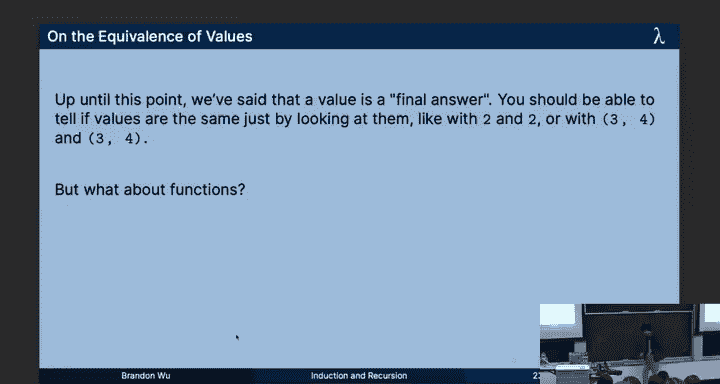
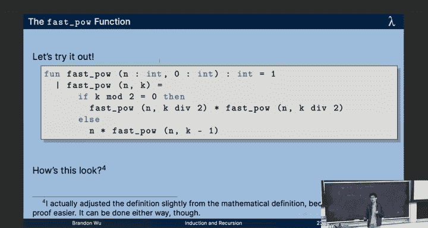
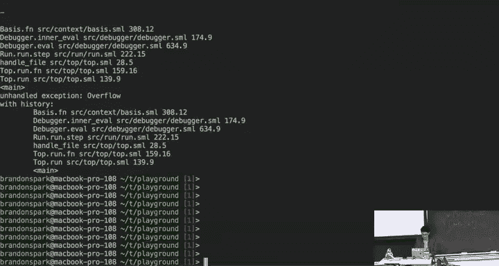
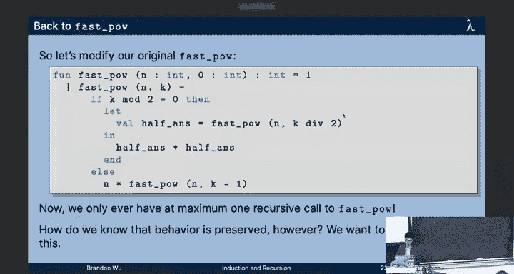
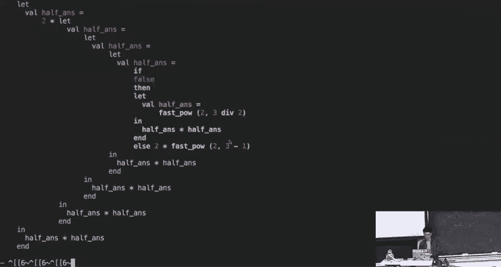

# 函数式编程：03：归纳与递归 🧠


在本节课中，我们将学习归纳与递归这两个核心概念，并探索它们之间深刻的联系。我们将看到，编程中的递归思维与数学中的归纳证明本质上是相通的。通过结合两者，我们可以编写并证明代码的正确性。

---

## 等价性与规范 📝




上一节我们介绍了函数类型和变量绑定。本节中，我们来看看如何定义函数的等价性，以及如何规范地描述函数的行为。

### 函数的等价性

在函数式编程中，我们关心函数的行为。两个函数 `f` 和 `g`（类型均为 `T1 -> T2`）是**外延等价**的，当且仅当对于所有可能的输入值 `v`（类型为 `T1`），`f(v)` 和 `g(v)` 是外延等价的。这意味着，即使它们内部实现不同，只要在所有输入上行为一致，它们就是等价的。

例如，以下两个函数是外延等价的：
```sml
fn x => x + x
fn x => 2 * x
```
因为对于任何整数输入 `x`，`x + x` 的结果总是等于 `2 * x`。

### 全函数与部分函数

一个函数被称为**全函数**，如果对于其定义域（输入类型 `T1`）中的每一个值，它都能产生一个定义域（输出类型 `T2`）中的值。换句话说，它不会在某些输入上永远循环或抛出异常。例如，整数加法 `+` 是全函数，而整数除法 `div` 在除数为零时会产生异常，因此不是全函数。

### 函数规范（五要素法）

为了清晰地描述函数行为，我们使用一种包含五个要素的规范方法：
1.  **类型**：声明函数的输入和输出类型。
2.  **功能描述**：用自然语言简述函数的作用。
3.  **前置条件**：描述调用函数前，输入必须满足的条件。
4.  **后置条件**：描述函数返回后，输出满足的性质。
5.  **函数实现**：实际的 SML 代码。

以下是 `divideByTwo` 函数的规范示例：
```sml
(* 类型： int -> int
 * 描述： 计算输入整数除以2的结果（整数除法）。
 * 要求： 无（但需注意整数除法的截断特性）。
 * 返回： 输入值 `x` 的 `x div 2`。
 *)
fun divideByTwo (x: int): int = x div 2
```
编写测试用例也是良好实践的一部分，可以使用课程提供的测试库。

---

## 递归：编程的核心 🔁

现在，让我们转向递归。在缺乏 `for` 或 `while` 循环的函数式语言中，递归是我们实现迭代和重复计算的主要工具。

### 什么是递归？

一个函数是**递归**的，如果它在定义中调用了自身。递归是解决许多问题的自然方式，尤其是在处理具有自相似结构的数据（如列表、树）时。

### 编写递归函数的四步法

以下是编写任何递归函数的通用方法：
1.  **识别并编写基本情况**：这是递归停止的条件。例如，计算阶乘时，`factorial(0) = 1` 是基本情况。
2.  **识别递归情况**：这是函数需要调用自身的条件。在阶乘中，当 `n > 0` 时是递归情况。
3.  **递归信念飞跃**：假设函数已经能正确解决规模更小的子问题。这是递归思维的关键——你不需要在脑海中展开所有递归调用。
4.  **组合结果**：利用对“更小问题”的解决方案，构造出原始问题的解。对于阶乘，即 `factorial(n) = n * factorial(n-1)`。

让我们用这个方法来编写一个计算 `n` 的 `k` 次方的函数 `power`：
```sml
(* 类型： int * int -> int
 * 描述： 计算 n 的 k 次方。
 * 要求： k >= 0。
 * 返回： n ^ k。
 *)
fun power (n: int, k: int): int =
    case k of
        0 => 1
      | _ => n * power (n, k-1)
```
*   **基本情况**：当指数 `k` 为 0 时，任何数的 0 次方都是 1。
*   **递归情况**：当 `k > 0` 时，我们利用信念飞跃，假设 `power(n, k-1)` 能正确计算 `n^(k-1)`，然后将其乘以 `n` 得到 `n^k`。

---

## 归纳：数学的基石 📐

我们刚刚看到了递归在编程中的力量。有趣的是，在数学中有一个几乎完全对应的概念——**数学归纳法**。

### 什么是数学归纳法？

数学归纳法是一种证明关于自然数命题的方法。要证明命题 `P(n)` 对所有自然数 `n` 成立，需要两步：
1.  **归纳基础**：证明 `P(0)` 成立。
2.  **归纳步骤**：假设 `P(k)` 对某个自然数 `k` 成立（这称为**归纳假设**），然后证明 `P(k+1)` 也成立。

如果这两步都成立，那么根据归纳原理，`P(n)` 对所有自然数 `n` 都成立。

### 归纳证明的结构

1.  **陈述命题**：明确要证明的 `P(n)` 是什么。
2.  **归纳基础**：证明 `P(0)`（或 `P(1)`）为真。
3.  **归纳假设**：假设对于某个 `k`，`P(k)` 成立。
4.  **归纳步骤**：利用归纳假设，推导并证明 `P(k+1)` 成立。
5.  **结论**：由数学归纳法，命题得证。

### 示例：前 n 个奇数和

让我们证明一个定理：前 `n` 个奇数的和等于 `n^2`。即，令 `S(n) = 1 + 3 + 5 + ... + (2n-1)`，则 `S(n) = n^2`。

*   **归纳基础**：当 `n=1` 时，`S(1)=1`，且 `1^2=1`，成立。
*   **归纳假设**：假设对于某个 `k`，有 `S(k) = k^2`。
*   **归纳步骤**：考虑 `S(k+1)`。
    `S(k+1) = S(k) + 第(k+1)个奇数 = S(k) + (2(k+1)-1) = k^2 + (2k+1)` （根据归纳假设）
    而 `k^2 + 2k + 1 = (k+1)^2`。
    因此，`S(k+1) = (k+1)^2`。
*   **结论**：由数学归纳法，对于所有自然数 `n`，`S(n) = n^2` 成立。

---

## 递归与归纳的统一 🤝

现在，让我们将编程与数学联系起来。比较编写递归函数的步骤和进行归纳证明的步骤，你会发现惊人的相似性：

| 递归（编程） | 归纳（数学） |
| :--- | :--- |
| 1. 识别基本情况 | 1. 证明归纳基础 (`P(0)`) |
| 2. 识别递归情况 | 2. 设定归纳步骤的目标 (`P(k+1)`) |
| 3. 递归信念飞跃（假设函数对更小输入有效） | 3. 引入归纳假设 (`P(k)`) |
| 4. 组合结果 | 4. 利用归纳假设证明目标 |

**变量递推**（如 `power` 中的 `k`）直接对应**归纳变量**。这种对应关系意味着，我们可以使用归纳法来**证明**递归函数的正确性。

### 证明 `power` 函数的正确性

让我们用归纳法证明之前定义的 `power` 函数确实计算了 `n^k`。

**定理**：对于所有满足 `k >= 0` 的整数 `n` 和 `k`，`power(n, k)` 求值结果为 `n^k`。

**证明**：对 `k` 进行数学归纳。
*   **归纳基础** (`k=0`)：
    `power(n, 0)` 根据函数定义（子句1）直接求值为 `1`，而 `n^0 = 1`。基础成立。
*   **归纳假设**：假设对于某个 `k`，`power(n, k)` 求值结果为 `n^k`。
*   **归纳步骤**：证明 `power(n, k+1)` 求值结果为 `n^(k+1)`。
    `power(n, k+1)` 根据函数定义（子句2，因为 `k+1 > 0`）求值为 `n * power(n, k)`。
    根据归纳假设，`power(n, k)` 求值结果为 `n^k`。
    因此，`power(n, k+1)` 求值结果为 `n * n^k = n^(k+1)`。
*   **结论**：由数学归纳法，定理得证。

通过这个证明，我们不仅编写了函数，还**确凿地知道**它是正确的。这正是“程序性思维即数学性思维”的体现。

---

## SML 语言特性补充 🛠️

在深入下一个案例前，我们补充两个重要的 SML 语言特性。

### Case 表达式

除了在函数定义中使用模式匹配，SML 还提供了 `case` 表达式，允许在任何地方进行模式匹配。
```sml
case someExpression of
    pattern1 => result1
  | pattern2 => result2
  | ...
```
所有分支的结果类型必须相同。`case` 表达式本身也是一个表达式，可以嵌套在其他表达式中。

### 列表

列表是存储零个或多个**相同类型**元素的数据结构。类型写作 `t list`，例如 `int list`、`string list`。
*   **空列表**：写作 `[]` 或 `nil`。
*   **构造列表**：使用中缀操作符 `::`（读作“cons”）。`x :: xs` 表示将元素 `x` 添加到列表 `xs` 的头部。
*   **语法糖**：`[1, 2, 3]` 是 `1 :: 2 :: 3 :: []` 的简便写法。

列表是一个递归定义的结构：一个列表要么是空的 (`[]`)，要么是一个元素连接在另一个列表之前 (`x :: xs`)。因此，处理列表的函数通常是递归的，并基于这两种情况进行模式匹配。

例如，判断列表是否为空的函数：
```sml
fun is_empty (lst: int list): bool =
    case lst of
        [] => true
      | (x::xs) => false
```

---

## 案例研究：快速幂算法 ⚡

最后，我们来看一个结合了递归、归纳和性能优化的精彩案例：快速幂算法。

### 问题与朴素解法

计算 `n` 的 `k` 次方。我们已有的 `power` 函数需要进行 `k` 次乘法，时间复杂度是 `O(k)`。

### 更快的数学原理

利用指数运算的性质，我们可以减少乘法次数：
*   如果 `k` 是偶数：`n^k = (n^(k/2))^2`
*   如果 `k` 是奇数：`n^k = n * n^(k-1) = n * (n^((k-1)/2))^2`

注意，这里出现了 `n^(k/2)` 或 `n^((k-1)/2)` 的平方。这暗示了一个递归结构，但需要计算两次相同的子问题。

### 初始实现及其问题

直接翻译上述公式：
```sml
fun fast_power_v1 (n: int, k: int): int =
    case k of
        0 => 1
      | _ =>
          if k mod 2 = 0
          then (fast_power_v1 (n, k div 2)) * (fast_power_v1 (n, k div 2)) (* 计算了两次！ *)
          else n * (fast_power_v1 (n, k-1))
```
这个实现的问题是，在偶数分支中，相同的递归调用 `fast_power_v1 (n, k div 2)` 被计算了两次，浪费了时间。

### 利用 Let 表达式和引用透明性优化

SML 的 `let` 表达式允许我们在一个局部作用域内命名一个值。结合函数的**引用透明性**（相同输入总是产生相同输出），我们可以只计算一次子问题并复用结果。
```sml
fun fast_power (n: int, k: int): int =
    case k of
        0 => 1
      | _ =>
          if k mod 2 = 0
          then let
                  val half_pow = fast_power (n, k div 2)
               in
                  half_pow * half_pow
               end
          else n * fast_power (n, k-1)
```
现在，`fast_power` 在每次递归调用中最多只进行一次递归调用，算法复杂度降低到了 `O(log k)`，速度显著提升。

### 正确性证明思路



我们可以使用强归纳法来证明 `fast_power` 与朴素的 `power` 函数是外延等价的（即计算相同的结果）。证明的关键在于，无论 `k` 是奇是偶，`fast_power` 都通过递归调用处理了规模更小的指数（`k div 2` 或 `k-1`），并利用数学恒等式组合出正确结果。详细的证明会涉及对 `k` 的奇偶性进行分类讨论，并应用归纳假设。



---

## 总结 🎯



本节课中我们一起学习了：
1.  **函数的等价性与规范**：如何定义函数的行为等价，以及如何使用五要素法清晰规范地描述函数。
2.  **递归**：作为函数式编程的核心，我们学习了编写递归函数的四步法，并通过 `power` 函数进行了实践。
3.  **归纳法**：回顾了数学归纳法的原理和结构，并证明了关于奇数和的定理。
4.  **递归与归纳的统一**：认识到递归编程与归纳证明在结构上的深刻对应，并首次使用归纳法证明了递归函数 `power` 的正确性。
5.  **SML 特性**：了解了 `case` 表达式和列表的基本操作。
6.  **案例研究**：将递归、归纳和引用透明性结合，设计并优化了**快速幂算法**，体验了通过数学原理提升程序效率的过程。




核心在于理解：**编写递归函数的过程，本质上就是为计算过程构造一个归纳证明**。这种思维模式将贯穿我们整个函数式编程的学习。