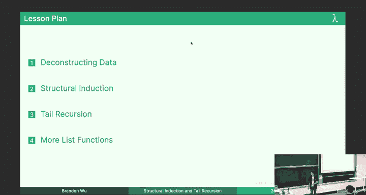
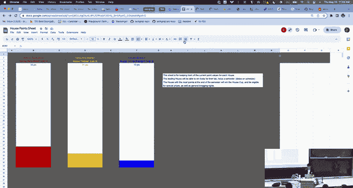
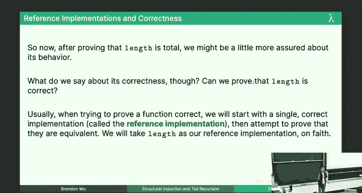
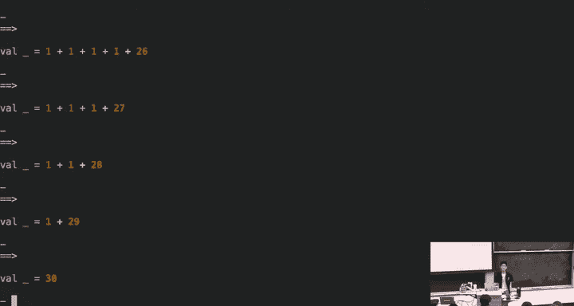
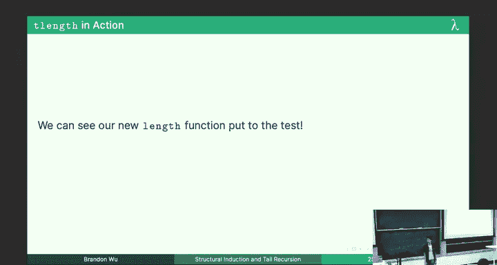
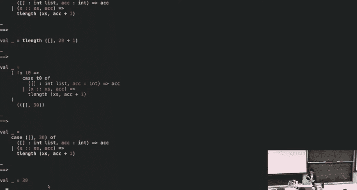
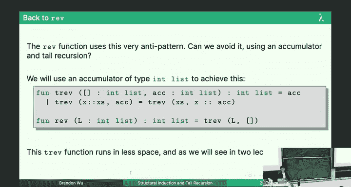
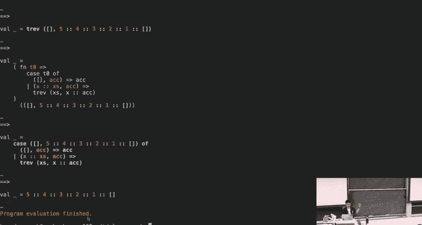

# CMU《函数式编程｜15-150 Functional Programming, Fall 2023》中英字幕（deepseek - P4：-04-4. Structural Induction and Tail Recursion _ - GPT中英字幕课程资源 - BV12VChY2EF4

Cool all right let's get started I guess welcome to lecture everyone I hope everyone had a great lab yesterday hopefully some of the stuff that you went over was less unfamiliar than it traditionally was last week in particular so we're talking about structural induction and tail recursion today one thing I wanted to remark was。

😊，For the induction homework basics， I don't know how long it took you。

 but induction homework should take a bit longer the course follows the curve as I said。

 and we're starting to go up。 it's still pretty gentle， but it will take you longer。

 we're turning up the heat slowly if you ever heard that parable about the frog and the pot in this par you or the frog so have fun with that I guess anyways cool one thing I want to remark about my slides by the way is for one thing I'm trying to adjusting my content pace so I'm planning a bunch of stuff and then we aren't always getting to it one of the reasons is because the way I design my slides or that they're meant to be almost a textbook I'm designing the slides for me to present now and also for you to read later as a resource that means that if I go through something if you don't have time to read something that's okay I'm trying to do something like an iterative deepening technique where I go through my slides first and then on your own time if you go back and read through them on your own it serves is just good of a reference to the course material so don't be stressed out if you don't get to copy everything down。

Okay we're trying to live in the moment now and then really go over it later is the idea okay。

 but that means that I kind of would like you to be able to read through it like before examinations or on your own time later。

 okay， it shouldn't take very long all right， but that's something I want you to remark on okay。Yeah。

 by the way let's get started with the lecture。 Okay。

 cool so structural induction and tail recursion last lecture was not so interesting。

 induction and recursion mostly review， but that's okay because today we'll be talking about some new stuff So today our lecture plan looks like oh yeah before before I go on。

 I should show you a here's the house points for now blue teams on the lead but yellow is catching up I love Brandon you gotta love a a bit more if you want to win here So work on it So deconstructing data is our first topic for today and then we'll talk about structural induction this new kind of induction and then we'll talk about tail recursion and more list functions as we go on Allright and we have just 408 I get through。

😊。

Cool so I wanted to recap last lecture always we talked about recursion and induction。

 remember that we learned about case and let expressions which we will go into a little bit more today and then we try to implement a PA function which was a little bit slow because it made O of N multiplications and we found that using this technique of repeated squaring we could do it faster I didn't get to prove to you that the two implementations were extensionly equivalent but if you read the notes so you know that they were and also it does run faster although we won't give a mathematical rigorous treatment of this for another like week or two okay。

😊，But that was last time。But first let's talk about this idea of deconstructing data and I have to preface here that I'm going a little bit off script okay this is not typically something that we explicitly talk about in 150 but and I was a little concerned about this because I was thinking maybe you won't be prepared you know your grades will be will suffer for it and then I realized wait I'm the one who gives you grades so it doesn't matter so don't worry about it but I really want you to get something out of this course that's not just like oh I was able to do these problems like。

This is a fundamental idea in programming。 Okay， and I'll talk about it right now。

 So we talked about these case and expressions。 and case expressions let us do deconstruction of a form。

 right， We say that to deconstruct Oh sorry， Lada， we say that deconstructing a list is like pattern matching upon it。

 It is the act of using like a case expression， so。By the case， you know one comma two。Of。

Nil goes one。Or x cons x's， and I didn't explicitly say this。

 but I'm sure your T did't lab but this is pronounced x cons x's。

 we usually by convention called this x's and it's usually denoting like the rest of the list we have x and then we have。

X plural。Anyway， let's say this is x right and this whole thing is an expression right and then the behavior of it right is that so we saw a tenuous connection between two ways of using cons constructing and deconstructing and what I mean by that is separately I might say something like。

😊，Val x equals1 cons on2。One cons on two nil。In this instance I have declared a value that value is you know one cons to nil that is the singletan list of one。

 that is one use of cons I've constructed， I've constructed that's literally where the word comes from。

 but in this case I'm using cons as a pattern I'm deconstructing this value one comma2 and why does this match to this Well。

 because I told you that one comma2 this list is actually just syntactic sugar for。😡，This， right？

So if I try to match this to that， well x cons x is means one， which is x cons。😡。

X is so x is bound to one and x is is bound to two cons nil。 that is the singleton list2。

 They look the same right， if I match them up to each other。

 I get that this corresponds to that and this corresponds to that， right。😡。

Does everyone see why this kind of like make sense to pattern match this to that and produce those bindings right X and Xs but theres kind of that dichotomy there between constructing and deconstructing data and I think that's really interesting so here's a mantra for you I send the last structure but it bears repeating a list is either nil or x cons Xes and it is nothing more okay it can either be the empty list nil or it can be a element appended or prepened onto another list。

And that means that we can do this case analysis and have it be exhaustive because what is any list。

 like suppose that this was an arbitrary list right we know that this one is x's。

 but what about if we had like L L could be nil？😡，It could be something cons on to another list。

 but that's the only two things it can beat。 Those are the only two cases。

 So it's these two things and nothing more。😡，I can also tell you a different mantra than nil or X cones。

😡，Here's another mantra for you。Ls are either empty or not and nothing more。

 Does that make sense to everyone like should be pretty true？This is worse。

 This is less useful and it's bad。 And I'm going to tell you exactly why this kind of thinking。

 I'm trying to change your way of thinking。 Okay， I'm going to show you exactly why this is bad。

 It's less useful。So suppose we're trying to write this function here okay it's called take。

 it takes in an int and it takes in a list and it evaluates to the first so take of n comma L takes the first n elements from L basically okay and if L doesn't have enough elements for it to take it'll just evaluate it to the rest of the list okay it'll take as much as it can all right so let's try to write this function okay is this specification clear to everyone we're just taking elements off the list。

😡，Cool so recall that we define this is empty function last lecture it just returns the pool and whether or not the function is true or false according to our mantra one of these must be true and this is a total function right we also have this function called head basically it precondition we require a nonempty list and then we evaluate to the first element of that list and the implementation looks like this。

😊，In the x con x case， we return x， but the Ne case is impossible by precondition。 So we just。

 this is how you raise an exception。 Okay， we just like don't do anything interesting。

 Don't care about it。 Okay but this is what happens。 We just to evaluate to the first element。

And then similarly， we can define a tail function that evaluates to the rest of the list excluding the first element。

 so the opposite kind of of what head does or the complement。

 and it also requires that L is not empty。And this is the implementation instead of returning x。

 it returns x's， and then it raises fail in the preconditioned case where we know that it shouldn't happen Does that make sense for everyone？

Okay。Cool， so let's use these functions to implement take alright， and here's how it's going to look。

 So let's do it right now。 actually let's do fun take。And remember we're taking an n of type int。

 we're taking an L， which is an int list。And we want to return inlist。Well。

 if we want to use the functions we just defined， maybe base case。

 what we want to do is suppose that we want to take zero elements right。

 then we're done right so let' say。😡，It is empty。L， then。We return the empty list。

 right because we're taking nothing。Else， well， what else can happen。

 Maybe we run out of elements or， this is if we run out of elements。 actually， Otherwise。

 we might be taking0。 So let's say that n equals 0。 I mixed up the cases， but that's fine。Otherwise。

 if n equals 0， we also return nil， right one case is if we were taking nothing。

 the other case is if there's nothing to take， and then otherwise。

I I'm going to run out of room here in a second， what are we going to do here。

 What I'm going to say that we do is we do a let。Bo X。Let's just say x equals head。Of L， Y。

 because in this case we know that it's not empty， so by precondition。

 we can call this head function safely， so we get the burst element it。

I'm going to run out of space here， but it's okay。And then let x is equals tail of L。

And then pretend we had a little bit more room， I'd write。In。X cons，s， I'm really right。In。

We take the first element， and then we're just going to call take again， right， except it's on take。

Of n minus1， and then x's。Sorry， this formatting is terrible， but I hope you can。Read this。

Does this implementation make sense， I'm taking the first element off。

 and then I just call take recursively with one less thing I'm taking on the rest of the list。

Everyone go with this？O。And that's actually exactly what this is， okay？This is what's wrong？

It's sort of redundant。How so。Yes， you can。So I got bored of throwing these out。Yes。

 you're absolutely correct。 It's redundant。 Why， why。

 because like I pattern match on the L to check if it's empty。 but later on， I have to do it again。

 Look， look at this is empty function。 It cases on L。 and then I do it again here。

 I'm doing two checks where I should have had one， That's redundant。 It's useful。

 It's lazy and not in the coolest sense either that we learn about later。 So this is bad。

 And what did we do， we relied too much on preconditions， we said， okay， by precondition。

 this is okay， but guess what， when you're when youre the engineer has been working for9 hours over time on on your project or whatever。

 You're gonna make a mistake when you have a complex bulloleying condition that's not just this check。

 You're gonna mess up and you're gonna get your preconditions wrong。

 So why am I saying this I gonna emphasize you like preconditions are so cool。 they are。

 but you know it's better types so。Head and tail can raise exceptions。 In general。

 you have to be very， very careful when you're working with functions that can raise exceptions because you might mess up your reasoning。

 You might get into an exception case。 And then guess what。

 your language server or your know production code is now crashed。

 Okay And then who who's on who' is enjoying a nice trip to falling water on the Saturday and now has to。

😊，Fring onto the computer while they wrong on call and then fix it。 that's you hypothetically。

 maybe all right， so it's wasteful as well。 Okay， we duplicated to work。

 I already said that So this is bad。Okay。This is the mantra of a list is either empty or non empty right if it's empty。

 bullolean true， let's go here if it's not empty， Boolean false is go here right but you know it's better than preconditions types。

😡，It's true that a list is either empty or not empty， I'm not saying that that's false。

 but it's not as important as the view that a list is either nil or x cones because X cones gives us in a sense more information and I'll quantify I'll qualify that for them that's for you in a second。

😡，This is another way of me saying pattern matching， as I've shown you。

 is strictly more powerful than if expressions， it's strictly more powerful than conditionals okay。😡。

So there's a great blog post that someone wrote like two years ago。

 and it's called pars don't validate。 Okay and I thought this is a super compelling idea I wanted to tell you。

 but the idea is pars don't validate and we say that a function P that takes in something and returns a bo。

 And by the way， don't write this down if you don't want to。

 you don't need to like have it memorized。 but a function P of type T to bo is a validator right。

 It takes in a value And it says yes or no， right That's all it does。

 It validates some property right。😊，But that's all it does。

 We want to avoid validating input because what we're doing is we're processing data to get a boo。

 if you think about it， like most data is more complex than a boo。

 right we're trying to summarize everything we know about this this like list or this treat or whatever in a single boolean does it satisfy the property or not。

😡，But the thing is that what is more powerful than that Boolean is what the data actually is。

 so we say that a function f of T to T2， and these are random types is in a sense， a parser。😡。

If it as opposed to a validator， if what it does is it produces a value T2 that is more powerful than the Boolean。

This like it produces an output such that that the merely the type of that output is enough to encode that property。

 and I'm going to give you a very concrete example because I know this doesn't make sense right now so。

😡，Let's try take again using this logic， so in particular let's try take again。

 but we're going to do it with pattern matching okay someone to want to suggest how I'm going to start this off。

😡，How am I going to write take， what did I do first， what's my first move？This got it。Yeah。

Are you in the clause， Let's do it without the clause。 but yeah， let's do it in the case。Whoops。

I'm going to kill someone one day， sorry。Okay， let's impact， oh yeah。

 let's just do it case and of and you said zero。都小 what。NP list， okay， what's my of case？

What's another base case for me， yeah？If L is empty， all right， duck。

Let's actually make this nicer by doing this， we're going to case on not just n。

 we're going to case on a tuple of n and L。😡，So we're going to actually do。

If it's zero and then nothing or whatever wild card， I don't care。

 but if we know that the first one is zero， then were going to know otherwise if it's I don't care what the empty list。

😡，We're going to similarly go to the empty list， right？And then what's my final case。

 what do I care about now？😡，Yeah go人。Yeah， and we don't really care about n in this case because we know it's non zero。

 right？And then I'm just going to write the same thing I wrote before， right？Which is X cons。Take。

N minus1 x's。Wow， doesn't that look nicer and not just because I have it half displayed across the board？

Doesn't that look nicer。And in particular， we only had to do one check on N and L ever why is that how does this connected to this idea I just told you because we pared。

 we didn't validate， we looked at the data for what it was rather than generating a boolean that was a stand in for it。

😡，So okay， in particular， what happens is that we process this list and we produce a value of type int star int list。

 right， this is of type int， star int list。And this value is more powerful than a boolean about whether or not the list is empty or not。

 Can someone tell me why， why do I， what do I mean when I say it's more powerful。

 Why is this better than having just a boolean that says yes， the list is empty or yes， the。Lsses。

Not， yeah。It gives us that information already， because if the list was empty。

 it would be impossible for me to be holding an int from it。 right， I wouldn't know which in to pick。

This is strictly more information because I'm not saying， oh， yes， I'm not empty。 I'm saying yes。

 I'm not emptyty。 Here's my first element and the rest of me。 It's kind of like like if I。

 if I was out in the pouring rain。 Okay， and out in the sunny Pittsburgh， you know， weather。

 and by that， I mean， it's always raining here。 Okay， if I was out in the Pitsburgh weather。

 and then my friend and I was pouring completely。 and I was with my friend。

 and my friend had an umbrella。 And I asked my friend， hey， do you have another umbrella， they said。

 yes。And then I stand there for like five seconds and then like there's water running it on my face。

 it looks like a movie scene I'm like， so you want to give it to me and they're like， oh yeah。

 why don't you ask？I had to do two calls I had to ask whether they had it and then I had to ask for it。

 but why not just ask for it in the first place What pattern matching does is it doesn't give us a bullolean。

 it gives us the goods， it coughs up the goods and that's what we want so。😡。

Inering list is more useful than a boolean。 It is proof that the list is non emptyty。

 Okay so pattern matching is more powerful because instead of condensing what I know about the thing I'm testing into a boolean。

 I look at what the thing really is。 Okay and I get to use this X and Xs afterwards。

 Otherwise I'd have to call head and tail and get it out and imagine if I iterated this process。

 if I was like casing on like the first two elements。

 Now I'd have to call tail on it right and then Id have to call。T on that。 So on and so forth。

 And it's okay， if you don't see that on your head is okay。 So in another way。

 And this thing I was saying about preconditions and types。

 pars don't validate is about putting preconditions in types wherever possible。

 It's great to have a function that says precondition L must be empty。

 What's better is having a type producing a value of a type where now you know。

 you are not never in the empty case。 Why， because I'm holding the first element。😊。

Does this idea make sense to everyone？And I mean， like truly makes sense。Okay， great。Do my job。

 all right， let's take an example of some code that has significant branching behavior。

 and I think I'm not going to write this for you。😊，Suppose I just had a case expression， okay。

 if is MTL do something otherwise if the list length is greater than equal to 2。

 this is a function that like just exists， you can use it yeah。😊，Oh， that's okay，'s practice。

Makes perfect。 This just like exists。 You can do it if it's greater than equal to two， do this。

 Otherwise if it's equal to one and also the head is to like the first element in the list， do that。

 Otherwise do that okay。😊，Well， if I wanted to rewrite this with pattern matching。

 what would it look like because this is going to gross， in my opinion？等。If it's empty， I do a thing。

If there's two elements in it， I do the thing， two or greater that is I take the icons the first two things off otherwise if two is the first element。

 I do the thing， otherwise if it's not two， that's the first element I do the thing。😊。

Not just is it nicer， but it saves me because imagine if I wanted to do something with in the in the case where I have La greater than equal to two list here。

 What if I wanted to do something with in this case to be this exits。

 right if I wanted to do something with that。 What would I do， I'd say like let me get the tail of L。

 and then let me get the tail of that。 And then I'd be holding it。 And what did I do。

 I did two checks on whether or not the list was empty or not empty redundant。

 useless and the worst part， ugly， we're in the business of producing code。

 we're in the business of producing correct code， and we're in the business of producing pretty code。

 Okay that's the idea。 descriptive code， I should say So does everyone see why this is a vastly innately。

 completely utterly superior。And yes， those adjectives were necessary。 Great， thank you all right。

 that was my that was my diribe to you I just wanted to say that because I think it's very。

 very important and I don't want you to have to go look at a blog post somewhere to figure it out for yourself like three years on the line。

😊，Back to a regularly scheduled programming。Structural induction is pretty cool。

 And we're going to see exactly why it's pretty cool。 So actually。

 I guess I should take questions about that previous part first。

 Does anyone have any questions about it。😊，Okay， well asking questions gives me time to drink water。

Drucual induction all right， induction on national numbers lets us prove things because numbers are built up from other numbers that's kind of how we think about it right zero and then one is built from zero and two is built from one via plus one right V successor。

😡，嗯。But in by analogy， let's imagine a bucket。😡，And so there are some people in the world that can't like visualize things。

 like have you heard about this， they can't see things in their head。

 so in case you're not able to do that。Here's a bucket。It's called the bucket of mathematical truth。

 right， we're going to learn about induction， the bucket way。

 So the bucket is meant to contain all values， all things for which we know the theorem is true。😡。

And when we do induction by default， the bucket's empty。

 if we're proving a predicate P on like some kind of like on ints， let's say。

 okay at first the bucket's empty， I don't know what it's true for， but then。😡。

Our first action as an induction proof theorist is that we throw the base case in。

 which means we put zero in the bucket。Zero is now in the bucket All right， that's our base case。

But we want to have the bucket contain every natural number， all right。

 so what we do is that we we apply the inductive step， right we go from n to end plus one。😡。

So now two is in the bucket， Earl one's in the bucket All right。

 we got two things in the bucket we're getting there right。

 there's only countably infinite many numbers to go， but by analogy。

 you should be able to convince yourself that like if I keep applying the inductive step。

 I keep putting like two and then three into the bucket eventually I get any number N right。

And that's pretty much how induction works， except there's a buck involved because that makes sense to everyone。

Cool okay， this picture is important because we're going generalize in the second here。 So yes。

 this is the bucket view of mathematical induction patent pending。

 So we learned about lists which let us talk about types like int list and string list and so on and so forth right and that's a oh I use this port already when you know。

😊，And lists are not just good for storing data but they have a simple recursive structure right and what I mean by that is the characterization I just told you a list is either nil or X cons x's where x's is another list right so it's recursive。

 and list is recursive obviously。😊，But that's actually really convenient for us because it lets us。

Talk about things。 So suppose I had this length function。 Okay。

 I already showed it to you last lecture。I want to be sure that it's correct。

 but also I want to be sure of a few other things right like length is total。

 right it would be weird if I had a length function on list that was not total because every list should have a natural number length。

And the natural numbers are unbounded right So how would we convince ourselves it's total well。

 and recall the definition， you know for every value value input， we get a valuable output。

How do we convince ourselves of this， well， let's take an example。😊，Here's our reasoning， okay？

Clearly， the function must terminate because when given any list。

 it must be either empty or have a first element， if it's the first case。

 then we terminate because we return zero， otherwise we recurse and we enter a shorter case and then if we keep entering shorter cases eventually we have to reach the first case so then we have to be valuable。

This is called a paragraph proof。If you do this on your homework， you will get deigned。

And if some of you have already done this。I guess the homework's not do yet。 So rewrite it。

 but we don't want to prove things via this dot dot dot kind of reasoning， right。

 We want to prove things because we've inductively proven that by the principle of induction。

 it is true for all values。 So don't do the dot dot dot reasoning。

 Don't do the And then dot dot dot because you will get points taken off okay。

What we want to see is a formal proof and I use the term formal loosely。

 there are levels of formality， but we're actually on the more cashing side of things comparatively。

 but we want to see like a vaguely ostensibly formal proof formal enough that your T is happy right so if you use intuitive reasoning and colloquial wording you can mask errors you might make a mistake and not know it we have to be precise because otherwise no one's going to believe your proof。

And you're not going to believe your proof。 And this is remember self- defenseef against yourself。

 Okay， we're trying to save you from your own err use reasoning。

 So we want to use mathematical induction， which you already know about。 But what about lists。

 what about length， So as you might have been able to infer from the theme。

 structural induction is a way of proving theorems about lists as opposed to like natural numbers。

 And in fact， we will generalize this to proving things about pretty much any any kind of data you can imagine。

😊，So。Here's the principle of structural induction，If I have a theorem among values。

 v of type T list for some type T， I'm generalizing over the type of the list。

I want to show that this property is true， this theorem is true for all values that are lists。

 right that's a setup。I only need to show two things。😡，I show that P of nail holdss。😡。

And then I show that if P of x's holds for some list， actually this should be T list， but whatever。

 assume we're talking about inlists。😡，Show that P of x cons x holds for any x of type n。

 show that if I put anything onto x's， the theorem still holds。😡，Okay。

This should look and feel very similar to the principle of mathematical induction on integers。

 or natural numbers。So let's move on。This is called proof by structural induction leftparn on this rightpar。

😡，睇。So let's actually go into the proof and I will do it for you on the board this time。

Backslash T CTT， left curly brace， length， right curly brace is total， all right。

This is what I like to prove。 How do we proceed， Well。

 I just told you about a shiny new tool that we have our in our handy box。 So let's do it。

 We proceed。😊，By structural induction， and remember。

 you should always state what kind of induction you're doing when you start a proof。😡。

Structural inductionuction on L。 All right， basically case， hit me， what's up？これが。No， okay。

 I heard from some several people。Base case L is nil all right， what do I want to prove。

 I want to prove length is total right so let's try it so if I have length。😡，Of no。

Does anyone already already have it in their heads， what does this reduce I guess you can just think。

 what does this reduced to？Zero， right， okay。And then we say clause1。leength。

And if you can imagine it in your head， you can see that it's clause 1 right。

 so length of Neil goes to zero。Which is the value right So we're good in this case right does everyone believe me that like this suffice to prove the base case。

 I just need a show goes to any value doesn't really matter which one okay IH。

Assume for an arbitrary x's。😡，Length of x is。Evaluates to value。嗯。I'll write it out explicitly。

 you should write it out explicitly for sun x's of T int list。Okay， that's my induction hypothesis。

 and what do I want to show now， I want to show if I put anything on the list。

 my property will still be true。😡，So。So let X type inch be arbitrary。

 All right I'm going to deliberately instantiate my X。嗯。Do I feel like moving to a different board？

Yeah， I do， okay。Just we're going to go to here now， all right。So if I have length。Of x con xs。

 what is this？By definition， what is it？Yeah。One plus length x is that is true all right you get the racket。

好 man。I was never lucky at tennis。Lth of x cones is1 plus length x' is， that's true。

 and now I hear a two letter acronym， what's the two letter acronym that seems to be calling out to me？

😡，IH， oh my God， who would have guessed first we got to cite this clause to length。Ih。 All right。

 So what do I say， Well， by I H， I know that。And I'll put a star here because it doesn't need to be one step。

 this is one step， this is multiple steps right， possibly1 plus V for some V that length x is evaluates to。

 I think if you just put V here like you'll be fine， so let's say IH。

This is the V that length axis reduces you yeah。Oh， that's what this is。

So if you don't this notation means it takes zero or more steps。

So I am kind of sugaring something for you here， length this total means for all you know V of type int list。

Length of x is or length of v。Evaluates to。Ill just write some v prime， okay？

But this is like a like I will not be offendended if you don't prove that these are like mean the same thing in this instance。

 okay I'm relying on the fact that like it evaluates eventually to be prime。

 you can also say that like it takes zero or steps to reach prime。😡，But yeah， good point。

Maybe high true phenomenon interesting。开始。Okay， so yeah evaluates in zero or more steps to one plus v and then I kind of have to say that this is valuable right I have to say this is a value and no one will be mad at you if at this point what you do is you say V prime。

😡，Plus is total。In general， you have to prove this。

 if you're resting on the function being total you have to prove it if you use that a function is total you have to prove it except this is the mathematical plus operator。

 you don't even have access to implementation， so I will not be mad at you if you write that edition is total it just is okay。

😡，Is everyone convinced that this proves that length of x con xes reduces to a value？

And then we write the whole sheang by the principle of structural induction on this。

 we have proven that length is total。That's approved by structural induction the things the edit distance between this and an inductive proof are not super far like basically this thing right I changed the fact that I said this you know obviously I swapped out the base case and the X is basically be careful about your quantification there is a reason why this is important because I'm staging your understanding we will move on to induction over cooler things and lists and then it will be different。

😊，But this is the proof， any questions？Cool。ThatAll right， if you want to take a look at it later。呃呀。

OkayIt looks very looks very similar to mathematical induction on natural numbers。

 But in terms of the picture， the thing I kind of want you to realize， like I don'。

 this is the picture I see in my head， right， What's really happening is we're doing finite applications of the inductive step on an initial value。

 just like with natural numbers。 So what's really happening is we've got a bucket。

 and the bucket's got nil in it right， That's the first thing。 That's the base case。

 We have an empty bucket。 We have nil。 So we have the base case， So nil goes in the bucket。

 And then what I'm doing is I'm showing you that we can throw in x cons nil。 that's this。 any x。

 let any X be the next thing we can put in x cons nil for any X。

 right So then after that inductive step， the bucket now contains every single singleton list。

 That's like the list of one。 the list of negative one， this is by the way。

 how you do negative numbers。 I don't think I ever explicitly told you that。😊。

It's not that important， but just so you know， so negative 1，1， dot， dot， dot。

 any other inch is also in there， right， any singleton。

And then you should be convinced that like the next step。

 the next time I apply the inductive hypothesis， I can get any length to list。

 and eventually I'll get every single list， right because I will get the list is finite in length。

That's the picture of what's happening here。 if you want a more sophisticated picture I've got this for you。

 So kind of the opposite actually of what we saw earlier。

 but we start from nil and then the arrows go up to like three cons nil。

 two cons nil one cons nil and I'm not de sugargging this because I want you to see what's happening is we're adding an arbitrary element to the front and this is obviously non exhausthaive。

 I don't have an infinite board for you。 but eventually you cover every single list right and that's really what's happening。

 We're just throwing in stuff。😊，This is the picture you should see in your head when you're trying to figure out whether or not an inductive set and the base case connect right because if I quantified this thing differently。

 if I said let assume length of xs for like some x's that's like， I don't know。😊，Where X is is also。

Like Y comma X。OrW come a Z， let's say？RightIf I started from here with my induction hypothesis。

 this would not match because I would never reach a point where x' is is nil。

 which is the the only time I can use my induction hypothesis initially。

 I only ever initially know about whether the property is true for nil， but this is not nil。😡。

Does that make sense for everyone， like I'm trying to show you quantification by having you visualize it？

Okay， yeah。Did I one three。Yeah， I did。Coding details。All right， good point。这把还取出来。

Hi she was a given。Pointing out that I'm wrong。嗯O。はい。Like computer is on do not just herbs。

 so I don't know what's happening cool。 Okay， everyone clear on this。 This is induction。

 This is the picture。 All right， imagine it。Qudify it， see it when you sleep。

Alright one thing to be aware of is correct quantification。

 I know I already went over this with you last lecture。

 so I'll be fast about it basically remember if you say for all x's P of x's holes。

 you're gonna get points off help me help you don't do that I'm trying to give you points the Ts are trying to give you points here they're nice Trust me you're saving the theorem and this is the logical form of the theorem in case you're interested again it looks very similar to natural numbers but you know P of n and then also for all x's now we want to prove that this is true right。

😊，And then you eventually we get the theorem， cool， yes。So be explicit。Instantiate your variables。

 right， and then quantify them。😡，That's the idea， all right， please do that。Everyone clear on this。

Kol。Okay， this is a template for structural induction in case you want to look back on it later。

 but yeah this is basically the generic way of how you do it。

 you know generic in what the actual property is because I don't know what property you're trying to prove。

 what the army you're trying to prove， but yeah this should make sense to everyone I won't spend too much time on it。

😊，O。Wow， this look。time cool Taylor Carsion， who here has heard of Taylor Carsion？Yeah。

 who's seen the XKcD Taylor recursion is his own reward。 Yeah。

 that's an inside joke if you haven't seen it it's yeah Taylor recursion is。Pretty cool。

 so let's talk about it， so I'm going to erase all this now。Okay。

We have been writing recursive functions for our entire tenure in this class pretty much okay but it turns out that communication is not enough there is such a thing as computers and they have performance issues okay and in particular we are sometimes concerned with how our code how fast our code is now I will tell you as a general like engineering practice like if you are concerned about the performance of your code first and how it looks second you are doing things wrong but that is not to say that performance cannot be a secondary concern okay and I mean this seriously like like readable code is the first most important thing right。

😡，So tailrorosion is about this。 So we proved length is total。

 We know a little bit more about its behavior and it should be pretty like obvious。

 right because length。 I mean， it looks like the definition of length。 You know。

 nil is one and then nil is 0 and then anything else is plus one and we recourse like that makes sense。

 so how do we we can't really prove thats correct。 But what we can do is usually when we have code that we're trying to prove is correct。

 we start with something called a reference implementation。 We implement it first really easily。

 really succinctly really simply And then we kind of are aware that's correct。

 And then we prove that other implementations are equivalent to it。

 That's the way that we usually will do things because we kind of start with a base that we know is true because it's kind of hard to prove from first principles that length is correct because you look at it and it's correct。

😊。

So let's see about what length does， so I saw that some of you liked the muiggen traces。

 so I'm going to bring it back。Yeah， I didn't say too much about this。

 but this is a stepping debugger I wrote the semester after I graduated of the summer after I graduated。

 and it's pretty cool I think， but we can step through this length call here right so if I say step maybe we'll make it a little bigger。

😊，We're going to step into the case and then we have， know we're matching one comma  two。

 comma 3 against x cones and we know that'll enter the second case。😡，So we enter the second case。

 but we substitute xs is now two comma 3， right？😡，And then you know you should be convinced that eventually if I do this again。

 oh， I'm getting at one plus length of three， if I do that again。

 I'm going to enter the second case one more time I enter length of nil， that's zero。Now I add。

Everyone click on this race like that makes sense that that's what it does coolol。

 but let's try it on a slightly larger test case。😊，哦军s。W I can't even school。哇哇哇哇哇。

Okay here we go length of one comma two comma  three comma all the way until like 20 or something okay。

 and my computer is like having a seizure right now， I think because。😊。

I think because of the presentation， okay well I thanks someone had to talk to you。

 so let's just try that on a really long list okay。So let's toe step。So we're casing on it。

 we enter the one case， blah blah blah blah， bh blah blah blah。

 you know what's happening and look at this one， these ones we're accumulating here， oh my god。

 look at all those ones， we have to add all those ones。😊，Oh my god。

 and look it's going to wrap around and eventually we reach zero。And then we add them all back up。

 But here's the thing， right， The thing about how we've implemented length is that because of the fact that we do one plus length x's。

 remember， right we do one plus length x's in the recursive case， right？

But remember that SML is eagerly evaluated， meaning that we need that this thing goes to V。😡。

And this thing goes the v prime， and then we do v plus v prime， right？But when this X is really long。

 this guy can take a long time to get back to us。 but all the while the computer in like the back of its brain。

 and it's like notebook of what it has to do。 You know， the computer writes sound okay。

 I gotta come back and add this one later。And that's what's happening there。

 the computer is storing all of the ones it has to do later on。

 it has to add one like a bazillion times， but it has to remember all those things。😡。

The precise mechanics of how this happens aren't important。

 But the important thing is that that exists， right the computer has to remember。 And by the way。

 what is what is remembering correspond to correspond memory。

 What I'm trying to tell you is that this is very memory intensive。

 I will have to save memory for every single one of these plus ones。

 That's really bad because now what do I have to do， I unroll right。😊，And that's fine time wise。

 It's linear， fine， but memory wise， no bueno。 Okay， can we do better。

Let's try。Tale recursion is about we get a really long trace，hlah， blah，la， already told you this。

The reason is because my drop length is not tail recursive。

 that's the reason that's what's happening here and let me define that for you real fast。😡。

For recursive functions， what we can do is instead of writing a version that does a recursive call and then does something with it。

 which requires the computer to remember what we did， or what we have to do later。

 what we do is we write a version where it makes a recursive call and the recursive call is the last thing it does because if the recursive call is the last thing it does。

 it doesn't need to remember to do any residual work。

 we don't build up those long stack traces or traces I guess。😡，That's called tail recursion， Okay。

 so a function is tail recursive if it makes a singular recursive call in its recursive case， okay。

 it can have a base case。 it should。 And then that recursive call is the last thing it does okay。😊。

Let你 copy that done。じmanクランです。Any questions on the definition？Okay。啊。I assume weve copied Okay。

 let's look at some functions we already implemented and let's ask chain whether or not they're tailcursive。

 Okay， so for instance， we have length。It was long tail rehesive。No， right， I just said that。

 all right， what about fact is fact tailclive？😡，No， right， We have to do the times and afterwards。

 Okay， what about。Is empty。Is this empty Tayloror cruci？Yeah。

 let's say let's just say it's not really important， let's say it's vacuously tail recursive。

 there is a reason why we should prefer to say that， but yes。

 so these things are pretty much mostly not tail recursive except for this one which e vacuously is。

So we haven't written a whole bunch of Taylororcursive functions， well， let's do it。😡。

So let's write a tail rehearsive version of length okay and it's not necessarily obvious how we should do this。

 so let's introduce the concept that they're going to use when you program in the future to do this。

 we're going to use something called an accumulator。

An accumulator is an extra argument that the function takes in。

 The idea is that instead of doing work for yourself later。

 you do the work now and pass it as an argument in to the function for later use and let me be concrete about that。

😊，We're going to write a function called T length， which is tail recursive length，We take an L。

 which is a type int list， actually， let me use function clauses。

But we're also taking in an accumulator and our accumulator in this instance is going to be a type inch。

 okay。😡，Yes， and then we will start in。The idea is that this accumulator is going to be what we put our computations into so when we add one instead of adding well actually let's write the recruits of case first。

😡，T length x is a。The idea is that instead of doing one plus t length of x as an a or whatever。

 we're just going to do t length。But we increment our act to ourselves。

 it's like a little counter that we're keeping in our back pocket。

 we increment it and then we continue recursing， sorry， this is supposed X。so we do t length of x's。

One plus act。It's a counter and then in the recursive case， well， let's just say I return act。

Because I've added it to it this many times， let's just turn out。

I didn't really need that giant space here。And then can someone tell me how I might define length now the IFT length。

 because this doesn't have the same type， but I want a length function。 What do I do？Yeah。

I that's correct。Length L I' type int list。Take ins。Equals T length。

Of that same L and then given zero。Is everyone convinced that this ought to be？A length function。

 in particular it should be a working length function remember， correct code。扣ol。Right。

So this is a tail recursive way to do the same thing by using this accumulator idea。

 so that's t length Fourria， and then we define regular length。😊。

And now we're tail recursive because。In this case， we do a recursive call and it's the last thing we do right because remember。

 remember order of operations。 Remember evaluation order， before I can call T length。

 I need x's to be a value， which it already is by pattern matching。

 and I need one plus app to be a value， meaning that this addition happens first。

What's that quote Han shop first，'s the one+ act happens first， and then we do T length all right。

So this is tail recursive， all right。And what does that mean， well， let's try it out。

So。Mllorgan test three doesn know。This is just healing length。

 I'm not going to scroll up because it's going to like think forever。Here's the idea， right， Oh geez。

 this is actually。Let's zoom out right so t length and then we process the first two arguments。

 but if I do stuff here， you'll see that this this thing right here is constantly incrementing every call right boom plus 1。

7，8，9，10， but look at this Where is the giant trace It's not there because I have nothing left to do。

And then finally。Well， actually no， we have quite a bit to go。We get to T length of nil。30。30。

No giant trace， no extraneous work， no extreme memory usage。

All right。That's the name of the game。So that's tree length。

Tor recursion can offer us performance benefits at not really a whole lot of loss for readability because the great thing is that also we have a abstraction so like you know we can also just like say we have a length function and you don't need need to think about how it's implemented in the back end this is what it's doing and it's like not so bad but the fact is that this is going to be equivalent that's the important part but we get the performance benefit。

😊，Okay， quiz time， get to your houses， this one's harder。You all pretty much done， all right。

 cool thumbs up， thumbs down。😊，Jez， okay， I wanted you to I did warn you I made it harder。 Okay。

 I wanted you to talk to each other。 remember， I don't， okay， for record。

 I don't feel like a bad guy because you're not graded on this。 Okay， so at any rate， realize。😊。

You know， it's okay。That's all right we'll see the TAs will see how much it's grade for at the end of this this lecture know next next lecture I will make it。

😊，Not as hard， but still harder than it's been in the past。 So please do talk to each other。

 If you put your little noins the together， you'll think of something。 All right。

 And if something's not clear about the specification， talk to me because。

I do tend to make these fairly late at night and it's possible that there's a mistake， okay， but yes。

One fun thing is there's always a theme to like my passwords and also my lecture slide like opener images。

 so try to think about why that is on your free time， I guess it's fun I think okay cool。好。All right。

 cool， I got a heckler anyways， let's move on， moralist functions， cool。Alright。

 so back to lecture mode， so we can use cons to con something onto a list right but what about multiple Well。

 we could just iterate the cons process， I could say like you know one cons， two cons， three cons。

 but like what if I want to like put a number of things that I don't know how many In other words。

 I want to put two lists together， I want to concatenate them， I want to append them together。😡。

So we have this function called the a sign， pronounce append for you just for your knowledge。

 And we can define it like this。 So I have to introduce a bit of syntax to you。

 a pen is an in operator。 That means like if I wanted to do it， I would do like。😊，One come a two。

Append。3。Evaluates to one comma2 comea3。 Okay， that's the idea。 But it's an infi operator。

 Okay And the way that you define an in operator is you write infi append， Okay。

 and then you define it where the fund declaration has the function name in the middle。 Okay。

 It's just syntax。 It's not super important。 I'm not gonna quiz you on whether or not you remember this。

 but just realize that that's how you should parse this。

 Okay so the idea is that the function is defined such that。 The empty list appended to R。😊。

Is R right because if I append nothing to a list， I get the same list back。😡。

And then if I have x cons， x's on the left， and I have R on the right。

 I do x cons onto appending the rest， I do a recursive call to first append all of these guys to that。

So I get like you two comma three。And then icons one onto that。

 and that's the same thing as app them together yeah。

 because one stays in the front or rather x stays in the front clear everyone clear on this。够， okay。

But sometimes this is， there's no segue here， there's no like good segue。

 there's no like funny segue， sometimes we want to reverse list， there you go， have it。😡。

List reversal， yes， so sometimes we want to reverse lists， so let's do it。嗯。Well。

 let's write it together， shall we？And I didn't write the spec， I guess， whatever。Well。

 it's not whenever you to write your specs， sometimes I omit them for brevity because I have a lot of content。

 okay。Actually， let's do these cases first， so if I have an int list， that's nil。

And I want to get back an int list from reversing， what do I return in this case？收留问。No， thank you。

 thank you Fun fact， actually， fun S fact， you can write this。😊，Same thing。😀へ。😊，Okay。

 and then I got Xcon and Xs， what do I do？Can anyone hazard a guess as to what this might be？

Given what you know right now， how do I reverse x cons xes？Yeah。X is at list X。 Okay， you got the。

 you got the type right， good， good， good。 Yes， so it would not be well types to do this。

 We have to put it in。Brackets because it's a list， but also this is not quite correct。

 something is missing。Yes。We need to call rev on X's， if I want to reverse the list。

 I'd reverse the rest of it and I put X on the end right so let's do that。I almost just clicked this。

 expecting the board to change。更。R X is append X， cool， cool， cool， cool。And in fact。

 that's how we'll implement it， okay？But there's something I want to talk about here， which is。

 first of all， we're going to assume that Re is is our。😡。

Reference implementation right like it looks pretty much like the Canonical Bay Universalist。

I'm going to tell you that there is something wrong with the way that we've implemented this function okay and from context clues。

 you might be able to glean why that is So like what is wrong with this？It's not wrong extensionally。

Well， it's the only one thing that can be wrong if it's correct extensionly， what is it。

 somebody give me a guess？Not tail recursive， and in particular it's。Yeah。

 noncursive means that it's less sufficient， right， it's less efficient。

 I heard it from many directions， I'll the high you in this direction。Oh cool。

 so it's not tail recursive and it's not efficient。Here's the catch， right？It makes a call to append。

 but what's the time complexity of aend？😡，Just put the implementation away。

But if I want to write it in shorthand， I'd write this， right？And then x con is。

Theend R is equal to x cons。X is append R。And we can make it real SM code if I just write this。Okay。

 what is the time complexity of aend， What do you think？

This is kind of like a gotcha question a little bit。Yeah。It's linear。Linear in white， yeah。Oh。

 my word。Where n is the length of the left list， that's an important distinction When we say that something has a certain time complexity。

 we want to define what its complexity is measured in terms of， Okay。

 there's some mathematical like things I could say about that。That was bothering me。后 on各位。Okay。

 there's some things we want to say about what it's measured in terms of and I will treat this in more detail in left6 which is asymptap analysis。

 but in this case in the length of the left list， let's define n to be the length of the left list it's O of N we never touch the right list we never deconstruct on it we never construct it it just is and I can tell you like basically that means that nothing we do know work associated with how long this is okay that's just like a fact and you should be able to visualize that in your mathematical model of SNL because R is just R。

😊，R is R is R， just be a rock， so we don't touch it at all。

This means that doing something like L appendix is pretty bad。

 especially if L is like varying in length， especially if it's changing over the course of a recursive call。

 because what's going to happen is we're going to append like L elements to X。

 we're going to do O of n work now in the length of L to append it to one thing。his pretty bad。

 right， That's a mistake。 So we call this like kind of an anti patternttern。

 if you ever write in your code like Elepend and singleington X。

 like you're probably doing it for brevity reasons like you don't want time to write it out properly。

 But in reality， like you want to avoid using that。

 especially in recursive functions because very quickly， it's gonna creep up on you All right。

 And the reason for that is because this thing。😊，This red function is quadratic。😡，It is quadratic。

In the length of the list， quadratic is SL language for not good。 Okay， quadratic is bad。

 Quadratic is the enemy， All right。It's not like a big brother thing。

 I'm just telling you that it's a fact。 All right， This is bad。

 So we want to not have it be quadratic complexity。

 And you're relatively assured it makes sense that we should be able to do it faster。 right。

 That's the first question。 Yeah， okay， so let's do better。 Let's do better。

 We're going use an accumulator to do it。 No way， right。This idea of tail recursion keeps coming up。

 it's almost like the section of the lecture was called tail recursion。😊。

It's actually called moralist functions， but don't worry about it All right。

 so we're going to use an accumulator of type int list， so fun T row， you may notice a pattern。😊。

Okay， so nailil of type int list， and we're going to have an a。Also have tight int list。

The type annotations get long。All right， what is T let's do the crystal case first。

So we have X and Xes and we have act， what do I do？What does it make sense to do here。

 right why do I have the act am I going to do what if I do this， what if I do this？😡。

So we want to do a tail recursive call， so we'll do T row Xs。And then we'll do act。

Append singleington X。What do you think have I solved my problem？No。

 I'm just doing the exact same thing， but now I'm doing it in an argument。What can I do。

 what do you think？I want someone who I haven't。Called on this luxury yet， come on。家下门。

I guess I haven't called you。そうですね。Cons， you don't feel like it's correct。

 that's an interesting thing。 it definitely doesn't feel like it's the right thing I do， but it is。

It's it's a little strange。 We'll explore a little bit more in lecture 10 CP on how you can think about that better。

 but I'm。I'm dropping a lot of previews on you， I like it， okay， it makes me happy anyways。😊。

This is going to end up being correct， okay？😡，Provide that we do something here。In this case。

 there's really only one thing we can do。What do I return？A right。

 I pretty much can only return my accumulator at the very end， and then let me define Re for you。

 How is rev defined Well we want to use T Re， So let's do L of type and list。Colon， int。

So on and so forth equals one。Yes。Yeah， let's right now， let's be fancy about it。Cool， that is rev。

That's all， folks。It runs in less space and less time， so let me actually。

 I don't remember if I have it written out for you， it seems I don't， so let's try it really fast。

Or other nil act。 you can watch me live code and make typos T rev X cons X's act equals T rev of Xs X cons act。

 Okay， and then v equals T rev Let's I'm just gonna put the accumulator as nil okay， 1，2，3，4，5，5。

 or nil。So T rev， we step through。 We're going to get one cons onto theccumulator first， right。

 That's the first thing that happens。 I take the first thing off and I put it into the cumulator first。

 Then my accumulator is now。😊，One cons nil， then I put two on because I'm taking I have two stacks。

 I'm moving something to another stack， and if any of you ever taken 122 or worked with stacks。

 you know that moving a stack to another stack reverses the stack。Right。So then I put three on。😊。

Then I put four on， then I put five on， and Mulligan is not smart enough to know that you should write this as a5。

4，3，2，1 yet， but I'm a bit that is the same list right So this is a reverse list surprise， surprise。

嗯。😊，So this is this is kind of how you should think about it Okay。

 it's not necessarily intuitive unless you like think about it as stacks or something。 but yeah。

 this is the right thing to do。 So tail recursive rev and we're done and what we're gonna to find is that in a few lectures we'll do the analysis will do mathematical analysis over how fast this function runs and we will see that indeed it is linear time and it runs in space because it's tail recursive。

 but tail recursion can give us all sorts of benefits。 tail recursion is indeed its own reward。

 I think actually for once I finished。😊，Ahead of schedule。

 actually quite a bit ahead of schedule well Dan please fill this out， you have like 12 minutes left。

 I'll take questions but please fill this out， it takes like 30 seconds all right。😊。

