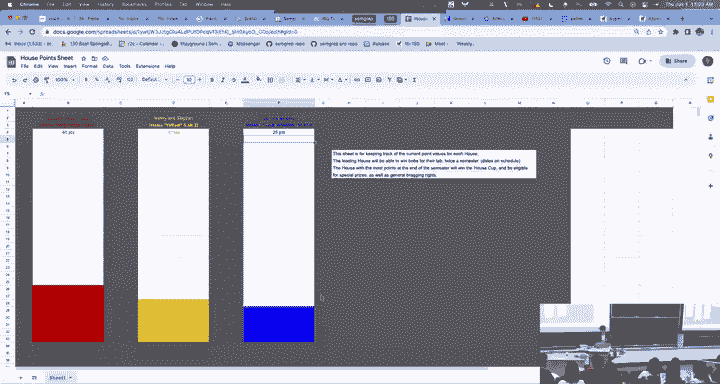
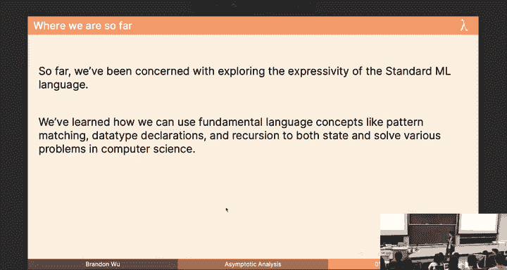
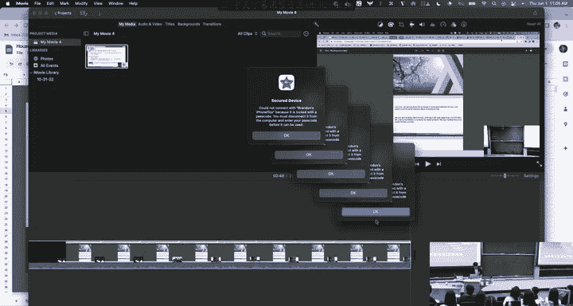
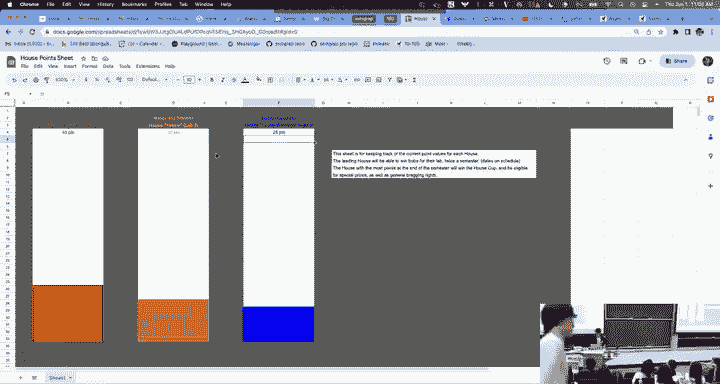
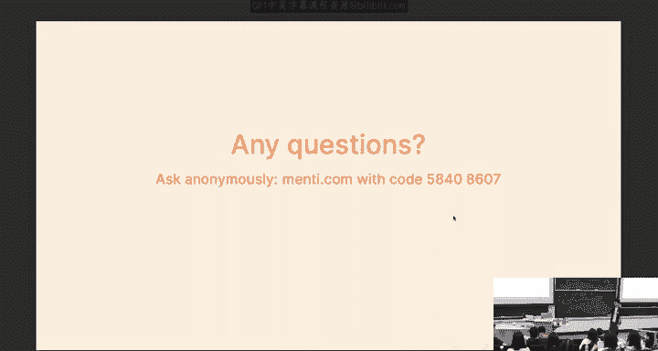
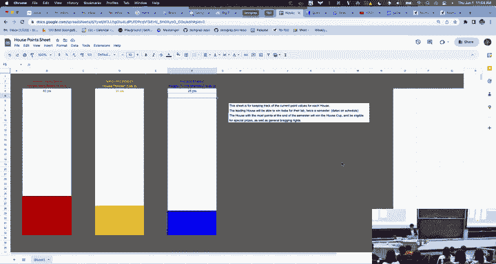
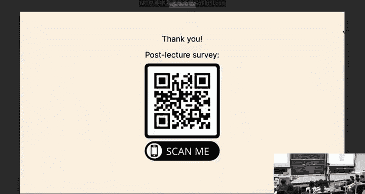

# CMU《函数式编程｜15-150 Functional Programming, Fall 2023》中英字幕（deepseek - P6：-06-6. Asymptotic Analysis _ - GPT中英字幕课程资源 - BV12VChY2EF4

Otherwise， we're going to get started with asymptotic analysis。

 who's familiar with asymptotic analysis， raise your hands。😡。

Okay， are people not raising their hands so they don't know about it at all。

 or they're not familiar with it。 right I'm surely you must have seen this in a less formal treatment in various other contexts。

 But today we're gonna be talking about it mathematically and today will' be proving it。

 Okay we're not going just eyeball our code and say， oh yeah， it looks like oh and we know。

 loops forever。 Okay， we're gonna actually prove that our code terminates and then also terminates within a predictable bound。

 Okay， actually， we've already been proving our code terminates by proving totality。 okay。

 so analysis， let's get started。 So。Three things for you today。

 we're going to talk about asymptotic complexity in generality。

 we're going to talk about the theory behind Big O notation it's probably going to be a review for some of you。

 then we're going to talk about this idea of work and recurrences which are how we quantify and solve for the runtime cost of a function and then we're going to talk about parallelism which is a really hot topic with functional programming。

 but that will be our schedule for today。😡，So I keep I got into the habit of putting these last time slides and then I realized that it was only helpful when the last lecturer was relevant to the next one and that's not true so I'm not going to talk about this。

 but that's what we did last time cool all right。So far we've been doing programming。

 we've been doing functional programming， but that's mostly what we've been doing。

 we've been doing some coding and then proving some stuff about our code。

 but now we want to move on to some other stuff so today we'll be very little coding。

 but we'll be analyzing our code that we have written and plus or minus a few new functions so we've learned about a bunch of things like data type declarations pan matching and whatever but I promised to you on the first day that functional programming was a better kind of communicating but that's not the only thing we care about。

 we don't just care about communication。 we care about how our code runs never let it be said that performance concerns went out the window they went halfway out the window we def rate them halfway so we're gonna talk about how our code performs and this imMovie thing is really annoying me right now hold on。

W哦。Wow。

What is that oh oh， you have to click on them in a prescribed order I see。Right， okay， thank you。 Co。

 Okay， let's going on， okay。

So we're talking about performance， but performance is a hard thing to measure so far we've been talking about performance in terms of steps made by a computer。

 If I have one plus2 minus3 plus4， we say this takes a step。😡，Two， three， minus well。

 I don't need the print。3 minus-3 plus4， right， and then this steps to。Steps 23 minus7。

 steps 2 negative4 right this is our idea of what it means to take a step in computation。

 what it means to measure the cost but this is not exactly super representative because what is a step mean and when I think about this I'm reminded of a thing that happened to me very formative experience and I was in first grade and I was in gym class and my gym teacher asks this kid named Joseph and this girl named Grayson to go and walk 10 steps and then Joseph Wffs and he walks like this and then he walks 10 steps and the grayson walks 10 steps and she's behind him and then my gym teacher was like see people's legs have different lengths and that means they cover different distances when they take a step this is all to say that a step is not always a step on different machines on different hardwares depending on whether or not the computer woke up on the right side of the bed。

 it can do wildly different things with its performance and that's not so nice I want to be agnostic to hardware details I want to be agnostic to implementation details of the computer that doesn't mean I don't believe in them。

an I don't care about that。So we're going to be ignoring all this stuff because we care about analyzing performance mathematically。

😡，And where does that come in， Well， we get big O notation。 I'm sure some of you know， but I'm。

In the limit of data， we're interested in how much time it takes to do something。

 because if I'm throwing petabytes of data because I work for Facebook or something into my machine learning advertising networks。

 I want to be sure that it will perform well when it has to read in said petabytes of data that I don't care so much when I need it to render like1 MBjpeg on my computer。

 Okay so we're interested in the limit of computation， the limit of performance。

 and this should be a fairly familiar concept to some of you。

 But big O notation is how we measure that in the limit of the size of the input。

 And this is there's some mathematical details that are pertinent here that I have to stress。

 Okay but we're talking about big O notation to describe a function。

 a general function I have F I'm trying to use big O notation to describe it。

 And Ill quantify that here so。Formally， if IV function f of type naturals so naturals， let's say。

 okay， the positive naturals， this is describing the cost， like it's saying it's saying okay。

 on an input of size 2。😡，Then this is equal to like three and that means steps it means like abstract units on some computer that I don't care about。

 but that's what this function means This function is denoting that cost abstractly okay don't forget about this function because that's where we start So once we have that function what we're doing okay so yeah the input is some metric of the data input like I have to be able to quantify what it means for the input to grow and we're gonna to see that this takes multiple forms depending on what our data looks like for now let's think about like functions on numbers because those have a clear size metric which is the size of the number。

😡，All right， there's a definition。I'm going to not write that for you。

We say that this function f is in like in set theoretically， in O of G， if for that function G。

 there exists n sub0 and C。😡，Such that for all n greater than equal to that same n0。

 F of n is less than equal to C G of n。 I'm going to let you write that down for a second and then I'm going to explain what the hell that means Okay because it's not super nice to look at。

 but the point is we can instantiate these constants such that for all things greater than n not okay。

And we'll continue let you writing that down for a second。

But how many people have seen this definition before somewhere？好。

How many people feel really cool with it， like like really strong。

 like you know you know exactly what it means， great， that's why I'm here。

Okay what does it mean okay， what this means is a runtime function F my function which describe describes my performance is in this complexity class O of g such as O of n squared or O of n。

 if that means that there is a point on the function beyond which the performance of my runtime function my performance function。

 there's a point beyond which my function is always less than the O the O of G function like the n squared okay there's always a point by which it is smaller so at this point。

😡，My performance function F。😡，It's always smaller。Provided that I also get the chance to scale up。

The complexity class function by a constant amount。

 and I have pictures so I will show you in a second here。I explain this better on the next slide。

 so I'm going to talk about this。Why are N and N not important， here's why。😡。

I've got two functions for you here G of n and F of n。

 they're n and2 n respectively okay if we restrict our attention to the positive naturals here on this function for n and2 n。

 F is always less than G， so it's a fair bet to say F is of 2 n， right？😡。

But what if I shift it up by one， What if I make F of n is at n plus 0。5。

 shouldn't we be able to say that n plus 。5 is also an O of G of n。😡，But I can't， because here。

 look at this F is not always less than G。 There is a point at which F is no longer。😡，Less than g。

But I don't care about that point because from here on out， it's smooth sailing F is always less。

 So I care to say that this point right here， this intercept between the two functions is my n not。

 It's my n0， such that everywhere to the right of it， I'm always less。😡。

Does that make sense as to why we need n and end not？Offset this constant factor。Okay。Well。

 I didn't see any nods， but no one's anything。But this is the picture you should envision in your head when we're trying to understand why this is important。

 okay。So I explained to you n and n not， but what about C。 So here's why C is important。

 I've got F of n is equal to n and G of n is equal to 0。5 of n。

 And we see here that F is always greater than G。😡，But we want to be able to say that 0。

5 of n is in O of n 0。5 of n is a linear function。 I should be able to say that they're in the same complexity class。

 but I can't because guess what G I can't say that F is in O of G of n， sorry。😡，But I can't。

 because it's always greater somehow because G of n got the advantage in terms of a constant factor。

 a constant multiplicative factor。 But if we scale G of n by3， instead， we take it from 。

5 n to  three times 05 n。 Now F is always less。 So the point I'm trying to get across here is that。

N and end not this idea of always smaller after a point is to get us past constant additive factors in a sense okay and then this idea of being able to do it modular constant factor scaling。

 this is because I want to be able to say that I'm for things that have roughly the same asymptotic behavior you're not going to get the lead on me just because you have a constant factor in front of you okay like things that are both approximately linear will be able to obey this relation as well。

😡，Does that make sense to everyone， I'm trying to paint this picture in your head？Okay。All right。

So we're gonna move on because I have a lot to talk about today。 okay。

 in this class generally and in general， honestly， time complexity only falls into a few buckets that matter。

 So here's the hierarchy for you。 Alright， we have O of one is less than strictly O of log n is less than O of n is less than O of n log N is less than O of n squared is less than O of n cubed。

 So on and so forth。 And there's a few buckets in between I missing that I don't care about。 Okay。

 but these are the ones we mainly care about。 And in this class。

 we will pretty much only ever see up until O of n squared。

 But we will see everything up until O of n squared。 Okay so if you're if you。😊，If you're taking。

 if you're taking the midterm， all right and you're like， I have no idea what the complexity this is。

 don't guess over until the before。 Al right， guess guess one of these。 All right， you'll get it。

 By the way， that's not good advice because we we grade you on showing your work。

 So don't do that either。 Alright， you won't get points。 But in this class。

 we're gonna see just that。😊，And this in is more permissive than we need because we want something called a tight upper bound。

 that is to say that o of one。😡，Is also in O of N and O of one or any function that is like constant。

 right， I don't mean O of one。 I mean， a function like F of x equals 2。 Okay， that is in O of n。

 It's also in O of n squared。 It's also in bh， bla，lah， blah。 Okay， But we want if。

 if a function falls somewhere here。 we want the one that's most to the left。

 The least complexity class that it falls into。 Does that make sense。

And if you don't get it approximately tight， that we will be said，Okay， oh yeah。

 that was the where I talk about it。 we want a tight asymptotic sound is what we say。

Okay here' are some common things， ways that you can think about each complexity class like you should at a certain point you should have like a hash table in your mind where you see like a bound and you're like oh yeah that's b bh blah bla I said hash table So o of one for who left someone said if I say o of one。

 that's the cost of say like causing an element onto a list that's an o of one operation also multiplying two numbers if you're an ECE I don't want to hear it also stepping an expression once any one step is a constant amount of work okay。

And then O of log n is how much time it takes to binary search an interval that's like n wide finding an element in a binary search tree of n nodes。

 so on and so forth， okay so you should think always think like like weird like binary recursive self when you see O of log n。

 okay， that's the only way O of log N ever gets introduced。Oh then， length of a list。

 last element of list， so on and so forth N log N， merge sort and Quick sort。

 merge sort we will see next lecture and I promise you I saw this in my Alpha areas button next lecture I promise you we will implement merge sort。

In 15 lines， generously spaced。Okay and it is we one of the crowning achievements of what we can do with functional programming。

 It's gonna to be really cool Okay but we will see it later and then n squared insertion sort selection sort。

 doing naive stuff when you should have done something better and gotten to know and bound Okay which happens often and we'll actually see an example done Okay so just to build your intuition。

 these are reasons why you should see these bounds Okay these are our use casesright。😊，こ。嗯。Oh yeah。

 I wanted you to not forget about the function。 Basically， Like if I write to you an SML function。

 Okay， that function has a mathematical function that describes this runtime behavior。

 What we're doing is we want to solve for that function。

 We want to find what that function is and then classify the complexity。

 But don't forget about the function that exists。 I feel like most people probably go from code。😊。

To bound， right？But in most cases， what's happening here is that the code has an invisible。

 like some underlying function that we maybe can't compute， but like exists。

 right there is a function that describes。😡，It's runtime behavior， It's performance。

 and you use this to get to the bound。 That's the point。 Sorry。

 you use that function to get to the bound。 So don't forget about this function because it's what we're going to be solving for here。

 okay。ok。I should also tell you that it's important what the function takes in。 So I said that。

This is true， right？F is from the positive naturals to the positive naturals。

 but we have to define what that means。 If I have an SMML function that takes in a twople of two things。

 what does this mean， what is my input size and we're going to find that we have to define that So when when we're going to be doing our analysis。

 I want you to first think what is the size metric I'm interested in that's going to be important and I realize I'm talking abstractly。

 we'll concretize in two slides。All right， okay。And yeah。

 we've been doing this very implicitly on until now， but now we'll do it explicitly。Okay。

Working recurrences， let's talk about it。BigO is useful。

 but it's not so useful if we can't actually get at that function I was telling you about。

 so let's do it。So let's have this length function。 Allright， with the length function。

 we're tempted to be like， oh， it's O of n Y because we look at every single element in the list。

 And like that's good enough reasoning for 122 or 112， but not for us。

 we want to be able to assure ourselves this is true。

 And we're gonna to be able to do that by computing something called a recurrence。

 A recurrence is a recurring way。 a recursive way of categorizing how much work is done by this。

 work is basically what I'm using to determine or to denote the amount of runtime cost。 Okay。

 I have a few slides later where I define it。Let's do it so。Here's what we're gonna to do。

 I'm gonna to do this for you right here。 And I'm gonna show you the general form。 Alright。

 for the fact function。 sorry， the length function， I have two cases， base case， recursive case。

 So my recurrence will have two cases。 It's a piecewise function。 I'm gonna start with this。

 I'm gonna say W is my work function。 Okay， W sub fat。 I keep saying fact。😊，W subwayth。

And I'm going to take in。Zero as my base case。And I want you to not forget that this is。😡。

My size metric。And what I should do is I should say my sizeism metric is。

The size of the input number。Okay， I should have probably put that above。

 But the point is that this is， this is what that is。 This is my size metric， and this。

Is my function name All right， I'm just defining a recurrence on a particular function All right。

 and what is w subleth of0， Well， I'm tempted to say this。😡。

It tempted to say it's one right because it takes one step to like reduce to zero right that makes sense except that this function from end to end we're talking about is in abstract units like my computer might take longer to do something on a different day than it did today right I'm talking about real cost so。

😡，Here's we're going to write， we're going to write。C sub0。 It is an unknown constant。

 I don't know what it is。 I know it exists。 And I know that it doesn't depend on my input。 Okay。

 so I'm gonna say that the amount of work。 and you might also be thinking like I didn't do anything。

 I just return 0。 but theres time cost associated to returning a number to returning from a function call to calling the function in the first place。

 So no matter what you do pretty much。 like no matter whatever you do。

 there's always a constant factor left。 Allright， I'm looking in this side of the room I'm gling you。

 sorry， So told't about this constant。 Allright。😡，And then we're going to find what w sublength。

 Now let's do the next case， right， it doesn't suffice to do it when my input is 0。

 I want to be able to define my recurrence when I have an unlimited input。

 So w sublength of n is what。Well， what do we do？We call ourselves recursively on an input of size n minus1。

😡，啊，J子。O sorry。I was in my fact brain， I was like fact takes on the number， no。

 it's actually a list sorry。But here I'm going to define my size metric as the length of the list so it doesn't make sense I kind of had to context switch there。

 but basically to get a number out of my input I'm talking about the length of the list so I'm saying a on my recurrence on a list of length of0 does C sub not work and then I'm saying my recurrence on or my function takes time on a list of length n takes y so we call ourselves recursively on a list of length n minus1 because x is has one less length so we'll say it's w sub length。

Of n -1。But I'm not done here because I had to do some work after I did that and then I added a number。

 and addition， as I told you earlier， is constant time。😡，So we're going to say plus c sub1。

Not C sub0， because these are different constants。😡，The cost of doing this is a constant， yes。

 but it's not necessarily the same constant as this。😡，Does that make sense to everyone？Okay。

 so we're going to define this recurrence and then we'll solve hereence。

So we define the recurrence and then we saw so let's go forward recurrence relation Oh yeah。

 okay I probably should have told you this， but yeah。

 a recurrence relation is two or like two or more mathematical equations that describe the cost that we have All right。

 if you want to copy that in definition you can， I kind of told it to you out loud anyway。😊。

And this is used to describe the work， which is the runtime cost， sorry。I'll give you like a second。

But we're going to solve this next and the method that we're going to use to solve this is called unrolling。

Which means just step the mathematical expression， this one until you find a pattern， okay？Go until。

You find a pattern？And then get a closed form。And once we have the closed form。

 which is to say that we have an expression that doesn't depend on w sublength anymore。😡。

Once we have that， then we can estimate a bound。 Okay， and I'm going to show you how we do it here。

Maybe I'll have enough room to do it。What's it， so。

I want to solve for the general closed form of w subbth on n， okay？We know by this definition。

 it's w sublength of n minus1。Plus C sub one。And I know because of this， right。

 it's another call right except now n is n minus1， so I'm going to call W subl。

 and I'm going get it W subb。N minus2 plus c sub 1 plus c sub 1。Right， and then if I did it again。

 I'd get another c of one， right， So you can see every time I call W sub blank， I get a C of one out。

 So if I wanted to equal taught this。I would say this eventually goes to the sum。😡。

From i equals 0 to n。Of C sub 1， and then eventually we reach the base case。 so we get C sub 0。So。

So I know that I've told you when you're proving things。

 don't use ellipsis liket dot dot and then notation here it's okay here when we're doing enrolling。

 it's okay to say， oh， eventually this goes to that。😡。

And then we have an ability to get a tight bound。Right， so once we have this。

Yeah it should have move towards once we have this， then what is this。

 this is just n multiplied by c sub1 right because if I add it to a n times。

 so we have that's equal to n c sub1。Plus， C not。And this is just a function right。

 This is a function in n。 I'm saying that the cost of running length is going to be n abstract units where one of them is C sub1 and then one of them is C not。

😡，This is in O M。This is how we're going to quasi rigorously show that length is in O this makes sense to everyone。

 yeah yeah yeah。I will require no justification for you that that's true like if we look at the code here like it's because we're taking every time that we generate a C of1。

 what's happening is that we get a number and we add it to one I would be fine if you were just like yeah。

 that is the same constant because if we're assuming that the amount of time it takes to add those numbers is not dependent on the size of the number then it should be like roughly the the same constant we're still talking in abstract units so like you addition could take a different number of milliseconds on your machine but in this case we don't care so it's okay to say the same C of one here。

😊，TheIn sum。 Why is the sum staff of 0。で话。Are okay， yeah， so。

We generally don't care like if you were in approximately the right ballpark。

 I didn't bother to count out how many they were， but if you're off by one， it's okay。

 Like the general point is that there's approximately end of them。

 And honestly it'll make your life harder if you have to then go like n minus1 c sub1 plus C like the point of unrolling is oh。

 there's a pattern here。 There's roughly linear and honestly we're not gonna let you jump immediately each here but you should show like okay there's like it might even be better to say this。

But there's people that will have notational concerns over this， so I prefer not， yeah。Poose for。

A circle。 So you're gonna to say， oh， this is in bla， blah， blah。 Here's how。Yeah。

 like I assert like the close form is NC plus one close。

I will be fine with that as long as you show eventually you get there。I mean。

 this is an extra writing on you。Pfess who asked the question before I'm give you I， by the way。

 he's not looking。Okay， cool， so we're going to do On， okay。All right。宝宝宝宝宝。

Oh now we're going to do fact， okay， I see what happens， Okay。

 cool fact is going to be a very similar case right， if I have my base case。

 I do a constant in my work。Pretty much every recurrence you've ever seen your life is going to be of the form W sub F0 equal to C sub C。

 Okay， like I get tired of writing this at a certain point。 You should， and you have to。

 but there's pretty much no way for this not to be true okay so。

Here's what we're going to get we're going to get that the marked to effect on input size zero is going to be seen on and then in the recursive case。

 same deal I make a recursive call and I do a constant amount of work so I have C sub1 time or。

Plus sorry， that should be a plus I' a c of1 plus the work of fact on n minus1 Fair enough。

 it should look like your code and it's almost like your code resembles the proof and your code resembles the recurrence relation。

 Okay， there's the theme here I'm going for something。

Okay and this will solve out to be the same thing pretty much okay。

 I'm not going to accept the work with you。I will occasionally do that where I will say like we get to something which looks like w of F of n is equal to c sub1 plus w sub F。

And-1， if I feel like it， I'll work through it with you。

 But I'm just know that this does evaluate to O of N。 And no， on your tests， if you see this。

 you cannot immediately say it's O of N， you have to solve it out。 Okay， it's on your homework too。

 yeah。Are C yeah， I made a misstep， sorry I am a crush loud but not on the。Yeah。

 so do we not care about the actual abstract cost of CN OC1？It's something， it's something。

 And then you know， it varies depending on your machine's state of being。

 whether or not you've played Minecraft recently， like it depends。 but ama， it doesn't really matter。

 Any other question something。All right， I suspect I'm going to have to raise this board for the next part Okay。

 so this is how we set up and solve a recurrence relation and I'm going to talk about，Oh yeah， okay。

 so this is just how I solve for it， and it's fine where I talking about unrolling。😊，Okay。Go。

Okay next the next example I wanted to talk about was this find first even function Okay Fact is pretty simple right length is pretty simple。

 you just make the recursive call and you do the thing， but what about if I had a function。

 this function that as the name describes finds the first even number in a list right and you should be able to show yourself this is what it does we look at it if there's nothing we' return none the handy option that we learned about last lecture and then if our first thing is even and we return it otherwise we recurs fair enough。

😊，How do we， how do we analyze the runtime cost of this guy， Because if we're really， really lucky。

 if we， if we cross our stars and hope to die， Okay， our first element is going to be。

Even at which point we're okay， we'd return， no big deal。But that's not always going to be the case。

 So would it be， would it be， you know， okay for me to be like， yeah。

 I'm going to hand you this function。 Trust me， it's all fun。Trust me it's what over one。

 don' worry about it Con time and then I pass it to someone and then my you know NSA contractor that's taken in this function decide to pass in the petabytes of data they have on all of us in the form of a list and then they loop for like like three years and they're like what's up well why do you do that？

It's because we weren't pessimistic enough。 Here's another life lesson to you。 Be pessimistic。 Okay。

 so we're going let' let's sound better in my head。😊，I we' going to write this recurrence。

 well okay I already talked about the length of the list， but let me not speed passes this too fast。

 sorry。In the base case， we're returning c sub0 again， right， because we just return none。

 but how do I do the recursive case because the recursive case has a branch， right？

When I said pessimism， I mean worst case behavior you've probably heard this term before。

 we're interested in pessimistically the worst possible performance our function can have depending on the input past to it because we're not always in control of what that input is a nefarious actor might decide to pass in something to us and then try to make our function loop okay they might do a SQL injection。

 they might do like some kind of attack on us okay security stuff。😡，I work for a security company。

平是 going do。We're going to be talking about worst case behavior so what is geez I put the function away but what is the worst case behavior it's when there is no even element I have to look at the end of the list so let's do it up here so we're going to do。

😡，So W sub。Findd。First， even。On zero， equal to c。And then W subfin for even。On any arbitrary input。

In the worst case， I go into， I keep putting it away， in the worst case， I always enter this case。

 in which case I do W sub find first even。😡，Work on n minus1。

 which where n is length of list actually I should put this up here where。Is the length？Of the input。

 and you should preface your recurrences with this wherever you do it。

But where n is length of the input， I'm going to call it on a list of length n minus1。

And now do I call it， am I done？I see heads shaking why？actually， here's a better question， actually。

What if I solve this out， what is this going to be。I saw about this equation。

 what do I get for W sub fine per even？I guess see not I always return my recursive call。

 some of you may be familiar with this having done the induction homework right if you don't do anything。

 if you never like make a recursive step you're just going to return your base case。

 you got to do something right so。😡，Plus C sub one， it takes some work to go and fetchch it。

 to go and return it， to go and like hold it in your hand。 Okay， the result， All right。

 and then this is going to be。Equal to。We stand this out， we get a C sub1 per call。In O， yes。Yeah。

 I was mostly appealing to your intuition that we'd be in this case and do nothing。

 but you're absolutely correct。 We would actually prior to that have to do some work to even get into the case。

 We have to do the comparison。 Yeah， computers aren't magic。 The best the earlier you learn。

 the computers aren't magic and they have to do something is better for you， I think yeah。😊，Yes。

 if you have multiple amounts of work， I highly recommend you don't try to write them out into different concepts。

 flatten them into one concept。Cool， and again， like this is probably the least rigorous part of the course。

Yeah， this is probably the least rigorous part of the course so if you omit some things as long as you do the work right as long as you actually show that you know how to firstly manufacture these recurrences and then secondly solve them。

 then we're okay， butcod details like those constants or like you know other things like that like it's okay right I believe I have yes。

Okay， so I already walked you through pretty much all this stuff， right？Go。

Okay here's the next thing I want to tell you about I'm going to give you the formula for how to do this from now on。

😊，If I want to be able to solve the general form of the aymptotic complexity of function。😡。

If I have this function F， this SML function F， here's what I do。 First thing。

 identify the size parameter。 I set it here， write it down where n is the input size of the length the length of the input。

Or n is the value of the input if we're taking in an inch or n is anything else depending on what the input is。

 it could be a tuple， it could be a function， which is strange it could be a lot of things okay but identify what this is and then state it explicitly and we're gonna to see a couple examples where that's not true。

😡，Then write the recurrence， the recurrence will usually be multiple branches。

 okay I've got my base case and I've got my recursive case you might even find that you have multiple depending on how your code looks okay the recurrence follows the code。

 the code gives us the recurrence， but we start from the code。😡。

And then write these equations in the worst case， and then simplify the recurrence。

 solve the recurrence， do this， but not with the dot dot dot and get well。😡。

You can do thet dot dot just not immediately。 Allright。

 show that you establish establish the pattern。 Alright， and then get to O。 Let me。

 let me be more explicit about that。 right， Like I told you you couldn't just say here do do dot O like I did。

 But what you should do is you should step it once or twice。 That's what enrolling means。 Okay。

 unroll this definition。 like once or twice or three times demonstrate that you realize， oh。

 I'm getting a C sub one per step。 And then there are end steps。 Therefore I get。在对在。

N C sub1 plus so on and so forth。 Okay does that make sense like we want to see that you're thinking and not just consulting a table because by the way。

 this is very memorisable Like we literally tomorrow will give you a table where there's many of these recurrences and then we tell you what the bound is Okay but we want to know that you know how to solve it because these things get more tough especially if you go and take like 15 to 10。

15451， these get a lot more complicated Okay you ever take the square root of a square root。😊。

I remember that one， okay， so simplify it into a closed form all right and then you have a bound。

And then you should be done Okay， this part， this step should not be hard。

 So like like really like the hardest part is this part， step two， right the recurrence okay。Sorry。

 actually I take that back。 this is the hardest part。 simplifying neurocurrence。

 we're doing unroll for now。 we're going to see a different way of doing it called the tree method in a little bit okay。

😊，Okay， cool， let's move on。Remember the rep functionction？Well， this is done now。

This is what we did with Rev， right， we decided that we didn't want to deal with this。

A pendingending nonsense and we wanted to make it faster。 So what did we do。

 we just like pulled it out and made it tail recursive。

But we didn't want that because it's less efficient。

 so let's actually I'm going to qualify that for you now， I'm going to prove to you how on earth。

I'm going to prove to you that it's actually less efficient， all right？

So and it has implications for time as well as space， right cool？

We have these two functions and we have Re。😡，Let's do the recurrence for revv。

And I've actually spoiled， I was going to say next for you， but W sub。Rev of zero is seen not。

And then w sub rev of n， and then I should also say。Where N。Is the length？Of the input。

Maybe I put it in a tag or something。But I can't write this because I don't know how many abstract units it takes to call this function to call aend。

 You can assume that， you know， plus times minus takes constant amounts of work。

 that it's a single constant。 But we don't know that for a pen。

 Similarlyly to how you can't use totality of a function unless you unless you prove it。

 You cannot tell me the abstract units of a pen until you show it。 Okay。

 So we're gonna show it for a pen。 So we take a detour。Hold。And then we go to here， all right。

So let's do W sub at。Of zero。But now we have to define what our where is and does anyone see why this is tricky because a pen it takes in a tuple。

 takes in one list， takes in two list， right， it takes in two lists at once。😡，But what， what。

 but I want a single number。 So what about， okay， let's write this up where。N is the sum。Of the。

Lengths。Of the inputs。Do people feel good about that， should I do this？

Becauseuse this would be kind of strange， right because now my base case is like。

 my base case for a pen is now when wise like could be one or two or3 or n in length。 right。

 Now I can't， I can't say w sub a pen of 0， really， I mean， I can。 But I later on。

 I can't like use that in a useful way。 So let's actually say n is the。Liength。Of。Of the。Left list。

Similarly to how when we did the proof on append， we induct it on the left list。😡。

Our work is depending on the left list length， okay？

So let's do it all if I have zero as the length of my left list。

 I'm going to do C not work right and if I have w use of aend of an arbitrary length list。

 I'm going to do what I'm going to do cons and I'm going to recursively call myself so I get w use of a pen of a list that's in one less because x's is one less than x times xs。

😡，So n minus1 plus c sub 1， does someone tell you what this solves to？Yeah， if we dotted dot it。

 we're going to get n time C sub1 plus CO， don't do this on your homework。

 but I don't want to bore you in lecture right now。And this is in O Bank。Okay， are we cool with this？

Now let's move on， actually no I left myself room up there。Right， so let's go back to revv。

 let's pop the stack and go back to where we were All right。

 that doesn't make sense to most of you probably， but that's okay'll be sub rev on end now I have aend I know what the so let's write it up first and then let's simplify okay。

 so if I append with Rev。Well， okay， what am I going to do first。

 I do a constant amount of work to call the function and return in whatever， so let's say C sub one。

I also do a call to Rev， so I'm going to sayW sub revv。😡，And well。

 what I need to be able to justify find myself， what's the length of x's， it's n minus1， right。

 because it's one less than x tons x's。Okay， now I need to justify to myself。

 so append takes them the result of rep of Xs。What is the length of Re Vexs？N -1。I will not require。

That you prove that or that you like just you can justify。 you should probably say something。

 but like rev of X's just returns the same list， but reverse。 So the length is the same。 Okay。

 so it's okay to be like double the use of rev。N minus1， sorry。And these are pluses。

 why did I not multiply or something here？Would this be okay， will this make sense？Cause like。

 this is kind of a weird thing to say。 Like the abstract units I took to perform this computation。

 I do it。 I do this one as many times as the abstract units I got out of this computation。 Like。

 it kind of doesn't parse。 It kind of doesn't type check in your brain。 Okay。

 we add them because why eager evaluation。 I did R of X's。 I sort the result。 And then I did a pen。

 it's a sequential thing。 plus corresponds to sequential operations。😊，So。We have that all right。

 and then I will need boardspace for this， darn。Let's all。So。Well， first of all， let's replace this。

 okay， if I have W append of n minus1， let's say that this is going to be in abstract units。😡。

This guy， right， because I got this earlier。So let's do I have them in like a bad order。

 I'm going to put them like this， okay。N minus1。Plus C1 from here。开。

But this guy I'm going to say is yeah。I see。Yes， that's true。 This C1 is that C1。

 I just moved it over。 We will get another C1， but here's what I'm going to do。

 I'm going to say I don't care and I'm going to say。N minus1。Yeah， C sub2， actually sorry。

 I thought you were talking about。This guy， which I would decided not to care about， you're correct。

 but this one we're going to say is C1 prime， which looks like a one with the superscriptive one。No。

 I'm not actually going to do that。 Let's go see some two。嗯。Call it B。No， not at all， not at all。

 it doesn't matter what it's called at all if you call it like like I don't know。

 did I Joe from Mexico like like your TA might get a little like upset that your page lie now like 50 characters long。

 but like you know，t don't go crazy。嗯。So we're going to do this okay。

 and then are you're correct that these are different， but basically what I do is I drop this。😡。

Why because this is clearly larger than that right I don't care if you do that it makes the notation a little bit simpler if the shortcuts I'm taking are confusing please speak up we can do it in more detail but I'm trying to like show you that you don't have to do as much work later on when you're solving this for yourself okay because it will take effort right so we're going to do this is everyone on board of why this is that？

Because we got a constant， which is different and it's n -1 because that was the size of our input。

 Okay， All right， so now we have， let's just say that this is that right， This is that。

 And then let's solve。 let's unroll。 So we're going to get。😊，This is now an n minus-1。

So what do you think about this？😡，What do you think about this？Does this look okay。

 I substitute this for that， basically， is what I tried to do。Does anyone see an issue here？

I will erase the pen in the meantime。So， there isn't， yeah。你找是。I have a called。是写呢个。

Every red call you need to make another call on a pen。I just doing that。Yes，损 yeah。

We have an issue because I've forgotten the person a call， so I need to add in。Put it here。

But I claim there was actually still of an issue here。N-2。 y。

 Im actually well give two touch to that。When I put in n minus1 here。😡，This is now n -1。

N is now it doesn't quite make sense。 but like， let's say that this is like an arbitrary variable K。

 This is K， and then K is equal to w is sub rev of K -1， if k is now equal to。N minus1。

Then this is k -1-1。 Does that make sense， I'm substituting in n -1 for the place of this variable that happens to be named n。

 Okay， it doesn't matter to me this is named N。 but my point is that like we're going down by one。

 So this should be。😡，M minus-2。Is this confusing to anyone， does everyone see why that is？

The how the room was dying on me all right， and then let's do another one， Okay。

 so if I expand this once more， I'll get w sub rev of n minus3。Plus C1 plus。Yeah。Yeah。

 plus C1 n minus-3。C 2 plus， actually， you know， I'm not going to write that， in mind。 Okay。

 so what we notice is that we get an n minus1 or sorry， an n minus I。At the eighth step， right again。

 n minus I sub2， all right？And let's just collect these Cs sub ones， right。

 so let me actually rearrange it for you。N minus2 plus C1 plus c1 by taking these two together。

 right？Plus n minus2 c sub2 plus n minus1 C sub2。's like these are like。And these are like。

 but I notice I add one to it every single time。 It's just that this depends on my n。

 It goes down by one each time。 So what am I going to get。I claiming to you。

And stop me if this doesn't make sense if you dot dot dot it， what you're going to get。

You get the sum from an I equals 1 to n。Of n minus I c sub2。Plus， N c sub 1 plus c9。

Does this make sense to everyone why we should get this at the end， if I unroll n times。

 I'm going to get。N of these terms where they all depend on n itself。

 and then I'm going to get this guy n times， and then I get my base case。😡，Okay。

H but now this looks kind of gross。 I didn' I didn't sign up for this， I didn't sign up to do math。

 Okay， like why do I have to now deal with this simplification of that term。

 And the answer is I don't want to。The answer is I don't want to， so。

What does this really look like Well this expression actually looks like。

N minus I up until n is 1 plus 2 plus dot dot dot plus n。C sub 2 right plus n c sub1 plus c0。

Do you see how I got this like I expanded out this animation， this is really what this looks like。

 it's1 plus2 plus double dot plus n。😡，C sub2， and do I have a fancy math fact about what the sum of the first n natural numbers is。

 we did a proof about it kind of， but we did the odd numbers or the even numbers or something。😡，嗯。

Who has up up top of their head， What is this， What is that quantity， What can I say this is？Oh yeah。

I like it。😊，Fancy guy called Gauss。Once a upon time， sorry。Cool， so let's say this is。So in general。

In general， you can say this， right？You can use this for free I will not require approve it。

 this is a math fact。We're here to learn programming facts on math facts。 Okay， so this is free。

 Okay， but this means that our quantity from earlier。😊，It's going to be n n plus 1。N two。

 C2 plus NC1 plus C0。Would anyone like to be so brave as to suggest a complexity bound for me here？

I heard n squared， yes。Because we have an n times n here。 Yeah。

 it doesn't matter It'll be divided by two。Okay， after a page of equations we come to conclude that Rev is quadratic。

 I promise to see you already， but now we've proven it。

 I've shown you you'll need to think about what's happening here because you did the math。😡。

Because we stated these and this is like a very this is a point in favor of like modsonents of like implication like we stated this and you agreed with me that this is the recurrence and it was very easy to state and then I stated this the append recurrence I erased and we stated it was very easy and we re and now we saw it and pages of math later we get this so we must be correct if the recurrence was correct okay。

Recursion is a way of stating an infinite amount of information in a finite amount of space。

So which stuff are you saying when we can allide？I'll be wary of making that simplification because you might go too far like in a different situation I could see you making that simplification and getting not as tight of a bound I prefer that you go from here there you're correct that in this instance it doesn't matter you get n squared out of the way but I'm cautioning you that in general like making substitutions freely of oh this is less than that so let me replace it with that leads you to like get worse bound than what you could otherwise get so I'd encourage you to please do this。

😊，Okay， I hear a chatter， so does anyone have questions or people oh， yes， plenty people。

There can be， I can't recall in this class whether or not that's true in my paper210。

 but it could definitely be， yes。If you come out with constant multiples and constant additions。

 Yeah， that's perfectly fine。 As long as you you re picked this because it was the biggest quantity。

 Yeah， yeah。一谁月。Okay， yeah， so if we look at the code here。Rev makes it。

 rev makes it call a rev on a list of length n -1。 So that's where the w sub rev of n -1 comes from。

 And the C1 comes because we have to do like some constant amount of work to like make the singleton X to like return。

 There's always a constant amount of work。Yeah， sometimes we don't care what。等一下。This to that。

 Le alsoa。this to that so I took this， I took this and I put it there。

 I took this and I put it there， and I took the ws of the pen and I erased the occurrence for you。

 But if you remember we came it came out to be n times C sub2 plus like a CO that we don't care about。

This is n -1， not n。 So we get n -1 multiplied by a new constant C sub 2。

 because the pen constant is not the same as as this one。 Sorry。

 I era the requirements you can't see anymore。 But if you go back to the notes， you'll see。嗯。Right。

 we're going to move on because I have not that much time。

 but this is basically everything I just said， everything I just said but worked out。

 so you can refer back to this if you're confused okay bh， bh bh， bh， blah， so on and so forth。

And then if we went to go went to go analyze T rev， I'm not going to write this to you for you。

 but I'm going to tell you that this will end up being linear because we will get exactly the same re that we got for like length or for a fact okay because we do constant and in the recursive case we do a constant amount of work plus a recursive call on the list of length。

M minus1， okay， and the work for that is in the textbook。 And by the textbook， I mean my slides。

 okay。But we're going to move on。Okay， so I wanted to just kind of say like like the reason why we can do this is because our functions are pure okay given something of the same size。

 I always get predictable behavior agnostic to like hardware or specific things like how long does it take to add to numbers where one number is like really big okay so this comes directly out of our purity。

😡，Property， okay？So plan do your functional programs help us reason about our code I think I have。

Question break now Yeah okay I wanted to take any questions and I also wanted to do something where I noticed that the same people are asking questions and I don't really like that because I feel like it's not because the same people of you are confused。

 So I have this website here if you go to it with that code you can ask the question anonymously and I will otherwise take questions that anyone else has does anyone have any other questions right now that I can answer while we wait。

😊，Because I know stuff can get confusing， but we're going to work through it， okay。

The point of being able to do these recurrences is， again。

 this idea that programmatic thinking and mathematical thinking are the same thing。

You write your program， you write your program， you get the recurrence。

 recursion helps us finite amount of space， infinite amount of math facts。

Always able to click for an arbitrary function。三五。For some recurrences。

 this is a really esoteric quantity。 Like， it's like kind of strange。 Like when you。

 the thing you decide to recurarse on is something that's not clear。 It's not just the length。

 It's not just the number。 It's like a relationship between the number sometimes。 So like。

 I would say that it is not always， that's like a philosophy of math question。 Like。

 is it always solvable in this class， yes。

But in general， it could be a hard question Okay， I'm going to check Manino。

Jesus Christ， all right， okay， all right， all right， no menee for you anymore。Yeah。😊，Cool， okay。

 we're going to move on wait wait， is that question？Jesus Christ。This is my first time he since。

 all right， thank you。This is the thing this is a comedy club， I'm not paid to have you laugh。

 straight faces， stop smiling All right，quiz time， let's go stand up house blue team here。Please。

 please actually do this。 You will you should you need the help Come on help me help you house blue team here I'm telling you you need the help for this quiz Alright。

 let's get let's get going how's that a feel thumbs up thumbs down。

 I realized there was a math fact that I didn't actually like show you so we might not create that one actually don't create the one about one plus through n2 plus4 yeah thanks。

😊，I thought I told you that math fact already， I did not， all right， cool。It's oven。

It's bounded by2 n， I'm going to show you why that is。Yes， okay， let's move on all right。

 we're going to talk about parallelism and span I told you something about how functional programs are like kitchens where the cooks can never mess with each other functional programs hey but downna。

😡，Functional programs are inherently threads safe， they're inherently parallel friendly。

 and I'm going to claim to you that we're going to be able to see how that's true also in terms of how they run in parallel okay。

 so we talked about work which is how we measure the cost of a computation in abstract units。😡。

Like this， right？But it's not necessarily true that this computation needs to take three steps because I just did this one and I just did that when I did this one。

 but if you think about it， a really smart computer could somehow manage to do two of these at the same time。

😡，OkaySo this idea of parallelism， I'm going to claim to you here。😡，Let's have a race。

 I want a volunteer from the audience， they're going to racese me。

You're the only one raising your hand。 So yeah， come。 right。 front race。 Okay。

 so here's what we're gonna do。 We're going to race to see who can count the number of people in the room fastest。

 Yes， Okay， though don't tell Yeah。 All right keep your head turned。 Allright， Okay， ready。😊，Three。

 two， one， go， Nancy， come up here。后面有。I on， hurry， hurry， hurry。

 keep keep counting you take the left half， Nancy。What you get？Okay， that's 58。No for。O你。

Thiss a classic demonstration I'm a thought of by Rob Simmons。 I want to No， not Rob Simmons。

' but my been told me about it， basically。If if we had been on the same page fast enough。

 then I could have counted the right half and then she could have count the left half and we just sum up the answers。

Counting is a parallel friendly operation so the point is that okay if we were working in like computers and then we had like RA and disks and a memory and multiple cores。

 this would have been a faster computation to do if we divide it in half okay that's the idea。😊。

So we can use parallelism to solve some problems。 And that's the idea of parallelism。

 when a process can execute some tasks at the same time。 when I can do multiple things concurrently。

 then I can get a speed up on some problems， but not necessarily all problems， okay。嗯。

The hardware level of it is a processor delegates instructions to different cores。

 and then they do them at the same time， but we're going to forget about that because we don't care。

 okay processors exist， that's good enough for us。But it's hard to pick a number for how many processes we have。

 So we're going to assume we have an infinite amount。I'm not joking with you here。

 We're going to assume that we have infinitely many processors。

And you might be thinking like infinite processors shouldn't we be able to do literally any computation。

 well， that's not true， okay because even if I had infinite processors。

 I can't necessarily always make use of parallelism。

 parallelism is specific to the algorithm and specific to the code。

Consider the problem of making a sandwich， okay。If I want to make a sandwich if there were an infinite amount of me all right I might want infinite amount of sandwiches。

 but making a sandwich is kind of a hard process right if I want to make a sandwich I got I got to chop the bread。

 I got to put like mayo on the ham or whatever I got to get a slice of cheese from the fridge I have to do a bunch of like maybe I have to put it in the pan and toast the bread and even if there's an infinite amount of me what we're gonna to do is we're going to crowd around the same pan and we're going get in each other's ways and we might bite it each other or something so it's not necessarily true that I can instantly make a sandwich。

So the note too is that making a sandwich is hard。 It's a hard problem。 And this is the idea。

 This is an analogy I know crazy of task dependency in parallel computing。

 Certain tasks depend on other tasks， and we can qualify that。 Yeah， some tasks have dependencies。

 meaning you can't do them until you finish other tasks， okay。😊。

So here here's a graph for you here okay if I want to assemble the sandwich first I got to toast the bread in the pan。

 but before I can toast the bread in the pan I got to heat the pan and then I got to slice the bread。

 but also before I assemble the sandwich I got to get the slices of ham and the slices of cheese in this analogy I'm making a ham and cheese sandwich so the question of how long does it take to make a sandwich which you are all wondering now the answer to that is the length of the longest path the longest path among these operations is however long it takes me？

It's not necessarily this one。😡，Because I might want really premium cheese from down the road， okay。

 I want to go to jgle and get my cheese， so I got to take like a 61A down to like Murray fors and Murray and get that okay so this might be the longest step。

But this might be also it depends on how long each step takes。

 So the longest wait time among all of these prerequisites。

Is how long it takes me to build the sandwich， even if I was parallel， right。

 because I might have like， you know， three of me doing these steps while I'm doing this one。

 But because the 61 a was delayed and my bus car doesn't work because I graduated。

 then I can't make the sandwich。 Okay， so that's the analogy you should have in your head， okay。

So this is the idea of a task dependency graph。 This is not super important to know。

 Just have the idea in your head， the task dependency graph。

 we can write a graph that shows the dependency between tasks and the idea is that the longest path through that graph is the cost if I have a graph。

 like a general task dependency tree or graph or whatever。 if I have one processor。

 I can't avoid doing everything。 Okay if I have one processor I can't avoid having to heat the pan and slice the bread and get the size of hand and do this all sequentially。

 But if I have many processors， I can do it from top down。

 Okay that's the idea of parallel computing。Okay。So this is the difference between what I'll call work and span。

 if I have a work of a process， work is how much it takes me to do it using one processor and span is how long it takes me using infinitely many processors okay。

Here's a thing you should know now。 Okay， we said earlier that tus are evaluated from left to right from now on。

 when we're doing span calculations， you can only when we're doing span right when we assume we have infinitely many processors。

 you can assume that tuples are evaluated in parallel， that means that like if I have E1 comma E2。

Both of these are done at the same time。 So to step something like one plus 2。Plus3 plus four。

If I'm talking about span， if I assume I'm in that case， this might be one step。😡。

Because I can do them independently because the arguments to plus are a twople， okay？

So that's the idea only when we have tus， only tus can be parallel， okay？

We use recurrences labeled with W， W for work from now on or， well not from now on。

 but when we're doing span recurrences， they will be labeled with S。So let's do the span。

 in fact let me check how much tab I have， let's do the span of the length function， okay。

 it's going to look very similar。I already told this to see you okay， let's see the span of length。

 so same thing。Where n is the length。Of the input。Les。I want two equations。 I want s sub0。

 the span on a length， a list of length is zero， sorry， S sub length of 0。

And this is still Con right it's still constant， even if I have infinitely made processors。

 and what you should think is that when I put S， I'm now in my span brain。

 I'm thinking about as if I was holding infinitely made processors except I can't actually physically do that。

And then I have S subbth of n。Well， okay， lets we think， if I had infinitely many processors。

 I could do the computation of one， the value， and I could do this length of x is call at the same time。

 Okay， so I'm going to say that the amount of work I have is the maps of C1。And then S subleth。

Of n minus1。It's the maximum， right because these happen at the same time。

' the time it takes me to do the computation of my arguments is the length of the longest path。

And then plus C sub2。But if we look at this， clearly， the maximum of these should be the length。

 right， So then I get that the maximum is just。S sub lengthth n minus-1。Plus C sub2。

If you swap out the S for W， we already saw this recurrence。 this is the linear length recurrence。

 This is the O of N。I'll leave this as an exercise to you， okay？

What givesbbs why I promise you infinite power， I promise you infinite processors。

 but we got the same down。As the work， why？Yeah。Right。

 if two processors take over the one and the length of xs。

 a third processors still got to wait for them to do the plus。 that's absolutely true。

 So we say that for a function on lists， it's inherently sequential。

 A list is an inherently sequential data structure， okay。So when we're doing this。

 we're not going to expect to get a better span bound when we're doing something unless this， okay。

 that's a general rule。Okay。So if we do all the math， we do all this out， blah， bla， blah。

 we're going to get open。Okay， I know I'm skipping through these button， just listen to my words。

 okay。What's a data structure that has more than one child if I have a list x cons xs。

 if I recursse on x's， I still have to wait like I can only I can only if if you visualize a list like this right x cons y cons z cons x's before I get here I have to look at this before I get here I have to look at this before I get here I have to look at this sequential right？

But there's a data structure where we don't have that problem， it's called a tree right。

 So if I want to do parallel operations， let's try doing it on a tree。I got treat some for you。

 Let's try to do it， okay。And here， okay， so actually， I shouldn't skip ahead。

 The first step define your size metric。 What is the size metric for a function on trees。

 How do we quantify the size of a tree？ So we say where N is， Does anyone have any any ideas。

I heard multiple people say， I think number of nodes， right？And is the number of nodes。In the input。

Okay。Let's do that。Well， if I look at Tsome， I get S sub Tsome。Of zero is C0 and then s subt sum。

Of N。Is well， okay， now I have to be able to say something about my recursive colors。

 but how many nodes are in the left and right subtes？For an arbitrary tree。I don't know。

I don't know how many there are， but remember， like lesson， be pessimistic。

 so what's the worst case behavior， what's the worst case for us you think？For if it's a spine。

 if it's just a singular line of nodes， right？So。And also by the way。

 there's two options here we could have done the number of node of the height of the tree and we'll do the height of the tree next lecture。

So let's be pessimistic， So what I'm going to do is I'm going to say that we have an unbalanced tree。

 Okay if I have an unbalanced tree， if I'm doing it。

 let's say that all the node are on the left Okay I'm going to have S subree sum。😡，And actually。

 let me not forget the max， okay， it's the max over and I'm going to make it a max and air。But。

S subre sum of my left， which is going to have n minus1 nodes in it。And then a constant amount to do。

Treat， okay， actually no， I'll write this up。 S sub treat some。On zero。

And then some constant amount of work。Plus C sub2。 as everyonem cool with this。

 I'm doing all of them in parallel。 I'm computing the X。 I'm computing the right and the left。

 but this is my right。And this is my left for an unbalanced tree because it looks like this， yes。

Computing that's for the additions afterwards。不是手机。I this， so if this is true。

 well clearly the maximum should be the s sub3 sum n minus1。N minus1 plus C2。Again。

 this is the same occurrence if you ignore the name and you ignore the S， right。

 Do you believe me that this should solve to O N？😡，What gives？I first promised you parallelism。

 and then I promise you parallelism on trees， and then we got none。😡，Our bound was not good。

If I look at a tree that looks like this， it's really just a list。

 it's a list that's pretending it's a tree， but it's a list nonetheless， okay。

If I have unbalanced trees， I'm not going to be able to give you better bounds。

 so let's do better okay。😡，It's a lot of skipping through what I was going to talk about because I already said it。

 Okay， so here's the idea。Yes， O。So there are only really two cases for trees。

 either it's unbalanced， which means it looks like this or it's like a full tree， Okay。

 a complete tree。 And in the case where it's a complete tree， a balanced tree。

 were going to get a better bound。 So now assume that we have a balanced tree。Which looks like this。

 okay， here's what I'm going to do。So I'm going to say that the balance case looks like this。

We're going to do S sub3 sum。Of0 equals c， and then s sub 3 sum。Well， what do I say now？

I'm going to get I'm going to get this。 I thought it would show me the function again， S sub3 sum。

But the number of nodes on my left subree for a balance tree is roughly half of the amount I had initially。

 right， So max of n over 2。 And then also we get a C sub1 and then we get an S subre sum。

Of'll end over two。Plus C sub2。Okay， and if you believe me。

The maximum of these we don't actually really care， so we'll get S sub。3 sum。

Of n over 2 plus c sub 2。This makes sense to everyone。

And now we're going to look at the math fact that I told you about in the quiz。

 which is that this thing， if we expand it is going to be。S subresome。N over four。

Plus c sub 2 plus c sub 2， right？Equals S subre sum。N over 8。Plus， C 2 plus C 2 plus C 2。 So now。

 instead of getting a C2 every time， rather， instead of doing it n times， right。

 we're gonna to keep dividing by two until we no longer can。

 What's another word for dividing by  two until you no longer can。Taking the log， right。

 So what we're going to find is that this， if you thought it out， solves to log。

 I suppose to but you know， asymptically doesn't actually really matter if you just write log to。

 well log n will' be fine with that。C dot， C2 plus C。And that's because of this space case， right？

So is everyone clear cool with like this？So we get logarithmically as much time because of this okay？

We get to view a better balance because of perism。OK。

And you should believe me here also because I'm if I am doing this like this is。

 think of this as the task dependency graph。 This basically is right to do this。

 I depend on that to do this， I depend on that。 So if I have infinitely many processors。

 I go and I do this， and then those processors are like， hey， hey， dudes， like take over these guys。

 and then do them。 And then they're all being done in parallel。

 So really like the amount of work it takes me is the height of the tree， which is log N。

 if you know anything about complete binary trees， the height of the tree is log of the log of the number of nodes。

 if it's a complete tree。😊，Okay。So we get a better bound。

 and then we can see that parallelism does help。Okay， oh。

 it turns out actually the math fact I gave you in the quiz is actually not even for this lecture。

 okay， cool。😊，Next lecture， you'll see。Okay， I have to say this because we always have to say this。

 but yes， infinitely many processors is impossible。 We can't do that。 Okay。

 we can have four processors。 We can have eight processors somewherewhere out there is like someone with 32。

 I don't even know if someone knows the maximum amount of that。 but it's impossible。

 but that doesn't mean that this is useless， okay。We we mathematically proved the behavior of how where our bound was if we had infinitely many。

 but the idea is that in reality the actual cost falls somewhere in between。

 so the actual cost of using trees sum falls between linear and log。

 there's a theorem called Grrent's theorem that goes more into this， I omitted it from this slide。😡。

But it's somewhere between okay， so this is not useless。

 but we can analyze how fast circuit machines run， even with parallelism。 that's the idea right。

And yes， I knew this the whole time。

