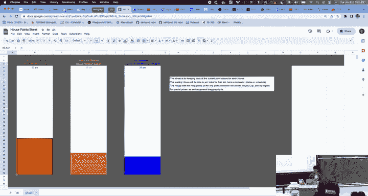
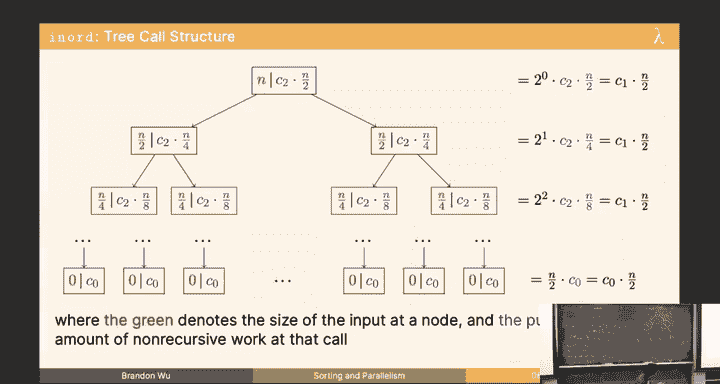
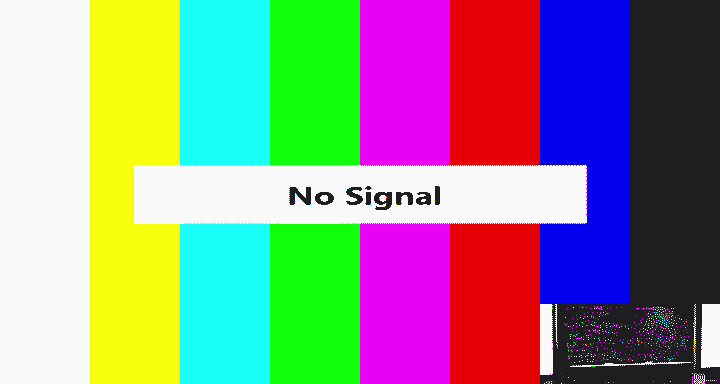
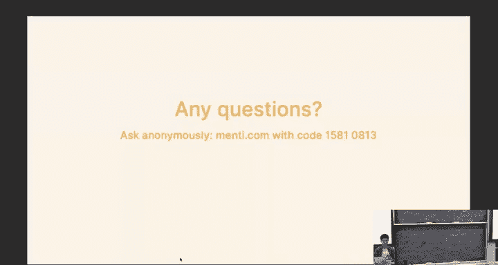
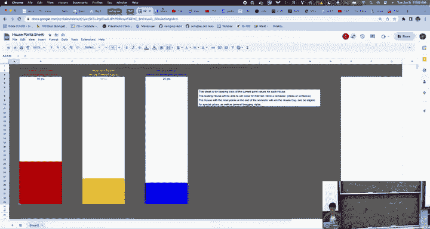
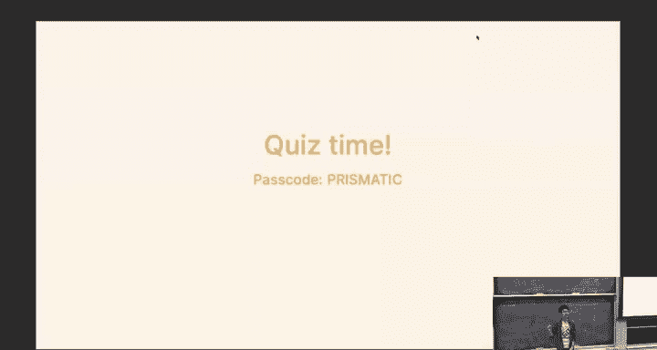
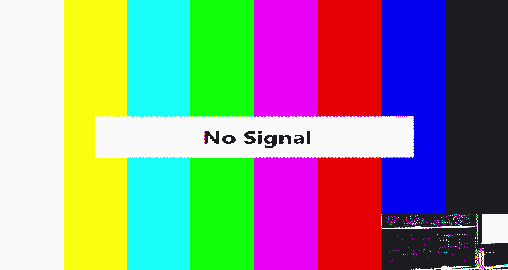
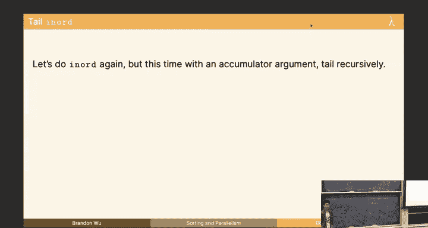
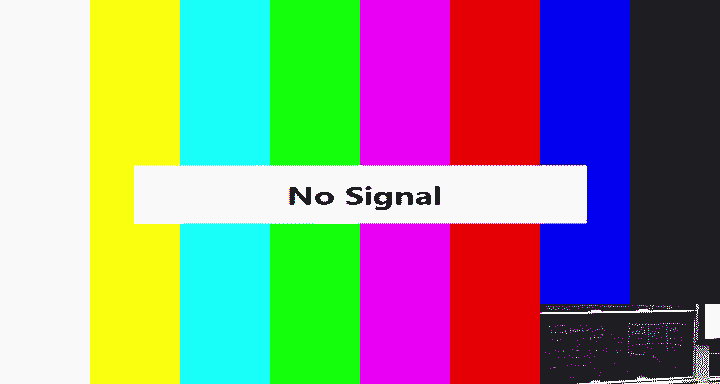
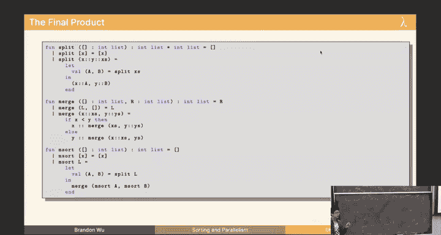

# CMU《函数式编程｜15-150 Functional Programming, Fall 2023》中英字幕（deepseek - P7：-07-7. Sorting and Parallelism _ - GPT中英字幕课程资源 - BV12VChY2EF4

Otherwise， we're going to get started。Let me put those out so I know what time's actually you' running ahead by me a little bit。

O。Alright， welcome the lecture。 again， we have a little bit of unfortunate situation going on the camera。

 So move over here if you'd like。 remember that we have an exam next Monday。

 We don't normally meet for class on Mondays， but we will have an examination。 Okay。

 so be prepared for that。 today is the last lecture that will be present on that midter。

 So today's content is their game。 next lecture's content is not。😊。

What gotten impression so pay attention today and then next week or next lecture。

 don't pay attention Okay， one thing also I noticed is that in the quizzes I get out。 you know。

 there's a password。 And if you looked at how I put it online。

 I put like bracket right bracket obfuscate， which means like and some people have been submitting quizzes with the passwordcode as obfusd。

 I don't know whether or not this is the person that's actually in the lecture。

 if you're in the lecture， put the word on the board。 That's the actual password。

 And if you're not in lecture， don't bother because it's it's not the right password and we'll know that you're not in lecture。

 I guess like know it's completion points anyways， it doesn't really matter。

 So I guess it does kind of matter。 So just a little funny note there。😊，So yeah。

 so I talked about the exam House points， Blue team is still looking strong。

 I got to say I've decided I'm probably just going to reset your points after the first boA date just to keep things fair so that one house isn't in the lead the whole time so sucks if you're on blue team I guess but I' you know still anyone's game I believe someone can pull it back。

😊。

嗯 okay。So halal functional programmers today we're talking about soaring imp parallelism Last lecture we talked about work in span leading to this idea of mathematically proving the runtime of certain functions in SML。

 and today we'll be talking more bit about parallelism or span。

 What do we do when we have infinitely many processors。😊，Okay。

 so theres four things we're going to talk about today。

 which are a new method of analyzing trees instead of doing the number of nodes。

 we're going to talk about the depth of the tree。 We're going to use a method called the tree method that you should have learned in your Friday lab。

 We'll go more into detail on that。 We're going to write inor but better。

 and then we're going to get into sorting。 I have a lot of content to go through this lecture actually。

 so we should probably get rolling， but yes。😊，Okay so we talked about asmpt analysis。

 talked about big Onotation， this should have been reviewed for most of you。

 but hopefully we have a better foundation for thinking about it。

 and we learned that for functional programs that are recursive。

 we can write recurrences to measure the runtime because predictably for a given input size。

 we can always get the same abstract cost out， not the same exact cost because we're agnostic to things like hardware。

 but we can get the same approximate cost in abstract units like C sub1。

 C sub2 unknown constants that are not known to us a priori and then we can use the unrolling method to solve those because we expand ones。

 expanded twice， get a closed form and then solve and you can refer to the last lecture if you don't remember that exactly。

😊，And then we also learn that if we have infinitely many processors。

 we can do recurrences that take the max over the longest path。

 And what I mean by that is when when you have tuples。

 the computations in the tuple can be done in parallel。

 meaning that we can take the max over how long it takes rather than summing them。 Okay。

 is everyone so comfortable with that idea。😊，you'll make use of that today， cool all right。

Let's talk about analyzing a tree via depth in particular。

 It's gonna to be that function right there。 But let me see if I have something to say。

 Oh I can't look over there now。 So we talked about how the number of nodes in a tree is going to be our measure of the input size。

 And remember， we always have an input size。 So O N is going to be our number of nodes。

 And then we got the O N bound in imbalanced and the log n in the balance case in the last lecture。

 But we can also measure it via the depth。 So there's an idea of both the nodes and the depth。

 So nodes。😊，Or depth are both perfectly valid ways to solve recurrences。 Alright。

 and we're going solve one right now。 So here's treesome。 Let's do the span recurrence。

 But now for the unbal sorry， for the unbalanced case， but in terms of the depth， so。😊，Were D。

Is the depth。Of the tree。 And if you forget what the function says， it's up up there。 tree。 Okay。

 so let's do tree sum S subree sum。😊，And what's my first move， What's， what's this。

So remember that this is now D， but does my answer change？

I still have a constant amount of work or span， so I'm going to do this， I'm going to say C sub0。

And now I'm going to move into S subresome。Of D， okay。

 now I'm going to tell you that S sub tracing of D。Well， what am I going to do。

 I'm going to take the max over these three things， right？😡，Okay。

 so I'm going to make a three place tuple or three place max function to indicate that to you。

 So I take the max over S subree sum of whatever the depth of the left subre is。Sorry， comma。

 like some constant value， and then the span of the right depth。

And then plus some constant amount of work， and you should be comfortable with this idea because this is corresponding。

To the college of3 sum L， this is the X， we have some constant amount of work allocated to it。

 and this is tree sum of R。 does this make sense to everyone that we why we have three things in our max it doesn't really matter。

 I drift a little bit I see。😡，And then afterwards， we sum up the results so we have some constant amount of work。

 but what is the depth of the left and right subte？In the unbalanced case。

So if I have a tree which looks like this。What is the depth of my left sub。

 let's say if Pizzel left is fine。D -1， yes， so what I'm going to say is I'm going to replace the D -1。

 and then my right subt is necessarily like  zero， okay。And if we take the max over this。

 you should believe me that this is the maximum so we're going to get。S sub3 sum。

Of g minus1 plus c sub 2 okay？And then how do we solve this。 Well， doesn't this look pretty familiar。

 right， haven't we seen in a recurrence like this， except we just swap out the D for the N， right。

 So in this case， this is similar to when we got a recurrence in N。

 which was S of or W of n-1 plus a constant amount。 We're going get。

 we're going do this D many times。 And we're gonna get a constant out each time。

 So do you believe me if I skip ahead。And then say this is O ofD。I everyone familiar with that。

 I'm going to skip some of the calculations we have already done in favor of getting to more calculations we haven't done so I can show you in lecture right now。

 Okay， but this is O of D， alright。😊，So that's the unbalanced case， I removed the implementation。

 but it's fine， you should know it and it's on the board， let's do S sub tree sum。

 So where D is the depth of the tree。And then now let's write balance。

And this computer will do that occasionally。I can keep it warm， I can just go like，Okay， S sub3 sum。

And I'm going to write the base case， even though strictly speaking。

 you all should be familiar with that。And now'll see the D。in the balanced case of a tree。

I've got something which looks like this。Right。Well。

 I'm going to have pretty much something of the same form as this actually right because the configuration of the tree just decides the D of L and the D of our quantities。

 it doesn't change the form of the recurrence otherwise。

 So can someone tell me actually what's what's the depth of the left and right subtes。Over two。

 does my depth of my tree go down by two when I look at the left substrate？-1。

 my depth of my left subre is one less than the depth of the whole tree。

 I'm going to write this whole thing out just to be super clear about it。S sub3 some D minus-1。

And some of your spy senses may be going off and it feels weird。

 but trust me this is the right way to go about it， and we'll explain why so then if I take the max。

 these two quantities are the same， so I'm going to just produce one of them。😡，S sub3 sum。D -1。

Plus C sub1。see some two explanation changes here。Just so I have all my ducks in a row。Okay。

 and then do you believe me again， this is exactly the same thing， so now we get O of D again okay？

But what's going on here， right？Because we know that Tsome is a function that should get a parallel speed up。

 right， because it has two recursive calls。 I can clearly both do both of them at the same time。

 Like， why did I get the same bound of O of D for my work and my sorry。

 for my unbalanced and balanced cases。 That's kind of strange。

 So let me tell you that the reason for this is because depth is relative。 Okay。

 we're gonna find that this is actually the right way to do it。 And we can go through this。

 And this is basically the same stuff。😊，嗯。But this is the same occurrence， span is both O of D。

It's counterintuitive。 but remember the task dependency graphs。

 right If I look at this tree and I think of it as a task dependency。

 I can't really reach this without looking at this。

 and I can't really reach these without looking at this。

 I kind of have that data dependency in the literal structure of the tree。

 So it kind of make sense that if I'm doing this， if I'm doing the work of the span。

 I can kind of just go through each level。 It doesn't really matter。

 I should always have gotten O of D because I I just go through each level。

 I don't It doesn't matter because all these can be done in parallel。

 The difference comes in how you look at the relationship in the balanced and unbalanced cases for the depth of the tree。

😊，So let's look at this， right。 previously， we got O of n and O of log n。

 I'll tell you that for the work of Tsome Earth sorry。

 for the span of Tsome in terms of depth and nodes， right。

 So we ended up getting a better bound because we got long n。😊，Here's what's going to happen。

Here's the fact that you need to know in an unbalanced tree， which is this guy right here。

 The depth is just the number of nodes， isnn't it， This is just the number of nodes because I'm a left spine。

 The number of nodes I have in an unbalanced tree must be the same。 So that means that。

So because n is equal to G。I'm going to get that this is just O。And you may not recall exactly。

 but this was the bound we got for Tsome。In the nodes case， for my span， for the。

 for the unbalance case， this was O of M。 Okay， so this is the same bound。

 If you translate the fact that depth means something different in an unbalanced street。😊。

Or alternatively， in a full tree in a complete tree， this guy， my depth。

How does my depth G relate to the number of nodes I have in this tree， Does anyone have a guess？

How is it related？删了。我。Does I say how the nodes are related to the depth or how the depth is related to the nodes？

Two to the2 to the D， right， We have roughly。But， so let's see this way， actually。Level I。I nodes。

 right， This is level I equals 0， I equals 1。I equals 2。So on and so forth， right。

 So if I want to find the number of nodes in this tree， and this is also just a math fact。

 but I'm driving it in front of you。 If I want to find the number of nodes in this tree。

 I'm going to do 2 to the0 plus 2 to the1 plus2 to the2 plus duda dot until I get to the very end。

 which is D。😊，So that's plus2 to the G。So this looks like one plus2 plus 4 plus dot dot dot plus2 to the D。

And here's a handy math fact for you that is going to be on order of2 to the D。

me I'll just write that to you in a second here。But that's a math fact， which means that O of D。Here。

 well my death is so。Let's see。 Well， N is equal to two of the D。So then if I do this out。

 I'm going to have log n is equal to D。😊，So then if G is log n。Is this not true？

Does everyone see how this came about and I'm going to this is a supposed suffice to show。 Okay。

 I'm going to we assume this， we get that result now I'm going to show you why this is the case Okay。

 but it's because if I sum this it's order of D O2 to D assuming。😊，N is equal to2 to the D。

Log n is equal to D if I take log n besides， and then that equation means that D is log N。

 It's everyone cool with this。 Im's reiterating that because I feel like I want to make sure people are following。

Okay， cool。 Let's talk about why that is。As soon as the computer wants to wake up。Okay。

 so here's the idea。 There's a very nice geometric proof。

 I'm a big fan of that shows that this is just the order of the， the largest thing。 Okay。

 I'm a big fan of this proof。 So I think it's very pretty。 So I actually， I。

 I'm gonna and draw out for you。😊，Suppose I have a square。What's it call platonic shape。

 So this is n。 S that that half is n。 And then if I cut this in half。Well， this is a half of that。

 right， so it's so number two。And this is N number  two。 so if I cut that in half。

 isn't this n number 4？😊，And then if I cut that in half， isn't this N over 8。 And if I cut。

 you get the point， right， So the continuous， the continuous sum of n and n over 2 and n over 4。

 if I keep something halves of that thing。The area of these squares of these， you know。

 rectangles never eclipses。The size of the square， and what's the size of the square if this is n？

joan。And that's if I do the infinite sum。 Okay， I I converge to 2 end。 If I do the finite sum， which。

 you know， obviously。This is because I start at1， I don't keep going to 0。5 and 0。

25 and so on and so forth。 If this is the finite sum， this is strictly less than that infinite sum。

 So this is definitely upper bounded。By。😡，The largest one， I realize this is two to the D。

 and that's2 n， but realize I just mean like the sum of successively doubling things is on the order of the largest thing。

 It's going to be in fact， equal upper bounded by two of the upper thing。

 but we care about upper bounds。 We care about big O。Does follow why that's true。

You should be able to， if you， if you ever confused， like draw this。

 draw this square in your head and just remember that that left thing is N。

 and then you should be able to redirective this fact whenever you need to。 Okay。

 think like a physics major， reerri。 right， so that's true。 Okay， so we get login。

 So by doing it via depth， we get just the same calculation as we would have gotten with nodes。

 It's just that depth means something different here。 So it looks different。

 But if you think about it， it's not。 so it's just a different way of doing the same thing。 Okay。

 and arguably one might be easier than the other。 But usually on an examination。 And when I say。

 usually， I mean， on your examination next Monday， we will specify which one we'd like you to do。

 We will say。😊，I will say if you want to do this， like do the span in the unbalund case in the number of nodes and。

 so on and so forth。 Okay， So everyone' cool with this。Two span calculations。Okay。

That's just a different way of doing it。 All right。

 And this is just all the justification I just showed you。

 I have a nice little text of square right there for you。😊，嗯 ok。

So this is going to be our complexity table for Tsome， yes。😡，I'm going to race this。Yes。

 that is what I mean。 It doesn't。 In the asymptotic case。

 It actually doesn't matter if it's perfectly balanced。 Like。

 it could be like approximately balanced， which is to say that like the number of nodes in the left and right subtes are on the same asymptotic order。

 or they could be plus or -1， or it could be a constant factor。 it doesn't actually matter。

 But like for simplicity， let's assume a balance tree is a complete tree。 a full tree。😊，A happy tree。

 if you will。I'm not Barbars。 Okay， so this is the， these are the complexity bounds we get。

 All right， I clear on this。 This is nodes versus depth in the balance and unbound get， yeah。

I mean in the entire tree， when I say n I generally mean the number of nodes in the entire tree。

 but that's an important distinctionia。Sorry， let me say plus one two to the d plus one yeah so another fun fact of about binary trees is that the number of leaves at the very bottom is going to be like almost exact like the upper bound。

 It'll be like half of all of the nodes in the tree。😊。

Binner degrees get big exponence until the D plus  one would have been a better thing to say， yeah。

I that' true for that？Okay， let's move on if everyone is on board with this because we're going talk about inward。

 Alright， cool， we're going to talk about the tree method。

 Everyone here is familiar with the tree method。 You saw it in Friday's lab， right。😊。

I see stone faces， but I'm pretty sure you did。 okay is that you didn't see it。

 you didn't go to lab or you didn't or you didn't understand it。

 It's hard to give a trinry answer via just like raising your hand。

 So let's assume that you said you just signed and understand it。 Cool， Okay。

 we talked about traversals on a tree last week。 is that question， No。😊。

We talked about traversals on a tree some lectures ago， we talked about inor specifically。

 let's talk about inor again and who would I have it， the implementation is right up there for you。

 okay this is the definition of an inward traversal， its left root right okay。😊。

We're going to try and analyze the work in span and we're going to do better。

 We're going to try and get through the work in span in the balanced and un cases or cases for us okay。

😡，So let's， let's get started on that。 Let's try it out。 Let's do the balance。Workcase。Okay。

We're just going to try and do this because we can。 All right。

 we're going to try and see what we get， and we're going to find that it's not that great because。😊。

I guess my motivation to you is if you ever see an append where you're feeding into the attend results of your recursive call。

 you should think something this is going on。 You should。

 in the words of another professor in this department， you should check your wallet， right。

 Something， something's going on， right， someone trying to try to have their way。

 And you shouldn't let that happen。 So I'm gonna tell you right now。

 this is not gonna end up well for us。 So let's do。😊，WS of inor。

And let me actually eat breakfast again， actually， for everything it's gonna be。Where n is the。喂。

Of the input list number of nodes。Oh。Input tree， okay， always write that before you start。

 and then we're going to get insert it。This will hold in every case。

I'm going to write out the base cases， even though by all rights， I should stop doing that。All right。

So we're going to strictly do this via nodes， I showed you how to do depth。

 but we're going to throw that to the side for a second and then not care about it， right？

If I've got w sub inord， what do I have here， I've got three things that can be done in parallel right I can do the in or L。

 I can do the inor R and I can just have the X I guess I can't do the append yet right because the append depends upon the results of the inor and the cons and so on and so forth right so the append will be strictly sequential it's the last thing I do it's when I collect all of my results I should turn that off。

 but that's okay okay。😡，So based on that， can someone give me an idea for what this recurrence should look like？

What am I going to write here， how many calls do I have， what's my work？要。はい。so。Y。

 we're skiping in a bit。 but that's pretty much the idea。

 Let's see which parts of I do want to simplify immediately。 So let's， let's write this out okay。😊。

I'm going to stage this a little bit more。So absolutely right。

 we have two callss in order on the number of nodes on the right and the left。

 I'm going to write this once and I'm going to assume you get the hint from here on out When I have the W。

 actually I'll write this out too。I'm going to do this。

So I'll be of a pen where the number of nodes here is going to be roughly equal to L。

 and sub L again。Plus C sub 2， C sub 1。Okay， number of nodes in the left。

 number of nodes on the right， right because aend， remember is linear in the length of the left list。

 right， so I don't care about the right list at all， so I only care about Nbel。

 And as even identified， we only have in the balance case N over two。 So let's replace， show me。

So this is otherwise known as 2 W sub inor。W sorry， N over two。Plus。

 and let's replace this with like some abstract units。

 I feel like I'm going to talk a little bit about that in a second。系。

I claim that this is the normal form， like the canonical form from what we're going to use to simplify。

 okay， because I got n over two abstract units from this O of n。😡，Append call。

 And then I just simplify these because there's two of them， right。

 And then that's a constant amount of work because there's always a constant amount of work。

Is this contentious for anyone。And by contentious， we mean not good。Cool， awesome。

Let's solve this but。if we try to solve it， something's going to happen here。

 where so this is the same thing as we just got， right？

But we're gonna do this and we're gonna arrange it。 I put over of n here instead of abstract units。

 but basically if we unpack this cellbu of inord， we're gonna to get two times this guy。

 which is itself two times so it'll be if we expand that now it's two times that it looks a little bad。

 I don't like this because now we're not getting one term per unrolling。

 we're getting like two to the I terms per unrolling So let's do it via the tree method So I'm gonna the tree method for me。

 what do do what do I do in the tree method。😊，Testing your knowledge。Yes。I like that， yeah。Nodes。

 yes， nodes per level。 right， The idea is that we can partition our。Recurrence。

 we can partition our calls via the levels of the tree。

 I'm not gonna draw this now because I have a very nice pictures for you。

 But the tree method basically looks like this。😊，We have a tree representing the computation of inor of t okay the top node indicates the call to ws of inord or the call to inord on a tree of size n。

 and that call itself branches out to two calls on inord again on trees of size n over two So that's what this graph looks like and let's iterate that process let's keep doing it So n over two calls n over4 twice and then we keep keep on keeping on until eventually we reach zero like some number of times I'm not going to draw out all of them because I can't also it's not fixed so this is like what we call our computation tree of the tree method。

 Okay and then based on this， we're going to partition by each level to try and see whether they not if we find a pattern over the sum of all the levels。

 it is easier to solve ideally the amount of work on each level should be constant that'll be the ideal right because then we can just multiply by the number of nodes or sorry the number of levels and then we just get our bound。

 Does that make sense。 but sometimes it's not always the case。So let's do it out。

There are three parts for her， right as I name。😊，as Arnoff identified， we have three parts。

 we got this， I startled you a bit， I'm sorry you were chewing or high chew。😊。

The input size which is in green you might not be able to see。

 and then we have the non- recursive work which is in a big kind of fux purple。

 and then we have the recursive work which is red， red meaning don't worry about it because the red is induced by your children if we can count the non-recursive work at each node and the recursive work is denoted by just the subre here。

😊，That if we just sum all of the non recursive work， we should get the work in total， right。

 So we're just going to worry about the nonrecursive work here。

 So our non recursive work here is going to be。This quantity， right。

 which is this n number 2 c sub 2 plus c sub 1， which is linear in n。

So we have that non recursive work。 We have the recursive work， which I told you don't worry about。

 and then I have an input size， which in this case is fixed at n。

 but will change throughout each level of the tree， okay。😊，So yes。

 and so my claim to you again is if we sum all of the non recursive work in each node。

 we will get the work by the entire function because that make sense to everyone。😊。

Is that a true statement to everyone's brain？Cool， awesome， let's do it。

So we're going to have to figure out the recursive work done by each node。

 which is not super easy to do， but we'll try。 So I showed you again that this tree looks like this。

And this calls N number  four。Twice。But remember that the amount of work we do。

At each node is itself dependent on the level， right， So okay。

 we're gonna there are three quantities we're interested in。 we're interested in levels。

Nodes at level I。And we're interested in work。Her node。At level I。So like work per node。

 like this guy， I level I， level1，0 and 2。Nodes per level。 So the number of things per level。

 And then the levels， which is the height of the tree。 Okay， And remember。

 this is all supposed to be in terms of n， the number of nodes in our tree in particular。 Okay。

 so how many levels do I have if I have a tree of n nodes， how many levels Sha it out。😊，Log n。

 I like it。 Love2 submit。 Yeah， log n。 asymptotically。 doesn't matter。 No， it's that level I。 Well。

 hint level  zeros got one， level  ones got 2。 What does that sound like。

 It sounds like we're doubling each time，2 to the I， right。😊，And then the work per node at level I。

 that's a little more uncle， Right， So， well， let's see。 So if I'm at level I， I've got a size of。

So here it's going to be。N over  two to the I， right， That's my size at at a given level。 So size。

 let me， let me actually say。We give you different quantity size at level I。Is n over  two to the I。

 Does that make sense because that0 level， Yes， that's true because I have n over  two here。

At the zeroth level at the next level it's going this n over two is going to substitute and we'll get n over4 c sub2 and then n over8 c sub2。

 So the amount of work the size of my input is going to be just keeping dividing by2。

 Well the amount of work I do is actually sorry。I met the MM Procursive work， yeah。

I that all because if I have。Level 0。 Oh， no wait。 I was right the person。-1， away。欧 sir。So okay。

 let me actually go to the tree， I happily drew for myself。Here it is。

 I wanted to avoid drawing this out on or I wanted to avoid showing you because I wanted to draw it out on the board。

 but I'm， let's just do it so。😊，Does everyone follow this encoding that I'm showing you here。

 If I have the green， that's the size at the given node。 So I have n over n and then n over 2。

 N over 4 up until 0。 If I have the purple， that's the nonrecursive work done at each node， right。

 So at the first level， it C sub two times n over 2。 Then at each level below that。

 it divides by two yet again， because I'm dividing the input by 2。 And this is linear in that。

 This is linear in the constantly having input constantly having size。😊。

So here at C sub 2 by an n over 2 factor， C sub 2 by an N over 4 factor。

 and at the base case remember that we have w sub0 is going to be CO。

 so these are all tangly CO terms。😊，They'm going to follow this。Okay， I'm not going to ask thumbs up。

 thumbs down in order to the side。系。Okay， I saw okay。

So if we sum up everything that's done by each level， the purple quantities at each level。

 we should then be able to sum that way and then get the whole thing So if I had just the sum here。

 that's going to be two to the0 because the number of nodes multiplied by the non-recursive work done at each node will be the workout at level I。

 So two to the zero nodes multiplied by the nonrecursive work at that node。

 which is c sub two times n number2， is these are supposed to be two is， don't worry about it。

 C sub2 times n number2。 And then I have two nodes at level 1， which means two to the one。

 because that's how many nodes I have via。This thing。

So that's number of nodes multiplied by C sub 2 by n over multiplied by n over 4 because I divided by 2 again because of this thing。

 right， which is actually going to be。😡，YeahAnd number to the I actually see sub2。Yes， okay。

 So if I just multiply these two quantities， actually just get out what that is， right。

 So I'm going to get n over 2。😊，Each time， every single time I get C sub2 times n over two because I'm I'm canceling these out。

 I'm going I'm gonna to get that right quantity。 I'm gonna to get the n over 2 multiplied by C sub 2。

 Does everyone clear on that。 Like these these things kind cancel out。 Oh my goodness。

Invest in airfare， okay。And then what's the number of nodes I have or the number of levels I have。

 well， that's just log in。 So if I multiply the constant amount at each level by that。

 so I get C sub2。Let's fly by n over two。Multiply by log n。Which is work at level I。And then。

Height depth。Well， then what should I get here， What does this look like asymptotically to you？

And loggan。A few things to note， which is one I kind of dropped。This， the C sub one。

 because the C of one is asymptotically dominated by this。

 So I kind of like stopped thinking about it because I didn't care。

 We're allowed to do things like that so long as we're assured that like asymptotically it's equivalent and we're not making too big assumptions because asymptotically。

 I could also like， well， asymptoically equivalent is fine。 So that this absorbs into that。 Secondly。

 what I did is I ignored all these guys at the bottom。 It's true there's a lot of them。

 There's actually roughly like n of them。 And over two of them。😊，But that's a constant amount。

 which means that this is just going to be a linear term。

 which means that it's greatly overshadowed by the sum of every other level above it because that's going to be en long N。

 so I absorbed both the constants here and I absorbed the linear term induced by my leaves。😡。

Does everyone see why this is the case？I want to keep asking that。

 I feel like I'm going to give you really annoying about it。

 but I want to make sure people are following。 Any questions， yeah。我我知的。C。给我。Yeah， so the C1。

 I think I just missedplace because I bind and replaced， but only does the first one per line。

 so it didn't get the C of one， so this C of one probably shouldn't be there。

 Yeah shouldn't be there。You ask about the difference between C sub2 and C sub0。

It's the original C of 0 and C of 2 here。This C sub0 is the amount of constant work done at each leaf every time that I have an empty tree。

 and C sub 2 is a term that we get linear in my input size at each node。😡。

So those are the two main things。Determining。My complexity。II'm actually going to keep doing this。

Alright。O。😊，Does everyone have this image etched into their brain because you should see this when you。

 you should see this when you sleep， you should see this when you shower， when you close your eyes。

 you should be tattooed on back of your eyelids。 Okay， if you're ever confused about complexity。

 readdirectrive by drawing a tree。 I will not。 the tearss will enjoy it。 In fact。

 if if they grade your papers and they see a bunch of trees drawn everywhere。

 Like this guy is a tree fiend。 No it's you're doing the tree method。 Allright。

 so tree method picture， it'll help you Okay and beyond that， also this。😊，Is the important thing。

 Okay， levels， nodes LI。Work per noal level I as a function of the size at level I。 Okay。

 usually usually this will be a function of the size at level I。Okay， it doesn't always need to be。

 We will see examples for。 It's not true。 Everyone call to move on。Any other questions？要。W is。Yeah。

 so if you look at the sum of all these guys， which is two to the one times c sub2 times n number4 or2 to the two times c sub 2 times n over8。

 it always sums to this right thing here， which is c sub2， which is a type of times n number two。

 So I'm just taking the work at level I irrespective of nodes yeah。😊，没有 yeah。Sorry。

 why is the work at the non recursive？你皮得。Oh， this， this is。 Yeah。

 this is because we previously proved the complexity of a pen， and we know it's linear in yes， okay。

 cool。It's linear in the size of the left list， right， You， you could， you could replace it by n。

 I'm being a little strict here。 If you replace this with n or even O n。Honestly。

 I think thatll be fine， but I'm I'm being rigorous for the sake of it so that you see where the constants are coming from。

 yeah。Yes， when I have Ellepen R， we did this actually previously。

 but the complexity of Elopenr is only dependent on the size of L。😊，This is a balance tree。

 so I get to do that。Okay， sorry， yes， we're doing。 al right， Who wants to。

 who wants to volunteer to touch this for the rest of the lecture。 That's a joke。 Don't do that。

 Alright， Okay， let's move on that's。😊，One case。 so let's pencil it in。

 let's put it in our little bag of tricks。work of the balance case is going to be O of M log n。

 iss everyone cool with that And remember how we did it like exactly five minutes ago， cool。

Let's move on。We're going to try and get through some others， okay。Okay。

 so now that we've done the balance case for inward。

 let's try to think about the span for the balance case。 Okay。

 we're going to do it analogously right， So if I've got the span of inward。😡，On a balance tree。

 So we're gonna to say balanced span。I'm going to stop writing up the base cases。 Okay。

 you can assume that's 0 equals C sub 0， right。Let's do S sub in order。And also this。

 this applies to everything。 Okay， It's always going to be the number of nodes。

 So Im I'm omiing writing that for brevity。Well， what's my implementation say。

 My implementation says that I need to do。 Well， actually， I don't have my implementation anymore。好。

没有。Oh。All right， if you remember my implementation looks like this。😊。

It's easier for me to just write it。嗰。If I have these many things。

 I can paralyze all of these guys right so I'm going to do that。

 So instead of having what we had here where we had two of ws sub inward。

 well I can actually just take the exact same recurrence。

 but instead of adding these three quantities， I'm going to take the max and I'm not going to explicitly do it out。

 but if you go through the math， you're going to find that it's。😡，One call to N number two。

Such that I get。Plus， this append that happens afterwards because that's not part of the max。😡。

So I get S sub aend of n over 2。Plus E sub one。And then this itself is just going to be。

S sub inward of n number2。Plus， N number 2， c sub 2 plus c sub1。s clear on this。

 we get exactly the same thing， but now we compare less with of our goals。

And now we can use the unrolling method， we don't need them a shrinking sink and tree method。

 Actually， the tree method is generalized。 you can do it if you have only one rec call。😊。

But if we do the unrolling， we're going to get S sub inward。Of N over 4。Plus n over2 sorry n over 4。

 C sub 2 plus c sub1 plus n over 2， C sub2 plus c sub1， right because I got this out。

Because previously I got this out。And this just looks like the sum of what if I iterate this process。

😡，How many times can I do it， How many times can I divide by two？Log。

 so I'm going to the sum from equal equals one to log n。And then at each time。

 I'm going to get something dependent on my size。 What is it？It's going to be a fraction in end。

Enover。Two to the I，2 to the I， probably plus one honestly， doesn't really matter。

Let's just say plus one， C sub 2。 actually you know，'s just let's just simplify the two sub to the I。

's not， we don't need to be super rigorous about it。 We're trying to get the math right here， okay。嗯。

So if we get this sum， which looks like the sum of halves， again， like one and then two。

 and then four， what did I say that that was？😡，3倍。Two times whatever this is， right。

 the biggest term， which is linear。So we say that this is， So we say。那。And we get over。

Want that to show up， okay？So we get linear。 Does that make sense to everyone because we took the span of inor and we couldn parallellyze it so we have some calls going on in parallel seems pretty good to me。

我不 please。No， Jesus。So， ok。Yeah。Yeah， so I skipped over a little bit。

 but I'm basically because if you' let's look at the implementation Bruce。This is our recurs call。

 right？I didn' I omitted the rest of the function， but this expression is what we evaluate to。

 So we take in order L， aend to this thing where we also compute in order R。 If these are all tuples。

 because this is a tuple and this is a tuple because in functions take in their inputs as tus。 Okay。

 if you have an inix function， you can always parallelize the left and the right。

 Then these two can be done in parallel in order L and in order R。😊。

So if I take the max over then I only get one call to S sub in order of N over2。

right and cool on this， we have O of N。 that was not as bad as the previous one， right。Allright。

 that's only because we've even assuming that the world is fair。

 So we're going to assume that the world gives us fair balanced to data。 And it turns out。

 by the way， that's not true okay。So let's do。Unbalanced for the work。See what needed there。

Does anyone have a hypothesis for what we should do， what is the worst case for our input？If we have。

The work of an unbounduncd tree or inward。And let's actually move ahead of it， because。哦，就是。

I wanna see if I， if I give you the implementation again。 Here we go。 Okay。

 span of an of a balance tree， where we did that。 We're not gonna do a span of a balance tree。

 We're just looking at the implementation， okay。Okay。Yeah， it is。

 But we're gonna I'm keeping up because I'm want the implementation， cool。😊，So unbalanced workcase。

 W sub inward。Of N hit me。 What am I gonna to do， So what is the worst case for me， Now。

 El and R could be any quantities so long as both sum to N。What is the worst case for you。

 Just thinking about it。 Don't think about the math， Yeah， yeah。To the left， why the left。

You onlyend the left and left is。Linear is the left tree， right。

 So a huge line to the left is going to be our worst case。So。

 the real secret I'm going to reveal to you at the end of the semester is I've been slowly like casually missing these on purpose。

 it's how I make you reach for it so I can make sure you're awake。That's not true。

So we're going to have a giant spine to the left so n sub L is going to be n minus1 right and then n sub r is going to be zero。

 so we're going to do I'm not going to write it out， I will write it out。😊。

And -1 plus w sub in order of0 plus。I'm going to write out just this， okay。Actually， no sorry。 no。

 this is important。Does this make sense for everyone， because my ws of theend is appending that guy。

 which is of length n -1。 if there are n -1 nodes on the left。 So what do I get。

Let's just like absorb this into our content。 I don't care about it because this is like c sub 0。

 so this is going to be part of T sub1 from now。So we're going to do W subbinor。

N minus1 plus n minus n minus1 c sub 2 plus c sub 1 Okay， because this goes to that。

 and then I absorbed。This quantity into that， okay。HOkay， on board， everyone on board with this。

 Well， what does this look like， We have one recursive call。 So let's unroll。😊，We're going to say。

 I'm going to move to the left here a bit。N minus 2 plus n minus 2。

 c sub 2 plus c sub 1 plus n minus1， c sub 2 plus c sub 1。LetJust leave it。

I'm getting an n minus I term each time， so if I write out the submission。Well。

 I'm going to be doing this n minus thing n times。I equals 1 n， and I'm going to have n minus I。

C sub 2？Plus C sub1。Plus E sub zero。Does everyone see how this goes to that。

 I'm summing over the amount of times I unroll， and I always get one of these out。

 and I always get one of these out。 Okay， turns out this is not going to matter us for us asymptotically。

 but let's care about this。 What does that look like， What it looks like。😊。

1 plus2 plus dot dot dot plus n minus-1。C sub 2。Yes， and then the rest doesn't really matter。

What is this again， oh wait sorry。Oh yeah， that's true。 Yeah， let me clarify plus 3。

 that's important。 Okay， it's not doubling。 It's incrementing by one。

 What is the sum of the first M -1 numbers， yeah。N squared， yes， okay。That's what I wanted to hear。

Yeah， I decided to include it。 I I include and don't include things based on my mood。 Honestly。

 like if you omitted。I think it'll be fine。should I think it's annoying personally I think it' fine I think it's fine not to include because the base case is pretty much never going to matter asymptically。

😊，那么。At least in this class， I think。Yeah， so it's annoying。

 so I included it for the sake of completeness， but I think it's fine if you omit it as well。

 So we're going to get O n squared。😊，系。😊，Yes。Yes， I can， thank you for asking。个啦还克啦。hoops。Thanks。

 yeah。So that's an interesting question because the nodes are like the recursive nodes。

 but you could have nonrecursive work that could itself be parallellyzed Like suppose so I skipped over this maybe a little bit。

 but also maybe I didn't which is S of aend and I skipped over oh yeah the span of a pen is the same as the work if you were confused as of where this came from but the span of a pen like imagine this wasn't aend。

 but it was a function that had like an actually good span。

 we would actually get a different bound even if we couldn't parallellyze these calls to inor。

 does that make sense like we might rely on a helper function that has a good span， a different span。

 even though we can't parallellyze the recursive cause， So when I say like two nodes in the tree。

 realized that this tree I'm inducing is just my recursion tree。

 but the non-recursive work can be paralyzed to。That's the idea， right。

 Does that makes sense for everyone。 The non recurive work can be paralyzed Who is the idea， okay。

Yeah， good question。Okay。Allan surface is dense。Alright。Okay。And never even watches that show， okay。

 n squared， okay？😊，So let's write it down in our handy， handy fact machine。

And what we're going to find actually is， well， let's think through the span case for unbalanced。

 right？If I have the span case for unbalanced。I'm going to similarly get that this is span and span。

 but now they can be parallellyzed， except that this is still really big。 This is still the max。

 so I still get out this term。So let me concretize what I mean。If I wanted to write this， right。

 I would get， I would get this， but it wouldn't be。It wouldn't be I' N over two anymore。

The max of this is going to be n minus1。Right， do you agree with me， this is the。

Unbalanced span case that my left tree is still really big。 that's still the worst case for me。

 and I can paralyze， but it doesn't really matter because I'm paralyzing doing S sub in order on0。

 which is really， really like not important at the end of the day。

And then isn't this recurrence the same as that one？If you look at it closely。

 which is w sub in order n 1， S sub in order n 1， n minus1 cs of 2， actually sorry。

 this is at minus1 as well。😊，These look the same， right？

So I'm actually going to tell you that outright like the span is going to be the same in the unbalanced case。

 So I'm not going bother to do the work。 I will leave that as an exercise to the lecturer watcher。

Yes。All right。Is everyone cool with this？All right yeah， yeah yeah。It is not。

 It is not end to the end。 You would find it difficult to would some people would not find it difficult to write a sort that's N to the N。

 Okay， I hope， I hope all of you would。 I have faith。right， but yeah， we don't quite want that。

 Good claw。 good catch。 Alright， This is our table。 This is the complexity of in order。

 We work through all the cases moderately。 Okay，😊，And I believe that's break， actually。And by break。

 I mean ask questions， I will take questions now， be a menee or allowed all right before we move on to the next part。

Yeah。That wasn't the question， but I'll take it anyways。 Allright。

 maybe I' would like to read a book series that finishes before， before， like ever。

 because GR RM is going to die。 But yes， yeah。😊，when did this become like an AMA， Like I was asking。

 I was asking for content questions， like this is my lecture。 Come on。No， I don't know what that is。

 actually。Okay， any other questions allowed that people have。We I'll a quiz right after this。

 by the way， so don't leave。Okay， someone left。 but that's okay。 Okay。

 I'm gonna check really fast if we have any empty questions and then。

Wire functions pointers， they aren't， let's see。Can I get a you？ It's an anonymous question。

 What do you want me to do， give one to each person in the room。

 put your hand up if you want to hide you。 Like， yeah， this isn't clear at all。 It's all of you。😊。

All right，quiz Simon。Sounds like most people are pretty much done。 Alright， Let's get rolling。

 We got some stuff to cover sale。 I promise you， we'd get to implementing merge sort。

 I said 15 lines Gene C space。 I lie 20， but it's fine。 but I really want to get to it。 But first。

 I wanted to say something about inor。 So I raised here already。

 But we got like a bunch of random stuff like n square N log n and squared n squared O N。😊。

But I wanted to talk about how we could do that better because I told you about the fact that if you have an append call that's taking recursive calls。

 you should check your wallet because something fishy is going on so。

So if I have in order， I should be able to do it better than n log n and n squared in the or I should be able to do it better than n squared in the unbalanced case because I'm effectively just doing a red。

 right， I append to the front of an L that might be like really， really long， essentially a list so。

😊，I want to implement T inor， which is a tail recursive inor， all right。

 can someone help me out here， how would I do this？😡，我さ。

Someone says something。What's my base case， I have a right enough for you here。Oh yes。

 who said that awesome。😊，You're so unreasonably excited for this。No， it's fine。

 This is my entire incentive， entire incentive organizations。 So I'm perfectly fine with that。

 Allright， so if I， if I've gone accumulator， I pretty much just return it when I'm at the base case。

 I know it's harder to do it first， but it's also easier to think about if you fix yourself at returning the accumulator burst all。

😊，Okay， so let's try to do it this way。 Well， if I've got this remember left left root right。

 So I want to do the right， and then I want to put X on it and then I want to put all the left stuff on。

 So what is my structure here， Well， I'm probably gonna want to make a tail call to a T in order。

 right。I'm going to conspicuously leave myself a lot of room here， okay？For an undiscovered reason。

 So somehow I want to get the in order traversal of the right tree and then do stuff to it。 right。

 Doesn't that just look like T in order of R。Z follows。 like， allright。

 I want what's in intention L append X append R， basically X cons R， right， but I。

 I can only do it by making recursive calls to T inord。 Well。

 if I can get the traversal of the right， and I can get the traversal of the left。

 I might as well just use something that's like T ind L append。

 except I can't do that because that's tail recursive。

 I want to somehow augment my accumulator in a way that。😊，I can then do the stuff I need to to it。

 So note that like what T inor does is Tor just adds to its accumulator。 right。

 That's the idea behind like， what rev is done。 Well， every function we have had with an accumulator。

 it just does stuff to its accumulator。 So what if we make the accumulator to T in nor。

 something that。Already has the information we need。 What if we start from the right。

 so I'm going to write this and let's figure it out， okay。

I claim that this is going to be a right accumulator， okay， our first accumulator。

 because what we're going to do is we're going to get this will evaluate by our recursive leap of faith to the recursive sorry to the in order traversal of R。

😡，Then what do I want to do， I just want to cons exon to that。 So let's actually do。

X climbs onto that。 So do you agree with me， this will be the traversal of x to R recursively。

 if I trust myself， if I trust in， don't just trust yourself， Trust the code that trusts you okay。😡。

This will just be X to R。 And then shouldn't I just。

Take that and then do the inner traversal of L appended to that。I effectively want。

 because the specification of inord T in ord should be that it takes a tree， it gets the traversal。

 and it appends it to this， right？So isn't that what this is doing， I take the traversal of R。

 I append it to the accumulator。I put X on top of that。

 and I take the tra brsistal of L and I pen it onto that。In intention。

 if you look at the way I strung those words together。

 that looks like L append X cons R intentionally， that doesn't type check exactly。

 but that's the idea Okay so does this make sense to everyone that this should be our tail recursive inward function We do the right and then the left This will be a recurring theme actually。

哎。It would be。 we shouldn't do the right left and the right。

 because then we're going to reverse the tree。 Okay， I'll leave that as an exercise to you。

 But thumbs up thumbs down。 people feel good about that。😊，讲嘅。Okay， well。

 I kind of want to do an analysis of this， I kind of want to do a work analysis of that。

But here so here's something I notice if I do w use of T in order。

Where n is the number of nodes in the tree， Yada yada， I have two recursive calls right。

 So it'll look similar in that it'll be 2 W sub T in ignored。Of， well， in a balanced tree situation。

 it'll be at over 2。 So I'm gonna， I'm gonna to specify balance。We're going to do the first quadrant。

N number two， because El and R each have， yes。Yeah， that's fair。 Okay， so let me put it this way。

I think that it's improper to call it T in order in retrospect。 Yeah。

 I would I would accept like improved in order。 Let's call it I in orderd。 Alright。

 almost tail recursive。 Let's say8 at in order。 Alright， that's confusing。

 Let's call keep calling it T in order。 I think you're correct though It's not tail recursive。

 I didn't think about that。 But because we were going to do this。

 And then we'll have to remember to do this stuff later。 And this might be big。 So yeah。

 totally fair。 good call， actually。😊，You get high choose for。

Poing out mistakes so w sub t in order to n over 2 plus a constant factor because we just do this cons thing afterwards right and then we do a constant amount of work to combine the efforts。

😊，And then what you should find is that this is gonna be， Well， what does this look like。

 I'm going get two times2 W sub T in orderd。 We're just want to go straight to solving。

 I don't have a whole lot of time。 So I'm just gonna kind of go through this kind of fast。

So this is equal to4 ws sub t in order。And over4 plus two c sub1 plus c sub1。 Okay。

 if you see the pattern， we should just keep doubling each time。

 Doub and give it to the next person where the next person has this occurrence and then end of4 we'll just keep going。

 So we'll do this log times。 And we're going to get one plus 2 plus dot dot dot。Plus。

 what's my thing at the end。 Well， I'm gonna to get roughly n of them， right at the end。

 I'll have like n over two C sub1。 I'm kind of skipping over this。

 but you can verify the math for yourself later。C sub 1 plus C sub 0。

And via our nice square math fact， this is going to be on the order of n okay。

So we have philosophical opposition to this。Which is okay， it's a college campus。Okay， cool， yes。

Here。😊，哦。So just just the original two close call it to this。 Oh let me just by by but yeah yeah。

 okay， sorry。If I do this， that's one call。 And then I have to do this called an L。

 But because I never touch a， the amount of stuff I have in this is not dependent on the size of my cumulator。

 It's only dependent on the size of the tree。 And if have a balance tree L and R must have n over 2。

 So I kind of gloss over that。 But if you reason through it， you're going to get to this。

 that follows I see some confused looks。 This follows from the fact that I have to do this。

 And then I have to do this。 I can't avoid that。 this will have implications for the span。

 but I do have to do two calls。 So I cool on that。 And then if you okay with two calls。

 you should be okay with the fact that my size metric is the size of the tree。

 and R and L or just N over 2。 so that's how we get this recurret and that's how we get a a linear work。

😊，UmAnd then really fast， we're going to work through the literal rest of this matrix， okay。

 because here's what I'm going to tell you。What is our parallelization opportunity here？😡。

How do we paralyze this？Yes。Thatある。R。呃。At the same time as T and order on L。I hear， I hear。

 I hear gasps of of realization。 We cannot。 This is what we call a data dependency。 Okay。

 we have a dependency on T in order of L because this guy's gotta wait。

 This calls gotta weight on this to complete。 Both T in order calls cannot be done at the same time here。

 Okay， So I'm gonna tell you that right now in the balance case for Spm。

 We're gonna get exactly the same bound。 And you can work this out yourself。

 and I'm not gonna go through all it。 Okay， this will be the same。 Yeah。😊，😀Ha。😊，Well done， good job。

This is like it're not reading comprehension， Yes， yes。

 so we're going to get O of n here and actually I'm just going to cheat here and tell you that everything is going to be O N。

😊，All right。I don't have time to work through this right now， but it is in the notes。 Okay。

 we're gonna have to move on， though， because we have some of this stuff to talk about in the last 15 minutes。

 we have the other。 but it won't be， it won't be difficult。 Okay。

 the important thing I wanted to show you is that this has a data dependency。

 by seeing that you cannot paralyze。 That's how we can get from here to here really fast really easily。

 Okay so realize that。 Allright。😊。

And then we're like probably like really hard about。 Yeah。 So all this。

 all this work is basically showing us that。 And then we get this。 Okay。

 what I want to get to was the comparison of inor versus。😊，Quote T in order， okay。

 which is really just better in order。 B in order。 B ord。 Alright， O of N in all cases versus inor。

 which is O of N on a good day。 But tend to fall behind。

 So this is kind of the interesting di economyomy here where you have algorithms。😊。

And you have better algorithms and on the bad algorithms。

 sometimes you can have opportunities for parallelism。

 but you probably shouldn't have done that in the first place。

So this is kind of a silly example where it's like， yeah， we showed that the span was better for Nor。

 but we could have just not implemented it that way in the first place right because its n squared in the un case。

 it's n log n in even the work case if we don't have infinitely many processes So's like why do we do that Why do we even even talk about it。

 Let's talk about an example where we can do parallelization and also it's like a reasonable algorithm and going to move on from this okay。

😊，We're going to be talking about。Any questions。We're going to be moving on from this and we're going to talk about one of the most classic problems in computer science other than helping your parents with a printer。

 it's going to be sorting， sorting a list of integers because it's a really kind of classic thing we want to be able to do okay who can name some sorting techniques。

 like what are some sorting algorithms we know of。😡，So I'm going to say rogue sort。Wa。

 okay or I didn't okay， this is not this is not this is not 98，150 like esoteric sorting algorithms。

 Okay， let's let's stick to the established solution so we got like we've got some stuff like some of it bogus so I'm pretty sure。

 but we've got there are things like insertion sort， there's things like selection sort。

 there's something called merge sort， which I've alluded to but we're gonna have some good sorting algorithms and some bad okay。

😊，So let's try to look at one that's called insertion orpers。 Here's the I behind insertion sort。

 okay。We're going to take a list。That's already sorted。 And if you try to put an element。

 any element into a list that's already sorted， it's like1 comma 2， comma 3 comma 4。

 And I want to put like two again， okay， into this。Well， it's kind of easy， right。

 because I just like kind of go through until eventually， you know。

 the next element is greater than it。And then I just put it better， right。

 So we're going to implement insertion sort it real fast， okay。But that's the idea of the algorithm。

 if anyone confused， we're just going to try well， basically we're going to recursively sort and then insert the first element okay。

But to do that we're going to need to a helper， we're going to need that helper that inserts into the already sorted list so that's called ins okay it takes in an already sorted list and it takes in an element and then it just puts the X into wherever it should go in the already sorted list okay。

Let's do it here。Let's do ins of x int and then nil of type int list。 What is this？X， the list of x。

 right。Yeah， whatever。 And then ins of X， and then y cons Ys。Well， I have two cases here right。

 if x compares to y， right， it might be less than might be greater， all right， so let's do both。

If x is less than y， what should I do， That means I haven't reached the right point yet yeah。

X cons y cons y， so let's try it。But if I insert。One into actually， Yeah， I like that okay。

So we're gonna see this。 Yes， Xon y comes Y。 Yes， I wanted to check that for myself because something I had trouble thinking。

 Xon y comes y is because it's less。 And then if we inver like get into like 1，2，3，4， and we get 2。

 Well， this is greater than this is greater than this is less than。 So we're gonna get here。😊。

And then if I， well， if I'm greater or equal to， that means I haven't found my right place yet because if I' if two is greater than1。

 I haven't found the right place yet， so I want to keep going。So we're going to peel off the。

We're going to peel off the first element。And then do。Insert x into the rest， right？Okay。

 is everyone confused on whether or not。This should be linear and such or whether or not this is insertion。

We're not going to justify。 I'm not going to justify this as linear， but know that it is。

 And this is the insertion function we're going to use。 So if I have my insertion function。

I can implement insert， in。😡，Where the specification is written right here， yes。そそ。So I died person。

 no I didn't。Ohm sorry， what did I do？啊 sorry。喂。Yeah， saying that's the tackle。 Yeah， this is wrong。

 Yeah， this is wrong。 Sorry， it's supposed to be。 that's not X twice。 Can't do that。 Go， okay。😊。

But we， we keep insert the X， okay。Yeah， okay， cool。Yeah， that's definitely a typo， okay。

 but let's just say that we're inserting a list which is like this。

We're trying to sort this list via insertion sort。I'm going to tell you， this is just an empty list。

 and then this is。Okay。Recursively sort the rest and then insert the person element。 right。

 If I can already sort the rest and I insert the last one， I'm done。

So doesn't that just look like this？Insert and sort the rest， get an already sort list。

 and then insert the press element。If you think conceptually about it。

 you trust the recurs ofly of faith， you trust your preconditions， this is just how we do it， okay。

Cool， very， very touristerse。 All right， if you're confused。

 we can think about that later because we got to get to merge sort。 All right， this is the big one。

Okay， because I promise I'd be able to do this。嗯。So this is very simple。 this is still there。

 but that's fine。 that is O1， O N。 And then so we're going to get this。😊。

I'm not going to write all this out， but basically the point is that if I do insert。

 I'm going to get a call on n minus-1， which is the rest of the list x's。

 and then I'm going to do insert on a list of length n minus-1 because the result of insert is going to be the same length as the input list which is x's so I'll get this recurrence which solves out to n squared this shouldn't be surprising to you because this is such an like a simple sortaring algorithm all the simple sortaring algorithms are always quadratic so this is how it goes so we're gonna try and do better than quadratic because quadratic is functional speak for bad okay computer science speak for bad so let's try to avoid that if we can right。

😊，And you could and you can follow that through on the slides later if you want to see how it's n squared。

 And I'll also say there's no span we can do because this is。

 we can't really parallellyze anything here。 Like there's a data dependency I have to insert。

 and then I have to insert。So if I want to do this。

 I want to be able to find a sort where I have some parallel opportunity。

 That's going to be called merge sort， all right。Some else meant that， something smart。 All right。

 it doesn't matter。 So what we're going to do is the idea behind merge sort is we have a list。😊。

X1 through X1。What we do is we cleave the list in half。

 doesn't matter how doesn't need to be like this necessarily， but we cleave the list in half。

 and then we turn into two halves。And then we sort the two halves okay。

 so that now we have asorted list L1 and a sorted list L2。 and if you think about it。

 if I have like one comma 3， comma 5， and I've got two comma 4 comma 6 right where these are two sorted lists。

 it's very easy to take these and turn them into a single sorted list。How because I just like， oh。

 this one's less so I take it， so I have one。And now like that's gone。 And now I have， oh。

 this is less。 Let me take that。 That's two。 that's gone。 And that's we。

 we basically like like shuffle them together。 It's like shuffling cards almost。 Okay。

 the idea behind the algorithm is we're gonna split， sort。Merge， that's exactly the。

 the idea behind the algorithm。 And we'll see it in code right now。

 I think I'm going to talk through it and not write it on the board here。 Okay， actually， no。

 that's no， not idea。Okay。😊，So let's try it now。嗯So。But I will om， I don't know。

So let's talk about split。 And let me tell you the， I realize I'm going a little fast。

 but I kind of have to do this。 Okay， so this is going to be our specification。 Okay， split takes an。

 turns into two lists of approximately the same length， okay。😊，嗯。I'm going to give you。This for free。

Which is that if I do it on a single tint， or I do it on。Now， I'm going to get this。Sorry。

If I split the MP list， I get two MP list。 if I split the single ten， I'm gonna to put it wherever。

 I don't really care。 Okay， okay， and then。The really easy way to implement this is we're going to just do them bulk of the work in this case。

Exs。I'm going to peel off the first two things， and then I'm just going to split this。

 I'm going to split X's。Select。Bll a comm B。Equals split。

X is so remember this is how we pattern match on the result of a tuple where the result is a tuple。😊。

X cons a。Y cons B。And。If I can split this and I'm holding two elements。😡。

Can't I just put it one here and one here， and now I have roughly equivalent elements。

 You could do this proof by induction if you wanted， you could prove oh。

 the result of split is roughly the same number of elements and'll promise you that it'll be off by one at maximum yeah。

What would be this thing？嗯。Yes， so， so when I said this， where I leaveeave it down the middle。

 that's not exactly what we're doing。 We're actually gonna be shoppinging them。 But the key is。

 so I actually kind of preface this where I said， like you can kind of do something like that。

 I don't care。 I just want it to be halved。 I just want roughly half pairs because I'm gonna to sort it anyways。

😊，So this happens to be the most efficient way for me to do that。 Otherwise。

 I'd have to like do some nonsense with indices and who wants to do that。 This is a functional way。

 This's always split a list。 right， but good observation that， yes， it would be like A， B， A， B， A。

 B， and eventually it would be down to like A or something。 that's split for you。😊。

Okay if you believe me it'll be this， and then next I want merge， okay。

 I want to be able to merge two elements together real fast， so it's not this， right？😡。

So let's do it if I merge two elements。Right。I'm going to have two cases。

 one where the left list is empty。And I've got X's。

I'm going to write the shape invitationnotations out， it's fine。

I'm going to write this and then explain it。Okay， if I have an empty list on the left or the right。

 if I want to merge an empty list with a list， it's just gonna be the result of that list。 right。

 That should be easy to reason through。 The interesting case is now this one。

 which I claim to you was the only case left Okay，5 x columns xs。Why cons wise？I have two cases here。

 Either I've got like。1 comma de where I've got like two comma de， right。

 But these are already sorted is the idea。 Okay， I'm gonna precondition require that these two things are already sorted。

 and I'm trying to merge them together。 Well， I only have two cases。 then， right。

 if x is less than y and if x is not。And if x is the lesser element， I want to burst， right。

 So I'm going to do this。 I'm going to do。Merge for x cons， merge x's。Y cons x Y。

 I'm going to put y back on because I want be able to do the next comparison。 Okay。

 I don't know whether or not y is less than or greater than the next element in Xs okay。😡，Otherwise。

 if y is the lesser one。Or equal， that's fine as well。Why cons merge。X context is。Wise。睇。😊。

Does this make sense to people as to why that should be the case。

 I take one off and then I redo it where now I've uncover a three。 Okay。

 and then I so I put the one here， and then I see the two。 Oh， okay， I got a two now。

 But now suppose it's like it's like three again。 Now I don't care。 So I'm gonna to do this one。Yes。

 so there's a question。Oh， it's on the screen yesterday is， sorry。

Does everyone believe me this is merge？ok。Let's write merge sort。

 and let's do it with extreme prejudice。So remember， the idea behind merge sort is。Split， sort。

 merge。And actually， I'm going to claim to you that this is going to be pretty much exactly where our code reads。

😡，Let's call M sort。So this is M sort of type inlist to endlist。

And I take an in list and I get back an in list， okay？If I'm sorting the empty list。

 I get the MP list。I'm going to conspicuously leave myself a space here for no reason whatsoever。

 Okay let's just call it L。All right， if I want to sort L。😡，Split， sort， merge。Let me let A and B。

Equal to split。On L。And then let me sort L， and then let me sort A and then sort B。So M sort。A。

And then sort B， are just going to chill hereer for a second。

And then I want to merge these two together， Well it just so happens to be they were already here in the right spatial position on the board。

For me to do this。Split sort， merge， This is merge sort。

I'm going to tell you right now for free that this is not going to work。

 This is actually going to loop forever。 Okay， it turns out that we need to do this。

The reason for this is because if you went into this with the singleton case。

 this would be a singleton， if you pass in the singleton here， split of the singleton returns。

 it's not split， but this will be a singleton， and then youd call merge sword on a singleton yet again and then youd loop。

😡，You'd loop forever。 So the fact that split has like two base cases kind of means that merge store means to have two base cases。

 too。But if you believe me。This is virtual。And then it should almost really like pseudo code I wanted to say。

 but this is it。😊，That's merged store our SML， 20 lines generously spaced。

There was a section after this where we do a whole span analysis and what we're going to find is we're going to find that the span is going to be linear。

 we're going to get linear span and N log N work。

And that's the power of parallelism。 We're gonna to be able to do a linear time sort。

 Someone might tell you linear time sort is impossible。 Na， you just need infinitely many processors。

 Okay All right， but that's merge sort。 This is， I regret I didn't get to spend more time on this。

 I think this is one of the coolest things。 Who took 122。

 Does ever remember implementing merge sort in 122。 Do you remember the pain。 I do， All right。

 five years later， All right， it was terrible。 This is it。 That's it。😊，AndThat's the lecture。

