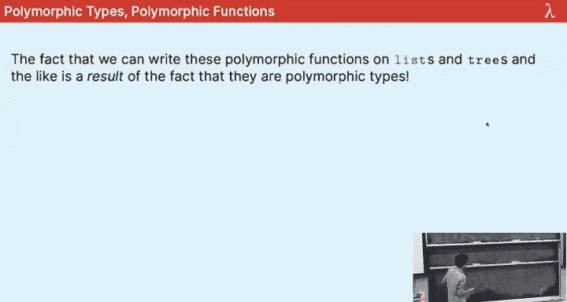
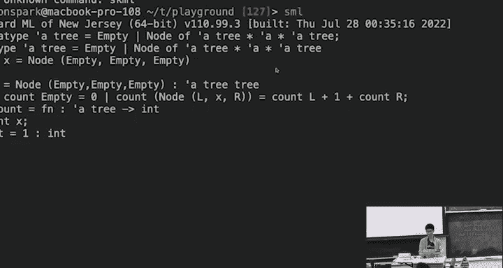
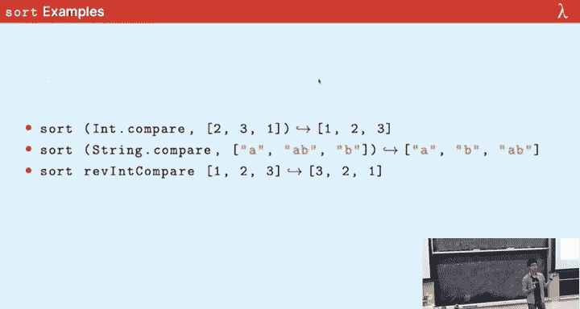

# CMU《函数式编程｜15-150 Functional Programming, Fall 2023》中英字幕（deepseek - P8：-08-8. Polymorphism _ - GPT中英字幕课程资源 - BV12VChY2EF4

We're gonna go ahead and get started Ao functional programmers welcome to the eighth lecture polymorphism We've got the house points up here remember just to show you every single week that yellow is only10 points behind。

 which means that if Ylow win this one and then also they win the next one I next by the。

 I think it's three left before the next opening so you have time。

 I believe that even House Isla Brandon has a chance Okay so you got to pull it in to get today all right you've got it。

😊，Look besides that。Today we're talking about polymorphism， I wanted to mention to you your exam。

 you have your exam， when， when you need to show up。

Monday here it'll be in this classroom 80 minutes to take this examination unless you have other accommodations。

 okay， but it will be on a Monday which is not the that we usually meet okay， so remember that。

Show up。 don't show up。It's going to make both of our lives significantly harder。

 which you don't want。The is it same timeで on。Yeah， it'll just be in the same place Okay， yes， okay。

 so the past few lectures we were talking about a lot of stuff that was it so there was a lot of me standing up on the board and solving equations in front of you。

 okay which is not it。The most exciting thing， but it's all in the pursuit of this idea of the fact。

analyzelyze our code and we can give mathematical grounding to how we think about the complexity of our code。

 but in fact complexity is not the only place we can give that consideration remember the things I'd said on the first day of lecture what do we want。

 we want descriptive code， we want modular code and we want maintainable code。

Today we're going to be going back to our release and talking about stuff that's way more in line with that。

 stuff that's in keeping with those ideals when we talk about polymorphism。

 which is a way of kind of saving us some labor when we do programming okay a way of writing more descriptive code in a more fundamental way who here talk like ABCSA and knows of polymorphism from there。

Great， put your hands down and forget everything that you learned from there this is completely unrelated All right。

 it's called polymorphism， it's not the same， all right， yes。Yeah， okay。

 and this is a lecture where I usually start to introduce on well I mentioned her before。

 but this is a poly the polymorphic parrot， and he's our mascot for this course。

 they are three actually this is one of them， but polymorphism， poly the polymorphic part。

 today you will see why that is。AllSo let's go ahead。Good started。嗯。I'm going to meet this next this。

there we go Oh yeah， and I some left feedback， really good feedback that I should put the Mendy code at the beginning of lecture。

 so copy the center off fast。your microphone you soa everyone good this can anonymous any。😊，Okay。

 we'll move on。Okay， so this is plan for today we're talking about a few things。

 we're going to give type inference a little bit more of a concrete treatment today。

 we'll talk about this idea of polymorphism， but parametrically， parametric polymorphism。

 we'll talk about how we can make our data types also parametric in that same way and then we'll talk about how we can redo the sorting we did last lecture。

 but now polymorphically and it's okay if none of that means anything to you right now because in one hour and 20 minutes it will。

😡，Okay， all right。So this last time is pretty unrelated。

 but a remember that we talked about runtime complexity。

 we talked about the trade method and we talked about merge sort okay。All right。

 type inferenceprints， so type inferenceprints is something we've already talked about a fair amount。

 but it amounts to how SML is able to ascertain whether or not something is welltyped。

 what type it is， and you know whether or not it's ill typed as well is the corollary of that right？

😡，But one thing that we've been doing this whole semester is we've been type annotating everything and we've been using ints all the time。

 it's been insanity， it's been never ining， it's been insufferable puns。

 but it's been awful right because we keep writing these functions and we're localizing them at this type of ints for instance。

 suppose I had the length function which we've written several times this semester and the whole semester so far I've been writing。

Of type int list and then returns type int equals， you know， zero and then length。

Of Xcons Xes is shoutedttered out， what is this？あり？

I was writing it as you were writing as you were saying it， but yes， correct， but if you notice。😊。

I didn't use this X， right， And I told you about patterns。

 how we use the wild card pattern to discount things that don't actually matter to us。

 So for all intents and purposes， I could have written this。😡。

And what I mean to convey to you here is that we don't actually examine the X in front of this list at all。

 We never do anything with it， So I've type annotated that in list。

 but what if I wanted a length function on string list， Well， okay， now okay， let's do it。

 let's do fun length。😡，String， and we're going to take in， you know， string list。

 we're going to annotate it like this。And it's going to return int， so we'll see zero。

And then someone shouted out to me， what is the recursive case of length string？Sure。

 length string x is plus one。We can permute the plus if we want。But now okay。

 now I want a length function on bulls。 and now I want on lists of lists， I want on  or on 2D lists。

😡，I gotta write another one of these。 That's terrible。 It's painful。 It's redundant and worst of all。

 remember， it's ugly。 Okay， and we don't want that。

 So I want to be able to not have to do these things。

 And as I'm very heavily implying to you right now， we are going to be able to do that， okay。

 but notice the form of this code， right， Look at the contents。 ignorere the name， right。

 ignore length， string and length。They look pretty much identical， don't they。

 like if I wildcoed this。😡，And unfortunately， we wrote it the other way。

 but if I put the one plus here， it would be pretty much identical except for the type annotations。

 So what the code does feels exactly the same， regardless of whether or not it stores an int list or a string list or a bo list list so on and so forth right So I want to be able to somehow write code that acts generically in this without having to deal with writing it over and over Otherwise I have to redo every single lecture up until now。

 but change my int list to a string list and then I'd tell you that you were getting new content and then youd be charged like 20 k for that。

 and you'd be pretty unhappy。 All， we don't want that。 So let's not do that。😊。

So I already talked about all this stuff， but I'm， let's say this， okay。😊。

Let's talk about how SNL is able to determine the type of expressions。

 remember that we can definitely always find that type， right we can find the type of something。😡。

But how do we do that， right？So recall that like a particular example and I believe okay。

 actually let me talk about this。 So remember that the way that we do type inference is we just straightforwardly look at each component of an expression and we apply very simple rules like plus this has type int or int to int。

 meaning it takes into ins and returns solicit an int if we have a contradiction that's ill typed and then if we find a type then we've got the type。

😊，Right so for instance， if we're doing 2 plus3。😊，Well， we know。s。Plus is of type in intent。

So what do we want to be true， we want this to be true？If this is true。Which it is。

And if this is true。Which it is right very simple， not contentious really。

 but we just look at each subcomleent and if this was itself like one plus。

 you know we'd apply this rule again， you can think of ads right。😡。

And that's just how we would do it。 But let's talk about a little bit more interesting of an example。

 When we're talking about like bare values， like values that just stand on their own。

 this is pretty simple。 We just apply the rule。 What if I had something a little bit more complicated。

 I had a function which looked like this and the problem with functions is that they take in an input and we don't usually type annotate them。

 So the type of the input could be anything。そ置。Well how am I going to do this。

 I'm going to assume that x has some type， I don't know what type。

 but we're going to say that the X' type is a box。😡，It's a。It's an unknown。And then what if I do。

 I go from here to here。😡，And in this expression x plus 1， I remember I have this rule right here。😡。

So then it should be true that whatever type X is， it matches to this， right？ So first of all。

 we verify that x plus one。😡，By the fact that that's a thing。

 that rules a thing has type int if we know that one has type int。Which it does。And also。

 we know that x has type in。Which we don't know， but it's unknown， so let's set it， why not？😡。

We're enforcing a constraint upon x。 The constraint is that。

X actually has type nt and then because because we have no other claim to what the type of x should be because we have no other aspirations are。

 then it just is， sure， let's retroactively backpatch what the type of X was okay。

So this gets a little bit more complicated in the function case。

 but you should still be able to assure yourself we can still do it。

 right this is still fine to infer the type of。😡，And to be clear。

 we're assigning something to this and then we're entering the body here is what you should think of it as。

 okay？Well， okay， let's talk about something little more a little bit more interesting， right。

 so everything happened to come up roses for us for that previous example， but what if it doesn't？

And what is it， it's like x x plus one。X string pen， also one。Yeah， okay。Well。

 here we're going to do the same thing we're on the right actually， I'm going to put it here。

 X has an unknown type。And then we want to say that this thing has whatever type of a twople type of whatever left is and whatever the right is。

 so let's type track the left and right。😡，Well， x plus 1 is again， this plus thing， so we say inch。

If X type in。And one has type inch。Which this does， and that one， we're going to say， okay。

 so now we know the x should have type n。This is a， what we say a constraint。

 It's a constraint upon our type that is as yet unsolved。 Okay。

 and then let's do this right hand side。 Well， remember also that。Strink and cat has tape string。

Star string。Two string， right？So then this thing should be of type。

String only if both of its arguments are type string。 So we should have the x of type string。

 and then string 1 is a type string， which it is。 So we're good here。

 But that's a constraint upon our X variable。 We don't know。 So we'll apply it here。

 So we're saying X of type in and also x of type string。Is anyone else thinking danger。

 Will Robinson？Do we have an issue here？What's our issue？Yeah。

I thought we said we were trying to make me look good today。 Yes。

 I'm not gonna comment on that precise comment。 but this is terrible because why。

 because this thing is a type in and also of type string。

 How can something be both of type in and also of type string。 that should not be possible。 Indeed。

 it is not possible。 Okay， so ill typed， We will reject this program。

 Let me show it to you on the command line， actually， just so that you can see。

 But Im F and X goes to X plus one。 and then sorry， X string append1。😊。

Oh what's this opera and operator do not agree， which by this point you're all very familiar with the fact that this means bad news bears right so we don't like that because it's illtyped。

 so let's work on it。😡，And no also， this is completely separate from the fact that if I。😊。

I'm just going to give you a really brief note that if I change this。😡，Two plus。1。

0 we'd still have an issue Does everyone understand like this this is plus on reels。

 remember how plus can do on both ins and reels， we'd suddenly have what this would happen。

 what would happen is that when we go to here。And we'd still have an issue okay is this is a special case。

 it's not anything related to what I'm talking about today， okay。

 just not to mislead you in case you thought that this looked similar。

 but anyways let's move on from that。😊，But the point is that what happened earlier， I guess。

 a way of thinking about it is on this board。We had precisely the right amount of constraints， right。

 we had one constraint on x， which is that x is of type int and then we ran with it and we were like。

 yeah， it's cool， let's go but here。😊，We had too many because now we have two constraints。

 we have a constraint that x should be of type int and a constraint that x should be of type real。

 which is or you know in the previous example string but in this example real which is bad。

 so let's try to work with so we've seen two cases like the right amount constraints and too many constraints。

I'm interested also in a different case。 Can anyone actually predict what I'm going to say next。

 Like， what is another case we haven't dealt with。 We talked about one constraint。

 We talked about two constraints。No constraints， what happens if I just don't have any information whatsoever about the type of my next thing？

😡，What about this one？Well， now I'm going to say if I want to typere this， I'm going to say， okay。

 Xs type question mark， question mark， question mark， right， I don't know what it is yet。

And then I return， you know， when I type track this， I'm going to use that assumption。

 So I'll say that my return type has type whatever that question mark is。 So now I say this is type。

😡，I don't much like that， I don't think it's very clear。

 but in intention that's kind of what's happening， right， we don't know what this site ought to be。嗯。

This is going to emerge as a first class property of S M L programs that we can actually give a type for this。

 It's called a polymorphic type。 Okay， Parametric polymorphism。

 different than the polymorphism you've seen in the past， different than Java， different than。

I don't know whatever other languages there are， Java is the only other one I know of， that's a joke。

😊，Parametric polymorphism is polymorphism out of working uniformly。

 The fact that your implementation is generic over whatever data you you're operating on。

 whereas polymorphism in a different sense is like kind of more ad hoc dispatching on actually I I'm going try and describe what the other polymorphism is。

 It'll just confuse you。 It's bad。 We're gonna see a better way to do it。

 So there's this idea of an unspecified type this this unspecified type。

 but the type I take in in the type I return or the same。

 You would not say that this is type into string right， but it could have type into to in。

 It could have type string to string and all depends on context。

So we're going to give a name to this question mark， question mark question mark type。

 we're going to call it a type variable。😡，Okay different than the variables you've seen in the past。

 different than the variables that we've been talking about when we do variable declarations。

 a type variable is a variable that ranges over types when I say ranges over types。

 it means that it is given meaning because we substitute for it with types okay so here's what we're going to call it。

😊，Instead of question mark， question mark question mark， we're going to call it。Check。诶。Not a prime。

 not a apostrophe。Apostrophe， A， okay。And this is going to be our type。This is called。

A type variable and it's pronounced alpha， we typically pronounce it with the closest Greek letter equivalent。

 so this is alpha。This is beta。At this point， sometimes people say gamma。

 I feel like it's strictly less useful to talk have to think about it。

 so usually I just say Cta and I say Dita and then EA。😡。

You can keep this with this convention if you like， probably the proper way to say is gamma。

 But like， I just say Cita。 it's， it's easier。 Alright， but you say the closest Greek equivalent。

 Okay， and this thing ranges over types。 It means that this thing can have whatever type I like。😊。

But these are correlated。 every time I use this FN X Cu X。

 I can substitute this type with something else and obtain a type that it could be。

 It is now no longer true that every expression has exactly one type or can have exactly one type。

 You could possibly have a lot of types。 This one could have type string to string that should could have type in to in。

And this shouldn't necessarily be a foreign concept to you。

 why because we've already been saying things like。😡，This Neil is of in list。😡，Our favorite ins。

 but also it's up tape string list， right？In fact， we've had to tiptoe around this idea the entire semester and today I'm going to be able to pull the wool out from over your eyes and explain to you what's really going on okay but this is the same sort of idea。

 so if your mind's breaking from this one type thing it shouldn't we can do this anyways。Yes。

 okay so one thing I wanted to say also is blah， blah， blah， bh why do I want to be able to do this。

 Why should I be able to have multiple types for one piece of code。

 Because isn't there the whole thing I said about types guide structure。

 I put it like in bold on the first day， I put it up on the board。

 isnn't it misleading to have ambiguity in these types。😊，But as you can see on the board。

 we're gonna be able to use this for code reuse。 And it's not gonna break any of the safety properties we have about what we can do in SM L so far。

 Okay， It's going strictly make our lives better。 Alright。

 And you've already been benefiting from this。 And you don't even know it。 Okay， But， you know。

 if you， if you have trouble， if you wantan to remember the motivation。 Remember。

 I don't want to write length a bunch of times。 That should be the main use case。

 you're thinking of in your head。 I don't want to have to write that length function for every single type。

😊，Okay， so code reuse because an expression that has polymorphic type。😊。

Andll that's the definition right has a polymorphic type。

 like this is a polymorphic type if it contains type variables。😊。

So these such functions that have polymorphic types can be used at a bunch of different types。

 so for instances let's do this actually。😊，Let me racist this for a second。

Let I should verify my sequencing。Yeah， okay， cool okay。

Now I could write this identity function and the identity function number is the function that takes in something and gives it back。

 okay， and I could write it such that it takes in an inch and returns an int。

This is something I could definitely write right but you could probably see right by now like this is not something I want to have to do。

 This is terrible。 I'm going to have to rewrite the any function for every type。

 Let's not do that okay so。😡，Finally， finally， I'm so excited for this。

 You've seen me do this all semester， but。😊，We are no longer going to write type annotations。

 all right。In a lot of cases， you probably so should。

 it's good documentation and it'll stop you from messing yourself up and then having to debug really bad type messages。

But we do not have to， all right， I can perfectly write perfectly well write this and it'll take me less time to write these on the board from now on。

 and this truly does have type alpha to alpha okay。😡，So I'll just write like a comment。

 this is of type alphapha alphapha。And whats that， what's that mean for me using this at the SML andJ reppl。

 right？😡，It means I can write this。I can write a bowel binding where I use identity on one。

 and I can also write a vowel binding。Where I use identity。On high。Both of these are allowed。

 I can do this， let me demonstrate this to you actually。So I can use identity on one。

And then I can use identity on。Hi。Crazy。Code reuse。

 I don't want to have to redefine the same identity function over and over again。

 so I'm allowed to do this this is perfectly fine。😡，All right。So yes。

 so basically what I'm trying to motivate to you is now I don't have to write the identity function a bunch of times。

 I don't have to do this， I don't have to do identity string， identity bull。

 I just do identity and I cover all my use cases， yes。😡，Yes， actually at a certain point。

 they start doubling up you get like。it's not important whatsoever。

 but this does happen actually I think it's inconsistent there's some weird thing about the way it picks these names I forget what it is though but yes that would happen。

😊，嗯。Fun facts that in Mulligan， the SNL debugger I wrote。

 it's specifically hard coded so that I don't have to generate these names by saying that if you have more than 26 polymorphic types it'll just crash。

😊，Becauseuse I don't want to deal with it in practice， this never happens。 Allright， I'm an engineer。

 Leave me alone。 Okay， so the observation here we're trying to give is that the contents the same。

 The content's the same。 The types are different。 And that usually we want to let the content dictate the types。

 But in this case， the content is agnostic in some sense to the to the type right here。

 we have this X。 we don't actually care。 So this is the zero constraint case。

 We don't care about this。 Okay， so again， I I've already kind of told you this。

 but this is parametrictro playingmorph okay。😊，Yes。Whoa， whoa， you're way far ahead。 Okay， not no。No。

 well， actually sorry， we repeat your precise question actually。No。Okay。

 an expression may a value cannot。 There is no value of type alpha。

 Let me let me explain this in a way that might make sense to everyone。 So here。

 here's another way to think about this alpha nonsenses。 Okay。

 We're trying to talk about a type that could a type variable that could be inputted with any types。

 basically saying that for all types T。This is type T or O T， right， So let's actually write that。

 So like if I have alpha to alpha。This is pretty much the same as me saying。

 like for all T like types， and this is T to T。Alpha is a universally quantified。

Type it's a type quantified over every other possible type。So with respect to what he just asked。

 can I have know val x type alpha？What kind of what kind of type has type for or sorry what kind of value has type for all T T。

 like it's of type string， it's also a type bo， it's also of types of bo are bo。

 right like like this doesn't exist。We shouldn't have such a value because then I could put it wherever I wanted and then I would clearly break my nice properties of type safety。

 so you're absolutely correct that this does not exist。😡，But this does。

 we can't have something of type alpha to alpha， a value of type alpha alpha。 in fact， it's that one。

 it's that value right there。Well we can't tell the value of typeal， okay， fun thing to think about。

There's another metamentory thing I can say here， which is kind of like this one of the coolest things about having these parametric parametrically polymorphic types is like just looking at the type。

 you can get a lot of information out Like if you look at the type alpha to alpha。

 I claim to you there's precisely one thing that does this and it's the identity function。

 You get that just from the type。 I won't go on for too long about this。 but it's interesting。

 I think and it's very useful about your types that they are able to describe the behavior just from looking at the type。

 and that's kind of what we wanted we wanted to be able to say if I see the type of this。

 I know exactly what it's doing right if I see something of type inlist to int， okay。

 I could do a lot of things。😊，But like my intuition is， you know， maybe it's the length function。

 Okay， so I don't know， I think that's kind of interesting。 All right， but yes， good point。Cool。

 okay， I already showed you this。 So what we're looking for is we're looking for generic code。

 We want code that runs in many different circumstances， regardless of certain facets of its type。

 Okay in other programming languages， they actually call this generics in Java， for instance。

 they call this generics。 They got it from the Hu。 That's not I'm not lying， they got it from M。

 they got it from S ML。 Okay so the next time you think that oh， this resembles Java now。

 Java resembles us Allright。😊，This is from like the 1950s like this has been a thing for a while。

 all right， cool okay。So and in particular， this thing I wanted to talk about is the kind of polymorphism thatinol uses is called let polymorphism。

 let polymorphism as in let polymorphism not be on your midterm next Monday。

 but also let polymorphism as in I don't actually think it's important that you know why it's called that okay but only it means that we only generalize a value as polymorphic outside rather after its bindight Okay and what I mean by that is。

😊，Don't expect a function to be polymorphic while you're defining it necessarily。

 if you constrain a function while you're defining it， you will constrain that function in general。

 let me show you an example。😡，This fails to be polymorphic。😡，OkayI'm。

 I'm defining the identity function， But within the identity function。

 I kind of like halfphardly use it on 5。 and then I return X。 Now， if you ignore what it's doing。

 right， if you kind of think about it with your brain， you might be like， oh。

 I take an X and then I don't use this。 so it doesn't actually matter。 And I return X。

 So clearly this should be a type alpha alpha， right。😊。

Because it takes anything it gives it back out except right here inside identity。

 I specified that it should take in an int At this point， it was not generalized。

 It was not generalized in here。 It was still an unknown to be solved Okay so then we will'll say that this is actually going to be a type into int。

😡，All right， yeah。Well， yes， but we're talking about the types。 Yeah， yeah。

 the types are what's important， but you're correct that it would look forever。 Yeah。

 but in terms of the type checking， like it's not going to like this and rather it'll like it。

 but it'll be into end okay。😊，Which is lot of comment like if you have type in to int。

 it doesn't mean you actually get back an inch right always， it means that if you return a value。

 it must be have type int， but everything we're talking about today is at the type checking phase。

 which means that we might come up with examples that loop forever。

 we might come up with examples that don't do sensible things， doesn't matter。

 We're talking about the types okay。😊，Look at point。Okay，Z won' understand why this is in to in。

 It's not super important， but it's a good thing to know because you can trip yourself up with this sometimes。

Yeah。So if I did like identity high below that would not now fail to type check yes that would fail to type check yes。

 the reason for this is because inside the body of identity。

 we're still figuring out the type of identity that means that we currently have something which looks like question mark question mark question mark right and then you give identity int so now we have oh we're exs of type int。

😊，So then that solves， but then if we also add in the high， now we also have x as a tip string。😡。

Fails to type checks similar to the examples we saw earlier in this lecture。

Right so basically when we're in the declaration， we're still trying to find out the type afterwards we get to play around with it as polymorphic okay。

😡，This this is something like as long as you have this general idea in your mind。

 I'm just trying to prevent you from messing this up and then getting confused over while you're getting errors。

 but yeah， this is not conceptually like super super important， but I'm a good observation yeah。😊。

Okay， we'll move on。Cool， okay the identity function though， I've been talking on and on on。

 the identity function this， the identity function that I don't actually really care that much about the identity function and we don't really use it and you might notice the ominous footnote saying yet because we will use it in approximately two weeks quite a bit actually but for now the identity function is kind of more of a curiosity not something we actually do。

😊，But you know， what is something we actually use it the length function。 So right now， we。

 we can write the length function， and we don't need to specify the type at all。

 So I'm not going to write the length function back out， but。

Someone want to hazard a guess for what the type of blank thought to be， I don't think I said it yet。

Righty。我さ。あちもて。So I like this type alpha int for all types T。It has type T to ins， right？

Suppose I want an instance of that。Inch。Can we write this。Should this subject check based on。です。Yeah。

Was was that？Alphaist is what we said okay So basically what I'm trying to show you is that Al is a good guess。

 but it's not going to be quite correct because you can't take in any arbitrary input。

 you can only take in any kind of list right because if I gave zero to this does zero match to that does zero match to that No it's not even a well foundunded question ask。

 You can't even ask whether or not I should match list because they have different types。

 I'll keep this up。😊，And you see now actually becomes a lot more tuerse and nice once you no longer have to write the annotations and this is what the engineering has been wanting to write like all semester like I've been salivating at the mouth to try and not have to write these type annotations and I remember I have to it's a fact of the first few weeks of the course but yes。

 so alpha list is going to be what we say is the right type。😊，Yes。So is this a close slide。

 let me see。No， it's not okay， so we're going to talk about this when we talk about instances。

 but there are types that are instances of this type， okay， for instance。😊，For instance。

 int list to inch。Is an instance of this type because I substitute this alpha。

 But here's something else I could substitute alpha for。 I could say beta， sorry。비ta sercita。List。

To int。I could also say。Int list list。Change when I say for all types T， I mean for all types C。

 this thing could be anything。 It just depends on the context in which we use it。 So， for instance。

 this is a function that gives us the length of lists that contain ins。

 This is a function that gives us the length of any function or sorry， any list that contains tus。

 tus of two things So this is actually a very useful type。

 And this one is something that counts the number of rows in the 2D lists， basically。😊，Yeah。

 so if a function flat can also alpha flatten is generic。

 you didn't actually it doesn't matter what the things were。

 so it would be alpha list list to alpha list。哦， sorry。

So alpha intless isn't actually a type if you have something that's like intless list。

 so like this guy。😊，This is still in list， it's a valid concrete type。

 it's not polymorphic whatsoeverle。😡，It's just easy list， it's an instance of alpha list。

 but it's not actually like this type itself。😡，Yeah， but if you wrote Latin without type annotations。

 it would actually be polymorphic because it doesn't matter what kind of it was， yeah。

Depend on like a data structure that's dependent on the type can contain things of multiple types。

Yes， give me 20 minutes。 Yes， That's actually precisely what list is。 That's how list is defined。

 I'm show you。 I'm gonna to peel back the wall and show you how list is actually defined in intention。

 at least， but give me a second。 Okay， so yeah， so the next thing I wanted to do is I wanted to do kind of a little fun example with you where we traced through how SML tries to figure out the type of something because it's entirely mechanical。

 The thing I want to show you is that there's nothing scary going on here right。

 there's no magic and know the earlier you discovered that there's no magic to computer like it is the better for your education。

 I think because we can understand it。 Okay so let's do this。 I'm just gonna to copy this down。😊。

So2 is equal to。 What is it， It's if a then。B plus one， C， LCD， right， all right。

So let's try to type check this。 Let's try to infer the type of this expression。

So h no annotations to help me out， but I clearly see I take a two of four things right so first of all。

 let's fill in our assumptions right a。😊，Before we put question mark， question mark， question mark。

 it's actually going to be。Alpha， we're going to give it at first a polymorphic type and then refine that assumption later。

 okay。And then b is a type Bta， C' is a type Cta， and then d' is a type dta okay。

And then at some point we're going to want to come up with this type， right。

 actually I need the space。At some point we want to come up with this。Alpha starbeta， orrcta， ordita。

And let's just say I'm an eat here okay， because this is what we want to figure out right。

 but right now this is our best assumption， okay。😊，So what do we notice， Well。

 what's something you notice， what's something we can simplify right now？Yes。It is a boolean。

 so it's right in a constraint。Because we use it on this if right here， right， Okay。

 what's another one？Yeah。B is an inch。Right。People's one yeah， so it's like an inch， right？五？

So bees have type int。All right， what's another thing we notice is， well C we have here。

 but we don't have you yet。😡，Maybe D is a function。 D could be a function。

 but because we don't use it as a function， we don't know that for sure。 Yeah， Oh sorry。

 I mess something up。 Yeah， yeah， Nancy。I'm missing a unit。 I am missing a unit。 I'm so sorry。

 You're absolutely right that it's a， it's a function。 Thank you。 I was gonna give you a hyp you。

 anyways。Even though I'm the wrong one， thank you。You know what。Tea is Gi high choose too。Co。

 someone was talking and I interrupted them。😊，Because one is an int and point if it was one point。

 it would be real， right？😡，Cool， I need to give more high shoes out anyway， so okay。

 what's another thing we notice？呃，那有。Yeah， it's like two observations。 Yeah， but you're correct。

 Oh sorry， you're correct that it takes some units， so let's do this。😊。

Where it's going to be of type。Unit to something where that something is going to be whatever the same return result is of int and then whatever C is okay？

😡，So it'll be this actually maybe I should be editing these in place。

 it'll be easier for me to show you， but I'm a int star seatta， right？😊。

So these are going to be the same and another cool thing is also like if I did this and then later on I noticed that C was like if I did like this。

If I did this， then we should update our assumption here， but also here。😡，Right。

 because then D should also return whatever that is。 Okay， it's not just Cta。 It's going to be like。

Depenent anyways， the example is not that complicated， but okay。All right， so see， I just have here。

 yes。That's's one of the stupid cases where I this is one of the edge cases I have to caveat to you yes。

 it would be it be both be ins。 If SmL doesn't know enough to infer， it'll just pick ins。

 it'll prefer to pick the int version of plus This is not important you don't need to notice ever It's very sad that it works that way。

 But anyways， cool good question anyways， So is everyone convinced like this is like as precise as I can get for C because I I never really enforce a constraint on it like use it but like I kind of just like put it there and then leave it I can't really get something more precise。

😊，Okay， so my end result is going to be and we can work through all of this all right， blah， bh blah。

 blah， look at this， I have a nice little graphic for you， we say that a is bo。😊，Honestly。

 I don't know why I write on the board sometimes I work so hard on making this look nice theses an int theses of unit to Eda。

 we notice， but then that Eda later becomes the same。😊，As this， right in sercita， yes。

It should have been brought up in lab。 I never brought it up in lecture because I。

Ha better things to talk about， but unit， this thing， is the only value of type unit。

Unit is a type that has exactly one value， and that's this guy， left pre and right pre。

That's pretty much all you need to know about it。Yeah。You can case on it。

 It'll just be a case that's pretty useless because there's exactly one case， yeah。Thank you。

Thank you。Oh my goodness， I didn't know this is a criticism or not criticism， butm yeah， all right。

 thank you， I don't know how to respond to this， I'm going to move on。😊，Cool， and as you can notice。

 this is a very useful type。 So our n type is gonna be boo star int starcita star Pers unit in sercita to in sercita Okay。

 because we return the same type as this that's another thing we should say now。

 this is will be the same as this Eta Okay because that's what we end up returning。😊。

Is anyone confused about this， I hear murmuring？ok。Okay， so not quiz time yet。

 but first of all want look at mentee actually。😊，So if you had any questions。

 why are functions values because they are actually I'm going to answer precisely that question later in this lecture。

😊，嗯。Will Friday's review session be recorded？TAs， can we arrange that？Like Zoom or something？sそだ。

Sdes will definitely be posted， we'll try for the recording it's a little harder because we're not going to have like a videographer it'll just be like on Zoom or something so but yeah we'll see yeah okay。

😊，Cool， yeah， all right， let's move on， all right， get up， say it up， Come on。😡，正得。

I want to make sure you're awake as well， I'm looking in this direction。All right。

 I feel like people are mostly wrapping up I know some people also left the classroom。

 but unfortunately that's how it is sometimes。😊，There was a period this semester when I toted with the idea of giving you more breaks and then doing three lectures a week。

 but I realized that it's really hard for me to go in depth on something in like 50 minutes and then not say all the things I want to say so I didn't do that but that's just something I felt like I're working on something I should also tell you is that the reason why the pastcode is Iiago is at my company SGp where I work my mentor's name is Iago and Iago is a parrot in Aladdin so keeping with the whole yeah。

😊，Yeah， you know， I'm going to tell him that after this lecture。 Yeah something。😊，Do you not。Yeah。

 yeah， he squoxy's on yourar shoulder。 It's like， it's like， hello。

 how am I going to become sultan Because you're going he's voiced by Gilbert gotfred。 Yeah。

 that's right。😊，Gilbert， I'm not， I don't need to answer that question。 Okay， allright， allright。

 I should have put that on the quiz。 Do you know who Gilbert got for it is， anyways， Okay。

 let's move on， shall we。 Okay， we're gonna talk about parameterized data types。

 which are essentially the things you've seen all semester， but better。 Allright。

 So we've seen we can have these polymorphic types like alpha alpha and alpha list and so on and so forth。

 but we haven't had to like make them。 We haven't had to like define them Al list just kind of existed。

 as a。😊，Something to tell you also， this is atyalpoli list。

Nail is not just of type inlist and bull list， it's also a type。In particular， it's a type aalist，😊。

But we haven't seen how we can make our own types that are parametric in this way and we're going to see how we can do that right now so what do I mean by that So a parameterized data type is a data type that is declared with the type parameter so basically it is a type that depends on a explicitly specified type parameter and list option are actually examples of this so let me show you。

😊，So if I wanted to define list， okay， and this isn't actually how it's done because it's like kind of hard coded in。

 but this is for all intent purposes， this is exactly how it's done。 and you can write this。

 this is real lesson L syntax data alpha list。😊，嗯。Okay。

 I'm going to take away the real single syntax part， but。😊，Yes， no or。Cons of。Alpha star， Alpha list。

All right， so what I'm saying that is that this data type alpha list can be is expressing a lot of types。

 it expresses the type alpha list。😊，It defines the type int list。

It defines the type bo list so on and so forth right it's defining a lot of types of this list type constructor taking in a type parameter okay and in particular the constructors for the alpha list type are this default constructor this constant constructor nil or also it could be cons when you take in something of type alpha and something a type alpha list but remember that these are linked in the same way that。

😊，In the identity function they were linked， so it would not be correct。

 It's still not correct to say something like this， okay。

I can't cons one onto the list of true because this is a type。Bull list。And this is of type int。

 right？So I realize this is kind of backwards， but this is， you know。

 I don't have room to write it the right way in Sa， Russia type has you， but the bull list here。

 it does not match that in Okay so I can't do this。 These have to be the same type right。

 but this is like pretty much exactly how you define it in S&L， right。

Let's see and okay well I'm just going to ignore erase this real fast so I can write the other thing and let me also define options for you this is something that's also defined at the top level but if you really wanted to define your own you the hankering to do that。

😊，You would say similarly。Type alpha option。 And this is a space I'm putting between these two things。

 Space space Alpha option equals none。Or sum of alphapha。

Because an alpha option can either be the constant constructor none。

 or it's some taking in something of type alpha， right yes？😡，Yeah， okay。

 let's just assume that someone or someone else put this。

 ignore the part about this being real S syntax because you wouldn't actually want to do this as I'm pretty sure it wouldn't accept this as a as a name or maybe it would。

 Maybe I don't care。 Its the idea。 but yeah， it might be。😊。

This gets into stuff about how you declare in operators， it doesn't matter。

 I could have written like Neil。😊，And cons and gone across the same idea Okay in intention。

 this is what what it's defined as Okay， but you could actually do this and then yeah。

 you could actually do that。😊，Oh， I was going to say something。 I create what it was。 Oh yeah。

 in SMmL， I'm， you know， none in some capitalized in the language I work in Ocal， it's actually。😊。

None and then some。 So every time I write Sm Im like oh I'm angry it's yelling at me， none。

 some but it's。Yeah， this is not important。Okay， so this is intention how we would do alphaless and alpha option。

 I am， I am the wizard of Oz。 I am the man behind the curtain。

 I'm showing you this is what's been happening the whole time before， we've always had to say。

 you know。😊，For any type T。Cons is type。Kana type T star T list to T list right。

 and it's been so annoying we've had to just write that all over the place and by that I mean like probably twice。

But now this is what it is， it's yourself。It's just alpha。All right。

Worth noting the name and this type doesn't matter， I could have put of beta， not have been fine。

 doesn't really matter。It's just the moment that it is a variable。

 it is a type variable Okay all right， and yeah， so this is the reason why list options can contain types of anything or values of any type。

😊，Yeah， so that all right， cool。I already told you that cool， let's see， so I already said this too。

😊，Here's the cool thing we can also define polymorphic trees and I'm going to talk while I write to really reiterate my point but we can do polymorphic trees because before we've just been doing monomorphic trees we've been doing trees that only contain ints but now and this is like something you'll actually see written in your code from now on okay data type alpha tree。

😊，Equals the constant constructor empty。Or node， and this is going to get long， actually。

 it always is Alpha tree， star alphapha。Sar Alpha  tree。Yeah。So now a valid type is like。Entry。

Or bull tree。Or？A list tree， which is a tree that contains lists at each of its nodes because why not you might actually want to do this。

 but note that if I did the seetype declaration，😡，3e。

Is not a type that's not a type because it expects a parameter right there's no like implicit thing going on you have to when you declare a polymorphic type。

 you have to give it a type parameter for the thing that it contains all right always yeah。😡。

I can't do that， I can't use type variables here if I haven't explicitly introduced them here。Okay。

 there's some subtle reasons for that， but yeah， it's not super important。

 but yeah that is a restriction I can only use the polymorphic type variables I've captured here。😊。

This would be possible， for instance。I could do that yeah。

There's not a whole lot of reasons for why youd want to do something like that， yeah。You can， indeed。

 you can have an alpha tree tree。Actually， maybe let's make it more concrete。

 you can have an inch tree tree。😊，Yeah， you can this actually。

 I think this causes a lot of theoretical problems with the fact that you can this polymorphic thing can just be like the type you are currently defining。

 I haven't done that in a while， but but yes， you totally can There are reasons why you'd want to。

 There are like I thought of a few。 but yeah， none you'll see in this class。 Okay， it's little。😊。

That's where we get a little esoteric， all right？I think I actually explicitly have， Oh， I do。 Yes。

 So if I had node of empty comma empty comma empty， that's actually a type alphapha tree tree。😊。

Becauseuse you know， the thing that's stored is the empty tree， right， Why not。

 Why not generalization upon generalization。 Remember， computer scientists were mathematicians first。

 All right， that's how it goes。 cool。 So this is how we define trees。

 and this is something useful you'd want to do， allright。😊，And in fact。

 because we have polymorphic trees we can have trees with strings at the nodes so you might see something like this and if you you take the in order traveral of this tree something interesting might happen whoa foreshaowing but anyways let's move on oh yeah you know what mean it like the future if blah bh blah blah。

 blah yeah this is the future if we had polymorphic trees which we do。😊，Cool。

 okay so the fact that we can write these polymorphic data types means that now we can do cool polymorphic stuff on these trees。

😡。

Remember our friend count。This always annoys me， this shadow thing。

So we can right count that works on this new tree we've defined。

 right remember count just counts the number of nodes in a tree。LXR。Equals。

Count L plus 1 plus count R。And if you note here， we still don't do anything with this x right。

 so I could very well wild car it out if I felt like。😊，But the point is like。

Irrespective of the data storeded in the tree， I care about what the form is。

 so this count function is what do you think， what's the type？😡，Any guesses？Yeah。啊。Alpha tree end。

 yes， that's correct。Oh well， sorry。呵。😊，Correct alphapha tree to int。 All right。

 we can give it a type of tree， any type of tree。 we could give it an alphapha tree tree if we wanted。

 Alright， we could give it the same thing we just showed all right it' it's a little actually you know。

 let's do it。😊，坏了。Star alphapha， star alpha3， and then val x equals node of empty， empty， empty。

And then fun count empty equals zero or count of node， sorry。

 I'm just going to do this in front of you because I want to see this happen。

Okay so count is a type alpha tree to end as we saw， right， but if I give count x。

 which is a type alphapha tree tree。😊，We're going to get one because an alpha tree tree in particular x has one thing in it。

 which is the empty tree。哥。Feel like your mind's expanding？

There's reasons to do this I promise， I promise。not the ones that we' necessarily see though， okay？😊。

So for instance， I could define that count function or this one I I wanted to do this one too we can do all right so some of you are smart。

 in fact most of you are smart， in fact all of you are smart， but because you're smart。

 you know how to use Google， which is really bad for me so you've been using this thing called option do ballov which I did not explicitly tell you please do not use that I'm explicitly telling you right now so optionval is of tight。

😊，Alpha option。To alpha， which by the way， if you ever see the site。

 you should check your wallet because bad things are happening okay but in particular。

 it means that if this is none you get an exception。

 it tries to unpack what's inside the option and if it's none you get an exception。😊。

This is terrible， this is terrible because this is the same par don't validate stuff I was telling you about like four lectures ago。

 which is that like you should just pattern match to get it out， please don't use v。😡。

Here's a safe one， we take in a default value and an option， if the option is none。

 we get the default value， otherwise we unpack the thing。😊，Gett opt yeah， pretty much yeah。

 yeah yeah。 you can use I mean， use pattern match， just do it， just do it。 Yeah， yeah。

 that's another library function Okay， but01 actually hazard guess as to what typea fellow has。😊。

Takes on a tuple， right， what's the left thing in the tuple？alpha， I like that。

Takes in the thing inside， takes in an option that might have the thing inside if it's none。

 this thing， we just give it the default value。😊，Otherwise， if it's some we unpack the thing inside。

 that's not important， but this is actually a pretty useful function to have get opt yeah。😊，Anyway。

 it's a random dietary， don't use olive， please， okay， cool。Okay， all right。

So we've seen how we can do polymorphic types like alpha alphapha。

 which are mostly out of like in our type inference thing we saw it was because we didn't specify anything。

 We didn't constrain the input， but it doesn't have to be functions。

 We can have values that are not functions that are also of polymorphic type， why， because。😊，Empty。

 right？Is of a polymorphic type。 It's of tight alpha tree。

Or Neil is also the type alpha list so on and so forth right so I'm showing you that like we can get polymorphic types through a bunch of different ways all right。

😊，Yeah， and then let's see。So for instance we can also do this thing where I say that I have nil。

 which is uptype alphaalist and this will actually compile。

 and then I decide to cons1 onto L and icon cons y onto L okay。😊。

I should I should say explicitly like this is not a contradiction because you might think， oh man。

 I have a constraint that L should be a type in and I have a contraint that L should be a type string list so then this will not type track it will because this is a use of L at this use of L。

 we can use it at a different type actually wait on。😊，Yes。

 so in particular what I want to say is that these instances of L have a type which is an instance of alpha list。

 this instance of L has type in list， this instance of L has type string list。

 when I use my polymorphic value， I can use it at different types。

 okay it's different than when I define it all right。😊。

Let's see wait hold on Okay cool So this is important for me to tell you that we have a most this idea of a most general type for an expression。

 Okay， for instance， if I had。😊，If I had like nil， which is a type int list， right。

 or it's a type string list and so on and so forth。I can write all of these things as true。

I can write this， I can write this。😊，But it only has one most general type。

 which generally will be what we ask you for on an examination。

 though not your next one because this is not part of it。

 this is the most general type because every other type that Nil could have is actually I'll say an instance of this type and I think I make that concrete in the next slide。

😡，So a type T1 is an instance of a type T2 if you can obtain t1 from T2 by substituting for some type variables okay so int list is an instance of alpha list because I substitute int for alpha boo list is an instance of alpha list because I substitute boo for alpha so on and so forth right this means that every type is an instance of alpha but for instance let's work through some so int is an instance of alpha intless instance of alpha list。

😊，Ins is an instance of alpha star beta， you know tuups are instances like this。

 a polymorphic type like beta sar alpha can be an instance of alpha， which is anything， right？😊。

And you can instantsiate it with lists too， right is I think you kind of intuitively get this。

 but I'm giving you this some vernacular， okay， instances， this will be helpful。

I'm getting a lot of mileage out of this out of this thing。

 I made this like for one of your things like a second lecture， maybe， and it took me like， you know。

 like 30 minutes。 and I've just been copy pasting it and switching things around a little bit ever since then。

 because this comes up a lot。 So we have our our you know， giant type alpha here。

 And an instance of it might be alpha star beta or alpha list or alphapha tree。

 And instances of those might be In Rio Bo star beta in list unit list， unit  tree in tree。😊。

Does everyone see why like this the arrow points to an instance， always， right？😡。

And in particular you'll notice that only Bstar beta has further instances because the rest of these guys don't have type variables in them。

 they're monomorphic， we'd say okay that's the fancy way to say it's monomorphic， not polymorphic。😊。

Impress your friends， yes。Yeah， it's transit here，Yeah。

 so like your endless could also be an instance of alpha， yeah， good point。😊，知道。All right。

Let's move on so the most general type of length for instance let's give you another example would be alpha list to int because it has type int list to int。

 it has type string list to int but they're all instances of alphas okay does that make sense to everyone like you see why the most general type of length ought to be that？

😊，Do not say the most general type of something is alpha。😡，Somethings sorry。

I don't remember what I just said， but the， do not say that the most general type of something is always alpha。

 everything is an instance of alpha， but it doesn't mean your most general type is what I mean by like that is like if I have length。

😡，Any type that like any instance of this function is a type I can use it at。

 it would not be correct to say the most general type of this is alpha because I can't use it as alpha if I use it as this。

 that means I could use it as int。😡，I could use it as pool and you can see well that's kind of absurd。

 right， this is a function， like you shouldn't be able to do that。😊。

So instances are things that we use to get the most general type， which is this。😡，Okay。

And there are examples as well， but yeah， this is justling up， all right。

 this is the most general type， that's the important part okay。😊，All right。

 I also should tell you don't make this mistake on your proofs。

 so suppose you want to prove a claim like length of L and R is length of L plus length of R for all L for all R。

 ettera right？😊，I want to prove this for length， which takes it in alphaphas， okay。

 no longer are we doing our proof on inless， we're doing it for alphaphaists。😡。

You might want to write this。Base case， L is equal to n。

 we proceed by structural induction on L of type alpha list。😡，Does anyone see an issue？

This is kind of subtle， all right， why might there be an issue with this？What do you think？So。Yeah。

You know。Yeah， that's pretty much close enough to the model I was think but basically。😊。

There's precisely one value of type alphaphas， like I'm saying for all values of type alphaphas。

 let's induct on it， but how many values are there type alphaphas？There's precisely one。

 I'll tell you， it's this guy。So actually yeah that's a good explanation how do I go to my next step。

 how do I take any value of type alpha and conant there aren't any I told you that there are no values to type alpha I cannot my induction is pretty weird because like I'm doing it over this。

😊，So what I want you to do instead is this， right？爸爸爸。Let T be a type。 When you start the proof。

 we're gonna instantiate some random type T。 same way as we said when we were describing the type of cons originally。

 Let TV type， we're gonna to induct on L of type T list。 for some type T。

 let's just say we're inducting on that now I can treat it generically because I I just say。

 okay let let's just cons on something of type T of type T a value of type T。

 So now my proof is essentially many proofs。 I'm doing it for in list。 I'm doing it for string list。

 I'm doing it for alpha list list， but I'm not doing it on like values of type alpha list。

 Does does that make sense for everyone。 do you see it kind like the distinction here this induction。

 like this proof is many proof。 This is the way I would think about it。

 It's like I'm doing many many proofs by。😊，Incentanching a variable T， okay？Do this。

 otherwise you will get points deducted， okay， it's not a threat， it's a warning。

Those are different things。I feel like a bad guy now， whoops。Let's do a okay， wait Ju， yes。

 I already told you all this。😊，Okay， here's what I want to tell you。

 which is that a polymorphic type is a family of types， right because it's like alpha list。

Theses a family types， which is like ent list。And bullless and so on。

Right a function with the polymorphic type like length is a family of functions。

 it's an int list to int function， it's a string list to int function so on and so forth and the proof on a function with the polymorphic type like this is a family of proofs it's a proof for every single type when I say family I mean like a grouping right that's just like something I kind of wanted to have you conceptually understand I'm running long on time but this one won't take very long actually I think I'm just the right amount of time to do this。

😊，Cool so let's talk about polymorphic sorting I promise you I'd talk about this so sorting we talked about how we can do on ints。

 but we're not always interested in sorting on ints because we might want to do more particular things we so let me actually that was the wrong way to start off Let's suppose we want to sort an arbitrary alpha list so I want this function。

😡，I want sort of type alphaphaist to alphaphaalist， okay？How do I implement this function？

If I wanted to do like the merge sort thing， okay， if I went and like I defined merge sort for you on the board。

 okay， what we would find is that we'd have an issue because at some point I'm going to be holding x of and Y。

😡，We're both out of type alpha， and I want to compare them。What do I do， I can't do this。

Because now this will mean that they're ins。Like so hmm。

Like do you see the issue which is that like somehow I have to sort these things without ever looking at what is inside because if I ever make an assumption on what's inside。

 I'm going to get that it's suddenly monomorphic I'm going to constrain my type and make it no longer general so I want to be able to sort anything yeah。

😡，Yeah， so we' going to do something like that。 Yeah， that's the right idea。😊。

So we can't first of all， this sorting function is impossible to write。

 I'm going to give you another way to think about it。

 It's ill formed because what does it mean to sort an alpha list like。😡，less。

 what is the canonical way of sorting ins like that it's kind of biased to you to think that like the normal less than relation on ins is the right way to sort it。

 What if I want to sort it mod 12， What if I want to sort it in reverse like we didn't specify that So let's specify let's be specific。

 We're gonna talk about sorting with respect particular comparison function So we'll say that a value a function f of type t star t to order。

 remember the order data type less equal or greater that is a comparison function if it's total and it defines a total order math people are excited right now because this is what a total order is I'm not gonna tell you what it is butm a total order is basically something where if I put all my stuff on a number line my relation obeys this like if this is farther left than this then it's less if they're equal than it's equal that's pretty much all you need to know we can't do cycles I shouldn't have that this is less than this and this is less than this and then this is less than this I can put it on a line is the idea that's a total order So like。

😊，Le than on ins is a total order。嗯。So we so for instance。

 valid comparison functions might be this one。 we have rev in compare where if x is less than y。

 we return greater， otherwise we return less。 So you see how this reverses that relation and it never does equality because I don't actually really care about it And then mod 12 compare says we compare x and y but only mod 12。

 So like we say that2。😊，Is less？Then I'm a， I don't know。 negative one， I guess。

This is not balanced index， but you get the idea right and we might want to do this comparison with respect to a particular comparison function All right so these are comparison functions What do we do with them？

😊，With a CMP value of which is a comparison function。

 here's what we're going to define for to mean for lists to be sorted with respect to that comparison function。

😡，A list L is CMP sorted with respect， again， to that value CMP。😡，If three things hold。

Either L is now in which case it's vacuously sorted or it's a singleton。

 in which case again it's vacuously sorted or。😊，The first two things。

Aresorted with respect to each other。 It's less or equal than related， right， And then also。

Y cons X is is CMP sorted。 So if I had like x 1， comma x2， comma。X3， let's say。XN。

I want to have that this edge on this thing between them is LEQ。And if I have this as LEQ。

 then I want to recursively do it such that this is also LEQ。And then this in bh bh， bh。

 blah and if you believe me about total orders， one thing they are is transitive。

 which means that if this is less than or equal to that， then buyer comparison function this must be。

😊，Less than and equal to that， Does everyone kind of pictorially see why this definition defines a sorted list？

Small note about like recursive problems， recursive solutions which I put at the top the right here by rarely ever knowledge and lecture lists are really nice because we can define stuff on them just by doing recursion it's really easy to say something about like is a list sorted because we just give three cases random small note。

😊，呃 okay。So if I were to sort relatives to a CMP function， I have to know what that CMP function is。

 So we're going to adjust the type of what our sorting function is instead of saying that sort。

Is of type alphaphaist to alphaphaist， we're going to do this。Sot。Alpha star alphapha to order。

Star Alphaist。I'm taking in。My comparison function as an argument， okay？

But why cant we do this okay like does this feel weird to you。

 we've almost never done this in this class I'm pretty sure。😡，Oh my God， I get to say it。

I get a functions are values。 I'm not wearing the jacket today， but functions are values。 Oh my God。

 meaning we get to give them as arguments， Sam as any other value。

 So I get to take in my comparison function as an argument。

 because that's just something I get to do。 It's a value。 A value is a value。 Allright。

 Just be a rock。 So this is fine to do。 And now we're promising that the output is C sorted with respect to the CM function。

 So let's rewrite our。😊，And this is just some stuff about how functions our first class citizens I'll let you read over that on your own time so here is our new specification。

😊，Sort takes in two things， an alphaphals and a comparison function， and I guarantee that oops。

 sorry， that's supposed to read sort CM comma L， but sort C comma L is a CP sort de permutation of L okay。

😊，All right， does that make sense， so let's do it。😊。

We're going to implement it via M and you're thinking， Brandon， you have three minutes left。

 how are you going to define the entire of M sortt？😡，I'm not。 Here you go。 This is M。

 I know it's small。😊，I know it's small， but if you remember the M sort thing。

 here's what we're going to do， a hop， a skip。😊，And a jump。

And I've nicely highlighted the parts that changed for you。

 The only thing that changed is M sort now takes in a C argument， which is that comparison function。

 and I pass it down， I pass it down to merge， I pass it down to M sort and I pass it down to M sort and then merge uses the comparison function you see here instead of x less than y。

 I do C X comm a Y and I case on that I've changed very little of this code but all these things changed and most of it was me passing down the CM function Okay but now M sort can be with respect to any comparison function because I use it when I need it。

😊，And now this is more general than our idea of sorting with MO earlier。

 let's see how we can define sort， here's what we do sort is given CMP and L and I return to you M sort of CMP comma L。

😊，And now I'm going to tell you that。😊，M sort， let's say old。

 which is like what we defined last class。呃。Yeah。It should be essentiallyly equivalent to sort。

In stock compare。L。ok。Our old M sort with respect to specifically integer comparison is going to be the same because I didn't change much about the code。

 but now it's so much more sensible， I never have to rewrite another sort because I just have it here。

 This is my sort and it's every sort I've defined a function that sorts things。

 but it sorts anything。😡，And the syntactic like overhead on that is very。

 very low because what do we get at this code reuse， This makes our lives so much easier。😊。

So we can do like like compare and then string up compare and redbank compare。 Okay， cool。

 thank you so much。 Please fill this out。 worth noting。 Also， go didn't have this until like very。

 very recently。 like the go language made by Google。

 they just straight up didn't have generics or parametric polylymorphism。 So like this is not like。

 yes， this is stuff that was discovered like 60 years ago。 But guess what。 We're ahead。

 They're catching up。 recurring theme。😊。

