# 02：等价性、绑定与作用域 😊


在本节课中，我们将学习函数式编程中的核心概念：等价性、绑定与作用域。我们将探讨如何通过绑定来管理变量，理解作用域如何影响函数行为，并学习如何利用等价性进行数学推理，从而编写更清晰、更可靠的代码。

## 类型回顾与扩展 📚

上一节我们介绍了表达式、值和类型的基本概念。本节中，我们来看看更多的基础类型以及如何组合它们。

SML 提供了一些基础类型，它们是构建更复杂类型的基石。

以下是 SML 中的一些基础类型：
*   **`int`**：整数类型，例如 `1`、`150`、`-3`。
*   **`real`**：实数（浮点数）类型，例如 `0.0`、`0.12`。
*   **`bool`**：布尔类型，只有两个值 `true` 和 `false`。
*   **`string`**：字符串类型，例如 `""`、`"Hello"`。
*   **`char`**：字符类型，使用 `#"a"`、`#"B"` 表示。

除了基础类型，我们还可以通过类型构造器组合它们，创建新的类型。元组（tuple）就是一种组合类型。

## 元组类型与求值规则 📦

元组允许我们将多个值组合成一个复合值。例如，`(1, 2)` 是一个包含两个整数的元组。

元组的类型写作其各组成部分类型的“星积”。例如，`(1, 2)` 的类型是 `int * int`。元组的求值遵循从左到右的顺序。

考虑表达式 `(1+1, 2*3)` 的求值过程：
1.  首先求值最左边的非值子表达式 `1+1`，得到 `2`。
    *   `(1+1, 2*3)` → `(2, 2*3)` （根据加法规则）
2.  接着求值 `2*3`，得到 `6`。
    *   `(2, 2*3)` → `(2, 6)` （根据乘法规则）
3.  最终得到值 `(2, 6)`。

元组的类型规则是：如果表达式 `E1` 的类型是 `T1`，`E2` 的类型是 `T2`，那么元组 `(E1, E2)` 的类型就是 `T1 * T2`。括号在元组中很重要，`(1, (2, 3))` 和 `(1, 2, 3)` 是不同类型和不同结构的值。

## 函数类型与 Lambda 表达式 🔧

函数也是值，并且有特定的类型。函数类型使用箭头 `->` 表示。例如，一个将整数翻倍的函数 `double` 的类型是 `int -> int`。

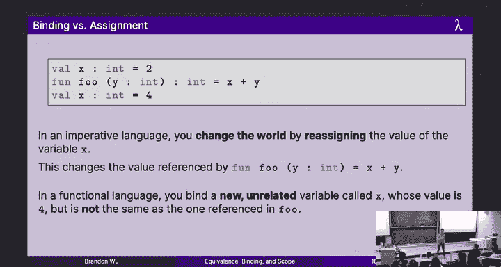

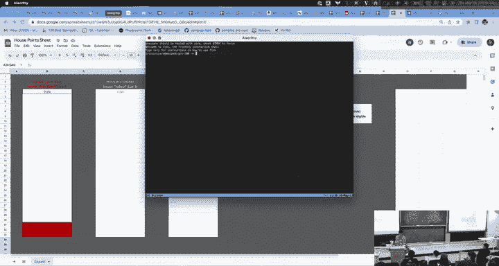

我们可以通过 `fun` 声明来定义函数，例如：
```sml
fun double (n: int): int = n + n
```
另一种定义函数的方式是使用 lambda 表达式（匿名函数）。其语法是 `fn` 关键字后接参数、箭头和函数体。

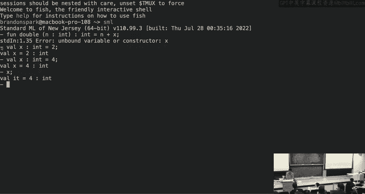

以下是一个 lambda 表达式示例：
```sml
fn (n: int) => n + n
```
这个表达式本身就是一个值，代表一个“匿名”的加倍函数。我们可以将它绑定到一个变量，或者直接应用它：
```sml
(fn (n: int) => n + n) 2
```
这个表达式会求值得出 `4`。Lambda 表达式是匿名的，因此无法在其自身内部进行递归调用。

函数求值遵循特定规则。对于函数应用 `E1 E2`：
1.  首先将 `E1` 求值为一个函数值。
2.  然后将 `E2` 求值为一个值。
3.  最后，将参数值代入函数体进行求值。

## 绑定、作用域与闭包 🔒

在函数式编程中，变量**绑定**（binding）与命令式语言中的**赋值**（assignment）有根本区别。绑定是将一个名字与一个值永久关联起来，而赋值是改变一个已存在名字所指向的值。

考虑以下代码：
```sml
val x: int = 2
fun foo (y: int): int = x + y
val x: int = 4
val result: int = foo 1
```
这里，`result` 的值是 `3`，而不是 `5`。第二个 `val x = 4` 创建了一个新的绑定，**遮蔽**了第一个 `x`，但它**没有改变**函数 `foo` 在定义时所记住的 `x` 的值（即 `2`）。`foo` 的行为在其定义时就被固定了。

这是因为函数在创建时，会捕获其定义时的**环境**（所有活跃的绑定），形成一个**闭包**（closure）。闭包包含函数代码和其创建时的环境。后续的绑定不会影响闭包内记住的环境。

因此，函数的行为是**纯**的：给定相同的输入，总是产生相同的输出。这带来了代码的**模块性**：要理解一个函数的行为，只需查看其定义之前的代码，之后的代码无法影响它。

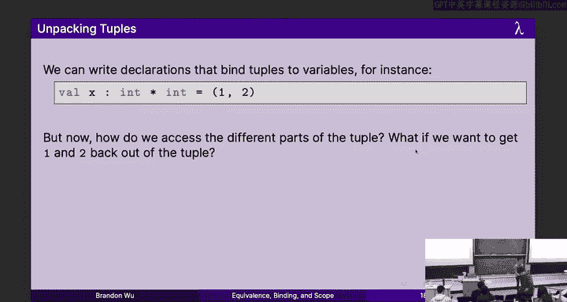

## 模式匹配 🧩

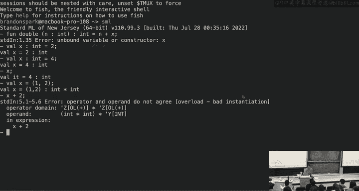

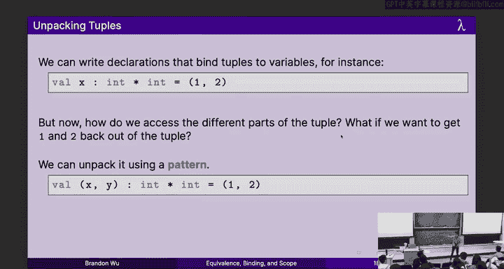

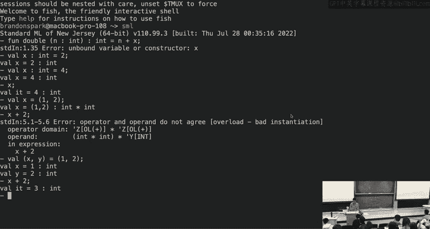

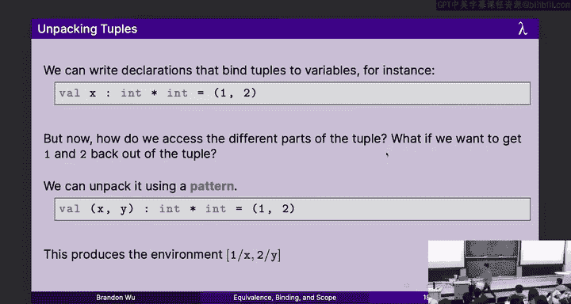

模式匹配是一种强大的工具，用于解构值（如元组）并提取其组成部分。

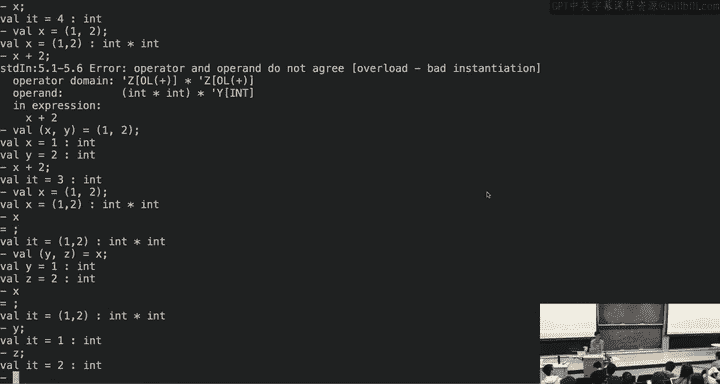

我们可以使用模式来绑定元组中的值：
```sml
val (x: int, y: int) = (1, 2)
```
执行后，`x` 被绑定为 `1`，`y` 被绑定为 `2`。

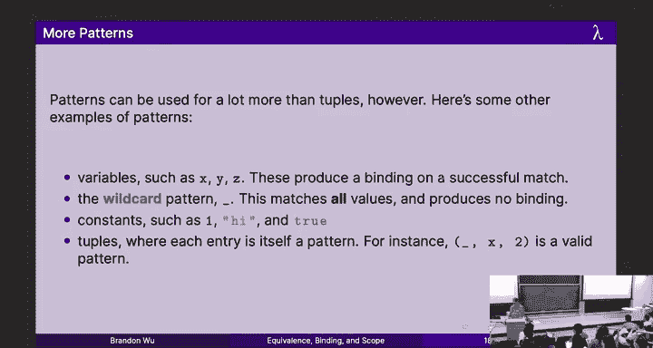

模式有多种形式：
*   **变量模式**：如 `x`，匹配任何值并将其绑定到该变量。
*   **通配符模式**：如 `_`，匹配任何值但不产生绑定。
*   **常量模式**：如 `2`，只匹配该特定值。
*   **元组模式**：如 `(x, y)`，匹配元组并解构其内容。

`val` 绑定的通用形式是 `val <pattern> = <expression>`。表达式求值后，其结果会与模式进行匹配。如果模式匹配成功，则根据模式创建绑定；如果失败，则引发异常。模式与表达式的类型必须兼容。

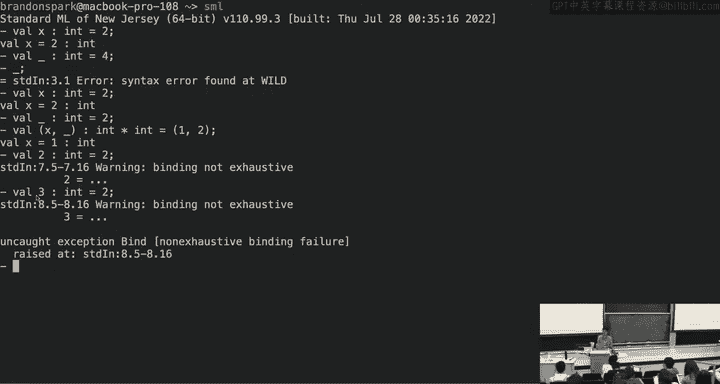

## 条件表达式与函数子句 🌳

SML 使用 `if-then-else` 进行条件判断。它是一个表达式，两个分支必须返回相同类型。

例如，判断奇偶的函数：
```sml
fun isEven (n: int): bool =
    if n mod 2 = 0
    then true
    else false
```
注意，`if n mod 2 = 0 then true else false` 在逻辑上等价于 `n mod 2 = 0`。应避免编写这种冗余的条件表达式。

对于有多个条件分支的函数，使用**函数子句**和模式匹配通常更清晰。例如，阶乘函数：
```sml
(* 使用 if 表达式 *)
fun fact (n: int): int =
    if n = 0
    then 1
    else n * fact (n-1)

(* 使用函数子句和模式匹配 *)
fun fact 0 = 1
  | fact (n: int) = n * fact (n-1)
```
第二个版本更简洁，更接近数学定义。求值 `fact 3` 时，SML 会依次尝试匹配子句：`3` 不匹配 `0`，但匹配变量模式 `n`，然后执行 `3 * fact(2)`。

## 外延等价性与指称透明性 ⚖️

**外延等价性**是函数式编程中一个核心的数学概念。如果两个表达式在**所有可能的环境下**：
1.  都求值为**相同的值**，或
2.  都**永远循环**，或
3.  都引发**相同的异常**
那么它们就是外延等价的，记作 `E1 ≅ E2`。

例如，`1+1`、`2` 和 `3-1` 都是外延等价的，因为它们都求值得出 `2`。由于函数是纯的，`fact 3` 在任何地方都等价于 `6`。

**指称透明性**是外延等价性带来的一个重要性质。它意味着在一个程序中，任何外延等价的表达式都可以相互替换，而不会改变程序的整体行为。这允许我们像解数学方程一样推理代码，进行安全的代码重构和优化。

例如，我们可以将复杂的条件逻辑 `if (flag andalso (if perm then true else false)) then true else false`，通过一系列等价替换，简化为 `flag andalso perm`。每一步替换都基于指称透明性，保证了程序行为的正确性。

---

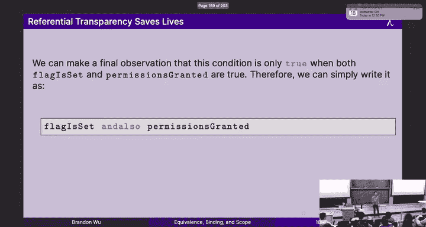

本节课中我们一起学习了函数式编程的关键基石：通过绑定和作用域实现的不可变性、利用模式匹配进行清晰的数据解构、以及基于外延等价性和指称透明性进行的数学化程序推理。这些概念共同构成了编写可靠、可维护函数式代码的基础。