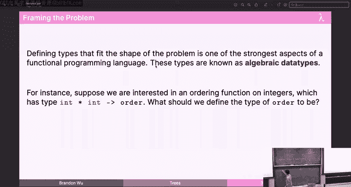
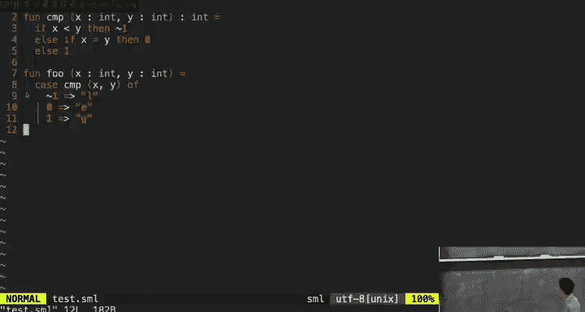
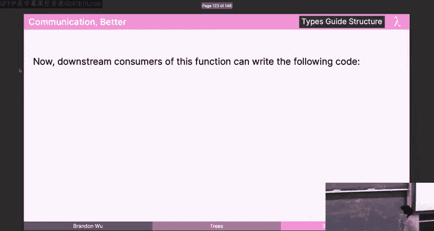
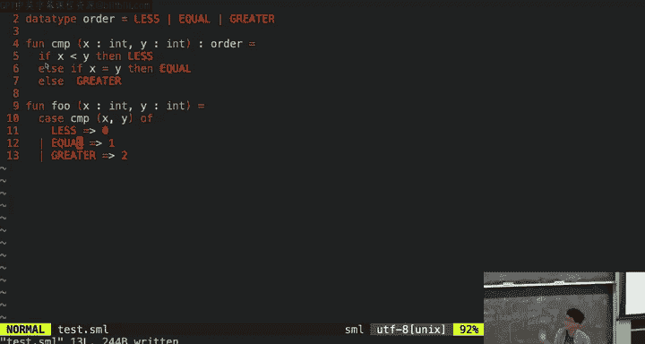
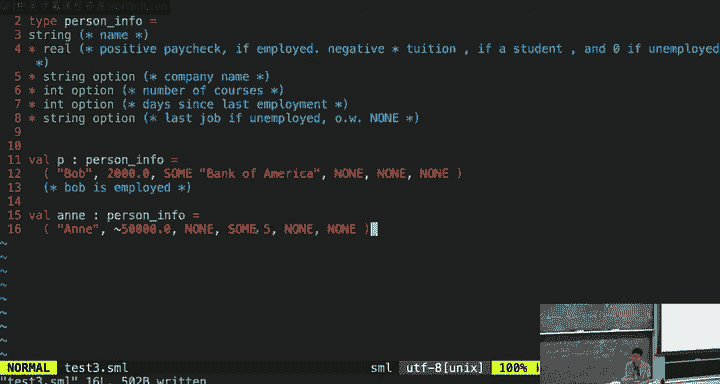
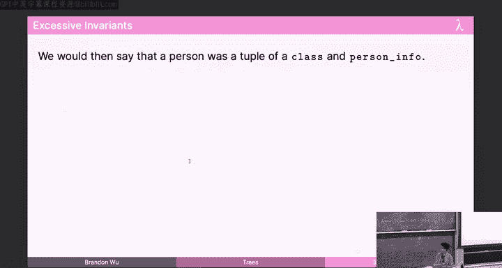
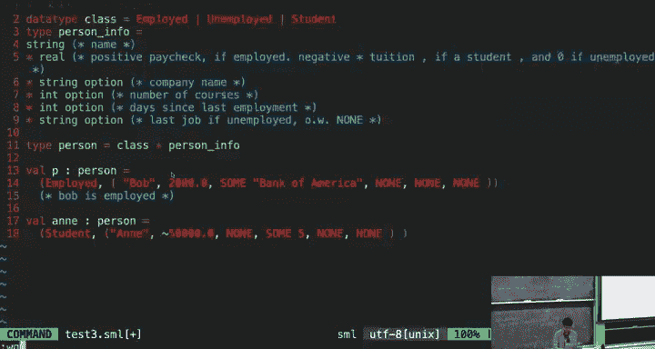
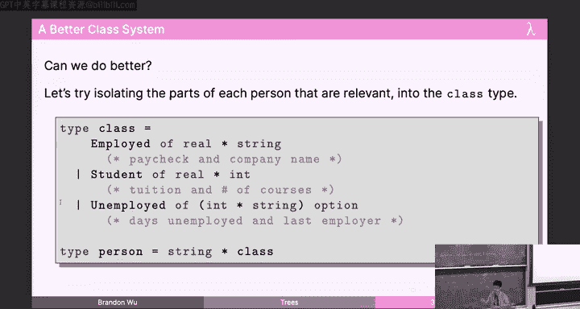
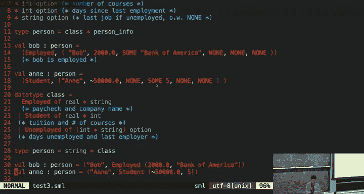
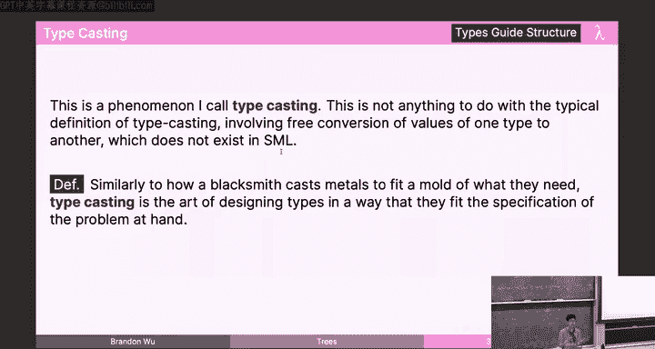

# 05：树与代数数据类型

在本节课中，我们将要学习树这种数据结构。树是计算机科学中除列表外最基本的数据结构之一。我们会学习如何定义树、在树上进行遍历，并通过结构归纳法证明关于树的性质。最后，我们将探讨如何通过代数数据类型来精确地建模问题，使非法状态无法表示。

---

## 05-1：树的定义与基本操作 🌲

上一节我们介绍了列表上的结构归纳法。本节中，我们来看看另一种递归数据结构：树。

SML 没有内置的树类型，但我们可以使用数据类型声明来定义它。一个二叉树的定义如下：

```sml
datatype tree = Empty
              | Node of tree * int * tree
```

这个声明创建了一个名为 `tree` 的新类型。它有两个构造器：
*   `Empty`：一个常量构造器，表示空树。
*   `Node`：一个递归构造器，它接受一个左子树、一个整数值和一个右子树，并组合成一个新的树。

这与列表的定义类似：`Empty` 对应 `nil`，`Node` 对应 `cons`。我们可以使用 `case` 表达式对树进行模式匹配。

以下是几个树的例子：
*   空树：`Empty`
*   只有一个根节点（值为150）的树：`Node(Empty, 150, Empty)`
*   一个更复杂的树：`Node(Node(Empty, 1, Empty), 5, Node(Empty, 0, Empty))`

我们可以为树编写递归函数。例如，计算树中所有节点值的和：

```sml
fun treeSum (Empty) = 0
  | treeSum (Node(L, x, R)) = treeSum(L) + x + treeSum(R)
```

在节点情况下，我们需要对左子树和右子树分别进行递归调用，然后将结果与当前节点的值相加。

---

## 05-2：树的遍历 🔄

上一节我们介绍了树的基本定义和简单操作。本节中，我们来看看如何系统地访问树中的所有元素，即树的遍历。

直接为树编写各种函数（如求和、计数）可能会产生大量重复代码。一个更好的思路是将树转换为列表，然后复用为列表编写的函数。我们需要一个类型为 `tree -> int list` 的函数。

有三种主要的树遍历方式，区别在于访问 **根节点 (Root)**、**左子树 (Left)** 和 **右子树 (Right)** 的顺序：

以下是三种遍历方式的定义：
*   **前序遍历 (Preorder)**：顺序为 **根 -> 左 -> 右**。
*   **中序遍历 (Inorder)**：顺序为 **左 -> 根 -> 右**。
*   **后序遍历 (Postorder)**：顺序为 **左 -> 右 -> 根**。

以中序遍历为例，其实现如下：

```sml
fun inorder (Empty) = []
  | inorder (Node(L, x, R)) = inorder(L) @ [x] @ inorder(R)
```

对于节点，我们递归地获取左子树的中序遍历列表，将当前节点的值放入列表，再与右子树的中序遍历列表连接起来。

类似地，可以实现前序遍历：

```sml
fun preorder (Empty) = []
  | preorder (Node(L, x, R)) = x :: (preorder(L) @ preorder(R))
```

现在，要计算树的节点数，我们可以先中序遍历得到列表，再计算列表长度：`length (inorder T)`。这避免了为树单独编写计数函数。

---

## 05-3：树上的结构归纳法证明 📜

上一节我们学习了树的遍历。本节中，我们将使用结构归纳法来证明关于树的一个性质。

结构归纳法的原理与在列表上类似。要证明对于所有树 `T`，性质 `P(T)` 成立，我们需要证明两个步骤：
1.  **基础步骤**：证明 `P(Empty)` 成立。
2.  **归纳步骤**：假设对于任意树 `L` 和 `R`，`P(L)` 和 `P(R)` 成立（归纳假设），然后证明对于任何整数 `x`，`P(Node(L, x, R))` 也成立。

我们将证明：对于任何树 `T`，`treeSum(T)` 本质上等价于 `listSum(inorder(T))`。即，直接对树求和与先将树转为列表再对列表求和，结果相同。

**证明过程如下：**

我们进行关于树 `T` 的结构归纳。

*   **基础步骤**：`T = Empty`。
    *   左边：`treeSum(Empty) = 0`。（根据 `treeSum` 定义）
    *   右边：`listSum(inorder(Empty)) = listSum([]) = 0`。（根据 `inorder` 和 `listSum` 定义）
    *   两边都等于0，因此基础步骤成立。

*   **归纳步骤**：假设对于特定的树 `L` 和 `R`，归纳假设成立：
    *   `IH1`: `treeSum(L) == listSum(inorder(L))`
    *   `IH2`: `treeSum(R) == listSum(inorder(R))`
    *   需要证明：`treeSum(Node(L, x, R)) == listSum(inorder(Node(L, x, R)))`

    *   **处理左边**：
        `treeSum(Node(L, x, R)) = treeSum(L) + x + treeSum(R)` （根据 `treeSum` 定义）
        `== listSum(inorder(L)) + x + listSum(inorder(R))` （应用归纳假设 IH1 和 IH2）

    *   **处理右边**：
        `listSum(inorder(Node(L, x, R))) = listSum(inorder(L) @ [x] @ inorder(R))` （根据 `inorder` 定义）
        这里需要一个引理：`listSum(L1 @ L2) == listSum(L1) + listSum(L2)`。要应用此引理，我们必须确保 `inorder(L)` 和 `[x] @ inorder(R)` 是**值**（即表达式已求值完毕）。这可以通过引用 `inorder` 函数的**完全性**来证明。
        应用引理和完全性后，右边简化为：`listSum(inorder(L)) + listSum([x]) + listSum(inorder(R))`。
        而 `listSum([x]) = x`。
        因此，右边也等于 `listSum(inorder(L)) + x + listSum(inorder(R))`。

    *   左边和右边化简后形式相同，故归纳步骤成立。

根据结构归纳法原理，原命题对所有树 `T` 成立。

这个证明的关键点在于，当应用依赖于“值”的定理或定义时（如引理或 `listSum` 的第二个子句），必须确保代入的表达式本身是值。我们通常通过引用相关函数的完全性来保证这一点。

---

## 05-4：选项类型与变体类型 🎭

上一节我们完成了树上的归纳证明。本节中，我们来看看如何使用代数数据类型来更好地建模数据，处理可能缺失的值。

考虑一个函数 `last`，它返回列表的最后一个元素。对于空列表，没有“最后一个元素”。我们可能想返回一个默认值（如-1），但这会与确实包含-1的列表产生歧义。我们也可以抛出异常，但这会让调用者难以处理。

SML 提供了一个优雅的解决方案：**选项类型 (option type)**。

```sml
datatype 'a option = None
                   | Some of 'a
```

`'a option` 类型表示一个可能存在的 `'a` 类型的值。
*   `None`：表示没有值。
*   `Some(v)`：表示存在值 `v`。

现在，我们可以重写 `last` 函数：

```sml
fun last ([]) = None
  | last ([x]) = Some(x)
  | last (_::xs) = last(xs)
```

调用者可以清晰地处理两种情况：

```sml
case last(myList) of
      None => (* 处理空列表情况 *)
    | Some(x) => (* 使用最后一个元素 x *)
```

选项类型是一种**变体类型**或**和类型**。列表和树也是变体类型。变体类型的关键在于，一个值可以是有限多个不同“变体”中的某一个，并且我们可以通过模式匹配来安全地处理所有情况。

---



## 05-5：代数数据类型的威力：使非法状态无法表示 🔒

上一节我们看到了选项类型如何改进接口设计。本节中，我们将进一步探索代数数据类型的核心哲学：**使非法状态无法表示**。



假设我们需要比较两个整数，结果可能是小于、等于或大于。一种糟糕的做法是返回整数代码（如-1, 0, 1），因为调用者可能忘记处理其他整数。另一种稍好的做法是返回字符串（“LESS”, “EQUAL”, “GREATER”），但调用者仍可能拼写错误或遗漏情况。

最佳实践是定义一个专用的比较结果类型：

```sml
datatype order = LESS
               | EQUAL
               | GREATER

fun compare (x, y) =
    if x < y then LESS
    else if x = y then EQUAL
    else GREATER
```

现在，调用者的代码是完备且安全的：



```sml
case compare(x, y) of
      LESS => ...
    | EQUAL => ...
    | GREATER => ...
```



编译器能确保所有情况都被处理，且不会出现拼写错误，因为 `LESS`、`EQUAL`、`GREATER` 是仅有的三个构造器。

**更复杂的例子：人员信息建模**


假设我们要表示人员信息：有些人被雇佣，有些是学生，有些失业。每种情况关心的字段不同。
一种笨拙的方法是使用一个大元组，为不相关的字段填充 `option` 类型，但这会导致许多必须手动维护的不变量（例如，“如果被雇佣，则课程数应为 `None`”）。

更好的方法是使用代数数据类型，将数据与对应的变体直接关联：

```sml
datatype class = Employed of real * string
               | Student of real * int
               | Unemployed of (int * string) option

type person = string * class
```





这样，每个 `class` 变体只携带它确实需要的数据。创建一个被雇佣的人员变得简单且无误：



```sml
val bob = ("Bob", Employed(2000.0, "Bank of America"))
```

这种设计消除了无效状态的可能性。如果你有一个 `Student` 值，它必然包含学费和课程数，而不可能包含公司名。类型系统为我们保证了这一点。



这种根据问题领域“铸造”出合适类型的能力，就是代数数据类型强大的表现力所在。它让我们将复杂的约束编码在类型中，从而在编译期捕获大量错误，而非等到运行时。

---

## 总结





本节课中我们一起学习了：
1.  **树的定义与递归操作**：使用 `datatype` 声明递归的树结构，并编写递归函数对其进行处理。
2.  **树的遍历**：掌握了前序、中序、后序遍历及其 SML 实现，理解了通过遍历将树转化为列表以复用代码的思想。
3.  **树上的结构归纳法**：将归纳法推广到树结构，需要两个归纳假设，并学习了在证明中处理表达式“值性”的重要性。
4.  **选项类型与变体类型**：使用 `option` 类型优雅地处理可能缺失的值，并理解了变体类型通过模式匹配实现安全解构。
5.  **代数数据类型的哲学**：通过自定义数据类型（如 `order` 和精细化的 `class`）来精确建模问题域，核心目标是“使非法状态无法表示”，从而利用类型系统在编译期捕获错误，编写出更健壮、更清晰的代码。