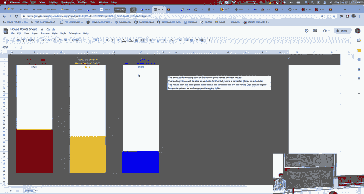
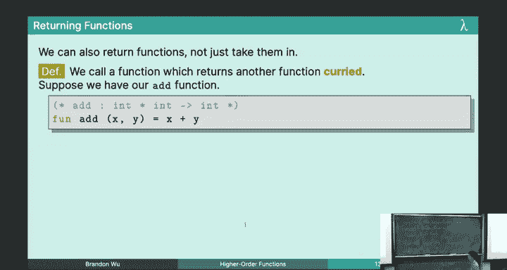
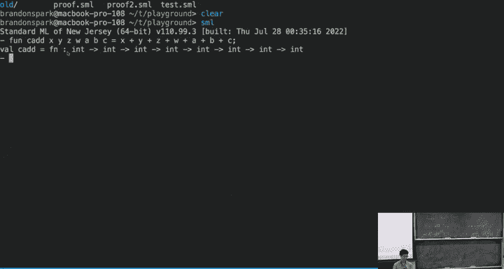
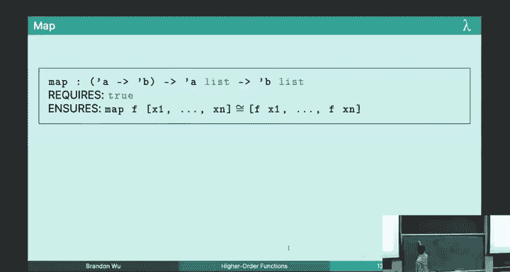
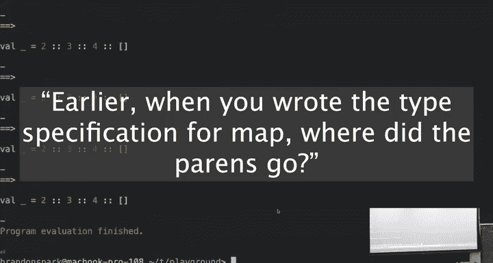
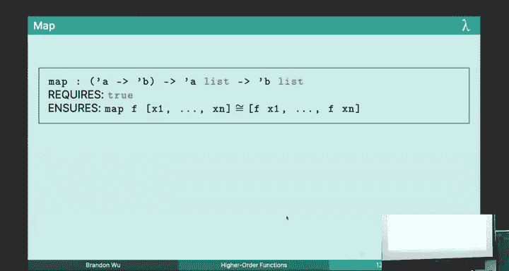
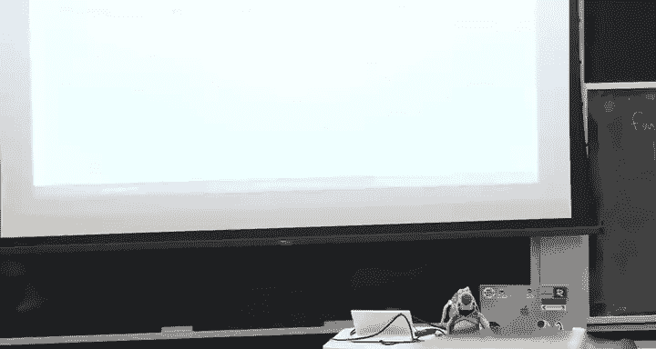
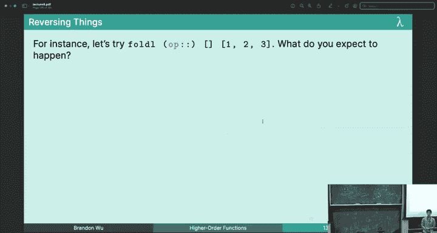

# 09：高阶函数



## 概述

在本节课中，我们将要学习高阶函数。高阶函数是函数式编程中一个非常核心且强大的概念，它允许我们将函数作为参数传递，或者将函数作为结果返回。通过高阶函数，我们可以抽象出代码中的通用模式，从而编写出更简洁、更灵活、更可复用的程序。

上一节我们介绍了参数多态性，它允许我们编写适用于多种类型的通用代码。本节中我们来看看高阶函数，它将这种通用性提升到了一个新的层次，允许我们不仅抽象类型，还能抽象行为本身。

## 高阶函数简介

我们之前编写的函数大多是“一阶”函数。它们接收普通的值（如整数、列表）作为参数，并返回一个普通的值。高阶函数则不同，它们可以接收函数作为参数，或者将函数作为返回值。

函数在SML中是一等公民，这意味着函数可以像任何其他值（如整数、字符串）一样被传递、存储和操作。高阶函数正是利用了这一特性。

一个典型的例子是我们之前见过的排序函数。它接收一个比较函数和一个列表作为参数。通过传入不同的比较函数，我们可以实现升序、降序、按模12排序等多种排序行为。这个排序函数既是多态的（适用于任何类型的列表），又是高阶的（接收一个函数作为参数），这种组合赋予了它强大的灵活性。

## 柯里化与部分应用



柯里化是一种将接收多个参数的函数转换为一系列接收单个参数的函数的技术。以加法函数为例，标准的加法函数类型是 `int * int -> int`。

我们可以定义一个柯里化版本的加法函数 `cadd`：
```sml
fun cadd x y = x + y
```
其类型为 `int -> int -> int`。这等价于：
```sml
fun cadd x = fn y => x + y
```
这意味着 `cadd` 接收一个整数 `x`，然后返回一个新的函数，这个新函数接收另一个整数 `y` 并返回 `x+y` 的结果。

柯里化带来的一个巨大好处是**部分应用**。我们可以只给函数提供部分参数，得到一个“部分应用”的新函数。

以下是使用 `cadd` 的几种等价方式：
```sml
cadd 2 3
(cadd 2) 3
val addTwo = cadd 2 (* 部分应用，得到一个将输入加2的新函数 *)
addTwo 3
```
通过柯里化和部分应用，我们可以轻松地基于通用函数（如排序函数）创建特定用途的新函数，而无需显式地为每个新函数编写代码。



## 高阶函数动物园

现在，让我们探索几个极其常用且强大的高阶函数，它们构成了函数式编程的“标准工具箱”。掌握它们能极大地提升你的编程效率。

### Map：列表转换器

`map` 函数用于将一个函数应用到列表中的每个元素上，并返回一个包含结果的新列表。这是一种非常常见的模式。



**类型签名**：`(‘a -> ‘b) -> ‘a list -> ‘b list`

**实现**：
```sml
fun map f nil = nil
  | map f (x::xs) = (f x) :: (map f xs)
```







**使用示例**：
假设我们想将一个整数列表中的每个元素加1，或者将一个布尔列表中的每个元素取反。如果没有 `map`，我们需要分别编写 `increment_all` 和 `flip_all` 函数。但有了 `map`，我们可以这样做：
```sml
(* 递增列表所有元素 *)
val inc_list = map (fn x => x + 1) [1, 2, 3] (* 得到 [2,3,4] *)

(* 定义递增函数 *)
val increment_all = map (fn x => x + 1)

(* 翻转布尔列表所有元素 *)
val not_list = map (fn x => not x) [true, false, true] (* 得到 [false, true, false] *)
```
`map` 抽象了“对列表中每个元素进行某种变换”这一通用操作。

### Filter：列表过滤器

`filter` 函数用于从列表中筛选出满足特定条件（谓词）的元素。

**类型签名**：`(‘a -> bool) -> ‘a list -> ‘a list`

**实现**：
```sml
fun filter p nil = nil
  | filter p (x::xs) =
      if p x then x :: (filter p xs)
      else filter p xs
```

**使用示例**：
筛选出列表中的偶数。
```sml
fun is_even n = (n mod 2 = 0)
val keep_evens = filter is_even
val result = keep_evens [1, 2, 3, 4] (* 得到 [2,4] *)
```

### 函数组合

在数学中，函数组合写作 `(g ∘ f)(x) = g(f(x))`。在SML中，我们可以定义自己的组合运算符，使其代码更简洁。

**类型签名**：`(‘b -> ‘c) -> (‘a -> ‘b) -> (‘a -> ‘c)`

**实现**（SML中已内置为 `o` 运算符）：
```sml
fun compose g f = fn x => g (f x)
(* 等价于 infix o; fun g o f = fn x => g (f x) *)
```

**使用示例**：
之前我们为了定义 `is_odd` 函数，写了 `fn x => not (is_even x)`。使用组合运算符可以更优雅：
```sml
val is_odd = not o is_even
(* 然后可以用于filter *)
val keep_odds = filter is_odd
```
这避免了显式定义lambda表达式，让代码意图更清晰。

### Fold：列表折叠器

`fold`（或称为reduce、inject）是最高阶也最强大的列表操作之一。它接收一个二元函数、一个初始累加值和一个列表，通过将二元函数依次应用于累加值和列表的每个元素，最终“折叠”或“汇总”整个列表为一个单一的值。

这抽象了“遍历列表并不断更新某个状态（累加器）”的模式，是许多迭代和递归算法的本质。

**类型签名**：`(‘a * ‘b -> ‘b) -> ‘b -> ‘a list -> ‘b`

#### Foldl（从左折叠）

`foldl` 从左到右处理列表元素。

**实现**：
```sml
fun foldl f acc nil = acc
  | foldl f acc (x::xs) = foldl f (f (x, acc)) xs
```
**执行过程**：`foldl f acc [x1, x2, x3]` 等价于 `f(x3, f(x2, f(x1, acc)))`。注意，第一个处理的元素是 `x1`，但最终它被嵌套在最内层。

**使用示例**：求和。
```sml
fun sum lst = foldl (fn (x, acc) => x + acc) 0 lst
(* foldl (op +) 0 lst 是另一种写法 *)
(* 计算 sum [1,2,3] 的过程：
   foldl + 0 [1,2,3]
-> foldl + (1+0) [2,3]
-> foldl + (2+1) [3]
-> foldl + (3+3) []
-> 6
*)
```

#### Foldr（从右折叠）

`foldr` 从右到左处理列表元素。

**实现**：
```sml
fun foldr f acc nil = acc
  | foldr f acc (x::xs) = f (x, foldr f acc xs)
```
**执行过程**：`foldr f acc [x1, x2, x3]` 等价于 `f(x1, f(x2, f(x3, acc)))`。第一个处理的元素是 `x3`（最右边的）。

**使用示例**：使用 `foldr` 和 `::` 可以方便地重建列表（而 `foldl` 和 `::` 则会得到反转的列表）。
```sml
(* 使用foldr重建列表，相当于什么都没做 *)
val identity_list = foldr (fn (x, acc) => x :: acc) nil [1,2,3] (* 得到 [1,2,3] *)

(* 使用foldl重建列表，会得到反转列表 *)
val reverse_list = foldl (fn (x, acc) => x :: acc) nil [1,2,3] (* 得到 [3,2,1] *)
```
`foldr` 的递归结构通常更符合我们对列表的直观递归定义（先处理尾部，再处理头部）。

## 总结

本节课中我们一起学习了高阶函数这一函数式编程的核心支柱。

我们首先理解了高阶函数的概念，即可以操作其他函数的函数。接着，我们探讨了柯里化和部分应用，它们让我们能够轻松地创建函数工厂和特化函数。

然后，我们深入研究了几个关键的高阶函数：
*   **`map`**：用于转换列表中的每个元素。
*   **`filter`**：用于根据条件筛选列表元素。
*   **函数组合 (`o`)**：用于将多个函数串联成一个新函数，使代码更简洁。
*   **`foldl`/`foldr`**：用于将整个列表汇总（折叠）为单个值，是迭代和递归的通用抽象。



这些高阶函数不仅仅是工具，它们代表了一种编程范式：通过组合小型、纯粹、可复用的函数来构建复杂的行为。掌握它们，你就能以更声明式、更优雅的方式思考和编写代码，这正是函数式编程的魅力所在。在接下来的课程中，我们将看到这些概念在更复杂场景下的应用。