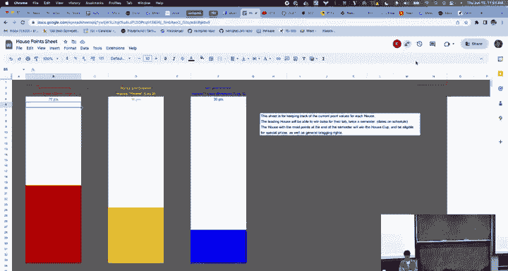
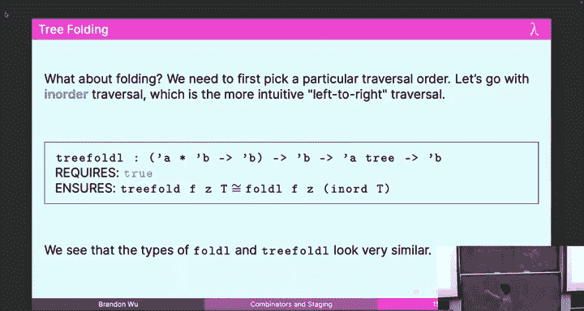
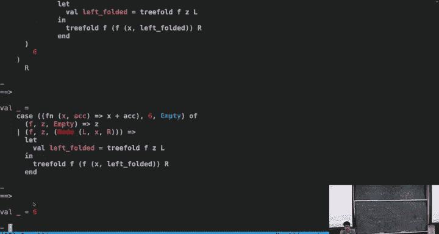

# 10：组合子与分阶段



在本节课中，我们将要学习**分阶段**的概念，这是柯里化的一个重要推论。我们还将探讨如何分析高阶函数的成本，以及如何将高阶函数（如 `map` 和 `fold`）应用于树结构，从而简化我们的编程。最后，我们会看到如何使用高阶函数（如管道操作符和 `bind`）来编写更清晰、更易读的代码。

---

## 分阶段：优化计算时机

上一节我们介绍了高阶函数和柯里化的概念。本节中，我们来看看一个重要的优化技术：**分阶段**。

分阶段的核心思想是：如果某个计算不依赖于后续的参数，那么就不应该等待这些参数，而应该提前进行计算。这就像在建造展台时，你不需要等待朋友把所有木板都刷完漆，就可以先把那些不需要刷漆的木板运到现场。

考虑以下函数：
```sml
fun mystery x y = (horrible_computation x) + y
```
假设 `horrible_computation` 需要运行三年。如果我们多次调用 `mystery`，例如 `mystery 2 4`、`mystery 1 2`、`mystery 2 5`，那么 `horrible_computation 2` 会被计算两次，总共需要九年。

然而，`horrible_computation` 的结果只依赖于 `x`，与 `y` 无关。因此，我们可以将计算**分阶段**，提前计算不依赖于 `y` 的部分：
```sml
fun mystery_staged x =
    let val z = horrible_computation x
    in fn y => z + y
    end
```
现在，我们可以先计算 `val f = mystery_staged 2` 和 `val g = mystery_staged 1`，然后再分别应用 `f 4`、`g 2` 和 `f 5`。这样，`horrible_computation 2` 只计算了一次，总时间缩短为六年。

**关键点**：通过识别计算之间的数据依赖关系，并将不依赖于后续参数的计算提前，我们可以显著提升性能。源代码应该清晰地反映计算的时机。

---

## 高阶函数的成本分析

在分析高阶函数（如 `map`）的成本时，我们需要特别小心，因为传入的函数 `f` 本身的成本是未知的。

以 `map` 函数为例：
```sml
fun map f nil = nil
  | map f (x::xs) = (f x) :: (map f xs)
```
其工作量递归式可以表示为：
**W_map(f)(n) = W_f + C + W_map(f)(n-1)**
其中 `W_f` 是函数 `f` 在单个元素上的工作量。

最终，我们得到 **W_map(f)(n) = O(n) * W_f**。更准确的说法是：`map` 会对列表中的每个元素调用一次 `f`，因此总共进行 **O(n)** 次 `f` 的调用。`f` 本身的成本需要单独考虑。

---

## 树上的高阶函数

我们已经学会了在列表上使用 `map` 和 `fold`。本节中，我们来看看如何将它们应用到二叉树上。

首先，定义多态二叉树类型：
```sml
datatype 'a tree = Empty | Node of 'a tree * 'a * 'a tree
```

### 树的映射



`treeMap` 函数将函数 `f` 应用到树的每个节点上：
```sml
fun treeMap f Empty = Empty
  | treeMap f (Node(l, x, r)) = Node(treeMap f l, f x, treeMap f r)
```
其类型签名为：`('a -> 'b) -> 'a tree -> 'b tree`。它的工作原理与列表的 `map` 类似，只是递归地应用于左右子树。

### 树的折叠

`treeFoldL` 函数以中序遍历的顺序折叠树：
```sml
fun treeFoldL f acc Empty = acc
  | treeFoldL f acc (Node(l, x, r)) =
    let
        val leftAcc = treeFoldL f acc l
        val rootAcc = f (x, leftAcc)
    in
        treeFoldL f rootAcc r
    end
```
其类型签名为：`('a * 'b -> 'b) -> 'b -> 'a tree -> 'b`。它首先递归地折叠左子树，然后将当前节点值 `x` 和累积结果 `leftAcc` 通过函数 `f` 结合，最后递归地折叠右子树。

### 树的搜索



我们可以编写一个通用的树搜索函数，它接受一个谓词函数 `p`，并返回树中第一个（按中序遍历）满足该谓词的元素：
```sml
fun search p Empty = NONE
  | search p (Node(l, x, r)) =
    case search p l of
        SOME v => SOME v
      | NONE => if p x then SOME x else search p r
```
其类型签名为：`('a -> bool) -> 'a tree -> 'a option`。它体现了高阶函数的强大之处：我们可以编写与具体谓词逻辑无关的通用搜索框架。

---

## 使用高阶函数提升代码可读性

高阶函数不仅能捕获通用模式，还能极大地提升代码的可读性。

### 管道操作符

考虑一系列的函数调用：`foo (bar (baz (qux x)))`。这种嵌套的写法是从右向左阅读的，不直观。

我们可以定义一个**管道操作符** `|>`：
```sml
infix |>
fun x |> f = f x
```
现在，我们可以将上面的调用改写为：
```sml
x |> qux |> baz |> bar |> foo
```
这就像一份食谱清单，从左到右清晰地展示了操作步骤：先做 `qux`，然后 `baz`，接着 `bar`，最后 `foo`。代码的意图一目了然。

### 处理可能失败的操作：Bind 组合子

在实际编程中，许多操作可能失败（例如，读取不存在的文件）。这些操作通常返回 `option` 类型。连续调用这些函数会导致大量的模式匹配，代码变得冗长且难以阅读。

以下是处理一系列可能失败操作的“丑陋”写法：
```sml
fun findStudentGrade (student, assign) file =
    case readFile file of
        NONE => NONE
      | SOME contents =>
          case parseGrades contents of
              NONE => NONE
            | SOME grades =>
                case lookup (student, assign) grades of
                    NONE => NONE
                  | SOME grade => SOME grade
```
我们可以定义一个 `bind` 函数来抽象这种“成功则继续，失败则短路”的模式：
```sml
fun bind opt f =
    case opt of
        NONE => NONE
      | SOME x => f x
```
`bind` 的类型是 `'a option -> ('a -> 'b option) -> 'b option`。

利用 `bind`，我们可以将上面的函数重写得更清晰：
```sml
fun findStudentGrade‘ (student, assign) file =
    bind (readFile file) (fn contents =>
        bind (parseGrades contents) (fn grades =>
            lookup (student, assign) grades))
```
为了更接近管道风格，我们可以定义中缀运算符 `>>=`：
```sml
infix >>=
fun opt >>= f = bind opt f
```
最终，代码可以写成：
```sml
fun findStudentGrade‘’ (student, assign) file =
    readFile file >>= parseGrades >>= lookup (student, assign)
```
这种写法极大地提升了代码的简洁性和可读性，自动处理了错误传播。`bind` 是函数式编程中一个极其重要的组合子（通常与“单子”概念相关）。

---

## 总结

本节课中我们一起学习了：
1.  **分阶段**：通过调整计算与柯里化参数的相对位置来优化性能，将不依赖于后续参数的计算提前。
2.  **高阶函数的成本分析**：分析像 `map` 这样的函数时，需明确其进行了 **O(n)** 次传入函数 `f` 的调用。
3.  **树上的高阶函数**：将 `map` 和 `fold` 的概念推广到树数据结构，编写了 `treeMap`、`treeFoldL` 和通用搜索函数。
4.  **提升代码可读性**：
    *   使用**管道操作符** `|>` 将嵌套的函数调用转换为从左到右的线性序列，使代码流程更清晰。
    *   使用 **`bind` 组合子**（`>>=`）来优雅地处理一系列可能失败（`option` 类型）的操作，避免深层嵌套的模式匹配，实现清晰的错误传播。


高阶函数的核心威力在于“用代码编写代码”，它允许我们构建高度抽象、可复用且表达力强的程序框架。掌握这些概念和工具，是成为优秀函数式程序员的关键一步。