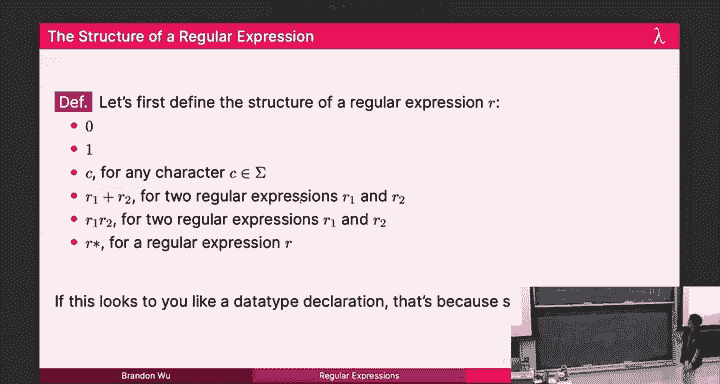

# 13：正则表达式 🧩

在本节课中，我们将要学习正则表达式。正则表达式是一种非常酷的工具，在理论和实践中都有广泛的应用。我们将看到，正则表达式是函数式编程的一个很好的用例，也是计算机科学中一个非常重要的概念。这可能是你学到的最实用的东西之一。

## 文本验证问题

首先，我们来谈谈文本验证问题。其核心思想是验证用户输入。这在实际应用中非常常见：当你从用户那里读取输入时，你需要确保它是安全的，因为恶意输入可能会被存入数据库并执行，从而导致系统崩溃。因此，我们需要阻止这种情况发生。

具体来说，假设我们想要验证电子邮件地址。一个电子邮件地址的结构通常如下：`用户名@网站域名.扩展名`。例如：`name@website.com`。

我们希望创建一个名为 `validate_email` 的函数，它接收一个字符串，并判断其是否符合电子邮件地址的规范。这取决于几个因素：我们需要知道什么是有效的用户名、网站域名和扩展名。

为了简化，我们假设扩展名只能是 `.org` 或 `.com`。此外，假设网站域名只能包含字母和数字（即字母数字字符）。而用户名除了字母数字字符外，还可以包含下划线（`_`）和点（`.`）。

## 手动实现验证器

为了完全实现这个函数，我们将定义一些“消费函数”。消费函数的思想是：给定一个字符串（例如我的工作邮箱），我将其转换为字符列表，然后“消费”掉符合我验证规则的部分。

例如，如果我要消费用户名，用户名可以是任意字母数字字符序列，所以我将消费掉 `bradon` 这些字符，直到遇到 `@` 符号，此时我会停止，因为 `@` 不属于用户名。

我们将定义两个函数：`consume_name` 和 `consume_website`。`consume_name` 会评估字符列表，消费掉所有属于用户名的前缀字符（字母、数字、下划线、点），直到遇到不属于这些的字符（如 `@`）。`consume_website` 类似，但只消费字母数字字符。

以下是 `consume_name` 的实现思路（伪代码）：
```sml
fun consume_name cs =
    case cs of
        [] => []
      | c::cs' => if isAlphanumeric(c) then c :: consume_name(cs')
                  else if c = #"." orelse c = #"_" then c :: consume_name(cs')
                  else []
```
`consume_website` 的实现类似，但只允许字母数字字符。

最后，我们编写 `validate_email` 函数。首先，使用 `explode` 函数将字符串转换为字符列表。然后，尝试消费用户名部分。如果成功消费并剩下以 `@` 开头的列表，则消费掉 `@`。接着，尝试消费网站域名部分。如果成功并剩下以 `.` 开头的列表，则检查接下来的部分是否是 `.org` 或 `.com`。如果所有步骤都成功，并且消费后列表为空，则返回 `true`，否则返回 `false`。

然而，这里有一个小问题：如果末尾有多余的字符（例如 `.comasdf`），我们的函数可能仍然会匹配成功，因为模式匹配可能忽略了末尾的垃圾字符。我们需要确保在消费完扩展名后，整个字符串也被完全消费（即剩余列表为空）。修复后，验证过程就完成了。




## 手动方法的局限性

这种手动编写的函数虽然可能有效，但存在几个问题：它冗长、容易出错（我们刚才就发现了一个bug），并且难以维护。如果我们还需要验证其他模式（如电话号码），就需要为每一种模式编写类似的、繁琐且容易出错的函数。

我们的理念是：代码越多，问题越多。因此，我们希望自动化这个过程。

## 引入正则表达式

我们将创建一个函数，它接收某种类型的值，并为我们生成一个验证函数。我们将把验证问题的本质编码到一种类型的值中，这种类型称为**正则表达式**。

正则表达式是描述字符串模式的一种强大方式。它由一些基本构件通过组合规则构成，能够简洁地表示复杂的字符串集合（称为“语言”）。

### 正则表达式的构成

正则表达式 `R` 可以是以下六种形式之一：
1.  **0**：匹配空语言（不匹配任何字符串）。
2.  **1**：匹配只包含空字符串 `ε` 的语言。
3.  **字符 c**：匹配只包含单个字符 `c` 的语言。
4.  **R1 + R2**：匹配属于 `R1` 的语言 **或** 属于 `R2` 的语言的字符串（并集）。
5.  **R1 R2**：匹配一个字符串，该字符串可以拆分为两部分：前缀匹配 `R1`，后缀匹配 `R2`（连接）。
6.  **R***：匹配将 `R` 匹配的字符串重复零次或多次连接起来得到的任何字符串（克林闭包）。

这是一个递归定义，因为 `R1` 和 `R2` 本身也是正则表达式。

### 示例

假设我们的字母表只包含 `{a, b}`。
*   `a + b` 匹配字符串 `"a"` 或 `"b"`。
*   `(a + b) b` 匹配 `"ab"` 或 `"bb"`。
*   `a*` 匹配空字符串、`"a"`、`"aa"`、`"aaa"`……即任意数量的 `a`。
*   `(ab)*` 匹配空字符串、`"ab"`、`"abab"`、`"ababab"`……即偶数长度的、由 `"ab"` 重复组成的字符串。
*   `a b*` 匹配以单个 `a` 开头，后面跟着零个或多个 `b` 的字符串，如 `"a"`、`"ab"`、`"abb"` 等。

现在，我们可以用正则表达式来简洁地描述之前的电子邮件模式。假设 `AN` 是匹配任意字母数字字符的正则表达式（`a + b + ... + z + 0 + 1 + ... + 9`），那么电子邮件地址的正则表达式可以写为：
`(AN + . + _)* @ (AN)* . (org + com)`
这表示：零个或多个（字母数字、点或下划线），后跟 `@`，后跟零个或多个字母数字，后跟点，后跟 `org` 或 `com`。

## 在 SML 中实现正则表达式匹配器

理论是美好的，但我们需要在代码中实现它。我们将定义一个 SML 数据类型来表示正则表达式，并编写一个函数来匹配字符串。

### 数据类型定义

```sml
datatype regexp =
    Zero
  | One
  | Char of char
  | Plus of regexp * regexp
  | Times of regexp * regexp
  | Star of regexp
```

### 匹配函数的设计

我们将实现一个函数 `match : regexp -> char list -> (char list -> bool) -> bool`。这个函数接收一个正则表达式 `R`、一个字符列表 `cs` 和一个**续延** `k`。它的语义是：`match R cs k` 返回 `true` **当且仅当** 我们可以将输入列表 `cs` 拆分为一个前缀 `p` 和一个后缀 `s`（即 `cs = p @ s`），使得：
1.  前缀 `p` 属于正则表达式 `R` 所描述的语言。
2.  续延 `k` 应用于后缀 `s` 时返回 `true`（即 `k(s)` 为真）。

续延 `k` 代表了对剩余后缀的验证条件。通过精心设计续延，我们可以实现各种匹配目标。例如，要检查整个字符串是否完全匹配 `R`，我们可以将续延设为 `null` 函数（检查列表是否为空），这样后缀就必须为空列表。

### 匹配函数的实现

以下是 `match` 函数针对不同正则表达式形式的实现：

1.  **`Zero`**：没有字符串匹配 `Zero`，所以无法找到任何有效的前缀。直接返回 `false`。
    ```sml
    fun match Zero cs k = false
    ```

2.  **`One`**：只匹配空字符串。因此，有效的前缀只能是空列表。我们检查续延 `k` 是否对整个原始输入 `cs`（此时作为后缀）返回 `true`。
    ```sml
    fun match One cs k = k cs
    ```

3.  **`Char c`**：只匹配单个字符 `c`。因此，我们需要检查输入列表的第一个字符是否是 `c`。
    *   如果列表为空，失败。
    *   如果列表头是 `c`，则消费掉它，并将剩余列表传给续延 `k`。
    *   否则，失败。
    ```sml
    fun match (Char c) cs k =
        case cs of
            [] => false
          | c'::cs' => (c = c') andalso k cs'
    ```

4.  **`Plus (r1, r2)`**：匹配 `r1` 或 `r2`。因此，我们尝试用 `r1` 去匹配，如果失败，再尝试用 `r2` 去匹配。
    ```sml
    fun match (Plus (r1, r2)) cs k =
        match r1 cs k orelse match r2 cs k
    ```

5.  **`Times (r1, r2)`**：匹配 `r1` 后跟 `r2`。我们需要找到一个前缀匹配 `r1`，然后对剩余部分，再找到一个前缀匹配 `r2`，并且最终剩余部分满足续延 `k`。
    这可以通过嵌套调用 `match` 来实现：先用 `r1` 匹配，其续延是“用 `r2` 匹配剩余部分，并且最终结果满足 `k`”。
    ```sml
    fun match (Times (r1, r2)) cs k =
        match r1 cs (fn cs' => match r2 cs' k)
    ```

6.  **`Star r`**：匹配零次或多次 `r`。这可以递归地定义为：要么匹配零次（即前缀为空，直接满足续延 `k`），要么匹配一次 `r`，然后继续匹配 `Star r`。
    但是，直接这样写会导致无限递归（如果 `r` 可以匹配空字符串，我们会不断选择匹配零次而无法前进）。为了解决这个问题，我们要求当选择匹配一次 `r` 时，消费的前缀不能为空（即剩余列表必须发生变化）。
    ```sml
    fun match (Star r) cs k =
        k cs orelse
        (match r cs (fn cs' => not (cs = cs') andalso match (Star r) cs' k))
    ```

最后，我们可以定义 `accept` 函数来检查整个字符串是否完全匹配正则表达式：
```sml
fun accept r s = match r (explode s) null
```
这里 `null` 是检查列表是否为空的函数，作为续延，它确保了在正则表达式匹配之后没有剩余字符。

## 正确性证明（概述）

我们可以证明 `match` 函数的实现是正确的。证明通常分为两部分：
*   **可靠性**：如果 `match R cs k` 返回 `true`，那么一定存在一种将 `cs` 拆分为前缀 `p` 和后缀 `s` 的方式，使得 `p` 在 `R` 的语言中，且 `k(s)` 为 `true`。
*   **完备性**：如果存在一种拆分 `cs = p @ s`，使得 `p` 在 `R` 的语言中且 `k(s)` 为 `true`，那么 `match R cs k` 一定返回 `true`。

证明通过对正则表达式 `R` 的结构进行归纳来完成。例如，对于 `Plus (r1, r2)` 的情况：
*   **可靠性**：假设 `match (Plus (r1, r2)) cs k` 为真。根据代码，这意味着 `match r1 cs k` 或 `match r2 cs k` 为真。不失一般性，假设 `match r1 cs k` 为真。根据归纳假设（对 `r1` 可靠），存在拆分 `cs = p @ s` 满足 `p` 在 `r1` 的语言中且 `k(s)` 为真。由于 `p` 在 `r1` 的语言中，根据 `Plus` 的语义，它也在 `Plus(r1, r2)` 的语言中。因此，拆分 `(p, s)` 也满足 `Plus` 的情况。
*   **完备性**：假设存在拆分 `cs = p @ s`，使得 `p` 在 `Plus(r1, r2)` 的语言中且 `k(s)` 为真。根据 `Plus` 的语义，`p` 或在 `r1` 的语言中，或在 `r2` 的语言中。假设 `p` 在 `r1` 的语言中。那么根据归纳假设（对 `r1` 完备），`match r1 cs k` 为真。根据 `match` 对 `Plus` 的实现，`match (Plus (r1, r2)) cs k` 也为真。

其他情况的证明思路类似，但可能更复杂（尤其是 `Times` 和 `Star`）。

## 总结

本节课中我们一起学习了正则表达式。我们从文本验证的具体问题出发，看到了手动实现验证器的繁琐和易错性。为了寻求更优雅、通用的解决方案，我们引入了正则表达式的概念。

我们首先从数学上定义了正则表达式，它由基本构件（空集、空串、单个字符）通过三种操作（并、连接、克林闭包）递归构成，能够描述许多有用的字符串模式。

接着，我们在 SML 中实现了正则表达式的数据类型和一个强大的 `match` 函数。这个函数利用续延来优雅地处理复杂的匹配逻辑，特别是对于连接和闭包操作。我们还讨论了如何避免在实现 `Star` 时可能出现的无限递归问题。

最后，我们概述了如何证明这个匹配器的正确性，这体现了将理论思考转化为可靠实践的过程。


正则表达式是理论计算机科学（形式语言与自动机）和实际编程（文本处理、数据验证）的完美结合点。理解其背后的原理，不仅能帮助你更有效地使用它们，也展示了函数式编程和递归思想在解决复杂问题时的强大能力。