# 14：结构与签名 🧱

在本节课中，我们将学习SML中模块系统的核心概念：**结构**与**签名**。我们将了解如何通过模块来组织代码、隐藏实现细节，并建立清晰的接口契约。这对于编写可维护、可协作的大型软件至关重要。

---

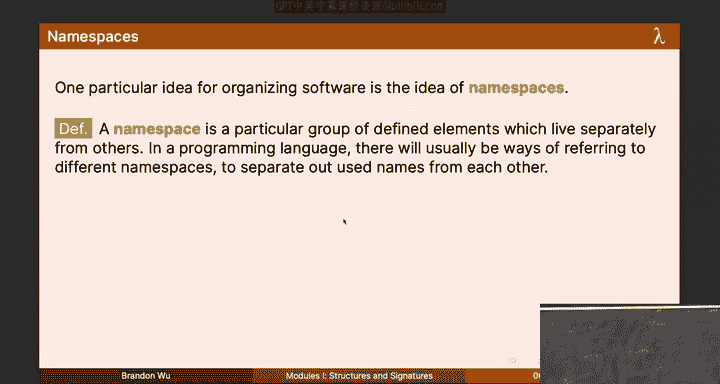

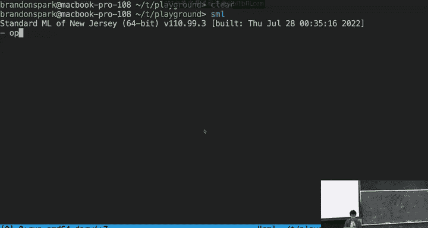

## 1. 模块与命名空间

到目前为止，我们已经学习了函数、数据类型和异常等语言特性，它们帮助我们解决“如何编写函数”这类问题。然而，软件不仅仅是写出来的，更是为了被阅读、使用和文档化。今天我们要讨论的是如何将**软件协作**的过程融入语言本身。

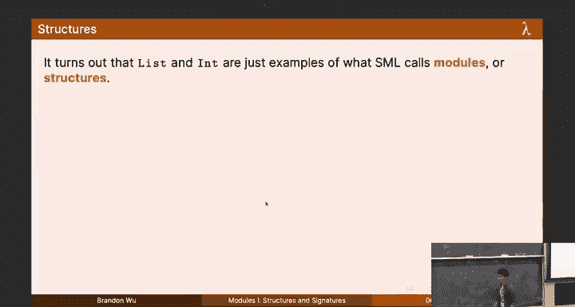

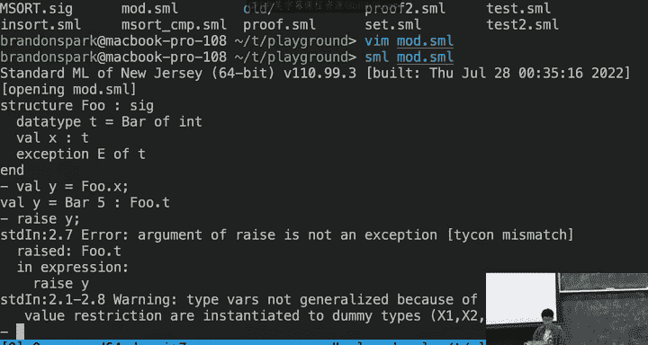

一个强大的工具就是**命名空间**。我们之前使用过的 `List`、`String` 等库就是模块，同时也是命名空间。例如，`List.compare` 和 `String.compare` 是两个不同的函数，因为它们位于不同的命名空间中，所以不会相互冲突。

**结构**（Structure）允许我们创建自己的命名空间。以下是一个简单的结构示例：

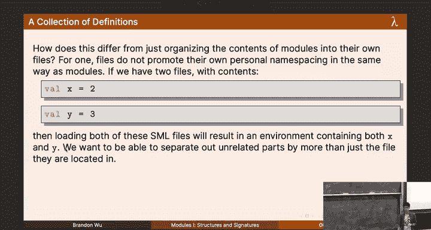

```sml
structure P =
struct
  datatype t = Bar of int
  val x = Bar 5
  exception E of t
end
```

在这个结构中，我们定义了一个数据类型 `t`、一个值 `x` 和一个异常 `E`。要访问结构内的内容，需要使用前缀，例如 `P.x` 或 `P.E`。这有效地将相关代码组织在一起，避免了顶层命名空间的混乱。

---

## 2. 签名：定义接口

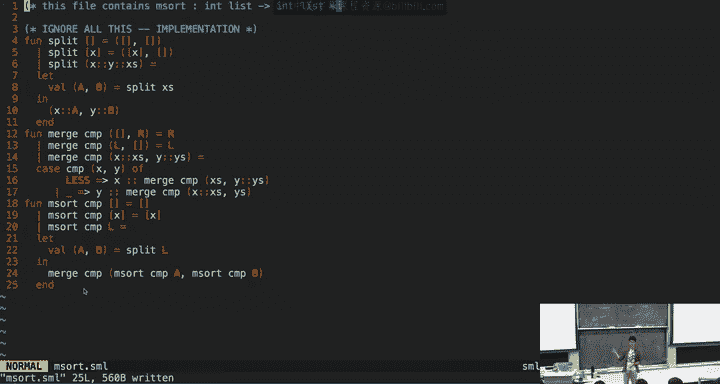

仅仅将代码打包进结构还不够。我们常常希望只向用户暴露必要的部分，而隐藏内部的辅助函数和实现细节。这就是**签名**（Signature）的作用。

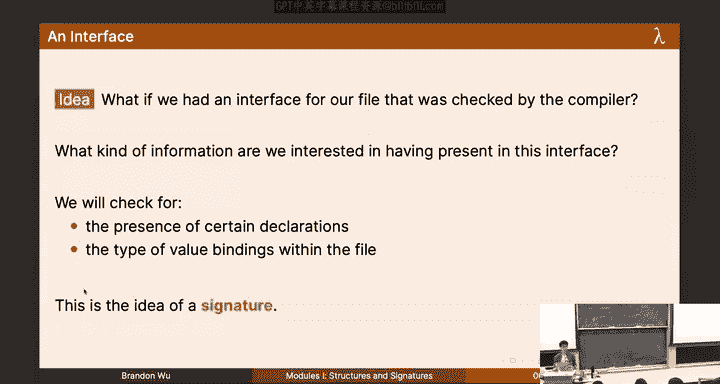

签名定义了模块的**接口**，它列出了模块对外可见的组件及其类型，就像一个由编译器检查的“合同”。

考虑我们之前实现的归并排序函数 `msort`。文件中可能还包含 `split` 和 `merge` 等辅助函数。作为库的用户，我们只关心 `msort` 本身。我们可以通过签名来达成这个目的。

首先，我们定义一个签名：

```sml
signature SORT =
sig
  val sort : ('a * 'a -> order) -> 'a list -> 'a list
end
```

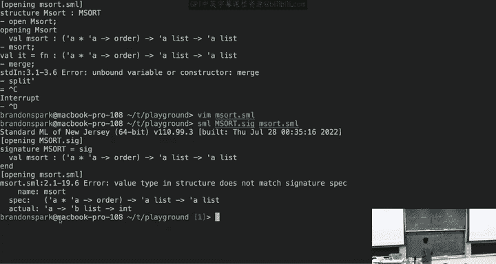

这个签名声明了一个名为 `sort` 的函数，其类型是通用的比较排序函数类型。

接着，我们创建一个结构来实现这个签名，并使用 `:>` 进行**不透明归属**：

```sml
structure MergeSort :> SORT =
struct
  (* split, merge 等辅助函数的实现在这里 *)
  fun sort cmp lst = ... (* 归并排序的实现 *)
end
```

现在，当我们打开 `MergeSort` 模块时，只能看到 `sort` 函数，而 `split` 和 `merge` 被完全隐藏了。编译器会确保结构体的实现符合签名的规定。

使用签名的好处：
1.  **隐藏声明**：只暴露用户需要关心的部分，减少认知负担。
2.  **指定类型**：为函数提供明确的类型契约，如果实现被错误地修改，编译器会报错。

---

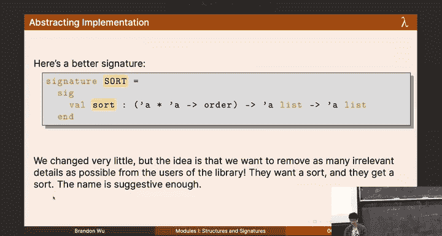

## 3. 抽象与信息隐藏

抽象是软件工程的核心。我们不应该总是关注代码底层的具体实现（比如函数在硬件层面是指针），而应该用更高层次、更符合人类思维的概念来思考。

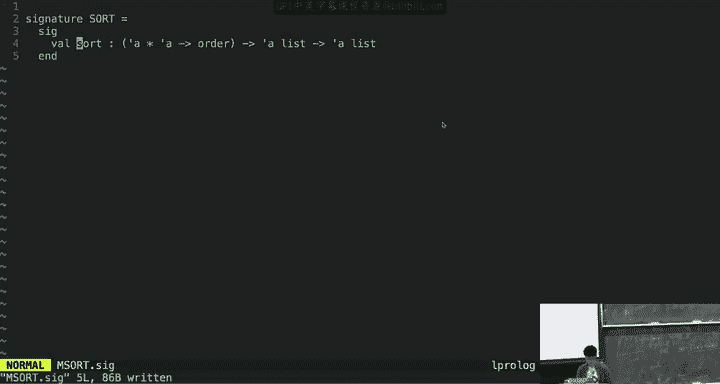

签名帮助我们实现了这种抽象。例如，`SORT` 签名只告诉我们有一个排序函数，而不关心它是归并排序、快速排序还是插入排序。只要它行为正确且高效，具体实现对我们就是不可见的。

这种隐藏内部信息的能力被称为**信息隐藏**。它使我们能够：
*   减轻概念负担。
*   防止自己或他人破坏代码内部的不变量。
*   便于后续重构（只要接口不变，内部实现可以任意更改）。

---

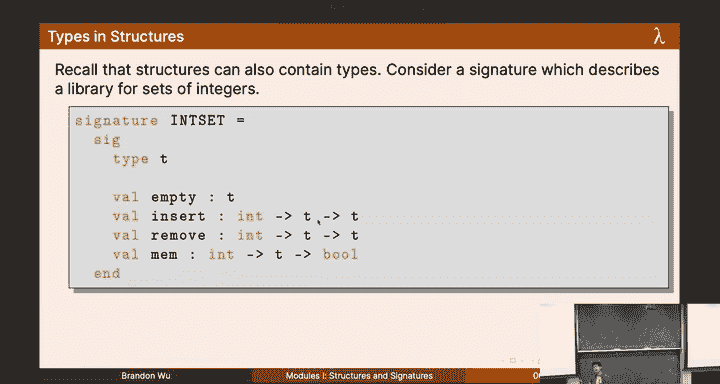

## 4. 抽象类型与不透明归属

结构不仅可以包含值和函数，还可以包含类型。当我们希望完全隐藏一个数据类型的内部表示时，就需要用到**抽象类型**。

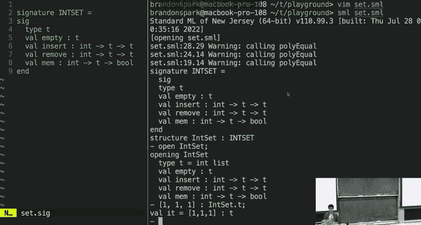

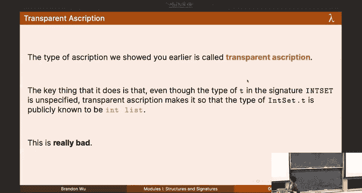

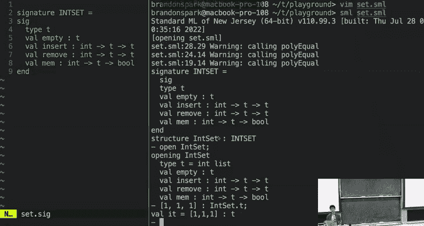

让我们以整数集合（Set）库为例。我们首先定义一个签名：

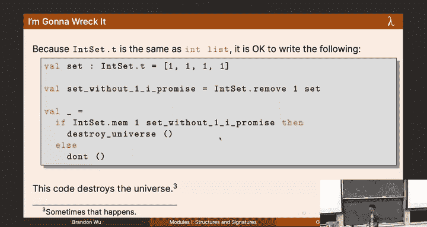

```sml
signature INSET =
sig
  type t
  val empty : t
  val insert : int * t -> t
  val remove : int * t -> t
  val member : int * t -> bool
end
```

注意，签名中的 `type t` 没有给出具体定义，它只是一个**类型规范**。

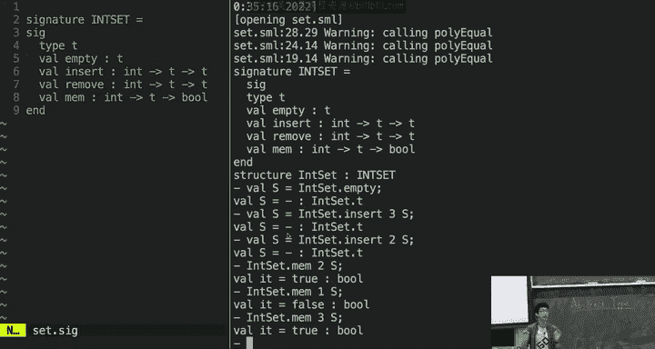

现在，我们可以用整数列表来实现这个集合：

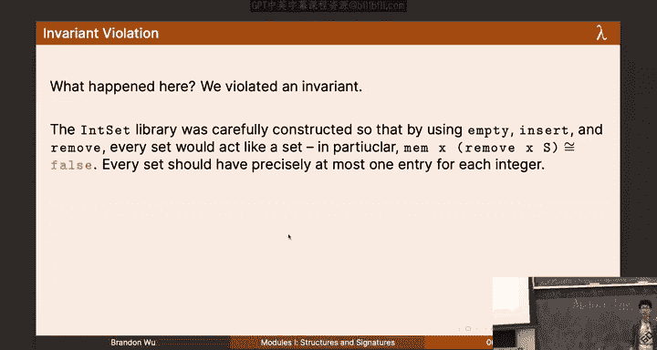

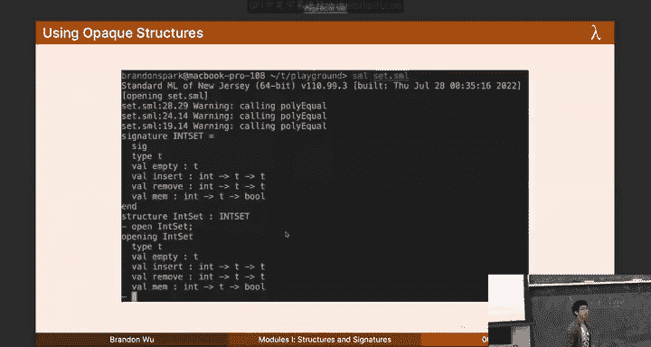

```sml
structure InSetList :> INSET =
struct
  type t = int list
  val empty = []
  fun insert (x, xs) = ... (* 确保不重复插入 *)
  fun remove (x, xs) = ...
  fun member (x, xs) = ...
end
```

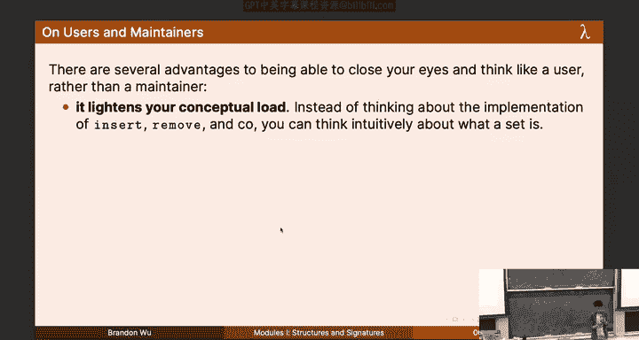

关键点在于我们使用了不透明归属 `:>`。这意味着对于 `InSetList` 的用户来说，`InSetList.t` 是一个完全抽象的类型。用户无法知道它实际上是 `int list`，也无法直接构造一个 `int list` 值并将其当作 `InSetList.t` 来使用。

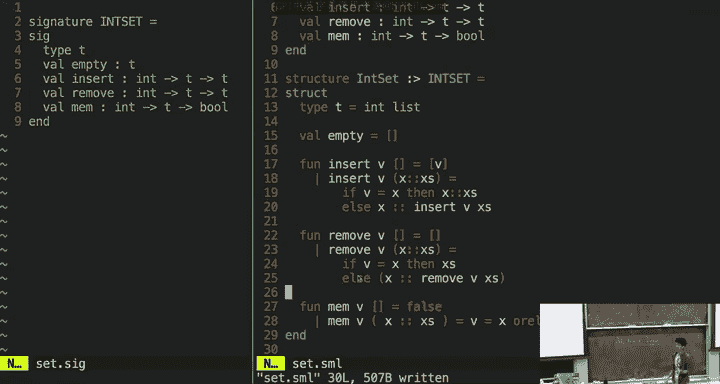

**为什么这很重要？**
假设集合的内部不变量是“列表元素不重复”。如果用户能直接操作底层列表，他们完全可以创建一个 `[1,1,1]` 这样的值并当作集合使用，从而破坏不变量。通过不透明归属，用户**只能**通过 `empty`、`insert`、`remove` 等接口函数来创建和操作集合，从而保证了不变量的始终维持。

---

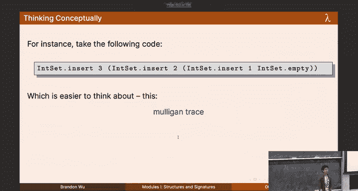

## 5. 表示独立性

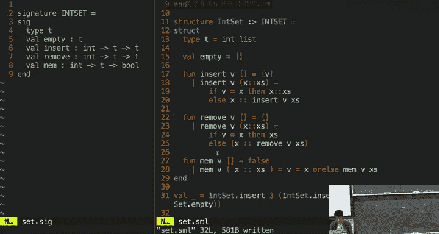

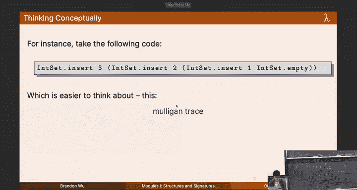

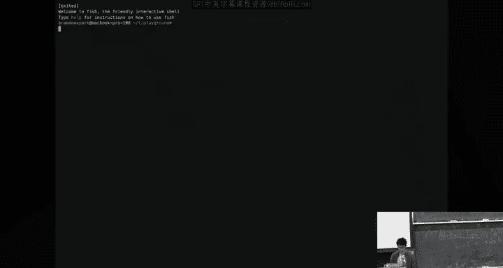

表示独立性是抽象类型带来的一个强大理念。它指的是我们可以**独立于具体的数据表示方式来思考和推理代码**。

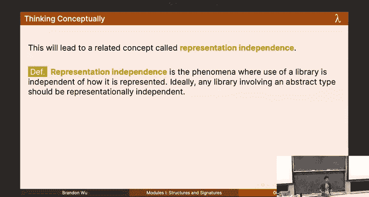

对于我们的集合库，用户应该思考的是数学意义上的集合（包含哪些元素），而不是底层的列表或树。无论内部是用列表 `[1,2]`、`[2,1]` 还是二叉搜索树来实现“包含1和2的集合”，在用户看来，它们都是**行为等价**的，属于同一个“抽象值”。

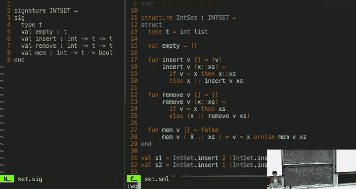

我们可以将每个具体的内部值（如不同的列表）划分到不同的**等价类**中，每个等价类对应一个抽象的数学概念（如集合{1,2}）。所有库的操作（`insert`, `member`等）都是在这些等价类之间进行转换。

**表示独立性的威力在于：**
我们可以证明两个不同的实现（例如用列表实现的 `InSetList` 和用树实现的 `InSetTree`）在行为上是完全等价的。我们可以定义一个关系 `R`，将两个实现中表示相同抽象集合的具体值关联起来。然后证明，所有操作都保持这个关系。这意味着，无论使用哪个实现，任何操作序列产生的外部可观察行为都是一致的。

这种证明是确保代码重构正确性的强大工具，也是本次课程作业中将会涉及的内容。

---

## 总结

本节课我们一起学习了SML模块系统的核心：
1.  **结构**：用于将相关代码组织到独立的命名空间中。
2.  **签名**：用于定义模块的对外接口，实现信息隐藏和契约检查。
3.  **抽象类型与不透明归属**：通过完全隐藏数据类型的内部表示，来强制维持代码不变量，并实现表示独立性。
4.  **表示独立性**：允许我们在更高的抽象层次（而非具体实现细节）上推理代码行为，这是构建可靠、可维护软件系统的关键思想。

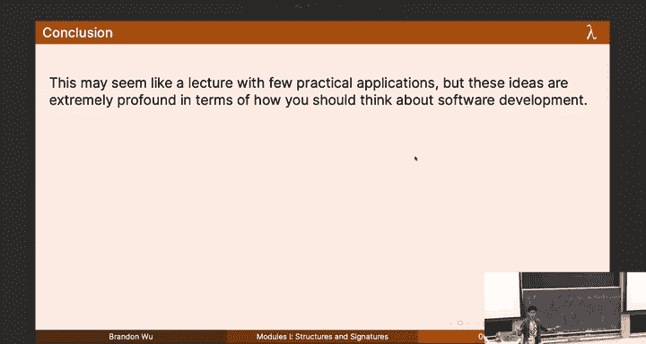

虽然这些概念在SML中学习，但其背后的软件工程原则——通过清晰的接口和封装来管理复杂度——是普适的，适用于任何编程语言和大型项目开发。