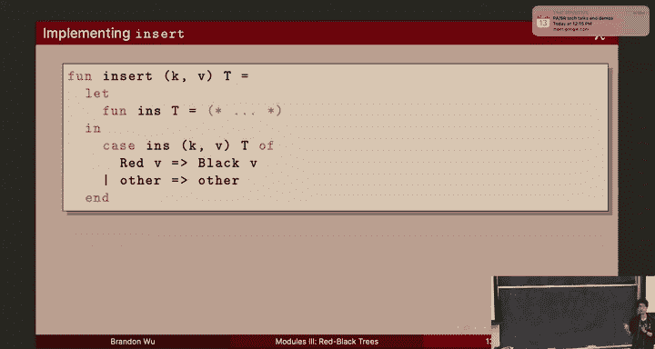
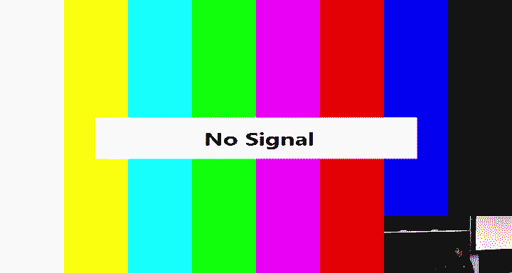
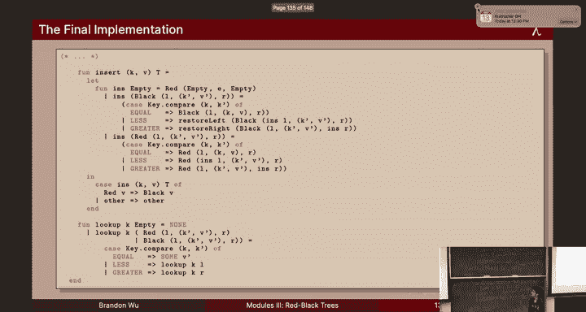

# 16：红黑树 🎄

在本节课中，我们将学习红黑树，这是一种自平衡二叉搜索树。我们将探讨其不变性、实现方式，并通过一个操作序列的最终追踪来加深理解。红黑树是模块抽象的一个绝佳应用案例，因为它允许我们隐藏内部实现细节，确保数据结构的不变性不被外部代码破坏。

---

## 红黑树简介

上一节我们讨论了泛型字典，它允许我们使用任意类型的键和数据。今天，我们将重点讨论红黑树，这是一种确保操作时间复杂度为对数级别的数据结构。

红黑树是一种特殊的二叉搜索树，其节点被标记为红色或黑色。它通过维护三个关键的不变性来保证树的平衡。

### 红黑树的定义

在 Standard ML 中，红黑树可以定义如下：
```sml
datatype color = Red | Black
datatype 'a tree = Empty
                 | Node of color * 'a tree * (key * 'value) * 'a tree
```
红黑树要么是空的，要么是一个节点。节点包含颜色（红或黑）、两个子树、一个键和一个值。

---

## 红黑树的不变性 🛡️

红黑树必须满足以下三个不变性，以确保其平衡性和操作效率。

1.  **二叉搜索树性质**：树必须是一个有效的二叉搜索树。这意味着对树进行中序遍历时，键值必须按非递减顺序排列。
2.  **红色节点约束**：任何红色节点的子节点必须是黑色的。不允许出现两个连续的红色节点（称为“红-红违规”）。
3.  **黑色高度一致**：从根节点到任何空节点的每条路径上，黑色节点的数量必须相同。这个数量称为树的“黑色高度”。

这些不变性共同保证了树的高度大致平衡，使得查找和插入操作在最坏情况下的时间复杂度为 **O(log n)**，其中 n 是树中节点的数量。

---

## 维护不变性：插入与再平衡 ⚖️

在红黑树中插入新节点时，我们可能会暂时破坏不变性，但会立即通过“再平衡”操作来恢复它们。我们的策略是：先破坏规则，再迅速修复。

### 插入步骤

插入操作遵循以下步骤：

1.  **按BST规则插入**：根据二叉搜索树的性质，新节点有唯一确定的位置。
2.  **将新节点着色为红色**：我们总是将新插入的节点初始化为红色。这是因为插入黑色节点会立即破坏“黑色高度一致”的不变性。
3.  **检查并修复违规**：如果新红色节点的父节点也是红色，则违反了“红色节点约束”。此时，我们需要通过“再平衡”操作来修复。

### 再平衡操作

再平衡的核心是处理局部出现的“红-红违规”。我们只关注违规节点及其父节点、祖父节点构成的“三元组”。通过旋转和重新着色，我们可以将这个局部子树转换为一个符合规则的形态。

一个标准的修复模式是将三元组重组为一个以中间节点为根、两个子节点为黑色的子树，并将根节点着色为红色。这个操作可能会将红色违规向上“推送”到树的更高层，但递归地进行此操作，最终违规会被推到根节点，此时只需将根节点重新着色为黑色即可。

---

## 在 Standard ML 中实现红黑树 💻

现在，我们来看看如何在 Standard ML 中具体实现红黑树的插入操作。我们将使用模块来封装实现细节，确保不变性。

### 辅助函数：`restoreLeft` 和 `restoreRight`

我们定义两个辅助函数来处理不同方向的“红-红违规”。`restoreLeft` 处理左子节点违规的情况，`restoreRight` 处理右子节点违规的情况。它们的核心是通过模式匹配识别特定的违规树形，并进行旋转和重新着色。

以下是 `restoreLeft` 函数处理一种情况的示例模式匹配：
```sml
fun restoreLeft (Node (Black, Node (Red, Node (Red, a, x, b), y, c), z, d)) =
      Node (Red, Node (Black, a, x, b), y, Node (Black, c, z, d))
  | restoreLeft t = t
```

### 递归插入函数 `ins`

`ins` 函数是递归插入的核心。它接收一个红黑树和一个键值对，返回一个可能暂时是“几乎红黑树”（ARBT）的树。ARBT 允许在根节点处存在一个“红-红违规”。

在 `ins` 中，我们根据比较结果递归地插入到左子树或右子树。插入后，如果当前节点是黑色节点且其子节点变成了ARBT（即可能引入违规），我们就调用 `restoreLeft` 或 `restoreRight` 进行修复。

### 最终插入函数 `insert`

`insert` 函数是对外的接口。它调用 `ins` 进行插入，然后检查返回树的根节点颜色。如果根节点是红色的，就将其重新着色为黑色，以确保最终树是一个完全合格的红黑树。

```sml
fun insert (t, k, v) =
    case ins (t, k, v) of
        Node (Red, l, (k', v'), r) => Node (Black, l, (k', v'), r)
      | t' => t'
```



### 查找函数 `lookup`

查找函数与普通二叉搜索树相同，通过比较键值递归地遍历左子树或右子树。

---

## 操作示例追踪 📝

让我们通过一个简单的插入序列来追踪红黑树的变化。假设我们向一个空树中依次插入键 0, 1, 2, 3。



1.  插入 0：树只有一个红色根节点（0）。
2.  插入 1：作为 0 的右子节点插入（红色）。此时没有违规。
3.  插入 2：作为 1 的右子节点插入（红色）。此时出现“红-红违规”（1 和 2）。触发 `restoreRight` 操作，进行旋转和重新着色，将 1 提升为根（黑色），0 和 2 作为其子节点（红色）。
4.  插入 3：作为 2 的右子节点插入（红色）。此时出现新的“红-红违规”（2 和 3）。再次触发修复操作。这个修复可能会将红色违规向上推送，最终在递归返回时，最外层的 `insert` 函数将根节点着色为黑色。

通过这一系列再平衡操作，树始终保持了大致平衡的状态。

---

## 总结 🎓



本节课我们一起学习了红黑树，这是一种高效的自平衡二叉搜索树。我们了解了其三个核心不变性：BST性质、红色节点约束和黑色高度一致。我们掌握了插入新节点的策略：先按BST规则插入并着为红色，再通过局部旋转和重新着色来修复可能出现的“红-红违规”。最后，我们看到了如何在 Standard ML 中利用模块化和模式匹配来实现红黑树，确保其复杂的不变性在抽象屏障后得到维护。红黑树是平衡树算法的一个经典范例，也是函数式编程中数据抽象能力的完美体现。