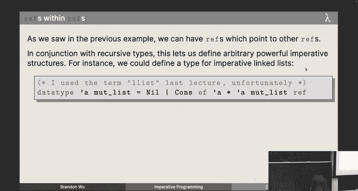
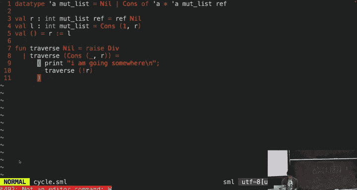
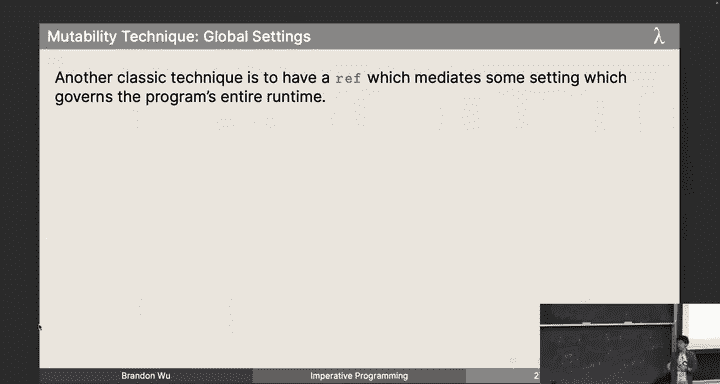
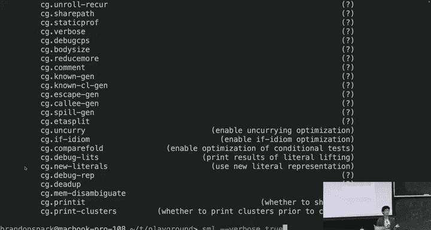
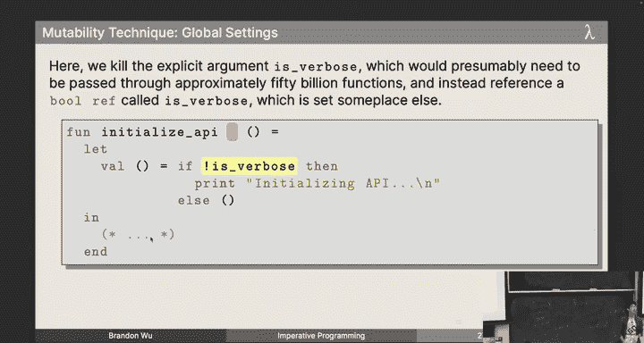

# 19：命令式编程 🚨

在本节课中，我们将要学习命令式编程的核心概念——可变性。我们将探讨如何在标准ML中通过引用单元（ref cells）来引入可变状态，了解其基本操作，并学习如何安全、有节制地使用它。虽然可变性会破坏纯函数式的优雅特性，但在某些场景下，它是与真实世界交互的必要工具。

---

## 可变性：一把双刃剑

到目前为止，我们一直在使用纯函数式代码，即给定相同输入总是返回相同输出的代码。这带来了可预测的行为。然而，可变性确实存在于标准ML中，它会破坏我们之前建立的许多美好特性。

例如，在存在异常的情况下，加法运算不再满足交换律。考虑表达式 `raise Div + raise Bind`，如果我们交换两个加数的顺序，先被引发的异常会不同，导致程序行为不同。这破坏了纯函数式的核心假设。

另一个例子是打印函数 `print : string -> unit`。从类型上看，对于任何字符串 `s`，`print s` 都返回 `unit`。然而，如果我们尝试用 `print "hi"` 替换程序中所有的 `unit`，程序的行为将发生巨大变化，因为它会产生大量额外的输出。这表明，一旦引入副作用，外延等价（extensional equivalence）的概念就需要重新审视。

我们无法完全摆脱副作用，因为计算机需要与现实世界交互。关键在于如何安全地使用它们，避免“搬起石头砸自己的脚”（footguns）。

我们的策略不是完全禁止可变性，而是让它成为“可选加入”（opt-in）的特性。这与C语言等默认可变性的语言形成鲜明对比。在标准ML中，我们通过特定的类型来明确标识可变状态。

---

## 引用单元：可变状态的容器

引用单元是我们的解决方案。我们引入一个新类型 `T ref`，它表示一个可变的存储单元，其中存放着类型为 `T` 的值。你可以把它想象成一个“盒子”，盒子里装着某个值，但这个值在未来可能会被改变。

**核心概念**：
*   `T ref` 是一个类型，表示一个可变的、存放 `T` 类型值的“盒子”。
*   盒子本身是固定的，但盒子里的内容可以改变。

与C语言中可能为空的“空指针”不同，`T ref` 盒子在创建时必须包含一个值，这避免了空指针解引用这类危险错误。

---

## 引用单元的基本操作

以下是操作引用单元的三个基本原语：

1.  **创建**：`ref : 'a -> 'a ref`
    *   函数 `ref` 接受一个值 `v`，将其放入一个新创建的盒子中，并返回这个盒子。
    *   **重要**：每次调用 `ref` 都会创建一个**全新且唯一**的引用单元。

2.  **读取**：`! : 'a ref -> 'a`
    *   操作符 `!`（读作“bang”）接受一个引用单元，返回当前盒子中存放的值。
    *   这是一个不纯的操作，因为多次对同一个引用单元使用 `!` 可能返回不同的值。

3.  **修改**：`:= : 'a ref * 'a -> unit`
    *   操作符 `:=`（读作“colon equals”或“walrus”）接受一个引用单元和一个新值。它将盒子中的内容替换为新值。
    *   这个操作执行一个副作用（改变状态），并返回 `unit`。任何返回 `unit` 的函数都可能涉及副作用。

**代码示例**：
```sml
val r = ref 1;      (* 创建一个新盒子 r，里面装着 1 *)
val x = !r;         (* x 现在是 1 *)
r := 2;             (* 将盒子 r 里的内容改为 2 *)
val y = !r;         (* y 现在是 2 *)
```

除了使用 `!` 操作符，我们也可以通过模式匹配来解引用：
```sml
case (r1, r2) of
    (ref v1, ref v2) => ... (* 在此模式中，v1 和 v2 就是盒子里的值 *)
```

---

## 顺序执行操作符

在命令式编程中，我们经常需要按顺序执行一系列可能带有副作用的操作。使用 `let ... in ... end` 结构会显得冗长。标准ML提供了顺序执行操作符 `;`（分号）。

**语法**：`(E1; E2)`
**语义**：
1.  首先求值 `E1` 得到结果 `v1`（其值通常被忽略，特别是当它为 `unit` 时）。
2.  然后求值 `E2` 得到结果 `v2`。
3.  整个表达式的结果是 `v2`。

**代码示例**：
```sml
(* 冗长的写法 *)
let val _ = r := 150
in
    computeSomething()
end

(* 简洁的写法 *)
(r := 150; computeSomething())

(* 多个操作顺序执行 *)
(r := 0; r := 1; r := 5; !r)
```

---

## 引用单元的使用示例：阶乘函数

让我们尝试用引用单元来实现阶乘函数。请注意，这只是一个教学示例，在实际的纯函数式场景中没有理由这样做。

**错误尝试（共享引用单元）**：
```sml
val store = ref 1
fun fact 0 = !store
  | fact n = (store := n * !store; fact (n-1))
```
这个实现的问题是，`store` 是一个全局共享的引用单元。计算 `fact 2` 会错误地得到结果 4，因为递归调用会重复修改同一个 `store`，破坏了计算的独立性。

**错误尝试（过多引用单元）**：
```sml
fun fact n =
    let val store = ref 1
        fun fact' 0 = !store
          | fact' m = (store := m * !store; fact' (m-1))
    in
        fact' n
    end
```
这个实现为每次调用 `fact` 都创建了新的 `store`，但内部的 `fact'` 函数是正确的。然而，如果 `store` 是在 `fact'` 内部创建的，那么每次递归调用都会创建新盒子，结果永远是1。

**正确实现（单一引用单元）**：
```sml
fun fact n =
    let val store = ref 1
        fun loop 0 = !store
          | loop m = (store := m * !store; loop (m-1))
    in
        loop n
    end
```
这个实现为每次顶层 `fact` 调用创建一个独立的引用单元 `store`，内部的辅助函数 `loop` 共享并修改这个单元。它计算出了正确的阶乘。

这个 `fact` 函数是**观测上纯**（observationally pure）的，或者说使用了**良性副作用**（benign effect）。从外部看，它的行为和纯函数版本的阶乘完全一样，用户无法察觉内部使用了可变状态。

---

## 别名与指针追逐



引用单元是值，可以被绑定到多个变量，这称为**别名**（aliasing）。多个变量指向同一个盒子，通过任何一个变量修改盒子内容，都会影响所有指向它的变量。

**代码示例**：
```sml
val r1 = ref 0        (* 盒子A，内容0 *)
val r2 = r1           (* r2 也指向盒子A *)
val r3 = ref r1       (* 盒子B，内容是指向盒子A的指针 *)
val r1 = ref 1        (* r1 现在指向新盒子C，内容1。盒子A和r2未变 *)
r2 := 3               (* 通过r2修改盒子A的内容为3 *)
val x = !(!r3)        (* x = 3，通过盒子B解引用两次得到盒子A的内容 *)
```

通过引用单元，我们可以构建递归数据结构，甚至是标准ML纯值无法直接表示的循环结构：
```sml
datatype 'a mut_list = Nil | Cons of 'a * ('a mut_list ref)



val r = ref Nil
val l = Cons (1, r)
val _ = r := l  (* 创建了一个循环链表：Cons(1, ...) 指向自己 *)
```
遍历这样的列表会导致无限循环。

---

## 可变性的实用技巧

尽管需要谨慎，但在某些场景下，有节制地使用可变性可以简化设计或提升效率。

1.  **生成唯一标识符**：
    需要一个全局计数器来生成永不重复的ID。
    ```sml
    val counter = ref 0
    fun freshId () = (counter := !counter + 1; !counter)
    ```
    为了更安全，可以将其封装在模块中，隐藏 `int` 类型，只暴露一个抽象类型 `id` 和比较函数。

2.  **钩子函数**：
    用于解决模块间循环依赖或允许后期注入代码。一个模块提供一个“盒子”（初始为 `NONE`），另一个模块在后期将函数放入盒子（设置为 `SOME f`）。
    ```sml
    (* 在模块A中 *)
    val hook : (int -> int) option ref = ref NONE

    (* 在模块C中（依赖于A） *)
    val _ = hook := SOME (fn x => x * 2)
    ```

3.  **全局设置**：
    避免将配置参数在函数调用链中层层传递。使用一个全局引用单元来存储设置（如调试标志、详细模式）。
    ```sml
    val verboseMode = ref false

    fun debugLog msg = if !verboseMode then print msg else ()
    ```
    这样，任何函数都可以方便地访问 `verboseMode` 设置，而无需修改函数签名。

---

## 警告：可变性与并行性

最后，必须强调一个至关重要的原则：**可变性和并行性不能混用**。

在纯函数式、不可变的设定中，并行计算是安全的，因为线程间无法相互干扰。然而，一旦引入可变状态，在并行环境下访问和修改共享数据将导致**数据竞争**（data race）和不可预测的行为。程序的状态空间会爆炸式增长，变得完全无法推理。



因此，如果你在编写并行或并发程序，请不惜一切代价避免可变共享状态。



---




本节课中我们一起学习了命令式编程在函数式语言中的引入方式。我们认识了引用单元类型 `T ref` 及其三个基本操作 `ref`、`!` 和 `:=`。我们看到了如何用它实现可变状态，并通过阶乘函数的例子理解了正确使用它的模式（避免过多或过少的引用）。我们还探讨了别名、循环数据结构，以及一些在实际工作中安全使用可变性的实用技巧（唯一ID、钩子、全局设置）。最后，我们牢记了可变性与并行性结合的危险性。掌握这些知识，你将能在需要时审慎地使用可变性这一强大工具，同时保持代码主体部分的函数式纯洁与健壮。