# 21：程序分析 🧠


## 概述
在本节课中，我们将要学习**程序分析**。我们将探讨什么是程序分析，为什么它在当今软件无处不在的世界中至关重要，以及我们如何利用它来发现和预防代码中的错误、安全漏洞和不良实践。我们将了解到，尽管程序分析在理论上存在根本性的限制，但通过务实的妥协和巧妙的算法，我们仍然可以构建出强大的工具来帮助改善软件质量。

---

## 软件吞噬世界 🌍

上一节我们介绍了编译器，本节中我们来看看程序所处的现实环境。

软件已经渗透到我们生活的方方面面。自“软件正在吞噬世界”这一观点提出以来，软件在经济和社会中的主导地位已毋庸置疑。这意味着全球有数以千万计的软件工程师在编写代码。

然而，并非所有工程师都接受过严格的计算机科学教育，也并非所有人都关注代码的正确性、安全性或优雅性。这导致了一个问题：我们如何确保海量软件的质量？

以下是程序员常犯的一些简单错误示例：

*   **拼写错误**：例如，在递归调用中写错了函数名。
*   **未使用的变量**：声明了一个变量却忘记使用它。
*   **类型错误**：调用函数时没有提供足够的参数。

在像 SML 这样具有强大类型系统的语言中，许多这类错误能在编译时被捕获。但在像 Python 这样的语言中，这些错误可能直到运行时才会暴露，造成潜在的巨大代价（例如，一个运行了数百小时的机器学习模型因一个简单的拼写错误而失败）。

因此，我们的目标是尽可能在**编译时**（或程序运行前）捕获这些错误，而不是在运行时“蒙着眼睛踩地雷”。

---

## 什么是程序分析？ 🔍

程序分析是一门**通过自动化手段发现程序中不良行为**的艺术。这包括影响代码正确性、性能或安全性的任何属性。

程序分析的核心是编写**分析其他程序的程序**。这通常以两种形式出现：

以下是两种主要的程序分析类型：

1.  **动态程序分析**：通过实际运行程序来分析其属性（例如，模糊测试、性能剖析）。其分析时间受程序运行时间影响。
2.  **静态程序分析**：**在不运行程序的情况下**分析其属性。这是本节课的重点。由于程序可以表示为抽象语法树（AST），我们可以编写递归函数遍历这棵树来推断程序行为。

静态程序分析的应用非常广泛：
*   **语法高亮**和**代码格式化**。
*   **类型检查**：最基本也是最重要的程序分析形式。
*   **安全漏洞扫描**（静态应用安全测试）。

---

## 一个根本性的障碍：程序分析是不可能的 🚫

在深入技术细节之前，我们必须面对一个核心问题：**程序分析在本质上是不可判定的**。

这源于计算理论中的**莱斯定理**：任何关于程序行为的非平凡语义属性都是不可判定的。通俗地说，你无法编写一个程序，对任意程序关于其行为的任何问题都给出确定的是/否答案。

一个经典的例子是**停机问题**：你无法编写一个程序 `halts(f)`，来判定任意函数 `f` 是否会终止（停止运行）。

我们可以通过反证法简要说明：
假设存在 `halts(f)` 函数。那么我们可以构造以下函数 `not_halts`：
```sml
fun not_halts () = if halts(not_halts) then (not_halts ()) else ()
```
*   如果 `halts(not_halts)` 返回 `true`（表示 `not_halts` 会停机），那么 `not_halts` 会进入递归调用，从而**不停机**。
*   如果 `halts(not_halts)` 返回 `false`（表示 `not_halts` 不会停机），那么 `not_halts` 会立即返回 `()`，从而**停机**。
这产生了逻辑矛盾，因此 `halts` 函数不可能存在。

这个结论“污染”了所有关于程序行为的判定问题。那么，我们该怎么办？

---

## 妥协的艺术：三种分析策略 🎭

既然完美地解决问题是不可能的，我们必须降低期望。我们可以放弃以下三者之一：

以下是三种妥协策略：

1.  **A 类分析**：放弃“保证终止”。分析可能永远运行下去，但如果它给出答案，答案总是正确的。**依赖类型语言**的类型检查器属于此类。
2.  **B 类分析**：放弃“永远正确”。分析总是能在有限时间内终止，但有时会给出错误答案（误报或漏报）。
3.  **C 类分析**：放弃“解决原问题”。转而解决一个更简单、但可判定的相关问题。**标准类型检查**就是典型的 C 类分析——它不试图判断“程序是否除以零”，而是判断“操作数是否为整数”，后者是可判定的。

在实践中，A 类分析（可能永不终止）通常难以被接受。因此，我们主要关注 B 类和 C 类分析。对于许多重要问题（如“代码是否有 SQL 注入漏洞？”），我们不得不使用 B 类分析。

---

## 数据流分析：一个经典的 B 类分析框架 📊

数据流分析是编译器中最经典、应用最广泛的静态分析技术。它是一个 B 类分析框架：总是终止，但可能近似（有时出错）。

其核心思想是：将程序转换为**控制流图（CFG）**，然后在图的节点间传播信息，直到达到一个稳定状态（不再有变化）。

### 关键洞察：单调性与格理论
为了使分析能够终止，我们设计的信息必须在一个有界偏序集（称为**格**）上移动，并且我们的更新函数必须是**单调的**——即信息只能沿着格向上（或保持不变），而不能向下。因为格的高度是有限的，所以单调函数反复应用最终必然会收敛到不动点。

### 实例：常量传播分析
假设我们想分析一个函数，判断变量在特定点是否是常量。

以下是分析步骤：
1.  为每个程序点（基本块之间）关联一个“状态”，记录已知的常量信息。
2.  初始化所有状态为“未知”（格底部）。
3.  反复遍历控制流图，根据语句更新状态（例如，看到 `x = 1`，则记录 `x` 是常量 `1`）。
4.  当控制流汇合时（例如循环入口），合并来自不同前驱的状态。如果同一个变量有不同的常量值，则将其提升为“非常量”（格顶部）。
5.  重复步骤 3 和 4，直到所有状态不再变化。

**例子**：
```sml
let
    val x = 1
    val y = 2
in
    while (condition) do (x := x + 2);
    return x
end
```
分析会发现，由于循环可能执行多次，`x` 在循环后不再是常量，而 `y` 始终是常量 `2`。

**为什么是 B 类分析？** 这个分析是保守的。它可能将某些实际上是常量的变量判定为“非常量”（例如，如果循环条件永远为假，`x` 其实一直是常量，但分析无法确定这一点）。这是为了确保终止和安全性所做的妥协。

---

## 基于 AST 的分析与语义感知模式匹配 🌳

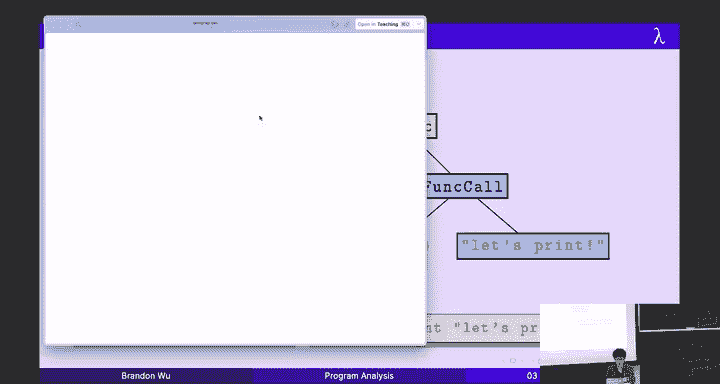

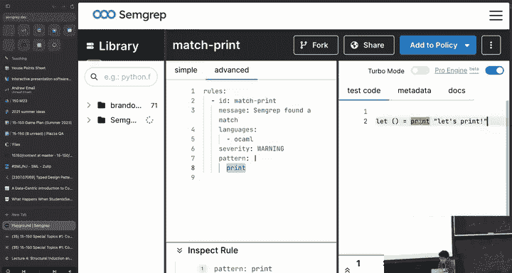

数据流分析通常在低级表示（如控制流图）上进行。但如果我们想直接在**抽象语法树（AST）** 级别进行分析呢？这有很多好处，尤其是对于多语言支持的工具。

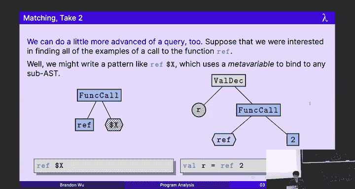

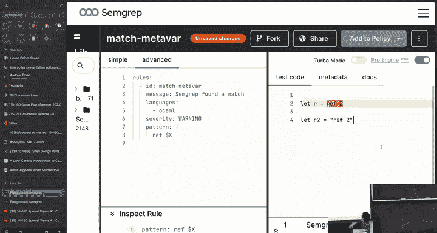

### 挑战：语言多样性
为每种语言（Java、Python、C++）分别实现 AST 解析器和分析器是巨大的重复劳动。

### 解决方案：通用 AST（Generic AST）
一个巧妙的想法是：大多数编程语言的核心结构是相似的（变量、函数、循环、条件）。我们可以设计一个**通用的 AST 类型**，将各种语言的源代码都解析成这个统一的表示。这样，我们只需要为每种语言编写一个到通用 AST 的转换器，而所有的分析逻辑都只需要在通用 AST 上实现一次。这大大降低了支持新语言的成本。

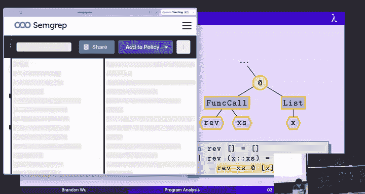

### 强大的工具：语义感知的模式匹配
在通用 AST 上，我们可以进行强大的**树模式匹配**。这比简单的文本搜索（如 `grep`）要精确得多，因为它理解代码的**结构**。

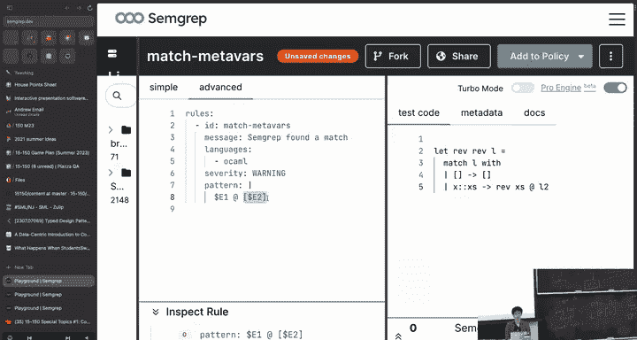

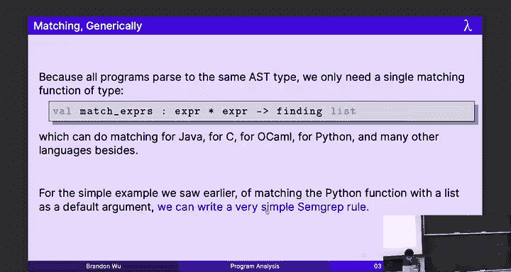

以下是模式匹配的示例：
*   **匹配所有 `print(...)` 调用**：模式是函数调用节点，其函数名是 `"print"`。这不会匹配到名为 `print` 的变量。
*   **匹配所有 `ref` 调用**：模式是函数调用节点，其函数名是 `"ref"`，参数是一个**元变量**（可匹配任何子树）。
*   **匹配可疑的相等比较 `$X == $X`**：使用同一个元变量 `$X` 两次，意味着它匹配的两个表达式必须完全相同。这可以找到像 `f == f` 这样可能无意义的比较。
*   **匹配低效的列表操作 `List.rev [$E] @ $L`**：这可以找到将单元素列表反转再拼接的低效模式。

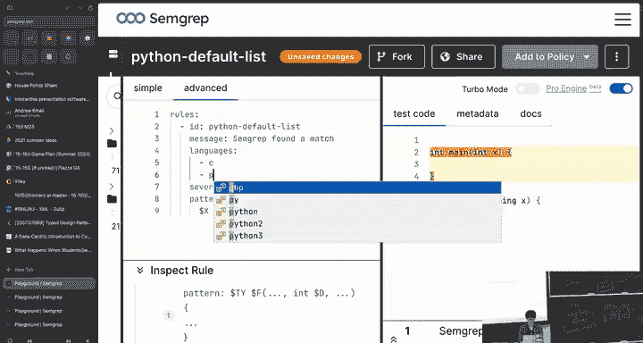

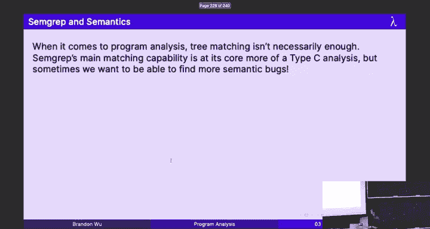

这种模式匹配语言让开发者能够以近乎声明式的方式，轻松编写出检测各种代码模式（代码异味、安全漏洞、最佳实践违规）的规则，而无需深入理解复杂的程序分析算法。

---

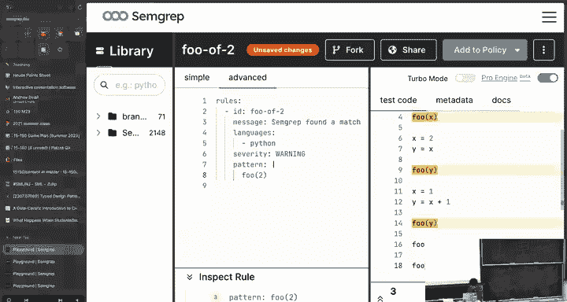

## 总结 🎯

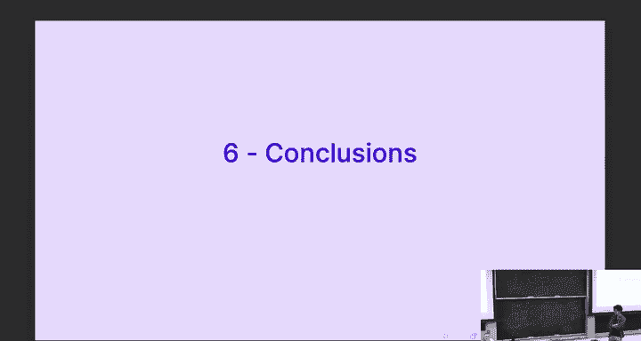

本节课中我们一起学习了程序分析的核心概念：

1.  **动机**：在软件无处不在且质量参差不齐的世界中，自动化分析工具对于保障正确性、安全性和性能至关重要。
2.  **根本限制**：根据莱斯定理，完美的程序分析（对任意程序行为的任何判定）是不可判定的。
3.  **务实妥协**：我们通过定义 A、B、C 三类分析来绕过这一限制，在实践中主要采用保证终止但可能出错的 B 类分析，或解决简化问题的 C 类分析。
4.  **经典技术**：**数据流分析**是一个强大的 B 类分析框架，它通过在控制流图上单调地传播信息来工作，确保终止但可能近似。
5.  **现代实践**：基于**通用 AST** 和**语义感知树模式匹配**的分析方法，使得为多种语言编写高效、易用的分析工具变得可行，让开发者能够轻松捕捉复杂的代码模式。

程序分析是一个将理论限制（不可判定性）与工程实践（近似、妥协、创新）相结合的迷人领域。它使我们能够面对“软件吞噬世界”带来的挑战，主动地改善代码质量，而不是在问题发生后被动响应。通过理解这些原理，你便掌握了构建下一代软件开发工具的基础。