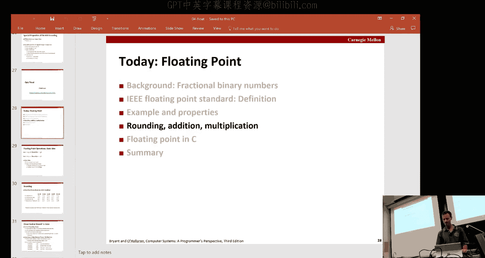
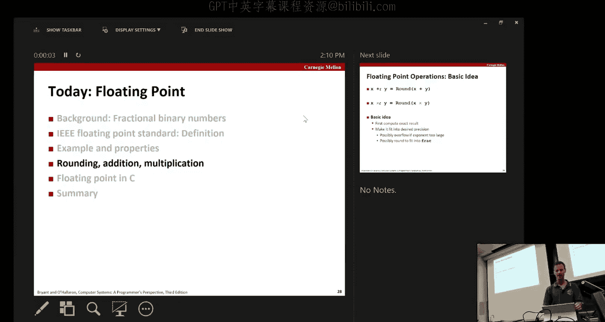
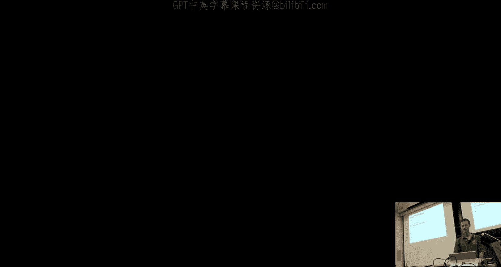
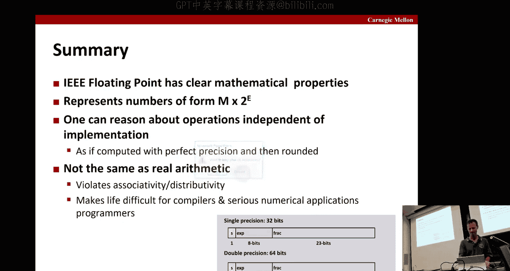

# 计算机系统导论：04：浮点数

在本节课中，我们将要学习浮点数的表示方法，特别是二进制小数和IEEE 754浮点数标准。我们将探讨其特性、舍入规则、加法与乘法运算，并了解其在C语言中的实现。

## 二进制小数

上一节我们介绍了整数在计算机中的表示，本节中我们来看看如何表示小数。二进制小数的原理与十进制小数类似，只是基数从10变成了2。

二进制数 `1011.101` 可以这样理解：小数点左边的部分 `1011` 表示 `1*8 + 0*4 + 1*2 + 1*1 = 11`。小数点右边的部分 `101` 表示 `1*(1/2) + 0*(1/4) + 1*(1/8) = 5/8`。因此，整个数表示 `11 + 5/8 = 11.625`。

通用公式如下：
对于一个二进制数 `b_m b_{m-1} ... b_1 b_0 . b_{-1} b_{-2} ... b_{-n}`，其值为：
`值 = Σ_{i=-n}^{m} b_i * 2^i`

以下是更多例子：
*   `101.11` = `5 + 3/4`
*   `10.111` = `2 + 7/8`
*   `1.0111` = `1 + 7/16`

观察这些例子，将一个数除以2，其二进制表示只需向右移动一位。乘以2则向左移动一位。

二进制表示存在一些固有的限制：
1.  **基数决定了可精确表示的数**。例如，在二进制中，可以精确表示 `1/2`、`1/4`、`3/4` 等，但像 `1/3` 或 `1/10` 这样的数会变成无限循环的二进制序列，无法用有限位精确表示。
2.  **小数点的位置固定了数值范围**。如果小数点位置固定，则能表示的数字范围会受到限制，无法同时表示极大和极小的数。

## IEEE 754浮点数标准

为了解决上述限制，并统一硬件实现，IEEE在1985年制定了754浮点数标准。这是一个对硬件实现要求苛刻但为软件提供了优秀数学属性的标准。

一个浮点数通常由三部分组成：
`值 = (-1)^s * M * 2^E`
*   **s**：符号位，0表示正数，1表示负数。
*   **M**：尾数（或有效数字），是一个在范围 [1.0, 2.0) 内的二进制小数。
*   **E**：指数，表示2的幂次。

在内存中，浮点数被编码为三个字段：1位符号位（s）、k位指数位（exp）和n位小数位（frac）。

常见的两种精度是：
*   **单精度（32位）**：1位符号位，8位指数位，23位小数位。
*   **双精度（64位）**：1位符号位，11位指数位，52位小数位。

根据指数位（exp）的值，浮点数被分为三类：
1.  **规格化数**：当 exp 的位模式既不全为0，也不全为1时。这是最常见的情况。
2.  **非规格化数**：当 exp 的位模式全为0时。
3.  **特殊值**：当 exp 的位模式全为1时。

### 规格化数

对于规格化数，其指数 E 和尾数 M 的解释方式如下：
*   **指数 E = exp - Bias**。其中 Bias 是一个偏置值，对于单精度是127，对于双精度是1023。这使得指数可以表示负数（小数字）和正数（大数字）。例如，单精度的 exp 范围是1到254，对应的 E 范围是-126到127。
*   **尾数 M = 1.xxx...**。其中 `xxx...` 就是小数位（frac）部分。因为隐含了前导的1，所以实际尾数范围在 `1.0 <= M < 2.0`。这节省了1个存储位。

示例：将十进制数 `-5.0` 表示为单精度浮点数。
`-5.0` 的二进制是 `-101.0`，科学计数法表示为 `-1.01 * 2^2`。
*   符号位 s = 1（负数）。
*   指数 E = 2，所以 exp = E + Bias = 2 + 127 = 129。129的二进制是 `10000001`。
*   尾数 M = `1.01`，去掉隐含的1，小数位 frac = `01`，后面补零到23位。
因此，其32位表示为：`1 10000001 01000000000000000000000`。

### 非规格化数

当 exp 全为0时，表示非规格化数。它们用于表示非常接近0的数，并提供了表示数值0的方法。
*   **指数 E = 1 - Bias**（注意不是 `0 - Bias`）。对于单精度，E = 1 - 127 = -126。
*   **尾数 M = 0.xxx...**。即隐含前导0，而不是1。这使得数值可以平滑地从最小的规格化数过渡到0。

### 特殊值

当 exp 全为1时，表示特殊值。
*   如果小数位（frac）全为0，则表示**无穷大**（Infinity）。符号位决定正负，例如 `1.0/0.0` 得到 `+∞`，`-1.0/0.0` 得到 `-∞`。
*   如果小数位（frac）不全为0，则表示**非数**（NaN， Not a Number）。用于表示无效操作的结果，如 `sqrt(-1)` 或 `∞ - ∞`。

## 浮点数的可视化与属性

浮点数在数轴上的分布是不均匀的。越靠近0，可表示的数越密集；离0越远，间隔越大。非规格化数填补了0附近的空白区域。

浮点数表示具有一些有用的属性：
*   **与整数0的位模式一致**：所有位为0表示 `+0.0`。
*   **可作为无符号整数比较**（在大多数情况下）：如果将浮点数的位模式解释为无符号整数，那么对于规格化正数、非规格化正数、`+∞` 和 `NaN`，其大小顺序与对应的浮点数值顺序一致。但需要注意 `-0.0` 和 `+0.0` 以及 `NaN` 的比较规则。

## 舍入

由于浮点数位数有限，运算结果常常需要舍入以适应目标格式。IEEE标准定义了多种舍入模式，默认是**向最接近的偶数舍入**（Round-to-Nearest-Even）。

考虑将一些价格舍入到最接近的美元：
*   `$1.40` -> `$1` （因为更接近1）
*   `$1.60` -> `$2` （因为更接近2）
*   `$1.50` -> `$2` （这是一个“中间值”，`$2`是偶数，所以舍入到2）
*   `$2.50` -> `$2` （这是一个“中间值”，`$2`是偶数，所以舍入到2）

在二进制中，规则类似。硬件实现时，通常使用三个辅助位来高效决策：保护位（G）、舍入位（R）和粘滞位（S）。通过检查这三个位的组合，可以确定是否需要向上舍入。

## 浮点运算

### 乘法

两个浮点数相乘：`(s1 * M1 * 2^{E1}) * (s2 * M2 * 2^{E2}) = (s1 ^ s2) * (M1 * M2) * 2^{E1+E2}`
1.  计算精确的尾数乘积和指数和。
2.  如果尾数乘积 `M >= 2.0`，则将其右移一位，并将指数加1。
3.  如果指数超出范围，则发生溢出，结果为无穷大。
4.  将调整后的尾数舍入到指定位数。

### 加法

两个浮点数相加，需要先对齐小数点（即调整指数使两者相同）：
1.  将指数较小的数的尾数右移，使其指数与较大的数一致。
2.  将尾数相加。
3.  如果结果尾数 `M >= 2.0`，则右移一位，指数加1。如果结果尾数 `M < 1.0`（在减法后可能发生），则左移直到规格化，并相应减少指数。
4.  检查指数溢出，并对尾数进行舍入。

### 数学属性

浮点运算保留了实数运算的许多重要属性（除了涉及无穷大和NaN的情况）：
*   **封闭性**：浮点数加/乘的结果（舍入后）仍是浮点数。
*   **交换律**：`a + b = b + a`， `a * b = b * a`。
*   **单位元**：`a + 0.0 = a`， `a * 1.0 = a`。
*   **单调性**：若 `a >= b`，则对于非负c，有 `a+c >= b+c` 和 `a*c >= b*c`。

然而，有两个关键属性**不满足**：
*   **结合律**：`(a + b) + c` 不一定等于 `a + (b + c)`。例如，`(3.14 + 1e10) - 1e10` 可能得到 `0.0`，而 `3.14 + (1e10 - 1e10)` 得到 `3.14`。这是因为大数会“吸收”小数。
*   **分配律**：`a * (b + c)` 不一定等于 `a*b + a*c`。同样是由于舍入和溢出的影响。

## C语言中的浮点数

在C语言中：
*   `float` 对应单精度，`double` 对应双精度。
*   类型转换：
    *   `double`/`float` -> `int`：向零舍入，截断小数部分。超出整数范围或遇到NaN时行为未定义（通常得到 `TMin`）。
    *   `int` -> `double`：只要int的位数不超过53位（双精度尾数有效位），转换是精确的。
    *   `int` -> `float`：可能发生舍入，因为float的精度有限。
*   常量：`2/3` 是整数除法，结果为0。`2.0/3.0` 或 `2/3.0` 是浮点数除法，结果为 `0.666...`。

## 总结

本节课中我们一起学习了IEEE 754浮点数标准。这是一个精心设计的标准，虽然对硬件实现要求高，但为数值计算提供了稳定、可预测的基础。我们了解了其三种数字表示（规格化、非规格化、特殊值），学习了默认的“向最近偶数舍入”规则，并探讨了浮点加法和乘法的过程及其数学属性。最重要的是，我们认识到浮点运算虽然近似于实数运算，但由于精度有限和舍入，不满足结合律和分配律，这是在编写数值计算程序时必须牢记的关键点。