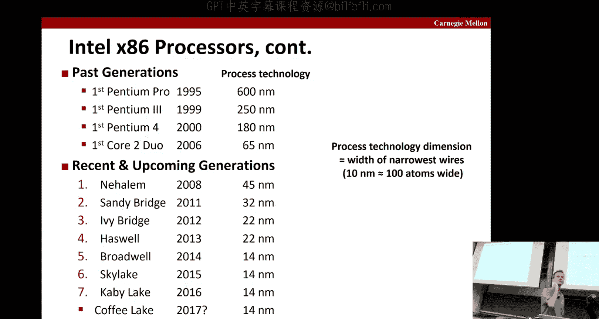
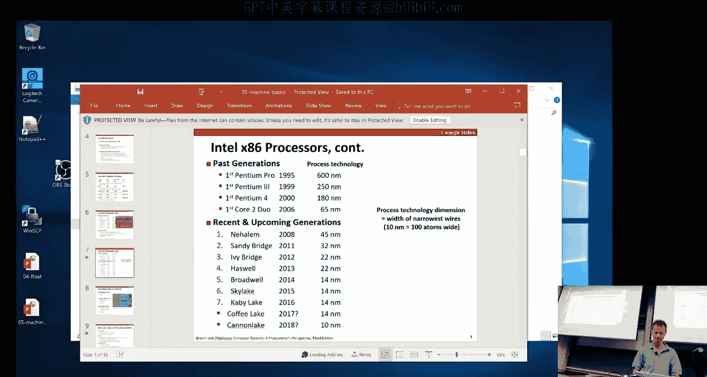
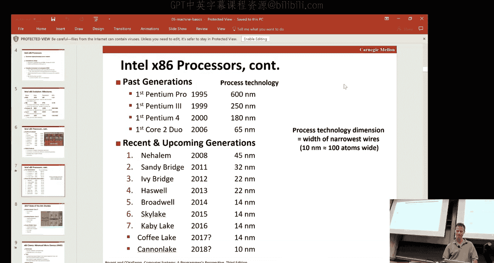
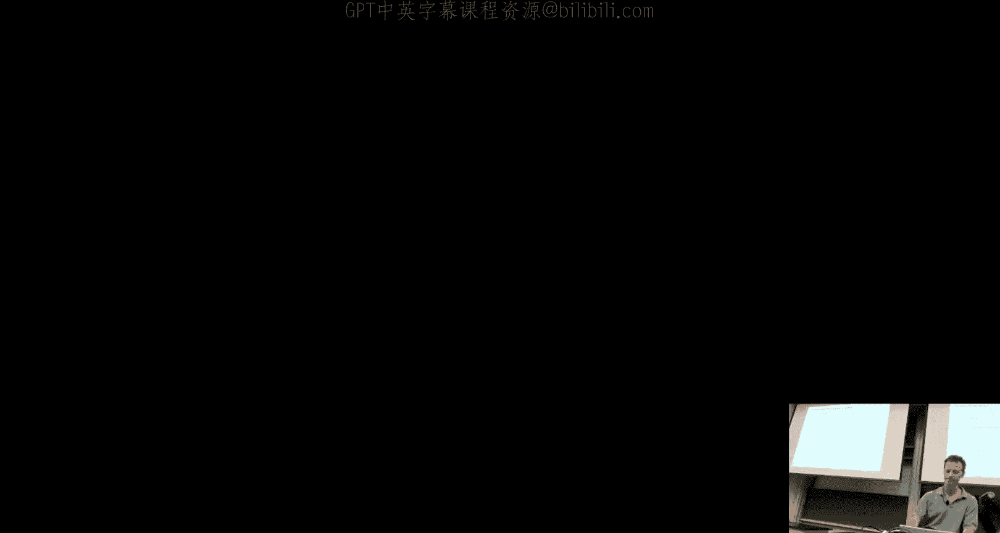
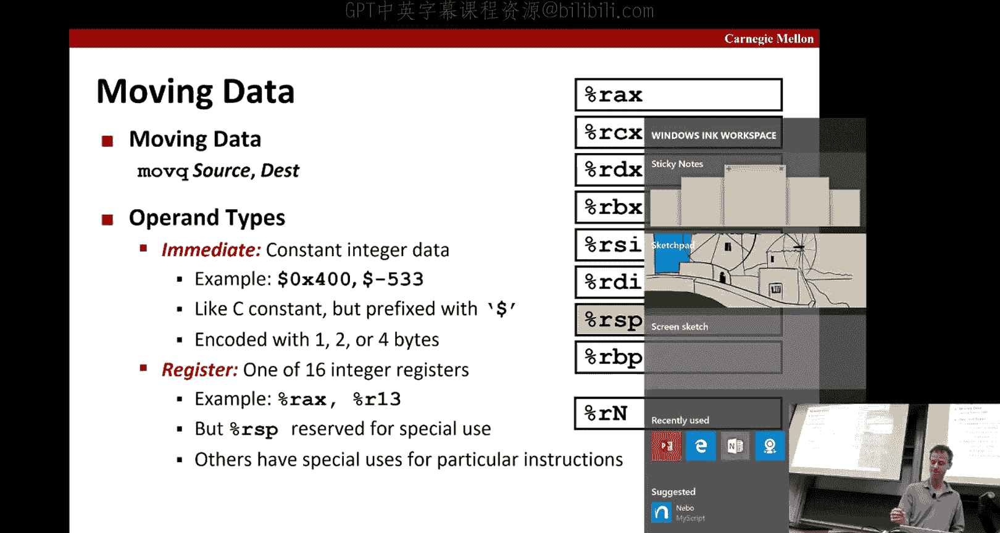
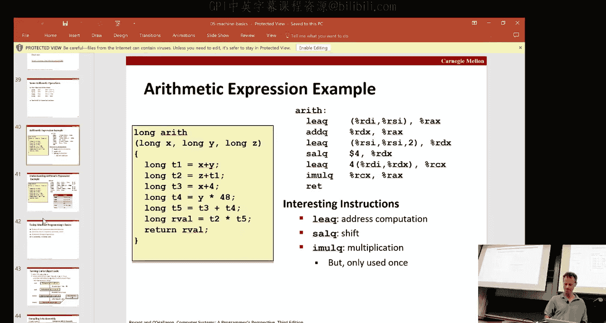
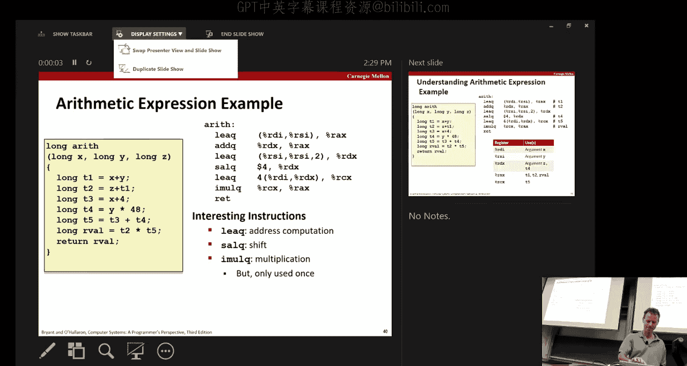
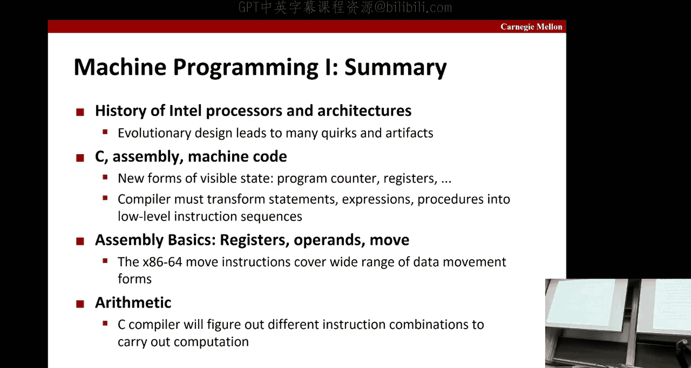

# CMU《计算机系统导论｜CMU 15-213，15-513，14-513 Introduction to Computer Systems 2017 p05 05 - Machine Prog_ Basics -BV17jcReyETC_p5-

这为。Howm we going ahead to get started？So today is the first of so we're changing topics。Okay。

 you've been doing stuff with bits and lights。Whats。Hopefully， most of your。Most of is done。

 if not done。With the data lab。Do on Thursday。Again。

 encourage you for not to wait till the last minute。There's always a few out of the。

What your promise。That might stump you and you don't want to be up。ACo short of time at the end。

But in the meantime， the next five lectures we're going to be talking about。

Machine level programming。Okay， and today we're going to be the first those five。

 we'll talk about the basics。In particular， we're going to discuss the history of the In processored architectures。

Move on to basic assemblyly。Then look at some of the reallytic and module operations and then how C assembly labor code and everything fits together。

Okay， so in this course。We use the Intel X86。老师。There's a number of reasons to do that。

 the main reason I guess would be that it really dominates the Ex6 architecture dominates the marketplace。

 and so that's the one you're going to be using most of the time。啊。第一啊。じゃあ。

There's a long mystery of the garden can clusters。As we'll see， there's。Basically three decades of。

A backward compatible X8 to six architecture that detailtels come up with。It's pretty impressive too。

The number of different changes they made over years while maintaining the same fact with the accountabilitybil。

So that's what we refer to by evolutionary design， its just incremental， incremental， incremental。

 better and better and better。It's what's known as a cis architecture。

 which stands for a complex construction set。Basically。

 what that's in contrast to is what's known as a reduced instruction set， computer or risk。

And in a risk machine， theres a very simplified set of instructions。

That have very uniform size and so forth。Intel from the very beginning in a way that predates the notion of risk。

Started with this what's in contrast called a complex instruction set。

Which has things like variable length instructions and all sorts of interesting dressing modes and instructions and so forth。

And so if you look at the list of instructions that Intel cluster provides， it's a very。

 very lengthy event。Compared to what you might find in a risk。他律行。啊。So why does Intel do that， well。

 basically this is the fact that we've had bill is kind of what theyre started with。

When they started。I producing these things。Can you imagine？

Memory was really tight and so it was really important to have instructions that were only as long as needed。

 so the instructions that were commonly used were the ones you wanted to be short。

 potentially so you wanted to have variable length instructions。

 variable length dressing modes and so forth in order to make the code as intact as possible。

Now as time has gone on， that's far less of an issue。And so。You know，Rk came along and said。

 let's just make these instructions collection instructions very straightforward， very simple。

 and that's going to allow processes to run faster because there's less complexity of the design。

 right？And they're going to be lower power so you'll see today that know low end devices will often have simpler sets。

 foul instruction sets。Particularly for low power。Intel continues to do the cyst。

But it's worked very hard over years to make sure that the performance is on par。

In with a risk faster。And at least in terms of speed。

 it's not quite as good in general in terms of energy or power。

One of the advantages of having a compact instruction format。It'sStill relevant today。Is that the。

Later in the course we'll talk about when we talk about things like the memoryharery。

 you think about the processor。And getting instructions in and off。

The processor into the processor for text。If you have a very compact instruction。😡，Se then you can。

 it's less bandwidth。To get those instructions in there。Okay， and so when。

Because the bottleneck is often the pins that are going into the chip， even for instructions。

It's very useful to have a much more density code so you get the advantages of。Less。You know。

 a higher throughput of instructions into the sheet。

And then once you have these instructions inside the machine。

 it turns out that because Intel realize as well， that risk style things can execute faster。

Those complicated instructions that go into the processor get converted to a whole bunch of simple instructions。

Which are called microops and we tell term。And it looks like a little risk machine inside。

 so it's sort of a risk machine in the internals， but still has the API， as it were。

 of a assist machine。it's kind of interesting how that's evolved over time。

So here's a little bit more about the history in 1978， we had the 886。And you can see that back then。

 29，000 transistors， this was like the state of art。And it could run in five to 10 begars。

As you go through time， you see about seven years later。

 the number of transistors has gone up by about a factor of nine。

 the clock speed has gone up by a factor of two or three。In 2004。

The first 64 bit until x86 processor before that， the 386 was the 32 bit and the86 was the 16 bit。

 So the number of bits。Per， in a word。Has doubled over time。And it had 125 million transistors。

And the clock speed is now in the measure of gigahertz sort of thousands of megaahhertz， so 2。8 to 3。

8。So this trend was thwarted by the fact that these processors were getting so power hungry。And。

And hot。Okay so if you drew a curve and said if we keep making processors faster and faster at the current rate we were doing。

 then by about 20。40， the processor be as hot as the sun， Okay。

 so clearly this is not a path if you might have admit。So instead there was this so called shift。

In the industry to multico。So instead of just being this building finger and beefefer and beefer and beefer processors。

We went to having multiple processors that were less big。And the core two in 2006。Was the first？

With the core across from Intel and the core I7s， which are the style of architecture that the shark machines are。

Which first came in in 2008。Have four course on。And today you can get servers with a single server machine with。

嗯。256 course on them that all act with shared just space and all electric one machine。

At the same time， you can see that the processor speed has platee。

It the notion that things are just getting too hot， too hard on you。So instead of having。

One core that maybe runs four times as fast。But it was going to be really hot but going hard you get four coreres that run about the same speed as what you had in before which you times before。

 and that's how you get four types of fourments。Yes。

You can write your code to take advantage of four course money at this same。

So this is a little bit more of the detail of the recent more recent machine evolution。

You might have heard the pan plus。And always for to the course。And you can see the 100 transistors。

Has continued to increase。This is a picture of。A Co I7， some of you little sharp machines。

 you can see that over the schematic of the chip， we've laid out Mark off where the four coreres are where。

Last level shared caps and some of the other features。开系。And so over time。

 some of the features that have been added are multimedia type operation features。

More efficient conditional operations， again， this transition from 32 to64 bits and adding more force。

第一。Although the number of transistors， as you've seen， it has increased by order source magnitude。

The sizes of these chips has not okay。And the key driver to making things faster and faster without and more energy efficient。

Is the what is the process technology And so how small is the basic。widthth of a wire in your system。

And back in 1995。The state of the art was 600 nano meters。

 and this is a reference over 10 mill meters is about 100 atoms per wide。So then 250。

265 and so forth， so kept shrinking is shrinking。Which is good。

And then with N Hams which came out in 2008， we were at 45 nanoms， and for a while。

 Intel was very successful about every other year of shrinking。

 significantly shrinking the process technology。32， 22 to 14。First in Broadwell in 2014。The plan was。

 the hope was that we could get to 1， this is sort of the next step down in cross technology。

Save by 2016 to keep up with this cadence tonight。But it turns out that as things get smaller。

 smaller， and smaller， it gets really， really hard to make things work。

Because there's just so much interference that cancur。When things are the small。

 it's so hard to get the process exactly right and so forth。And so this 10 nanoimeter。

Cannon like process。Ha been pushed out several years now and now they're looking at possibly 2018。

Now， these are the names that the internal code names for these different processors starting from theha them on down。

 and you may have heard them because people tend to reference them because they're a lot more memorable than the official product name。

 which is just a bunch of numbers of letters and things like that， right？

So you hear people talk about， oh， you， know Haswell was the first processor that introduced hardware transactional memory in the In and so forth。

And so you may wondering where do these names come？Anybody have an idea where these names come from？

Yes。At least some。You're close， there's a more general answer or that。

So if I were to。

Go to Google Maps。你猜。からスカ。Ororgan。Okay。Doesn't really help you much。Yeah。

But when this amount fills in， hopefully。You'll see that we're。It's an actual place in Oregon。

 Sky Oregon is near Cater Lake National Center。你照做。So it's named after locations nearby。

 typically in Oregon， nearby Intel sites。And the reason that they pick things like that。

Is that then they don't have to worry about。Being sued for copyright。はな。

Because if it's the name of a city， it's in the public domain。So even things like coffeeoff Lake。

 which is kind of a strange name。You can see will。Once it fills in。

 you see it will show up as a place。Pretty close to。And们 tells。I find is terrible。还有一个点。

Okay， so' look at Skylight， which is one of the state of art clusters of 2017。

And the other thing to note about these cluster designs is they usually come out in sort of a mobile model。

 a desktop model and a servo model， all based on the same architecture。

And their use cases are obvious from their names。The mobile one is going to tend to have the lowest price。

And doesn't have the lowest amount of。powerfulful反。Although servers。

 there's a lot of demand to look about servers， they're also producing。So here。

And the server model is the one that's going to tend to have not just multiple cores on a single die。

 but also a very fast interconnect between multiple dies on this。I within the same process。Okay。

 so Intel isn't the only game in town for a long time， AMD was a fairly serious rival to Intel's。这个。

Historically， we're a little bit behind Intel in terms of coming out with the latest and greatest the fastest processor。

But there was a point in。Early 2000s， where they were able to。

Jump ahead of Intel by coming out with the first 64 bit。Version of an X86。And that。Pickked intel。

 and so they got their act together and now again has a dominant share of the market。

 particularly in things like servers。And AB is followed behind。And really instead。The chief rival。

To Intel's sort of dominance are our arm based clusters。Which is。Again。

 for more from mobile devices and things like that。Okay。

 so Intels first attempt to do 64 bit was combined with a completely radical redesign of the architecture called Itanium。

 it was designed。啊。The jointly with Hewlett Packard and the notion here was that the compiler folks。

Ivin enough of the Intel people and the HP people that compiles were getting so good。

That we could actually offload a lot of the hard work to compilers and that the architecture wouldn't have to do any more。

And so they were going to build this so itanium was this sort large vector vectorized machine with big vectors。

And it was the a pilot， was going to do all the fancy stuff to make it all work。Well， unfortunately。

 that would turn out to be pretty much a disaster。The compiler technology wasn't able to keep its promises and the whole thing got canned eventually。

嗯。And so they introduced instead 64 bits into their traditional architecture。And yeah。

 all but the lowest end processors will support six4 bits。But as we'll see。

 because of factory compatibility， you can still run 32 bit code on it and a lot of code is still 32 bit。

So in this course， up until the summer of 2015， it was all about sort of the 32 bit architecture because it had been that for a while。

 and then there was a rewrite of the book and shift to pretty much only focusing on the 64 bit X 8664 that's what we cover in this course that's what the book covers。

And。That's that。Okay， so that's the history。Now we're going to move on to talk about some of the basics of assembly。

 any questions on history？All right， so this picture should be familiar， we've got our Z code。

At the one end， and we've got all the notions that the computer designer worries about at the bottom end。

 and somewhere in between， there's this notion of what the assembly code looks like。Okay。

 what assembly program want to start？What an assembly partner worries about。

 which is the or machine code programmer， which is the base these next five lectures。

 is this view that sort of looks like this right so we've got memory。か。だからスタッフ。

Or pushing popping procedures on and so forth。And the CPU that has things like registers。

And an program counter says we're in the program New and condition codes。

That where you store information about。You know， something about that you calculate something that's going to affect whether branch gets taken or not。

 things like that。But that's the world in which Se program is done。And so。

 you know there's nicely clean layers， but of course。The， the the， yeah， the whole。

One of the reasons you're taking this course or one of the key learns you're going to go in this course is that you have to you can't just play these level of abstracttraction and if you want to write。

And a bug coat， good coat。Okay。Okay， so some definitions。

 so when' we talk about the architecture of a processor。We're talking about。😡。

What's exposed to assembly code machine code program？

In order to write correct assembly code and machine code。

Okay we'll use those two terms somewhat interchangeably。

 the machine code refers to the actual sequence of bytes。That represents the program。

 that's what the process itself uses。It's not human friendly。

 so the human version is called assembly code to see what that looks like if you haven't already in the next few slides。

 and that's just taking these bytes and turning them into things like oh this is an ad an ad of this this register so forth。

嗯。So the architecture exposes things like registers and instruction， the set of instructions。

Underneath all that is the microarchitecture， the microarchitecture is whatever the processor does to support。

The working architectures， the implementation architecture。And so， know we talk about an ISO。

The instructor said architecture in architecture， the X8664。We can program to that ISA。

And then run on any number of these platforms， all the platforms that support this I。

 and they're very different right as I mentioned some of these big server machines。

 some of are small mobile devices and so forth。And。That。Impacts。What about your program？

If the ISA is what impacts whether your program is correct or not。

What is the micro architectureitecture？How does say performance， the performance， right。

 how fast is and how much power did you use and so forth？Okay。So。现在。

These next five lectures we're going to focus on this top part to happen we get。

Do have machine code the sound code and so forth。Understanding what that looks like。

And in later lectures， when we're trying to look at some of the performance issues。

 we're going to have to dig a little bit deeper and see what's going on in things like the memory Heart Can these machines。

可以。So example， ISIS are the next thing six we' talked about in class。The arm。

 which I mentioned briefly before， it's using almost all mobile phones。

 and then there's this recent IU out of Berkeley that's open source， which makes it attractive。

And it's a wrist style ISIS， so it's very simple， I mean all the instructions fit on。

 you know on an eight by 11 sheet as opposed to you know a。

A thousand page manual or whatever the Intel X86 takes。Okay， so this is the picture we have before。

 where the view of the world is if you've got to see here that says like registers to。道。

The PC is called the RIP。For。The program power， the thing that tells you what instruction you' are in the program。

要。So that's for historical reasons， it has nothing to do with fact your programs about to dieing that。

啊。系啊，诶呢个打就是。Already。So assembly code has data types。There are integer data of one， two， four。

 and eight bytes。It includes things like values and addresses。We've also seen floating point data。

In this class of  four and8， there's also a 10 byte version of that。

What we're not going to cover almost at the very end of class is that there's also these SIMD CD instructions。

And。That go with special sym registers and special sym vector types that are even longer for8， 16。

 32 and 64 bytes， these are very useful for graphics， kinds of things， multimedia kinds of things。

But for the next five lectures， we're not going to deal with those soll come talk about those a little bit at the end of the class。

And then of course， there's code。But interesting enough， you know。

 assembly code doesn't have a notion of an array。or a structure or any of the things that we're used to the higher level things we're used to in C。

 it's really memory in the assembly code is just a collection of lightss。t is selection of。Okay。

 so there are 16。Interry registers in the X86 architecture， they're shown here they have。

By convention， they have certain names on the left， and then they sort of fall back to numbers。

What's shown here also the slide is that the。Some of the backward compatibility issues。

 so previous versions the machine that the architecture that had 32 bits。

And only A registers had questions called e。edvp。And the new ones went replaced E with R。

 So it was R X down to R G， and then added these。Additional register。So for battery compatibility。

 you can refer to the roll order for bytes of any of these registers。If you want to。

Use the 32 bit version of the architecture goes 64。Okay。

 this is more about the history there used to be eight registers and even those for background compatibility。

They had ones that were half their size。上先。You know four byte is two bytes and then they even have ones that are one by。

不家是用过。All right， termss of operations。There there's a class of transfer operations that take。

Move between registers to registers or registers to memory memory back to registers。

There's we'll talk about this first， then there's the arithmetic functions on registers or memory data。

 and then there's the control ones and the control ones we won't get to till the next stage。

So a basic instruction。Is this move instruction， move Q？

Okay。So what's important to know about this instruction。

 so all the ones that go back and forth between memory and so forth， we'll see a list of in a minute。

Or called move。And then the Q means what size thing are you moving？Okay， so Q stands for Quad。

 it's an eight byte Quadi。And that's where you're typically move into 64 bit architecture。

If you want to only move。Part of it we put a different。Like move L would only move the lower。

Four bytes is opposed to all eight bytes。The other thing to note-。

 and this can be quite confusing is that the source is listed first and then the destination。

Okay and that's something you have to keep in mind。

That you'll see two operators and ones the source of the others destination。Now。

 in terms of operating types， there's a type that's for constants， it's called immediate。

And in assembly code， that's shown by putting a dollar sign in front of it。Okay。

 so you can see there's this dollar sign。Right here。

And you can use our usual hackx notation or interation doesn't matter。

And it's encoded with up to four bytes。Then there's the registers we talked about。

 the only one that tends to be reserved for special use is this RSP。

 it's used to keep track of where the stack is。As you're executing？

Others have special uses for tick instructions as we'll sees for to speed things up。

 there's a convention for which registers， which arguments of a function get put in when you call the function。

Prices。All right， good。Okay， so memory。The is sort of a consecutive bites at a given address。

 so this example here says。Which is sort of simple example。Look at the value in register REX。

And that's the address that I want you to I'm your before Okay the pre this is around me。

Its like the data reference， I want you to give reference what's the address stored in audience。

And again， the Q stands8 is y is8。Now， the reason that I was emphasizing for that the source is for the destination。

Its because if you look at something like the Intel document。Or their own architecture。I mean。

 it's just it's their convention would Delaware ground， and they we say no destination source。

So as long as you just look at the textbook and the slides and don't wander off into 5。

000 page Intel documentation， you won't be confused。😔，But if we like weres perform object dump bun？

Of course。It would show the destination and source because that's how it's actually like。Well。

 that's why you have to use the object dumps that we provide write your own object dumps。对。Okay。

 so here's some examples， the source can need to be immediate register memory。

 the destination can be a register memory。So this one here。Again， it's source assassination。

So you're moving the immediate。4 into。Register reX。So in C that might look something like this。

 I want to store the value4 in some temporary， okay， that's start putting your a register。

Here you're saying you want to move this minus 147 into not the register。

 but the memory location that the register is pointing to。

So that C equivalent is something like that where the address of P is what's in the risk of RX。

You could just move between to registers， that's like copying between a couple of temps。

You can store something that's in a register into memory。Okay。

 that's kind of like this C operation store through a pointer， in this case， again。

 RDX would hold the address of。But Peter to points to。And you can load from memory。

So that would look something like this。Now you can't go from memory to memory within the same instruction。

 you have to go and go registering and then back out of it you want to copy of memory。

In the CNN instruction set。All right， so again， I mentioned this is a complex instruction set。

Ss scholar， actually one of the ways that cisC is that the。There's all sorts of addressing modes。

Okay。So the normal one is the one we've been looking at， the address is in the register， go F that。

Refers to that。You can also put a D in front of it。Can like this in here。And that says a lot the。

The address that's in RVP。Plus8。That's what I want you work。

Okay so it's a constant displacement that specifies cost。So can everybody think of places in code？

Where you might do this a lot。Accessing your array okay。

 exactly right so RVP might store the starting point for the array。

 but now you want not the very first element of array you want。

 maybe the second or third or fourth or fifth and you would change the displacement accordingly。对。爱收。

Give rights that so far。Can anybody figure out what this function is doing？Okay。

 so first I need to tell you that。嗯。The convention about where arguments get stored。

 so the convention is that argument the first integer argument in a function gets stored in register RDI。

And the second one。Get stored in RSI。So that's where things are starting off。

That's where the values are in RSR are coming from， so what does this function do？やす。Exactly。

 exactly it's doing a swap。Okay。So here's what might be the secret code for that。

 and here's the same assembly code。So let's just step through this real quickly。

The first thing that's going to happen is that you come in and the。

the first register points to some location of memory and the second arguments register。

The second argument was stored in the register points to some other location of memory and now。

 so we've got the little mapping here and it says that the XP is stored an RDI and the YP stored RSI。

And now we just step through the instructions。We see that the first thing that happens is that you take the address stored an RDI and you move the contents of that thing into REX。

Okay， so。Okay， so actually here we plugged in some actual values。

And you can see that's the first thing that happens。对。So I I looked at RDI。

 it said 120 I remember the contents of address 120 was the value 123， and I stored that into R。

So the second thing that happens。Is that I look at RSI， I see 100。

 I see that the value is stored to 00' 456， and I copy that into RDX and so that's where that is。

The third instruction， I take that value to RDX and I store it through into the location that's stored in RDI。

 which is still 120， so that's how the 456 gets there。And likewise， the 123。对，你 the question上来。Okay。

 so so far， we've talked about normal dressinging mode， displacement dressinging。But there's more。

 this is the more most down。Okay， see if this is。All right。The most gemform。You have not just。

One register， you have two registers。And this S and this D that we've already seen。And basically。

 if you remember this formula， you're good to go。 Okay， this formula says。That the first。

 know if you only see one， or if you see more than one register。

 the first one is this base here and so you want the contents of that register。Then the second one。

 if it appears。Is the one that gets multiplied by this third term？If it exists， okay？啊。

If the S doesn't exist， then。呃。Then you can it's。One， right， yeah。

 you just get the sum of these years， you' good。So if S is missing， then the assumption is one。

And we'll see how that's that can be used in the future All right so actually right here so here's a good example so here you see we've got just the sum because there's no S that iss an implicit one。

Here we do that same thing， but now we add an our D， and here we show one with S。

And so this allows you to step through arrays and multial arrays and all sorts of things you might want to do。

You know， for instance， in the two dimensional array。

 maybe the s is what's you know the this is the base of the two dimensional array。

 maybe the s is like the length of a row， so if you want to step columnize， you jump you know。呃。OK的。

Thats so if you want。Yeah， no， that's right， so you'd put this number the size of a row in this register。

And then that would allow you to。And then the scale would be the size of the data type。

 and so if you wanted to skip one row， that's how you could do it right， skip to the next column for。

Okay。对。不是。Okay， so。But you're not going to see too many of these really complicated ones in the code you write。

 but you will see them on occasion so it's good to understand what they。Okay。

 so suppose you have an expression looks like this one here where we have， know。

 so what is the address computationm entity？If this is our value of RDX。

And now we've got a place here of eight。Then that's， okay， here's our little cheat sheet。

Then it's just the value of it's in RDX plus the eight there。Okay， so you get digest here。Similarly。

 these two here， the RCX， since there's no S， you just add those together and so you add the two numbers in the little table。

And you get the address。Here where there is an s that's four， you multiply the second term by4。

 and that's going to jump you to the address that's shown。here you can see the base is missing。

But that's okay， just treated as zero， and so it's just RDX。Times two plus the displacement。嗯可。

And so it may seem a little odd that you would use the second address。

If you only have one address to give then you use the second address first the first address。

 but the nice thing about using the second one is that you get this way of scaling so you can multiply by two。

 four8。あ、安な。There in one instruction。连一块吃的。Yes。嗰个专 should put in last year last year。Put in 0 x。

トがけ詰まって。So it's like a。啊。No， I think this is the convention how。

And that's how Ill show up in the code。上me。对。Okay， now there's this interesting instruction that's for address computation purposes。

 So even with all these complex addressing modes，'re there's going to be cases where。

You've gotten an even more complex thing to do， and so you want to compute。

 accumulate and address over a series of instructions。

And the LEA instruction in the queues qua quad formed it。

Alls you to compute address without actually referencing anything， it's just a value compute。嗯。

So the destination is just set instead of a notion of like if it was a move， it would say， oh。

 I want to fetch the address that's stored into my calculation sort of my sort and put the destination here I want to not fetch that address。

 but just take that little mathematical address that computer and put down in a destination。

And then I could build on that for that like now that that's in some register。

 then I can use that in a second。Addressing motor instruction that is more complicated can build up more complicated things。

But the way you will see this all the time in your programs。

Which can really throw you at first is that compilers know that addressing modes are。

A really cheap way to do certain kinds of multiplications。

So here what we're telling is you're trying to multiply by 12。

And anyone do that in just two instructions？Because what it does is it takes this。And again。

 because x is the first argument that stored RDI。So it takes RDI as the base and RDI is the index and two is the yes。

And so work done effectively and then you have RAX as the destination。

 so got effectively puts is it stores an RAX。Three times less。Okay in one instruction。

 a way of multiplying my through。Works up， right and you can get other combinations。

 not every combination， there's other combination you get if you use it。

And then to get them from multipied by three and multiply by 12。

 you're just multiplied by four using our shift instruction。So SL is what we're used to。our big time。

 it's just not。And through want this share quite two。

So that's how you get the value 12 in the register RX。Okay。

 RX by convention is the register you use for return values from functions， and so by pointing in RX。

 then your document you can just return from the functions， the entire body of that function。

Gets executed in just two instructions。Any questions on that so again。

 what makes it confusing is you see the LEA and you think， oh。

 they're trying to compute some address here， but why are they trying to compute an address with me。

 there's no address to get compute here。It's just a way of doing some clever rhythmthic tricks。Okay。

 and there's the usual class of ametic operations as subtract interot applies。

Different kinds of shifts like right separating the athemetic shift has a covered from the behind people shift。

Remember the two different ones we're talking about in class。ThereX。And again， remember。

 it's source followed by destination。And no distinction in is between sign and uns。大人一块牺上了。嗯三月天上。

都是玩下。还开始。All right， let's see how we did okay。All right， so question one。Okay。

 so if you've been doing data now。嗯。You should be very familiar with。Actually。

 if you've done the float problems data， that's towardss the end of it。

 maybe a lot of people haven't gotten into it。But you'll get very familiar with Dx7 and F8。O。

 lot so嗯。If you remember that plus infinity is where the exponent is all ones and the fraction is zero。

 so that's why you get the pattern there。那。Okay， so the RDI is the right for the answer for the first image argument。

The REX was for the return by for those people that。Remember， I said something about REX。

 although it's because it was pretty return value。And by the way， RsI is for the second argument。And。

Okay， so here。Okay， so this is a normal adjusting mode。And we've said that， you know。X is an RDI。

 so what this is saying is take that x and look at the address of that x。Okay。

 so that's like a Stars。And again， this is。Source。Destin， right。

 so the destination is going to be where y is。Okay。Now， the。The ad instruction。啊。Is a you take the。

The racial value of。你要要。You take the visual value of what's in RFSI。

 you add onto it what you get from here。So it's this year。

 so it's why was the original value in that and being added onto that？😔，还有。对。気ね。能给大家去。

I'm going to just bring this up so I guess what I didn't really highlight here was the fact that。

You know， this format， right， so even though ad only has two offerings a source of destination。

 it doesn't have like source one， source two destination two。

All of these operations are in accumulation relation off of the destination。

So it's like the plus equal one and so forth。也是。其他都是。Youve a little bit。Understo。Okay。

 any other questions onquiz？Yeah。The question about the instructions how come theres。

There's a logical shift。Right。In assembly， but it's not in sea。啊。So it depends on the representation。

 right， so if it's unsigned。Then the shift right would be a logical shift。And if it's signed。

 it's only the appship。So you're right， forre sign， there's just the artrithmetic shift。哦。

And for unsigned， it's always a logical issue。Because there's no notion of the sign and one sign。

 so it's just， you you're dividediding by two placess of a should go one。

 so you want zeros and the other side。Good， good， that's actually a good question。Okay。

 here's the one operating version of these， right， increment， decrement and so forth， they do it。

You can imagine and there's plenty more you can see the book。Or many distraction。

Okay， so。So here's a more complicated example。Okay， so what are we doing here。

 The first thing we want to do is we want to take x Y， so we know again that this is x is stored in。

RDI。Just the first argument？This is sort ofSI。The second argument。

It turns out that the third argument I didn't mention this yet is sort of in RDX。

That's the register of by convention， the third inte jar is sort。

I keep saying energy because Floating Point has its own set of regiistries。

And if you have interleaving arguments， they're intergerent floating point。

You're just counting within each type。So there was like a floating point argument right here that this would still be the third argument。

 third image argument。It's count。不りました。Okay。So you can see that the way they compute x plus y is to use this addressing mode。

 right？That allows you to add up two things and put it in a third。Then the。So here you have this ad。

 so right now this is where T1 is being stored。In our code， we've assigned it to this Reg RE。

 and so this ad instruction just says take the the the Z and add it into。

The T1 and the store there's on T1 so now。So now this is also where T2 is stored。ち違。Okay， then we。

We want to。I guess we're going to do this 48。Okay， so the 48 is done by this trick of taking y and using this LEA instruction in this addressing mode to compute。

 we got three times y here now， right？Because it's2 y plus another y。Then we shifted。Left by four。

 which is by two to four by 16， so that's how we get 48 more。Is that clear？

It's like the how we got 12 before what NAs1 48， we shift by four here。

Two to the fourth instead of one by two to two。Okay。Then we're going to do the the。

Additional trick here。What are T3 and T4 and we're also going to throw in the four right。

 So we have this four that I kind of skipped over before。Because it realized if I put a four here。

 I get that one for free as well， I don't have to waste this up in instruction。😔，谁以。

And then I can do the energy multiply of these2， and I'm done。

So what's nice about it and what's highlighted in the slide is that your energy multiply。

 which is a relatively expensive operation we only did once in the entire。

The entire sequence of codeke you know there's two multis in here and so forth。Okay， so you know。

 if you're familiar with this， this should be relatively straightforward。

 if this is your first time seeing it， you know you'll get familiar， believe me by you know。

Within a week， this will start to look quite familiar as you get into the next lab and so forth so and throughout the course we'll just revisit this things again and again and again。

Now what I didn't mention is why do we spend all this time？😔，Having people learn assembly code？Yes。

さ for。's if it's a。That's a good question。Here it's used as an immediate operation。

That's why I use the dollar sign。Here it's part of an addressing convention where this is always a constant。

So you don't have to put the dollars under there， in fact。

 probably be wrong and put the dollars under there。Good， yes。The 48。Oh sure， okay。

 so RSI has the value of y。And if you remember our addressing mode， it says you take the value。

And you take the S value and you multiply it by the other register。So two times。That's right。Its。

As heres2。And so you get two。Times RSI。And then you have the original RSI， plus RI。Okay。

 and because it's the LEA instruction that says just compute that quantity and store the register。

 don't actually do any fetching from memory。And so that's how you get three times RSI sorted here and it turns out the RSI。

I。Iss where we。Had stored。Why Free's argument stored an officer why？Our slide。

 so that's how we get three times y。Sttored in。Adis。Okay。And then we just take RDX。

 which is three times y， and we multiply by 16 by doing a left shift by four。Good。Okay。

 so any other questions yes？あ月。So this is the one that's allowing us to do。This。

Plus this plus this four。It's kind of cute， right？So if you look at how this adjustment plays out。

 there's no way to here， so it's just this operation plus this operation plus displacement。

And that's。This plus that plus4。And since it's LEA that gets stored。

 you don't actually fetch anything， it's just that value that stored in it。So。You know。

 if T3 is where we're storing our RDI and T4 is where we're startinging RDX。Yeah。

 I think that's the how worth thus far， and that's how we get。What's your problem to T 5。对。다른品。

Multiply by。还是要得。So people have been writing these compilers for decades， right？

They write into the code for the optimizing compiler， all the tricks they could take of。

And this is one of my。Yes。How do the machine now that。他说是要6。嗯。

That's a very good question so in order to do that kind of trick。

 it has to run the optimizer and we'll have one lecture on compilers because there's a whole chapter is a book on compilers chapter5。

 but we only have one lecture in dis course on compilers。

But a compiler the first thing that has to do is it has to figure out all the dependencies between instructions。

 so all the constraints against what instructions can be moved or what can't。

And then once it does that， it realizes that there's there's really no， first of all。

 there's no constraint between these two instructions。

 they don't like share you know this one doesn't compute something this uses or anything like that。

 and so those two construct instruction can be executed either order。

The other thing it has to know is that this value T3。

 doesn't need to separately compute that because it never actually computes T3。

So it has to know that the only other place T3 is used is right here。Okay， and again。

 that's an analysis that does looking， you know。Dly beyond just is one function to find out。

These are great questions。没要。Okay， so again， this has become more fluidative。

 so why do we teach all these things because when you're debugging your program？

Or when you don figure out why it's not running as fast as you'd like。

This is the output that you'll see from the compiler。

And you'll look and see and if you learn how to read this stuff。

 then you know exactly what your C code got translated into。

And that can be very useful for Duddy to know what actually came out together at time。Because it may。

 you know， if there's a bug， it's probably surprised there somewhere。

You didn't realize that that's what it was going to do。Therefore， you need a fix curve。All right。

Okay， so。In the last 10 minutes。Let's go move on to the last section。Again。

 this should be review for those of you that are familiar with C。

 basically you have code and you dot C files， you can like Gcc。There's important to know。

 there's a dash0 G。A， flagg。It's basically optimization level zero。

And that's really useful because that will be the most direct translation of your code into assembly。

OkaySo so that's usually the one that's closest that's easiest to map back in your head to what you actually wrote and so we recommend you use that higher optimization levels could do all sorts of interesting tricks that could move code between you across branches and between procedures and all sorts of and figure out how to sage questionses and things like that and it's great for making your code went fast but it's really a lot harder for debugging right because the relationship between your seat code。

And the resulting assembly code is the gap has gotten really huge。So the compiler。

 if you give it the dash test flag。So Jane if you don't give any fiberus scope all。

 that's capableable。But if you give a dashS， you get the assembly code。

 then it can get if you ever want to look at the binaryer I don't and why you would。

 just all the ones and zeros。You can get that and then when it's time to execute things。

 you take the dot Os and any side of libraries like Senator IO that you're thinking and that gets you extra the book。

Okay。So again， the key command here GCC dash is 0 G。

 dash has is I want to get the7 code out and my C function here some C if that mix under that。Okay。

And that's。啊。Yeah， so that's。To kind of highlight what we said before that basically whole our tool chains work properly on shark machines and they will be consistent with what's in lectures and what's in the book and so if you try to run some of these examples on nonshark machines。

 you might be for a little bit of a surprise okay so just keep that in mind。

Now here's what's interesting， this is what it actually looks like。And this。

The Suffwick dots are directives。so it's some sense to or。

 they're all about how to set the memory and other kinds of things that。That's the run time。

It's going to be use it for run time if for linking it， all these things。But really。

 you just kind of ignore those in your head and look at the li and code as we did a earlier exam。可以。

嗯。Okay， so again， there's all the different data types。

That you get out and these operations that we've talked about。

 we haven't talked at all about transfer and control， that'll be the next lecture。

But we'll talk about transfer data and arithtic functions and so forth。Yeah， so here again。

 emphasizing that the object code， the dot0 is just all these sequences of fights。

In order to parse that， you have to figure out the length of each instruction and so forth。

Or these such as one three or five bitetes。the starting address for this code segment has shown。

It's really not that useful to look at the object code， it' much。

 much nicer to look at the assembly code。嗯。Yeah， and again。

 you can see that the middle thing is what we're going to focus on this class。

 it's much more helpful than trying to。Arch you code。嗯。You can go backwards。

 you can take object code and if you have some， if you don't have the source for some code。

 but you have the object code for it。Then you can run a object just a summary that will get you from object code back to some code that you can mean。

And so this is useful for， again， for examples where you didn't start with the C code division。

 right， maybe some other code， you want to look at what it's doing。嗯。

You can run that on the entire eight out out， for instance， and look at the whole thing。

So for instance， if there was routines that you didn't call。

 now you didn't write that you just called。Like library teamss， you can look at them。嗯。Okay。

 and also within the GDP debugger， this becomes useful as well。Right。

 because what will happen is in the G bugger， the default would be you would get out， like I say。

 just if you say dump the contents of this member location and it's a budget code。

 you would just get out all this zero x blah， blah and that's not all useful so you can disassemble it。

3。And get out much more useful information even from here at to partner。Okay， so the。啊。

There are certain things you won't be able tos if'。知 know。Well， not， sorry。

 there's certain things that you are forbidden from thisasse。And for example， you know。

So executables from Microsoft that you have permissions and you said， where you forbid。

 well when you check that box about user the license agreement that you never read， it's in there。

 okay， you're not allowed to reverse engineer code but running disassembs on their objects。Okay。

 so today we've talked about the first of five lectures on assembly code and machine level programming。

The history of dental processors differ between architecture， micro architectureecture。

Some of the basics of moving and。Simple rep instructions。

And next time we'll start to look at branches and precision halls and so。啊。

