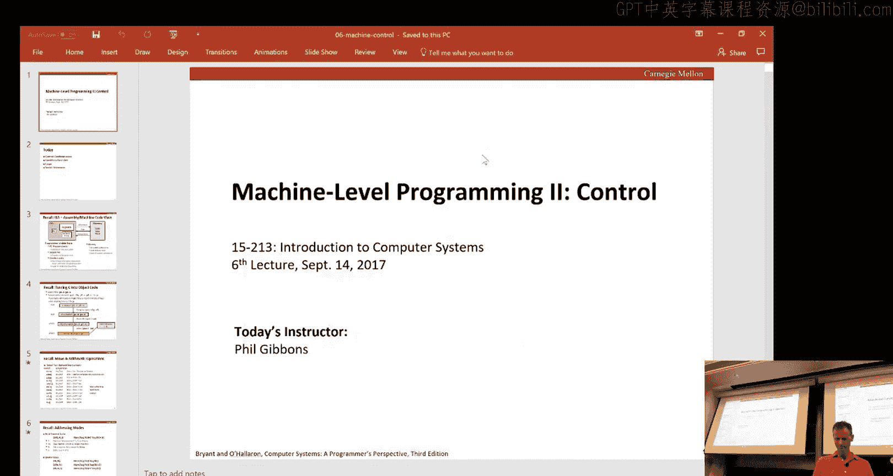
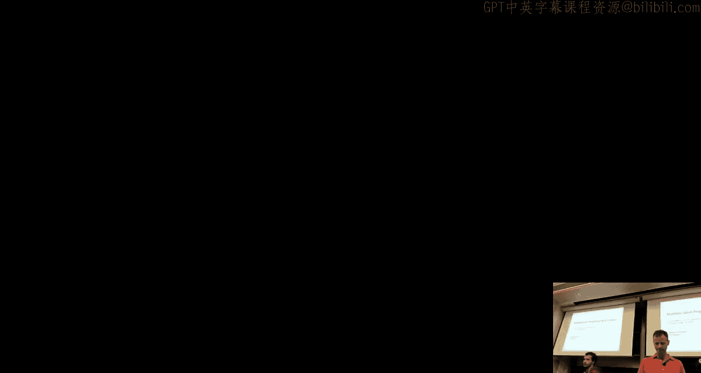
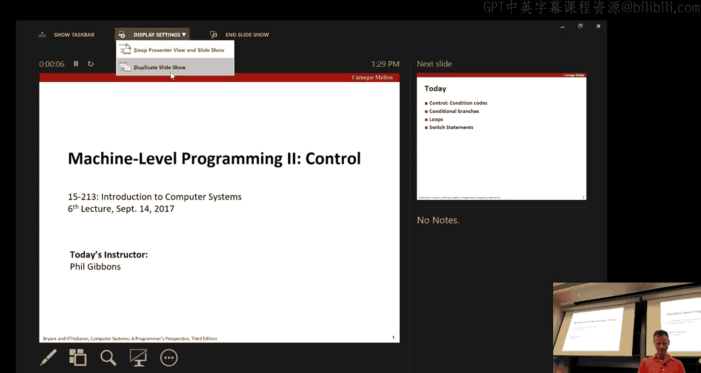
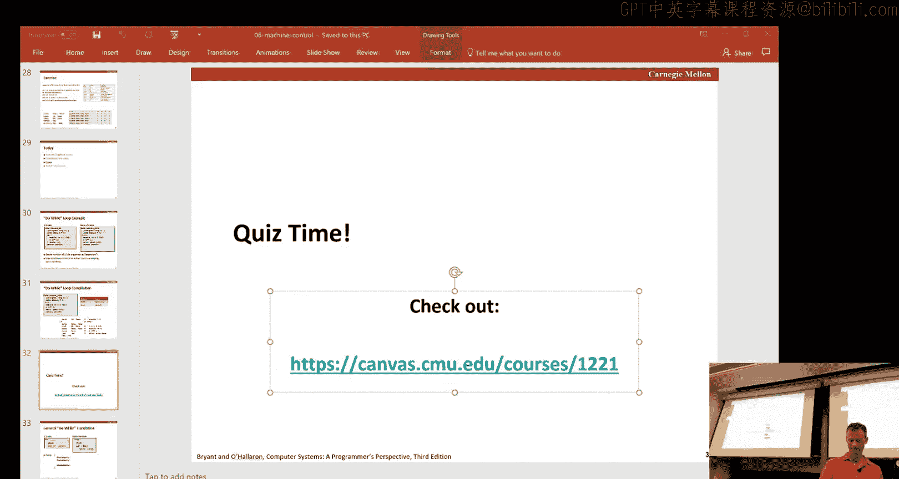
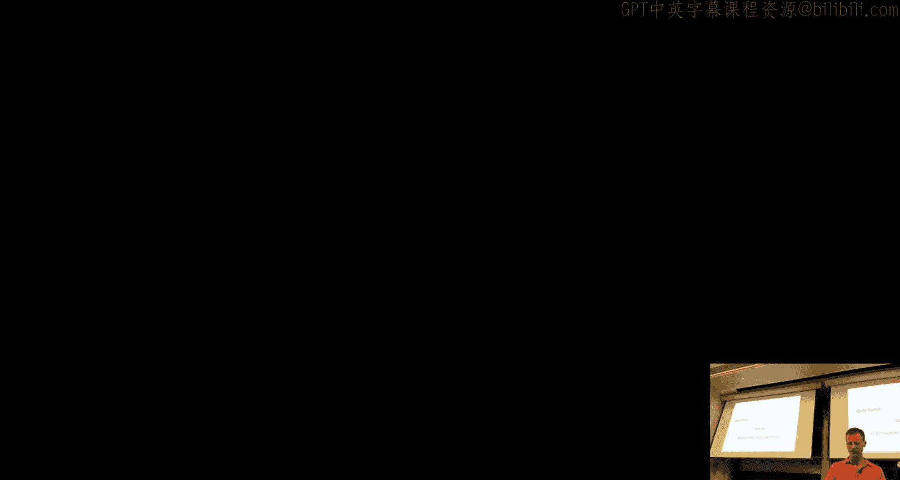
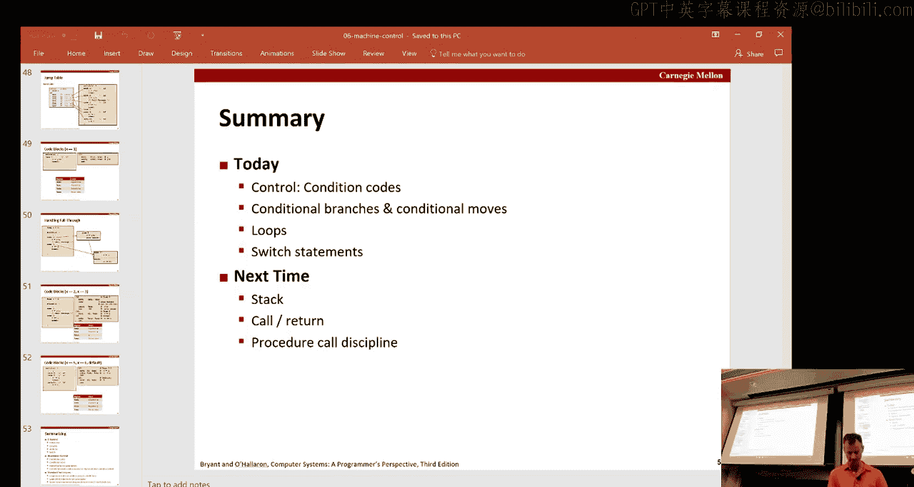

# 计算机系统导论：06：机器编程 - 控制流 🎛️







在本节课中，我们将学习机器编程中的控制流。我们将探讨条件码、条件分支、循环以及C语言中`switch`语句的实现方式。理解这些概念对于编写和理解底层代码至关重要。

## 概述

处理器通过指令集架构（ISA）提供机器级编程的抽象接口。无论底层处理器如何变化，只要正确编程到此API，程序的正确性就不会受到影响。本节课，我们将深入探讨控制流在机器层面的实现。

## 条件码

上一节我们介绍了数据操作，本节中我们来看看控制流的基础——条件码。条件码是处理器中一组特殊的单比特寄存器，用于记录最近一次算术或逻辑操作的结果属性。它们被后续的条件分支指令隐式地使用。

在x86-64架构中，有四个主要的条件码：
*   **CF（进位标志）**：记录操作是否产生了最高位的进位或借位。对于无符号运算，这表示溢出。
*   **ZF（零标志）**：记录操作结果是否为0。
*   **SF（符号标志）**：记录操作结果的符号位（最高位）。对于有符号数，1表示负数，0表示正数。
*   **OF（溢出标志）**：记录有符号运算是否发生了溢出（例如，两个正数相加得到负数）。

算术指令（如`addq`、`subq`）和某些数据传送指令会设置这些标志。但`leaq`（加载有效地址）指令是个例外，它不设置任何条件码。

## 条件码的设置与使用

条件码由指令隐式设置，但也可以通过显式指令来设置，以便进行条件判断。

### 比较和测试指令

以下是两种显式设置条件码的指令：

*   **`cmpq b, a`**：该指令类似于计算 `a - b`，但不存储结果，只根据计算结果设置条件码。它用于比较两个操作数。
*   **`testq b, a`**：该指令计算 `a & b`（按位与），同样不存储结果，只设置条件码。它常用于测试某个值是否为零或特定位的状态。

一个常见的用法是 `testq %rax, %rax`，用于测试 `%rax` 寄存器中的值是零、正数还是负数。

### 条件设置指令

条件设置指令根据条件码的组合，将目标寄存器的低字节设置为0或1。

例如：
*   `sete`：如果相等（ZF=1），则设置为1。
*   `setne`：如果不相等（ZF=0），则设置为1。
*   `setg`：如果大于（有符号），则设置为1。
*   `setl`：如果小于（有符号），则设置为1。

这些指令只修改目标寄存器的最低字节，高位字节保持不变。通常需要配合 `movzbl` 等指令进行零扩展以得到完整的结果。

## 条件分支与跳转

条件码最常见的用途是实现条件分支，即根据条件决定执行哪一段代码。

### 跳转指令

跳转指令分为无条件跳转和条件跳转：
*   **无条件跳转**：`jmp label`，总是跳转到指定标签处。
*   **条件跳转**：根据条件码决定是否跳转。例如：
    *   `je label`：如果相等（ZF=1）则跳转。
    *   `jne label`：如果不相等（ZF=0）则跳转。
    *   `jg label`：如果大于（有符号）则跳转。
    *   `jl label`：如果小于（有符号）则跳转。

条件跳转通常跟在 `cmp` 或 `test` 指令之后。

### 条件分支的实现模式

C语言中的 `if-else` 语句可以翻译成两种主要的汇编模式：

1.  **传统条件跳转模式**：通过比较和条件跳转，在代码中创建不同的执行路径。
    ```assembly
    cmpq %rsi, %rdi   # 比较 x (rdi) 和 y (rsi)
    jle .L4           # 如果 x <= y，跳转到.L4执行y-x
    movq %rdi, %rax
    subq %rsi, %rax   # 否则，执行x-y
    ret
    .L4:
    movq %rsi, %rax
    subq %rdi, %rax   # 执行y-x
    ret
    ```

2.  **条件传送模式**：使用 `cmov` 指令族，可以避免分支预测错误带来的性能损失。它先计算两个分支的结果，然后根据条件选择其中一个。
    ```c
    // C语言思想类比
    result = then_expr;
    eval = else_expr;
    if (test) result = eval; // 这条对应cmov指令
    ```
    对应的汇编可能如下：
    ```assembly
    movq %rdi, %rax      # result = x (假设为then_expr)
    subq %rsi, %rax      # result = x - y
    movq %rsi, %rdx      # eval = y
    subq %rdi, %rdx      # eval = y - x
    cmpq %rsi, %rdi      # 比较 x 和 y
    cmovle %rdx, %rax    # 如果 x <= y, result = eval (即y-x)
    ```

**注意**：条件传送并非万能。在以下情况可能不适用：
*   分支中的表达式计算开销非常大。
*   分支中的表达式可能引发错误（如空指针解引用）。
*   分支中的表达式有副作用（如修改全局变量）。

## 循环的实现

理解了条件分支，我们就可以构建循环。C语言中的三种循环都可以翻译成汇编中的条件跳转结构。

### Do-While 循环

`do-while` 循环的汇编结构最直接：先执行循环体，然后进行条件测试，如果满足条件则跳回循环开始。

C语言示例：
```c
do {
    // 循环体
} while (test);
```
汇编模式：
```assembly
loop_start:
    // 循环体指令
    cmpq ...          // 执行测试
    jxx loop_start    // 如果条件满足则跳转
```

### While 循环

`while` 循环可以通过在 `do-while` 结构前增加一个初始跳转来实现，或者通过将条件判断复制到循环开始和结束处来优化（避免循环内的跳转）。

C语言示例：
```c
while (test) {
    // 循环体
}
```
一种汇编实现模式（跳转到中间）：
```assembly
    jmp test
loop_start:
    // 循环体指令
test:
    cmpq ...          // 执行测试
    jxx loop_start    // 如果条件满足则跳转
```

### For 循环





`for` 循环可以看作是 `while` 循环的语法糖，包含初始化、测试和更新三部分。它很容易被翻译成等价的 `while` 循环形式，进而翻译成汇编。

C语言示例：
```c
for (init; test; update) {
    // 循环体
}
```
等价于：
```c
init;
while (test) {
    // 循环体
    update;
}
```

## Switch 语句的实现

`switch` 语句用于多路分支。当 `case` 值分布在一个紧凑的范围内时，编译器会使用一种非常高效的实现方式：**跳转表**。

### 跳转表原理

编译器会创建一个数组（跳转表），其中每个元素是一个代码块的起始地址。数组的索引对应 `case` 的值。

执行过程如下：
1.  检查 `switch` 值是否在有效的 `case` 范围内。如果不在，直接跳转到 `default` 代码块。
2.  将 `switch` 值减去范围下限，得到索引。
3.  以该索引访问跳转表，获取目标代码块的地址。
4.  进行间接跳转（`jmp *table_address`）到该地址执行。

### 处理特殊情况

*   **多个case指向相同代码块**：跳转表中对应的多个条目存储相同的地址。
*   **case值不连续（有缺失）**：跳转表中缺失的条目指向 `default` 代码块的地址。
*   **fall-through（贯穿）**：通过安排代码块内的标签和跳转，可以让一个 `case` 执行完后继续执行下一个 `case` 的代码，而无需重复判断。

这种实现方式在 `case` 值密集时效率很高，因为只需要一次范围检查、一次内存访问和一次跳转。如果 `case` 值非常稀疏，编译器可能会改用一系列 `if-else` 链来实现。

## 总结



本节课我们一起学习了机器编程中控制流的核心概念。我们了解了条件码如何作为指令执行的副产品被设置，以及如何通过 `cmp`、`test`、`set` 和条件跳转指令来利用它们实现条件判断。我们探讨了 `if-else` 语句的两种编译模式（条件跳转和条件传送），并分析了各自的优缺点。接着，我们将高级语言中的 `do-while`、`while` 和 `for` 循环结构还原为底层的条件跳转模式。最后，我们剖析了 `switch` 语句高效实现的秘密——跳转表，理解了它如何通过一次间接跳转处理多路分支。掌握这些控制流的机器级表示，是理解程序运行机制和进行底层优化的关键一步。