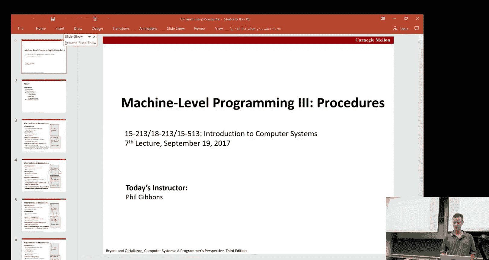
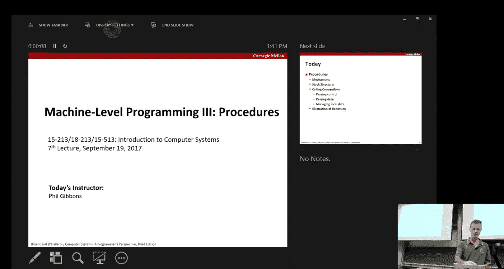
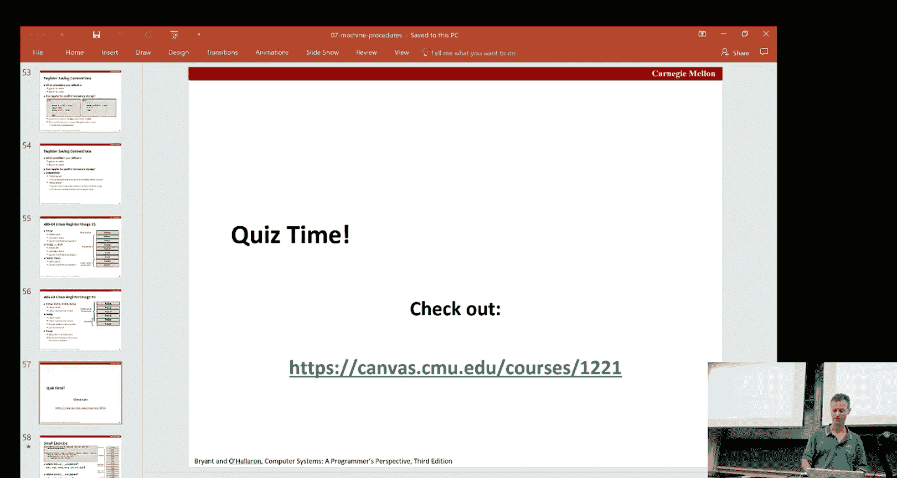
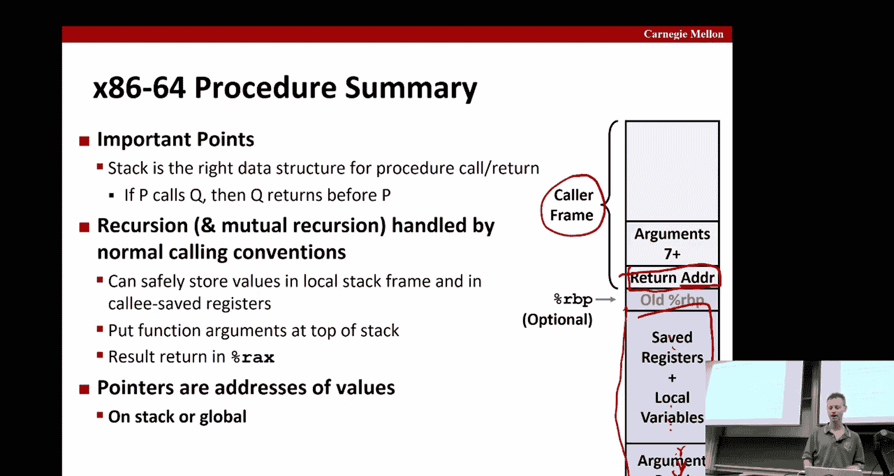

# 计算机系统导论：07：机器编程 - 过程 📖





在本节课中，我们将要学习机器编程中关于“过程”（或称为函数）的核心机制。我们将探讨如何通过汇编代码实现过程调用，包括控制流的转移、数据的传递以及局部数据的管理，并深入了解递归的实现。这一切都建立在“栈”这一关键数据结构之上。


## 栈与栈帧 🧱

上一节我们介绍了条件码和比较指令，本节中我们来看看过程调用的基础——栈。在x86-64架构中，栈是一段用于管理过程调用数据的内存区域，其地址从高向低增长。栈顶由寄存器 `%rsp` 指向。

以下是两个专门用于栈操作的核心指令：

*   **`pushq src`**：将源操作数压入栈。
    *   效果：`%rsp` 减8，然后将 `src` 的值写入 `%rsp` 指向的新地址。
    *   公式：`R[%rsp] ← R[%rsp] - 8; M[R[%rsp]] ← src`
*   **`popq dest`**：从栈顶弹出一个值。
    *   效果：从 `%rsp` 指向的地址读取值到 `dest`，然后 `%rsp` 加8。
    *   公式：`dest ← M[R[%rsp]]; R[%rsp] ← R[%rsp] + 8`

每个过程调用都会在栈上分配一个独立的区域，称为“栈帧”，用于存储其返回地址、局部变量以及需要保存的寄存器值。

## 控制转移：调用与返回 🔄

过程调用的核心是控制流的转移。这通过 `call` 和 `ret` 指令实现。

*   **`call Label`** 或 **`call *Operand`**：调用过程。
    *   效果：将下一条指令的地址（返回地址）压入栈，然后跳转到目标地址。
    *   公式：`pushq %rip 的下一条指令地址; jmp 目标地址`
*   **`ret`**：从过程返回。
    *   效果：从栈顶弹出返回地址，并跳转到该地址。
    *   公式：`popq %rip`

## 数据传递：参数与返回值 📦

为了高效传递数据，x86-64定义了一套调用约定（Calling Convention）。

*   **参数传递**：前6个整数或指针参数依次通过寄存器 `%rdi`, `%rsi`, `%rdx`, `%rcx`, `%r8`, `%r9` 传递。更多的参数则通过栈传递。
*   **返回值**：整数或指针类型的返回值通常存放在寄存器 `%rax` 中。

## 寄存器使用约定 📝

由于寄存器是共享资源，调用者和被调用者必须遵守约定，确保寄存器值不被意外破坏。寄存器分为两类：

以下是调用者保存寄存器，如果调用者希望这些寄存器的值在过程调用后保持不变，它必须自己负责保存（例如压入栈中）：
*   `%rax`
*   `%rdi`, `%rsi`, `%rdx`, `%rcx`, `%r8`, `%r9`
*   `%r10`, `%r11`

以下是被调用者保存寄存器，如果被调用者要使用这些寄存器，它必须在使用前保存其原始值，并在返回前恢复：
*   `%rbx`, `%rbp`, `%r12`, `%r13`, `%r14`, `%r15`
*   栈指针 `%rsp` 也必须被维护。




## 栈帧详解与递归示例 🌀

一个完整的栈帧可能包含以下内容（从高地址到低地址）：
1.  调用者栈帧（如之前的局部变量）。
2.  参数构造区（用于第7个及以后的参数）。
3.  返回地址（由 `call` 指令压入）。
4.  被调用者保存的寄存器（如 `%rbp`, `%rbx`）。
5.  局部变量。
6.  临时空间。

递归是过程调用的一个特例。由于每次调用都会创建新的栈帧，各次调用的局部变量和参数相互独立，因此递归可以自然工作。

考虑以下计算整数二进制表示中1的个数（popcount）的递归函数：
```c
long pcount(long x) {
    if (x == 0) return 0;
    else return (x & 1) + pcount(x >> 1);
}
```
其对应的汇编代码核心部分展示了递归调用时栈帧和寄存器的管理：
```assembly
pcount:
    movl    $0, %eax           # 设置默认返回值0
    testq   %rdi, %rdi         # 测试参数x是否为0
    je      .L6                # 如果为0，跳转到结尾返回
    pushq   %rbx               # 保存被调用者保存寄存器%rbx
    movq    %rdi, %rbx         # 将x保存到%rbx
    andl    $1, %ebx           # 计算x & 1，即最低位
    shrq    %rdi               # x = x >> 1
    call    pcount             # 递归调用pcount(x>>1)
    addq    %rbx, %rax         # 将(x & 1)加到返回值上
    popq    %rbx               # 恢复%rbx
.L6:
    ret                        # 返回
```
在这段代码中，`%rbx` 被用来保存当前层计算的 `(x & 1)` 值。因为 `%rbx` 是被调用者保存寄存器，递归调用不会破坏它，从而保证了每一层递归的中间结果安全。

## 总结 🎯




本节课中我们一起学习了机器级编程中过程（函数）的实现机制。我们了解了栈和栈帧的概念，掌握了 `call`/`ret` 指令如何实现控制流的转移，熟悉了通过寄存器和栈传递参数的调用约定，并明确了调用者与被调用者保存寄存器的分工。最后，我们看到这些机制如何自然地支持递归调用。所有这些约定共同构成了应用程序二进制接口（ABI），确保了不同模块间能够正确、高效地协作。