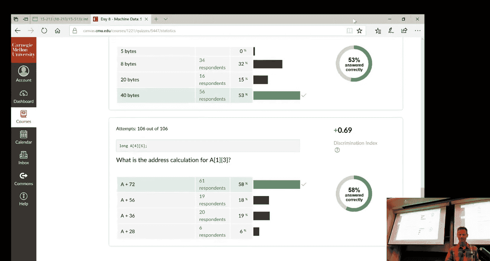
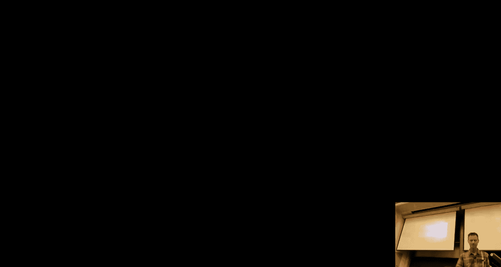
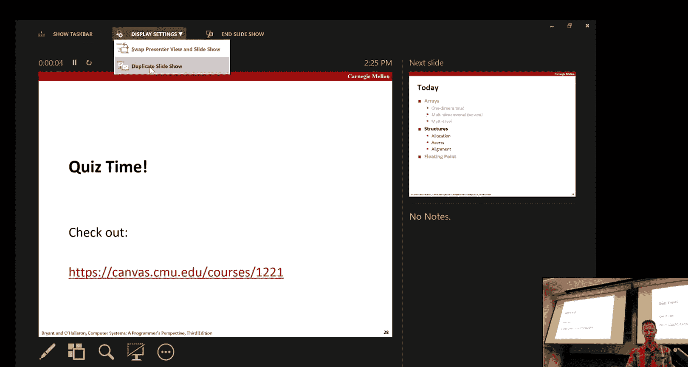
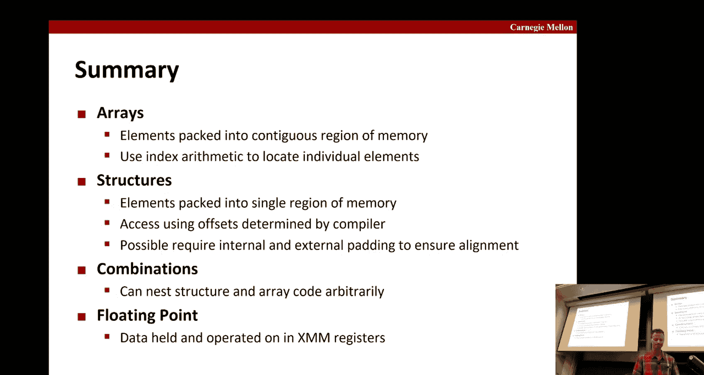

# CMU《计算机系统导论｜CMU 15-213，15-513，14-513 Introduction to Computer Systems 2017 p08 08 - Machine Prog_ Data -BV17jcReyETC_p8-

All right。죠。So today is the fourth of the five lectures on machine level programming。

 and today we're going to talk about data。In particular， we're going to talk about a arrays。

 both one dimensional and nest array， multidimenal arrays， multi level arrays。

We'll spend a see part of the class on those。Then we'm going to talk about structures and the interesting things you need to know about how structures get aligned。

In your code。And then very briefly at the end， we're going to talk about floating assembly floating point registers and instructions。

Okay， so。You're familiar this is C， you've got some。Tpe definition。Okay， and then some array。

And it has all elements。And so we think of that as if this A starts here。At this X right here。

Then the fact that。In this case， there's 12 of them。

And reach a car to reach a bite long means this whole thing ends at x plus 12。Okay以。😊。

Another example， we haves so ints are。Four bytes， and so each of the elements is going to account for four。

 and there's five thems， that's how we get all of next to exp plus 20。

And doubles are exist or eight bytes， and there's three of them， you'll get up to X 24。呃。

What about this one。well， this is it's a car but it's not really a car， right， it's a pointer。

Toclock， right， so it's effective by the spring。Okay so what's allocated here is room for three strings。

Three pointers。Please stress。Okay， so now， given that。

 so let's look at an example here where we have， again， our integer。

R size five integers and it's going to be the zip code digits or the course number digits， 15，2，13。

And it's laid out as accordingly， and now we want to look at some of these references。

 so suppose in the program， you had the reference you know， vow of four。Okay。

 that's going to be a type int and it's going to be，01， two， three， four。

 it's going to be this three。All right， so that's what's shown there。What about if's in the program。

 you just wrote Val and nothing after that？Well， that's going to refer to this entire array。

 so it's going to be a。A pointer。So the dress at the beginning of the array pointed to a bunch of intes。

And in this case， its value is going to be what？Tax， right？Okay， now in C。

 you can do strange things like do arithmetic on these pointers。So if I do VA plus one。😔。

The type is still in star。But where does that jump into？Ex plus。Okay。

 because it knows that you're sort of skipping ahead one in this counterview。Sort about this one。

 so we have Val。two。But then we take the address of that， so what does that going to address？おスペに。

See that that's right， X plus。All right， and what about Val5？That's you tend to be an injury。

 I guess， but what's going to happen？It's off the end right， I mean here's zero1， two， three， four。

 so about five is。This thing here， so who knows if that's going return？What about this one。

 so v plus one？And then we want to de reference through it。気持ち。And what about just vow plus I？Okay。

So in general， v plus I as v plus1 we saw the example earlier， in general。

 since each of these things are ins， then for every eye， we're going to plus four more。

So it's equivalent to your X。Plus four times I so any questions on those？Yes。

So if you do battle plus one。Sa wrong with it incr by heat。Yes。这は子とす？啊。So I guess let's see。

 if you took。Yeah， that would be hard to do and see， right？I mean。

 I guess if you maybe cast this like assign this。😔，So just a normal integer。あ。嗯。Yeah。

 thatll be true I mean it easy enough to do assembly that'll be tricky to do and see anybody have a great idea？

他的啊 you might这得。Make a叉。Okay， that works， okay。So you have a car star。こし。store。

And you originally signed that to x， so it so ver y you the start that x。

 and then you can add one to that that' a good answer yes。诶。Yeah。

 if you had constructed a separate data type， that was a union of this and say a car star you can go back and forth。

 that's true。哎， good。All right， here's another example so we have。You know， we defined。This。嗯。

T called zip digits。And it's five long， and so we could say that CMU， the zip digtits are 15，2， and3。

 MIT， Berkeley， and so forth。And if you see that how that gets laid out of memory。

 as before for any one of these， it's consecutive 20 bytes。

RightNow there's no guarantee that these are adjacent in memory。

 but in this case they happen to be when these was allocated。

 the MIT one started immediately after the CM1 and so forth。Okay。Yeah。

 so not guaranteed that in the general， it's the same year。Okay， but in this case。

 it happened enough。And work out that way。Okay， so now let's suppose we had this routine get digit。

 so you pass it a zip dig。And a digit。 and it returned the digit of that zip。

So if you pass it CMU and the digit one， you would return the five， that's the goal。So you know。

 by convention， right， these are both。Ineg arguments， so this first argument is an RDI。

 the second argument is an RSI。And so that's kind of what's annotated here。

And so in order to extract that digit out， you'd have this code here。So what is this doing Well。

 again， if you're call this is。You take this and you take the product of these two。

So this computes what's shown here。RDI plus four times RSI。

And so that is indeed the start plus the multiple four times however many of the digit ends have being。

You move that into EAX， which again is the low order half of the return register RAX。And so。

ThatThat's how you get the answer， so the nice thing that this entire procedure was just the one instruction。

可以你快起上来。です。Okay， so let's suppose you have this。对。Okay， so we're going to move zero into EAX。

 and then we're going to jump here。 We're going to compare。啊。You know， four response there。

 and we're going to do this branch。And come back up here and then add。

One to this dress calculation so this is。I guess this is Z initially。

And we're going to add four times whatever that's addressing it。And then we're going to。

Add one again and do the comparison and drop off。So anybody have a idea what this is doing？

Where to get for once so。Give the hint。Okay， so here's the comments that we just went through。

What we're doing is we're stepping through this array。

 that array where the elements of the array are four bytes。

 that's where we're stepping forward at time。And then we're comparing to see if we started zero。

' comparing to see how it compares to four， and if less than equal to， we go around a loop。Okay。

 so it's basicallys this。We， we run through the。The five digits of the zip code。

 and we just bump up each gives it by one。Okay。So over the course of this course。

 you should get more and more fast being able to do what we just did with sort of look at the assembly code here。

 maybe draw yourself。有 little烂。You know， annotation style like here， and then from that think back。

 okay， what what's the C code likely to doing， what's this doing， what is this doing？O。

So because there's always so much。People get tripped up so much about arrays of pointers and how they work and so forth。

 we're going to use this class also to drill a little bit more on your understanding of these two things。

So here we have two example declarations we have this。This one and this one。What we want to know。

Is for each of these two examples， will the code compile is possibly a bad point of reference and what is the value returned by size of？

Okay， so。If I refer to if I have this declaration and I refer to A1。In my program。

 will the compiler complain？No， perfectly right this is in class。

What I reference if I do a dereference if I say star they1？okay with that。Yeah， that's fine。啊。

Is there an opportunity that I'm going to have a bad point of reference if I start referring inside？

To this declaration。Another way to think about it is what memory has already been allocated。

 what memory hasn't been allocated just by this declaration。So by this declaration。You get that。

Did you get。This thing that has three ins spaceable3 ins， right。

And so if you refer to any of the elements in this array， you'll be fine， right。

 everything's allocated， it may be garbage inside if you haven't initialized it。

 but at least it's not a bad reference， this is fine。So no。And what if you reference through A1？Okay。

 well， that's just another way of referencing the start of the race， so that's fine as well。Okay。

 what about the size， What is the size of。If I could say size of a1， what am I going to get？Yes。

Right， okay， sos the size of its four bytes we'll get。Okay。What about the size of？This。

 this item here。And everything in this class is on a 64 bit architecture。Well， this is a pointer。

 right？speak。Okay， what about this one here， int of based A2， what is that？Well。

 that's just something that's a pointer。😔，Right， two。All right， so what's final by that declaration？

Certainly the pointer， what about the youth has it been allocated？No， right，It's， it's。

It's just a point we haven't actually allocated what it points to right I can declare a pointer to be a pointer to some huge structure that haven't allocated at all。

 it's fine。It's a perfectly legitimate declarationation， it's just not。I I can remember it， yes。哦。

Go back， go back to like the size of sorry1， like why is that corner。嗯。So you have A1， right？

You do reference it。So。That's a good point， okay， so you get actually the first element of it。

 you're right。the should be。Good。给这个。Okay， all right， so this is going to compile。

 A2 is going to compile。What about star2， you refer that？That should be fine， right？嗯。

A reference A2 is fine， but again， this reference through A2。What's here may not have been eate you。

Okay， what about size， so the size of the entire thing is what？It's a size for a pointer。

 but if I dereence it through what's the size going to be， it's the size for。可。

And if I did this right， then should match。Let's take chart okay good。

 and this started showing pictorially right the picture I just was saying that if the yellow is allocated stuff and the gray is unallocd。

 you can see of have an allocated pointer but an unallocated in here。

 whereas when you define this way you have three allocated ints。Okay， question of that yeah。

 is a one。不岁不。A1 is not。If you do the size of A1， so a1 is a array of size of three in。Oh。

 it's like a pointer， is it not a pointer2 in a array or is it self the array？It's。It's the。嗯。

In some sense， it's kind of both right， it just depends on how you're referring to it。So if you ask。

 if you put in the size of command。A1。It'll interpret that as saying， oh。

 what I want to know is what what is the size of this？嗯。You know， a disarray， right would be it be。

12。哎，呃发生了。Yeah。It。呃。Yeah， so this would be stack allocated。

And then when you do like if you call malik or something to actually allocate what things point to in a be he allocate。

当。Other that allocated。They one track。来。Then can you set8。过系啊。嗯。They2 equal。Day one。So in that case。

 you'll be referring to the pointers and so yeah， you can。Those are。Those your。呃。我有有有。

So that's kind of a different question， right， so where depending on where the。The thing is。Yeah。

 it's allocated， so if you're in the middle of the program and you do that。Cation， if if this。

This is allocated on the stack， then it will point into the same。

place in stack this wasn't before now it may decide that it's like this three was really big。

Then they decide to it on the heat， right？你话啲晒。You can change for and put it based on how large it is。

はい、じじ。That makes judgments about this things，Okay。可能。All right， so。Okay， so here's another example。

All right， so here again， we have a1 of three。And now we want to look at not just whether A1 and star A1 is。

 but like a star star A1。Okay is that legal or not？Okay， so I've already done these。

 this is the same example as before right for these two， but what about the new ones？

So if I have star star A1 in my program， will that compile？The answer is no。Because once you get to。

once you this is type integer， there's no， it's not a pointer。

 so you'd be trying to dereence an integer。嗯。Okay， what about this one so if I have？

So this one kind of interesting， So this is saying I have what's a2， A2 is an array of three。

Things that are pointers to integers， Okay so it actually looks like this， right。

 you've got the three pointers in each of which point integers。Okay， so now if I。

If I do double there of that。What's going to happen？the first reference of A2。You know。

 will get me to。Thisap point to the next one given the end。嗯。And so。This should be okay， right。

But on the other hand， it's going to be bad， right because these haven't been allocated。Right。

This is an interesting case， this is saying I have a。Because of these parentheses， I have a pointer。

To。To an array of three imagess， okay so it looks like this have a pointer。

Two in an array of three integers， none of which have been allocated。And so therefore。

The size of this is just the size of a pointer。😔，Right， if I。De you referenceence once I get to hear。

呃。I get to this whole thing， so the size of this is。Whathy。Three guesses。Gets tricky to hurry， right？

Nobody has a guess。Yes。Okay， so as being 12， but if I de reference again。

 then I'm looking at something that's size4。So these are， I mean， the reason we cover these。

Is that they're confusing？And the more， and I don't expect you to sit here in class if you haven't thought about these things before and be able to figure it out out。

But I think that if you look at problems like this。You know， after class we look at them in the book。

 look at these slides again， and get to the point that you do understand how to fill in a table like this。

Then那 then then调合人。Okay。And this kind of thing is fair game for an exam question， right？Okay。

All right， so let's move on a multidimensional arrays standard the normal way we think about multidimensional arrays is with nest array。

So like here's an example of a two dimension already。So， you know。

 you've seen this I'm sure before there's some type and there's some re name。

 and then you've got some number of rows and some number of columns。Okay， and pictorially。

 you can lay it out like this。You know， rows this way in columns this way。

The total size of this thing is just the number of rows times the number of columns times how many bytes you need to store one of these elements。

第地。Right。Now， important thing to note is that。呃。I have this two dimensional thing and I want to lay it out in one dimensional memory。

So I basically have。A number of different choices on how I want to do that。

But the two that are the simplest to think about are is that I lay out a row and follow with the next row and follow with the next row。

 or I lay out a column and follow with the next column and follow it the next row。Well。

 it turns out that the former is sort of the convention that they get to use。

 and that's called no major order。And so that looks like what's shown here is that the first things that show up in memory。

A this first row。Okay， and the next things that's show in memory are the second room。And finally。

 at the end， the last thing that shows up in this consecutive block of memory is the。The final row。

Okay。Why do you care because you're going to have to address into。

Or understand what's going on when the Asly code addresses into these arrays that how it's doing the calculation and figure out where things are。

All right， so let's look at this example。Let's suppose that。We have。

 we take our sort of one dimensional zip date thing and we create a。An array of those。

Of sizeize four。And so the effect of that is the two dimensional array。And it looks like this。

So we've arbitrarily decidedted this starts at 76 and then it's going to be laid out consecutively。

 each of these， as we know takes 20 bytes， and therefore the four of them take 80 bytes。

 and that's how we end up with 156。可以。All right？Okay。

 so now how do we access things into so we want to access。嗯。An entire row。Okay。

Then how do we get the starting address for that wrote？The starting address for their row jumps by。

However many you need to jump， however many columns there are times the size of the item。

Okay that's what's shown here。So if I have a 10 columns。

Then this jumps by 10 times the size of each elementelle。OkayAnd so if I want to get to row I。

 then multiply that by I。And you can see， another reason why C index is starting at zero right that basically then and I't have to track one off the eye。

 so a sub zero just naturally falls in year。And I' at the eyesrow。

Then it's I times C times4 in this case， I'm showing an example where their integer so it's four bytes。

可し上 that。Okay， so now。So what does the assembly code end up looking like？

So let's suppose that I want to get back just the zips， you know。

The zip code from one of these four places。And so what I do is I wrote this little C function that looks like this。

And。So what is the starting address， what we said， the starting address is always。You know。

 the index you have in mind。And di you have in mind？Times。呃，The。The the size of each element。Okay。

Times times the。Sorry， times the size of each column this is I mean。Okay。

So we said this is 20 bytes and so it's 20 bytes times the index right to get to so in the case of two。

 it's 20 times two or4， so it's the starting address plus 4。可以。So multiplying by 20。

The compiler is smart enough to figure out how to do that in just two steps that don't involve an integen multiply。

 so that's good。The first thing it does is it and it uses our friend the LA。Construction。

ItIf you remember the addressing mode， what it's going to do is it's going to take this quantity here and add it to the product of these two things。

😔，So thatAnd since I gave an RDI in both cases， that's equivalent to multiping what's an RDI by five。

In this case， the indexes is what's in RDI， and so I get five times index here。

And then I use another LEA instruction to first multiply that five again。

Because now sitting at RAX by four， should I get 20？

And then I want to add on the starting address wherever PGH starts。Okay。

 and then I store that already。So then net result is I get exactly the。The address I'm looking for。

Okay。Any questions上来？Yes。8人。还有一点。O。So。There are five elements in a row， right。

 another way saying that there's five columns， one， two， three， four， five。

 and each element is a four byte inger。So five times4。It's20Okay， so if I if whatever this is。

This location here is going to be PGH。Pluss 20。This location here is P GH。Plus， 40 and so forth。

So now let's suppose I don't want just the entire row。

 but I want an element in the two dimensional wave then it's just a simple adjustment I get I compute as before。

To get to the start of the。R I'm interested in， and then I just need to jump over to the element within the row。

So if I'm looking for the J element in the row。Then since again， each element is four bytes。

 I jump over by J timess four。Okay以。All right， any questions on that？对。でもい？I do。A湾。Itll report， yeah。

 it'll just report what's there。没。It。It probably won't complain。

It probably will just return what's there memory， it's similar to any time we go off the end of an array。

It's just going to return what's there we ask for it。定要け。Yes。Yeah。Yeah。

 so in like some of these functions， if you give it a value， that's an index that' way off the end。

 it will。Try it and calculate it。Return what' there， right？So this is just an example。

 you know if you have this C code here， I want to return a particular digit within a particular index。

 and so if I give it if I want PGH11 then it's going to return to this5 and it's going to just do that calculation。

In a very similar calculation showed before。The only difference is that if you recall。呃。You know。

 we said that it's 20 times indextex to get to the start and it's four times the digit within。

 you know the offset within。To get to the next， and so you could factor out this four right because this 20 came from four times five。

 four times C。And so it's always going's exactly four。24。 and so you can， you can。

Calculate like this。And that's what's done here right。

 that basically it first calculates five times intaket plus dig， and then you multiply by four。

And then add add that， make that to address your a to peeons。Okay。

ItIt's just a refactoring of this equation where you pulled a four out。And you， say this is equal to。

诶。Plus。Four times。Hi time C， plus check。可以。And again， this four comes from him。

If this wasn't very advanced， it was raise something else， it would be the size of that。没回事的。

So this is also a multidimensional array， but it's done in a slightly different style。

 it's done as a multile。Okay。Here you can see that we've defined this thing that's。You know。

 three pointers。And we've initialized it to our three different zip codes。

 okay so we had this zip digits for CMU， MIT in Berkeley。

And then when we created this university thing。We initialize it so the MIT。Was ahead of CMU。

 so that's clearly wrong。对不对。So we can fix that now so this should go。You should说O。

But other than that， it's good secret。All right。And so。

So although we can think of this as a two dimensional array。

 the addressing is very different because instead of。

 you know being able to assume something about Romage order。

 which allowed us to do this nice arithmetic calculation of the dress。

 we actually now have to follow these pointers。Right to get what we want。

 And so that makes things more complicated， right， it ends up being you take the。

this part tells you if I have an index into this university thing。Then if if the index is zero。

 that means I'm interested this guy。Index is one， I'm that guy and index is two and that guy。

 since these are pointers， they're eight apart， and so that's why I have to multiply by eight。

And so this right here。Gets you this pointer what's the content of this pointer？

Once you have that pointer， then you know where this whole thing starts。In the CMU case。

 you know now we start here， and now you just want to do treat this as a one dimensional case and just index this you circuit for one dimensional。

 so the fact that these digits are all four bytes each。

You multip applyly it by the number of digits you want to cross right so I want the。You know。

 digit one。Again， it's just a return file。Okay。So you can look at this code more carefully。

On your own， you know it's using a shift to do a multi4 in this case。

 and it has to reference memory twice。So in general， it's going to be a slower way to do it。

Much better to just not have to fetch a pointer to know where you want to access。All right。

 so any questions on that？And this is just the saying same thing。

 so before in order to get the item we did this address calculation and then we fetched here we had to do this intermediate fetch just to get the pointer and then we could get eventually get the value itself。

What the the opt to make。Previous one。It's it。It's tricky right it could。

 the thing it doesn't know is that I mean you may wanted these pointers because you're going to be changing over the course of the program right？

😔， Yeah， if you don't change it， then。Yeah， if they're sufficiently smart to we figure it out。

Beners to try it out to see if it like you put optimization level three， whether it would do that。啊。

I suspect it would take a prettiesus。I suspect not， but maybe。Okay。

 so here's an example where we have that illustrates different ways of indexing into。

Cos for index exceed the matrices。So if I have a matrix that's n by n， but I've fixed n。

 so the compiler knows the size of n， so it's16。Then， I can write things like return AI J。

 and the compiler is going to know exactly can sort of compute that address。嗯。Right off the bat。

 it doesn't have to。Wait to find out how big， you know how many columns they are。

 how many columns there are in order to do some multiplication。

 it just knows it's got to taken and multiply by 16 add this other number。And so。嗯。

So on the other hand。You。If we have variable dimensions。

And so it used to be that you had to sort of do your own index。Okay。

That you had to put something like this in your seat code。

That told the compiler how to find this thing。Okay。But GCC and the last you know。

Four or five years has now done the simpler thing and it sort of allows you to write as you did when it was a fixed to right and is now smart enough to know to do this。

Okay， and the only difference is that you have to make it explicit in the declaration。

 you can't just get away with this one。Because that it really doesn't know what's going on there。

You know， end times end here。Okay， this is what I was saying before that basically if it's known 16 by 16。

 then it can go ahead and shift by 64 because it's 16 times size of nm， which is four。

 so it can do that automatically and that simplifies things。

But the more general case is that it's got to actually do an integer multiply。

 whichs going to be expensive operation to compute the you know the。Compe with。

To do this product with C involved。And so that makes it more。Additional instructions。

 more cycles to do。Okay。So any questions on that？嗯。So this you can look at this leisure。

 basically this is just helps you with your understanding of how this all works。

 we've got this initialized right here， we've got different ways that we've referred to it。

 and then we have this funky expression。That's really bad code。But it does return nine。

 and the reason it returns nine is highlighted here that basically the thing in red gets you this digit。

 the thing in purple gets you this digit and so forth。Okay。

So you can look at that on your own and see test your understanding of how these things play together。

And again， know it's a mess， right C can be very。Very much a challenge to understand how these things work。

So we want you to work on your understanding。这上结说。Okay， where time？す大。Can you see it or to do？やってやって。

All right， that's goes， okay， turn out。You have do're a little bit of arithmetic on these questions。

All right， well some folks are finishing up， let's see how people did。All right。

 so people did pretty well in the first one。Okay， I try to trick you up a little bit by switching the roles of RDI and R side。

Examp you did。嗯。But basically， again， it's the long dictate why there should be an eight。And the。

You want the eight to multiply by the index， not the base。And that's why it's。

In that second position in the address board。Okay， so here we have A。

Which is an array of five pointer integers。So A is five pointers， each pointers， eight bytes。

So40 bites。Okay。Was it tricky？呃。All right， this one， people did pretty well as well。Basically。

Because it's a long， it means we're jumping by eight bitetes at a time。And you want to。

You want to compare。You want to be able to compute。嗯。1。Times。The size of each。哎看 on。Bach rows。

 there's six columns。And each of them is。8 bites。And then you want to go over。3。

Within that and each of those are eight points。Okay， so that's 72。一块是在哪？All right， good。

よし。

Okay， so let's talk about structures， so if you're familiar with sea structures。呃。This should。

Make some sense here， so we have this structure consists of these different things。

 The first thing is an array of four integers。So R。

 if we have a structure and it's initially addressed R。

 then we'll just look at the offsets from the beginning。So A gets laid out starting to at zero。

 and it goes all the way to 16 because there's four， me sure of them are four bytes。Okay。

 so inside here。It would be the four different integers。All right， I is laid out next。

And it goes here。And then this pointer is laid out here and we need eight bytes per point。Okay。

And notice that they get laid out in memory according to the order in which you set them up here。

Okay。Now suppose you wanted to access somewhere within the structure。

 so let's suppose you wanted to access one of these array elements like the index the one。

Right right。Then as shown that gets computed as the star plus four is we're doing with integers times the index。

Okay， so let's suppose you had some C code like this that was interested in looking at the。You know。

 an index element off of the ray， but then returning the address is not the element itself。

 so it's actually wants you to return。呃。This calculation。

And so because you're trying to return the address。

 we're going to use this LEA and do the thing we've been doing before right for these get multiplly out of that and you get exactly this expression。

Okay。All right， so this one's more interesting so suppose we have this。You know。

 a linked list of these structures。So now what we're trying to do here is we have a routine that takes a。

You know the start the link list and wants to set。It these就呃 each the。AR elements to this bow。上一个。

Yeah， it to the valve。So what's going to happen here is you while。

This pointer that we're passing is not no we want to。Set I to be whats in here。

So copy that and then whatever items in here。Between choose 01，2 and three。

 we want to go reference that item in here。And then set the vow for just that particular item。

And then we want to go to the next one。Okay so depending what this eye is。

 we will set a different element in that little array and we'll proceed through the list until we at the end of the list in which case we've got a mill winner and drop out loop。

Okay。So， you know， the R is going to be passed in RDI and valves going to be passed in R side。

And the assembly code end it looking like this。Okay。

 the first thing we're going to do is we're going to。Take 16 pass R。And this moves。

 we're actually going to fetch what's there。And put it in reX， okay， so our's here， 16 plus rs here。

 and so that has the effect of fetching this eye。sticking in this register。Now。

 we're going to take the。The道。Okay， which is in RSI。Oh because it's only an int。

 we know it's only going to use up the first four bytes so we're going to use the。

The shorter form is this expression where we use the long and we use the ESi。

 which is the lower half。Of RSI。Okay， so we're going to take that vow and we're going to stick it where we're going to stick it。

In this address here。Which can be calculated as follows， right？So we have our eyes is here。

We multi it by four and we add it to R。I is still in RDI。Okay。

 so that's how we get the address we store into that address。Now we want to do this point of chase。

 so we take the current R。And we。The current point R。

 you replace it with a pointer that's found 24 past dollars is basically this next point。

So this has the impact of。Assigning R to be whatever the next was before。

Then we have our test to see if that's a null pointer， and if it's not null。

 then we're going to loop again。Okay。All right， so it gives you again a little bit of a flavor of how theses going to look in your code if you write code like this or you're asked to understand code like this。

Any questions on this Jess ofs？So that was nasty to started。Excellent question。

 we're about to get to that。Good good observation。 So so the question is， why did we。

Set aside eight bytes。In this structure for something that we knew was only four bytes。Okay。

 Eagleagle eye spotted that。And the answer is alignment。Okay。

So we're going to spend the next few slides talking about alignment。嗯。So in aligned data。

 if you have a primitive data type that requires cap bites。

 then the address in which it sits in must be a multiple of k。So here's an example。So。

This is what it would look like if it was unallied if you just plopped a well down。Okay。

 that would be illegal as assembly code， right？The proper assembly code looks like this。

You have this character。That's fine。Now you look and you say， oh。

 I have this thing that's a array of integers。Well， I know I need four bytes for integer。

So back here， before I did the proper alignment， if I wanted to reference that integer。

 I had to reference this thing that was know p plus1 to p+5。Okay， and that's。More expensive。

To reference turns out， so instead you have this convention that you it's got to be on a multiple four so you start at people plus one you go to the next。

嗯。P plus the next one that's going to be moved before。

So here I forgot to mention that we're starting off in this case with P being a multiple eight。Okay。

 so this will work out。 So now this starts at zero， so this is 4 p plus4。 so that's a mobile4。

 so now I can lay out these two。And now I've got to come to this thing that's a double。

So this double is eight bytes， so I need to lay it out at some places a moable8 bytes Well this thing here isn't。

 this is P+12， right？And since P is a one8， peoples 12 is not。

But P plus 16 is the first place that is a multiple beat。And so again。

 I have this wasted space and then I can lay out view。Okay。All right， so a little bit more on that。

Okay， so this is talking a little bit about the motivation。The weight the system。

architectureure is all about making the common case fast。

And so the common case is that you don't have these structures and things are aligned like an array is a common case。

 you list if it's going to be an array of longs， it's going to be eight bytes， eight bytes。

 eight bytes， as long as I start the allocation for this array and eight by boundary。

 then everything's going to be aligned。And so when things are aligned。

 then I know I can just go and fetch it from。From memory。

 and I don't have to have in my architecture sort of the ability to fetch any consecutive eight bytes starting anywhere right I can just say okay。

 it's going to this eight bytes， this eight bitetes。

 the eight bitetes and that's easier to implement and that's the common case so it can run fast。

Okay there's issues for instance， that further issues about if you cross cash lines， so cash lines。

 we'll talking about caches later in this course， if you're not familiar with it right typical machines have 64 byte cash lines。

That's how things had move between memory and caches， and so again。

 if I don't do proper alignment and I happen to have something that's even though it's kind of small。

 actually crosses it across two cache line boundaries。😔，That's a mess。

 I've got to fetch two cash lines just to get the values that want。

And that can cause all sorts of problems and setting up a granularity。

 the operating system deals with memory in 4 kilobyte pages typically。

 and if you're not properly aligned， you might have some relatively small data item that spans two pages and again that's just a lot of inefficiency。

 if I'm going to have to fetch private page of something。

 and now instead of getting one page after the two pages。

 even I only one of this little bit of data that happened to span two pages。

So for all these reasons and others， the aligned data is a good thing， the compilers know this。

 and so they automatically insert the gaps that we showed previous this thing。Okay。

So another way to think about the alignment requirements is shown in this slide。

 so if I have a character， I'm fine， I can put it anywhere if I have something that's two bytes long。

 like a short。Then you know if I say the address must be a multiple of two。

 that's equivalent to saying that the lowest ability address must be a zero。

 four bytes means the lowest two orders must be zeros and 8 bytes， of course。

 means the lowest three orders， the address zeros。As long as that's true。

 then I know that it just is a lot。If there any questions on that？嗯。

So let's revisit this example again。So given this， the comprietor will lay this out such that each of the individual items get their proper alignment。

Okay。But， also。You need the overall structure to be placed in alignment boundaries。

 So the reason this ended up being multiple8， I said this is placeable length。

It's because what happens is the compile looks， and for each of these guys here。

 it says the largest alignment requirement， let's called that K was multiple v。😔，Okay。

 it happened't be dispute。And so therefore， the initial address and the entire structure length must be multiple。

So the reason this has to be aligned to Mo vague is because K is 8 in this case。

And this particular example would happened to end in a moate， but if it didn't。

Then the compiler paths it out to make sure it ends at a moment date。 So in other words。

 the next one wouldn't be able to start until the next。model的。The next， whatever you allocate。

 whether it's a array of these things and services is the next copy of the structure or just whatever the next thing。

Okay， questions in that。Yes， so that be true， even if for the last element were a char。

 just like to be safe。In case the next thing。So so I pa it to be a multiple of eight doesn't have anything to do with the fact that the element itself was of size A。

It has to do with the fact that the next element could be size eight potentially。嗯。Well。

 so what we're doing is we're taking the max of all the alignment requirements right。

 so it so happened here， the V was at the end。But， if I reordered the structure。

 so that maybe the B was in the middle。And these guys are at the end， it wouldn't matter。

 it would still have to be multipleable to it。Because it's based on the largest thing in that。

Not the last thing to show。对。Other questions。Okay， so here's an example that。

The exact instruction it reordered。And so V came first。

The integers need to be aligned at boundaries of four， turns out they're aligned in boundary of A。

 so we're good， what will be。So we didn't have any pattern there。

 a character can go anywhere at once， and so the only padding I need in this case was to make sure that the thing ended at a multiple rate because again。

 eight was the largest。Allignment requirement。Okay， so you could see that this went to P+ 24。

And this went to P+ 24， so we actually in these two cases it worked out。

 but you can imagine that you have。If you happen to lay things out in your structure in a poor way。

 you can actually create a lot more padding than otherwise。

 and so what the compiler will do or so what you can do as a programmer is you can think about these and help the compiler by by putting these in order that's conducive to less patentdding。

Okay or a really smart compiler might be able to figure about it as well。嗯。Yeah。

 this is just saying that if I have an array of these things， then again。

 by having them I'll be multiples of the right thing。Then。Each of them will。Right， I mean。

 so we said a0 has got to be a multiple of eight。And since this thing is a multiple va。

 that I know the starting point here is a multiple va and therefore this thing。

Even even though the layout is relative to。To one another right so so the layout within this guy is just relative to itself。

 it all flows together nicely because of the fact that this ended at the right middle。

And so then this one will know it starts the right place and so forth。

Okay so you pat out a race and make sure this happens according to rules and then it all works out nicely。

Great。And similarly， based on the padding will affect the addresses you see。

So you're going to you may see unexpected addressing because if you don't account for the kind of pattern that's going on in your structures。

Okay so that's something to watch out for in your。给你说。All right， you can see that in this example。

 I won't go through it。The only thing that's interesting about this example that I haven't covered yet is that this thing here it shows as。

Is8 plus8 is the offset。嗯。For the thing you're interested in？And you know。

 we're used to sing just like A， but you can also do。

Expressions such as this and the linker will resolve all this addresseses so before the。

COode actually gets executed， this would be replaced by just a single number， right。

 a single address。😔，Okay。So it's kind of what we've seen before we've had the shorthand that we just put an A here and we know that wherever a gets loaded in memory。

 that's the address that would be put there by the time the code executes。

 this is just showing that you can do a little bit of arithmetic on the way as well and so you might see that in your。

Assembly code， by the time it gets to the machine code with the bitetes and such and gets all meant。

 then that'll be going。All right， so here's what I was touching on earlier。

 you can save space a good rule of thumb for saving space is it always works if you put the largest data types first。

Okay， so in this case， it's the largest one。I put the large one first。At least two。No worst pattern。

You给。If you're so inclined， you can try to prove that for yourself formally， but it works。

So this is the kind of question that we'd love to throw on literature。Ittenly on the final。

So we'll give you one of these structures。And we'll say。Laid out of memory。Okay。

And so you come and you say， oh， I've got this car。

 so I'm going to put it here and then I've got this long and what do I know about longs？Right。

 they got to be multiple of。诶。So that means I've got to go， it says one， two， three， four， five， six。

 seven。这点な。And then I can start B， right？Yeah， so that's a one eight。So longs are take up all eight。

And this think of as memories just wrap around。It just wouldn't fit on a page if we ran off this way so now I've got a float so it needs to be a multiple of four well I've got I've got that right more weight so I've got a multiple of four。

Now I've got a car。All right， what are the line requirements in car？Can go anywhere。 else is the。

Three of these。Now I've got a pointer to it。So what's more I need to align that on？eight all right。

 so I need to do it here。That's the next oneator， so that's passed。Then I have a short。

 so that's just going to take up two。Oh sorry， no it's pointed to as short。

 so how much that can take on？All right， now do I need to add any padding at the end？

So common mistake is we we've got padding at the end， do I need any any padding at the end of this？

No， because this is， I mean， the Moate boundaries are here。Thank here。

So we're good and the largest thing was Mo be。Okay。The。All right。

 so that's just what we went through。2。Then the question will say， okay， now let's be smart about it。

 let's rearrange the elements to do better。Okay， so here you figure out， okay， what's？You know。

 what's something that's？There's more than one answer guess of course。

But let's take the first thing that requires an eight bitete。Th to be B， so I put that first。

Thank you feel for price me。And now let's find another thing that's long， how about these pointers。

All right， reporters next。And then the other pointer。All， so now I'm done with that。Then what's next。

 I guess maybe with the float， the next largest。Okay， and now I've got these cars。え？D几D。All right。

 and do I need out of padding？No， so you can see it compared to this。It's a lot better， right？

See may to make any mistakes。对对对。Okay， any questions on that？Yes， so when we actually take care like。

We actually prepare star。やない。帮我打。问清。My boy the after hours。Will we declare care like个 value。

If if you so well， this is just a type up， but somewhere in your program you you have， you know。

 food。呃。You have tight food and let's call it my food。

Right and so and then maybe right after that in the program， maybe you say， I have an int。And it's X。

So it will lay out through， and then it will lay out x right after that。对。2。Real quickly。

We've got a few slides on the floating point we need to finish。So floating point。

SSE is the type that's supported on the shark machines。

The more recent Intel machines have something called AVX。

 The main difference is that the sharp machines， the SS instructions。I have 16 bite registers。

 whereas AVX has double that， they have 32 bite registers。

And there's a nice figure in the book of that。So there are separate registers thus far in this course。

 we've only been talking about energy registers。The fo point registers all have names XMM，0 x MMM1。

 and so forth。There are 16 of them all in all。Now， an interesting thing about them is that they're 60 bytes long。

 but the program is allowed to and instructions will look at them and it's allowed to think of them as a bunch of smaller registers。

😡，So for instance， I could take a single 16 by register， this is one register。

 let's let's say this was XMM0。O。I could think of that as storing 16 different sbyte integers。

 so if I have a bunch of small numbers， three，4，1， two， and so forth。Okay。

 and I can operate there are instructions that operate independently on each of these。

Or I can think of that as eight， 16 bit integers， so a couple of shorts right， or 432 bit integers。

All， so I could have my normal endts in each of these places， right？

And it's just a way of introducing sort of Cdy stop parallelism。

 right I can now do a single operation on four ins at a time。

 four32 minutess a time or single operation on 16 single byte integers at a time。Similarly。

 you can do the same thing for floats， you can have four single precision floats。

Or two double precision flows。If you don't want to use the parallelism。

 you can also just do there's based on the instruction。They would just use the first。

F or eight bikes in the register in Northwest。Okay可以。So it's a little bit。ItT some get a used to。

 but it's nice if you ever have to。A lot of Cdy perils and you want to take advantage of。

And that's stuffed these operations。You can do an operation that just combines two registers。

Like this operation here takes the quantity in this register here and adds the quantity this register and stores it in here。

Okay， that's kind of what we're used to， but if you have this P here， then it says， oh。

 I'm going to take four of these guys and do that same operation parallel。And similarly。

 for double precision， there's a version that just does the lower order parts and there's a version that does both them at。

Okay。嗯。If you have function calls， remember we've been talking about the initial arguments and the first six are passing registers。

Here， the arguments are also passing registers， but they're passing the X amount variance of its registers。

And instead of returning an REX， the returning result is in if you're returning a floatloat is in the zero。

Ex am member register。And alwayss are called lure saves， right if you want the value。

 when you come back， you better scroll away somewhere。嗯。Okay， good。

And memory referencing is very similar， but it has special op codes that deal with the floating point versions。

But conceptually it's actually pretty much the size you do move。

 you give it an address and you move it into another  floating4 register。嗯。

And then there's the ones that sort of do conversions。

 like if you go from a floating point register to energy register and so forth。

 then there's different opcos for that。But it all works out it's all sort of the same notion you've just got to get used to seeing two different things one is。

The use of floating pump registers instead of the entry registers。

 and the other is that these SI instructions， so you can do a bunch of things in parallel now。So， I。

Don't think in this course， you're going to use these。In any of your assignments？

But maybe you can find a way in one of the later labs to speed up code using these。

You know give be interesting， okay。Ts of different instructions， again。

 we're not highlighting that much in this course。Including comparison instructions。Clsizes。Okay。

 so that's today's class， we're talking about a raise。

